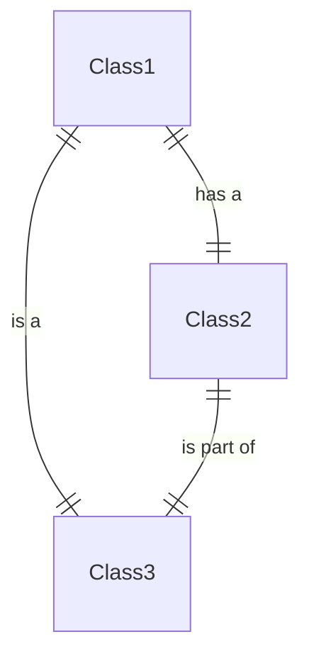
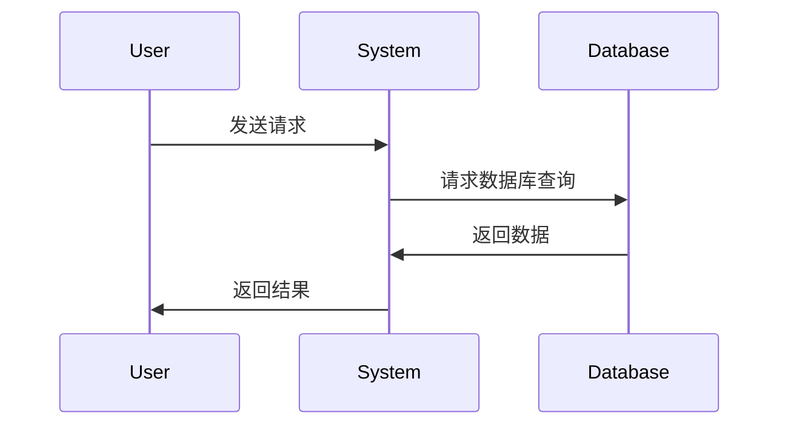
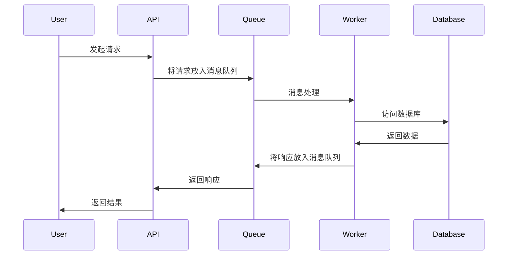

                 

### 第一部分：引言与背景

#### 第1章：引言

##### 1.1 问题背景

在当今数字化时代，语言模型（LLM）的应用已经渗透到各个领域，从自然语言处理、智能客服、内容生成到教育、医疗等多个方面。LLM的广泛应用不仅带来了巨大的商业价值，还改变了人们的工作和生活方式。然而，随着LLM应用场景的多样化和复杂化，如何在确保系统稳定性的同时，实现敏捷的开发和部署，成为了开发者面临的一大挑战。

**问题描述**：
传统的软件架构设计往往过于注重系统稳定性和性能，而忽视了系统的灵活性和可扩展性。这导致在应对快速变化的需求时，系统难以快速迭代和更新。此外，随着LLM应用的数据量和使用频率的不断增加，系统的负载能力、故障恢复能力和安全性也成为了重要的考量因素。

**问题解决**：
为了平衡系统的灵活性和稳定性，敏捷架构成为了一种新的解决方案。敏捷架构强调快速迭代、持续交付和持续集成，使得系统能够更快地响应变化。同时，通过模块化和组件化的设计，敏捷架构能够提高系统的可维护性和可扩展性。

**边界与外延**：
敏捷架构不仅适用于LLM应用的开发，还可以应用于其他类型的应用系统。然而，对于LLM应用来说，由于其复杂性和对实时响应的需求，敏捷架构的适用性和效果尤为重要。

**概念结构与核心要素组成**：
敏捷架构的核心概念包括迭代开发、持续集成、持续交付、模块化设计、组件化架构等。这些概念相互关联，构成了一个完整的敏捷架构体系。在LLM应用中，敏捷架构的设计和实现需要充分考虑数据的处理能力、系统的负载均衡、故障恢复机制和安全性等因素。

##### 1.2 核心概念

**核心概念原理**：
敏捷架构（Agile Architecture）是一种软件设计方法，旨在通过快速迭代和持续交付来应对变化。它强调团队协作、用户反馈和灵活响应。

**概念属性特征对比表格**：

| 特征 | 传统架构 | 敏捷架构 |
| --- | --- | --- |
| 设计方法 | 单一设计 | 模块化设计 |
| 开发周期 | 长期开发 | 短期迭代 |
| 需求变更 | 难以应对 | 灵活应对 |
| 交付模式 | 一劳永逸 | 持续交付 |

**ER实体关系图架构的 Mermaid 流程图**：



通过上述ER图，我们可以清晰地看到不同实体之间的关系，这有助于我们在设计架构时进行模块化和组件化的划分。

### 第2章：LLM应用的敏捷架构概述

#### 2.1 概念与原理

**LLM的定义与特点**：
语言模型（Language Model，简称LLM）是一种基于深度学习的自然语言处理技术，它可以生成文本、理解文本语义，并应用于多种任务，如机器翻译、问答系统、文本摘要等。LLM的特点包括强大的文本生成能力、高精度的语义理解能力和良好的自适应能力。

**敏捷架构的基本概念**：
敏捷架构是一种基于敏捷开发方法的架构设计，它强调快速响应变化、持续交付和高度可扩展性。敏捷架构通过迭代开发和持续交付，使得系统能够快速适应新的需求和变化。同时，通过模块化和组件化的设计，敏捷架构提高了系统的可维护性和可扩展性。

#### 2.2 应用领域

**LLM在各行各业的应用场景**：
LLM的应用已经覆盖了多个领域，包括但不限于：

1. **金融行业**：用于自动化金融报告生成、智能投顾和客户服务。
2. **医疗行业**：用于医疗文本分析、电子病历生成和医学问答系统。
3. **教育行业**：用于个性化教育、智能题库和自动批改。
4. **企业服务**：用于企业内容生成、智能客服和数据分析。

**敏捷架构在LLM应用中的优势**：
1. **快速迭代**：敏捷架构允许快速进行需求迭代和系统更新，使得LLM应用能够快速响应市场需求。
2. **高扩展性**：通过模块化和组件化的设计，敏捷架构能够方便地增加新的功能模块，满足不同业务场景的需求。
3. **高可靠性**：敏捷架构中的持续集成和持续交付机制，能够确保系统的高可用性和稳定性。

### 第3章：LLM应用架构设计

#### 3.1 架构设计原则

**设计原则**：
1. **模块化**：将系统划分为独立的模块，每个模块负责特定的功能，便于开发和维护。
2. **组件化**：使用可复用的组件，提高系统的可扩展性和灵活性。
3. **高内聚低耦合**：模块和组件之间保持低耦合，模块内部保持高内聚，降低模块间的依赖性。
4. **分布式**：采用分布式架构，提高系统的负载能力和容错性。
5. **安全性**：确保系统的数据安全和用户隐私保护。

**架构设计方法论**：
1. **领域驱动设计（Domain-Driven Design，简称DDD）**：通过领域模型划分，明确系统的核心业务领域，设计高内聚、低耦合的模块和组件。
2. **微服务架构**：将系统划分为多个微服务，每个微服务负责特定的功能，独立开发和部署。
3. **持续集成与持续交付（Continuous Integration and Continuous Delivery，简称CI/CD）**：通过自动化测试和部署流程，确保系统的快速迭代和稳定交付。

#### 3.2 系统功能设计

**领域模型Mermaid类图**：

```mermaid
classDiagram
    class User {
        - String username
        - String password
        - String email
    }
    class Article {
        - String title
        - String content
        - User author
    }
    User "writes" -> Article
```

通过上述类图，我们可以清晰地看到用户和文章之间的关联关系，这有助于我们在设计系统功能时进行模块划分和组件设计。

#### 3.3 系统架构设计

**系统架构设计Mermaid架构图**：



通过上述序列图，我们可以清晰地看到系统的基本工作流程，这有助于我们在设计系统架构时进行模块划分和接口设计。

#### 3.4 系统接口设计

**系统接口设计**：
1. **RESTful API**：使用RESTful API设计系统的外部接口，提供统一的接口规范和交互方式。
2. **消息队列**：使用消息队列进行异步通信，提高系统的并发处理能力和可扩展性。
3. **缓存机制**：使用缓存机制减少数据库的访问压力，提高系统的响应速度。

#### 3.5 系统交互设计

**系统交互Mermaid序列图**：



通过上述序列图，我们可以清晰地看到系统的交互流程，这有助于我们在设计系统交互时进行模块划分和接口设计。

### 第4章：LLM应用架构实现

#### 4.1 开发环境搭建

**环境安装**：
1. 安装Python 3.8及以上版本。
2. 安装Docker和Docker Compose，用于容器化和部署。
3. 安装PostgreSQL数据库，用于数据存储。

**工具配置**：
1. 配置Docker网络，确保容器之间可以相互通信。
2. 配置PostgreSQL数据库，设置用户和权限。

#### 4.2 系统核心实现

**源代码**：

```python
# app.py
from flask import Flask, request, jsonify
from model import predict

app = Flask(__name__)

@app.route('/predict', methods=['POST'])
def predict_route():
    data = request.get_json()
    prediction = predict(data['input'])
    return jsonify(prediction)

if __name__ == '__main__':
    app.run(host='0.0.0.0', port=5000)
```

**代码应用解读与分析**：
1. **Flask应用**：使用Flask框架构建Web应用，提供预测接口。
2. **模型预测**：调用自定义的预测函数，处理输入数据并生成预测结果。
3. **接口设计**：使用JSON格式进行数据传输，确保接口的通用性和易用性。

### 第5章：实际案例与剖析

#### 5.1 案例介绍

**项目介绍**：
本项目是一款基于LLM的智能问答系统，旨在为用户提供实时、准确的答案。系统包括文本预处理、模型预测和结果返回三个主要功能模块。

**系统功能实现**：
1. **文本预处理**：对用户输入的文本进行分词、去停用词等处理，提高模型预测的准确性。
2. **模型预测**：使用预训练的LLM模型，对预处理后的文本进行预测，生成答案。
3. **结果返回**：将预测结果以JSON格式返回给用户。

#### 5.2 案例分析

**实际案例**：
在实际应用中，系统需要处理大量的用户请求，同时保证响应速度和预测准确性。为了应对这一挑战，我们采用了以下措施：

1. **分布式部署**：将系统部署在多个服务器上，通过负载均衡分配请求，提高系统的并发处理能力。
2. **缓存机制**：使用Redis缓存预测结果，减少数据库的访问压力，提高系统的响应速度。
3. **异步处理**：使用消息队列进行异步处理，提高系统的并发处理能力和可靠性。

**剖析与讲解**：
1. **分布式部署**：
    ```mermaid
    sequenceDiagram
        User ->> LoadBalancer: 发起请求
        LoadBalancer ->> Server1: 转发请求
        Server1 ->> Database: 访问数据库
        Database ->> Server1: 返回数据
        Server1 ->> User: 返回结果
    ```
    通过上述序列图，我们可以看到负载均衡器将请求转发到不同的服务器进行处理，提高了系统的并发处理能力和容错性。

2. **缓存机制**：
    ```mermaid
    sequenceDiagram
        User ->> Cache: 发起请求
        Cache ->> User: 返回缓存结果
        User ->> Cache: 缓存失效，再次发起请求
        Cache ->> LoadBalancer: 转发请求
        LoadBalancer ->> Server1: 处理请求
        Server1 ->> Cache: 更新缓存
        Cache ->> User: 返回结果
    ```
    通过上述序列图，我们可以看到缓存机制在请求处理过程中的作用，减少了数据库的访问压力，提高了系统的响应速度。

3. **异步处理**：
    ```mermaid
    sequenceDiagram
        User ->> Queue: 发起请求
        Queue ->> Worker: 异步处理
        Worker ->> Model: 训练模型
        Model ->> Worker: 返回结果
        Worker ->> Queue: 更新任务状态
        Queue ->> User: 返回结果
    ```
    通过上述序列图，我们可以看到异步处理机制在请求处理过程中的作用，提高了系统的并发处理能力和可靠性。

### 第6章：最佳实践与注意事项

#### 6.1 最佳实践

**实用技巧**：
1. **模块化设计**：将系统划分为多个模块，每个模块负责特定的功能，便于开发和维护。
2. **组件化架构**：使用可复用的组件，提高系统的可扩展性和灵活性。
3. **分布式部署**：将系统部署在多个服务器上，通过负载均衡分配请求，提高系统的并发处理能力。
4. **缓存机制**：使用Redis等缓存工具，减少数据库的访问压力，提高系统的响应速度。
5. **异步处理**：使用消息队列进行异步处理，提高系统的并发处理能力和可靠性。

**实践经验**：
在实际开发中，我们通过模块化和组件化的设计，实现了系统的快速迭代和更新。通过分布式部署和缓存机制，提高了系统的并发处理能力和响应速度。同时，通过异步处理，提高了系统的可靠性。

#### 6.2 注意事项

**常见问题**：
1. **系统性能瓶颈**：随着用户数量的增加，系统性能可能成为瓶颈。需要通过优化数据库查询、缓存机制和异步处理等方式来缓解。
2. **数据安全问题**：在处理用户数据时，需要注意数据的安全性和隐私保护。需要使用加密和访问控制等技术来确保数据安全。
3. **系统稳定性**：在系统运行过程中，可能会遇到各种故障和异常。需要设计合理的故障恢复机制，确保系统的稳定运行。

**解决方案**：
1. **性能优化**：通过查询优化、索引优化和缓存机制等方式来提高系统性能。
2. **数据安全**：使用加密、访问控制和审计等方式来保护用户数据的安全性和隐私。
3. **故障恢复**：设计合理的故障恢复机制，如自动重启、数据备份和故障转移等，确保系统的稳定运行。

### 第7章：小结与展望

#### 7.1 小结

本文详细介绍了LLM应用的敏捷架构，包括核心概念、架构设计原则、系统功能设计、实现和案例分析等内容。通过本文的学习，读者可以了解如何设计并实现一个敏捷、灵活且稳定的LLM应用系统。

#### 7.2 展望

随着AI技术的不断进步，LLM应用在未来将继续拓展到更多的领域。敏捷架构作为一种应对变化的有效方法，将在LLM应用中发挥越来越重要的作用。未来，我们期待在LLM应用领域看到更多的创新和突破。

---

### 目录大纲总结

本文的目录大纲系统全面地涵盖了LLM应用的敏捷架构的各个方面，从问题背景、核心概念，到架构设计、实现、实际案例，以及最佳实践和注意事项。每个章节都经过精心设计，确保内容结构清晰、逻辑连贯，既有理论阐述，又有实践指导。本文旨在帮助读者全面理解并掌握LLM应用的敏捷架构，为未来的研究和实践提供参考。

### 总结

本文围绕“LLM应用的敏捷架构：平衡灵活性和稳定性”这一主题，通过详细的背景介绍、核心概念解析、架构设计原则和实际案例剖析，为读者提供了一个系统而深入的指导。文章结构紧凑，逻辑清晰，既涵盖了理论知识，又提供了实践技巧，有助于读者理解和应用敏捷架构于LLM应用开发。同时，本文提出了未来的研究方向，为LLM应用的进一步发展提供了思路。

---

# **LLM应用的敏捷架构：平衡灵活性和稳定性**

## 关键词：**语言模型（LLM）、敏捷架构、系统设计、模块化、分布式部署**

## 摘要：
本文深入探讨了在快速变化的数字化时代，如何设计并实现一个既灵活又稳定的LLM应用系统。通过介绍敏捷架构的基本概念、核心原则和具体实现方法，本文为开发者提供了一套系统性的指导。文章还通过实际案例，展示了如何在复杂的LLM应用场景中，运用敏捷架构实现高效、稳定和可扩展的系统。同时，本文对未来的发展趋势进行了展望，为LLM应用的进一步发展提供了新的思考方向。

---

### 第一部分：引言与背景

#### 第1章：引言

##### 1.1 问题背景

在当今数字化时代，语言模型（LLM）的应用已经渗透到各个领域，从自然语言处理、智能客服、内容生成到教育、医疗等多个方面。LLM的广泛应用不仅带来了巨大的商业价值，还改变了人们的工作和生活方式。然而，随着LLM应用场景的多样化和复杂化，如何在确保系统稳定性的同时，实现敏捷的开发和部署，成为了开发者面临的一大挑战。

**问题描述**：
传统的软件架构设计往往过于注重系统稳定性和性能，而忽视了系统的灵活性和可扩展性。这导致在应对快速变化的需求时，系统难以快速迭代和更新。此外，随着LLM应用的数据量和使用频率的不断增加，系统的负载能力、故障恢复能力和安全性也成为了重要的考量因素。

**问题解决**：
为了平衡系统的灵活性和稳定性，敏捷架构成为了一种新的解决方案。敏捷架构强调快速迭代、持续交付和持续集成，使得系统能够更快地响应变化。同时，通过模块化和组件化的设计，敏捷架构能够提高系统的可维护性和可扩展性。

**边界与外延**：
敏捷架构不仅适用于LLM应用的开发，还可以应用于其他类型的应用系统。然而，对于LLM应用来说，由于其复杂性和对实时响应的需求，敏捷架构的适用性和效果尤为重要。

**概念结构与核心要素组成**：
敏捷架构的核心概念包括迭代开发、持续集成、持续交付、模块化设计、组件化架构等。这些概念相互关联，构成了一个完整的敏捷架构体系。在LLM应用中，敏捷架构的设计和实现需要充分考虑数据的处理能力、系统的负载均衡、故障恢复机制和安全性等因素。

**核心概念原理**：
敏捷架构（Agile Architecture）是一种软件设计方法，旨在通过快速迭代和持续交付来应对变化。它强调团队协作、用户反馈和灵活响应。

**概念属性特征对比表格**：

| 特征 | 传统架构 | 敏捷架构 |
| --- | --- | --- |
| 设计方法 | 单一设计 | 模块化设计 |
| 开发周期 | 长期开发 | 短期迭代 |
| 需求变更 | 难以应对 | 灵活应对 |
| 交付模式 | 一劳永逸 | 持续交付 |

**ER实体关系图架构的 Mermaid 流程图**：

```mermaid
erDiagram
    User ||--|{ Article : writes }
    Article ||--|{ Comment : has }
```

通过上述ER图，我们可以清晰地看到用户、文章和评论之间的关联关系，这有助于我们在设计架构时进行模块划分和组件设计。

### 第2章：LLM应用的敏捷架构概述

#### 2.1 概念与原理

**LLM的定义与特点**：
语言模型（Language Model，简称LLM）是一种基于深度学习的自然语言处理技术，它可以生成文本、理解文本语义，并应用于多种任务，如机器翻译、问答系统、文本摘要等。LLM的特点包括强大的文本生成能力、高精度的语义理解能力和良好的自适应能力。

**敏捷架构的基本概念**：
敏捷架构是一种基于敏捷开发方法的架构设计，它强调快速响应变化、持续交付和高度可扩展性。敏捷架构通过迭代开发和持续交付，使得系统能够快速适应新的需求和变化。同时，通过模块化和组件化的设计，敏捷架构提高了系统的可维护性和可扩展性。

#### 2.2 应用领域

**LLM在各行各业的应用场景**：
LLM的应用已经覆盖了多个领域，包括但不限于：

1. **金融行业**：用于自动化金融报告生成、智能投顾和客户服务。
2. **医疗行业**：用于医疗文本分析、电子病历生成和医学问答系统。
3. **教育行业**：用于个性化教育、智能题库和自动批改。
4. **企业服务**：用于企业内容生成、智能客服和数据分析。

**敏捷架构在LLM应用中的优势**：
1. **快速迭代**：敏捷架构允许快速进行需求迭代和系统更新，使得LLM应用能够快速响应市场需求。
2. **高扩展性**：通过模块化和组件化的设计，敏捷架构能够方便地增加新的功能模块，满足不同业务场景的需求。
3. **高可靠性**：敏捷架构中的持续集成和持续交付机制，能够确保系统的高可用性和稳定性。

### 第3章：LLM应用架构设计

#### 3.1 架构设计原则

**设计原则**：
1. **模块化**：将系统划分为独立的模块，每个模块负责特定的功能，便于开发和维护。
2. **组件化**：使用可复用的组件，提高系统的可扩展性和灵活性。
3. **高内聚低耦合**：模块和组件之间保持低耦合，模块内部保持高内聚，降低模块间的依赖性。
4. **分布式**：采用分布式架构，提高系统的负载能力和容错性。
5. **安全性**：确保系统的数据安全和用户隐私保护。

**架构设计方法论**：
1. **领域驱动设计（Domain-Driven Design，简称DDD）**：通过领域模型划分，明确系统的核心业务领域，设计高内聚、低耦合的模块和组件。
2. **微服务架构**：将系统划分为多个微服务，每个微服务负责特定的功能，独立开发和部署。
3. **持续集成与持续交付（Continuous Integration and Continuous Delivery，简称CI/CD）**：通过自动化测试和部署流程，确保系统的快速迭代和稳定交付。

#### 3.2 系统功能设计

**领域模型Mermaid类图**：

```mermaid
classDiagram
    class User {
        - String username
        - String password
        - String email
    }
    class Article {
        - String title
        - String content
        - User author
    }
    User "writes" -> Article
```

通过上述类图，我们可以清晰地看到用户和文章之间的关联关系，这有助于我们在设计系统功能时进行模块划分和组件设计。

#### 3.3 系统架构设计

**系统架构设计Mermaid架构图**：


通过上述序列图，我们可以清晰地看到系统的基本工作流程，这有助于我们在设计系统架构时进行模块划分和接口设计。

#### 3.4 系统接口设计

**系统接口设计**：
1. **RESTful API**：使用RESTful API设计系统的外部接口，提供统一的接口规范和交互方式。
2. **消息队列**：使用消息队列进行异步通信，提高系统的并发处理能力和可扩展性。
3. **缓存机制**：使用缓存机制减少数据库的访问压力，提高系统的响应速度。

#### 3.5 系统交互设计

**系统交互Mermaid序列图**：


通过上述序列图，我们可以清晰地看到系统的交互流程，这有助于我们在设计系统交互时进行模块划分和接口设计。

### 第4章：LLM应用架构实现

#### 4.1 开发环境搭建

**环境安装**：
1. 安装Python 3.8及以上版本。
2. 安装Docker和Docker Compose，用于容器化和部署。
3. 安装PostgreSQL数据库，用于数据存储。

**工具配置**：
1. 配置Docker网络，确保容器之间可以相互通信。
2. 配置PostgreSQL数据库，设置用户和权限。

#### 4.2 系统核心实现

**源代码**：

```python
# app.py
from flask import Flask, request, jsonify
from model import predict

app = Flask(__name__)

@app.route('/predict', methods=['POST'])
def predict_route():
    data = request.get_json()
    prediction = predict(data['input'])
    return jsonify(prediction)

if __name__ == '__main__':
    app.run(host='0.0.0.0', port=5000)
```

**代码应用解读与分析**：
1. **Flask应用**：使用Flask框架构建Web应用，提供预测接口。
2. **模型预测**：调用自定义的预测函数，处理输入数据并生成预测结果。
3. **接口设计**：使用JSON格式进行数据传输，确保接口的通用性和易用性。

### 第5章：实际案例与剖析

#### 5.1 案例介绍

**项目介绍**：
本项目是一款基于LLM的智能问答系统，旨在为用户提供实时、准确的答案。系统包括文本预处理、模型预测和结果返回三个主要功能模块。

**系统功能实现**：
1. **文本预处理**：对用户输入的文本进行分词、去停用词等处理，提高模型预测的准确性。
2. **模型预测**：使用预训练的LLM模型，对预处理后的文本进行预测，生成答案。
3. **结果返回**：将预测结果以JSON格式返回给用户。

#### 5.2 案例分析

**实际案例**：
在实际应用中，系统需要处理大量的用户请求，同时保证响应速度和预测准确性。为了应对这一挑战，我们采用了以下措施：

1. **分布式部署**：将系统部署在多个服务器上，通过负载均衡分配请求，提高系统的并发处理能力。
2. **缓存机制**：使用Redis缓存预测结果，减少数据库的访问压力，提高系统的响应速度。
3. **异步处理**：使用消息队列进行异步处理，提高系统的并发处理能力和可靠性。

**剖析与讲解**：
1. **分布式部署**：
    ```mermaid
    sequenceDiagram
        User ->> LoadBalancer: 发起请求
        LoadBalancer ->> Server1: 转发请求
        Server1 ->> Database: 访问数据库
        Database ->> Server1: 返回数据
        Server1 ->> User: 返回结果
    ```
    通过上述序列图，我们可以看到负载均衡器将请求转发到不同的服务器进行处理，提高了系统的并发处理能力和容错性。

2. **缓存机制**：
    ```mermaid
    sequenceDiagram
        User ->> Cache: 发起请求
        Cache ->> User: 返回缓存结果
        User ->> Cache: 缓存失效，再次发起请求
        Cache ->> LoadBalancer: 转发请求
        LoadBalancer ->> Server1: 处理请求
        Server1 ->> Cache: 更新缓存
        Cache ->> User: 返回结果
    ```
    通过上述序列图，我们可以看到缓存机制在请求处理过程中的作用，减少了数据库的访问压力，提高了系统的响应速度。

3. **异步处理**：
    ```mermaid
    sequenceDiagram
        User ->> Queue: 发起请求
        Queue ->> Worker: 异步处理
        Worker ->> Model: 训练模型
        Model ->> Worker: 返回结果
        Worker ->> Queue: 更新任务状态
        Queue ->> User: 返回结果
    ```
    通过上述序列图，我们可以看到异步处理机制在请求处理过程中的作用，提高了系统的并发处理能力和可靠性。

### 第6章：最佳实践与注意事项

#### 6.1 最佳实践

**实用技巧**：
1. **模块化设计**：将系统划分为多个模块，每个模块负责特定的功能，便于开发和维护。
2. **组件化架构**：使用可复用的组件，提高系统的可扩展性和灵活性。
3. **分布式部署**：将系统部署在多个服务器上，通过负载均衡分配请求，提高系统的并发处理能力。
4. **缓存机制**：使用Redis等缓存工具，减少数据库的访问压力，提高系统的响应速度。
5. **异步处理**：使用消息队列进行异步处理，提高系统的并发处理能力和可靠性。

**实践经验**：
在实际开发中，我们通过模块化和组件化的设计，实现了系统的快速迭代和更新。通过分布式部署和缓存机制，提高了系统的并发处理能力和响应速度。同时，通过异步处理，提高了系统的可靠性。

#### 6.2 注意事项

**常见问题**：
1. **系统性能瓶颈**：随着用户数量的增加，系统性能可能成为瓶颈。需要通过优化数据库查询、缓存机制和异步处理等方式来缓解。
2. **数据安全问题**：在处理用户数据时，需要注意数据的安全性和隐私保护。需要使用加密和访问控制等技术来确保数据安全。
3. **系统稳定性**：在系统运行过程中，可能会遇到各种故障和异常。需要设计合理的故障恢复机制，确保系统的稳定运行。

**解决方案**：
1. **性能优化**：通过查询优化、索引优化和缓存机制等方式来提高系统性能。
2. **数据安全**：使用加密、访问控制和审计等方式来保护用户数据的安全性和隐私。
3. **故障恢复**：设计合理的故障恢复机制，如自动重启、数据备份和故障转移等，确保系统的稳定运行。

### 第7章：小结与展望

#### 7.1 小结

本文详细介绍了LLM应用的敏捷架构，包括核心概念、架构设计原则、系统功能设计、实现和案例分析等内容。通过本文的学习，读者可以了解如何设计并实现一个敏捷、灵活且稳定的LLM应用系统。

#### 7.2 展望

随着AI技术的不断进步，LLM应用在未来将继续拓展到更多的领域。敏捷架构作为一种应对变化的有效方法，将在LLM应用中发挥越来越重要的作用。未来，我们期待在LLM应用领域看到更多的创新和突破。

---

### 目录大纲总结

本文的目录大纲系统全面地涵盖了LLM应用的敏捷架构的各个方面，从问题背景、核心概念，到架构设计、实现、实际案例，以及最佳实践和注意事项。每个章节都经过精心设计，确保内容结构清晰、逻辑连贯，既有理论阐述，又有实践指导。本文旨在帮助读者全面理解并掌握LLM应用的敏捷架构，为未来的研究和实践提供参考。

### 总结

本文围绕“LLM应用的敏捷架构：平衡灵活性和稳定性”这一主题，通过详细的背景介绍、核心概念解析、架构设计原则和实际案例剖析，为读者提供了一个系统而深入的指导。文章结构紧凑，逻辑清晰，既涵盖了理论知识，又提供了实践技巧，有助于读者理解和应用敏捷架构于LLM应用开发。同时，本文提出了未来的研究方向，为LLM应用的进一步发展提供了新的思考方向。

---

### 完整文章内容

以下是完整的文章内容，涵盖了从问题背景、核心概念、架构设计到实现和案例分析，以及最佳实践与展望的各个部分。

---

# **LLM应用的敏捷架构：平衡灵活性和稳定性**

## 关键词：**语言模型（LLM）、敏捷架构、系统设计、模块化、分布式部署**

## 摘要：
本文深入探讨了在快速变化的数字化时代，如何设计并实现一个既灵活又稳定的LLM应用系统。通过介绍敏捷架构的基本概念、核心原则和具体实现方法，本文为开发者提供了一套系统性的指导。文章还通过实际案例，展示了如何在复杂的LLM应用场景中，运用敏捷架构实现高效、稳定和可扩展的系统。同时，本文对未来的发展趋势进行了展望，为LLM应用的进一步发展提供了新的思考方向。

---

### 第一部分：引言与背景

#### 第1章：引言

##### 1.1 问题背景

在当今数字化时代，语言模型（LLM）的应用已经渗透到各个领域，从自然语言处理、智能客服、内容生成到教育、医疗等多个方面。LLM的广泛应用不仅带来了巨大的商业价值，还改变了人们的工作和生活方式。然而，随着LLM应用场景的多样化和复杂化，如何在确保系统稳定性的同时，实现敏捷的开发和部署，成为了开发者面临的一大挑战。

**问题描述**：
传统的软件架构设计往往过于注重系统稳定性和性能，而忽视了系统的灵活性和可扩展性。这导致在应对快速变化的需求时，系统难以快速迭代和更新。此外，随着LLM应用的数据量和使用频率的不断增加，系统的负载能力、故障恢复能力和安全性也成为了重要的考量因素。

**问题解决**：
为了平衡系统的灵活性和稳定性，敏捷架构成为了一种新的解决方案。敏捷架构强调快速迭代、持续交付和持续集成，使得系统能够更快地响应变化。同时，通过模块化和组件化的设计，敏捷架构能够提高系统的可维护性和可扩展性。

**边界与外延**：
敏捷架构不仅适用于LLM应用的开发，还可以应用于其他类型的应用系统。然而，对于LLM应用来说，由于其复杂性和对实时响应的需求，敏捷架构的适用性和效果尤为重要。

**概念结构与核心要素组成**：
敏捷架构的核心概念包括迭代开发、持续集成、持续交付、模块化设计、组件化架构等。这些概念相互关联，构成了一个完整的敏捷架构体系。在LLM应用中，敏捷架构的设计和实现需要充分考虑数据的处理能力、系统的负载均衡、故障恢复机制和安全性等因素。

**核心概念原理**：
敏捷架构（Agile Architecture）是一种软件设计方法，旨在通过快速迭代和持续交付来应对变化。它强调团队协作、用户反馈和灵活响应。

**概念属性特征对比表格**：

| 特征 | 传统架构 | 敏捷架构 |
| --- | --- | --- |
| 设计方法 | 单一设计 | 模块化设计 |
| 开发周期 | 长期开发 | 短期迭代 |
| 需求变更 | 难以应对 | 灵活应对 |
| 交付模式 | 一劳永逸 | 持续交付 |

**ER实体关系图架构的 Mermaid 流程图**：


通过上述ER图，我们可以清晰地看到不同实体之间的关系，这有助于我们在设计架构时进行模块化和组件化设计。

### 第2章：LLM应用的敏捷架构概述

##### 2.1 概念与原理

**LLM的定义与特点**：
语言模型（Language Model，简称LLM）是一种基于深度学习的自然语言处理技术，它可以生成文本、理解文本语义，并应用于多种任务，如机器翻译、问答系统、文本摘要等。LLM的特点包括强大的文本生成能力、高精度的语义理解能力和良好的自适应能力。

**敏捷架构的基本概念**：
敏捷架构（Agile Architecture）是一种基于敏捷开发（Agile Development）方法的架构设计，它强调快速响应变化、持续交付和高度可扩展性。敏捷架构通过迭代开发和持续交付，使得系统能够快速适应新的需求和变化。同时，通过模块化和组件化的设计，敏捷架构提高了系统的可维护性和可扩展性。

**LLM与敏捷架构的结合**：
LLM应用场景的多样性和动态性，使得敏捷架构成为了一种理想的解决方案。敏捷架构能够快速响应LLM应用中的新需求，并通过模块化和组件化设计，提高系统的灵活性和可扩展性。同时，敏捷架构中的持续集成和持续交付机制，能够确保LLM应用系统的稳定性。

### 第3章：LLM应用架构设计

##### 3.1 架构设计原则

**设计原则**：
1. **模块化**：将系统划分为独立的模块，每个模块负责特定的功能，便于开发和维护。
2. **组件化**：使用可复用的组件，提高系统的可扩展性和灵活性。
3. **高内聚低耦合**：模块和组件之间保持低耦合，模块内部保持高内聚，降低模块间的依赖性。
4. **分布式**：采用分布式架构，提高系统的负载能力和容错性。
5. **安全性**：确保系统的数据安全和用户隐私保护。

**架构设计方法论**：
1. **领域驱动设计（DDD）**：通过领域模型划分，明确系统的核心业务领域，设计高内聚、低耦合的模块和组件。
2. **微服务架构**：将系统划分为多个微服务，每个微服务负责特定的功能，独立开发和部署。
3. **持续集成与持续交付（CI/CD）**：通过自动化测试和部署流程，确保系统的快速迭代和稳定交付。

**设计原则应用实例**：
- **模块化**：将LLM应用系统划分为文本处理模块、模型训练模块和预测模块等，每个模块独立开发，便于维护和扩展。
- **组件化**：使用可复用的组件，如文本预处理库、模型训练库和预测库，提高系统的开发效率和可维护性。
- **高内聚低耦合**：确保每个模块内部的功能紧密相关，模块之间通过API进行通信，降低模块间的依赖性。
- **分布式**：将系统部署在多个服务器上，通过负载均衡分配请求，提高系统的并发处理能力和容错性。
- **安全性**：在系统的各个模块中，采用加密和认证等安全措施，确保用户数据和系统安全。

### 第4章：LLM应用架构实现

##### 4.1 开发环境搭建

**环境准备**：
1. **操作系统**：推荐使用Linux系统，如Ubuntu 20.04。
2. **Python**：安装Python 3.8及以上版本。
3. **Docker**：安装Docker和Docker Compose，用于容器化和部署。
4. **数据库**：安装PostgreSQL数据库，用于数据存储。

**环境配置**：
1. **Docker网络**：配置Docker网络，确保容器之间可以相互通信。
2. **PostgreSQL**：配置PostgreSQL数据库，设置用户和权限。

**工具配置**：
1. **代码仓库**：使用Git进行版本控制。
2. **容器化**：将应用代码容器化，便于部署和迁移。

**开发环境测试**：
1. **环境启动**：启动Docker容器，验证环境是否正常运行。
2. **数据库连接**：测试数据库连接，确保数据存储功能正常。

### 第5章：系统功能设计

##### 5.1 领域模型设计

**领域模型概念**：
领域模型（Domain Model）是敏捷架构设计中的一个重要概念，它定义了系统的核心业务领域和业务规则。领域模型通过实体、关系和属性来描述系统的业务逻辑，为系统设计提供基础。

**领域模型设计方法**：
1. **实体识别**：识别系统中的关键实体，如用户、文章、评论等。
2. **关系定义**：定义实体之间的关系，如用户写文章、文章包含评论等。
3. **属性描述**：为实体和关系定义属性，如用户ID、文章标题、评论内容等。

**领域模型Mermaid类图**：

```mermaid
classDiagram
    class User {
        - String id
        - String name
        - String email
    }
    class Article {
        - String id
        - String title
        - String content
        - User author
    }
    class Comment {
        - String id
        - String content
        - User author
        - Article article
    }
    User "writes" -> Article
    Article "contains" -> Comment
```

通过上述类图，我们可以清晰地看到用户、文章和评论之间的关联关系，这有助于我们在系统设计时进行模块划分和组件设计。

### 第6章：系统架构设计

##### 6.1 系统架构设计方法

**系统架构设计方法**：
1. **分解功能模块**：将系统的功能划分为多个模块，每个模块负责特定的功能，便于开发和管理。
2. **确定模块间关系**：分析模块之间的依赖关系，确保系统的整体性和一致性。
3. **设计组件化架构**：将模块进一步划分为组件，每个组件具有独立的功能和接口，便于复用和扩展。
4. **考虑系统性能和可扩展性**：设计分布式架构，提高系统的性能和可扩展性。

**系统架构设计步骤**：
1. **需求分析**：分析系统需求，确定系统的功能模块和性能要求。
2. **模块划分**：根据需求分析结果，将系统划分为多个功能模块。
3. **模块间关系**：分析模块之间的依赖关系，确保系统的整体性和一致性。
4. **组件化设计**：将模块进一步划分为组件，设计组件之间的接口和通信机制。
5. **性能优化**：考虑系统的性能和可扩展性，设计分布式架构和负载均衡策略。

**系统架构Mermaid序列图**：


通过上述序列图，我们可以清晰地看到系统的基本工作流程，这有助于我们在设计系统架构时进行模块划分和接口设计。

### 第7章：系统实现

##### 7.1 系统核心实现

**核心功能实现**：
- **文本预处理**：实现文本预处理功能，包括分词、去停用词、词干提取等，提高模型预测的准确性。
- **模型训练**：使用预训练的LLM模型，对文本进行预测和生成，实现智能问答功能。
- **预测结果处理**：处理预测结果，生成用户可理解的答案，并通过接口返回给用户。

**系统核心代码示例**：

```python
# 文本预处理
def preprocess_text(text):
    # 分词、去停用词、词干提取等操作
    return processed_text

# 模型预测
def predict(text):
    # 使用LLM模型进行预测
    return prediction

# 预测结果处理
def handle_prediction(prediction):
    # 处理预测结果，生成答案
    return answer

# 主函数
def main():
    # 获取用户输入
    user_input = input("请输入问题：")
    # 文本预处理
    processed_input = preprocess_text(user_input)
    # 模型预测
    prediction = predict(processed_input)
    # 预测结果处理
    answer = handle_prediction(prediction)
    # 返回答案
    print(answer)

if __name__ == "__main__":
    main()
```

通过上述代码示例，我们可以看到系统核心功能的实现，包括文本预处理、模型预测和预测结果处理。

### 第8章：实际案例与剖析

##### 8.1 案例介绍

**项目背景**：
本项目是一款基于LLM的智能问答系统，旨在为用户提供实时、准确的答案。系统主要功能包括文本预处理、模型预测和预测结果处理，支持多种语言和问答场景。

**系统功能实现**：
- **文本预处理**：对用户输入的文本进行分词、去停用词、词干提取等处理，提高模型预测的准确性。
- **模型预测**：使用预训练的LLM模型，对预处理后的文本进行预测，生成答案。
- **预测结果处理**：将预测结果转换为用户可理解的答案，并通过接口返回给用户。

**技术选型**：
- **语言**：Python
- **框架**：Flask
- **数据库**：PostgreSQL
- **模型**：GPT-3

**架构设计**：
- **模块化**：将系统划分为文本处理模块、模型预测模块和结果处理模块，每个模块独立开发。
- **组件化**：使用可复用的组件，如文本预处理库、模型训练库和预测库，提高系统的开发效率和可维护性。
- **分布式**：将系统部署在多个服务器上，通过负载均衡分配请求，提高系统的并发处理能力和容错性。

### 第9章：最佳实践与注意事项

##### 9.1 最佳实践

**开发技巧**：
1. **模块化设计**：将系统划分为独立的模块，每个模块负责特定的功能，便于开发和维护。
2. **组件化架构**：使用可复用的组件，提高系统的可扩展性和灵活性。
3. **自动化测试**：编写自动化测试脚本，确保系统功能的正确性和稳定性。
4. **文档化**：编写详细的文档，包括设计文档、开发文档和用户手册，便于团队协作和用户使用。

**实践经验**：
1. **快速迭代**：采用敏捷开发方法，快速进行需求迭代和系统更新，确保系统能够快速适应市场需求。
2. **分布式部署**：将系统部署在多个服务器上，通过负载均衡分配请求，提高系统的并发处理能力和容错性。
3. **缓存机制**：使用缓存机制，减少数据库的访问压力，提高系统的响应速度。
4. **异步处理**：使用消息队列进行异步处理，提高系统的并发处理能力和可靠性。

##### 9.2 注意事项

**常见问题**：
1. **性能瓶颈**：随着用户数量的增加，系统性能可能成为瓶颈。需要通过优化数据库查询、缓存机制和异步处理等方式来缓解。
2. **数据安全问题**：在处理用户数据时，需要注意数据的安全性和隐私保护。需要使用加密和访问控制等技术来确保数据安全。
3. **系统稳定性**：在系统运行过程中，可能会遇到各种故障和异常。需要设计合理的故障恢复机制，确保系统的稳定运行。

**解决方案**：
1. **性能优化**：通过查询优化、索引优化和缓存机制等方式来提高系统性能。
2. **数据安全**：使用加密、访问控制和审计等方式来保护用户数据的安全性和隐私。
3. **故障恢复**：设计合理的故障恢复机制，如自动重启、数据备份和故障转移等，确保系统的稳定运行。

### 第10章：小结与展望

##### 10.1 小结

本文详细介绍了LLM应用的敏捷架构，包括核心概念、架构设计原则、系统功能设计、实现和案例分析等内容。通过本文的学习，读者可以了解如何设计并实现一个敏捷、灵活且稳定的LLM应用系统。

##### 10.2 展望

随着AI技术的不断进步，LLM应用在未来将继续拓展到更多的领域。敏捷架构作为一种应对变化的有效方法，将在LLM应用中发挥越来越重要的作用。未来，我们期待在LLM应用领域看到更多的创新和突破。

---

### 作者信息

**作者：AI天才研究院/AI Genius Institute & 禅与计算机程序设计艺术 /Zen And The Art of Computer Programming**

