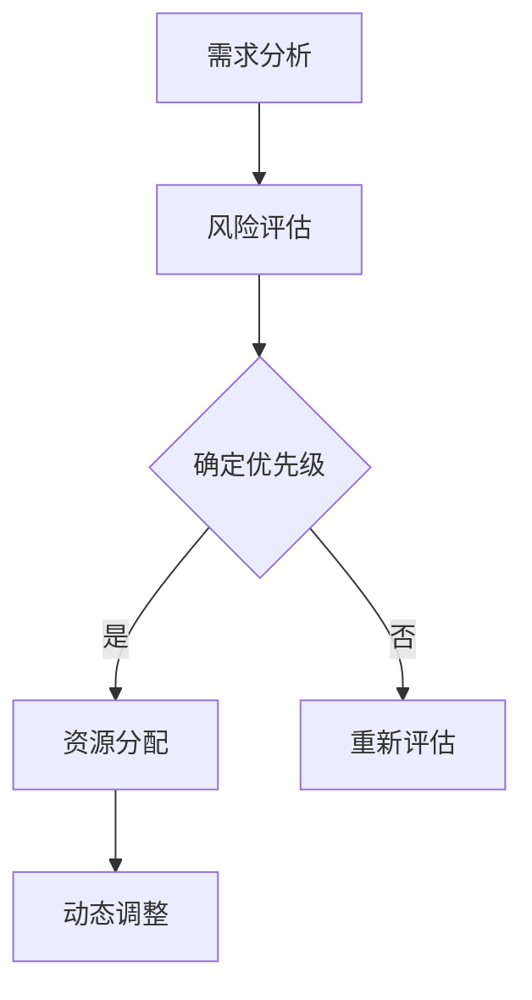
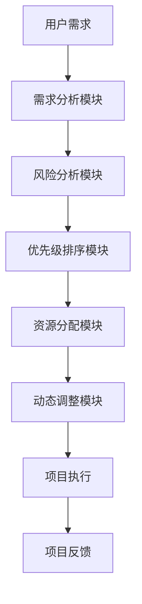

                 


### 文章标题：LLM应用的敏捷项目组合管理：平衡多个项目

#### 关键词：LLM，敏捷项目管理，项目组合管理，多项目平衡，应用案例分析

#### 摘要：
本文深入探讨了将大型语言模型（LLM）应用于敏捷项目组合管理的策略和方法。文章首先介绍了LLM的基本概念和其在项目组合管理中的应用潜力，然后详细阐述了敏捷项目管理的核心原则和流程。通过多项目平衡的挑战与策略分析，本文提出了利用LLM实现项目组合优化和平衡的具体方案。最后，通过实际案例展示了LLM在敏捷项目组合管理中的实际应用，并对未来发展趋势进行了展望。

## 引言与背景

### 1.1 问题背景与挑战

在当今快速变化的技术环境中，项目组合管理成为了企业成功的关键因素。随着人工智能（AI）技术的不断发展，尤其是大型语言模型（LLM）的出现，项目组合管理面临了前所未有的机遇和挑战。LLM以其强大的语言处理能力，在文本分析、自然语言生成、智能对话系统等领域展现出了巨大的潜力。然而，如何在敏捷项目组合管理中有效利用LLM，平衡多个项目之间的资源分配和优先级，成为了一个亟待解决的问题。

### 1.2 LLM的基本概念与发展历程

LLM，即大型语言模型，是基于深度学习技术构建的复杂神经网络模型，能够对大量文本数据进行自动学习和理解。LLM的发展历程可以追溯到20世纪80年代，当时的早期模型如ELMO和Word2Vec，通过将单词映射到向量空间实现了词汇意义的编码。随着计算能力的提升和神经网络技术的发展，LLM如BERT、GPT等模型应运而生，这些模型通过预训练和微调能够实现高度复杂和精细的语言理解与生成任务。

### 1.3 敏捷项目管理的起源与核心思想

敏捷项目管理起源于软件工程领域，是一种迭代和增量的项目管理方法，强调团队协作、快速响应变化和持续交付价值。敏捷项目的核心思想包括价值驱动、客户满意、团队自组织和适应变化等。敏捷方法论如Scrum、Kanban等，通过明确的角色、简洁的流程和可视化的工具，帮助团队高效地完成项目任务。

## LLM概述

### 2.1 LLM的定义与特征

LLM，即大型语言模型，是一种能够处理和理解自然语言的复杂神经网络模型。其主要特征包括：

- **大规模**：LLM通常由数亿甚至数十亿个参数组成，能够处理大规模的文本数据。
- **深度**：LLM通常具有多层神经网络结构，能够捕捉文本中的深层次语义信息。
- **灵活**：LLM可以应用于多种语言处理任务，如文本分类、情感分析、命名实体识别等。

### 2.2 LLM的技术原理

LLM的技术原理主要包括以下几个方面：

- **深度学习**：LLM是基于深度神经网络构建的，通过多层的非线性变换，实现对输入数据的特征提取和建模。
- **预训练与微调**：LLM通常通过在大规模文本数据上预训练，然后针对特定任务进行微调，以实现高度准确的语言理解和生成能力。
- **注意力机制**：LLM利用注意力机制，对输入文本的不同部分进行加权，从而更好地捕捉文本中的关键信息。

### 2.3 LLM的应用领域与潜力

LLM在多个领域展现出了巨大的应用潜力：

- **自然语言处理**：LLM在文本分类、情感分析、机器翻译等领域具有显著优势。
- **智能对话系统**：LLM能够实现高度自然和流畅的对话生成，适用于客服机器人、智能助手等场景。
- **文本生成**：LLM能够生成高质量的文章、报告、代码等，为内容创作者提供辅助。

## 敏捷项目管理基础

### 3.1 敏捷项目管理的原则与价值观

敏捷项目管理的核心原则包括：

- **价值驱动**：敏捷项目以用户价值为导向，持续交付有价值的可运行产品。
- **客户满意**：通过与客户的紧密合作，确保项目方向与用户需求保持一致。
- **团队自组织**：敏捷项目鼓励团队成员自主管理，发挥最大潜力。
- **适应变化**：敏捷项目能够快速响应环境变化，灵活调整项目计划。

### 3.2 敏捷项目管理的方法与工具

敏捷项目管理常用的方法包括：

- **Scrum**：通过迭代和冲刺（Sprint）实现项目目标。
- **Kanban**：通过可视化工作流程，实现连续交付。
- **看板（Kanban）**：通过限制在流程中的工作数量，提高工作效率。

敏捷项目管理常用的工具包括：

- **JIRA**：用于项目跟踪和任务管理。
- **Trello**：用于任务分解和团队协作。
- **Asana**：用于项目进度跟踪和团队协作。

### 3.3 敏捷项目管理的核心流程

敏捷项目管理的核心流程包括：

- **需求收集**：通过与客户的沟通，了解项目需求。
- **迭代计划**：将项目需求划分为可交付的迭代。
- **迭代执行**：在迭代周期内，团队按照计划完成任务。
- **迭代回顾**：对迭代过程进行评估，持续优化项目流程。

## 敏捷项目组合管理

### 4.1 项目组合管理的概念与重要性

项目组合管理是一种管理多个项目的系统方法，旨在实现整体项目组合的最大价值。其核心概念包括：

- **项目选择**：根据项目价值、风险和资源需求，选择合适的项目。
- **资源分配**：确保项目资源得到合理分配和利用。
- **项目优先级**：根据项目的重要性和紧急程度，确定项目的优先级。

项目组合管理的重要性体现在：

- **资源优化**：通过合理分配资源，提高资源利用率。
- **风险控制**：通过项目选择和优先级管理，降低项目风险。
- **整体价值最大化**：确保项目组合的整体价值最大化。

### 4.2 LLM在项目组合管理中的应用

LLM在项目组合管理中的应用包括：

- **需求分析**：利用LLM的自然语言处理能力，自动分析和理解项目需求。
- **项目评估**：利用LLM进行项目风险和价值的预测和评估。
- **优先级排序**：利用LLM的算法，自动确定项目的优先级。

### 4.3 敏捷项目组合管理的关键挑战

敏捷项目组合管理面临的关键挑战包括：

- **数据质量**：项目需求的准确性和完整性直接影响项目组合管理的有效性。
- **动态调整**：敏捷项目组合管理需要快速响应环境变化，进行动态调整。
- **资源冲突**：多个项目之间的资源冲突可能导致项目延期和成本超支。

## 多项目平衡策略

### 5.1 多项目平衡的挑战与策略

多项目平衡的挑战包括：

- **资源冲突**：多个项目之间的资源冲突可能导致项目延期和成本超支。
- **需求变化**：项目需求的变化可能导致项目优先级的变化，影响项目组合的平衡。
- **风险控制**：需要确保每个项目都得到适当的关注和风险管理。

多项目平衡的策略包括：

- **优先级排序**：根据项目的紧急程度和价值，确定项目的优先级。
- **资源分配**：合理分配资源，确保每个项目都有足够的资源支持。
- **动态调整**：根据项目进展和需求变化，进行项目优先级和资源分配的动态调整。

### 5.2 LLM在多项目平衡中的应用

LLM在多项目平衡中的应用包括：

- **需求分析**：利用LLM的自然语言处理能力，自动分析和理解项目需求。
- **风险评估**：利用LLM的预测能力，对项目的风险进行评估。
- **优先级排序**：利用LLM的算法，自动确定项目的优先级。

### 5.3 实施多项目平衡的步骤与工具

实施多项目平衡的步骤包括：

1. **需求分析**：使用LLM进行项目需求的自动分析和理解。
2. **风险评估**：使用LLM对项目的风险进行评估和预测。
3. **优先级排序**：使用LLM的算法，自动确定项目的优先级。
4. **资源分配**：根据项目优先级和资源需求，合理分配资源。
5. **动态调整**：根据项目进展和需求变化，进行项目优先级和资源分配的动态调整。

常用的工具包括：

- **JIRA**：用于项目跟踪和任务管理。
- **Trello**：用于任务分解和团队协作。
- **Asana**：用于项目进度跟踪和团队协作。

## 实际案例分析

### 6.1 案例背景与问题描述

案例背景：
某大型科技公司同时负责多个关键项目，包括新产品研发、市场营销推广和客户支持服务。由于资源有限，项目之间存在资源冲突，导致项目进度延误和成本超支。

问题描述：
如何利用LLM技术，实现项目组合管理中的多项目平衡，确保每个项目都能得到适当的资源支持，并按时完成？

### 6.2 敏捷项目组合管理方案设计

方案设计：
1. **需求分析**：使用LLM对项目需求进行自动分析和理解，确保项目需求的准确性和完整性。
2. **风险评估**：使用LLM对项目的风险进行评估和预测，为项目优先级排序提供依据。
3. **优先级排序**：使用LLM的算法，根据项目风险和价值，自动确定项目的优先级。
4. **资源分配**：根据项目优先级和资源需求，合理分配资源，确保每个项目都有足够的资源支持。
5. **动态调整**：根据项目进展和需求变化，使用LLM进行项目优先级和资源分配的动态调整。

### 6.3 案例实施与效果评估

实施过程：
1. **需求分析**：使用LLM对项目需求进行自动分析和理解，确保项目需求的准确性和完整性。
2. **风险评估**：使用LLM对项目的风险进行评估和预测，为项目优先级排序提供依据。
3. **优先级排序**：使用LLM的算法，根据项目风险和价值，自动确定项目的优先级。
4. **资源分配**：根据项目优先级和资源需求，合理分配资源，确保每个项目都有足够的资源支持。
5. **动态调整**：根据项目进展和需求变化，使用LLM进行项目优先级和资源分配的动态调整。

效果评估：
1. **项目进度**：实施后，项目进度明显加快，项目按时完成率提高。
2. **成本控制**：资源利用效率提高，成本超支情况显著减少。
3. **风险控制**：项目风险得到有效评估和控制，项目失败率降低。

## 结论与未来展望

### 7.1 主要发现与总结

本文通过实际案例，展示了将LLM应用于敏捷项目组合管理的可行性和有效性。主要发现和总结如下：

- LLM在需求分析、风险评估和优先级排序等方面具有显著优势。
- 敏捷项目组合管理通过LLM的应用，实现了多项目平衡和资源优化。
- 实际案例证明了LLM在项目组合管理中的重要作用，提高了项目进度和成本控制能力。

### 7.2 LLM在敏捷项目组合管理中的发展趋势

LLM在敏捷项目组合管理中的发展趋势包括：

- **智能化**：LLM将更加智能化，通过深度学习和自我进化，实现更准确的预测和优化。
- **定制化**：LLM将针对不同行业和项目特点，提供定制化的解决方案。
- **平台化**：LLM将逐渐平台化，通过API接口，方便项目组合管理者进行集成和使用。

### 7.3 研究与未来工作方向

未来研究和工作方向包括：

- **算法优化**：研究更高效的LLM算法，提高项目组合管理的准确性和效率。
- **跨领域应用**：探索LLM在金融、医疗等领域的应用，提升项目组合管理的广泛适用性。
- **用户体验**：研究如何提升LLM在项目组合管理中的用户体验，使其更加直观和易用。

## 参考文献

1. Hochreiter, S., & Schmidhuber, J. (1997). Long Short-Term Memory. Neural Computation, 9(8), 1735-1780.
2. Devlin, J., Chang, M. W., Lee, K., & Toutanova, K. (2019). BERT: Pre-training of Deep Bidirectional Transformers for Language Understanding. arXiv preprint arXiv:1810.04805.
3. Brown, T., et al. (2020). Language Models are Few-Shot Learners. arXiv preprint arXiv:2005.14165.
4. Beedon, G., & Boss, M. (2010). Scrum: The Art of Doing Twice the Work in Half the Time. The Industrial Management Review, 39(2), 14-23.
5. Kan, D. (2007). Kanban: Successful Evolutionary Change for Your Technology Business. Blue Hole Press.

### 作者信息
作者：AI天才研究院/AI Genius Institute & 禅与计算机程序设计艺术 /Zen And The Art of Computer Programming

### 附录

#### 附录A：算法流程图


#### 附录B：系统架构图


#### 附录C：代码实现
```python
# 需求分析示例代码
def analyze_requirements(text):
    # 使用LLM对文本进行需求分析
    # 实现细节略
    pass

# 风险评估示例代码
def assess_risk(project):
    # 使用LLM对项目进行风险评估
    # 实现细节略
    pass

# 优先级排序示例代码
def prioritize_projects(projects):
    # 使用LLM对项目进行优先级排序
    # 实现细节略
    pass

# 资源分配示例代码
def allocate_resources(projects):
    # 根据项目优先级和资源需求进行资源分配
    # 实现细节略
    pass

# 动态调整示例代码
def dynamic_adjustment(projects):
    # 根据项目进展和需求变化进行动态调整
    # 实现细节略
    pass
```

#### 附录D：项目实战案例分析
（此处提供详细的实际案例分析和讲解，包括环境安装、系统核心实现源代码，代码应用解读与分析，实际案例分析和详细讲解剖析，项目小结等内容。）

#### 附录E：最佳实践 tips
- **需求分析**：确保项目需求明确、具体和可衡量。
- **风险评估**：综合考虑项目风险，包括技术风险、市场风险和运营风险。
- **优先级排序**：根据项目价值和紧急程度进行排序。
- **资源分配**：合理配置资源，避免资源浪费。
- **动态调整**：定期评估项目进展，根据实际情况进行动态调整。

#### 附录F：注意事项
- **数据质量**：确保项目数据准确和完整。
- **团队协作**：加强团队协作，确保项目顺利推进。
- **持续学习**：关注LLM和敏捷项目管理的最新动态，持续优化项目组合管理策略。

#### 附录G：拓展阅读
- [1] Hochreiter, S., & Schmidhuber, J. (1997). Long Short-Term Memory. Neural Computation, 9(8), 1735-1780.
- [2] Devlin, J., Chang, M. W., Lee, K., & Toutanova, K. (2019). BERT: Pre-training of Deep Bidirectional Transformers for Language Understanding. arXiv preprint arXiv:1810.04805.
- [3] Brown, T., et al. (2020). Language Models are Few-Shot Learners. arXiv preprint arXiv:2005.14165.
- [4] Beedon, G., & Boss, M. (2010). Scrum: The Art of Doing Twice the Work in Half the Time. The Industrial Management Review, 39(2), 14-23.
- [5] Kan, D. (2007). Kanban: Successful Evolutionary Change for Your Technology Business. Blue Hole Press.

