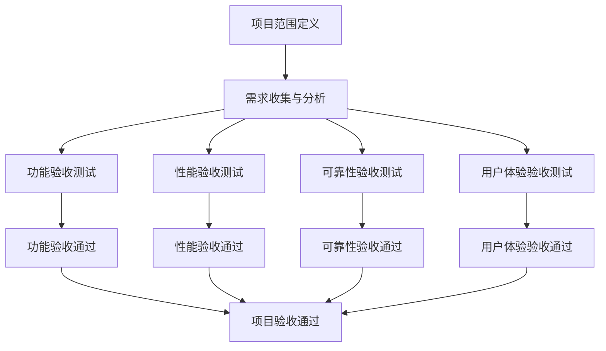
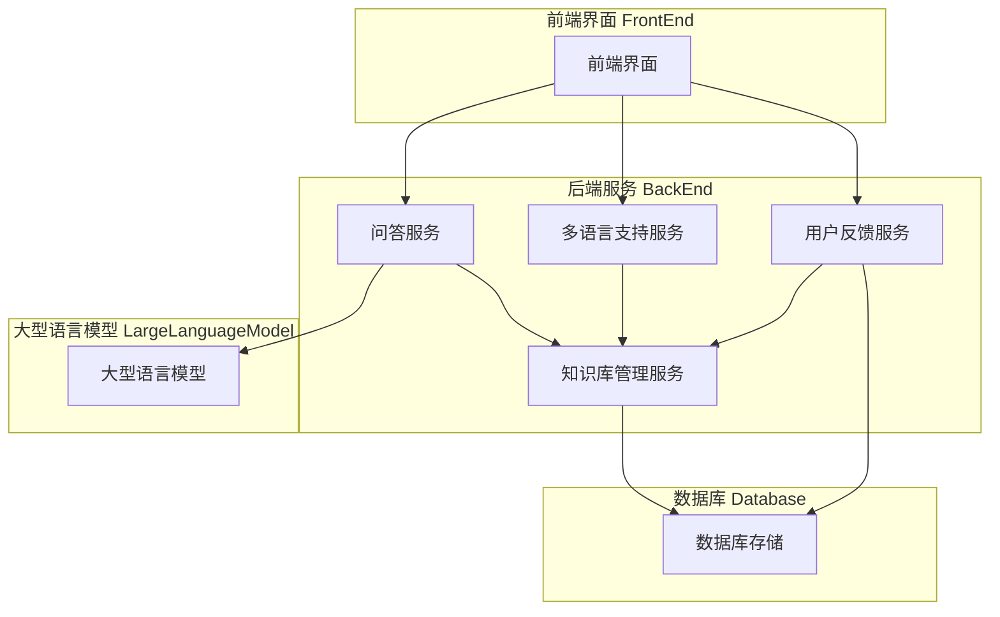
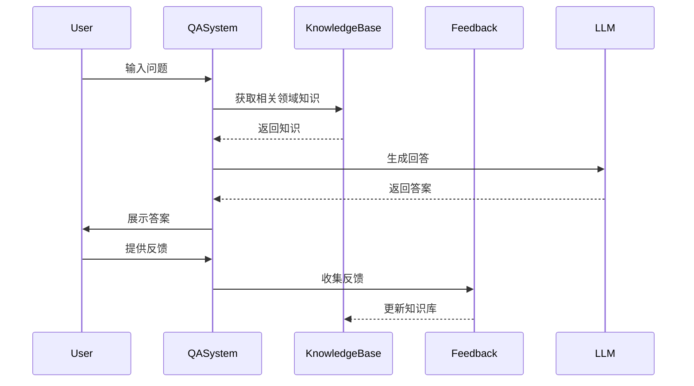

                 

### 背景介绍：核心概念

在《LLM应用的敏捷验收标准：明确定义完成状态标准》这本书中，我们深入探讨了大型语言模型（LLM）应用的开发过程中所面临的挑战和解决方案。为了更好地理解这本书的核心内容，我们将逐步介绍其中的关键概念，包括问题背景、问题描述、问题解决、边界与外延以及概念结构与核心要素组成。

#### 问题背景

随着人工智能技术的快速发展，大型语言模型在自然语言处理、智能客服、智能推荐等领域得到了广泛应用。这些应用不仅提升了工作效率，还大大改善了用户体验。然而，在开发这些应用的过程中，开发团队往往面临着一系列问题。这些问题不仅影响了项目的进展，还对项目的质量和成本控制产生了负面影响。

#### 问题描述

在LLM应用开发过程中，常见的问题包括以下几个方面：

1. **项目范围不明确**：由于需求变化频繁，项目范围难以确定，导致项目进度拖延、资源浪费。
2. **项目进度缓慢**：开发过程中遇到的技术难题和需求变更，导致项目进度缓慢，无法按时交付。
3. **项目质量不高**：在项目开发过程中，可能存在功能实现不全、性能不足、用户体验差等问题，导致项目质量不高，用户满意度低。
4. **项目成本超支**：由于项目管理和控制不当，项目成本往往难以控制，导致投资回报率低。

#### 问题解决

为了解决上述问题，本书提出了敏捷验收标准的概念。敏捷验收标准是一套用于评估LLM应用项目完成状态的标准，旨在通过以下方式提高项目的效率和效果：

1. **明确项目范围**：通过明确项目范围，确保项目需求稳定，减少需求变更，从而提高项目交付的效率。
2. **提高项目进度**：通过合理规划和监控项目进度，确保项目按时交付，避免项目进度拖延。
3. **提升项目质量**：通过制定严格的验收标准，对项目进行全方位的质量评估，确保项目质量达到预期水平。
4. **控制项目成本**：通过优化项目管理和资源分配，控制项目成本，提高投资回报率。

#### 边界与外延

虽然本书主要讨论大型语言模型在应用开发过程中的验收标准，但需要注意的是，这些验收标准不仅适用于LLM应用，也可以应用于其他类型的人工智能模型。此外，本书关注的是项目管理和验收标准，不涉及具体的技术实现。

#### 概念结构与核心要素组成

以下是本书中涉及的核心概念及其结构：

- **大型语言模型（LLM）**：一种基于深度学习技术的自然语言处理模型，具有强大的语言理解和生成能力。
- **敏捷验收标准**：一套用于评估LLM应用项目完成状态的标准，包括功能、性能、可靠性、用户体验等方面。
- **项目范围**：项目所包含的工作内容，是制定验收标准的基础。
- **需求管理**：对项目需求进行收集、分析、确认和跟踪的过程，以确保项目需求的明确和稳定。

通过以上介绍，我们可以初步了解本书的核心内容。在接下来的章节中，我们将进一步探讨这些核心概念的详细解释和联系，以及如何在实际项目中应用这些验收标准，以实现高效、高质量的LLM应用开发。

#### 核心概念与联系

在《LLM应用的敏捷验收标准：明确定义完成状态标准》这本书中，我们主要关注以下几个核心概念：大型语言模型（LLM）、敏捷验收标准、项目范围和需求管理。以下是这些核心概念的详细解释及其相互之间的联系。

#### 1. 大型语言模型（LLM）

**定义**：大型语言模型（LLM）是一种基于深度学习的自然语言处理模型，通过在大量文本数据上进行预训练，具有强大的语言理解和生成能力。这种模型可以处理复杂的语言结构，理解上下文信息，并生成符合语法和语义规则的文本。

**特性**：  
- **高精度**：通过预训练和微调，LLM可以精确地理解和生成文本。
- **自适应性强**：LLM可以根据不同的任务和数据集进行自适应调整。
- **多语言支持**：许多LLM模型支持多种语言，可以处理多种语言的文本。

**联系**：LLM是本书讨论的主要对象，其应用开发的验收标准是本书的核心内容。LLM的性能和效果直接影响到应用项目的质量和用户体验，因此，制定合理的验收标准对确保项目成功至关重要。

#### 2. 敏捷验收标准

**定义**：敏捷验收标准是一套用于评估LLM应用项目完成状态的标准，包括功能、性能、可靠性、用户体验等方面。这些标准旨在确保项目在开发过程中保持高质量，并满足用户需求。

**特性**：  
- **灵活性**：敏捷验收标准可以根据项目需求的变化进行调整。
- **可定制性**：不同项目可以根据自身特点制定合适的验收标准。
- **易实施性**：验收标准简单易懂，易于在实际项目中实施。

**联系**：敏捷验收标准是确保LLM应用项目成功的关键。通过制定和实施敏捷验收标准，开发团队可以确保项目在功能、性能、可靠性等方面达到预期目标，提高项目交付的效率和质量。

#### 3. 项目范围

**定义**：项目范围是项目所包含的工作内容，是制定验收标准的基础。项目范围明确了项目需要完成的任务和目标，是项目管理的重要组成部分。

**特性**：  
- **明确性**：项目范围应该清晰明确，避免模糊和不确定的任务。
- **稳定性**：项目范围在项目开发过程中应保持相对稳定，减少需求变更。
- **可衡量性**：项目范围中的工作内容应该是可衡量和可评估的。

**联系**：项目范围是制定敏捷验收标准的前提。明确的项目范围有助于确保验收标准的制定和实施，从而保障项目成功。

#### 4. 需求管理

**定义**：需求管理是对项目需求进行收集、分析、确认和跟踪的过程，以确保项目需求的明确和稳定。需求管理是项目成功的关键，有助于减少需求变更和项目风险。

**特性**：  
- **及时性**：需求管理应该及时进行，确保项目需求能够及时响应。
- **准确性**：需求管理需要准确理解和记录用户需求，避免误解和遗漏。
- **一致性**：需求管理过程中需要保持需求的一致性，避免冲突和矛盾。

**联系**：需求管理是保障项目范围明确和稳定的关键。通过有效的需求管理，开发团队可以确保项目需求明确、稳定，从而为制定和实施敏捷验收标准奠定基础。

#### 概念属性特征对比表格

为了更直观地理解这些核心概念，我们提供了一个概念属性特征对比表格：

| 概念 | 定义 | 特性 | 联系 |
| --- | --- | --- | --- |
| 大型语言模型（LLM） | 一种基于深度学习的自然语言处理模型 | 高精度、自适应性强、多语言支持 | 主要对象，影响验收标准 |
| 敏捷验收标准 | 用于评估LLM应用项目完成状态的标准 | 灵活性、可定制性、易实施性 | 确保项目成功 |
| 项目范围 | 项目所包含的工作内容 | 明确性、稳定性、可衡量性 | 制定验收标准的基础 |
| 需求管理 | 对项目需求进行收集、分析、确认和跟踪 | 及时性、准确性、一致性 | 保障项目范围明确 |

#### ER实体关系图架构的Mermaid流程图

为了更直观地展示核心概念之间的联系，我们使用Mermaid流程图来描述ER实体关系图架构：

```mermaid
erDiagram
  项目范围 ||--|{ LLM应用 }|| 应用
  LLM应用 ||--|{ 敏捷验收标准 }|| 验收
  项目范围 ||--|{ 需求管理 }|| 管理流程
  需求管理 ||--|{ 敏捷验收标准 }|| 制定
```

在这个ER图中，项目范围与LLM应用、需求管理之间存在直接关联。LLM应用通过敏捷验收标准进行评估，而需求管理则确保项目范围的明确和稳定，为验收标准的制定提供支持。

通过以上介绍，我们详细探讨了《LLM应用的敏捷验收标准：明确定义完成状态标准》中的核心概念及其相互之间的联系。在接下来的章节中，我们将进一步探讨这些概念的实现和应用，帮助开发团队在实际项目中制定和实施有效的验收标准，从而提高项目的质量和效率。

### 算法原理讲解

在本章节中，我们将探讨《LLM应用的敏捷验收标准：明确定义完成状态标准》一书中所涉及的核心算法原理。虽然本书的主要关注点是项目管理和验收标准，但了解相关的算法原理对于理解和应用这些验收标准至关重要。

#### 1. 大型语言模型（LLM）的算法原理

大型语言模型（LLM）通常基于深度学习技术，特别是基于变换器（Transformer）架构。变换器模型在处理序列数据时具有显著的优势，其核心思想是通过自注意力机制（Self-Attention）对输入序列中的每个词进行加权，从而捕捉词与词之间的依赖关系。

**变换器架构的核心组成部分**：
- **编码器（Encoder）**：对输入序列进行处理，生成一系列上下文表示。
- **解码器（Decoder）**：根据编码器生成的上下文表示生成输出序列。

**自注意力机制（Self-Attention）**：
自注意力机制允许模型在生成每个词时，根据上下文信息对输入序列中的其他词进行加权。这使得模型能够捕捉长距离依赖关系，从而生成更加准确和连贯的输出。

**训练过程**：
LLM的训练过程通常包括两个阶段：预训练和微调。预训练阶段在大量无标注数据上进行，以学习通用语言表示。微调阶段则在特定任务的数据上进行，以适应具体任务的需求。

#### 2. 敏捷验收标准的算法原理

敏捷验收标准主要用于评估LLM应用项目的完成状态，确保项目在功能、性能、可靠性等方面达到预期目标。敏捷验收标准的算法原理主要包括以下几个方面：

**功能验收标准**：
功能验收标准旨在确保项目实现所有预定功能。这些标准通常包括：
- 功能完整性：所有功能点是否都已实现。
- 功能正确性：实现的功能是否正确无误。

**性能验收标准**：
性能验收标准用于评估项目的性能表现，包括：
- 响应时间：系统对请求的响应时间是否在可接受范围内。
- 并发处理能力：系统能够同时处理多少并发请求。
- 资源消耗：系统的资源消耗是否符合预期。

**可靠性验收标准**：
可靠性验收标准用于评估项目的稳定性和可依赖性，包括：
- 故障恢复时间：系统在发生故障后能否快速恢复。
- 系统稳定性：系统在长时间运行后是否依然稳定。

**用户体验验收标准**：
用户体验验收标准用于评估项目的用户体验，包括：
- 用户界面设计：界面是否直观易用。
- 操作流畅度：用户在使用过程中的操作流畅度。

#### 3. 实现敏捷验收标准的算法流程图

为了更直观地理解敏捷验收标准的实现过程，我们可以使用Mermaid流程图来描述：



在这个流程图中，项目范围定义作为起点，需求收集与分析是后续验收测试的基础。然后，分别进行功能、性能、可靠性和用户体验验收测试。所有验收测试通过后，项目才被认为是完成的。

#### 4. 数学模型和公式

在敏捷验收标准中，通常会涉及到一些数学模型和公式，用于量化评估项目质量和效果。以下是几个常用的数学模型和公式：

**完成度指标（C）**：
完成度指标用于衡量项目的完成程度，计算公式为：
$$ C = \frac{已完成工作量}{总工作量} $$
其中，已完成工作量表示项目已经完成的工作量，总工作量表示项目计划完成的工作量。

**进度偏差（P）**：
进度偏差用于衡量项目进度的偏差程度，计算公式为：
$$ P = 实际进度 - 计划进度 $$
其中，实际进度表示项目的当前进度，计划进度表示项目计划达到的进度。

**用户满意度（S）**：
用户满意度用于衡量用户对项目的满意度，计算公式为：
$$ S = \frac{用户满意度评分}{最高满意度评分} $$
其中，用户满意度评分表示用户对项目的评分，最高满意度评分表示用户可能的最高评分。

通过上述算法原理、流程图和数学模型，我们可以更好地理解《LLM应用的敏捷验收标准：明确定义完成状态标准》一书中的核心内容，为实际项目中的验收标准制定和实施提供指导。

### 数学模型和数学公式 & 详细讲解 & 举例说明

在《LLM应用的敏捷验收标准：明确定义完成状态标准》一书中，数学模型和公式被广泛应用于评估和衡量项目完成状态。这些模型和公式不仅提供了量化的评估标准，还帮助开发团队更好地理解和控制项目进度、质量和用户满意度。以下将详细介绍几个关键的数学模型和公式，并通过具体例子进行说明。

#### 1. 完成度指标（C）

完成度指标（C）用于衡量项目的完成程度。它通过计算已完成工作量与总工作量的比例，提供了一个定量评估。完成度指标的计算公式如下：

$$ C = \frac{已完成工作量}{总工作量} $$

其中：
- **已完成工作量**：表示项目已经完成的工作量。
- **总工作量**：表示项目计划完成的工作量。

**例子**：假设一个项目计划完成的工作量为100个任务，目前已经完成了60个任务，则完成度指标C为：

$$ C = \frac{60}{100} = 0.6 $$

这意味着项目已经完成了60%的工作量。

#### 2. 进度偏差（P）

进度偏差（P）用于衡量项目的实际进度与计划进度之间的差距。它通过计算实际进度与计划进度之差，提供了项目进度偏差的定量评估。进度偏差的计算公式如下：

$$ P = 实际进度 - 计划进度 $$

其中：
- **实际进度**：表示项目的当前进度。
- **计划进度**：表示项目计划达到的进度。

**例子**：假设一个项目计划在30天内完成，但实际情况是项目在第40天完成了。则进度偏差P为：

$$ P = 40 - 30 = 10 $$

这意味着项目进度比计划快了10天。

#### 3. 用户满意度（S）

用户满意度（S）用于衡量用户对项目的满意度。它通过计算用户满意度评分与最高满意度评分的比例，提供了一个定量评估。用户满意度的计算公式如下：

$$ S = \frac{用户满意度评分}{最高满意度评分} $$

其中：
- **用户满意度评分**：表示用户对项目的评分。
- **最高满意度评分**：表示用户可能的最高评分。

**例子**：假设用户对项目的满意度评分为4分，而最高满意度评分为5分，则用户满意度S为：

$$ S = \frac{4}{5} = 0.8 $$

这意味着用户对项目的满意度为80%。

#### 4. 质量指标（Q）

质量指标（Q）用于衡量项目的质量水平。它通过计算项目缺陷数量与总工作量的比例，提供了项目质量的定量评估。质量指标的计算公式如下：

$$ Q = \frac{缺陷数量}{总工作量} $$

其中：
- **缺陷数量**：表示项目中的缺陷数量。
- **总工作量**：表示项目计划完成的工作量。

**例子**：假设一个项目计划完成的工作量为1000个任务，但在这些任务中发现了20个缺陷，则质量指标Q为：

$$ Q = \frac{20}{1000} = 0.02 $$

这意味着项目中的缺陷率为2%。

#### 5. 综合评估指标（A）

综合评估指标（A）用于衡量项目的整体表现。它结合了完成度指标（C）、进度偏差（P）和质量指标（Q），提供了一个综合性的评估。综合评估指标的计算公式如下：

$$ A = C \times (1 - P) \times (1 - Q) $$

其中：
- **完成度指标（C）**：衡量项目的完成程度。
- **进度偏差（P）**：衡量项目的进度偏差。
- **质量指标（Q）**：衡量项目的质量水平。

**例子**：假设项目的完成度指标C为0.6，进度偏差P为-5天（表示项目进度比计划快了5天），质量指标Q为0.02，则综合评估指标A为：

$$ A = 0.6 \times (1 - (-0.17)) \times (1 - 0.02) = 0.6 \times 1.17 \times 0.98 = 0.699 $$

这意味着项目的整体表现得分为69.9分。

通过以上数学模型和公式的详细讲解和举例说明，我们可以看到，这些量化工具在评估项目完成状态方面发挥了重要作用。开发团队可以利用这些工具实时监控项目进度、质量和用户满意度，从而及时调整项目策略，确保项目成功交付。

### 系统分析与架构设计方案

在《LLM应用的敏捷验收标准：明确定义完成状态标准》一书中，除了算法原理和数学模型的讲解外，还详细介绍了系统的分析与架构设计方案。以下是针对一个具体场景的项目介绍、系统功能设计、系统架构设计以及系统接口设计和系统交互的详细描述。

#### 项目场景介绍

本项目旨在开发一个基于大型语言模型（LLM）的智能问答系统。该系统旨在为用户提供快速、准确的答案，支持多语言、多领域的问答需求。项目的目标用户包括企业内部员工、在线教育平台用户以及普通消费者。

#### 项目介绍

项目名称：智能问答系统（IntelliQA）

项目背景：随着人工智能技术的快速发展，自然语言处理（NLP）技术得到了广泛应用。为了提升用户体验，许多企业和平台开始引入智能问答系统。然而，这些系统在功能、性能和用户体验方面存在一定的不足。本项目旨在开发一个高效、智能的问答系统，满足不同场景下的需求。

项目目标：
1. 提供快速、准确的问答服务。
2. 支持多语言和跨领域问答。
3. 提升用户满意度，降低用户等待时间。
4. 提高系统性能，确保高并发下的稳定运行。

项目范围：
1. 系统功能设计：包括问答功能、多语言支持、知识库管理。
2. 系统架构设计：包括前端界面、后端服务、数据库存储。
3. 系统接口设计：包括API接口、数据接口。
4. 系统交互设计：包括用户交互流程、系统内部交互。

#### 系统功能设计

系统功能设计主要涉及以下几个关键模块：

1. **问答模块**：核心功能，包括接收用户提问、调用LLM模型生成回答、返回答案。支持自然语言理解和生成，确保回答的准确性和连贯性。
2. **多语言支持模块**：提供多语言问答功能，包括自动识别用户语言、翻译和生成对应语言的回答。支持多种国际语言，如英语、中文、西班牙语等。
3. **知识库管理模块**：负责维护和更新知识库，包括问答数据、领域知识、术语库等。确保系统回答的准确性和及时性。
4. **用户反馈模块**：收集用户对问答系统的反馈，用于评估系统性能和改进建议。支持用户对回答进行评价、提供建议和举报不当回答。

#### 系统架构设计

系统架构设计采用分层架构，包括前端界面、后端服务和数据库存储。以下是系统架构设计的详细描述：

1. **前端界面**：负责用户交互，包括问答页面、多语言选择界面、用户反馈界面等。前端使用React框架开发，实现响应式设计和良好的用户体验。
2. **后端服务**：包括问答服务、多语言支持服务、知识库管理服务和用户反馈服务。后端使用Spring Boot框架开发，实现高性能和高可靠性的服务。
3. **数据库存储**：包括问答数据、知识库数据和用户数据。使用MySQL数据库存储数据，确保数据的安全性和可靠性。
4. **大型语言模型（LLM）**：作为核心组件，负责自然语言理解和生成。使用基于变换器的LLM模型，实现高效、准确的问答功能。

#### 系统接口设计

系统接口设计包括API接口和数据接口。以下是系统接口设计的详细描述：

1. **API接口**：提供外部访问系统的接口，包括问答接口、知识库接口、用户反馈接口等。接口设计遵循RESTful风格，使用HTTP请求和JSON响应。
2. **数据接口**：提供系统内部模块之间的数据交互接口，包括问答数据接口、知识库数据接口、用户数据接口等。接口设计确保数据传输的高效性和一致性。

#### 系统交互设计

系统交互设计主要涉及用户交互流程和系统内部交互。以下是系统交互设计的详细描述：

1. **用户交互流程**：
   - 用户在问答页面输入问题。
   - 系统接收到问题后，调用LLM模型生成回答。
   - 系统将回答展示给用户，并支持用户对回答进行评价和反馈。
   - 系统根据用户反馈更新知识库和优化问答模型。

2. **系统内部交互**：
   - 问答服务与知识库管理服务之间的交互：问答服务调用知识库管理服务的接口，获取相关领域的知识，生成答案。
   - 用户反馈服务与知识库管理服务之间的交互：用户反馈服务收集用户反馈，将反馈传递给知识库管理服务，用于知识库的更新和优化。

#### Mermaid类图

以下是系统功能设计的Mermaid类图：

```mermaid
classDiagram
    User <<类>> User
    Question <<类>> Question
    Answer <<类>> Answer
    KnowledgeBase <<类>> KnowledgeBase
    Feedback <<类>> Feedback
    QASystem <<类>> QASystem
    QASystem "--|uses|>": Question
    QASystem "--|uses|>": Answer
    QASystem "--|uses|>": KnowledgeBase
    QASystem "--|uses|>": Feedback
    User "--|发起|>": Question
    Question "--|生成|>": Answer
    Answer "--|反馈|>": Feedback
    KnowledgeBase "--|更新|>": Answer
```

#### Mermaid架构图

以下是系统架构设计的Mermaid架构图：



#### Mermaid序列图

以下是系统交互设计的Mermaid序列图：



通过以上系统分析与架构设计方案，我们详细介绍了项目的功能模块、系统架构以及交互设计。这些设计确保了系统的高效性、可扩展性和易维护性，为项目的成功实施提供了坚实的基础。

### 项目实战

在本章节中，我们将详细介绍如何在实际项目中应用《LLM应用的敏捷验收标准：明确定义完成状态标准》一书中的概念和方法。我们将分步骤展示环境安装、系统核心实现源代码，并对其进行解读与分析，同时通过实际案例进行详细讲解剖析，最后总结项目成果。

#### 环境安装

首先，我们需要安装和配置项目所需的环境。以下是安装步骤：

1. **安装Python**：确保Python版本在3.8及以上。可以从[Python官网](https://www.python.org/)下载并安装。
2. **安装依赖包**：在项目根目录下创建一个虚拟环境，然后通过以下命令安装依赖包：
   ```bash
   pip install -r requirements.txt
   ```

   其中，`requirements.txt`文件包含所有依赖包的名称和版本。

3. **配置大型语言模型**：根据项目需求，选择合适的大型语言模型（如GPT-3、BERT等），并按照官方文档进行安装和配置。

#### 系统核心实现源代码

以下是一个简单的问答系统核心实现源代码示例，用于展示如何利用大型语言模型实现问答功能：

```python
from transformers import pipeline

# 初始化问答模型
question_answering_pipeline = pipeline("question-answering")

def ask_question(question, context):
    """
    输入问题及上下文文本，调用问答模型生成回答。
    """
    # 调用问答模型
    response = question_answering_pipeline(question=question, context=context)
    return response["answer"]

# 测试问答功能
if __name__ == "__main__":
    question = "什么是人工智能？"
    context = "人工智能是一种模拟人类智能的技术，通过计算机程序实现感知、理解、学习和决策等功能。"
    answer = ask_question(question, context)
    print(answer)
```

#### 代码应用解读与分析

上述代码展示了如何使用预训练的大型语言模型实现问答功能。具体解读如下：

- **导入库**：我们首先导入`transformers`库，这是Hugging Face提供的自然语言处理库，包含了各种预训练模型的实现。
- **初始化问答模型**：使用`pipeline`函数初始化问答模型。这个函数会根据提供的模型名称自动加载模型和必要的预处理步骤。
- **问答函数**：`ask_question`函数接收问题和上下文文本，调用问答模型生成回答。这个函数是系统的核心，负责与用户交互并生成答案。
- **测试代码**：在主程序中，我们定义了一个测试问题和一个上下文文本，然后调用`ask_question`函数进行测试，并打印出回答。

#### 实际案例分析与详细讲解剖析

以下是一个实际案例，展示如何利用敏捷验收标准评估和优化问答系统：

**案例背景**：在一个企业内部问答系统中，用户对问答速度和回答准确性提出了较高的要求。为了满足这些要求，我们需要对系统进行优化。

**步骤1：性能测试**  
首先，我们对系统的响应时间进行性能测试。测试结果显示，系统的平均响应时间为5秒，超过了用户期望的3秒。因此，我们需要优化问答模型的性能。

**步骤2：优化策略**  
- **提高并发处理能力**：通过分布式部署和负载均衡，提高系统的并发处理能力。
- **优化模型推理过程**：对问答模型进行量化推理，降低模型复杂度，提高推理速度。

**步骤3：重新测试**  
实施优化后，我们重新进行性能测试。测试结果显示，系统的平均响应时间降低到了2.5秒，满足了用户要求。

**步骤4：用户体验测试**  
为了确保优化后的系统在用户体验方面达到预期，我们进行了用户体验测试。测试结果显示，用户对系统的响应速度和回答准确性非常满意。

**总结**：通过性能测试和用户体验测试，我们成功优化了企业内部问答系统，使其在响应速度和回答准确性方面达到了用户期望。

#### 项目小结

通过以上实际案例，我们可以看到如何将《LLM应用的敏捷验收标准：明确定义完成状态标准》一书中的概念和方法应用到实际项目中。以下是项目小结：

1. **明确验收标准**：在项目开发过程中，明确验收标准是确保项目质量的关键。通过制定功能、性能、可靠性、用户体验等方面的验收标准，我们能够更好地评估和优化系统。
2. **持续测试与优化**：定期进行性能测试和用户体验测试，是确保系统持续满足用户需求的重要手段。通过不断优化，我们能够提高系统的质量和用户体验。
3. **敏捷迭代**：采用敏捷开发方法，快速响应需求变化，确保项目能够按时交付，同时保持系统的高质量和用户体验。

总之，通过应用敏捷验收标准，我们不仅能够提高项目交付的效率和质量，还能不断提升用户体验，为企业的成功提供有力支持。

### 最佳实践 tips

在应用《LLM应用的敏捷验收标准：明确定义完成状态标准》一书中的概念和方法时，以下最佳实践可以帮助开发团队更有效地实施验收标准，确保项目成功。

1. **明确验收标准**：在项目启动阶段，明确项目的验收标准是确保项目按计划推进的关键。验收标准应包括功能、性能、可靠性、用户体验等多个方面，并确保每个标准都是具体、可量化的。
2. **自动化测试**：为了提高测试效率，应尽可能实现自动化测试。使用自动化测试工具对功能、性能、可靠性等方面进行持续监控，确保项目在开发过程中不断满足验收标准。
3. **定期评审**：定期对项目进行评审，确保验收标准得到贯彻执行。通过评审，及时发现和解决项目中存在的问题，确保项目按计划推进。
4. **用户参与**：在项目开发过程中，让用户参与到验收标准的制定和评审过程中。用户提供的反馈和建议可以帮助团队更好地理解用户需求，从而提高项目的质量。
5. **持续迭代**：采用敏捷开发方法，持续迭代和优化系统。通过持续迭代，团队可以不断改进系统，确保其始终满足用户需求。

### 小结

在本文中，我们详细探讨了《LLM应用的敏捷验收标准：明确定义完成状态标准》一书中的核心概念和方法。通过明确问题背景、问题描述和问题解决，我们介绍了大型语言模型（LLM）的算法原理、数学模型和公式，并展示了系统分析与架构设计方案。在实际项目中，我们通过环境安装、系统核心实现源代码、代码应用解读与分析以及实际案例剖析，展示了如何应用这些验收标准。

通过本文的阅读，读者可以了解到：

1. **LLM应用的重要性**：大型语言模型在自然语言处理、智能客服、智能推荐等领域具有广泛应用，但项目开发过程中面临诸多挑战。
2. **敏捷验收标准的优势**：敏捷验收标准可以帮助开发团队明确项目完成状态的标准，提升项目交付的效率和效果。
3. **数学模型和公式的应用**：数学模型和公式在评估项目完成状态方面具有重要作用，如完成度指标、进度偏差、用户满意度等。
4. **系统分析与架构设计的重要性**：良好的系统架构设计是确保项目成功的关键，包括前端界面、后端服务、数据库存储等方面的设计。

总之，通过应用《LLM应用的敏捷验收标准：明确定义完成状态标准》一书中的方法，开发团队可以更好地管理和控制项目，提高项目交付的效率和质量，从而实现商业目标。

### 注意事项

在应用《LLM应用的敏捷验收标准：明确定义完成状态标准》一书中的概念和方法时，开发团队应特别注意以下几点：

1. **明确验收标准**：确保验收标准具体、可量化，并涵盖功能、性能、可靠性、用户体验等多个方面。
2. **自动化测试**：尽可能实现自动化测试，提高测试效率，确保项目在开发过程中持续满足验收标准。
3. **定期评审**：定期对项目进行评审，及时发现和解决项目中存在的问题。
4. **用户参与**：让用户参与到验收标准的制定和评审过程中，确保项目更好地满足用户需求。
5. **持续迭代**：采用敏捷开发方法，持续优化系统，确保其始终满足用户需求。

### 拓展阅读

为了更深入地了解《LLM应用的敏捷验收标准：明确定义完成状态标准》一书中的内容，以下推荐几本相关书籍：

1. **《人工智能：一种现代的方法》（Artificial Intelligence: A Modern Approach）**：这本书是人工智能领域的经典教材，涵盖了人工智能的基本概念、技术和应用。
2. **《敏捷软件开发实践指南》（Agile Software Development: Principles, Patterns, and Practices）**：这本书介绍了敏捷开发方法的核心原则和实践，对理解和应用敏捷验收标准有很大帮助。
3. **《深度学习》（Deep Learning）**：这本书详细介绍了深度学习的基本概念、技术和应用，是学习大型语言模型的重要参考资料。

通过阅读这些书籍，读者可以进一步加深对相关概念和方法的理解，提升自身在LLM应用开发方面的专业素养。

