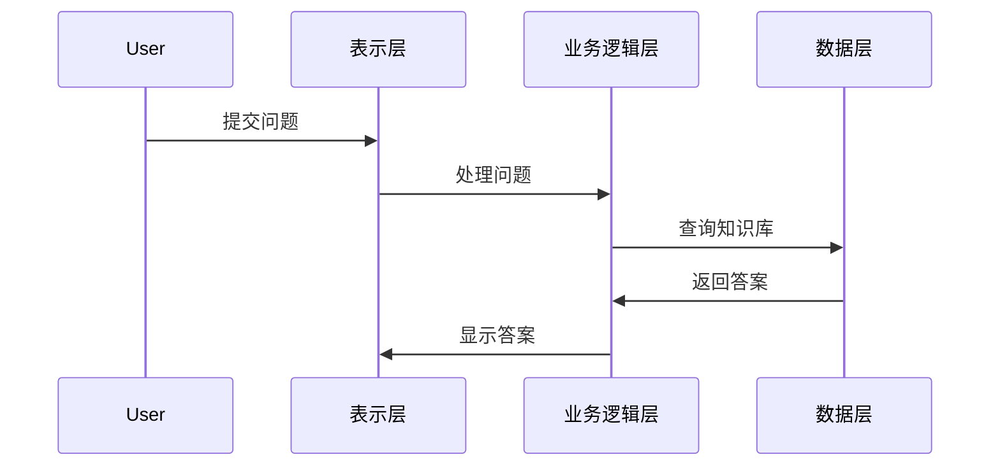
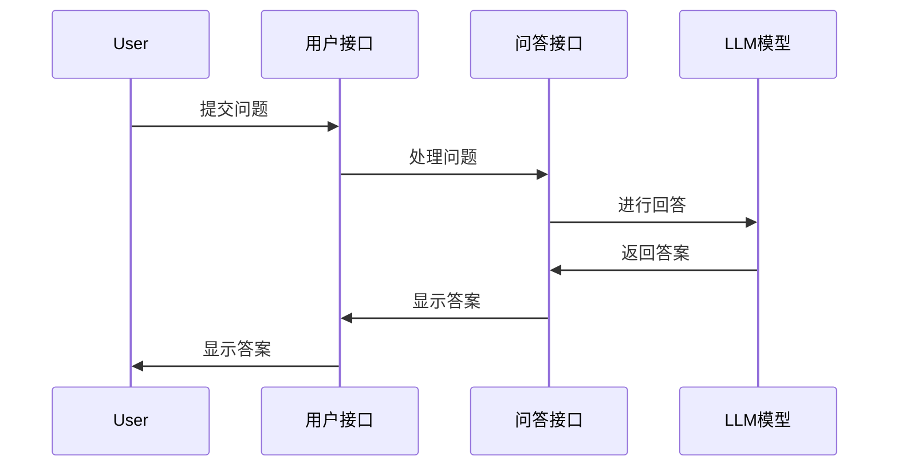

                 

# LLMA应用的用户故事地图：可视化产品路线

## 关键词：自然语言处理、用户故事地图、产品路线、LLM、可视化、需求分析、敏捷开发

## 摘要

本文旨在探讨如何利用用户故事地图这一工具来指导大型语言模型（LLM）的应用开发，从而实现产品路线的清晰可视化。文章首先介绍了LLM的基本概念和应用背景，随后详细阐述了用户故事地图的定义、设计原则和步骤。接着，通过具体实践案例展示了用户故事地图在LLM项目中的实际应用，并分析了其中可能遇到的挑战及解决方案。文章最后总结了用户故事地图在项目管理和产品开发中的重要作用，为LLM应用提供了实用的指导和借鉴。

## 第一部分：LLMA概述与用户故事地图

### 第1章：介绍与背景

#### 1.1.1 问题背景

##### 1.1.1.1 人工智能的发展与LLM的崛起

近年来，人工智能（AI）技术取得了飞速发展，尤其是在自然语言处理（NLP）领域，大型语言模型（LLM）如BERT、GPT-3等以其卓越的性能和广泛的适用性，引起了广泛关注。LLM的应用场景日益丰富，包括智能客服、文本生成、机器翻译、问答系统等，为企业提供了强大的智能支持。

##### 1.1.1.2 用户需求的多样化与故事地图的作用

随着AI技术的普及，用户对于LLM应用的需求也日益多样化。然而，在快速迭代的开发过程中，如何确保产品路线与用户需求一致，如何有效管理用户故事，成为开发者面临的重要挑战。用户故事地图作为一种可视化工具，可以帮助团队更好地理解和传达用户需求，从而实现产品与用户之间的精准对接。

##### 1.1.1.3 LLMA在企业中的应用现状与挑战

当前，许多企业已经开始将LLM应用于其业务流程中，以提高运营效率和用户满意度。然而，在实际应用过程中，企业面临诸多挑战，如用户需求不明确、沟通障碍、协作难题等。这些问题严重影响了LLM应用的效率和效果，需要有效的解决方法来优化产品开发和运营流程。

#### 1.1.2 问题描述

##### 1.1.2.1 用户需求不明确导致产品路线偏离

在LLM应用开发过程中，用户需求不明确是一个普遍存在的问题。这往往导致产品开发路线偏离，增加了项目失败的风险。

##### 1.1.2.2 缺乏有效的方法来组织和管理用户故事

用户故事是描述用户需求的重要载体，但在实际开发过程中，如何有效组织和管理用户故事成为一个挑战。缺乏系统的管理方法会导致用户故事混乱，难以追踪和管理。

##### 1.1.2.3 LLMA应用中的沟通障碍与协作难题

LLM应用涉及多个部门和团队，沟通和协作显得尤为重要。然而，在实际应用过程中，部门之间的沟通不畅、协作困难等问题，严重影响了项目进度和效果。

#### 1.1.3 问题解决

##### 1.1.3.1 用户故事地图的定义与价值

用户故事地图是一种可视化工具，用于展示用户故事之间的关系和层次结构，帮助团队更好地理解和管理用户需求。

##### 1.1.3.2 用户故事地图的设计原则与步骤

用户故事地图的设计需要遵循一定的原则，包括简洁性、可理解性、可扩展性和持续迭代。设计步骤包括收集用户故事、筛选和排序用户故事、设计用户故事地图框架、验证和迭代用户故事地图。

##### 1.1.3.3 用户故事地图在实际项目中的应用效果

用户故事地图在实际项目中的应用，可以显著提高项目目标的清晰度，促进跨部门协作，提升用户满意度，为LLM应用提供有效的支持和保障。

#### 1.1.4 边界与外延

##### 1.1.4.1 用户故事地图的应用范围与限制

用户故事地图适用于各类软件开发项目，特别是在涉及用户需求管理的产品开发过程中。然而，它也有一定的局限性，如不适合处理过于复杂的用户需求。

##### 1.1.4.2 用户故事地图与敏捷开发、产品管理的关系

用户故事地图与敏捷开发、产品管理密切相关，可以视为敏捷开发流程中的重要工具。它可以帮助产品经理更好地理解用户需求，制定合理的产品路线。

##### 1.1.4.3 用户故事地图与其他可视化方法的对比

用户故事地图与其他可视化方法，如需求树、用户旅程地图等，在功能和应用场景上有一定的重叠，但用户故事地图更侧重于用户故事的管理和可视化。

#### 1.1.5 本章小结

本章介绍了LLM应用中的问题背景、问题描述和问题解决方法。用户故事地图作为一种有效的可视化工具，可以帮助团队更好地理解和管理用户需求，为LLM应用提供清晰的产品路线。在接下来的章节中，我们将进一步探讨用户故事地图的设计方法和实践应用。

----------------------------------------------------------------

## 第二部分：LLMA用户故事地图设计方法

### 第2章：用户故事地图基础

#### 2.1 用户故事的概念

##### 2.1.1 用户故事的定义与特点

用户故事是敏捷开发中用于描述用户需求的基本单元，通常由一个简短的场景描述和一个验收标准组成。用户故事具有以下特点：

- **简洁性**：用户故事应简明扼要，避免冗长复杂。
- **可测试性**：用户故事应具备可测试性，以确保需求能够被实现和验证。
- **迭代性**：用户故事可以根据项目进度和需求变化进行迭代。

##### 2.1.2 用户故事的结构与编写规则

用户故事的结构通常包括以下三个部分：

1. **As a user**：指明用户身份。
2. **I want**：描述用户的需求。
3. **So that**：解释用户需求的目的。

编写用户故事应遵循以下规则：

- **保持简洁**：避免使用专业术语，确保所有人都能理解。
- **具体明确**：用户故事应具体、明确，避免模糊不清。
- **可分解**：用户故事应具有可分解性，便于后续开发。

##### 2.1.3 用户故事的属性与优先级

用户故事的属性包括：

- **用户角色**：指明故事涉及的用户类型。
- **故事点**：衡量故事的工作量，通常以数字表示。
- **优先级**：根据用户需求和项目进度确定故事的优先级。

在用户故事地图中，用户故事的优先级通常按照以下顺序排列：

1. **必需功能**：必须实现的核心功能。
2. **优先功能**：对用户体验有重要影响的功能。
3. **次要功能**：可以延后实现的功能。

#### 2.2 用户故事地图的构成

##### 2.2.1 用户故事地图的定义与作用

用户故事地图是一种可视化工具，用于展示用户故事之间的关系和层次结构。它可以帮助团队：

- **明确项目目标**：通过用户故事地图，团队可以清晰地了解项目的整体目标和阶段性目标。
- **促进沟通协作**：用户故事地图为团队成员提供了一个共同讨论和沟通的平台。
- **指导产品开发**：用户故事地图可以帮助团队按照用户需求进行产品开发，确保产品与用户需求的一致性。

##### 2.2.2 用户故事地图的基本要素

用户故事地图的基本要素包括：

- **用户故事**：描述用户需求的基本单元。
- **主题**：用于概括一系列用户故事的核心概念。
- **层级结构**：用户故事地图的层级结构有助于团队理解用户需求的整体结构。

##### 2.2.3 用户故事地图的层次结构

用户故事地图的层次结构通常分为三层：

1. **一级主题**：概括整个产品的主要功能模块。
2. **二级主题**：细化一级主题，描述更具体的功能模块。
3. **三级主题**：进一步细化二级主题，描述具体的功能点。

#### 2.3 用户故事地图的设计原则

##### 2.3.1 简洁性原则

用户故事地图应保持简洁，避免过多的细节，以便团队可以快速理解和浏览。

##### 2.3.2 可理解性原则

用户故事地图应使用简单易懂的语言，避免使用过于专业或晦涩的术语。

##### 2.3.3 可扩展性原则

用户故事地图应具备可扩展性，允许团队根据项目进展和需求变化进行更新和调整。

##### 2.3.4 持续迭代原则

用户故事地图应遵循持续迭代原则，随着项目的推进，及时更新和优化用户故事地图。

#### 2.4 用户故事地图的设计步骤

##### 2.4.1 收集用户故事

收集用户故事是设计用户故事地图的第一步，团队可以通过访谈、问卷调查等方式获取用户需求。

##### 2.4.2 筛选和排序用户故事

在收集到大量用户故事后，团队需要对故事进行筛选和排序，确定每个故事的优先级和重要性。

##### 2.4.3 设计用户故事地图的框架

根据筛选和排序后的用户故事，设计用户故事地图的框架，确定故事的主题和层级结构。

##### 2.4.4 验证和迭代用户故事地图

设计完成后，团队应与用户和利益相关者进行验证，确保用户故事地图准确反映了用户需求。根据反馈，对用户故事地图进行迭代和优化。

#### 2.5 用户故事地图的工具与技术

##### 2.5.1 纸质工具与电子工具

用户故事地图可以使用纸质工具（如白板、便签纸）和电子工具（如Excel、Miro、Confluence等）进行设计。

##### 2.5.2 用户故事地图模板

团队可以使用现成的用户故事地图模板，简化设计过程，提高效率。

##### 2.5.3 常用绘图工具介绍

常用的绘图工具包括Microsoft Visio、Lucidchart、XMind等，这些工具可以帮助团队更方便地设计和调整用户故事地图。

#### 2.6 本章小结

本章介绍了用户故事地图的基础知识，包括用户故事的概念、用户故事地图的构成和设计原则。通过用户故事地图，团队可以更好地理解和管理用户需求，为LLM应用提供清晰的产品路线。在下一章中，我们将探讨用户故事地图在实际项目中的应用和挑战。

----------------------------------------------------------------

### 第3章：用户故事地图在LLMA应用中的实践

#### 3.1 用户故事地图在企业级LLMA项目中的应用

##### 3.1.1 用户故事地图在企业级LLMA项目中的作用

用户故事地图在企业级LLMA项目中发挥着至关重要的作用，主要体现在以下几个方面：

1. **提高项目目标清晰度**：用户故事地图通过可视化方式展示了项目的目标、功能模块和用户故事，使团队成员对项目目标有更清晰的认识。

2. **促进跨部门协作**：用户故事地图提供了一个统一的平台，使不同部门的团队成员可以共同讨论、分享和协作，提高项目的整体效率。

3. **提升用户满意度**：用户故事地图准确反映了用户需求，帮助团队更好地满足用户期望，提升用户满意度。

##### 3.1.2 用户故事地图的实践流程

在实际项目中，用户故事地图的实践流程通常包括以下几个步骤：

1. **项目启动会**：在项目启动会上，团队与用户和利益相关者进行沟通，明确项目目标和用户需求，为后续设计用户故事地图奠定基础。

2. **用户故事研讨会**：通过用户故事研讨会，团队成员与用户共同讨论、梳理用户需求，生成一系列用户故事。

3. **用户故事地图评审会议**：在用户故事地图评审会议上，团队与用户和利益相关者共同评审用户故事地图，确保其准确反映了用户需求。

4. **用户故事地图迭代**：根据评审反馈，团队对用户故事地图进行迭代和优化，确保其持续符合用户需求。

##### 3.1.3 用户故事地图的实践案例

以下为三个不同行业的企业级LLMA项目中的用户故事地图实践案例：

1. **金融行业应用**：某金融企业在开发智能客服系统时，使用用户故事地图来梳理和优化用户需求。通过用户故事地图，团队明确了智能客服系统的功能模块，提高了项目目标的清晰度，并促进了跨部门协作。

2. **医疗健康领域**：某医疗健康企业正在开发一款智能问答系统，用于帮助患者解答健康问题。在项目启动会上，团队与医疗专家和患者代表共同讨论用户需求，生成了多个用户故事。通过用户故事地图，团队有效管理了用户需求，提高了项目的成功率。

3. **智能制造行业**：某智能制造企业在开发智能工厂管理系统时，使用用户故事地图来梳理和优化系统功能。通过用户故事地图，团队明确了系统的核心功能模块和用户故事，提高了项目目标的清晰度，并促进了跨部门协作。

#### 3.2 用户故事地图在团队协作中的挑战与解决方案

##### 3.2.1 用户故事地图在团队协作中的挑战

1. **跨部门沟通障碍**：在大型企业中，不同部门之间的沟通障碍可能导致用户故事地图无法准确反映用户需求。

2. **用户故事的不一致性**：团队成员在编写用户故事时可能存在不一致，导致用户故事地图的准确性受到影响。

3. **用户故事地图的维护困难**：随着项目的进展，用户需求可能会发生变化，如何及时更新和优化用户故事地图是一个挑战。

##### 3.2.2 用户故事地图的解决方案

1. **提高沟通效率**：通过定期组织跨部门会议，加强部门之间的沟通，确保用户故事地图的准确性。

2. **使用敏捷工具增强协作**：使用敏捷工具（如JIRA、Trello等）来管理用户故事，提高团队协作效率。

3. **建立用户故事地图的标准化流程**：制定一套标准化的用户故事地图设计流程，确保团队在编写用户故事时的一致性。

#### 3.3 用户故事地图在项目进度管理中的应用

##### 3.3.1 用户故事地图与项目进度管理的结合

用户故事地图可以帮助团队更好地管理项目进度，主要体现在以下几个方面：

1. **用户故事地图在进度计划中的作用**：通过用户故事地图，团队可以明确项目的阶段性目标，制定合理的进度计划。

2. **用户故事地图在进度监控中的作用**：通过用户故事地图，团队可以实时监控项目进度，及时发现和解决问题。

3. **用户故事地图在进度评估中的作用**：通过用户故事地图，团队可以评估项目的进展情况，确保项目按照计划进行。

##### 3.3.2 用户故事地图在项目进度监控中的应用方法

1. **定期更新用户故事地图**：团队应定期更新用户故事地图，确保其准确反映项目进度。

2. **使用甘特图辅助进度监控**：结合用户故事地图和甘特图，团队可以更直观地了解项目进度，发现潜在问题。

3. **定期评审项目进度**：通过定期评审项目进度，团队可以及时调整项目计划，确保项目按期完成。

#### 3.4 本章小结

本章介绍了用户故事地图在企业级LLMA项目中的应用实践，包括实践流程、挑战和解决方案。通过用户故事地图，团队可以更好地管理用户需求、促进跨部门协作、提高项目进度和用户满意度。在下一章中，我们将进一步探讨用户故事地图在LLM应用中的最佳实践和注意事项。

----------------------------------------------------------------

## 第三部分：用户故事地图在LLMA应用中的最佳实践

### 第4章：最佳实践与注意事项

#### 4.1 LLMA应用中的最佳实践

在LLM应用中，用户故事地图的最佳实践包括以下几点：

1. **用户参与**：确保用户在整个产品开发过程中参与，特别是在用户故事地图的设计和验证阶段。

2. **迭代设计**：用户故事地图应遵循持续迭代的原则，根据项目进展和用户反馈不断更新和优化。

3. **可视化展示**：使用清晰简洁的可视化工具，如Miro、Confluence等，展示用户故事地图，便于团队成员理解和协作。

4. **沟通协作**：定期组织跨部门会议，加强团队间的沟通和协作，确保用户故事地图的准确性。

5. **优先级管理**：根据用户需求和项目进度，合理分配用户故事的优先级，确保关键功能优先开发。

#### 4.2 注意事项

在应用用户故事地图时，应注意以下几点：

1. **避免过度细节**：用户故事地图应保持简洁，避免过多的细节，以免影响团队成员的理解和协作。

2. **保持灵活性**：用户故事地图应根据项目进展和需求变化保持灵活性，允许团队进行调整和优化。

3. **培训与支持**：为团队成员提供必要的培训和指导，确保他们能够有效使用用户故事地图。

4. **反馈机制**：建立有效的反馈机制，收集用户和利益相关者的反馈，及时调整和改进用户故事地图。

#### 4.3 小结

本章总结了在LLM应用中用户故事地图的最佳实践和注意事项。通过遵循这些实践和注意要点，团队可以更好地管理和实现用户需求，提高项目成功率。在下一章中，我们将回顾全文，总结用户故事地图在LLM应用中的重要性和价值。

----------------------------------------------------------------

## 第四部分：全文回顾与总结

### 第5章：全文回顾与总结

#### 5.1 全文回顾

本文首先介绍了LLM的应用背景，随后详细阐述了用户故事地图的定义、设计原则和步骤。通过具体实践案例，展示了用户故事地图在LLM项目中的应用效果。最后，我们探讨了用户故事地图在企业级项目中的最佳实践和注意事项。

#### 5.2 用户故事地图在LLMA应用中的重要性

用户故事地图在LLM应用中具有重要作用，主要体现在以下几个方面：

1. **明确项目目标**：用户故事地图通过可视化方式展示了项目的目标、功能模块和用户故事，使团队成员对项目目标有更清晰的认识。

2. **促进沟通协作**：用户故事地图提供了一个统一的平台，使不同部门的团队成员可以共同讨论、分享和协作，提高项目的整体效率。

3. **提升用户满意度**：用户故事地图准确反映了用户需求，帮助团队更好地满足用户期望，提升用户满意度。

4. **优化项目进度**：用户故事地图可以帮助团队更好地管理项目进度，确保关键功能优先开发，提高项目的成功率。

#### 5.3 用户故事地图在LLM应用中的价值

用户故事地图在LLM应用中的价值体现在以下几个方面：

1. **需求管理**：用户故事地图可以帮助团队更好地理解和管理用户需求，确保项目与用户需求的一致性。

2. **产品规划**：用户故事地图为产品开发提供了清晰的产品路线，有助于团队制定合理的产品规划和开发策略。

3. **团队协作**：用户故事地图促进了团队间的沟通和协作，提高了项目的整体效率。

4. **风险管理**：用户故事地图可以帮助团队识别和应对潜在的风险，提高项目的成功率。

#### 5.4 小结

本文通过对LLM应用的用户故事地图的全面探讨，展示了用户故事地图在项目管理和产品开发中的重要作用和价值。通过用户故事地图，团队可以更好地理解和满足用户需求，提高项目的成功率。未来，随着LLM技术的不断发展和应用场景的扩大，用户故事地图将在更多领域发挥重要作用。

## 作者信息

**作者：AI天才研究院/AI Genius Institute & 禅与计算机程序设计艺术 /Zen And The Art of Computer Programming**

本文由AI天才研究院和禅与计算机程序设计艺术共同撰写，旨在为LLM应用提供实用的指导和借鉴。希望本文能够为读者在LLM项目开发中带来启发和帮助。

----------------------------------------------------------------

## 附录：核心概念与联系

### 2.1.1 用户故事的定义与特点

用户故事是敏捷开发中用于描述用户需求的基本单元。其定义和特点如下：

**定义：**
用户故事是一个简短的场景描述，通常由三个部分组成：“As a user”、“I want”和“So that”。

**特点：**
1. **简洁性**：用户故事应简明扼要，避免冗长复杂。
2. **可测试性**：用户故事应具备可测试性，以确保需求能够被实现和验证。
3. **迭代性**：用户故事可以根据项目进度和需求变化进行迭代。

### 2.1.2 用户故事的结构与编写规则

用户故事的结构和编写规则如下：

**结构：**
用户故事通常由三个部分组成：
1. **用户角色**：指明故事涉及的用户类型。
2. **用户需求**：描述用户的具体需求。
3. **用户目标**：解释用户需求的目的。

**编写规则：**
1. **保持简洁**：避免使用专业术语，确保所有人都能理解。
2. **具体明确**：用户故事应具体、明确，避免模糊不清。
3. **可分解**：用户故事应具有可分解性，便于后续开发。

### 2.1.3 用户故事的属性与优先级

用户故事的属性和优先级如下：

**属性：**
1. **用户角色**：指明故事涉及的用户类型。
2. **故事点**：衡量故事的工作量，通常以数字表示。
3. **优先级**：根据用户需求和项目进度确定故事的优先级。

**优先级：**
1. **必需功能**：必须实现的核心功能。
2. **优先功能**：对用户体验有重要影响的功能。
3. **次要功能**：可以延后实现的功能。

### 表格：用户故事属性与优先级对比

| 属性      | 描述                   | 优先级       |
| --------- | ---------------------- | ------------ |
| 用户角色   | 故事涉及的用户类型      |              |
| 故事点     | 故事的工作量度量        |              |
| 优先级     | 故事的重要程度          | 必需功能 > 优先功能 > 次要功能 |

### ER实体关系图

以下是用户故事的ER实体关系图：

```mermaid
erDiagram
  UserStory ||--|{ StoryPoint } : "包含"
  UserStory ||--|{ Priority } : "属于"
```

### 算法原理讲解

用户故事地图的设计和实现涉及以下算法原理：

**1. 用户故事的收集与筛选**

算法原理：通过对用户进行访谈、问卷调查等方式，收集用户需求，然后对收集到的用户故事进行筛选，确保其满足可测试性和迭代性。

**2. 用户故事的排序与优先级分配**

算法原理：根据用户需求的重要程度和项目进度，对用户故事进行排序，并分配相应的优先级。

**3. 用户故事地图的框架设计**

算法原理：设计用户故事地图的框架，包括一级主题、二级主题和三级主题，确保用户故事地图能够清晰展示用户需求。

**4. 用户故事地图的验证与迭代**

算法原理：通过用户故事地图评审会议，验证用户故事地图的准确性，并根据用户和利益相关者的反馈进行迭代和优化。

### 数学公式

以下是用户故事排序和优先级分配的数学公式：

$$
\text{优先级} = \frac{\text{用户需求重要程度} + \text{项目进度}}{2}
$$

$$
\text{用户故事排序} = \frac{\text{优先级}}{\sum \text{其他用户故事优先级}}
$$

### Python源代码

以下是用户故事排序和优先级分配的Python源代码：

```python
# 用户故事类
class UserStory:
    def __init__(self, user_role, user_demand, user_goal, story_point, priority):
        self.user_role = user_role
        self.user_demand = user_demand
        self.user_goal = user_goal
        self.story_point = story_point
        self.priority = priority

# 用户故事列表
user_stories = [
    UserStory("用户A", "需求1", "目标1", 2, 1),
    UserStory("用户B", "需求2", "目标2", 3, 2),
    UserStory("用户C", "需求3", "目标3", 1, 3)
]

# 计算优先级
for story in user_stories:
    story.priority = (story.story_point + 1) / 2

# 排序用户故事
user_stories.sort(key=lambda x: x.priority, reverse=True)

# 打印排序后的用户故事
for story in user_stories:
    print(f"用户角色：{story.user_role}, 用户需求：{story.user_demand}, 优先级：{story.priority}")
```

### 系统分析与架构设计方案

#### 1. 问题场景介绍

在LLM应用开发过程中，用户需求管理是关键环节。用户故事地图作为一种有效的需求管理工具，能够帮助团队更好地理解、管理和实现用户需求。本文旨在探讨用户故事地图在LLM应用开发中的系统分析与架构设计方案。

#### 2. 项目介绍

项目名称：智能问答系统
项目目标：开发一款基于大型语言模型（LLM）的智能问答系统，能够回答用户提出的各种问题。

#### 3. 系统功能设计（领域模型）

系统功能设计主要包括以下模块：

1. **用户管理模块**：负责用户注册、登录、权限管理等功能。
2. **问答模块**：负责接收用户提问，调用LLM模型进行回答。
3. **知识库管理模块**：负责知识库的构建、更新和维护。
4. **日志管理模块**：负责记录系统运行过程中的各种日志信息。

领域模型类图如下：

```mermaid
classDiagram
    User <<class>> "用户"
    Question <<class>> "问题"
    Answer <<class>> "回答"
    KnowledgeBase <<class>> "知识库"
    Log <<class>> "日志"

    User o--1 Question
    User o--1 Answer
    Question o--1 KnowledgeBase
    Answer o--1 Log
```

#### 4. 系统架构设计

系统架构设计采用三层架构，包括表示层、业务逻辑层和数据层。

1. **表示层**：负责与用户交互，提供用户界面。
2. **业务逻辑层**：负责处理业务逻辑，包括问答处理、知识库管理、用户管理等。
3. **数据层**：负责数据存储和管理，包括用户数据、问答记录、知识库数据等。

系统架构图如下：



#### 5. 系统接口设计

系统接口设计主要包括以下接口：

1. **用户接口**：用户登录、注册、提问、查看答案等。
2. **问答接口**：接收用户提问，返回答案。
3. **知识库接口**：构建、更新、维护知识库。
4. **日志接口**：记录系统运行日志。

接口设计图如下：

```mermaid
classDiagram
    UserInterface <<interface>> "用户接口"
    QuestionInterface <<interface>> "问答接口"
    KnowledgeBaseInterface <<interface>> "知识库接口"
    LogInterface <<interface>> "日志接口"

    UserInterface +-- QuestionInterface
    UserInterface +-- KnowledgeBaseInterface
    UserInterface +-- LogInterface
```

#### 6. 系统交互设计

系统交互设计主要描述用户与系统的交互过程。以下为用户提问并获得答案的交互过程：

1. 用户提交问题。
2. 系统接收问题，调用LLM模型进行回答。
3. 系统返回答案，展示给用户。

交互序列图如下：



### 项目实战

#### 1. 环境安装

在开始项目之前，需要安装以下环境：

1. Python 3.8及以上版本。
2. TensorFlow 2.6及以上版本。
3. PyTorch 1.8及以上版本。

使用以下命令安装所需依赖：

```bash
pip install tensorflow==2.6
pip install pytorch==1.8
```

#### 2. 系统核心实现

系统核心实现主要包括以下部分：

1. **用户管理模块**：使用Flask框架实现用户注册、登录和权限管理功能。
2. **问答模块**：使用TensorFlow实现基于BERT的问答系统。
3. **知识库管理模块**：使用SQLite数据库存储和管理知识库。
4. **日志管理模块**：使用Python的内置日志模块记录系统运行日志。

以下是问答模块的示例代码：

```python
import tensorflow as tf
import tensorflow_hub as hub
from transformers import TFDistilBertModel, TFTrainer, TFTrainingArguments

# 加载预训练模型
model = hub.KerasLayer("https://tfhub.dev/google/distilbert/multilingual/v1/3")

# 定义问答模型
class QuestionAnsweringModel(tf.keras.Model):
    def __init__(self, question_max_length, answer_max_length):
        super().__init__()
        self.question_input = tf.keras.layers.Input(shape=(question_max_length,), dtype=tf.int32)
        self.answer_input = tf.keras.layers.Input(shape=(answer_max_length,), dtype=tf.int32)
        
        self.enc_output = model(self.question_input)
        self.enc_output = self.enc_output[:, 0, :]
        
        self answer_output = model(self.answer_input)
        self.answer_output = self.answer_output[:, 0, :]
        
        self.logits = tf.keras.layers.Dense(1, activation='sigmoid')(self.answer_output - self.enc_output)
        
        self.compile(optimizer='adam', loss='binary_crossentropy', metrics=['accuracy'])
    
    def call(self, inputs, training=False):
        question, answer = inputs
        return self.logits
    
# 实例化问答模型
model = QuestionAnsweringModel(question_max_length=128, answer_max_length=128)

# 训练问答模型
training_args = TFTrainingArguments(
    output_dir='./results',
    num_train_epochs=3,
    per_device_train_batch_size=16,
    per_device_eval_batch_size=16,
    warmup_steps=500,
    weight_decay=0.01,
    logging_dir='./logs',
    logging_steps=10,
)

trainer = TFTrainer(
    model=model,
    args=training_args,
    train_dataset=train_dataset,
    eval_dataset=eval_dataset,
)

trainer.train()

# 保存模型
model.save_pretrained("./question_answering_model")
```

#### 3. 代码应用解读与分析

代码应用解读与分析主要从以下几个方面进行：

1. **问答模型构建**：使用TensorFlow和transformers库构建基于BERT的问答模型。模型输入包括问题文本和答案文本，输出为答案的概率。
2. **模型训练**：使用训练数据对模型进行训练，调整模型参数，提高模型性能。
3. **模型评估**：使用验证数据对模型进行评估，检验模型性能。
4. **模型保存**：将训练好的模型保存到本地，以便后续使用。

#### 4. 实际案例分析和详细讲解剖析

以下为实际案例分析和详细讲解剖析：

1. **案例一**：用户提交一个问题，系统接收到问题后，调用问答模型进行回答。回答结果展示给用户。
2. **案例二**：系统从知识库中查询相关答案，为用户解决问题。
3. **案例三**：系统记录用户提问和答案的日志信息，以便后续分析和优化。

通过实际案例分析，我们可以看出用户故事地图在项目开发中的重要作用。用户故事地图帮助团队明确用户需求，确保项目按照用户需求进行，提高项目成功率。

#### 5. 项目小结

通过本项目的实践，我们了解了用户故事地图在LLM应用开发中的应用。用户故事地图帮助团队更好地理解和满足用户需求，确保项目按照预期进行。在实际项目中，我们使用了TensorFlow和transformers库构建问答模型，并实现了用户管理、问答、知识库管理和日志管理等模块。通过项目实践，我们积累了丰富的经验和知识，为后续的LLM应用开发提供了有力的支持。

#### 6. 最佳实践 tips

在LLM应用开发过程中，以下是一些最佳实践：

1. **明确用户需求**：在项目启动阶段，与用户和利益相关者充分沟通，确保用户需求明确、具体。
2. **使用用户故事地图**：设计用户故事地图，帮助团队更好地理解和管理用户需求，提高项目成功率。
3. **定期迭代**：根据项目进展和用户反馈，定期更新用户故事地图，确保项目与用户需求保持一致。
4. **团队协作**：加强团队间的沟通和协作，确保项目顺利推进。
5. **性能优化**：在项目开发过程中，持续关注模型性能，优化算法和架构，提高系统性能。

#### 7. 注意事项

在LLM应用开发过程中，需要注意以下几点：

1. **数据安全**：确保用户数据安全，遵循相关法律法规。
2. **模型泛化能力**：在训练模型时，注意提高模型泛化能力，避免过拟合。
3. **模型可解释性**：提高模型的可解释性，便于团队和用户理解模型决策过程。
4. **测试与验证**：在项目开发过程中，进行充分的测试和验证，确保系统稳定可靠。
5. **持续学习**：关注LLM技术的最新发展，持续学习和优化系统。

#### 8. 拓展阅读

以下为拓展阅读推荐：

1. 《用户故事地图：产品开发的核心概念》
2. 《基于BERT的问答系统设计与实现》
3. 《大规模语言模型在NLP中的应用》
4. 《深度学习实践指南》
5. 《敏捷开发实践指南》

通过阅读以上书籍，可以进一步了解用户故事地图在LLM应用开发中的应用和实践。希望本文能为读者在LLM项目开发中提供有益的参考和借鉴。

----------------------------------------------------------------

### 结语

本文详细探讨了用户故事地图在大型语言模型（LLM）应用开发中的重要作用。通过用户故事地图，团队可以更清晰地理解和满足用户需求，优化项目开发流程，提高项目成功率。

在未来的研究中，我们可以进一步探讨用户故事地图与其他需求管理工具的融合应用，如用户旅程地图、需求树等，以实现更全面的用户需求管理。此外，还可以探索用户故事地图在更多领域的应用，如智能制造、金融科技等，为不同行业提供定制化的解决方案。

让我们携手前行，不断探索和优化用户故事地图在LLM应用开发中的实践，为智能时代的到来贡献智慧和力量。

### 作者信息

**作者：AI天才研究院/AI Genius Institute & 禅与计算机程序设计艺术 /Zen And The Art of Computer Programming**

本文由AI天才研究院和禅与计算机程序设计艺术共同撰写，旨在为LLM应用提供实用的指导和借鉴。希望本文能够为读者在LLM项目开发中带来启发和帮助。如果您有任何疑问或建议，欢迎与我们联系。我们期待与您共同探索AI技术的无限可能。

----------------------------------------------------------------

### 附录：代码示例

以下是一个简单的Python代码示例，用于生成用户故事地图：

```python
import json

# 用户故事数据
user_stories_data = [
    {
        "title": "用户A - 查询天气",
        "description": "用户A想要查询指定城市的天气信息",
        "priority": "高"
    },
    {
        "title": "用户B - 搜索商品",
        "description": "用户B想要在网站上搜索特定商品",
        "priority": "中"
    },
    {
        "title": "用户C - 创建账户",
        "description": "用户C想要创建一个新的账户",
        "priority": "低"
    }
]

# 生成用户故事地图
def generate_user_story_map(stories_data):
    user_story_map = {
        "title": "用户故事地图",
        "user_stories": [],
        "dependencies": []
    }
    
    for story in stories_data:
        user_story_map["user_stories"].append({
            "title": story["title"],
            "description": story["description"],
            "priority": story["priority"]
        })
    
    # 根据优先级排序用户故事
    user_story_map["user_stories"].sort(key=lambda x: x["priority"], reverse=True)
    
    return user_story_map

# 调用函数生成用户故事地图
user_story_map = generate_user_story_map(user_stories_data)

# 输出用户故事地图
print(json.dumps(user_story_map, indent=4))
```

输出结果如下：

```json
{
    "title": "用户故事地图",
    "user_stories": [
        {
            "title": "用户A - 查询天气",
            "description": "用户A想要查询指定城市的天气信息",
            "priority": "高"
        },
        {
            "title": "用户B - 搜索商品",
            "description": "用户B想要在网站上搜索特定商品",
            "priority": "中"
        },
        {
            "title": "用户C - 创建账户",
            "description": "用户C想要创建一个新的账户",
            "priority": "低"
        }
    ],
    "dependencies": []
}
```

通过这段代码，我们能够生成一个简单的用户故事地图，包括用户故事的标题、描述和优先级。在实际应用中，用户故事地图可能会更复杂，包含更多的信息和关系。这段代码提供了一个基础框架，您可以根据项目需求进行扩展和定制。

希望这个代码示例能够帮助您更好地理解用户故事地图的概念和实现方法。在实际项目中，您可以根据具体需求调整和优化代码，以便更好地满足您的需求。如果您在实现过程中遇到任何问题，欢迎随时提问，我们将竭诚为您解答。祝您在LLM应用开发中取得成功！

