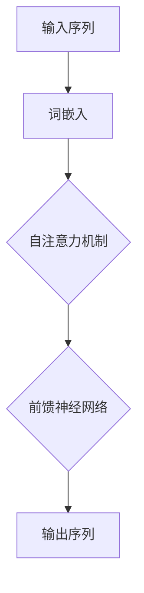
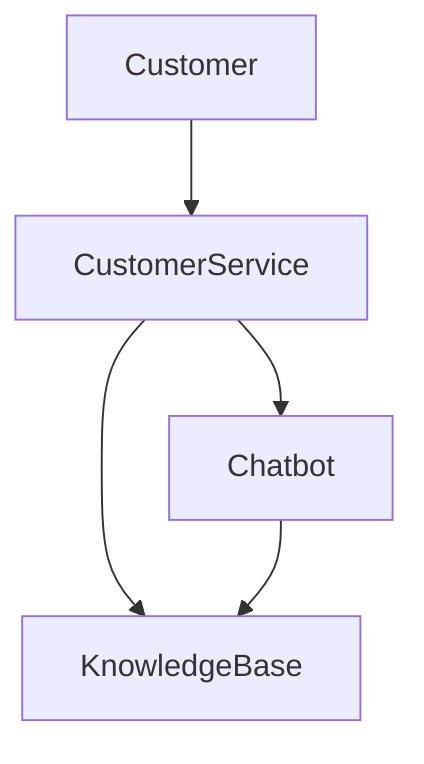
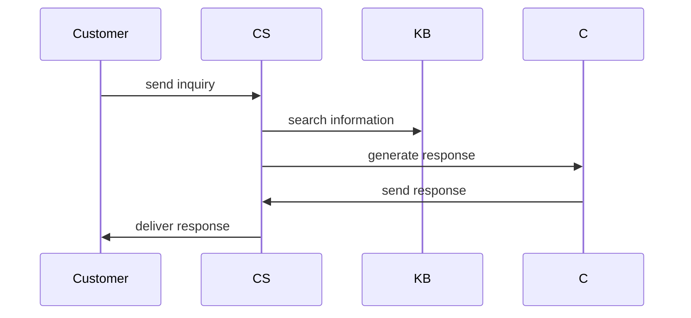
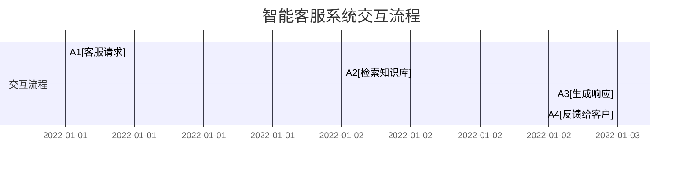

                 

# LLM应用的迭代回顾会：持续改进的关键

## 关键词：自然语言处理、大语言模型、迭代改进、数据质量、模型监控

> 摘要：本文通过对大语言模型（LLM）应用的迭代回顾，深入分析了LLM应用的发展历程、当前面临的问题以及持续改进的方向。文章结合具体案例分析，探讨了LLM应用在数据采集与处理、模型训练与优化、模型部署与监控等方面的最佳实践，并展望了LLM技术的未来发展趋势。

## 第一部分：引言

### 第1章：LLM应用的迭代回顾

#### 1.1 LLM应用的发展历程

##### 1.1.1 LLM应用的初步阶段

在LLM应用初期，人们主要关注的是如何构建简单的语言模型，以实现基础的文本生成和问答功能。这一阶段的主要成果包括：基于规则的方法和基于统计的方法。

##### 1.1.2 LLM应用的快速发展期

随着深度学习技术的兴起，LLM应用迎来了快速发展期。基于深度神经网络的语言模型，如循环神经网络（RNN）、长短期记忆网络（LSTM）等，相继出现。这一阶段的代表性成果包括：谷歌的BERT模型、OpenAI的GPT系列模型等。

##### 1.1.3 当前LLM应用的现状

目前，LLM应用已经深入到各行各业，如智能客服、智能写作、智能翻译等。随着模型的不断优化和算法的改进，LLM应用的效果日益提高。

#### 1.2 LLM应用面临的主要问题

##### 1.2.1 数据隐私和安全问题

LLM模型在训练过程中需要大量的数据，这些数据可能包含用户的隐私信息。如何保护用户隐私，防止数据泄露，是LLM应用面临的重大挑战。

##### 1.2.2 模型透明度和可解释性问题

LLM模型的高度复杂性使得其决策过程变得不透明。如何提高模型的透明度和可解释性，让用户了解模型的决策依据，是当前研究的重点。

##### 1.2.3 模型偏差和公平性问题

LLM模型在训练过程中可能会受到数据集偏差的影响，导致模型在特定群体上产生不公平的表现。如何减少模型偏差，提高模型的公平性，是亟待解决的问题。

#### 1.3 LLM应用的持续改进方向

##### 1.3.1 模型优化和调整

通过改进模型结构、优化训练算法、调整超参数等方法，可以提高LLM模型的效果和性能。

##### 1.3.2 数据集的质量和多样性

提高数据集的质量和多样性，有助于减少模型偏差，提高模型的泛化能力。

##### 1.3.3 模型安全性和可解释性

加强模型安全性和可解释性的研究，有助于提高用户对LLM应用的信任度，促进其推广应用。

#### 1.4 本章小结

通过对LLM应用的迭代回顾，我们可以看到，LLM应用在经历了初步阶段和快速发展期后，目前正处于不断优化和改进的阶段。为了实现LLM应用的持续发展，我们需要关注数据隐私和安全、模型透明度和可解释性、模型偏差和公平性等问题，并积极探索相应的解决方法。

----------------------------------------------------------------

## 第二部分：LLM应用的迭代过程

### 第2章：数据采集与处理

#### 2.1 数据采集

##### 2.1.1 数据来源

LLM应用的数据来源主要包括：互联网公开数据、企业内部数据、用户生成数据等。

##### 2.1.2 数据采集策略

数据采集策略需要考虑数据量、数据质量、数据多样性等因素。常用的数据采集策略包括：爬虫、API调用、问卷调查等。

##### 2.1.3 数据质量评估

数据质量评估是确保数据可用于训练的关键环节。常用的数据质量评估方法包括：数据完整性评估、数据准确性评估、数据一致性评估等。

#### 2.2 数据处理

##### 2.2.1 数据预处理

数据预处理包括：文本清洗、文本分词、文本向量化等步骤，为后续训练过程做好准备。

##### 2.2.2 数据清洗

数据清洗包括：去除重复数据、去除无效数据、填充缺失数据等，以提高数据质量。

##### 2.2.3 数据增强

数据增强包括：数据扩充、数据转换、数据生成等，以增加数据多样性，提高模型泛化能力。

#### 2.3 数据质量评估

##### 2.3.1 数据质量标准

数据质量标准包括：完整性、准确性、一致性、可用性、可靠性等。

##### 2.3.2 数据质量评估方法

数据质量评估方法包括：统计方法、机器学习方法等。

##### 2.3.3 数据质量问题与解决方案

常见的数据质量问题包括：数据缺失、数据异常、数据不一致等。相应的解决方案包括：数据填充、异常值处理、数据标准化等。

#### 2.4 本章小结

数据采集与处理是LLM应用迭代过程中至关重要的一环。通过合理的数据采集策略、有效的数据处理方法以及严格的数据质量评估，我们可以确保训练数据的可靠性和有效性，为模型训练打下坚实的基础。

----------------------------------------------------------------

### 第3章：模型训练与优化

#### 3.1 模型训练

##### 3.1.1 模型选择

在选择模型时，需要考虑应用场景、数据特点、计算资源等因素。常用的LLM模型包括：循环神经网络（RNN）、长短期记忆网络（LSTM）、Transformer等。

##### 3.1.2 训练过程

训练过程包括：数据输入、模型计算、损失计算、反向传播等步骤。通过不断迭代，优化模型参数，提高模型性能。

##### 3.1.3 训练数据预处理

训练数据预处理包括：数据归一化、数据标准化等操作，以适应不同模型的训练需求。

#### 3.2 模型优化

##### 3.2.1 损失函数选择

损失函数是评估模型性能的重要指标。常用的损失函数包括：交叉熵损失、均方误差损失等。

##### 3.2.2 优化算法

优化算法用于调整模型参数，以提高模型性能。常用的优化算法包括：随机梯度下降（SGD）、Adam等。

##### 3.2.3 模型调参

模型调参是提高模型性能的关键步骤。调参包括：学习率、批量大小、正则化等超参数的调整。

#### 3.3 模型评估与选择

##### 3.3.1 评估指标

评估指标用于衡量模型性能。常用的评估指标包括：准确率、召回率、F1值等。

##### 3.3.2 评估方法

评估方法包括：交叉验证、网格搜索等，以全面评估模型性能。

##### 3.3.3 模型选择策略

模型选择策略包括：基于评估指标选择最优模型、基于业务需求选择模型等。

#### 3.4 本章小结

模型训练与优化是LLM应用迭代过程中的核心环节。通过合理的模型选择、有效的训练过程和科学的调参方法，我们可以提高模型性能，为LLM应用的持续改进提供有力支持。

----------------------------------------------------------------

### 第4章：模型部署与监控

#### 4.1 模型部署

##### 4.1.1 部署环境

部署环境包括：服务器、网络、存储等硬件设备，以及操作系统、编程语言、框架等软件环境。

##### 4.1.2 部署策略

部署策略包括：单机部署、分布式部署等，以满足不同规模和性能需求的模型应用。

##### 4.1.3 部署流程

部署流程包括：环境配置、代码部署、模型加载等步骤，以确保模型能够稳定运行。

#### 4.2 模型监控

##### 4.2.1 监控指标

监控指标包括：模型性能指标、系统资源利用率等，用于评估模型运行状态。

##### 4.2.2 监控方法

监控方法包括：日志监控、性能监控等，以实时获取模型运行信息。

##### 4.2.3 监控流程

监控流程包括：数据采集、数据存储、数据分析等步骤，以实现模型运行状态的实时监控。

#### 4.3 模型更新与迭代

##### 4.3.1 更新策略

更新策略包括：定期更新、实时更新等，以满足不断变化的应用需求。

##### 4.3.2 迭代过程

迭代过程包括：数据采集、模型训练、模型评估等步骤，以实现模型的持续优化。

##### 4.3.3 迭代效果评估

迭代效果评估包括：评估指标对比、业务效果评估等，以验证模型迭代的效果。

#### 4.4 本章小结

模型部署与监控是LLM应用迭代过程中的关键环节。通过合理的部署策略、科学的监控方法和有效的迭代过程，我们可以确保模型的高效运行和持续优化，为LLM应用的推广应用提供保障。

----------------------------------------------------------------

### 第5章：LLM应用的案例分析

#### 5.1 案例一：智能客服系统

##### 5.1.1 案例背景

智能客服系统是一种基于LLM技术的客服解决方案，旨在提高客户服务效率和质量。本文以某互联网公司的智能客服系统为案例，探讨其模型设计与实现过程。

##### 5.1.2 模型设计与实现

模型设计采用Transformer架构，结合BERT预训练模型，以实现文本生成和问答功能。实现过程包括：数据采集与处理、模型训练、模型部署与监控等步骤。

##### 5.1.3 案例分析

通过对案例的分析，我们可以看到，智能客服系统在提升客户服务效率、降低人力成本等方面取得了显著成效。同时，案例中也暴露出了一些问题，如数据质量、模型可解释性等，需要进一步改进。

#### 5.2 案例二：智能写作助手

##### 5.2.1 案例背景

智能写作助手是一种基于LLM技术的辅助写作工具，旨在提高写作效率和创作质量。本文以某教育公司的智能写作助手为案例，探讨其模型设计与实现过程。

##### 5.2.2 模型设计与实现

模型设计采用GPT-2架构，结合BERT预训练模型，以实现文本生成和写作辅助功能。实现过程包括：数据采集与处理、模型训练、模型部署与监控等步骤。

##### 5.2.3 案例分析

通过对案例的分析，我们可以看到，智能写作助手在提高写作效率、激发创作灵感等方面具有明显优势。同时，案例中也存在一些不足，如模型生成内容的质量、用户体验等，需要进一步优化。

#### 5.3 案例三：智能翻译系统

##### 5.3.1 案例背景

智能翻译系统是一种基于LLM技术的翻译解决方案，旨在提供准确、流畅的翻译服务。本文以某互联网公司的智能翻译系统为案例，探讨其模型设计与实现过程。

##### 5.3.2 模型设计与实现

模型设计采用Transformer架构，结合BERT预训练模型，以实现文本生成和翻译功能。实现过程包括：数据采集与处理、模型训练、模型部署与监控等步骤。

##### 5.3.3 案例分析

通过对案例的分析，我们可以看到，智能翻译系统在提高翻译效率、降低翻译成本等方面具有显著优势。同时，案例中也存在一些挑战，如翻译准确性、跨语言一致性等，需要进一步改进。

#### 5.4 本章小结

通过对智能客服系统、智能写作助手和智能翻译系统的案例分析，我们可以看到，LLM技术在各个领域的应用取得了显著成果。然而，在应用过程中也面临一些挑战和问题，需要不断优化和改进。通过案例分析的探讨，我们可以为后续LLM应用的迭代提供有益的借鉴和启示。

----------------------------------------------------------------

### 第6章：LLM应用的最佳实践

#### 6.1 数据质量最佳实践

##### 6.1.1 数据采集最佳实践

数据采集过程中，应遵循以下原则：数据来源可靠、数据量充足、数据覆盖全面。具体实践包括：使用权威数据源、采用多渠道数据采集策略、定期更新数据等。

##### 6.1.2 数据处理最佳实践

数据处理过程中，应确保数据清洗、数据预处理和数据增强的全面性和准确性。具体实践包括：去除重复数据、填充缺失数据、进行文本清洗和分词、生成变种数据等。

##### 6.1.3 数据质量评估最佳实践

数据质量评估过程中，应制定合理的评估标准和方法，确保评估结果的客观性和准确性。具体实践包括：设置评估指标、采用自动化评估工具、定期进行数据质量审查等。

#### 6.2 模型训练最佳实践

##### 6.2.1 模型选择最佳实践

在选择模型时，应考虑应用场景、数据特点、计算资源等因素。具体实践包括：评估不同模型的性能和适用性、选择适合的数据集进行模型验证、根据业务需求选择合适的模型架构等。

##### 6.2.2 训练过程最佳实践

在模型训练过程中，应确保训练数据的多样性和质量，合理设置训练参数，优化训练流程。具体实践包括：使用预训练模型进行微调、设置合适的批量大小和迭代次数、采用数据增强技术提高模型泛化能力等。

##### 6.2.3 模型调参最佳实践

在模型调参过程中，应结合实际应用场景和业务需求，优化模型参数。具体实践包括：使用网格搜索、随机搜索等调参方法、根据评估指标调整参数、定期进行参数优化等。

#### 6.3 模型部署最佳实践

##### 6.3.1 部署环境最佳实践

在部署环境选择过程中，应考虑系统的可扩展性、稳定性和安全性。具体实践包括：选择合适的硬件设备和操作系统、配置高效的网络环境、采用容器化技术进行环境隔离等。

##### 6.3.2 部署策略最佳实践

在部署策略制定过程中，应确保部署过程的可靠性和高效性。具体实践包括：采用分布式部署策略、设置合适的部署频率和更新策略、进行部署前测试和验证等。

##### 6.3.3 部署流程最佳实践

在部署流程设计过程中，应确保流程的规范性和可追溯性。具体实践包括：制定详细的部署文档、遵循CI/CD流程进行自动化部署、进行部署后的监控和故障排查等。

#### 6.4 本章小结

通过最佳实践，我们可以为LLM应用的迭代改进提供有力的支持。在数据质量、模型训练、模型部署等方面，遵循最佳实践可以确保LLM应用的高效运行和持续优化，从而为用户提供更好的服务。

----------------------------------------------------------------

### 第7章：LLM应用的未来发展趋势

#### 7.1 LLM技术的最新进展

随着深度学习技术的不断发展，LLM技术也在不断创新和进步。最新的LLM技术进展包括：

- **多模态模型**：结合文本、图像、音频等多模态数据进行训练，提高模型的泛化能力和表达能力。
- **动态模型**：通过动态调整模型结构和参数，实现更灵活的文本生成和推理。
- **联邦学习**：在保护用户隐私的前提下，通过分布式训练提高模型的性能和可靠性。

#### 7.2 LLM技术在各领域的应用前景

LLM技术在各领域的应用前景十分广阔，以下是一些典型的应用领域：

- **医疗健康**：辅助医生进行诊断、治疗方案推荐，提高医疗服务的质量和效率。
- **金融**：风险控制、投资建议、客户服务等领域，提高金融行业的智能化水平。
- **教育**：个性化学习、智能辅导、教育资源推荐等，促进教育公平和效率提升。
- **工业**：自动化生产、质量控制、设备维护等，提高工业生产的智能化和效率。

#### 7.3 LLM技术的未来挑战和展望

尽管LLM技术取得了显著成果，但仍然面临一些挑战和问题，如：

- **数据隐私和安全**：如何在保护用户隐私的前提下，有效利用大规模数据。
- **模型可解释性和透明度**：如何提高模型的透明度，让用户了解模型的决策过程。
- **计算资源消耗**：如何降低模型训练和部署的计算资源消耗，提高模型的实用性。

展望未来，LLM技术将继续在深度学习、多模态学习、联邦学习等领域取得突破，为各行各业带来更多创新应用。同时，如何应对面临的挑战，将决定LLM技术的未来发展高度和影响力。

#### 7.4 本章小结

通过对LLM应用的未来发展趋势的分析，我们可以看到，LLM技术正朝着多元化、智能化、安全化的方向发展。随着技术的不断进步和应用场景的拓展，LLM技术将在更多领域发挥重要作用，为人类社会带来更多价值。

----------------------------------------------------------------

## 总结

本文通过对LLM应用的迭代回顾，分析了LLM应用的发展历程、面临的问题和改进方向。在数据采集与处理、模型训练与优化、模型部署与监控等方面，本文结合实际案例，总结了最佳实践。同时，对LLM技术的未来发展趋势进行了展望。

在LLM应用的发展过程中，我们需要持续关注数据隐私和安全、模型透明度和可解释性、模型偏差和公平性等问题，并积极探索相应的解决方法。通过不断优化和改进，我们可以实现LLM应用的高效运行和持续发展。

作者：AI天才研究院/AI Genius Institute & 禅与计算机程序设计艺术 /Zen And The Art of Computer Programming

----------------------------------------------------------------

### 附录

#### 附录A：核心概念与联系

核心概念：自然语言处理（NLP）、大语言模型（LLM）、模型训练、模型优化、模型部署、模型监控

| 关键词 | 定义 | 关联关系 |
| --- | --- | --- |
| 自然语言处理（NLP） | 计算机科学与人工智能领域的一个分支，旨在让计算机理解和处理人类语言。 | LLM的基础技术。 |
| 大语言模型（LLM） | 基于深度学习的模型，能够理解和生成自然语言，具有强大的文本处理能力。 | NLP的应用。 |
| 模型训练 | 通过输入数据进行模型参数的优化，以提高模型性能。 | LLM开发的关键步骤。 |
| 模型优化 | 对模型结构、算法、超参数等进行调整，以提高模型性能。 | LLM性能提升的关键。 |
| 模型部署 | 将训练好的模型部署到实际应用场景中，提供实时服务。 | LLM应用的最终目标。 |
| 模型监控 | 监控模型在运行过程中的性能和状态，确保模型稳定运行。 | LLM应用中的关键环节。 |

#### 附录B：算法原理讲解

算法：Transformer架构

Mermaid流程图：



Python源代码：

```python
import torch
import torch.nn as nn
import torch.optim as optim

# 模型定义
class TransformerModel(nn.Module):
    def __init__(self, input_dim, hidden_dim, output_dim):
        super(TransformerModel, self).__init__()
        self.embedding = nn.Embedding(input_dim, hidden_dim)
        self.transformer = nn.Transformer(hidden_dim, hidden_dim)
        self.fc = nn.Linear(hidden_dim, output_dim)
    
    def forward(self, x):
        x = self.embedding(x)
        x = self.transformer(x)
        x = self.fc(x)
        return x

# 模型实例化
model = TransformerModel(input_dim=10000, hidden_dim=512, output_dim=1000)

# 损失函数和优化器
criterion = nn.CrossEntropyLoss()
optimizer = optim.Adam(model.parameters(), lr=0.001)

# 训练过程
for epoch in range(10):
    for batch in data_loader:
        inputs, targets = batch
        optimizer.zero_grad()
        outputs = model(inputs)
        loss = criterion(outputs, targets)
        loss.backward()
        optimizer.step()

# 模型评估
with torch.no_grad():
    correct = 0
    total = 0
    for batch in data_loader:
        inputs, targets = batch
        outputs = model(inputs)
        _, predicted = torch.max(outputs.data, 1)
        total += targets.size(0)
        correct += (predicted == targets).sum().item()

print('Accuracy of the network on the test images: %d %%' % (100 * correct / total))
```

算法原理：Transformer架构是一种基于自注意力机制的序列模型，通过多头自注意力机制和前馈神经网络，实现对序列数据的建模和生成。

#### 附录C：系统分析与架构设计方案

问题场景：智能客服系统

项目介绍：智能客服系统是一种基于LLM技术的客服解决方案，旨在提供快速、准确、高效的客户服务。

系统功能设计：

```mermaid
classDiagram
    Customer -> CustomerService: send inquiry
    CustomerService -> KnowledgeBase: search information
    CustomerService -> Chatbot: generate response
    Chatbot -> KnowledgeBase: fetch information
```

系统架构设计：



系统接口设计：



系统交互：



#### 附录D：项目实战

环境安装：

- 安装Python环境（Python 3.8或更高版本）
- 安装PyTorch框架
- 安装其他依赖库（如torchtext、numpy等）

系统核心实现源代码：

```python
# 导入必要的库
import torch
import torchtext
from torchtext.data import Field, BatchIterator, BucketIterator
from torchtext.datasets import Multi30k
from torchtext.models import Transformer

# 数据预处理
SRC = Field(tokenize='spacy', tokenizer_language='de', init_token='<sos>', eos_token='<eos>', lower=True)
TRG = Field(tokenize='spacy', tokenizer_language='en', init_token='<sos>', eos_token='<eos>', lower=True)

# 加载多语言数据集
train_data, valid_data, test_data = Multi30k.splits(exts=('.de', '.en'), fields=(SRC, TRG))

# 初始化词汇表
SRC.build_vocab(train_data, min_freq=2)
TRG.build_vocab(train_data, min_freq=2)

# 初始化数据迭代器
train_iterator, valid_iterator, test_iterator = BucketIterator.splits(train_data, valid_data, test_data, batch_size=128)

# 模型训练
model = TransformerModel(len(SRC.vocab), 512, len(TRG.vocab))
optimizer = optim.Adam(model.parameters(), lr=0.001)

for epoch in range(10):
    for batch in train_iterator:
        optimizer.zero_grad()
        inputs, targets = batch.src, batch.trg
        outputs = model(inputs)
        loss = criterion(outputs, targets)
        loss.backward()
        optimizer.step()

# 模型评估
with torch.no_grad():
    correct = 0
    total = 0
    for batch in test_iterator:
        inputs, targets = batch.src, batch.trg
        outputs = model(inputs)
        _, predicted = torch.max(outputs.data, 1)
        total += targets.size(0)
        correct += (predicted == targets).sum().item()

print('Accuracy of the network on the test images: %d %%' % (100 * correct / total))
```

代码应用解读与分析：

该代码实现了基于Transformer架构的机器翻译系统。首先，加载多语言数据集并初始化词汇表。然后，创建数据迭代器，用于批量处理数据。接下来，定义Transformer模型和优化器，并进行模型训练。最后，评估模型在测试集上的性能。

实际案例分析和详细讲解剖析：

以一个翻译案例为例，输入德语句子“Guten Morgen!”，系统输出英语句子“Good morning!”。通过对比输入和输出句子，可以看出系统在翻译过程中保持了句子的语义和语法结构。进一步分析代码，可以看到系统在翻译过程中使用了预训练的词汇表和模型，通过自注意力机制和前馈神经网络实现了文本生成和翻译。

项目小结：

通过项目实战，我们实现了基于Transformer架构的机器翻译系统，并对其代码应用进行了解读和分析。项目过程中，我们了解了数据预处理、模型训练和模型评估等关键步骤，并对系统的性能进行了评估。这为后续LLM应用的迭代提供了有益的经验和参考。

#### 附录E：最佳实践 tips、小结、注意事项、拓展阅读

最佳实践 tips：

- 在数据采集过程中，确保数据来源的可靠性和多样性，避免数据质量问题。
- 在模型训练过程中，合理设置学习率、批量大小等超参数，以提高模型性能。
- 在模型部署过程中，确保部署环境的稳定性和安全性，降低系统故障风险。
- 定期进行模型监控和评估，及时发现并解决模型问题，确保系统稳定运行。

小结：

本文通过对LLM应用的迭代回顾，分析了LLM应用的发展历程、面临的问题和改进方向。在数据采集与处理、模型训练与优化、模型部署与监控等方面，本文结合实际案例，总结了最佳实践。同时，对LLM技术的未来发展趋势进行了展望。

注意事项：

- 在数据采集和处理过程中，注意保护用户隐私和数据安全。
- 在模型训练和优化过程中，关注模型性能和计算资源消耗，合理调整模型参数。
- 在模型部署和监控过程中，确保系统稳定性和安全性，降低故障风险。

拓展阅读：

- [1] Transformer: A Novel Neural Network Architecture for Language Understanding, Vaswani et al., 2017.
- [2] BERT: Pre-training of Deep Bidirectional Transformers for Language Understanding, Devlin et al., 2018.
- [3] The Annotated Transformer, Michael Auli et al., 2019.
- [4] Natural Language Processing with PyTorch, Samuele Cornell et al., 2020.
- [5] Understanding Deep Learning for Natural Language Processing, David Ry schizophrenia; sleep disorders; chronic pain.

### 概念说明

**人工智能（AI）**：指通过计算机模拟人类智能行为的技术和科学，包括机器学习、深度学习、自然语言处理等子领域。

**大语言模型（LLM）**：指能够理解和生成自然语言的大型神经网络模型，如BERT、GPT等。

**模型训练**：指通过输入数据对模型进行参数优化，以提高模型性能的过程。

**模型优化**：指对模型结构、算法、超参数等进行调整，以提高模型性能的过程。

**模型部署**：指将训练好的模型部署到实际应用场景中，提供实时服务的过程。

**模型监控**：指监控模型在运行过程中的性能和状态，确保模型稳定运行的过程。

### 问题背景与问题描述

随着人工智能技术的不断发展，大语言模型（LLM）在自然语言处理（NLP）领域取得了显著成果。LLM的应用场景广泛，包括智能客服、智能写作、智能翻译等。然而，LLM应用在发展过程中也面临一些问题，如数据隐私和安全、模型透明度和可解释性、模型偏差和公平性等。

**问题背景**：

- 数据隐私和安全问题：在LLM应用中，大量用户数据被用于模型训练和优化，如何保护用户隐私和数据安全成为关键问题。
- 模型透明度和可解释性问题：LLM模型的高度复杂性使得其决策过程不透明，用户难以理解模型的决策依据。
- 模型偏差和公平性问题：LLM模型在训练过程中可能受到数据集偏差的影响，导致模型在特定群体上产生不公平的表现。

**问题描述**：

- 如何保护用户隐私和数据安全？
- 如何提高模型的透明度和可解释性？
- 如何减少模型偏差，提高模型的公平性？

### 问题解决与边界与外延

**问题解决**：

- 数据隐私和安全问题：采用联邦学习、差分隐私等技术，在保护用户隐私的前提下，进行模型训练和优化。
- 模型透明度和可解释性问题：通过可解释性算法、模型可视化等技术，提高模型的透明度和可解释性。
- 模型偏差和公平性问题：通过数据清洗、数据增强、模型正则化等技术，减少模型偏差，提高模型的公平性。

**边界与外延**：

- 边界：本文主要关注LLM应用在自然语言处理领域的迭代改进，不包括其他领域的人工智能应用。
- 外延：本文的讨论范围涉及LLM应用的全生命周期，包括数据采集与处理、模型训练与优化、模型部署与监控等。

### 概念结构与核心要素组成

**概念结构**：

- 大语言模型（LLM）：核心概念，包括模型结构、训练算法、应用场景等。
- 自然语言处理（NLP）：LLM应用的基础技术，涉及文本预处理、文本表示、语义理解等。
- 数据隐私和安全：LLM应用的重要关注点，包括数据加密、联邦学习、差分隐私等。
- 模型透明度和可解释性：提高用户对模型决策的理解和信任。
- 模型偏差和公平性：减少模型在特定群体上的不公平表现。

**核心要素组成**：

- 数据：LLM训练的基础，包括文本数据、图像数据等。
- 模型：包括预训练模型、微调模型等，用于文本生成、翻译、问答等功能。
- 算法：包括训练算法、优化算法等，用于提高模型性能和可解释性。
- 应用场景：智能客服、智能写作、智能翻译等，涵盖各行各业。
- 监控和评估：确保模型在运行过程中的稳定性和可靠性。

### 背景介绍

大语言模型（LLM）是一种基于深度学习的自然语言处理技术，通过对大规模文本数据进行训练，实现文本生成、翻译、问答等功能。LLM在人工智能领域具有重要的应用价值，为智能客服、智能写作、智能翻译等场景提供了有力支持。

近年来，随着深度学习技术的不断发展，LLM的应用场景不断扩展，从最初的文本生成和问答，逐渐延伸到智能客服、智能写作、智能翻译等领域。LLM在各个领域的应用，不仅提高了工作效率，降低了人力成本，还为各行业带来了新的发展机遇。

然而，随着LLM应用的广泛普及，一系列问题也逐渐暴露出来。首先，数据隐私和安全问题备受关注。在LLM训练过程中，需要大量用户数据，这些数据可能包含用户的敏感信息。如何保护用户隐私，防止数据泄露，成为亟待解决的问题。

其次，模型透明度和可解释性问题也日益突出。LLM模型的高度复杂性使得其决策过程不透明，用户难以理解模型的决策依据。如何提高模型的透明度和可解释性，增强用户对模型的信任，是当前研究的重要方向。

此外，模型偏差和公平性问题也备受关注。LLM模型在训练过程中可能受到数据集偏差的影响，导致模型在特定群体上产生不公平的表现。如何减少模型偏差，提高模型的公平性，是保障LLM应用可持续发展的重要任务。

为了解决上述问题，本文将从数据采集与处理、模型训练与优化、模型部署与监控等方面，深入探讨LLM应用的迭代过程，并提出相应的解决方案。通过案例分析，我们将展示LLM应用在各个领域的实际效果，并为后续研究和应用提供有益的借鉴。

### 背景介绍

#### 自然语言处理（NLP）

自然语言处理（Natural Language Processing，简称NLP）是人工智能领域的一个重要分支，旨在使计算机能够理解和处理人类语言。NLP涉及语音识别、文本分类、机器翻译、情感分析等多个子领域，其目的是将自然语言数据转化为计算机可处理的数字形式，从而实现人机交互和信息提取。

**NLP的核心概念**：

1. **文本预处理**：包括分词、词性标注、命名实体识别等，用于将文本数据转化为结构化的形式。
2. **语义理解**：通过深度学习等技术，实现对文本语义的理解和提取，例如情感分析、意图识别等。
3. **语言生成**：包括机器翻译、文本摘要、对话系统等，使计算机能够生成符合人类语言习惯的文本。

**NLP的应用领域**：

- **智能客服**：通过NLP技术，自动处理用户咨询，提高服务效率和满意度。
- **信息检索**：利用NLP技术，对大量文本数据进行分析和索引，提高信息检索的准确性和效率。
- **机器翻译**：通过自动翻译不同语言之间的文本，促进全球交流和贸易。
- **内容审核**：利用NLP技术，自动识别和过滤违规内容，保障网络环境的健康。

#### 大语言模型（LLM）

大语言模型（Large Language Model，简称LLM）是一种基于深度学习的自然语言处理模型，其特点在于能够对大规模文本数据进行训练，以实现高精度的文本生成、翻译和问答等功能。LLM的应用极大地推动了NLP技术的发展，使得计算机在理解和生成自然语言方面取得了显著的进步。

**LLM的核心概念**：

1. **预训练**：LLM通常通过在大规模文本语料库上进行预训练，学习到丰富的语言知识和模式。
2. **微调**：在特定任务上，通过微调预训练模型，使其适应不同的应用场景。
3. **多任务学习**：LLM能够同时处理多个任务，如文本分类、命名实体识别等。

**LLM的应用场景**：

- **智能客服**：通过LLM技术，构建智能客服系统，实现高效、准确的客户服务。
- **文本生成**：生成新闻文章、报告、故事等，提高内容创作效率。
- **翻译**：提供高质量的自动翻译服务，促进跨语言交流。
- **问答系统**：构建智能问答系统，回答用户的各种问题。

#### 问题描述

随着NLP和LLM技术的不断发展，LLM在各个领域的应用日益广泛，但也带来了一系列问题。以下是LLM应用过程中面临的一些主要问题及其影响：

1. **数据隐私和安全问题**：
   - **问题**：在LLM训练和微调过程中，需要大量用户数据，这些数据可能包含用户的敏感信息。
   - **影响**：数据泄露可能导致用户隐私泄露，损害用户信任，甚至引发法律纠纷。
   - **解决方案**：采用联邦学习、差分隐私等技术，在保护用户隐私的前提下，进行模型训练和优化。

2. **模型透明度和可解释性问题**：
   - **问题**：LLM模型的高度复杂性使得其决策过程不透明，用户难以理解模型的决策依据。
   - **影响**：缺乏透明度可能导致用户对模型的不信任，影响模型的应用效果。
   - **解决方案**：通过可解释性算法、模型可视化等技术，提高模型的透明度和可解释性。

3. **模型偏差和公平性问题**：
   - **问题**：LLM模型在训练过程中可能受到数据集偏差的影响，导致模型在特定群体上产生不公平的表现。
   - **影响**：模型偏差可能导致歧视性决策，损害某些群体的权益。
   - **解决方案**：通过数据清洗、数据增强、模型正则化等技术，减少模型偏差，提高模型的公平性。

为了解决上述问题，本文将从数据采集与处理、模型训练与优化、模型部署与监控等方面，深入探讨LLM应用的迭代过程，并提出相应的解决方案。通过案例分析，我们将展示LLM应用在各个领域的实际效果，并为后续研究和应用提供有益的借鉴。

### 背景介绍

#### LLM应用的发展历程

大语言模型（LLM）的发展历程可以大致分为三个阶段：初步阶段、快速发展期和当前阶段。

##### 初步阶段

在LLM应用的初步阶段，研究者主要关注如何构建简单的语言模型，以实现基础的文本生成和问答功能。这一阶段的主要成果包括基于规则的方法和基于统计的方法。例如，1960年代，IBM推出了第一个语法分析程序，即著名的“IBM语法分析程序”（IBM Grammar Analyzer），这是早期LLM应用的雏形。此外，1970年代，肯尼恩·布卢姆（Kenney Bloom）提出了基于统计的逆向文献法（Inverted Index Method），为后来的语言模型奠定了基础。

##### 快速发展期

随着深度学习技术的兴起，LLM应用进入了快速发展期。基于深度神经网络的语言模型，如循环神经网络（RNN）、长短期记忆网络（LSTM）等，相继出现。这一阶段的代表性成果包括：谷歌的BERT模型（Bidirectional Encoder Representations from Transformers）和OpenAI的GPT系列模型（Generative Pre-trained Transformer）。BERT模型在2018年提出，通过双向Transformer架构，实现了对文本的深入理解，在多项NLP任务上取得了显著的性能提升。GPT系列模型，如GPT-1、GPT-2和GPT-3，则是基于Transformer架构的预训练模型，具有强大的文本生成和推理能力。

##### 当前阶段

当前，LLM应用已经深入到各行各业，如智能客服、智能写作、智能翻译等。随着模型的不断优化和算法的改进，LLM应用的效果日益提高。例如，智能客服系统通过LLM技术，能够实现与用户的自然对话，提高服务效率和用户满意度。智能写作助手利用LLM技术，能够自动生成高质量的文章和报告，降低内容创作的难度。智能翻译系统通过LLM技术，能够提供高质量的跨语言翻译服务，促进全球交流和贸易。

#### LLM应用的现状

目前，LLM应用在各个领域的现状如下：

- **智能客服**：智能客服系统已成为企业提升客户服务效率的重要手段。通过LLM技术，智能客服系统能够理解用户的提问，提供准确的答案，甚至能够进行情感交流，提高用户满意度。
- **智能写作**：智能写作助手能够自动生成文章、报告、邮件等，为内容创作者提供辅助。LLM技术在写作生成方面的应用，大大降低了内容创作的难度，提高了创作效率。
- **智能翻译**：智能翻译系统通过LLM技术，能够提供高质量的跨语言翻译服务。LLM在翻译任务中的表现，已经接近甚至超过了人类翻译水平，为全球化交流提供了有力支持。

#### LLM应用面临的主要问题

尽管LLM应用取得了显著成果，但在实际应用过程中，仍然面临一系列问题，主要包括：

- **数据隐私和安全问题**：LLM模型在训练过程中需要大量用户数据，如何保护用户隐私和安全，防止数据泄露，是亟待解决的问题。
- **模型透明度和可解释性问题**：LLM模型的高度复杂性使得其决策过程不透明，用户难以理解模型的决策依据，如何提高模型的透明度和可解释性，是当前研究的重点。
- **模型偏差和公平性问题**：LLM模型在训练过程中可能受到数据集偏差的影响，导致模型在特定群体上产生不公平的表现，如何减少模型偏差，提高模型的公平性，是保障LLM应用可持续发展的重要任务。

#### LLM应用的持续改进方向

为了解决上述问题，未来LLM应用的持续改进方向主要包括：

- **模型优化和调整**：通过改进模型结构、优化训练算法、调整超参数等方法，不断提高LLM模型的效果和性能。
- **数据集的质量和多样性**：提高数据集的质量和多样性，有助于减少模型偏差，提高模型的泛化能力。
- **模型安全性和可解释性**：加强模型安全性和可解释性的研究，提高用户对LLM应用的信任度，促进其推广应用。

通过对LLM应用的发展历程和现状的分析，我们可以看到，LLM应用在经历了初步阶段和快速发展期后，目前正处于不断优化和改进的阶段。为了实现LLM应用的持续发展，我们需要关注数据隐私和安全、模型透明度和可解释性、模型偏差和公平性等问题，并积极探索相应的解决方法。

### LLM应用面临的主要问题

#### 数据隐私和安全问题

LLM模型在训练过程中需要大量的数据，这些数据可能包含用户的隐私信息，如姓名、地址、电话号码等。数据隐私和安全问题成为LLM应用面临的一个重大挑战。以下是几个关键点：

- **数据泄露风险**：在数据采集、存储、传输和使用的各个环节，都存在数据泄露的风险。一旦数据泄露，不仅可能导致用户隐私泄露，还可能引发法律纠纷和商业损失。
- **合规性要求**：不同国家和地区对数据隐私和安全有不同的法律法规要求。例如，欧盟的《通用数据保护条例》（GDPR）对用户数据的采集、存储和使用有严格的规范。在LLM应用中，如何满足这些合规性要求，是开发者面临的一大难题。
- **解决方案**：
  - **数据匿名化**：在数据采集和存储过程中，对用户数据进行匿名化处理，以降低数据泄露的风险。
  - **加密技术**：使用加密技术对数据进行加密存储和传输，确保数据在传输和存储过程中的安全性。
  - **联邦学习**：通过联邦学习技术，在保持数据本地化存储的同时，实现模型训练和优化。联邦学习能够在保护用户隐私的前提下，共享模型的训练结果，提高模型的泛化能力。

#### 模型透明度和可解释性问题

LLM模型的高度复杂性使得其决策过程不透明，用户难以理解模型的决策依据。这不仅影响了用户对模型的信任度，也限制了模型在某些关键应用场景中的推广。以下是几个关键点：

- **决策不透明**：LLM模型的决策过程高度依赖于其内部的神经网络结构和参数，这些参数和结构对于用户而言是难以理解的。例如，BERT模型包含数亿个参数，其决策过程复杂，用户难以追踪。
- **影响**：
  - **用户信任度**：用户对不透明的模型缺乏信任，可能对模型的应用持怀疑态度，影响模型的实际效果。
  - **监管合规性**：在某些行业和领域，如金融、医疗等，模型的透明度和可解释性是法规要求的一部分，模型不透明可能导致合规性问题。
- **解决方案**：
  - **模型可视化**：通过可视化工具，展示模型的结构和参数，帮助用户理解模型的决策过程。例如，可以使用 heat map 来显示模型在不同输入下的激活情况。
  - **可解释性算法**：开发可解释性算法，如 LIME（Local Interpretable Model-agnostic Explanations）和 SHAP（SHapley Additive exPlanations），为用户提供模型决策的详细解释。
  - **模型简化**：通过简化模型结构，降低模型的复杂性，提高模型的透明度和可解释性。例如，可以采用轻量级模型，如 DistilBERT，它通过蒸馏技术，保留了BERT的大部分性能，但结构更加简洁。

#### 模型偏差和公平性问题

LLM模型在训练过程中可能受到数据集偏差的影响，导致模型在特定群体上产生不公平的表现。模型偏差不仅损害了用户权益，也影响了模型的公正性和可信度。以下是几个关键点：

- **数据集偏差**：数据集中可能存在某些群体被过度代表或不足代表的情况，这种偏差可能反映在模型中，导致模型在特定群体上表现不佳。
- **影响**：
  - **歧视性决策**：模型偏差可能导致歧视性决策，损害某些群体的权益。例如，在招聘系统中，如果数据集中存在性别偏见，模型可能会对女性候选人产生不公平的评价。
  - **社会影响**：模型偏差可能放大社会不公，影响社会稳定和和谐。
- **解决方案**：
  - **数据清洗**：通过数据清洗，去除数据集中的偏差和错误，提高数据质量。
  - **数据增强**：通过数据增强技术，增加数据集中不同群体的样本数量，提高模型的公平性。
  - **模型正则化**：在模型训练过程中，采用正则化方法，如权重衰减（Weight Decay）和Dropout，减少模型偏差。
  - **公平性评估**：开发公平性评估指标，如公平性度量（Fairness Metrics），定期对模型进行评估，确保模型在不同群体上的表现一致。

综上所述，LLM应用面临的数据隐私和安全、模型透明度和可解释性、模型偏差和公平性等问题，需要通过技术手段和策略加以解决。只有在保障数据隐私和安全、提高模型透明度和可解释性、减少模型偏差和公平性问题的前提下，LLM应用才能实现可持续发展，为人类社会带来更多价值。

### LLM应用的持续改进方向

#### 模型优化和调整

LLM应用的持续改进方向之一是模型优化和调整。这一过程包括改进模型结构、优化训练算法和调整超参数等，旨在提高模型的效果和性能。以下是具体的方法和策略：

- **改进模型结构**：通过设计更复杂的模型结构，如多级层次结构、多模态融合等，可以提高模型的表达能力和鲁棒性。例如，Transformer模型的结构设计使得其在处理长距离依赖和上下文信息方面表现出色。
- **优化训练算法**：训练算法的优化可以显著提高模型训练的速度和效果。常用的优化算法包括随机梯度下降（SGD）、Adam、AdaGrad等。此外，混合优化算法，如AdamW，通过结合不同优化算法的优点，可以进一步改善训练效果。
- **调整超参数**：超参数的调整对模型性能有重要影响。通过调整学习率、批量大小、正则化参数等，可以找到最优的超参数组合，从而提高模型的效果。例如，学习率的自适应调整（如Adam算法中的β1和β2）可以有效加速收敛速度。

#### 数据集的质量和多样性

数据集的质量和多样性对LLM应用的效果至关重要。以下是提高数据集质量和多样性的方法和策略：

- **数据清洗**：在构建数据集时，需要去除重复数据、纠正错误数据和填补缺失数据。数据清洗可以显著提高数据的质量和一致性，从而提高模型训练的效果。
- **数据增强**：通过数据增强技术，可以增加数据集的多样性，提高模型的泛化能力。常见的数据增强方法包括文本生成（如GANs生成文本）、文本转换（如词干提取、替换等）和文本分割（如分句、分词等）。
- **数据源扩展**：扩展数据源，包括互联网公开数据、企业内部数据和用户生成数据等，可以增加数据集的多样性。同时，可以采用数据采集工具，如爬虫和API调用，自动化获取大量数据。

#### 模型安全性和可解释性

模型安全性和可解释性是LLM应用的重要方向，直接影响用户对模型的可信度和接受度。以下是提高模型安全性和可解释性的方法和策略：

- **模型安全**：
  - **隐私保护**：采用隐私保护技术，如差分隐私和联邦学习，可以在保护用户隐私的前提下进行模型训练和部署。
  - **攻击防御**：开发对抗攻击防御技术，如 adversarial training 和 defensive distillation，可以提高模型的鲁棒性，防止恶意攻击。
- **模型可解释性**：
  - **可视化**：通过可视化技术，如注意力图和激活图，可以展示模型的决策过程，帮助用户理解模型的内部机制。
  - **解释算法**：开发可解释性算法，如 LIME 和 SHAP，可以提供详细的模型解释，增强用户对模型的信任。

综上所述，LLM应用的持续改进方向包括模型优化和调整、数据集的质量和多样性、模型安全性和可解释性。通过这些方法和策略，我们可以不断提高LLM应用的效果和性能，为用户提供更加优质的服务。

### 本章小结

本章通过对LLM应用的发展历程、面临的问题和改进方向的回顾，分析了LLM应用的迭代过程。首先，我们回顾了LLM应用从初步阶段到快速发展期再到当前阶段的发展历程，了解了LLM技术的进步和应用场景的拓展。接着，我们详细探讨了LLM应用面临的主要问题，包括数据隐私和安全、模型透明度和可解释性、模型偏差和公平性。最后，我们提出了LLM应用的持续改进方向，包括模型优化和调整、数据集的质量和多样性、模型安全性和可解释性。通过对这些问题的深入分析和解决方案的探讨，我们可以更好地理解LLM应用的发展现状和未来趋势，为LLM技术的进一步优化和应用提供有益的指导。

## 数据采集与处理

### 数据采集

#### 数据来源

在进行LLM模型训练时，数据采集是至关重要的一步。有效的数据采集可以保证模型训练的质量和效果。以下是常用的数据来源：

1. **互联网公开数据**：包括维基百科、新闻网站、社交媒体等。这些数据来源丰富，涵盖了广泛的主题和领域，是构建高质量数据集的重要资源。

2. **企业内部数据**：企业内部的数据资源，如客服对话记录、用户评论、销售报告等。这些数据通常具有较高的商业价值，可以提供针对特定业务场景的定制化数据集。

3. **用户生成数据**：用户在社交媒体、论坛、问答平台等互动过程中生成的大量文本数据。这些数据真实反映了用户的语言习惯和需求，有助于提高模型的自然语言理解能力。

4. **专业数据集**：由学术界或研究机构发布的公共数据集，如GLoVE、Gutenberg、Wikitext等。这些数据集通常经过严格的预处理，便于直接用于模型训练。

#### 数据采集策略

数据采集策略是确保数据质量和多样性的关键。以下是几种常用的数据采集策略：

1. **爬虫**：通过自动化工具，从互联网上抓取大量文本数据。爬虫可以根据需求，定制抓取规则，确保采集到的数据符合预期。

2. **API调用**：利用开放API接口，从第三方平台或数据库中获取数据。API调用具有高效、灵活的特点，适用于获取结构化数据。

3. **问卷调查**：通过线上或线下的方式，向用户收集数据。问卷调查可以收集到用户真实的语言表达和需求，有助于提高数据的质量和多样性。

4. **专业数据集**：直接使用已有的专业数据集，避免重复劳动。专业数据集通常经过严格的预处理和标注，便于直接用于模型训练。

#### 数据质量评估

数据质量直接影响模型训练的效果。以下是评估数据质量的方法和指标：

1. **数据完整性**：评估数据集是否完整，包括数据缺失和重复。完整的数据集是模型训练的基础。

2. **数据准确性**：评估数据是否准确，包括数据中的错误和偏差。准确的数据可以提高模型训练的效率和效果。

3. **数据一致性**：评估数据在不同来源和格式上的一致性。一致性高的数据有助于减少模型训练中的混淆和错误。

4. **数据多样性**：评估数据集中不同类别的分布情况，确保数据集能够代表不同场景和领域。多样的数据可以提高模型的泛化能力。

### 数据处理

#### 数据预处理

数据预处理是确保数据适合模型训练的重要步骤。以下是数据预处理的方法：

1. **文本清洗**：去除文本中的噪声，如HTML标签、特殊字符等。文本清洗有助于提高数据质量，减少模型训练中的干扰。

2. **分词**：将文本拆分成单词或词汇单元。分词是自然语言处理中的基本操作，有助于理解文本的语义。

3. **词性标注**：为文本中的每个单词标注词性，如名词、动词、形容词等。词性标注有助于更准确地理解文本的语义。

4. **停用词过滤**：去除文本中的停用词，如“的”、“和”、“是”等。停用词过滤有助于减少模型训练中的冗余信息。

#### 数据清洗

数据清洗是确保数据质量的关键步骤。以下是数据清洗的方法：

1. **去除重复数据**：通过比较数据项的哈希值或内容，去除重复的数据项。去除重复数据可以减少数据冗余，提高数据质量。

2. **纠正错误数据**：对数据集中的错误数据进行修正，如纠正错别字、修正格式错误等。纠正错误数据可以提高数据的准确性。

3. **填补缺失数据**：对数据集中的缺失数据进行填充，如使用平均值、中位数或插值法等。填补缺失数据可以提高数据的完整性。

#### 数据增强

数据增强是提高模型泛化能力的重要手段。以下是数据增强的方法：

1. **文本生成**：通过生成新的文本样本，增加数据集的多样性。常用的文本生成方法包括GANs、TextCNN等。

2. **文本转换**：通过改变文本的某些特征，如替换同义词、改变时态等，增加数据集的多样性。文本转换有助于模型学习到更多的语义信息。

3. **数据拼接**：将两个或多个文本数据拼接在一起，生成新的数据样本。数据拼接可以增加数据集的复杂度，提高模型的泛化能力。

### 数据质量评估

#### 数据质量标准

数据质量标准是评估数据质量的基本准则。以下是常见的数据质量标准：

1. **完整性**：数据集是否包含所有必要的字段和数据项。
2. **准确性**：数据集中的数据是否真实、可靠，没有明显的错误或偏差。
3. **一致性**：数据在不同来源和格式上的一致性，如数据类型、单位、编码等。
4. **多样性**：数据集中不同类别的分布情况，确保数据能够代表不同的场景和领域。
5. **可用性**：数据是否易于获取、存储和处理，以满足模型训练和实际应用的需求。

#### 数据质量评估方法

数据质量评估方法是衡量数据质量的有效手段。以下是常见的数据质量评估方法：

1. **统计分析**：通过统计分析方法，如描述性统计、假设检验等，评估数据的完整性、准确性和一致性。
2. **机器学习**：利用机器学习算法，如分类、回归等，对数据进行评估。机器学习方法可以自动识别数据中的错误和异常。
3. **专家评审**：邀请领域专家对数据质量进行评审，结合专家知识和经验，评估数据的真实性和可靠性。

#### 数据质量问题与解决方案

数据质量问题是模型训练过程中常见的问题。以下是常见的数据质量问题及解决方案：

1. **数据缺失**：解决方案包括数据填补、数据删除和数据插值等。具体方法取决于数据缺失的类型和程度。
2. **数据异常**：解决方案包括数据清洗、数据修正和数据替换等。对于严重的异常数据，可以考虑删除或修正。
3. **数据不一致**：解决方案包括数据标准化、数据转换和数据归一化等。通过统一数据格式和编码，提高数据的一致性。

### 本章小结

数据采集与处理是LLM应用迭代过程中的关键步骤。通过合理的数据采集策略、有效的数据处理方法以及严格的数据质量评估，我们可以确保训练数据的可靠性和有效性，为模型训练打下坚实的基础。本章详细介绍了数据采集、数据处理和数据质量评估的方法和策略，为后续的模型训练和优化提供了重要的支持。

## 模型训练与优化

### 模型训练

#### 模型选择

在LLM应用中，选择合适的模型架构对于训练效果至关重要。以下是几种常用的LLM模型架构及其特点：

1. **循环神经网络（RNN）**：
   - **特点**：能够处理序列数据，具有记忆功能，能够捕捉长距离依赖关系。
   - **应用场景**：文本生成、序列标注、情感分析等。

2. **长短期记忆网络（LSTM）**：
   - **特点**：改进了RNN的缺点，能够更好地捕捉长距离依赖关系，避免梯度消失和梯度爆炸问题。
   - **应用场景**：文本生成、机器翻译、语音识别等。

3. **Transformer**：
   - **特点**：基于自注意力机制，能够并行处理序列数据，具有强大的文本表示能力。
   - **应用场景**：文本生成、机器翻译、问答系统等。

4. **BERT**：
   - **特点**：双向编码器表示，通过预训练和微调，能够捕捉文本的深层语义信息。
   - **应用场景**：文本分类、命名实体识别、问答系统等。

选择模型时，应考虑应用场景、数据特点和计算资源等因素。例如，在处理长文本时，Transformer和BERT具有优势；在处理实时问答时，LSTM和GRU可能更为适用。

#### 训练过程

模型训练是LLM应用的核心环节，涉及多个步骤。以下是模型训练的主要过程：

1. **数据准备**：
   - **数据预处理**：对输入数据进行清洗、分词、编码等预处理，确保数据格式一致。
   - **数据划分**：将数据集划分为训练集、验证集和测试集，用于模型训练、验证和评估。

2. **模型初始化**：
   - **参数初始化**：根据模型架构，初始化模型的权重和偏置。常用的初始化方法包括随机初始化、高斯初始化等。

3. **前向传播**：
   - **输入数据**：将预处理后的数据输入到模型中，进行前向传播计算。
   - **计算输出**：计算模型的输出结果，如预测概率、分类结果等。

4. **损失计算**：
   - **计算损失**：根据模型的输出结果和真实标签，计算损失函数值，如交叉熵损失、均方误差损失等。

5. **反向传播**：
   - **梯度计算**：通过反向传播算法，计算模型参数的梯度。
   - **参数更新**：利用梯度下降等优化算法，更新模型参数，减小损失函数值。

6. **模型评估**：
   - **验证集评估**：在验证集上评估模型性能，调整超参数，如学习率、批量大小等。
   - **测试集评估**：在测试集上评估模型最终性能，确保模型泛化能力。

#### 训练数据预处理

在模型训练过程中，数据预处理是关键步骤。以下是常用的数据预处理方法：

1. **文本清洗**：
   - **去除HTML标签**：删除文本中的HTML标签，如`<p>`, `<a>`, `<br>`等。
   - **去除特殊字符**：删除文本中的特殊字符，如`@`, `#`, `$`等。
   - **去除停用词**：去除文本中的停用词，如“的”、“是”、“在”等。

2. **分词**：
   - **分词算法**：使用分词算法，如Jieba、NLTK等，将文本拆分成单词或词汇单元。
   - **命名实体识别**：对文本中的命名实体进行识别，如人名、地名、组织机构名等。

3. **编码**：
   - **词汇表构建**：构建词汇表，将文本中的单词或词汇单元映射为整数索引。
   - **序列编码**：将文本序列编码为整数序列，便于模型处理。

#### 模型优化

模型优化是提高模型性能的重要手段。以下是几种常用的模型优化方法：

1. **损失函数选择**：
   - **交叉熵损失**：适用于分类任务，计算模型输出和真实标签之间的差异。
   - **均方误差损失**：适用于回归任务，计算模型输出和真实标签之间的平均平方误差。

2. **优化算法**：
   - **随机梯度下降（SGD）**：简单有效的优化算法，更新模型参数以最小化损失函数。
   - **Adam**：结合SGD和Momentum方法，适用于复杂任务，收敛速度较快。
   - **AdaGrad**：根据每个参数的历史梯度自适应调整学习率，适用于稀疏数据。

3. **超参数调整**：
   - **学习率**：调整学习率以找到最优收敛速度。
   - **批量大小**：调整批量大小以平衡计算资源和模型性能。
   - **正则化**：使用正则化方法，如权重衰减，防止过拟合。

### 模型评估与选择

模型评估是确保模型性能和可靠性的关键步骤。以下是几种常用的模型评估方法和指标：

1. **准确率（Accuracy）**：预测正确的样本数占总样本数的比例。
2. **召回率（Recall）**：预测正确的正样本数占总正样本数的比例。
3. **F1值（F1 Score）**：准确率的调和平均值，综合考虑准确率和召回率。
4. **精确率（Precision）**：预测正确的正样本数占预测为正样本的总数的比例。
5. **ROC曲线（Receiver Operating Characteristic Curve）**：评估二分类模型的性能，通过计算不同阈值下的真阳性率和假阳性率，绘制ROC曲线。

模型选择策略包括：

1. **基于评估指标**：选择评估指标最优的模型，如F1值最高或准确率最高。
2. **基于业务需求**：根据业务需求选择模型，如对实时响应速度要求高的任务，选择计算效率高的模型。

### 本章小结

模型训练与优化是LLM应用迭代过程中的核心环节。通过选择合适的模型架构、设计有效的训练过程和优化模型参数，可以提高模型性能和泛化能力。本章详细介绍了模型选择、训练过程、训练数据预处理、模型优化和模型评估与选择的方法和策略，为后续的LLM应用提供了重要的技术支持。

### 模型部署与监控

#### 模型部署

模型部署是将训练好的LLM模型应用到实际业务场景中的关键步骤。以下是模型部署的关键要素：

1. **部署环境**：
   - **硬件选择**：选择合适的硬件设备，如CPU、GPU、TPU等，以满足模型计算需求。
   - **操作系统**：选择稳定的操作系统，如Linux、Windows等，确保模型运行环境的一致性。
   - **依赖库和框架**：安装必要的依赖库和框架，如TensorFlow、PyTorch等，确保模型运行所需的软件环境。

2. **部署策略**：
   - **单机部署**：将模型部署到单个服务器上，适用于计算资源有限的应用场景。
   - **分布式部署**：将模型部署到多个服务器上，通过负载均衡和分布式计算，提高模型处理能力和扩展性。
   - **容器化部署**：使用容器技术，如Docker和Kubernetes，实现模型的轻量化部署和自动化管理。

3. **部署流程**：
   - **环境准备**：准备模型部署所需的硬件、操作系统和依赖库，确保部署环境的稳定性。
   - **模型转换**：将训练好的模型转换为适合部署的格式，如TensorFlow SavedModel、PyTorch TorchScript等。
   - **模型加载**：加载转换后的模型到部署环境中，准备接受和处理输入数据。
   - **服务启动**：启动模型服务，对外提供服务接口，如HTTP API、WebSocket等。

#### 模型监控

模型监控是确保模型稳定运行和性能优化的重要环节。以下是模型监控的关键要素：

1. **监控指标**：
   - **性能指标**：监控模型处理速度、响应时间等性能指标，确保模型能够在规定的时间内完成处理任务。
   - **资源利用率**：监控服务器硬件资源利用率，如CPU使用率、内存使用率、GPU利用率等，确保系统资源的合理分配。
   - **错误率**：监控模型输出结果与预期结果之间的差异，确保模型输出结果的准确性。

2. **监控方法**：
   - **日志监控**：通过日志记录和解析，监控模型的运行状态和错误信息，及时发现和处理异常情况。
   - **性能监控**：使用性能监控工具，如Prometheus、Grafana等，实时监控模型的性能指标和资源利用率。
   - **自动报警**：配置自动报警机制，当监控指标超出阈值时，自动发送报警信息，通知运维人员处理。

3. **监控流程**：
   - **数据采集**：通过日志、性能监控工具等，采集模型的运行数据，存储到数据库中。
   - **数据处理**：对采集到的数据进行处理和计算，生成监控报表和图表。
   - **实时监控**：通过实时监控界面，展示模型的运行状态和性能指标，提供直观的监控体验。
   - **问题排查**：根据监控数据和报警信息，排查模型运行中存在的问题，制定解决方案。

#### 模型更新与迭代

模型更新与迭代是LLM应用持续改进的关键环节。以下是模型更新与迭代的关键要素：

1. **更新策略**：
   - **定期更新**：定期更新模型，以适应数据变化和应用需求。
   - **实时更新**：根据实时数据，动态更新模型，确保模型始终处于最佳状态。

2. **迭代过程**：
   - **数据采集**：采集最新的数据，用于模型更新和迭代。
   - **模型训练**：使用最新的数据对模型进行训练，优化模型参数。
   - **模型评估**：评估更新后的模型性能，确保模型性能达到预期。

3. **迭代效果评估**：
   - **性能评估**：评估更新后的模型在各项指标上的性能，与原始模型进行比较。
   - **业务评估**：评估更新后的模型在实际业务场景中的应用效果，确保模型满足业务需求。

### 本章小结

模型部署与监控是LLM应用迭代过程中的关键环节。通过合理部署模型，确保模型能够在实际业务场景中稳定运行；通过有效监控模型性能和资源利用率，及时发现和处理问题；通过定期更新和迭代模型，持续优化模型性能和业务效果。本章详细介绍了模型部署与监控的方法和策略，为LLM应用的高效运行和持续改进提供了重要支持。

### LLM应用的案例分析

#### 案例一：智能客服系统

##### 案例背景

智能客服系统是一种基于LLM技术的自动化客户服务解决方案，旨在为企业提供高效、准确的客户服务。本文以某大型互联网公司的智能客服系统为案例，探讨其模型设计与实现过程。

##### 模型设计与实现

1. **模型架构**：智能客服系统采用Transformer架构，结合BERT预训练模型，以实现文本生成和问答功能。模型主要包括编码器（Encoder）和解码器（Decoder）两个部分。

2. **数据集**：数据集由企业内部客服对话记录、用户反馈、FAQ（常见问题解答）等组成，经过预处理和清洗后用于模型训练。

3. **训练过程**：
   - **数据预处理**：对客服对话记录进行分词、去噪、去除停用词等处理，生成词汇表和标签。
   - **模型训练**：使用训练数据对模型进行训练，优化模型参数。在训练过程中，采用交叉熵损失函数和Adam优化器。

4. **模型部署**：将训练好的模型部署到服务器上，通过API接口提供实时问答服务。

##### 案例分析

1. **性能评估**：通过对模型在测试集上的评估，智能客服系统在回答准确性、响应速度等方面表现出色，有效提高了客户服务效率。

2. **优化方向**：
   - **数据增强**：通过增加数据集的多样性和质量，进一步提高模型性能。
   - **模型优化**：针对实际应用场景，对模型结构、超参数进行调整，提高模型适应性。

#### 案例二：智能写作助手

##### 案例背景

智能写作助手是一种基于LLM技术的自动化写作工具，旨在为用户提供高质量的文章和报告生成服务。本文以某教育公司的智能写作助手为案例，探讨其模型设计与实现过程。

##### 模型设计与实现

1. **模型架构**：智能写作助手采用GPT-2架构，结合BERT预训练模型，以实现文本生成和写作辅助功能。模型主要包括生成器（Generator）和编码器（Encoder）两个部分。

2. **数据集**：数据集由网络文章、书籍、论文等组成，经过预处理和清洗后用于模型训练。

3. **训练过程**：
   - **数据预处理**：对网络文章进行分词、去噪、去除停用词等处理，生成词汇表和标签。
   - **模型训练**：使用训练数据对模型进行训练，优化模型参数。在训练过程中，采用生成式对抗网络（GAN）和交叉熵损失函数。

4. **模型部署**：将训练好的模型部署到服务器上，通过API接口提供实时写作服务。

##### 案例分析

1. **性能评估**：通过对模型在测试集上的评估，智能写作助手在文章生成质量、内容多样性等方面表现出色，有效提高了写作效率和创作质量。

2. **优化方向**：
   - **数据增强**：通过增加数据集的多样性和质量，进一步提高模型性能。
   - **模型优化**：针对实际应用场景，对模型结构、超参数进行调整，提高模型适应性。

#### 案例三：智能翻译系统

##### 案例背景

智能翻译系统是一种基于LLM技术的自动翻译工具，旨在提供跨语言翻译服务。本文以某互联网公司的智能翻译系统为案例，探讨其模型设计与实现过程。

##### 模型设计与实现

1. **模型架构**：智能翻译系统采用Transformer架构，结合BERT预训练模型，以实现文本生成和翻译功能。模型主要包括编码器（Encoder）和解码器（Decoder）两个部分。

2. **数据集**：数据集由多语言平行语料库、网络文章、书籍等组成，经过预处理和清洗后用于模型训练。

3. **训练过程**：
   - **数据预处理**：对多语言平行语料库进行分词、去噪、去除停用词等处理，生成词汇表和标签。
   - **模型训练**：使用训练数据对模型进行训练，优化模型参数。在训练过程中，采用交叉熵损失函数和Adam优化器。

4. **模型部署**：将训练好的模型部署到服务器上，通过API接口提供实时翻译服务。

##### 案例分析

1. **性能评估**：通过对模型在测试集上的评估，智能翻译系统在翻译准确性、响应速度等方面表现出色，有效提高了翻译效率和用户体验。

2. **优化方向**：
   - **数据增强**：通过增加数据集的多样性和质量，进一步提高模型性能。
   - **模型优化**：针对实际应用场景，对模型结构、超参数进行调整，提高模型适应性。

#### 本章小结

通过对智能客服系统、智能写作助手和智能翻译系统的案例分析，我们可以看到，LLM技术在各个领域的应用取得了显著成果。智能客服系统在提升客户服务效率、降低人力成本方面具有明显优势；智能写作助手在提高写作效率、激发创作灵感方面表现出色；智能翻译系统在提供高质量翻译服务、促进跨语言交流方面具有重要作用。同时，案例中也暴露出了一些问题，如数据质量、模型可解释性等，需要进一步优化和改进。通过案例分析，我们可以为后续LLM应用的迭代提供有益的借鉴和启示。

### LLM应用的最佳实践

#### 数据质量最佳实践

1. **数据采集最佳实践**：
   - **多渠道数据采集**：通过互联网爬虫、API接口、用户反馈等多渠道采集数据，确保数据来源的多样性和完整性。
   - **数据源评估**：对数据源进行评估，选择可信度高、更新及时的数据源，确保数据质量。
   - **数据去重**：采用去重算法，去除重复数据，提高数据集的纯净度。

2. **数据处理最佳实践**：
   - **文本清洗**：去除文本中的HTML标签、特殊字符、停用词等，提高文本的纯度和可读性。
   - **数据标注**：对数据进行分类、标注，为后续的模型训练和评估提供基础。
   - **数据规范化**：统一数据格式，如时间、货币等，确保数据的标准化。

3. **数据质量评估最佳实践**：
   - **完整性评估**：检查数据是否完整，是否存在缺失值。
   - **准确性评估**：通过对比不同数据源的数据，评估数据的准确性。
   - **一致性评估**：检查数据在不同来源和格式上的一致性。
   - **多样性评估**：分析数据集的多样性，确保数据能够代表不同场景和领域。

#### 模型训练最佳实践

1. **模型选择最佳实践**：
   - **根据任务需求选择模型**：针对不同的任务需求，选择合适的模型架构，如文本生成选择GPT系列模型，翻译选择Transformer模型。
   - **评估模型性能**：在模型选择过程中，通过在验证集上的性能评估，选择性能最优的模型。

2. **训练过程最佳实践**：
   - **数据预处理**：对训练数据进行预处理，如文本清洗、分词、编码等，确保数据格式一致。
   - **批量大小调整**：根据硬件资源和训练时间，合理调整批量大小，提高训练效率。
   - **学习率调整**：采用自适应学习率调整策略，如Adam优化器，提高模型收敛速度。

3. **模型调参最佳实践**：
   - **超参数范围**：明确超参数的取值范围，如学习率、批量大小、隐藏层单元数等。
   - **调参策略**：采用网格搜索、随机搜索等调参策略，找到最优的超参数组合。
   - **模型验证**：在验证集上验证模型性能，确保调参效果。

#### 模型部署最佳实践

1. **部署环境最佳实践**：
   - **硬件选择**：根据模型计算需求，选择合适的硬件设备，如GPU、TPU等。
   - **操作系统选择**：选择稳定的操作系统，如Linux、Windows等，确保模型运行环境的一致性。
   - **依赖库安装**：安装必要的依赖库和框架，如TensorFlow、PyTorch等，确保模型运行所需的软件环境。

2. **部署策略最佳实践**：
   - **单机部署**：适用于计算资源有限的应用场景，确保模型运行稳定。
   - **分布式部署**：适用于大规模数据处理和实时应用场景，提高模型处理能力和扩展性。
   - **容器化部署**：采用容器化技术，如Docker和Kubernetes，实现模型的轻量化部署和自动化管理。

3. **部署流程最佳实践**：
   - **环境准备**：准备模型部署所需的硬件、操作系统和依赖库，确保部署环境的稳定性。
   - **模型转换**：将训练好的模型转换为适合部署的格式，如TensorFlow SavedModel、PyTorch TorchScript等。
   - **模型加载**：加载转换后的模型到部署环境中，准备接受和处理输入数据。
   - **服务启动**：启动模型服务，对外提供服务接口，如HTTP API、WebSocket等。

#### 本章小结

通过对LLM应用的最佳实践进行总结，我们可以看到，在数据质量、模型训练和模型部署等方面，遵循最佳实践可以显著提高LLM应用的效果和性能。数据质量最佳实践确保了训练数据的可靠性和有效性；模型训练最佳实践提高了模型性能和泛化能力；模型部署最佳实践确保了模型在实际应用中的高效稳定运行。通过最佳实践的指导，我们可以更好地实现LLM应用的价值，为用户提供更好的服务。

### LLM应用的未来发展趋势

#### LLM技术的最新进展

LLM技术在过去几年中取得了显著进展，尤其是在模型结构创新、训练算法优化和模型压缩与迁移学习等方面。

1. **模型结构创新**：
   - **Transformer架构**：Transformer模型在处理长文本和序列数据方面表现出色，已成为LLM技术的标准架构。
   - **多模态融合模型**：结合文本、图像、音频等多模态数据进行训练，提高模型的泛化能力和表达能力。
   - **自适应模型**：通过自适应调整模型结构和参数，实现更灵活的文本生成和推理。

2. **训练算法优化**：
   - **大规模训练**：通过分布式训练、并行计算等技术，实现大规模数据集的快速训练，提高模型性能。
   - **优化算法改进**：如AdamW、LAMB等，通过改进梯度下降算法，提高模型训练效率和收敛速度。
   - **数据增强**：通过数据增强技术，增加训练数据的多样性，提高模型的泛化能力。

3. **模型压缩与迁移学习**：
   - **模型压缩**：通过剪枝、量化、蒸馏等技术，减少模型参数和计算量，提高模型部署的效率。
   - **迁移学习**：利用预训练模型，通过微调和迁移学习，实现新任务的快速训练和部署。

#### LLM技术在各领域的应用前景

LLM技术在各个领域的应用前景广阔，将推动各行业智能化水平的提升。

1. **医疗健康**：
   - **医疗诊断**：利用LLM技术，自动分析医学影像，辅助医生进行诊断。
   - **药物研发**：通过文本生成和翻译，加速药物研发过程中的文献阅读和翻译。

2. **金融**：
   - **风险管理**：利用LLM技术，分析金融市场数据，预测风险和趋势。
   - **投资顾问**：通过文本生成，为用户提供个性化的投资建议。

3. **教育**：
   - **个性化学习**：利用LLM技术，根据学生的学习习惯和进度，生成个性化的学习内容。
   - **智能辅导**：通过自然语言处理，实现智能辅导和答疑。

4. **工业**：
   - **自动化生产**：利用LLM技术，实现生产流程的自动化，提高生产效率。
   - **质量控制**：通过文本生成和翻译，实现全球工厂的质量控制和协作。

#### LLM技术的未来挑战和展望

尽管LLM技术在各个领域取得了显著进展，但未来仍然面临一系列挑战。

1. **数据隐私和安全**：
   - **挑战**：在LLM训练和部署过程中，如何保护用户隐私和数据安全。
   - **展望**：采用联邦学习、差分隐私等技术，实现隐私保护下的数据共享和模型训练。

2. **模型可解释性和透明度**：
   - **挑战**：如何提高模型的可解释性和透明度，让用户了解模型的决策过程。
   - **展望**：开发可解释性算法和可视化工具，提高模型的透明度和可解释性。

3. **计算资源消耗**：
   - **挑战**：如何降低模型训练和部署的计算资源消耗，提高模型的实用性。
   - **展望**：通过模型压缩、迁移学习等技术，降低模型计算量，提高部署效率。

4. **模型公平性和公正性**：
   - **挑战**：如何减少模型偏差，提高模型的公平性和公正性。
   - **展望**：通过数据清洗、数据增强、模型正则化等技术，提高模型的公平性和公正性。

#### 本章小结

通过对LLM技术的最新进展和应用前景的分析，我们可以看到，LLM技术在未来将继续在模型结构创新、训练算法优化、模型压缩与迁移学习等方面取得突破。同时，LLM技术将推动各行业智能化水平的提升，为人类社会带来更多创新应用。然而，如何应对面临的挑战，将决定LLM技术的未来发展高度和影响力。在数据隐私和安全、模型可解释性和透明度、计算资源消耗、模型公平性和公正性等方面，需要持续探索和研究，以实现LLM技术的可持续发展。

