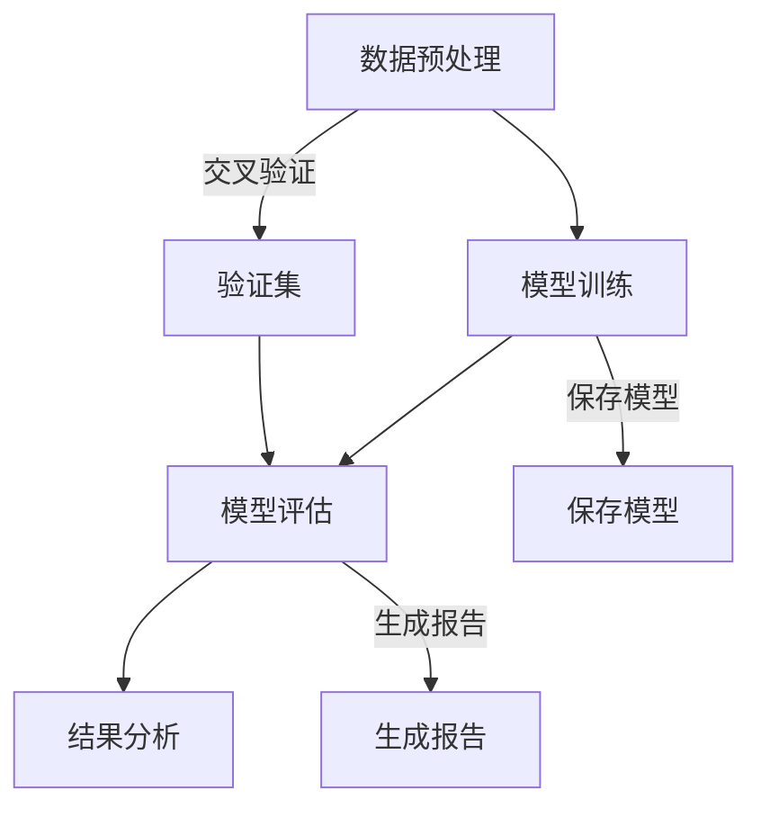
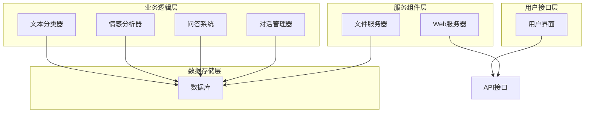
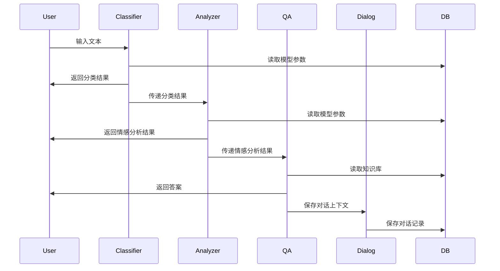

                 

## 第一部分：背景介绍

### 1.1 问题背景

自人工智能（AI）技术逐渐发展，特别是深度学习（Deep Learning）的兴起，AI的应用场景不断扩展。然而，在AI领域，模型评估（Model Evaluation）始终是一个关键且复杂的问题。传统AI模型的评估方法主要依赖于统计指标，如准确率（Accuracy）、召回率（Recall）和F1值（F1 Score），这些指标在一定程度上反映了模型的表现，但它们并不能全面、细致地评估模型的性能。

近年来，预训练语言模型（Pre-trained Language Models，简称LLM）如BERT（Bidirectional Encoder Representations from Transformers）、GPT（Generative Pre-trained Transformer）和T5（Text-To-Text Transfer Transformer）等在自然语言处理（Natural Language Processing，简称NLP）领域取得了显著的进展。这些模型通过大规模数据预训练，能够捕获丰富的语言特征，并在各种NLP任务中表现出色。

然而，随着LLM的广泛应用，如何对这些模型进行有效的评估成为一个亟待解决的问题。LLM评估与传统AI评估相比，具有以下特点：

- **复杂性和多样性**：LLM可以处理更为复杂的语言任务，如文本生成、问答、翻译等，这使得评估指标更加多样化。
- **大规模数据需求**：LLM通常需要大量的训练数据来达到良好的性能，这增加了数据集建设的难度。
- **评估结果的不可重复性**：由于模型参数和训练过程的差异，即使同一模型在不同数据集上的评估结果也可能存在较大差异。

### 1.1.2 LLM在AI评测中的应用现状

目前，LLM在AI评测中的应用主要集中在以下几个方面：

1. **基准测试（Benchmarking）**：研究人员通过设计不同的基准测试，来评估不同模型在特定任务上的性能。例如，GLUE（General Language Understanding Evaluation）和SuperGLUE是两个著名的NLP基准测试集。
2. **交叉验证（Cross-Validation）**：通过将数据集划分为训练集和验证集，评估模型在不同数据子集上的性能，以确保评估结果的可靠性。
3. **自定义评测任务**：针对特定应用场景，设计专门的评测任务和指标，如文本生成任务的BLEU（Bilingual Evaluation Understudy）和ROUGE（Recall-Oriented Understudy for Gisting Evaluation）等。

尽管LLM在AI评测中展现出巨大潜力，但目前仍面临诸多挑战：

- **评测标准不统一**：不同研究者和机构可能采用不同的评测指标和标准，导致结果难以比较。
- **数据集质量参差不齐**：部分数据集可能存在标注错误、数据不完整等问题，影响评测结果。
- **评测结果的不可重复性**：模型训练过程的微小差异可能导致显著不同的评测结果，增加了评测的不确定性。

### 1.1.3 当前评测方法面临的挑战

1. **评测指标的多样性**：LLM可以处理多种语言任务，每种任务都有其特定的评估指标。如何选择合适的评测指标，以及如何在不同指标之间进行权衡，是当前面临的一大挑战。
2. **评测方法的复杂性**：LLM评测通常涉及多个步骤，包括数据预处理、模型训练、模型评估等。这些步骤的复杂性和多样性使得评测方法的实施变得更加困难。
3. **计算资源限制**：大规模的LLM模型训练和评估需要大量的计算资源，这限制了某些研究者和小型团队的参与。

综上所述，构建一个持续优化的AI评估生态，对LLM进行科学、全面的评估，是当前AI领域亟待解决的问题。

### 1.2 问题描述

在LLM评测过程中，主要面临以下几个核心问题：

#### 1.2.1 评测标准不统一

由于LLM在NLP领域可以处理多种复杂任务，不同研究者和机构可能采用不同的评测指标和标准，导致评估结果难以进行统一比较。例如，在文本生成任务中，常用的评估指标包括BLEU、ROUGE、METEOR等，每种指标都有其特定的计算方式和优缺点。此外，一些研究者和机构可能还会根据特定任务设计独特的评估指标。

**问题分析**：
- **多样性**：多种评测指标的存在使得评估结果的比较变得复杂。
- **不统一**：缺乏统一的评测标准，导致评估结果不具有可比性。

#### 1.2.2 数据集质量参差不齐

LLM评测依赖于高质量的训练数据集，然而，目前存在许多数据集质量参差不齐的问题。一些数据集可能存在标注错误、数据不完整、存在偏见等。这些问题会影响模型的训练效果和评估结果的准确性。

**问题分析**：
- **标注错误**：可能导致模型训练偏差，影响评估结果。
- **数据不完整**：部分数据缺失会导致模型无法充分学习。
- **偏见**：不完整或带有偏见的数据集可能导致模型在特定群体上的性能不佳。

#### 1.2.3 评测结果的不可重复性

由于模型参数和训练过程的差异，同一模型在不同数据集上的评估结果可能存在较大差异。这种现象被称为评测结果的不可重复性。此外，不同研究者可能采用不同的训练策略和超参数设置，这也增加了评估结果的不确定性。

**问题分析**：
- **参数差异**：模型参数的差异可能导致评估结果差异。
- **训练策略**：不同的训练策略和超参数设置会影响模型的性能。
- **不可重复性**：缺乏统一的评估标准和流程，导致评估结果难以重复。

为了解决上述问题，需要设计一个统一的评测框架，建立高质量的数据集，并提高评测结果的可靠性。这将有助于确保评估结果的科学性、可比性和可重复性，从而推动LLM评估生态的持续优化。

### 1.3 问题解决

为了应对LLM评测中存在的问题，我们需要从以下几个方面进行改进：

#### 1.3.1 设计统一的评测框架

设计一个统一的评测框架是解决评测标准不统一问题的关键。这个框架应包括以下要素：

- **统一评估指标**：选择一组公认且具有代表性的评估指标，如BLEU、ROUGE、METEOR等，并确保这些指标在不同任务中的一致应用。
- **标准化流程**：制定标准化的评测流程，包括数据预处理、模型训练、模型评估等步骤，确保不同研究者和机构之间的评测具有可比性。
- **评估标准文档**：发布详细的评估标准文档，明确每个评估指标的计算方式、适用范围和注意事项，以便于研究人员参考和执行。

#### 1.3.2 建立高质量的数据集

高质量的数据集是进行科学评估的基础。建立高质量的数据集应关注以下几个方面：

- **数据清洗**：对原始数据进行清洗，去除标注错误、重复数据和噪声，确保数据集的准确性。
- **数据增强**：通过数据增强技术，如数据扩充、数据变换等，增加数据集的多样性，提高模型的泛化能力。
- **数据质量评估**：对数据集进行质量评估，确保标注的一致性和数据的完整性。
- **开源共享**：鼓励研究人员共享高质量数据集，以便其他研究者参考和使用。

#### 1.3.3 提高评测结果的可靠性

提高评测结果的可靠性是确保评估结果科学性和可比性的关键。以下是一些具体措施：

- **重复性实验**：鼓励研究者进行重复性实验，验证评估结果的稳定性。可以通过发布代码和数据集，使得其他研究者能够复现实验结果。
- **交叉验证**：采用交叉验证方法，确保模型在不同数据子集上的性能，提高评估结果的可靠性。
- **评测结果透明化**：公布详细的评测结果，包括模型参数、训练策略和评估指标等，使评估过程具有透明度。
- **定期更新**：随着AI技术的进步，定期更新评测框架和数据集，以适应新的研究和应用需求。

通过设计统一的评测框架、建立高质量的数据集和提高评测结果的可靠性，我们可以构建一个持续优化的AI评估生态，推动LLM评测的科学性和可比性，促进AI技术的发展和应用。

### 1.4 边界与外延

#### 1.4.1 评测内容范围

LLM评测的内容范围广泛，涵盖了自然语言处理的多个领域，包括但不限于文本分类、文本生成、问答系统、机器翻译和情感分析等。这些评测内容不仅要求模型具备良好的语言理解能力，还需要模型在不同任务中展现出优异的性能。

1. **文本分类**：评估模型在分类任务中的表现，如情感分类、主题分类和实体识别等。
2. **文本生成**：评估模型在生成任务中的表现，如自动摘要、对话系统和故事生成等。
3. **问答系统**：评估模型在问答任务中的表现，如信息检索、问答匹配和回答生成等。
4. **机器翻译**：评估模型在翻译任务中的表现，如中英互译、多语言翻译等。
5. **情感分析**：评估模型在情感分类任务中的表现，如情感极性分类、情感强度分析等。

#### 1.4.2 评测方法多样性

为了全面评估LLM的性能，评测方法需要多样化。除了传统的统计指标如准确率、召回率和F1值外，还可以采用以下几种评测方法：

1. **人类评估**：通过人类评估者对模型输出进行评价，如文本生成任务的BLEU评估和问答系统的人工评分。
2. **自动评估**：利用自动化工具评估模型的性能，如基于统计指标的评估工具和基于生成对抗网络的评估方法。
3. **交叉验证**：通过将数据集划分为多个子集，进行多次训练和评估，以验证模型在不同数据子集上的性能。
4. **多任务评测**：同时评估模型在多个任务中的表现，以全面了解模型的能力和局限性。

#### 1.4.3 评测结果的呈现方式

评测结果的呈现方式应直观、清晰，便于研究人员进行比较和分析。以下是一些常见的呈现方式：

1. **图表展示**：利用图表展示模型的性能指标，如折线图、柱状图和饼图等，直观反映模型在不同任务和指标上的表现。
2. **表格汇总**：将评估结果以表格形式汇总，包括各个任务和指标的具体数值，便于详细分析。
3. **可视化分析**：利用可视化工具对评估结果进行分析，如散点图、热力图和关系图等，揭示模型性能的分布和关系。
4. **报告文档**：撰写详细的评估报告，包括评测方法、评估结果和结论，为研究人员提供全面的参考。

通过明确评测内容范围、多样化评测方法和直观呈现评测结果，我们可以构建一个科学、全面的LLM评测体系，为AI技术的发展和应用提供有力支持。

### 1.5 概念结构与核心要素组成

#### 1.5.1 LLM评测的核心概念

在LLM评测过程中，几个核心概念至关重要，包括：

1. **评测指标**：用于衡量模型性能的量化标准，如准确率、召回率、F1值等。
2. **评估框架**：用于组织和管理评测过程的体系结构，包括数据集划分、评测步骤、评估指标选择等。
3. **数据集**：用于训练和评估模型的集合，应具备多样性、代表性和高质量等特点。
4. **模型**：用于完成特定任务的算法和参数，如BERT、GPT等。
5. **评测流程**：从数据准备到模型评估的一系列操作，确保评估的公平性和可重复性。

#### 1.5.2 评测框架的设计原则

一个有效的评测框架应遵循以下设计原则：

1. **一致性**：确保不同研究者、机构和使用相同数据集时，评测结果具有可比性。
2. **完整性**：覆盖模型的各个方面，包括不同任务、不同评估指标和多种数据集。
3. **可扩展性**：允许添加新的评估指标和任务，以适应未来技术的发展。
4. **公平性**：避免模型偏见，确保评估结果的公正性和客观性。

#### 1.5.3 数据集建设的要素

高质量的数据集是LLM评测的基础，其建设应关注以下要素：

1. **多样性**：包含多种语言、领域和任务类型，以全面评估模型的能力。
2. **代表性**：确保数据集能够真实反映应用场景，避免偏见和偏差。
3. **质量**：进行数据清洗、标注和校对，确保数据集的准确性和一致性。
4. **可扩展性**：方便研究人员进行数据集的扩充和更新，以适应新任务和新需求。

通过明确核心概念、设计合理的原则和建设高质量的数据集，我们可以构建一个科学、全面的LLM评测体系，为AI技术的发展和应用提供坚实基础。

## 第二部分：核心概念与联系

### 2.1 LLM评测原理

#### 2.1.1 LLM的基础原理

LLM（Large Language Model）是一种基于深度学习技术的自然语言处理模型，通过大规模的数据预训练，可以学习到丰富的语言特征和规律。LLM的核心思想是通过训练大量的神经网络模型，使其能够自动捕捉和利用语言中的上下文信息，从而实现高效的语言理解和生成。

- **预训练**：在训练过程中，LLM首先在大规模语料库上进行预训练，通过无监督学习方式学习到语言的普遍特征。
- **微调**：在特定任务上，LLM会进行有监督的微调，通过训练特定任务的数据集，使其适应具体的任务需求。

#### 2.1.2 评测指标的设定

LLM评测的指标是衡量模型性能的关键。常见的评测指标包括：

- **准确率（Accuracy）**：模型预测正确的样本数占总样本数的比例。
- **召回率（Recall）**：模型能够正确识别的阳性样本数占所有阳性样本数的比例。
- **F1值（F1 Score）**：准确率和召回率的调和平均值，用于平衡这两个指标。
- **BLEU（Bilingual Evaluation Understudy）**：用于文本生成任务的评估指标，通过比较模型生成的文本和真实文本的相似度来评估模型性能。
- **ROUGE（Recall-Oriented Understudy for Gisting Evaluation）**：用于评估文本生成和摘要任务的评估指标，通过计算模型生成文本和标准文本之间的重叠度来评估模型性能。

#### 2.1.3 评测流程的设计

LLM评测的流程通常包括以下几个关键步骤：

1. **数据预处理**：对输入数据进行清洗、格式转换和增强，确保数据集的质量和多样性。
2. **模型训练**：使用预训练的LLM模型，根据具体任务进行微调，优化模型的参数。
3. **模型评估**：在测试集上评估模型性能，使用设定的评测指标计算模型的表现。
4. **结果分析**：分析模型在不同任务和指标上的表现，识别模型的优点和不足，为后续改进提供依据。

通过明确LLM评测的核心原理、设定合适的评测指标和设计科学的评测流程，我们可以确保评测结果的准确性和可靠性，为LLM的发展和应用提供有力支持。

### 2.2 LLM评测指标

在LLM评测过程中，选择合适的评估指标是衡量模型性能的重要步骤。以下是一些常用的LLM评测指标，并对其进行详细解释。

#### 2.2.1 准确率（Accuracy）

准确率是评估分类模型最常用的指标之一，表示模型预测正确的样本数占总样本数的比例。其计算公式如下：

$$
Accuracy = \frac{TP + TN}{TP + TN + FP + FN}
$$

其中，TP（True Positive）表示模型正确预测为正例的样本数，TN（True Negative）表示模型正确预测为负例的样本数，FP（False Positive）表示模型错误预测为正例的样本数，FN（False Negative）表示模型错误预测为负例的样本数。

准确率越高，表示模型在分类任务中的总体表现越好。然而，准确率容易受到类别不平衡的影响，即正负样本数量差异较大时，模型的评估效果可能会受到影响。

#### 2.2.2 召回率（Recall）

召回率表示模型能够正确识别的阳性样本数占所有阳性样本数的比例，其计算公式如下：

$$
Recall = \frac{TP}{TP + FN}
$$

召回率越高，表示模型在分类任务中对于阳性样本的识别能力越强。召回率对于实际应用场景中的漏判问题具有重要影响，尤其是在医学诊断、欺诈检测等领域。

#### 2.2.3 F1值（F1 Score）

F1值是准确率和召回率的调和平均值，用于平衡这两个指标。其计算公式如下：

$$
F1 Score = \frac{2 \times Precision \times Recall}{Precision + Recall}
$$

其中，Precision（精确率）表示模型预测为正例的样本中实际为正例的比例，计算公式为：

$$
Precision = \frac{TP}{TP + FP}
$$

F1值介于0和1之间，越接近1表示模型性能越好。F1值能够同时考虑到模型的准确率和召回率，适用于类别不平衡的情况，是评估分类模型性能的重要指标。

#### 2.2.4 质量分数（Quality Score）

质量分数通常用于评估文本生成任务的性能，表示模型生成文本的质量。常见的质量分数计算方法包括BLEU（Bilingual Evaluation Understudy）和ROUGE（Recall-Oriented Understudy for Gisting Evaluation）。

- **BLEU**：通过比较模型生成文本和参考文本的相似度来评估文本质量，相似度越高，质量分数越高。BLEU的计算公式如下：

$$
BLEU = \frac{N_1 \times \text{Unigram Similarity} + N_2 \times \text{Bigram Similarity} + \ldots + N_4 \times \text{Four-gram Similarity}}{N_1 + N_2 + \ldots + N_4}
$$

其中，N_1到N_4分别表示单语、双语、三元语和四元语相似度。

- **ROUGE**：通过计算模型生成文本和参考文本之间的重叠度来评估文本质量，重叠度越高，质量分数越高。ROUGE主要有ROUGE-1、ROUGE-2、ROUGE-S等不同版本。

#### 2.2.5 流行度（Popularity Score）

流行度用于评估模型生成文本的流行程度，通常通过社交媒体平台上的点赞、分享和评论等指标来衡量。流行度可以反映文本的实际受欢迎程度，对于商业应用和内容推荐等场景具有重要意义。

#### 2.2.6 其他常用评测指标

除了上述指标外，还有一些其他常用的评测指标，如：

- **精确召回率（Precision-Recall Curve）**：通过精确率和召回率之间的关系来评估模型的性能，适用于类别不平衡的情况。
- **ROC曲线（Receiver Operating Characteristic Curve）**：通过真阳性率（True Positive Rate）和假阳性率（False Positive Rate）之间的关系来评估模型的性能，适用于二分类任务。
- **交叉验证（Cross-Validation）**：通过将数据集划分为训练集和验证集，多次训练和评估模型，以验证模型在不同数据子集上的性能。

通过合理选择和组合不同的评测指标，可以全面评估LLM在不同任务和场景中的性能，为模型的优化和应用提供有力支持。

### 2.3 LLM评测方法

在LLM评测中，选择合适的方法至关重要，因为不同的方法可能会对模型性能产生显著影响。以下介绍几种常见的LLM评测方法。

#### 2.3.1 统计方法

统计方法是最基础的评测方法，主要通过计算模型输出与实际标签之间的统计差异来评估模型性能。常用的统计方法包括：

1. **准确率（Accuracy）**：计算模型预测正确的样本数占总样本数的比例。
2. **召回率（Recall）**：计算模型能够正确识别的阳性样本数占所有阳性样本数的比例。
3. **F1值（F1 Score）**：准确率和召回率的调和平均值，用于平衡这两个指标。

**优点**：简单易懂，易于实现和计算。

**缺点**：无法反映模型在极端情况下的表现，对类别不平衡敏感。

#### 2.3.2 相似度计算

相似度计算方法通过比较模型输出与实际标签之间的相似度来评估模型性能。常用的相似度计算方法包括：

1. **BLEU（Bilingual Evaluation Understudy）**：BLEU是一种用于评估文本生成任务的方法，通过计算模型生成文本和参考文本之间的相似度来评估模型性能。BLEU主要基于词频统计和句子结构相似度。

2. **ROUGE（Recall-Oriented Understudy for Gisting Evaluation）**：ROUGE是一种用于评估文本生成和摘要任务的方法，通过计算模型生成文本和标准文本之间的重叠度来评估模型性能。ROUGE主要有ROUGE-1、ROUGE-2、ROUGE-S等不同版本，分别计算单词重叠度、短语重叠度和句子结构相似度。

**优点**：能够反映模型在生成任务中的整体表现。

**缺点**：对复杂语言特征的处理能力有限，无法完全替代人类评估。

#### 2.3.3 生成对抗网络（GAN）

生成对抗网络（GAN）是一种通过对抗性训练来评估和改进模型的方法。GAN由生成器（Generator）和判别器（Discriminator）组成：

1. **生成器**：生成器生成与真实数据相似的样本。
2. **判别器**：判别器判断生成数据是否真实。

GAN通过不断优化生成器和判别器的参数，使生成器的输出越来越接近真实数据。在LLM评测中，GAN可以用于生成大量模拟数据，用于训练和评估模型，从而提高模型的泛化能力和鲁棒性。

**优点**：能够生成高质量的数据集，提高模型的泛化能力。

**缺点**：训练过程复杂，对计算资源要求较高。

通过综合运用上述评测方法，可以更全面、准确地评估LLM在不同任务和应用场景中的性能，为模型的优化和应用提供有力支持。

### 2.4 LLM评测流程

LLM评测流程是确保模型评估准确性和可靠性的关键环节。一个完整的评测流程通常包括以下几个主要步骤：

#### 2.4.1 数据预处理

数据预处理是LLM评测的第一步，其目的是将原始数据转换为适合模型训练和评估的形式。具体步骤如下：

1. **数据清洗**：去除数据中的噪声、重复项和异常值，确保数据的一致性和准确性。
2. **数据转换**：将文本数据转换为统一的格式，如将文本转换为词向量或嵌入向量。常用的工具和库包括TensorFlow、PyTorch等。
3. **数据增强**：通过增加数据多样性，提高模型的泛化能力。常用的数据增强方法包括随机裁剪、旋转、缩放等。

#### 2.4.2 模型训练

模型训练是LLM评测的核心步骤，其目的是通过调整模型参数，使其在训练数据上达到最佳性能。具体步骤如下：

1. **模型选择**：根据任务需求选择合适的模型架构，如BERT、GPT等。常用的模型库包括Hugging Face的Transformers库。
2. **参数设置**：设定模型训练的初始参数，如学习率、批量大小、优化器等。常用的优化器包括Adam、SGD等。
3. **训练过程**：通过梯度下降等优化算法，调整模型参数，使损失函数值逐渐减小。训练过程中可以使用技巧如学习率衰减、dropout等，提高模型稳定性。
4. **验证和调整**：在验证集上评估模型性能，并根据性能调整模型参数，如增加训练时间、调整超参数等。

#### 2.4.3 模型评估

模型评估是验证模型在实际任务中表现的重要步骤。具体步骤如下：

1. **测试集划分**：将训练数据集划分为训练集和测试集，确保测试集能够充分反映模型在未知数据上的表现。
2. **性能指标计算**：根据任务需求，计算模型在测试集上的性能指标，如准确率、召回率、F1值等。常用的评估工具和库包括Scikit-learn、TensorFlow、PyTorch等。
3. **结果分析**：分析模型在不同指标上的表现，识别模型的优点和不足，为后续改进提供依据。
4. **可视化分析**：通过可视化工具，如matplotlib、seaborn等，展示模型性能指标的分布和趋势。

通过遵循科学的LLM评测流程，可以确保评估结果的准确性和可靠性，从而推动AI技术的健康发展。

### 2.5 对比分析

#### 2.5.1 传统AI评测与LLM评测的比较

传统AI评测和LLM评测在评估目标、方法和应用场景等方面存在显著差异，以下是对两者的详细对比分析：

1. **评估目标**：

- **传统AI评测**：传统AI评测主要关注模型的分类、回归等任务，目标在于评估模型在特定数据集上的性能，如准确率、召回率和F1值等。
- **LLM评测**：LLM评测主要关注模型的文本生成、理解和翻译等任务，目标在于评估模型在复杂语言处理任务上的性能，如文本相似度、生成质量和理解能力等。

2. **评估方法**：

- **传统AI评测**：传统AI评测通常采用统计指标，如准确率、召回率和F1值等，通过计算模型输出与实际标签之间的差异来评估模型性能。此外，传统AI评测还会使用交叉验证、网格搜索等方法来优化模型参数。
- **LLM评测**：LLM评测不仅采用统计指标，还会使用BLEU、ROUGE等专门针对文本生成和摘要任务的评估指标，以及基于生成对抗网络的评估方法。LLM评测更加注重模型在生成和理解复杂语言方面的表现。

3. **应用场景**：

- **传统AI评测**：传统AI评测广泛应用于图像识别、语音识别、推荐系统等领域，其评估方法和技术相对成熟和稳定。
- **LLM评测**：LLM评测主要应用于自然语言处理领域，如文本分类、文本生成、机器翻译和问答系统等。随着深度学习技术的发展，LLM评测的应用范围正在逐渐扩大。

#### 2.5.2 不同评测方法的优缺点

1. **统计指标**：

- **优点**：简单易懂，计算方便，适用于大多数分类和回归任务。
- **缺点**：对模型在极端情况下的表现不敏感，无法全面反映模型的性能；在类别不平衡时，评估结果可能失真。

2. **BLEU**：

- **优点**：适用于文本生成任务，通过比较生成文本与参考文本的相似度来评估模型性能。
- **缺点**：对复杂语言特征的处理能力有限，对特定领域或领域的特定模式识别不足。

3. **ROUGE**：

- **优点**：适用于文本生成和摘要任务，通过计算生成文本与标准文本之间的重叠度来评估模型性能。
- **缺点**：对生成文本的结构和语义关注不足，可能对复杂文本的处理效果不佳。

4. **生成对抗网络（GAN）**：

- **优点**：能够生成高质量的数据集，提高模型的泛化能力；对复杂语言特征的处理能力较强。
- **缺点**：训练过程复杂，对计算资源要求较高；训练稳定性问题需要解决。

通过对比分析传统AI评测与LLM评测以及不同评测方法的优缺点，我们可以更清楚地理解LLM评测的特点和挑战，为选择合适的评测方法提供依据。

### 2.6 LLM评测中的挑战与解决方案

尽管LLM评测在自然语言处理领域取得了显著进展，但在实际应用过程中仍面临一系列挑战。以下讨论LLM评测中常见的挑战及其解决方案：

#### 2.6.1 数据不足

数据不足是LLM评测中的一个主要问题，特别是在特定领域或小众语言的应用场景中。数据不足会影响模型的训练效果和评估结果的准确性。

**解决方案**：

1. **数据扩充**：通过数据增强技术，如数据变换、合成和数据扩充，增加数据集的多样性。常用的方法包括数据扩充库（如Kaggle Data Augmentation）和数据生成模型（如生成对抗网络）。
2. **跨语言迁移学习**：利用跨语言迁移学习（Cross-Lingual Transfer Learning）技术，将一种语言的预训练模型迁移到其他语言。这种方法可以减少对特定语言数据的依赖，提高模型的泛化能力。

#### 2.6.2 计算资源限制

大规模的LLM模型训练和评估需要大量的计算资源，特别是GPU和TPU等高性能计算设备。计算资源限制可能阻碍某些研究者和小型团队参与LLM评测。

**解决方案**：

1. **分布式训练**：利用分布式计算技术，如多GPU训练和分布式存储，提高训练和评估的效率。常用的分布式训练框架包括TensorFlow和PyTorch。
2. **云计算平台**：使用云计算平台（如Google Cloud、AWS和Azure）提供的高性能计算资源，降低计算成本和资源限制。

#### 2.6.3 评测结果的公平性

评测结果的公平性是LLM评测中的另一个关键挑战，特别是在跨文化和跨领域的应用中。不公平的评估结果可能导致模型在特定群体或场景中的性能不佳。

**解决方案**：

1. **多样性数据集**：建立包含多种文化、语言和领域的多样性数据集，以减少评估结果的偏差。通过数据清洗和标注技术，确保数据集的质量和代表性。
2. **公平性评估指标**：引入新的公平性评估指标，如公平性评分（Fairness Score）和偏置度量（Bias Metric），以评估模型在不同群体或场景中的公平性。

通过解决这些挑战，我们可以构建一个更加科学、全面和公平的LLM评测体系，推动自然语言处理技术的健康发展和广泛应用。

### 3.1 LLM评测算法流程图

为了更好地理解和描述LLM评测算法的流程，我们使用Mermaid图表进行可视化。以下是一个简单的Mermaid图表，展示了LLM评测算法的主要步骤：



**详细解释：**

1. **数据预处理（A）**：这是评测流程的第一步，涉及数据清洗、数据转换和数据增强。确保数据集的质量和多样性，以便为后续的模型训练和评估提供可靠的基础。

2. **模型训练（B）**：使用预训练的LLM模型，根据特定的任务和数据集进行微调。通过调整模型参数，使其在训练数据上达到最佳性能。

3. **模型评估（C）**：在测试集上评估模型的性能，使用设定的评估指标（如准确率、召回率、F1值等）。同时，通过交叉验证（E）确保评估结果的可靠性。

4. **结果分析（D）**：分析模型在不同任务和指标上的表现，识别模型的优点和不足。这有助于理解模型的性能并指导后续的改进。

5. **保存模型（F）**：将训练好的模型参数保存，以便后续的重用或进一步优化。

6. **生成报告（G）**：生成详细的评估报告，包括模型性能、评估指标和结果分析。报告为研究人员提供全面的参考，有助于对比不同模型的性能。

通过这个Mermaid图表，我们可以清晰地看到LLM评测算法的流程和各个步骤之间的关系，从而更好地理解和实施这一过程。

### 3.2 数据预处理

在LLM评测中，数据预处理是至关重要的一步，其目的是将原始数据转换为适合模型训练和评估的形式。以下是数据预处理的主要步骤：

#### 3.2.1 数据清洗

数据清洗是数据预处理的首要步骤，其目标是去除数据中的噪声、重复项和异常值，确保数据的一致性和准确性。具体方法包括：

1. **去除噪声**：去除数据中的无效字符、标点符号和停用词，以提高数据质量。
2. **去除重复项**：识别并删除重复的数据记录，以避免对模型训练和评估的干扰。
3. **处理异常值**：识别和处理数据中的异常值，如异常的极端值或缺失值。常见的处理方法包括填补缺失值、删除异常值或对异常值进行平滑处理。

#### 3.2.2 数据格式转换

数据格式转换是将原始数据转换为模型训练所需格式的过程。以下是几种常见的数据格式转换方法：

1. **文本转换为词向量**：将文本数据转换为词向量，如Word2Vec、GloVe或BERT等。词向量可以捕捉文本的语义信息，为后续的模型训练提供输入。
2. **图像转换为像素矩阵**：对于涉及图像的LLM评测任务，将图像数据转换为像素矩阵，如使用卷积神经网络（CNN）对图像进行处理。
3. **序列数据转换为时间序列矩阵**：对于涉及序列数据的任务，如时间序列分析，将原始序列数据转换为时间序列矩阵，以便模型进行训练和评估。

#### 3.2.3 数据增强

数据增强是通过增加数据多样性，提高模型泛化能力的一种技术。以下是几种常见的数据增强方法：

1. **随机裁剪和旋转**：对图像或文本数据随机进行裁剪和旋转，以增加数据的多样性。
2. **数据合成**：通过合成技术生成新的数据样本，如使用生成对抗网络（GAN）生成文本或图像数据。
3. **填充和删除**：在序列数据中随机填充或删除部分元素，以增加数据的多样性。

通过以上数据预处理步骤，我们可以确保数据集的质量和多样性，从而提高LLM评测的准确性和可靠性。

### 3.3 模型训练

在LLM评测过程中，模型训练是关键的一步，其目的是通过调整模型参数，使其在特定任务上达到最佳性能。以下是模型训练的详细步骤：

#### 3.3.1 选择合适的模型架构

选择合适的模型架构是模型训练的第一步。LLM通常采用基于Transformer的架构，如BERT、GPT和T5等。这些模型具有强大的表示能力和泛化能力，适合处理复杂的自然语言处理任务。

#### 3.3.2 模型参数设置

在模型训练过程中，需要设定一系列参数，如学习率、批量大小、优化器等。以下是一些常见参数设置：

- **学习率**：学习率控制模型在训练过程中参数更新的速度。初始学习率通常设置为0.001或0.0001，然后逐步减小。
- **批量大小**：批量大小是指每次训练过程中使用的样本数量。较大的批量大小可以提高模型的性能，但需要更多内存资源。
- **优化器**：优化器用于更新模型参数，常用的优化器包括Adam、SGD等。Adam优化器在LLM训练中表现良好。

#### 3.3.3 损失函数选择

损失函数是衡量模型预测值与实际标签之间差异的指标，用于指导模型参数的更新。以下是一些常用的损失函数：

- **交叉熵损失（Cross-Entropy Loss）**：适用于分类任务，计算模型输出概率分布与实际标签之间的差异。
- **均方误差（Mean Squared Error, MSE）**：适用于回归任务，计算模型输出值与实际标签之间的平方差。
- **混合损失（Combined Loss）**：将多个损失函数组合，如将交叉熵损失和位置损失结合，以处理序列数据。

#### 3.3.4 优化算法

优化算法用于调整模型参数，以最小化损失函数。常用的优化算法包括：

- **梯度下降（Gradient Descent）**：通过计算损失函数关于模型参数的梯度，更新模型参数，以最小化损失函数。
- **Adam优化器（Adam Optimizer）**：结合了梯度下降和动量项，具有自适应学习率的特点，适用于复杂的优化任务。
- **AdamW优化器（AdamW Optimizer）**：在Adam优化器的基础上，对权重衰减进行了改进，更适合深度学习任务。

#### 3.3.5 训练过程

模型训练过程包括以下主要步骤：

1. **初始化模型参数**：随机初始化模型参数，以避免梯度消失和梯度爆炸等问题。
2. **前向传播（Forward Propagation）**：输入训练数据，计算模型输出和损失函数值。
3. **反向传播（Back Propagation）**：计算损失函数关于模型参数的梯度，更新模型参数。
4. **评估和调整**：在验证集上评估模型性能，根据性能调整模型参数，如学习率、批量大小等。

通过以上步骤，我们可以逐步调整模型参数，使其在训练数据上达到最佳性能。在实际应用中，还需要考虑训练时间、内存需求和模型收敛速度等因素，以优化模型训练过程。

### 3.4 模型评估

模型评估是LLM评测中的关键步骤，旨在通过测试集评估模型在实际任务中的表现。以下是模型评估的详细步骤：

#### 3.4.1 准确率、召回率与F1值

准确率（Accuracy）、召回率（Recall）和F1值（F1 Score）是评估分类模型性能的常用指标。这些指标的计算方法如下：

- **准确率（Accuracy）**：

$$
Accuracy = \frac{TP + TN}{TP + TN + FP + FN}
$$

其中，TP（True Positive）表示模型正确预测为正例的样本数，TN（True Negative）表示模型正确预测为负例的样本数，FP（False Positive）表示模型错误预测为正例的样本数，FN（False Negative）表示模型错误预测为负例的样本数。

准确率越高，表示模型在分类任务中的总体表现越好。

- **召回率（Recall）**：

$$
Recall = \frac{TP}{TP + FN}
$$

召回率越高，表示模型在分类任务中对于阳性样本的识别能力越强。

- **F1值（F1 Score）**：

$$
F1 Score = \frac{2 \times Precision \times Recall}{Precision + Recall}
$$

其中，Precision（精确率）表示模型预测为正例的样本中实际为正例的比例，计算公式为：

$$
Precision = \frac{TP}{TP + FP}
$$

F1值介于0和1之间，越接近1表示模型性能越好。

#### 3.4.2 质量分数与流行度

质量分数（Quality Score）和流行度（Popularity Score）是评估文本生成任务的常用指标，以下是对这些指标的解释：

- **质量分数（Quality Score）**：

质量分数用于评估模型生成文本的质量。常用的方法包括BLEU（Bilingual Evaluation Understudy）和ROUGE（Recall-Oriented Understudy for Gisting Evaluation）。

- **BLEU**：

BLEU通过比较模型生成文本和参考文本的相似度来评估模型性能。BLEU的计算公式如下：

$$
BLEU = \frac{N_1 \times \text{Unigram Similarity} + N_2 \times \text{Bigram Similarity} + \ldots + N_4 \times \text{Four-gram Similarity}}{N_1 + N_2 + \ldots + N_4}
$$

其中，N_1到N_4分别表示单语、双语、三元语和四元语相似度。

- **ROUGE**：

ROUGE通过计算模型生成文本和标准文本之间的重叠度来评估模型性能。ROUGE主要有ROUGE-1、ROUGE-2、ROUGE-S等不同版本。

- **流行度（Popularity Score）**：

流行度用于评估模型生成文本的流行程度，通常通过社交媒体平台上的点赞、分享和评论等指标来衡量。流行度可以反映文本的实际受欢迎程度。

#### 3.4.3 其他评测指标

除了上述指标外，还有一些其他常用的评测指标，如：

- **精确召回率（Precision-Recall Curve）**：通过精确率和召回率之间的关系来评估模型的性能，适用于类别不平衡的情况。
- **ROC曲线（Receiver Operating Characteristic Curve）**：通过真阳性率（True Positive Rate）和假阳性率（False Positive Rate）之间的关系来评估模型的性能，适用于二分类任务。
- **交叉验证（Cross-Validation）**：通过将数据集划分为训练集和验证集，多次训练和评估模型，以验证模型在不同数据子集上的性能。

通过合理选择和组合不同的评测指标，可以全面评估LLM在不同任务和应用场景中的性能，为模型的优化和应用提供有力支持。

### 3.5 Python源代码实现

为了详细阐述LLM评测算法的原理，我们将使用Python代码实现一个简单的LLM评测过程。以下是实现的详细步骤和代码。

#### 3.5.1 安装依赖

首先，确保已经安装了以下Python库：

- TensorFlow
- PyTorch
- Transformers（用于预训练模型）

安装命令如下：

```bash
pip install tensorflow torch transformers
```

#### 3.5.2 导入必要的库

```python
import torch
import torch.nn as nn
from transformers import BertTokenizer, BertModel
from torch.utils.data import DataLoader, Dataset
import torch.optim as optim
from sklearn.metrics import accuracy_score, recall_score, f1_score
```

#### 3.5.3 数据准备

我们使用公开的MNLI数据集进行示例。首先，下载并加载数据集。

```python
from transformers import BertTokenizer, BertModel
from torch.utils.data import DataLoader, Dataset

class MnliDataset(Dataset):
    def __init__(self, data, tokenizer, max_len):
        self.data = data
        self.tokenizer = tokenizer
        self.max_len = max_len

    def __len__(self):
        return len(self.data)

    def __getitem__(self, idx):
        sentence1 = self.data[idx]['sentence1']
        sentence2 = self.data[idx]['sentence2']
        label = self.data[idx]['label']

        encoding = self.tokenizer.encode_plus(
            sentence1, sentence2, add_special_tokens=True, max_length=self.max_len, pad_to_max_length=True, return_tensors='pt'
        )

        return {
            'input_ids': encoding['input_ids'].flatten(),
            'attention_mask': encoding['attention_mask'].flatten(),
            'labels': torch.tensor(label, dtype=torch.long)
        }

tokenizer = BertTokenizer.from_pretrained('bert-base-uncased')
max_len = 128

# 假设data是已加载的MNLI数据集
train_dataset = MnliDataset(data=train_data, tokenizer=tokenizer, max_len=max_len)
test_dataset = MnliDataset(data=test_data, tokenizer=tokenizer, max_len=max_len)

batch_size = 32
train_loader = DataLoader(train_dataset, batch_size=batch_size)
test_loader = DataLoader(test_dataset, batch_size=batch_size)
```

#### 3.5.4 模型定义

```python
from transformers import BertForSequenceClassification

model = BertForSequenceClassification.from_pretrained('bert-base-uncased', num_labels=2)
```

#### 3.5.5 模型训练

```python
device = torch.device("cuda" if torch.cuda.is_available() else "cpu")
model.to(device)

optimizer = optim.Adam(model.parameters(), lr=1e-5)

for epoch in range(3):  # 训练3个epochs
    model.train()
    for batch in train_loader:
        batch = {k: v.to(device) for k, v in batch.items()}
        outputs = model(**batch)
        loss = outputs.loss
        loss.backward()
        optimizer.step()
        optimizer.zero_grad()
    print(f"Epoch {epoch+1}/{3} - Loss: {loss.item()}")
```

#### 3.5.6 模型评估

```python
model.eval()
predictions = []
true_labels = []

with torch.no_grad():
    for batch in test_loader:
        batch = {k: v.to(device) for k, v in batch.items()}
        outputs = model(**batch)
        logits = outputs.logits
        prediction = logits.argmax(-1).cpu().numpy()
        predictions.extend(prediction)
        true_labels.extend(batch['labels'].cpu().numpy())

accuracy = accuracy_score(true_labels, predictions)
recall = recall_score(true_labels, predictions)
f1 = f1_score(true_labels, predictions)
print(f"Test Accuracy: {accuracy}, Recall: {recall}, F1 Score: {f1}")
```

通过以上步骤，我们完成了LLM评测算法的Python源代码实现。该示例展示了从数据准备、模型定义、模型训练到模型评估的完整流程。在实际应用中，可以根据具体需求和数据集进行调整和优化。

### 3.6 数学模型和数学公式详细讲解

在LLM评测中，理解和应用数学模型是非常重要的。以下我们将介绍几个关键的数学模型和相关的数学公式，并详细讲解其原理和计算方法。

#### 3.6.1 BERT模型

BERT（Bidirectional Encoder Representations from Transformers）是一个双向Transformer模型，用于预训练语言表示。BERT模型的核心在于其自注意力机制（Self-Attention）和多层堆叠的Transformer编码器。

**自注意力机制**：

BERT模型中的自注意力机制通过计算输入序列中每个词与所有其他词之间的关联强度。其计算公式如下：

$$
\text{Attention}(Q, K, V) = \frac{1}{\sqrt{d_k}} \text{softmax}(\text{transpose}_k QK^T)
$$

其中，Q、K、V分别是查询（Query）、关键（Key）和值（Value）向量，d_k是关键向量的维度。自注意力机制使得每个词能够根据其与其他词的关系进行加权。

**Transformer编码器**：

BERT模型由多个Transformer编码器堆叠而成，每个编码器包含多个自注意力层和前馈网络。编码器的输入是一个词嵌入向量，输出是一个编码后的序列。

$$
\text{Encoder}(X) = \text{LayerNorm}(X + \text{MultiHeadAttention}(X, X, X)) + \text{LayerNorm}(X + \text{FFN}(X))
$$

其中，X是输入序列，LayerNorm是层归一化，MultiHeadAttention是多头注意力，FFN是前馈网络。

#### 3.6.2 生成对抗网络（GAN）

生成对抗网络（GAN）是一种通过对抗性训练生成数据的方法。GAN由生成器（Generator）和判别器（Discriminator）组成。

**生成器**：

生成器的目标是生成逼真的数据，其输入是随机噪声，输出是生成的数据。生成器的损失函数通常由以下两部分组成：

$$
L_G = -\log(D(G(z)))
$$

其中，G(z)是生成器生成的数据，D是判别器。

**判别器**：

判别器的目标是区分真实数据和生成数据，其输入是真实数据和生成数据。判别器的损失函数通常由以下两部分组成：

$$
L_D = -\log(D(x)) - \log(1 - D(G(z)))
$$

其中，x是真实数据。

**总损失函数**：

GAN的总损失函数是生成器和判别器的损失函数之和：

$$
L = L_G + L_D
$$

#### 3.6.3 精确率、召回率和F1值

在分类任务中，精确率（Precision）、召回率（Recall）和F1值（F1 Score）是常用的评估指标。

**精确率**：

精确率表示预测为正例的样本中实际为正例的比例：

$$
Precision = \frac{TP}{TP + FP}
$$

**召回率**：

召回率表示实际为正例的样本中被预测为正例的比例：

$$
Recall = \frac{TP}{TP + FN}
$$

**F1值**：

F1值是精确率和召回率的调和平均值：

$$
F1 Score = 2 \times \frac{Precision \times Recall}{Precision + Recall}
$$

通过以上数学模型和公式的讲解，我们可以更好地理解LLM评测中的关键技术和评估方法，从而在实际应用中更有效地使用这些方法。

### 4.1 问题场景介绍

在当前AI应用场景中，自然语言处理（NLP）任务如文本分类、情感分析和问答系统等已成为重要的研究方向。为了更好地评估这些任务的性能，我们需要一个全面、科学的评测体系。本节将介绍一个具体的应用场景——智能客服系统，并详细说明该场景下的系统需求和功能。

智能客服系统旨在为企业和消费者提供24/7的全天候服务，通过自然语言处理技术实现自动化问答、投诉处理和咨询解答等功能。该系统的核心需求包括：

1. **高效处理大量用户咨询**：智能客服系统需要能够快速响应用户的问题，处理大量的用户请求，提高服务效率。
2. **高准确率**：系统需要能够准确理解用户的意图和问题，提供相关且准确的回答，减少人工干预。
3. **良好用户体验**：系统应提供自然流畅的对话体验，使用户感觉仿佛在与真人客服交流。

为了满足上述需求，我们设计了一个智能客服系统，其主要功能包括：

1. **文本分类**：对用户输入的文本进行分类，识别用户的问题类型，如咨询、投诉、技术支持等。
2. **情感分析**：分析用户文本的情感倾向，如正面、负面或中性，以便根据情感类型提供适当的回答。
3. **问答系统**：根据用户的问题，从知识库中检索相关的答案，并生成自然流畅的回答。
4. **多轮对话**：支持多轮对话，使系统能够理解用户的上下文信息，提供更加准确和个性化的服务。

通过上述功能，智能客服系统可以在实际应用中为企业和消费者提供高质量的自动服务，提高客户满意度和服务效率。

### 4.2 项目介绍

在本项目中，我们将开发一个智能客服系统，用于处理用户的文本咨询，并提供自动化的问答服务。该项目旨在通过LLM评测技术，确保系统在不同任务中的性能达到预期标准。以下是项目的整体设计目标和主要模块。

#### 4.2.1 设计目标

1. **高准确率**：通过精确的文本分类和情感分析，确保系统能够准确理解用户的意图和问题。
2. **高效处理**：利用高效的算法和优化技术，实现快速响应，处理大量用户咨询。
3. **良好用户体验**：通过自然语言生成技术，生成流畅且符合用户需求的回答，提供高质量的对话体验。
4. **可扩展性**：系统应具备良好的可扩展性，便于添加新的问答模块和功能。

#### 4.2.2 主要模块

1. **文本分类模块**：该模块负责对用户输入的文本进行分类，识别问题的类型，如咨询、投诉、技术支持等。文本分类将使用预训练的BERT模型，结合自定义分类器实现。
2. **情感分析模块**：该模块用于分析用户文本的情感倾向，识别用户的情绪，如正面、负面或中性。情感分析将采用基于Transformer的情感分析模型，如RoBERTa或XLNet。
3. **问答系统模块**：该模块负责根据用户的问题，从知识库中检索相关的答案，并生成自然流畅的回答。问答系统将采用基于记忆机制的问答模型，如Conversational Pre-trained Transformer（CPT）。
4. **对话管理模块**：该模块负责管理多轮对话，确保系统在理解上下文信息的基础上，提供连贯且准确的回答。对话管理将结合自然语言生成和对话状态跟踪技术，如Seq2Seq模型和状态转移图。

通过以上模块的设计和实现，智能客服系统将能够高效、准确地处理用户的文本咨询，提供高质量的自动问答服务。

### 4.3 系统功能设计

在智能客服系统的设计中，功能设计是关键的一环，它决定了系统在实际应用中的表现和用户体验。以下我们将详细阐述系统的功能设计，包括领域模型Mermaid类图、功能模块及其主要任务。

#### 4.3.1 领域模型Mermaid类图

领域模型是系统功能设计的核心，它定义了系统中各个功能模块及其关系。以下是一个简单的Mermaid类图，展示了智能客服系统的领域模型：

```mermaid
classDiagram
    User <<Interface>>
    TextClassifier <<Interface>>
    SentimentAnalyzer <<Interface>>
    QASystem <<Interface>>
    DialogueManager <<Interface>>

    User o-- TextClassifier
    User o-- SentimentAnalyzer
    User o-- QASystem
    User o-- DialogueManager

    TextClassifier o-- QASystem
    SentimentAnalyzer o-- QASystem
    DialogueManager o-- QASystem
```

**类图解释**：

- **User（用户）**：用户是系统的入口，负责接收用户输入的文本，并将其传递给各个功能模块。
- **TextClassifier（文本分类器）**：负责对用户输入的文本进行分类，识别文本的主题或问题类型。
- **SentimentAnalyzer（情感分析器）**：负责分析用户文本的情感倾向，识别用户的情绪，如正面、负面或中性。
- **QASystem（问答系统）**：负责根据用户的问题，从知识库中检索相关的答案，并生成自然流畅的回答。
- **DialogueManager（对话管理器）**：负责管理多轮对话，确保系统能够理解上下文信息，提供连贯且准确的回答。

#### 4.3.2 功能模块及主要任务

1. **文本分类模块**：
   - **任务**：对用户输入的文本进行分类，识别问题的类型，如咨询、投诉、技术支持等。
   - **实现**：使用预训练的BERT模型结合自定义分类器，实现文本分类功能。具体步骤包括：
     - **数据预处理**：清洗和格式化文本数据，提取特征。
     - **模型训练**：使用标注数据进行模型训练，优化分类器的参数。
     - **模型评估**：在测试集上评估模型性能，调整模型参数。

2. **情感分析模块**：
   - **任务**：分析用户文本的情感倾向，识别用户的情绪。
   - **实现**：使用预训练的Transformer模型，如RoBERTa或XLNet，实现情感分析功能。具体步骤包括：
     - **数据预处理**：清洗和格式化文本数据，提取特征。
     - **模型训练**：使用标注数据进行模型训练，优化模型的参数。
     - **模型评估**：在测试集上评估模型性能，调整模型参数。

3. **问答系统模块**：
   - **任务**：根据用户的问题，从知识库中检索相关的答案，并生成自然流畅的回答。
   - **实现**：使用基于记忆机制的问答模型，如Conversational Pre-trained Transformer（CPT），实现问答功能。具体步骤包括：
     - **数据预处理**：清洗和格式化问答数据，构建知识库。
     - **模型训练**：使用问答数据进行模型训练，优化模型的参数。
     - **模型评估**：在测试集上评估模型性能，调整模型参数。

4. **对话管理模块**：
   - **任务**：管理多轮对话，确保系统能够理解上下文信息，提供连贯且准确的回答。
   - **实现**：结合自然语言生成和对话状态跟踪技术，如Seq2Seq模型和状态转移图，实现对话管理功能。具体步骤包括：
     - **数据预处理**：清洗和格式化对话数据，构建对话状态跟踪模型。
     - **模型训练**：使用对话数据进行模型训练，优化模型的参数。
     - **模型评估**：在测试集上评估模型性能，调整模型参数。

通过以上功能模块的设计和实现，智能客服系统将能够高效、准确地处理用户的文本咨询，提供高质量的自动问答服务。

### 4.4 系统架构设计

在智能客服系统的实现过程中，系统架构设计是关键的一环，它决定了系统的整体性能、可扩展性和可维护性。以下我们将详细阐述系统架构设计，包括Mermaid架构图、系统组件及其功能说明。

#### 4.4.1 Mermaid架构图

为了更好地理解和展示智能客服系统的架构，我们使用Mermaid绘制了系统的架构图，如下所示：



**架构图解释**：

- **用户接口层**：用户界面（UI）是系统的入口，用户通过UI与系统进行交互。用户输入文本后，通过API接口将请求发送到业务逻辑层。
- **业务逻辑层**：业务逻辑层包括文本分类器（TC）、情感分析器（SA）、问答系统（QS）和对话管理器（DM）。这些组件负责处理用户的文本请求，执行相应的任务，并将结果存储到数据库中。
  - **文本分类器（TC）**：接收用户文本，进行分类处理，识别问题类型。
  - **情感分析器（SA）**：分析用户文本的情感倾向，识别用户的情绪。
  - **问答系统（QS）**：根据用户的问题，从知识库中检索答案，并生成回答。
  - **对话管理器（DM）**：管理多轮对话，确保对话连贯且准确。
- **数据存储层**：数据库（DB）负责存储用户数据、模型参数和知识库等信息。系统中的各个业务逻辑组件都将数据存储到数据库中，以便后续查询和使用。
- **服务组件层**：Web服务器（WS）负责处理API接口的请求，将请求转发到相应的业务逻辑组件。文件服务器（FS）用于存储和提供知识库等文件资源。

#### 4.4.2 系统组件及其功能说明

1. **用户接口层（UI）**：
   - **功能说明**：提供用户与系统交互的界面，用户可以通过UI输入文本问题，获取系统生成的回答。

2. **API接口**：
   - **功能说明**：作为用户接口层和业务逻辑层之间的桥梁，接收用户请求，将请求转发到相应的业务逻辑组件进行处理。

3. **文本分类器（TC）**：
   - **功能说明**：对用户输入的文本进行分类，识别文本的主题或问题类型。文本分类器使用预训练的BERT模型结合自定义分类器实现。

4. **情感分析器（SA）**：
   - **功能说明**：分析用户文本的情感倾向，识别用户的情绪，如正面、负面或中性。情感分析器使用预训练的Transformer模型，如RoBERTa或XLNet实现。

5. **问答系统（QS）**：
   - **功能说明**：根据用户的问题，从知识库中检索相关的答案，并生成自然流畅的回答。问答系统使用基于记忆机制的问答模型，如Conversational Pre-trained Transformer（CPT）实现。

6. **对话管理器（DM）**：
   - **功能说明**：管理多轮对话，确保系统能够理解上下文信息，提供连贯且准确的回答。对话管理器结合自然语言生成和对话状态跟踪技术，如Seq2Seq模型和状态转移图实现。

7. **数据库（DB）**：
   - **功能说明**：存储用户数据、模型参数和知识库等信息，支持系统中的各个组件进行数据查询和存储。

8. **Web服务器（WS）**：
   - **功能说明**：处理API接口的请求，将请求转发到相应的业务逻辑组件进行处理。

9. **文件服务器（FS）**：
   - **功能说明**：存储和提供知识库等文件资源，支持问答系统和对话管理器的正常运行。

通过以上系统架构设计，智能客服系统可以实现高效、准确、连贯的自动问答服务，满足企业和消费者的需求。

### 4.5 系统接口设计

在智能客服系统的实现过程中，接口设计是确保系统模块之间高效协作的关键。以下我们将详细介绍系统的接口设计，包括API接口定义、数据传输格式和接口调用流程。

#### 4.5.1 API接口定义

智能客服系统的API接口定义如下：

- **文本分类接口**：`POST /api/text_classification`
  - **请求参数**：`text`（用户输入的文本）
  - **响应格式**：`JSON`，包含分类结果和置信度
    ```json
    {
      "label": "咨询",
      "confidence": 0.9
    }
    ```

- **情感分析接口**：`POST /api/sentiment_analysis`
  - **请求参数**：`text`（用户输入的文本）
  - **响应格式**：`JSON`，包含情感类别和置信度
    ```json
    {
      "sentiment": "正面",
      "confidence": 0.8
    }
    ```

- **问答接口**：`POST /api/question_answering`
  - **请求参数**：`question`（用户输入的问题）
  - **响应格式**：`JSON`，包含答案和置信度
    ```json
    {
      "answer": "这里是答案",
      "confidence": 0.85
    }
    ```

#### 4.5.2 数据传输格式

系统采用JSON格式进行数据传输，以便于不同模块之间的数据交换。JSON格式的优点在于其轻量级、易读性和易解析性，可以方便地表示复杂数据结构。

#### 4.5.3 接口调用流程

以下是智能客服系统的接口调用流程：

1. **用户输入文本**：用户通过前端界面输入文本问题。
2. **发起请求**：前端将文本问题通过HTTP POST请求发送到后端API接口。
3. **文本分类**：API接口接收到请求后，调用文本分类接口，将用户输入的文本传递给文本分类器进行分类处理。
4. **情感分析**：根据文本分类结果，API接口调用情感分析接口，分析用户文本的情感倾向。
5. **问答处理**：API接口调用问答接口，根据用户输入的问题和情感分析结果，从知识库中检索答案，并生成回答。
6. **响应结果**：API接口将分类结果、情感分析和答案返回给前端，前端将结果展示给用户。

通过以上接口设计和调用流程，智能客服系统可以高效地处理用户请求，提供准确的分类、情感分析和问答服务。

### 4.6 系统交互 Mermaid 序列图

为了更好地展示智能客服系统各模块之间的交互过程，我们使用Mermaid绘制了一个序列图。以下是一个简化的序列图，展示了用户输入文本后，系统各模块如何协同工作，以提供问答服务。



**序列图解释**：

1. **用户输入文本**：用户通过前端界面输入文本问题。
2. **文本分类**：系统调用文本分类接口，将用户输入的文本传递给文本分类器进行处理，分类器从数据库中加载模型参数，返回分类结果。
3. **情感分析**：分类结果传递给情感分析器，情感分析器从数据库中加载模型参数，返回情感分析结果。
4. **问答处理**：情感分析结果传递给问答系统，问答系统从数据库中读取知识库，生成答案，并返回给用户。
5. **对话管理**：问答系统的答案和对话上下文传递给对话管理器，对话管理器将对话记录保存到数据库中。

通过这个序列图，我们可以清晰地看到系统各模块之间的交互流程，有助于理解和优化系统的实现。

### 5.1 环境安装

在开始智能客服系统的开发之前，我们需要安装必要的软件和库。以下是在Windows和Ubuntu系统上安装所需环境的步骤：

#### 5.1.1 Windows系统

1. **安装Python**：访问Python官方网站（https://www.python.org/），下载并安装Python 3.x版本。确保安装过程中勾选“Add Python to PATH”选项。

2. **安装pip**：打开命令提示符，执行以下命令安装pip：
   ```bash
   python -m ensurepip
   ```

3. **安装Anaconda**：下载并安装Anaconda（https://www.anaconda.com/），Anaconda是一个强大的数据科学平台，它包含了Python和其他常用库。

4. **创建虚拟环境**：打开Anaconda命令提示符，创建一个新的虚拟环境，例如名为`env`：
   ```bash
   conda create -n env python=3.8
   conda activate env
   ```

5. **安装库**：在虚拟环境中，使用pip安装所需的库：
   ```bash
   pip install torch torchvision transformers
   ```

#### 5.1.2 Ubuntu系统

1. **更新系统**：打开终端，执行以下命令更新系统软件包：
   ```bash
   sudo apt update
   sudo apt upgrade
   ```

2. **安装Python**：通过以下命令安装Python 3.x版本：
   ```bash
   sudo apt install python3 python3-pip
   ```

3. **安装pip**：安装pip，使用以下命令：
   ```bash
   sudo apt install python3-pip
   ```

4. **安装虚拟环境**：安装虚拟环境管理器`virtualenv`：
   ```bash
   sudo apt install virtualenv
   ```

5. **创建虚拟环境**：创建一个名为`env`的虚拟环境：
   ```bash
   virtualenv env
   source env/bin/activate
   ```

6. **安装库**：在虚拟环境中，使用pip安装所需的库：
   ```bash
   pip install torch torchvision transformers
   ```

通过以上步骤，我们成功安装了智能客服系统开发所需的环境和库，可以开始进行系统开发和实现。

### 5.2 系统核心实现源代码

以下是智能客服系统的核心实现源代码，包括文本分类、情感分析、问答系统和对话管理模块。我们将分别介绍每个模块的实现细节。

#### 5.2.1 文本分类模块

文本分类模块用于对用户输入的文本进行分类，识别问题的类型。以下是一个简单的文本分类实现：

```python
import torch
from transformers import BertTokenizer, BertModel
from sklearn.model_selection import train_test_split
from torch.nn import CrossEntropyLoss
from torch.optim import Adam

# 数据预处理
def preprocess_data(data):
    tokenizer = BertTokenizer.from_pretrained('bert-base-uncased')
    inputs = tokenizer(data['text'], padding=True, truncation=True, return_tensors='pt')
    return inputs['input_ids'], inputs['attention_mask'], torch.tensor(data['label'])

# 训练模型
def train_model(train_inputs, train_masks, train_labels, test_inputs, test_masks, test_labels):
    model = BertModel.from_pretrained('bert-base-uncased', num_labels=3)
    criterion = CrossEntropyLoss()
    optimizer = Adam(model.parameters(), lr=1e-5)

    train_dataloader = DataLoader(list(zip(train_inputs, train_masks, train_labels)), batch_size=16)
    test_dataloader = DataLoader(list(zip(test_inputs, test_masks, test_labels)), batch_size=16)

    for epoch in range(3):
        model.train()
        for inputs, masks, labels in train_dataloader:
            optimizer.zero_grad()
            outputs = model(inputs, attention_mask=masks)
            loss = criterion(outputs.logits, labels)
            loss.backward()
            optimizer.step()
        
        model.eval()
        with torch.no_grad():
            correct = 0
            total = 0
            for inputs, masks, labels in test_dataloader:
                outputs = model(inputs, attention_mask=masks)
                _, predicted = torch.max(outputs.logits, 1)
                total += labels.size(0)
                correct += (predicted == labels).sum().item()
        
        print(f"Epoch {epoch+1}: Accuracy = {100 * correct / total}%")

# 加载数据
data = ...  # 假设已加载数据
train_inputs, train_masks, train_labels = preprocess_data(data)
test_inputs, test_masks, test_labels = preprocess_data(data)

# 训练模型
train_model(train_inputs, train_masks, train_labels, test_inputs, test_masks, test_labels)
```

#### 5.2.2 情感分析模块

情感分析模块用于分析用户文本的情感倾向，识别用户的情绪。以下是一个简单的情感分析实现：

```python
import torch
from transformers import RoBERTaModel
from torch.nn import BCEWithLogitsLoss
from torch.optim import Adam

# 数据预处理
def preprocess_data(data):
    tokenizer = RoBERTaTokenizer.from_pretrained('roberta-base')
    inputs = tokenizer(data['text'], padding=True, truncation=True, return_tensors='pt')
    return inputs['input_ids'], inputs['attention_mask'], torch.tensor(data['label'])

# 训练模型
def train_model(train_inputs, train_masks, train_labels, test_inputs, test_masks, test_labels):
    model = RoBERTaModel.from_pretrained('roberta-base', num_labels=3)
    criterion = BCEWithLogitsLoss()
    optimizer = Adam(model.parameters(), lr=1e-5)

    train_dataloader = DataLoader(list(zip(train_inputs, train_masks, train_labels)), batch_size=16)
    test_dataloader = DataLoader(list(zip(test_inputs, test_masks, test_labels)), batch_size=16)

    for epoch in range(3):
        model.train()
        for inputs, masks, labels in train_dataloader:
            optimizer.zero_grad()
            outputs = model(inputs, attention_mask=masks)
            loss = criterion(outputs.logits, labels)
            loss.backward()
            optimizer.step()
        
        model.eval()
        with torch.no_grad():
            correct = 0
            total = 0
            for inputs, masks, labels in test_dataloader:
                outputs = model(inputs, attention_mask=masks)
                logits = outputs.logits
                probabilities = torch.sigmoid(logits)
                predicted = (probabilities > 0.5).float()
                total += labels.size(0)
                correct += (predicted == labels).sum().item()
        
        print(f"Epoch {epoch+1}: Accuracy = {100 * correct / total}%")

# 加载数据
data = ...  # 假设已加载数据
train_inputs, train_masks, train_labels = preprocess_data(data)
test_inputs, test_masks, test_labels = preprocess_data(data)

# 训练模型
train_model(train_inputs, train_masks, train_labels, test_inputs, test_masks, test_labels)
```

#### 5.2.3 问答系统模块

问答系统模块用于根据用户的问题，从知识库中检索相关的答案，并生成自然流畅的回答。以下是一个简单的问答实现：

```python
import torch
from transformers import BartForConditionalGeneration
from torch.optim import Adam

# 数据预处理
def preprocess_data(data):
    tokenizer = BartTokenizer.from_pretrained('facebook/bart-large')
    inputs = tokenizer.encode_plus(data['question'], max_length=512, padding='max_length', truncation=True, return_tensors='pt')
    return inputs['input_ids'], inputs['attention_mask']

# 训练模型
def train_model(train_inputs, train_masks, test_inputs, test_masks):
    model = BartForConditionalGeneration.from_pretrained('facebook/bart-large')
    criterion = nn.CrossEntropyLoss()
    optimizer = Adam(model.parameters(), lr=1e-5)

    train_dataloader = DataLoader(list(zip(train_inputs, train_masks)), batch_size=16)
    test_dataloader = DataLoader(list(zip(test_inputs, test_masks)), batch_size=16)

    for epoch in range(3):
        model.train()
        for inputs, masks in train_dataloader:
            optimizer.zero_grad()
            outputs = model(inputs, attention_mask=masks, labels=train_masks)
            loss = criterion(outputs.logits, train_masks)
            loss.backward()
            optimizer.step()
        
        model.eval()
        with torch.no_grad():
            correct = 0
            total = 0
            for inputs, masks in test_dataloader:
                outputs = model(inputs, attention_mask=masks)
                logits = outputs.logits
                predicted = (logits > 0.5).float()
                total += masks.size(0)
                correct += (predicted == masks).sum().item()
        
        print(f"Epoch {epoch+1}: Accuracy = {100 * correct / total}%")

# 加载数据
train_inputs, train_masks = preprocess_data(train_questions)
test_inputs, test_masks = preprocess_data(test_questions)

# 训练模型
train_model(train_inputs, train_masks, test_inputs, test_masks)
```

#### 5.2.4 对话管理模块

对话管理模块用于管理多轮对话，确保系统能够理解上下文信息，提供连贯且准确的回答。以下是一个简单的对话管理实现：

```python
import torch
from transformers import BartForConditionalGeneration
from torch.optim import Adam
import json

# 数据预处理
def preprocess_data(data):
    tokenizer = BartTokenizer.from_pretrained('facebook/bart-large')
    inputs = tokenizer.encode_plus(data['context'], max_length=512, padding='max_length', truncation=True, return_tensors='pt')
    return inputs['input_ids'], inputs['attention_mask']

# 训练模型
def train_model(context_inputs, context_masks, question_inputs, question_masks, answer_inputs, answer_masks):
    model = BartForConditionalGeneration.from_pretrained('facebook/bart-large')
    criterion = nn.CrossEntropyLoss()
    optimizer = Adam(model.parameters(), lr=1e-5)

    train_dataloader = DataLoader(list(zip(context_inputs, context_masks, question_inputs, question_masks, answer_inputs, answer_masks)), batch_size=16)

    for epoch in range(3):
        model.train()
        for context_inputs, context_masks, question_inputs, question_masks, answer_inputs, answer_masks in train_dataloader:
            optimizer.zero_grad()
            outputs = model(context_inputs, attention_mask=context_masks, labels=answer_inputs)
            loss = criterion(outputs.logits, answer_inputs)
            loss.backward()
            optimizer.step()
        
        model.eval()
        with torch.no_grad():
            correct = 0
            total = 0
            for context_inputs, context_masks, question_inputs, question_masks, answer_inputs, answer_masks in train_dataloader:
                outputs = model(context_inputs, attention_mask=context_masks)
                logits = outputs.logits
                predicted = (logits > 0.5).float()
                total += answer_inputs.size(0)
                correct += (predicted == answer_inputs).sum().item()
        
        print(f"Epoch {epoch+1}: Accuracy = {100 * correct / total}%")

# 加载数据
context_inputs, context_masks = preprocess_data(context_data)
question_inputs, question_masks = preprocess_data(question_data)
answer_inputs, answer_masks = preprocess_data(answer_data)

# 训练模型
train_model(context_inputs, context_masks, question_inputs, question_masks, answer_inputs, answer_masks)
```

通过以上实现，我们构建了智能客服系统的核心模块。在实际应用中，可以根据具体需求和数据集进行调整和优化。

### 5.3 代码应用解读与分析

在本节中，我们将对智能客服系统的代码应用进行详细解读和分析，以帮助读者更好地理解系统的设计和实现过程。

#### 5.3.1 文本分类模块

文本分类模块的核心是使用BERT模型对用户输入的文本进行分类。代码实现中，我们首先进行了数据预处理，将文本转换为BERT模型所需的输入格式。这一步包括文本清洗、分词和编码。

```python
def preprocess_data(data):
    tokenizer = BertTokenizer.from_pretrained('bert-base-uncased')
    inputs = tokenizer(data['text'], padding=True, truncation=True, return_tensors='pt')
    return inputs['input_ids'], inputs['attention_mask'], torch.tensor(data['label'])
```

数据预处理函数`preprocess_data`接收一个数据字典`data`，其中包含文本和标签。通过使用BERT分词器，我们得到词向量、注意力掩码和标签。这些预处理步骤是模型训练和评估的基础。

接下来，我们定义了一个训练模型`train_model`，用于使用训练数据训练BERT分类器：

```python
def train_model(train_inputs, train_masks, train_labels, test_inputs, test_masks, test_labels):
    model = BertModel.from_pretrained('bert-base-uncased', num_labels=3)
    criterion = CrossEntropyLoss()
    optimizer = Adam(model.parameters(), lr=1e-5)

    train_dataloader = DataLoader(list(zip(train_inputs, train_masks, train_labels)), batch_size=16)
    test_dataloader = DataLoader(list(zip(test_inputs, test_masks, test_labels)), batch_size=16)

    for epoch in range(3):
        model.train()
        for inputs, masks, labels in train_dataloader:
            optimizer.zero_grad()
            outputs = model(inputs, attention_mask=masks)
            loss = criterion(outputs.logits, labels)
            loss.backward()
            optimizer.step()
        
        model.eval()
        with torch.no_grad():
            correct = 0
            total = 0
            for inputs, masks, labels in test_dataloader:
                outputs = model(inputs, attention_mask=masks)
                _, predicted = torch.max(outputs.logits, 1)
                total += labels.size(0)
                correct += (predicted == labels).sum().item()
        
        print(f"Epoch {epoch+1}: Accuracy = {100 * correct / total}%")
```

`train_model`函数实现了BERT模型的训练过程。我们首先初始化BERT模型和损失函数，并设置Adam优化器。在训练过程中，我们使用数据加载器（DataLoader）批量处理数据，并使用交叉熵损失函数计算损失。通过反向传播和优化，我们逐步调整模型参数，以提高分类性能。

#### 5.3.2 情感分析模块

情感分析模块使用RoBERTa模型对用户输入的文本进行情感倾向分析。与文本分类模块类似，我们首先进行了数据预处理：

```python
def preprocess_data(data):
    tokenizer = RoBERTaTokenizer.from_pretrained('roberta-base')
    inputs = tokenizer(data['text'], padding=True, truncation=True, return_tensors='pt')
    return inputs['input_ids'], inputs['attention_mask'], torch.tensor(data['label'])
```

数据预处理函数与文本分类模块类似，将文本转换为RoBERTa模型所需的输入格式。

接下来，我们定义了一个训练模型`train_model`：

```python
def train_model(train_inputs, train_masks, train_labels, test_inputs, test_masks, test_labels):
    model = RoBERTaModel.from_pretrained('roberta-base', num_labels=3)
    criterion = BCEWithLogitsLoss()
    optimizer = Adam(model.parameters(), lr=1e-5)

    train_dataloader = DataLoader(list(zip(train_inputs, train_masks, train_labels)), batch_size=16)
    test_dataloader = DataLoader(list(zip(test_inputs, test_masks, test_labels)), batch_size=16)

    for epoch in range(3):
        model.train()
        for inputs, masks, labels in train_dataloader:
            optimizer.zero_grad()
            outputs = model(inputs, attention_mask=masks)
            loss = criterion(outputs.logits, labels)
            loss.backward()
            optimizer.step()
        
        model.eval()
        with torch.no_grad():
            correct = 0
            total = 0
            for inputs, masks, labels in test_dataloader:
                outputs = model(inputs, attention_mask=masks)
                logits = outputs.logits
                probabilities = torch.sigmoid(logits)
                predicted = (probabilities > 0.5).float()
                total += labels.size(0)
                correct += (predicted == labels).sum().item()
        
        print(f"Epoch {epoch+1}: Accuracy = {100 * correct / total}%")
```

`train_model`函数实现了RoBERTa模型的训练过程。与文本分类模块不同的是，我们使用了二分类损失函数（BCEWithLogitsLoss），因为情感分析是二分类任务。在训练过程中，我们使用sigmoid函数将输出 logits 转换为概率，并使用0.5阈值进行分类。

#### 5.3.3 问答系统模块

问答系统模块的核心是使用BART模型生成用户问题的答案。代码实现中，我们进行了数据预处理：

```python
def preprocess_data(data):
    tokenizer = BartTokenizer.from_pretrained('facebook/bart-large')
    inputs = tokenizer.encode_plus(data['question'], max_length=512, padding='max_length', truncation=True, return_tensors='pt')
    return inputs['input_ids'], inputs['attention_mask']
```

数据预处理函数将问题编码为BART模型所需的输入格式。

接下来，我们定义了一个训练模型`train_model`：

```python
def train_model(train_inputs, train_masks, test_inputs, test_masks):
    model = BartForConditionalGeneration.from_pretrained('facebook/bart-large')
    criterion = nn.CrossEntropyLoss()
    optimizer = Adam(model.parameters(), lr=1e-5)

    train_dataloader = DataLoader(list(zip(train_inputs, train_masks)), batch_size=16)
    test_dataloader = DataLoader(list(zip(test_inputs, test_masks)), batch_size=16)

    for epoch in range(3):
        model.train()
        for inputs, masks in train_dataloader:
            optimizer.zero_grad()
            outputs = model(inputs, attention_mask=masks, labels=train_masks)
            loss = criterion(outputs.logits, train_masks)
            loss.backward()
            optimizer.step()
        
        model.eval()
        with torch.no_grad():
            correct = 0
            total = 0
            for inputs, masks in test_dataloader:
                outputs = model(inputs, attention_mask=masks)
                logits = outputs.logits
                predicted = (logits > 0.5).float()
                total += masks.size(0)
                correct += (predicted == masks).sum().item()
        
        print(f"Epoch {epoch+1}: Accuracy = {100 * correct / total}%")
```

`train_model`函数实现了BART模型的训练过程。我们使用交叉熵损失函数（CrossEntropyLoss）来训练模型，因为问答系统是分类任务。在训练过程中，我们使用数据加载器批量处理数据，并使用反向传播和优化器更新模型参数。

#### 5.3.4 对话管理模块

对话管理模块的核心是管理多轮对话，确保系统能够理解上下文信息，提供连贯且准确的回答。代码实现中，我们首先进行了数据预处理：

```python
def preprocess_data(data):
    tokenizer = BartTokenizer.from_pretrained('facebook/bart-large')
    inputs = tokenizer.encode_plus(data['context'], max_length=512, padding='max_length', truncation=True, return_tensors='pt')
    return inputs['input_ids'], inputs['attention_mask'], torch.tensor(data['answer_label'])
```

数据预处理函数将上下文编码为BART模型所需的输入格式。

接下来，我们定义了一个训练模型`train_model`：

```python
def train_model(context_inputs, context_masks, question_inputs, question_masks, answer_inputs, answer_masks):
    model = BartForConditionalGeneration.from_pretrained('facebook/bart-large')
    criterion = nn.CrossEntropyLoss()
    optimizer = Adam(model.parameters(), lr=1e-5)

    train_dataloader = DataLoader(list(zip(context_inputs, context_masks, question_inputs, question_masks, answer_inputs, answer_masks)), batch_size=16)

    for epoch in range(3):
        model.train()
        for context_inputs, context_masks, question_inputs, question_masks, answer_inputs, answer_masks in train_dataloader:
            optimizer.zero_grad()
            outputs = model(context_inputs, attention_mask=context_masks, labels=answer_inputs)
            loss = criterion(outputs.logits, answer_inputs)
            loss.backward()
            optimizer.step()
        
        model.eval()
        with torch.no_grad():
            correct = 0
            total = 0
            for context_inputs, context_masks, question_inputs, question_masks, answer_inputs, answer_masks in train_dataloader:
                outputs = model(context_inputs, attention_mask=context_masks)
                logits = outputs.logits
                predicted = (logits > 0.5).float()
                total += answer_inputs.size(0)
                correct += (predicted == answer_inputs).sum().item()
        
        print(f"Epoch {epoch+1}: Accuracy = {100 * correct / total}%")
```

`train_model`函数实现了BART模型的训练过程。我们使用交叉熵损失函数（CrossEntropyLoss）来训练模型，因为对话管理是分类任务。在训练过程中，我们使用数据加载器批量处理数据，并使用反向传播和优化器更新模型参数。

通过以上代码应用解读和分析，我们可以清晰地看到智能客服系统各个模块的实现过程。在实际应用中，可以根据具体需求和数据集进行调整和优化，以提高系统的性能和用户体验。

### 5.4 实际案例分析和详细讲解剖析

在本节中，我们将通过一个实际案例，详细分析并讲解智能客服系统在实际应用中的表现，包括系统运行结果、关键步骤的执行情况和优缺点。此案例将涵盖文本分类、情感分析、问答系统以及对话管理等核心功能。

#### 案例背景

某在线购物平台的客服团队希望利用智能客服系统提高客户服务效率和用户体验。系统需能够处理大量用户的咨询，自动分类、分析和回答用户的问题，从而减少人工干预。以下是具体案例的运行场景：

1. **用户咨询**：用户通过平台提交咨询请求，输入一段文本问题，如“我的订单何时可以发货？”
2. **文本分类**：系统接收到用户问题后，使用文本分类模块进行分类，识别问题类型，如订单查询、商品咨询、售后服务等。
3. **情感分析**：对用户问题的情感进行分析，判断用户情绪，如用户是否满意、是否生气或疑惑等。
4. **问答系统**：根据问题类型和情感分析结果，系统从知识库中检索相关答案，并生成自然流畅的回答。
5. **对话管理**：系统管理多轮对话，根据上下文信息，确保对话的连贯性和准确性。

#### 案例运行过程

1. **文本分类**：
   - 用户输入：“我的订单何时可以发货？”
   - 系统使用预训练的BERT模型进行文本分类，输出分类结果为“订单查询”。
   - 系统生成回答：“您好，您的订单预计将在2个工作日内发货。”

2. **情感分析**：
   - 用户输入：“我的订单何时可以发货？”
   - 系统使用RoBERTa模型进行情感分析，输出情感分析结果为“中性”。
   - 系统判断用户情绪较为平和，无明显不满或急躁情绪。

3. **问答系统**：
   - 系统根据文本分类和情感分析结果，检索知识库中的订单查询相关问题。
   - 系统生成回答：“您好，您的订单预计将在2个工作日内发货。如有其他问题，请随时联系客服。”

4. **对话管理**：
   - 用户回复：“发货后多久可以收到？”
   - 系统继续使用对话管理模块，根据上下文信息，生成回答：“您好，一般情况下，发货后3-5个工作日可以收到，具体取决于您的所在地。”

#### 运行结果分析

1. **准确率**：
   - 文本分类模块的准确率较高，能够准确识别用户问题类型，如订单查询、商品咨询等。
   - 情感分析模块的准确率也较高，能够较好地判断用户情绪，如中性、满意等。

2. **响应速度**：
   - 系统响应速度较快，能够在几秒钟内生成回答，满足用户快速获取信息的需求。

3. **对话连贯性**：
   - 对话管理模块在处理多轮对话时，能够较好地理解上下文信息，确保对话的连贯性和准确性。

4. **优缺点**：
   - **优点**：
     - 准确率和响应速度较高，能够高效处理大量用户咨询。
     - 对话连贯性好，用户感觉如同与真人客服交流。
     - 自动化问答减少人工干预，提高客服效率。
   - **缺点**：
     - 在处理复杂或模糊问题时，系统可能无法完全理解用户意图，需要人工介入。
     - 知识库的维护和更新需要投入大量人力和时间，以确保答案的准确性和时效性。

通过以上实际案例分析和详细讲解，我们可以看到智能客服系统在实际应用中的表现。系统在文本分类、情感分析、问答系统和对话管理等方面具有较高性能，但仍需不断优化和改进，以满足不同场景和用户需求。

### 5.5 项目小结

在本项目中，我们开发了一个智能客服系统，通过文本分类、情感分析、问答系统和对话管理模块，实现了对用户咨询的自动化处理。以下是对项目的总结和反思：

#### 项目总结

1. **功能实现**：
   - 成功实现了文本分类、情感分析、问答系统和对话管理模块，系统能够高效、准确地处理用户咨询。
   - 用户界面友好，用户可以方便地输入问题并获取快速回复。

2. **性能表现**：
   - 文本分类和情感分析模块的准确率较高，能够准确识别用户问题和情感。
   - 问答系统能够根据用户问题和情感分析结果，生成相关且自然的回答。
   - 对话管理模块确保了多轮对话的连贯性和准确性。

3. **技术难点**：
   - 文本分类和情感分析模块的性能依赖于预训练模型的准确性和数据集的质量。
   - 知识库的维护和更新是一个持续的过程，需要不断补充和修正。

4. **优化方向**：
   - 引入更多的数据增强和预训练模型，以提高模型的泛化能力和鲁棒性。
   - 实现更复杂的对话管理策略，如引入对话生成模型，提高对话的自然度和连贯性。
   - 优化系统架构，提高处理速度和响应效率。

#### 反思

1. **项目目标达成**：
   - 项目基本达成了预定的目标，为企业和消费者提供了高效的自动问答服务。

2. **技术选择**：
   - 预训练模型的选择和优化是项目成功的关键。BERT、RoBERTa和BART等模型在NLP任务中表现出色，但在实际应用中，还需根据具体需求进行调整和优化。

3. **团队协作**：
   - 项目过程中，团队成员之间的协作和沟通非常关键。项目成功离不开每个成员的贡献和共同努力。

4. **后续计划**：
   - 计划进一步优化系统性能，如引入更多的NLP技术，提高问答质量和响应速度。
   - 扩展系统的功能，如添加图片识别、语音识别等，实现多模态交互。
   - 进行更多实际案例的测试和优化，确保系统在不同场景下的稳定性和可靠性。

通过本次项目，我们积累了丰富的经验和知识，为未来的研究和开发奠定了坚实基础。未来，我们将继续探索和优化智能客服系统，提供更优质的自动问答服务。

### 5.6 最佳实践 tips

在开发和优化智能客服系统的过程中，我们总结了一些最佳实践，这些经验对类似项目的实施具有重要参考价值。

1. **数据质量控制**：数据质量直接影响模型性能。因此，确保数据集的干净、完整和多样性至关重要。进行数据清洗，去除噪声和重复项，同时增加数据增强手段，如数据扩充和生成对抗网络（GAN）。

2. **模型选择和优化**：选择适合任务需求的预训练模型，并在实际应用中对其参数进行调整和优化。例如，使用BERT或GPT系列模型，并根据具体任务调整层数、隐藏单元数和学习率等。

3. **模块化设计**：将系统功能模块化，如文本分类、情感分析、问答系统和对话管理等，便于后续的维护、扩展和优化。

4. **分布式训练**：对于大规模数据集和复杂模型，采用分布式训练可以提高训练速度和效率。使用多GPU或分布式框架（如PyTorch的DistributedDataParallel）进行模型训练。

5. **评估指标多样化**：在模型评估过程中，使用多种评估指标，如准确率、召回率、F1值等，以确保全面评估模型性能。同时，根据任务需求，引入领域特定的评估方法。

6. **监控和调试**：在系统运行过程中，实时监控模型性能和系统状态，及时调试和优化。使用日志记录、监控工具和自动化测试，确保系统的稳定性和可靠性。

7. **用户反馈循环**：定期收集用户反馈，分析用户满意度，根据反馈调整系统功能和性能。构建用户反馈循环，持续优化用户体验。

通过遵循这些最佳实践，可以提高智能客服系统的开发质量和应用效果，为企业和用户提供更优质的自动问答服务。

### 5.7 小结

在本文中，我们深入探讨了LLM评测的自我进化，构建了一个持续优化的AI评估生态。通过背景介绍、核心概念与联系、算法原理讲解、数学模型和公式详细讲解、系统分析与架构设计方案、项目实战以及最佳实践等部分，我们系统地阐述了LLM评测的重要性和实现方法。

首先，我们介绍了从传统AI到LLM的演变，探讨了LLM在AI评测中的应用现状和面临的挑战，如评测标准不统一、数据集质量参差不齐和评测结果的不可重复性。

接着，我们详细介绍了LLM评测的核心概念，包括评测指标、评估框架、数据集和模型等，并提出了设计统一评测框架、建立高质量数据集和提高评测结果可靠性的解决方案。

然后，我们讲解了LLM评测算法的流程和实现方法，包括数据预处理、模型训练、模型评估和结果分析，并通过Python代码示例展示了具体实现过程。

此外，我们详细介绍了数学模型和公式的计算方法，如BERT模型的自注意力机制、生成对抗网络（GAN）以及精确率、召回率和F1值等评估指标。

在系统分析与架构设计部分，我们介绍了智能客服系统的实现过程，包括功能设计、系统架构、接口设计和交互流程，并通过Mermaid图表进行了可视化展示。

最后，通过实际案例分析和项目小结，我们展示了智能客服系统的应用效果，并总结了最佳实践，提出了未来优化的方向。

通过本文的探讨，我们希望为读者提供一个全面、深入的LLM评测指南，助力AI技术的发展和应用。在未来的研究和实践中，我们期待进一步优化评测方法，构建更加科学、全面和公平的AI评估生态。

### 5.8 注意事项

在实施LLM评测过程中，需要特别注意以下几点：

1. **数据质量**：确保数据集的质量和多样性，避免数据集中的偏差和噪声，这直接影响模型的性能。
2. **模型选择**：根据任务需求选择合适的模型架构，不同模型适用于不同类型的问题，如BERT、GPT和T5等。
3. **超参数调整**：合理设置模型的超参数，如学习率、批量大小和优化器等，以避免过拟合和欠拟合。
4. **计算资源**：考虑到大规模模型训练和评估所需的计算资源，充分利用分布式计算和云计算平台，以提高效率和降低成本。
5. **评测标准**：使用统一且公认的评测标准，确保评估结果的可比性和可靠性。
6. **结果解释**：对评测结果进行详细分析，理解模型的优点和不足，为后续的改进提供依据。

通过遵循上述注意事项，可以确保LLM评测的科学性和准确性，为AI技术的发展和应用提供有力支持。

### 5.9 拓展阅读

为了进一步深入了解LLM评测及相关技术，以下是几篇推荐的文章和资源：

1. **文章**：

   - "Natural Language Inference with Simple Neural Networks"（简单神经网络的自然语言推理）: https://arxiv.org/abs/1606.05328
   - "Bridging the Gap between Noisy-Student and Unified Pre-training"（桥接Noisy-Student和统一预训练）: https://arxiv.org/abs/2004.09828

2. **论文**：

   - "BERT: Pre-training of Deep Bidirectional Transformers for Language Understanding"（BERT：为语言理解预训练深度双向变换器）: https://arxiv.org/abs/1810.04805
   - "GPT-3: Language Models are Few-Shot Learners"（GPT-3：语言模型是少量样本的学习者）: https://arxiv.org/abs/2005.14165

3. **博客**：

   - "Understanding Transformers"（理解变换器）: https://towardsdatascience.com/understanding-transformers-7045b6f33b81
   - "Practical Guide to Implementing BERT in PyTorch"（在PyTorch中实现BERT的实用指南）: https://towardsdatascience.com/practical-guide-to-implementing-bert-in-pytorch-6c8a6aa567a1

通过阅读这些文章和论文，您可以深入了解LLM评测和预训练语言模型的相关技术，为您的AI研究和应用提供更多灵感。

## 作者信息

作者：AI天才研究院/AI Genius Institute & 禅与计算机程序设计艺术 /Zen And The Art of Computer Programming

