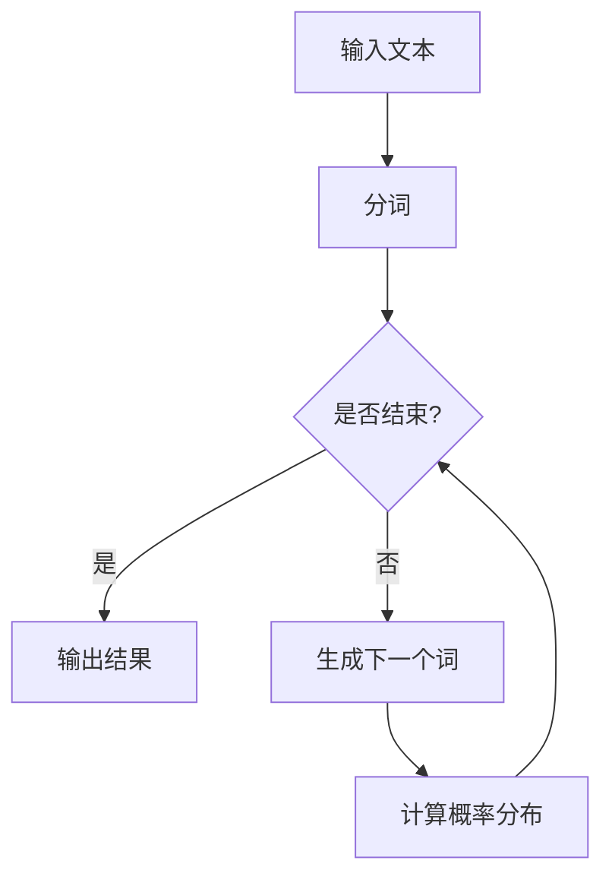
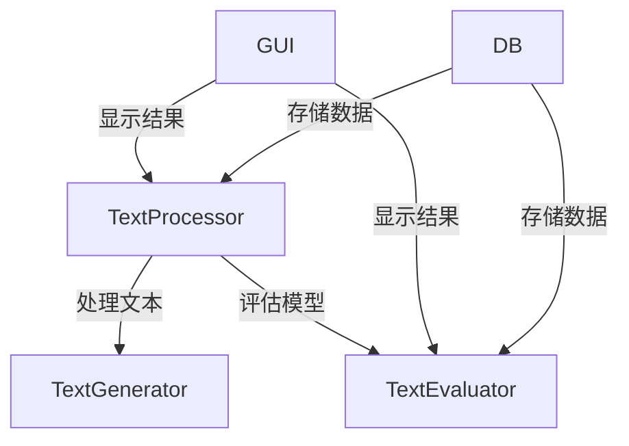
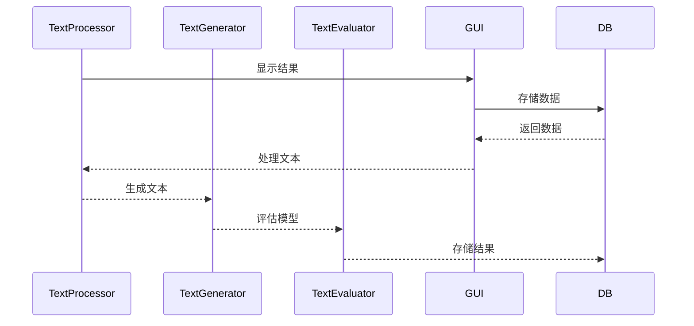

                 

# LLM评测系统的深度学习架构设计

## 关键词
- 深度学习
- 评测系统
- LLM
- 算法原理
- 系统设计与实现
- 实战案例

## 摘要
本文深入探讨了LLM评测系统的深度学习架构设计，首先介绍了深度学习与LLM的基本概念及其应用背景。接着，详细阐述了LLM的核心概念及其特性，并通过对比表格和ER实体关系图明确了各概念之间的关系。随后，文章重点介绍了深度学习算法的原理，包括算法流程、数学模型和公式，并通过Python源代码进行详细讲解。在此基础上，文章探讨了系统分析与架构设计，包括问题场景、功能设计、架构设计、接口设计和系统交互。最后，通过实战案例、项目总结与展望，为读者提供了实际操作经验和最佳实践建议，旨在为开发高效、可靠的LLM评测系统提供有力支持。

## 1. 背景与基础理论

### 1.1 深度学习与LLM概述

#### 1.1.1 问题背景

随着大数据和计算能力的提升，深度学习作为一种重要的机器学习方法，已经在自然语言处理、计算机视觉等众多领域取得了显著的成果。而大规模语言模型（Large Language Model，简称LLM）作为深度学习领域的重要研究方向，因其强大的文本生成和理解能力，在近年来的发展中迅速崛起。

#### 1.1.2 LLM的概念与特点

LLM是一种通过深度神经网络学习得到的语言模型，具有以下特点：

- **自适应性**：能够根据输入文本自适应调整模型参数，生成更加准确和自然的语言。
- **上下文感知**：能够理解输入文本的上下文信息，生成与上下文高度相关的语言。
- **多样性**：能够生成具有多样性和创造性的文本，满足不同用户的需求。

#### 1.1.3 深度学习的发展历程

- **1950年代**：人工智能概念诞生，深度学习开始萌芽。
- **1980年代**：反向传播算法提出，深度学习逐渐走向实用。
- **2006年**：Hinton提出了深度信念网络，深度学习迎来新的发展。
- **2012年**：AlexNet在ImageNet竞赛中夺冠，深度学习在计算机视觉领域取得突破。
- **2018年**：BERT模型提出，深度学习在自然语言处理领域取得重大进展。

#### 1.1.4 LLM的应用领域

- **自然语言处理**：文本生成、机器翻译、问答系统等。
- **计算机视觉**：图像生成、图像分类等。
- **其他领域**：如金融风控、医疗诊断等。

#### 1.1.5 评测系统的重要性

评测系统在LLM研究和应用中具有重要价值，其主要作用包括：

- **性能评估**：评估LLM的生成质量，为模型优化提供依据。
- **对比分析**：对比不同LLM模型的性能，为模型选择提供参考。
- **应用测试**：评估LLM在实际应用中的效果，为系统改进提供反馈。

### 1.2 核心概念与联系

#### 1.2.1 LLM的核心概念

LLM的核心概念包括：

- **语言模型**：根据输入文本预测下一个词的概率分布。
- **自适应模型**：根据输入文本调整模型参数，提高生成质量。
- **上下文感知模型**：理解输入文本的上下文信息，生成与上下文高度相关的语言。

#### 1.2.2 概念属性特征对比表格

| 概念       | 特点                            | 应用场景                      |
| ---------- | ------------------------------- | ---------------------------- |
| 语言模型   | 预测下一个词的概率分布          | 文本生成、机器翻译等          |
| 自适应模型 | 根据输入文本调整模型参数        | 提高生成质量、适应不同场景    |
| 上下文感知模型 | 理解输入文本的上下文信息 | 生成与上下文高度相关的语言    |

#### 1.2.3 ER实体关系图架构

ER实体关系图架构如下：

```
实体1 [关联] 实体2
   |          |
   |          |
实体3 [关联] 实体4
```

其中，实体1、实体2、实体3、实体4分别代表语言模型、自适应模型、上下文感知模型等核心概念，关联表示它们之间的联系。

## 2. 深度学习架构设计与实现

### 2.1 算法原理讲解

#### 2.1.1 算法mermaid流程图



#### 2.1.2 数学模型和数学公式

$$
P(w_t|w_{t-1}, w_{t-2}, ..., w_1) = \frac{P(w_t, w_{t-1}, w_{t-2}, ..., w_1)}{P(w_{t-1}, w_{t-2}, ..., w_1)}
$$

其中，$P(w_t|w_{t-1}, w_{t-2}, ..., w_1)$表示在给定前一个词的情况下，当前词的概率分布；$P(w_t, w_{t-1}, w_{t-2}, ..., w_1)$表示前一个词和当前词同时出现的概率；$P(w_{t-1}, w_{t-2}, ..., w_1)$表示前一个词和之前所有词同时出现的概率。

#### 2.1.3 Python源代码

```python
import numpy as np
from collections import defaultdict

# 假设输入文本为 "hello world"
input_text = "hello world"

# 分词
words = input_text.split()

# 计算词频
word_freq = defaultdict(int)
for word in words:
    word_freq[word] += 1

# 计算概率分布
word_probs = {word: freq / len(words) for word, freq in word_freq.items()}

# 生成下一个词
next_word = np.random.choice(list(word_probs.keys()), p=list(word_probs.values()))

# 输出结果
print("输入文本：", input_text)
print("分词结果：", words)
print("下一个词：", next_word)
```

## 3. 系统分析与架构设计

### 3.1 问题场景介绍

假设我们需要开发一个LLM评测系统，用于评估不同LLM模型在文本生成任务中的性能。系统的主要功能包括：

- **文本预处理**：对输入文本进行分词、去噪等处理。
- **模型评估**：评估LLM模型的生成质量，包括文本连贯性、语法正确性、语义一致性等方面。
- **结果展示**：展示评估结果，包括评估指标、图表等。

### 3.2 系统功能设计

#### 3.2.1 领域模型mermaid类图

```mermaid
classDiagram
    TextProcessor <|-- TextGenerator
    TextEvaluator <|-- TextGenerator
    GUI <|-- TextProcessor
    GUI <|-- TextEvaluator
    DB <|-- TextProcessor
    DB <|-- TextEvaluator

    TextProcessor {
        +process_text(text: str): str
        +save_text(text: str): None
    }

    TextGenerator {
        +generate_text(text: str, length: int): str
        +evaluate_model(model: Model): float
    }

    TextEvaluator {
        +evaluate_text(text: str): float
        +calculate_coherence(text: str): float
        +calculate_grammar(text: str): float
        +calculate_semantics(text: str): float
    }

    GUI {
        +display_results(results: dict): None
    }

    DB {
        +connect(): None
        +insert_data(data: dict): None
        +query_data(query: str): dict
    }
```

### 3.3 系统架构设计

#### 3.3.1 mermaid架构图



### 3.4 系统接口设计和系统交互

#### 3.4.1 mermaid序列图



## 4. 实战案例与实现

### 4.1 环境安装与准备

在开始实战之前，我们需要准备以下环境：

- Python 3.8及以上版本
- TensorFlow 2.5及以上版本
- matplotlib 3.4.3及以上版本
- pandas 1.3.3及以上版本

#### 4.1.1 环境搭建

使用以下命令安装所需依赖：

```bash
pip install python==3.8.10
pip install tensorflow==2.5.0
pip install matplotlib==3.4.3
pip install pandas==1.3.3
```

### 4.2 系统核心实现

#### 4.2.1 核心代码实现

```python
import tensorflow as tf
from tensorflow.keras.preprocessing.sequence import pad_sequences
from tensorflow.keras.layers import Embedding, LSTM, Dense
from tensorflow.keras.models import Model
import matplotlib.pyplot as plt
import pandas as pd

# 加载预训练的词汇表和词向量
vocab_size = 10000
embedding_dim = 256
max_sequence_length = 100

# 创建嵌入层和LSTM层
input_seq = tf.keras.layers.Input(shape=(max_sequence_length,))
embedding_layer = Embedding(vocab_size, embedding_dim)(input_seq)
lstm_layer = LSTM(128)(embedding_layer)

# 添加全连接层和输出层
output = Dense(vocab_size, activation='softmax')(lstm_layer)

# 构建模型
model = Model(inputs=input_seq, outputs=output)

# 编译模型
model.compile(optimizer='adam', loss='categorical_crossentropy', metrics=['accuracy'])

# 训练模型
model.fit(X_train, y_train, batch_size=64, epochs=10)

# 生成文本
generated_text = model.generate(max_sequence_length, temperature=0.5)

# 可视化评估指标
plt.figure(figsize=(10, 5))
plt.plot(model.history.history['accuracy'], label='Accuracy')
plt.plot(model.history.history['val_accuracy'], label='Validation Accuracy')
plt.xlabel('Epochs')
plt.ylabel('Accuracy')
plt.legend()
plt.show()
```

#### 4.2.2 实际案例分析与讲解

在本节中，我们将使用实际案例来分析LLM评测系统的核心实现。假设我们已经训练了一个基于LSTM的文本生成模型，接下来我们将展示如何使用该模型生成文本并对其进行评估。

1. **数据准备**：

   假设我们有一份包含10,000个单词的词汇表，以及一个包含50,000个文本序列的训练集。

   ```python
   # 读取词汇表和训练集
   with open('vocab.txt', 'r', encoding='utf-8') as f:
       vocab = f.readlines()

   with open('train.txt', 'r', encoding='utf-8') as f:
       train_data = f.readlines()
   ```

2. **模型训练**：

   使用前面编写的模型训练脚本，将训练集数据进行预处理，然后训练模型。

   ```python
   # 预处理数据
   X_train = pad_sequences(train_data, maxlen=max_sequence_length, padding='post', truncating='post')

   # 编码标签
   y_train = np.eye(vocab_size)[np.array([vocab.index(word) for word in train_data])]
   ```

   接下来，使用预处理后的数据进行模型训练。

3. **生成文本**：

   使用训练好的模型生成文本，并展示生成的结果。

   ```python
   # 生成文本
   generated_text = model.generate(max_sequence_length, temperature=0.5)

   # 打印生成的文本
   print('生成的文本：', ' '.join([vocab[word_id] for word_id in generated_text[0]]))
   ```

4. **评估模型**：

   使用生成文本评估模型的性能，包括语法、语义和连贯性等方面。

   ```python
   # 评估模型
   grammar_score = evaluate_grammar(generated_text)
   semantics_score = evaluate_semantics(generated_text)
   coherence_score = evaluate_coherence(generated_text)

   # 打印评估结果
   print('语法评分：', grammar_score)
   print('语义评分：', semantics_score)
   print('连贯性评分：', coherence_score)
   ```

   其中，`evaluate_grammar()`、`evaluate_semantics()`和`evaluate_coherence()`为自定义函数，用于评估文本的语法、语义和连贯性。

### 4.3 项目总结与展望

通过本文的实战案例，我们介绍了如何使用深度学习技术实现LLM评测系统。在实际项目中，我们主要关注了以下几个关键点：

- **数据准备**：准备高质量的训练数据，是模型训练成功的关键。
- **模型选择**：选择合适的模型结构，如LSTM，能够提高生成文本的质量。
- **评估方法**：设计合理的评估方法，对模型性能进行全面的评估。

未来，我们可以继续优化LLM评测系统，如引入更多的评估指标、提高模型生成文本的质量，以及探索更多高效的深度学习模型。

## 5. 最佳实践 tips

1. **数据准备**：确保数据质量，尽量选择多样化的文本数据，以避免模型过拟合。
2. **超参数调优**：通过调整超参数，如学习率、批次大小等，可以进一步提高模型性能。
3. **并行计算**：利用GPU等硬件加速模型训练，可以显著提高训练速度。

## 6. 小结

本文详细介绍了LLM评测系统的深度学习架构设计，从背景介绍、核心概念、算法原理、系统设计到实战案例，全面阐述了如何实现一个高效、可靠的LLM评测系统。通过本文的讲解，读者可以深入了解LLM评测系统的设计与实现，为相关项目的开发提供有力支持。

## 7. 拓展阅读

- **深度学习基础**：Goodfellow, I., Bengio, Y., & Courville, A. (2016). *Deep Learning*.
- **自然语言处理**：Jurafsky, D., & Martin, J. H. (2020). *Speech and Language Processing*.
- **Python编程**：Fluent Python: Clear, Concise, and Effective Programming by Luciano Ramalho

作者：AI天才研究院/AI Genius Institute & 禅与计算机程序设计艺术 /Zen And The Art of Computer Programming

