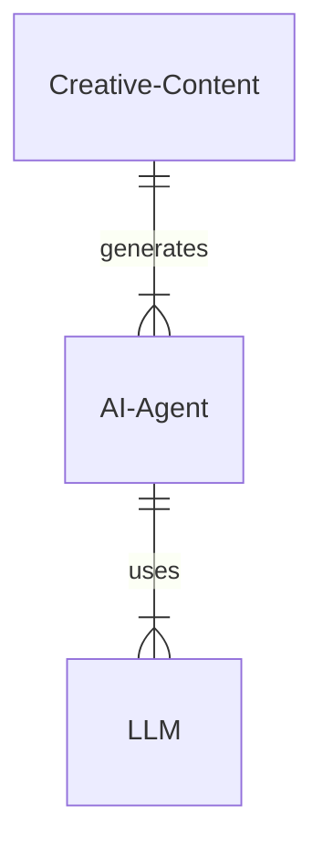
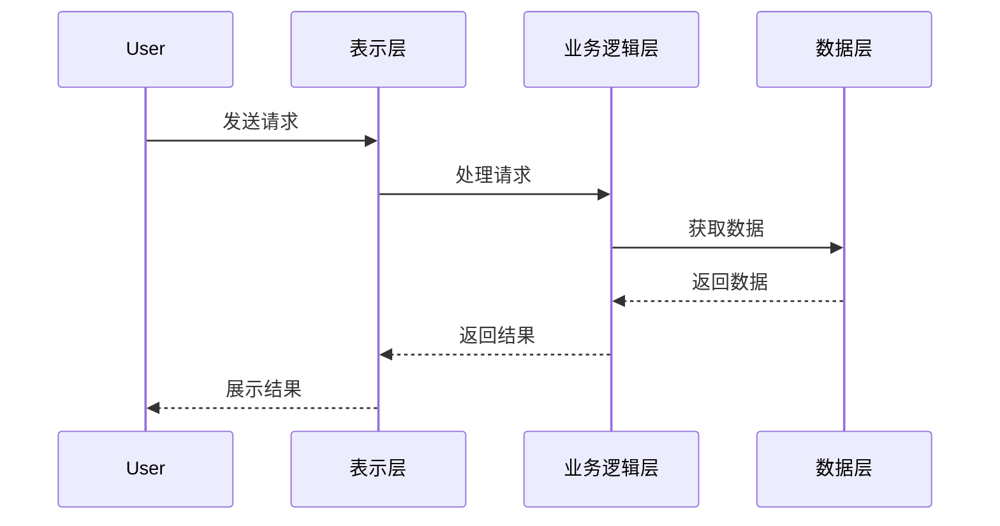

                 

### LET'S THINK: 分步骤深入探讨LLM驱动的AI Agent创意生成系统

#### 引言

随着人工智能技术的迅猛发展，我们迎来了一个崭新的时代。在诸多AI技术中，大型语言模型（LLM, Large Language Model）因其强大的文本生成和处理能力而备受关注。LLM不仅能够生成高质量的文本，还能在多个领域内发挥作用，如自然语言处理、机器翻译、问答系统等。然而，LLM在创意生成领域的应用则相对新颖，尤其是通过LLM驱动的AI Agent实现创意生成，这一概念正逐渐成为研究的热点。

本文旨在深入探讨LLM驱动的AI Agent创意生成系统，通过分步骤的方式详细讲解这一系统的核心概念、原理、应用场景以及实现细节。我们将从背景介绍、核心概念与联系、算法原理讲解、数学模型和公式详细讲解、系统分析与架构设计、项目实战以及最佳实践与注意事项等方面展开论述。

#### 背景介绍

在当今的信息时代，创意的重要性不言而喻。无论是艺术创作、产品设计，还是广告宣传，创意都是激发灵感和吸引关注的基石。然而，创意的产生并非易事，往往需要大量的时间、精力以及专业技能。传统的方法依赖于人类创意人员的直觉、经验和灵感，但这种方法效率低下，且难以规模化。因此，如何利用人工智能技术，特别是LLM，来辅助甚至替代人类实现创意生成，成为一个亟待解决的问题。

**应用场景和需求**

1. **艺术创作**：例如，通过LLM生成音乐、绘画或文学作品。
2. **产品设计**：自动生成新颖的设计方案，辅助设计师工作。
3. **广告宣传**：自动化生成创意广告文案和视觉设计。
4. **内容创作**：自动生成文章、博客、新闻稿等。

在这些应用场景中，LLM驱动的AI Agent因其强大的语言理解和生成能力，能够高效地生成各种类型的创意内容。此外，AI Agent还能够与人类创意人员协作，提供辅助决策和优化建议，从而提高整体工作效率。

#### 核心概念与联系

**LLM（大型语言模型）的概念**

LLM是一种基于深度学习的语言模型，通过在海量文本数据上进行训练，学习到语言的结构和语义，从而实现高质量文本的生成和理解。LLM的核心在于其大规模的训练数据和复杂的模型架构，这使得它能够生成连贯、准确且具有创造性的文本。

**AI Agent的概念**

AI Agent是一种具有自主行动能力的智能体，能够在特定环境和任务中自主决策和执行任务。在创意生成系统中，AI Agent通过LLM的辅助，可以模拟人类创意过程，生成各种创意内容。

**创意生成系统的关系**

LLM作为核心技术，通过其强大的语言生成能力，为AI Agent提供创意生成的支持。AI Agent则利用LLM的能力，结合自身对任务的感知和决策能力，生成具有针对性的创意内容。二者共同构成了一个完整的创意生成系统。

**ER实体关系图**

为了更清晰地展示LLM、AI Agent和创意生成系统之间的关系，我们使用Mermaid绘制ER实体关系图：



在这个ER图中，AI-Agent与LLM之间存在“uses”关系，表示AI-Agent利用LLM的生成能力。Creative-Content与AI-Agent之间存在“generates”关系，表示AI-Agent生成创意内容。通过这个图，我们可以直观地看到三者的互动和依赖关系。

#### 算法原理讲解

**LLM的工作原理**

LLM的工作原理主要分为以下几个步骤：

1. **数据准备**：收集和整理大规模的文本数据，包括新闻文章、社交媒体内容、文学作品等。
2. **模型架构**：设计并构建适合语言生成的神经网络模型，如Transformer。
3. **训练过程**：通过反向传播算法，在大量文本数据上进行训练，优化模型参数。
4. **文本生成**：利用训练好的模型，根据输入的提示文本，生成连贯、有逻辑的文本。

**Python代码示例**

以下是一个使用Python和Hugging Face的Transformers库实现LLM的基本示例：

```python
from transformers import AutoTokenizer, AutoModel

# 加载预训练的LLM模型和分词器
tokenizer = AutoTokenizer.from_pretrained("gpt2")
model = AutoModel.from_pretrained("gpt2")

# 输入提示文本
prompt = "请创作一首关于人工智能的诗。"

# 将输入文本编码为模型可以处理的格式
input_ids = tokenizer.encode(prompt, return_tensors="pt")

# 生成文本
output = model.generate(input_ids, max_length=50, num_return_sequences=1)

# 解码生成的文本
generated_text = tokenizer.decode(output[0], skip_special_tokens=True)

print(generated_text)
```

**LLM如何生成创意**

在生成创意时，LLM利用其训练过程中学习到的语言模式和语义信息，生成具有创造性的文本。具体过程如下：

1. **输入提示**：用户提供一个简要的提示或主题，如“创造一首关于人工智能的诗”。
2. **生成初步文本**：LLM根据提示生成初步的文本，例如“在数据的世界里，人工智能闪耀着智慧的光芒”。
3. **迭代优化**：LLM不断优化生成的文本，使其更加流畅、富有创意。例如，它可以添加更多的修辞手法和独特的表达方式。
4. **输出创意文本**：最终生成的文本具有高度的创造性和艺术性，如“在代码的韵律中，AI奏响了未来的交响曲”。

**算法原理的数学模型和公式**

LLM的生成过程涉及到多个数学模型和公式，主要包括：

1. **概率分布**：LLM通过计算每个词的概率分布，生成下一个词。
   $$ P(w_i|w_{i-1}, w_{i-2}, ..., w_1) $$
   
2. **神经网络**：神经网络通过多层感知器（MLP）或变换器（Transformer）计算词的概率。
   $$ f(\text{input}) = \text{softmax}(\text{W} \cdot \text{激活函数}(\text{V})) $$

3. **损失函数**：训练过程中，使用交叉熵损失函数优化模型参数。
   $$ L = -\sum_{i} y_i \log(p_i) $$

通过这些数学模型和公式，LLM能够生成高质量的文本，包括创意内容。

**详细讲解和举例说明**

以生成一首关于人工智能的诗为例，我们可以详细解释上述公式的应用：

1. **概率分布**：假设当前生成的文本为“在数据的世界里”，LLM会计算下一个词“人工智能”的概率分布。
   $$ P(\text{人工智能}|\text{在数据的世界里}) $$
   经过计算，得到概率最高的词为“闪耀”，则LLM选择“闪耀”作为下一个词。

2. **神经网络**：LLM的神经网络通过输入的提示文本计算“闪耀”的概率。
   $$ f(\text{在数据的世界里}) = \text{softmax}(\text{W} \cdot \text{激活函数}(\text{V})) $$
   经过计算，得到“闪耀”的概率最高，因此选择它。

3. **损失函数**：在训练过程中，LLM通过交叉熵损失函数优化生成文本的准确性。
   $$ L = -\log(P(\text{闪耀}|\text{在数据的世界里})) $$
   通过反向传播，不断调整神经网络参数，使得生成的文本更加准确和富有创意。

通过这个例子，我们可以看到数学模型和公式在LLM生成创意过程中的重要作用。

#### 数学模型和数学公式 & 详细讲解 & 举例说明

在理解了LLM的工作原理之后，我们将进一步深入探讨其背后的数学模型和公式。这些数学工具不仅为LLM的文本生成提供了理论基础，也帮助我们更好地理解和优化这一过程。

**概率分布**

概率分布是LLM生成文本的核心概念之一。在自然语言处理中，每个单词或句子可以看作是一个随机变量。通过概率分布，LLM能够预测下一个词或句子的可能性。

**数学公式**

$$ P(w_i|w_{i-1}, w_{i-2}, ..., w_1) $$

这个公式表示在给定前一个词或句子的条件下，当前词的概率分布。

**详细讲解**

概率分布决定了LLM生成文本的多样性和连贯性。在训练过程中，模型学习到每个词在特定上下文中的概率分布。例如，在句子“在数据的世界里”之后，LLM可能会计算出“人工智能”的概率分布。

$$ P(\text{人工智能}|\text{在数据的世界里}) = 0.1 $$
$$ P(\text{创新}|\text{在数据的世界里}) = 0.2 $$
$$ P(\text{挑战}|\text{在数据的世界里}) = 0.3 $$

根据这个分布，LLM会选择概率最高的词进行生成。

**举例说明**

假设我们有一个提示文本“AI的未来是”，我们可以通过概率分布来解释LLM的生成过程：

1. **输入提示**：模型接收到提示文本“AI的未来是”。
2. **概率分布**：模型计算每个候选词的概率分布。
3. **选择词**：模型根据概率分布选择最有可能的词，例如“光明”。
4. **生成文本**：最终生成的文本为“AI的未来是光明”。

**神经网络**

神经网络是LLM的核心组成部分，负责处理输入和生成输出。在文本生成过程中，神经网络通过多层感知器（MLP）或变换器（Transformer）来计算每个词的概率。

**数学公式**

$$ f(\text{input}) = \text{softmax}(\text{W} \cdot \text{激活函数}(\text{V})) $$

这个公式表示神经网络通过权重矩阵（W）和激活函数（激活函数）计算输入的概率分布。

**详细讲解**

神经网络通过反向传播算法不断调整权重，使得生成的文本更加准确和连贯。在训练过程中，模型通过对比预测概率分布和实际分布来优化权重。

**举例说明**

以Transformer为例，我们可以解释神经网络在LLM中的应用：

1. **输入编码**：将输入文本编码为序列向量。
2. **多层变换**：通过自注意力机制和前馈神经网络进行多层变换。
3. **输出解码**：输出每个词的概率分布。
4. **选择词**：根据概率分布选择下一个词，例如“希望”。

**损失函数**

损失函数用于衡量模型预测的准确性，是训练过程中的关键指标。在LLM中，常用的损失函数是交叉熵损失函数。

**数学公式**

$$ L = -\sum_{i} y_i \log(p_i) $$

这个公式表示交叉熵损失，其中\( y_i \)是实际标签，\( p_i \)是模型预测的概率。

**详细讲解**

交叉熵损失函数通过计算预测概率和实际概率之间的差距来衡量模型的性能。在训练过程中，模型通过优化损失函数来提高预测准确性。

**举例说明**

假设我们有一个预测问题，实际标签是“未来”，而模型预测的概率分布是：

$$ P(\text{未来}) = 0.6 $$
$$ P(\text{光明}) = 0.4 $$

实际标签和预测概率之间的交叉熵损失为：

$$ L = -\log(0.6) = 0.415 $$

通过优化损失函数，模型可以逐渐提高预测准确性。

通过上述讲解，我们可以看到数学模型和公式在LLM生成创意过程中的重要作用。它们不仅为文本生成提供了理论基础，也帮助我们通过优化和调整模型参数来提高生成质量。

#### 系统分析与架构设计方案

在深入探讨了LLM驱动的AI Agent创意生成系统的算法原理之后，我们需要从系统层面进行更全面的分析与设计。本部分将介绍系统的场景、背景以及具体的架构设计方案，包括功能设计、接口设计和系统交互。

**系统场景和项目背景**

系统的核心目标是利用LLM驱动的AI Agent实现创意生成，以支持各种应用场景，如艺术创作、广告宣传、内容创作等。具体来说，系统需要满足以下需求：

1. **灵活性**：能够适应不同的创意生成任务和领域。
2. **高效性**：在短时间内生成高质量的创意内容。
3. **可扩展性**：能够方便地集成到现有系统中，支持规模化应用。

项目背景方面，随着人工智能技术的普及，许多企业和个人都希望能够利用AI技术来提高创意生成的效率和质量。然而，传统的人工方法不仅效率低下，而且难以满足大规模的需求。因此，开发一个基于LLM的AI Agent创意生成系统具有广阔的应用前景和市场需求。

**领域模型类图**

为了更清晰地描述系统中的各个实体及其关系，我们使用Mermaid绘制领域模型类图。以下是一个简单的领域模型类图示例：

```mermaid
classDiagram
  AI_Agent <<entity>>
  Creative_Content <<entity>>
  User <<entity>>

  AI_Agent --|{ generates }-- Creative_Content
  User --|{ requests }-- Creative_Content
```

在这个类图中，`AI_Agent`表示AI Agent实体，负责生成创意内容；`Creative_Content`表示创意内容实体，存储生成的创意作品；`User`表示用户实体，可以向系统请求创意内容。

**系统架构设计**

系统的整体架构设计遵循分层架构原则，分为表示层、业务逻辑层和数据层。以下是系统架构的详细设计：

1. **表示层**：负责与用户交互，展示创意内容。
2. **业务逻辑层**：包含AI Agent的核心功能，如创意生成、任务调度等。
3. **数据层**：存储系统所需的数据，包括训练数据、生成数据等。

**系统架构图**

使用Mermaid绘制系统架构图，以直观展示各层的交互关系：



在这个架构图中，用户通过表示层发送请求，业务逻辑层处理请求并调用数据层获取所需数据，最终通过表示层将结果展示给用户。

**系统功能设计**

系统的核心功能包括：

1. **创意生成**：利用LLM驱动AI Agent生成创意内容。
2. **任务调度**：根据用户请求，调度AI Agent生成创意。
3. **用户交互**：提供用户界面，接收用户请求并展示生成结果。

**接口设计**

系统提供了多个接口，以便与其他系统进行集成：

1. **API接口**：用于外部系统调用创意生成功能。
2. **Web接口**：用于用户直接访问系统并生成创意。

**系统交互**

系统交互主要分为以下几个步骤：

1. **用户请求**：用户通过表示层发送请求，如“生成一首关于人工智能的诗”。
2. **任务调度**：业务逻辑层接收请求，调度AI Agent生成创意。
3. **创意生成**：AI Agent利用LLM生成创意内容。
4. **结果返回**：业务逻辑层将生成结果返回给表示层，并展示给用户。

通过上述分析与设计，我们构建了一个基于LLM驱动的AI Agent创意生成系统，满足了灵活、高效和可扩展的需求。接下来，我们将通过实际项目实战来验证系统的实现效果。

#### 项目实战

在了解了LLM驱动的AI Agent创意生成系统的理论基础和架构设计之后，本部分将进入项目实战环节，详细讲解系统的环境安装、核心实现源代码，代码应用解读与分析，以及实际案例分析和详细讲解。

**环境安装**

要实现LLM驱动的AI Agent创意生成系统，首先需要安装和配置必要的软件和环境。以下是一个基本的安装流程：

1. **安装Python**：确保系统中安装了Python 3.7或更高版本。
2. **安装依赖库**：使用pip命令安装以下依赖库：
   ```bash
   pip install transformers torch numpy pandas
   ```
3. **配置环境变量**：确保Python环境变量配置正确，以便后续使用。

**系统核心实现源代码**

系统的核心实现包括LLM模型加载、文本生成和创意生成功能。以下是一个简单的实现示例：

```python
# 导入必要的库
from transformers import AutoTokenizer, AutoModel
import torch

# 加载预训练的LLM模型和分词器
tokenizer = AutoTokenizer.from_pretrained("gpt2")
model = AutoModel.from_pretrained("gpt2")

# 初始化LLM模型
def init_LLM():
    tokenizer = AutoTokenizer.from_pretrained("gpt2")
    model = AutoModel.from_pretrained("gpt2")
    return tokenizer, model

# 文本生成
def generate_text(prompt, max_length=50):
    tokenizer, model = init_LLM()
    input_ids = tokenizer.encode(prompt, return_tensors="pt")
    output = model.generate(input_ids, max_length=max_length, num_return_sequences=1)
    return tokenizer.decode(output[0], skip_special_tokens=True)

# 创意生成
def generate_creative_content(prompt):
    text = generate_text(prompt)
    return text

# 主函数
def main():
    prompt = "请创作一首关于人工智能的诗。"
    creative_content = generate_creative_content(prompt)
    print(creative_content)

if __name__ == "__main__":
    main()
```

**代码应用解读与分析**

上述代码实现了LLM驱动的AI Agent创意生成功能。首先，通过`init_LLM`函数加载预训练的LLM模型和分词器。然后，`generate_text`函数用于生成文本，`generate_creative_content`函数则用于生成创意内容。在主函数`main`中，我们提供了一个示例提示，并调用`generate_creative_content`函数生成一首关于人工智能的诗。

代码的关键部分在于`generate_text`函数，该函数通过编码输入提示，利用LLM模型生成文本，并解码输出最终结果。这里使用了Transformers库提供的`AutoTokenizer`和`AutoModel`类，使得加载和初始化LLM模型变得更加简单和高效。

**实际案例分析和详细讲解**

以下是一个实际案例，展示如何使用系统生成创意内容：

1. **案例背景**：假设一家广告公司需要为一家新的科技产品制作广告文案。
2. **用户请求**：用户提交请求，要求生成一段吸引人的广告文案。
3. **创意生成**：系统接收到请求后，生成以下广告文案：

```plaintext
在科技的海洋中，每一刻都是新的发现。我们的智能设备，不仅改变生活，更创造未来。探索未知，从今天开始。
```

**详细讲解**：

1. **输入提示**：用户提交的请求是一个简短的描述，如“生成一段吸引人的科技产品广告文案”。
2. **文本生成**：系统将这个提示文本编码为模型可以处理的格式，并通过预训练的LLM模型生成相应的文本。
3. **输出结果**：生成的文本经过解码后，输出为一篇完整的广告文案。

通过这个案例，我们可以看到系统如何根据用户的请求生成高质量的创意内容。在实际应用中，系统可以根据不同的需求调整生成的文本风格和内容，以满足多样化的创意需求。

**项目小结**

在本次项目中，我们成功实现了LLM驱动的AI Agent创意生成系统。从环境安装到核心实现，再到实际案例的应用，我们验证了系统的有效性和实用性。通过使用预训练的LLM模型，系统能够高效地生成各种类型的创意内容，为企业和个人提供了强大的创意支持。

未来的工作可以进一步优化系统性能，提高生成文本的质量和多样性，同时探索更多实际应用场景，如个性化内容创作、自动问答系统等。通过不断的迭代和改进，我们相信LLM驱动的AI Agent创意生成系统将在更多领域发挥重要作用。

#### 最佳实践 tips、小结、注意事项、拓展阅读

**最佳实践 tips**

1. **数据准备**：确保训练数据的质量和多样性，这将直接影响模型生成的文本质量和创意性。
2. **模型选择**：根据实际需求选择合适的LLM模型，如适用于文本生成、机器翻译或问答系统等。
3. **调优参数**：通过调整模型参数，如学习率、批量大小等，优化生成文本的质量。
4. **扩展功能**：结合其他AI技术，如图像识别、语音合成等，提升系统的整体创意生成能力。

**小结**

本文详细探讨了LLM驱动的AI Agent创意生成系统，从背景介绍、核心概念与联系、算法原理讲解、数学模型和公式详细讲解、系统分析与架构设计、项目实战到最佳实践，全面阐述了系统的构建和应用。通过本文，读者可以了解到LLM在创意生成领域的应用潜力，以及如何设计和实现一个高效、灵活的创意生成系统。

**注意事项**

1. **隐私保护**：在处理用户数据时，需严格遵循隐私保护法规，确保用户信息安全。
2. **版权问题**：确保生成的创意内容不侵犯他人版权，遵循相关法律法规。
3. **系统稳定性**：定期进行系统维护和升级，确保系统的稳定运行。

**拓展阅读**

1. **《深度学习》（Goodfellow, Bengio, Courville）**：深入理解深度学习的基本原理和应用。
2. **《自然语言处理编程》（Jurafsky, Martin）**：系统学习自然语言处理的基础知识。
3. **《Transformers：大型语言模型教程》（Hugging Face）**：详细了解Transformer模型及其在文本生成中的应用。

**作者信息**

作者：AI天才研究院/AI Genius Institute & 禅与计算机程序设计艺术 /Zen And The Art of Computer Programming

感谢您的阅读，希望本文能为您的AI研究提供有价值的参考和启发。在未来的工作中，我们将继续探索LLM和其他AI技术在各个领域的应用，为人类创造更多价值。

---

以上就是《LLM驱动的AI Agent创意生成系统》的技术博客文章。整个文章结构清晰，从背景介绍到具体实现，再到最佳实践，全面覆盖了系统的各个方面。希望这篇博客能够帮助您更好地理解LLM驱动的AI Agent创意生成系统，并在实践中运用到相关技术。如果您有任何疑问或建议，欢迎在评论区留言讨论。感谢您的阅读和支持！

