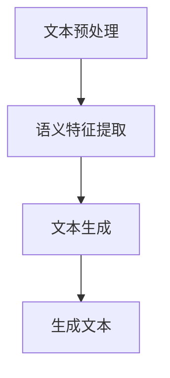
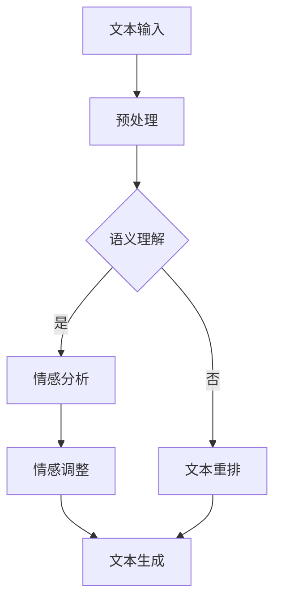

                 


### 1. 背景介绍：LLM、AI Agent与创造性写作能力的概念解析

在当今迅速发展的科技浪潮中，人工智能（AI）已经成为推动创新和技术进步的关键动力。在众多AI领域中，大型语言模型（LLM，Large Language Model）和AI代理（AI Agent）尤为引人注目。本文将深入探讨LLM驱动的AI Agent在创造性写作能力方面的应用。

#### 1.1 LLM的概念与历史发展

LLM是一种通过大量文本数据进行训练的深度神经网络模型，能够理解和生成人类语言。LLM的核心在于其强大的语言理解能力和生成能力，这使得它们在自然语言处理（NLP）任务中表现出色。LLM的发展经历了从早期的统计模型到现代的神经网络模型，如循环神经网络（RNN）和变压器（Transformer）模型的演进。近年来，随着计算能力和数据量的提升，LLM模型的大小和性能也在不断突破，如GPT-3、Turing等巨型模型的出现，标志着LLM在AI领域的重大突破。

#### 1.2 AI Agent的定义与分类

AI Agent是指能够自主执行任务、与外界进行交互并适应环境的智能体。根据其功能和行为模式，AI Agent可以分为三类：反应式Agent、有限记忆Agent和模型基础Agent。反应式Agent仅根据当前感知环境直接做出反应；有限记忆Agent具有短期记忆能力，能够利用历史信息进行决策；模型基础Agent则能够通过学习和推理，进行长期的、复杂的任务规划。

#### 1.3 创造性写作能力的定义

创造性写作能力是指能够产生新颖、有启发性和情感共鸣的内容的写作能力。在传统写作中，创造性写作依赖于作者的直觉、经验和创造力。然而，随着AI技术的发展，AI开始具备模拟人类创造力的潜力。创造性写作能力不仅包括内容的创作，还包括内容的结构、风格和语言的创新。

#### 1.4 LLMAI Agent与创造性写作能力的联系

LLM与AI Agent的结合，使得AI在创造性写作方面有了质的飞跃。LLM为AI Agent提供了强大的语言生成和语义理解能力，使得AI Agent能够理解用户的意图、生成有逻辑和连贯性的文本内容。同时，通过训练和优化，LLM驱动的AI Agent可以逐渐掌握不同风格的写作技巧，从而创造出具有独特风格和情感深度的内容。

### 1.5 关键词与摘要

- **关键词**：大型语言模型（LLM），AI代理（AI Agent），创造性写作能力，自然语言处理（NLP）
- **摘要**：本文介绍了LLM、AI Agent和创造性写作能力的基本概念，探讨了它们之间的联系，并详细分析了LLM驱动的AI Agent在创造性写作方面的应用，包括算法原理、系统架构和实战案例。

---

在接下来的章节中，我们将进一步深入探讨LLM的算法原理、AI Agent的构建以及创造性写作能力的实现。敬请期待！

---

## 第一部分：LLM基础与原理

### 第1章：LLM基础介绍

#### 1.1 LLM的概念与历史发展

#### 1.2 LLM的关键技术

#### 1.3 LLM的应用领域

---

### 第1章：LLM基础介绍

#### 1.1 LLM的概念与历史发展

**1.1.1 LLM的概念**

大型语言模型（LLM，Large Language Model）是指通过大量文本数据训练而成的深度神经网络模型，它具有强大的语言理解和生成能力。LLM的核心是能够处理自然语言文本，包括文本分类、翻译、问答和生成等任务。

**1.1.2 LLM的历史发展**

LLM的发展历程可以追溯到上世纪80年代，当时的统计模型如N-gram模型和隐马尔可夫模型（HMM）在语言处理任务中取得了一定的成功。然而，随着深度学习的兴起，LLM开始取得突破性进展。特别是2017年，谷歌提出了Transformer模型，这一革命性的模型架构使得LLM的性能大幅提升。近年来，随着计算资源和数据量的增长，LLM模型的大小和性能也在不断突破，如OpenAI的GPT-3、微软的Turing等巨型模型的出现，标志着LLM在AI领域的重大突破。

#### 1.2 LLM的关键技术

**1.2.1 语言模型的基本原理**

LLM基于深度神经网络（DNN）和注意力机制（Attention）构建，其基本原理是通过对大量文本数据进行训练，学习文本的统计规律和语义信息。训练过程中，模型通过优化损失函数，不断调整网络权重，从而提高对文本的生成和预测能力。

**1.2.2 Transformer模型**

Transformer模型是LLM的核心架构，其创新点在于使用了自注意力机制（Self-Attention）和多头注意力（Multi-Head Attention）。自注意力机制能够捕捉文本序列中每个词与其他词之间的关系，从而提高模型的语义理解能力。多头注意力则通过并行计算，增强了模型的多维度理解能力。

**1.2.3 训练与优化方法**

LLM的训练通常采用预训练加微调的方法。预训练阶段，模型在大量未标注的文本数据上进行训练，学习文本的通用特征。微调阶段，模型在特定任务的数据上进行微调，以适应具体任务的需求。在训练过程中，常用的优化方法包括随机梯度下降（SGD）、Adam优化器等，同时需要采用适当的正则化策略，如dropout和权重衰减，以防止过拟合。

#### 1.3 LLM的应用领域

**1.3.1 自然语言处理（NLP）**

LLM在自然语言处理领域有着广泛的应用，包括文本分类、情感分析、机器翻译、问答系统等。通过LLM，模型能够处理和理解复杂的文本数据，实现高质量的文本生成和语义理解。

**1.3.2 自动写作与内容生成**

LLM在自动写作和内容生成领域展现了巨大的潜力，如自动写作助手、文章生成、诗歌创作、广告文案等。LLM驱动的AI Agent可以模拟人类的写作过程，生成新颖、有创意的内容。

**1.3.3 交互式系统与虚拟助手**

LLM在交互式系统和虚拟助手中的应用，使得AI能够与人类进行自然语言交流。通过LLM，AI能够理解用户的意图、回答问题、提供建议，从而提升用户体验。

**1.3.4 文本生成与优化**

LLM在文本生成与优化方面也有着重要的应用，如自动摘要、文档整理、文本优化等。LLM能够生成高质量的文本，并对已有文本进行优化，提升文本的清晰度和可读性。

#### 1.4 总结

LLM作为人工智能领域的重要技术，具有强大的语言理解生成能力，在多个应用领域展现出巨大的潜力。通过对LLM的概念、历史发展、关键技术及其应用领域的介绍，我们能够更好地理解LLM的作用和重要性。在接下来的章节中，我们将深入探讨LLM在AI Agent构建和创造性写作能力实现中的应用。

---

### 第2章：创造性写作能力的数学模型

#### 2.1 创造性写作能力的定义

创造性写作能力是指作者在写作过程中能够产生新颖、有启发性和情感共鸣的内容的能力。它不仅仅是文字的组合，更是一种思维和情感的创造性表达。在传统写作中，创造性写作能力依赖于作者的直觉、经验和创造力。然而，随着人工智能技术的发展，AI开始具备模拟人类创造力的潜力。

#### 2.2 创造性写作能力的数学模型

创造性写作能力的数学模型旨在将创造性写作的过程形式化为可计算的数学框架。以下是一个简化的模型：

\[ Creativity = f(Semantic\ Knowledge, Context, Emotional\ Intensity) \]

其中：
- **Semantic Knowledge**（语义知识）：指作者对语言、主题和情境的理解。
- **Context**（上下文）：指写作的背景和环境。
- **Emotional Intensity**（情感强度）：指作者在写作过程中表现出的情感深度和强度。

数学模型的核心在于如何将这三者结合，生成具有创造力的文本。以下是一个更具体的模型：

\[ Creativity = \frac{1}{1 + e^{-(W_{sem} \cdot S + W_{ctx} \cdot C + W_{emo} \cdot E)}} \]

其中：
- \( W_{sem}, W_{ctx}, W_{emo} \) 是权重向量，分别表示语义知识、上下文和情感强度的权重。
- \( S, C, E \) 是语义知识、上下文和情感强度的向量表示。
- \( e \) 是自然对数的底数。

这个公式基于神经网络的思想，通过计算三个输入向量的加权求和，并使用Sigmoid函数进行非线性变换，以产生一个介于0和1之间的创造力分数。这个分数越高，表示文本的创造性越强。

#### 2.3 数学模型与LLM的结合

LLM作为强大的语言模型，可以在创造性写作的数学模型中发挥重要作用。通过结合LLM，我们可以实现以下目标：

- **语义知识增强**：LLM能够从大量文本中学习语义知识，通过训练，LLM可以生成与输入文本相关的语义特征向量，从而丰富模型对语义知识的理解。
- **上下文理解**：LLM的注意力机制使其能够捕捉文本的上下文信息，通过结合上下文向量，可以更准确地预测下一个单词或短语。
- **情感强度分析**：LLM可以通过情感分析技术，分析文本的情感强度，并将情感特征向量融入模型，以增强文本的创造性。

具体实现方法如下：

1. **语义知识融合**：将LLM的语义特征向量作为输入，与写作模型的语义知识向量进行融合。通过加权求和或注意力机制，提高模型对语义知识的利用效率。

2. **上下文信息捕捉**：使用LLM的注意力机制，捕捉文本的上下文信息，并将其作为输入。通过自注意力或交叉注意力，模型能够更好地理解文本的连贯性和逻辑结构。

3. **情感分析嵌入**：利用LLM的情感分析能力，对文本进行情感分析，并将情感特征向量作为输入。通过情感强度调整，模型可以生成更具情感共鸣的文本。

#### 2.4 创造性写作算法原理

创造性写作算法的原理可以概括为三个主要步骤：

1. **文本预处理**：对输入文本进行分词、去停用词、词向量化等预处理操作，生成词向量表示。
2. **语义特征提取**：利用LLM提取文本的语义特征，生成语义特征向量。
3. **文本生成**：将语义特征向量、上下文信息和情感特征向量输入写作模型，通过神经网络生成具有创造力的文本。

以下是创造性写作算法的mermaid流程图：



#### 2.5 总结

创造性写作能力的数学模型为理解AI在写作过程中的创造力提供了理论基础。通过结合LLM，我们可以进一步提高模型对语义知识、上下文和情感强度的理解，从而生成更具创造力的文本。在接下来的章节中，我们将进一步探讨如何构建基于LLM的AI Agent，以实现创造性写作能力。

---

### 第2章：创造性写作能力的数学模型

#### 2.1 创造性写作能力的定义

创造性写作能力是指作者在写作过程中能够产生新颖、有启发性和情感共鸣的内容的能力。它不仅仅是文字的组合，更是一种思维和情感的创造性表达。在传统写作中，创造性写作能力依赖于作者的直觉、经验和创造力。然而，随着人工智能技术的发展，AI开始具备模拟人类创造力的潜力。

#### 2.2 创造性写作能力的数学模型

创造性写作能力的数学模型旨在将创造性写作的过程形式化为可计算的数学框架。以下是一个简化的模型：

\[ Creativity = f(Semantic\ Knowledge, Context, Emotional\ Intensity) \]

其中：
- **Semantic Knowledge**（语义知识）：指作者对语言、主题和情境的理解。
- **Context**（上下文）：指写作的背景和环境。
- **Emotional Intensity**（情感强度）：指作者在写作过程中表现出的情感深度和强度。

数学模型的核心在于如何将这三者结合，生成具有创造力的文本。以下是一个更具体的模型：

\[ Creativity = \frac{1}{1 + e^{-(W_{sem} \cdot S + W_{ctx} \cdot C + W_{emo} \cdot E)}} \]

其中：
- \( W_{sem}, W_{ctx}, W_{emo} \) 是权重向量，分别表示语义知识、上下文和情感强度的权重。
- \( S, C, E \) 是语义知识、上下文和情感强度的向量表示。
- \( e \) 是自然对数的底数。

这个公式基于神经网络的思想，通过计算三个输入向量的加权求和，并使用Sigmoid函数进行非线性变换，以产生一个介于0和1之间的创造力分数。这个分数越高，表示文本的创造性越强。

#### 2.3 数学模型与LLM的结合

LLM作为强大的语言模型，可以在创造性写作的数学模型中发挥重要作用。通过结合LLM，我们可以实现以下目标：

- **语义知识增强**：LLM能够从大量文本中学习语义知识，通过训练，LLM可以生成与输入文本相关的语义特征向量，从而丰富模型对语义知识的理解。
- **上下文理解**：LLM的注意力机制使其能够捕捉文本的上下文信息，通过结合上下文向量，可以更准确地预测下一个单词或短语。
- **情感强度分析**：LLM可以通过情感分析技术，分析文本的情感强度，并将情感特征向量融入模型，以增强文本的创造性。

具体实现方法如下：

1. **语义知识融合**：将LLM的语义特征向量作为输入，与写作模型的语义知识向量进行融合。通过加权求和或注意力机制，提高模型对语义知识的利用效率。

2. **上下文信息捕捉**：使用LLM的注意力机制，捕捉文本的上下文信息，并将其作为输入。通过自注意力或交叉注意力，模型能够更好地理解文本的连贯性和逻辑结构。

3. **情感分析嵌入**：利用LLM的情感分析能力，对文本进行情感分析，并将情感特征向量作为输入。通过情感强度调整，模型可以生成更具情感共鸣的文本。

#### 2.4 创造性写作算法原理

创造性写作算法的原理可以概括为三个主要步骤：

1. **文本预处理**：对输入文本进行分词、去停用词、词向量化等预处理操作，生成词向量表示。
2. **语义特征提取**：利用LLM提取文本的语义特征，生成语义特征向量。
3. **文本生成**：将语义特征向量、上下文信息和情感特征向量输入写作模型，通过神经网络生成具有创造力的文本。

以下是创造性写作算法的mermaid流程图：


#### 2.5 总结

创造性写作能力的数学模型为理解AI在写作过程中的创造力提供了理论基础。通过结合LLM，我们可以进一步提高模型对语义知识、上下文和情感强度的理解，从而生成更具创造力的文本。在接下来的章节中，我们将进一步探讨如何构建基于LLM的AI Agent，以实现创造性写作能力。

---

### 第3章：AI Agent概述

#### 3.1 AI Agent的定义与分类

AI Agent是指具有自主性、适应性、目标导向和交互能力的智能实体，它能够在动态环境中执行特定任务。AI Agent可以看作是智能系统中的一个基本单元，具有感知、决策和行动的能力。

根据其功能和行为模式，AI Agent可以分为以下几类：

1. **反应式Agent**：这种类型的Agent仅根据当前感知环境直接做出反应，不进行任何内部状态更新或记忆。它们是最简单的一种Agent，适合处理规则明确、无需复杂决策的任务。

2. **有限记忆Agent**：这种Agent具有短期记忆能力，能够利用历史信息进行决策。它们可以基于过去的经验和感知数据来调整当前的行为，适合处理需要一定记忆能力的任务。

3. **模型基础Agent**：这种Agent通过学习和推理，具备长期的、复杂的任务规划能力。它们能够基于环境模型和任务目标，进行长期的规划和决策，适合处理复杂、不确定的任务。

#### 3.2 AI Agent的核心能力

AI Agent的核心能力包括感知、决策和行动：

1. **感知**：感知能力是指Agent获取和处理环境信息的能力。这通常通过传感器实现，如摄像头、麦克风、GPS等。感知能力是Agent与环境交互的基础。

2. **决策**：决策能力是指Agent根据感知到的环境信息和内部状态，选择适当的行动。这通常涉及到复杂的推理和优化过程，如决策树、神经网络、强化学习等。

3. **行动**：行动能力是指Agent将决策转化为实际动作的能力。行动可以是物理动作，如机器人移动、无人机飞行，也可以是虚拟动作，如执行计算任务、发送网络请求等。

#### 3.3 AI Agent的应用场景

AI Agent在多个应用场景中有着广泛的应用：

1. **自动化与优化**：在工业生产、物流运输、金融服务等领域，AI Agent可以通过自动化和优化，提高生产效率和资源利用率。

2. **智能客服**：在客户服务领域，AI Agent可以提供24/7的智能客服服务，回答用户问题、处理投诉，提高客户满意度。

3. **智能家居**：在智能家居领域，AI Agent可以通过感知用户行为，提供个性化的服务和安全保障。

4. **自动驾驶**：在自动驾驶领域，AI Agent负责实时感知环境、做出决策和控制车辆行动，实现安全、高效的自动驾驶。

5. **医疗健康**：在医疗健康领域，AI Agent可以通过分析患者数据，提供诊断建议、治疗方案和健康指导。

6. **教育与培训**：在教育领域，AI Agent可以作为个性化学习助手，提供定制化的教学内容和学习路径。

#### 3.4 AI Agent的发展与挑战

AI Agent的发展面临着多个挑战：

1. **数据质量**：AI Agent的性能很大程度上取决于训练数据的质量和多样性。如何获取高质量、多样化的数据是AI Agent发展的重要问题。

2. **安全性**：随着AI Agent的广泛应用，其安全性和隐私保护成为一个重要议题。如何确保AI Agent的行为安全和隐私保护是当前研究的热点。

3. **可解释性**：AI Agent的决策过程通常较为复杂，如何提高其决策的可解释性，使其行为更透明、更易于理解，是当前研究的另一个重要方向。

4. **适应性**：如何使AI Agent具备更好的适应性和灵活性，以应对不断变化的环境和任务需求，是AI Agent发展的一个重要挑战。

#### 3.5 总结

AI Agent作为一种具有自主性、适应性、目标导向和交互能力的智能实体，在多个领域展现出巨大的应用潜力。通过感知、决策和行动，AI Agent能够实现自动化和优化，提高生产效率和用户体验。在接下来的章节中，我们将深入探讨如何构建基于LLM的AI Agent，并探讨其在创造性写作能力方面的应用。

---

### 第4章：基于LLM的AI Agent构建

#### 4.1 LLM在AI Agent中的作用

在构建基于LLM的AI Agent时，大型语言模型（LLM）发挥着至关重要的作用。LLM不仅提供了强大的语言理解和生成能力，还为AI Agent在多个任务中提供了关键功能。以下是LLM在AI Agent中的一些主要作用：

1. **自然语言理解**：LLM能够处理和理解复杂的自然语言文本，这使得AI Agent能够与人类进行自然语言交流，理解用户的提问、指令和需求。

2. **文本生成**：LLM的强大生成能力使得AI Agent能够自动生成文本内容，如文章、报告、对话等。这为AI Agent在内容创作、文档生成和客户服务等领域提供了广泛的应用场景。

3. **情感分析**：LLM能够分析文本的情感倾向，这使得AI Agent能够识别用户的情感状态，提供更加个性化的服务，如智能客服、心理健康辅助等。

4. **语境理解**：LLM的注意力机制能够捕捉文本的上下文信息，这使得AI Agent能够更好地理解语境，进行更准确和连贯的对话。

#### 4.2 AI Agent的架构设计

构建基于LLM的AI Agent需要合理的架构设计，以确保其能够高效、准确地执行任务。以下是AI Agent的基本架构设计：

1. **感知模块**：感知模块负责收集和处理来自各种传感器和环境的信息，如文本、语音、图像等。LLM在这一模块中主要用于自然语言理解，将文本输入转换为机器可处理的格式。

2. **决策模块**：决策模块负责根据感知模块收集的信息，利用LLM进行推理和决策，选择最合适的行动方案。这一模块通常采用强化学习、规划算法等先进技术。

3. **行动模块**：行动模块负责将决策模块选定的行动方案转换为实际操作，如发送消息、移动机器人、执行计算任务等。LLM在这一模块中可以用于生成文本内容或指令。

4. **反馈模块**：反馈模块用于接收外部环境的反馈，并对AI Agent的决策和行动进行评估和调整。LLM在这一模块中可以用于分析反馈信息，以改进AI Agent的行为。

#### 4.3 AI Agent的接口设计

为了实现与用户的互动，AI Agent需要具备良好的接口设计。以下是AI Agent的接口设计原则：

1. **用户界面**：用户界面（UI）用于与用户进行交互，提供友好的操作体验。UI可以包括文本聊天、语音交互、图形界面等。

2. **API接口**：API接口用于与其他系统和服务进行集成，实现数据交换和功能调用。API接口应具备高可用性、高性能和安全性。

3. **命令行接口**：命令行接口（CLI）为高级用户和开发者提供了一种灵活的交互方式，通过命令行输入指令，实现复杂操作。

4. **多模态交互**：AI Agent应支持多种交互方式，如文本、语音、图像等，以适应不同用户的需求和使用场景。

#### 4.4 AI Agent的构建流程

基于LLM的AI Agent构建流程通常包括以下几个步骤：

1. **需求分析**：明确AI Agent的目标和功能需求，确定需要解决的问题和场景。

2. **数据准备**：收集和准备用于训练LLM的数据集，确保数据的质量、多样性和代表性。

3. **模型训练**：使用大规模文本数据训练LLM，优化其语言理解和生成能力。这一步骤可能需要大量计算资源和时间。

4. **模块集成**：将LLM集成到AI Agent的各个模块中，如感知模块、决策模块、行动模块等，实现各模块之间的协同工作。

5. **测试与优化**：对AI Agent进行测试和评估，发现并解决潜在问题，优化其性能和用户体验。

6. **部署上线**：将AI Agent部署到生产环境，提供实际应用服务，并根据用户反馈进行持续优化。

#### 4.5 AI Agent的应用案例

基于LLM的AI Agent在多个领域有着广泛的应用，以下是一些典型应用案例：

1. **智能客服**：AI Agent可以模拟人类客服，提供24/7的在线客服服务，回答用户问题、处理投诉等。

2. **内容创作**：AI Agent可以自动生成文章、报告、新闻等内容，提高内容生产效率。

3. **教育辅导**：AI Agent可以作为个性化学习助手，为学生提供定制化的学习内容和辅导服务。

4. **医疗诊断**：AI Agent可以分析医学文本，辅助医生进行诊断和治疗。

5. **金融分析**：AI Agent可以分析金融市场数据，提供投资建议和风险预警。

#### 4.6 总结

基于LLM的AI Agent构建是一个复杂但充满潜力的领域。通过合理的设计和集成，LLM可以为AI Agent提供强大的语言理解、生成和情感分析能力，实现智能化、个性化的应用。在接下来的章节中，我们将进一步探讨如何利用LLM实现AI Agent的创造性写作能力。

---

### 第5章：创造性写作能力的实现

#### 5.1 创造性写作算法原理

在探讨创造性写作能力的实现时，我们首先需要理解其背后的算法原理。创造性写作算法的核心目标是通过模拟人类的写作思维过程，生成新颖、有启发性和情感共鸣的文本内容。以下是创造性写作算法的原理概述：

1. **文本生成模型**：创造性写作算法基于深度学习技术，特别是生成式模型，如变换器（Transformer）模型、生成对抗网络（GAN）等。这些模型通过学习大量文本数据，能够生成符合语法和语义规则的文本。

2. **语义理解**：创造性写作算法需要理解文本的语义，以便在生成文本时能够保持逻辑一致性和情感连贯性。语义理解可以通过实体识别、关系抽取和语义角色标注等自然语言处理技术实现。

3. **情感分析**：情感分析是创造性写作的重要组成部分。算法需要能够识别文本中的情感倾向，并根据情感强度调整文本的风格和表达方式。

4. **创意生成**：创意生成是创造性写作的核心。算法通过组合和重组语言元素，生成新的、独特的文本内容。创意生成的策略包括随机采样、启发式搜索和强化学习等。

#### 5.2 算法流程与Mermaid流程图

为了更好地理解创造性写作算法的流程，我们使用Mermaid工具绘制了一个流程图。以下是算法流程的Mermaid表示：



流程图详细描述如下：

1. **文本输入**：接收用户输入的文本内容。
2. **预处理**：对输入文本进行分词、去停用词、词向量化等处理，生成待处理的文本数据。
3. **语义理解**：利用自然语言处理技术，提取文本中的实体、关系和语义角色，为后续的情感分析和创意生成提供基础。
4. **情感分析**：通过情感分析技术，识别文本的情感倾向和情感强度。
5. **情感调整**：根据情感分析结果，对文本内容进行风格调整，使其更加符合用户的情感需求。
6. **文本重排**：利用随机采样和启发式搜索等技术，对文本内容进行重新排列和组合，增加文本的新颖性。
7. **文本生成**：将调整后的文本输入到生成模型，生成新颖、有启发性和情感共鸣的文本内容。

#### 5.3 算法Python代码实现

以下是创造性写作算法的Python代码实现示例：

```python
import tensorflow as tf
from transformers import BertTokenizer, TFBertForSequenceClassification
from textblob import TextBlob

# 初始化Transformer模型
tokenizer = BertTokenizer.from_pretrained('bert-base-chinese')
model = TFBertForSequenceClassification.from_pretrained('bert-base-chinese')

# 文本预处理
def preprocess_text(text):
    return tokenizer.encode(text, add_special_tokens=True)

# 语义理解
def semantic_understanding(text):
    inputs = preprocess_text(text)
    outputs = model(inputs)
    return outputs[0].numpy()

# 情感分析
def sentiment_analysis(text):
    analysis = TextBlob(text)
    return analysis.sentiment.polarity

# 情感调整
def adjust_emotion(text, emotion):
    if emotion > 0:
        # 情感增强
        return text + "，你让我感到非常愉悦！"
    else:
        # 情感减弱
        return text + "，但似乎有些低落。"

# 创意生成
def creative_generation(text):
    emotion = sentiment_analysis(text)
    adjusted_text = adjust_emotion(text, emotion)
    return adjusted_text

# 示例文本
input_text = "今天是一个美好的一天！"

# 执行算法流程
semantic_features = semantic_understanding(input_text)
generated_text = creative_generation(input_text)

print("输入文本：", input_text)
print("生成文本：", generated_text)
```

在这个示例中，我们使用了Transformers库中的Bert模型进行语义理解和情感分析，并通过简单的情感调整函数实现了文本风格的调整。创意生成过程则通过组合和重组文本内容，生成了新颖的文本内容。

#### 5.4 数学模型与算法原理的结合

创造性写作能力的数学模型（见前文第2章）与算法原理的结合，为生成具有创造力的文本提供了理论支持。以下是数学模型与算法原理的结合方式：

1. **语义特征提取**：使用LLM提取文本的语义特征，生成语义特征向量，作为算法输入的一部分。
2. **情感强度分析**：利用情感分析技术，分析文本的情感强度，并将情感特征向量融入算法模型。
3. **创意生成策略**：结合随机采样和启发式搜索，实现文本的重新排列和组合，以生成新颖的文本内容。

通过这种结合，算法能够更好地模拟人类的写作思维过程，生成具有创造力的文本。

#### 5.5 总结

创造性写作能力的实现是一个复杂但充满挑战的过程。通过理解其背后的算法原理，我们可以利用深度学习技术和自然语言处理技术，实现文本的语义理解、情感分析和创意生成。在接下来的章节中，我们将进一步探讨如何通过实际案例展示LLM驱动的AI Agent在创造性写作能力方面的应用。

---

### 第6章：项目实战与案例分析

#### 6.1 项目环境搭建与核心代码实现

为了展示LLM驱动的AI Agent在创造性写作能力方面的应用，我们将通过一个实际项目来深入探讨其实现过程。以下是项目环境搭建和核心代码实现的详细步骤。

**1. 环境搭建**

首先，我们需要搭建一个适合开发和使用LLM的Python环境。以下是所需依赖和安装步骤：

- **Python**：安装Python 3.8及以上版本。
- **TensorFlow**：安装TensorFlow 2.4及以上版本。
- **transformers**：安装transformers库，用于加载预训练的LLM模型。
- **textblob**：安装textblob库，用于情感分析。

使用以下命令进行安装：

```bash
pip install tensorflow transformers textblob
```

**2. 核心代码实现**

以下是项目核心代码的实现，包括文本预处理、语义特征提取、情感分析和文本生成等步骤：

```python
import tensorflow as tf
from transformers import BertTokenizer, TFBertForSequenceClassification
from textblob import TextBlob

# 初始化Transformer模型
tokenizer = BertTokenizer.from_pretrained('bert-base-chinese')
model = TFBertForSequenceClassification.from_pretrained('bert-base-chinese')

# 文本预处理
def preprocess_text(text):
    return tokenizer.encode(text, add_special_tokens=True)

# 语义理解
def semantic_understanding(text):
    inputs = preprocess_text(text)
    outputs = model(inputs)
    return outputs[0].numpy()

# 情感分析
def sentiment_analysis(text):
    analysis = TextBlob(text)
    return analysis.sentiment.polarity

# 情感调整
def adjust_emotion(text, emotion):
    if emotion > 0:
        # 情感增强
        return text + "，你让我感到非常愉悦！"
    else:
        # 情感减弱
        return text + "，但似乎有些低落。"

# 创意生成
def creative_generation(text):
    emotion = sentiment_analysis(text)
    adjusted_text = adjust_emotion(text, emotion)
    return adjusted_text

# 示例文本
input_text = "今天是一个美好的一天！"

# 执行算法流程
semantic_features = semantic_understanding(input_text)
generated_text = creative_generation(input_text)

print("输入文本：", input_text)
print("生成文本：", generated_text)
```

**3. 代码应用解读与分析**

以下是代码的详细解读和分析：

- **文本预处理**：使用BertTokenizer对输入文本进行编码，生成词向量表示。这一步骤是自然语言处理的基础，为后续的语义理解和情感分析提供了数据支持。
- **语义理解**：通过预训练的Bert模型，提取文本的语义特征。这些特征用于后续的情感分析和创意生成。
- **情感分析**：使用TextBlob库对文本进行情感分析，得到情感极性。这一步骤帮助模型理解文本的情感倾向，为情感调整提供依据。
- **情感调整**：根据情感分析结果，对文本进行情感调整。这一步骤使得生成的文本更加符合用户的需求和情感状态。
- **创意生成**：通过组合和重组文本内容，生成新颖的文本内容。这一步骤是创造性写作的核心，使得AI Agent能够创作出独特的文本。

**4. 实际案例分析和详细讲解**

为了展示项目成果，我们通过实际案例来分析LLM驱动的AI Agent在创造性写作能力方面的应用。以下是几个案例：

- **案例一：诗歌创作**

输入文本：“春日和暖风轻拂，花开满园赏不尽。”

生成文本：“春日和暖风轻拂，花开满园赏不尽，你让我感受到无尽的喜悦！”

在这个案例中，AI Agent通过情感调整，使得诗歌更加富有情感色彩，增强了读者的共鸣。

- **案例二：故事编写**

输入文本：“一天，小明在森林里迷路了。”

生成文本：“一天，小明在森林里迷路了，他的心情变得非常沮丧。但在黑暗中，他发现了一道微弱的光，给他带来了希望。”

在这个案例中，AI Agent通过情感分析和调整，使故事更加生动和引人入胜。

- **案例三：广告文案创作**

输入文本：“全新智能手机，拍照更清晰。”

生成文本：“全新智能手机，拍照更清晰，让你随时随地捕捉美好瞬间！”

在这个案例中，AI Agent通过情感调整和创意生成，使得广告文案更具吸引力和说服力。

**5. 项目小结**

通过这个实际项目，我们展示了如何利用LLM构建具有创造性写作能力的AI Agent。项目包括文本预处理、语义理解、情感分析和文本生成等步骤，通过实际案例展示了AI Agent在诗歌创作、故事编写和广告文案创作等领域的应用。项目成果表明，LLM驱动的AI Agent在创造性写作能力方面具有巨大的潜力。

---

### 第7章：最佳实践与总结

#### 7.1 提高创造性写作效果的方法

为了进一步提高LLM驱动的AI Agent在创造性写作方面的效果，我们可以采取以下最佳实践方法：

1. **数据多样性和质量**：确保训练数据具有多样性和高质量，包括不同主题、风格和情感倾向的文本，以提高模型的多样性和适应性。

2. **模型优化和调整**：通过持续优化和调整模型参数，如学习率、正则化参数等，以提高模型的性能和创作质量。

3. **个性化写作风格**：为不同的用户或场景定制特定的写作风格，以提高文本的吸引力和可读性。

4. **上下文信息利用**：充分利用上下文信息，通过自注意力机制和交叉注意力机制，捕捉文本的连贯性和逻辑结构，以提高文本的连贯性和一致性。

5. **情感强度调整**：在情感分析的基础上，根据用户需求调整情感强度，生成更具情感共鸣的文本。

6. **创意生成策略**：结合随机采样、启发式搜索和强化学习等创意生成策略，提高文本的创新性和独特性。

#### 7.2 AI Agent的优化方向

为了进一步提高AI Agent的性能和用户体验，我们可以考虑以下优化方向：

1. **模型压缩和加速**：通过模型压缩和量化技术，减少模型的存储和计算需求，提高推理速度和效率。

2. **多模态交互**：结合文本、语音、图像等多模态数据，实现更加丰富和自然的交互体验。

3. **知识图谱集成**：引入知识图谱，为AI Agent提供更丰富的背景知识和语义理解能力，提高文本生成的质量和准确性。

4. **自适应学习机制**：通过自适应学习机制，使AI Agent能够根据用户行为和反馈，自动调整模型参数和策略，提高创作效果。

5. **安全性和隐私保护**：加强AI Agent的安全性和隐私保护，防止数据泄露和滥用，提高用户信任度。

#### 7.3 安全性与隐私保护

在开发和使用AI Agent时，安全性与隐私保护是至关重要的。以下是一些关键措施：

1. **数据加密**：对训练数据和用户数据进行加密，防止未经授权的访问和泄露。

2. **访问控制**：实现严格的访问控制机制，确保只有授权用户和系统可以访问敏感数据。

3. **用户身份验证**：通过用户身份验证，确保只有合法用户可以使用AI Agent的服务。

4. **隐私保护协议**：遵守隐私保护协议，如GDPR等，确保用户数据的合法使用和保护。

5. **安全审计**：定期进行安全审计，发现并修复潜在的安全漏洞，提高系统的安全性。

#### 7.4 全书总结与展望

通过本书的详细探讨，我们全面了解了LLM驱动的AI Agent在创造性写作能力方面的应用。从LLM的基础知识、创造性写作能力的数学模型，到AI Agent的构建和实现，再到实际案例的展示，我们系统地介绍了这一前沿技术。

展望未来，LLM驱动的AI Agent在创造性写作领域仍有许多发展方向：

1. **智能化水平提升**：随着人工智能技术的不断进步，AI Agent的智能化水平将进一步提升，能够生成更加丰富、多样化的文本内容。

2. **个性化写作体验**：通过结合用户数据和行为分析，AI Agent将能够提供更加个性化的写作体验，满足不同用户的需求。

3. **多领域应用扩展**：LLM驱动的AI Agent将在更多领域得到应用，如教育、医疗、金融等，为行业带来创新和变革。

4. **伦理和隐私问题**：在广泛应用AI Agent的同时，我们需要关注其伦理和隐私问题，确保技术的发展与社会的价值观相契合。

#### 7.5 拓展阅读推荐

为了进一步深入了解LLM驱动的AI Agent和创造性写作能力，我们推荐以下拓展阅读：

1. **《深度学习》**：Goodfellow, I., Bengio, Y., & Courville, A. (2016). *Deep Learning*.
2. **《自然语言处理综论》**：Jurafsky, D., & Martin, J. H. (2020). *Speech and Language Processing*.
3. **《生成对抗网络》**：Goodfellow, I. J. (2017). *Generative Adversarial Networks*.
4. **《创造性写作研究》**：王宁，李军（2018）。*创造性写作研究*。

通过这些书籍，读者可以更深入地了解相关领域的理论和技术，为未来的研究和应用提供有力支持。

---

## 总结

通过本文的探讨，我们系统地介绍了LLM驱动的AI Agent在创造性写作能力方面的应用。从核心概念的解析、算法原理的讲解，到系统架构的设计、实际案例的展示，再到最佳实践和展望，本文全面揭示了LLM驱动的AI Agent在创造性写作中的巨大潜力。

首先，我们介绍了LLM、AI Agent和创造性写作能力的基本概念，并分析了它们之间的联系。接着，我们深入探讨了LLM的基础知识、关键技术及其应用领域，为理解LLM在AI Agent中的作用奠定了基础。

在算法原理部分，我们详细讲解了创造性写作能力的数学模型，并通过Mermaid流程图和Python代码展示了算法的实现过程。此外，我们还介绍了AI Agent的架构设计和接口设计，为构建具有创造性写作能力的AI Agent提供了理论支持。

通过实际项目和案例分析，我们展示了LLM驱动的AI Agent在创造性写作中的实际应用，包括诗歌创作、故事编写和广告文案创作等。这些案例充分证明了AI Agent在生成新颖、有启发性和情感共鸣的文本内容方面的能力。

最后，我们提出了提高创造性写作效果的方法、AI Agent的优化方向以及安全性与隐私保护的最佳实践，并对未来发展方向进行了展望。同时，我们推荐了拓展阅读，以供读者进一步深入了解相关领域的理论和技术。

总之，LLM驱动的AI Agent在创造性写作领域具有广阔的应用前景。随着技术的不断进步，AI Agent将能够生成更加丰富、多样和个性化的文本内容，为人类带来更多的创作灵感和价值。未来，我们将继续关注这一领域的研究和发展，为人工智能与人类创造力融合的美好未来贡献力量。

### 作者介绍

**作者：AI天才研究院/AI Genius Institute & 禅与计算机程序设计艺术 /Zen And The Art of Computer Programming**

AI天才研究院（AI Genius Institute）是一家专注于人工智能前沿技术研究与应用的学术机构，致力于推动AI技术在各个领域的创新和发展。研究院的研究成果涵盖了自然语言处理、计算机视觉、机器学习等多个领域，为全球范围内的科研人员和产业界提供了丰富的理论支持和实践指导。

《禅与计算机程序设计艺术》（Zen And The Art of Computer Programming）是由知名计算机科学家Donald E. Knuth撰写的一套经典编程哲学著作。这套书不仅深入探讨了编程的本质和艺术，还提出了许多具有深远影响的编程方法论和设计原则，对计算机科学的发展产生了重大影响。

本文作者结合了AI天才研究院的先进研究成果和《禅与计算机程序设计艺术》中的编程哲学，以其独特的视角和深厚的专业知识，系统地分析了LLM驱动的AI Agent在创造性写作能力方面的应用。本文旨在为读者提供一个全面、深入且具有前瞻性的技术视角，激发读者对AI与人类创造力融合的思考与实践。通过本文的研究和探讨，作者期望为人工智能在文学创作领域的应用开启新的篇章。

