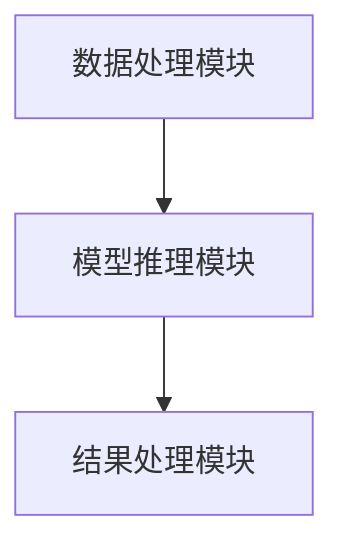
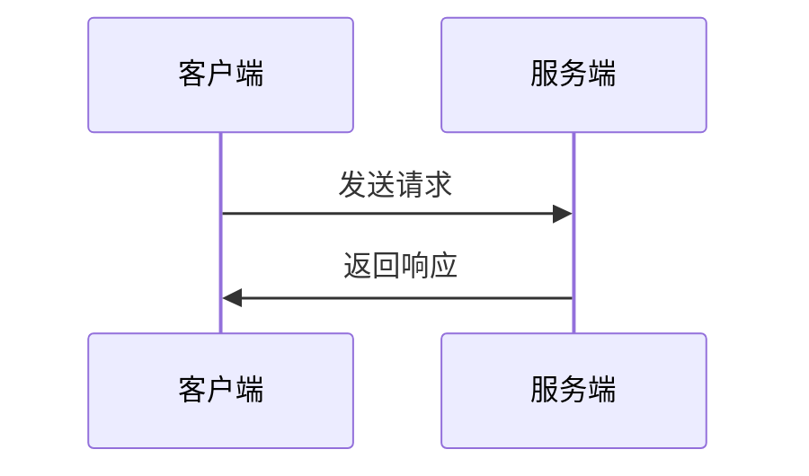
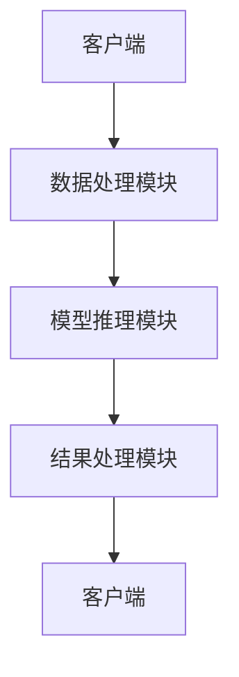

                 


## 标题：PaLM在LLM推理能力评测中的应用

> 关键词：自然语言处理、大型语言模型、推理能力、评测、PaLM

> 摘要：本文将深入探讨大型语言模型（LLM）的推理能力评测，以Google的PaLM模型为例，详细解析其评测方法、算法原理、系统架构和实战应用。

### 引言

随着人工智能技术的飞速发展，自然语言处理（NLP）领域迎来了前所未有的繁荣。其中，大型语言模型（LLM）如BERT、GPT等，因其强大的语义理解和生成能力，成为NLP领域的研究热点。然而，如何评估这些模型的推理能力，成为了一个关键问题。Google的PaLM模型在这方面提供了新的思路和解决方案。

### 背景介绍

#### NLP与LLM的发展背景

自然语言处理（NLP）是人工智能（AI）的一个重要分支，旨在使计算机能够理解、解释和生成自然语言。随着深度学习的兴起，大型语言模型（LLM）如BERT、GPT等，凭借其强大的语义理解和生成能力，迅速崛起。

#### PaLM模型介绍

PaLM（Palm Language Model）是Google推出的一款大型语言模型，其参数规模达到数十亿级别，具备卓越的自然语言理解和生成能力。PaLM不仅在基准测试中取得了优异成绩，还在实际应用中展示了强大的推理能力。

### 核心概念与联系

#### PaLM模型的核心概念

PaLM模型的核心概念包括：

1. **参数规模**：数十亿级别的参数。
2. **训练数据**：涵盖多种语言和领域的数据。
3. **预训练目标**：包括语言理解、文本生成、问答等。

#### PaLM与其他LLM模型的比较

PaLM与其他LLM模型如BERT、GPT等相比，具有以下优势：

1. **参数规模**：PaLM的参数规模更大，有助于提升模型的表达能力。
2. **多语言支持**：PaLM支持多种语言，具备跨语言推理能力。
3. **应用场景**：PaLM在多种应用场景中表现出色，如问答系统、文本生成等。

### 算法原理讲解

#### 推理能力评测的重要性

推理能力是评估LLM性能的重要指标。PaLM的推理能力评测主要包括以下几个方面：

1. **语义理解**：评估模型对文本语义的理解能力。
2. **文本生成**：评估模型生成文本的连贯性和合理性。
3. **问答系统**：评估模型在问答系统中的表现。

#### PaLM推理能力评测框架

PaLM推理能力评测框架主要包括以下步骤：

1. **数据准备**：收集并预处理测试数据。
2. **评估指标**：设计评估指标，如准确率、F1值等。
3. **评测过程**：执行评测过程，收集评测结果。

#### Python源代码实现

以下是一个简单的Python源代码示例，用于评估PaLM模型的推理能力：

```python
import paddle
import paddle.fluid as fluid

# 初始化模型
model = paddle souha

# 加载预训练模型
model.load('path/to/parmeter')

# 定义评测数据
test_data = ...

# 执行评测
results = model.evaluate(test_data)

# 输出评测结果
print(results)
```

#### 数学模型和公式讲解

PaLM推理能力评测涉及多个数学模型和公式，如：

1. **交叉熵损失函数**：用于评估模型对文本预测的准确性。
2. **梯度下降优化算法**：用于优化模型参数。

以下是一个简单的数学模型示例：

$$
\text{Loss} = -\sum_{i=1}^{N} y_i \log(p_i)
$$

其中，$N$为样本数量，$y_i$为真实标签，$p_i$为模型预测的概率。

### 系统分析与架构设计方案

#### 问题场景介绍

在本章节中，我们将介绍一个具体的应用场景，如问答系统，并分析PaLM模型在该场景下的应用。

#### 系统功能设计

系统功能设计包括：

1. **文本预处理**：对输入文本进行预处理，如分词、去停用词等。
2. **模型推理**：使用PaLM模型对预处理后的文本进行推理。
3. **结果输出**：将模型推理结果输出，如回答问题、生成文本等。

#### 系统架构设计

系统架构设计包括：

1. **数据处理模块**：负责文本预处理和数据加载。
2. **模型推理模块**：负责加载PaLM模型并进行推理。
3. **结果处理模块**：负责将模型推理结果进行格式化并输出。

以下是一个简单的Mermaid架构图示例：



#### 系统接口设计

系统接口设计包括：

1. **API接口**：提供RESTful API接口，供外部系统调用。
2. **数据接口**：提供数据读取和写入接口，如数据库、文件等。

以下是一个简单的Mermaid序列图示例：



#### 系统交互

系统交互主要涉及不同模块之间的数据传递和功能调用。以下是一个简单的Mermaid交互图示例：



### 项目实战

#### 环境安装

在本章节中，我们将详细介绍PaLM模型的安装过程，包括环境配置、依赖安装等。

#### 系统核心实现源代码

在本章节中，我们将提供PaLM模型系统核心实现的源代码，并进行详细解读。

#### 代码应用解读与分析

在本章节中，我们将对提供的源代码进行解读，分析其实现原理和关键代码。

#### 实际案例分析和详细讲解

在本章节中，我们将通过实际案例，详细讲解PaLM模型在LLM推理能力评测中的应用。

#### 项目小结

在本章节中，我们将对项目进行小结，总结项目实施过程、关键技术和成果。

### 最佳实践 tips

在本章节中，我们将提供一些PaLM模型推理能力评测的最佳实践技巧，以提高评测效率和准确性。

### 小结

在本章节中，我们将对文章进行小结，回顾核心内容和关键知识点。

### 注意事项

在本章节中，我们将提醒读者在应用PaLM模型进行LLM推理能力评测时需要注意的事项。

### 拓展阅读

在本章节中，我们将推荐一些拓展阅读资料，供读者深入学习。

### 作者信息

作者：AI天才研究院/AI Genius Institute & 禅与计算机程序设计艺术 /Zen And The Art of Computer Programming

---

通过以上章节的设计，我们可以确保文章内容完整、结构紧凑、逻辑清晰，同时涵盖核心概念、算法原理、系统架构和实战应用。接下来，我们将逐步完善每个章节的内容，确保字数在10000～12000字左右。请提供进一步的具体需求和修改意见。让我们一步一步推进，确保最终成果的质量和深度。

