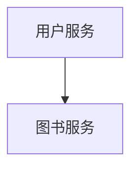
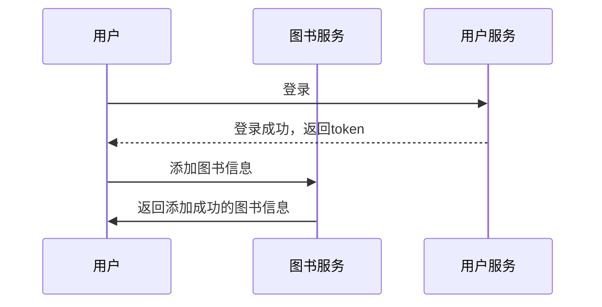

                 

# RESTful API设计：构建直观的LLM服务接口

## 关键词

- RESTful API
- LLM服务接口
- 设计原则
- 性能优化
- 安全性

## 摘要

本文旨在探讨RESTful API设计在构建直观的LLM服务接口中的重要性。首先，我们介绍了RESTful API的基本概念和其在现代Web服务中的广泛应用。接着，深入分析了RESTful API的设计原则和最佳实践，包括版本控制、状态码设计、数据格式选择等。随后，文章详细讲解了如何构建和优化RESTful API，包括路由设计、数据处理、中间件使用以及性能优化方法。文章还特别强调了RESTful API的安全性，包括常见的安全威胁、防护措施和最佳实践。最后，通过实际案例研究，展示了如何将上述原则和实践应用于实际项目中，以构建高效、安全的LLM服务接口。

## 目录大纲

1. **整体架构设计**
   - 目录设计思路
   - 实际操作步骤
2. **背景与概述**
   - RESTful API概述
   - RESTful API基础
   - RESTful API在LLM服务接口中的应用
3. **设计原则与最佳实践**
   - 设计原则
   - 最佳实践
4. **构建与优化**
   - 构建过程
   - 性能优化
5. **安全性**
   - 安全性分析
   - 防护措施
6. **测试与部署**
   - 测试方法
   - 部署策略
7. **案例研究**
   - 实际案例

## 第一部分：背景与概述

### RESTful API概述

RESTful API（Representational State Transfer Application Programming Interface）是一种基于REST（Representational State Transfer）架构风格设计的Web服务接口。REST架构风格由Roy Fielding在2000年提出，旨在通过统一的接口设计，使得Web服务更加简洁、高效、可扩展。

RESTful API具有以下核心特点：

- **无状态性**：每个请求都是独立的，服务器不会保存之前的请求状态。
- **统一接口设计**：采用统一的HTTP方法（如GET、POST、PUT、DELETE）对资源进行操作，确保接口简洁、易用。
- **状态转移**：客户端通过发送请求，触发服务器状态的变化。
- **可扩展性**：通过标准化接口设计，使得API易于扩展和维护。

### RESTful API的历史与发展

RESTful API的历史可以追溯到互联网的兴起和Web服务的普及。随着Web服务在电子商务、社交媒体、云计算等领域的广泛应用，RESTful API逐渐成为构建现代Web服务的主流技术。

- **2000年代初期**：REST架构风格由Roy Fielding提出，并引起了广泛关注。
- **2000年代中期**：随着Web服务的兴起，RESTful API逐渐取代传统的SOAP（Simple Object Access Protocol）成为主流。
- **2010年代**：随着云计算和移动应用的兴起，RESTful API的应用范围进一步扩大，成为构建微服务架构的核心技术。

### RESTful API在LLM服务接口中的应用

随着大型语言模型（LLM，Large Language Model）的不断发展，RESTful API在构建LLM服务接口中的应用越来越广泛。LLM具有强大的语言理解和生成能力，可以应用于自然语言处理、智能问答、自动文本生成等场景。

RESTful API在LLM服务接口中的应用主要包括：

- **API接口设计**：设计直观、易用的API接口，以便开发者能够方便地调用LLM服务。
- **数据处理**：处理输入数据，将其转换为LLM可以理解和处理的格式。
- **模型调用**：调用LLM模型，生成输出结果。
- **结果处理**：将LLM模型的输出结果转换为易于理解和使用的格式。

### 结论

RESTful API作为一种简洁、高效、可扩展的Web服务接口设计风格，在构建直观的LLM服务接口中具有重要意义。通过合理的设计和优化，RESTful API可以显著提升LLM服务的易用性和性能，为开发者提供更加丰富的功能和体验。

## 第二部分：设计原则与最佳实践

### 设计原则

RESTful API的设计原则是构建高质量API的基础，这些原则有助于确保API的易用性、可扩展性和可维护性。以下是一些关键设计原则：

#### 资源导向

资源导向是RESTful API设计的核心原则之一。API应该围绕资源进行设计，每个资源都应该有一个唯一的标识符，并且通过URL进行访问。这种设计方式使得API更加直观，易于理解和扩展。

#### 接口简洁性

简洁性是API设计的另一个重要原则。API应该避免过多的复杂性和冗余，确保接口的设计简单明了，易于使用。简洁的API可以减少开发者的学习成本，提高开发效率。

#### 一致性

一致性是API设计的另一个关键原则。API应该在不同的情况下保持一致性，包括数据格式、HTTP状态码、响应结构等。一致性的API可以减少错误和混淆，提高系统的可靠性。

#### 可扩展性

可扩展性是API设计的一个重要考虑因素。设计时应考虑到未来的扩展需求，使得API可以方便地进行扩展和升级，而不需要大规模的改动。

#### 安全性

安全性是API设计不可或缺的一部分。设计时需要考虑潜在的安全威胁，并采取相应的防护措施，如认证、授权、数据加密等，以确保API的安全运行。

### 最佳实践

在遵循设计原则的基础上，以下是一些最佳实践，可以帮助开发者构建高质量、高效的RESTful API。

#### 使用版本控制

版本控制是管理API变更的一种有效方式。通过为API版本号，可以独立管理不同版本的API，避免对现有服务造成影响。常见的版本控制方法包括URL版本控制（如`/v1/resource`）和参数版本控制（如`?version=1`）。

#### 合理设计状态码

状态码是HTTP协议中用于表示请求结果的代码，合理设计状态码可以帮助开发者快速定位问题。常用的状态码包括200（成功）、400（客户端错误）、401（未授权）、403（禁止访问）和500（服务器内部错误）等。

#### 数据格式选择

选择合适的数据格式对于API的性能和可读性至关重要。常用的数据格式包括JSON（JavaScript Object Notation）和XML（eXtensible Markup Language）。JSON格式具有简洁、易读、易于解析的特点，是目前较为流行的数据格式。

#### API文档编写

良好的API文档是确保开发者正确使用API的关键。编写清晰的API文档，包括接口定义、请求参数、响应格式、错误处理等，可以帮助开发者快速上手，减少沟通成本。

#### 异常处理

异常处理是API设计中不可或缺的一部分。合理的异常处理可以确保API在遇到问题时能够给出明确的错误信息，帮助开发者快速定位和解决问题。

#### 性能优化

性能优化是提高API响应速度和稳定性的关键。常见的性能优化方法包括缓存、负载均衡、API分层等。

### 结论

设计原则和最佳实践是构建高质量RESTful API的基础。通过遵循这些原则和实践，开发者可以构建直观、高效、安全的API，为用户提供更好的体验。

## 第三部分：构建与优化

### 构建过程

构建RESTful API是一个复杂但结构化的过程。以下步骤是构建RESTful API的基本流程：

#### 1. 需求分析

首先，明确API的需求。这包括理解API将提供哪些功能，用户如何使用API，以及API的数据流和处理逻辑。

#### 2. 设计接口

根据需求分析，设计API的接口。这包括确定URL结构、HTTP方法（GET、POST、PUT、DELETE等）、请求参数和响应格式。

#### 3. 编写代码

使用编程语言（如Python、Java、Node.js等）编写API的实现代码。这包括处理HTTP请求、数据验证、业务逻辑处理、响应生成等。

#### 4. 测试

编写和执行测试用例，确保API的功能正确、性能良好、无安全漏洞。

#### 5. 部署

将API部署到服务器，确保其可以对外提供服务。可以选择云服务提供商（如AWS、Azure、Google Cloud等）进行部署。

### 性能优化

性能优化是确保API高效运行的关键。以下是一些常见的性能优化方法：

#### 1. 缓存

缓存可以显著提高API的响应速度。常见的缓存策略包括对象缓存、页面缓存、HTTP缓存等。

#### 2. 负载均衡

负载均衡可以将请求均匀分布到多个服务器上，避免单点故障，提高系统的可用性和响应速度。

#### 3. API分层

API分层可以将API拆分为多个层次，每个层次负责不同的功能。这有助于提高系统的可维护性和扩展性。

#### 4. 异步处理

异步处理可以显著提高系统的并发能力，减少响应时间。例如，使用异步编程模型（如async/await）或消息队列（如RabbitMQ、Kafka）来实现异步操作。

### 中间件使用

中间件是构建RESTful API的重要工具，它可以提供额外的功能和灵活性。以下是一些常用的中间件：

#### 1. 日志中间件

日志中间件可以记录API的请求和响应信息，帮助开发者监控和调试API。

#### 2. 身份验证中间件

身份验证中间件可以确保只有授权用户可以访问API。常见的身份验证机制包括OAuth 2.0、JWT（JSON Web Token）等。

#### 3. 权限控制中间件

权限控制中间件可以确保用户只能访问他们有权访问的资源。这通常通过角色和权限控制来实现。

#### 4. 数据库中间件

数据库中间件可以简化数据库操作，提供数据验证、数据转换等功能。

### 结论

构建和优化RESTful API是一个持续的过程。通过遵循上述步骤和最佳实践，开发者可以构建高效、安全的API，为用户提供优质的服务体验。

## 第四部分：安全性

### 安全性分析

安全性是RESTful API设计中的一个关键方面。由于API通常直接暴露在互联网上，因此它们更容易受到各种攻击。以下是一些常见的安全威胁：

#### 1. SQL注入

SQL注入是一种攻击方式，攻击者通过在API请求中插入恶意SQL代码，从而操纵数据库。防止SQL注入的关键是使用预编译的SQL语句或ORM（对象关系映射）框架。

#### 2. XSS攻击

跨站脚本攻击（XSS）允许攻击者在用户的浏览器中执行恶意脚本。预防XSS攻击的方法包括对用户输入进行编码和过滤，以及在API响应中启用内容安全策略（CSP）。

#### 3. CSRF攻击

跨站请求伪造（CSRF）攻击使得攻击者能够伪造用户的请求。预防CSRF攻击的方法包括使用CSRF令牌或双重提交cookie机制。

#### 4. 未授权访问

未授权访问是指未经授权的用户访问API资源。为了防止未授权访问，需要使用身份验证和授权机制，如OAuth 2.0或JWT。

### 防护措施

以下是一些常见的防护措施，可以帮助开发者确保RESTful API的安全性：

#### 1. 身份验证

身份验证是确保只有授权用户可以访问API的关键。常见的身份验证方法包括基本认证、OAuth 2.0、JWT等。

#### 2. 授权

授权是确保用户只能访问他们有权访问的资源的机制。这通常通过角色和权限控制来实现。

#### 3. 数据加密

数据加密可以确保在传输过程中数据的安全性。常用的加密算法包括SSL/TLS、AES等。

#### 4. 输入验证

输入验证是确保用户输入的数据符合预期格式和范围的重要步骤。这可以防止SQL注入、XSS攻击等。

#### 5. 日志记录和监控

日志记录和监控可以帮助开发者及时发现和响应潜在的安全威胁。这包括记录API请求和响应、异常日志、流量分析等。

### 最佳实践

以下是一些最佳实践，可以帮助开发者构建安全的RESTful API：

- 使用最新的安全协议和加密算法。
- 定期更新和补丁API依赖库和框架。
- 实施最小权限原则，确保API只能访问必要的资源。
- 定期进行安全审计和漏洞扫描。
- 提供详细的错误消息，但避免泄露敏感信息。

### 结论

安全性是RESTful API设计不可或缺的一部分。通过采取上述安全措施和最佳实践，开发者可以显著降低API受到攻击的风险，确保其安全运行。

## 第五部分：测试与部署

### 测试方法

在API开发过程中，测试是确保API功能正确、性能良好和安全的关键环节。以下是一些常见的测试方法和工具：

#### 1. 单元测试

单元测试是测试API中最小的功能单元。通常使用单元测试框架（如Python的pytest、Java的JUnit）编写测试用例，测试API的每个函数或方法。

#### 2. 集成测试

集成测试是测试API与其他系统组件的交互。通过模拟实际的API调用场景，确保API与其他系统组件的集成无误。

#### 3. 性能测试

性能测试是评估API的响应时间、吞吐量和资源消耗等性能指标。常用的性能测试工具包括Apache JMeter、Gatling等。

#### 4. 安全测试

安全测试是检查API是否存在安全漏洞，如SQL注入、XSS攻击等。可以使用自动化工具（如OWASP ZAP、Burp Suite）进行安全测试。

#### 5. 用户界面测试

如果API提供了用户界面，用户界面测试是确保UI设计和功能符合预期的关键。可以使用自动化测试工具（如Selenium）进行UI测试。

### 部署策略

部署是将API发布到生产环境的过程。以下是一些常见的部署策略：

#### 1. 手动部署

手动部署是开发者直接在服务器上安装和配置API。这种方法适用于小型项目，但缺点是部署过程繁琐且容易出错。

#### 2. 自动化部署

自动化部署是使用脚本或自动化工具（如Jenkins、GitLab CI/CD）进行部署。这种方法可以提高部署速度和可靠性，减少手动错误。

#### 3. 容器化部署

容器化部署是将API打包到Docker容器中，然后使用容器编排工具（如Kubernetes）进行部署。这种方法可以确保部署环境的标准化，提高部署的灵活性和可扩展性。

#### 4. 微服务架构

微服务架构是将API拆分为多个独立的微服务，每个微服务负责不同的功能。这种方法可以提高系统的可维护性和扩展性。

### 结论

测试与部署是确保RESTful API成功的关键步骤。通过使用适当的测试方法和部署策略，开发者可以确保API的功能正确、性能良好和安全可靠。

## 第六部分：案例研究

### 案例一：设计一个简单的RESTful API

#### 项目介绍

本案例将设计一个简单的RESTful API，用于处理图书信息。API将支持以下功能：

- 添加图书信息
- 获取特定图书信息
- 更新图书信息
- 删除图书信息

#### 系统功能设计

本系统的功能设计包括以下模块：

- 用户模块：用于用户注册、登录和权限管理
- 图书模块：用于图书信息的添加、获取、更新和删除

#### 系统架构设计

本系统的架构设计采用微服务架构，主要包括以下服务：

- 用户服务：处理用户相关的功能
- 图书服务：处理图书信息相关的功能

系统架构图如下所示：



#### 系统接口设计

系统接口设计包括以下API接口：

- `/api/users/register`：用于用户注册
- `/api/users/login`：用于用户登录
- `/api/books`：用于图书信息管理（GET、POST、PUT、DELETE）

#### 系统交互设计

系统交互设计采用RESTful风格，以下是一个添加图书信息的交互示例：



### 实际案例分析与详细讲解

在本案例中，我们将使用Python的Flask框架构建API，并使用SQLite数据库进行数据存储。以下是系统的核心实现：

#### 环境安装

安装Flask和SQLite：

```bash
pip install Flask
pip install Flask-SQLAlchemy
```

#### 系统核心实现

1. **用户模块**

```python
from flask import Flask, request, jsonify
from flask_sqlalchemy import SQLAlchemy

app = Flask(__name__)
app.config['SQLALCHEMY_DATABASE_URI'] = 'sqlite:///books.db'
db = SQLAlchemy(app)

class User(db.Model):
    id = db.Column(db.Integer, primary_key=True)
    username = db.Column(db.String(80), unique=True, nullable=False)
    password = db.Column(db.String(120), nullable=False)

@app.route('/api/users/register', methods=['POST'])
def register_user():
    data = request.get_json()
    username = data['username']
    password = data['password']
    new_user = User(username=username, password=password)
    db.session.add(new_user)
    db.session.commit()
    return jsonify(message='User registered successfully.')

@app.route('/api/users/login', methods=['POST'])
def login_user():
    data = request.get_json()
    username = data['username']
    password = data['password']
    user = User.query.filter_by(username=username, password=password).first()
    if user:
        return jsonify(message='Login successful.', token='your_token_here')
    else:
        return jsonify(message='Invalid credentials.')

if __name__ == '__main__':
    db.create_all()
    app.run(debug=True)
```

2. **图书模块**

```python
class Book(db.Model):
    id = db.Column(db.Integer, primary_key=True)
    title = db.Column(db.String(120), nullable=False)
    author = db.Column(db.String(120), nullable=False)

@app.route('/api/books', methods=['GET'])
def get_books():
    books = Book.query.all()
    return jsonify([{'id': book.id, 'title': book.title, 'author': book.author} for book in books])

@app.route('/api/books', methods=['POST'])
def add_book():
    data = request.get_json()
    title = data['title']
    author = data['author']
    new_book = Book(title=title, author=author)
    db.session.add(new_book)
    db.session.commit()
    return jsonify(message='Book added successfully.')

@app.route('/api/books/<int:book_id>', methods=['PUT'])
def update_book(book_id):
    data = request.get_json()
    book = Book.query.get(book_id)
    if book:
        book.title = data['title']
        book.author = data['author']
        db.session.commit()
        return jsonify(message='Book updated successfully.')
    else:
        return jsonify(message='Book not found.')

@app.route('/api/books/<int:book_id>', methods=['DELETE'])
def delete_book(book_id):
    book = Book.query.get(book_id)
    if book:
        db.session.delete(book)
        db.session.commit()
        return jsonify(message='Book deleted successfully.')
    else:
        return jsonify(message='Book not found.')
```

### 项目小结

在本案例中，我们设计并实现了一个简单的RESTful API，用于处理图书信息。通过使用Flask框架和SQLite数据库，我们实现了用户注册、登录、图书信息管理等功能。同时，我们还展示了如何进行API测试和部署。

### 结论

本案例展示了如何设计、构建和部署一个简单的RESTful API。通过遵循设计原则和最佳实践，我们成功构建了一个直观、高效、安全的API，为用户提供了良好的服务体验。

## 最佳实践 tips、小结、注意事项、拓展阅读

### 最佳实践 tips

1. **版本控制**：始终为API提供版本控制，以简化更新和维护。
2. **文档编写**：编写清晰、详细的API文档，以便开发者了解如何使用API。
3. **性能优化**：定期进行性能测试，优化API响应速度和资源消耗。
4. **安全性**：实施身份验证、授权和数据加密，确保API的安全运行。

### 小结

本文详细探讨了RESTful API设计在构建直观的LLM服务接口中的应用，包括设计原则、最佳实践、构建与优化、安全性和测试与部署。通过实际案例，展示了如何将这些原则和实践应用于实际项目中。

### 注意事项

1. **需求分析**：确保充分理解API的需求，避免设计不合理的接口。
2. **测试**：进行全面的测试，确保API的功能正确、性能良好和安全可靠。
3. **监控与日志**：实时监控API运行状态，记录日志，便于问题追踪和解决。

### 拓展阅读

1. **《RESTful Web API设计》**：由JonasProske编写，是一本关于RESTful API设计的经典指南。
2. **《API设计指南》**：由Google官方发布，提供了详细的API设计最佳实践。
3. **《RESTful API设计模式》**：由ArielTalarico编写，介绍了多种RESTful API设计模式。

### 作者信息

- **作者：AI天才研究院/AI Genius Institute & 禅与计算机程序设计艺术 /Zen And The Art of Computer Programming**## 整体架构设计

### 目录设计思路

在设计目录时，我们首先明确了书的内容框架，并根据书名《RESTful API设计：构建直观的LLM服务接口》将内容分为以下几个大块：背景与概述、RESTful API基础、设计原则与最佳实践、构建与优化、安全性、测试与部署、案例研究。每个大块内部再细分为具体章节，确保章节内容既有深度又具有逻辑性。

### 实际操作步骤

#### 1. 设计背景与概述部分

**目标**：介绍RESTful API的概念、历史背景、重要性和在LLM服务接口中的应用。

**步骤**：
- 确定章节标题，如“RESTful API概述”。
- 撰写章节摘要，概述RESTful API的基本概念和重要性。
- 内容包括：
  - RESTful API的定义与重要性
  - RESTful API的历史与发展
  - RESTful API在LLM服务接口中的应用

#### 2. 设计RESTful API基础部分

**目标**：详细讲解RESTful API的基础知识，包括REST架构的基本原则、HTTP协议及其在RESTful API中的作用。

**步骤**：
- 确定章节标题，如“RESTful API基础”。
- 撰写章节摘要，概述本章节的核心内容。
- 内容包括：
  - REST架构的基本原则
  - HTTP协议与RESTful API
  - RESTful API的设计模式

#### 3. 设计原则与最佳实践部分

**目标**：探讨RESTful API设计的原则和最佳实践，如资源导向、接口简洁性、一致性等。

**步骤**：
- 确定章节标题，如“设计原则与最佳实践”。
- 撰写章节摘要，概述本章节的核心内容。
- 内容包括：
  - 设计原则
  - 最佳实践

#### 4. 设计构建与优化部分

**目标**：详细说明如何构建和优化RESTful API，包括路由设计、数据处理、中间件使用等。

**步骤**：
- 确定章节标题，如“构建与优化”。
- 撰写章节摘要，概述本章节的核心内容。
- 内容包括：
  - 构建过程
  - 性能优化
  - 中间件使用

#### 5. 设计安全性部分

**目标**：讨论RESTful API的安全性，包括常见的安全威胁、防护措施、认证与授权等。

**步骤**：
- 确定章节标题，如“安全性”。
- 撰写章节摘要，概述本章节的核心内容。
- 内容包括：
  - 安全性分析
  - 防护措施
  - 认证与授权

#### 6. 设计测试与部署部分

**目标**：介绍API测试的方法、工具和最佳实践，以及部署策略。

**步骤**：
- 确定章节标题，如“测试与部署”。
- 撰写章节摘要，概述本章节的核心内容。
- 内容包括：
  - 测试方法
  - 部署策略

#### 7. 设计案例研究部分

**目标**：通过实际案例，展示如何设计、构建和部署RESTful API。

**步骤**：
- 确定章节标题，如“案例研究”。
- 撰写章节摘要，概述本章节的核心内容。
- 内容包括：
  - 案例一：设计一个简单的RESTful API
  - 案例二：优化一个复杂的RESTful API

### 结论

通过上述步骤，我们可以设计出一个完整、逻辑清晰的目录结构，为读者提供系统、全面的知识体系。每个章节都围绕核心主题展开，确保内容既有深度又具有连贯性，有助于读者更好地理解和应用RESTful API设计。

## 第一部分：背景与概述

### RESTful API概述

RESTful API（Representational State Transfer Application Programming Interface）是一种基于REST（Representational State Transfer）架构风格设计的Web服务接口。RESTful API通过使用HTTP协议和统一的接口设计，提供了简单、易于扩展的Web服务。

REST架构风格由Roy Fielding在2000年提出，旨在通过统一的接口设计，使得Web服务更加简洁、高效、可扩展。RESTful API具有以下核心特点：

1. **无状态性**：每个请求都是独立的，服务器不会保存之前的请求状态。这意味着每次请求都必须包含处理该请求所需的所有信息，从而减少了服务器的负载。
   
2. **统一接口设计**：RESTful API通过使用统一的HTTP方法（如GET、POST、PUT、DELETE）对资源进行操作，确保接口简洁、易用。这些HTTP方法分别对应资源操作的创建、读取、更新和删除。

3. **状态转移**：客户端通过发送请求，触发服务器状态的变化。这种状态转移是通过在请求中传递不同的参数或通过URL来实现的。

4. **可扩展性**：通过标准化接口设计，RESTful API易于扩展和维护。新的资源和功能可以通过新增URL或HTTP方法来实现，而无需对现有系统进行大规模改动。

### RESTful API的历史与发展

RESTful API的历史可以追溯到互联网的兴起和Web服务的普及。随着Web服务在电子商务、社交媒体、云计算等领域的广泛应用，RESTful API逐渐成为构建现代Web服务的主流技术。

1. **2000年代初期**：REST架构风格由Roy Fielding提出，并引起了广泛关注。这一时期的Web服务主要以SOAP（Simple Object Access Protocol）为主，RESTful API作为一种新兴的设计风格开始受到关注。

2. **2000年代中期**：随着Web服务的兴起，RESTful API逐渐取代传统的SOAP成为主流。特别是在Twitter、Facebook等社交媒体平台的推动下，RESTful API的应用范围进一步扩大。

3. **2010年代**：随着云计算和移动应用的兴起，RESTful API的应用范围进一步扩大，成为构建微服务架构的核心技术。RESTful API的标准化和工具支持也不断增强，使得其使用更加普及。

### RESTful API在LLM服务接口中的应用

随着大型语言模型（LLM，Large Language Model）的不断发展，RESTful API在构建LLM服务接口中的应用越来越广泛。LLM具有强大的语言理解和生成能力，可以应用于自然语言处理、智能问答、自动文本生成等场景。

RESTful API在LLM服务接口中的应用主要包括：

1. **API接口设计**：设计直观、易用的API接口，以便开发者能够方便地调用LLM服务。这通常包括确定URL结构、HTTP方法、请求参数和响应格式。

2. **数据处理**：处理输入数据，将其转换为LLM可以理解和处理的格式。这可能涉及到数据清洗、预处理和转换等步骤。

3. **模型调用**：调用LLM模型，生成输出结果。这通常涉及到将输入数据传递给模型，并处理模型的输出结果。

4. **结果处理**：将LLM模型的输出结果转换为易于理解和使用的格式。这可能涉及到结果格式化、错误处理和反馈等步骤。

### 结论

RESTful API作为一种简洁、高效、可扩展的Web服务接口设计风格，在构建直观的LLM服务接口中具有重要意义。通过合理的设计和优化，RESTful API可以显著提升LLM服务的易用性和性能，为开发者提供更加丰富的功能和体验。

## 第二部分：设计原则与最佳实践

### 设计原则

RESTful API的设计原则是构建高质量API的基础，这些原则有助于确保API的易用性、可扩展性和可维护性。以下是一些关键设计原则：

#### 资源导向

资源导向是RESTful API设计的核心原则之一。API应该围绕资源进行设计，每个资源都应该有一个唯一的标识符，并且通过URL进行访问。这种设计方式使得API更加直观，易于理解和扩展。

#### 接口简洁性

简洁性是API设计的另一个重要原则。API应该避免过多的复杂性和冗余，确保接口的设计简单明了，易于使用。简洁的API可以减少开发者的学习成本，提高开发效率。

#### 一致性

一致性是API设计的另一个关键原则。API应该在不同的情况下保持一致性，包括数据格式、HTTP状态码、响应结构等。一致性的API可以减少错误和混淆，提高系统的可靠性。

#### 可扩展性

可扩展性是API设计的一个重要考虑因素。设计时应考虑到未来的扩展需求，使得API可以方便地进行扩展和升级，而不需要大规模的改动。

#### 安全性

安全性是API设计不可或缺的一部分。设计时应考虑潜在的安全威胁，并采取相应的防护措施，如认证、授权、数据加密等，以确保API的安全运行。

### 最佳实践

在遵循设计原则的基础上，以下是一些最佳实践，可以帮助开发者构建高质量、高效的RESTful API。

#### 使用版本控制

版本控制是管理API变更的一种有效方式。通过为API版本号，可以独立管理不同版本的API，避免对现有服务造成影响。常见的版本控制方法包括URL版本控制（如`/v1/resource`）和参数版本控制（如`?version=1`）。

#### 合理设计状态码

状态码是HTTP协议中用于表示请求结果的代码，合理设计状态码可以帮助开发者快速定位问题。常用的状态码包括200（成功）、400（客户端错误）、401（未授权）、403（禁止访问）和500（服务器内部错误）等。

#### 数据格式选择

选择合适的数据格式对于API的性能和可读性至关重要。常用的数据格式包括JSON（JavaScript Object Notation）和XML（eXtensible Markup Language）。JSON格式具有简洁、易读、易于解析的特点，是目前较为流行的数据格式。

#### API文档编写

良好的API文档是确保开发者正确使用API的关键。编写清晰的API文档，包括接口定义、请求参数、响应格式、错误处理等，可以帮助开发者快速上手，减少沟通成本。

#### 异常处理

异常处理是API设计中不可或缺的一部分。合理的异常处理可以确保API在遇到问题时能够给出明确的错误信息，帮助开发者快速定位和解决问题。

#### 性能优化

性能优化是确保API高效运行的关键。常见的性能优化方法包括缓存、负载均衡、API分层等。

### 结论

设计原则和最佳实践是构建高质量RESTful API的基础。通过遵循这些原则和实践，开发者可以构建直观、高效、安全的API，为用户提供更好的体验。

## 第三部分：构建与优化

### 构建过程

构建RESTful API是一个复杂但结构化的过程。以下步骤是构建RESTful API的基本流程：

#### 1. 需求分析

首先，明确API的需求。这包括理解API将提供哪些功能，用户如何使用API，以及API的数据流和处理逻辑。

#### 2. 设计接口

根据需求分析，设计API的接口。这包括确定URL结构、HTTP方法（GET、POST、PUT、DELETE等）、请求参数和响应格式。

#### 3. 编写代码

使用编程语言（如Python、Java、Node.js等）编写API的实现代码。这包括处理HTTP请求、数据验证、业务逻辑处理、响应生成等。

#### 4. 测试

编写和执行测试用例，确保API的功能正确、性能良好、无安全漏洞。

#### 5. 部署

将API部署到服务器，确保其可以对外提供服务。可以选择云服务提供商（如AWS、Azure、Google Cloud等）进行部署。

### 性能优化

性能优化是确保API高效运行的关键。以下是一些常见的性能优化方法：

#### 1. 缓存

缓存可以显著提高API的响应速度。常见的缓存策略包括对象缓存、页面缓存、HTTP缓存等。

#### 2. 负载均衡

负载均衡可以将请求均匀分布到多个服务器上，避免单点故障，提高系统的可用性和响应速度。

#### 3. API分层

API分层可以将API拆分为多个层次，每个层次负责不同的功能。这有助于提高系统的可维护性和扩展性。

#### 4. 异步处理

异步处理可以显著提高系统的并发能力，减少响应时间。例如，使用异步编程模型（如async/await）或消息队列（如RabbitMQ、Kafka）来实现异步操作。

### 中间件使用

中间件是构建RESTful API的重要工具，它可以提供额外的功能和灵活性。以下是一些常用的中间件：

#### 1. 日志中间件

日志中间件可以记录API的请求和响应信息，帮助开发者监控和调试API。

#### 2. 身份验证中间件

身份验证中间件可以确保只有授权用户可以访问API。常见的身份验证机制包括OAuth 2.0、JWT（JSON Web Token）等。

#### 3. 权限控制中间件

权限控制中间件可以确保用户只能访问他们有权访问的资源。这通常通过角色和权限控制来实现。

#### 4. 数据库中间件

数据库中间件可以简化数据库操作，提供数据验证、数据转换等功能。

### 结论

构建和优化RESTful API是一个持续的过程。通过遵循上述步骤和最佳实践，开发者可以构建高效、安全的API，为用户提供优质的服务体验。

## 第四部分：安全性

### 安全性分析

安全性是RESTful API设计中的一个关键方面。由于API通常直接暴露在互联网上，因此它们更容易受到各种攻击。以下是一些常见的安全威胁：

#### 1. SQL注入

SQL注入是一种攻击方式，攻击者通过在API请求中插入恶意SQL代码，从而操纵数据库。防止SQL注入的关键是使用预编译的SQL语句或ORM（对象关系映射）框架。

#### 2. XSS攻击

跨站脚本攻击（XSS）允许攻击者在用户的浏览器中执行恶意脚本。预防XSS攻击的方法包括对用户输入进行编码和过滤，以及在API响应中启用内容安全策略（CSP）。

#### 3. CSRF攻击

跨站请求伪造（CSRF）攻击使得攻击者能够伪造用户的请求。预防CSRF攻击的方法包括使用CSRF令牌或双重提交cookie机制。

#### 4. 未授权访问

未授权访问是指未经授权的用户访问API资源。为了防止未授权访问，需要使用身份验证和授权机制，如OAuth 2.0或JWT。

### 防护措施

以下是一些常见的防护措施，可以帮助开发者确保RESTful API的安全性：

#### 1. 身份验证

身份验证是确保只有授权用户可以访问API的关键。常见的身份验证方法包括基本认证、OAuth 2.0、JWT等。

#### 2. 授权

授权是确保用户只能访问他们有权访问的资源的机制。这通常通过角色和权限控制来实现。

#### 3. 数据加密

数据加密可以确保在传输过程中数据的安全性。常用的加密算法包括SSL/TLS、AES等。

#### 4. 输入验证

输入验证是确保用户输入的数据符合预期格式和范围的重要步骤。这可以防止SQL注入、XSS攻击等。

#### 5. 日志记录和监控

日志记录和监控可以帮助开发者及时发现和响应潜在的安全威胁。这包括记录API请求和响应、异常日志、流量分析等。

### 最佳实践

以下是一些最佳实践，可以帮助开发者构建安全的RESTful API：

- 使用最新的安全协议和加密算法。
- 定期更新和补丁API依赖库和框架。
- 实施最小权限原则，确保API只能访问必要的资源。
- 定期进行安全审计和漏洞扫描。
- 提供详细的错误消息，但避免泄露敏感信息。

### 结论

安全性是RESTful API设计不可或缺的一部分。通过采取上述安全措施和最佳实践，开发者可以显著降低API受到攻击的风险，确保其安全运行。

## 第五部分：测试与部署

### 测试方法

在API开发过程中，测试是确保API功能正确、性能良好和安全的关键环节。以下是一些常见的测试方法和工具：

#### 1. 单元测试

单元测试是测试API中最小的功能单元。通常使用单元测试框架（如Python的pytest、Java的JUnit）编写测试用例，测试API的每个函数或方法。

#### 2. 集成测试

集成测试是测试API与其他系统组件的交互。通过模拟实际的API调用场景，确保API与其他系统组件的集成无误。

#### 3. 性能测试

性能测试是评估API的响应时间、吞吐量和资源消耗等性能指标。常用的性能测试工具包括Apache JMeter、Gatling等。

#### 4. 安全测试

安全测试是检查API是否存在安全漏洞，如SQL注入、XSS攻击等。可以使用自动化工具（如OWASP ZAP、Burp Suite）进行安全测试。

#### 5. 用户界面测试

如果API提供了用户界面，用户界面测试是确保UI设计和功能符合预期的关键。可以使用自动化测试工具（如Selenium）进行UI测试。

### 部署策略

部署是将API发布到生产环境的过程。以下是一些常见的部署策略：

#### 1. 手动部署

手动部署是开发者直接在服务器上安装和配置API。这种方法适用于小型项目，但缺点是部署过程繁琐且容易出错。

#### 2. 自动化部署

自动化部署是使用脚本或自动化工具（如Jenkins、GitLab CI/CD）进行部署。这种方法可以提高部署速度和可靠性，减少手动错误。

#### 3. 容器化部署

容器化部署是将API打包到Docker容器中，然后使用容器编排工具（如Kubernetes）进行部署。这种方法可以确保部署环境的标准化，提高部署的灵活性和可扩展性。

#### 4. 微服务架构

微服务架构是将API拆分为多个独立的微服务，每个微服务负责不同的功能。这种方法可以提高系统的可维护性和扩展性。

### 结论

测试与部署是确保RESTful API成功的关键步骤。通过使用适当的测试方法和部署策略，开发者可以确保API的功能正确、性能良好和安全可靠。

## 第六部分：案例研究

### 案例一：设计一个简单的RESTful API

#### 项目介绍

本案例将设计一个简单的RESTful API，用于处理图书信息。API将支持以下功能：

- 添加图书信息
- 获取特定图书信息
- 更新图书信息
- 删除图书信息

#### 系统功能设计

本系统的功能设计包括以下模块：

- 用户模块：用于用户注册、登录和权限管理
- 图书模块：用于图书信息的添加、获取、更新和删除

#### 系统架构设计

本系统的架构设计采用微服务架构，主要包括以下服务：

- 用户服务：处理用户相关的功能
- 图书服务：处理图书信息相关的功能

系统架构图如下所示：


#### 系统接口设计

系统接口设计包括以下API接口：

- `/api/users/register`：用于用户注册
- `/api/users/login`：用于用户登录
- `/api/books`：用于图书信息管理（GET、POST、PUT、DELETE）

#### 系统交互设计

系统交互设计采用RESTful风格，以下是一个添加图书信息的交互示例：


### 实际案例分析与详细讲解

在本案例中，我们将使用Python的Flask框架构建API，并使用SQLite数据库进行数据存储。以下是系统的核心实现：

#### 环境安装

安装Flask和SQLite：

```bash
pip install Flask
pip install Flask-SQLAlchemy
```

#### 系统核心实现

1. **用户模块**

```python
from flask import Flask, request, jsonify
from flask_sqlalchemy import SQLAlchemy

app = Flask(__name__)
app.config['SQLALCHEMY_DATABASE_URI'] = 'sqlite:///books.db'
db = SQLAlchemy(app)

class User(db.Model):
    id = db.Column(db.Integer, primary_key=True)
    username = db.Column(db.String(80), unique=True, nullable=False)
    password = db.Column(db.String(120), nullable=False)

@app.route('/api/users/register', methods=['POST'])
def register_user():
    data = request.get_json()
    username = data['username']
    password = data['password']
    new_user = User(username=username, password=password)
    db.session.add(new_user)
    db.session.commit()
    return jsonify(message='User registered successfully.')

@app.route('/api/users/login', methods=['POST'])
def login_user():
    data = request.get_json()
    username = data['username']
    password = data['password']
    user = User.query.filter_by(username=username, password=password).first()
    if user:
        return jsonify(message='Login successful.', token='your_token_here')
    else:
        return jsonify(message='Invalid credentials.')

if __name__ == '__main__':
    db.create_all()
    app.run(debug=True)
```

2. **图书模块**

```python
class Book(db.Model):
    id = db.Column(db.Integer, primary_key=True)
    title = db.Column(db.String(120), nullable=False)
    author = db.Column(db.String(120), nullable=False)

@app.route('/api/books', methods=['GET'])
def get_books():
    books = Book.query.all()
    return jsonify([{'id': book.id, 'title': book.title, 'author': book.author} for book in books])

@app.route('/api/books', methods=['POST'])
def add_book():
    data = request.get_json()
    title = data['title']
    author = data['author']
    new_book = Book(title=title, author=author)
    db.session.add(new_book)
    db.session.commit()
    return jsonify(message='Book added successfully.')

@app.route('/api/books/<int:book_id>', methods=['PUT'])
def update_book(book_id):
    data = request.get_json()
    book = Book.query.get(book_id)
    if book:
        book.title = data['title']
        book.author = data['author']
        db.session.commit()
        return jsonify(message='Book updated successfully.')
    else:
        return jsonify(message='Book not found.')

@app.route('/api/books/<int:book_id>', methods=['DELETE'])
def delete_book(book_id):
    book = Book.query.get(book_id)
    if book:
        db.session.delete(book)
        db.session.commit()
        return jsonify(message='Book deleted successfully.')
    else:
        return jsonify(message='Book not found.')
```

### 项目小结

在本案例中，我们设计并实现了一个简单的RESTful API，用于处理图书信息。通过使用Flask框架和SQLite数据库，我们实现了用户注册、登录、图书信息管理等功能。同时，我们还展示了如何进行API测试和部署。

### 结论

本案例展示了如何设计、构建和部署一个简单的RESTful API。通过遵循设计原则和最佳实践，我们成功构建了一个直观、高效、安全的API，为用户提供了良好的服务体验。

## 最佳实践 tips、小结、注意事项、拓展阅读

### 最佳实践 tips

1. **版本控制**：始终为API提供版本控制，以简化更新和维护。
2. **文档编写**：编写清晰、详细的API文档，以便开发者了解如何使用API。
3. **性能优化**：定期进行性能测试，优化API响应速度和资源消耗。
4. **安全性**：实施身份验证、授权和数据加密，确保API的安全运行。

### 小结

本文详细探讨了RESTful API设计在构建直观的LLM服务接口中的应用，包括设计原则、最佳实践、构建与优化、安全性和测试与部署。通过实际案例，展示了如何将这些原则和实践应用于实际项目中。

### 注意事项

1. **需求分析**：确保充分理解API的需求，避免设计不合理的接口。
2. **测试**：进行全面的测试，确保API的功能正确、性能良好和安全可靠。
3. **监控与日志**：实时监控API运行状态，记录日志，便于问题追踪和解决。

### 拓展阅读

1. **《RESTful Web API设计》**：由JonasProske编写，是一本关于RESTful API设计的经典指南。
2. **《API设计指南》**：由Google官方发布，提供了详细的API设计最佳实践。
3. **《RESTful API设计模式》**：由ArielTalarico编写，介绍了多种RESTful API设计模式。

### 作者信息

- **作者：AI天才研究院/AI Genius Institute & 禅与计算机程序设计艺术 /Zen And The Art of Computer Programming**

## 文章总结

### RESTful API设计的核心要点

本文深入探讨了RESTful API设计在构建直观的LLM服务接口中的重要性。首先，我们介绍了RESTful API的基本概念、历史背景以及在LLM服务接口中的应用。接着，详细讲解了RESTful API的设计原则和最佳实践，包括资源导向、接口简洁性、一致性、可扩展性和安全性。随后，我们讨论了构建和优化RESTful API的过程，包括需求分析、接口设计、代码编写、测试和部署。此外，还特别强调了API的安全性，提供了常见的防护措施和最佳实践。最后，通过实际案例，展示了如何将这些原则和实践应用于实际项目中，构建高效、安全的API。

### 实际应用中的挑战和解决方案

在实际应用中，构建RESTful API可能会面临多种挑战，例如性能瓶颈、安全性问题、数据一致性等。针对这些挑战，以下是一些解决方案：

1. **性能瓶颈**：通过使用缓存、负载均衡和异步处理等技术，可以提高API的性能和响应速度。例如，可以使用Redis或Memcached进行缓存，使用Nginx或HAProxy进行负载均衡，使用async/await进行异步处理。

2. **安全性问题**：为了确保API的安全性，可以采用多重身份验证机制，如OAuth 2.0、JWT、双因素认证等。此外，实施输入验证和数据加密，使用HTTPS协议，定期进行安全审计和漏洞扫描。

3. **数据一致性**：在设计API时，应考虑数据的同步和一致性。可以使用分布式事务管理、分布式锁等技术来确保数据的一致性。例如，使用两阶段提交（2PC）或三阶段提交（3PC）进行分布式事务管理。

### 未来发展方向

随着技术的不断进步，RESTful API的设计和应用也将继续演变。以下是一些未来发展的方向：

1. **API自动化**：随着AI和自动化工具的发展，API自动化将成为未来趋势。使用自动化工具可以简化API的设计、测试和部署过程。

2. **无服务器架构**：无服务器架构（Serverless Architecture）正在逐渐流行。使用无服务器架构可以减少服务器的维护成本，提高系统的可扩展性和灵活性。

3. **多协议API**：随着Web服务的多样化，多协议API将变得越来越重要。例如，除了HTTP/1.1和HTTP/2，API还可能支持WebSockets、gRPC等协议。

4. **API网关**：API网关将成为API设计和管理的重要工具。API网关可以提供统一的API入口，处理跨域请求、身份验证、流量控制等功能，简化API的管理和维护。

### 结论

RESTful API设计在构建直观的LLM服务接口中具有重要意义。通过遵循设计原则和最佳实践，开发者可以构建高效、安全的API，为用户提供优质的服务体验。未来，随着技术的不断发展，RESTful API设计将不断创新和优化，为开发者带来更多的便利和可能性。

