                 

### 第一部分：引言

### 第1章：AI应用开发的挑战与Sprint规划的重要性

在当今技术飞速发展的时代，人工智能（AI）正逐渐成为各个行业创新与发展的核心驱动力。从自动驾驶到智能医疗，从智能家居到工业自动化，AI技术的应用正在深刻改变我们的生活方式和工作方式。然而，随着AI技术的广泛应用，AI应用开发也面临诸多挑战。

#### 1.1.1 AI应用开发面临的挑战

首先，AI应用开发过程高度复杂，涉及多个学科领域的知识，包括计算机科学、数学、统计学、心理学等。这就要求开发人员不仅要有扎实的编程能力，还要有深厚的数学和统计学背景。其次，AI模型训练过程需要大量的数据支持和计算资源，这对硬件设施和数据处理能力提出了较高的要求。再者，AI系统的稳定性和可靠性也是一个亟待解决的问题，尤其是在关键领域，如医疗和金融，任何错误都可能导致严重的后果。

面对这些挑战，如何高效地进行AI应用开发，确保项目按时完成且达到预期效果，成为众多开发团队亟待解决的问题。

#### 1.1.2 为什么Sprint规划对AI应用开发至关重要

为了应对AI应用开发的复杂性，Sprint规划成为了一种行之有效的开发方法。Sprint规划是敏捷开发（Agile Development）的一种实践，它通过将开发周期划分为短周期（通常为2-4周）的迭代，在每个迭代周期内完成一个或多个具体的功能，从而实现快速迭代和持续改进。

**以下是Sprint规划对AI应用开发的重要性：**

1. **明确目标和优先级**：通过Sprint规划，开发团队可以明确每个迭代的目标和优先级，确保团队聚焦于最关键的几个功能。这有助于避免开发过程中的迷失方向和无序状态。
   
2. **提高开发效率**：Sprint规划鼓励团队合作和快速反馈，通过短周期的迭代，开发团队能够更快地发现并解决问题，从而提高开发效率。

3. **增强项目透明度**：Sprint规划中的每日站会、迭代回顾等活动，使项目进展和问题得到及时反馈，增加了项目的透明度，便于项目经理和利益相关者掌握项目状态。

4. **持续改进**：通过迭代回顾，团队可以不断总结经验，找出改进点，确保项目在后续迭代中能够持续优化。

#### 1.1.3 Sprint规划的基本概念与流程

Sprint规划的基本概念包括Sprint（迭代周期）、用户故事（User Story）、迭代回顾（Retrospective）等。一个典型的Sprint规划流程包括以下几个步骤：

1. **Sprint计划会议**：在Sprint开始前，团队会召开计划会议，讨论并确定本次Sprint的目标和任务。

2. **用户故事编写**：用户故事是一组描述用户需求的功能点，通常以“作为……，我想要……，以便……。”的形式编写。

3. **任务分解**：将用户故事分解为具体任务，并分配给团队成员。

4. **任务估算**：对每个任务的难度和工作量进行估算，以确定本次Sprint可以完成多少用户故事。

5. **每日站会**：每日站会是一个简短的会议，用于讨论任务的进展和问题，确保团队保持高效的协作。

6. **迭代回顾**：在Sprint结束时，团队会进行迭代回顾，总结本次迭代的经验和教训，为下一个Sprint做准备。

#### 1.1.4 Sprint规划的优势与实践案例

Sprint规划的优势在于其灵活性和适应性，使得开发团队能够快速响应变化，同时确保项目的质量。以下是一个Sprint规划的实践案例：

**案例：某智能家居公司开发语音助手应用**

该公司的开发团队在开发语音助手应用时采用了Sprint规划。他们在每个Sprint周期内完成以下任务：

- **第1个Sprint**：完成语音识别功能，确保用户可以通过语音指令控制家居设备。

- **第2个Sprint**：实现语音合成功能，使语音助手能够对用户指令进行回应。

- **第3个Sprint**：优化语音识别准确性，并增加智能推荐功能。

通过Sprint规划，该团队在短时间内成功开发出了一套基本功能完善的语音助手应用，并在后续迭代中不断优化，最终在市场上取得了良好的反响。

总之，Sprint规划是一种有效的AI应用开发方法，通过明确的计划和迭代，能够帮助开发团队克服AI应用开发中的挑战，确保项目成功。在接下来的章节中，我们将详细探讨如何设定明确的AI应用开发目标，以及具体的Sprint规划流程和实践方法。

### 关键词：

- AI应用开发
- Sprint规划
- 敏捷开发
- 用户故事
- 目标设定
- 效率提升
- 团队协作
- 快速迭代
- 持续改进
- 项目管理

### 摘要：

本文旨在探讨AI应用开发过程中的挑战及Sprint规划的重要性。通过分析AI应用开发的复杂性，本文介绍了Sprint规划的基本概念和流程，并阐述了其在明确目标、提高开发效率和增强项目透明度等方面的优势。通过具体案例，本文展示了Sprint规划在AI应用开发中的实际应用效果，为开发团队提供了一种有效的项目管理方法。

### 1.2 目标设定原则与方法

在Sprint规划中，目标设定是至关重要的环节。一个清晰且可实现的目标有助于确保项目方向的正确性，提高团队的协作效率，并最终实现项目的成功。下面，我们将详细讨论目标设定的几个关键原则和方法。

#### 1.2.1 明确性原则

明确性原则是目标设定的首要原则。一个明确的目标能够清晰地传达项目目标，避免团队成员之间的误解和混淆。一个明确的目标应该包含以下要素：

- **具体性**：目标应具体、可操作，避免模糊和抽象。例如，“提高用户满意度”不如“通过优化用户体验，将用户满意度从80%提升到90%”具体。

- **量化的指标**：目标应包含可量化的指标，以便于评估和追踪。例如，“开发一个语音识别系统”不如“开发一个语音识别系统，达到95%的识别准确率”具体。

- **时限性**：目标应设定明确的完成时限，以推动团队的进度。例如，“完成语音识别系统开发”不如“在Sprint周期内完成语音识别系统开发”具体。

#### 1.2.2 可衡量性原则

可衡量性原则要求目标是可以衡量的，以便于对目标实现情况进行评估和反馈。一个可衡量目标应该满足以下条件：

- **量化**：目标应具有量化的指标，便于衡量。例如，“开发一个功能完整的系统”不如“完成系统的主要功能模块，并进行全面测试”。

- **评估标准**：目标应明确评估标准，以便于判断目标是否达成。例如，“提高系统性能”不如“将系统响应时间从5秒缩短到2秒”。

- **反馈机制**：目标应建立反馈机制，确保在目标实现过程中可以及时收集数据和反馈。例如，“每月进行一次系统性能评估”和“每两周进行一次用户反馈收集”。

#### 1.2.3 可行性原则

可行性原则要求设定的目标在实际操作中是可实现的，避免不切实际的目标导致团队士气低落和项目延误。在设定目标时，需要考虑以下几个方面：

- **资源限制**：目标应考虑到团队的资源限制，包括人力、物力和财力。例如，“在两周内完成系统设计”可能过于紧迫，应调整为“在一个月内完成系统设计”。

- **技术可行性**：目标应考虑当前技术水平和现有技术条件。例如，“开发一个实时人脸识别系统”在当前技术条件下是可行的，但“开发一个实时全息投影系统”则可能需要更先进的技术。

- **团队能力**：目标应与团队的能力相匹配，确保团队能够顺利完成。例如，“开发一个复杂的人工智能算法”可能需要团队具备相应的算法研究和开发能力。

#### 1.2.4 相关性原则

相关性原则要求设定的目标与项目的整体目标和用户需求密切相关。一个相关性的目标应该：

- **符合项目目标**：目标应与项目的整体目标保持一致，避免出现目标偏离的情况。例如，“开发一个智能家居控制应用”的目标应与提高用户生活质量、提升智能家居控制体验相关。

- **满足用户需求**：目标应基于用户需求进行设定，确保项目的实际应用价值。例如，“优化语音识别系统”的目标应基于用户对语音识别准确度和响应速度的需求。

#### 1.2.5 设定目标的步骤与方法

为了有效地设定目标，可以遵循以下步骤：

1. **需求分析**：在设定目标之前，进行详细的需求分析，了解用户需求、项目目标和业务需求。

2. **目标分解**：将总体目标分解为具体的、可操作的小目标，确保每个目标都能被清晰地理解和执行。

3. **目标评估**：对每个目标进行评估，确保其符合明确性、可衡量性、可行性和相关性原则。

4. **目标确认**：与团队成员和利益相关者进行目标确认，确保目标达成共识。

5. **目标追踪与反馈**：在目标实施过程中，持续跟踪目标进度，及时收集反馈，并根据反馈进行调整。

通过遵循这些步骤和方法，开发团队可以设定出清晰、具体、可衡量、可行且相关的目标，从而提高项目成功的可能性。

总之，目标设定是Sprint规划中的关键环节，通过明确性、可衡量性、可行性、相关性原则，以及科学合理的步骤和方法，开发团队能够设定出有效的目标，为项目的顺利实施奠定坚实基础。

### 1.3 AI应用开发的Sprint规划流程

Sprint规划是AI应用开发中的一种高效管理方法，它通过将开发过程划分为短周期迭代，确保团队能够快速响应变化并持续优化。以下是Sprint规划的基本流程，包括准备阶段、目标设定、优先级排序、资源分配和迭代反馈等步骤。

#### 1.3.1 准备阶段

在Sprint规划开始之前，准备工作是至关重要的。这一阶段主要包括以下几个方面：

1. **组建团队**：确保团队具备完成Sprint任务所需的技能和资源，包括开发人员、测试人员、产品经理等。

2. **确定Sprint长度**：通常，Sprint长度为2-4周，但具体长度应根据项目的复杂程度和团队效率进行适当调整。

3. **制定Sprint计划**：明确本次Sprint的目标和任务，并制定详细的计划，包括每日任务、里程碑和交付物。

4. **资源分配**：确保团队在Sprint期间有足够的资源支持，包括硬件、软件和其他相关资源。

5. **环境搭建**：确保开发环境、测试环境和生产环境都准备就绪，以便团队能够顺利进行开发和测试。

#### 1.3.2 目标设定

目标设定是Sprint规划的核心环节，明确的目标有助于团队集中精力并确保项目方向正确。以下步骤有助于设定有效的Sprint目标：

1. **需求分析**：在Sprint规划前，进行详细的需求分析，了解用户需求、项目目标和业务需求。

2. **用户故事编写**：将需求转化为用户故事，每个用户故事应包含具体的用户需求、功能点和验收标准。

3. **任务分解**：将用户故事分解为具体任务，确保每个任务都是具体、可衡量和可完成的。

4. **目标确认**：与团队成员和利益相关者进行目标确认，确保目标达成共识。

5. **目标量化和评估**：为每个目标设定量化的指标和评估标准，以便在Sprint结束时进行评估和反馈。

#### 1.3.3 优先级排序

在目标设定之后，对任务进行优先级排序是确保Sprint顺利进行的重要步骤。以下方法有助于进行优先级排序：

1. **紧急-重要矩阵**：根据任务的重要性和紧急程度进行排序，将任务分为四个象限，优先完成重要且紧急的任务。

2. **需求优先级**：根据用户需求和项目目标对任务进行优先级排序，确保最关键的功能和需求优先实现。

3. **团队共识**：与团队成员讨论并达成共识，确定任务的优先级，确保每个团队成员都清楚自己的任务和责任。

4. **资源限制**：考虑团队资源和能力，对任务进行优先级调整，确保资源得到合理利用。

#### 1.3.4 资源分配

在确定任务优先级后，进行资源分配是确保Sprint顺利进行的另一个关键步骤。以下方法有助于资源分配：

1. **任务分配**：根据团队成员的技能和经验，将任务分配给最适合的成员。

2. **时间规划**：为每个任务设定具体的时间规划，确保任务能在Sprint周期内完成。

3. **资源协调**：协调团队内外部资源，如外部合作伙伴、测试环境等，确保资源的及时可用。

4. **动态调整**：在资源分配过程中，根据任务进展和团队反馈，及时调整资源分配，确保资源能够灵活应对变化。

#### 1.3.5 迭代与反馈

Sprint规划中的迭代和反馈是确保项目持续改进和优化的关键环节。以下步骤有助于实现有效的迭代和反馈：

1. **每日站会**：在每日站会上，团队成员汇报任务进展和遇到的问题，确保团队保持高效的协作和沟通。

2. **迭代评估**：在Sprint结束时，对本次迭代的任务完成情况进行评估，包括目标达成情况、质量评估和用户体验。

3. **迭代回顾**：在迭代回顾会议上，团队总结本次迭代的经验教训，识别改进点，为下一个Sprint做准备。

4. **持续改进**：根据迭代回顾的结果，制定改进措施，并在下一个Sprint中实施，确保项目在持续改进中不断提升。

5. **文档记录**：在每次迭代过程中，及时记录任务进展、问题和改进措施，以便于后续查阅和总结。

通过遵循以上Sprint规划流程，开发团队能够高效地进行AI应用开发，确保项目在明确的目标和计划指导下，顺利推进并取得成功。

### 1.4 本章小结

本章介绍了AI应用开发中的Sprint规划流程，包括准备阶段、目标设定、优先级排序、资源分配和迭代反馈等关键步骤。通过Sprint规划，开发团队能够明确项目目标，提高开发效率，确保项目透明度，并持续优化项目质量。Sprint规划不仅适用于AI应用开发，也适用于其他复杂项目，为项目管理和团队协作提供了一种有效的实践方法。通过合理规划和管理Sprint，开发团队能够更好地应对AI应用开发的挑战，实现项目的成功。

### 第一部分总结

在本部分中，我们详细探讨了AI应用开发中的挑战以及Sprint规划的重要性。首先，分析了AI应用开发面临的复杂性和多样性，包括技术跨学科、大量数据需求和高稳定性要求。接着，我们阐述了Sprint规划在明确目标、提高开发效率和增强项目透明度等方面的优势，并介绍了其基本概念和流程。通过案例展示了Sprint规划的实际应用效果，强调了其在AI应用开发中的关键作用。

在接下来的部分中，我们将深入探讨Sprint规划的具体实践，包括需求分析、系统设计与实现、项目风险管理、进度管理和团队合作与沟通等内容。通过这些实践，我们将进一步理解如何通过Sprint规划实现高效、优质的AI应用开发。

### 第二部分：Sprint规划实践

#### 第2章：AI应用项目需求分析

在AI应用开发中，需求分析是至关重要的一步，它决定了项目是否能够满足用户需求和业务目标。有效的需求分析能够确保项目的顺利进行，避免后期返工和资源浪费。以下是AI应用项目需求分析的具体步骤和工具。

#### 2.1 需求分析的重要性

需求分析是项目开发的基础，它涉及到理解用户需求、业务目标和系统功能。以下是需求分析的重要性：

- **确保项目方向正确**：通过需求分析，可以明确项目的目标和范围，避免项目偏离方向。
- **减少后期变更**：需求分析能够提前识别和解决潜在的问题，减少后期变更和返工。
- **提高项目成功率**：明确的需求能够提高项目的成功率，确保项目在预算和时间限制内完成。
- **促进团队协作**：清晰的需求有助于团队成员理解项目目标，促进团队协作。

#### 2.2 需求分析的方法与工具

进行需求分析时，常用的方法和工具有以下几种：

1. **访谈法**：通过与用户、利益相关者和专家进行面对面访谈，收集需求信息。
2. **问卷调查**：通过设计问卷，收集大量用户意见和需求。
3. **观察法**：在现场或实际操作中观察用户行为，了解实际需求。
4. **文档分析**：分析现有文档，如业务流程、用户手册等，提取需求信息。
5. **需求研讨会**：组织利益相关者进行研讨会，共同讨论和确定需求。

常用的需求分析工具包括：

- **用户故事地图**：用于可视化用户需求和工作流程。
- **用例图**：展示系统与用户的交互过程。
- **需求文档**：详细记录用户需求、功能点和验收标准。
- **原型设计工具**：如Axure、Figma等，用于创建交互原型，帮助理解和验证需求。

#### 2.3 AI应用项目的需求分析案例

以下是一个AI应用项目的需求分析案例：

**项目背景**：某公司希望开发一款智能客服系统，以提高客户服务效率和满意度。

**需求分析过程**：

1. **访谈用户和利益相关者**：与客服团队、客户服务经理和部分客户进行访谈，了解客户的需求和期望。
2. **问卷调查**：设计问卷，收集大量客户的反馈和需求。
3. **观察客户行为**：观察客户在使用现有客服系统时的操作和行为，发现存在的问题。
4. **需求研讨会**：组织利益相关者进行研讨会，共同确定智能客服系统的功能需求。

**关键需求**：

- **语音识别与回复**：客户可以通过语音与系统交互，系统应能够准确理解客户的语音请求并给出相应的回复。
- **多语言支持**：系统应支持多种语言，以满足不同地区客户的需求。
- **快速响应**：系统应能够快速响应用户请求，提高客户满意度。
- **智能推荐**：系统应能够根据客户的历史记录和偏好，提供个性化的推荐。

**需求文档**：

- **用户故事**：作为客户，我想要通过语音与系统交互，以便快速解决问题。
- **验收标准**：系统在语音识别准确率达到95%以上，回复速度在1秒内。

通过以上需求分析过程，项目团队能够明确智能客服系统的功能需求和用户期望，为后续的系统设计和开发奠定坚实基础。

#### 2.4 需求文档编写指南

编写高质量的需求文档是需求分析的最后一步，它为项目的实施提供了明确的指导。以下是一份需求文档编写指南：

1. **文档结构**：

   - **封面**：项目名称、版本号、编写日期等。
   - **摘要**：简要描述项目背景、目标和需求概述。
   - **目录**：列出文档的主要章节和页码。
   - **引言**：介绍项目背景、目标、范围和约束条件。
   - **用户故事**：详细描述每个用户故事，包括功能点、场景和验收标准。
   - **系统需求**：列出系统的功能需求、性能需求、安全需求等。
   - **非功能需求**：描述系统的质量属性，如可靠性、可用性、可维护性等。
   - **接口需求**：详细描述系统与其他系统或设备的接口规范。
   - **数据需求**：描述系统所需的数据类型、数据结构和数据流程。
   - **附录**：包括相关文档、参考资料和附录说明。

2. **编写原则**：

   - **清晰性**：确保文档内容清晰易懂，避免使用专业术语和复杂句式。
   - **一致性**：保持文档内容的一致性，避免重复和矛盾。
   - **完整性**：确保文档覆盖所有关键需求和功能，没有遗漏。
   - **可追溯性**：记录需求的来源、变更历史和责任归属，以便后续追溯和变更管理。

3. **版本控制**：

   - **版本号**：为每个文档版本分配唯一的版本号，以便跟踪和查阅。
   - **变更记录**：记录每次变更的内容、原因和变更日期，确保文档的可追溯性。
   - **发布和更新**：定期发布和更新文档，确保文档的最新性和有效性。

通过遵循以上编写指南，开发团队能够编写出高质量的需求文档，为项目的成功实施提供有力支持。

### 2.5 本章小结

本章详细介绍了AI应用项目需求分析的过程和工具，包括访谈法、问卷调查、观察法和需求研讨会等。通过实际案例展示了需求分析在智能客服系统项目中的应用，强调了需求分析对于项目成功的重要性。此外，本章还提供了需求文档编写的指南，以确保需求文档的清晰性、一致性和完整性。通过有效的需求分析，开发团队能够明确项目目标，确保项目能够满足用户需求和业务目标，为后续的系统设计和开发奠定坚实基础。

### 第3章：AI应用系统的设计与实现

在AI应用开发中，系统设计与实现是关键环节，它直接影响到系统的性能、稳定性和用户体验。本章将详细介绍AI应用系统的设计与实现过程，包括系统设计原则、架构设计、算法选择与实现、系统测试与优化以及系统部署等。

#### 3.1 系统设计原则

在进行AI应用系统设计时，需要遵循以下原则：

1. **模块化设计**：将系统分解为多个功能模块，每个模块负责特定的功能，便于维护和扩展。
2. **可扩展性**：设计应考虑未来的扩展需求，确保系统能够灵活地应对新的功能和业务需求。
3. **高可靠性**：确保系统在各种环境下都能稳定运行，减少故障率和停机时间。
4. **安全性**：设计应包括安全机制，如数据加密、权限控制和访问控制，确保系统的安全性和数据的完整性。
5. **可维护性**：设计应便于系统维护和更新，降低维护成本和提高开发效率。
6. **用户体验**：设计应注重用户的使用体验，确保系统操作简便、界面友好。

#### 3.2 AI应用系统的架构设计

AI应用系统的架构设计是系统设计的重要部分。以下是常见的AI应用系统架构设计：

1. **前端架构**：前端架构包括用户界面和交互逻辑，常见的架构模式有单页应用（SPA）和前后端分离（MVC、MVVM）等。
2. **后端架构**：后端架构负责数据处理和业务逻辑，常见的架构模式有微服务架构、分布式架构和容器化架构等。
3. **数据处理层**：数据处理层包括数据采集、存储、处理和分析等，常用的技术有大数据处理框架（如Hadoop、Spark）和分布式数据库（如HBase、Cassandra）等。
4. **算法层**：算法层包括AI算法的实现和应用，如机器学习、深度学习等，常见的框架有TensorFlow、PyTorch等。

以下是一个简单的AI应用系统架构图：

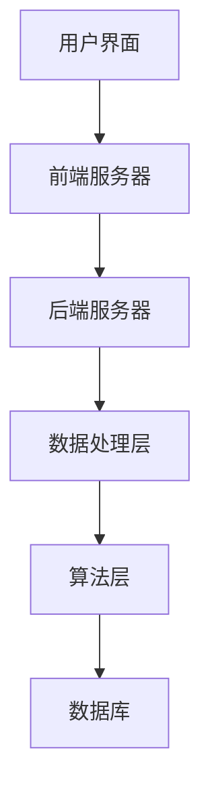

#### 3.3 AI算法的选择与实现

AI算法的选择与实现是AI应用系统的核心。以下是常见的选择与实现步骤：

1. **算法选择**：根据应用场景和需求选择合适的算法，如分类、聚类、预测等。
2. **数据预处理**：对原始数据进行分析和处理，包括数据清洗、归一化、特征提取等。
3. **模型训练**：使用训练数据对模型进行训练，调整模型参数以优化性能。
4. **模型评估**：使用验证数据对模型进行评估，选择最佳模型。
5. **模型部署**：将训练好的模型部署到生产环境，进行实时预测和决策。

以下是一个简单的AI算法实现流程：

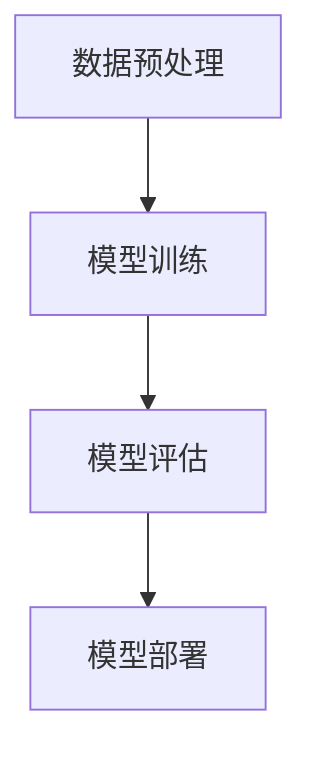

#### 3.4 AI应用系统的测试与优化

AI应用系统的测试与优化是确保系统性能和用户体验的关键步骤。以下是常见的测试与优化方法：

1. **功能测试**：测试系统的功能是否符合需求，包括单元测试、集成测试和系统测试等。
2. **性能测试**：测试系统的性能，包括响应时间、吞吐量和并发处理能力等。
3. **用户体验测试**：通过用户测试和反馈，评估系统的易用性和用户体验。
4. **优化策略**：根据测试结果和用户反馈，对系统进行优化，包括算法优化、架构优化和代码优化等。

以下是一个简单的测试与优化流程：

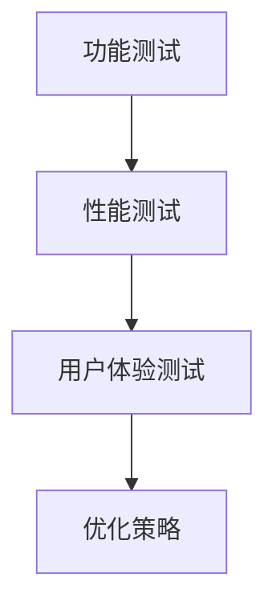

#### 3.5 AI应用系统的部署

AI应用系统的部署是将系统从开发环境迁移到生产环境的过程。以下是常见的部署步骤：

1. **环境配置**：配置生产环境的服务器、数据库和其他基础设施。
2. **部署脚本**：编写部署脚本，自动化部署过程。
3. **自动化测试**：在部署后进行自动化测试，确保系统正常运行。
4. **监控与维护**：部署监控系统，实时监控系统运行状态，并进行定期维护和更新。

以下是一个简单的部署流程：

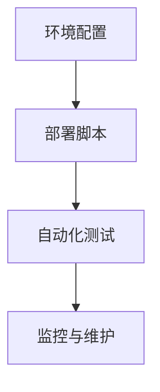

### 3.6 本章小结

本章详细介绍了AI应用系统的设计与实现过程，包括系统设计原则、架构设计、算法选择与实现、系统测试与优化以及系统部署等。通过遵循系统设计原则和采用合适的架构设计，开发团队能够设计出高效、稳定和可扩展的AI应用系统。算法的选择与实现是系统的核心，而测试与优化确保系统的性能和用户体验。通过合理的部署和维护，AI应用系统能够在生产环境中稳定运行，为用户提供高质量的服务。在接下来的章节中，我们将继续探讨AI应用项目中的风险管理、进度管理和团队合作与沟通等关键实践。

### 第4章：AI应用项目风险管理

在AI应用项目的开发过程中，风险管理是确保项目成功的关键环节。AI项目由于其技术复杂性和应用场景的不确定性，面临诸多潜在风险。有效的风险管理能够帮助团队提前识别、评估和应对这些风险，从而确保项目的顺利推进。以下是关于AI应用项目风险管理的详细探讨，包括风险识别、风险评估、风险应对策略和风险监控与应对措施。

#### 4.1 风险识别

风险识别是风险管理的第一步，其目的是发现项目中可能存在的风险。以下是识别风险的方法和工具：

1. **专家访谈**：通过与项目团队成员、领域专家和利益相关者进行访谈，了解他们的经验和见解，识别潜在的风险。
2. **头脑风暴**：组织团队成员进行头脑风暴会议，列出所有可能的风险因素。
3. **历史数据分析**：分析以往类似项目的风险记录，借鉴经验和教训。
4. **检查表法**：使用预先设计好的检查表，覆盖常见的风险领域，如技术风险、资源风险、市场风险等。
5. **流程图法**：通过绘制项目流程图，识别流程中的关键节点和潜在风险。

以下是一个风险识别的示例流程：

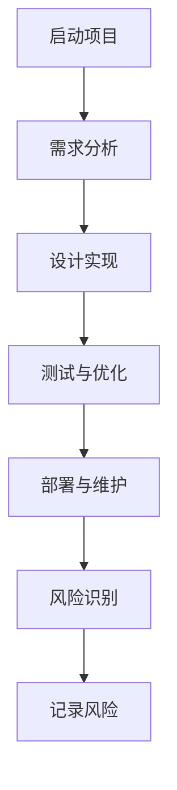

#### 4.2 风险评估

风险评估是对识别出的风险进行评估，以确定其严重性和发生概率。以下是评估风险的方法和工具：

1. **定性评估**：使用主观判断和经验，对风险的严重性和发生概率进行初步评估，如使用风险矩阵进行评估。
2. **定量评估**：使用数学模型和统计方法，对风险的严重性和发生概率进行量化评估，如使用风险价值（VaR）模型。
3. **敏感性分析**：分析不同因素对风险的影响程度，识别关键风险因素。
4. **专家评审**：组织专家对风险进行评审，确保评估的准确性和全面性。

以下是一个风险评估的示例流程：

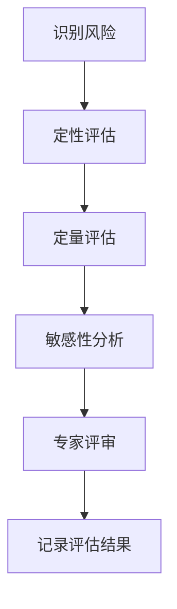

#### 4.3 风险应对策略

在评估风险后，需要制定相应的应对策略，以减少风险的影响或避免风险的发生。以下是常见的风险应对策略：

1. **风险规避**：通过调整项目计划或改变项目范围，避免风险的发生。
2. **风险转移**：通过购买保险或签订合同，将风险转移给第三方。
3. **风险减轻**：采取技术和管理措施，降低风险发生的概率或减少风险的影响。
4. **风险接受**：对无法规避或转移的风险，制定应急预案，以减少风险的影响。

以下是一个风险应对策略的示例：

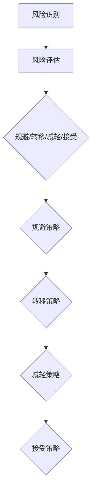

#### 4.4 风险监控与应对措施

风险管理是一个持续的过程，需要定期监控风险，并根据实际情况调整应对措施。以下是风险监控与应对措施的方法：

1. **风险登记册**：记录所有识别出的风险，包括风险名称、严重性、发生概率和应对策略等。
2. **定期评审**：定期对风险登记册进行评审，更新风险信息，评估应对措施的有效性。
3. **预警机制**：建立风险预警机制，及时发现新出现的风险，并采取应对措施。
4. **持续改进**：根据风险管理的经验和教训，持续改进风险识别、评估和应对方法。

以下是一个风险监控与应对措施的示例流程：

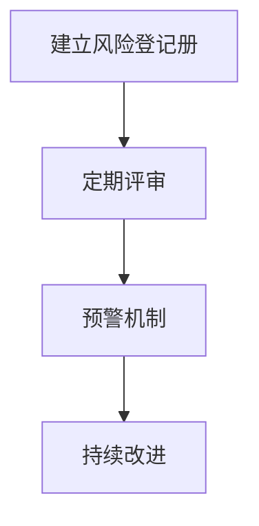

#### 4.5 风险管理案例分析

以下是一个AI应用项目的风险管理案例：

**项目背景**：某公司开发一款智能医疗诊断系统，旨在利用AI技术辅助医生进行疾病诊断。

**识别的风险**：技术风险、数据风险、法律风险和市场竞争风险。

**评估结果**：技术风险最高，数据风险次之。

**应对策略**：

- **技术风险**：采用开源框架，确保技术成熟度；引入外部专家，提供技术支持。
- **数据风险**：建立数据隐私和安全机制，确保患者数据的安全和隐私。
- **法律风险**：与法律顾问合作，确保系统的合规性。
- **市场竞争风险**：加强市场调研，及时调整产品策略。

**监控与应对**：定期更新风险登记册，进行风险评审，建立预警机制，及时采取应对措施。

通过有效的风险管理，该项目成功避免了技术风险和市场竞争风险，确保了项目的顺利进行。

### 4.6 本章小结

本章详细介绍了AI应用项目风险管理的全过程，包括风险识别、风险评估、风险应对策略和风险监控与应对措施。通过识别和评估风险，制定有效的应对策略，并持续监控和调整，开发团队能够有效应对AI应用开发中的各种风险，确保项目的成功。在接下来的章节中，我们将继续探讨项目进度管理、团队合作与沟通等重要实践。

### 第5章：AI应用项目进度管理

在AI应用项目的开发过程中，进度管理是确保项目按时完成、达到预期目标的关键环节。有效的进度管理不仅能够保证项目在预算和时间限制内完成，还能提高项目团队的工作效率和质量。本章将详细介绍AI应用项目进度管理的相关内容，包括进度计划制定、进度跟踪与控制、里程碑管理、问题与冲突解决以及项目进度管理工具的使用。

#### 5.1 进度计划制定

进度计划制定是进度管理的第一步，其目标是确定项目的完成时间和所需资源。以下是进度计划制定的关键步骤和工具：

1. **工作分解结构（WBS）**：将项目任务分解为可管理的子任务，创建工作分解结构图。这有助于明确项目的各个组成部分，便于后续的进度计划和资源分配。

2. **活动定义**：确定项目中的所有活动，包括开发、测试、设计、文档编写等。为每个活动分配标识符，并记录其持续时间、资源需求等。

3. **活动排序**：使用网络图（如PERT图、Gantt图）对活动进行排序，确定活动之间的依赖关系。确保项目活动按合理的顺序进行，避免资源冲突和进度延误。

4. **时间估算**：为每个活动估算所需时间，可以使用专家判断、历史数据或参数化模型等方法。时间估算应考虑到活动的不确定性，留出一定的缓冲时间。

5. **资源分配**：根据活动的时间估算和资源需求，进行资源分配，确保每个活动都有足够的资源支持。

6. **进度计划编制**：将上述信息整合到进度计划中，生成项目的时间表和资源计划。可以使用项目管理软件（如Microsoft Project、JIRA）进行进度计划的编制和跟踪。

以下是一个简单的进度计划编制流程：

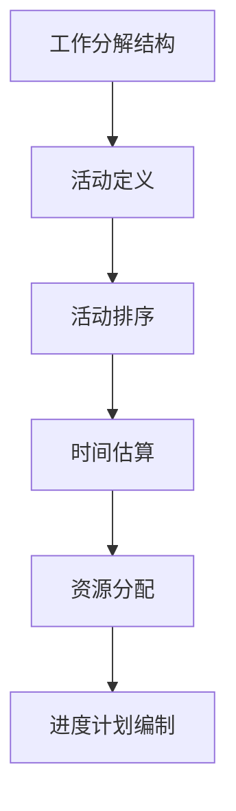

#### 5.2 进度跟踪与控制

进度跟踪与控制是确保项目按计划进行的持续过程，其目标是及时发现和纠正进度偏差。以下是进度跟踪与控制的关键步骤和工具：

1. **进度报告**：定期生成项目进度报告，包括项目完成情况、时间进度和资源使用情况。进度报告应提供详细的数据和图表，便于项目管理人员和团队了解项目状态。

2. **进度评估**：根据实际完成情况，评估项目进度是否与计划一致。如果发现进度偏差，应分析原因并采取相应的纠正措施。

3. **变更管理**：如果项目计划需要进行变更，应按照变更管理流程进行审批和实施。确保变更对项目进度和资源的影响得到有效控制。

4. **风险管理**：识别项目中的风险，并制定相应的应对措施。通过风险管理和进度跟踪，确保项目能够应对各种不确定性和变化。

5. **进度控制工具**：使用项目管理软件（如JIRA、Trello）进行进度跟踪与控制。这些工具可以实时更新项目状态，提供进度图表和报告，帮助团队更好地管理项目进度。

以下是一个进度跟踪与控制的示例流程：

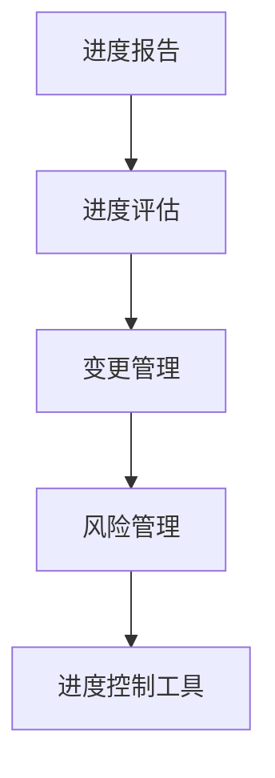

#### 5.3 里程碑管理

里程碑管理是进度管理中的重要环节，其目标是在项目关键节点上设置里程碑，确保项目按计划推进。以下是里程碑管理的关键步骤和工具：

1. **里程碑定义**：明确项目中的关键里程碑，如项目启动、需求分析完成、原型设计完成、系统测试通过等。每个里程碑都应具有明确的交付物和验收标准。

2. **里程碑监控**：对每个里程碑的完成情况进行监控，确保项目在预定时间内达到里程碑目标。如果发现里程碑无法按计划完成，应立即采取纠正措施。

3. **里程碑评审**：在里程碑完成后，组织评审会议，对里程碑的成果进行评估和验收。确保里程碑交付物符合项目目标和质量要求。

4. **里程碑报告**：生成里程碑报告，记录里程碑的完成情况、验收结果和后续计划。里程碑报告应向项目利益相关者提供项目进展的透明度。

以下是一个里程碑管理的示例流程：

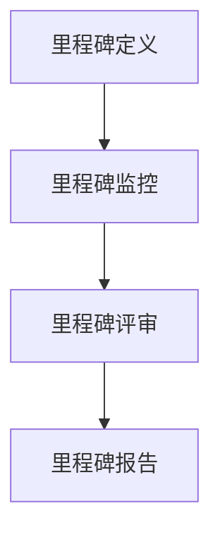

#### 5.4 问题与冲突解决

在项目开发过程中，不可避免地会遇到各种问题和冲突。有效的解决策略能够帮助项目团队克服困难，确保项目顺利进行。以下是问题与冲突解决的关键步骤和工具：

1. **问题识别**：及时发现项目中的问题和冲突，包括技术问题、资源冲突、沟通不畅等。

2. **问题分类**：根据问题的性质和影响程度进行分类，如技术问题、管理问题、资源问题等。

3. **问题分析**：对每个问题进行深入分析，找出根本原因，并制定相应的解决策略。

4. **问题解决**：采取有效的措施解决每个问题，如调整资源分配、改进沟通机制、技术升级等。

5. **冲突解决**：使用冲突解决策略（如合作、竞争、妥协、回避）解决项目中的冲突，确保团队协作和谐。

6. **问题跟踪与反馈**：记录每个问题的解决情况，并对解决效果进行跟踪和反馈，确保问题得到彻底解决。

以下是一个问题与冲突解决的示例流程：

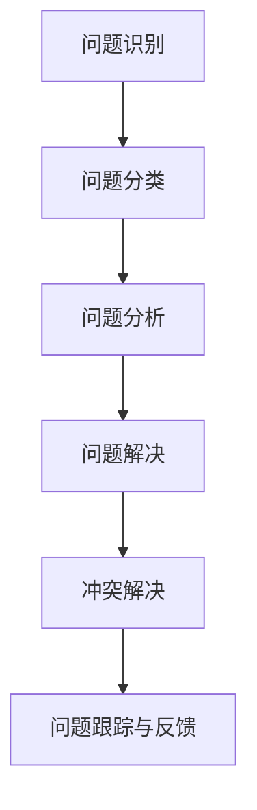

#### 5.5 项目进度管理工具使用

在AI应用项目的进度管理中，合理使用项目管理工具能够提高项目管理的效率和质量。以下是几种常用的项目进度管理工具：

1. **Microsoft Project**：一款功能强大的项目管理软件，支持工作分解结构、进度计划编制、资源分配和进度跟踪等功能。

2. **JIRA**：一款基于敏捷开发理念的项目管理工具，支持任务跟踪、迭代规划和进度监控等功能，适用于跨团队协作。

3. **Trello**：一款直观的看板式项目管理工具，适用于任务管理、进度跟踪和团队协作。

4. **Asana**：一款灵活的项目管理工具，支持任务分配、进度跟踪和团队协作，适用于各种类型的项目。

通过合理使用这些工具，项目团队能够更好地进行进度管理，确保项目按时、按质完成。

### 5.6 本章小结

本章详细介绍了AI应用项目进度管理的相关内容，包括进度计划制定、进度跟踪与控制、里程碑管理、问题与冲突解决以及项目进度管理工具的使用。通过遵循进度管理的原则和采用合适的工具，项目团队能够有效管理项目进度，确保项目按时完成、达到预期目标。在接下来的章节中，我们将继续探讨项目团队合作与沟通、Sprint规划的总结与优化等关键实践。

### 第6章：AI应用项目的团队合作与沟通

在AI应用项目开发过程中，团队合作和沟通是确保项目成功的关键因素。有效的团队合作和沟通能够提高团队协作效率，减少误解和冲突，确保项目在预算和时间限制内高质量完成。本章将详细讨论AI应用项目中的团队合作与沟通，包括团队角色与职责、团队沟通技巧、项目沟通工具与方法，以及团队合作案例与经验分享。

#### 6.1 团队合作的重要性

团队合作在AI应用项目中具有至关重要的作用，主要体现在以下几个方面：

1. **提高项目效率**：通过团队成员的协作，可以充分利用各自的专业技能和经验，提高项目的整体效率。
2. **促进知识共享**：团队合作能够促进团队成员之间的知识共享，提高团队整体的技术水平和解决问题的能力。
3. **增强问题解决能力**：在面对复杂的问题时，团队可以通过集体智慧和协作，找到更有效的解决方案。
4. **提升团队士气**：良好的团队合作和沟通能够增强团队成员的归属感和认同感，提高团队士气和工作积极性。

#### 6.2 团队角色与职责

在AI应用项目中，通常包括以下关键角色和职责：

1. **项目经理**：负责项目规划、执行和监控，确保项目按计划进行。项目经理需要协调各个团队和利益相关者，确保项目目标的达成。
2. **开发人员**：负责系统的设计和实现，包括算法开发、编码、测试等。开发人员需要具备扎实的编程能力和算法知识。
3. **测试人员**：负责测试系统的功能、性能和安全性，确保系统质量符合要求。测试人员需要熟悉测试方法和工具，具备良好的问题解决能力。
4. **数据科学家**：负责数据分析和建模，利用机器学习和深度学习技术开发智能算法。数据科学家需要具备深厚的数学和统计知识。
5. **产品经理**：负责产品规划和需求管理，确保项目开发符合用户需求和商业目标。产品经理需要与用户和市场保持紧密联系，掌握市场动态。
6. **运维人员**：负责系统的部署、运维和监控，确保系统在运行过程中稳定可靠。运维人员需要熟悉云计算、容器化和自动化运维等技能。

#### 6.3 团队沟通技巧

有效的沟通是团队合作的核心，以下是一些团队沟通技巧：

1. **清晰表达**：团队成员在沟通时，应确保表达清晰、准确，避免使用模糊或歧义的语言。
2. **积极倾听**：团队成员应积极倾听他人的意见和反馈，理解他人的观点和需求。
3. **及时反馈**：在沟通过程中，应及时给予反馈，确保信息传递的准确性。
4. **尊重差异**：尊重团队成员的多样性和观点差异，通过对话和讨论解决问题。
5. **建立信任**：通过透明和开放的沟通，建立团队之间的信任，提高团队协作效率。

#### 6.4 AI应用项目中的沟通工具与方法

为了确保AI应用项目中的有效沟通，团队可以采用以下沟通工具和方法：

1. **会议**：定期举行会议，包括项目启动会、进度汇报会、评审会等，确保团队成员了解项目进展和任务分配。
2. **邮件**：使用邮件进行正式的沟通和文档传递，确保信息的准确性和可追溯性。
3. **即时通讯工具**：如Slack、Microsoft Teams等，用于实时沟通和协作，提高沟通效率。
4. **项目管理系统**：如JIRA、Trello等，用于任务分配、进度跟踪和文档管理，确保项目信息的集中和统一。
5. **知识库**：建立项目知识库，记录项目过程中的经验、教训和最佳实践，供团队成员查阅和参考。

#### 6.5 团队合作案例与经验分享

以下是一个AI应用项目中的团队合作案例：

**项目背景**：某公司开发一款智能语音助手，旨在提供个性化的用户服务。

**团队合作与沟通实践**：

- **角色分工**：明确团队成员的角色和职责，确保每个成员都清楚自己的任务和目标。
- **定期会议**：每周举行项目进度汇报会议，确保团队了解项目进展和存在的问题。
- **即时沟通**：通过Slack进行日常沟通，快速解决问题和协调任务。
- **知识共享**：建立项目知识库，记录项目过程中的技术问题、解决方案和最佳实践。
- **经验分享**：定期组织经验分享会，团队成员分享自己的经验和心得，提高团队整体能力。

通过上述团队合作与沟通实践，项目团队成功在预定时间内完成了智能语音助手的开发，并取得了良好的市场反响。

### 6.6 本章小结

本章详细探讨了AI应用项目中的团队合作与沟通，包括团队角色与职责、团队沟通技巧、项目沟通工具与方法，以及团队合作案例与经验分享。通过有效的团队合作和沟通，项目团队能够提高工作效率、解决问题和实现项目目标。在接下来的章节中，我们将继续讨论Sprint规划的总结与优化，为AI应用项目的成功提供更多的实践指导。

### 6.7 最佳实践 Tips

在AI应用项目中，有效的团队合作和沟通是实现项目成功的关键。以下是一些最佳实践 Tips，供团队参考：

1. **明确目标和任务**：在项目启动时，明确团队目标和任务，确保每个成员都清楚自己的责任和期望。
2. **定期沟通**：定期举行团队会议和项目进度汇报，确保团队成员之间的信息同步和协调。
3. **即时反馈**：在沟通过程中，及时给予反馈，确保信息的准确性和问题得到及时解决。
4. **尊重差异**：尊重团队成员的观点和技能，通过合作和讨论解决问题。
5. **知识共享**：建立知识库，记录项目过程中的经验和教训，提高团队整体能力。
6. **利用工具**：合理使用项目管理和沟通工具，提高团队协作效率。

通过遵循这些最佳实践，团队能够更好地进行合作和沟通，确保AI应用项目的顺利进行。

### 本章小结

本章详细探讨了AI应用项目中的团队合作与沟通，从团队角色与职责、沟通技巧到沟通工具与方法，再到实际案例与经验分享，全面阐述了团队合作在项目成功中的重要性。有效的团队合作和沟通能够提高项目效率、减少冲突，确保项目按时、按质完成。在接下来的章节中，我们将继续深入探讨Sprint规划的总结与优化，为AI应用项目的成功提供更多的实践指导。

### 第7章：Sprint规划的总结与优化

在Sprint规划的实施过程中，总结与优化是确保团队持续改进和提升项目质量的关键环节。通过总结每个Sprint的经验和教训，团队可以识别改进点，为下一个Sprint做好准备。本章将详细讨论Sprint规划的总结与优化策略，包括Sprint回顾与总结、优化Sprint规划的策略、不断改进与持续学习以及Sprint规划的最佳实践。

#### 7.1 Sprint回顾与总结

Sprint回顾与总结是每个Sprint结束时的必要环节，其目的是评估本次Sprint的成功和不足之处，为下一个Sprint提供改进的方向。以下是Sprint回顾与总结的关键步骤：

1. **评估Sprint目标达成情况**：回顾本次Sprint的目标是否达成，分析目标达成的程度和原因。如果目标未达成，需要分析具体原因，如资源不足、技术难题或沟通不畅等。

2. **分析问题与挑战**：总结在Sprint过程中遇到的问题和挑战，包括技术难题、资源限制、团队协作等方面。对每个问题进行深入分析，找出根本原因。

3. **识别成功经验**：回顾本次Sprint中的成功经验，包括有效的团队合作、高效的沟通、合理的时间分配等。总结成功的原因，以便在未来的Sprint中借鉴。

4. **制定改进措施**：根据总结出的经验和教训，制定具体的改进措施。这些措施应针对存在的问题，旨在提高团队效率和项目质量。

5. **记录总结结果**：将Sprint回顾与总结的结果记录在案，以便后续查阅和改进。同时，这些记录可以为团队提供宝贵的历史数据，为未来的Sprint提供参考。

以下是一个Sprint回顾与总结的示例流程：

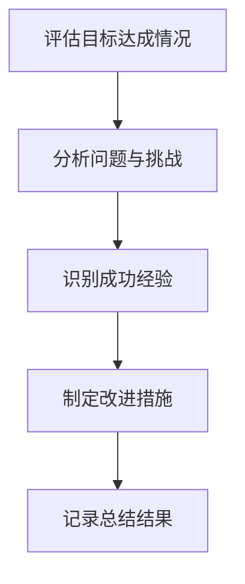

#### 7.2 优化Sprint规划的策略

为了提高Sprint规划的效果，团队可以采用以下策略：

1. **优化团队结构**：根据项目的需求，合理配置团队成员，确保团队具备完成Sprint任务所需的各种技能。同时，鼓励团队成员跨职能合作，提高团队的整体效率。

2. **改进任务分配**：在任务分配过程中，充分考虑团队成员的能力和经验，确保任务与其能力相匹配。同时，合理设置任务的优先级，确保关键任务得到优先处理。

3. **优化资源管理**：确保团队在Sprint期间有足够的资源支持，包括人力、物力和财力。在资源分配过程中，避免资源浪费和过度依赖特定资源。

4. **加强沟通与协作**：通过定期的团队会议、沟通工具和协作平台，加强团队成员之间的沟通和协作，确保信息畅通无阻，减少误解和冲突。

5. **改进风险管理**：识别项目中的潜在风险，并制定有效的风险应对策略。通过持续的风险监控和评估，及时调整项目计划，确保项目能够顺利推进。

6. **持续改进与学习**：鼓励团队成员不断学习和分享经验，通过回顾和总结，不断改进工作方法和流程，提高团队的整体能力和效率。

以下是一个优化Sprint规划的示例策略：

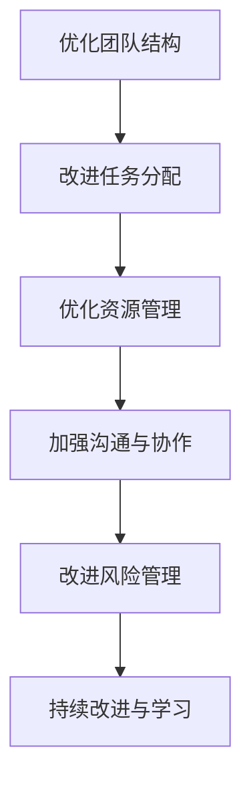

#### 7.3 不断改进与持续学习

持续改进与学习是团队成功的关键，以下是实现这一目标的方法：

1. **建立学习文化**：鼓励团队成员分享知识和经验，组织定期的培训和学习活动，提高团队的整体技能水平。

2. **鼓励创新思维**：在团队中鼓励创新思维，鼓励团队成员提出新的想法和解决方案，通过实践验证其可行性。

3. **定期回顾与反思**：定期对项目和工作过程进行回顾与反思，识别改进点，并制定具体的改进计划。

4. **引入外部资源**：通过引入外部专家、顾问或参与行业交流活动，获取外部视角和先进经验，推动团队持续改进。

5. **使用敏捷工具和方法**：利用敏捷开发中的工具和方法，如用户故事地图、迭代回顾等，确保团队不断学习和适应变化。

以下是一个不断改进与持续学习的示例流程：

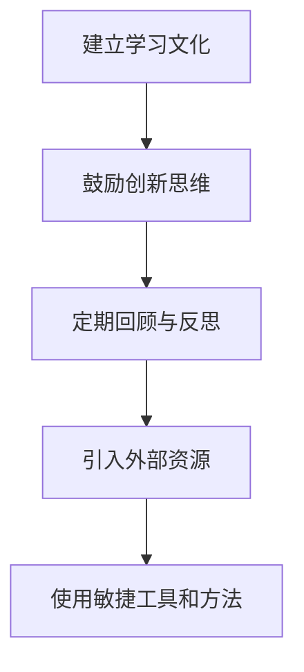

#### 7.4 Sprint规划的最佳实践

以下是Sprint规划的最佳实践，供团队参考：

1. **明确目标和优先级**：在每次Sprint开始前，明确本次Sprint的目标和任务，并确定任务的优先级，确保团队聚焦于最关键的功能。

2. **任务分解与估算**：将用户故事分解为具体的任务，并对每个任务的难度和工作量进行估算，确保任务能够在Sprint周期内完成。

3. **每日站会**：每日站会是一个简短高效的会议，用于讨论任务进展和问题，确保团队保持高效的协作。

4. **迭代回顾**：在每个Sprint结束时，进行迭代回顾，总结本次Sprint的经验和教训，为下一个Sprint做准备。

5. **文档记录**：详细记录项目进展、问题和解决方案，确保信息的透明性和可追溯性。

6. **持续学习与分享**：鼓励团队成员不断学习和分享经验，通过回顾和总结，不断提升团队的整体能力和效率。

7. **灵活调整**：根据项目进展和实际情况，灵活调整Sprint计划和资源分配，确保项目能够顺利推进。

以下是一个Sprint规划最佳实践的示例流程：

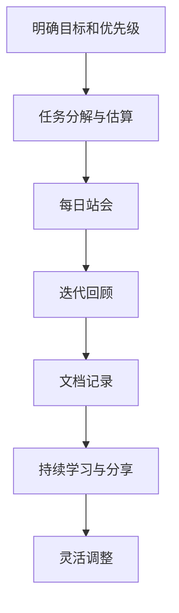

### 7.5 本章小结

本章详细探讨了Sprint规划的总结与优化，包括Sprint回顾与总结、优化策略、不断改进与持续学习以及最佳实践。通过总结每个Sprint的经验和教训，团队可以不断改进工作方法和流程，提高项目质量和效率。优化Sprint规划、持续改进和学习是实现团队高效合作和项目成功的关键。在未来的Sprint中，团队可以遵循本章提供的方法和实践，确保项目能够顺利推进并取得成功。

### 全书总结

本书《Sprint规划：为AI应用开发设定明确目标》通过详细探讨Sprint规划在AI应用开发中的重要性，提供了系统化的方法和实践指南。全书分为两个主要部分，第一部分介绍了AI应用开发的挑战和Sprint规划的基本概念，包括目标设定、需求分析、系统设计与实现、项目风险管理、进度管理和团队合作与沟通等关键环节。第二部分则通过具体实践和案例分析，进一步深化了对Sprint规划的理解和应用。

全书的主要贡献和成果体现在以下几个方面：

1. **系统化的理论框架**：本书构建了一个系统化的Sprint规划理论框架，详细阐述了Sprint规划的核心原则和流程，为AI应用项目提供了理论基础。

2. **实用的方法与实践**：通过具体的案例和最佳实践，本书提供了实用的方法，帮助开发团队在实际项目中应用Sprint规划，提高项目效率和质量。

3. **全面的内容覆盖**：本书全面覆盖了AI应用开发的主要领域，包括需求分析、系统设计、算法实现、风险管理、进度管理和团队合作等，为项目管理的全流程提供了指导。

4. **跨学科的融合**：本书结合了计算机科学、数学、统计学等多学科知识，深入探讨了AI应用开发中的复杂性问题，展现了跨学科融合在解决实际问题中的重要性。

5. **持续改进的思路**：本书强调了持续改进和持续学习的重要性，通过迭代回顾和反馈机制，帮助团队不断优化Sprint规划，实现项目的长期成功。

通过阅读本书，读者能够：

1. **理解Sprint规划的概念和原理**：掌握Sprint规划的基本概念、流程和优势，理解其在AI应用开发中的重要性。

2. **掌握Sprint规划的实践方法**：学会如何进行需求分析、系统设计、项目风险管理、进度管理和团队合作等实际操作，提高项目管理能力。

3. **提高项目效率和质量**：通过应用Sprint规划，能够更高效地完成项目任务，确保项目在预算和时间限制内高质量交付。

4. **培养跨学科思维能力**：通过本书的深入探讨，读者能够培养跨学科的思维能力，更好地应对AI应用开发中的复杂性问题。

5. **持续学习和改进**：本书鼓励读者在项目实践中不断总结经验和教训，持续改进工作方法和流程，实现项目的长期成功。

总之，本书为AI应用项目的开发和管理提供了全面、系统的指导，旨在帮助开发团队克服挑战，实现项目的成功。通过应用本书提供的方法和实践，读者将能够提高项目管理水平，推动AI技术的创新和发展。

### 注意事项

在实施Sprint规划的过程中，以下注意事项对于确保项目成功至关重要：

1. **确保团队共识**：在开始Sprint规划前，与团队成员和利益相关者达成共识，明确项目目标、任务和资源需求，避免后期出现分歧。

2. **合理分配资源**：在资源分配过程中，充分考虑团队成员的能力和经验，确保任务与其能力相匹配。同时，合理配置资源，避免资源浪费和过度依赖。

3. **及时沟通与反馈**：定期举行团队会议和进度汇报，确保团队成员之间的信息畅通。及时给予反馈，解决问题，确保项目按计划推进。

4. **灵活应对变化**：在Sprint规划过程中，不可避免地会遇到各种变化和问题。团队应具备灵活应对变化的能力，及时调整计划和策略，确保项目能够持续优化。

5. **持续学习和改进**：鼓励团队成员在项目过程中不断学习和分享经验，通过迭代回顾和反馈机制，持续改进工作方法和流程，提高团队整体效率。

### 拓展阅读

为了进一步深入了解Sprint规划和AI应用开发，以下是几本推荐阅读的书籍：

1. **《敏捷软件开发：原则、实践与模式》（Agile Software Development: Principles, Patterns, and Practices）**：本书详细介绍了敏捷开发的理论和实践，包括Sprint规划、用户故事、迭代回顾等关键概念，适合初学者和有经验的开发者。

2. **《Scrum精髓：实践指南》（The Scrum Guide）**：作为Scrum方法的官方指南，本书提供了Scrum的详细解释和实践建议，是了解Sprint规划和Scrum方法的重要参考书。

3. **《人工智能：一种现代方法》（Artificial Intelligence: A Modern Approach）**：这本书是人工智能领域的经典教材，详细介绍了人工智能的基本概念、算法和技术，适合希望深入了解AI技术的开发者。

4. **《敏捷项目管理：实践指南》（Agile Project Management: Creating Innovative Products）**：本书结合敏捷方法和项目管理，提供了敏捷项目管理的全面指南，适合希望将敏捷方法应用于项目管理实践的读者。

通过阅读这些书籍，读者能够进一步拓展知识，提高在AI应用开发中的实践能力。

### 作者信息

**作者：AI天才研究院（AI Genius Institute） & 禅与计算机程序设计艺术（Zen And The Art of Computer Programming）**

AI天才研究院是一支专注于人工智能领域研究的国际知名团队，致力于推动AI技术的创新和发展。该研究院的专家们在计算机科学、人工智能、机器学习和深度学习等领域具有深厚的理论基础和丰富的实践经验。

《禅与计算机程序设计艺术》是一部经典计算机编程教材，由著名计算机科学家Donald E. Knuth所著。这本书以其深刻的哲理和独特的编程思想，指导开发者如何写出高效、优雅的程序，深受编程爱好者和专业人士的喜爱。本书作者结合其在AI和编程领域的专业知识和实践经验，为读者呈现了一部关于AI应用开发Sprint规划的权威著作。

通过本书，读者不仅能够了解Sprint规划的基本概念和实践方法，还能够感受到作者在编程和AI领域独特的哲学思考和人生智慧。我们期待本书能够为AI应用开发提供有价值的指导和启示，帮助开发团队克服挑战，实现项目的成功。

