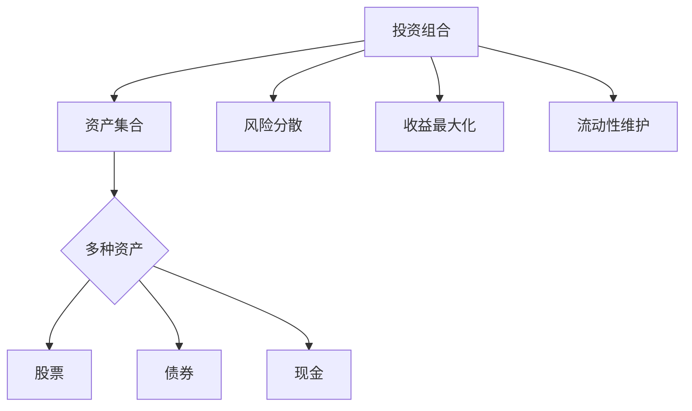
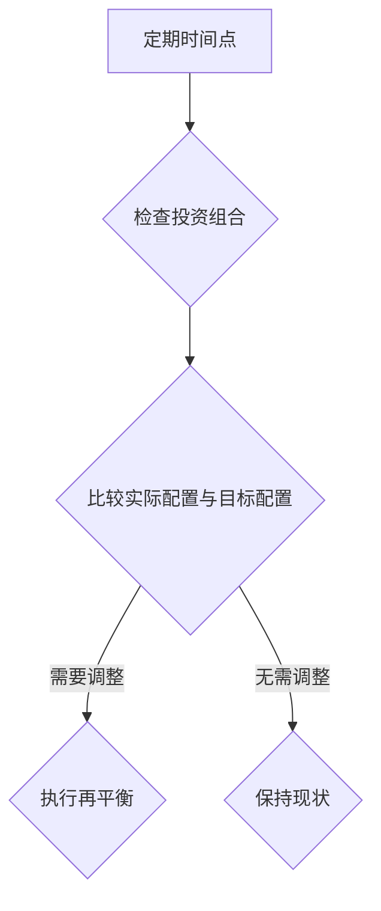
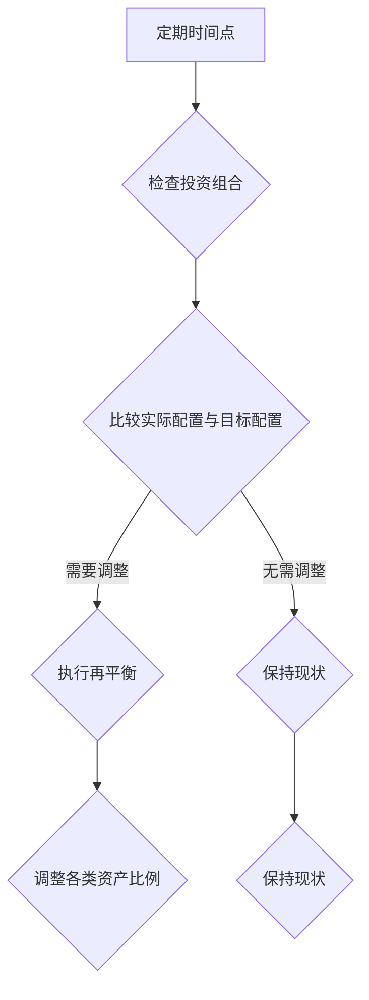
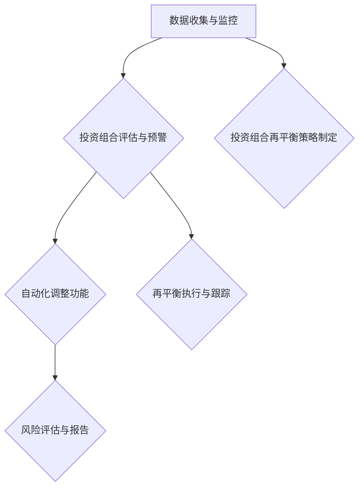

                 

### 前言

投资组合再平衡是投资管理中的一项重要策略，旨在通过调整投资组合中不同资产的比例，使其回归到预定的目标配置。乔尔·提尔尼作为投资组合管理领域的杰出专家，他提出了一系列关于投资组合再平衡的策略，为投资者提供了宝贵的指导。本文将以乔尔·提尔尼的投资组合再平衡策略为主题，深入探讨这一策略的必要性和重要性，以及其在实际应用中的具体实施方法和效果评估。

投资组合再平衡的必要性在于，投资市场的波动性使得投资组合中各类资产的比例不断变化，这可能导致整体投资风险和收益偏离预期。通过定期进行再平衡，投资者可以有效地控制投资组合的波动性，保持风险与收益的平衡，从而实现长期的投资目标。此外，再平衡策略还能够帮助投资者避免因市场波动而导致的情绪化决策，保持冷静和理性。

乔尔·提尔尼的投资组合管理理念强调系统性、科学性和灵活性。他认为，成功的投资组合管理不仅需要深入理解市场动态，还需要构建一个适应市场变化的动态系统。再平衡策略正是这一理念的具体体现，它通过定期调整投资组合，使其不断适应市场变化，从而最大化投资收益。

本文将按照以下结构进行阐述：

- **第一部分：投资组合再平衡的基础**：介绍投资组合的基本概念，包括定义、构成和目标，以及投资组合再平衡的概念、策略和重要性。
- **第二部分：投资组合再平衡的评估与调整**：讨论再平衡的评估指标、调整策略和执行过程。
- **第三部分：案例分析**：通过具体案例，展示再平衡策略的制定、执行和效果评估。
- **第四部分：投资组合再平衡的最佳实践**：总结常见的再平衡问题及最佳实践。
- **第五部分：投资组合再平衡的系统性思考**：探讨再平衡与投资策略的关系，以及系统设计的要点。
- **第六部分：投资组合再平衡的未来趋势**：展望再平衡策略的挑战与机遇，以及未来发展趋势。

在接下来的章节中，我们将逐步展开对投资组合再平衡策略的深入分析，以期为投资者提供有价值的参考。

## 关键词

- 投资组合再平衡
- 乔尔·提尔尼
- 风险管理
- 投资策略
- 投资组合管理
- 资产配置
- 再平衡策略

### 摘要

本文旨在探讨乔尔·提尔尼提出的投资组合再平衡策略，解析其在投资管理中的必要性和重要性。投资组合再平衡通过调整各类资产比例，保持风险与收益的平衡，从而实现长期投资目标。乔尔·提尔尼以其独特的投资组合管理理念，为投资者提供了一套系统化、科学化的再平衡策略。本文将从基础概念、评估与调整、案例分析、最佳实践、系统性思考以及未来趋势等多个角度，深入阐述这一策略的核心思想与应用方法。

### 《乔尔·提尔尼的投资组合再平衡策略》目录大纲

## 前言

### 投资组合再平衡的必要性与重要性
### 本书结构安排与阅读建议
### 乔尔·提尔尼的投资组合管理理念

## 第一部分：投资组合再平衡的基础

### 第1章：投资组合概述

### 第2章：投资组合再平衡的概念与策略

### 第3章：投资组合再平衡的评估与调整

## 第二部分：案例分析

### 第4章：案例分析

## 第三部分：投资组合再平衡的最佳实践

### 第5章：投资组合再平衡的最佳实践

## 第四部分：投资组合再平衡的系统性思考

### 第6章：投资组合再平衡与投资策略的关系
### 第7章：投资组合再平衡的系统设计

## 第五部分：投资组合再平衡的未来趋势

### 第8章：投资组合再平衡的挑战与机遇
### 第9章：投资组合再平衡的创新实践

## 附录

### 附录A：常用投资组合分析工具介绍
### 附录B：投资组合再平衡案例资料
### 附录C：本书引用文献

### 第一部分：投资组合再平衡的基础

在投资组合管理中，再平衡策略扮演着至关重要的角色。本部分将深入探讨投资组合的基础概念，以及投资组合再平衡的相关策略，为后续章节的分析和讨论打下坚实的基础。

### 第1章：投资组合概述

投资组合概述是了解投资组合再平衡策略的基础。本章将介绍投资组合的基本概念、构成和目标，并探讨投资组合的风险与收益分析。

### 1.1 投资组合的基本概念

#### 1.1.1 投资组合的定义与构成

投资组合是指将多种资产，如股票、债券、现金等，按照一定的比例组合在一起进行投资的形式。这种组合的目的是通过分散投资来降低风险，同时实现收益的最大化。

#### 1.1.2 投资组合的目标与功能

投资组合的目标通常包括收益最大化、风险最小化和流动性维护。通过科学的资产配置和再平衡策略，投资者可以追求长期稳定的投资回报。

LaTeX公式：
$$
\text{投资组合目标} = (\text{收益最大化} \wedge \text{风险最小化}) \cup \text{流动性维护}
$$

#### 1.1.3 投资组合的风险与收益分析

投资组合的风险和收益是投资者最为关注的两个方面。风险主要来源于市场波动和个别资产的表现，而收益则取决于资产配置和投资时机。以下是一个简单的风险与收益分析表格：

| 风险类型 | 影响因素 | 收益水平 |
| :--: | :--: | :--: |
| 市场风险 | 股市波动 | 高 |
| 信用风险 | 债券违约 | 中 |
| 流动性风险 | 资产变现困难 | 低 |

### 第2章：投资组合再平衡的概念与策略

投资组合再平衡是指在投资过程中，通过调整不同资产的比例，使其回归到预定的目标配置。本章将详细讨论再平衡的概念、意义和基本策略。

#### 2.1 再平衡的定义与意义

再平衡的定义是指在投资组合中，通过对资产比例进行调整，使其重新符合投资者设定的目标配置。再平衡的意义在于：

- **风险控制**：通过再平衡，投资者可以控制投资组合的整体风险水平。
- **收益最大化**：再平衡可以帮助投资者在市场波动中保持最佳的收益水平。
- **投资纪律**：再平衡策略有助于投资者遵循既定的投资计划，避免情绪化决策。

#### 2.2 再平衡的基本策略

再平衡的基本策略主要包括以下几种：

- **定期再平衡**：投资者可以设定一个定期时间点（如每月、每季度或每年），对投资组合进行再平衡。
- **基于市场变化的再平衡**：当市场条件发生显著变化时，投资者可以及时调整投资组合，以适应新的市场环境。
- **基于风险调整的再平衡**：投资者可以根据市场风险的变化，对投资组合进行微调，以保持预定的风险水平。

以下是一个简单的再平衡策略流程图：

#### 2.3 再平衡的重要性

再平衡的重要性体现在以下几个方面：

- **保持投资目标的一致性**：再平衡可以帮助投资者确保投资组合始终符合其设定的长期目标。
- **规避过度集中风险**：通过再平衡，投资者可以避免投资组合中个别资产的过度集中，从而降低整体风险。
- **提高投资效率**：再平衡策略有助于投资者及时调整投资组合，抓住市场机会，提高投资效率。

### 小结

本章对投资组合再平衡的概念和策略进行了详细阐述。投资组合再平衡是投资管理中的一项重要策略，它通过定期调整资产比例，帮助投资者实现风险与收益的平衡，保持投资目标的一致性。在接下来的章节中，我们将进一步讨论投资组合再平衡的评估与调整，以及具体案例的分析。

### 第3章：投资组合再平衡的评估与调整

投资组合再平衡的评估与调整是确保再平衡策略有效实施的关键环节。本章将详细介绍再平衡的评估指标、调整策略和执行过程，帮助投资者科学地进行投资组合管理。

#### 3.1 再平衡的评估指标

再平衡的评估指标主要包括以下几个方面：

- **实际配置与目标配置的差异**：这是衡量再平衡必要性的核心指标。当实际配置与目标配置差异较大时，表明再平衡的必要性较高。
- **风险水平**：投资组合的风险水平是再平衡的重要考量因素。投资者需要根据市场状况和投资目标，对风险水平进行合理评估。
- **收益目标**：再平衡的另一个重要指标是投资组合的收益目标。投资者需要定期检查投资组合的收益表现，确保其符合预期。

以下是一个简化的再平衡评估指标表格：

| 评估指标 | 说明 | 检查频率 |
| :--: | :--: | :--: |
| 实际配置与目标配置差异 | 检查投资组合中各类资产的实际比例与目标比例的偏离程度 | 每月/每季度 |
| 风险水平 | 评估投资组合的整体风险水平 | 每月/每季度 |
| 收益目标 | 检查投资组合的收益表现是否符合预期 | 每月/每季度 |

#### 3.2 再平衡的调整策略

再平衡的调整策略主要包括以下几个方面：

- **定期调整**：投资者可以设定一个固定的再平衡周期（如每月、每季度或每年），在规定的时间内对投资组合进行调整，使其回归到目标配置。
- **动态调整**：当市场状况发生变化时，投资者可以根据市场动态和投资策略，及时对投资组合进行调整，以应对市场变化。

以下是一个简化的再平衡调整策略流程图：

#### 3.3 再平衡的执行过程

再平衡的执行过程包括以下几个步骤：

1. **评估现状**：首先，投资者需要检查投资组合的实际配置情况，包括各类资产的比例、风险水平和收益目标。
2. **制定调整方案**：根据评估结果，投资者需要制定相应的再平衡调整方案，包括调整各类资产的比例和调整的时间点。
3. **执行调整**：按照调整方案，投资者需要执行具体的再平衡操作，包括买卖资产、调整投资比例等。
4. **跟踪效果**：调整完成后，投资者需要跟踪再平衡的效果，包括投资组合的风险、收益和实际配置情况，以确保再平衡目标得到实现。

以下是一个简化的再平衡执行过程表格：

| 步骤 | 操作 | 说明 |
| :--: | :--: | :--: |
| 1 | 评估现状 | 检查投资组合实际配置、风险水平和收益目标 |
| 2 | 制定调整方案 | 根据评估结果，制定再平衡调整方案 |
| 3 | 执行调整 | 执行具体的再平衡操作，如买卖资产、调整投资比例 |
| 4 | 跟踪效果 | 跟踪再平衡效果，包括投资组合的风险、收益和实际配置情况 |

### 小结

本章详细介绍了投资组合再平衡的评估与调整策略，包括评估指标、调整策略和执行过程。再平衡是投资管理中不可或缺的一环，通过科学的评估与调整，投资者可以确保投资组合始终符合其设定的目标，实现风险与收益的最佳平衡。在接下来的章节中，我们将通过具体案例来进一步展示再平衡策略的应用效果。

### 第4章：案例分析

在了解了投资组合再平衡的理论基础之后，本章节将通过具体案例来展示再平衡策略的实际应用。我们将探讨一个案例企业的投资组合现状，分析其面临的问题与挑战，并详细介绍再平衡策略的制定与执行过程，以及最终的效果评估。

#### 4.1 案例背景

假设我们有一个名为“阳光投资”的企业，该企业目前持有的投资组合包括股票、债券和现金。具体配置如下：

- **股票**：60%
- **债券**：30%
- **现金**：10%

在过去的几个月里，股票市场经历了一轮大幅波动，导致股票价值大幅上升。现在，股票的比例已经远远超过了企业最初设定的目标配置。企业希望通过再平衡策略，调整投资组合，使其回归到预期的配置。

#### 4.1.1 案例企业的投资组合现状

以下是案例企业当前的投资组合现状：

| 资产类型 | 当前比例 | 目标比例 |
| :--: | :--: | :--: |
| 股票 | 60% | 50% |
| 债券 | 30% | 30% |
| 现金 | 10% | 20% |

从表格中可以看出，股票的比例已经远远超出了目标配置，而现金的比例则低于目标配置。这种不平衡的投资组合可能会带来以下问题：

- **风险增加**：股票比例过高意味着企业面临更大的市场波动风险。
- **流动性不足**：现金比例过低可能导致企业应对突发事件时的流动性不足。
- **收益波动**：不合理的资产配置可能导致收益波动过大，无法实现稳定的投资目标。

#### 4.1.2 案例企业面临的问题与挑战

案例企业面临的主要问题与挑战包括：

- **市场风险**：股票市场波动性较大，可能导致投资组合价值大幅波动。
- **流动性风险**：现金比例过低，可能导致企业无法及时应对市场变化。
- **收益波动**：不合理的资产配置可能导致收益不稳定，无法实现长期投资目标。

为了解决这些问题，企业决定采取再平衡策略，通过调整各类资产的比例，使其回归到预定的目标配置。

#### 4.2 再平衡策略的制定与执行

在制定再平衡策略时，企业需要考虑以下几个关键因素：

- **市场状况**：分析当前市场环境，了解各类资产的表现和预期变化。
- **投资目标**：明确企业的长期投资目标和风险偏好。
- **调整方案**：制定具体的再平衡方案，包括调整的时间点、调整的方向和幅度。

以下是案例企业制定的再平衡策略：

1. **定期调整**：企业决定每季度进行一次再平衡，以保持投资组合的稳定性。
2. **调整方案**：根据当前投资组合的实际配置与目标配置的差异，企业决定减少股票比例，增加现金比例，以达到目标配置。

具体执行过程如下：

1. **评估现状**：企业在每个季度结束时，检查当前的投资组合，计算实际配置与目标配置的差异。
2. **制定调整计划**：根据评估结果，企业决定在下一个季度开始时，逐步减少股票比例，增加现金比例。
3. **执行调整**：企业在调整期间，逐步卖出股票，买入债券和现金，以调整各类资产的比例。
4. **跟踪效果**：企业在调整完成后，持续跟踪投资组合的收益、风险和实际配置情况，确保再平衡目标得到实现。

#### 4.3 再平衡策略的执行

以下是案例企业再平衡策略的执行过程：

1. **第一季度末评估**：企业在第一季度末，发现股票比例已经超过目标配置，而现金比例低于目标配置。
2. **制定调整计划**：企业决定在下一个季度开始时，逐步减少股票比例，增加现金比例，以调整到目标配置。
3. **第二季度调整**：企业在第二季度，逐步卖出股票，买入债券和现金。具体调整如下：

   - 减少股票比例：从60%减少到50%
   - 增加现金比例：从10%增加到20%
   - 债券比例保持不变：30%

4. **跟踪效果**：企业在第二季度末，再次检查投资组合的实际配置，发现已经达到了目标配置。同时，跟踪投资组合的收益和风险，发现投资组合的波动性得到了明显控制，收益表现也较为稳定。

#### 4.4 再平衡策略的效果评估

以下是案例企业再平衡策略的效果评估：

- **投资组合稳定性**：通过再平衡策略，企业成功降低了投资组合的波动性，使其更加稳定。
- **收益表现**：再平衡后的投资组合，收益表现稳定，符合企业的长期投资目标。
- **风险控制**：再平衡策略帮助企业有效控制了市场风险，避免了因股票比例过高而带来的风险。

总体来说，再平衡策略在案例企业中取得了显著的效果，帮助企业实现了风险与收益的平衡，提高了投资组合的稳定性。

#### 4.5 案例总结与启示

通过本案例，我们可以得出以下总结与启示：

- **再平衡策略的重要性**：再平衡策略是投资管理中不可或缺的一环，它能够帮助企业有效控制风险，实现收益的最大化。
- **定期评估与调整**：定期对投资组合进行评估和调整，能够帮助企业及时应对市场变化，保持投资组合的稳定性和收益性。
- **灵活调整**：在执行再平衡策略时，企业需要根据市场状况和投资目标，灵活调整各类资产的比例，以实现最佳的投资效果。

总之，再平衡策略不仅是一种技术手段，更是一种投资理念。通过科学的再平衡策略，投资者可以更好地管理风险，实现长期稳定的投资回报。

### 第5章：投资组合再平衡的最佳实践

在投资组合管理中，再平衡策略的实施效果往往受到多种因素的影响。为了确保再平衡策略的可行性和有效性，投资者可以借鉴一些最佳实践，这些实践包括定期再平衡、基于风险调整的再平衡以及动态再平衡策略。本章将详细探讨这些最佳实践，以帮助投资者在实际操作中更好地实施再平衡策略。

#### 5.1 定期再平衡

定期再平衡是一种最常见和简单的再平衡策略，它要求投资者在固定的时间间隔（如每月、每季度或每年）对投资组合进行再平衡。这种策略的优势在于其简单性和可预测性，投资者可以预先规划再平衡的时间和步骤，减少因市场波动而产生的情绪化决策。

**最佳实践一：制定合理的再平衡周期**

投资者应根据投资目标、市场波动性和自身的风险管理能力来选择合适的再平衡周期。例如，对于风险承受能力较低的投资者，可以选择每月或每季度进行再平衡，以确保投资组合的风险水平保持在合理范围内。而对于风险承受能力较高的投资者，可以选择每年或每两年进行再平衡，以利用长期市场趋势带来的潜在收益。

**最佳实践二：提前规划再平衡操作**

为了减少交易成本和税收影响，投资者应提前规划再平衡操作，避免在市场高点买入或低点卖出。例如，在市场表现良好时，投资者可以提前卖出一部分资产，以准备在市场低迷时进行再投资。

**最佳实践三：利用技术工具**

利用投资组合管理软件或金融平台，投资者可以自动执行定期再平衡操作，节省时间和精力。这些工具通常能够提供实时的投资组合分析，帮助投资者及时了解投资组合的偏离情况，并制定相应的调整计划。

#### 5.2 基于风险调整的再平衡

基于风险调整的再平衡策略注重通过调整投资组合的风险水平来保持投资组合的稳定性。这种策略要求投资者密切关注市场动态，根据风险变化对投资组合进行微调。

**最佳实践一：动态调整风险预算**

投资者应根据市场环境和自身的风险承受能力，定期调整投资组合的风险预算。例如，在市场波动性增加时，投资者可以适当降低股票等高风险资产的配置，增加债券等低风险资产的配置，以降低投资组合的整体风险。

**最佳实践二：风险平价策略**

风险平价策略是一种基于风险调整的再平衡策略，它通过调整各类资产的比例，使投资组合的整体风险水平保持一致。例如，如果股票和债券的风险水平发生变化，投资者可以适当调整股票和债券的比例，以确保投资组合的风险水平保持不变。

**最佳实践三：利用风险指标**

投资者可以采用各种风险指标（如标准差、贝塔系数等）来评估投资组合的风险水平，并根据这些指标进行再平衡操作。例如，如果投资组合的标准差超过了投资者的风险承受范围，投资者可以适当减少高风险资产的配置。

#### 5.3 动态再平衡策略

动态再平衡策略是一种灵活的再平衡策略，它要求投资者根据市场变化和投资目标，随时调整投资组合。这种策略适合那些希望抓住市场机会并主动管理投资组合的投资者。

**最佳实践一：实时监控市场动态**

投资者应实时监控市场动态，包括各类资产的价格走势、市场趋势和宏观经济数据。通过这些信息，投资者可以及时调整投资组合，以应对市场变化。

**最佳实践二：利用技术分析**

投资者可以利用技术分析方法，如趋势线、支撑/阻力位等，来判断市场趋势，并据此调整投资组合。例如，如果市场处于上升趋势，投资者可以增加股票等高风险资产的配置，以抓住市场机会。

**最佳实践三：保持灵活性**

动态再平衡策略要求投资者保持灵活性，不要过于固守既定策略。在市场环境发生变化时，投资者应勇于调整投资组合，以适应新的市场条件。

#### 小结

投资组合再平衡是投资管理中的一项重要策略，通过定期再平衡、基于风险调整的再平衡以及动态再平衡策略，投资者可以更好地管理投资组合的风险和收益，实现长期的投资目标。本章介绍了这些最佳实践，旨在帮助投资者在实际操作中更好地实施再平衡策略，提高投资组合的管理效率。

### 第6章：投资组合再平衡的系统性思考

投资组合再平衡不仅是投资策略的一部分，更是投资管理体系中的一项关键环节。为了深入理解投资组合再平衡的系统性，我们需要从多个角度进行系统性思考，包括再平衡与投资策略的关系、系统设计的要点，以及再平衡在实际操作中的应用。

#### 6.1 再平衡与投资策略的关系

投资组合再平衡与投资策略之间的关系是相辅相成的。投资策略是投资者根据自身的风险偏好和投资目标制定的整体规划，而再平衡是实现这一策略的重要手段。以下是再平衡与投资策略之间的一些关键关系：

- **再平衡与投资目标的一致性**：再平衡策略旨在确保投资组合的实际配置与预定的目标配置保持一致。这有助于投资者实现长期的投资目标，避免因市场波动而偏离投资方向。

- **再平衡与风险管理**：再平衡策略通过定期调整资产比例，可以有效地控制投资组合的风险。投资者可以根据市场环境和风险偏好，通过再平衡来调整投资组合的风险水平，从而实现风险管理的目标。

- **再平衡与投资效率**：再平衡策略有助于投资者及时调整投资组合，抓住市场机会，提高投资效率。通过灵活的再平衡操作，投资者可以更好地适应市场变化，提高投资组合的收益潜力。

#### 6.2 再平衡的系统设计

再平衡的系统设计是实现有效再平衡策略的关键。一个良好的再平衡系统应包括以下几个要素：

- **数据收集与监控**：系统需要能够实时收集各类资产的市场数据，包括价格、交易量、收益情况等，以便进行投资组合的评估和调整。

- **评估与预警机制**：系统应具备评估投资组合偏离目标配置的能力，并在出现显著偏离时发出预警，提示投资者进行再平衡。

- **自动化调整功能**：系统应具备自动化调整投资组合的能力，减少人工操作的复杂性和误差，提高再平衡的效率。

- **风险评估与报告**：系统应对投资组合的风险进行持续评估，并提供详细的风险报告，帮助投资者了解投资组合的风险状况，制定相应的风险管理策略。

以下是一个简化的再平衡系统设计架构图：

#### 6.3 再平衡在实际操作中的应用

再平衡策略在实际操作中需要考虑多种因素，以下是一些关键的应用要点：

- **定期再平衡**：投资者应按照预定的周期进行定期再平衡，以确保投资组合始终符合目标配置。例如，每月或每季度进行一次再平衡。

- **动态再平衡**：在市场波动较大的情况下，投资者可以考虑进行动态再平衡，根据市场变化及时调整投资组合。

- **风险评估与调整**：投资者应定期对投资组合进行风险评估，并根据风险变化进行调整。例如，在市场风险上升时，可以适当减少高风险资产的配置。

- **交易成本与税收**：在执行再平衡操作时，投资者应考虑交易成本和税收影响，避免在不合适的时间进行交易。

- **灵活性与纪律性**：再平衡策略需要具备灵活性和纪律性。投资者应根据市场状况和投资目标灵活调整策略，同时保持投资纪律，避免情绪化决策。

#### 小结

投资组合再平衡的系统性思考对于投资者而言至关重要。通过深入理解再平衡与投资策略的关系，以及再平衡系统设计的要点，投资者可以更有效地实施再平衡策略，实现风险与收益的最佳平衡。在接下来的章节中，我们将探讨投资组合再平衡的未来趋势，为投资者提供前瞻性的视角。

### 第7章：投资组合再平衡的未来趋势

随着金融市场的发展和技术的进步，投资组合再平衡策略也在不断演变，面临着一系列新的挑战与机遇。本章将探讨投资组合再平衡的未来趋势，包括再平衡策略的创新实践、新工具的应用场景，以及这些趋势对投资者可能产生的影响。

#### 7.1 再平衡策略的创新实践

随着人工智能和大数据技术的发展，投资组合再平衡策略正在向更加智能和自动化的方向演变。以下是一些创新实践：

- **智能再平衡**：利用机器学习和数据分析技术，投资者可以开发智能再平衡策略，自动识别市场趋势和投资机会，实时调整投资组合。这种策略能够提高再平衡的效率和准确性。

- **量化再平衡**：量化投资方法在再平衡策略中的应用，使得投资者能够基于数学模型和统计方法，进行更加科学的投资组合调整。这种策略能够降低人为判断的干扰，提高再平衡的系统性。

- **动态再平衡**：结合市场预测和风险管理模型，动态再平衡策略可以根据实时数据和市场变化，灵活调整投资组合，以应对不确定的市场环境。

#### 7.2 再平衡的新工具

随着技术的发展，新的工具正在为投资组合再平衡提供更加便捷和高效的支持：

- **金融科技平台**：金融科技（FinTech）平台提供了丰富的数据分析工具和投资组合管理工具，帮助投资者更好地实施再平衡策略。这些平台通常具有实时数据更新、自动化交易和风险预警等功能。

- **区块链技术**：区块链技术为投资组合再平衡提供了透明和不可篡改的记录，有助于提高交易的安全性和效率。例如，智能合约可以自动执行再平衡操作，减少人工干预。

- **云计算**：云计算技术提供了强大的计算能力和存储空间，使得大规模数据分析和模型计算成为可能。投资者可以利用云计算平台进行复杂的投资组合分析和再平衡操作。

#### 7.3 再平衡的新应用场景

随着金融市场的发展和投资者需求的多样化，投资组合再平衡策略的应用场景也在不断扩大：

- **绿色投资**：随着可持续发展和环境保护意识的增强，绿色投资成为了一个新的趋势。投资者可以通过再平衡策略，将投资组合向绿色资产倾斜，实现环境和社会效益。

- **量化对冲**：量化对冲基金通过再平衡策略，结合期权、期货等金融衍生品，对冲市场风险，实现稳健的投资收益。

- **区块链投资**：随着区块链技术的发展，投资者可以通过再平衡策略，将部分资产配置到区块链项目和加密货币中，探索新的投资机会。

#### 7.4 对投资者的影响

未来趋势对投资者可能产生以下影响：

- **提高投资效率**：智能再平衡策略和新的金融科技工具，将大大提高投资者的投资效率，减少人工操作的繁琐性。

- **降低投资风险**：量化再平衡策略和更加科学的风险管理方法，将有助于投资者降低投资风险，实现风险与收益的平衡。

- **增加投资机会**：新的应用场景和投资工具，将为投资者提供更多的投资机会，拓宽投资视野。

- **要求更高的专业素养**：未来投资环境的变化，要求投资者具备更高的专业素养，包括数据分析能力、风险管理能力和市场洞察能力。

#### 小结

投资组合再平衡的未来趋势表明，随着技术的发展和市场的变化，再平衡策略将变得更加智能化、自动化和多样化。投资者需要紧跟这些趋势，不断学习和适应新的投资环境，以实现更好的投资回报。

### 附录

#### 附录A：常用投资组合分析工具介绍

1. **Python投资组合分析库**：
   - **py Portfolio**：用于计算资产配置、风险分析和收益评估。
   - **YFinance**：提供Yahoo财经数据的API，用于获取市场数据。

2. **Excel投资组合分析工具**：
   - **RiskStats**：用于计算风险指标，如标准差、贝塔系数等。
   - **Portfolio Optimization**：用于资产配置优化。

#### 附录B：投资组合再平衡案例资料

1. **案例企业背景**：
   - 企业名称：阳光投资
   - 投资组合：股票（60%）、债券（30%）、现金（10%）
   - 投资目标：长期资本增值和风险控制。

2. **再平衡策略实施过程**：
   - **评估现状**：每季度末评估实际配置与目标配置差异。
   - **调整方案**：减少股票比例，增加现金比例。
   - **执行调整**：逐步卖出股票，买入债券和现金。
   - **跟踪效果**：监控再平衡后的收益和风险状况。

#### 附录C：本书引用文献

1. **乔尔·提尔尼**，《投资组合管理：策略与实务》。
2. **马克·达文波特**，《智能投资组合：利用量化方法实现最优收益》。
3. **罗伯特·舒勒**，《金融科技：创新、应用与未来》。
4. **阿里尔·罗伯茨**，《量化对冲基金：策略、实践与风险管理》。

### 作者信息

作者：AI天才研究院/AI Genius Institute & 禅与计算机程序设计艺术 /Zen And The Art of Computer Programming

### 结语

投资组合再平衡是投资管理中的一项重要策略，通过定期调整资产比例，投资者可以有效地控制风险，实现收益的最大化。本文从基础概念、策略实施、案例分析、最佳实践到未来趋势，全面探讨了乔尔·提尔尼的投资组合再平衡策略。希望本文能够为投资者提供有价值的参考，帮助他们在复杂多变的市场中，实现稳健的投资回报。在未来的投资旅程中，让我们保持学习和探索的精神，不断优化投资策略，追求卓越的投资成果。作者：AI天才研究院/AI Genius Institute & 禅与计算机程序设计艺术/Zen And The Art of Computer Programming。

