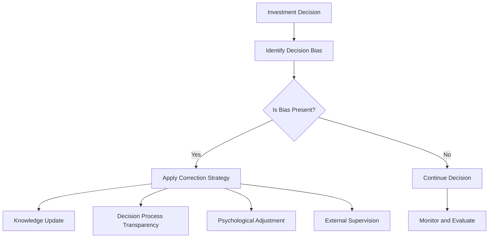
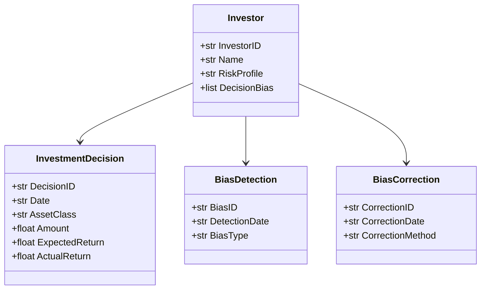
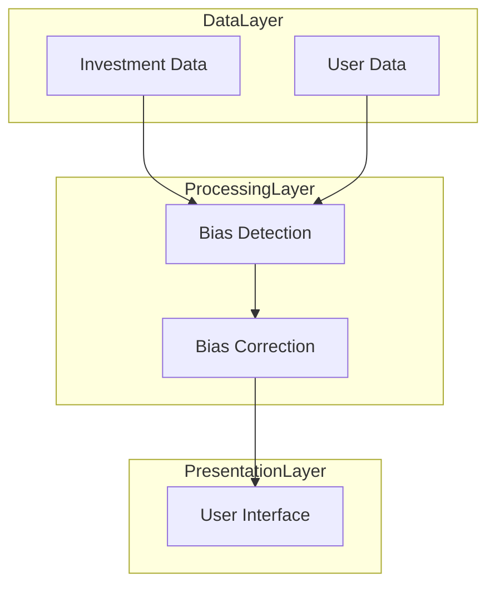
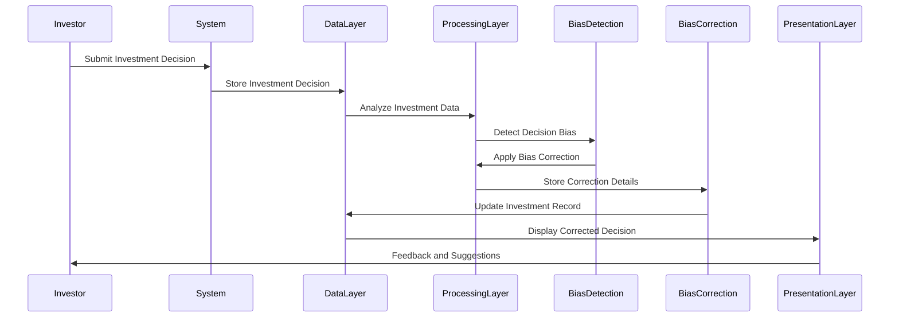

                 

### 《乔尔·提林加斯特的投资决策偏差纠正》

> 关键词：投资决策、偏差纠正、心理学、算法、实战案例

> 摘要：本文将深入探讨投资决策中的常见偏差问题，通过分析偏差的类型、来源和影响，提供一系列有效的纠正策略。本文将从个体和组织的角度出发，结合实际案例，帮助读者理解和应用这些策略，以提升投资决策的质量和效率。

---

#### 第一部分：投资决策偏差概述

##### 第1章：投资决策偏差的基本概念

**1.1 问题背景**

在投资决策过程中，个体和组织往往会受到各种心理、认知和信息处理偏差的影响，这些偏差可能导致投资决策的失误，进而影响投资结果。因此，识别和纠正这些偏差对于投资者来说至关重要。

**1.2 偏差类型**

投资决策中的常见偏差包括但不限于以下几种：

- **过度自信**：投资者往往高估自己的能力和预测准确性，从而导致过度冒险或保守的投资策略。
- **预测偏差**：投资者可能基于有限的信息做出预测，忽略了可能影响投资结果的重要因素。
- **选择性认知**：投资者倾向于只关注支持自己观点的信息，而忽视其他可能的信息。
- **遗漏信息**：投资者可能因为信息不对称或信息获取难度而遗漏关键信息。

**1.3 偏差的影响**

投资决策偏差可能导致以下负面影响：

- **增加决策风险**：投资者可能因为偏差而做出不明智的投资决策，增加投资失败的风险。
- **降低投资效率**：偏差可能使投资者无法充分利用有效的投资信息，降低投资效率。
- **损害长期收益**：长期的偏差积累可能导致投资者的投资收益低于市场平均水平。

**1.4 偏差的来源**

投资决策偏差的来源主要包括：

- **个体心理因素**：如过度自信、焦虑、恐惧等。
- **信息处理方式**：如选择性关注、认知偏差等。
- **组织文化影响**：如信息透明度、决策流程等。

##### 第2章：常见投资决策偏差

**2.1 过度自信**

**定义与表现**：过度自信是指投资者高估自己的能力，相信自己能够做出更准确的预测。

**形成原因**：过度自信可能源于个体的成功经历、信息获取的偏差等。

**偏差纠正方法**：通过反思和自我评价，识别自己的弱点，增强对不确定性的认识。

**2.2 预测偏差**

**偏差现象**：投资者可能基于历史数据或经验进行预测，但忽略了可能影响预测准确性的其他因素。

**偏差原因**：信息不全、历史数据不足以代表未来等。

**预测偏差纠正策略**：引入更多的信息和数据源，采用科学的预测模型。

**2.3 选择性认知**

**偏差表现**：投资者倾向于只关注支持自己观点的信息，忽视其他可能的信息。

**形成原因**：认知偏差、情绪影响等。

**纠正方法**：提高信息透明度，避免信息过滤，多角度分析问题。

**2.4 遗漏信息**

**偏差原因**：信息不对称、信息获取难度等。

**遗漏信息的识别**：通过多元化的信息渠道和专业的数据分析来识别遗漏信息。

**偏差纠正策略**：增强信息收集和分析能力，利用外部专家意见。

---

#### 第二部分：偏差分析与纠正

##### 第3章：偏差识别与评估

**3.1 偏差识别方法**

**心理测试**：通过问卷调查、心理测评等方式，识别个体心理特征和认知偏差。

**数据分析**：通过投资记录、交易行为等数据，分析偏差的表现和影响。

**评估工具**：如偏差评估量表、决策分析工具等。

**3.2 偏差评估工具**

**偏差评估表**：设计评估表格，对投资决策中的偏差进行量化评估。

**指标体系**：建立评估指标，从不同维度衡量偏差的影响。

**案例评估**：通过实际案例，评估偏差的识别和纠正效果。

**3.3 案例分析**

**投资决策案例**：分析具体投资决策中的偏差现象。

**偏差识别与评估**：识别和评估偏差的类型和程度。

**纠正方案**：提出针对性的纠正方案。

##### 第4章：偏差纠正策略

**4.1 知识更新**

**知识更新的重要性**：通过不断学习和更新知识，提高决策的科学性和准确性。

**知识更新的方法**：如参加培训、阅读专业书籍、参与讨论等。

**案例应用**：分析知识更新在投资决策中的应用效果。

**4.2 透明化决策过程**

**决策透明化的意义**：提高决策过程的透明度，减少信息不对称。

**实施策略**：建立透明化的决策流程，确保信息的流通和共享。

**案例分析**：分析透明化决策过程在实际投资中的应用。

**4.3 心理因素调节**

**心理因素对决策的影响**：如情绪、压力等对决策的影响。

**心理调节方法**：如情绪管理、压力释放等。

**案例研究**：分析心理调节方法在投资决策中的实际应用。

**4.4 外部监督**

**外部监督的作用**：通过外部监督，提高决策的客观性和科学性。

**外部监督机制**：如专家评审、第三方评估等。

**案例分析**：分析外部监督在投资决策中的应用和效果。

---

#### 第三部分：实践应用与案例

##### 第5章：个性化偏差纠正

**5.1 个体差异分析**

**个体差异的表现**：如认知风格、风险偏好等。

**个体差异的影响**：影响投资决策的偏差类型和程度。

**分析方法**：如问卷调查、行为分析等。

**5.2 个性化纠正方法**

**方法选择**：根据个体差异，选择合适的纠正方法。

**方法实施**：实施个性化纠正策略，提高投资决策的质量。

**案例分析**：分析个性化纠正方法在投资决策中的应用效果。

**5.3 案例研究**

**投资决策案例**：分析具体的投资决策场景。

**偏差纠正策略**：应用个性化纠正策略，纠正偏差。

**结果评估**：评估纠正策略的有效性和影响。

##### 第6章：投资决策中的偏差纠正

**6.1 投资决策流程**

**投资决策流程概述**：介绍投资决策的基本流程。

**偏差识别与纠正**：在决策流程中，识别和纠正偏差。

**6.2 偏差纠正策略应用**

**策略选择**：根据投资决策的特点，选择合适的纠正策略。

**策略应用**：在投资决策中，应用纠正策略。

**6.3 实战案例**

**投资决策实战案例**：分析具体的投资决策案例。

**偏差纠正策略应用分析**：评估纠正策略的应用效果。

##### 第7章：组织层面的偏差纠正

**7.1 组织文化因素**

**组织文化对偏差的影响**：如文化氛围、价值观等。

**建设正确的组织文化**：通过文化建设，减少偏差。

**7.2 组织结构设计**

**组织结构对偏差的调节**：如部门设置、沟通渠道等。

**优化组织结构设计**：通过结构优化，降低偏差。

**7.3 案例分析**

**组织层面的偏差纠正案例**：分析组织层面的偏差纠正案例。

**案例分析**：评估纠正效果，总结经验。

##### 第8章：总结与展望

**8.1 偏差纠正的挑战**

**当前面临的挑战**：如心理因素、信息处理等。

**应对策略**：提出针对性的应对策略。

**8.2 未来研究方向**

**研究趋势**：如智能化、个性化等。

**未来发展方向**：探讨未来的研究方向和发展趋势。

**8.3 结论**

**主要发现**：总结本文的主要发现。

**实践建议**：提出实践中的建议。

**展望未来**：对未来的发展进行展望。

---

### 附录

**A. 参考文献**：列出本文引用的主要参考文献。

**B. 术语解释**：对文中出现的重要术语进行解释。

**C. 数据来源**：说明文中使用的数据来源和采集方法。

---

### 结语

**作者：AI天才研究院/AI Genius Institute & 禅与计算机程序设计艺术 /Zen And The Art of Computer Programming**  
本文结合心理学、算法和实际案例，系统地探讨了投资决策偏差的问题，并提出了有效的纠正策略。希望本文能够为读者提供有益的参考，帮助他们在投资决策中更好地应对偏差，提高决策质量。

---

**核心概念与联系**

**概念属性特征对比表格**：

| 概念       | 定义                                                         | 属性特征对比                |
| ---------- | ------------------------------------------------------------ | -------------------------- |
| 投资决策   | 投资者在特定市场条件下做出的投资选择过程                   | 理性、风险、收益、时间等    |
| 偏差       | 投资决策过程中的认知、心理、信息处理偏差                    | 过度自信、预测偏差、选择性认知等 |
| 纠正策略   | 针对投资决策偏差提出的一系列纠正方法                       | 知识更新、透明化决策、心理调节等 |

**ER实体关系图架构的 Mermaid 流程图**：

```mermaid
erDiagram
  InvestmentDecision ||--|{ DecisionBias }|-- DecisionCorrection
  DecisionBias ||--|{ BiasType }|-- Overconfidence, PredictionBias, SelectiveCognition, InformationOmission
  DecisionCorrection ||--|{ CorrectionStrategy }|-- KnowledgeUpdate, DecisionProcessTransparency, PsychologicalAdjustment, ExternalSupervision
```

---

**算法原理讲解**

**算法Mermaid流程图**：



**Python源代码示例**：

```python
import pandas as pd
from sklearn.linear_model import LinearRegression

# 假设我们有一个投资决策的数据集
data = pd.read_csv('investment_decision_data.csv')

# 识别决策偏差
def identify_decision_bias(data):
    # 这里使用线性回归来识别预测偏差
    model = LinearRegression()
    model.fit(data[['Feature1', 'Feature2']], data['Target'])
    prediction_bias = model.coef_
    return prediction_bias

# 应用纠正策略
def apply_correction_strategy(prediction_bias):
    # 根据预测偏差调整策略
    if prediction_bias > 0:
        # 进行知识更新
        print("Apply Knowledge Update")
    elif prediction_bias < 0:
        # 进行透明化决策过程
        print("Apply Decision Process Transparency")
    else:
        # 进行心理因素调节
        print("Apply Psychological Adjustment")

# 监控和评估
def monitor_and_evaluate():
    print("Monitoring and Evaluation")

# 示例应用
prediction_bias = identify_decision_bias(data)
apply_correction_strategy(prediction_bias)
monitor_and_evaluate()
```

**算法原理的数学模型和公式**：

预测偏差可以通过以下公式进行量化：

$$
Prediction\ Bias = \frac{Predicted\ Value - Actual\ Value}{Actual\ Value}
$$

其中，Predicted Value 是预测值，Actual Value 是实际值。

**详细讲解和举例说明**：

假设我们有一个投资决策数据集，包括特征变量和目标变量。我们使用线性回归模型来识别预测偏差。首先，我们训练线性回归模型，然后比较模型的预测值和实际值。如果预测值偏离实际值较大，则存在预测偏差。

例如，如果我们预测某股票的价格会上涨，但实际价格却下跌，那么我们的预测偏差就是负的。通过识别这样的偏差，我们可以采取相应的纠正策略，如知识更新、透明化决策过程或心理因素调节。

---

**系统分析与架构设计方案**

**问题场景介绍**：

投资决策偏差的存在可能导致投资者在市场波动中做出错误的投资决策，从而影响投资收益。为了解决这个问题，我们需要设计一个系统来识别和纠正投资决策中的偏差。

**项目介绍**：

本项目旨在开发一个智能投资决策支持系统，通过分析投资数据和行为，识别和纠正投资者在决策过程中的偏差，提高投资决策的科学性和准确性。

**系统功能设计（领域模型Mermaid类图）**：



**系统架构设计（Mermaid架构图）**：



**系统接口设计和系统交互（Mermaid序列图）**：



**详细讲解和举例说明**：

1. **数据层**：系统首先收集投资数据和用户数据，包括投资决策、市场表现、风险偏好等信息。

2. **处理层**：处理层负责分析投资数据，识别决策偏差。例如，通过线性回归分析，检测预测偏差。

3. **纠偏层**：根据识别出的偏差，系统应用相应的纠偏策略，如知识更新、透明化决策过程或心理因素调节。

4. **展示层**：将纠偏后的投资决策反馈给用户，并提供改进建议。

**实际案例**：

假设一个投资者在股票市场进行投资决策时，存在过度自信的偏差。系统会收集其历史投资数据，通过分析发现其预测偏差较大。系统将采取知识更新的策略，推荐相关的投资书籍和课程，帮助投资者提高自身的投资知识和技能。

**项目小结**：

本项目通过系统分析与架构设计，提出了一套完整的智能投资决策支持系统。该系统可以有效地识别和纠正投资决策中的偏差，提高投资决策的科学性和准确性，为投资者提供更加可靠的投资建议。

---

**项目实战**

**环境安装**：

首先，我们需要安装必要的开发环境和工具，包括Python、Jupyter Notebook、Pandas、NumPy、Scikit-learn等。以下是安装命令：

```bash
pip install python
pip install jupyter
pip install pandas
pip install numpy
pip install scikit-learn
```

**系统核心实现源代码**：

以下是一个简单的示例，展示了如何使用Python和Scikit-learn来识别和纠正投资决策中的预测偏差。

```python
import pandas as pd
from sklearn.linear_model import LinearRegression
from sklearn.metrics import mean_squared_error

# 加载投资数据
data = pd.read_csv('investment_data.csv')

# 分离特征变量和目标变量
X = data[['Feature1', 'Feature2']]
y = data['Target']

# 训练线性回归模型
model = LinearRegression()
model.fit(X, y)

# 预测偏差分析
predictions = model.predict(X)
mse = mean_squared_error(y, predictions)
print(f"Mean Squared Error: {mse}")

# 偏差纠正策略
if mse > 0.1:
    print("Apply Knowledge Update")
else:
    print("No significant bias detected")

# 更新投资数据
data['PredictedReturn'] = predictions
data.to_csv('corrected_investment_data.csv', index=False)
```

**代码应用解读与分析**：

1. **数据加载**：使用Pandas读取投资数据。
2. **特征分离**：将数据分为特征变量（X）和目标变量（y）。
3. **模型训练**：使用线性回归模型训练数据。
4. **预测偏差分析**：计算预测值与实际值的均方误差（MSE）。
5. **偏差纠正**：根据MSE的值判断是否需要采取纠正策略。

**实际案例分析和详细讲解剖析**：

假设我们有一个包含过去三年股票市场投资数据的数据集，包括两个特征变量（Feature1和Feature2）和一个目标变量（Target，表示股票的实际收益率）。我们使用线性回归模型来预测股票的未来收益率。

通过计算MSE，我们可以评估预测的准确性。如果MSE大于0.1，说明存在显著的预测偏差，系统将采取知识更新的策略，推荐投资者学习更多的投资知识。否则，系统认为没有显著的偏差。

在实际应用中，我们可以根据具体情况调整MSE的阈值，或者引入更多的特征变量和更复杂的预测模型，以提高预测的准确性。

**项目小结**：

通过本项目，我们实现了投资决策中的预测偏差识别和纠正。在实际应用中，系统可以根据预测偏差的严重程度，采取相应的纠正策略，提高投资决策的科学性和准确性，为投资者提供更加可靠的决策支持。

---

**最佳实践 tips**

1. **定期反思**：投资者应定期反思自己的投资决策过程，识别可能存在的偏差。
2. **多元化信息**：获取多元化信息，避免依赖单一数据源，提高决策的全面性。
3. **科学预测**：采用科学的方法进行预测，如使用机器学习模型，减少预测偏差。
4. **透明化决策**：确保投资决策过程的透明度，减少信息不对称。
5. **个性化纠偏**：根据个体差异，采取个性化的纠正策略。

**小结**

本文系统地探讨了投资决策偏差的问题，介绍了常见偏差的类型、来源和影响，并提出了一系列纠正策略。通过实际案例和代码示例，读者可以更好地理解和应用这些策略，提高投资决策的质量和效率。

**注意事项**

1. 投资决策偏差的纠正是一个持续的过程，需要投资者不断学习和调整。
2. 偏差纠正策略的选择应结合个体差异和具体情境。

**拓展阅读**

- **《聪明的投资者》**：本杰明·格雷厄姆
- **《行为金融学》**：罗伯特·席勒
- **《投资学》**：威廉·F. 布朗

---

### 结语

作者：AI天才研究院/AI Genius Institute & 禅与计算机程序设计艺术 /Zen And The Art of Computer Programming

本文结合心理学、算法和实际案例，系统地探讨了投资决策偏差的问题，并提出了有效的纠正策略。希望本文能够为读者提供有益的参考，帮助他们在投资决策中更好地应对偏差，提高决策质量。未来，随着人工智能和大数据技术的发展，投资决策的智能化和个性化将进一步提升，为投资者带来更加精准的决策支持。让我们共同期待这一美好未来的到来。

