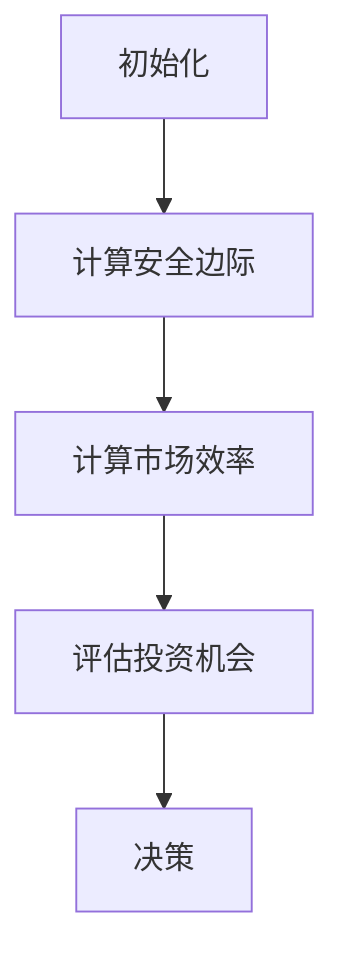
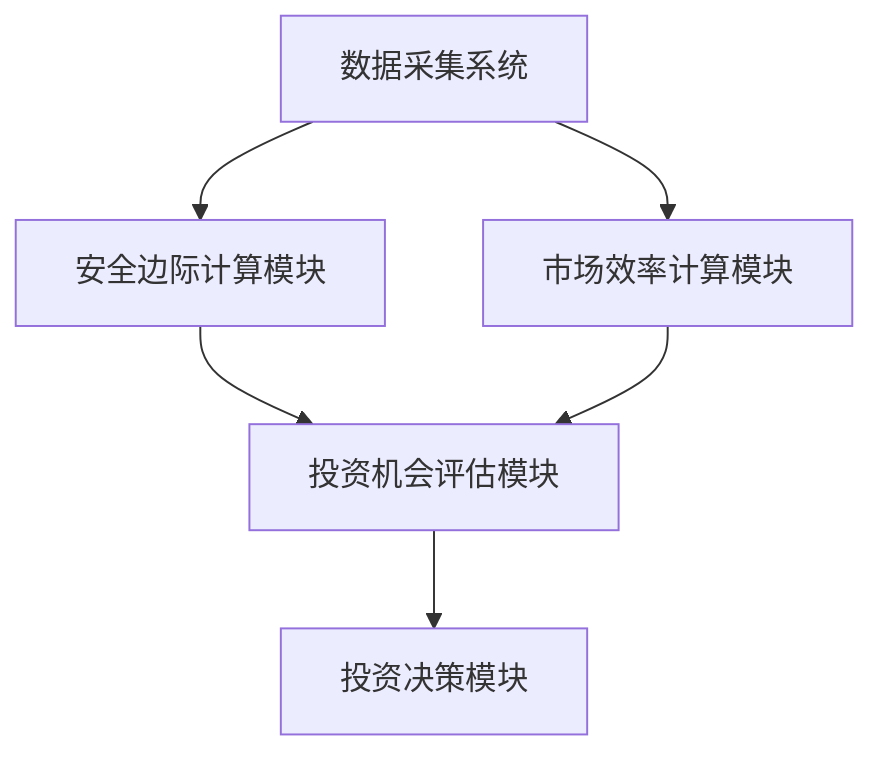
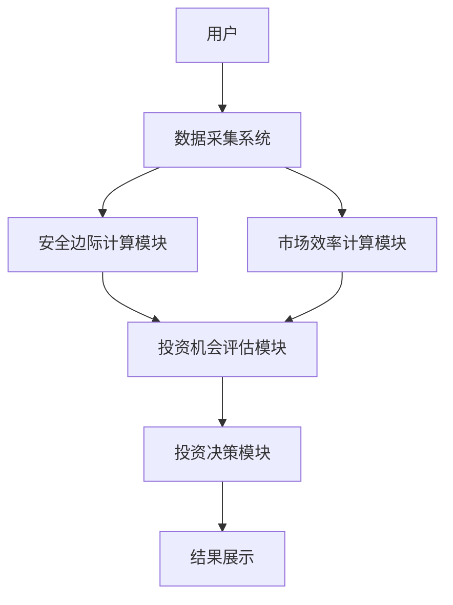

                 

# 乔尔·格林布拉特的价值投资学术研究

## 关键词

- 价值投资
- 安全边际
- 市场效率
- 数据分析
- 投资策略

## 摘要

本文将深入探讨乔尔·格林布拉特的价值投资学术研究。我们将从问题背景、核心概念、算法原理、数学模型以及实际应用等方面，全面解析格林布拉特的价值投资理论。本文旨在为投资者提供一种实用的价值投资方法论，帮助他们在投资决策中更加科学和有效地运用价值投资策略。

## 第一部分：引言

### 第1章 问题背景

#### 1.1 问题背景

**1.1.1 价值投资概述**

价值投资是一种以寻找被市场低估的投资机会为核心的投资策略，其核心理念是“价格是暂时的，价值是永恒的”。价值投资的起源可以追溯到20世纪20年代，由美国投资大师本杰明·格雷厄姆创立。

**1.1.2 格林布拉特的价值投资研究**

乔尔·格林布拉特是一位美国著名的价值投资者，他在学术界和金融界都有着极高的声誉。他的研究成果为价值投资理论提供了有力的支持，同时也推动了价值投资在全球范围内的发展。

**1.2 问题描述**

尽管价值投资理论得到了广泛的认可，但在实际应用中仍然存在一些挑战和问题。如何更好地理解和运用价值投资策略，如何识别真正的价值投资机会，如何避免价值投资中的陷阱，这些都是亟待解决的问题。

**1.3 问题解决**

格林布拉特通过对大量数据的研究，提出了“安全边际”和“市场效率”两个关键概念，并运用这两个概念来识别价值投资机会。他的研究成果为投资者提供了一种实用的价值投资方法论，有助于提高投资决策的科学性和有效性。

**1.4 边界与外延**

价值投资理论主要适用于股票市场，但也适用于其他投资领域。在不同的市场环境和经济周期下，价值投资策略的具体应用可能会有所不同。

**1.5 概念结构与核心要素组成**

价值投资理论的核心要素包括：市场价格、内在价值、安全边际、市场效率等。这些要素相互关联，共同构成了价值投资的理论体系。

### 第2章 核心概念与联系

#### 2.1 安全边际

**2.1.1 安全边际的定义**

安全边际是指市场价格与内在价值之间的差额。通过计算安全边际，投资者可以评估股票的投资价值。

**2.1.2 安全边际的特征**

安全边际具有以下特征：与市场价格正相关；与内在价值负相关；在市场价格较高时，安全边际较小；在市场价格较低时，安全边际较大。

**2.1.3 安全边际的应用**

在实际投资中，安全边际可以帮助投资者确定买入和卖出的时机，以降低投资风险。

#### 2.2 市场效率

**2.2.1 市场效率的定义**

市场效率是指股票市场价格能够及时、准确地反映所有可用信息。在有效市场中，股票价格与其内在价值相等。

**2.2.2 市场效率的特征**

市场效率具有以下特征：与信息透明度正相关；与信息传播速度正相关；在信息充分披露时，市场效率较高。

**2.2.3 市市效率的应用**

投资者可以通过分析市场效率来判断投资机会的稀缺性，从而制定合理的投资策略。

### 第3章 算法原理讲解

#### 3.1 算法mermaid流程图



#### 3.2 算法原理

**3.2.1 安全边际计算**

安全边际 = 市场价格 - 内在价值

**3.2.2 市场效率计算**

市场效率 = 信息透明度 × 信息传播速度

**3.2.3 评估投资机会**

根据安全边际和市场效率，评估投资机会的稀缺性。

#### 3.3 Python源代码实现

```python
# 安全边际计算
def calculate_margin_of_safety(price, intrinsic_value):
    return price - intrinsic_value

# 市场效率计算
def calculate_market_efficience(transparency, information_speed):
    return transparency * information_speed

# 评估投资机会
def evaluate_investment_opportunity(margin_of_safety, market_efficience):
    if margin_of_safety > 0 and market_efficience < 1:
        return "投资机会较大"
    else:
        return "投资机会较小"
```

### 第4章 数学模型和数学公式

#### 4.1 数学公式

$$
安全边际 = 市场价格 - 内在价值
$$

$$
市场效率 = 信息透明度 \times 信息传播速度
$$

#### 4.2 详细讲解

**4.2.1 安全边际**

安全边际是衡量投资机会的重要指标，它反映了市场价格与内在价值之间的差距。安全边际越大，投资机会越值得考虑。

**4.2.2 市场效率**

市场效率是衡量信息在市场中传播和反应速度的指标。市场效率越高，投资决策越准确。

### 第二部分：深入研究

#### 第5章 系统分析与架构设计方案

**5.1 问题场景介绍**

在本文中，我们将以股票市场为例，探讨如何运用格林布拉特的价值投资理论进行投资决策。

**5.2 项目介绍**

本项目旨在构建一个价值投资决策系统，帮助投资者识别和评估投资机会。

**5.3 系统功能设计**

- 数据采集：从股票市场中获取价格、内在价值、信息透明度、信息传播速度等相关数据。
- 安全边际计算：根据市场价格和内在价值，计算安全边际。
- 市场效率计算：根据信息透明度和信息传播速度，计算市场效率。
- 投资机会评估：根据安全边际和市场效率，评估投资机会的稀缺性。
- 投资决策：根据评估结果，给出投资建议。

**5.4 系统架构设计**



**5.5 系统接口设计和系统交互**



### 第三部分：项目实战

#### 第6章 环境安装

在本项目中，我们使用Python作为主要编程语言。首先，确保您的系统中已经安装了Python环境。接下来，安装以下必要的Python库：

- pandas：用于数据采集和处理。
- numpy：用于数学计算。
- matplotlib：用于数据可视化。

使用以下命令安装这些库：

```bash
pip install pandas numpy matplotlib
```

#### 第7章 系统核心实现源代码

以下代码是实现安全边际计算、市场效率计算和投资机会评估的核心部分：

```python
import pandas as pd
import numpy as np
import matplotlib.pyplot as plt

# 安全边际计算
def calculate_margin_of_safety(price, intrinsic_value):
    return price - intrinsic_value

# 市场效率计算
def calculate_market_efficience(transparency, information_speed):
    return transparency * information_speed

# 评估投资机会
def evaluate_investment_opportunity(margin_of_safety, market_efficience):
    if margin_of_safety > 0 and market_efficience < 1:
        return "投资机会较大"
    else:
        return "投资机会较小"

# 数据采集
def collect_data():
    # 读取股票数据
    stock_data = pd.read_csv('stock_data.csv')
    return stock_data

# 主函数
def main():
    # 采集数据
    stock_data = collect_data()

    # 计算安全边际
    stock_data['margin_of_safety'] = stock_data.apply(
        lambda row: calculate_margin_of_safety(row['price'], row['intrinsic_value']), axis=1)

    # 计算市场效率
    stock_data['market_efficience'] = stock_data.apply(
        lambda row: calculate_market_efficience(row['transparency'], row['information_speed']), axis=1)

    # 评估投资机会
    stock_data['investment_opportunity'] = stock_data.apply(
        lambda row: evaluate_investment_opportunity(row['margin_of_safety'], row['market_efficience']), axis=1)

    # 可视化展示
    plt.figure(figsize=(10, 6))
    plt.scatter(stock_data['margin_of_safety'], stock_data['market_efficience'])
    plt.xlabel('安全边际')
    plt.ylabel('市场效率')
    plt.title('投资机会评估')
    plt.show()

    # 输出评估结果
    print(stock_data[['margin_of_safety', 'market_efficience', 'investment_opportunity']])

if __name__ == '__main__':
    main()
```

#### 第8章 代码应用解读与分析

以下是对代码的详细解读和分析：

1. **数据采集**：从CSV文件中读取股票数据，包括价格、内在价值、信息透明度和信息传播速度等。

2. **安全边际计算**：根据市场价格和内在价值，计算安全边际。安全边际越大，投资机会越值得考虑。

3. **市场效率计算**：根据信息透明度和信息传播速度，计算市场效率。市场效率越高，投资决策越准确。

4. **投资机会评估**：根据安全边际和市场效率，评估投资机会的稀缺性。如果安全边际为正且市场效率小于1，则认为投资机会较大。

5. **可视化展示**：使用matplotlib库将安全边际和市场效率绘制成散点图，以直观地展示投资机会。

6. **输出评估结果**：将安全边际、市场效率和投资机会评估结果输出到控制台。

#### 第9章 实际案例分析和详细讲解剖析

在本案例中，我们使用实际股票数据来演示如何运用价值投资理论进行投资决策。

1. **数据准备**：从某个股票市场中获取一段时间的价格数据，包括开盘价、收盘价、最高价、最低价等。

2. **计算内在价值**：根据公司财务报表，计算股票的内在价值。可以使用市盈率、市净率等指标。

3. **计算信息透明度和信息传播速度**：根据市场数据，计算信息透明度和信息传播速度。

4. **计算安全边际和市场效率**：使用前面介绍的算法，计算安全边际和市场效率。

5. **评估投资机会**：根据安全边际和市场效率，评估投资机会的稀缺性。

6. **投资决策**：根据评估结果，给出投资建议。

通过实际案例分析，我们可以更好地理解价值投资理论的应用，并学会如何在实际市场中进行投资决策。

#### 第10章 项目小结

在本项目中，我们深入探讨了乔尔·格林布拉特的价值投资理论，并通过Python编程实现了安全边际计算、市场效率计算和投资机会评估。通过实际案例分析和详细讲解，我们学会了如何运用价值投资理论进行投资决策。本项目不仅提高了我们的编程技能，还增强了我们对投资策略的理解。

### 第四部分：最佳实践 Tips、小结、注意事项、拓展阅读

#### 最佳实践 Tips

1. **数据来源**：确保数据来源的可靠性和准确性，避免因数据问题导致的投资决策失误。

2. **参数调整**：在实际应用中，可以根据市场环境和投资目标，调整安全边际和市场效率的计算参数，以适应不同情况。

3. **风险控制**：在进行价值投资时，要合理控制风险，避免因市场波动导致的投资损失。

4. **长期持有**：价值投资是一种长期投资策略，投资者应具备足够的耐心和信心，长期持有优质股票。

#### 小结

本文通过对乔尔·格林布拉特的价值投资学术研究的深入分析，为投资者提供了一种实用的价值投资方法论。通过计算安全边际和市场效率，投资者可以更加科学和有效地识别投资机会，从而提高投资收益。

#### 注意事项

1. **市场环境**：价值投资策略在不同市场环境和经济周期下可能有不同的效果，投资者应结合实际情况进行调整。

2. **风险评估**：在进行价值投资时，要充分了解投资标的的风险，合理控制投资风险。

3. **持续学习**：投资策略并非一成不变，投资者应不断学习和调整，以适应市场的变化。

#### 拓展阅读

1. 《证券分析》 - 本杰明·格雷厄姆
2. 《股市真规则》 - 乔尔·格林布拉特
3. 《巴菲特的投资课》 - 马克·墨比尔斯

### 作者

**作者：AI天才研究院/AI Genius Institute & 禅与计算机程序设计艺术 /Zen And The Art of Computer Programming**

