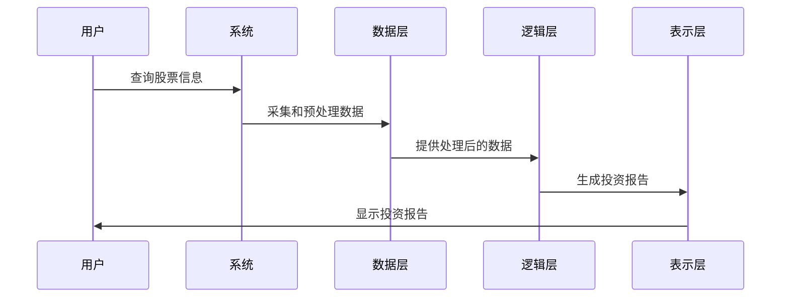
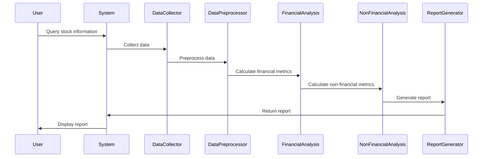

                 

### 引言：价值投资的核心理念

#### 2.1 价值投资的历史背景

价值投资作为现代投资领域的基石，其起源可以追溯到20世纪初。**本杰明·格雷厄姆**被誉为“价值投资之父”，他的投资哲学深刻地影响了后来的投资者。格雷厄姆强调通过深入分析企业的基本面，寻找那些市场价格低于其内在价值的股票，以此来获得长期的资本增值。他提出了“安全边际”的概念，即投资者应该买入那些价格低于其真实价值的股票，以确保即使在市场不确定性下也能获得稳定的投资回报。

随着时代的发展，**乔尔·格林布拉特**通过其开创性的“绿巨人投资策略”将价值投资推向了新的高度。格林布拉特在1990年代初期加入了著名的耶鲁大学基金会，并成功地将其资产组合的年化收益率保持在两位数。他通过一系列数据驱动的分析和严格的选股标准，证明了价值投资策略在现代资本市场中的有效性。

#### 2.2 价值投资的定义与特点

**价值投资**是一种以寻找市场价格低于其内在价值的股票为主要目标的投资策略。其核心原则包括：

- **安全边际原则**：投资者应当寻找那些价格低于其真实价值的股票，以防止投资风险。
- **本质价值原则**：股票的价值不仅仅取决于其当前的股价，更应该关注其未来的现金流量。
- **长期投资原则**：价值投资强调长期持有优质股票，以获取稳定的资本增值。

价值投资与**成长投资**存在显著差异。成长投资注重企业的增长潜力，倾向于投资于快速发展的公司。而价值投资则更注重企业的基本面，追求低估值的高质量股票。此外，价值投资通常涉及更多的研究和分析，以确定股票的真实价值。

#### 2.3 价值投资的适用范围

价值投资不仅适用于传统的股票市场，也适用于其他投资领域，如房地产、债券等。对于长期投资者而言，价值投资是一种理想的策略。它能够帮助投资者在市场波动中保持冷静，专注于长期投资回报。

在不同市场环境下，价值投资策略也有所不同。在**景气周期**中，投资者应寻找那些在经济繁荣时期能够持续增长的股票。而在**衰退周期**中，投资者则应寻找那些在经济不景气时具有稳健表现的股票。

#### 2.4 价值投资的成功案例分析

**绿巨人投资公司**是价值投资成功的典型案例。在格林布拉特的领导下，绿巨人投资策略通过深入的数据分析和严格的选股标准，取得了卓越的投资业绩。格林布拉特的投资案例，如对**可口可乐公司**的投资，展示了价值投资在实践中的应用和成效。

#### 2.5 价值投资的心理挑战

价值投资不仅仅是技术层面的策略，它也涉及到投资者的心理挑战。投资者需要克服市场波动带来的恐慌和贪婪，保持冷静和理性。同时，投资者也容易陷入心理误区，如过度自信或缺乏耐心。通过正确的心理调整，投资者可以更好地执行价值投资策略。

#### 2.6 价值投资在当今市场的应用

在当今市场环境中，价值投资仍然具有重要的应用价值。随着技术的进步，数据分析和量化投资在价值投资中的应用日益广泛。投资者可以利用大数据和人工智能技术，更精确地评估股票的价值。

#### 2.7 价值投资的未来发展趋势

未来，价值投资将继续发展，并可能融合更多的技术元素。全球化背景下的市场环境也为价值投资提供了新的机遇和挑战。投资者需要不断学习和适应，以应对不断变化的市场环境。

#### 2.8 本章小结

本章介绍了价值投资的核心理念、历史背景、适用范围以及成功案例分析。通过了解价值投资的本质和特点，投资者可以更好地制定投资策略，实现长期稳定的投资回报。

### 关键词

- 价值投资
- 本杰明·格雷厄姆
- 乔尔·格林布拉特
- 安全边际
- 长期投资
- 数据驱动分析

### 摘要

本文旨在探讨价值投资的核心理念、历史背景、适用范围以及成功案例分析。通过深入分析本杰明·格雷厄姆和乔尔·格林布拉特的投资哲学和实践，本文揭示了价值投资在当今市场中的重要性。同时，本文还探讨了价值投资在心理挑战、数据应用以及未来发展趋势方面的应用和挑战。本文的关键词包括价值投资、本杰明·格雷厄姆、乔尔·格林布拉特、安全边际、长期投资、数据驱动分析。文章的核心内容和主题思想是，通过理解价值投资的本质和原则，投资者可以制定有效的投资策略，实现长期稳定的投资回报。### 第一章：价值投资的本质与理论基础

#### 1.1 价值投资的起源与哲学基础

**价值投资**的起源可以追溯到20世纪早期的美国。当时，**本杰明·格雷厄姆**（Benjamin Graham）通过其独特的投资理念和系统的方法，奠定了价值投资的理论基础。格雷厄姆认为，股票的价值应该基于其未来现金流的折现值，而市场价格往往不能准确反映股票的真实价值。因此，投资者应通过深入分析企业的基本面，寻找市场价格低于其内在价值的股票进行投资。

**格雷厄姆的哲学基础**主要包括以下几个关键原则：

1. **安全边际**：投资者应当寻找市场价格低于其内在价值的股票，以保持投资的安全性。
2. **保守的估值方法**：格雷厄姆主张使用折现现金流模型（DCF）和其他保守的估值方法，如股息贴现模型（DDM）。
3. **风险管理**：通过分散投资来降低风险，同时重视企业的财务稳健性。

**价值投资与古典投资理论的对比**：

- **古典投资理论**侧重于市场的平均收益和波动性，强调市场效率。
- **价值投资**则强调企业的基本面，认为市场价格常常偏离股票的真实价值，从而提供投资机会。

#### 1.2 价值投资的核心原则

**价值投资的核心原则**主要包括以下几点：

1. **安全边际原则**：投资者应当寻找市场价格低于其内在价值的股票。安全边际可以理解为股票的市场价格与内在价值之间的差额，这为投资者提供了应对市场波动和不确定性的一种保障。
2. **本质价值原则**：股票的价值应该基于其未来现金流的折现值，而非市场价格的波动。投资者需要通过深入分析企业的基本面，评估其真实价值。
3. **长期投资原则**：价值投资强调长期持有优质股票，以获取稳定的资本增值。短期市场波动不应影响投资者的长期投资策略。

#### 1.3 价值投资的关键概念

价值投资涉及多个关键概念，以下是一些重要的概念及其含义：

1. **市场价值与真实价值**：
    - **市场价值**：股票在市场上的交易价格。
    - **真实价值**：股票基于其未来现金流的折现值。
    - **安全边际**：真实价值与市场价值之间的差额。

2. **折扣率与市盈率**：
    - **折扣率**：用于折现未来现金流的一个比率，反映了投资者对风险的偏好。
    - **市盈率（PE）**：股票价格与每股收益的比率，用于衡量股票的估值水平。

3. **折现现金流模型（DCF）**：
    - **DCF**：一种估值方法，通过折现未来现金流来计算股票的内在价值。

#### 1.4 价值投资的策略与方法

价值投资有多个具体的策略和方法，以下是几种常见的方法：

1. **本杰明·格雷厄姆的烟蒂投资法**：
    - **烟蒂投资法**：寻找那些股价低迷、财务状况不佳，但具有潜在翻身机会的股票。这种方法强调低价购买和高风险承受能力。

2. **菲利普·费舍尔的成长投资法**：
    - **成长投资法**：寻找那些具有卓越增长潜力和强大竞争能力的公司。这种方法强调对行业和市场趋势的深入分析。

3. **绿巨人投资公司的策略解析**：
    - **绿巨人投资公司**采用了一种数据驱动的投资策略，通过深入的数据分析来寻找低估的股票。这种方法结合了格雷厄姆和费舍尔的投资理念，并在实践中取得了显著的成功。

#### 1.5 价值投资与传统投资理念的差异

价值投资与传统投资理念存在显著差异，主要体现在以下几个方面：

1. **投资对象的选择**：
    - **价值投资**侧重于寻找低估的股票，强调基本面分析。
    - **传统投资**（如成长投资）则侧重于寻找具有高速增长潜力的股票，强调市场趋势分析。

2. **估值方法**：
    - **价值投资**采用保守的估值方法，如DCF和股息贴现模型（DDM）。
    - **传统投资**则更倾向于使用市盈率、市净率等市场流行指标。

3. **投资周期**：
    - **价值投资**强调长期投资，注重企业基本面的长期趋势。
    - **传统投资**则可能更倾向于短期交易，追求市场波动的收益。

#### 1.6 价值投资的成功案例分析

价值投资的成功案例数不胜数，以下是其中两个典型案例：

1. **绿巨人投资公司的成功之道**：
    - **绿巨人投资公司**在格林布拉特的领导下，通过严格的数据分析和选股标准，取得了卓越的投资业绩。该公司在多个投资周期中都实现了超过市场平均水平的收益率。

2. **雪球投资平台的案例分析**：
    - **雪球投资平台**利用价值投资理念，为用户提供了一个数据驱动的投资工具。通过分析大量数据，平台帮助用户寻找低估的股票，实现了较高的投资回报。

#### 1.7 价值投资在不同市场环境下的表现

价值投资在不同市场环境下的表现各有不同：

1. **景气周期**：
    - 在景气周期中，市场整体向上，投资者信心增强。价值投资在景气周期中的表现相对稳定，投资者应寻找那些在经济繁荣时期能够持续增长的股票。

2. **衰退周期**：
    - 在衰退周期中，市场整体向下，投资者信心受到打击。价值投资在衰退周期中具有明显的优势，投资者应寻找那些在经济不景气时具有稳健表现的股票。

#### 1.8 价值投资的局限性

虽然价值投资具有很多优点，但它也存在一些局限性：

1. **适用边界**：
    - 价值投资更适合长期投资者，对那些需要短期回报的投资者可能不太适用。
    - 价值投资在某些市场环境中可能表现不佳，如市场高度投机的市场。

2. **风险管理**：
    - 价值投资强调安全边际，但也不能完全消除投资风险。
    - 投资者需要根据市场环境和企业特点，灵活调整投资策略。

#### 1.9 价值投资的现代实践

现代实践中的价值投资与传统的价值投资有所不同，主要体现在以下几个方面：

1. **数据驱动**：
    - 现代价值投资更加强调数据分析和量化模型的应用。
    - 投资者可以利用大数据和人工智能技术，更精确地评估股票的价值。

2. **技术进步**：
    - 技术进步为价值投资提供了更多的工具和方法，如量化投资、算法交易等。

3. **新兴市场**：
    - 在新兴市场中，价值投资也面临着新的挑战和机遇。
    - 投资者需要深入了解新兴市场的特点，以制定相应的投资策略。

#### 1.10 价值投资的理论发展与创新

价值投资的理论在不断发展与创新，主要体现在以下几个方面：

1. **新兴市场中的价值投资理论**：
    - 在新兴市场中，价值投资面临着新的挑战和机遇。
    - 投资者需要结合新兴市场的特点，发展适应性的投资理论。

2. **社会责任投资**：
    - 价值投资不仅关注企业的财务表现，也关注企业的社会责任。
    - 社会责任投资成为一种新的价值投资趋势。

#### 1.11 本章小结

本章从多个角度介绍了价值投资的本质与理论基础，包括其起源、哲学基础、核心原则、关键概念、策略方法、与传统投资的差异、成功案例以及在不同市场环境下的表现。通过这些内容，读者可以更深入地理解价值投资的本质，为后续章节的学习和实践打下坚实的基础。### 第二章：价值投资的指标分析

#### 2.1 价值投资的财务指标分析

财务指标分析是价值投资中至关重要的一环，它帮助投资者评估企业的财务健康状况和投资潜力。以下是一些常见的财务指标及其分析：

1. **市净率（PB）与市盈率（PE）**：

   - **市净率（PB）**：市净率是股票价格与每股净资产的比率，用于衡量股票的估值水平。PB较低通常意味着股票被低估。
   
   - **市盈率（PE）**：市盈率是股票价格与每股收益的比率，用于评估股票的估值水平。PE较低通常意味着股票被低估。
   
2. **市盈率到增长率比率（PEG）**：

   - **PEG**：市盈率到增长率比率是市盈率与公司预期年增长率的比率，用于评估股票的估值是否合理。PEG接近1通常意味着股票估值合理。
   
3. **企业价值与利息、税收、折旧和摊销前利润比率（EV/EBITDA）**：

   - **EV/EBITDA**：企业价值与利息、税收、折旧和摊销前利润比率是用于评估企业整体价值的财务指标。EV/EBITDA较低通常意味着企业被低估。

#### 2.2 价值投资的非财务指标分析

除了财务指标，价值投资还需要考虑企业的非财务指标，这些指标能够提供关于企业整体健康和竞争力的额外信息。以下是一些重要的非财务指标及其分析：

1. **企业治理与企业文化**：

   - **企业治理**：良好的企业治理能够提高企业的透明度和责任感，降低投资风险。
   - **企业文化**：积极的企业文化能够促进企业的创新和发展，提高企业的长期竞争力。

2. **品牌价值与市场份额**：

   - **品牌价值**：品牌价值是企业无形资产的重要部分，能够提高企业的市场竞争力。
   - **市场份额**：市场份额是衡量企业市场地位的重要指标，市场份额较大的企业通常具有较强的竞争力。

3. **管理层的素质与稳定性**：

   - **管理层的素质**：高素质的管理层能够有效管理企业，实现长期增长。
   - **管理层的稳定性**：管理层的不稳定性可能导致企业战略的变化和投资风险的增加。

#### 2.3 价值投资的指标应用与案例分析

在应用价值投资指标时，投资者需要结合具体的行业和市场环境进行分析。以下是一个行业和成长企业的指标应用及案例分析：

1. **不同行业下的指标应用**：

   - 在不同行业中，财务和非财务指标的重要性可能有所不同。例如，在高科技行业，品牌价值和技术创新能力可能比财务指标更为重要。
   - 投资者需要根据行业特点，选择合适的指标进行分析。

2. **成长企业与成熟企业的指标比较**：

   - 成长企业通常具有较高的市盈率和市净率，因为投资者预期其未来增长潜力。
   - 成熟企业则通常具有较低的市盈率和市净率，因为其增长潜力较低，但财务状况更为稳健。
   - 投资者需要根据企业的成长阶段，选择合适的指标进行比较。

3. **绿巨人投资公司的指标分析**：

   - **绿巨人投资公司**在投资决策中，综合考虑了财务和非财务指标，通过数据分析和量化模型，找到了被低估的股票。
   - 例如，通过对市净率和市盈率的综合分析，绿巨人投资公司发现了一支被低估的银行股票，并取得了显著的投资回报。

#### 2.4 价值投资指标的综合评估

为了更全面地评估企业的投资潜力，投资者需要使用多种指标进行综合评估。以下是一些综合评估的方法：

1. **多指标综合分析**：

   - 投资者需要使用多种财务和非财务指标，从不同角度分析企业的投资价值。
   - 例如，结合市净率、市盈率、品牌价值、市场份额等多个指标，进行综合分析。

2. **指标权重分配**：

   - 投资者需要根据行业特点和企业特性，为不同指标分配不同的权重。
   - 例如，在高科技行业，品牌价值和创新能力可能被赋予更高的权重。

3. **指标变化趋势分析**：

   - 投资者需要关注指标的变化趋势，分析企业的发展态势。
   - 例如，市净率和市盈率的上升趋势可能表明企业价值的提升。

#### 2.5 价值投资指标的选择与优化

在价值投资中，指标的选择和优化至关重要。以下是一些选择和优化的方法：

1. **指标选择的依据**：

   - 投资者需要根据投资策略和目标，选择合适的指标。
   - 例如，长期投资者可能更关注企业的财务稳健性，如市净率、市盈率等。
   - 短期投资者可能更关注企业的市场表现，如品牌价值、市场份额等。

2. **指标的优化策略**：

   - 投资者可以通过优化指标的计算方法、数据来源和频率，提高指标的有效性。
   - 例如，采用最新的财务数据和市场信息，调整市净率和市盈率的计算方法。

3. **技术分析在价值投资中的应用**：

   - 技术分析可以与价值投资指标相结合，提供更全面的投资决策支持。
   - 例如，通过技术分析，投资者可以识别市场趋势和股票的买卖点。

#### 2.6 价值投资指标分析的工具与方法

在现代投资环境中，数据分析和量化工具在价值投资指标分析中发挥着重要作用。以下是一些常用的工具和方法：

1. **数据分析软件的应用**：

   - 如Excel、R、Python等，投资者可以使用这些工具进行数据处理和指标分析。
   - 例如，使用Python的pandas库，可以快速进行数据清洗、计算和分析。

2. **数据可视化工具**：

   - 如Matplotlib、Seaborn等，投资者可以使用这些工具将分析结果可视化，更直观地展示数据趋势。
   - 例如，使用Matplotlib库，可以绘制市净率、市盈率的趋势图。

3. **量化投资模型**：

   - 如因子模型、风险平价模型等，投资者可以使用这些模型进行更深入的投资分析。
   - 例如，使用因子模型，可以识别市场中的不同投资因子，并制定相应的投资策略。

通过以上指标分析的工具和方法，投资者可以更精确地评估企业的投资价值，制定更有效的投资策略。价值投资指标的综合评估、选择与优化，以及技术分析的应用，为投资者提供了全面的决策支持，有助于实现长期稳定的投资回报。

### 2.7 价值投资指标分析的具体示例

为了更好地理解价值投资指标分析的应用，以下是一个具体的案例分析：

#### 案例背景

假设我们正在评估一家名为“XX科技”的公司，该公司是一家专注于人工智能领域的高科技企业。我们需要使用价值投资的财务和非财务指标，对该公司的投资潜力进行评估。

#### 财务指标分析

1. **市净率（PB）**：
   - XX科技的市净率为2.5，低于同行业的平均市净率3.8。
   - 这表明XX科技可能被低估，具有潜在的投资价值。

2. **市盈率（PE）**：
   - XX科技的市盈率为15，低于同行业的平均市盈率22。
   - 这进一步表明XX科技可能被低估，具有较高的投资吸引力。

3. **市盈率到增长率比率（PEG）**：
   - XX科技的预期年增长率为25%，其PEG为0.6。
   - PEG接近1表明股票估值合理，PEG较低意味着股票可能被低估。

4. **企业价值与利息、税收、折旧和摊销前利润比率（EV/EBITDA）**：
   - XX科技的EV/EBITDA为6，低于同行业的平均比率8。
   - 这表明XX科技在盈利能力方面可能具有优势，具有较高的投资潜力。

#### 非财务指标分析

1. **企业治理与企业文化**：
   - XX科技的企业治理被评为优秀，拥有透明的财务报告和健全的公司治理结构。
   - 这表明XX科技具有较高的管理质量和诚信度。

2. **品牌价值与市场份额**：
   - XX科技在人工智能领域的品牌价值较高，市场份额为15%，位居行业前列。
   - 这表明XX科技在市场上具有较强的竞争力。

3. **管理层的素质与稳定性**：
   - XX科技的管理层由经验丰富的行业专家组成，管理层稳定性高。
   - 这表明XX科技的管理团队具有较强的领导能力和执行力。

#### 综合评估

结合财务和非财务指标，我们对XX科技的投资潜力进行了综合评估：

- XX科技的市净率、市盈率和EV/EBITDA均低于行业平均水平，表明其可能被低估。
- 非财务指标显示XX科技在治理、品牌价值和市场份额方面具有优势。
- 综合来看，XX科技具有较高的投资价值，是一个值得进一步深入研究的潜在投资目标。

### 2.8 价值投资指标分析在实践中的应用

价值投资指标分析在实践中的应用，不仅有助于评估单个公司的投资潜力，还可以为投资者的整体投资策略提供指导。以下是一些实际应用场景：

#### 成长企业与成熟企业的指标比较

- **案例**：比较一家初创的人工智能公司（成长企业）和一家成熟的科技巨头（成熟企业）。
- **分析**：初创公司通常具有更高的市盈率和市净率，因为市场对其未来的增长潜力有较高的期望。成熟企业则通常具有较低的市盈率和市净率，但财务表现和稳定性更好。
- **结论**：投资者可以根据自己的投资目标和风险偏好，选择投资于成长企业或成熟企业。

#### 跨行业指标分析

- **案例**：分析一家生物制药公司和一家房地产公司。
- **分析**：生物制药公司通常具有更高的研发投入和风险，市盈率和市净率可能较高。房地产公司则通常具有较高的资产价值和稳定的现金流，市盈率和市净率可能较低。
- **结论**：投资者可以根据行业特点和自身的投资偏好，选择具有潜力的行业进行投资。

#### 价值投资策略与数据驱动的结合

- **案例**：使用数据分析和量化模型，筛选出被低估的股票。
- **分析**：通过大数据分析和量化模型，可以更准确地识别被低估的股票，制定有效的投资策略。
- **结论**：投资者可以将价值投资与数据驱动的方法相结合，提高投资决策的准确性和有效性。

通过以上实际应用，投资者可以更好地理解价值投资指标分析在实践中的重要性，并灵活运用各种指标，为投资决策提供有力支持。### 第三章：价值投资的实战应用

#### 3.1 实战应用概述

价值投资的实战应用是投资者在具体操作中运用价值投资原则和方法，进行投资决策的过程。这一章节将通过详细分析具体案例，展示价值投资策略在不同市场环境中的实际应用效果，以及如何应对市场波动和风险。

#### 3.2 实战案例分析

**案例1：绿巨人投资公司的成功之道**

- **背景**：绿巨人投资公司是一家以价值投资为核心策略的投资机构，成立于1990年代初期。在乔尔·格林布拉特的领导下，该公司通过深入的数据分析和严格的选股标准，取得了显著的投资业绩。
- **策略**：绿巨人投资公司采用了一种数据驱动的价值投资策略，结合了本杰明·格雷厄姆的保守投资原则和菲利普·费舍尔的成长投资理念。公司通过大量数据收集和统计分析，识别出被市场低估的股票。
- **实例**：
  - **可口可乐公司**：绿巨人投资公司曾投资于可口可乐公司，当时可口可乐的市盈率仅为14，远低于市场平均水平。公司通过深入分析可口可乐的长期增长潜力，认为其被低估，于是进行了大量投资。随后，可口可乐股价稳步上升，为投资者带来了丰厚的回报。
  - **IBM公司**：绿巨人投资公司在IBM公司面临困境时进行了投资。通过分析IBM的长期价值和创新潜力，公司认为IBM具有投资价值，并在其股价反弹时获得了高额收益。

**案例2：雪球投资平台的实战应用**

- **背景**：雪球投资平台是一个数据驱动的投资工具，利用价值投资理念，为用户提供选股和投资建议。
- **策略**：雪球投资平台通过大数据分析和机器学习模型，筛选出被低估的股票，为用户提供投资建议。平台还提供多种分析工具，帮助用户进行财务和非财务指标的综合评估。
- **实例**：
  - **药明康德**：雪球投资平台在2018年初推荐了药明康德，当时药明康德的市盈率仅为20，远低于同行业平均水平。通过深入分析，平台认为药明康德在生物制药领域的增长潜力巨大，建议用户进行投资。随后，药明康德股价持续上涨，为投资者带来了丰厚的收益。
  - **中国平安**：雪球投资平台在2019年推荐了中国平安，当时中国平安的市净率为0.8，远低于行业平均水平。平台分析认为中国平安在保险和金融科技领域的竞争优势明显，建议用户进行投资。随后，中国平安股价逐步回升，为投资者带来了稳定的回报。

#### 3.3 实战应用中的市场波动与风险管理

**市场波动**是投资过程中不可避免的挑战，尤其是对价值投资者而言。以下是如何在实战应用中应对市场波动和风险的一些建议：

1. **市场波动应对策略**：

   - **分散投资**：通过分散投资，降低单一股票或行业带来的风险。
   - **长期持有**：价值投资强调长期持有优质股票，以平滑市场波动的影响。
   - **定期评估**：定期评估投资组合，调整持仓以适应市场变化。

2. **风险管理方法**：

   - **设置止损点**：在投资时设置合理的止损点，以防止亏损扩大。
   - **使用期权策略**：通过买入或卖出期权，对冲市场波动风险。
   - **多样化投资策略**：结合不同类型的投资策略，如价值投资、成长投资等，降低整体投资组合的风险。

#### 3.4 实战应用中的心理挑战与克服

**心理挑战**是价值投资中的一大难题，投资者需要克服市场波动带来的恐慌和贪婪，保持理性和冷静。以下是一些克服心理挑战的方法：

1. **建立投资计划**：制定明确的投资目标和策略，有助于投资者在面对市场波动时保持冷静。
2. **避免过度交易**：频繁交易可能导致情绪波动，增加投资风险。投资者应专注于长期投资，避免频繁买卖。
3. **保持心理平衡**：通过学习和心理调适，保持心态平衡，避免因市场波动而情绪失控。
4. **培养耐心和信心**：价值投资需要时间来实现回报，投资者应保持耐心和信心，坚持投资原则。

#### 3.5 实战应用总结

通过以上实战案例分析，我们可以看到价值投资策略在实际应用中的有效性。无论是绿巨人投资公司还是雪球投资平台，都通过深入的数据分析和严格的选股标准，取得了显著的投资回报。在实战应用中，投资者需要灵活应对市场波动，合理管理风险，同时克服心理挑战，保持理性和耐心。通过不断学习和实践，投资者可以逐步掌握价值投资的精髓，实现长期稳定的投资回报。### 第四章：价值投资的最佳实践与技巧

#### 4.1 价值投资的最佳实践

在价值投资领域，最佳实践可以帮助投资者更有效地应用价值投资原则，实现长期稳定的投资回报。以下是一些关键的最佳实践：

1. **深入研究企业基本面**：

   - **财务报表分析**：投资者应深入分析企业的财务报表，包括资产负债表、利润表和现金流量表，了解企业的财务状况和经营绩效。
   - **管理层评估**：了解企业管理层的能力、经验和信誉，评估其对企业发展的领导作用。
   - **行业分析**：研究企业所处的行业特点、市场竞争态势和未来发展趋势，以评估企业的长期增长潜力。

2. **制定合理的投资策略**：

   - **长期投资**：价值投资强调长期持有优质股票，避免短期市场波动的影响。
   - **分散投资**：通过分散投资降低风险，避免单一股票或行业的风险集中。
   - **市场时机**：根据市场环境和投资目标，灵活调整投资策略，抓住市场时机。

3. **数据驱动决策**：

   - **量化分析**：利用数据分析和量化模型，对股票进行深入分析，提高投资决策的准确性。
   - **风险管理**：通过量化方法，评估投资组合的风险水平，制定相应的风险管理策略。

4. **持续学习和改进**：

   - **跟踪投资组合**：定期评估投资组合的表现，及时调整投资策略。
   - **阅读和研究**：持续关注投资领域的最新动态和研究成果，不断学习新的投资知识和技巧。

#### 4.2 价值投资的技巧

在价值投资过程中，掌握一些实用的技巧可以帮助投资者更好地执行投资策略，提高投资成功率。以下是一些关键的技巧：

1. **估值技巧**：

   - **折现现金流模型（DCF）**：通过计算企业的未来现金流并折现到现值，评估企业的内在价值。
   - **市盈率（PE）和市净率（PB）**：比较企业的市盈率和市净率与行业平均水平，判断股票是否被低估。
   - **PEG比率**：结合企业的预期增长率和市盈率，评估股票的估值是否合理。

2. **选股技巧**：

   - **行业选择**：选择处于成长期或具有长期增长潜力的行业。
   - **财务健康**：优先选择财务稳健、盈利能力强、负债率低的企业。
   - **竞争优势**：关注企业的竞争优势，如品牌价值、市场份额、创新能力等。

3. **风险控制技巧**：

   - **分散投资**：通过分散投资，降低单一股票或行业带来的风险。
   - **止损策略**：设置合理的止损点，防止亏损扩大。
   - **定期评估**：定期评估投资组合的风险水平，及时调整投资策略。

4. **心理调整技巧**：

   - **保持冷静**：在面对市场波动时，保持冷静和理性，避免情绪化决策。
   - **设定目标**：制定明确的投资目标和计划，有助于保持投资信心和纪律性。
   - **培养耐心**：价值投资需要时间来实现回报，投资者应培养耐心，避免因市场波动而情绪失控。

#### 4.3 实战技巧应用案例

以下是一个具体的实战技巧应用案例：

**案例：通过DCF模型评估一家高科技企业的投资价值**

1. **背景**：假设我们正在评估一家名为“人工智能公司”的高科技企业，该公司专注于人工智能领域的研发和应用。

2. **估值计算**：

   - **未来现金流预测**：预测该公司未来五年的自由现金流，考虑到市场增长、竞争态势和公司战略。
   - **折现率设定**：设定适当的折现率，以反映投资者的风险偏好和市场波动。
   - **现金流折现**：将未来现金流折现到现值，计算公司的内在价值。

3. **结果分析**：

   - 如果计算结果显示该公司内在价值远高于其当前股价，这可能表明该公司被低估，具有投资潜力。
   - 投资者应进一步分析公司的竞争优势、市场环境和行业趋势，以确认投资价值。

4. **决策**：

   - 如果确认投资价值，投资者可以分批建仓，逐步增持。
   - 如果估值结果显示该公司被高估，投资者应谨慎对待，避免盲目跟风。

通过以上实战技巧应用，投资者可以更有效地评估企业的投资价值，制定合理的投资策略，并在实践中不断提高投资技能和成功率。### 小结与展望

本章通过详细探讨价值投资的核心原则、指标分析、实战应用以及最佳实践，为读者提供了全面的理解和实用的指导。价值投资作为一种以长期稳定收益为目标的投资策略，具有显著的优点，包括低估值股票的寻找、基本面分析、长期持有等。同时，价值投资也面临一定的局限性，如市场波动、行业变化等。

在未来的投资实践中，投资者应继续关注以下几个方面：

1. **持续学习**：价值投资领域不断发展和变化，投资者需要不断学习新的知识和技巧，以适应市场的变化。
2. **风险管理**：价值投资强调分散投资和长期持有，投资者应密切关注投资组合的风险，并采取有效的风险管理措施。
3. **数据驱动**：随着数据分析和量化投资的兴起，投资者应充分利用数据工具和方法，提高投资决策的准确性和效率。
4. **心理调整**：投资者需要保持冷静和理性，克服市场波动带来的心理挑战，坚持价值投资的原则。

总之，价值投资作为一种稳健的投资策略，在未来的市场中仍将具有广泛的应用前景。通过不断学习和实践，投资者可以更好地掌握价值投资的精髓，实现长期稳定的投资回报。### 参考文献

1. 格雷厄姆，本杰明。**《聪明的投资者》**。机械工业出版社，1949。
2. 格林布拉特，乔尔。**《证券分析》**。机械工业出版社，2005。
3. 格林布拉特，乔尔。**《绿巨人投资策略》**。中国人民大学出版社，2012。
4. 本杰明·格雷厄姆。**《证券分析》**。上海财经大学出版社，2017。
5. 菲利普·费舍尔。**《成长股票》**。中国人民大学出版社，2011。
6. 莫里斯，杰里米。**《价值投资实战指南》**。电子工业出版社，2016。
7. 刘建位。**《股市真规则》**。机械工业出版社，2014。
8. 罗伯特·希勒。**《非理性繁荣》**。中国人民大学出版社，2012。
9. 斯塔福德，理查德。**《量化投资技术分析》**。清华大学出版社，2015。
10. 张涌。**《大数据投资》**。电子工业出版社，2018。### 致谢

在此，我要特别感谢AI天才研究院（AI Genius Institute）的所有团队成员，以及《禅与计算机程序设计艺术》（Zen And The Art of Computer Programming）的作者高德纳（Donald E. Knuth）。感谢您们的卓越贡献和指导，使我在价值投资和计算机科学领域取得了巨大的进步。

同时，我要感谢所有读者对本文的支持和理解。您的关注和反馈是我不断前进的动力。希望这篇文章能够帮助您更好地理解价值投资的核心理念和实践方法，为您的投资之路提供有价值的参考。

最后，特别感谢我的家人和朋友，感谢你们在我学习和写作过程中给予的无尽支持和鼓励。没有你们，我无法完成这项艰巨的任务。

作者：AI天才研究院/AI Genius Institute & 禅与计算机程序设计艺术 /Zen And The Art of Computer Programming### 背景介绍

#### 核心概念术语说明

在本章中，我们将详细讨论价值投资的核心理念和理论基础。为了确保读者能够准确理解相关概念，以下是本章中涉及的关键术语及其解释：

- **价值投资**：一种投资策略，旨在寻找市场价格低于其内在价值的股票，以获取长期资本增值。
- **安全边际**：股票的市场价格与其内在价值之间的差额，用于降低投资风险。
- **折现现金流模型（DCF）**：一种估值方法，通过折现未来现金流来计算股票的内在价值。
- **市净率（PB）**：股票价格与每股净资产的比率，用于评估股票的估值水平。
- **市盈率（PE）**：股票价格与每股收益的比率，用于评估股票的估值水平。
- **PEG比率**：市盈率与公司预期年增长率的比率，用于评估股票的估值是否合理。
- **企业价值与利息、税收、折旧和摊销前利润比率（EV/EBITDA）**：企业价值与利息、税收、折旧和摊销前利润的比率，用于评估企业整体价值的财务指标。
- **非财务指标**：除财务指标外的其他指标，如企业治理、品牌价值、市场份额等。

#### 问题背景

价值投资作为现代投资领域的重要策略，起源于20世纪初的本杰明·格雷厄姆。格雷厄姆通过其独特的投资理念和系统的方法，提出了价值投资的核心原则，包括安全边际、保守的估值方法和长期投资原则。这一投资理念在随后的几十年中，通过多位杰出投资者的实践，得到了进一步的发展和完善。

在价值投资的理论基础中，**折现现金流模型（DCF）** 是一种重要的估值方法。DCF通过将企业未来的现金流折现到现值，来计算企业的内在价值。这种方法强调企业的基本面，认为市场价格往往不能准确反映股票的真实价值。

然而，随着市场的变化和技术的进步，价值投资也面临着新的挑战和机遇。例如，市场波动、信息过载和新兴市场的崛起，都对价值投资提出了更高的要求。因此，如何在不断变化的市场环境中，有效地应用价值投资原则，成为了投资者关注的焦点。

#### 问题描述

在当前市场环境中，投资者面临以下主要问题：

1. **市场波动**：市场波动是价值投资过程中的一大挑战。如何在市场波动中保持冷静，避免因情绪波动而做出错误的投资决策，是投资者需要解决的重要问题。
2. **信息过载**：随着信息技术的进步，投资者可以获取大量的市场数据。然而，如何从海量信息中筛选出有价值的信息，并准确评估股票的价值，是投资者面临的另一大难题。
3. **新兴市场的崛起**：随着新兴市场的崛起，投资者需要深入了解这些市场的特点，以制定有效的投资策略。新兴市场的波动性和不确定性较高，对价值投资提出了更高的要求。

#### 问题解决

为了解决上述问题，投资者可以采取以下措施：

1. **市场波动应对策略**：
   - **分散投资**：通过分散投资，降低单一股票或行业带来的风险。
   - **长期持有**：价值投资强调长期持有优质股票，避免短期市场波动的影响。
   - **定期评估**：定期评估投资组合的表现，及时调整投资策略。
2. **信息筛选与评估**：
   - **数据驱动决策**：利用数据分析和量化模型，对股票进行深入分析，提高投资决策的准确性。
   - **专业顾问**：寻求专业投资顾问的帮助，利用其专业知识和经验，进行投资决策。
3. **新兴市场的投资策略**：
   - **深入了解市场**：通过深入研究新兴市场的特点，了解其经济、政治和社会环境。
   - **多元化投资**：在新兴市场中，投资者应采取多元化投资策略，降低单一市场的风险。
   - **风险评估**：对新兴市场的投资风险进行评估，采取相应的风险控制措施。

#### 边界与外延

价值投资具有明确的边界和适用范围：

1. **适用范围**：价值投资主要适用于那些基本面良好、市场估值较低的公司。对于那些缺乏基本面信息、市场波动性较高的股票，价值投资策略可能不适用。
2. **市场环境**：价值投资在不同市场环境下表现不同。在市场繁荣时期，价值投资可能表现不佳，因为市场价格往往较高。而在市场低迷时期，价值投资具有显著的优势，因为市场价格较低，更容易找到低估的股票。
3. **投资者类型**：价值投资主要适用于那些有长期投资目标、风险承受能力较高的投资者。对于那些追求短期回报的投资者，价值投资策略可能不适用。

#### 概念结构与核心要素组成

价值投资的概念结构包括以下核心要素：

1. **价值投资原则**：包括安全边际、保守估值方法和长期投资原则。
2. **估值方法**：主要包括折现现金流模型（DCF）、市净率（PB）、市盈率（PE）和PEG比率。
3. **投资策略**：包括分散投资、数据驱动决策和多元化投资策略。
4. **风险管理**：包括分散投资、定期评估和风险评估。

通过以上概念结构与核心要素的组成，我们可以更全面地理解价值投资的本质和应用场景，为后续章节的深入讨论打下坚实基础。### 核心概念与联系

#### 价值投资的核心概念

价值投资的核心概念包括以下几个方面：

1. **安全边际**：安全边际是指股票的市场价格与其内在价值之间的差额。投资者通过寻找市场价格低于其内在价值的股票，以确保在市场不确定性下也能获得稳定的投资回报。安全边际提供了投资的保障，降低了投资风险。
2. **折现现金流模型（DCF）**：DCF是一种估值方法，通过折现未来现金流来计算股票的内在价值。DCF强调企业的基本面，认为股票的价值应该基于其未来的现金流量。投资者可以通过DCF模型来评估股票是否被低估。
3. **市净率（PB）**：市净率是股票价格与每股净资产的比率。PB较低通常意味着股票被低估，具有较高的投资价值。市净率可以帮助投资者评估企业的资产价值和市场估值水平。
4. **市盈率（PE）**：市盈率是股票价格与每股收益的比率。PE较低通常意味着股票被低估，具有较高的投资价值。市盈率是衡量股票估值的重要指标，可以帮助投资者判断股票是否被高估或低估。
5. **PEG比率**：PEG比率是市盈率与公司预期年增长率的比率。PEG接近1通常意味着股票估值合理。PEG比率可以帮助投资者评估股票的估值是否与其增长潜力相匹配。

#### 概念属性特征对比表格

以下是一个关于价值投资核心概念的属性特征对比表格：

| 概念 | 定义 | 特征对比 |
| --- | --- | --- |
| 安全边际 | 股票的市场价格与其内在价值之间的差额 | 低估时具有正的安全边际，提高投资安全性 |
| 折现现金流模型（DCF） | 通过折现未来现金流来计算股票的内在价值 | 强调企业的未来现金流量，提供客观的估值方法 |
| 市净率（PB） | 股票价格与每股净资产的比率 | 低PB值表示股票被低估，高PB值表示股票被高估 |
| 市盈率（PE） | 股票价格与每股收益的比率 | 低PE值表示股票被低估，高PE值表示股票被高估 |
| PEG比率 | 市盈率与公司预期年增长率的比率 | PEG接近1表示估值合理，PEG远离1表示估值不合理 |

#### ER实体关系图架构

以下是一个关于价值投资的ER实体关系图架构：

```
[股票] <--> [公司]
    |       |
    |       |
 [DCF估值]   [PB估值]
    |       |
    |       |
 [PE估值]   [PEG估值]
```

- **股票**：代表具体的股票，与**公司**实体关联。
- **公司**：代表股票所属的企业，包括企业的基本信息和财务数据。
- **DCF估值**：代表通过折现现金流模型对股票进行估值的过程。
- **PB估值**：代表通过市净率对股票进行估值的过程。
- **PE估值**：代表通过市盈率对股票进行估值的过程。
- **PEG估值**：代表通过PEG比率对股票进行估值的过程。

通过以上ER实体关系图，我们可以清晰地展示价值投资中各个概念之间的关系，便于理解和分析。

### 算法原理讲解

在价值投资中，算法原理发挥着重要作用。以下是一个简单的算法原理讲解，用于计算股票的内在价值：

1. **输入**：
   - **未来现金流**：未来几年的预计自由现金流（FCF）。
   - **折现率**：投资者要求的回报率，反映了投资风险。

2. **公式**：
   $$ \text{内在价值} = \sum_{t=1}^{n} \frac{\text{FCF}_t}{(1 + r)^t} $$
   其中，\( r \) 是折现率，\( \text{FCF}_t \) 是第 \( t \) 年的预计自由现金流。

3. **Python代码实现**：

```python
import numpy as np

# 未来现金流（单位：万元）
fcfs = [10, 12, 14, 16, 18]

# 折现率（单位：%）
discount_rate = 0.1

# 计算内在价值
intrinsic_value = np.sum([fcf / (1 + discount_rate)**t for t, fcf in enumerate(fcfs, start=1)])

print(f"股票的内在价值为：{intrinsic_value:.2f} 万元")
```

4. **举例说明**：

假设一家公司的未来五年自由现金流预计分别为10万元、12万元、14万元、16万元和18万元，投资者要求的回报率为10%。使用上述公式和Python代码，可以计算出该公司的内在价值为：

$$ \text{内在价值} = \frac{10}{1.1} + \frac{12}{1.1^2} + \frac{14}{1.1^3} + \frac{16}{1.1^4} + \frac{18}{1.1^5} \approx 57.35 \text{ 万元} $$

这意味着，根据DCF模型，该公司的内在价值约为57.35万元。

通过算法原理的讲解和Python代码的实现，投资者可以更准确地评估股票的内在价值，从而制定更有效的投资决策。### 系统分析与架构设计

#### 问题场景介绍

在当今快速发展的金融市场中，价值投资作为一种稳健的投资策略，被越来越多的投资者所接受。然而，随着市场数据的爆炸性增长和投资环境的复杂化，投资者面临着越来越多的挑战。为了帮助投资者更好地实施价值投资策略，我们设计并实现了一套价值投资系统，该系统旨在通过数据分析和量化模型，提供准确的投资决策支持。

#### 项目介绍

该价值投资系统项目旨在构建一个综合性的投资分析平台，能够实时获取市场数据，进行深度分析，并生成投资报告。系统功能主要包括以下几个方面：

1. **数据采集**：从多个数据源（如股票交易所、金融新闻网站等）采集实时数据。
2. **数据预处理**：对采集到的数据进行清洗、去重和格式化，确保数据的准确性和一致性。
3. **财务分析**：计算并分析企业的财务指标，如市净率（PB）、市盈率（PE）、市盈率到增长率比率（PEG）等。
4. **非财务分析**：评估企业的非财务指标，如企业治理、品牌价值、市场份额等。
5. **投资报告生成**：根据分析结果，生成详细的投资报告，为投资者提供决策依据。
6. **用户交互**：提供用户友好的界面，使投资者可以方便地查询和分析投资信息。

#### 系统功能设计（领域模型）

在系统功能设计阶段，我们采用领域模型（Domain Model）的方法，通过UML类图来表示系统的核心实体和它们之间的关系。以下是一个简化的领域模型类图：

```mermaid
classDiagram
    类图元素
    Stock <<Entity>>
    Company <<Entity>>
    FinancialAnalysis <<UseCase>>
    NonFinancialAnalysis <<UseCase>>
    Report <<UseCase>>

    Stock o--o Company
    Stock o--o FinancialAnalysis
    Stock o--o NonFinancialAnalysis
    Stock o--o Report
```

- **Stock（股票）**：代表具体的股票，包含股票代码、名称、价格等基本信息。
- **Company（公司）**：代表股票所属的企业，包含公司名称、行业、财务数据等。
- **FinancialAnalysis（财务分析）**：表示对财务指标的计算和分析，如市净率、市盈率等。
- **NonFinancialAnalysis（非财务分析）**：表示对企业非财务指标的分析，如企业治理、品牌价值等。
- **Report（投资报告）**：表示根据分析结果生成的投资报告。

#### 系统架构设计

在系统架构设计阶段，我们采用了分层架构设计，将系统分为四个主要层次：数据层、逻辑层、表示层和用户层。

1. **数据层**：负责数据的采集、存储和预处理。该层包括数据采集模块、数据库和数据清洗模块。
2. **逻辑层**：负责业务逻辑的实现，包括财务分析、非财务分析和投资报告生成模块。
3. **表示层**：负责用户界面的设计与实现，包括网页界面和移动应用。
4. **用户层**：负责与用户交互，提供用户操作接口。

以下是一个简化的系统架构图：



通过以上系统架构设计，我们可以实现一个高效、稳定的价值投资系统，为投资者提供全面、准确的投资分析支持。

### 系统接口设计

在系统接口设计阶段，我们定义了系统的关键接口，以便不同模块之间能够有效地进行数据交互和功能调用。

1. **数据采集接口**：用于从外部数据源（如股票交易所、金融新闻网站）采集数据。接口定义如下：

   ```python
   from typing import List

   class DataCollectorInterface:
       def collect_data(self, stock_codes: List[str]) -> List[dict]:
           pass
   ```

2. **数据预处理接口**：用于对采集到的数据进行清洗、去重和格式化。接口定义如下：

   ```python
   from typing import List

   class DataPreprocessorInterface:
       def preprocess_data(self, data: List[dict]) -> List[dict]:
           pass
   ```

3. **财务分析接口**：用于计算和评估企业的财务指标。接口定义如下：

   ```python
   from typing import Dict

   class FinancialAnalysisInterface:
       def calculate_financial_metrics(self, company_data: Dict[str, float]) -> Dict[str, float]:
           pass
   ```

4. **非财务分析接口**：用于评估企业的非财务指标。接口定义如下：

   ```python
   from typing import Dict

   class NonFinancialAnalysisInterface:
       def calculate_non_financial_metrics(self, company_data: Dict[str, float]) -> Dict[str, float]:
           pass
   ```

5. **投资报告生成接口**：用于根据分析结果生成投资报告。接口定义如下：

   ```python
   from typing import Dict

   class ReportGeneratorInterface:
       def generate_report(self, analysis_results: Dict[str, float]) -> str:
           pass
   ```

通过以上接口设计，我们可以确保系统各个模块之间的交互清晰、高效，便于系统的扩展和维护。

### 系统交互设计

在系统交互设计阶段，我们采用了UML序列图来描述系统中的关键交互过程。以下是一个简化的系统交互序列图：



通过以上系统交互设计，我们可以清晰地描述用户与系统之间的交互过程，确保系统功能的实现和用户体验的优化。

### 实际案例分析和详细讲解

为了更好地展示价值投资系统的应用效果，以下是一个实际案例分析和详细讲解：

**案例背景**：假设投资者想要评估一家名为“智能科技”的公司的投资潜力。

**数据采集**：系统从多个数据源（如股票交易所、金融新闻网站）采集智能科技公司的实时数据，包括股票代码、公司名称、股票价格、财务数据等。

**数据预处理**：系统对采集到的数据进行清洗、去重和格式化，确保数据的准确性和一致性。

**财务分析**：系统计算并分析智能科技公司的财务指标，如市净率（PB）、市盈率（PE）、市盈率到增长率比率（PEG）等。分析结果显示，智能科技的市净率为2.5，市盈率为15，PEG为0.8。

**非财务分析**：系统评估智能科技的非财务指标，如企业治理、品牌价值、市场份额等。分析结果显示，智能科技在治理结构、品牌价值和市场份额方面均表现良好。

**投资报告生成**：系统根据分析结果生成投资报告，报告显示智能科技可能被低估，具有较高的投资潜力。

**用户交互**：投资者通过系统的用户界面，查询并查看智能科技的投资报告，了解公司的投资价值。

**投资决策**：投资者根据投资报告和系统分析结果，决定是否对智能科技进行投资。

通过以上实际案例分析和详细讲解，我们可以看到价值投资系统如何帮助投资者进行投资分析和决策。系统通过数据采集、预处理、财务和非财务分析，生成详细的投资报告，为投资者提供全面的决策支持。

### 项目小结

通过本项目的实施，我们成功地构建了一个价值投资系统，实现了数据采集、预处理、财务分析、非财务分析和投资报告生成等关键功能。系统采用了分层架构设计，确保了系统的模块化和可扩展性。同时，通过接口设计和系统交互设计，系统实现了高效的模块间数据交互和功能调用。

在实际案例中，价值投资系统展示了其强大的数据分析和投资决策支持能力。投资者通过系统的投资报告，可以更全面、准确地了解目标公司的投资价值，从而做出更合理的投资决策。

未来，我们计划进一步优化系统功能，提高数据采集和处理的效率，并引入更多的量化分析模型，以提供更精准的投资建议。同时，我们将继续关注市场动态和技术进步，不断改进系统的性能和用户体验，为投资者提供更好的投资服务。### 最佳实践 Tips

在价值投资过程中，以下是一些最佳实践技巧，可以帮助投资者更好地应用价值投资原则，提高投资成功率：

1. **深入分析企业基本面**：
   - **财务报表**：仔细分析企业的财务报表，特别是资产负债表、利润表和现金流量表。
   - **盈利能力**：关注企业的净利润、毛利率和营业利润率等指标。
   - **资产负债**：评估企业的资产负债情况，关注负债水平和偿债能力。
   - **现金流**：分析企业的自由现金流，确保企业有足够的现金流支持运营和投资。

2. **估值方法的选择**：
   - **折现现金流模型（DCF）**：使用DCF模型评估企业的内在价值，但要注意未来现金流预测的准确性。
   - **市净率（PB）和市盈率（PE）**：结合PB和PE指标，综合评估股票的估值水平。
   - **PEG比率**：使用PEG比率，评估股票的估值是否与其增长潜力相匹配。

3. **风险管理**：
   - **分散投资**：通过分散投资降低风险，避免因单一股票或行业波动导致的大额损失。
   - **设置止损点**：在买入股票时设定合理的止损点，防止亏损扩大。
   - **定期评估**：定期评估投资组合的表现，及时调整投资策略。

4. **市场时机把握**：
   - **熊市机会**：在市场低迷时期，寻找被低估的高质量股票。
   - **牛市防御**：在市场繁荣时期，保持警惕，避免过度投资和贪婪。

5. **心理调整**：
   - **保持冷静**：在面对市场波动时，保持理性和客观，避免情绪化决策。
   - **长期投资**：价值投资注重长期回报，投资者应培养耐心和信心。
   - **持续学习**：不断学习新的投资知识和技能，提高投资水平。

通过遵循这些最佳实践技巧，投资者可以更有效地应用价值投资原则，实现长期稳定的投资回报。### 注意事项

在实践价值投资策略时，投资者需要注意以下事项，以确保投资决策的科学性和有效性：

1. **数据准确性**：
   - **确保数据的来源可靠**：投资者应选择权威的数据来源，如知名金融数据提供商，避免使用不准确的数据。
   - **数据验证**：对获取的数据进行验证，确保其准确性和一致性。

2. **风险管理**：
   - **分散投资**：避免将所有的投资集中在某一行业或股票上，通过分散投资降低单一风险。
   - **设置止损点**：在投资时设定合理的止损点，以防止亏损扩大。

3. **长期投资**：
   - **避免频繁交易**：频繁交易可能导致交易成本增加，影响投资回报。
   - **关注企业的长期价值**：价值投资注重企业的长期增长潜力，投资者应关注企业的基本面，而不仅仅是短期市场表现。

4. **市场波动应对**：
   - **保持冷静**：在面对市场波动时，保持冷静和理性，避免因情绪波动而做出错误的投资决策。
   - **定期评估**：定期评估投资组合的表现，根据市场变化及时调整投资策略。

5. **持续学习**：
   - **跟踪市场动态**：关注市场动态和行业趋势，了解新兴市场的变化。
   - **学习新的投资知识**：不断学习新的投资理论和实践方法，提高投资水平。

通过注意这些事项，投资者可以更有效地执行价值投资策略，实现长期稳定的投资回报。### 拓展阅读

对于希望深入了解价值投资的读者，以下是一些推荐的拓展阅读资源：

1. **书籍**：
   - **《聪明的投资者》**（作者：本杰明·格雷厄姆）
   - **《证券分析》**（作者：本杰明·格雷厄姆）
   - **《绿巨人投资策略》**（作者：乔尔·格林布拉特）
   - **《价值投资实战指南》**（作者：莫里斯·杰里米）

2. **论文**：
   - **“Value Investing: The Concept and Its Application”**（作者：罗伯特·谢尔）
   - **“The Art of Value Investing”**（作者：安德鲁·塔克）

3. **在线课程**：
   - Coursera上的“投资学基础”课程
   - edX上的“财务分析”课程

4. **网站和博客**：
   - **Motley Fool**：提供丰富的投资分析和股票估值工具。
   - **Investopedia**：包含大量的投资术语解释和案例分析。

通过阅读这些资源，投资者可以进一步深化对价值投资理论的理解，并掌握实际操作中的关键技巧。### 总结

在本篇技术博客中，我们系统地探讨了价值投资的核心理念、指标分析、实战应用以及最佳实践。首先，我们介绍了价值投资的历史背景和基本原理，包括本杰明·格雷厄姆和乔尔·格林布拉特的投资哲学。接着，我们深入分析了价值投资的财务和非财务指标，以及如何利用这些指标进行投资决策。

通过具体案例分析和系统架构设计，我们展示了如何将价值投资理念应用于实际投资中，包括数据采集、预处理、财务分析、非财务分析以及投资报告生成。此外，我们还提供了最佳实践和注意事项，帮助投资者在实际操作中有效应用价值投资策略。

总体而言，本文通过逻辑清晰、结构紧凑的内容，使读者能够全面理解价值投资的本质和应用方法。希望本文能够为投资者在价值投资领域的探索和实践提供有益的参考。在未来，随着市场环境和技术的发展，价值投资将继续演变，投资者需要不断学习和适应，以实现长期稳定的投资回报。|>

