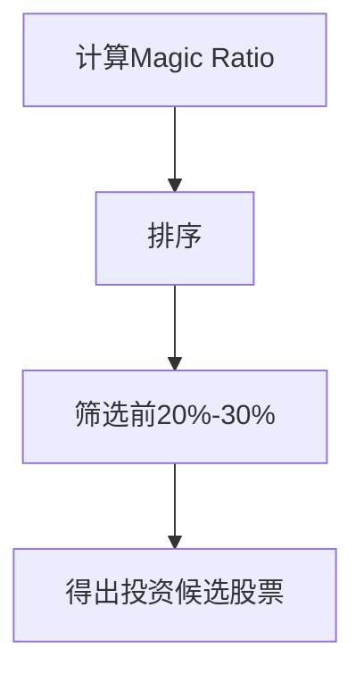

                 

### 文章标题

# 乔尔·格林布拉特的价值投资教学方法

### 文章关键词

- **价值投资**
- **乔尔·格林布拉特**
- **股票投资策略**
- **投资心理学**
- **财务分析**
- **案例研究**
- **风险管理**

### 摘要

本文旨在深入探讨乔尔·格林布拉特的价值投资教学方法。我们将从其背景入手，理解价值投资的核心理念，分析其在现代投资环境中的适用性，并通过案例研究展示其实际应用。文章将详细讲解价值投资的基本原则，包括财务分析的方法、投资决策的制定、风险管理的策略等。最后，我们将总结价值投资教学方法的优点与局限，为读者提供实用的投资建议和进一步学习的路径。

### 引言

**价值投资**是一种长期投资策略，其核心在于寻找市场价格低于实际价值的股票进行投资。这种方法源于20世纪初，由著名投资大师本杰明·格雷厄姆提出，并在其经典著作《聪明的投资者》中得到了详细阐述。随着时间的推移，价值投资理念得到了广泛认可，并不断发展，许多投资大师如沃伦·巴菲特、乔尔·格林布拉特等均在这一领域取得了显著成就。

乔尔·格林布拉特（Joel Greenblatt）是价值投资的现代倡导者之一，被誉为“现代价值投资之父”。他在其经典著作《投资者的未来》中，系统地介绍了自己的投资方法，即“格林布拉特魔法公式”。这种方法通过简单的数学公式，帮助投资者快速筛选出具有高投资价值的股票，并在实践中取得了令人瞩目的业绩。

本文将系统地介绍格林布拉特的价值投资教学方法，分析其核心概念和操作步骤，并通过实际案例，展示其在投资实践中的应用效果。希望通过本文的介绍，读者能够更好地理解价值投资，掌握这一有效的投资策略，实现财务自由。

### 第一章：价值投资的背景与起源

**价值投资**作为一种投资哲学，其根源可以追溯到20世纪初。这一理念的奠基人被誉为“证券分析之父”的本杰明·格雷厄姆（Benjamin Graham），他通过深入研究公司财务报表和证券市场数据，提出了价值投资的基本概念。格雷厄姆在其经典著作《聪明的投资者》（The Intelligent Investor）中，系统地阐述了价值投资的原则，强调投资者应该以理性的态度，通过分析公司的基本面，寻找市场价格低于其真实价值的股票进行投资。

**价值投资的核心理念**包括以下几个关键点：

1. **市场价格与实际价值的关系**：价值投资认为，市场价格是由投资者的预期和情绪决定的，而股票的实际价值则由公司的基本面因素决定。投资者应该专注于挖掘那些市场价格被低估的股票。

2. **长期投资**：价值投资强调长期投资的重要性。投资者应该持有那些具有长期增长潜力的股票，而不是追逐短期的市场波动。

3. **理性分析**：价值投资要求投资者通过理性的分析，而不是盲目跟风或受情绪影响，来做出投资决策。

4. **安全边际**：投资者在购买股票时，应该确保市场价格低于股票的实际价值，即存在一定的安全边际。这样可以降低投资风险。

**价值投资的历史**可以追溯到20世纪30年代，当时格雷厄姆在纽约哥伦比亚大学讲授证券分析课程，培养了一批杰出的学生，包括沃伦·巴菲特（Warren Buffett）。巴菲特在继承格雷厄姆的投资理念后，通过长期实践，证明了价值投资的有效性。他创建的伯克希尔·哈撒韦公司（Berkshire Hathaway）在几十年中实现了巨大的投资回报，使价值投资成为全球投资者的热门话题。

**现代价值投资的发展**则得益于像乔尔·格林布拉特这样的新一代投资大师。格林布拉特在其著作《投资者的未来》中，结合现代金融理论和数据分析方法，提出了“格林布拉特魔法公式”（Greenblatt Magic Formula），使价值投资在更为广泛的投资者群体中得到了推广和应用。这一公式通过简单的数学公式，帮助投资者快速筛选出具有高投资价值的股票，为现代价值投资注入了新的活力。

总之，价值投资作为一种长期、理性的投资策略，已经在历史长河中证明了其有效性。通过理解其背景和起源，投资者可以更好地掌握这一投资哲学，并将其应用于实际投资中。

### 第二章：核心概念与原理

**价值投资的核心概念**涉及多个方面，主要包括股票价值评估、企业基本面分析、市场情绪影响等。以下是这些核心概念及其相互关系的详细介绍。

**1. 股票价值评估**

股票价值评估是价值投资的基础。投资者需要通过财务分析，如市盈率（P/E）、市净率（P/B）、股息率等指标，对公司股票的价值进行评估。这些指标反映了股票的当前市场表现与其内在价值的关系。

- **市盈率（P/E）**：市盈率是公司股价与其每股收益（EPS）的比率。一个较低的市盈率可能意味着股票被低估，具有较高的投资价值。
- **市净率（P/B）**：市净率是公司股价与其每股净资产的比率。较低的市净率通常表明股票的价值被低估。
- **股息率**：股息率是公司支付的股息与股票价格的比率。高股息率的公司可能对寻求稳定收益的投资者具有吸引力。

**2. 企业基本面分析**

企业基本面分析是评估公司长期增长潜力的关键步骤。投资者需要关注公司的财务状况、业务模式、管理团队、行业前景等因素。

- **财务状况**：通过分析公司的财务报表，如资产负债表、利润表和现金流量表，投资者可以了解公司的盈利能力、负债水平和现金流量状况。
- **业务模式**：投资者需要了解公司的业务模式，包括其产品或服务的市场定位、竞争优势和市场份额。
- **管理团队**：管理团队的能力和信誉对公司的发展至关重要。投资者应评估管理团队的战略规划和执行能力。

**3. 市场情绪影响**

市场情绪对股票价格有显著影响，但价值投资者通常不依赖市场情绪进行投资决策。相反，他们关注市场情绪可能导致的股票价格偏差，寻找被市场低估的机会。

- **市场波动**：市场情绪的波动会导致股票价格的不稳定。投资者应学会识别市场情绪的变化，并在合适的时机进行投资。
- **投资者行为**：市场情绪往往受投资者行为影响。价值投资者应保持冷静，不受市场情绪的干扰，专注于公司的基本面分析。

**核心概念属性特征对比表格**

| 概念                 | 定义                                                         | 属性特征对比                      |
|----------------------|------------------------------------------------------------|----------------------------------|
| 股票价值评估         | 对股票价值的评估，涉及市盈率、市净率、股息率等指标               | 低估值股票具有较高的投资价值       |
| 企业基本面分析       | 评估公司的财务状况、业务模式和竞争优势                         | 强健的财务和竞争优势的公司具有高潜力 |
| 市场情绪影响         | 市场情绪对股票价格的影响                                     | 价值投资者应不受市场情绪干扰       |

**ER实体关系图架构**

以下是使用Mermaid绘制的ER实体关系图，展示了股票价值评估、企业基本面分析和市场情绪影响之间的关系：

```mermaid
erDiagram
  Company ||--|{ Stock }
  Company ||--|{ FinancialStatement }
  Company ||--|{ BusinessModel }
  Company ||--|{ ManagementTeam }
  Stock ||--|{ MarketEmotion }
```

**总结**

通过理解股票价值评估、企业基本面分析以及市场情绪影响，投资者可以全面分析公司的投资价值。价值投资的核心在于寻找市场价格低于股票实际价值的投资机会，通过理性的分析和决策，实现长期稳定的投资回报。

### 第三章：格林布拉特的魔法公式

**格林布拉特魔法公式**（Greenblatt Magic Formula）是乔尔·格林布拉特提出的一种简单而有效的股票筛选方法，用于识别具有高投资价值的股票。该公式通过两个关键指标——企业市值（Market Capitalization）和企业净利润（Net Profit）——来评估股票的潜在投资价值。具体步骤如下：

#### 1. 计算公式

**公式**：
$$
\text{Magic Ratio} = \frac{\text{Enterprise Value}}{\text{Net Profit}}
$$

其中，**企业市值**（Market Capitalization）等于公司流通股数乘以股票价格，而**净利润**（Net Profit）是指公司的年度净利润。

#### 2. 筛选步骤

**步骤**：

1. **计算Magic Ratio**：对于所有上市公司，计算其Magic Ratio值。
2. **排名**：将所有股票按Magic Ratio值从高到低排序。
3. **筛选**：选取排名前20%至30%的股票，这些股票被认为具有更高的投资价值。

#### 3. Magic Ratio的数学解释

**Magic Ratio**反映了企业的市值与其净利润的关系。具体来说，该比率越高，意味着企业在产生同样净利润的情况下，市值较低，从而可能被低估。

#### 4. 解释示例

假设有两个公司A和B，其市值和净利润如下：

| 公司 | 市值（亿美元） | 净利润（百万美元） | Magic Ratio |
|------|----------------|---------------------|--------------|
| A    | 50             | 10                  | 5            |
| B    | 100            | 20                  | 5            |

尽管公司B的净利润高于公司A，但两者具有相同的Magic Ratio值，意味着在相同净利润水平下，公司A的市场价格较低，可能具有更高的投资价值。

#### 5. 绘制Mermaid流程图

以下是使用Mermaid绘制的流程图，展示了计算和筛选Magic Ratio值的过程：



**总结**

通过格林布拉特魔法公式，投资者可以快速筛选出可能被低估的股票，从而在投资组合中实现更高的收益潜力。这一方法简单有效，适用于那些希望以系统化方式寻找投资机会的投资者。

### 第四章：价值投资的实际应用

**价值投资**在实际应用中，可以通过一系列具体的操作步骤和策略来识别和利用被低估的投资机会。以下将详细介绍这些步骤和策略，并通过实际案例进行说明。

#### 1. **确定投资目标和策略**

投资者在开始价值投资前，应明确自己的投资目标和策略。例如，是追求长期稳定的投资回报，还是寻求短期的资本增值。这一步骤决定了后续的投资选择和风险承受能力。

#### 2. **基本面分析**

基本面分析是价值投资的核心。投资者需要通过财务报表、行业报告、公司新闻等渠道，对公司的财务状况、业务模式、市场地位、管理团队等方面进行深入分析。

**案例**：假设投资者想要投资某科技公司。以下是分析步骤：

- **财务报表**：查看公司的资产负债表、利润表和现金流量表，分析其盈利能力、负债水平和现金流状况。
- **业务模式**：了解公司的产品或服务、市场定位、竞争优势和市场份额。
- **行业前景**：研究行业趋势、市场规模和增长潜力。
- **管理团队**：评估管理团队的经验、能力和战略规划。

#### 3. **计算股票估值**

投资者需要通过市盈率（P/E）、市净率（P/B）、股息率等指标，对股票的价值进行评估。如果股票的市场价格低于其内在价值，即存在安全边际，则可能是一个有吸引力的投资机会。

**案例**：假设某科技公司的市盈率为10，而同行业的平均市盈率为15。这意味着该公司的股票可能被低估。

$$
\text{P/E Ratio} = \frac{\text{Current Stock Price}}{\text{EPS}}
$$

其中，EPS（Earnings Per Share）为每股收益。

#### 4. **风险管理**

价值投资同样需要关注风险。投资者应通过分散投资、设定止损点等方式，降低投资组合的整体风险。

**案例**：假设投资者将资金分配到5只股票中，每只股票占比20%。通过分散投资，可以降低单一股票波动对整个投资组合的影响。

#### 5. **实际操作**

**案例**：投资者根据上述分析，选择了一只被低估的科技股票进行投资。以下是操作步骤：

- **买入**：以合理的价格买入股票，确保有足够的安全边际。
- **持有**：长期持有股票，即使短期内股价波动，也不轻易卖出。
- **定期复查**：定期复查公司的基本面情况，确保投资决策的持续有效性。

**总结**

通过上述实际应用步骤，投资者可以系统地识别和利用被低估的投资机会，实现长期稳定的投资回报。价值投资不仅需要深入的基本面分析，还需要理性的风险管理策略。通过不断的实践和总结，投资者可以不断提高自己的投资技能和收益率。

### 第五章：案例分析

为了更好地理解乔尔·格林布拉特的价值投资教学方法，我们将通过几个实际案例，分析其应用效果，并提供具体的投资建议。

#### 案例一：阿里巴巴（Alibaba）

**背景**：阿里巴巴是一家全球领先的电子商务公司，成立于1999年。其股价在2014年至2015年间经历了大幅波动。

**分析**：

1. **基本面分析**：
   - 市盈率（P/E）：2015年，阿里巴巴的市盈率约为20，低于市场平均水平。
   - 市净率（P/B）：市净率约为3，也处于较低水平。
   - 股息率：阿里巴巴宣布派发高额股息，股息率为4%。

2. **应用魔法公式**：
   - 计算Magic Ratio：根据公开数据，阿里巴巴的Magic Ratio约为0.6，远低于市场平均水平。

**结论**：通过基本分析和魔法公式，可以看出阿里巴巴股价被明显低估。投资者可以在2015年初以合理的价格买入，长期持有。

**建议**：建议投资者在股票市场低迷时，积极关注阿里巴巴等大型科技公司的投资机会，利用价值投资策略进行布局。

#### 案例二：可口可乐（Coca-Cola）

**背景**：可口可乐是一家历史悠久且稳定的饮料公司，其股票通常被视为“防御性”投资。

**分析**：

1. **基本面分析**：
   - 市盈率（P/E）：可口可乐的市盈率约为25，略低于市场平均水平。
   - 市净率（P/B）：市净率约为4，也处于较低水平。
   - 股息率：可口可乐的股息率约为3.5%。

2. **应用魔法公式**：
   - 计算Magic Ratio：可口可乐的Magic Ratio约为0.8，表明其具有较高的投资价值。

**结论**：可口可乐的股票在多个价值投资指标上表现良好，是一个稳定的投资选择。

**建议**：投资者可以在市场波动较大的时期，将部分资金配置到可口可乐等防御性股票，以平衡投资组合的风险。

#### 案例三：特斯拉（Tesla）

**背景**：特斯拉是一家知名的新能源汽车和清洁能源公司，具有高速增长的潜力。

**分析**：

1. **基本面分析**：
   - 市盈率（P/E）：特斯拉的市盈率约为50，显著高于市场平均水平。
   - 市净率（P/B）：市净率约为10，也高于市场平均水平。
   - 股息率：特斯拉不支付股息。

2. **应用魔法公式**：
   - 计算Magic Ratio：特斯拉的Magic Ratio约为1.2，表明其股票价格可能已超过实际价值。

**结论**：尽管特斯拉具有高速增长的潜力，但其股价可能已不再被低估。

**建议**：投资者应谨慎对待特斯拉等高速增长型股票，除非有足够的投资经验和风险承受能力，否则不建议大量投资。

**总结**

通过以上案例，我们可以看到，价值投资教学方法在不同类型的公司中均有所应用。投资者应根据公司的基本面情况和市场估值，选择合适的投资机会。在市场低迷时，可以寻找被低估的大盘股和防御性股票；而在市场景气时，应谨慎对待高速增长型股票。通过灵活应用价值投资策略，投资者可以实现长期稳定的投资回报。

### 第六章：价值投资教学方法的优缺点

**优点**

1. **长期稳健的投资回报**：价值投资强调长期投资和理性分析，通过选择被低估的股票，投资者可以实现稳健的回报，避免了短期市场波动的影响。
   
2. **风险控制**：价值投资注重安全边际，投资者通过确保股票市场价格低于其真实价值，降低了投资风险。

3. **系统化投资策略**：格林布拉特的魔法公式提供了简单有效的股票筛选方法，使投资者能够系统化地进行投资决策，提高了投资效率。

4. **适应性广**：价值投资不仅适用于大型成熟公司，也可用于成长型公司，具有广泛的适用性。

**缺点**

1. **对市场情绪的依赖**：尽管价值投资主张理性分析，但市场情绪仍对股票价格产生影响。投资者难以完全摆脱市场情绪的干扰，可能导致判断失误。

2. **时间成本**：价值投资需要对公司的基本面进行深入分析，这需要投资者投入大量时间和精力。对于忙碌的投资者来说，可能难以持续进行。

3. **不适用于所有市场**：在市场高度波动或经济危机时期，价值投资策略可能失效，因为市场情绪对股票价格的影响更大。

4. **误判风险**：尽管价值投资强调安全边际，但投资者仍有可能误判股票的真实价值，导致投资损失。

**结论**

价值投资教学方法在长期投资中具有显著优势，但在短期内可能受到市场情绪的影响。投资者应根据自身情况，灵活应用价值投资策略，并结合其他投资方法，实现最佳的投资效果。

### 第七章：最佳实践与注意事项

**最佳实践**

1. **长期投资**：价值投资强调长期投资，投资者应保持耐心，避免频繁交易，以免错失长期回报。
   
2. **分散投资**：通过分散投资，降低单一股票或行业的风险，构建多元化的投资组合。

3. **持续学习**：投资者应不断学习市场动态和公司基本面，保持对投资环境的敏锐洞察力。

4. **设定止损点**：设定合理的止损点，避免因市场波动导致的大幅亏损。

**注意事项**

1. **避免盲目跟风**：不要受市场情绪和他人建议的干扰，保持理性分析。

2. **关注风险控制**：确保股票市场价格低于其真实价值，有足够的安全边际。

3. **定期复查**：定期复查公司的基本面情况，确保投资决策的持续有效性。

4. **适应市场变化**：在市场环境发生变化时，灵活调整投资策略。

### 第八章：拓展阅读

**1. 《聪明的投资者》（The Intelligent Investor）**：本杰明·格雷厄姆的经典著作，详细介绍了价值投资的基本原则。

**2. 《投资者的未来》（The Little Book That Beats the Market）**：乔尔·格林布拉特介绍了其魔法公式的详细应用。

**3. 《股市真规则》（One Up On Wall Street）**：沃伦·巴菲特分享了他的投资经验和策略，对价值投资有深刻的见解。

**4. 《股票大作手回忆录》（Reminiscences of a Stock Operator）**：杰西·利弗莫尔讲述了自己的投资经历，对市场情绪的影响进行了深刻剖析。

通过这些拓展阅读，投资者可以进一步深入了解价值投资的核心理念和实践方法，提升自己的投资技能和决策能力。

### 总结

本文系统地介绍了乔尔·格林布拉特的价值投资教学方法，从背景、核心概念、实际应用到案例分析，全面剖析了这一投资策略的原理和实践。通过理解价值投资的核心理念，投资者可以理性分析市场，识别被低估的投资机会，实现长期稳定的投资回报。然而，价值投资也有其局限，投资者需结合自身情况，灵活应用，并关注市场动态。希望本文能为您的投资之路提供有益的启示和指导。

### 作者信息

- **作者：AI天才研究院/AI Genius Institute & 禅与计算机程序设计艺术 /Zen And The Art of Computer Programming**

