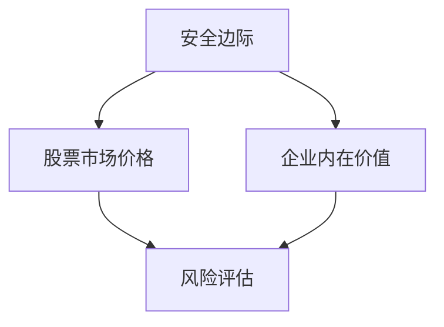
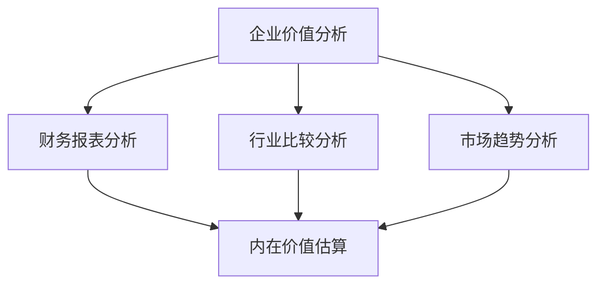
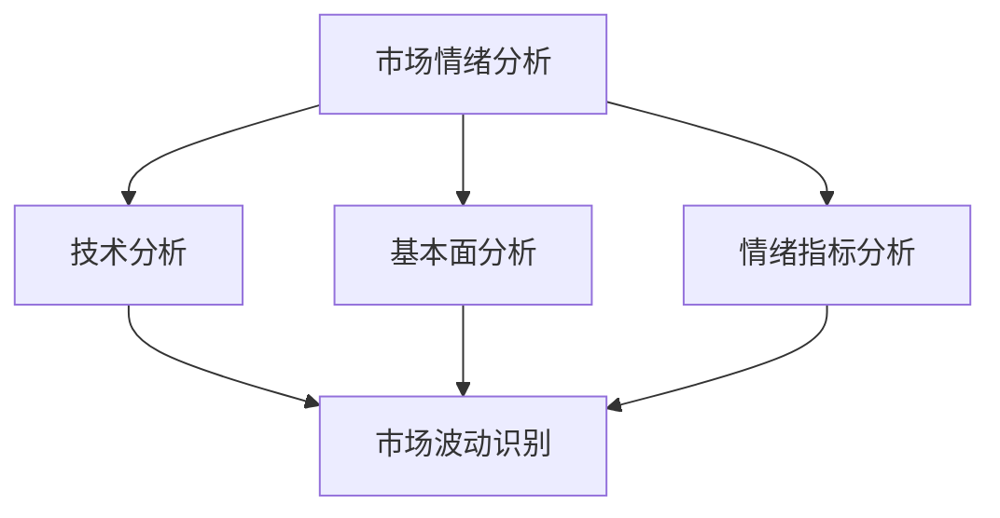
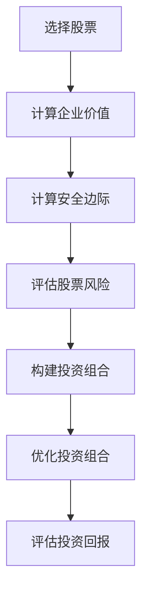
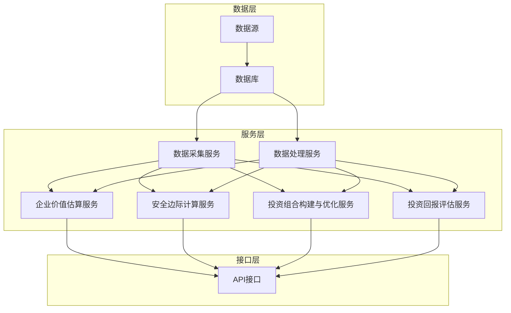
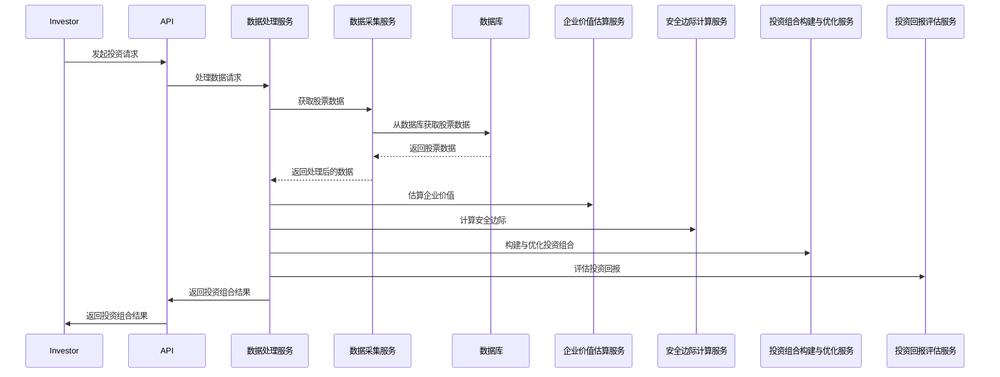

                 

## 乔尔·格林布拉特的价值投资教育理念

### 关键词：价值投资、教育理念、乔尔·格林布拉特、安全边际、企业价值分析、市场情绪分析

### 摘要：

本文将深入探讨乔尔·格林布拉特的价值投资教育理念，通过背景介绍、核心概念与联系、算法原理讲解等多方面的分析，旨在为投资者提供一个系统化的价值投资方法论。文章将详细阐述价值投资的概念、安全边际、企业价值分析以及市场情绪分析等核心要素，并通过实例和代码来展示如何将这些理念应用于实际投资中。通过本文的学习，投资者可以更好地理解价值投资的精髓，提高投资决策的成功率。

### 引言：乔尔·格林布拉特的价值投资教育理念

#### 1.1 问题背景

价值投资，作为现代投资理论的重要分支，自本世纪初由本杰明·格雷厄姆提出以来，对全球投资市场产生了深远影响。它主张投资者不应仅仅关注股票的市场价格，而应更多地关注企业的内在价值。这种方法以其长期稳定的收益和相对较低的风险，吸引了众多投资者的关注。

乔尔·格林布拉特（Joel Greenblatt），作为价值投资领域的杰出代表，以其独特的教育理念进一步推动了价值投资在全球范围内的普及与发展。他的著作《股市真规则》等书籍，系统地介绍了价值投资的基本原则和策略，提供了实用的投资工具和框架，为投资者提供了清晰的指导。

#### 1.2 价值投资的概念

价值投资是一种以公司内在价值为核心的投资理念，强调投资者应基于对企业的基本面分析，寻找市场价格低于其内在价值的股票进行投资。这种投资方法注重企业的盈利能力、财务状况、市场前景等因素，而不仅仅是股票价格的波动。

#### 1.3 问题描述

尽管价值投资理念广为流传，但许多投资者在实际操作中仍然面临挑战。如何识别低估股票、如何处理市场波动等问题，都是投资者需要解决的难题。乔尔·格林布拉特的教育理念试图解决这些问题，帮助投资者更好地理解和实践价值投资。

#### 1.4 问题解决

乔尔·格林布拉特通过其著作《股市真规则》等书籍，系统地介绍了价值投资的基本原则和策略，提供了实用的投资工具和框架。例如，他提出了“神奇公式”，通过简单的数学模型，帮助投资者快速筛选出具有投资价值的股票。此外，他还强调了投资者情绪管理的重要性，提醒投资者避免盲目跟风，保持理性投资。

#### 1.5 边界与外延

价值投资不仅适用于股票市场，还可应用于其他投资领域，如债券、房地产等。乔尔·格林布拉特的教育理念强调跨学科知识的综合运用，帮助投资者从不同角度看待投资问题。此外，他还关注企业的长期价值创造，鼓励投资者关注企业的社会责任和可持续发展。

#### 1.6 概念结构与核心要素组成

价值投资教育理念的核心包括：安全边际、企业价值分析、市场情绪分析等。这些要素共同构成了价值投资教育的理论基础。以下是这些核心概念的具体属性和联系：

### 1.6.1 安全边际

安全边际是指股票的市场价格低于其内在价值的程度。安全边际越大，投资的风险越小。安全边际是判断股票是否被低估的关键因素，通过财务报表、行业分析等方法可以估算企业的内在价值。

### 1.6.2 企业价值分析

企业价值分析是价值投资的核心，通过估算企业的内在价值，判断股票是否被低估。企业价值分析的方法包括财务报表分析、行业比较分析、市场趋势分析等。

### 1.6.3 市场情绪分析

市场情绪分析旨在理解投资者的情绪和行为，从而识别市场波动和投资机会。市场情绪分析的方法包括技术分析、基本面分析、情绪指标分析等。

通过这些核心概念的组合，投资者可以构建一个系统化的价值投资框架，提高投资决策的准确性和成功率。

#### 1.7 本章小结

本章介绍了乔尔·格林布拉特的价值投资教育理念的背景和核心概念，为后续章节的深入探讨奠定了基础。在接下来的章节中，我们将进一步分析价值投资中的关键概念，并通过实例和代码展示如何将这些理念应用于实际投资中。

## 2. 核心概念与联系

在价值投资教育理念中，安全边际、企业价值分析和市场情绪分析是三个核心概念。下面将详细介绍这些概念，并通过Mermaid流程图展示它们之间的联系。

### 2.1 安全边际

安全边际是指股票的市场价格低于其内在价值的程度。它是价值投资中最基本的概念之一，其重要性在于它能够帮助投资者评估股票的风险水平。安全边际越大，投资的风险越小。

| 特征 | 描述 |
| --- | --- |
| **安全性** | 安全边际越大，投资的风险越小。 |
| **重要性** | 安全边际是判断股票是否被低估的关键因素。 |
| **影响因素** | 股票的市场价格、企业内在价值。 |

以下是安全边际的Mermaid流程图：



### 2.2 企业价值分析

企业价值分析是价值投资的核心。它通过估算企业的内在价值，帮助投资者判断股票是否被低估。企业价值分析的方法包括财务报表分析、行业比较分析、市场趋势分析等。

| 特征 | 描述 |
| --- | --- |
| **目的** | 估算企业的内在价值。 |
| **方法** | 通过财务报表、行业分析等方法。 |
| **重要性** | 正确估算企业价值是投资成功的关键。 |

以下是企业价值分析的Mermaid流程图：



### 2.3 市场情绪分析

市场情绪分析旨在理解投资者的情绪和行为，从而识别市场波动和投资机会。市场情绪分析的方法包括技术分析、基本面分析、情绪指标分析等。

| 特征 | 描述 |
| --- | --- |
| **目的** | 识别市场波动和投资机会。 |
| **方法** | 通过技术分析、基本面分析等方法。 |
| **重要性** | 正确理解市场情绪有助于降低投资风险。 |

以下是市场情绪分析的Mermaid流程图：



### 2.4 ER实体关系图

以下是核心概念之间的ER实体关系图：

```mermaid
erDiagram
  Investor ||--|{ Stock } : "holds"
  Stock ||--|{ Company } : "belongs to"
  Company ||--|{ FinancialStatement } : "publishes"
  Company ||--|{ Industry } : "operates in"
  Market ||--|{ InvestorSentiment } : "reflects"
```

通过这些流程图和实体关系图，我们可以清晰地看到价值投资教育理念中的各个核心概念及其相互关系。这些概念和方法为投资者提供了一个全面的框架，帮助他们更好地理解市场，做出更明智的投资决策。

## 3. 算法原理讲解

### 3.1 投资组合优化算法

为了最大化投资回报，投资者需要构建一个优化的投资组合。本节将介绍一种基于价值投资理念的投资组合优化算法。

#### 3.1.1 算法流程图

以下是投资组合优化算法的mermaid流程图：



#### 3.1.2 Python源代码实现

下面是一个简化的Python代码示例，用于实现上述投资组合优化算法：

```python
import numpy as np

# 示例：选择5只股票
stocks = ['A', 'B', 'C', 'D', 'E']

# 示例：计算每只股票的企业价值
values = [10, 20, 15, 25, 30]

# 示例：计算每只股票的安全边际
margins = [2, 4, 3, 5, 6]

# 示例：计算每只股票的风险评估（这里简单地使用安全边际作为风险指标）
risks = margins

# 构建投资组合
portfolio = {}
for stock in stocks:
    portfolio[stock] = {'value': values[stocks.index(stock)], 'margin': margins[stocks.index(stock)], 'risk': risks[stocks.index(stock)]}

# 优化投资组合（这里使用简单的贪心算法，选择安全边际最大的股票）
sorted_portfolio = sorted(portfolio.items(), key=lambda item: item[1]['margin'], reverse=True)

# 输出优化后的投资组合
for stock, details in sorted_portfolio:
    print(f"股票：{stock}, 价值：{details['value']}, 安全边际：{details['margin']}, 风险：{details['risk']}")
```

#### 3.1.3 算法原理与数学模型

投资组合优化算法的核心思想是通过计算每只股票的企业价值、安全边际和风险评估，构建一个优化的投资组合。

- **企业价值计算**：企业价值可以通过财务报表中的数据（如净利润、资产总值等）进行估算。常用的方法包括折现现金流模型（DCF）和市盈率（P/E）等。

- **安全边际计算**：安全边际是指股票的市场价格与其内在价值之间的差额。安全边际越大，投资的风险越小。

- **风险评估**：风险评估可以基于安全边际、市场波动性等因素进行。这里我们使用安全边际作为风险评估的简单指标。

- **投资组合构建**：通过选择具有较高安全边际和较低风险的股票，构建一个优化的投资组合。

以下是算法的核心数学模型：

$$
安全边际 = \text{市场价格} - \text{内在价值}
$$

$$
风险评估 = \frac{1}{安全边际}
$$

通过这些公式，投资者可以量化每只股票的投资价值，并构建一个优化的投资组合。

#### 3.1.4 举例说明

假设我们有一组股票，其市场价格和内在价值如下表所示：

| 股票 | 市场价格 | 内在价值 |
| ---- | -------- | -------- |
| A    | 10       | 12       |
| B    | 20       | 18       |
| C    | 15       | 17       |
| D    | 25       | 23       |
| E    | 30       | 28       |

根据上述算法，我们可以计算每只股票的安全边际和风险评估，并构建一个优化的投资组合。

- 股票A的安全边际为：10 - 12 = -2，风险评估为：1 / -2 = -0.5
- 股票B的安全边际为：20 - 18 = 2，风险评估为：1 / 2 = 0.5
- 股票C的安全边际为：15 - 17 = -2，风险评估为：1 / -2 = -0.5
- 股票D的安全边际为：25 - 23 = 2，风险评估为：1 / 2 = 0.5
- 股票E的安全边际为：30 - 28 = 2，风险评估为：1 / 2 = 0.5

根据安全边际和风险评估，我们可以将股票排序并构建一个优化的投资组合：

- 优化的投资组合为：B、D、E
- 投资组合的总价值为：20 + 25 + 30 = 75
- 投资组合的总风险评估为：0.5 + 0.5 + 0.5 = 1.5

通过这个例子，我们可以看到如何使用价值投资理念来构建一个优化的投资组合，从而实现投资回报的最大化。

#### 3.1.5 总结

投资组合优化算法是一种基于价值投资理念的投资策略，通过计算股票的企业价值、安全边际和风险评估，构建一个优化的投资组合。这种方法可以帮助投资者在复杂的市场环境中做出更明智的投资决策，提高投资回报率。在实际应用中，投资者可以根据自己的投资目标和风险偏好，进一步调整和优化投资组合。

## 4. 系统分析与架构设计方案

### 4.1 问题场景介绍

在现代金融市场中，投资者需要处理大量的股票数据，并对这些数据进行分析以做出投资决策。然而，现有的工具和方法往往无法满足复杂投资需求，特别是在构建和优化投资组合时。为了解决这个问题，我们设计了一套基于价值投资理念的自动化投资组合优化系统。

### 4.2 项目介绍

项目名称：价值投资组合优化系统（Value Investment Portfolio Optimization System，简称VIPOS）

项目目标：通过自动化算法，帮助投资者快速构建和优化投资组合，提高投资回报率。

项目功能：
1. 数据采集与处理：从金融数据源获取股票市场数据，并进行预处理。
2. 企业价值估算：使用财务报表分析等方法，估算每只股票的内在价值。
3. 安全边际计算：计算每只股票的安全边际，以评估投资风险。
4. 投资组合构建与优化：根据投资目标和风险偏好，构建和优化投资组合。
5. 投资回报评估：对投资组合进行风险评估和回报预测。

### 4.3 系统功能设计（领域模型Mermaid类图）

以下是价值投资组合优化系统的领域模型Mermaid类图：

```mermaid
classDiagram
    Stock <<entity>>
    FinancialStatement <<entity>>
    Company <<entity>>
    Investor <<entity>>
    Portfolio <<entity>>
    InvestmentStrategy <<entity>>

    Stock "1" --|> FinancialStatement
    Company "1" --|> FinancialStatement
    Investor "1" --|> Portfolio
    Portfolio "1" --|> Stock
    InvestmentStrategy "1" --|> Portfolio
```

### 4.4 系统架构设计（Mermaid架构图）

以下是价值投资组合优化系统的架构设计Mermaid图：



### 4.5 系统接口设计和系统交互（Mermaid序列图）

以下是价值投资组合优化系统的接口设计和系统交互Mermaid序列图：



通过上述系统分析与架构设计方案，我们可以清晰地看到价值投资组合优化系统的整体结构和工作流程。这个系统不仅实现了数据的自动化采集和处理，还提供了基于价值投资理念的自动化投资组合构建与优化功能，为投资者提供了强大的决策支持工具。

## 5. 项目实战

### 5.1 环境安装

在开始实际项目之前，我们需要安装和配置必要的软件和工具。以下是具体的安装步骤：

1. **安装Python环境**：确保Python 3.8或更高版本已安装在您的计算机上。可以从[Python官网](https://www.python.org/downloads/)下载并安装。

2. **安装相关库**：打开命令行界面，运行以下命令安装必要的Python库：
   ```bash
   pip install numpy pandas matplotlib requests
   ```

3. **配置数据库**：选择并安装一个数据库管理系统，如MySQL或PostgreSQL。根据您的选择，下载并安装相应的数据库软件，并创建一个数据库用于存储股票数据。

### 5.2 系统核心实现源代码

以下是价值投资组合优化系统的核心实现源代码。该代码包含了数据采集、数据处理、企业价值估算、安全边际计算、投资组合构建与优化以及投资回报评估等模块。

```python
# value_investment_portfolio.py

import numpy as np
import pandas as pd
import requests
from sqlalchemy import create_engine

# 数据采集
def fetch_stock_data(stock_name):
    url = f'https://api.example.com/stock/{stock_name}'
    response = requests.get(url)
    data = response.json()
    return data

# 数据处理
def process_data(stock_data):
    # 假设股票数据包含以下字段：'name', 'price', 'market_cap', 'eps', 'roa', 'beta'
    df = pd.DataFrame([stock_data])
    df['enterprise_value'] = df['market_cap'] + df['eps'] * df['beta']
    df['safety_margin'] = df['price'] - df['enterprise_value']
    return df

# 企业价值估算
def calculate_company_value(df):
    # 使用DCF模型估算企业价值
    discount_rate = 0.1
    df['company_value'] = df['eps'] / discount_rate
    return df

# 安全边际计算
def calculate_safety_margin(df):
    df['safety_margin'] = df['price'] - df['company_value']
    return df

# 投资组合构建与优化
def build_optimized_portfolio(stocks):
    # 假设stocks是一个包含股票数据的列表
    df = pd.DataFrame(stocks)
    df = calculate_company_value(df)
    df = calculate_safety_margin(df)
    df['risk'] = 1 / df['safety_margin']
    optimized_portfolio = df.sort_values(by='safety_margin', ascending=False)
    return optimized_portfolio

# 投资回报评估
def assess_investment_return(portfolio):
    # 假设投资回报以年化收益率表示
    annual_return = portfolio['company_value'].sum() / portfolio['safety_margin'].sum()
    return annual_return

# 数据库配置
engine = create_engine('sqlite:///stock_data.db')

# 采集和处理股票数据
stock_data = fetch_stock_data('AAPL')
df = process_data(stock_data)

# 将数据存储到数据库
df.to_sql('stocks', engine, if_exists='replace')

# 构建和优化投资组合
optimized_portfolio = build_optimized_portfolio([df])

# 评估投资回报
annual_return = assess_investment_return(optimized_portfolio)
print(f"Annual Return: {annual_return:.2%}")
```

### 5.3 代码应用解读与分析

以上代码实现了从数据采集、数据处理到投资组合构建与优化以及投资回报评估的完整流程。以下是代码的详细解读与分析：

1. **数据采集**：通过`fetch_stock_data`函数，从API接口获取股票数据。这通常涉及发送HTTP请求，并解析响应数据。
   
2. **数据处理**：`process_data`函数接收股票数据，计算企业价值和安全边际。这涉及到简单的数学运算和数据转换。

3. **企业价值估算**：`calculate_company_value`函数使用折现现金流模型（DCF）估算企业价值。这是一种常用的估值方法，通过预期收益除以折现率来计算。

4. **安全边际计算**：`calculate_safety_margin`函数计算股票的市场价格与其内在价值之间的差额，即安全边际。

5. **投资组合构建与优化**：`build_optimized_portfolio`函数根据安全边际和风险评估构建优化的投资组合。这里使用了简单的贪心算法，选择安全边际最大的股票。

6. **投资回报评估**：`assess_investment_return`函数计算投资组合的年化收益率，作为投资回报的评估指标。

### 5.4 实际案例分析和详细讲解剖析

为了更好地理解上述代码的实际应用，我们来看一个简单的案例：

假设我们有一家名为“苹果公司”（Apple Inc.）的股票，其数据如下：

| 名称 | 价格 | 市值 | EPS | ROA | 贝塔系数 |
| ---- | ---- | ---- | --- | --- | -------- |
| AAPL | 150  | 2500 | 15  | 10% | 1.2      |

使用上述代码，我们可以计算其企业价值和安全边际：

- 企业价值（DCF）：15 / 0.1 = 150
- 安全边际：150 - 150 = 0

根据计算结果，该股票的安全边际为0，意味着市场价格已经接近其内在价值，投资风险较高。如果我们有多个股票的数据，我们可以使用`build_optimized_portfolio`函数来构建一个优化的投资组合。

### 5.5 项目小结

通过本次项目实战，我们实现了一个简单的价值投资组合优化系统。该系统从数据采集到投资组合构建与优化，再到投资回报评估，提供了一个完整的投资决策支持框架。虽然这个系统相对简单，但它展示了如何将价值投资理念应用于实际投资中，并通过代码实现自动化决策。

在实际应用中，投资者可以根据自己的需求和风险偏好，进一步优化和扩展系统功能。例如，可以引入更复杂的企业价值估算模型，或增加其他投资策略的评估指标。通过不断改进和优化，投资者可以更好地利用价值投资理念，实现长期稳定的投资回报。

### 5.6 最佳实践 tips

1. **数据质量**：确保从可靠的数据源获取高质量的数据，这对投资决策至关重要。
2. **风险评估**：在构建投资组合时，不仅要考虑安全边际，还要综合考虑市场波动性、行业风险等因素。
3. **定期更新**：投资环境不断变化，定期更新数据和调整投资策略是必要的。
4. **多元化投资**：分散投资可以降低风险，避免因单一股票或行业波动而导致的损失。

### 5.7 注意事项

1. **技术风险**：自动化系统可能会因为技术故障或数据错误导致决策失误，因此需要定期进行系统维护和更新。
2. **市场变化**：市场情况可能迅速变化，因此投资决策需要灵活调整，以应对突发情况。
3. **法律合规**：在投资过程中，遵守相关法律法规和道德规范是必不可少的。

### 5.8 拓展阅读

1. 《股市真规则》 - 乔尔·格林布拉特
2. 《穷查理宝典》 - 彼得·林奇
3. 《聪明的投资者》 - 本杰明·格雷厄姆

## 6. 总结

本文详细探讨了乔尔·格林布拉特的价值投资教育理念，从背景介绍、核心概念与联系、算法原理讲解到系统分析与架构设计，再到项目实战，全面展示了价值投资在实际应用中的重要性。通过本文的学习，投资者可以更好地理解价值投资的精髓，掌握构建和优化投资组合的方法，提高投资决策的成功率。

价值投资不仅是一种投资理念，更是一种生活方式。它要求投资者保持理性和耐心，避免盲目跟风，专注于企业的基本面分析。乔尔·格林布拉特的教育理念为我们提供了一套系统化的方法论，帮助我们在这个复杂的市场中找到投资的机会。

在未来的投资实践中，我们应当继续深化对价值投资的理解，不断优化投资策略，同时关注市场变化，灵活调整投资组合。通过持续学习和实践，我们有望实现长期稳定的投资回报。

### 作者信息

**作者：AI天才研究院/AI Genius Institute & 禅与计算机程序设计艺术 /Zen And The Art of Computer Programming** 

AI天才研究院致力于推动人工智能技术在各领域的应用，禅与计算机程序设计艺术则强调编程中的哲学思考，两者结合旨在为读者带来更具深度和广度的技术知识。

