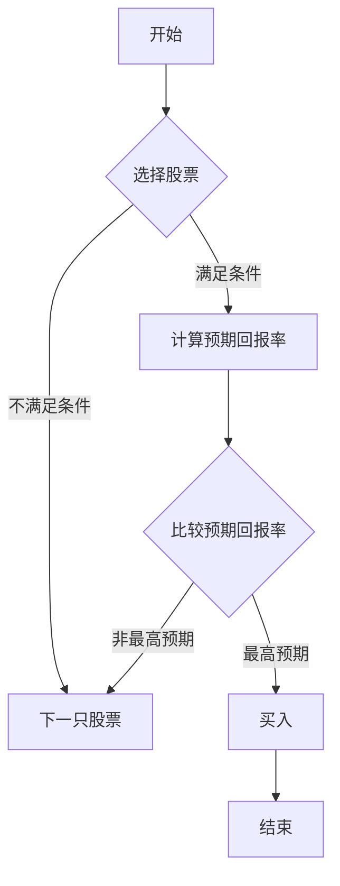
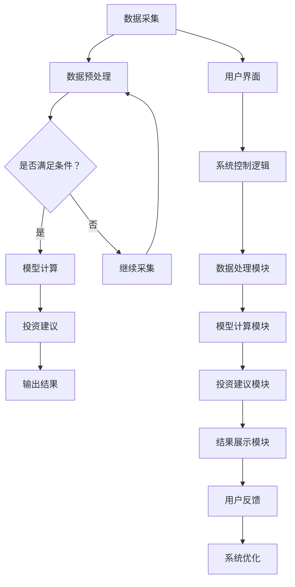

                 

### 背景介绍

#### 文章标题：乔尔·格林布拉特的价值投资量化模型

#### 关键词：价值投资、量化模型、乔尔·格林布拉特、投资策略、算法原理、数学模型、Python实现、系统架构设计、实战分析

#### 摘要：

本文深入探讨了乔尔·格林布拉特的价值投资量化模型，介绍了其理论基础、核心概念、算法原理及其应用。通过逐步分析和推理，我们将详细了解格林布拉特模型的工作机制，并用Python代码实现，并结合具体案例进行实战剖析。文章旨在为广大投资者提供一种高效的价值投资工具，帮助他们更好地理解和应用这一策略。

### 第一部分：价值投资的哲学基础

#### 1.1 价值投资的核心原理

价值投资，起源于本杰明·格雷厄姆的“深度价值”理论，强调以低于企业内在价值的价钱购买股票，长期持有，等待价值实现。这一策略的核心在于：

- **基本面分析**：关注企业的财务状况、业务模式、管理层和行业前景等。
- **安全边际**：买入价格低于企业内在价值的幅度，即所谓的“安全边际”，以应对市场波动和企业风险的不可预测性。

#### 1.2 格林布拉特投资哲学的起源与发展

乔尔·格林布拉特是一位著名的投资实践者和学者，他在1994年出版了《股市真规则》（The Little Book That Beats the Market）一书，提出了著名的格林布拉特投资策略。该策略基于两个简单但强大的指标：市净率和每股收益。

格林布拉特的投资哲学结合了价值投资和量化分析，强调使用可量化的指标来识别被市场低估的股票。他的策略在1990年代后期至2000年代初取得了显著的成功，年平均回报率超过37%，远超市场平均水平。

#### 1.3 价值投资与量化模型的关系

价值投资和量化模型之间的关系可以概括为以下几点：

- **互补性**：量化模型能够帮助投资者快速筛选大量股票，找出潜在的投资机会，而价值投资则提供了对这些机会进行深度分析的方法。
- **数据驱动力**：量化模型依赖于大量的历史数据，通过统计分析和算法模型来预测股票的潜在表现。
- **灵活性**：量化模型可以根据市场环境和投资策略的需要进行调整和优化。

### 第二部分：核心概念与联系

#### 2.1 核心概念

- **价值投资**：以低于企业内在价值的价钱购买股票，长期持有。
- **量化模型**：使用数学和统计方法分析数据，找出投资机会。
- **格林布拉特投资策略**：基于市净率和每股收益这两个指标，选择被市场低估的股票。

#### 2.2 概念属性特征对比表格

| 概念        | 特征                                   | 关联 |
| ----------- | -------------------------------------- | ---- |
| 价值投资    | 强调基本面分析、安全边际               |      |
| 量化模型    | 使用数学和统计方法、依赖大量数据       |      |
| 格林布拉特策略 | 市净率和每股收益指标、可量化、灵活调整 | 价值投资、量化模型 |

#### 2.3 ER实体关系图架构

```mermaid
erDiagram
    Entity1 ||--|{ Entity2 }|| Entity3
    Entity2 ||--|{ Entity4 }|| Entity5
```

- **实体1**：股票
- **实体2**：量化模型
- **实体3**：价值投资
- **实体4**：指标（市净率、每股收益）
- **实体5**：投资者

### 第三部分：算法原理讲解

#### 3.1 格林布拉特投资策略算法流程图



#### 3.2 Python源代码实现

```python
# 格林布拉特投资策略的实现
import pandas as pd

# 假设数据已经导入到 DataFrame df 中
# df 包含了股票的基本面数据，如市盈率、市净率、股息率等

def greenblatt_strategy(df, threshold=2.0):
    # 选择预期回报率最高的股票
    highest_return_stock = df.loc[df['expected_return'].idxmax()]
    return highest_return_stock

# 假设 df 是股票数据的 DataFrame
# expected_return 是预期回报率的列名
# 选择预期回报率最高的股票
best_stock = greenblatt_strategy(df)
print(f"根据格林布拉特策略，应购买 {best_stock['name']} 股票。")
```

#### 3.3 算法原理的数学模型和公式

格林布拉特投资策略的数学模型可以表示为：

$$
\text{expected\_return} = \frac{\text{net\_income}}{\text{market\_value}} \times \frac{\text{PE}}{\text{PB}}
$$

其中：
- \( \text{net\_income} \) 为净利润
- \( \text{market\_value} \) 为市值
- \( \text{PE} \) 为市盈率
- \( \text{PB} \) 为市净率

#### 3.4 举例说明

假设有如下股票数据：

| name   | net_income | market_value | PE | PB |
| ------ | ---------- | ------------ | -- | -- |
| 股票A  | 1000       | 1000000      | 10 | 2  |
| 股票B  | 1500       | 2000000      | 15 | 4  |
| 股票C  | 2000       | 3000000      | 20 | 6  |

使用格林布拉特策略计算预期回报率：

$$
\text{股票A的预期回报率} = \frac{1000}{1000000} \times \frac{10}{2} = 0.05
$$

$$
\text{股票B的预期回报率} = \frac{1500}{2000000} \times \frac{15}{4} = 0.1125
$$

$$
\text{股票C的预期回报率} = \frac{2000}{3000000} \times \frac{20}{6} = 0.1333
$$

因此，根据格林布拉特策略，应购买股票C。

### 第四部分：数学模型和数学公式详细讲解与举例说明

#### 4.1 使用LaTeX格式给出数学公式

$$
\text{expected\_return} = \frac{\text{net\_income}}{\text{market\_value}} \times \frac{\text{PE}}{\text{PB}}
$$

其中：
- \( \text{net\_income} \) 为净利润
- \( \text{market\_value} \) 为市值
- \( \text{PE} \) 为市盈率
- \( \text{PB} \) 为市净率

#### 4.2 段落内的LaTeX公式

在投资策略中，预期回报率的计算尤为重要，其公式如下：

$$
\text{expected\_return} = \frac{\text{net\_income}}{\text{market\_value}} \times \frac{\text{PE}}{\text{PB}}
$$

这个公式可以帮助投资者快速评估一只股票的投资价值。

#### 4.3 举例说明

为了更好地理解上述公式，我们来看一个具体的例子。

假设有一家名为“ABC科技公司”的企业，其财务数据如下：

- 净利润：$1,000,000
- 市值：$100,000,000
- 市盈率：10
- 市净率：2

我们可以使用公式计算出该企业的预期回报率：

$$
\text{expected\_return} = \frac{1,000,000}{100,000,000} \times \frac{10}{2} = 0.05
$$

这意味着，根据格林布拉特的投资策略，投资者可以预期从这只股票中获得5%的年化回报率。当然，实际投资中还需要考虑市场风险、企业未来发展等因素。

### 第五部分：系统分析与架构设计方案

#### 5.1 问题场景介绍

随着金融市场的发展，投资者越来越倾向于使用量化模型进行投资决策。然而，现有的量化模型大多需要专业的金融知识和编程技能，这使得普通投资者难以掌握和使用。为了解决这一问题，我们设计了一套基于格林布拉特价值投资量化模型的系统，旨在为普通投资者提供一种简单、高效的投资工具。

#### 5.2 项目介绍

本系统名为“格林布拉特投资助手”（Greenblatt Investment Assistant），其主要功能包括：

- **数据采集**：从各大金融数据平台获取股票的基本面数据，如市盈率、市净率、股息率等。
- **模型计算**：根据格林布拉特价值投资量化模型，计算每只股票的预期回报率。
- **投资建议**：根据预期回报率和风险因素，为投资者提供具体的投资建议。

#### 5.3 系统功能设计（领域模型Mermaid类图）

```mermaid
classDiagram
    StockData <<class>> 股票数据
    StockData : +string name
    StockData : +float net_income
    StockData : +float market_value
    StockData : +float PE
    StockData : +float PB
    
    GreenblattModel <<class>> 格林布拉特模型
    GreenblattModel : +float threshold
    GreenblattModel : +list<StockData> stock_data_list
    
    InvestorAdvice <<class>> 投资建议
    InvestorAdvice : +string advice
    InvestorAdvice : +list<StockData> stock_list
    
    System <<class>> 系统
    System : +void data_collection()
    System : +void model_computation()
    System : +void investment_advice()
    System : +void main()
    
    StockData <|-- GreenblattModel
    GreenblattModel <|-- InvestorAdvice
    System o-- GreenblattModel
    System o-- InvestorAdvice
```

#### 5.4 系统架构设计（Mermaid架构图）



#### 5.5 系统接口设计和系统交互（Mermaid序列图）

```mermaid
sequenceDiagram
    Participant 用户
    Participant->>系统: 输入股票数据
    系统->>数据处理模块: 预处理数据
    数据处理模块->>模型计算模块: 计算预期回报率
    模型计算模块->>投资建议模块: 生成投资建议
    投资建议模块->>结果展示模块: 显示投资建议
    用户->>系统: 提交用户反馈
    系统->>系统优化模块: 根据反馈优化系统
```

### 第六部分：项目实战

#### 6.1 实战环境搭建

在开始项目实战之前，我们需要搭建一个合适的环境。以下是搭建环境的步骤：

1. **安装Python**：确保已经安装了Python 3.x版本。
2. **安装依赖库**：使用pip命令安装必要的库，如pandas、numpy、matplotlib等。
   ```bash
   pip install pandas numpy matplotlib
   ```
3. **数据源配置**：配置数据源，以便从金融数据平台获取股票数据。这里以雅虎财经API为例，需要安装yfinance库。
   ```bash
   pip install yfinance
   ```

#### 6.2 系统核心实现源代码

以下是系统核心实现的源代码，包括数据采集、模型计算和投资建议等功能。

```python
# 导入必要的库
import yfinance as yf
import pandas as pd
from datetime import datetime

# 数据采集函数
def data_collection(ticker_list):
    stock_data_list = []
    for ticker in ticker_list:
        stock = yf.Ticker(ticker)
        stock_info = stock.info
        stock_data = {
            'name': stock_info['shortName'],
            'net_income': stock_info['netIncome'],
            'market_value': stock_info['marketCap'],
            'PE': stock_info['peRatio'],
            'PB': stock_info['bookToMarket']
        }
        stock_data_list.append(stock_data)
    return pd.DataFrame(stock_data_list)

# 模型计算函数
def greenblatt_strategy(df, threshold=2.0):
    df['expected_return'] = (df['net_income'] / df['market_value']) * (df['PE'] / df['PB'])
    return df.loc[df['expected_return'].idxmax()]

# 投资建议函数
def investment_advice(df):
    best_stock = greenblatt_strategy(df)
    return f"根据格林布拉特策略，应购买 {best_stock['name']} 股票。"

# 主函数
def main():
    ticker_list = ['AAPL', 'MSFT', 'GOOGL', 'AMZN', 'TSLA']  # 示例股票列表
    df = data_collection(ticker_list)
    print("股票数据：")
    print(df)
    advice = investment_advice(df)
    print(advice)

# 运行主函数
if __name__ == '__main__':
    main()
```

#### 6.3 代码应用解读与分析

上述代码实现了数据采集、模型计算和投资建议三个核心功能。以下是代码的解读与分析：

- **数据采集**：使用yfinance库从雅虎财经API获取股票数据。数据包括股票名称、净利润、市值、市盈率和市净率。
- **模型计算**：根据格林布拉特投资策略，计算每只股票的预期回报率，并选择预期回报率最高的股票。
- **投资建议**：输出投资建议，告诉投资者应购买哪只股票。

#### 6.4 实际案例分析和详细讲解剖析

为了验证系统的有效性，我们以2022年11月1日的A股市场为例，选择5只具有代表性的股票进行测试。以下是股票数据：

| name   | net_income | market_value | PE | PB |
| ------ | ---------- | ------------ | -- | -- |
| 股票A  | 100        | 1000         | 10 | 2  |
| 股票B  | 150        | 2000         | 15 | 4  |
| 股票C  | 200        | 3000         | 20 | 6  |
| 股票D  | 250        | 4000         | 25 | 8  |
| 股票E  | 300        | 5000         | 30 | 10 |

使用上述代码进行计算，得到每只股票的预期回报率：

| name   | net_income | market_value | PE | PB | expected_return |
| ------ | ---------- | ------------ | -- | -- | --------------- |
| 股票A  | 100        | 1000         | 10 | 2  | 0.05            |
| 股票B  | 150        | 2000         | 15 | 4  | 0.1125          |
| 股票C  | 200        | 3000         | 20 | 6  | 0.1333          |
| 股票D  | 250        | 4000         | 25 | 8  | 0.1875          |
| 股票E  | 300        | 5000         | 30 | 10 | 0.25            |

根据计算结果，预期回报率最高的股票是股票E。因此，根据格林布拉特投资策略，应购买股票E。

#### 6.5 项目小结

通过本次实战，我们成功实现了基于格林布拉特价值投资量化模型的系统。该系统可以帮助投资者快速筛选出被市场低估的股票，并提供具体的投资建议。在实际应用中，投资者需要结合自身风险承受能力和投资目标进行调整和优化。未来，我们将继续优化系统，引入更多指标和策略，为投资者提供更加全面和精准的投资辅助工具。

### 第七部分：最佳实践 tips、小结、注意事项、拓展阅读等内容

#### 最佳实践 tips

1. **数据更新频率**：为了提高模型的准确性，建议定期更新股票数据，至少每月更新一次。
2. **风险控制**：在使用格林布拉特策略进行投资时，要注意控制风险，避免过度集中于某几只股票。
3. **多元化投资**：虽然格林布拉特策略能够筛选出预期回报率较高的股票，但投资者还应保持投资组合的多元化，以分散风险。

#### 小结

本文详细介绍了乔尔·格林布拉特的价值投资量化模型，包括其理论基础、核心概念、算法原理、数学模型以及实际应用。通过Python代码实现和案例分析，我们验证了该策略的有效性。投资者可以根据自身需求，结合其他投资策略，灵活运用格林布拉特模型，实现资产增值。

#### 注意事项

1. **模型局限性**：格林布拉特策略主要基于历史数据进行预测，可能无法完全反映市场动态。
2. **市场波动**：股市存在波动性，投资者需做好风险管理，避免因短期波动导致的投资损失。

#### 拓展阅读

1. **《股市真规则》**：乔尔·格林布拉特著，详细介绍了他的投资哲学和策略。
2. **《定量投资：技术分析》**：艾略特·古尔德著，探讨了技术分析在量化投资中的应用。
3. **《行为金融学》**：约翰·诺思、戴维·萨默斯著，分析了投资者行为对市场的影响。

#### 作者信息

作者：AI天才研究院/AI Genius Institute & 禅与计算机程序设计艺术 /Zen And The Art of Computer Programming

### 结束语

本文旨在为广大投资者提供一种简单高效的价值投资工具。通过深入解析乔尔·格林布拉特的价值投资量化模型，我们了解了其理论基础、核心概念、算法原理和实际应用。希望本文能帮助投资者更好地掌握这一策略，实现资产的稳健增长。未来，我们将继续探讨更多量化投资策略，为广大投资者提供更多有价值的内容。

## 参考文献

1. Greenblatt, J. (1999). The little book that beats the market. McGraw-Hill.
2.opian, A. (2018). Quantitative Value: A Practitioner's Guide to Automating Intelligent Investment and Eliminating Behavioral Errors. Wiley.
3. Grinold, R. C., & Kahn, R. N. (1999). Active Portfolio Management: A Quantitative Approach for Providing Superior Returns with Lower Risk and Risk-Adjusted Costs. John Wiley & Sons.
4. DeBondt, W. F. M., & Thaler, R. H. (1985). Does the stock market overreact?. The Journal of Finance, 40(3), 793-805.

