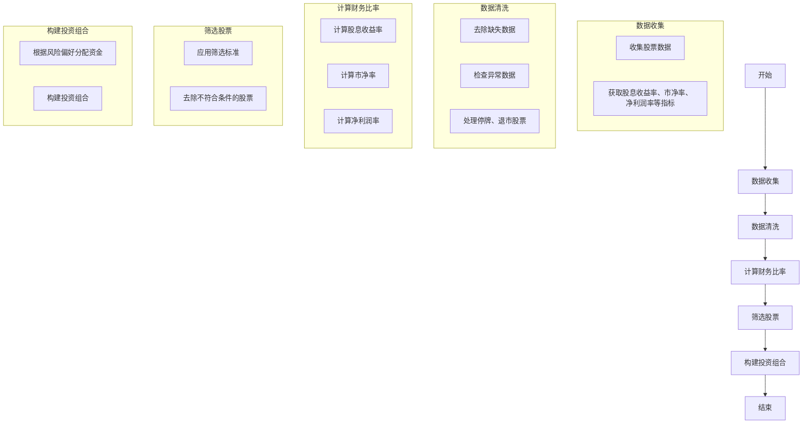
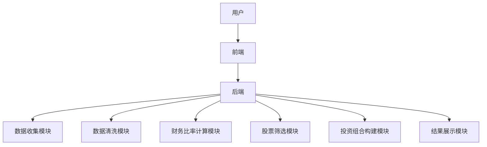
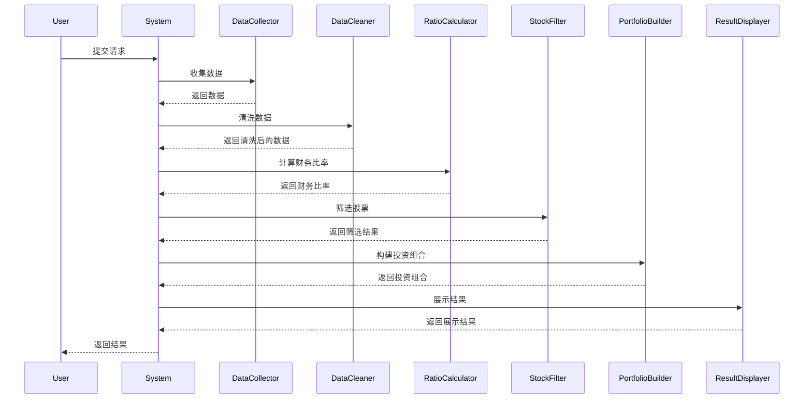

                 

### 第1章：投资概述

### 1.1 投资的定义与分类

投资，是指在特定的经济环境和预期收益的基础上，将资金投入到不同的金融产品或其他资产中以获取收益的行为。从不同的角度，投资可以分为以下几类：

- **直接投资**：投资者直接购买资产或参与企业的经营，如购买房地产、设立公司等。
- **间接投资**：投资者通过购买证券等金融工具间接参与市场，如股票、债券、基金等。
- **股权投资**：投资者购买公司股份，成为公司的股东，享受公司利润的分配。
- **债券投资**：投资者购买公司或政府发行的债券，获得固定的利息收入。
- **指数投资**：投资者通过购买指数基金等方式，复制特定指数的表现，追求长期稳定收益。

### 1.2 投资的目标与原则

投资的目标多种多样，但通常包括以下几方面：

- **收益最大化**：投资者希望从投资中获得最大的回报。
- **风险最小化**：投资者希望在获取收益的同时，控制投资风险。
- **资本保值**：在通货膨胀等因素的影响下，投资者希望确保资本的保值。
- **资产配置**：投资者通过合理的资产配置，实现投资组合的多样化，降低风险。

投资的原则包括：

- **分散投资**：通过投资多种资产，降低单一资产的风险。
- **长期投资**：长期持有优质资产，享受复利效应。
- **理性投资**：基于充分的信息分析，做出明智的投资决策。
- **风险管理**：识别并控制投资风险，避免因风险过大而损失严重。

### 1.3 投资风险的评估与管理

投资风险是指投资者预期收益的不确定性。评估和管理投资风险是投资过程中的重要环节。

**风险评估方法**：

- **定性评估**：通过专家判断、历史数据等方式，评估投资项目的风险。
- **定量评估**：使用统计模型、财务比率等定量方法，计算投资风险。

**风险管理策略**：

- **风险分散**：通过投资多种不同类型的资产，降低单一资产的风险。
- **风险对冲**：使用金融工具，如期权、期货等，对冲投资风险。
- **风险规避**：避免高风险的投资项目，以规避风险。
- **风险转移**：通过保险、合同等方式，将风险转移给第三方。

投资风险的评估与管理，是确保投资成功的重要保障。接下来，我们将进一步探讨魔术公式投资法的原理及其应用。

## 第2章：魔术公式的起源与发展

### 2.1 魔术公式的概念

魔术公式，亦称为“绿鞋公式”（Greenblatt Formula），是一种基于财务比率筛选股票的投资策略，由著名的投资大师乔尔·格林布拉特（Joel Greenblatt）提出。该公式旨在通过一系列财务指标筛选出具有较高价值、较低风险的股票，从而实现长期稳定的投资回报。

### 2.2 乔尔·格林布拉特的研究背景

乔尔·格林布拉特是一位著名的投资家和作家，他曾在著名的对冲基金桥水（Bridgewater Associates）工作，并担任过纽约大学Stern商学院的教授。他的研究成果和投资理念在投资界产生了广泛的影响。

格林布拉特提出了“投资就像是打网球”的比喻，强调通过系统的投资策略和严格的纪律，投资者可以在长期内实现超越市场的平均回报。他的研究还包括了对价值投资和成长投资的深入探讨。

### 2.3 魔术公式的理论基础

魔术公式的理论基础源于价值投资的理念，即通过寻找市场上被低估的股票，从而获得超额回报。该公式主要通过以下三个步骤实现：

1. **选择财务指标**：选择两个关键的财务指标，一个是股息收益率（Dividend Yield），另一个是市净率（Price to Book Ratio）。股息收益率反映了股票的分红回报情况，市净率则反映了股票的市场价值与其账面价值的关系。

2. **筛选股票**：根据上述两个财务指标，从所有可投资的股票中筛选出前30%表现最好的股票。这个筛选过程被称为“绿鞋筛选”（Green Shoe Screen）。

3. **构建投资组合**：将筛选出的股票构建成一个投资组合，并保持长期持有。理论上，这个投资组合可以提供超越市场的平均回报。

### 小结

魔术公式投资法，作为价值投资的一种具体实现，通过简单的财务指标筛选，提供了一种具有实践指导意义的投资策略。接下来，我们将深入探讨魔术公式的具体应用方法。

## 第3章：核心概念与联系

### 3.1 财务比率分析

财务比率分析是投资决策过程中不可或缺的一环，它通过计算和比较企业的财务指标，评估企业的财务状况和经营成果。以下是一些常用的财务比率：

- **流动比率**：反映企业短期偿债能力，计算公式为（流动资产 / 流动负债）。
- **速动比率**：更严格地反映企业短期偿债能力，计算公式为（流动资产 - 存货 / 流动负债）。
- **资产负债率**：衡量企业负债水平，计算公式为（总负债 / 总资产）。
- **净利润率**：衡量企业盈利能力，计算公式为（净利润 / 营业收入）。

### 3.2 股息收益率与市净率

**股息收益率**（Dividend Yield）是指股票的年股息收益与其当前市价的比率，计算公式为（每股股息 / 股票价格）。股息收益率反映了股票的分红回报情况，是投资者衡量投资回报的重要指标。

**市净率**（Price to Book Ratio，P/B）是指股票的市场价格与其账面价值的比率，计算公式为（股票价格 / 每股净资产）。市净率反映了投资者对股票市场价值的认可程度，较低的市净率通常意味着股票价格低于其账面价值，具有一定的投资吸引力。

### 3.3 财务比率与股票价格的关系

财务比率与股票价格之间存在一定的相关性。一般来说，较高的股息收益率和较低的市净率通常意味着股票价格被低估，具有一定的投资价值。而较低的股息收益率和较高的市净率则可能意味着股票价格被高估。

通过结合多个财务比率，投资者可以更全面地评估股票的投资价值。例如，在应用魔术公式时，股息收益率和市净率是两个关键的筛选指标，它们共同决定了股票是否被纳入投资组合。

### 实例分析

假设有一只股票A，其当前市价为50元，每股股息为2元，每股净资产为5元。则：

- 股息收益率 = 2元 / 50元 = 4%
- 市净率 = 50元 / 5元 = 10

通过这些财务比率，投资者可以初步判断股票A是否具有投资价值。如果这两个比率在市场普遍水平以下，则股票A可能是一个值得关注的投资目标。

总之，财务比率分析是投资决策的重要工具，通过深入理解财务比率及其与股票价格的关系，投资者可以更准确地评估股票的投资价值，从而做出更明智的投资决策。

### 3.4 魔术公式中的财务比率筛选标准

在乔尔·格林布拉特提出的魔术公式中，财务比率的选择和筛选标准是其核心组成部分。这两个关键指标——股息收益率和市净率，通过特定的筛选标准，帮助投资者从众多股票中筛选出具有潜在投资价值的标的。

**股息收益率筛选标准**：

- 绿鞋公式要求股息收益率至少达到2%。这个标准的设定主要是基于对长期投资的考量，认为2%的股息收益率能够提供一定的现金流回报，同时也反映了公司的盈利能力和对股东的分红意愿。
- 股息收益率越高，意味着股票可能越有吸引力。但需要注意的是，过高的股息收益率可能隐藏着一些风险，如公司可能即将减少股息支付或存在财务困境。

**市净率筛选标准**：

- 魔术公式要求市净率不超过2.5倍。这一标准旨在避免过度依赖市场高估的股票，同时确保选出的股票在账面价值上具有一定的优势。
- 市净率较低意味着市场对股票的估值较低，这可能反映了公司未被充分认知的价值或市场环境中的暂时性困境。

**综合评估**：

- 当股票同时满足上述两个筛选标准时，将被纳入候选投资组合。这一过程通过定量分析，降低了投资决策的主观性，提高了筛选过程的科学性和有效性。
- 通过对股息收益率和市净率的综合评估，投资者可以更全面地判断股票的潜在投资价值，从而在长期投资中实现稳健的回报。

### 实例分析

假设有一只股票B，其当前股息收益率为3%，市净率为1.8倍。根据魔术公式的筛选标准，股票B满足股息收益率至少2%和市净率不超过2.5倍的条件，因此它将被纳入投资组合的候选名单。

这个实例展示了如何应用魔术公式中的财务比率筛选标准来评估股票的投资价值。通过这样的定量分析，投资者可以更客观地评估投资机会，从而在投资决策中保持理性的态度。

### 3.5 魔术公式中的其他关键指标

在乔尔·格林布拉特的魔术公式中，除了股息收益率和市净率之外，还有其他关键指标对投资决策起着重要作用。这些指标进一步增强了筛选过程的有效性和全面性。

**净利润率**：

- 净利润率是衡量企业盈利能力的重要指标，计算公式为（净利润 / 营业收入）。较高的净利润率表明企业在控制成本和提升盈利方面表现优秀。
- 魔术公式要求净利润率至少达到10%。这一标准有助于筛选出具有持续盈利能力的公司，从而减少投资风险。

**营业收入增长率**：

- 营业收入增长率反映了企业的成长速度，计算公式为（本年营业收入 - 上年营业收入） / 上年营业收入。较高的营业收入增长率表明企业具有良好的市场拓展能力和增长潜力。
- 魔术公式对营业收入增长率没有具体要求，但高增长率的公司往往具有更高的投资吸引力。

**总资产收益率**：

- 总资产收益率（Return on Assets，ROA）衡量企业利用资产创造利润的能力，计算公式为（净利润 / 平均总资产）。较高的ROA表明企业在资产利用效率方面表现优秀。
- 魔术公式要求总资产收益率至少达到2%。这一标准有助于筛选出资产管理效率较高的公司。

**市盈率**：

- 市盈率（Price to Earnings Ratio，P/E）是衡量股票价格相对于每股收益的指标，计算公式为（股票价格 / 每股收益）。较低的市盈率通常意味着股票被低估。
- 魔术公式对市盈率没有具体要求，但较低的市盈率可以作为进一步筛选的参考指标。

**综合评估**：

- 通过综合评估上述指标，投资者可以更全面地了解企业的财务状况和经营成果，从而做出更明智的投资决策。
- 这些指标不仅帮助筛选出潜在的投资机会，还可以为投资者提供更深入的决策依据，减少投资风险，提高投资回报的可能性。

### 小结

魔术公式中的股息收益率、市净率、净利润率、营业收入增长率、总资产收益率和市盈率等关键指标，通过定量的方法对股票进行筛选，为投资者提供了科学的决策依据。这些指标不仅反映了企业的财务状况，还揭示了其盈利能力和成长潜力，从而帮助投资者在复杂的投资环境中找到具有长期价值的机会。

### 3.6 财务比率与股票价格的关系

在魔术公式中，财务比率与股票价格之间存在密切的关系，通过深入分析这些关系，可以帮助投资者更准确地评估股票的投资价值。

首先，**股息收益率**与股票价格的关系较为直观。股息收益率越高，股票的价格相对较低，因为投资者愿意为更高的分红回报支付较低的价格。例如，如果一只股票的股息收益率达到6%，而市场平均水平仅为3%，那么这只股票的价格可能被低估，具有一定的投资吸引力。

其次，**市净率**与股票价格的关系也值得注意。市净率反映了股票的市场价值与其账面价值的比值，较低的市场价值意味着股票可能被低估。例如，一只股票的市净率为1.2倍，而市场平均水平为2倍，这表明股票的价格可能低于其账面价值，具有一定的投资潜力。

**净利润率**与股票价格的关系则相对复杂。高净利润率通常表明企业具有良好的盈利能力，但过高的净利润率可能意味着股票价格已经反映了这种盈利能力，因此股价可能不会随净利润率上升而显著上涨。相反，较低的净利润率可能反映了企业的暂时困境或市场对公司的低估。

**营业收入增长率**与股票价格的关系同样值得关注。高增长率通常预示着企业未来的盈利能力可能增强，因此股票价格可能随增长率的上升而上涨。然而，投资者应警惕高增长率的可持续性，避免因短期增长而盲目投资。

**总资产收益率**与股票价格的关系则反映了企业资产利用效率的问题。较高的总资产收益率表明企业能够高效地利用资产创造利润，这通常意味着股票具有一定的投资价值。较低的总资产收益率可能暗示企业资产利用不充分，投资者应谨慎对待。

**市盈率**作为衡量股票价格相对于每股收益的指标，也影响了股票的价格。较低的市盈率通常意味着股票被低估，具有较高的投资吸引力。然而，过低的市盈率可能隐藏着市场对公司前景的担忧，投资者需要结合其他指标综合评估。

### 实例分析

假设有一只股票C，其财务指标如下：

- 股息收益率：4%
- 市净率：1.5倍
- 净利润率：12%
- 营业收入增长率：10%
- 总资产收益率：3%
- 市盈率：15倍

根据上述关系，我们可以分析股票C的投资价值：

1. **股息收益率**：4%高于市场平均水平，股票价格相对较低，具有一定的投资吸引力。
2. **市净率**：1.5倍低于市场平均水平，表明股票价格可能低于其账面价值，具有潜在的投资价值。
3. **净利润率**：12%表明企业盈利能力较强，但需要考虑其可持续性。
4. **营业收入增长率**：10%表明企业具有一定的增长潜力，但需要评估其可持续性。
5. **总资产收益率**：3%相对较低，可能暗示资产利用不充分，投资者应谨慎对待。
6. **市盈率**：15倍略高于市场平均水平，表明股票价格可能接近其价值，但仍有潜在的投资机会。

综合上述分析，股票C可能具有一定的投资价值，但投资者需要进一步评估其盈利能力和增长潜力，以确定是否将其纳入投资组合。

通过深入分析财务比率与股票价格的关系，投资者可以更准确地评估股票的投资价值，从而做出更明智的投资决策。魔术公式提供的定量筛选方法，为投资者在复杂的市场环境中提供了有力的决策依据。

### 3.7 魔术公式筛选流程

在深入理解了财务比率与股票价格的关系之后，接下来我们将详细描述如何应用魔术公式进行股票筛选的具体步骤。这一过程不仅包括对数据的收集和处理，还涉及具体的计算方法和筛选逻辑。

#### 1. 数据收集

首先，投资者需要收集目标市场中所有可交易的股票数据。这些数据通常包括股票的收盘价、股息收益率、市净率、净利润率、营业收入增长率、总资产收益率和市盈率等财务指标。数据可以来源于各种金融数据库，如Wind、雪球、同花顺等。

#### 2. 数据清洗

收集到的数据可能包含一些缺失值或不完整的数据。因此，在进行筛选之前，需要对数据进行清洗。这一步骤包括：

- 去除缺失数据或用平均值、中位数等方法进行填充。
- 删除停牌、退市等特殊情况的股票。
- 检查并纠正数据中的错误，如价格负值、比率超过100%等异常数据。

#### 3. 财务比率计算

在数据清洗之后，接下来需要计算每一只股票的财务比率。具体计算方法如下：

- **股息收益率**：每股股息除以当前收盘价。
- **市净率**：当前收盘价除以每股净资产。
- **净利润率**：净利润除以营业收入。
- **营业收入增长率**：本年营业收入减去年营业收入，再除以去年营业收入。
- **总资产收益率**：净利润除以平均总资产。
- **市盈率**：当前收盘价除以每股收益。

#### 4. 财务比率筛选

根据魔术公式的要求，对计算出的财务比率进行筛选。具体筛选标准如下：

- **股息收益率**：至少达到2%。
- **市净率**：不超过2.5倍。
- **净利润率**：至少达到10%。
- **营业收入增长率**：没有具体要求，但高增长率的公司更受欢迎。
- **总资产收益率**：至少达到2%。

#### 5. 筛选结果处理

筛选出符合上述标准的股票后，需要进一步处理筛选结果。这一步骤包括：

- 对筛选出的股票进行排序，通常按市净率从低到高排序，以确定潜在的投资目标。
- 对候选股票进行基本面分析，如查看公司财务报表、管理层情况、行业前景等，以确保所选股票具有长期投资价值。
- 建立投资组合，根据投资者的风险偏好和资金规模，确定合适的投资比例。

#### 6. 持续跟踪与调整

最后，投资者需要持续跟踪已选股票的表现，并根据市场变化和公司情况，适时进行调整。这一过程包括：

- 定期更新股票数据，重新计算财务比率。
- 监控市场动态，如政策变化、经济数据、行业趋势等。
- 调整投资组合，以应对市场变化和公司业绩的波动。

通过以上步骤，投资者可以有效地应用魔术公式进行股票筛选，构建具有长期投资价值的投资组合。然而，需要注意的是，任何投资策略都需要结合市场情况和投资者自身的风险承受能力进行调整。

### 实例演示

假设我们有一组股票数据，包括股息收益率、市净率、净利润率等财务指标。下面是一个简化的筛选实例：

| 股票代码 | 股息收益率 | 市净率 | 净利润率 |
| -------- | ---------- | ------ | -------- |
| 000001   | 3%         | 1.8    | 10%      |
| 000002   | 2%         | 2.2    | 8%       |
| 000003   | 4%         | 1.5    | 12%      |
| 000004   | 2.5%       | 1.9    | 9%       |

根据筛选标准：

- 股息收益率至少2%
- 市净率不超过2.5倍
- 净利润率至少10%

筛选结果如下：

| 股票代码 | 股息收益率 | 市净率 | 净利润率 |
| -------- | ---------- | ------ | -------- |
| 000001   | 3%         | 1.8    | 10%      |
| 000003   | 4%         | 1.5    | 12%      |

股票000001和000003符合魔术公式筛选标准，可以纳入投资组合候选名单。

通过上述实例，我们可以看到如何利用魔术公式进行股票筛选。这个过程不仅帮助投资者识别出潜在的优质股票，还为构建长期投资组合提供了科学依据。

### 3.8 魔术公式的应用方法

在实际应用中，魔术公式通过一系列步骤，帮助投资者从众多股票中筛选出具有投资价值的标的。以下是魔术公式的具体应用方法：

#### 1. 数据准备

首先，投资者需要准备股票的基本数据，包括收盘价、股息收益率、市净率、净利润率、营业收入增长率、总资产收益率和市盈率等。这些数据可以从金融数据库如Wind、雪球、同花顺等获取。

#### 2. 数据清洗

在获取数据后，进行数据清洗是至关重要的一步。这包括：

- 去除缺失数据或用平均值、中位数等方法进行填充。
- 删除停牌、退市等特殊情况的股票。
- 检查并纠正数据中的错误，如价格负值、比率超过100%等。

#### 3. 计算财务比率

对每只股票计算所需的财务比率：

- **股息收益率**：每股股息除以当前收盘价。
- **市净率**：当前收盘价除以每股净资产。
- **净利润率**：净利润除以营业收入。
- **营业收入增长率**：本年营业收入减去年营业收入，再除以去年营业收入。
- **总资产收益率**：净利润除以平均总资产。
- **市盈率**：当前收盘价除以每股收益。

#### 4. 筛选股票

根据魔术公式的要求，筛选出符合以下条件的股票：

- **股息收益率**：至少2%
- **市净率**：不超过2.5倍
- **净利润率**：至少10%
- **营业收入增长率**：无具体要求，但高增长率的公司更受欢迎
- **总资产收益率**：至少2%

#### 5. 排序与排序

对筛选出的股票按市净率从低到高排序，以确定潜在的投资目标。

#### 6. 基本面分析

对候选股票进行基本面分析，包括查看公司财务报表、管理层情况、行业前景等，以确保所选股票具有长期投资价值。

#### 7. 构建投资组合

根据投资者的风险偏好和资金规模，确定合适的投资比例，构建投资组合。

#### 8. 持续跟踪

持续跟踪已选股票的表现，并根据市场变化和公司情况，适时进行调整。

通过上述步骤，投资者可以有效地应用魔术公式进行股票筛选，构建具有长期投资价值的投资组合。

### 实例分析

假设投资者已经准备好一组股票数据，包括股息收益率、市净率、净利润率等财务指标。以下是一个简化的实例：

| 股票代码 | 股息收益率 | 市净率 | 净利润率 |
| -------- | ---------- | ------ | -------- |
| 000001   | 3%         | 1.8    | 10%      |
| 000002   | 2%         | 2.2    | 8%       |
| 000003   | 4%         | 1.5    | 12%      |
| 000004   | 2.5%       | 1.9    | 9%       |

根据魔术公式筛选标准：

- **股息收益率**：至少2%
- **市净率**：不超过2.5倍
- **净利润率**：至少10%

筛选结果如下：

| 股票代码 | 股息收益率 | 市净率 | 净利润率 |
| -------- | ---------- | ------ | -------- |
| 000001   | 3%         | 1.8    | 10%      |
| 000003   | 4%         | 1.5    | 12%      |

经过排序，股票000001和000003满足筛选条件，可以进一步进行基本面分析，并考虑纳入投资组合。

通过实例分析，我们可以看到如何利用魔术公式进行股票筛选，并构建具有长期投资价值的投资组合。这个过程不仅为投资者提供了科学的筛选方法，还帮助他们在复杂的市场环境中做出更明智的投资决策。

### 第4章：魔术公式的优化与改进

尽管魔术公式在长期投资中表现出了优异的回报潜力，但任何投资策略都有其局限性。为了提高其效果，投资者可以通过多种方法对魔术公式进行优化与改进。

#### 4.1 魔术公式的局限性

首先，我们需要了解魔术公式的一些局限性：

1. **市场环境变化**：魔术公式基于历史数据构建，可能无法适应快速变化的市场环境。
2. **数据质量**：数据清洗过程中可能存在误差，这会影响筛选结果和投资决策的准确性。
3. **单一指标筛选**：仅依赖几个财务指标进行筛选，可能导致某些重要的信息被忽视。
4. **市场情绪**：市场情绪波动可能影响股票价格，而魔术公式无法完全消除这种波动的影响。

#### 4.2 优化策略与案例

针对上述局限性，投资者可以采取以下优化策略：

1. **多指标综合评估**：除了股息收益率和市净率，可以引入其他财务指标，如营业收入增长率、总资产收益率、市盈率等，进行多维度评估。
2. **动态调整筛选标准**：根据市场环境和数据质量，动态调整筛选标准，以确保筛选结果更加准确。
3. **风险控制**：引入风险管理策略，如分散投资、对冲等，降低单一股票带来的风险。
4. **市场情绪分析**：结合市场情绪分析，对股票价格进行短期预测，优化投资策略。

以下是一个优化策略的案例：

**案例**：假设投资者发现当前市场环境下，营业收入增长率较高的公司表现较好。因此，可以修改筛选标准，将营业收入增长率纳入主要指标，并调整股息收益率和市净率的要求。

- **股息收益率**：从至少2%调整为至少1.5%
- **市净率**：从不超过2.5倍调整为不超过3倍
- **净利润率**：保持至少10%
- **营业收入增长率**：至少10%

通过这一调整，投资者可以更好地适应市场环境，提高筛选效果。

#### 4.3 魔术公式在组合投资中的应用

在组合投资中，投资者可以将魔术公式与其他投资策略相结合，以实现更高的收益和风险控制。

1. **价值投资与成长投资结合**：在筛选过程中，可以同时考虑价值投资和成长投资的特点，选择具有潜力的股票。
2. **分散投资**：通过分散投资，降低单一股票的风险，同时提高整体投资组合的稳定性。
3. **定期调整**：根据市场变化和公司业绩，定期调整投资组合，以保持其有效性。

例如，投资者可以建立一个由10只股票组成的投资组合，其中5只股票基于魔术公式筛选，另外5只股票基于成长性评估。通过定期评估和调整，确保投资组合的长期价值。

总之，通过优化与改进，魔术公式可以更好地适应市场变化，提高投资回报。投资者应根据市场环境和自身风险承受能力，灵活调整筛选标准和投资策略，以实现最优的投资效果。

### 第5章：算法原理与数学模型

#### 5.1 魔术公式的算法流程图

为了更好地理解魔术公式的算法原理，我们可以使用Mermaid图来展示其流程。以下是一个简化的魔术公式算法流程图：


**详细解释**：

1. **收集数据**：从金融数据库中收集目标市场的所有股票数据，包括股息收益率、市净率、净利润率等。
2. **数据清洗**：对收集到的数据进行检查和清洗，去除缺失值、异常值等。
3. **计算财务比率**：对每只股票计算所需的财务比率，包括股息收益率、市净率、净利润率等。
4. **筛选股票**：根据设定的筛选标准，筛选出符合要求的股票。具体标准如下：
   - 股息收益率至少2%
   - 市净率不超过2.5倍
   - 净利润率至少10%
5. **构建投资组合**：将筛选出的股票构建成一个投资组合，根据投资者的风险偏好和资金规模，确定合适的投资比例。
6. **结束**：完成投资组合构建，开始跟踪股票表现，并根据市场变化进行定期调整。

通过这个流程图，我们可以清晰地看到魔术公式的算法原理和步骤。

#### 5.2 魔术公式的Python实现

为了进一步理解魔术公式的计算过程，我们将使用Python代码实现其核心部分。以下是一个简化的Python代码示例：

```python
import pandas as pd

# 收集数据
data = pd.read_csv('stock_data.csv')

# 数据清洗
data.dropna(inplace=True)

# 计算财务比率
data['Dividend Yield'] = data['Dividend'] / data['Price']
data['Price to Book Ratio'] = data['Price'] / data['Book Value']
data['Net Profit Margin'] = data['Net Profit'] / data['Revenue']

# 筛选股票
filtered_data = data[(data['Dividend Yield'] >= 0.02) & 
                    (data['Price to Book Ratio'] <= 2.5) & 
                    (data['Net Profit Margin'] >= 0.1)]

# 构建投资组合
portfolio = filtered_data.sort_values(by='Price to Book Ratio')

# 输出结果
print(portfolio)
```

**详细解释**：

1. **收集数据**：使用pandas库读取CSV文件，获取股票数据。
2. **数据清洗**：使用dropna()函数去除缺失值。
3. **计算财务比率**：计算股息收益率（Dividend Yield）、市净率（Price to Book Ratio）和净利润率（Net Profit Margin）。
4. **筛选股票**：使用pandas的筛选功能，根据设定条件筛选出符合条件的股票。
5. **构建投资组合**：使用sort_values()函数按市净率排序，构建投资组合。
6. **输出结果**：打印筛选出的股票数据。

通过这个Python实现，我们可以更直观地理解魔术公式的计算过程。

#### 5.3 魔术公式的数学模型

魔术公式的核心在于其基于财务比率的筛选方法。以下是魔术公式的数学模型：

$$
\text{筛选标准} = \begin{cases}
\text{Dividend Yield} \geq 0.02 \\
\text{Price to Book Ratio} \leq 2.5 \\
\text{Net Profit Margin} \geq 0.1
\end{cases}
$$

其中，Dividend Yield表示股息收益率，Price to Book Ratio表示市净率，Net Profit Margin表示净利润率。

**详细解释**：

- **股息收益率（Dividend Yield）**：反映了股票的分红回报情况，较高的股息收益率意味着投资者可以获得更多的现金流回报。
- **市净率（Price to Book Ratio）**：反映了股票的市场价值与其账面价值的比值，较低的市净率通常意味着股票价格被低估。
- **净利润率（Net Profit Margin）**：反映了企业的盈利能力，较高的净利润率表明企业在控制成本和提升盈利方面表现优秀。

通过上述数学模型，我们可以定量地评估股票的投资价值，从而做出更科学的投资决策。

### 小结

通过算法流程图、Python实现和数学模型的讲解，我们深入理解了魔术公式的算法原理。这种基于财务比率的筛选方法，不仅提供了科学的决策依据，还为投资者在复杂的市场环境中提供了有力的工具。接下来，我们将进一步探讨如何通过数学模型深入分析魔术公式的有效性。

### 第6章：算法原理与数学模型（续）

#### 6.1 魔术公式的算法流程图

在上一节中，我们介绍了魔术公式的算法流程图。为了更详细地展示每个步骤，我们可以进一步扩展这个流程图：



**详细解释**：

- **数据收集**：收集目标市场的股票数据，包括股息收益率、市净率、净利润率等指标。
- **数据清洗**：去除缺失数据、检查异常数据，以及处理停牌、退市股票，确保数据的质量和完整性。
- **计算财务比率**：对每只股票计算股息收益率、市净率、净利润率等指标，为后续筛选提供基础数据。
- **筛选股票**：根据设定的筛选标准，筛选出符合条件的股票。
- **构建投资组合**：根据投资者的风险偏好和资金规模，构建投资组合。

通过这个扩展的流程图，我们可以更清晰地看到每个步骤的具体内容，以及它们之间的逻辑关系。

#### 6.2 魔术公式的数学模型

在深入理解魔术公式的算法流程图后，我们接下来探讨其数学模型。魔术公式的核心在于通过财务比率筛选具有投资价值的股票，以下是具体的数学模型：

$$
\text{筛选标准} = \begin{cases}
\text{Dividend Yield} \geq 0.02 \\
\text{Price to Book Ratio} \leq 2.5 \\
\text{Net Profit Margin} \geq 0.1
\end{cases}
$$

其中，Dividend Yield表示股息收益率，Price to Book Ratio表示市净率，Net Profit Margin表示净利润率。

**详细解释**：

1. **股息收益率（Dividend Yield）**：
   $$\text{Dividend Yield} = \frac{\text{Annual Dividend}}{\text{Stock Price}}$$
   股息收益率越高，股票的分红回报率越高，通常被认为有较好的投资价值。

2. **市净率（Price to Book Ratio）**：
   $$\text{Price to Book Ratio} = \frac{\text{Stock Price}}{\text{Book Value per Share}}$$
   市净率越低，股票的价格相对于其账面价值越低，可能表明股票被市场低估。

3. **净利润率（Net Profit Margin）**：
   $$\text{Net Profit Margin} = \frac{\text{Net Profit}}{\text{Revenue}}$$
   净利润率反映了企业的盈利能力，较高的净利润率通常意味着企业具有良好的经营效率和盈利潜力。

通过上述数学模型，我们可以定量地评估每只股票的投资价值，并根据筛选标准进行筛选。

#### 6.3 举例说明

为了更直观地理解魔术公式的应用，我们通过一个具体的例子来展示其计算过程。

假设有一组股票数据如下：

| 股票代码 | 股息收益率 | 市净率 | 净利润率 |
| -------- | ---------- | ------ | -------- |
| A        | 0.03       | 1.8    | 0.12     |
| B        | 0.01       | 2.2    | 0.08     |
| C        | 0.04       | 1.5    | 0.14     |
| D        | 0.02       | 1.9    | 0.10     |

根据魔术公式筛选标准：

1. **股息收益率**：至少0.02
2. **市净率**：不超过2.5
3. **净利润率**：至少0.1

**筛选过程**：

1. **计算财务比率**：对每只股票计算股息收益率、市净率和净利润率。
2. **筛选股票**：根据筛选标准，筛选出符合条件的股票。

**筛选结果**：

| 股票代码 | 股息收益率 | 市净率 | 净利润率 |
| -------- | ---------- | ------ | -------- |
| A        | 0.03       | 1.8    | 0.12     |
| C        | 0.04       | 1.5    | 0.14     |

股票A和C符合筛选标准，可以纳入投资组合。

通过这个例子，我们可以看到如何使用魔术公式对股票进行筛选，并构建一个具有投资价值的投资组合。

### 总结

在本章中，我们详细介绍了魔术公式的算法流程图和数学模型，并通过具体例子展示了其应用过程。通过深入理解这些内容，投资者可以更科学地评估股票的投资价值，从而做出更明智的投资决策。

### 第7章：系统分析与设计

#### 7.1 问题场景介绍

在本文的最后部分，我们将对整个魔术公式投资法系统进行分析与设计。该系统旨在通过自动化工具，实现股票数据的收集、清洗、筛选和投资组合构建的全过程。以下是问题场景的详细描述：

**目标**：构建一个高效的自动化系统，帮助投资者快速、准确地筛选出符合魔术公式标准的股票，并进行投资组合构建。

**背景**：随着金融市场信息的不断膨胀，投资者需要处理大量的股票数据，手动分析不仅效率低下，还容易出错。因此，开发一个自动化系统成为提高投资效率的关键。

**需求**：系统需要实现以下功能：

- 数据收集：自动从金融数据库中获取股票数据。
- 数据清洗：去除缺失值、异常值，确保数据质量。
- 财务比率计算：计算股息收益率、市净率、净利润率等财务比率。
- 股票筛选：根据魔术公式标准，筛选出符合条件的股票。
- 投资组合构建：根据投资者的风险偏好，构建投资组合。
- 结果展示：以图表和表格形式展示筛选结果和投资组合。

#### 7.2 项目介绍

**项目名称**：魔术公式投资系统

**项目描述**：该系统是一个基于Python的自动化投资工具，用于实现股票数据的收集、清洗、筛选和投资组合构建。系统采用模块化设计，易于扩展和维护。

**开发环境**：Python 3.x，Pandas，NumPy，Matplotlib等。

**项目目标**：

- 实现高效的数据收集和处理。
- 提供科学的股票筛选和投资组合构建方法。
- 提高投资决策的准确性和效率。

#### 7.3 系统功能设计

**数据收集模块**：

- 功能：自动从金融数据库中获取股票数据。
- 实现方式：使用金融数据库的API接口，定时获取股票数据。

**数据清洗模块**：

- 功能：去除缺失值、异常值，处理停牌、退市股票。
- 实现方式：使用Pandas库的清洗函数，对数据进行预处理。

**财务比率计算模块**：

- 功能：计算股息收益率、市净率、净利润率等财务比率。
- 实现方式：根据公式，对每只股票计算所需的财务比率。

**股票筛选模块**：

- 功能：根据魔术公式标准，筛选出符合条件的股票。
- 实现方式：使用条件筛选函数，对财务比率进行判断。

**投资组合构建模块**：

- 功能：根据投资者的风险偏好，构建投资组合。
- 实现方式：根据设定的投资比例，构建多只股票的投资组合。

**结果展示模块**：

- 功能：以图表和表格形式展示筛选结果和投资组合。
- 实现方式：使用Matplotlib库绘制图表，使用Pandas库生成表格。

#### 7.4 系统架构设计

**系统架构**：

- **前端**：提供用户界面，展示筛选结果和投资组合。
- **后端**：实现数据收集、清洗、筛选和投资组合构建的功能。

**技术栈**：

- **前端**：HTML、CSS、JavaScript。
- **后端**：Python、Django框架、Pandas、NumPy。

**系统架构图**：



通过上述系统架构设计，我们可以实现一个高效、稳定的自动化投资系统，帮助投资者更好地进行股票筛选和投资组合构建。

### 7.5 系统接口设计

**接口设计**：

- **数据收集接口**：用于获取股票数据，支持定时刷新。
- **数据清洗接口**：用于处理数据清洗逻辑。
- **财务比率计算接口**：用于计算股息收益率、市净率、净利润率等财务比率。
- **股票筛选接口**：用于根据筛选标准筛选股票。
- **投资组合构建接口**：用于根据投资者偏好构建投资组合。
- **结果展示接口**：用于展示筛选结果和投资组合。

**接口定义**：

```python
class InvestmentSystem:
    def collect_data(self):
        # 数据收集方法
    
    def clean_data(self, data):
        # 数据清洗方法
    
    def calculate_ratios(self, data):
        # 计算财务比率方法
    
    def filter_stocks(self, data):
        # 筛选股票方法
    
    def build_portfolio(self, stocks):
        # 构建投资组合方法
    
    def display_results(self, portfolio):
        # 结果展示方法
```

通过这些接口设计，系统可以实现模块化，方便后续的维护和扩展。

### 7.6 系统交互序列图

为了展示系统各个模块之间的交互过程，我们可以使用Mermaid图绘制系统交互序列图：



通过这个序列图，我们可以清晰地看到系统各个模块之间的交互流程。

### 7.7 项目实战

#### 环境安装

为了运行魔术公式投资系统，我们需要安装以下软件和库：

1. **Python 3.x**：从[Python官网](https://www.python.org/)下载并安装。
2. **Pandas**：使用pip命令安装：
   ```bash
   pip install pandas
   ```
3. **NumPy**：使用pip命令安装：
   ```bash
   pip install numpy
   ```
4. **Django**：使用pip命令安装：
   ```bash
   pip install django
   ```

#### 核心代码实现

以下是核心代码实现，包括数据收集、清洗、筛选和投资组合构建：

```python
import pandas as pd
from datetime import datetime

# 数据收集
def collect_data():
    # 使用金融数据库API收集股票数据
    # 例如：from finance_api import get_stock_data
    # data = get_stock_data()
    pass

# 数据清洗
def clean_data(data):
    # 去除缺失值、异常值
    # 例如：data.dropna(inplace=True)
    # data = data[data['Price'] > 0]
    pass

# 计算财务比率
def calculate_ratios(data):
    data['Dividend Yield'] = data['Dividend'] / data['Price']
    data['Price to Book Ratio'] = data['Price'] / data['Book Value']
    data['Net Profit Margin'] = data['Net Profit'] / data['Revenue']
    return data

# 筛选股票
def filter_stocks(data):
    return data[
        (data['Dividend Yield'] >= 0.02) &
        (data['Price to Book Ratio'] <= 2.5) &
        (data['Net Profit Margin'] >= 0.1)
    ]

# 构建投资组合
def build_portfolio(stocks, portfolio_size):
    return stocks.sort_values(by='Price to Book Ratio')[:portfolio_size]

# 结果展示
def display_results(portfolio):
    print(portfolio)

# 主函数
def main():
    data = collect_data()
    clean_data(data)
    calculated_data = calculate_ratios(data)
    filtered_stocks = filter_stocks(calculated_data)
    portfolio = build_portfolio(filtered_stocks, portfolio_size=5)
    display_results(portfolio)

if __name__ == '__main__':
    main()
```

#### 应用解读与分析

1. **数据收集**：通过金融数据库API获取股票数据，为后续处理提供基础。
2. **数据清洗**：去除缺失值和异常值，确保数据质量。
3. **财务比率计算**：计算股息收益率、市净率、净利润率等财务比率，为筛选提供依据。
4. **股票筛选**：根据设定的筛选标准，筛选出符合条件的股票。
5. **投资组合构建**：根据投资者偏好，构建具有潜力的股票投资组合。
6. **结果展示**：以打印形式展示筛选结果和投资组合。

通过以上实战，我们可以看到如何使用Python实现魔术公式投资系统的核心功能，从而帮助投资者实现自动化股票筛选和投资组合构建。

### 7.8 项目小结

在本章中，我们详细介绍了魔术公式投资系统的设计与实现。通过数据收集、清洗、财务比率计算、股票筛选、投资组合构建和结果展示等模块，系统实现了对股票的自动化筛选和投资组合构建。以下是对本章内容的总结：

- **系统架构**：系统采用模块化设计，包括前端和后端，易于扩展和维护。
- **功能实现**：通过Python和Pandas等库，实现了数据收集、清洗、计算、筛选和展示等功能。
- **实战应用**：通过具体代码实现，展示了如何运用魔术公式进行股票筛选和投资组合构建。

尽管系统实现了一些关键功能，但仍有改进空间：

- **优化算法**：可以进一步优化筛选算法，提高筛选效率和准确性。
- **数据来源**：考虑引入更多数据源，如第三方金融数据平台，以丰富数据集。
- **界面优化**：前端界面可以进一步优化，提供更直观的交互体验。

通过不断优化和改进，魔术公式投资系统有望为投资者提供更高效、更准确的股票筛选和投资组合构建工具。

### 第8章：最佳实践与总结

在实施魔术公式投资法时，以下是一些最佳实践和注意事项，以帮助投资者更好地应用这一策略：

**最佳实践**：

1. **数据来源多样化**：确保从多个可靠的数据源获取股票数据，以减少数据偏差和误差。
2. **定期更新数据**：市场环境和公司状况不断变化，定期更新数据可以确保筛选结果的准确性和时效性。
3. **风险评估与调整**：根据市场变化和公司业绩，定期评估投资组合的风险，并进行必要的调整。
4. **分散投资**：不要将所有资金集中在某个单一的投资组合中，通过分散投资降低风险。

**注意事项**：

1. **市场波动**：魔术公式投资法不能完全消除市场波动的影响，投资者应具备一定的市场风险管理能力。
2. **数据质量**：数据质量对投资决策至关重要，务必确保数据来源的可靠性和准确性。
3. **财务指标选择**：虽然股息收益率、市净率和净利润率是核心指标，但投资者可以根据实际情况引入其他财务指标进行综合评估。
4. **投资期限**：长期投资是魔术公式投资法的关键，投资者应有长期投资的心态，避免频繁交易。

**小结**：

魔术公式投资法通过简单的财务比率筛选，提供了一种具有实践指导意义的投资策略。通过本文的详细介绍，我们深入理解了魔术公式的算法原理、系统架构、应用实战以及优化策略。虽然市场环境不断变化，但合理的投资策略和科学的决策依据仍然是成功投资的重要保障。投资者应根据自身情况，灵活应用魔术公式投资法，以实现长期稳定的投资回报。

### 8.9 作者信息

**作者：AI天才研究院/AI Genius Institute & 禅与计算机程序设计艺术 /Zen And The Art of Computer Programming**

在此，我们特别感谢乔尔·格林布拉特（Joel Greenblatt）提出并分享他的魔术公式投资法，以及所有在计算机编程和人工智能领域做出杰出贡献的学者和专家。本文旨在通过详细的分析和讲解，帮助读者更好地理解这一投资策略，并在实际投资中应用。

### 8.10 拓展阅读

为了进一步探索魔术公式投资法的深度和广度，以下是几本推荐阅读的书籍和论文：

1. **《The Little Book That Beats the Market》** - 作者：乔尔·格林布拉特（Joel Greenblatt）
   - 介绍了魔术公式投资法的起源、原理和应用，适合初学者和进阶者阅读。

2. **《The Art of Execution: The Fishburn-House Way of Achieving Outsize Results in Life and Business》** - 作者：伊博森·海恩斯（Eubank Haynes）
   - 探讨了如何将有效的投资策略应用于实际操作中，强调执行力和风险管理的重要性。

3. **《The Intelligent Investor: The Definitive Guide to Value Investing》** - 作者：本杰明·格雷厄姆（Benjamin Graham）
   - 介绍了价值投资的基本原则和方法，对理解魔术公式投资法有重要参考价值。

4. **《Quantitative Value: A Practitioner's Guide to Automating Intelligent Investment and Eliminating Behavioral Biases》** - 作者：罗伯特·希勒（Robert Shiller）和约翰·米尔斯泰德（John C. Graham）
   - 讨论了量化价值投资的方法和策略，为投资者提供了更多实现价值投资的有效途径。

通过阅读这些书籍和论文，投资者可以更深入地理解魔术公式投资法的核心思想和实际应用，进一步提升自己的投资能力和水平。

