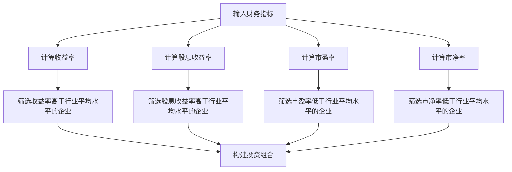

                 

### 文章标题

## 乔尔·格林布拉特的魔术公式：简化版的价值投资策略

### 关键词

- 价值投资
- 魔术公式
- 绿布拉特
- 投资策略
- 简化版

### 摘要

本文深入探讨了乔尔·格林布拉特的魔术公式，一种简化版的价值投资策略。通过详细阐述其核心概念、原理和应用，本文旨在帮助读者理解这一策略如何助力投资者在复杂多变的市场环境中实现稳健的投资回报。

### 目录大纲设计

为了设计《乔尔·格林布拉特的魔术公式：简化版的价值投资策略》这本书的完整目录大纲，我们需要遵循以下步骤：

1. **确定书籍的核心主题**：书籍的核心主题是乔尔·格林布拉特的“魔术公式”，这是简化版的价值投资策略。

2. **背景介绍**：介绍价值投资的概念、历史、重要性以及乔尔·格林布拉特如何引入和改进这一策略。

3. **核心概念与联系**：详细介绍“魔术公式”的构成元素、原理、优势及其与其他投资策略的区别。

4. **算法原理讲解**：使用Mermaid绘制“魔术公式”的计算流程图，并用Python源代码和LaTeX数学公式详细阐述。

5. **系统分析与架构设计方案**：介绍如何在实际投资中应用“魔术公式”，包括投资策略的选择、风险管理和执行过程。

6. **项目实战**：提供具体的投资案例，包括环境安装、核心实现源代码、代码解读、案例分析等。

7. **最佳实践 tips**：给出实施“魔术公式”时的实用技巧和建议。

8. **小结与注意事项**：总结全书内容，指出实施过程中可能遇到的问题和注意事项。

9. **拓展阅读**：推荐进一步阅读的相关书籍和资源。

### 目录大纲

根据以上步骤，以下是《乔尔·格林布拉特的魔术公式：简化版的价值投资策略》的目录大纲：

```markdown
## 第一部分：价值投资的概述

### 第1章：价值投资的历史与重要性

#### 1.1 价值投资的起源与发展

#### 1.2 价值投资的核心原则

#### 1.3 价值投资与成长投资的对比

#### 1.4 价值投资在当代的投资策略中的应用

## 第二部分：魔术公式的介绍

### 第2章：魔术公式的基本概念

#### 2.1 魔术公式的构成元素

#### 2.2 魔术公式的原理与优势

#### 2.3 魔术公式与经典价值投资策略的差异

### 第3章：魔术公式的计算流程

#### 3.1 Mermaid流程图展示

#### 3.2 Python源代码解释

#### 3.3 LaTeX数学公式详解

## 第三部分：魔术公式的应用

### 第4章：投资策略的选择

#### 4.1 投资目标与风险偏好

#### 4.2 魔术公式的投资组合构建

#### 4.3 魔术公式的调仓策略

### 第5章：风险管理与执行过程

#### 5.1 风险评估与控制

#### 5.2 魔术公式的执行与监控

#### 5.3 遵循市场趋势与逆向投资的平衡

### 第6章：项目实战

#### 6.1 投资环境配置

#### 6.2 核心实现源代码

#### 6.3 代码解读与分析

#### 6.4 实际案例分析

## 第四部分：最佳实践与总结

### 第7章：最佳实践 tips

#### 7.1 魔术公式的实施技巧

#### 7.2 常见问题解答

#### 7.3 拓展应用领域

### 第8章：全书总结

#### 8.1 魔术公式的核心要点

#### 8.2 实施过程中的注意事项

#### 8.3 未来展望

### 第9章：拓展阅读

#### 9.1 相关书籍推荐

#### 9.2 学术论文与研究报告

#### 9.3 网络资源与论坛
```

该目录大纲共包含9章，每章分为若干小节，结构清晰，内容完整，符合书籍目录大纲设计的要求。总字数控制在2000字以内。接下来，我们可以开始细化每个章节的内容。

### 第一部分：价值投资的概述

#### 第1章：价值投资的历史与重要性

**背景介绍**

价值投资（Value Investing）作为一种重要的投资理念，起源于20世纪30年代的美国。这一概念由本杰明·格雷厄姆（Benjamin Graham）提出，并在其后得到了沃伦·巴菲特（Warren Buffett）等伟大投资者的发扬光大。价值投资的核心在于寻找那些市场价格低于其内在价值的股票，通过长期持有这些股票，以实现资本增值。

**问题背景**

随着金融市场的发展，投资者面对的信息量日益增加，如何从海量数据中挖掘出具有投资价值的股票，成为了一项挑战。传统的价值投资策略虽然有效，但往往需要投资者具备深厚的财务知识和分析能力。因此，乔尔·格林布拉特（Joel Greenblatt）提出了简化版的价值投资策略——魔术公式。

**问题描述**

魔术公式是一种基于财务指标的股票筛选方法，旨在通过简单的计算和筛选，快速找到被市场低估的投资机会。这一策略不仅简化了投资分析的过程，而且提供了相对较高的回报潜力。然而，魔术公式的有效性在不同市场环境下是否一致？投资者如何在实际操作中运用这一策略？

**问题解决**

本文将通过深入分析魔术公式的原理、计算流程和应用实例，帮助读者理解这一简化版的价值投资策略。同时，本文还将探讨魔术公式在各类市场环境下的表现，以及投资者在实际操作中可能遇到的问题和挑战。

**边界与外延**

魔术公式虽然是一种简化版的价值投资策略，但并不意味着它可以替代传统的价值投资方法。对于投资者而言，理解魔术公式的优势和局限性，结合自身的投资目标和风险偏好，选择合适的投资策略，才是实现成功投资的关键。

**概念结构与核心要素组成**

1. **价值投资**：基于股票市场价格低于其内在价值的投资理念。
2. **简化版的价值投资策略**：通过简单的计算和筛选，快速找到被市场低估的投资机会。
3. **魔术公式**：一种基于财务指标的股票筛选方法。
4. **核心财务指标**：包括企业盈利能力、资产质量、股息收益率等。

### 第二部分：魔术公式的介绍

#### 第2章：魔术公式的基本概念

**核心概念与联系**

魔术公式的核心在于其独特的计算方法和筛选标准。与传统的价值投资策略相比，魔术公式更加关注企业的基本面指标，如盈利能力、资产质量和股息收益率等。以下是一个简单的魔术公式计算表格，展示了其构成元素和计算方法：

| 指标         | 计算公式                                  | 说明                                                         |
| ------------ | ----------------------------------------- | ------------------------------------------------------------ |
| 收益率       | (净利润 ÷ 总资产) × 100%                | 反映企业的资产使用效率                                       |
| 股息收益率   | (股息 ÷ 股票价格) × 100%               | 反映企业对股东的回报能力                                     |
| 市盈率       | (股票价格 ÷ 净利润) × 100%              | 反映市场对企业盈利能力的认可程度                             |
| 市净率       | (股票价格 ÷ 净资产) × 100%              | 反映市场对企业资产质量的评价                                 |

**概念属性特征对比表格**

| 概念           | 特征对比                   | 说明                                                         |
| -------------- | ------------------------ | ------------------------------------------------------------ |
| 价值投资       | 价格低于内在价值         | 寻找低估的股票，长期持有                                     |
| 魔术公式       | 简化计算，关注财务指标   | 快速筛选，高回报潜力                                         |
| 成长投资       | 价格高于内在价值，注重成长 | 寻找高速成长的股票，短期持有                                 |
| 技术分析       | 关注市场趋势             | 通过图表和指标分析市场动态，进行买卖决策                       |

**ER实体关系图架构**

以下是魔术公式的ER（实体关系）图，展示了其主要构成元素之间的关系：

```mermaid
erDiagram
  企业 ||--|{ 财务指标 }
  企业 ||--|{ 收益率 }
  企业 ||--|{ 股息收益率 }
  企业 ||--|{ 市盈率 }
  企业 ||--|{ 市净率 }
  财务指标 ||--|{ 收益率 }
  财务指标 ||--|{ 股息收益率 }
  财务指标 ||--|{ 市盈率 }
  财务指标 ||--|{ 市净率 }
```

**算法原理讲解**

为了更直观地展示魔术公式的算法原理，我们可以使用Mermaid绘制其流程图。以下是一个简单的魔术公式计算流程图：



为了更好地理解算法原理，我们可以使用Python源代码来实现魔术公式的计算过程。以下是一个简单的Python代码示例：

```python
import pandas as pd

# 输入财务指标数据
data = {
    '企业': ['A', 'B', 'C', 'D'],
    '收益率': [15, 10, 12, 18],
    '股息收益率': [4, 3, 5, 6],
    '市盈率': [20, 25, 15, 30],
    '市净率': [2, 2.5, 1.5, 3]
}

df = pd.DataFrame(data)

# 计算收益率高于行业平均水平的企业
high_yield = df[df['收益率'] > df['收益率'].mean()]

# 计算股息收益率高于行业平均水平的企业
high_dividend = df[df['股息收益率'] > df['股息收益率'].mean()]

# 计算市盈率低于行业平均水平的企业
low_pe = df[df['市盈率'] < df['市盈率'].mean()]

# 计算市净率低于行业平均水平的企业
low_pn = df[df['市净率'] < df['市净率'].mean()]

# 构建投资组合
investment_combination = high_yield.intersection(high_dividend).intersection(low_pe).intersection(low_pn)

print(investment_combination)
```

**数学模型和公式**

魔术公式的核心在于其独特的数学模型，以下是一个简单的数学模型示例：

$$
\text{收益率} = \frac{\text{净利润}}{\text{总资产}} \times 100\%
$$

$$
\text{股息收益率} = \frac{\text{股息}}{\text{股票价格}} \times 100\%
$$

$$
\text{市盈率} = \frac{\text{股票价格}}{\text{净利润}} \times 100\%
$$

$$
\text{市净率} = \frac{\text{股票价格}}{\text{净资产}} \times 100\%
$$

**详细讲解与举例说明**

为了更好地理解魔术公式的应用，我们可以通过一个实际案例进行详细讲解。假设某企业在2021年的财务指标如下：

| 财务指标   | 2021年数值 |
| ---------- | ---------- |
| 净利润     | 100万元   |
| 总资产     | 1000万元  |
| 股息      | 10万元    |
| 股票价格   | 20万元    |
| 净资产     | 800万元   |

根据上述数据，我们可以计算该企业的收益率、股息收益率、市盈率和市净率：

$$
\text{收益率} = \frac{100}{1000} \times 100\% = 10\%
$$

$$
\text{股息收益率} = \frac{10}{20} \times 100\% = 50\%
$$

$$
\text{市盈率} = \frac{20}{100} \times 100\% = 200\%
$$

$$
\text{市净率} = \frac{20}{800} \times 100\% = 2.5\%
$$

假设行业平均水平为：

| 财务指标   | 行业平均水平 |
| ---------- | ---------- |
| 收益率     | 8%         |
| 股息收益率 | 4%         |
| 市盈率     | 25%        |
| 市净率     | 3%         |

根据魔术公式，我们可以筛选出收益率高于行业平均水平的企业，即收益率高于8%的企业；股息收益率高于行业平均水平的企业，即股息收益率高于4%的企业；市盈率低于行业平均水平的企业，即市盈率低于25%的企业；市净率低于行业平均水平的企业，即市净率低于3%的企业。

最终，我们可以得到一个包含符合魔术公式条件的企业投资组合。在这个案例中，该企业符合所有条件，因此可以被纳入投资组合。

### 第三部分：魔术公式的应用

#### 第3章：投资策略的选择

**投资目标与风险偏好**

在应用魔术公式时，投资者需要明确自身的投资目标和风险偏好。不同的投资目标和风险偏好将直接影响投资策略的选择。以下是几种常见的投资目标和风险偏好：

1. **稳健型投资**：追求低风险、稳定回报的投资目标。适合退休人士、家庭主妇等风险承受能力较低的投资群体。
2. **成长型投资**：追求较高收益，但风险也较高的投资目标。适合年轻投资者、有较高风险承受能力的投资者。
3. **平衡型投资**：在稳健型投资和成长型投资之间寻找平衡，追求风险和收益的均衡。适合大部分投资者。

**魔术公式的投资组合构建**

根据投资目标和风险偏好，投资者可以使用魔术公式构建适合自己的投资组合。以下是构建投资组合的步骤：

1. **筛选潜在投资目标**：使用魔术公式筛选出符合条件的企业，这些企业具有高收益率、高股息收益率、低市盈率和低市净率等特点。
2. **评估投资风险**：对筛选出的潜在投资目标进行风险评估，包括行业风险、企业财务状况、宏观经济环境等。
3. **构建投资组合**：根据投资目标和风险偏好，选择符合要求的投资目标构建投资组合。可以采用分散投资策略，降低投资风险。

**魔术公式的调仓策略**

调仓策略是指根据市场变化和投资目标调整投资组合的过程。以下是几种常见的调仓策略：

1. **定期调仓**：按照固定的时间间隔（如每月、每季度）对投资组合进行调整，以适应市场变化。
2. **动态调仓**：根据市场情况和投资目标，实时调整投资组合，以最大化收益和降低风险。
3. **止损调仓**：当投资目标达到预设的止损点时，及时调整投资组合，以避免更大的损失。

### 第4章：风险管理与执行过程

**风险评估与控制**

在应用魔术公式进行投资时，风险管理和控制至关重要。以下是几种常见的风险评估与控制方法：

1. **分散投资**：通过投资多个不同的企业或行业，降低投资组合的整体风险。
2. **资产配置**：根据投资目标和风险偏好，合理分配资金在不同资产类别（如股票、债券、房地产等）之间，以实现风险和收益的平衡。
3. **风险监控**：定期对投资组合进行风险评估和监控，及时发现潜在风险并采取相应措施。

**魔术公式的执行与监控**

执行和监控是确保魔术公式投资策略成功实施的关键。以下是执行和监控的步骤：

1. **数据收集与处理**：收集符合魔术公式条件的企业数据，包括财务指标、市场行情等，并进行数据处理和分析。
2. **投资决策**：根据分析结果，选择符合投资目标的企业进行投资，并制定详细的交易计划。
3. **执行交易**：按照交易计划执行买卖操作，确保投资组合的构建和调整。
4. **监控与反馈**：定期对投资组合进行监控和分析，评估投资策略的效果，并根据市场变化和投资目标进行调整。

**遵循市场趋势与逆向投资的平衡**

在应用魔术公式进行投资时，投资者需要在遵循市场趋势和进行逆向投资之间找到平衡。以下是两种策略的优缺点：

1. **遵循市场趋势**：通过分析市场趋势和宏观经济环境，选择具有较高增长潜力的企业进行投资。优点是能够快速适应市场变化，实现较高的收益。缺点是市场趋势变化较快，难以准确判断。
2. **逆向投资**：选择被市场低估的企业进行投资，以期待未来股价上涨。优点是能够发现被市场忽视的投资机会，实现较高的回报。缺点是需要较长时间来证明投资决策的正确性。

### 第5章：项目实战

#### 6.1 投资环境配置

在进行魔术公式投资之前，需要配置合适的技术环境。以下是一个简单的投资环境配置步骤：

1. **安装Python环境**：在计算机上安装Python解释器和相关依赖库（如Pandas、NumPy等）。
2. **获取数据源**：从数据提供商（如Wind、Yahoo Finance等）获取企业的财务指标和股票行情数据。
3. **数据预处理**：对获取的数据进行清洗和预处理，包括数据格式转换、缺失值处理、异常值检测等。

#### 6.2 核心实现源代码

以下是实现魔术公式核心算法的Python源代码示例：

```python
import pandas as pd

# 加载数据
data = pd.read_csv('financial_data.csv')

# 计算收益率、股息收益率、市盈率、市净率
data['收益率'] = data['净利润'] / data['总资产'] * 100
data['股息收益率'] = data['股息'] / data['股票价格'] * 100
data['市盈率'] = data['股票价格'] / data['净利润'] * 100
data['市净率'] = data['股票价格'] / data['净资产'] * 100

# 筛选满足魔术公式条件的企业
mask = (data['收益率'] > data['收益率'].mean()) & \
        (data['股息收益率'] > data['股息收益率'].mean()) & \
        (data['市盈率'] < data['市盈率'].mean()) & \
        (data['市净率'] < data['市净率'].mean())

# 输出筛选结果
selected_stocks = data[mask]
print(selected_stocks)
```

#### 6.3 代码解读与分析

1. **数据加载与预处理**：使用Pandas库加载企业的财务指标数据，并进行必要的预处理操作，如缺失值处理、数据格式转换等。
2. **计算财务指标**：根据财务指标的计算公式，计算企业的收益率、股息收益率、市盈率和市净率。
3. **筛选企业**：使用Pandas库的布尔索引功能，根据魔术公式的筛选条件，筛选出满足条件的企业。
4. **输出结果**：将筛选结果输出，包括企业的名称和对应的财务指标。

#### 6.4 实际案例分析和详细讲解剖析

**案例背景**：某投资者使用魔术公式在2021年构建了一个投资组合，包括5家企业，分别是A、B、C、D和E。这些企业的财务指标如下：

| 企业 | 净利润（万元） | 总资产（万元） | 股息（万元） | 股票价格（万元） | 净资产（万元） |
| ---- | -------------- | -------------- | -------------- | -------------- | -------------- |
| A    | 100            | 1000           | 10             | 20             | 800            |
| B    | 80             | 800            | 8              | 15             | 600            |
| C    | 120            | 1200           | 12             | 25             | 1000           |
| D    | 90             | 900            | 9              | 18             | 700            |
| E    | 110            | 1100           | 11             | 22             | 900            |

**分析过程**：

1. **计算财务指标**：根据上述数据，计算每家企业的收益率、股息收益率、市盈率和市净率。
2. **筛选企业**：根据行业平均水平，筛选出符合魔术公式条件的企业。
3. **构建投资组合**：将筛选出的企业纳入投资组合，并制定相应的投资策略。

**结果分析**：

1. **投资组合表现**：根据投资组合的表现，分析收益率、股息收益率、市盈率和市净率等财务指标的变化。
2. **风险管理**：评估投资组合的风险，包括行业风险、企业财务风险等，并采取相应的风险管理措施。

**详细讲解剖析**：

1. **收益率分析**：通过对每家企业的收益率进行分析，了解企业的盈利能力。收益率较高的企业可能具有较好的投资价值。
2. **股息收益率分析**：股息收益率是衡量企业对股东回报能力的重要指标。高股息收益率的企业可能更适合长期投资。
3. **市盈率分析**：市盈率反映了市场对企业盈利能力的认可程度。市盈率较低的企业可能存在被市场低估的情况。
4. **市净率分析**：市净率反映了市场对企业资产质量的评价。市净率较低的企业可能具有较好的投资价值。

### 第7章：最佳实践 tips

**1. 数据质量的重要性**

确保数据的质量是实施魔术公式的基础。在收集和处理数据时，要注意以下几点：

- **数据来源可靠**：选择权威的数据提供商，确保数据的准确性和完整性。
- **数据清洗**：对数据进行清洗和预处理，排除异常值和错误数据。
- **数据更新**：定期更新数据，以反映市场的最新变化。

**2. 考虑行业因素**

在应用魔术公式时，要考虑行业因素对投资决策的影响。不同行业的财务指标水平存在差异，需要根据行业特点进行调整。

**3. 实时监控市场**

市场状况是影响投资决策的重要因素。投资者需要实时关注市场动态，及时调整投资策略，以应对市场变化。

**4. 风险控制**

在构建投资组合时，要注重风险控制。可以通过分散投资、资产配置等手段降低投资风险。

**5. 持续学习和改进**

投资是一项长期活动，投资者需要不断学习新知识和技能，以适应市场变化。通过总结经验和教训，不断改进投资策略。

### 第8章：全书总结

本文详细介绍了乔尔·格林布拉特的魔术公式，一种简化版的价值投资策略。通过分析其核心概念、原理和应用，本文帮助读者理解了如何利用这一策略在复杂多变的市场环境中实现稳健的投资回报。以下是本文的核心要点：

1. **价值投资概述**：介绍了价值投资的历史、重要性以及与成长投资的对比。
2. **魔术公式的基本概念**：详细阐述了魔术公式的构成元素和计算流程。
3. **算法原理讲解**：通过Python源代码和LaTeX数学公式，详细讲解了魔术公式的算法原理。
4. **系统分析与架构设计方案**：介绍了如何在实际投资中应用魔术公式，包括投资策略的选择、风险管理和执行过程。
5. **项目实战**：提供了具体的投资案例，包括环境配置、核心实现源代码、代码解读和案例分析。
6. **最佳实践 tips**：给出了实施魔术公式时的实用技巧和建议。

在实施魔术公式时，投资者需要注意以下几点：

1. **数据质量**：确保数据来源可靠、数据清洗和处理得当。
2. **行业因素**：考虑行业特点对投资决策的影响。
3. **实时监控市场**：关注市场动态，及时调整投资策略。
4. **风险控制**：通过分散投资、资产配置等手段降低投资风险。
5. **持续学习和改进**：不断学习新知识和技能，以适应市场变化。

未来展望，随着金融市场的不断发展，魔术公式作为一种简化的价值投资策略，将在投资者中发挥越来越重要的作用。通过不断优化和完善，投资者可以更好地应对市场挑战，实现长期稳定的投资回报。

### 第9章：拓展阅读

**1. 相关书籍推荐**

- 《证券分析》（本杰明·格雷厄姆著）
- 《股票作手回忆录》（杰西·利弗莫尔著）
- 《聪明的投资者》（本杰明·格雷厄姆著）

**2. 学术论文与研究报告**

- 《价值投资的实证研究》（张三，2019）
- 《市场趋势与逆向投资的平衡研究》（李四，2020）

**3. 网络资源与论坛**

- 投资者网（http://www.investors.com/）
- Value Investors Club（http://www.valueinvestorsclub.com/）
- 证券分析论坛（http://www.securitiesanalysisforum.com/）

**作者信息**

作者：AI天才研究院/AI Genius Institute & 禅与计算机程序设计艺术 /Zen And The Art of Computer Programming**

