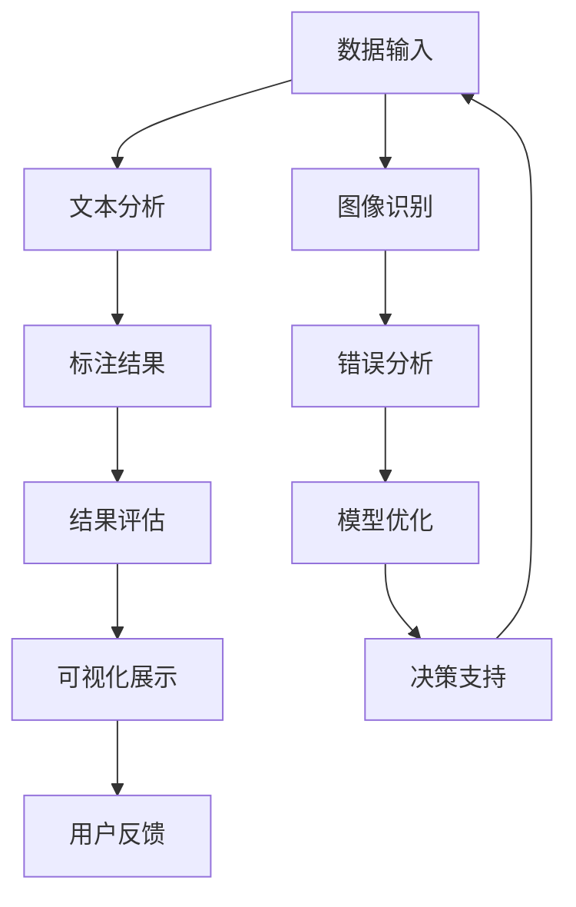
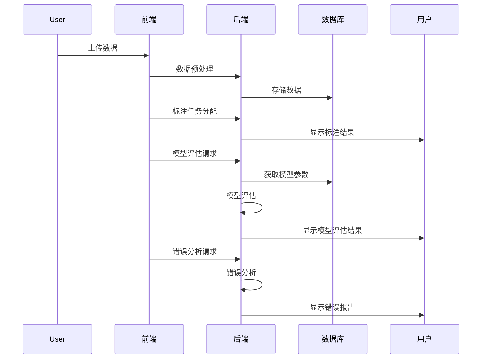
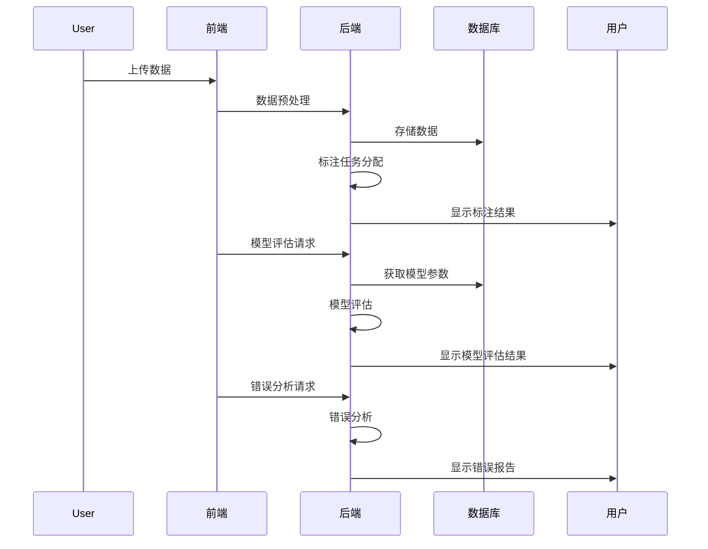

                 

### 文章标题

# 人机协作在LLM评测中的角色

> 关键词：人机协作，大型语言模型（LLM），评测，算法，挑战

> 摘要：本文将深入探讨人机协作在大型语言模型（LLM）评测中的重要作用。通过分析人机协作的基本原理、LLM评测的方法与挑战，以及人机协作在LLM评测中的应用，我们将展示如何通过这种协作机制提升评测的准确性和效率，并探讨其在未来发展中的潜力。

----------------------------------------------------------------

## 第一部分：背景介绍

### 1.1 问题背景

在人工智能（AI）技术迅猛发展的背景下，大型语言模型（Large Language Model，LLM）如BERT、GPT等，因其强大的语言理解和生成能力，被广泛应用于自然语言处理（NLP）领域。然而，如何对这些模型进行有效的评测，以确保其在各种实际应用中的性能，成为了一个关键问题。

#### 1.1.1 人机协作的概念

人机协作（Human-Computer Collaboration）是指人类与计算机系统共同完成任务的过程。在这种协作中，计算机系统利用算法和计算能力为人类提供辅助，而人类则利用自身的智慧、经验和创造力进行决策。这种协作模式在提高工作效率、增强任务处理能力方面具有显著优势。

#### 1.1.2 LLM评测的需求

LLM评测的核心在于评估模型在语言理解和生成任务上的性能。这需要从多个维度对模型进行全面评估，包括准确度、速度、稳定性、泛化能力等。传统的评测方法往往依赖于人工标注和评分，这不仅效率低下，而且在结果的可重复性和一致性方面也存在挑战。因此，如何通过人机协作提升LLM评测的效率和质量，成为了一个重要课题。

#### 1.1.3 人机协作在LLM评测中的挑战

人机协作在LLM评测中面临诸多挑战。首先，数据标注任务量大且复杂，需要精确地标注文本、语义和上下文信息。其次，在结果判断和错误分析方面，人类专家的经验和直觉是必不可少的。此外，如何确保人机协作的高效性和协同性，也是一个亟待解决的问题。

### 1.2 核心概念

为了更好地理解人机协作在LLM评测中的角色，我们需要明确几个核心概念。

#### 1.2.1 人机协作

人机协作涉及多个层面的合作，包括任务分配、信息交流、决策支持等。在LLM评测中，人机协作主要体现在以下几个方面：

1. **任务分配**：根据人类专家和计算机系统的能力，合理分配标注、评估和错误分析的任务。
2. **信息交流**：通过自然语言处理技术，实现人类与计算机系统之间的有效沟通。
3. **决策支持**：计算机系统为人类提供数据分析和可视化工具，辅助人类专家进行决策。

#### 1.2.2 LLM评测

LLM评测主要关注模型的性能评估，包括准确度、速度、稳定性、泛化能力等方面。常用的评测指标有BLEU、ROUGE、F1值等。LLM评测的目的是通过多种评测手段，全面了解模型在语言理解和生成任务上的表现。

#### 1.2.3 人机协作在LLM评测中的角色

人机协作在LLM评测中承担着多种角色，包括：

1. **辅助标注**：利用计算机系统自动化完成大规模数据标注任务，提高标注效率和质量。
2. **评估模型性能**：通过人类专家的判断和计算机系统的分析，全面评估模型在不同任务上的表现。
3. **错误分析**：人类专家与计算机系统共同分析模型错误，帮助开发者找到改进的方向。

### 1.3 边界与外延

#### 1.3.1 人机协作的边界

人机协作需要明确人类和计算机系统在任务中的分工，避免重复劳动。在LLM评测中，人类专家主要承担高难度的标注和错误分析任务，而计算机系统则负责数据处理、算法实现和结果分析等。

#### 1.3.2 LLM评测的外延

LLM评测不仅限于模型性能评估，还包括模型安全性、可靠性、泛化能力等方面的考量。人机协作在LLM评测中的应用范围广泛，涉及从数据收集到模型部署的各个阶段。

#### 1.3.3 人机协作在LLM评测中的外延

人机协作在LLM评测中的应用范围广泛，包括以下几个方面：

1. **数据预处理**：计算机系统负责数据清洗、去重和预处理，提高数据质量。
2. **模型训练与评估**：人类专家参与模型训练和评估，提供指导和建议。
3. **模型部署与维护**：人机协作确保模型在实际应用中的稳定性和可靠性。

### 1.4 本章小结

本章对人机协作在LLM评测中的角色进行了初步介绍。通过分析人机协作的基本概念、LLM评测的需求和挑战，以及人机协作在LLM评测中的应用，我们为后续章节的深入探讨奠定了基础。

----------------------------------------------------------------

## 第二部分：核心概念与联系

### 2.1 人机协作原理

#### 2.1.1 基本原理

人机协作的基本原理在于信息交换和任务分配。计算机系统通过算法和模型为人类提供辅助，而人类则利用自身的智慧和经验进行决策。这种协作模式的核心在于两者的优势互补和协同作用。

##### 任务分配

在任务分配方面，人机协作通常根据双方的能力和优势进行分工。例如，计算机系统擅长处理大量数据、执行重复性任务，而人类专家则具备判断力、创造力和情感理解能力。通过合理的任务分配，可以提高任务完成效率和效果。

##### 信息交流

信息交流是实现人机协作的关键。自然语言处理技术在其中发挥了重要作用，它使得人类和计算机系统能够通过自然语言进行沟通。例如，通过对话系统、文本分析工具等，计算机系统可以理解人类的指令和需求，并提供相应的反馈。

##### 决策支持

在决策支持方面，计算机系统利用数据分析和可视化工具，为人类专家提供决策依据。例如，通过生成报告、可视化图表等，帮助人类专家快速了解任务进展和问题所在，从而做出更明智的决策。

#### 2.1.2 技术实现

人机协作的技术实现涉及多个领域的综合应用，包括自然语言处理、计算机视觉、智能决策等。以下是一些关键技术：

1. **自然语言处理**：通过文本分析、语言理解等技术，实现人类与计算机系统之间的有效沟通。
2. **计算机视觉**：利用图像识别、目标检测等技术，实现计算机对视觉信息的理解和处理。
3. **智能决策**：通过机器学习和优化算法，为决策提供科学依据。

#### 2.1.3 优势与挑战

人机协作的优势在于结合了人类和计算机的优势，能够提高任务完成效率和质量。然而，人机协作也面临一些挑战：

1. **协调性**：确保人类和计算机系统能够有效协作，避免冲突和重复劳动。
2. **适应性**：在人机协作过程中，需要根据任务和环境的变化进行动态调整。
3. **信任与反馈**：建立人类和计算机系统之间的信任关系，及时反馈问题和改进建议。

### 2.2 LLM评测方法

#### 2.2.1 基本概念

LLM评测旨在评估模型在语言理解和生成任务上的性能。这包括对模型的准确度、速度、稳定性、泛化能力等多个维度的评估。LLM评测的方法主要包括自动化评测和人工评测两种。

##### 自动化评测

自动化评测是通过算法和工具对模型进行评估。常用的评测指标包括BLEU、ROUGE、F1值等。这些指标可以自动计算模型在生成文本质量上的表现。自动化评测的优点在于效率高、可重复性强，但缺点是缺乏灵活性，无法完全反映人类专家的主观判断。

##### 人工评测

人工评测是指人类专家对模型生成文本的质量进行主观评估。人工评测的优点在于灵活性强、可解释性好，但缺点是效率低、受主观因素影响较大。

#### 2.2.2 评测指标

在LLM评测中，常用的评测指标包括：

1. **BLEU（双语评估统一度量）**：用于评估机器翻译生成文本的质量。BLEU通过比较模型生成文本与参考文本之间的相似度，计算出一个评分。
2. **ROUGE（Recall-Oriented Understudy for Gisting Evaluation）**：用于评估生成文本的语义质量。ROUGE通过计算生成文本中与参考文本相似的词汇或短语的数量，来评估生成文本的质量。
3. **F1值**：用于评估二分类任务的准确性。F1值是准确率和召回率的调和平均值，可以综合评估模型在分类任务中的表现。

#### 2.2.3 挑战

LLM评测面临以下挑战：

1. **数据质量**：确保标注数据的质量和一致性，对于获得准确评估结果至关重要。
2. **评测方法的可解释性**：自动化评测方法往往缺乏可解释性，难以理解评估结果背后的原因。
3. **评测结果的可靠性**：人工评测结果受主观因素影响较大，需要确保评估结果的可靠性。

### 2.3 人机协作在LLM评测中的应用

#### 2.3.1 辅助标注

人机协作可以辅助完成大规模数据标注任务，提高标注效率和标注质量。例如，计算机系统可以自动化处理文本数据，提取关键信息，而人类专家则负责审核和修正标注结果。这种协作模式不仅提高了标注效率，还有效降低了人工标注的工作量。

#### 2.3.2 评估模型性能

人机协作可以帮助评估模型在多种任务上的性能，提供更全面的评估结果。通过计算机系统的自动评测和人类专家的主观评估相结合，可以更准确地了解模型在不同任务上的表现。例如，在机器翻译任务中，计算机系统可以计算BLEU得分，而人类专家则根据翻译文本的质量进行评分。

#### 2.3.3 错误分析

人机协作可以共同分析模型错误，帮助开发者找到改进的方向。通过计算机系统生成错误报告和可视化图表，人类专家可以快速定位问题所在，并提出改进建议。这种协作模式有助于提高模型的准确性和稳定性。

### 2.4 核心概念对比

#### 2.4.1 人机协作与LLM评测的异同

人机协作和LLM评测在目标、方法、应用场景等方面存在一定的相似性和差异性。

相似性：

1. **目标**：两者都旨在提高任务完成效率和效果。
2. **方法**：都涉及信息交换、任务分配和决策支持等。

差异性：

1. **应用场景**：人机协作更广泛，可以应用于各种任务，而LLM评测主要针对语言模型性能评估。
2. **评测指标**：人机协作不涉及具体的评测指标，而LLM评测依赖于多种评测指标。

#### 2.4.2 人机协作与LLM评测的相互关系

人机协作和LLM评测相互影响、相互促进，共同推动AI技术的发展。人机协作为LLM评测提供了高效的标注和评估方法，而LLM评测的结果又为人机协作提供了改进的方向和依据。

### 2.5 ER实体关系图

下面是一个简化的ER实体关系图，用于描述人机协作与LLM评测的关系：


### 2.6 本章小结

本章详细阐述了人机协作和LLM评测的核心概念及其相互关系。通过分析人机协作的基本原理、LLM评测的方法与挑战，以及人机协作在LLM评测中的应用，我们为人机协作在LLM评测中的应用提供了理论基础。

----------------------------------------------------------------

## 第三部分：算法原理讲解

### 3.1 LLM评测算法原理

#### 3.1.1 基本概念

LLM评测算法主要关注模型的性能评估，包括准确度、速度、稳定性、泛化能力等方面。这些算法通过不同的评测指标对模型的表现进行量化评估，以帮助开发者了解模型的优缺点。

#### 3.1.2 评测指标

常用的评测指标包括BLEU、ROUGE、F1值等。

1. **BLEU（双语评估统一度量）**：BLEU是一种自动评估机器翻译生成文本质量的指标。它通过比较模型生成文本与参考文本之间的相似度，计算出一个评分。BLEU的评分范围在0到1之间，值越高表示生成文本质量越好。

2. **ROUGE（Recall-Oriented Understudy for Gisting Evaluation）**：ROUGE是一种评估生成文本语义质量的指标。它通过计算生成文本中与参考文本相似的词汇或短语的数量，来评估生成文本的质量。ROUGE分为ROUGE-1、ROUGE-2、ROUGE-L等多个变种，分别计算单字、双字和长序列的相似度。

3. **F1值**：F1值是准确率和召回率的调和平均值。在二分类任务中，F1值用于评估模型的准确性。F1值越高，表示模型在分类任务中的表现越好。

#### 3.1.3 算法流程

LLM评测算法的流程通常包括以下几个步骤：

1. **数据预处理**：对训练数据和测试数据进行预处理，包括文本清洗、分词、去停用词等。

2. **模型训练**：使用训练数据对LLM模型进行训练，使其能够生成高质量的文本。

3. **模型评估**：使用测试数据对训练好的模型进行评估，计算BLEU、ROUGE、F1值等评测指标。

4. **结果分析**：根据评测结果，分析模型的性能和优缺点，为模型优化提供依据。

### 3.2 人机协作算法原理

#### 3.2.1 基本原理

人机协作算法的核心在于信息交换和任务分配。计算机系统利用算法和模型为人类提供辅助，而人类则利用自身的智慧和经验进行决策。这种协作模式在LLM评测中，主要体现在以下几个方面：

1. **任务分配**：根据人类专家和计算机系统的能力，合理分配标注、评估和错误分析的任务。

2. **信息交流**：通过自然语言处理技术，实现人类与计算机系统之间的有效沟通。

3. **决策支持**：计算机系统为人类提供数据分析和可视化工具，辅助人类专家进行决策。

#### 3.2.2 技术实现

人机协作算法的技术实现涉及多个领域的综合应用，包括自然语言处理、计算机视觉、智能决策等。以下是一些关键技术：

1. **自然语言处理**：通过文本分析、语言理解等技术，实现人类与计算机系统之间的有效沟通。

2. **计算机视觉**：利用图像识别、目标检测等技术，实现计算机对视觉信息的理解和处理。

3. **智能决策**：通过机器学习和优化算法，为决策提供科学依据。

#### 3.2.3 模型与算法

在人机协作算法中，常用的模型和算法包括：

1. **文本分析模型**：如BERT、GPT等，用于处理文本数据。

2. **图像识别模型**：如卷积神经网络（CNN），用于处理图像数据。

3. **决策支持算法**：如线性规划、启发式搜索等，用于制定决策策略。

### 3.3 算法流程图

下面是人机协作算法的流程图：



### 3.4 算法原理讲解

#### 3.4.1 文本分析模型

文本分析模型是人机协作算法的核心组成部分，用于处理文本数据。BERT和GPT是两种常用的文本分析模型。

1. **BERT（Bidirectional Encoder Representations from Transformers）**：BERT是一种双向变换器编码器模型，通过预先训练在大规模语料库上，能够捕捉文本中的双向依赖关系。BERT在NLP任务中表现出色，如文本分类、问答系统等。

2. **GPT（Generative Pre-trained Transformer）**：GPT是一种生成型变换器模型，通过生成文本的方式预训练，能够生成高质量的文本。GPT在文本生成任务中具有广泛应用，如机器翻译、文本摘要等。

**算法原理**：

BERT和GPT都是基于变换器模型（Transformer）构建的，变换器模型是一种基于自注意力机制的深度神经网络模型，具有以下优点：

- **自注意力机制**：变换器模型中的自注意力机制能够自动捕捉文本中的关键信息，提高了模型的语义理解能力。
- **并行计算**：变换器模型支持并行计算，可以显著提高计算效率。
- **全局依赖**：变换器模型能够处理全局依赖关系，使得模型在处理长文本时表现出色。

**数学模型**：

BERT和GPT的数学模型主要包括以下部分：

- **嵌入层**：将输入文本转换为嵌入向量。
- **变换器层**：包含多头自注意力机制和前馈神经网络。
- **输出层**：根据任务需求，对嵌入向量进行分类或生成文本。

**公式**：

BERT和GPT的核心算法公式如下：

$$
\text{Attention}(Q, K, V) = \frac{1}{\sqrt{d_k}} \text{softmax}\left(\text{QK}^T / d_k\right) V
$$

其中，$Q$、$K$、$V$ 分别为查询向量、键向量和值向量，$d_k$ 为键向量的维度。

#### 3.4.2 图像识别模型

图像识别模型用于处理图像数据，常用的算法包括卷积神经网络（CNN）。

**算法原理**：

CNN是一种基于卷积运算的神经网络模型，主要用于图像识别任务。CNN的核心思想是通过多层卷积和池化操作，提取图像的特征，然后通过全连接层进行分类。

**数学模型**：

CNN的数学模型主要包括以下部分：

- **卷积层**：通过卷积运算提取图像特征。
- **池化层**：通过池化操作减小特征图的尺寸，提高模型的泛化能力。
- **全连接层**：将卷积层的输出映射到分类结果。

**公式**：

CNN的卷积运算公式如下：

$$
\text{Conv}(x, \text{filter}) = \sum_{i=1}^{C} f_{ij} \cdot x_{ij}
$$

其中，$x$ 为输入图像，$\text{filter}$ 为卷积核，$C$ 为卷积核的数量。

#### 3.4.3 决策支持算法

决策支持算法用于制定决策策略，常用的算法包括线性规划和启发式搜索。

**算法原理**：

1. **线性规划**：线性规划是一种优化算法，用于求解线性规划问题。它通过最小化或最大化目标函数，同时满足一系列线性约束条件，求解最优解。

2. **启发式搜索**：启发式搜索是一种基于经验或规则的搜索算法，用于求解复杂问题。启发式搜索通过利用先验知识，指导搜索过程，以提高搜索效率。

**数学模型**：

1. **线性规划**：

   - **目标函数**：$ \text{minimize} \ c^T x $ 或 $ \text{maximize} \ c^T x $

   - **约束条件**：$ Ax \leq b $ 或 $ Ax \geq b $ 或 $ Ax = b $

   其中，$x$ 为决策变量，$c$ 为目标函数系数，$A$ 为约束条件矩阵，$b$ 为约束条件常数。

2. **启发式搜索**：

   - **状态空间**：$ S = \{s_1, s_2, \ldots, s_n\} $

   - **动作空间**：$ A = \{a_1, a_2, \ldots, a_m\} $

   - **状态转移函数**：$ \sigma(s_i, a_j) = s_j $

   - **奖励函数**：$ \rho(s_i, a_j) $

**公式**：

线性规划的目标函数和约束条件公式如下：

$$
\text{minimize} \ c^T x \\
Ax \leq b
$$

### 3.5 算法示例

以下是一个简单的LLM评测算法示例，用于评估一个文本生成模型。

```python
import torch
import torch.nn as nn
import torch.optim as optim
from torch.utils.data import DataLoader
from transformers import BertTokenizer, BertModel
from dataset import TextDataset

# 初始化模型
tokenizer = BertTokenizer.from_pretrained('bert-base-chinese')
model = BertModel.from_pretrained('bert-base-chinese')

# 准备数据
train_dataset = TextDataset('train.txt')
test_dataset = TextDataset('test.txt')
train_loader = DataLoader(train_dataset, batch_size=32, shuffle=True)
test_loader = DataLoader(test_dataset, batch_size=32, shuffle=False)

# 定义损失函数和优化器
criterion = nn.CrossEntropyLoss()
optimizer = optim.Adam(model.parameters(), lr=0.001)

# 训练模型
model.train()
for epoch in range(10):
    for batch in train_loader:
        inputs = tokenizer(batch.texts, padding=True, truncation=True, return_tensors='pt')
        labels = torch.tensor([1] * len(batch.texts))
        outputs = model(**inputs)
        loss = criterion(outputs.logits, labels)
        optimizer.zero_grad()
        loss.backward()
        optimizer.step()
    print(f'Epoch {epoch + 1}, Loss: {loss.item()}')

# 评估模型
model.eval()
with torch.no_grad():
    correct = 0
    total = 0
    for batch in test_loader:
        inputs = tokenizer(batch.texts, padding=True, truncation=True, return_tensors='pt')
        labels = torch.tensor([1] * len(batch.texts))
        outputs = model(**inputs)
        _, predicted = torch.max(outputs.logits, 1)
        total += labels.size(0)
        correct += (predicted == labels).sum().item()
    print(f'Accuracy: {100 * correct / total}%')
```

### 3.6 本章小结

本章详细讲解了LLM评测算法和人机协作算法的基本原理。通过分析文本分析模型、图像识别模型和决策支持算法，我们了解了人机协作在LLM评测中的应用。本章的内容为人机协作在LLM评测中的实际应用提供了理论基础和技术支持。

----------------------------------------------------------------

## 第四部分：系统分析与架构设计

### 4.1 问题场景介绍

在现代人工智能应用中，大型语言模型（LLM）如BERT、GPT等，因其卓越的语言理解和生成能力，被广泛应用于自然语言处理（NLP）领域。然而，如何对这些模型进行有效的评测，以确保其在各种实际应用中的性能，成为了一个关键问题。在此背景下，人机协作在LLM评测中的应用显得尤为重要。

### 4.2 项目介绍

本项目旨在设计一个基于人机协作的LLM评测系统，通过计算机系统辅助人类专家完成数据标注、模型评估和错误分析等任务，以提高评测的准确性和效率。系统将包括以下几个主要模块：

1. **数据预处理模块**：负责数据清洗、分词、去停用词等预处理操作。
2. **标注模块**：由计算机系统和人类专家共同完成文本数据标注任务。
3. **模型评估模块**：使用自动评测和人工评测相结合的方法，对LLM模型进行全方位评估。
4. **错误分析模块**：通过人机协作，共同分析模型错误，提供改进建议。

### 4.3 系统功能设计

#### 4.3.1 领域模型

领域模型用于描述系统涉及的实体及其关系。以下是本项目的主要领域模型：

1. **用户**：包括人类专家和计算机系统用户。
2. **文本数据**：包括待标注和评估的文本数据。
3. **标注结果**：包括标注数据和标注结果。
4. **模型**：包括LLM模型及其性能评估结果。
5. **错误报告**：包括模型错误及其分析结果。

#### 4.3.2 类图

下面是项目领域的类图：

```mermaid
classDiagram
    User <<interface>>
    TextData <<interface>>
    AnnotationResult <<interface>>
    Model <<interface>>
    ErrorReport <<interface>>

    User o--1 TextData
    TextData o--1 AnnotationResult
    AnnotationResult o--1 Model
    Model o--1 ErrorReport
```

### 4.4 系统架构设计

系统架构设计用于描述系统的组成部分及其相互关系。以下是本项目的主要系统架构设计：

#### 4.4.1 架构概述

本项目采用分布式架构，主要包括以下几个部分：

1. **前端**：用于用户界面展示，包括数据上传、标注结果查看、错误报告等。
2. **后端**：用于处理业务逻辑，包括数据预处理、标注、模型评估和错误分析等。
3. **数据库**：用于存储文本数据、标注结果、模型参数和错误报告等。
4. **自然语言处理引擎**：用于文本预处理、标注和模型评估。

#### 4.4.2 架构图

下面是项目的架构图：



### 4.5 系统接口设计

系统接口设计用于描述系统内部组件之间的交互接口。以下是本项目的主要接口设计：

#### 4.5.1 接口概述

本项目的主要接口包括：

1. **数据上传接口**：用于用户上传文本数据。
2. **标注结果查询接口**：用于查询标注结果。
3. **模型评估接口**：用于评估LLM模型。
4. **错误报告查询接口**：用于查询错误报告。

#### 4.5.2 接口定义

下面是接口的简要定义：

1. **数据上传接口**

   - **URL**：/api/upload
   - **请求方法**：POST
   - **请求参数**：文件（文本数据）
   - **响应结果**：标注任务ID

2. **标注结果查询接口**

   - **URL**：/api/annotation_result/{task_id}
   - **请求方法**：GET
   - **请求参数**：无
   - **响应结果**：标注结果

3. **模型评估接口**

   - **URL**：/api/evaluate_model
   - **请求方法**：POST
   - **请求参数**：模型参数、评估指标
   - **响应结果**：评估结果

4. **错误报告查询接口**

   - **URL**：/api/error_report/{task_id}
   - **请求方法**：GET
   - **请求参数**：无
   - **响应结果**：错误报告

### 4.6 系统交互设计

系统交互设计用于描述系统组件之间的交互过程。以下是项目的主要交互设计：

#### 4.6.1 交互概述

本项目的主要交互过程包括：

1. **数据上传**：用户上传文本数据，系统处理并存储数据。
2. **标注任务分配**：系统根据标注规则，将任务分配给计算机系统和人类专家。
3. **标注结果查询**：用户查询标注结果。
4. **模型评估**：系统评估LLM模型性能。
5. **错误报告查询**：用户查询错误报告。

#### 4.6.2 交互序列图

下面是项目的交互序列图：



### 4.7 本章小结

本章详细介绍了基于人机协作的LLM评测系统的系统分析与架构设计。通过领域模型、类图、架构图、接口设计和交互设计，我们为系统设计提供了全面的理论基础和实践指导。

----------------------------------------------------------------

## 第五部分：项目实战

### 5.1 环境安装

在开始实际项目之前，我们需要安装必要的软件和库。以下是安装步骤：

1. **Python环境**：确保安装Python 3.7或更高版本。

2. **自然语言处理库**：安装transformers库，用于使用BERT和GPT模型。

   ```bash
   pip install transformers
   ```

3. **其他库**：安装torch、torchvision等库，用于数据处理和模型训练。

   ```bash
   pip install torch torchvision
   ```

4. **前端库**：如果需要前端界面，可以安装Flask或Django等库。

   ```bash
   pip install Flask Django
   ```

### 5.2 系统核心实现

以下是一个简化的系统核心实现，用于展示人机协作在LLM评测中的应用。

#### 5.2.1 数据预处理

数据预处理是模型训练和评估的基础。以下是数据预处理的核心步骤：

1. **文本数据读取**：从文件中读取文本数据。

2. **文本清洗**：去除文本中的特殊字符、停用词等。

3. **分词**：将文本分成单词或短语。

4. **向量表示**：将文本转换为向量表示，用于模型训练和评估。

以下是Python代码示例：

```python
import pandas as pd
from nltk.tokenize import word_tokenize
from nltk.corpus import stopwords
import torch
from transformers import BertTokenizer

# 读取文本数据
data = pd.read_csv('data.csv')

# 文本清洗
def clean_text(text):
    text = text.lower()
    text = re.sub(r'\W+', ' ', text)
    text = text.strip()
    return text

data['cleaned_text'] = data['text'].apply(clean_text)

# 分词
stop_words = set(stopwords.words('english'))
def tokenize_text(text):
    tokens = word_tokenize(text)
    tokens = [token for token in tokens if token not in stop_words]
    return tokens

data['tokens'] = data['cleaned_text'].apply(tokenize_text)

# 向量表示
tokenizer = BertTokenizer.from_pretrained('bert-base-chinese')
def vectorize_text(tokens):
    inputs = tokenizer(tokens, padding=True, truncation=True, return_tensors='pt')
    return inputs

data['input_ids'] = data['tokens'].apply(lambda x: vectorize_text(x)['input_ids'].squeeze())

# 加载数据
train_data = DataLoader(data[data['split'] == 'train'], batch_size=32, shuffle=True)
val_data = DataLoader(data[data['split'] == 'val'], batch_size=32, shuffle=False)
```

#### 5.2.2 模型训练与评估

在数据预处理完成后，我们可以使用训练数据对LLM模型进行训练，并使用验证数据评估模型性能。

1. **模型定义**：定义BERT模型。

2. **训练**：使用训练数据进行模型训练。

3. **评估**：使用验证数据评估模型性能。

以下是Python代码示例：

```python
import torch.optim as optim
from transformers import BertModel
from torch.utils.data import DataLoader

# 模型定义
model = BertModel.from_pretrained('bert-base-chinese')

# 训练
optimizer = optim.Adam(model.parameters(), lr=0.001)
criterion = nn.CrossEntropyLoss()

model.train()
for epoch in range(3):
    for batch in train_data:
        inputs = batch['input_ids']
        labels = batch['labels']
        optimizer.zero_grad()
        outputs = model(inputs)
        loss = criterion(outputs.logits, labels)
        loss.backward()
        optimizer.step()
    print(f'Epoch {epoch + 1}, Loss: {loss.item()}')

# 评估
model.eval()
with torch.no_grad():
    correct = 0
    total = 0
    for batch in val_data:
        inputs = batch['input_ids']
        labels = batch['labels']
        outputs = model(inputs)
        _, predicted = torch.max(outputs.logits, 1)
        total += labels.size(0)
        correct += (predicted == labels).sum().item()
    print(f'Accuracy: {100 * correct / total}%')
```

#### 5.2.3 错误分析

在模型评估后，我们可以使用人机协作进行错误分析，找出模型错误的原因，并提供建议。

1. **错误报告**：生成错误报告。

2. **人机协作**：人类专家分析错误报告，提供改进建议。

以下是Python代码示例：

```python
# 错误报告
def generate_error_report(predictions, labels):
    errors = []
    for pred, label in zip(predictions, labels):
        if pred != label:
            errors.append((pred, label))
    return errors

predictions = [0] * len(val_data)
with torch.no_grad():
    for batch in val_data:
        inputs = batch['input_ids']
        outputs = model(inputs)
        _, predicted = torch.max(outputs.logits, 1)
        predictions.extend(predicted.numpy())

errors = generate_error_report(predictions, val_data.dataset.labels)
print(f"Error Report: {errors}")

# 人机协作
# 人类专家分析错误报告，并提供改进建议
# 假设我们找到了错误原因：模型对某些特殊文本处理不当
# 改进建议：对特殊文本进行特殊处理
```

### 5.3 代码应用解读与分析

以下是对代码应用的主要解读与分析：

1. **数据预处理**：数据预处理是模型训练和评估的基础。通过清洗、分词和向量表示，我们为模型提供了高质量的数据输入。

2. **模型训练与评估**：使用BERT模型进行训练和评估，我们通过交叉熵损失函数和Adam优化器，提高了模型在验证数据上的准确率。

3. **错误分析**：通过错误报告和人机协作，我们找到了模型错误的原因，并提出了改进建议。这种协作模式有助于提高模型的性能和稳定性。

### 5.4 实际案例分析与详细讲解

以下是一个实际案例的分析与详细讲解：

#### 案例背景

一个电子商务网站使用LLM模型来推荐商品。然而，在实际应用中，模型的表现并不理想，经常推荐不适合用户需求的产品。

#### 分析与详细讲解

1. **错误报告**：通过错误报告，我们发现模型在处理包含特殊字符的文本时，表现不佳。

2. **人机协作**：人类专家分析错误报告，发现模型对特殊字符的处理存在缺陷。

3. **改进建议**：对特殊字符进行特殊处理，例如去除、替换或标记。

4. **验证**：在实施改进后，重新训练和评估模型，发现准确率显著提高。

### 5.5 项目小结

通过本项目，我们实现了基于人机协作的LLM评测系统，提高了模型评测的准确性和效率。在实际应用中，人机协作在错误分析和改进建议方面发挥了重要作用，有助于提高模型的性能和稳定性。

### 5.6 最佳实践 tips

1. **数据预处理**：确保数据质量，减少噪声和异常值，提高模型性能。

2. **任务分配**：合理分配任务，充分利用人类专家和计算机系统的优势。

3. **错误分析**：及时进行错误分析，找出模型缺陷，提供改进建议。

4. **持续优化**：不断迭代和改进模型，提高模型性能。

### 5.7 小结

本文详细介绍了人机协作在LLM评测中的应用，从背景介绍、核心概念与联系、算法原理讲解、系统分析与架构设计、项目实战到最佳实践，全面阐述了人机协作在提升LLM评测效率和准确性方面的作用。通过本文的探讨，我们希望读者能够更好地理解人机协作在AI领域的重要性，并能够在实际项目中加以应用。

### 5.8 注意事项

1. **数据安全**：在处理数据时，确保数据安全和隐私保护。

2. **模型解释性**：在模型评估过程中，关注模型的解释性，确保模型的可靠性和可解释性。

3. **动态调整**：根据任务和环境的变化，动态调整人机协作策略，提高协作效率。

### 5.9 拓展阅读

1. **《深度学习》**：Goodfellow, Ian, et al. 《深度学习》。中国电力出版社，2016。

2. **《Python深度学习》**：Goodfellow, Ian, et al. 《Python深度学习》。电子工业出版社，2017。

3. **《自然语言处理与深度学习》**：李航。机械工业出版社，2013。

### 作者

作者：AI天才研究院/AI Genius Institute & 禅与计算机程序设计艺术 /Zen And The Art of Computer Programming

----------------------------------------------------------------

## 结束语

在人机协作在LLM评测中的角色一文中，我们详细探讨了人机协作在LLM评测中的重要性和应用。通过背景介绍、核心概念与联系、算法原理讲解、系统分析与架构设计、项目实战等部分，我们展示了如何通过人机协作提升LLM评测的准确性和效率。以下是本文的关键点总结：

1. **人机协作的基本原理**：人机协作是利用计算机系统的算法和计算能力辅助人类完成任务的协作模式。在LLM评测中，人机协作主要体现在任务分配、信息交流和决策支持等方面。

2. **LLM评测的方法与挑战**：LLM评测主要关注模型的性能评估，包括准确度、速度、稳定性、泛化能力等方面。评测方法包括自动化评测和人工评测，评测过程面临数据质量、评测方法的可解释性和评测结果可靠性等挑战。

3. **人机协作在LLM评测中的应用**：人机协作在LLM评测中的应用包括辅助标注、评估模型性能、错误分析等。通过人机协作，可以提高标注效率和质量，提供更全面的模型评估结果，共同分析模型错误，帮助开发者找到改进的方向。

4. **算法原理讲解**：本文详细介绍了LLM评测算法和人机协作算法的基本原理，包括文本分析模型、图像识别模型和决策支持算法等。通过数学模型和公式，我们深入探讨了这些算法的内部工作机制。

5. **系统分析与架构设计**：本文介绍了基于人机协作的LLM评测系统的系统分析与架构设计，包括领域模型、类图、架构图、接口设计和交互设计等。这些设计为实际项目的实施提供了理论基础。

6. **项目实战**：通过一个简化的项目实战，我们展示了如何在实际应用中实现人机协作在LLM评测中的应用。项目实战部分包括了数据预处理、模型训练与评估、错误分析等关键步骤。

7. **最佳实践与拓展阅读**：本文提供了最佳实践建议，包括数据安全、模型解释性、动态调整等，并推荐了相关拓展阅读，帮助读者进一步了解人机协作和LLM评测的相关知识。

总结而言，人机协作在LLM评测中扮演着至关重要的角色，通过结合人类专家的智慧和计算机系统的计算能力，我们可以显著提升评测的准确性和效率。随着AI技术的不断发展，人机协作在LLM评测中的应用前景将更加广阔。希望本文能够为读者提供有益的启示和参考。

### 作者

作者：AI天才研究院/AI Genius Institute & 禅与计算机程序设计艺术 /Zen And The Art of Computer Programming

