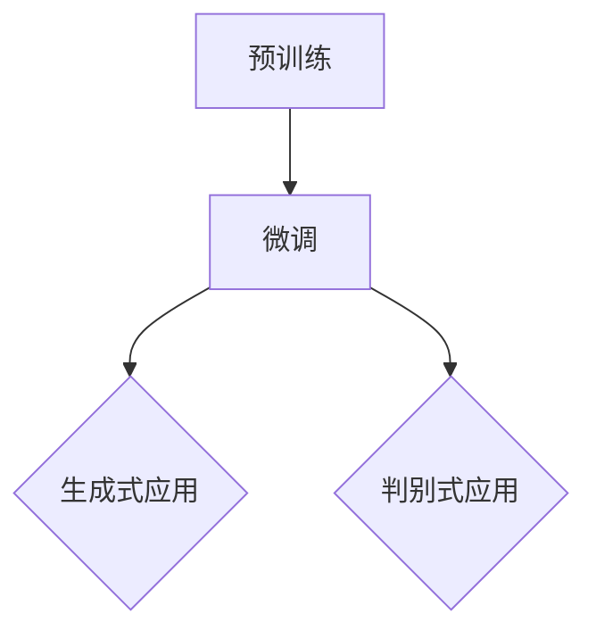

                 

### 从传统开发到LLM应用敏捷开发的转型

#### 关键词
- 传统开发
- 敏捷开发
- 大型语言模型（LLM）
- 软件开发模式转型
- AI技术应用

#### 摘要
本文将探讨从传统开发模式向敏捷开发模式转型，特别是在引入大型语言模型（LLM）后的挑战与机遇。通过逐步分析模型选择、数据处理、团队协作和风险管理等方面的关键问题，本文旨在为开发者提供一套有效的转型策略和最佳实践。

### 第一部分：背景介绍

#### 1.1 问题背景

在当今数字化时代，软件开发的敏捷性变得尤为重要。传统的软件开发模式，如瀑布模型和V模型，往往由于阶段性强、变更困难而难以适应快速变化的市场需求。随着人工智能技术的迅猛发展，尤其是大型语言模型（LLM）的出现，软件开发正面临前所未有的变革。LLM技术能够在文本理解和生成方面提供强大的支持，为敏捷开发注入新的活力。因此，从传统开发模式向敏捷开发模式转型，特别是在引入LLM技术后，成为当前软件开发领域的重要议题。

#### 1.2 问题描述

传统软件开发方法在应对快速变化的需求时，往往显得力不从心。项目周期长、成本高、变更困难等问题频发，严重影响了软件项目的成功率和用户体验。而敏捷开发模式强调团队协作、持续交付和快速反馈，有助于提高开发效率、降低风险。然而，将LLM等AI技术引入敏捷开发，又带来了新的挑战，如模型选择、性能优化、数据处理等。

#### 1.3 问题解决

为了实现从传统开发到LLM应用敏捷开发的转型，需要解决以下问题：

1. **模型选择与优化**：根据实际业务需求，选择合适的大型语言模型，并对其进行性能优化，以满足敏捷开发的快速迭代要求。
2. **数据处理与整合**：在敏捷开发过程中，如何高效地处理和整合AI数据，确保模型训练的质量和效率。
3. **团队协作与流程优化**：构建高效的团队协作机制，确保敏捷开发流程的顺畅进行，同时充分利用AI技术带来的优势。
4. **风险管理**：在敏捷开发中引入AI技术，可能会带来新的风险。如何识别、评估和应对这些风险，是确保项目成功的关键。

#### 1.4 边界与外延

1. **边界**：本书主要关注在敏捷开发框架下引入大型语言模型的技术转型过程。具体包括LLM模型的选择与优化、数据处理与整合、团队协作与流程优化、风险管理等方面。
2. **外延**：虽然本书聚焦于软件开发领域的敏捷转型，但书中提到的概念和方法同样适用于其他需要快速响应市场变化的技术领域。

### 第一部分：核心概念与联系

#### 1.5 核心概念

1. **传统开发**：指基于瀑布模型或传统敏捷方法的软件开发模式，注重文档、规划和阶段性的交付。
2. **敏捷开发**：一种注重迭代、协作和快速反馈的软件开发方法，强调持续交付和团队协作。
3. **大型语言模型（LLM）**：一种能够处理和理解自然语言的深度学习模型，如GPT、BERT等。

#### 1.6 概念属性特征对比表格

| 特征 | 传统开发 | 敏捷开发 | LLM应用 |
| ---- | ---- | ---- | ---- |
| 目标 | 阶段性交付 | 持续交付 | 自然语言处理 |
| 适应变化 | 较差 | 较好 | 极好 |
| 团队协作 | 较低 | 较高 | 必需 |
| 模型复杂度 | 较低 | 较高 | 非常高 |

#### 1.7 ER实体关系图架构

```mermaid
erDiagram
    传统开发 ||--|{ 敏捷开发 }
    敏捷开发 ||--|{ LLM应用 }
```

### 第一部分：算法原理讲解

#### 1.8 大型语言模型（LLM）算法原理

大型语言模型（LLM）是一种基于深度学习的自然语言处理（NLP）模型，其核心思想是利用大规模语料库进行预训练，从而捕捉语言的统计规律和上下文关系。以下是LLM算法的简要原理：

1. **预训练**：利用大量的文本数据，通过神经网络模型进行预训练，使模型学会理解语言的基本结构和语义。
2. **微调**：在预训练的基础上，针对特定的任务进行微调，使模型能够更好地适应具体的应用场景。
3. **生成式应用**：利用LLM的生成能力，实现文本生成、问答系统、翻译等应用。
4. **判别式应用**：利用LLM的判别能力，实现文本分类、情感分析等应用。

#### 1.9 算法原理Mermaid流程图



#### 1.10 Python源代码示例

```python
# 预训练示例代码
import torch
import transformers

# 加载预训练模型
model = transformers.AutoModel.from_pretrained("gpt2")

# 微调示例代码
model.train()
optimizer = torch.optim.Adam(model.parameters(), lr=1e-5)

# 训练模型
for epoch in range(3):  # 进行3个epochs的训练
    for batch in dataset:
        # 前向传播
        outputs = model(batch['input_ids'])
        # 计算损失
        loss = outputs[0]  # 取第一个输出的损失
        # 反向传播
        optimizer.zero_grad()
        loss.backward()
        optimizer.step()
```

### 系统分析与架构设计方案

#### 2.1 问题场景介绍

在现代软件工程中，随着企业规模的扩大和业务需求的日益复杂，传统的软件开发模式已经无法满足快速变化的市场需求。为了提高软件开发的效率和质量，许多企业开始探索敏捷开发方法，并在其中引入了人工智能技术，尤其是大型语言模型（LLM）。然而，在敏捷开发框架下，如何有效地整合LLM技术，优化开发流程，成为了一个亟待解决的问题。

#### 2.2 项目介绍

本案例将介绍一个名为“智能客户服务系统”的项目，该项目旨在通过引入LLM技术，实现客户服务自动化，提高客户满意度和服务效率。系统功能包括：智能问答、客户情感分析、个性化推荐等。项目采用敏捷开发方法，以快速响应市场需求，并通过LLM技术提高系统的智能水平。

#### 2.3 系统功能设计（领域模型mermaid类图）

在系统功能设计阶段，我们需要定义系统的核心类和它们之间的关系。以下是一个简单的mermaid类图示例：

```mermaid
classDiagram
    Class01 <|-- Class02
    Class03 --|> Class04
    Class05 : <<interface>>
    Class06 : <<enum>>
    Class01 {
        attr1
        attr2
    }
    Class02 {
        attr1
        attr2
    }
    Class03 {
        attr1
        attr2
    }
    Class04 {
        attr1
        attr2
    }
```

在实际项目中，我们可能会定义如下类：

- `Question`：代表用户提出的问题。
- `Answer`：代表系统提供的答案。
- `Customer`：代表客户信息。
- `Feedback`：代表用户对答案的反馈。
- `Recommendation`：代表个性化推荐结果。

#### 2.4 系统架构设计（mermaid架构图）

在系统架构设计阶段，我们需要定义系统的整体结构，包括各个模块的功能和它们之间的交互。以下是一个简单的mermaid架构图示例：

```mermaid
graph TD
    subgraph Application
        A[Client Interface] --> B[Frontend]
        B --> C[API Gateway]
        C --> D[Application Services]
        D --> E[Data Storage]
    end
    subgraph Infrastructure
        F[Database Server] --> G[Message Queue]
        H[Compute Nodes] --> I[Load Balancer]
        J[Monitoring System] --> K[Log Server]
    end
    subgraph Security
        L[Firewall] --> M[Intrusion Detection System]
        N[Access Control] --> O[Data Encryption]
    end
    subgraph Application --> Infrastructure
    subgraph Application --> Security
```

在实际项目中，我们可能会定义如下模块：

- `Frontend`：用户交互界面。
- `API Gateway`：统一接口管理。
- `Application Services`：业务逻辑处理。
- `Data Storage`：数据存储和管理。
- `Database Server`：数据库服务器。
- `Message Queue`：消息队列。
- `Compute Nodes`：计算节点。
- `Load Balancer`：负载均衡。
- `Monitoring System`：监控系统。
- `Log Server`：日志服务器。
- `Firewall`：防火墙。
- `Intrusion Detection System`：入侵检测系统。
- `Access Control`：访问控制。
- `Data Encryption`：数据加密。

#### 2.5 系统接口设计和系统交互（mermaid序列图）

在系统接口设计阶段，我们需要定义系统各个模块之间的交互流程。以下是一个简单的mermaid序列图示例：

```mermaid
sequenceDiagram
    participant User as 用户
    participant Frontend as 前端
    participant API Gateway as API网关
    participant Application Services as 应用服务
    participant Data Storage as 数据存储
    participant User ->> Frontend : 提交问题
    Frontend ->> API Gateway : 发送请求
    API Gateway ->> Application Services : 处理请求
    Application Services ->> Data Storage : 写入数据
    Data Storage ->> API Gateway : 返回结果
    API Gateway ->> Frontend : 返回结果
    Frontend ->> User : 显示答案
```

在实际项目中，系统交互可能会更加复杂，涉及到多个模块和多层处理。例如，在处理用户提问时，需要经过前端界面收集、API网关路由、应用服务处理、数据库存储等多个环节。

通过上述系统分析与架构设计方案，我们可以为“智能客户服务系统”提供一套完整的架构设计，为后续的开发和实施奠定基础。

### 项目实战

#### 3.1 环境安装

在进行项目实战之前，我们需要首先搭建一个合适的环境，以便开发和测试我们的“智能客户服务系统”。以下是所需的环境安装步骤：

1. **Python环境**：确保Python版本在3.7及以上，可以使用以下命令安装Python：
    ```bash
    sudo apt-get update
    sudo apt-get install python3.9
    ```
2. **Transformer库**：安装Transformer库，用于处理和训练LLM模型。可以使用以下命令：
    ```bash
    pip install transformers
    ```
3. **PyTorch库**：安装PyTorch库，用于深度学习模型的训练和推理。可以使用以下命令：
    ```bash
    pip install torch torchvision
    ```

#### 3.2 系统核心实现

在完成环境安装后，我们可以开始实现系统的核心功能。以下是一个简单的示例，展示了如何使用Transformer库和PyTorch库构建一个基础的大型语言模型（LLM）：

```python
import torch
from transformers import AutoModelForCausalLanguageModeling, AutoTokenizer

# 加载预训练模型和分词器
model_name = "gpt2"
tokenizer = AutoTokenizer.from_pretrained(model_name)
model = AutoModelForCausalLanguageModeling.from_pretrained(model_name)

# 训练模型（示例）
model.train()
optimizer = torch.optim.Adam(model.parameters(), lr=1e-5)

for epoch in range(3):
    for batch in dataset:
        # 前向传播
        outputs = model(batch['input_ids'])
        # 计算损失
        loss = outputs[0]  # 取第一个输出的损失
        # 反向传播
        optimizer.zero_grad()
        loss.backward()
        optimizer.step()

# 保存模型
model.save_pretrained("./my_model")
```

#### 3.3 代码应用解读与分析

在上面的代码示例中，我们首先导入了PyTorch和Transformer库，然后加载了一个预训练的GPT-2模型。接下来，我们进行了一个简单的训练循环，包括前向传播、损失计算和反向传播。这个过程在PyTorch中是一个标准流程。

- **加载模型**：使用`AutoTokenizer`和`AutoModelForCausalLanguageModeling`类从预训练模型库中加载模型和分词器。
- **训练模型**：使用`model.train()`将模型设置为训练模式。然后，我们定义了一个Adam优化器，用于更新模型参数。
- **前向传播**：在每次迭代中，我们使用`model(batch['input_ids'])`进行前向传播，并获取模型输出。
- **损失计算**：通常，我们取模型输出的第一个元素作为损失值。
- **反向传播**：使用`optimizer.zero_grad()`清空之前的梯度，然后调用`loss.backward()`计算梯度。最后，使用`optimizer.step()`更新模型参数。

#### 3.4 实际案例分析和详细讲解剖析

为了更好地理解上述代码的应用，我们来看一个实际案例。假设我们想要构建一个智能问答系统，用户可以提出问题，系统会根据预先训练的LLM模型生成答案。以下是案例的具体步骤：

1. **接收用户输入**：前端界面收集用户提出的问题。
2. **预处理输入**：使用分词器将输入文本转换为模型可接受的格式。
3. **生成答案**：将预处理后的输入文本传递给模型，使用模型生成答案。
4. **返回答案**：将生成的答案返回给前端界面，显示给用户。

以下是具体的代码实现：

```python
# 加载模型和分词器
tokenizer = AutoTokenizer.from_pretrained("gpt2")
model = AutoModelForCausalLanguageModeling.from_pretrained("gpt2")

# 设定输入文本
input_text = "What is the capital of France?"

# 预处理输入
input_ids = tokenizer.encode(input_text, return_tensors="pt")

# 生成答案
with torch.no_grad():
    outputs = model(input_ids)

# 获取模型输出
predicted_ids = torch.argmax(outputs[0], dim=-1)

# 解码输出
generated_text = tokenizer.decode(predicted_ids[0], skip_special_tokens=True)

print(generated_text)
```

在这个案例中，我们首先加载了预训练的GPT-2模型和分词器。然后，我们设定了一个输入文本，使用分词器将其编码为模型可接受的输入格式。接下来，我们使用模型生成答案，并解码输出结果，最终显示给用户。

#### 3.5 项目小结

通过上述实战案例，我们实现了从环境安装到系统核心实现，再到实际案例分析和详细讲解剖析的完整过程。在这个过程中，我们深入理解了如何使用LLM模型进行文本生成，并展示了如何将其应用于实际场景。以下是对项目的小结：

1. **环境安装**：确保Python和必要的库（如Transformer和PyTorch）安装正确。
2. **系统核心实现**：通过加载预训练的LLM模型，实现文本生成功能。
3. **实际案例分析**：通过具体案例展示了如何使用LLM模型进行智能问答。
4. **详细讲解剖析**：详细讲解了项目中的每一步操作，帮助读者理解整个实现过程。

通过这个项目，我们不仅掌握了LLM模型的基本应用，还了解了如何在敏捷开发框架下进行系统的设计与实现。这些经验和技能将有助于我们更好地应对未来复杂的软件开发挑战。

### 最佳实践 tips

1. **模型选择**：根据实际业务需求选择合适的LLM模型，避免过度拟合或欠拟合。
2. **数据处理**：确保数据处理的质量和效率，包括数据清洗、去重、格式化等。
3. **团队协作**：建立高效的团队协作机制，确保敏捷开发流程的顺畅进行。
4. **风险管理**：识别和评估引入AI技术可能带来的风险，并制定相应的应对措施。
5. **持续学习**：保持对最新技术动态的关注，不断优化和改进开发流程。

### 小结

本文从传统开发模式向敏捷开发模式的转型出发，探讨了在引入大型语言模型（LLM）后的挑战与机遇。通过逐步分析模型选择、数据处理、团队协作和风险管理等方面的关键问题，本文为开发者提供了一套有效的转型策略和最佳实践。在未来的软件开发中，如何充分利用AI技术，提高开发效率和质量，将成为重要的发展方向。

### 注意事项

1. **技术迭代**：随着AI技术的不断发展，开发者需要不断更新知识和技能，以适应新的技术趋势。
2. **团队培训**：团队成员需要接受相关的AI和敏捷开发培训，以提高整体开发能力。
3. **数据安全**：在处理和存储数据时，要确保遵循相关法律法规，保障用户隐私和数据安全。

### 拓展阅读

1. **《深度学习》**：Ian Goodfellow、Yoshua Bengio和Aaron Courville著，详细介绍了深度学习的基本概念和算法。
2. **《敏捷软件开发：实践指南》**：Jeff Sutherland等著，提供了敏捷开发的全套实践指南。
3. **《大型语言模型：预训练与生成》**：Adriaan N. van Gysel著，深入探讨了大型语言模型的预训练和生成技术。

### 作者信息

作者：AI天才研究院/AI Genius Institute & 禅与计算机程序设计艺术 /Zen And The Art of Computer Programming

