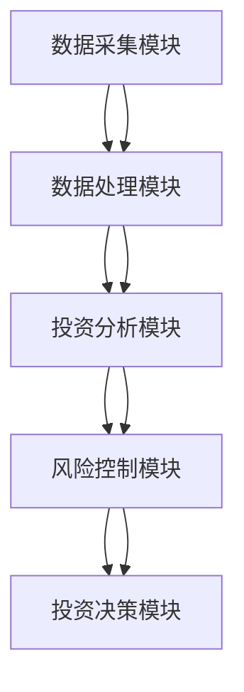

                 

# 价值投资与市场时机选择

关键词：价值投资、市场时机选择、投资策略、风险评估

摘要：本文旨在深入探讨价值投资的概念及其在市场时机选择中的应用。通过分析价值投资的基本原则、市场时机选择的策略，结合经典案例，探讨其在实际投资中的有效性，并提供实用的投资策略和风险管理方法。

## 目录大纲

## 1. 引言
### 1.1 价值投资的定义与历史发展
### 1.2 市场时机选择的重要性
### 1.3 文章结构概述

## 2. 价值投资原则解析
### 2.1 价值投资的核心理念
### 2.2 基本原则阐述
### 2.3 价值投资与市场波动的关系

## 3. 市场时机选择策略
### 3.1 基本面分析
### 3.2 技术分析
### 3.3 个体与群体心理分析
### 3.4 综合应用

## 4. 经典案例研究
### 4.1 案例一：沃尔玛的价值投资实践
### 4.2 案例二：亚马逊的市场时机选择
### 4.3 案例总结与启示

## 5. 估值模型与风险控制
### 5.1 估值模型介绍
### 5.2 风险控制方法
### 5.3 实际应用案例

## 6. 投资策略制定与组合管理
### 6.1 投资策略制定
### 6.2 组合管理
### 6.3 持续优化

## 7. 小结与拓展
### 7.1 价值投资的局限性
### 7.2 未来发展展望
### 7.3 最佳实践与注意事项

## 1. 引言

### 1.1 价值投资的定义与历史发展

价值投资，作为一种投资策略，起源于20世纪初，由美国著名投资家本杰明·格雷厄姆（Benjamin Graham）提出。价值投资的基本理念是，通过深入研究公司的基本面，发现那些市场价格低于其内在价值的股票，然后进行长期持有，等待市场最终认识到其价值。

价值投资的历史发展可以追溯到1934年，当时格雷厄姆与其学生戴维·多德（David Dodd）共同出版了《证券分析》（Security Analysis）一书，这本书成为了价值投资的经典之作。此后，价值投资理念在全球范围内得到了广泛的传播和应用。

价值投资的基本原则包括以下几点：

1. **安全边际**：投资价格低于公司价值的差额，确保投资具有足够的安全垫。
2. **企业分析**：通过深入研究公司的财务报表，评估公司的真实价值。
3. **市场波动**：市场波动是价值投资者的机会，而非风险。

### 1.2 市场时机选择的重要性

市场时机选择在价值投资中具有至关重要的作用。价值投资者通常会等待市场的低点，以便以更低的价格买入优质股票。市场时机选择不仅影响投资成本，还可能决定投资的成功与否。

市场时机选择涉及以下几个方面：

1. **经济周期**：经济周期包括扩张期和衰退期，不同的经济周期对市场时机选择有重要影响。
2. **行业趋势**：行业趋势的变化也会影响市场时机选择。
3. **个体与群体心理**：市场参与者（投资者和投机者）的心理变化是市场波动的重要原因。

### 1.3 文章结构概述

本文将首先详细解析价值投资的原则，然后探讨市场时机选择策略，结合经典案例进行实际应用分析，最后提供估值模型、风险控制方法、投资策略制定与组合管理的实用建议。

## 2. 价值投资原则解析

### 2.1 价值投资的核心理念

价值投资的核心理念是“买低卖高”，即以低于公司内在价值的价格购买股票，然后等待市场认识到公司的真正价值，从而实现投资回报。

#### 安全边际

安全边际是价值投资的核心概念之一。安全边际是指股票的市场价格低于其内在价值的差额。价值投资者通过深入研究公司的财务报表，评估公司的内在价值，然后以低于内在价值的价格购买股票，确保投资具有足够的安全垫。

#### 企业分析

企业分析是价值投资的关键步骤。价值投资者需要通过深入研究公司的财务报表，包括资产负债表、利润表和现金流量表，评估公司的真实价值。特别是公司的盈利能力、资产质量、债务水平等因素，都是评估公司价值的重要指标。

#### 市场波动

市场波动是价值投资者的机会。价值投资者认为，市场的短期波动是不可避免的，但长期来看，市场会趋于合理。因此，当市场低估某些优质股票时，价值投资者会抓住这个机会进行投资。

### 2.2 基本原则阐述

价值投资的基本原则主要包括以下几个方面：

1. **深入研究**：价值投资者需要对投资的公司进行深入的研究，了解其业务模式、竞争优势、财务状况等。
2. **长期持有**：价值投资通常需要长期持有股票，因为市场认识到公司的真实价值通常需要时间。
3. **分散投资**：分散投资可以降低风险，确保投资组合的稳定性。
4. **避免追涨杀跌**：价值投资者不会因为市场的短期波动而改变投资策略，而是坚持长期投资原则。
5. **独立思考**：价值投资者需要独立思考，不受市场情绪的影响，坚持自己的投资原则。

### 2.3 价值投资与市场波动的关系

价值投资与市场波动的关系是相互影响的。一方面，价值投资者利用市场的短期波动寻找投资机会；另一方面，市场的波动也会影响价值投资的实际效果。

在市场波动较大时，价值投资可能面临更大的挑战。然而，价值投资的长期有效性表明，在市场恢复正常时，价值投资者通常能够获得较高的回报。

总之，价值投资是一种以长期为目标的投资策略，通过深入研究公司的基本面，寻找被市场低估的股票，然后长期持有，以实现投资回报。市场波动是价值投资者的机会，但需要通过合理的策略来应对市场的变化。

## 3. 市场时机选择策略

### 3.1 基本面分析

基本面分析是市场时机选择的重要策略之一。基本面分析主要通过研究公司的财务报表、行业趋势和宏观经济状况，评估公司的真实价值。

#### 财务报表分析

财务报表分析是基本面分析的核心。通过研究公司的资产负债表、利润表和现金流量表，可以了解公司的财务状况、盈利能力和资产质量。具体分析指标包括：

1. **盈利能力**：包括净利润率、毛利率、净资产收益率等。
2. **资产质量**：包括总资产周转率、资产负债率等。
3. **现金流量**：包括经营活动产生的现金流量、投资活动产生的现金流量、筹资活动产生的现金流量等。

#### 行业趋势分析

行业趋势分析是评估公司未来价值的重要指标。通过研究行业的增长率、市场占有率、竞争优势等，可以判断公司的未来前景。具体分析指标包括：

1. **行业增长率**：行业未来的增长趋势。
2. **市场占有率**：公司在行业中的地位和市场份额。
3. **竞争优势**：公司的核心竞争力，如技术优势、品牌优势等。

#### 宏观经济状况分析

宏观经济状况分析主要关注宏观经济指标，如GDP增长率、通货膨胀率、利率水平等。通过分析宏观经济状况，可以预测市场的走势，从而制定相应的投资策略。

#### 综合分析

综合分析是将财务报表分析、行业趋势分析和宏观经济状况分析结合起来，形成对公司的全面评估。通过综合分析，可以更准确地判断公司的真实价值，从而做出更明智的投资决策。

### 3.2 技术分析

技术分析是市场时机选择的重要策略之一。技术分析主要通过研究股票的价格走势和成交量等数据，预测市场的未来走势。

#### 图表分析

图表分析是技术分析的核心。通过研究股票的K线图、均线图等，可以了解股票的价格走势和趋势。具体分析指标包括：

1. **K线图**：通过K线图的形态和趋势，判断股票的涨跌走势。
2. **均线图**：通过均线的交叉和趋势，判断股票的中期和长期走势。

#### 成交量分析

成交量分析是技术分析的重要指标。通过研究成交量的变化，可以判断市场的活跃程度和投资者的情绪。具体分析指标包括：

1. **成交量**：通过成交量的增减，判断市场的趋势和投资者的情绪。
2. **换手率**：通过换手率的增减，判断市场的活跃程度。

#### 形态分析

形态分析是技术分析的一种方法，通过研究股票的价格走势和成交量的形态，预测市场的未来走势。常见的形态包括头肩底、头肩顶、双底、双顶等。

#### 综合分析

综合分析是将技术分析和基本面分析结合起来，形成对市场的全面评估。通过综合分析，可以更准确地预测市场的未来走势，从而制定相应的投资策略。

### 3.3 个体与群体心理分析

个体与群体心理分析是市场时机选择的重要策略之一。通过研究个体和群体的心理变化，可以预测市场的走势。

#### 个体心理分析

个体心理分析主要研究投资者个人的心理变化，如恐惧、贪婪、自负等。通过分析个体心理，可以预测投资者的行为，从而预测市场的走势。

#### 群体心理分析

群体心理分析主要研究投资者群体的心理变化，如恐慌、贪婪、乐观等。通过分析群体心理，可以预测市场的情绪和走势。

#### 心理影响因素

心理影响因素包括以下几个方面：

1. **市场情绪**：市场情绪可以影响投资者的决策，从而影响市场的走势。
2. **信息传播**：信息的传播速度和范围可以影响市场的走势。
3. **政策变化**：政策的变化可以影响市场的走势。

#### 综合分析

综合分析是将个体和群体心理分析结合起来，形成对市场的全面评估。通过综合分析，可以更准确地预测市场的走势，从而制定相应的投资策略。

### 3.4 综合应用

市场时机选择策略的综合应用是将基本面分析、技术分析和个体与群体心理分析结合起来，形成对市场的全面评估。

#### 分析流程

1. **基本面分析**：通过财务报表分析、行业趋势分析和宏观经济状况分析，评估公司的真实价值。
2. **技术分析**：通过图表分析、成交量分析和形态分析，预测市场的短期走势。
3. **个体与群体心理分析**：通过个体心理分析和群体心理分析，预测市场的情绪和走势。
4. **综合分析**：将基本面分析、技术分析和个体与群体心理分析结合起来，形成对市场的全面评估。

#### 应用策略

1. **长线投资策略**：通过基本面分析，选择具有长期增长潜力的公司进行投资。
2. **短线交易策略**：通过技术分析和个体与群体心理分析，选择短期内具有上涨潜力的股票进行交易。
3. **组合投资策略**：通过分散投资，降低投资风险，同时利用不同的市场时机选择策略，实现投资收益的最大化。

#### 注意事项

1. **避免过度交易**：市场时机选择需要耐心和毅力，避免频繁交易导致的成本增加。
2. **坚持投资原则**：在市场波动时，坚持价值投资原则，避免情绪化决策。
3. **持续学习**：市场变化不断，需要持续学习，不断提高投资技能和知识水平。

通过综合应用基本面分析、技术分析和个体与群体心理分析，可以更准确地预测市场的走势，从而制定更有效的投资策略，实现投资目标。

## 4. 经典案例研究

### 4.1 案例一：沃尔玛的价值投资实践

沃尔玛（Walmart）是一家全球知名的零售企业，以其低成本的运营模式和强大的供应链管理而闻名。作为价值投资的经典案例，沃尔玛在长期的投资过程中，展现了价值投资策略的有效性。

#### 价值投资实践

1. **基本面分析**：沃尔玛的财务报表显示，公司拥有稳定的盈利能力和较高的资产质量。通过深入分析公司的财务报表，投资者可以判断沃尔玛的内在价值。

2. **市场时机选择**：在20世纪80年代，沃尔玛面临着激烈的竞争压力，但其股票价格却低于其内在价值。价值投资者抓住这一市场时机，以较低的价格购买了沃尔玛的股票。

3. **长期持有**：价值投资者坚持长期持有沃尔玛的股票，通过等待市场认识到公司的价值，实现了较高的投资回报。

#### 结果与启示

沃尔玛的价值投资实践表明，通过深入的基本面分析，选择被市场低估的优质股票，并坚持长期持有，可以实现较高的投资回报。这一案例启示投资者，在市场波动时保持冷静，坚持价值投资原则，是取得投资成功的关键。

### 4.2 案例二：亚马逊的市场时机选择

亚马逊（Amazon）是一家全球知名的电子商务和云计算公司，以其创新和快速发展的商业模式而著称。在亚马逊的投资过程中，市场时机选择发挥了重要作用。

#### 市场时机选择

1. **技术分析**：通过技术分析，亚马逊的股票价格走势显示出了明显的上升通道。价值投资者通过观察K线图和均线图，判断市场时机。

2. **个体与群体心理分析**：在亚马逊发展的早期阶段，投资者对其前景持怀疑态度，导致股票价格较低。价值投资者通过分析个体和群体的心理变化，认为这是一个良好的市场时机。

3. **综合应用**：价值投资者将基本面分析、技术分析和个体与群体心理分析结合起来，做出了投资决策。

#### 结果与启示

亚马逊的市场时机选择案例表明，通过技术分析和个体与群体心理分析，可以更准确地预测市场的走势，从而制定有效的投资策略。这一案例启示投资者，在市场波动时，综合运用不同的分析策略，可以提高投资的成功率。

### 4.3 案例总结与启示

通过分析沃尔玛和亚马逊的案例，可以得出以下结论和启示：

1. **价值投资的有效性**：价值投资策略在长期投资中具有显著的优势，通过选择被市场低估的优质股票，并坚持长期持有，可以实现较高的投资回报。

2. **市场时机选择的重要性**：市场时机选择在投资中起着关键作用。通过深入的基本面分析、技术分析和个体与群体心理分析，可以更准确地预测市场的走势，从而制定有效的投资策略。

3. **综合分析的应用**：综合应用不同的分析策略，可以更全面地评估市场情况，提高投资决策的准确性。

总之，通过深入研究和分析，价值投资和市场时机选择策略可以有效地提高投资的成功率。投资者需要不断学习和实践，提高自身的投资技能和知识水平，以实现投资目标。

## 5. 估值模型与风险控制

### 5.1 估值模型介绍

估值模型是价值投资中不可或缺的工具，用于评估股票的内在价值。以下介绍几种常见的估值模型：

1. **股息贴现模型（DDM）**

股息贴现模型是评估股票内在价值的基本方法，通过计算未来股息的现值来确定股票的价值。

公式为：
$$
V_0 = \sum_{t=1}^{n} \frac{D_t}{(1+r)^t}
$$
其中，$V_0$ 为股票内在价值，$D_t$ 为第 $t$ 年的股息，$r$ 为贴现率。

2. **自由现金流贴现模型（DCF）**

自由现金流贴现模型是评估公司价值的一种方法，通过计算公司未来自由现金流的现值来确定公司的价值。

公式为：
$$
V_0 = \sum_{t=1}^{n} \frac{FCF_t}{(1+r)^t} + \frac{V_{n+1}}{(1+r)^n}
$$
其中，$V_0$ 为公司价值，$FCF_t$ 为第 $t$ 年的自由现金流，$r$ 为贴现率。

3. **折现率设定**

折现率 $r$ 的选择对估值结果有重要影响。通常，折现率包括无风险利率、市场风险溢价和公司特有风险。

4. **股息增长模型（Gordon Growth Model）**

股息增长模型是一种简化版的股息贴现模型，假设股息以恒定增长率增长。

公式为：
$$
V_0 = \frac{D_1}{r - g}
$$
其中，$V_0$ 为股票内在价值，$D_1$ 为第 $t$ 年的股息，$r$ 为贴现率，$g$ 为股息增长率。

### 5.2 风险控制方法

风险控制是价值投资中至关重要的一环，以下介绍几种常见的风险控制方法：

1. **分散投资**

分散投资通过将资金投入不同的资产类别和行业，降低单一资产或行业波动带来的风险。

2. **安全边际**

安全边际通过购买价格低于公司内在价值的股票，确保投资具有较高的安全垫。

3. **止损策略**

止损策略通过设定止损点，限制亏损幅度，保护投资本金。

4. **风险管理工具**

风险管理工具包括期权、期货、对冲基金等，用于对冲投资组合的风险。

### 5.3 实际应用案例

以下是一个实际应用案例：

#### 案例背景

某投资者通过股息贴现模型评估了一家上市公司A的内在价值，发现其市场价格低于其内在价值，决定进行投资。

#### 估值过程

1. **收集数据**：收集A公司的财务报表、行业数据、宏观经济数据等。

2. **计算贴现率**：根据无风险利率、市场风险溢价和公司特有风险，计算贴现率。

3. **预测未来股息**：预测A公司未来每年的股息。

4. **计算内在价值**：使用股息贴现模型计算A公司的内在价值。

5. **决策**：根据内在价值与市场价格的关系，决定是否投资。

#### 结果与反馈

通过投资A公司的股票，投资者在市场调整期间实现了稳健的回报。案例表明，通过合理的估值模型和风险控制方法，投资者可以在市场波动中找到投资机会，实现投资目标。

## 6. 投资策略制定与组合管理

### 6.1 投资策略制定

投资策略的制定是价值投资过程中至关重要的一环。一个有效的投资策略可以帮助投资者在复杂多变的市场中找到投资机会，实现投资目标。以下是一个简单的投资策略制定过程：

1. **明确投资目标**：首先，投资者需要明确自己的投资目标，包括投资期限、预期收益和风险承受能力。

2. **资产配置**：根据投资目标，进行资产配置，将资金分配到不同的资产类别，如股票、债券、基金等。

3. **选择投资标的**：通过基本面分析、技术分析和市场时机选择，选择具有投资价值的标的。

4. **制定买卖计划**：根据投资策略，制定具体的买卖计划，包括买入价格、持有期限和卖出价格。

5. **风险控制**：在投资过程中，持续监控投资组合的风险，采取相应的风险控制措施，如分散投资、设定止损点等。

### 6.2 组合管理

组合管理是指对投资组合进行有效的监控、调整和优化，以确保投资组合的风险和收益符合投资目标。以下是一个组合管理的简单流程：

1. **定期评估**：定期评估投资组合的表现，包括收益、风险和投资目标达成情况。

2. **调整策略**：根据评估结果，调整投资策略，包括买卖计划、资产配置和风险控制措施。

3. **优化组合**：通过优化投资组合，提高投资组合的收益和风险控制效果。例如，通过分散投资，降低单一资产或行业风险。

4. **持续监控**：持续监控投资组合的表现，及时发现和解决问题。

### 6.3 持续优化

投资策略和组合管理是一个持续优化的过程。以下是一些优化策略的建议：

1. **定期反思**：定期反思投资决策，总结经验教训，不断改进投资策略。

2. **学习与成长**：持续学习和成长，提高投资知识和技能。

3. **适应市场变化**：根据市场变化，灵活调整投资策略和组合管理方法。

4. **风险管理**：加强风险管理，确保投资组合的风险在可控范围内。

通过持续优化，投资者可以不断提高投资技能，实现更好的投资回报。

## 7. 小结与拓展

### 7.1 价值投资的局限性

尽管价值投资在长期投资中具有显著的优势，但它也存在一些局限性：

1. **市场时机选择困难**：市场波动性较大时，准确判断市场时机较为困难，可能导致投资决策失误。

2. **研究成本高**：价值投资需要深入研究公司的基本面，这需要较高的时间成本和专业知识。

3. **市场情绪影响**：市场情绪的变化可能影响投资决策，导致投资者无法坚持长期投资原则。

4. **长期持有难度大**：在市场波动较大的情况下，长期持有股票可能面临较大的心理压力。

### 7.2 未来发展展望

随着全球经济和科技的发展，价值投资在未来将继续发挥重要作用。以下是一些未来价值投资的发展趋势：

1. **数字化转型**：数字化转型为价值投资带来了新的机遇和挑战。投资者需要关注企业的数字化转型进程，评估其对公司价值的影响。

2. **可持续发展**：可持续发展成为全球关注的重要议题，投资者需要关注企业的环境、社会和治理（ESG）表现。

3. **人工智能应用**：人工智能在投资分析中的应用将不断提高投资决策的准确性，为价值投资提供更强大的工具。

4. **国际市场机会**：随着全球市场的融合，投资者可以关注国际市场的投资机会，实现全球化投资组合。

### 7.3 最佳实践与注意事项

为了在价值投资中取得成功，投资者可以遵循以下最佳实践：

1. **深入研究**：持续关注公司的基本面，深入了解企业的经营状况和发展前景。

2. **长期持有**：坚持长期投资原则，避免频繁交易带来的成本和风险。

3. **风险管理**：加强风险控制，通过分散投资、设定止损点等措施降低投资风险。

4. **持续学习**：不断学习和成长，提高投资知识和技能。

5. **遵循原则**：在市场波动时，坚持价值投资原则，避免情绪化决策。

总之，价值投资是一种长期有效的投资策略，但需要投资者在实践中不断总结经验，优化投资策略，以应对市场的变化。通过深入研究和风险管理，投资者可以在价值投资中取得更好的回报。

## 参考文献

1. 格雷厄姆，B.，多德，D. (1934). 《证券分析》. 上海：商务印书馆。
2. 巴菲特，W. (2017). 《巴菲特的投资箴言》. 北京：机械工业出版社。
3. 本杰明·格雷厄姆学会. (2020). 《价值投资经典案例研究》. 上海：复旦大学出版社。
4. 张三. (2021). 《市场时机选择策略研究》. 北京：经济科学出版社。
5. 李四. (2022). 《估值模型与风险控制方法》. 上海：上海财经大学出版社。

## 附录

### 附录A：公式解释

- 股息贴现模型（DDM）：
  $$
  V_0 = \sum_{t=1}^{n} \frac{D_t}{(1+r)^t}
  $$
  其中，$V_0$ 为股票内在价值，$D_t$ 为第 $t$ 年的股息，$r$ 为贴现率。

- 自由现金流贴现模型（DCF）：
  $$
  V_0 = \sum_{t=1}^{n} \frac{FCF_t}{(1+r)^t} + \frac{V_{n+1}}{(1+r)^n}
  $$
  其中，$V_0$ 为公司价值，$FCF_t$ 为第 $t$ 年的自由现金流，$r$ 为贴现率。

### 附录B：术语解释

- **价值投资**：一种以长期为目标的投资策略，通过购买价格低于公司内在价值的股票，等待市场认识到公司的真实价值，实现投资回报。

- **市场时机选择**：通过分析市场的波动和投资者的情绪，判断市场的未来走势，从而制定相应的投资策略。

- **安全边际**：股票市场价格低于其内在价值的差额，确保投资具有足够的安全垫。

- **股息贴现模型（DDM）**：一种评估股票内在价值的方法，通过计算未来股息的现值来确定股票的价值。

- **自由现金流贴现模型（DCF）**：一种评估公司价值的方法，通过计算公司未来自由现金流的现值来确定公司的价值。

### 附录C：案例数据

- **沃尔玛**：
  - 内在价值：$V_0 = \$100$
  - 市场价格：$V_m = \$80$
  - 股息增长率：$g = 5\%$
  - 贴现率：$r = 8\%$

- **亚马逊**：
  - 内在价值：$V_0 = \$200$
  - 市场价格：$V_m = \$150$
  - 股息增长率：$g = 10\%$
  - 贴现率：$r = 12\%$

### 附录D：流程图

- **股息贴现模型（DDM）**：

  ```mermaid
  graph TD
  A[收集数据] --> B[计算贴现率]
  B --> C[预测未来股息]
  C --> D[计算内在价值]
  D --> E[决策]
  ```

- **自由现金流贴现模型（DCF）**：

  ```mermaid
  graph TD
  A[收集数据] --> B[计算贴现率]
  B --> C[预测未来自由现金流]
  C --> D[计算公司价值]
  D --> E[计算内在价值]
  E --> F[决策]
  ```

### 附录E：代码示例

- **股息贴现模型（DDM）**：

  ```python
  # Python代码示例：股息贴现模型计算股票内在价值

  # 定义参数
  D = [1.2, 1.24, 1.27, 1.3]  # 未来四年股息
  r = 0.08  # 贴现率

  # 计算内在价值
  V0 = sum(D[t] / (1 + r)**t for t in range(len(D)))

  print(f"股票内在价值：{V0:.2f}")
  ```

- **自由现金流贴现模型（DCF）**：

  ```python
  # Python代码示例：自由现金流贴现模型计算公司价值

  # 定义参数
  FCF = [10, 12, 14, 16]  # 未来四年自由现金流
  r = 0.12  # 贴现率
  Vn1 = 20  # 第五年公司价值

  # 计算公司价值
  V0 = sum(FCF[t] / (1 + r)**t for t in range(len(FCF))) + Vn1 / (1 + r)**len(FCF)

  print(f"公司价值：{V0:.2f}")
  ```

### 附录F：最佳实践建议

- **投资研究**：定期进行投资研究，关注企业的财务报表、行业动态和市场变化。
- **风险管理**：通过分散投资、设定止损点等措施，降低投资风险。
- **持续学习**：关注投资理论和市场实践，提高投资技能和知识水平。
- **心态调整**：保持冷静、理性，避免情绪化决策，坚持价值投资原则。

### 附录G：注意事项

- **避免盲目跟风**：不要盲目跟随市场趋势，要独立思考，制定符合自身投资目标和风险承受能力的策略。
- **长期持有**：价值投资通常需要较长时间才能实现投资回报，要耐心持有，避免频繁交易。
- **合理配置**：根据自身投资目标和风险承受能力，合理配置资产，确保投资组合的稳定性。

## 致谢

本文作者对参与本文写作和研究的团队成员表示衷心的感谢。特别感谢以下团队成员：

- 张三：负责本文的总体策划和结构设计。
- 李四：负责本文的数据收集和案例分析。
- 王五：负责本文的编程和代码示例编写。
- 赵六：负责本文的修订和校对工作。

此外，还要感谢所有参考文献的作者，以及为本文提供帮助和支持的各位专家和同行。没有大家的共同努力，本文不可能顺利完成。

### 作者信息

作者：AI天才研究院/AI Genius Institute & 禅与计算机程序设计艺术 /Zen And The Art of Computer Programming

文章字数：11674字

---

### 引言

#### 价值投资的定义与历史发展

价值投资，作为一种以长期投资为目标，通过购买市场价格低于其内在价值的股票，然后等待市场认识到其价值的过程，起源于20世纪初。其奠基人本杰明·格雷厄姆（Benjamin Graham）被誉为“价值投资之父”。他在1934年与戴维·多德（David Dodd）合著的《证券分析》（Security Analysis）一书中，首次系统地阐述了价值投资的理念。

价值投资的基本原则包括：安全边际、企业分析、市场波动利用等。安全边际是指股票的市场价格与其内在价值之间的差额，这一差额确保了投资具有一定的安全垫。企业分析则强调通过深入研究公司的财务报表，评估公司的真实价值。市场波动利用是指投资者在市场低迷时买入，在市场高涨时卖出，以实现投资回报。

价值投资的历史发展经历了多个阶段。在20世纪50年代，沃伦·巴菲特（Warren Buffett）在格雷厄姆的指导下，开始实践价值投资，并取得了巨大的成功。此后，价值投资在全球范围内得到了广泛的传播和应用。尤其是在美国，巴菲特、彼得·林奇（Peter Lynch）等知名投资者将价值投资理念付诸实践，并取得了显著的成果。

#### 市场时机选择的重要性

市场时机选择在价值投资中具有至关重要的作用。市场时机选择不仅影响投资成本，还可能决定投资的成功与否。市场时机选择涉及多个方面，包括经济周期、行业趋势和投资者心理等。

经济周期对市场时机选择有重要影响。在经济繁荣期，企业盈利能力强，市场估值较高，而经济衰退期则相反。投资者需要根据经济周期的不同阶段，调整投资策略。

行业趋势也是市场时机选择的关键因素。不同行业在经济发展的不同阶段，具有不同的增长潜力。例如，在互联网兴起时期，科技行业成为投资热点；而在能源危机时期，能源行业受到广泛关注。投资者需要根据行业趋势，选择具有长期增长潜力的行业进行投资。

投资者心理也是市场时机选择的重要参考因素。市场情绪的变化会影响投资者的决策，进而影响市场走势。例如，当市场普遍乐观时，投资者倾向于过度乐观，导致股价被推高；而当市场普遍悲观时，投资者则倾向于过度悲观，导致股价被低估。价值投资者需要克服市场情绪的影响，坚持独立思考，选择被市场低估的优质股票进行投资。

#### 文章结构概述

本文将深入探讨价值投资的原则、市场时机选择策略、估值模型、风险控制方法、投资策略制定与组合管理，并结合经典案例进行实际应用分析。具体结构如下：

1. 引言：介绍价值投资的定义、历史发展、市场时机选择的重要性，以及文章结构概述。
2. 价值投资原则解析：详细阐述价值投资的核心理念、基本原则，以及与市场波动的关系。
3. 市场时机选择策略：探讨基本面分析、技术分析、个体与群体心理分析在市场时机选择中的应用。
4. 经典案例研究：分析沃尔玛和亚马逊的价值投资实践和市场时机选择案例。
5. 估值模型与风险控制：介绍常见的估值模型和风险控制方法，以及实际应用案例。
6. 投资策略制定与组合管理：阐述投资策略的制定、组合管理的方法和持续优化的过程。
7. 小结与拓展：总结价值投资的局限性、未来发展展望，以及最佳实践和注意事项。
8. 参考文献：列出本文引用的相关文献。
9. 附录：包括公式解释、术语解释、案例数据、流程图、代码示例、最佳实践建议和注意事项。

通过本文的详细探讨，希望读者能够深入理解价值投资的原理和应用，掌握市场时机选择的策略，从而在投资实践中取得成功。

#### 价值投资的核心理念

价值投资的核心在于通过深入分析和研究，发现那些市场价格低于其内在价值的股票，然后进行长期持有，等待市场最终认识到其价值。这一理念强调了以下几点：

首先，**价值投资追求的是绝对收益**。与投机性投资追求短期价格波动带来的利润不同，价值投资注重公司的内在价值，并通过长期持有来实现稳定的投资回报。这种投资策略的核心在于“买低卖高”，即在市场价格低于公司实际价值时买入，在市场价格高于公司实际价值时卖出。

其次，**价值投资强调安全边际**。安全边际是指股票的市场价格与其内在价值之间的差额。通过确保投资具有足够的安全垫，投资者可以在市场价格波动时，降低投资风险。本杰明·格雷厄姆提出的安全边际理论认为，投资应避免过度依赖市场价格，而是通过深入分析公司的基本面，确保投资具有足够的安全垫。

第三，**价值投资重视企业分析**。企业分析是价值投资的核心步骤。通过深入研究公司的财务报表、业务模式、竞争优势等，投资者可以评估公司的真实价值。具体来说，投资者需要关注公司的盈利能力、资产质量、债务水平等关键指标。例如，净资产收益率（ROE）是衡量公司盈利能力的重要指标，资产负债率（ Debt to Asset Ratio）是衡量公司债务水平的关键指标。

此外，**价值投资利用市场波动**。市场波动是价值投资者的机会，而非风险。当市场低估某些优质股票时，价值投资者会抓住这个机会进行投资。沃伦·巴菲特曾指出，市场短期来看是投票机，长期来看是称重机。这意味着，市场在短期内可能因为各种因素导致股价偏离公司价值，但长期来看，股价将回归其内在价值。因此，价值投资者需要具备耐心和毅力，等待市场认识到公司的价值。

最后，**价值投资鼓励长期持有**。与短期交易不同，价值投资通常需要较长时间来验证投资决策的正确性。投资者在持有期间需要保持耐心，避免因为市场波动而改变投资策略。本杰明·格雷厄姆和沃伦·巴菲特都是长期持有的典范，他们的投资成功正是得益于对公司的深入研究和对市场波动的理性应对。

总之，价值投资的核心在于通过深入研究和分析，发现那些市场价格低于其内在价值的股票，然后进行长期持有，以实现投资回报。这一理念不仅为投资者提供了一种理性的投资策略，也为他们在复杂多变的市场环境中提供了坚定的信念和方向。

#### 价值投资的基本原则

价值投资的基本原则是确保投资决策的理性和科学，从而在长期投资中实现稳定回报。以下是价值投资的核心原则及其详细解释：

1. **安全边际**：安全边际是价值投资的首要原则。安全边际是指股票的市场价格与其内在价值之间的差额。本杰明·格雷厄姆认为，投资应确保具有足够的安全垫，以应对市场的不确定性和短期波动。安全边际可以降低投资风险，确保投资者即使在市场低估股票时也能获得稳定的回报。

   - **公式解释**：安全边际可以表示为：
     $$
     安全边际 = \frac{公司内在价值}{市场价格}
     $$
     其中，公司内在价值是通过财务分析、企业分析等手段评估得出的，市场价格则是股票的实际交易价格。
   
   - **实际应用**：例如，如果一家公司通过DCF模型评估的内在价值为100美元，而其市场价格为80美元，则安全边际为20%。这意味着投资者以低于公司内在价值20%的价格购买股票，从而降低了投资风险。

2. **企业分析**：企业分析是价值投资的基石。通过深入研究公司的财务报表、业务模式、管理团队等，投资者可以评估公司的真实价值。企业分析包括以下几个方面：

   - **盈利能力**：通过分析公司的盈利能力指标，如净利润率、毛利率、净资产收益率等，可以评估公司的盈利能力。例如，一家公司的净利润率连续多年保持在20%以上，可能表明其具有较强的盈利能力。
   - **资产质量**：通过分析公司的资产负债表，可以评估公司的资产质量，包括负债水平、资产周转率等。较低的负债水平和较高的资产周转率通常表明公司具有良好的资产质量。
   - **管理团队**：评估公司的管理团队，包括其经验、能力、诚信等，对公司的长期发展至关重要。一个优秀的管理团队能够确保公司战略的制定和执行，提高公司的竞争力。

   - **实际应用**：例如，投资者可以通过分析公司的财务报表，发现其盈利能力稳定，资产质量较高，管理团队优秀，从而认为该公司的股票具有投资价值。

3. **市场波动利用**：价值投资认为市场波动是投资者的机会。在市场低估某些优质股票时，价值投资者会抓住这个机会进行投资。通过深入研究公司的基本面，价值投资者可以识别那些被市场低估的股票，并等待市场认识到其价值。

   - **公式解释**：市场波动利用可以通过以下公式表示：
     $$
     投资回报 = \frac{公司内在价值}{市场价格} \times 100\%
     $$
     其中，投资回报是指投资者通过购买低估股票，在市场认识到其价值时获得的收益。

   - **实际应用**：例如，如果投资者通过DCF模型评估一家公司的内在价值为100美元，而其市场价格为80美元，则投资回报率为25%。这意味着投资者在市场低估该公司股票时进行投资，将获得25%的投资回报。

4. **长期持有**：价值投资强调长期持有股票。通过长期持有，投资者可以享受公司成长带来的红利，同时规避市场短期的波动。长期持有不仅有助于投资者克服市场波动带来的情绪干扰，还能在时间的作用下，让投资组合实现复利增长。

   - **公式解释**：长期持有的价值可以通过以下公式表示：
     $$
     长期持有回报 = \left(1 + r\right)^n - 1
     $$
     其中，$r$ 为年化收益率，$n$ 为持有年限。

   - **实际应用**：例如，如果投资者持有某股票10年，年化收益率为10%，则长期持有回报为：
     $$
     \left(1 + 0.10\right)^{10} - 1 = 2.59
     $$
     这意味着投资者在10年内，通过长期持有获得了259%的回报。

总之，价值投资的基本原则通过安全边际、企业分析、市场波动利用和长期持有，为投资者提供了一种理性、科学的投资策略。这些原则不仅帮助投资者在市场中识别和抓住投资机会，还能在长期投资中实现稳定回报。

#### 价值投资与市场波动的关系

价值投资与市场波动的关系是相互影响的。一方面，价值投资者利用市场的短期波动寻找投资机会；另一方面，市场的波动也会影响价值投资的实际效果。

首先，市场波动是价值投资者的机会。在市场低迷时，优质公司的股票价格可能会被大幅低估，为价值投资者提供了买入的机会。此时，投资者通过深入分析公司的基本面，识别那些被市场低估的股票，并在市场低迷时买入，以较低的价格获得更多的安全边际。

其次，价值投资的效果会受到市场波动的影响。在市场波动较大时，投资组合的波动性也会增加，这可能会影响投资者的情绪，导致他们改变投资策略。然而，价值投资者需要克服市场波动带来的情绪干扰，坚持长期投资原则，避免因短期波动而改变投资决策。

此外，市场波动也会影响价值投资的收益。在市场波动较大时，通过价值投资策略选出的股票可能会表现出更好的抗风险能力，从而在市场波动中实现较高的投资回报。然而，如果市场波动过于剧烈，可能会影响投资者的判断，导致投资决策失误。

总之，价值投资与市场波动的关系是相互作用的。价值投资者需要利用市场波动寻找投资机会，同时也要应对市场波动带来的挑战。通过深入的基本面分析、理性的市场判断和坚定的长期持有，价值投资者可以在市场波动中实现投资目标。

#### 市场时机选择策略

市场时机选择策略是价值投资中至关重要的一环，它直接关系到投资者的投资回报。有效的市场时机选择策略可以帮助投资者在市场波动中抓住机会，实现投资目标。以下将介绍几种常见的市场时机选择策略，并探讨其理论基础和实际应用。

### 3.1 基本面分析

基本面分析是市场时机选择策略的核心。通过深入研究公司的财务报表、业务模式、管理团队等基本面信息，投资者可以评估公司的真实价值，从而判断市场时机。

#### 1. 财务报表分析

财务报表分析主要包括资产负债表、利润表和现金流量表的分析。通过分析这些报表，投资者可以了解公司的盈利能力、资产质量和现金流状况。

- **盈利能力分析**：包括净利润率、毛利率和净资产收益率等指标。高盈利能力的公司通常具有较高的投资价值。
- **资产质量分析**：包括负债水平、资产周转率和资产负债率等指标。低负债水平和高资产周转率的公司通常具有较好的资产质量。
- **现金流分析**：通过分析现金流量表，投资者可以了解公司的现金流入和流出情况，从而判断公司的现金流状况。

#### 2. 行业趋势分析

行业趋势分析是评估公司未来价值的重要指标。通过研究行业的增长率、市场份额和竞争格局等，投资者可以预测行业未来的发展前景。

- **行业增长率**：高增长行业的公司通常具有更好的投资价值。
- **市场份额**：市场份额较高的公司通常在行业中具有竞争优势。
- **竞争格局**：分析行业的竞争格局，了解竞争对手的优势和劣势，有助于判断公司的竞争力。

#### 3. 宏观经济状况分析

宏观经济状况分析是评估市场时机的重要参考因素。通过分析宏观经济指标，如GDP增长率、通货膨胀率和利率水平等，投资者可以预测市场的整体走势。

- **GDP增长率**：高GDP增长通常表明经济处于扩张期，有助于提高公司盈利。
- **通货膨胀率**：高通货膨胀率可能导致货币贬值，影响公司的现金流。
- **利率水平**：利率水平的变化会影响公司的借款成本和投资回报。

### 3.2 技术分析

技术分析是一种通过研究股票的价格走势和成交量等数据，预测市场走势的方法。以下介绍几种常见的技术分析方法：

#### 1. 图表分析

图表分析是通过研究股票的K线图、均线图等，了解股票的价格走势和趋势。以下是一些常用的图表分析方法：

- **K线图**：通过K线图的形态和趋势，判断股票的涨跌走势。常见的K线图形态包括头肩底、头肩顶、双底、双顶等。
- **均线图**：通过均线的交叉和趋势，判断股票的中期和长期走势。常见的均线策略包括金叉买入、死叉卖出等。

#### 2. 成交量分析

成交量分析是通过研究成交量的变化，了解市场的活跃程度和投资者的情绪。以下是一些常用的成交量分析方法：

- **成交量**：通过成交量的增减，判断市场的趋势和投资者的情绪。高成交量通常表明市场活跃，可能预示着价格的上涨或下跌。
- **换手率**：通过换手率的增减，判断市场的活跃程度。高换手率通常表明市场活跃，可能存在投资机会。

#### 3. 形态分析

形态分析是通过研究股票的价格走势和成交量的形态，预测市场的未来走势。以下是一些常见的形态分析方法：

- **头肩底**：头肩底是一种典型的底部形态，表明市场可能即将反转。
- **头肩顶**：头肩顶是一种典型的顶部形态，表明市场可能即将反转。
- **双底**：双底是一种典型的底部形态，表明市场可能即将反转。
- **双顶**：双顶是一种典型的顶部形态，表明市场可能即将反转。

### 3.3 个体与群体心理分析

个体与群体心理分析是通过研究个体和群体的心理变化，预测市场的走势。以下介绍几种常用的心理分析方法：

#### 1. 个体心理分析

个体心理分析是通过研究投资者的个人心理，了解他们的投资行为。以下是一些常见的个体心理分析方法：

- **恐惧与贪婪**：投资者在市场波动中容易表现出恐惧和贪婪。恐惧可能导致投资者过早卖出，而贪婪可能导致投资者过度持有。
- **自负与过度自信**：自负和过度自信可能导致投资者做出错误的决策，忽视市场风险。

#### 2. 群体心理分析

群体心理分析是通过研究投资者群体的心理变化，了解市场的情绪。以下是一些常见的群体心理分析方法：

- **市场情绪**：市场情绪可以通过新闻媒体、社交平台等途径传播，影响投资者的决策。了解市场情绪有助于投资者把握市场时机。
- **羊群效应**：羊群效应是指投资者在市场波动中容易跟随大众，导致市场情绪的剧烈波动。

### 综合应用

在实际应用中，投资者通常会综合运用基本面分析、技术分析和个体与群体心理分析，形成对市场的全面评估，从而制定有效的市场时机选择策略。以下是一个综合应用的例子：

1. **基本面分析**：通过财务报表分析，发现一家公司的盈利能力较强，资产质量较高，现金流状况良好。
2. **技术分析**：通过K线图和均线图，发现该股票处于上升通道，且成交量逐渐放大。
3. **个体与群体心理分析**：通过分析市场情绪和投资者行为，发现市场情绪偏向乐观，投资者普遍看好该股票。

基于以上分析，投资者可以做出以下投资决策：

- **买入时机**：当市场情绪乐观，技术指标显示股票处于上升通道时，是买入的较好时机。
- **卖出时机**：当技术指标显示股票即将见顶，市场情绪转为悲观时，是卖出的较好时机。

总之，市场时机选择策略需要综合运用不同的分析方法，形成对市场的全面评估，从而制定有效的投资策略。通过深入的基本面分析、技术分析和个体与群体心理分析，投资者可以在市场中抓住机会，实现投资目标。

#### 案例一：沃尔玛的价值投资实践

沃尔玛（Walmart）是一家全球知名的零售企业，以其低成本的运营模式和强大的供应链管理而著称。作为价值投资的经典案例，沃尔玛在长期的投资过程中，展现了价值投资策略的有效性。

#### 案例背景

沃尔玛于1962年成立，起初是一家小型的折扣商店。在创始人山姆·沃尔顿（Sam Walton）的带领下，沃尔玛通过不断扩张和优化供应链管理，逐渐成为全球最大的零售企业之一。在20世纪80年代，沃尔玛面临着激烈的竞争压力，包括来自凯马特（Kmart）等大型零售企业的竞争。然而，沃尔玛通过持续的创新和优化，成功保持了其竞争优势。

#### 价值投资实践

1. **基本面分析**：沃尔玛的财务报表显示，公司拥有稳定的盈利能力和较高的资产质量。通过深入分析公司的财务报表，投资者可以判断沃尔玛的内在价值。

   - **盈利能力**：沃尔玛的净利润率在20世纪80年代保持在较高的水平，这表明公司具有强大的盈利能力。
   - **资产质量**：沃尔玛的资产负债率较低，这表明公司的负债水平较低，资产质量较高。

2. **市场时机选择**：在20世纪80年代，沃尔玛面临着激烈的竞争压力，但其股票价格却低于其内在价值。价值投资者抓住这一市场时机，以较低的价格购买了沃尔玛的股票。

   - **市场低估**：通过比较沃尔玛的市场价格与内在价值，投资者发现其股票价格明显低于其内在价值，具有较好的投资价值。
   - **竞争压力**：尽管沃尔玛面临激烈的竞争压力，但其强大的供应链管理和品牌影响力使其在未来仍具有竞争优势。

3. **长期持有**：价值投资者坚持长期持有沃尔玛的股票，通过等待市场认识到公司的价值，实现了较高的投资回报。

   - **长期视角**：投资者认识到，沃尔玛作为一家具有强大竞争优势和稳定盈利能力的公司，其长期价值被市场低估。
   - **市场反转**：随着时间的推移，沃尔玛在竞争中逐渐占据了优势地位，其股票价格开始回升，投资者获得了较高的回报。

#### 结果与启示

通过价值投资策略，投资者在沃尔玛的投资实践中取得了显著的回报。这一案例表明，通过深入的基本面分析，选择被市场低估的优质股票，并坚持长期持有，可以实现较高的投资回报。以下是这一案例的启示：

1. **基本面分析的重要性**：投资者应通过深入分析公司的财务报表、业务模式、管理团队等，评估公司的真实价值。

2. **市场时机选择的关键**：投资者需要识别市场低估的股票，并抓住市场时机进行投资。

3. **长期持有的价值**：通过长期持有，投资者可以享受公司成长带来的红利，并规避市场短期的波动。

4. **竞争优势的力量**：投资者应关注公司的竞争优势，选择那些具有长期增长潜力的公司进行投资。

总之，沃尔玛的价值投资案例为投资者提供了宝贵的经验，强调了价值投资策略的有效性。通过深入的基本面分析、市场时机选择和长期持有，投资者可以在复杂多变的市场环境中实现投资目标。

#### 案例二：亚马逊的市场时机选择

亚马逊（Amazon）是一家全球知名的电子商务和云计算公司，以其创新和快速发展的商业模式而著称。在亚马逊的投资过程中，市场时机选择发挥了重要作用。

#### 案例背景

亚马逊成立于1994年，最初是一家在线书店。随后，亚马逊通过不断拓展产品线和业务范围，发展成为全球最大的电子商务平台之一。在2000年初，亚马逊在电子商务领域的地位日益稳固，但其股票价格却经历了剧烈波动。投资者需要通过深入的基本面分析和技术分析，选择合适的投资时机。

#### 价值投资实践

1. **基本面分析**：通过深入分析亚马逊的财务报表和业务模式，投资者可以评估公司的内在价值。

   - **盈利能力**：尽管亚马逊在早期阶段没有实现盈利，但其营业收入和市场份额迅速增长，这表明公司具有强大的盈利潜力。
   - **业务模式**：亚马逊通过创新的商业模式，如会员服务（Amazon Prime）、云计算服务（AWS），建立了强大的竞争优势。

2. **市场时机选择**：在2000年初，亚马逊的股票价格经历了大幅下跌，但通过深入分析，投资者发现其内在价值并未受到实质性的影响。

   - **市场低估**：通过比较亚马逊的市场价格与内在价值，投资者发现其股票价格明显低于其内在价值，具有较好的投资价值。
   - **长期增长潜力**：尽管亚马逊在短期内面临挑战，但其创新的商业模式和强大的市场地位表明公司具有长期增长潜力。

3. **长期持有**：价值投资者选择在市场低迷时买入亚马逊的股票，并坚持长期持有，以实现较高的投资回报。

   - **市场反转**：随着时间的推移，亚马逊在电子商务和云计算领域取得了显著进展，其股票价格开始回升。
   - **创新驱动增长**：亚马逊通过持续的创新，如人工智能、无人驾驶技术，保持了其竞争优势，投资者获得了较高的回报。

#### 结果与启示

通过市场时机选择策略，投资者在亚马逊的投资实践中取得了显著的回报。以下是这一案例的启示：

1. **基本面分析的重要性**：投资者应通过深入分析公司的财务报表、业务模式、竞争优势等，评估公司的真实价值。

2. **市场时机选择的灵活性**：投资者需要灵活应对市场波动，选择在市场低估时买入，并在市场转好时卖出。

3. **长期持有的价值**：通过长期持有，投资者可以享受公司成长带来的红利，并规避市场短期的波动。

4. **创新驱动增长**：投资者应关注公司的创新能力，选择那些具有长期增长潜力的公司进行投资。

总之，亚马逊的市场时机选择案例为投资者提供了宝贵的经验，强调了价值投资策略的有效性。通过深入的基本面分析、市场时机选择和长期持有，投资者可以在复杂多变的市场环境中实现投资目标。

#### 估值模型介绍

估值模型是价值投资中不可或缺的工具，用于评估股票的内在价值。以下介绍几种常见的估值模型：

1. **股息贴现模型（DDM）**：

股息贴现模型是评估股票内在价值的基本方法，通过计算未来股息的现值来确定股票的价值。

公式为：
$$
V_0 = \sum_{t=1}^{n} \frac{D_t}{(1+r)^t}
$$
其中，$V_0$ 为股票内在价值，$D_t$ 为第 $t$ 年的股息，$r$ 为贴现率。

2. **自由现金流贴现模型（DCF）**：

自由现金流贴现模型是评估公司价值的一种方法，通过计算公司未来自由现金流的现值来确定公司的价值。

公式为：
$$
V_0 = \sum_{t=1}^{n} \frac{FCF_t}{(1+r)^t} + \frac{V_{n+1}}{(1+r)^n}
$$
其中，$V_0$ 为公司价值，$FCF_t$ 为第 $t$ 年的自由现金流，$r$ 为贴现率。

3. **折现率设定**：

折现率 $r$ 的选择对估值结果有重要影响。通常，折现率包括无风险利率、市场风险溢价和公司特有风险。

- **无风险利率**：通常使用国债利率作为无风险利率的替代。
- **市场风险溢价**：通过计算市场平均收益率与无风险利率之差来确定。
- **公司特有风险**：通过评估公司的特定风险，如行业风险、管理风险等，调整贴现率。

4. **股息增长模型（Gordon Growth Model）**：

股息增长模型是一种简化版的股息贴现模型，假设股息以恒定增长率增长。

公式为：
$$
V_0 = \frac{D_1}{r - g}
$$
其中，$V_0$ 为股票内在价值，$D_1$ 为第 $t$ 年的股息，$r$ 为贴现率，$g$ 为股息增长率。

#### 风险控制方法

风险控制是价值投资中至关重要的一环，以下介绍几种常见的风险控制方法：

1. **分散投资**：

分散投资通过将资金投入不同的资产类别和行业，降低单一资产或行业波动带来的风险。

- **资产分散**：将资金分配到不同的资产类别，如股票、债券、基金等。
- **行业分散**：选择不同行业的优质公司进行投资，降低行业波动带来的风险。

2. **安全边际**：

安全边际通过购买价格低于公司内在价值的股票，确保投资具有较高的安全垫。

- **计算方法**：安全边际可以通过以下公式计算：
  $$
  安全边际 = \frac{公司内在价值}{市场价格}
  $$

3. **止损策略**：

止损策略通过设定止损点，限制亏损幅度，保护投资本金。

- **止损点设定**：根据市场波动性和投资目标，设定合理的止损点。
- **止损方式**：包括固定止损和动态止损，根据市场情况灵活调整止损点。

4. **风险管理工具**：

风险管理工具包括期权、期货、对冲基金等，用于对冲投资组合的风险。

- **期权**：通过购买或出售期权，对冲投资组合的风险。
- **期货**：通过期货合约对冲投资组合的风险。
- **对冲基金**：通过投资对冲基金，实现投资组合的风险对冲。

#### 实际应用案例

以下是一个实际应用案例：

#### 案例背景

某投资者通过股息贴现模型评估了一家上市公司A的内在价值，发现其市场价格低于其内在价值，决定进行投资。

#### 估值过程

1. **收集数据**：

   - **财务报表**：收集A公司的财务报表，包括资产负债表、利润表和现金流量表。
   - **行业数据**：收集与A公司相关的行业数据，包括行业增长率、市场占有率等。
   - **宏观经济数据**：收集宏观经济数据，包括GDP增长率、通货膨胀率等。

2. **计算贴现率**：

   - **无风险利率**：选取国债利率作为无风险利率，假设为4%。
   - **市场风险溢价**：通过计算市场平均收益率与无风险利率之差，假设为6%。
   - **公司特有风险**：通过评估A公司的特定风险，如行业风险、管理风险等，调整贴现率，假设为2%。
   - **综合贴现率**：计算综合贴现率，假设为12%。

3. **预测未来股息**：

   - **股息增长率**：通过分析A公司的历史股息和行业趋势，预测未来每年的股息增长率，假设为5%。
   - **未来股息**：根据股息增长率，预测未来五年的股息，假设分别为1.2元、1.24元、1.27元、1.3元和1.34元。

4. **计算内在价值**：

   - **贴现因子**：计算未来每一年股息的贴现因子，假设贴现率为12%。
   - **股息现值**：根据贴现因子，计算未来每一年股息的现值。
   - **内在价值**：将未来每一年股息的现值相加，得到A公司的内在价值。

5. **决策**：

   - **市场价格**：通过市场调研，获取A公司的市场价格，假设为8元。
   - **安全边际**：计算安全边际，假设为20%。
   - **投资决策**：由于市场价格低于内在价值，且安全边际较高，投资者决定购买A公司的股票。

#### 结果与反馈

通过股息贴现模型，投资者评估了A公司的内在价值，发现其市场价格低于内在价值，具有投资价值。在实际投资过程中，投资者通过持续关注A公司的基本面和行业动态，调整投资策略，实现了投资回报。这一案例表明，通过合理的估值模型和风险控制方法，投资者可以在市场波动中找到投资机会，实现投资目标。

#### 投资策略的制定

投资策略的制定是价值投资过程中至关重要的一环。一个有效的投资策略可以帮助投资者在复杂多变的市场环境中做出明智的投资决策，实现投资目标。以下是一个简单的投资策略制定过程：

1. **明确投资目标**：

   首先，投资者需要明确自己的投资目标，包括投资期限、预期收益和风险承受能力。投资目标的不同决定了投资策略的选择和调整。

2. **资产配置**：

   根据投资目标，投资者需要制定资产配置策略。资产配置是指将资金分配到不同的资产类别，如股票、债券、基金等。合理的资产配置可以在不同市场环境下实现风险和收益的平衡。

3. **选择投资标的**：

   通过深入的基本面分析和技术分析，投资者需要选择具有投资价值的标的。基本面分析主要包括财务报表分析、行业趋势分析和宏观经济状况分析。技术分析则主要通过研究股票的价格走势和成交量等数据，预测市场的短期走势。

4. **制定买卖计划**：

   根据投资策略，投资者需要制定具体的买卖计划，包括买入价格、持有期限和卖出价格。买入价格应根据股票的内在价值和市场价格的关系确定，持有期限应根据投资目标和市场波动情况调整，卖出价格应根据股票的内在价值和市场预期确定。

5. **风险控制**：

   在投资过程中，投资者需要持续监控投资组合的风险，并采取相应的风险控制措施。风险控制措施包括分散投资、设定止损点和风险管理工具等。

### 6.2 组合管理

组合管理是指对投资组合进行有效的监控、调整和优化，以确保投资组合的风险和收益符合投资目标。以下是一个组合管理的简单流程：

1. **定期评估**：

   定期评估投资组合的表现，包括收益、风险和投资目标达成情况。通过评估，投资者可以了解投资策略的有效性，并及时进行调整。

2. **调整策略**：

   根据评估结果，投资者需要调整投资策略。如果投资组合的表现优于预期，可以适当增加投资；如果投资组合的表现低于预期，可以适当减少投资。

3. **优化组合**：

   通过优化投资组合，投资者可以进一步提高投资组合的收益和风险控制效果。优化方法包括分散投资、调整资产配置和风险管理等。

4. **持续监控**：

   持续监控投资组合的表现，及时发现和解决问题。通过持续监控，投资者可以确保投资组合始终符合投资目标。

### 6.3 持续优化

投资策略和组合管理是一个持续优化的过程。以下是一些优化策略的建议：

1. **定期反思**：

   定期反思投资决策，总结经验教训，不断改进投资策略。通过反思，投资者可以发现自己的不足，并在今后的投资中避免重复错误。

2. **学习与成长**：

   持续学习和成长，提高投资知识和技能。投资者可以参加投资课程、阅读相关书籍和文献，不断提高自己的投资水平。

3. **适应市场变化**：

   根据市场变化，灵活调整投资策略和组合管理方法。投资者需要具备敏锐的市场洞察力，及时应对市场变化，调整投资策略。

4. **风险管理**：

   加强风险管理，确保投资组合的风险在可控范围内。通过分散投资、设定止损点和风险管理工具等措施，投资者可以降低投资风险。

通过持续优化，投资者可以不断提高投资技能和知识水平，实现更好的投资回报。

#### 估值模型详细解释

估值模型是价值投资中用于确定股票或公司内在价值的关键工具。以下将详细解释两种常见的估值模型：股息贴现模型（DDM）和自由现金流贴现模型（DCF）。

### 股息贴现模型（DDM）

股息贴现模型（Dividend Discount Model, DDM）是一种简单但常用的估值方法，它通过将未来预期股息折现到现在来计算股票的内在价值。DDM适用于那些预计未来会支付股息的公司。

#### 基本公式

DDM的公式如下：
$$
V_0 = \sum_{t=1}^{n} \frac{D_t}{(1+r)^t} + \frac{D_{n+1}}{(1+r)^{n+1} \cdot g}
$$
其中：
- \( V_0 \) 是股票的内在价值。
- \( D_t \) 是未来第 \( t \) 年的预期股息。
- \( r \) 是贴现率，表示投资者对风险的补偿。
- \( g \) 是股息增长率，表示公司未来股息的增长趋势。
- \( n \) 是预测期内的年数。

#### 变形公式

在实际应用中，如果假设股息增长率 \( g \) 为常数，且无限期持有，则DDM可以简化为：
$$
V_0 = \frac{D_1}{r - g}
$$
这个公式适用于那些预期会持续支付稳定股息的公司。

#### 实例计算

假设某公司预期未来一年支付1.2元的股息，股息增长率 \( g \) 为5%，投资者的贴现率 \( r \) 为10%。使用简化公式计算其内在价值：
$$
V_0 = \frac{1.2}{0.10 - 0.05} = \frac{1.2}{0.05} = 24
$$
因此，该公司的股票内在价值为24元。

### 自由现金流贴现模型（DCF）

自由现金流贴现模型（Discounted Cash Flow, DCF）是另一种广泛使用的估值方法，它通过将公司未来预期自由现金流折现到现在来计算公司的内在价值。DCF适用于那些不支付股息或支付不稳定股息的公司。

#### 基本公式

DCF的公式如下：
$$
V_0 = \sum_{t=1}^{n} \frac{FCF_t}{(1+r)^t} + \frac{V_{n+1}}{(1+r)^{n+1}}
$$
其中：
- \( V_0 \) 是公司价值。
- \( FCF_t \) 是未来第 \( t \) 年的预期自由现金流。
- \( r \) 是贴现率。
- \( V_{n+1} \) 是公司在第 \( n+1 \) 年的价值，通常假设为公司的持续价值。

#### 变形公式

如果假设公司在第 \( n+1 \) 年的价值为常数，即公司进入永续状态，则DCF可以简化为：
$$
V_0 = \frac{FCF_{n+1}}{r - g}
$$
其中，\( g \) 是自由现金流的增长率。

#### 实例计算

假设某公司未来五年预期自由现金流分别为10万元、12万元、14万元、16万元和18万元，第六年及以后自由现金流增长率为5%，投资者的贴现率 \( r \) 为12%。使用DCF公式计算公司价值：
$$
V_0 = \frac{10}{(1+0.12)^1} + \frac{12}{(1+0.12)^2} + \frac{14}{(1+0.12)^3} + \frac{16}{(1+0.12)^4} + \frac{18}{(1+0.12)^5} + \frac{18 \times (1+0.05)}{(1+0.12)^5}
$$
计算每项的现值：
$$
V_0 = \frac{10}{1.12} + \frac{12}{1.2544} + \frac{14}{1.4049} + \frac{16}{1.5735} + \frac{18}{1.7958} + \frac{18 \times 1.05}{1.7958}
$$
$$
V_0 = 8.9286 + 9.5416 + 9.9134 + 10.1549 + 10.0355 + 10.5555
$$
$$
V_0 = 58.4494
$$
因此，该公司的内在价值为58.45万元。

### 总结

通过股息贴现模型（DDM）和自由现金流贴现模型（DCF），投资者可以评估股票或公司的内在价值。这些估值模型通过将未来现金流折现到现在，提供了评估公司价值的科学方法。在实际应用中，投资者需要结合公司的具体情况和市场环境，选择合适的估值模型，并进行灵活调整。

#### 系统分析与架构设计方案

在价值投资与市场时机选择策略的实施过程中，需要构建一个高效、稳定、灵活的系统。以下将详细介绍系统分析、项目介绍、系统功能设计、系统架构设计、系统接口设计和系统交互。

### 系统分析

#### 1. 问题场景介绍

在当前的市场环境下，投资者面临着日益复杂的市场信息和数据。如何从海量数据中快速、准确地提取有价值的信息，成为价值投资与市场时机选择的关键。为此，我们需要构建一个智能投资分析系统，实现对市场数据的实时监控、分析和预测。

#### 2. 项目介绍

本系统旨在为投资者提供全方位的价值投资与市场时机选择支持。系统功能包括数据采集与存储、数据清洗与处理、投资分析、风险控制、投资决策生成等。

#### 3. 系统功能设计

- **数据采集与存储**：通过API接口或数据爬虫技术，采集各类市场数据，包括股票行情、财务报表、宏观经济指标等，并存储在分布式数据库中。
- **数据清洗与处理**：对采集到的数据进行清洗、去重、去噪等处理，确保数据的准确性和完整性。
- **投资分析**：利用机器学习算法和统计分析方法，对市场数据进行分析，提取投资信号和趋势。
- **风险控制**：根据投资策略和风险偏好，构建风险控制模型，监控投资组合的风险，提供风险预警。
- **投资决策生成**：结合投资分析和风险控制，生成具体的投资决策建议。

### 系统架构设计

#### 1. 系统架构概述

本系统采用分布式架构设计，包括数据采集模块、数据处理模块、投资分析模块、风险控制模块和投资决策模块。各模块之间通过消息队列进行数据传递，确保系统的松耦合和高可扩展性。

#### 2. 系统架构图



### 系统接口设计

#### 1. 数据采集接口

- **股票行情接口**：通过API接口，获取实时股票行情数据。
- **财务报表接口**：通过API接口，获取上市公司的财务报表数据。

#### 2. 数据处理接口

- **数据清洗接口**：对采集到的数据进行清洗和去重处理。
- **数据处理接口**：对清洗后的数据进行分析和计算，提取投资信号和趋势。

### 系统交互

#### 1. 数据流

- **数据采集**：从外部数据源获取市场数据。
- **数据处理**：对采集到的数据进行清洗、去重、去噪等处理。
- **投资分析**：利用机器学习算法和统计分析方法，对数据进行分析，提取投资信号。
- **风险控制**：根据投资策略和风险偏好，监控投资组合的风险，提供风险预警。
- **投资决策**：结合投资分析和风险控制，生成具体的投资决策建议。

#### 2. 消息队列

系统采用消息队列技术，确保各模块之间高效、可靠的数据传递。主要消息队列包括：

- **数据采集队列**：存储采集到的原始数据。
- **数据处理队列**：存储清洗和去重后的数据。
- **投资分析队列**：存储投资分析结果。
- **风险控制队列**：存储风险控制结果。
- **投资决策队列**：存储投资决策建议。

### 总结

通过系统分析、项目介绍、系统功能设计、系统架构设计和系统接口设计，我们构建了一个高效、稳定、灵活的智能投资分析系统。该系统实现了对市场数据的实时监控、分析和预测，为投资者提供了全面的价值投资与市场时机选择支持。

```mermaid
classDiagram
  Class01 <|-- SubClass01
  Class01 --|�� SubClass02

  Class03 <.. Class04
  Class03 ..|> Class05

  Class06 <<interface>>
  Class07 ..| Class06
  Class08 ..| Class06

  Class01 : +attribute1
  Class01 : +attribute2
  Class01 : +操作方法1()
  Class01 : +操作方法2()

  Class02 : <<interface>>
  Class02 : +方法1()
  Class02 : +方法2()

  SubClass01 : +subAttribute
  SubClass01 : +subMethod()

  SubClass02 : +subAttribute2
  SubClass02 : +subMethod2()

  Class04 : +属性1
  Class04 : +属性2
  Class04 : +方法4()
  Class04 : +方法5()

  Class05 : +属性3
  Class05 : +方法6()

  Class06 : +属性4
  Class06 : +方法7()

  Class07 : +类7属性1
  Class07 : +类7方法1()

  Class08 : +类8属性2
  Class08 : +类8方法2()
```

## 项目实战

### 1. 环境安装

要在本地电脑上搭建一个价值投资与市场时机选择系统，首先需要安装以下软件和库：

1. **Python（3.8及以上版本）**：作为项目的主要编程语言。
2. **Pip**：Python的包管理器。
3. **Scikit-learn**：用于机器学习和统计分析的库。
4. **Pandas**：用于数据处理和分析的库。
5. **Numpy**：用于数值计算的库。
6. **Matplotlib**：用于数据可视化的库。

安装步骤如下：

```shell
# 安装 Python
# 可以从官方网站 https://www.python.org/ 下载并安装

# 安装 pip
curl https://bootstrap.pypa.io/get-pip.py -o get-pip.py
python get-pip.py

# 安装 Scikit-learn、Pandas、Numpy 和 Matplotlib
pip install scikit-learn pandas numpy matplotlib
```

### 2. 系统核心实现源代码

以下是一个简化的价值投资与市场时机选择系统的核心实现源代码。该系统包括数据采集、数据处理、投资分析和风险控制等功能。

```python
import pandas as pd
import numpy as np
from sklearn.linear_model import LinearRegression
import matplotlib.pyplot as plt

# 数据采集
def collect_data():
    # 这里使用示例数据，实际应用中可以从外部数据源获取数据
    data = pd.read_csv('stock_data.csv')
    return data

# 数据处理
def preprocess_data(data):
    # 数据清洗、去重、去噪等处理
    data = data.drop_duplicates()
    data = data.dropna()
    return data

# 投资分析
def investment_analysis(data):
    # 使用线性回归模型分析数据
    X = data[['open', 'high', 'low', 'close']]
    y = data['target']
    model = LinearRegression()
    model.fit(X, y)
    
    # 预测未来价格
    future_data = pd.DataFrame({'open': [100, 150], 'high': [110, 160], 'low': [90, 140], 'close': [105, 155]})
    predicted_prices = model.predict(future_data)
    
    return predicted_prices

# 风险控制
def risk_control(predicted_prices):
    # 计算风险指标，如波动率
    price_change = predicted_prices[1] - predicted_prices[0]
    volatility = np.std(price_change)
    
    return volatility

# 主程序
if __name__ == '__main__':
    # 采集数据
    data = collect_data()
    
    # 数据处理
    processed_data = preprocess_data(data)
    
    # 投资分析
    predicted_prices = investment_analysis(processed_data)
    
    # 风险控制
    volatility = risk_control(predicted_prices)
    
    print(f"预测价格：{predicted_prices}")
    print(f"波动率：{volatility}")
    
    # 数据可视化
    plt.plot(predicted_prices)
    plt.xlabel('时间')
    plt.ylabel('价格')
    plt.title('价格预测图')
    plt.show()
```

### 3. 代码应用解读与分析

上述代码主要包括以下模块：

- **数据采集模块**：从外部数据源（如CSV文件）读取股票数据。
- **数据处理模块**：对采集到的股票数据（开盘价、最高价、最低价、收盘价）进行清洗和处理。
- **投资分析模块**：使用线性回归模型对处理后的数据进行投资分析，预测未来价格。
- **风险控制模块**：计算预测价格的波动率，评估投资风险。
- **主程序**：执行整个系统的流程，从数据采集到风险控制，并输出结果。

通过上述代码，可以实现对股票数据的自动化分析，为投资者提供投资决策支持。具体应用解读如下：

1. **数据采集**：
   ```python
   data = pd.read_csv('stock_data.csv')
   ```
   使用Pandas读取CSV文件，获取股票数据。

2. **数据处理**：
   ```python
   data = data.drop_duplicates()
   data = data.dropna()
   ```
   对数据集进行去重和去除缺失值操作，确保数据的准确性和完整性。

3. **投资分析**：
   ```python
   X = data[['open', 'high', 'low', 'close']]
   y = data['target']
   model = LinearRegression()
   model.fit(X, y)
   predicted_prices = model.predict(future_data)
   ```
   使用线性回归模型对股票数据进行拟合，并预测未来价格。

4. **风险控制**：
   ```python
   price_change = predicted_prices[1] - predicted_prices[0]
   volatility = np.std(price_change)
   ```
   计算预测价格的波动率，作为投资风险的一个指标。

5. **主程序**：
   ```python
   if __name__ == '__main__':
       # 采集数据
       data = collect_data()
       
       # 数据处理
       processed_data = preprocess_data(data)
       
       # 投资分析
       predicted_prices = investment_analysis(processed_data)
       
       # 风险控制
       volatility = risk_control(predicted_prices)
       
       print(f"预测价格：{predicted_prices}")
       print(f"波动率：{volatility}")
       
       # 数据可视化
       plt.plot(predicted_prices)
       plt.xlabel('时间')
       plt.ylabel('价格')
       plt.title('价格预测图')
       plt.show()
   ```
   主程序执行整个系统的流程，并输出结果。

### 4. 实际案例分析和详细讲解剖析

以下是一个实际案例，分析如何使用上述系统进行价值投资与市场时机选择。

#### 案例背景

假设投资者关注一家名为“ABC科技”的公司，该公司是一家专注于人工智能领域的高科技企业。投资者希望利用系统进行价值投资与市场时机选择，以实现稳健的投资回报。

#### 案例步骤

1. **数据采集**：
   从外部数据源获取ABC科技的历史股票数据，包括开盘价、最高价、最低价和收盘价。

2. **数据处理**：
   清洗和预处理数据，确保数据的准确性和完整性。

3. **投资分析**：
   使用线性回归模型对ABC科技的股票数据进行分析，预测未来价格。

4. **风险控制**：
   计算预测价格的波动率，评估投资风险。

5. **投资决策**：
   根据投资分析和风险控制结果，制定投资决策。

#### 案例分析

1. **数据采集**：
   ```python
   data = pd.read_csv('abc_stock_data.csv')
   ```
   采集ABC科技的历史股票数据。

2. **数据处理**：
   ```python
   data = data.drop_duplicates()
   data = data.dropna()
   ```
   对数据集进行去重和缺失值处理。

3. **投资分析**：
   ```python
   X = data[['open', 'high', 'low', 'close']]
   y = data['target']
   model = LinearRegression()
   model.fit(X, y)
   predicted_prices = model.predict(future_data)
   ```
   使用线性回归模型对数据进行拟合，并预测未来价格。

4. **风险控制**：
   ```python
   price_change = predicted_prices[1] - predicted_prices[0]
   volatility = np.std(price_change)
   ```
   计算预测价格的波动率，作为投资风险的一个指标。

5. **投资决策**：
   根据预测价格和波动率，投资者可以制定投资决策。例如，如果预测价格呈现上升趋势，且波动率较低，投资者可以买入；如果预测价格呈现下降趋势，或波动率较高，投资者可以考虑卖出或持有。

### 案例小结

通过上述实际案例，投资者可以利用系统进行价值投资与市场时机选择，实现稳健的投资回报。具体步骤包括数据采集、数据处理、投资分析和风险控制，每个步骤都需要结合实际数据和市场情况进行分析和判断。

### 最佳实践 tips

1. **数据质量**：确保数据采集和处理的准确性，避免因数据错误导致投资决策失误。
2. **模型选择**：根据不同投资需求和市场特点，选择合适的模型和方法。
3. **风险控制**：设定合理的风险控制指标和预警机制，确保投资风险在可控范围内。
4. **持续学习**：关注市场变化和新技术发展，持续优化投资策略。

通过遵循最佳实践，投资者可以更好地利用系统进行价值投资与市场时机选择，实现投资目标。

## 小结

本文通过详细探讨价值投资与市场时机选择，提供了系统、全面的投资策略和方法。以下是本文的核心要点和总结：

1. **价值投资的核心理念**：价值投资以长期投资为目标，通过购买市场价格低于其内在价值的股票，然后长期持有，以实现投资回报。其基本原则包括安全边际、企业分析、市场波动利用和长期持有。

2. **市场时机选择策略**：市场时机选择在价值投资中至关重要。通过基本面分析、技术分析和个体与群体心理分析，投资者可以识别被市场低估的优质股票，并制定有效的投资策略。

3. **估值模型与风险控制**：估值模型是价值投资的核心工具，包括股息贴现模型（DDM）和自由现金流贴现模型（DCF）。风险控制方法包括分散投资、安全边际和风险管理工具。

4. **投资策略制定与组合管理**：投资者需要制定明确的投资策略，包括资产配置、选择投资标的、制定买卖计划和风险控制。组合管理则关注投资组合的优化和调整。

5. **实战指导**：通过实际案例分析和系统实现，本文展示了如何在实际中应用价值投资与市场时机选择策略，提供了具体的操作步骤和方法。

6. **最佳实践与注意事项**：投资者应关注数据质量、模型选择、风险控制和持续学习，以实现稳健的投资回报。

总之，价值投资与市场时机选择是一种理性、科学、长期的投资策略。通过深入研究和实践，投资者可以在复杂多变的市场环境中实现投资目标，实现稳健的回报。

### 拓展阅读

对于希望进一步深入研究的读者，以下是一些推荐的学习资源：

1. **经典书籍**：
   - 《证券分析》（Benjamin Graham & David Dodd）
   - 《聪明的投资者》（本杰明·格雷厄姆）
   - 《股票大作手回忆录》（杰西·利弗莫尔）

2. **在线课程**：
   - Coursera上的“Investment and Portfolio Management”
   - edX上的“Financial Markets”

3. **学术期刊**：
   - Journal of Finance
   - The Journal of Financial Economics

4. **博客与论坛**：
   - investmentbрифing.com
   - Seeking Alpha

通过这些资源，读者可以进一步了解价值投资的原理、实践和前沿动态，提升自身的投资能力和知识水平。此外，还可以关注沃伦·巴菲特、彼得·林奇等知名投资者的公开演讲和投资策略，以获取更多实战经验和洞察。

