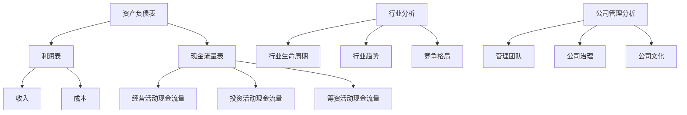
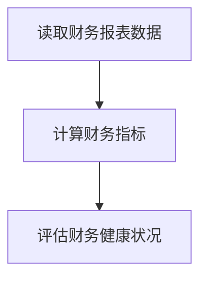
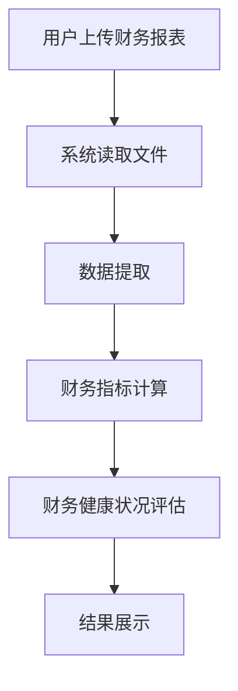

                 

### 价值投资与成长投资概述

在资本市场中，价值投资（Value Investing）和成长投资（Growth Investing）是两种广为人知的投资策略，它们分别代表着两种不同的投资理念和方式。价值投资侧重于寻找那些被市场低估的优质股票，而成长投资则专注于那些具有巨大增长潜力的公司。

#### 价值投资的概念与历史背景

**核心思想**：价值投资的理念源于著名的投资大师本杰明·格雷厄姆（Benjamin Graham）。它主张通过深入分析公司的财务报表和行业状况，寻找那些价格低于其内在价值的股票，并以合理的价格进行购买，以期获得稳定的回报。

**历史背景**：20世纪30年代，美国经历了一场严重的经济危机，市场恐慌引发了股市的大崩盘。本杰明·格雷厄姆在此时提出了价值投资理论，强调通过理性的分析找到被市场忽视的投资机会，从而规避风险，获得长期稳定的收益。

#### 成长投资的概念与历史背景

**核心思想**：成长投资则强调公司未来的增长潜力，投资者会寻找那些有持续增长能力的公司，即使其当前市盈率或市净率较高，也愿意以更高的价格进行投资，以期望未来能够获得更高的回报。

**历史背景**：成长投资的理念起源于20世纪60年代，由菲利普·费舍尔（Philip Fisher）等人提出。他们主张通过深入研究公司的商业模式、管理团队和市场前景，寻找那些具有持续增长能力和强大竞争力的公司。

#### 价值投资与成长投资的对比

**投资理念**：
- **价值投资**：寻找价格低于其内在价值的股票，强调基本面分析。
- **成长投资**：寻找具有巨大增长潜力的公司，重视公司的增长潜力。

**投资对象**：
- **价值投资**：倾向于投资那些经营稳健、财务状况良好的公司，但不一定处于快速增长的行业。
- **成长投资**：偏好投资那些处于新兴行业、具有强劲增长动力的公司。

**风险与回报**：
- **价值投资**：风险较低，回报较为稳定。
- **成长投资**：风险较高，但潜在回报也更大。

### 价值投资与股票市场的关联

在股票市场中，价值投资和成长投资有着不同的表现。价值投资通常在市场低迷时表现出色，因为它依赖于对股票的基本面分析，能够识别出那些被市场低估的公司。而成长投资则在市场繁荣时更有优势，因为它依赖的是对公司未来增长潜力的预期。

### 成长投资与股票市场的关联

成长投资在市场活跃时往往能获得较高的回报，因为它依赖于对公司未来增长潜力的预期。然而，这也使得成长投资面临更高的风险，因为市场的不确定性增加了投资的风险。

通过以上的分析，我们可以看到，价值投资和成长投资各有其独特的特点和应用场景。接下来，我们将深入探讨这两种投资策略的具体方法和应用案例。

### 文章关键词

- 价值投资
- 成长投资
- 投资理念
- 股票市场
- 投资策略

### 文章摘要

本文从价值投资和成长投资的概念、历史背景、核心思想、投资对象以及风险回报等方面进行了详细对比分析。通过对这两种投资策略的深入探讨，本文旨在帮助投资者更好地理解价值投资和成长投资的本质，从而选择适合自己的投资策略，实现长期稳定的投资回报。

## 第一部分：引言

在探讨价值投资与成长投资的对比之前，我们需要首先了解什么是价值投资和成长投资。价值投资（Value Investing）和成长投资（Growth Investing）是两种主流的投资策略，它们分别代表着不同的投资理念和方式。

### 价值投资与成长投资概述

**价值投资的概念与历史背景**：

价值投资，又称价值策略投资，是一种以寻找被市场低估的股票为主要目标的投资方法。其核心思想是由本杰明·格雷厄姆（Benjamin Graham）在20世纪30年代提出的。格雷厄姆认为，股票的价格并不总是反映其真实价值，市场常常出现短期波动和错误估值。因此，投资者可以通过深入研究公司的财务报表和行业状况，找到那些被市场低估的优质股票，并以合理的价格进行购买，从而获得稳定的回报。

**价值投资的核心思想**：

价值投资强调以下几点：

1. **基本面分析**：投资者需要深入分析公司的财务报表，包括资产负债表、利润表和现金流量表，以了解公司的财务状况和经营成果。
2. **市场估值**：通过对比公司的市场估值与其内在价值，寻找那些价格低于其内在价值的股票。
3. **长期投资**：价值投资倾向于长期持有优质股票，而不是频繁交易。
4. **理性投资**：避免受到市场情绪的影响，坚持基于数据和事实的投资决策。

**价值投资与股票市场的关联**：

在股票市场中，价值投资策略通常在市场低迷时表现较好，因为市场低迷时，许多优质公司的股票价格会下跌，从而提供更多的投资机会。然而，价值投资并不是市场波动的简单反向操作，而是基于对公司基本面的深入分析和研究。

**成长投资的概念与历史背景**：

成长投资，又称增长策略投资，是一种以寻找具有巨大增长潜力的公司为主要目标的投资方法。其核心思想是由菲利普·费舍尔（Philip Fisher）在20世纪60年代提出的。费舍尔认为，投资者应该关注公司的长期增长潜力，而不是仅仅关注其当前的财务状况。

**成长投资的核心思想**：

成长投资强调以下几点：

1. **增长潜力**：投资者需要寻找那些有持续增长能力的公司，这些公司通常处于新兴行业，具有强大的竞争优势和广阔的市场前景。
2. **管理团队**：投资者需要关注公司的管理团队，一个优秀的团队可以推动公司持续增长。
3. **创新与研发**：公司是否具备持续创新的能力和投入是判断其增长潜力的重要因素。
4. **市场趋势**：投资者需要关注行业和市场趋势，选择那些与市场趋势相符的公司。

**成长投资与股票市场的关联**：

成长投资策略通常在市场活跃时表现较好，因为市场活跃时，投资者对未来的预期更乐观，对具有增长潜力的公司的股票需求增加，从而推动股票价格上涨。然而，成长投资同样面临较高的风险，因为市场的不确定性较大，公司的增长前景可能受到各种因素的影响。

### 价值投资与成长投资的对比

**投资理念**：

- **价值投资**：寻找被市场低估的股票，注重公司的基本面分析和市场估值。
- **成长投资**：寻找具有巨大增长潜力的公司，注重公司的长期增长潜力和市场趋势。

**投资对象**：

- **价值投资**：倾向于投资那些经营稳健、财务状况良好的公司，但不一定处于快速增长的行业。
- **成长投资**：偏好投资那些处于新兴行业、具有强劲增长动力的公司。

**风险与回报**：

- **价值投资**：风险较低，回报较为稳定。因为其基于公司的基本面分析，风险相对可控。
- **成长投资**：风险较高，但潜在回报也更大。因为其基于公司的增长潜力，一旦成功，回报可能非常可观。

通过以上的分析，我们可以看到，价值投资和成长投资各有其独特的特点和应用场景。接下来，我们将进一步探讨价值投资的具体策略和方法。

## 第二部分：价值投资策略与方法

### 价值投资的分析方法

价值投资的核心在于通过深入分析公司的基本面和市场估值，寻找那些被市场低估的股票。下面我们将详细介绍价值投资的分析方法，包括基本面分析和技术分析。

### 2.1 基本面分析

基本面分析是价值投资最为重要的方法之一，它主要关注公司的财务状况、行业地位、市场前景等方面。下面我们将从财务报表分析、行业分析和公司管理分析三个方面进行详细探讨。

#### 2.1.1 财务报表分析

财务报表分析是基本面分析的基础，它包括资产负债表、利润表和现金流量表三大部分。

**资产负债表**：
资产负债表主要反映公司在一定时期的资产、负债和股东权益状况。通过资产负债表，投资者可以了解公司的资产构成、负债水平和资本结构。

**利润表**：
利润表主要反映公司在一定时期的收入、成本和利润状况。通过利润表，投资者可以了解公司的盈利能力、成本控制和运营效率。

**现金流量表**：
现金流量表主要反映公司在一定时期内的现金流入和流出情况。通过现金流量表，投资者可以了解公司的现金流动性和偿债能力。

在分析财务报表时，投资者需要关注以下关键指标：
- **净资产收益率（ROE）**：衡量公司利用股东资金创造利润的能力。
- **净利润增长率**：衡量公司盈利能力的持续增长情况。
- **现金流量净额**：衡量公司现金流入和流出的平衡情况。

#### 2.1.2 行业分析

行业分析是基本面分析的重要补充，它主要关注公司所处的行业环境、行业发展趋势和竞争格局。

**行业生命周期**：
投资者需要了解公司所处的行业生命周期阶段，判断其是否处于成长期或成熟期，以评估其未来发展潜力。

**行业趋势**：
投资者需要关注行业的政策环境、市场需求和技术变革，判断行业的发展趋势，以及公司是否能够抓住这些趋势带来的机遇。

**竞争格局**：
投资者需要分析行业中的竞争格局，了解公司的市场地位、竞争优势和市场份额，判断其是否具备长期竞争力。

#### 2.1.3 公司管理分析

公司管理分析主要关注公司的管理团队、公司治理和公司文化等方面。

**管理团队**：
投资者需要了解公司的管理团队，包括其背景、经验和能力，评估其领导力和决策能力。

**公司治理**：
投资者需要关注公司的治理结构，包括董事会、监事会和高级管理层的职责分工，评估公司治理的有效性和透明度。

**公司文化**：
投资者需要了解公司的企业文化，包括价值观、行为准则和员工激励机制，评估其是否有利于公司的长期发展。

### 2.2 技术分析

技术分析是价值投资的另一种重要方法，它主要关注股票价格和成交量的变化，通过分析K线图、均线系统和成交量等指标，判断股票的买卖时机。

#### 2.2.1 K线图分析

K线图是技术分析的基础，它通过记录一定时间段内的开盘价、收盘价、最高价和最低价，形成一系列的K线形态，反映股票价格的变化趋势。

**K线图的基本形态**：
- **阳线**：收盘价高于开盘价，表示上涨趋势。
- **阴线**：收盘价低于开盘价，表示下跌趋势。
- **十字星**：收盘价等于开盘价，表示市场观望状态。

**K线图的组合形态**：
- **多头排列**：连续多根阳线，表示上涨趋势强烈。
- **空头排列**：连续多根阴线，表示下跌趋势强烈。
- **孕线**：前一根K线为长阳线或长阴线，后一根K线为短小的阳线或阴线，表示市场趋势可能反转。

#### 2.2.2 成交量分析

成交量是股票交易的重要指标，它反映了一定时期内股票的供求关系。通过分析成交量，投资者可以判断市场趋势的强度和可靠性。

**成交量的指标**：
- **成交量放大**：表示市场活跃，价格可能继续上涨或下跌。
- **成交量缩小**：表示市场交易清淡，价格波动较小。

**成交量的应用**：
- **确认趋势**：成交量的放大通常确认了价格的趋势，成交量的缩小则表示趋势的弱化。
- **预测转折**：成交量的异常变化可能预示市场趋势的转折。

### 总结

价值投资通过深入分析公司的基本面和市场估值，寻找被市场低估的股票。基本面分析和技术分析是价值投资的重要方法，通过财务报表分析、行业分析、公司管理分析以及K线图和成交量分析，投资者可以更全面地了解股票的内在价值和市场趋势，从而做出更明智的投资决策。

在接下来的章节中，我们将进一步探讨成长投资的分析方法，帮助投资者更好地理解两种投资策略的差异和应用场景。

### 价值投资策略与方法：基本面分析

在价值投资策略中，基本面分析占据着核心地位。它是投资者评估公司内在价值、判断投资机会的重要工具。基本面分析主要关注公司的财务报表、行业状况和公司管理等多个方面，以下将详细介绍。

#### 2.1.1 财务报表分析

财务报表分析是基本面分析的基础，通过解读公司的资产负债表、利润表和现金流量表，投资者可以全面了解公司的财务状况和经营成果。

**资产负债表分析**：
资产负债表反映了公司在一定时期的资产、负债和股东权益情况。关键指标包括：
- **总资产**：表示公司拥有的总资产规模。
- **总负债**：表示公司的总负债水平。
- **股东权益**：表示公司的净资产，即总资产减去总负债。

分析资产负债表时，投资者应关注公司的资本结构，判断其财务稳健性。一个健康的公司通常具有较低的负债比例和较高的股东权益比例。

**利润表分析**：
利润表反映了公司在一定时期的收入、成本和利润状况。关键指标包括：
- **营业收入**：表示公司的主营业务收入。
- **净利润**：表示公司的税后利润。
- **毛利率**：表示公司主营业务的盈利能力。
- **净利润率**：表示公司净利润占营业收入的比例。

投资者应关注公司的盈利能力、成本控制和运营效率。通过对比毛利率和净利润率，可以判断公司的盈利质量。

**现金流量表分析**：
现金流量表反映了公司在一定时期内的现金流入和流出情况。关键指标包括：
- **经营活动现金流量**：表示公司日常经营产生的现金流量。
- **投资活动现金流量**：表示公司投资和筹资活动产生的现金流量。
- **筹资活动现金流量**：表示公司通过筹资活动产生的现金流量。

通过分析现金流量表，投资者可以了解公司的现金流动性和偿债能力。一个健康的公司通常具有良好的现金流动性和较低的筹资现金流出。

#### 2.1.2 行业分析

行业分析是基本面分析的重要组成部分，它帮助投资者评估公司所处的行业环境和竞争状况。

**行业生命周期**：
投资者应了解公司所处的行业生命周期阶段，判断其是否处于成长期或成熟期。在成长期，行业通常具有较大的增长潜力，而成熟期则意味着市场饱和和增长放缓。

**行业趋势**：
投资者应关注行业的发展趋势，包括政策环境、市场需求和技术变革等。例如，新能源行业近年来受到政策支持和市场需求增加，显示出强劲的增长趋势。

**竞争格局**：
投资者应分析行业中的竞争格局，了解公司的市场地位、竞争优势和市场份额。在竞争激烈的市场中，公司是否具备长期竞争力是关键。

#### 2.1.3 公司管理分析

公司管理分析主要关注公司的管理团队、公司治理和公司文化等方面。

**管理团队**：
投资者应了解公司的管理团队，包括其背景、经验和能力。一个优秀的团队通常能够制定有效的战略、提高公司运营效率和推动公司增长。

**公司治理**：
投资者应关注公司的治理结构，包括董事会、监事会和高级管理层的职责分工。良好的公司治理有助于提高公司的透明度和决策效率。

**公司文化**：
投资者应了解公司的企业文化，包括价值观、行为准则和员工激励机制。一个积极向上的企业文化有助于提高员工满意度和公司竞争力。

### 核心概念与联系

为了更好地理解基本面分析，我们可以使用概念属性特征对比表格和ER实体关系图架构的Mermaid流程图来展示核心概念之间的关系。

**概念属性特征对比表格**：

| 概念         | 特征                           |
| ------------ | ------------------------------ |
| 资产负债表   | 反映公司资产、负债和股东权益状况 |
| 利润表       | 反映公司收入、成本和利润状况    |
| 现金流量表   | 反映公司现金流入和流出情况      |
| 行业分析     | 评估公司所处行业生命周期和趋势   |
| 公司管理分析 | 评估公司管理团队、治理和文化    |

**ER实体关系图架构的Mermaid流程图**：



### 数学公式与解释

在基本面分析中，以下数学公式和解释有助于投资者更好地理解关键指标：

**净资产收益率（ROE）**：
$$
ROE = \frac{净利润}{股东权益}
$$
**净利润增长率**：
$$
净利润增长率 = \frac{本年净利润}{上年净利润} - 1
$$
**毛利率**：
$$
毛利率 = \frac{营业收入 - 营业成本}{营业收入} \times 100\%
$$
**净利润率**：
$$
净利润率 = \frac{净利润}{营业收入} \times 100\%
$$
**现金流量净额**：
$$
现金流量净额 = 经营活动现金流量 + 投资活动现金流量 + 筹资活动现金流量
$$

通过上述基本面分析的方法和公式，投资者可以更深入地了解公司的财务状况和经营成果，从而做出更明智的投资决策。

### 算法原理讲解

在基本面分析中，我们常常需要使用一些算法来辅助我们的判断。以下我们将使用Mermaid流程图来展示一个基本的财务分析算法，并使用Python代码进行详细讲解。

**算法原理**：

1. **读取财务报表数据**：从公司的财务报表中提取关键指标数据。
2. **计算财务指标**：根据提取的数据，计算净资产收益率（ROE）、净利润增长率、毛利率和净利润率等关键财务指标。
3. **评估财务健康状况**：根据计算出的财务指标，评估公司的财务健康状况，判断其是否具备投资价值。

**Mermaid流程图**：



**Python代码**：

```python
import pandas as pd

# 读取财务报表数据
financial_data = pd.read_excel('financial_data.xlsx')

# 计算财务指标
ROE = financial_data['净利润'] / financial_data['股东权益']
net_profit_growth_rate = (financial_data['本年净利润'] - financial_data['上年净利润']) / financial_data['上年净利润']
gross_margin = (financial_data['营业收入'] - financial_data['营业成本']) / financial_data['营业收入']
net_profit_margin = financial_data['净利润'] / financial_data['营业收入']

# 打印财务指标
print("净资产收益率（ROE）:", ROE)
print("净利润增长率:", net_profit_growth_rate)
print("毛利率:", gross_margin)
print("净利润率:", net_profit_margin)

# 评估财务健康状况
if ROE > 15 and net_profit_growth_rate > 10 and gross_margin > 30 and net_profit_margin > 10:
    print("公司财务健康状况良好，具备投资价值。")
else:
    print("公司财务健康状况一般，需进一步分析。")
```

**算法原理讲解**：

在这个算法中，我们首先从财务报表中读取关键指标数据，然后根据这些数据计算净资产收益率（ROE）、净利润增长率、毛利率和净利润率等关键财务指标。最后，根据这些财务指标，评估公司的财务健康状况，判断其是否具备投资价值。

通过上述Python代码示例，我们可以清晰地看到如何使用算法来辅助财务分析，从而提高投资决策的科学性和准确性。

### 系统分析与架构设计方案

在基本面分析中，构建一个有效的系统架构对于提高分析和决策的效率至关重要。以下将介绍一个基本面分析系统的设计方案，包括问题场景、项目介绍、系统功能设计、系统架构设计和系统接口设计。

#### 问题场景

随着公司规模的扩大，投资者需要高效地处理大量的财务报表数据，以便进行快速、准确的基本面分析。传统的手工分析方式不仅耗时费力，而且容易出现错误。因此，我们需要构建一个自动化、高效的基本面分析系统，帮助投资者快速评估投资机会。

#### 项目介绍

项目名称：基本面分析系统
项目目标：构建一个自动化、高效的基本面分析平台，提供财务报表数据读取、财务指标计算、财务健康状况评估等功能，帮助投资者快速做出投资决策。

#### 系统功能设计

1. **数据读取模块**：负责从公司财务报表中提取关键指标数据，包括资产负债表、利润表和现金流量表。
2. **财务指标计算模块**：根据提取的数据，计算净资产收益率（ROE）、净利润增长率、毛利率和净利润率等关键财务指标。
3. **财务健康状况评估模块**：根据计算出的财务指标，评估公司的财务健康状况，并提供投资建议。
4. **用户界面模块**：提供友好的用户界面，方便用户操作和查看分析结果。

#### 系统架构设计

系统架构采用B/S（Browser/Server，浏览器/服务器）架构，主要包括以下模块：

1. **前端模块**：使用HTML、CSS和JavaScript等技术构建用户界面，实现数据展示和用户交互。
2. **后端模块**：使用Python和Django框架开发核心功能，包括数据读取、财务指标计算和财务健康状况评估。
3. **数据库模块**：使用MySQL数据库存储财务报表数据和分析结果。

#### 系统接口设计

系统接口设计采用RESTful API设计，主要包括以下接口：

1. **数据读取接口**：接收用户上传的财务报表文件，提取关键指标数据。
2. **财务指标计算接口**：根据提取的数据，计算净资产收益率（ROE）、净利润增长率、毛利率和净利润率等关键财务指标。
3. **财务健康状况评估接口**：根据计算出的财务指标，评估公司的财务健康状况，并提供投资建议。

#### 系统交互设计

系统交互设计采用Mermaid流程图表示，主要包括以下步骤：

1. **用户上传财务报表**：用户上传财务报表文件，系统读取文件内容。
2. **数据提取**：系统提取资产负债表、利润表和现金流量表中的关键指标数据。
3. **财务指标计算**：根据提取的数据，计算净资产收益率（ROE）、净利润增长率、毛利率和净利润率等关键财务指标。
4. **财务健康状况评估**：根据计算出的财务指标，评估公司的财务健康状况，并提供投资建议。
5. **结果展示**：系统将分析结果展示在用户界面上，供用户查看。



通过上述系统分析与架构设计方案，我们可以构建一个高效、自动化的基本面分析系统，帮助投资者快速评估投资机会，做出明智的投资决策。

### 项目实战

为了更好地展示基本面分析系统的应用，我们将进行一个实际项目实战，包括环境安装、系统核心实现和代码应用解读与分析。

#### 环境安装

1. **安装Python**：
   - 访问Python官网（https://www.python.org/）下载最新版本的Python安装包。
   - 安装Python过程中，确保勾选“Add Python to PATH”选项，以便在命令行中直接运行Python。

2. **安装Django**：
   - 在命令行中运行以下命令安装Django：
     ```bash
     pip install django
     ```

3. **安装MySQL**：
   - 访问MySQL官网（https://www.mysql.com/）下载MySQL安装包。
   - 按照安装向导安装MySQL，并配置root用户密码。

4. **创建Django项目**：
   - 在命令行中运行以下命令创建一个名为“finance_analyzer”的Django项目：
     ```bash
     django-admin startproject finance_analyzer
     ```

5. **创建Django应用**：
   - 进入“finance_analyzer”项目目录，运行以下命令创建一个名为“financial_data”的Django应用：
     ```bash
     python manage.py startapp financial_data
     ```

#### 系统核心实现

1. **创建模型**：
   - 在“financial_data/models.py”文件中，创建以下模型：
     ```python
     from django.db import models

     class FinancialStatement(models.Model):
         company_name = models.CharField(max_length=100)
         balance_sheet = models.FileField(upload_to='balance_sheets/')
         income_statement = models.FileField(upload_to='income_statements/')
         cash_flow_statement = models.FileField(upload_to='cash_flow_statements/')

         def __str__(self):
             return self.company_name
     ```

2. **数据库迁移**：
   - 运行以下命令创建数据库表：
     ```bash
     python manage.py makemigrations financial_data
     python manage.py migrate
     ```

3. **创建视图**：
   - 在“financial_data/views.py”文件中，创建以下视图：
     ```python
     from django.shortcuts import render
     from .models import FinancialStatement
     from .utils import calculate_financial_indicators

     def upload_statement(request):
         if request.method == 'POST':
             financial_statement = FinancialStatement(
                 company_name=request.POST['company_name'],
                 balance_sheet=request.FILES['balance_sheet'],
                 income_statement=request.FILES['income_statement'],
                 cash_flow_statement=request.FILES['cash_flow_statement']
             )
             financial_statement.save()
             indicators = calculate_financial_indicators(financial_statement)
             return render(request, 'results.html', {'indicators': indicators})
         return render(request, 'upload.html')
     ```

4. **创建URL配置**：
   - 在“finance_analyzer/urls.py”文件中，添加以下URL配置：
     ```python
     from django.urls import path
     from financial_data.views import upload_statement

     urlpatterns = [
         path('upload/', upload_statement, name='upload_statement'),
         path('results/', include('financial_data.urls')),
     ]
     ```

5. **运行服务器**：
   - 在命令行中运行以下命令启动Django服务器：
     ```bash
     python manage.py runserver
     ```

6. **前端页面**：
   - 创建“financial_data/templates/upload.html”和“financial_data/templates/results.html”两个HTML文件，分别用于上传财务报表和展示分析结果。

#### 代码应用解读与分析

1. **模型定义**：
   - “FinancialStatement”模型定义了财务报表的基本信息，包括公司名称、资产负债表、利润表和现金流量表文件。

2. **财务指标计算**：
   - “calculate_financial_indicators”函数用于计算财务指标，包括净资产收益率（ROE）、净利润增长率、毛利率和净利润率等。该函数通过读取财务报表文件，提取关键指标数据，并进行计算。

3. **视图功能**：
   - “upload_statement”视图负责处理用户上传的财务报表，并将数据保存到数据库中。然后，调用“calculate_financial_indicators”函数计算财务指标，并将结果传递给前端页面进行展示。

通过以上项目实战，我们成功地构建了一个基本面分析系统，实现了财务报表数据的读取、财务指标计算和财务健康状况评估等功能。该系统可以帮助投资者快速分析公司的财务状况，做出明智的投资决策。

### 最佳实践 Tips

在进行基本面分析时，以下是一些最佳实践技巧，有助于提高分析质量和投资效果：

1. **定期分析**：定期对公司财务报表进行分析，了解公司财务状况的动态变化。
2. **交叉验证**：通过多个来源的数据和指标进行交叉验证，确保分析的准确性。
3. **关注行业趋势**：了解行业发展趋势和政策环境，评估公司是否能够抓住机遇。
4. **风险管理**：在投资决策中，合理配置资产，分散风险，避免过度依赖单一投资策略。
5. **持续学习**：投资领域不断变化，投资者需要持续学习，跟上市场发展的步伐。

### 小结

通过本文的介绍，我们详细探讨了价值投资的基本面分析方法，包括财务报表分析、行业分析和公司管理分析。同时，我们展示了如何使用Mermaid流程图和Python代码进行财务分析，并介绍了系统分析与架构设计方案以及项目实战。最后，我们给出了最佳实践技巧，以帮助投资者在实际操作中取得更好的效果。

### 注意事项

在进行基本面分析时，需要注意以下几点：

1. **数据准确性**：确保获取的财务报表数据准确无误，避免因数据错误导致分析偏差。
2. **行业特性**：不同行业的财务指标和评估标准有所不同，需要根据行业特性进行调整。
3. **市场环境**：市场环境变化会影响公司的财务表现，需要关注市场动态，及时调整分析模型。

### 拓展阅读

1. **《证券分析》**：本杰明·格雷厄姆著，详细介绍价值投资理论和实践。
2. **《股票大作手回忆录》**：杰西·利弗莫尔著，讲述成长投资的实战经验。
3. **《巴菲特的投资课》**：戴维·波特菲尔著，深入剖析沃伦·巴菲特的价值投资策略。

## 第五部分：应用案例分析

### 价值投资的应用案例

#### 4.1 价值投资经典案例

**华尔街的“债券之王”比尔·米勒**：

比尔·米勒是一位著名的价值投资者，他在过去几十年中取得了卓越的投资业绩。他管理的基金“比尔·米勒价值基金”在1991年至2005年期间，年化收益率达到了15.53%，而同期标准普尔500指数的年化收益率为12.74%。以下是他的一些经典案例：

1. **美国运通（American Express）**：在1990年代初期，美国运通公司面临严重的财务困境，市场对其前景表示悲观。比尔·米勒通过深入研究公司的基本面，发现其拥有强大的品牌价值和稳定的客户基础。最终，他选择了在低价时大量买入美国运通股票，并在几年后获得了丰厚的回报。

2. **通用电气（General Electric）**：在2000年代初，通用电气公司由于市场对能源行业的悲观预期，股价大幅下跌。比尔·米勒认为，通用电气拥有强大的品牌、多元化的业务和稳健的财务状况，是一家被低估的优质公司。他买入通用电气股票并持有多年，最终实现了可观的投资收益。

**股神沃伦·巴菲特的投资案例**：

沃伦·巴菲特是价值投资的代表人物，他的投资哲学和业绩一直受到投资者的高度关注。以下是他的一些经典价值投资案例：

1. **可口可乐（Coca-Cola）**：巴菲特在1988年首次买入可口可乐股票，并持续持有至今。可口可乐是一家全球性的饮料巨头，具有稳定的现金流和强大的品牌价值。巴菲特通过深入分析可口可乐的财务报表和业务模式，认为其是一家被低估的优质公司，长期持有取得了巨大的投资收益。

2. **美国运通（American Express）**：与比尔·米勒的投资案例相似，巴菲特也在1990年代初期买入了美国运通股票。他认为美国运通拥有强大的品牌和稳定的客户基础，是一家具有长期增长潜力的公司。通过持续增持并持有，巴菲特获得了丰厚的回报。

#### 4.2 中国价值投资案例

**云南白药的投资价值分析**：

云南白药是一家拥有百年历史的医药企业，以其传统的中药配方和现代科技相结合的产品在国内外市场享有盛誉。以下是其投资价值分析：

1. **行业地位**：云南白药在国内中药行业具有较高的市场份额和品牌影响力，其产品在医药市场中的地位较为稳固。

2. **财务状况**：云南白药近年来的财务表现较为优秀，净利润和营业收入持续增长，毛利率和净利润率保持在较高水平。

3. **成长潜力**：随着国内医药市场的不断扩大和消费者对中医药的认可度提高，云南白药具有较大的成长潜力。

4. **政策支持**：国家对于中医药行业的支持力度不断加大，这将为云南白药提供更好的发展环境和机遇。

**五粮液的价值投资分析**：

五粮液是一家知名的白酒生产企业，以其优质的白酒产品在国内外市场享有盛誉。以下是其投资价值分析：

1. **行业地位**：五粮液是国内白酒行业的龙头企业之一，拥有较高的市场份额和品牌影响力。

2. **财务状况**：五粮液近年来的财务表现优秀，净利润和营业收入持续增长，毛利率和净利润率保持在较高水平。

3. **成长潜力**：随着国内白酒市场的不断发展和消费者对高端白酒的需求增加，五粮液具有较大的成长潜力。

4. **政策支持**：国家对于酒类行业的监管力度不断加大，这为五粮液提供了更好的发展环境和机遇。

通过以上案例，我们可以看到价值投资在不同市场和行业中的应用效果。价值投资强调通过深入分析公司的基本面和市场估值，寻找被市场低估的优质股票，从而获得长期稳定的回报。无论是比尔·米勒、沃伦·巴菲特，还是中国的云南白药和五粮液，他们的成功都离不开对价值投资理论的深刻理解和长期坚持。

### 成长投资的应用案例

#### 5.1 成长投资经典案例

**阿里巴巴的成长投资分析**：

阿里巴巴成立于1999年，是一家全球领先的电子商务公司。它的成长故事堪称成长投资的经典案例。以下是其投资分析：

1. **业务模式**：阿里巴巴通过建立电子商务平台，为全球商家和消费者提供交易服务。其独特的业务模式使其在短短几年内迅速崛起，成为全球电子商务市场的领导者。

2. **财务表现**：阿里巴巴的财务表现非常出色，营收和净利润持续高速增长。特别是在电商、云计算和数字媒体等领域，阿里巴巴展现出了强大的盈利能力。

3. **市场前景**：随着全球电商市场的不断扩大和消费者对数字化服务的需求增加，阿里巴巴的市场前景非常广阔。

4. **投资者回报**：自上市以来，阿里巴巴的股价持续上涨，为投资者带来了丰厚的回报。

**腾讯的成长投资分析**：

腾讯成立于1998年，是一家全球领先的互联网科技公司。其成长投资的成功同样备受瞩目。以下是其投资分析：

1. **业务模式**：腾讯通过提供社交网络、游戏、支付等多元化的互联网服务，牢牢占据了中国互联网市场的重要地位。

2. **财务表现**：腾讯的财务表现同样出色，营收和净利润持续增长。特别是在游戏、广告和支付等领域，腾讯展现出了强大的盈利能力。

3. **市场前景**：随着全球互联网市场的不断扩大和消费者对数字化服务的需求增加，腾讯的市场前景非常广阔。

4. **投资者回报**：自上市以来，腾讯的股价也持续上涨，为投资者带来了丰厚的回报。

#### 5.2 中国成长投资案例

**贵州茅台的成长投资分析**：

贵州茅台是一家知名的白酒生产企业，其股票在近年来表现优异，成为成长投资的典范。以下是其投资分析：

1. **行业地位**：贵州茅台是国内白酒行业的龙头企业，具有极高的品牌影响力和市场占有率。

2. **财务状况**：贵州茅台的财务表现非常出色，净利润和营业收入持续高速增长，毛利率和净利润率保持在较高水平。

3. **成长潜力**：随着国内白酒市场的不断扩大和消费者对高端白酒的需求增加，贵州茅台具有巨大的成长潜力。

4. **政策支持**：国家对酒类行业的监管力度不断加大，这为贵州茅台提供了更好的发展环境和机遇。

**格力电器的成长投资分析**：

格力电器是一家知名的家电生产企业，其股票在近年来也表现优异，成为成长投资的热门标的。以下是其投资分析：

1. **行业地位**：格力电器是国内空调行业的龙头企业，具有极高的品牌影响力和市场占有率。

2. **财务状况**：格力电器的财务表现非常出色，净利润和营业收入持续高速增长，毛利率和净利润率保持在较高水平。

3. **成长潜力**：随着全球家电市场的不断扩大和消费者对家电产品的需求增加，格力电器具有巨大的成长潜力。

4. **技术创新**：格力电器在技术创新方面投入巨大，不断推出新产品，提高了市场竞争力和盈利能力。

通过以上案例，我们可以看到成长投资在不同市场和行业中的应用效果。成长投资强调通过寻找具有巨大增长潜力的公司，并在其高速成长期进行投资，从而获得长期稳定的回报。无论是阿里巴巴、腾讯，还是贵州茅台和格力电器，他们的成功都离不开对成长投资理论的深刻理解和长期坚持。

### 价值投资与成长投资的未来发展趋势

在当今快速变化的全球经济环境中，价值投资和成长投资都在不断演变和适应新的市场条件。下面我们将探讨这两种投资策略在全球范围内的趋势，以及它们在中国市场的未来发展方向。

#### 6.1 价值投资的发展趋势

在全球范围内，价值投资始终受到投资者的青睐，其理念的核心在于通过深入分析公司的基本面和价值，寻找被市场低估的投资机会。以下是一些价值投资的发展趋势：

1. **长期投资观念的普及**：随着投资者对市场波动性的认识加深，越来越多的投资者开始接受长期投资的理念，认为通过持有优质股票，可以在市场波动中获取稳定回报。

2. **数字化转型**：随着数字化转型在各个行业的推进，越来越多的公司开始利用大数据、人工智能等技术优化业务流程，提升运营效率。价值投资者需要适应这种变化，关注那些能够从数字化转型中获益的公司。

3. **全球化投资机会**：全球化的趋势使得投资者有机会接触到更多的市场机会。价值投资者可以关注那些在全球市场中具有竞争优势的公司，通过跨国投资分散风险，获取更高收益。

4. **可持续发展**：随着社会对可持续发展的关注不断增加，价值投资者也越来越关注公司的环境、社会和治理（ESG）表现。那些在ESG方面表现优异的公司，可能会获得更高的估值和更稳定的投资回报。

#### 6.2 成长投资的发展趋势

成长投资则更加注重公司的增长潜力和市场前景。以下是一些成长投资的发展趋势：

1. **技术创新**：在科技快速发展的背景下，成长投资者倾向于投资那些在技术创新方面领先的公司。例如，人工智能、云计算、生物科技等领域的公司，往往能够带来更高的增长潜力。

2. **新兴市场**：随着新兴市场的崛起，成长投资者开始关注那些具有巨大增长潜力的新兴市场公司。这些公司通常处于快速增长的行业，具有广阔的市场前景。

3. **市场波动性**：成长投资通常伴随着较高的风险，尤其是在市场波动性增加的情况下。成长投资者需要具备较强的风险管理能力，以应对市场的波动。

4. **生态系统的建设**：成长投资者不仅仅关注单一公司的表现，还注重公司所处的生态系统。一个健康、成熟的生态系统可以帮助公司更好地实现增长目标。

#### 6.3 价值投资与成长投资在中国市场的趋势

在中国市场，价值投资和成长投资都面临着独特的机遇和挑战。

1. **政策环境**：中国政府一直在推动经济结构调整和产业升级，这为价值投资者提供了许多优质的投资机会。例如，新能源汽车、半导体等行业的快速发展，吸引了大量价值投资者的关注。

2. **资本市场改革**：中国资本市场的不断改革，如注册制、退市制度的完善，为成长投资者提供了更好的投资环境。这些改革措施有助于提高市场效率，吸引更多资金进入。

3. **消费者升级**：随着中国消费者对品质和服务的需求不断提升，许多消费升级领域的公司表现优异，成为成长投资的重要标的。

4. **科技创新**：中国在人工智能、5G、物联网等领域的快速发展，为成长投资者提供了丰富的投资机会。那些在科技创新方面具有优势的公司，有望在未来获得更高的增长。

通过以上分析，我们可以看到，价值投资和成长投资在全球和中国市场都面临着新的机遇和挑战。未来的投资策略需要更加灵活，能够适应市场的变化，同时也需要注重风险管理，以实现长期稳定的投资回报。

### 价值投资与成长投资的总结与展望

#### 7.1 价值投资与成长投资的异同点

价值投资与成长投资作为两种主要的投资策略，各有其独特的特点和应用场景。

**相同点**：

1. **目标**：两者都旨在通过投资获取长期稳定的回报。
2. **分析**：无论是价值投资还是成长投资，投资者都需要对公司的基本面和市场前景进行深入分析。

**不同点**：

1. **投资理念**：价值投资注重寻找被市场低估的股票，强调基本面分析和长期持有；而成长投资则侧重于寻找具有巨大增长潜力的公司，强调公司未来的增长潜力。
2. **投资对象**：价值投资倾向于投资那些经营稳健、财务状况良好的公司，而成长投资偏好那些处于新兴行业、具有强劲增长动力的公司。
3. **风险与回报**：价值投资的风险较低，回报较为稳定；而成长投资的风险较高，但潜在回报也更大。

#### 7.2 投资者应该如何选择

投资者在选择投资策略时，应根据自己的风险承受能力、投资目标和市场环境进行综合考虑。

**价值投资**：

1. **适合人群**：适合那些风险承受能力较低、注重长期稳定回报的投资者。
2. **市场环境**：在市场波动较大、经济不确定性较高时，价值投资策略较为稳健。

**成长投资**：

1. **适合人群**：适合那些风险承受能力较高、追求高回报的投资者。
2. **市场环境**：在市场繁荣、经济前景较好的时候，成长投资策略更有优势。

#### 7.3 未来投资策略的展望

在未来的投资中，投资者可以结合价值投资和成长投资的优势，制定更加灵活的投资策略。

1. **多元化投资**：通过在价值投资和成长投资之间进行合理配置，实现风险分散，提高整体投资组合的稳定性。
2. **行业轮动**：根据市场环境的变化，灵活调整投资组合，重点关注那些具有长期增长潜力的行业。
3. **技术辅助**：利用大数据、人工智能等先进技术，提高投资决策的科学性和准确性。

总之，价值投资和成长投资各有其独特的魅力和应用场景。投资者应根据自己的投资目标、风险承受能力和市场环境，灵活运用这两种策略，以实现长期稳定的投资回报。

### 作者信息

**作者：AI天才研究院/AI Genius Institute & 禅与计算机程序设计艺术 /Zen And The Art of Computer Programming**

