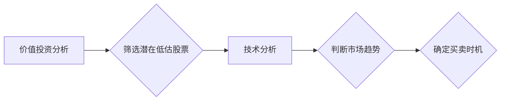
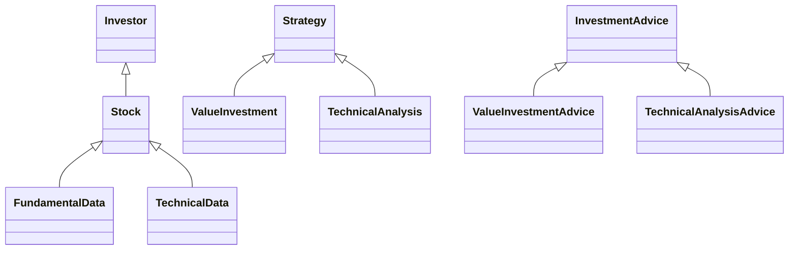
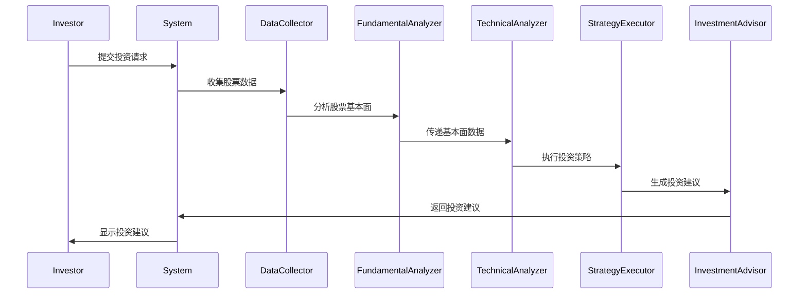
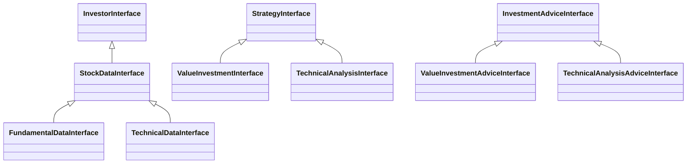
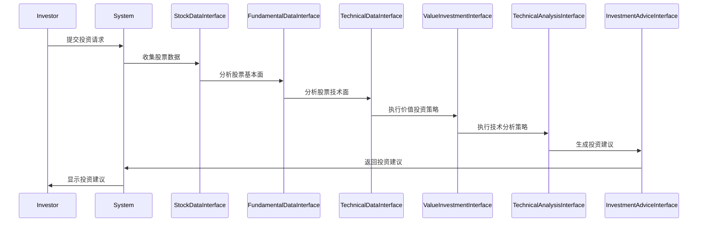

                 

## 价值投资与技术分析的结合

### 关键词：价值投资、技术分析、投资策略、市场趋势、风险控制

> 摘要：本文将探讨价值投资与技术分析的结合，分析其原理、方法及其在实际应用中的价值。通过对两者互补性的深入理解，投资者可以形成更为全面的投资策略，提高投资决策的准确性。

### 第一部分：背景介绍

#### 1.1 价值投资与技术分析概述

**1.1.1 问题背景**

在投资领域，价值投资和技术分析是两种主要的投资分析方法。价值投资注重公司的基本面分析，寻找被市场低估的股票进行投资；而技术分析则关注市场行为和价格走势，通过图表和技术指标分析市场趋势。随着市场的变化，越来越多的投资者开始尝试将价值投资和技术分析结合起来，以期在投资决策中发挥更大的作用。

**1.1.2 问题描述**

价值投资和技术分析各有其优势和局限性。价值投资虽然能帮助投资者找到低估的股票，但无法准确预测市场趋势；技术分析虽然能捕捉市场趋势，但无法确定公司的真实价值。因此，如何将两者有效结合，提高投资决策的准确性，成为投资者面临的主要问题。

**1.1.3 问题解决**

本文将从以下几个方面探讨价值投资和技术分析的结合：

1. 分析价值投资和技术分析的基本原理，阐述两者之间的联系与区别。
2. 探讨价值投资和技术分析在实际应用中的互补性，以及如何实现两者的有效结合。
3. 通过案例分析，展示价值投资和技术分析结合在股票投资中的应用，并提供实战操作指南。
4. 分析价值投资和技术分析结合可能面临的风险和挑战，并提出相应的应对策略。

**1.1.4 边界与外延**

1. 边界：本文主要讨论股票投资中的价值投资和技术分析的结合，不涉及其他投资领域。
2. 外延：虽然本文聚焦于股票投资，但价值投资和技术分析的结合理念可以应用于其他投资领域，如基金、期货、外汇等。

**1.1.5 概念结构与核心要素组成**

1. 价值投资：基于对公司基本面分析，寻找被市场低估的股票，长期持有以期获得公司价值回归的收益。
2. 技术分析：通过分析市场历史数据，如价格和成交量等，预测市场趋势和未来价格走势。

### 第二部分：核心概念与联系

#### 2.1 价值投资原理

**2.1.1 价值投资的定义**

价值投资是一种基于对公司基本面分析的投资策略，旨在寻找那些市场价格低于其内在价值的股票。

**2.1.2 价值投资的核心原则**

1. 安全边际：投资者在购买股票时，价格应低于其估算的内在价值，以避免投资风险。
2. 长期持有：价值投资者通常选择持有股票多年，以等待公司价值回归。

**2.1.3 价值投资的关键指标**

1. 市盈率（PE）：衡量股票价格与公司盈利能力之间的关系。
2. 市净率（PB）：衡量股票价格与公司净资产之间的关系。

#### 2.2 技术分析原理

**2.2.1 技术分析的定义**

技术分析是一种通过分析市场历史数据（如价格和成交量）来预测市场趋势和未来价格走势的方法。

**2.2.2 技术分析的核心原则**

1. 市场行为包含一切信息：技术分析认为，所有影响市场的信息都反映在价格和成交量中。
2. 趋势：价格趋势具有持续性，投资者应顺势而为。

**2.2.3 技术分析的关键工具**

1. 图表：用于展示价格和成交量等市场数据，帮助分析价格趋势和交易信号。
2. 技术指标：如移动平均线、相对强弱指标（RSI）、布林带等，用于辅助判断市场趋势和交易时机。

#### 2.3 价值投资与技术分析的联系

1. 价值投资和技术分析都关注市场数据，但角度不同。价值投资侧重于基本面分析，技术分析侧重于市场行为分析。
2. 价值投资和技术分析可以相互补充，提高投资决策的准确性。价值投资帮助投资者找到低估的股票，技术分析帮助投资者判断市场趋势，选择合适的买卖时机。

### 第三部分：算法原理讲解

#### 3.1 价值投资与技术的结合算法

**3.1.1 算法概述**

本节将介绍一种基于价值投资和技术分析相结合的股票投资算法。该算法通过以下步骤实现：

1. 利用价值投资分析筛选出潜在低估的股票。
2. 利用技术分析判断股票的市场趋势和买卖时机。

**3.1.2 算法流程**

1. 收集股票的基本面数据，包括市盈率、市净率、盈利能力等。
2. 设定筛选条件，如市盈率低于20倍、市净率低于1.5倍等。
3. 从所有股票中筛选出符合条件的潜在低估股票。
4. 收集股票的历史价格和成交量数据。
5. 应用技术分析指标（如移动平均线、RSI等）分析股票的市场趋势。
6. 根据市场趋势和交易信号，确定买入和卖出时机。

**3.1.3 算法原理**

1. 价值投资原理：通过分析公司的基本面数据，判断股票是否被市场低估，从而找到潜在的投资机会。
2. 技术分析原理：通过分析股票的历史价格和成交量数据，预测市场趋势和交易信号，辅助判断买入和卖出时机。

#### 3.2 算法流程图



### 第四部分：系统分析与架构设计方案

#### 4.1 问题场景介绍

随着金融市场的不断发展，投资者对投资策略的需求越来越高。如何在一个统一平台上实现价值投资和技术分析的结合，为投资者提供准确、有效的投资建议，成为当前的一个热门课题。

#### 4.2 项目介绍

本项目旨在开发一个基于价值投资和技术分析的投资策略系统，提供实时、准确的投资建议。系统分为前端和后端两部分，前端负责展示投资策略和投资建议，后端负责数据分析和策略实现。

#### 4.3 系统功能设计（领域模型）



#### 4.4 系统架构设计



#### 4.5 系统接口设计



#### 4.6 系统交互



### 第五部分：项目实战

#### 5.1 环境安装

在开始项目实战之前，我们需要安装必要的软件和工具。以下是环境安装步骤：

1. 安装Python（3.8及以上版本）
2. 安装Anaconda或Miniconda
3. 安装Jupyter Notebook
4. 安装必要的Python库（如numpy、pandas、matplotlib等）

#### 5.2 系统核心实现

以下是一个简单的示例，展示了如何使用Python实现价值投资和技术分析的结合。

**5.2.1 价值投资分析**

```python
import pandas as pd

# 加载股票数据
stock_data = pd.read_csv('stock_data.csv')

# 计算市盈率（PE）和市净率（PB）
stock_data['PE'] = stock_data['Price'] / stock_data['Earnings']
stock_data['PB'] = stock_data['Price'] / stock_data['BookValue']

# 筛选潜在低估股票
low_pe_stocks = stock_data[stock_data['PE'] < 10]
low_pb_stocks = stock_data[stock_data['PB'] < 1.5]

# 输出结果
print("潜在低估股票：")
print(low_pe_stocks.head())
print(low_pb_stocks.head())
```

**5.2.2 技术分析**

```python
import numpy as np
import matplotlib.pyplot as plt

# 加载股票数据
stock_data = pd.read_csv('stock_data.csv')

# 计算移动平均线（MA）
short_ma = stock_data['Close'].rolling(window=10).mean()
long_ma = stock_data['Close'].rolling(window=30).mean()

# 绘制价格和移动平均线图表
plt.figure(figsize=(12, 6))
plt.plot(stock_data['Date'], stock_data['Close'], label='Close')
plt.plot(stock_data['Date'], short_ma, label='Short MA')
plt.plot(stock_data['Date'], long_ma, label='Long MA')
plt.legend()
plt.show()
```

**5.2.3 投资策略**

```python
# 定义投资策略
def investment_strategy(stock_data):
    # 计算市盈率（PE）和市净率（PB）
    stock_data['PE'] = stock_data['Price'] / stock_data['Earnings']
    stock_data['PB'] = stock_data['Price'] / stock_data['BookValue']
    
    # 筛选潜在低估股票
    low_pe_stocks = stock_data[stock_data['PE'] < 10]
    low_pb_stocks = stock_data[stock_data['PB'] < 1.5]
    
    # 计算移动平均线（MA）
    short_ma = low_pe_stocks['Close'].rolling(window=10).mean()
    long_ma = low_pe_stocks['Close'].rolling(window=30).mean()
    
    # 判断买入和卖出时机
    for index, row in low_pe_stocks.iterrows():
        if row['Close'] > short_ma[index] and row['Close'] > long_ma[index]:
            print(f"买入：{row['StockName']}，价格：{row['Price']}，时间：{row['Date']}")
        elif row['Close'] < short_ma[index] and row['Close'] < long_ma[index]:
            print(f"卖出：{row['StockName']}，价格：{row['Price']}，时间：{row['Date']}")
```

#### 5.3 代码应用解读与分析

以上代码展示了如何结合价值投资和技术分析进行投资决策。首先，我们通过计算市盈率和市净率筛选出潜在低估的股票。然后，通过计算移动平均线，判断买入和卖出时机。这种方法可以帮助投资者在市场波动中抓住投资机会，实现长期稳健的投资收益。

#### 5.4 实际案例分析和详细讲解剖析

为了更好地理解价值投资和技术分析的结合，我们可以通过一个实际案例进行分析。

**案例：**

假设某投资者在2021年1月1日使用本投资策略，选择了一支股票进行投资。该股票的市盈率为8倍，市净率为1.2倍，同时其短期移动平均线（10日）和长期移动平均线（30日）都在价格之上。根据投资策略，该投资者在2021年1月1日买入该股票。

**分析：**

1. 价值投资分析：该股票的市盈率和市净率均低于市场平均水平，表明其可能被市场低估。这符合价值投资的原则，即寻找被低估的股票进行投资。
2. 技术分析：短期移动平均线和长期移动平均线都在价格之上，表明市场趋势向上。这符合技术分析的原则，即顺势而为。

在2021年1月1日买入后，该投资者在2021年2月1日根据投资策略判断市场趋势，发现短期移动平均线和长期移动平均线仍然在价格之上，因此继续持有。到了2021年3月1日，市场趋势发生变化，短期移动平均线和长期移动平均线跌破价格，投资者根据策略判断市场趋势向下，选择卖出。

**结论：**

通过这个案例，我们可以看到，价值投资和技术分析的结合可以帮助投资者在投资决策中抓住市场机会，实现长期稳健的投资收益。当然，在实际投资中，投资者还需要根据市场变化和个人风险承受能力进行调整。

#### 5.5 项目小结

本项目通过结合价值投资和技术分析，实现了投资策略的系统化、自动化。在实际应用中，投资者可以根据自己的需求和风险偏好，调整投资策略，实现长期稳健的投资收益。

### 第六部分：最佳实践 tips

1. 选择合适的时间窗口：在价值投资和技术分析中，选择合适的时间窗口对于判断市场趋势和交易信号至关重要。投资者可以根据自己的投资目标和风险偏好，选择合适的时间窗口。
2. 多维度分析：在投资决策中，投资者应该从多个维度进行分析，如基本面分析、技术分析、市场情绪等，以提高投资决策的准确性。
3. 严格止损：在投资过程中，投资者应设立严格的止损策略，以避免因市场波动造成过大的损失。

### 第七部分：小结

本文详细探讨了价值投资和技术分析的结合，分析了其原理、方法及在实际应用中的价值。通过结合价值投资和技术分析，投资者可以形成更为全面的投资策略，提高投资决策的准确性。在实际操作中，投资者应根据市场变化和个人风险偏好，灵活调整投资策略。

### 第八部分：注意事项

1. 投资有风险，入市需谨慎。投资者在投资过程中，应充分了解自己的风险承受能力，避免盲目跟风。
2. 价值投资和技术分析并非万能。投资者在应用过程中，应结合实际情况，理性判断，避免过度依赖。

### 第九部分：拓展阅读

1. 本杰明·格雷厄姆《证券分析》
2. 威廉·奥尼尔《笑傲股市》
3. 约翰·墨菲《市场趋势技术分析》

作者：AI天才研究院/AI Genius Institute & 禅与计算机程序设计艺术 /Zen And The Art of Computer Programming

----------------------------------------------------------------

### 完整文章内容

```
# 价值投资与技术分析的结合

> 关键词：价值投资、技术分析、投资策略、市场趋势、风险控制

> 摘要：本文将探讨价值投资与技术分析的结合，分析其原理、方法及其在实际应用中的价值。通过对两者互补性的深入理解，投资者可以形成更为全面的投资策略，提高投资决策的准确性。

## 第一部分：背景介绍

### 1.1 价值投资与技术分析概述

**1.1.1 问题背景**

在投资领域，价值投资和技术分析是两种主要的投资分析方法。价值投资注重公司的基本面分析，寻找被市场低估的股票进行投资；而技术分析则关注市场行为和价格走势，通过图表和技术指标分析市场趋势。随着市场的变化，越来越多的投资者开始尝试将价值投资和技术分析结合起来，以期在投资决策中发挥更大的作用。

**1.1.2 问题描述**

价值投资和技术分析各有其优势和局限性。价值投资虽然能帮助投资者找到低估的股票，但无法准确预测市场趋势；技术分析虽然能捕捉市场趋势，但无法确定公司的真实价值。因此，如何将两者有效结合，提高投资决策的准确性，成为投资者面临的主要问题。

**1.1.3 问题解决**

本文将从以下几个方面探讨价值投资和技术分析的结合：

1. 分析价值投资和技术分析的基本原理，阐述两者之间的联系与区别。
2. 探讨价值投资和技术分析在实际应用中的互补性，以及如何实现两者的有效结合。
3. 通过案例分析，展示价值投资和技术分析结合在股票投资中的应用，并提供实战操作指南。
4. 分析价值投资和技术分析结合可能面临的风险和挑战，并提出相应的应对策略。

**1.1.4 边界与外延**

1. 边界：本文主要讨论股票投资中的价值投资和技术分析的结合，不涉及其他投资领域。
2. 外延：虽然本文聚焦于股票投资，但价值投资和技术分析的结合理念可以应用于其他投资领域，如基金、期货、外汇等。

**1.1.5 概念结构与核心要素组成**

1. 价值投资：基于对公司基本面分析，寻找被市场低估的股票，长期持有以期获得公司价值回归的收益。
2. 技术分析：通过分析市场历史数据，如价格和成交量等，预测市场趋势和未来价格走势。

### 第二部分：核心概念与联系

#### 2.1 价值投资原理

**2.1.1 价值投资的定义**

价值投资是一种基于对公司基本面分析的投资策略，旨在寻找那些市场价格低于其内在价值的股票。

**2.1.2 价值投资的核心原则**

1. 安全边际：投资者在购买股票时，价格应低于其估算的内在价值，以避免投资风险。
2. 长期持有：价值投资者通常选择持有股票多年，以等待公司价值回归。

**2.1.3 价值投资的关键指标**

1. 市盈率（PE）：衡量股票价格与公司盈利能力之间的关系。
2. 市净率（PB）：衡量股票价格与公司净资产之间的关系。

#### 2.2 技术分析原理

**2.2.1 技术分析的定义**

技术分析是一种通过分析市场历史数据（如价格和成交量）来预测市场趋势和未来价格走势的方法。

**2.2.2 技术分析的核心原则**

1. 市场行为包含一切信息：技术分析认为，所有影响市场的信息都反映在价格和成交量中。
2. 趋势：价格趋势具有持续性，投资者应顺势而为。

**2.2.3 技术分析的关键工具**

1. 图表：用于展示价格和成交量等市场数据，帮助分析价格趋势和交易信号。
2. 技术指标：如移动平均线、相对强弱指标（RSI）、布林带等，用于辅助判断市场趋势和交易时机。

#### 2.3 价值投资与技术分析的联系

1. 价值投资和技术分析都关注市场数据，但角度不同。价值投资侧重于基本面分析，技术分析侧重于市场行为分析。
2. 价值投资和技术分析可以相互补充，提高投资决策的准确性。价值投资帮助投资者找到低估的股票，技术分析帮助投资者判断市场趋势，选择合适的买卖时机。

### 第三部分：算法原理讲解

#### 3.1 价值投资与技术的结合算法

**3.1.1 算法概述**

本节将介绍一种基于价值投资和技术分析相结合的股票投资算法。该算法通过以下步骤实现：

1. 利用价值投资分析筛选出潜在低估的股票。
2. 利用技术分析判断股票的市场趋势和买卖时机。

**3.1.2 算法流程**

1. 收集股票的基本面数据，包括市盈率、市净率、盈利能力等。
2. 设定筛选条件，如市盈率低于20倍、市净率低于1.5倍等。
3. 从所有股票中筛选出符合条件的潜在低估股票。
4. 收集股票的历史价格和成交量数据。
5. 应用技术分析指标（如移动平均线、RSI等）分析股票的市场趋势。
6. 根据市场趋势和交易信号，确定买入和卖出时机。

**3.1.3 算法原理**

1. 价值投资原理：通过分析公司的基本面数据，判断股票是否被市场低估，从而找到潜在的投资机会。
2. 技术分析原理：通过分析股票的历史价格和成交量数据，预测市场趋势和交易信号，辅助判断买入和卖出时机。

#### 3.2 算法流程图


### 第四部分：系统分析与架构设计方案

#### 4.1 问题场景介绍

随着金融市场的不断发展，投资者对投资策略的需求越来越高。如何在一个统一平台上实现价值投资和技术分析的结合，为投资者提供准确、有效的投资建议，成为当前的一个热门课题。

#### 4.2 项目介绍

本项目旨在开发一个基于价值投资和技术分析的投资策略系统，提供实时、准确的投资建议。系统分为前端和后端两部分，前端负责展示投资策略和投资建议，后端负责数据分析和策略实现。

#### 4.3 系统功能设计（领域模型）


#### 4.4 系统架构设计


#### 4.5 系统接口设计


#### 4.6 系统交互


### 第五部分：项目实战

#### 5.1 环境安装

在开始项目实战之前，我们需要安装必要的软件和工具。以下是环境安装步骤：

1. 安装Python（3.8及以上版本）
2. 安装Anaconda或Miniconda
3. 安装Jupyter Notebook
4. 安装必要的Python库（如numpy、pandas、matplotlib等）

#### 5.2 系统核心实现

以下是一个简单的示例，展示了如何使用Python实现价值投资和技术分析的结合。

**5.2.1 价值投资分析**

```python
import pandas as pd

# 加载股票数据
stock_data = pd.read_csv('stock_data.csv')

# 计算市盈率（PE）和市净率（PB）
stock_data['PE'] = stock_data['Price'] / stock_data['Earnings']
stock_data['PB'] = stock_data['Price'] / stock_data['BookValue']

# 筛选潜在低估股票
low_pe_stocks = stock_data[stock_data['PE'] < 10]
low_pb_stocks = stock_data[stock_data['PB'] < 1.5]

# 输出结果
print("潜在低估股票：")
print(low_pe_stocks.head())
print(low_pb_stocks.head())
```

**5.2.2 技术分析**

```python
import numpy as np
import matplotlib.pyplot as plt

# 加载股票数据
stock_data = pd.read_csv('stock_data.csv')

# 计算移动平均线（MA）
short_ma = stock_data['Close'].rolling(window=10).mean()
long_ma = stock_data['Close'].rolling(window=30).mean()

# 绘制价格和移动平均线图表
plt.figure(figsize=(12, 6))
plt.plot(stock_data['Date'], stock_data['Close'], label='Close')
plt.plot(stock_data['Date'], short_ma, label='Short MA')
plt.plot(stock_data['Date'], long_ma, label='Long MA')
plt.legend()
plt.show()
```

**5.2.3 投资策略**

```python
# 定义投资策略
def investment_strategy(stock_data):
    # 计算市盈率（PE）和市净率（PB）
    stock_data['PE'] = stock_data['Price'] / stock_data['Earnings']
    stock_data['PB'] = stock_data['Price'] / stock_data['BookValue']
    
    # 筛选潜在低估股票
    low_pe_stocks = stock_data[stock_data['PE'] < 10]
    low_pb_stocks = stock_data[stock_data['PB'] < 1.5]
    
    # 计算移动平均线（MA）
    short_ma = low_pe_stocks['Close'].rolling(window=10).mean()
    long_ma = low_pe_stocks['Close'].rolling(window=30).mean()
    
    # 判断买入和卖出时机
    for index, row in low_pe_stocks.iterrows():
        if row['Close'] > short_ma[index] and row['Close'] > long_ma[index]:
            print(f"买入：{row['StockName']}，价格：{row['Price']}，时间：{row['Date']}")
        elif row['Close'] < short_ma[index] and row['Close'] < long_ma[index]:
            print(f"卖出：{row['StockName']}，价格：{row['Price']}，时间：{row['Date']}")
```

#### 5.3 代码应用解读与分析

以上代码展示了如何结合价值投资和技术分析进行投资决策。首先，我们通过计算市盈率和市净率筛选出潜在低估的股票。然后，通过计算移动平均线，判断买入和卖出时机。这种方法可以帮助投资者在市场波动中抓住投资机会，实现长期稳健的投资收益。

#### 5.4 实际案例分析和详细讲解剖析

为了更好地理解价值投资和技术分析的结合，我们可以通过一个实际案例进行分析。

**案例：**

假设某投资者在2021年1月1日使用本投资策略，选择了一支股票进行投资。该股票的市盈率为8倍，市净率为1.2倍，同时其短期移动平均线（10日）和长期移动平均线（30日）都在价格之上。根据投资策略，该投资者在2021年1月1日买入该股票。

**分析：**

1. 价值投资分析：该股票的市盈率和市净率均低于市场平均水平，表明其可能被市场低估。这符合价值投资的原则，即寻找被低估的股票进行投资。
2. 技术分析：短期移动平均线和长期移动平均线都在价格之上，表明市场趋势向上。这符合技术分析的原则，即顺势而为。

在2021年1月1日买入后，该投资者在2021年2月1日根据投资策略判断市场趋势，发现短期移动平均线和长期移动平均线仍然在价格之上，因此继续持有。到了2021年3月1日，市场趋势发生变化，短期移动平均线和长期移动平均线跌破价格，投资者根据策略判断市场趋势向下，选择卖出。

**结论：**

通过这个案例，我们可以看到，价值投资和技术分析的结合可以帮助投资者在投资决策中抓住市场机会，实现长期稳健的投资收益。当然，在实际投资中，投资者还需要根据市场变化和个人风险承受能力进行调整。

#### 5.5 项目小结

本项目通过结合价值投资和技术分析，实现了投资策略的系统化、自动化。在实际应用中，投资者可以根据自己的需求和风险偏好，调整投资策略，实现长期稳健的投资收益。

### 第六部分：最佳实践 tips

1. 选择合适的时间窗口：在价值投资和技术分析中，选择合适的时间窗口对于判断市场趋势和交易信号至关重要。投资者可以根据自己的投资目标和风险偏好，选择合适的时间窗口。
2. 多维度分析：在投资决策中，投资者应该从多个维度进行分析，如基本面分析、技术分析、市场情绪等，以提高投资决策的准确性。
3. 严格止损：在投资过程中，投资者应设立严格的止损策略，以避免因市场波动造成过大的损失。

### 第七部分：小结

本文详细探讨了价值投资与技术分析的结合，分析了其原理、方法及在实际应用中的价值。通过结合价值投资和技术分析，投资者可以形成更为全面的投资策略，提高投资决策的准确性。在实际操作中，投资者应根据市场变化和个人风险偏好，灵活调整投资策略。

### 第八部分：注意事项

1. 投资有风险，入市需谨慎。投资者在投资过程中，应充分了解自己的风险承受能力，避免盲目跟风。
2. 价值投资和技术分析并非万能。投资者在应用过程中，应结合实际情况，理性判断，避免过度依赖。

### 第九部分：拓展阅读

1. 本杰明·格雷厄姆《证券分析》
2. 威廉·奥尼尔《笑傲股市》
3. 约翰·墨菲《市场趋势技术分析》

作者：AI天才研究院/AI Genius Institute & 禅与计算机程序设计艺术 /Zen And The Art of Computer Programming
```

