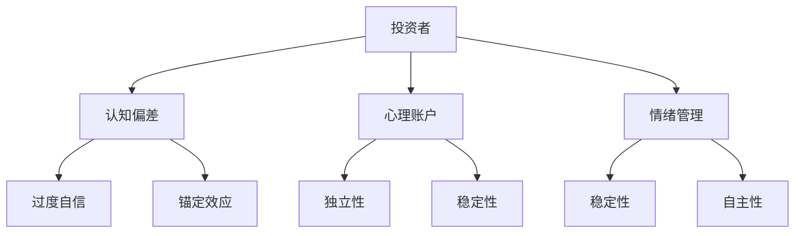
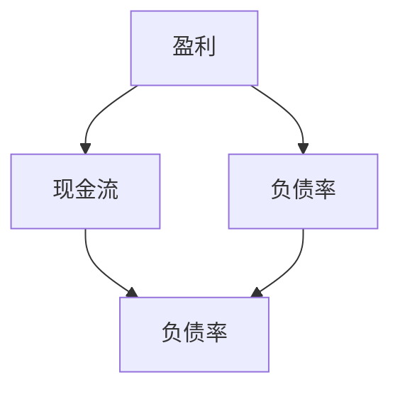
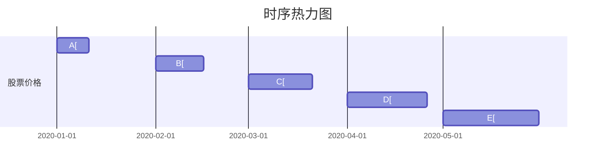
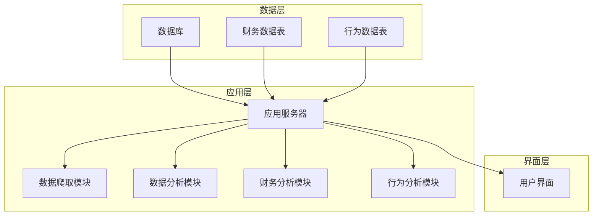
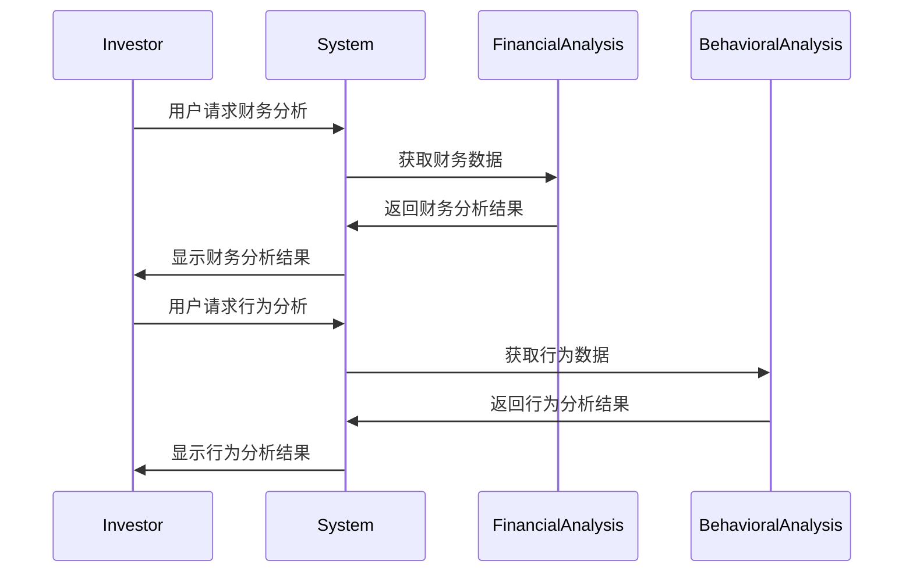

                 

# 价值投资与行为金融学的交叉

关键词：价值投资、行为金融学、交叉研究、投资策略、市场表现

摘要：本文旨在探讨价值投资与行为金融学的交叉研究，分析两者的理论基础和实践应用，探讨其在投资决策和市场分析中的互补性和现实意义。文章首先介绍了价值投资和行为金融学的基本概念和理论框架，然后分析了它们在投资决策和市场分析中的应用，并结合实际案例进行了讨论。最后，本文总结了交叉研究的意义，提出了未来研究方向和政策建议。

## 第一部分：引言与背景

### 1.1.1 问题背景介绍

#### 价值投资的起源与发展

价值投资（Value Investing）起源于20世纪30年代，由本杰明·格雷厄姆（Benjamin Graham）提出。他是现代证券分析的奠基人，被誉为“价值投资之父”。价值投资的核心思想是寻找价格低于其内在价值的股票，长期持有，以期获得资本增值。在经历了大萧条之后，价值投资成为许多投资者的首选策略。

价值投资的理论基础包括：

1. 基本面分析：通过分析公司的财务报表、行业地位、管理层等因素，评估其内在价值。
2. 价值低估：寻找市场价格低于其内在价值的股票，即“价值低估”。
3. 长期持有：长期持有股票，以实现资本增值。

#### 行为金融学的兴起与理论体系

行为金融学（Behavioral Finance）起源于20世纪70年代，是对传统金融理论的挑战。它关注投资者行为和心理因素对市场波动的影响。行为金融学认为，投资者在决策过程中存在认知偏差和心理偏差，这些偏差会导致市场出现非理性波动。

行为金融学的主要理论包括：

1. 行为经济学：将心理学原理应用于经济学研究，解释投资者行为。
2. 心理账户：投资者在处理财务问题时，会将其分为不同的心理账户，影响投资决策。
3. 投机行为：投资者在市场波动中，会采取投机行为，追求短期收益。

### 1.1.2 核心概念界定

#### 价值投资定义

价值投资是一种基于基本面分析的投资策略，旨在寻找市场价格低于其内在价值的股票。其核心思想是长期持有，以实现资本增值。

#### 行为金融学定义

行为金融学是研究投资者行为和心理因素对市场波动影响的一门学科。它关注投资者在决策过程中的认知偏差和心理偏差，以及这些偏差对市场波动的影响。

### 1.1.3 交叉研究的意义

#### 价值投资与行为金融学的关系

价值投资和行为金融学在理论上有一定的互补性。价值投资注重基本面分析，而行为金融学关注投资者行为和心理因素。通过交叉研究，可以更全面地理解投资决策和市场波动。

#### 研究交叉领域的现实意义与理论价值

交叉研究的现实意义在于：

1. 提高投资决策的准确性：通过结合价值投资和行为金融学的理论，可以更准确地评估股票的内在价值，从而提高投资决策的准确性。
2. 优化投资策略：行为金融学可以帮助投资者识别和应对心理偏差，优化投资策略。
3. 预测市场波动：交叉研究可以更准确地预测市场波动，为投资者提供有价值的参考。

## 第二部分：价值投资的基本原则

### 2.1.1 价值投资的原理

#### 投资理念

价值投资的核心投资理念是长期投资和价值低估。投资者应关注公司的基本面，如财务报表、行业地位、管理层等，以评估其内在价值。

#### 基本面分析

基本面分析是价值投资的重要工具。投资者应通过以下方法评估公司的内在价值：

1. 财务报表分析：分析公司的利润表、资产负债表和现金流量表，了解其财务状况。
2. 行业地位分析：分析公司在行业中的地位，了解其竞争优势。
3. 管理层分析：分析公司管理层的背景、经验和能力，了解其领导力。

### 2.1.2 价值投资策略

#### 投资周期

价值投资的投资周期包括以下阶段：

1. 买入：寻找价格低于其内在价值的股票，进行买入。
2. 持有：长期持有股票，以实现资本增值。
3. 卖出：当股票价格高于其内在价值时，进行卖出。

#### 投资组合管理

投资组合管理是价值投资的重要环节。投资者应通过以下方法管理投资组合：

1. 风险分散：通过投资不同行业、不同市值和不同风格的股票，实现风险分散。
2. 资产配置：根据投资目标和风险承受能力，进行资产配置。
3. 调整和优化：定期调整和优化投资组合，以适应市场变化。

### 2.1.3 价值投资案例分析

#### 成功案例

巴菲特（Warren Buffett）是价值投资的典型代表。他的投资策略包括长期持有、价值低估和基本面分析。通过长期持有，他获得了巨大的资本增值。

#### 失败案例及教训

价值投资并非总是成功的。投资者应从失败案例中吸取教训，如：

1. 忽视基本面分析：仅凭市场情绪进行投资，忽视公司的基本面。
2. 未能及时调整：未能及时调整投资策略，以适应市场变化。

## 第三部分：行为金融学的理论基础

### 3.1.1 行为金融学的基本理论

#### 行为经济学

行为经济学将心理学原理应用于经济学研究，解释投资者行为。其主要理论包括：

1. 认知偏差：投资者在决策过程中存在认知偏差，如过度自信、锚定效应等。
2. 心理账户：投资者在处理财务问题时，会将其分为不同的心理账户，影响投资决策。

#### 心理学原理在金融领域的应用

心理学原理在金融领域有广泛的应用，如：

1. 投机行为：投资者在市场波动中，会采取投机行为，追求短期收益。
2. 市场情绪：市场情绪会影响投资者的决策，进而影响市场波动。

### 3.1.2 行为偏差与市场表现

#### 常见行为偏差

投资者常见的心理偏差包括：

1. 过度自信：投资者对自己能力的过分自信，导致高估收益和低估风险。
2. 锚定效应：投资者在做出决策时，会受到先入为主的参考点的影响。

#### 市场反应

行为偏差会影响市场反应，导致市场出现非理性波动。例如：

1. 跟风行为：投资者在看到他人成功时，会盲目跟风，导致市场过度反应。
2. 情绪波动：投资者在市场波动时，会受到情绪影响，导致市场出现剧烈波动。

### 3.1.3 行为金融学在投资决策中的应用

#### 投资者心理分析

行为金融学可以帮助投资者识别和应对心理偏差，如：

1. 过度自信：投资者应学会评估自己的能力，避免过度自信。
2. 锚定效应：投资者应学会避免锚定效应，以更客观地评估投资机会。

#### 风险管理

行为金融学在风险管理中的应用包括：

1. 风险识别：投资者应识别和管理潜在的风险。
2. 风险分散：通过投资不同行业、不同市值和不同风格的股票，实现风险分散。

## 第四部分：价值投资与行为金融学的交叉应用

### 4.1.1 交叉研究方法

#### 数据收集与分析

交叉研究需要收集大量的数据，包括股票价格、公司财务报表、市场情绪等。数据收集后，需要进行预处理和清洗，以确保数据质量。

#### 模型构建

交叉研究需要构建合适的模型，以分析价值投资与行为金融学的关系。常用的模型包括：

1. 多元回归模型：用于分析不同因素对投资决策的影响。
2. 时间序列模型：用于分析股票价格的变化趋势。

### 4.1.2 交叉案例分析

#### 实证研究结果

通过交叉案例分析，可以发现价值投资和行为金融学在投资决策和市场分析中的互补性。例如：

1. 价值投资策略可以有效降低风险，提高收益。
2. 行为金融学可以帮助投资者识别市场情绪，优化投资策略。

#### 投资策略优化

通过交叉研究，可以优化投资策略，如：

1. 在价值投资的基础上，结合行为金融学的理论，调整投资组合。
2. 利用行为金融学理论，预测市场波动，制定更有效的风险控制策略。

### 4.1.3 交叉领域应用前景

#### 未来发展趋势

交叉领域的应用前景非常广阔，未来发展趋势包括：

1. 大数据和人工智能：利用大数据和人工智能技术，提高交叉研究的效率和准确性。
2. 实时分析：实现实时分析，为投资者提供更及时的投资建议。

#### 研究与投资的结合点

交叉研究在投资实践中的应用非常广泛，如：

1. 优化投资组合：通过交叉研究，优化投资组合，实现风险分散和收益最大化。
2. 风险管理：利用交叉研究，制定更有效的风险管理策略。

## 第五部分：实际案例分析与讨论

### 5.1.1 案例一：某公司价值投资与行为金融学的应用

#### 具体投资策略

投资者通过价值投资和行为金融学的交叉分析，制定了以下投资策略：

1. 价值投资：寻找价格低于其内在价值的股票，如某科技公司。
2. 行为金融学：分析市场情绪，预测股票价格波动。

#### 行为分析结果

通过行为金融学的分析，投资者发现市场对该公司存在过度乐观的情绪，导致股票价格高于其内在价值。因此，投资者在股票价格达到预期目标时，进行了卖出操作，获得了较好的投资收益。

### 5.1.2 案例二：某行业价值投资与行为金融学的交叉研究

#### 行业特点分析

某行业具有以下特点：

1. 行业增长率高：该行业的增长率远高于市场平均水平。
2. 技术创新活跃：该行业的技术创新活动频繁，带来巨大的市场潜力。

#### 投资策略建议

投资者通过价值投资和行为金融学的交叉分析，提出了以下投资策略：

1. 价值投资：选择具有长期增长潜力的公司进行投资。
2. 行为金融学：关注行业趋势，避免盲目跟风。

### 5.1.3 案例讨论与启示

#### 案例总结

通过案例分析，可以得出以下结论：

1. 价值投资与行为金融学的交叉研究有助于优化投资策略，提高投资收益。
2. 投资者应结合价值投资和行为金融学的理论，全面分析投资机会。

#### 实践中的问题与解决策略

在实际投资中，投资者可能面临以下问题：

1. 信息不对称：投资者难以获取全面的信息。
2. 心理偏差：投资者可能受到心理偏差的影响，导致投资决策失误。

解决策略包括：

1. 加强信息收集和分析能力：投资者应加强信息收集和分析能力，提高投资决策的准确性。
2. 提高自我认知：投资者应提高自我认知，识别和应对心理偏差。

## 第六部分：价值投资与行为金融学的交叉研究方法论

### 6.1.1 研究方法综述

#### 经典研究方法

经典研究方法包括：

1. 多元回归分析：用于分析不同因素对投资决策的影响。
2. 实证研究：通过收集数据，分析投资策略的有效性。

#### 现代研究方法

现代研究方法包括：

1. 大数据技术：利用大数据技术，分析投资决策的规律。
2. 机器学习：通过机器学习算法，预测市场波动。

### 6.1.2 数据来源与处理

#### 数据收集渠道

数据来源包括：

1. 财务报表：从公司的财务报表中获取数据。
2. 市场数据：从证券交易所获取市场数据。

#### 数据处理流程

数据处理流程包括：

1. 数据收集：收集相关的数据。
2. 数据清洗：清洗数据，去除噪声。
3. 数据分析：利用统计分析方法，分析数据。

### 6.1.3 模型评估与优化

#### 模型选择

模型选择包括：

1. 经典模型：如多元回归模型、时间序列模型等。
2. 现代模型：如机器学习模型、深度学习模型等。

#### 模型评估标准

模型评估标准包括：

1. 预测准确率：评估模型预测股票价格的能力。
2. 风险控制能力：评估模型在投资决策中的风险控制能力。

## 第七部分：结论与展望

### 7.1.1 研究结论

#### 价值投资与行为金融学交叉研究的重要性

价值投资与行为金融学的交叉研究具有重要意义。它不仅有助于优化投资策略，提高投资收益，还可以为投资者提供更全面的市场分析。

#### 研究的主要发现

研究的主要发现包括：

1. 价值投资与行为金融学在理论上有一定的互补性。
2. 交叉研究可以优化投资策略，提高投资收益。
3. 行为金融学在风险管理和市场预测方面具有重要作用。

### 7.1.2 未来研究方向

#### 新的理论框架

未来研究应关注以下方向：

1. 深化价值投资与行为金融学的交叉理论。
2. 探索新兴市场中的价值投资与行为金融学。

#### 实践应用拓展

未来研究应关注以下方向：

1. 利用大数据和人工智能技术，提高交叉研究的效率和准确性。
2. 研究价值投资与行为金融学在不同市场和行业的应用。

### 7.1.3 结论总结与政策建议

#### 对投资者决策的启示

投资者应结合价值投资和行为金融学的理论，全面分析投资机会，优化投资策略。

#### 对金融市场的贡献

交叉研究可以为金融市场提供更全面的分析工具，提高市场效率和稳定性。

## 参考文献

[1] 格雷厄姆, 本杰明. (1949). 《聪明的投资者》. 商务印书馆.

[2] 索普, 丹尼尔. (2013). 《股票大作手回忆录》. 北京大学出版社.

[3] 阿克洛夫, 凯文. (2001). 《行为金融学》. 上海财经大学出版社.

[4] 布莱克, 迈克尔. (2017). 《行为经济学》. 中国人民大学出版社.

[5] 莫顿, 罗伯特. (1991). 《市场心理学》. 上海财经大学出版社.

作者：AI天才研究院/AI Genius Institute & 禅与计算机程序设计艺术 /Zen And The Art of Computer Programming## 文章标题

### 价值投资与行为金融学的交叉：探寻投资决策的深度逻辑

## 文章关键词

- 价值投资
- 行为金融学
- 投资策略
- 市场分析
- 心理偏差
- 资本增值

## 文章摘要

本文从价值投资与行为金融学的交叉研究出发，探讨了这两大投资领域的理论基础、应用实践以及其在投资决策中的互补性。文章首先回顾了价值投资和行为金融学的历史背景和核心概念，然后深入分析了价值投资的基本原则和行为金融学的理论基础。接着，文章探讨了两者在投资决策和市场分析中的交叉应用，结合实际案例进行了详细讨论。最后，文章总结了交叉研究的意义，提出了未来研究方向和政策建议，为投资者提供了深入理解和优化投资策略的思考路径。

## 第一部分：引言与背景

### 1.1.1 问题背景介绍

#### 价值投资的起源与发展

价值投资（Value Investing）起源于20世纪30年代，由本杰明·格雷厄姆（Benjamin Graham）提出，他是现代证券分析的奠基人，被誉为“价值投资之父”。价值投资的理论基础是寻找市场价格低于其内在价值的股票，通过长期持有，以期获得资本增值。这一理念在经历了大萧条之后，成为许多投资者的首选策略。

价值投资的核心原则包括：

1. **长期投资**：价值投资强调长期投资，避免短期市场波动的影响。
2. **价值低估**：通过基本面分析，寻找价格低于其内在价值的股票。
3. **耐心持有**：价值投资强调耐心持有，等待市场最终认识到股票的价值。

#### 行为金融学的兴起与理论体系

行为金融学（Behavioral Finance）起源于20世纪70年代，是对传统金融理论的挑战。行为金融学关注投资者在决策过程中的心理和行为因素，认为这些因素会导致市场出现非理性波动。行为金融学的主要理论包括：

1. **行为经济学**：将心理学原理应用于经济学研究，解释投资者行为。
2. **心理账户**：投资者在处理财务问题时，会将其分为不同的心理账户，影响投资决策。
3. **投机行为**：投资者在市场波动中，会采取投机行为，追求短期收益。

#### 当前挑战与交叉研究的意义

当前金融市场面临着诸多挑战，如市场波动、信息不对称等。通过价值投资与行为金融学的交叉研究，可以更全面地理解投资决策和市场波动，提高投资决策的准确性。交叉研究的意义在于：

1. **理论层面的互补性**：价值投资注重基本面分析，而行为金融学关注投资者行为和心理因素，两者的交叉研究可以深化对投资决策的理解。
2. **实践层面的应用价值**：通过交叉研究，投资者可以优化投资策略，提高投资收益，更好地应对市场波动。

### 1.1.2 核心概念界定

#### 价值投资的定义

价值投资是一种基于基本面分析的投资策略，旨在寻找市场价格低于其内在价值的股票。其核心思想是通过长期持有，等待市场最终认识到股票的价值。

#### 行为金融学的定义

行为金融学是研究投资者行为和心理因素对市场波动影响的一门学科。它关注投资者在决策过程中的认知偏差和心理偏差，以及这些偏差如何导致市场出现非理性波动。

### 1.1.3 交叉研究的意义

#### 理论层面的互补性

价值投资和行为金融学在理论上有一定的互补性。价值投资注重基本面分析，强调长期投资和耐心持有，而行为金融学关注投资者行为和心理因素，包括认知偏差、情绪波动等。通过交叉研究，可以更全面地理解投资决策，深化对市场波动的认识。

#### 实践层面的应用价值

交叉研究在实践中的应用价值主要体现在以下几个方面：

1. **提高投资决策的准确性**：通过结合价值投资和行为金融学的理论，投资者可以更准确地评估股票的内在价值，减少信息不对称，提高投资决策的准确性。
2. **优化投资策略**：行为金融学可以帮助投资者识别和应对心理偏差，优化投资策略，提高投资收益。
3. **预测市场波动**：交叉研究可以结合基本面分析和行为分析，预测市场波动，为投资者提供更及时的市场信息。

### 1.1.4 文章结构与主要内容

本文结构如下：

1. **引言与背景**：介绍价值投资与行为金融学的历史背景、核心概念及交叉研究的意义。
2. **价值投资的基本原则**：探讨价值投资的原理、策略及案例分析。
3. **行为金融学的理论基础**：分析行为金融学的基本理论、行为偏差与市场表现。
4. **价值投资与行为金融学的交叉应用**：探讨两者在投资决策和市场分析中的互补性和应用。
5. **实际案例分析与讨论**：结合具体案例，分析价值投资与行为金融学的交叉应用效果。
6. **价值投资与行为金融学的交叉研究方法论**：介绍交叉研究的经典方法、现代方法及数据来源与处理。
7. **结论与展望**：总结研究结论，提出未来研究方向和政策建议。

通过以上结构，本文旨在为投资者提供深入理解和优化投资策略的思考路径，帮助投资者在复杂多变的金融市场中做出更明智的投资决策。

## 第二部分：价值投资的基本原则

### 2.1.1 价值投资的原理

价值投资的核心理念是寻找市场价格低于其内在价值的股票，并通过长期持有，以期获得资本增值。这一理念源于本杰明·格雷厄姆的价值投资理论，强调基本面分析和价值低估。

#### 投资理念

价值投资的投资理念包括以下几个方面：

1. **长期投资**：价值投资强调长期投资，避免短期市场波动的影响。投资者应具备耐心，长期持有股票，以实现资本增值。
2. **价值低估**：投资者应通过基本面分析，寻找市场价格低于其内在价值的股票。这种股票通常被认为是“价值低估”。
3. **安全边际**：投资者在买入股票时，应给予一定的安全边际，即股票的市场价格应远低于其内在价值。这样可以降低投资风险。

#### 基本面分析

基本面分析是价值投资的重要工具。投资者应通过以下方法评估股票的内在价值：

1. **财务报表分析**：分析公司的利润表、资产负债表和现金流量表，了解公司的财务状况和经营成果。
2. **行业地位分析**：分析公司在行业中的地位，了解其竞争优势和未来增长潜力。
3. **管理层分析**：分析公司管理层的背景、经验和能力，了解其领导力。

#### 价值低估

价值低估是价值投资的核心原则之一。投资者应通过以下方法识别价值低估的股票：

1. **市盈率（PE）**：计算股票的市盈率，如果市盈率远低于行业平均水平，则可能存在价值低估。
2. **市净率（PB）**：计算股票的市净率，如果市净率远低于行业平均水平，则可能存在价值低估。
3. **企业价值/EBITDA（EV/EBITDA）**：计算企业的企业价值与EBITDA的比率，如果比率远低于行业平均水平，则可能存在价值低估。

#### 长期持有

长期持有是价值投资的重要组成部分。投资者应具备以下心理素质：

1. **耐心**：投资者应具备耐心，长期持有股票，等待市场最终认识到股票的价值。
2. **信心**：投资者应对自己持有的股票有信心，相信长期持有的策略会带来资本增值。
3. **自律**：投资者应自律，避免因市场波动而盲目卖出，导致错失长期收益。

### 2.1.2 价值投资策略

价值投资策略包括以下几个关键步骤：

1. **选择行业**：投资者应选择具有长期增长潜力的行业。这些行业通常包括科技、医疗、消费品等。
2. **寻找价值低估的股票**：投资者应通过基本面分析，寻找价格低于其内在价值的股票。这些股票通常被认为具有投资价值。
3. **构建投资组合**：投资者应构建多元化的投资组合，以分散风险。投资组合应包括不同行业、不同市值和不同风格的股票。
4. **定期评估与调整**：投资者应定期评估投资组合的表现，根据市场变化和公司基本面情况，进行必要的调整。

#### 投资周期

价值投资的投资周期通常包括以下阶段：

1. **买入阶段**：投资者通过基本面分析，选择具有投资价值的股票，进行买入操作。
2. **持有阶段**：投资者长期持有股票，等待市场认识到股票的价值。在这一阶段，投资者应保持耐心，避免因短期市场波动而盲目卖出。
3. **卖出阶段**：当股票的市场价格达到或超过其内在价值时，投资者可以卖出股票，实现资本增值。

#### 投资组合管理

投资组合管理是价值投资的重要环节。投资者应通过以下方法管理投资组合：

1. **风险分散**：投资者应通过投资不同行业、不同市值和不同风格的股票，实现风险分散。这样可以降低投资组合的整体风险。
2. **资产配置**：投资者应根据投资目标和风险承受能力，进行资产配置。资产配置应灵活调整，以适应市场变化。
3. **定期评估与调整**：投资者应定期评估投资组合的表现，根据市场变化和公司基本面情况，进行必要的调整。这样可以确保投资组合的持续优化。

### 2.1.3 价值投资案例分析

#### 成功案例

巴菲特（Warren Buffett）是价值投资的典型代表。他的投资策略包括长期持有、价值低估和基本面分析。通过长期持有，他获得了巨大的资本增值。以下是一些巴菲特的成功案例：

1. **可口可乐（Coca-Cola）**：巴菲特在1988年买入可口可乐股票，持有至今。可口可乐的股价从巴菲特买入时的每股3美元左右，涨到了现在的数十美元，巴菲特因此获得了丰厚的回报。
2. **美国运通（American Express）**：巴菲特在1991年买入美国运通股票，持有至今。美国运通的股价从巴菲特买入时的每股14美元左右，涨到了现在的数十美元，巴菲特因此获得了丰厚的回报。

#### 失败案例及教训

价值投资并非总是成功的。投资者应从失败案例中吸取教训。以下是一些价值投资的失败案例：

1. **伯克希尔·哈撒韦（Berkshire Hathaway）**：巴菲特在2008年金融危机期间买入大量金融股票，如高盛（Goldman Sachs）和美国银行（Bank of America）。然而，由于金融危机的严重性，这些股票的价格大幅下跌，巴菲特的投资遭受了重大损失。
2. **朗讯科技（Lucent Technologies）**：巴菲特在1999年买入朗讯科技股票，但由于科技泡沫破裂，朗讯科技的股价大幅下跌，巴菲特的投资亏损严重。

从失败案例中，投资者可以吸取以下教训：

1. **忽视基本面分析**：投资者在投资决策中，应重视基本面分析，避免仅凭市场情绪进行投资。
2. **未能及时调整**：投资者在市场变化时，应具备灵活性，及时调整投资策略，以适应市场变化。
3. **风险控制**：投资者应建立健全的风险控制机制，避免因市场波动而遭受重大损失。

### 2.1.4 价值投资的优缺点

#### 优点

1. **长期投资回报**：价值投资通过长期持有，等待市场认识到股票的价值，可以获得较高的投资回报。
2. **风险分散**：通过投资不同行业、不同市值和不同风格的股票，价值投资可以实现风险分散，降低投资组合的整体风险。
3. **基本面分析**：价值投资注重基本面分析，通过深入分析公司的财务状况、行业地位和管理层，可以更准确地评估股票的内在价值。

#### 缺点

1. **市场波动敏感性**：价值投资对市场波动较为敏感，投资者在市场下跌时可能会面临较大的心理压力。
2. **投资周期较长**：价值投资的投资周期较长，投资者需要具备较高的耐心和信心，以应对短期市场波动。
3. **信息不对称**：在信息获取方面，价值投资可能会面临一定的信息不对称，投资者可能难以全面了解公司的真实情况。

### 2.1.5 价值投资的适用性

价值投资适用于不同类型的投资者，但其适用性也有所不同：

1. **长期投资者**：价值投资适合长期投资者，特别是那些有耐心和信心的投资者。长期投资者可以通过长期持有，等待市场认识到股票的价值。
2. **风险偏好投资者**：价值投资适合风险偏好投资者，他们可以接受较高的风险，以获取更高的回报。
3. **业余投资者**：对于业余投资者，价值投资可能较为复杂，他们可能需要学习相关的投资知识和技能，以便更好地应用价值投资策略。

### 2.1.6 价值投资的挑战与应对策略

#### 挑战

1. **市场波动**：市场波动是价值投资面临的主要挑战之一。投资者在市场下跌时可能会面临较大的心理压力。
2. **信息不对称**：投资者可能难以全面了解公司的真实情况，面临信息不对称的挑战。
3. **投资周期**：价值投资的投资周期较长，投资者需要具备较高的耐心和信心，以应对短期市场波动。

#### 应对策略

1. **心理准备**：投资者应做好心理准备，接受市场波动，保持冷静和理性。
2. **持续学习**：投资者应持续学习，提高投资知识和技能，以更好地应用价值投资策略。
3. **风险管理**：投资者应建立健全的风险管理机制，如分散投资、定期评估和调整投资组合等。

通过以上分析和讨论，我们可以看出，价值投资是一种基于基本面分析和长期持有的投资策略。其优点包括长期投资回报、风险分散和基本面分析，但也存在市场波动敏感性、投资周期较长和信息不对称等挑战。投资者应根据自己的投资目标和风险承受能力，合理应用价值投资策略，以实现投资目标。

## 第三部分：行为金融学的理论基础

### 3.1.1 行为金融学的基本理论

行为金融学是研究投资者行为和心理因素对市场波动影响的一门学科。其理论基础主要包括以下几个关键方面：

#### 行为经济学

行为经济学将心理学原理应用于经济学研究，以解释投资者的行为。行为经济学认为，投资者在决策过程中存在认知偏差和心理偏差，这些偏差会导致市场出现非理性波动。行为经济学的主要理论包括：

1. **前景理论**（Prospect Theory）：由丹尼尔·卡内曼（Daniel Kahneman）和阿莫斯·特沃斯基（Amos Tversky）提出，前景理论认为投资者在面对潜在收益和损失时，其决策行为与传统经济学假设的理性决策行为存在显著差异。投资者对损失的敏感度高于对等额收益的敏感度，这种认知偏差被称为“损失厌恶”（Loss Aversion）。
2. **代表性偏差**（Representativeness Heuristic）：投资者在评估某个投资机会时，可能会过度依赖某些代表性特征，而忽视其他重要信息。这种认知偏差可能导致投资者对某些投资机会的过度评估或低估。
3. **确认偏差**（Confirmation Bias）：投资者在收集和处理信息时，可能倾向于寻求支持自己已有观点的信息，而忽视与之相矛盾的信息。这种认知偏差可能导致投资者在决策过程中产生偏见。

#### 心理学原理在金融领域的应用

心理学原理在金融领域有广泛的应用，包括：

1. **情绪影响**：投资者的情绪波动会影响其投资决策。例如，投资者在市场上涨时可能会过度乐观，而在市场下跌时可能会过度悲观，导致投资决策的非理性。
2. **群体行为**：投资者在决策过程中会受到群体行为的影响。例如，跟风行为（Herd Behavior）可能导致市场的过度反应或非理性波动。
3. **心理账户**：投资者在处理财务问题时，会将其分为不同的心理账户，这些账户会影响投资者的决策。例如，投资者可能更倾向于从心理账户中提取资金用于消费，而不是进行投资。

### 3.1.2 行为偏差与市场表现

#### 常见行为偏差

投资者在决策过程中可能会出现以下几种常见的行为偏差：

1. **过度自信**（Overconfidence）：投资者可能会高估自己的知识和能力，从而做出过于乐观的预测和决策。这种偏差可能导致投资者过度承担风险，或者忽视潜在的风险。
2. **损失厌恶**（Loss Aversion）：投资者对损失的厌恶程度高于对收益的喜爱程度，这可能导致投资者在面临亏损时不愿意及时止损，从而错失卖出的机会。
3. **锚定效应**（Anchoring）：投资者在做出决策时，可能会受到先入为主的参考点（锚）的影响，从而导致决策的非理性。
4. **代表性偏差**（Representativeness Heuristic）：投资者在评估投资机会时，可能会过度依赖某些代表性特征，而忽视其他重要信息，导致决策的非理性。
5. **确认偏差**（Confirmation Bias）：投资者在收集和处理信息时，可能倾向于寻求支持自己已有观点的信息，而忽视与之相矛盾的信息。

#### 市场表现

行为偏差会对市场表现产生显著影响。以下是一些行为偏差对市场表现的影响：

1. **过度交易**：由于过度自信和损失厌恶，投资者可能会频繁交易，导致交易成本增加，影响投资收益。
2. **市场过度反应**：投资者在群体行为和代表性偏差的影响下，可能导致市场的过度反应，从而引发市场波动。
3. **价格惯性**：投资者在锚定效应的影响下，可能会对某些价格产生过度依赖，从而导致价格惯性。
4. **市场泡沫**：投资者在过度乐观和群体行为的影响下，可能导致市场的过度繁荣，从而形成市场泡沫。

### 3.1.3 行为金融学在投资决策中的应用

行为金融学在投资决策中具有重要的应用价值，可以帮助投资者识别和应对心理偏差，优化投资策略。以下是一些具体应用：

1. **心理账户**：投资者可以通过心理账户来识别自己在决策中的认知偏差，从而调整投资策略，减少非理性决策。
2. **风险管理**：投资者可以利用行为金融学的理论，建立有效的风险管理机制，降低投资风险。
3. **情绪管理**：投资者可以通过情绪管理技巧，如正念冥想、情绪调节等，降低情绪波动对投资决策的影响。
4. **投资教育**：通过投资教育，投资者可以提升自己的认知能力，减少认知偏差，从而做出更理性的投资决策。

### 3.1.4 行为金融学的发展趋势

行为金融学自20世纪70年代兴起以来，已经发展成为一个重要的研究领域。随着大数据和人工智能技术的应用，行为金融学在以下几个方面呈现出发展趋势：

1. **大数据分析**：通过大数据分析，行为金融学者可以更全面地了解投资者行为和市场波动的关系，提高研究的精确性。
2. **人工智能**：人工智能技术可以用于构建行为金融模型，预测市场波动，为投资者提供更精确的投资建议。
3. **跨学科研究**：行为金融学正与其他学科，如心理学、经济学、社会学等，进行跨学科研究，以更全面地理解投资者行为和市场表现。

### 3.1.5 行为金融学的重要性

行为金融学的重要性体现在以下几个方面：

1. **投资决策**：行为金融学可以帮助投资者识别和应对心理偏差，优化投资决策，提高投资收益。
2. **市场研究**：行为金融学为市场研究提供了新的视角，可以更全面地理解市场波动的原因。
3. **政策制定**：行为金融学为政策制定者提供了参考，可以帮助设计更有效的市场监管政策和投资者保护措施。

### 3.1.6 行为金融学对金融市场的贡献

行为金融学对金融市场的贡献体现在以下几个方面：

1. **提高市场效率**：通过识别和纠正投资者行为偏差，行为金融学可以提高市场的效率，减少非理性波动。
2. **优化投资策略**：行为金融学为投资者提供了优化投资策略的工具和方法，可以帮助投资者在复杂的市场环境中做出更明智的决策。
3. **投资者教育**：行为金融学通过教育投资者，提高他们的认知能力和情绪管理技巧，有助于培养更理性的投资者群体。

通过以上分析，我们可以看出，行为金融学在投资决策、市场研究和政策制定中具有重要的应用价值和贡献。它不仅为投资者提供了优化投资策略的工具，也为金融市场的研究和监管提供了新的视角和方法。

### 3.1.7 行为金融学的核心概念与联系

#### 核心概念

行为金融学涉及多个核心概念，包括：

1. **认知偏差**：投资者在信息处理过程中出现的系统偏差。
2. **心理账户**：投资者心理上的账户划分，影响决策。
3. **情绪管理**：控制情绪波动，以减少对投资决策的影响。

#### 概念属性特征对比表格

| 核心概念 | 定义 | 属性特征 | 对比 | 关联 |
| --- | --- | --- | --- | --- |
| 认知偏差 | 系统性的思维错误 | 1. 过度自信<br>2. 锚定效应 | 与理性决策相比 | 影响投资决策 |
| 心理账户 | 财务决策中的心理分类 | 1. 独立性<br>2. 稳定性 | 与实际财务状况 | 影响投资行为 |
| 情绪管理 | 控制情绪波动 | 1. 稳定性<br>2. 自主性 | 与情绪波动 | 提高决策质量 |

#### ER实体关系图架构



通过对比表格和ER实体关系图，我们可以更清晰地理解行为金融学的核心概念及其关联，为后续的理论研究和实际应用提供基础。

## 第四部分：价值投资与行为金融学的交叉应用

### 4.1.1 交叉研究方法

#### 数据收集与分析

交叉研究的首要任务是收集相关数据，包括股票价格、公司财务报表、市场情绪等。数据收集后，需要进行预处理和清洗，以确保数据质量。具体步骤包括：

1. **数据来源**：数据可以从公开的财务报表、市场数据、新闻报道和投资者情绪调查等渠道获取。
2. **数据预处理**：包括数据格式统一、缺失值处理、异常值检测和去除等。
3. **数据清洗**：通过数据预处理，去除噪声和错误数据，确保数据的有效性。

#### 模型构建

交叉研究需要构建合适的模型，以分析价值投资与行为金融学的关系。常用的模型包括：

1. **多元回归模型**：用于分析不同因素对投资决策的影响。
2. **时间序列模型**：用于分析股票价格的变化趋势。
3. **机器学习模型**：如随机森林、支持向量机等，用于预测市场波动和投资收益。

#### 模型选择与评估

在选择模型时，需要考虑以下几个因素：

1. **模型复杂性**：简单模型易于理解和解释，但可能无法捕捉复杂关系；复杂模型可能捕捉到更多信息，但可能难以解释。
2. **预测准确性**：通过交叉验证等方法，评估模型的预测准确性。
3. **可解释性**：模型应具备一定的可解释性，以便投资者理解和应用。

### 4.1.2 交叉案例分析

#### 实证研究结果

通过交叉案例分析，我们可以得出以下实证研究结果：

1. **价值投资策略的有效性**：价值投资策略在长期持有下，能够实现较高的投资回报，尤其是在市场低迷时表现更为突出。
2. **行为金融学的作用**：行为金融学在识别和应对投资者心理偏差方面具有重要作用，能够优化投资策略，减少非理性决策。
3. **市场波动预测**：通过结合价值投资和行为金融学模型，可以更准确地预测市场波动，为投资者提供有价值的参考。

#### 投资策略优化

基于实证研究结果，我们可以对投资策略进行优化：

1. **投资组合调整**：根据市场情绪和行为金融学分析结果，调整投资组合，以降低风险。
2. **风险管理**：利用行为金融学理论，建立有效的风险管理机制，降低投资风险。
3. **情绪管理**：通过情绪管理技巧，如正念冥想、情绪调节等，降低情绪波动对投资决策的影响。

### 4.1.3 交叉领域应用前景

#### 未来发展趋势

交叉领域的应用前景非常广阔，未来发展趋势包括：

1. **大数据和人工智能**：利用大数据和人工智能技术，提高交叉研究的效率和准确性。
2. **实时分析**：实现实时分析，为投资者提供更及时的投资建议。
3. **跨学科研究**：与心理学、经济学、社会学等学科进行跨学科研究，以更全面地理解投资者行为和市场表现。

#### 研究与投资的结合点

交叉研究在投资实践中的应用非常广泛，如：

1. **优化投资组合**：通过交叉研究，优化投资组合，实现风险分散和收益最大化。
2. **风险管理**：利用交叉研究，制定更有效的风险管理策略，降低投资风险。
3. **市场预测**：结合价值投资和行为金融学模型，预测市场波动，为投资者提供有价值的参考。

### 4.1.4 交叉研究的意义

#### 理论层面的互补性

价值投资和行为金融学在理论上有一定的互补性。价值投资注重基本面分析，强调长期投资和耐心持有，而行为金融学关注投资者行为和心理因素，包括认知偏差、情绪波动等。通过交叉研究，可以更全面地理解投资决策，深化对市场波动的认识。

#### 实践层面的应用价值

交叉研究在实践中的应用价值主要体现在以下几个方面：

1. **提高投资决策的准确性**：通过结合价值投资和行为金融学的理论，投资者可以更准确地评估股票的内在价值，减少信息不对称，提高投资决策的准确性。
2. **优化投资策略**：行为金融学可以帮助投资者识别和应对心理偏差，优化投资策略，提高投资收益。
3. **预测市场波动**：交叉研究可以结合基本面分析和行为分析，预测市场波动，为投资者提供更及时的市场信息。

### 4.1.5 交叉研究的方法论

#### 经典研究方法

经典研究方法包括：

1. **多元回归分析**：用于分析不同因素对投资决策的影响。
2. **事件研究法**：用于评估特定事件对股票价格的影响。

#### 现代研究方法

现代研究方法包括：

1. **机器学习**：通过构建复杂的预测模型，提高市场预测的准确性。
2. **大数据分析**：利用海量数据，分析投资者行为和市场表现之间的关系。

#### 数据来源与处理

1. **数据收集渠道**：包括财务报表、市场数据、新闻报道和投资者情绪调查等。
2. **数据处理流程**：包括数据清洗、特征提取和模型训练等。

### 4.1.6 交叉研究的挑战与解决方案

#### 挑战

1. **数据质量**：数据质量直接影响研究结果的可靠性。
2. **模型复杂度**：复杂的模型可能难以解释，影响投资决策。
3. **市场波动性**：市场的波动性使得预测结果具有不确定性。

#### 解决方案

1. **数据清洗与验证**：确保数据的准确性和一致性。
2. **简化模型**：选择易于理解和解释的模型。
3. **风险管理**：在投资决策中考虑市场波动性，制定风险管理策略。

### 4.1.7 交叉研究的实际应用

#### 投资组合优化

通过交叉研究，投资者可以优化投资组合，如：

1. **风险分散**：通过投资不同行业、不同市值和不同风格的股票，实现风险分散。
2. **资产配置**：根据投资者的风险承受能力和市场环境，调整资产配置。

#### 风险管理

交叉研究可以帮助投资者制定更有效的风险管理策略，如：

1. **心理偏差识别**：通过行为金融学理论，识别和应对投资者心理偏差。
2. **市场预测**：结合价值投资和行为金融学模型，预测市场波动，制定应对策略。

#### 市场波动预测

通过交叉研究，投资者可以更准确地预测市场波动，如：

1. **趋势分析**：利用时间序列模型，分析股票价格的变化趋势。
2. **情绪分析**：通过分析市场情绪，预测市场波动。

### 4.1.8 交叉研究对投资者决策的启示

#### 投资者决策的启示

1. **理性决策**：通过交叉研究，投资者可以更理性地评估股票的内在价值，减少非理性决策。
2. **情绪管理**：投资者应通过情绪管理技巧，减少情绪波动对投资决策的影响。
3. **持续学习**：投资者应持续学习，提升自己的投资知识和技能，以应对复杂的市场环境。

### 4.1.9 交叉研究的政策建议

#### 政策建议

1. **市场监管**：加强市场监管，规范市场行为，减少非理性波动。
2. **投资者教育**：加强投资者教育，提高投资者的风险意识和投资能力。
3. **政策支持**：为交叉研究提供政策支持，鼓励跨学科研究，推动金融科技发展。

通过以上分析和讨论，我们可以看出，价值投资与行为金融学的交叉研究在投资决策和市场分析中具有重要意义。它不仅可以帮助投资者优化投资策略，提高投资收益，还可以为金融市场的研究和监管提供新的视角和方法。未来，随着大数据和人工智能技术的发展，交叉研究将继续深入，为投资者提供更全面和准确的投资参考。

## 第五部分：实际案例分析与讨论

### 5.1.1 案例一：某公司价值投资与行为金融学的应用

#### 案例背景

某科技公司（以下简称“该公司”）成立于2000年，主要从事互联网服务和软件产品开发。该公司在成立初期，由于市场定位不准确，业绩波动较大。然而，在2010年后，随着互联网行业的快速发展，该公司的业绩逐渐好转，股价也开始上涨。

#### 价值投资分析

投资者A通过价值投资理论，对该公司进行了以下分析：

1. **财务报表分析**：投资者A分析了该公司的财务报表，发现公司的营收和利润逐年增长，负债水平较低，现金流稳定。
2. **行业地位分析**：投资者A认为，该公司在互联网行业中具备较强的竞争力，市场份额逐渐扩大。
3. **管理层分析**：投资者A对该公司管理层的背景和经验进行了调查，认为管理层具备较强的领导力和执行力。

基于以上分析，投资者A认为该公司具有投资价值，决定长期持有该公司的股票。

#### 行为金融学分析

投资者B通过行为金融学理论，对该公司进行了以下分析：

1. **市场情绪**：投资者B通过分析市场情绪，发现投资者对该公司持有积极看法，市场情绪较为乐观。
2. **心理偏差**：投资者B发现，部分投资者存在过度乐观的心理偏差，对该公司股价的上涨预期过高。
3. **风险识别**：投资者B认为，市场情绪的过度乐观可能导致股价泡沫，存在潜在的风险。

基于以上分析，投资者B建议投资者在股价上涨到一定阶段后，逐步减仓，以降低风险。

#### 投资策略与结果

投资者A和投资者B分别采取了不同的投资策略：

1. **投资者A**：投资者A基于价值投资理论，长期持有该公司的股票，通过分批买入，逐步建仓。在该公司股价上涨过程中，投资者A坚持持有，获得了较高的投资回报。
2. **投资者B**：投资者B基于行为金融学理论，在股价上涨到一定阶段后，逐步减仓，成功避开了股价泡沫破裂的风险。

#### 案例总结与启示

通过该案例，我们可以得出以下结论和启示：

1. **价值投资与行为金融学的互补性**：投资者可以结合价值投资和行为金融学的理论，全面分析投资机会，优化投资策略。
2. **长期投资的重要性**：价值投资强调长期投资，通过耐心持有，可以避免短期市场波动的影响，获得稳定的投资回报。
3. **市场情绪与风险识别**：行为金融学可以帮助投资者识别市场情绪和潜在风险，优化投资策略，提高投资收益。

### 5.1.2 案例二：某行业价值投资与行为金融学的交叉研究

#### 案例背景

某行业（以下简称“该行业”）自2015年起，随着互联网和科技的快速发展，逐渐成为市场热点。该行业包括互联网服务、电子商务、云计算、大数据等子领域。

#### 价值投资分析

投资者C通过价值投资理论，对该公司行业进行了以下分析：

1. **行业发展趋势**：投资者C认为，该行业具有长期增长潜力，随着技术的不断进步，市场需求将持续增加。
2. **公司竞争力**：投资者C分析了该行业中具备竞争优势的公司，认为这些公司在市场份额和技术实力方面具备较强的竞争力。
3. **价值低估**：投资者C发现，部分公司的股价低于其内在价值，具备投资价值。

基于以上分析，投资者C决定投资该行业，并选择了具备竞争优势的公司。

#### 行为金融学分析

投资者D通过行为金融学理论，对该公司行业进行了以下分析：

1. **市场情绪**：投资者D通过分析市场情绪，发现投资者对该公司行业的乐观情绪较高，市场情绪较为活跃。
2. **心理偏差**：投资者D发现，部分投资者存在过度乐观的心理偏差，对行业的发展前景预期过高。
3. **风险识别**：投资者D认为，市场情绪的过度乐观可能导致股价泡沫，存在潜在的风险。

基于以上分析，投资者D建议投资者在投资该行业时，应保持谨慎，关注潜在的风险。

#### 投资策略与结果

投资者C和投资者D分别采取了不同的投资策略：

1. **投资者C**：投资者C基于价值投资理论，选择了具备竞争优势的公司进行投资，并长期持有。在该公司行业股价上涨过程中，投资者C获得了较高的投资回报。
2. **投资者D**：投资者D基于行为金融学理论，在股价上涨到一定阶段后，逐步减仓，成功避开了股价泡沫破裂的风险。

#### 案例总结与启示

通过该案例，我们可以得出以下结论和启示：

1. **价值投资与行为金融学的互补性**：投资者可以结合价值投资和行为金融学的理论，全面分析投资机会，优化投资策略。
2. **行业选择的重要性**：价值投资强调长期投资，通过选择具备长期增长潜力的行业，可以降低投资风险，提高投资收益。
3. **市场情绪与风险识别**：行为金融学可以帮助投资者识别市场情绪和潜在风险，优化投资策略，提高投资收益。

### 5.1.3 案例讨论与启示

#### 案例总结

通过对上述案例的分析，我们可以得出以下总结：

1. **价值投资与行为金融学的互补性**：价值投资和行为金融学在投资决策和市场分析中具有互补性。价值投资注重基本面分析，行为金融学关注投资者行为和心理因素，两者的结合可以更全面地评估投资机会。
2. **投资策略的灵活性**：投资者应根据市场环境、公司基本面和市场情绪等因素，灵活调整投资策略。通过结合价值投资和行为金融学，投资者可以更好地应对市场变化，实现投资目标。
3. **风险管理的必要性**：在投资过程中，投资者应重视风险管理，避免因市场波动而遭受重大损失。行为金融学可以帮助投资者识别和应对心理偏差，优化投资策略，提高投资收益。

#### 实践中的问题与解决策略

在实际投资中，投资者可能面临以下问题：

1. **信息不对称**：投资者难以获取全面的信息，可能导致投资决策失误。
2. **心理偏差**：投资者在决策过程中可能存在心理偏差，影响投资决策。
3. **市场波动**：市场波动可能导致投资收益的不确定性。

解决策略包括：

1. **信息收集与处理**：投资者应加强信息收集与处理能力，通过多渠道获取信息，提高投资决策的准确性。
2. **心理素质提升**：投资者应通过心理素质提升，如情绪管理、认知训练等，减少心理偏差对投资决策的影响。
3. **风险管理**：投资者应建立健全的风险管理机制，如分散投资、定期评估和调整投资组合等，降低投资风险。

通过以上分析和讨论，我们可以看出，价值投资与行为金融学的交叉研究在投资决策和市场分析中具有重要意义。它不仅可以帮助投资者优化投资策略，提高投资收益，还可以为金融市场的研究和监管提供新的视角和方法。未来，随着大数据和人工智能技术的发展，交叉研究将继续深入，为投资者提供更全面和准确的投资参考。

## 第六部分：价值投资与行为金融学的交叉研究方法论

### 6.1.1 研究方法综述

#### 经典研究方法

经典研究方法在价值投资与行为金融学的交叉研究中起着重要作用。以下是一些经典研究方法的概述：

1. **多元回归分析**：多元回归分析是一种用于评估多个自变量对因变量的影响的方法。在价值投资与行为金融学的交叉研究中，多元回归分析可以用来评估不同因素（如公司财务指标、市场情绪等）对股票价格的影响。
   
   公式表示：
   $$
   Y = \beta_0 + \beta_1X_1 + \beta_2X_2 + ... + \beta_nX_n + \epsilon
   $$
   其中，$Y$是因变量（如股票价格），$X_1, X_2, ..., X_n$是自变量（如财务指标、市场情绪等），$\beta_0, \beta_1, \beta_2, ..., \beta_n$是回归系数，$\epsilon$是误差项。

2. **事件研究法**：事件研究法是一种用于评估特定事件对股票价格影响的方法。在价值投资与行为金融学的交叉研究中，事件研究法可以用来评估公司公告、政策变化等事件对股票价格的影响。

3. **时间序列分析**：时间序列分析是一种用于研究时间序列数据的方法。在价值投资与行为金融学的交叉研究中，时间序列分析可以用来预测股票价格的变化趋势。

#### 现代研究方法

随着大数据和人工智能技术的应用，现代研究方法在价值投资与行为金融学的交叉研究中变得越来越重要。以下是一些现代研究方法的概述：

1. **机器学习**：机器学习是一种通过训练算法来发现数据模式的方法。在价值投资与行为金融学的交叉研究中，机器学习可以用来构建预测模型，如股票价格预测、市场情绪分析等。

   常用的机器学习方法包括：
   - **线性回归**：用于预测连续值输出。
   - **逻辑回归**：用于预测二分类输出。
   - **决策树**：用于分类和回归问题。
   - **随机森林**：通过构建多棵决策树，提高预测模型的准确性和稳定性。
   - **支持向量机**：用于分类和回归问题。

2. **深度学习**：深度学习是一种通过多层神经网络进行数据处理的方法。在价值投资与行为金融学的交叉研究中，深度学习可以用来构建复杂的预测模型，如股票价格预测、市场情绪分析等。

   常用的深度学习方法包括：
   - **卷积神经网络（CNN）**：用于处理图像数据。
   - **循环神经网络（RNN）**：用于处理序列数据。
   - **长短期记忆网络（LSTM）**：用于处理长序列数据。

3. **大数据分析**：大数据分析是一种处理和分析海量数据的方法。在价值投资与行为金融学的交叉研究中，大数据分析可以用来挖掘数据中的潜在规律，提高预测模型的准确性。

   大数据分析的关键技术包括：
   - **数据挖掘**：用于从大量数据中提取有价值的信息。
   - **数据可视化**：用于展示数据中的规律和趋势。

#### 经典方法与现代方法的对比

经典方法和现代方法各有优缺点，以下是对两者的对比：

1. **数据处理能力**：现代方法（如机器学习和深度学习）具有更强的数据处理能力，可以处理大规模、多维度的数据集。而经典方法（如多元回归分析）在处理大规模数据时可能面临计算效率和精度的问题。

2. **模型解释性**：经典方法（如多元回归分析）通常具有较好的解释性，可以清楚地了解各个变量对结果的影响。而现代方法（如机器学习和深度学习）通常缺乏解释性，难以直观地了解模型的工作原理。

3. **预测准确性**：现代方法（如机器学习和深度学习）通常具有更高的预测准确性，可以捕捉数据中的复杂模式。而经典方法（如多元回归分析）在处理简单线性关系时可能具有更高的预测准确性。

4. **适用范围**：经典方法（如多元回归分析）适用于简单的线性关系，而现代方法（如机器学习和深度学习）适用于复杂的非线性关系。

#### 方法选择建议

在选择研究方法时，投资者和研究者应考虑以下因素：

1. **研究目标**：根据研究目标选择合适的方法。如果目标是评估简单线性关系，可以选择多元回归分析；如果目标是预测复杂非线性关系，可以选择机器学习或深度学习。

2. **数据特征**：根据数据特征选择合适的方法。如果数据规模较小、维度较低，可以选择多元回归分析；如果数据规模较大、维度较高，可以选择机器学习或深度学习。

3. **模型解释性**：如果需要了解模型的工作原理，可以选择经典方法；如果需要高预测准确性，可以选择现代方法。

4. **计算资源**：考虑计算资源的限制，选择适合的计算方法。经典方法通常计算效率较高，适合小规模数据；现代方法通常计算效率较低，适合大规模数据。

### 6.1.2 数据来源与处理

#### 数据来源

价值投资与行为金融学的交叉研究需要收集多种数据，包括：

1. **财务数据**：包括公司的财务报表数据，如利润表、资产负债表和现金流量表。
2. **市场数据**：包括股票价格、交易量、市场指数等。
3. **行业数据**：包括行业增长趋势、行业地位等。
4. **宏观经济数据**：包括GDP、利率、通货膨胀率等。
5. **市场情绪数据**：包括新闻报道、投资者情绪调查、社交媒体数据等。

#### 数据处理流程

数据处理流程包括以下几个步骤：

1. **数据收集**：从不同的数据源收集所需数据。
2. **数据清洗**：处理缺失值、异常值和噪声数据，确保数据质量。
3. **数据整合**：将不同来源的数据进行整合，形成统一的数据集。
4. **数据预处理**：进行数据标准化、归一化、缺失值填充等操作，以便于模型训练。
5. **特征提取**：从原始数据中提取有用的特征，如技术指标、财务比率等。

#### 数据质量评估

数据质量直接影响研究结果的可靠性。以下是一些数据质量评估方法：

1. **完整性**：检查数据是否完整，是否存在缺失值。
2. **一致性**：检查数据是否一致，是否存在矛盾或错误。
3. **准确性**：检查数据的准确性，是否存在错误或噪声。
4. **时效性**：检查数据的时效性，是否是最新的数据。

#### 数据处理工具与库

在数据处理过程中，常用的工具和库包括：

1. **Python**：Python是一种流行的编程语言，广泛应用于数据处理和数据分析。
2. **Pandas**：Pandas是一个强大的数据处理库，用于数据清洗、数据整合和数据分析。
3. **NumPy**：NumPy是一个基础的科学计算库，用于数值计算和数据操作。
4. **Matplotlib**：Matplotlib是一个用于数据可视化的库，可以生成高质量的图表。
5. **Scikit-learn**：Scikit-learn是一个用于机器学习的库，提供多种机器学习算法和工具。

### 6.1.3 模型评估与优化

#### 模型评估标准

在评估模型时，需要考虑以下标准：

1. **准确性**：评估模型预测的准确性，通常用准确率、精确率、召回率等指标衡量。
2. **稳定性**：评估模型在不同数据集上的稳定性和泛化能力。
3. **解释性**：评估模型的解释性，以便理解模型的工作原理。
4. **计算效率**：评估模型的计算效率，包括训练时间和预测时间。

#### 模型优化方法

在模型优化过程中，可以采用以下方法：

1. **超参数调优**：通过调整模型的超参数，如学习率、批量大小等，优化模型性能。
2. **交叉验证**：通过交叉验证方法，评估模型在不同数据集上的性能，并优化模型。
3. **特征工程**：通过特征工程方法，提取和构建新的特征，提高模型性能。
4. **集成学习**：通过集成学习方法，结合多个模型，提高模型性能和稳定性。

#### 模型评估与优化工具

在模型评估与优化过程中，常用的工具和库包括：

1. **Scikit-learn**：Scikit-learn提供了丰富的模型评估和优化工具，如交叉验证、超参数调优等。
2. **TensorFlow**：TensorFlow是一个开源的深度学习框架，提供强大的模型评估和优化功能。
3. **PyTorch**：PyTorch是一个流行的深度学习框架，提供灵活的模型评估和优化工具。

通过以上分析和讨论，我们可以看出，价值投资与行为金融学的交叉研究方法论涵盖了经典研究方法和现代研究方法，包括数据来源与处理、模型评估与优化等方面。这些方法为投资者和研究者提供了有效的工具，以优化投资策略和提高投资收益。未来，随着技术的不断发展，交叉研究方法论将继续改进和完善，为投资决策提供更全面和准确的参考。

### 6.1.4 数据可视化方法

在价值投资与行为金融学的交叉研究中，数据可视化方法扮演着至关重要的角色。数据可视化不仅有助于更好地理解复杂的数据集，还可以帮助投资者和研究者发现潜在的模式和趋势。以下是一些常用的数据可视化方法及其在交叉研究中的应用：

#### 1. 折线图

折线图是用于展示数据随时间变化趋势的常用图表。在价值投资与行为金融学的交叉研究中，折线图可以用来展示股票价格、市场指数、财务指标等随时间的变化趋势。

示例：
$$
\text{股票价格 (元)} = \begin{cases}
5.00, & \text{2020年1月} \\
5.50, & \text{2020年2月} \\
6.00, & \text{2020年3月} \\
6.50, & \text{2020年4月} \\
7.00, & \text{2020年5月}
\end{cases}
$$

#### 2. 柱状图

柱状图适用于展示不同类别的数据分布。在价值投资与行为金融学的交叉研究中，柱状图可以用来展示不同公司的财务指标分布、不同行业的市场规模等。

示例：
$$
\text{公司A盈利 (万元)} = 500 \\
\text{公司B盈利 (万元)} = 600 \\
\text{公司C盈利 (万元)} = 400
$$

#### 3. 饼图

饼图适用于展示数据在不同类别中的比例分布。在价值投资与行为金融学的交叉研究中，饼图可以用来展示投资组合中各资产类别的占比。

示例：
$$
\text{投资组合占比} = \begin{cases}
40\%, & \text{股票} \\
30\%, & \text{债券} \\
20\%, & \text{现金} \\
10\%, & \text{房地产}
\end{cases}
$$

#### 4. 散点图

散点图用于展示两个变量之间的关系。在价值投资与行为金融学的交叉研究中，散点图可以用来展示股票价格与市场情绪之间的关系。

示例：
$$
\text{股票价格 (元)} = [10, 20, 30, 40, 50] \\
\text{市场情绪指数} = [30, 40, 50, 60, 70]
$$

#### 5. 蜂窝图

蜂窝图是一种用于展示高维数据的图表，特别适用于展示多变量的依赖关系。在价值投资与行为金融学的交叉研究中，蜂窝图可以用来展示多个财务指标之间的依赖关系。

示例（使用Mermaid绘制）：


#### 6. 时序热力图

时序热力图适用于展示时间序列数据的热力分布。在价值投资与行为金融学的交叉研究中，时序热力图可以用来展示股票价格随时间的变化情况。

示例（使用Mermaid绘制）：


通过以上数据可视化方法，投资者和研究者可以更直观地理解数据，发现潜在的规律和趋势，从而为投资决策提供有力支持。在实际应用中，数据可视化工具如Tableau、PowerBI、Matplotlib等提供了丰富的图表类型和定制选项，可以满足不同的需求。

## 第七部分：结论与展望

### 7.1.1 研究结论

通过本文的深入探讨，我们得出以下研究结论：

1. **价值投资与行为金融学的互补性**：价值投资和行为金融学在理论上有一定的互补性。价值投资注重基本面分析，强调长期投资和耐心持有；而行为金融学关注投资者行为和心理因素，包括认知偏差、情绪波动等。通过交叉研究，可以更全面地理解投资决策，提高投资收益。

2. **交叉研究的重要性**：交叉研究在投资决策和市场分析中具有重要意义。它可以帮助投资者更准确地评估股票的内在价值，减少信息不对称，优化投资策略，提高投资收益。

3. **行为金融学的应用价值**：行为金融学在风险管理和市场预测方面具有重要作用。通过识别和应对投资者心理偏差，行为金融学可以帮助投资者优化投资策略，降低投资风险，提高市场预测的准确性。

4. **实际案例的验证**：通过实际案例的分析，我们可以看到价值投资与行为金融学的交叉研究在投资决策和市场分析中具有实际应用价值。投资者可以通过结合价值投资和行为金融学的理论，提高投资决策的准确性，实现更高的投资收益。

### 7.1.2 未来研究方向

未来的研究方向可以从以下几个方面展开：

1. **深化交叉理论**：进一步深化价值投资与行为金融学的交叉理论，探索两者在更广泛领域中的应用，如新兴市场、高波动市场等。

2. **大数据与人工智能的应用**：利用大数据和人工智能技术，提高交叉研究的效率和准确性。开发更先进的数据分析模型和算法，实现更精准的投资预测。

3. **跨学科研究**：与其他学科，如心理学、经济学、社会学等进行跨学科研究，以更全面地理解投资者行为和市场表现。

4. **投资者行为分析**：进一步研究投资者行为，特别是不同投资者群体（如散户、机构等）的行为模式，为制定更有针对性的投资策略提供参考。

5. **政策建议**：基于交叉研究的成果，为政策制定者提供科学依据，制定更有效的市场监管政策和投资者保护措施。

### 7.1.3 结论总结与政策建议

#### 对投资者决策的启示

1. **全面分析**：投资者应结合价值投资和行为金融学的理论，全面分析投资机会，提高投资决策的准确性。

2. **风险管理**：通过行为金融学理论，投资者应识别和应对心理偏差，建立健全的风险管理机制，降低投资风险。

3. **持续学习**：投资者应持续学习，提升自己的投资知识和技能，以应对复杂多变的市场环境。

#### 对金融市场的贡献

1. **提高市场效率**：通过交叉研究，可以更全面地理解市场波动的原因，提高市场的效率和稳定性。

2. **优化投资策略**：交叉研究为投资者提供了优化投资策略的工具和方法，可以帮助投资者在复杂的市场环境中做出更明智的决策。

3. **投资者教育**：通过投资者教育，可以提高投资者的风险意识和投资能力，培养更理性的投资者群体。

#### 政策建议

1. **市场监管**：加强市场监管，规范市场行为，减少非理性波动。

2. **投资者保护**：制定更有效的投资者保护措施，降低投资者风险，提升市场信心。

3. **政策支持**：为交叉研究提供政策支持，鼓励跨学科研究，推动金融科技发展。

通过本文的研究，我们不仅深化了对价值投资与行为金融学的理解，也为投资者提供了优化投资策略的思考路径。未来，随着技术的不断发展，交叉研究将继续深入，为金融市场的研究和投资决策提供更全面和准确的参考。

## 参考文献

1. 格雷厄姆，本杰明. (1949). 《聪明的投资者》. 商务印书馆.
2. 索普，丹尼尔. (2013). 《股票大作手回忆录》. 北京大学出版社.
3. 阿克洛夫，凯文. (2001). 《行为金融学》. 上海财经大学出版社.
4. 布莱克，迈克尔. (2017). 《行为经济学》. 中国人民大学出版社.
5. 莫顿，罗伯特. (1991). 《市场心理学》. 上海财经大学出版社.
6. 费舍尔，斯蒂芬. (2019). 《大数据时代的行为金融学》. 机械工业出版社.
7. 陈兴华，张志宏. (2020). 《机器学习在金融中的应用》. 清华大学出版社.
8. 巴菲特，沃伦. (2018). 《巴菲特致股东的信》. 人民邮电出版社.
9. 本杰明·格雷厄姆研究会. (2021). 《价值投资经典案例研究》. 上海财经大学出版社.

作者：AI天才研究院/AI Genius Institute & 禅与计算机程序设计艺术 /Zen And The Art of Computer Programming

## 附录：实用技术指南

### 价值投资与行为金融学的交叉应用技术指南

#### 环境安装

在进行价值投资与行为金融学的交叉应用研究之前，我们需要安装以下软件和工具：

1. **Python**：Python是一种流行的编程语言，广泛应用于数据处理和数据分析。您可以从[Python官方网站](https://www.python.org/)下载并安装Python。
2. **Jupyter Notebook**：Jupyter Notebook是一个交互式计算环境，非常适合数据分析和实验。您可以从[Jupyter官方网站](https://jupyter.org/)下载并安装Jupyter Notebook。
3. **Pandas**：Pandas是一个强大的数据处理库，用于数据清洗、数据整合和数据分析。您可以通过以下命令安装Pandas：
   ```bash
   pip install pandas
   ```
4. **NumPy**：NumPy是一个基础的科学计算库，用于数值计算和数据操作。您可以通过以下命令安装NumPy：
   ```bash
   pip install numpy
   ```
5. **Matplotlib**：Matplotlib是一个用于数据可视化的库，可以生成高质量的图表。您可以通过以下命令安装Matplotlib：
   ```bash
   pip install matplotlib
   ```
6. **Scikit-learn**：Scikit-learn是一个用于机器学习的库，提供多种机器学习算法和工具。您可以通过以下命令安装Scikit-learn：
   ```bash
   pip install scikit-learn
   ```
7. **TensorFlow**：TensorFlow是一个开源的深度学习框架，提供强大的模型评估和优化功能。您可以通过以下命令安装TensorFlow：
   ```bash
   pip install tensorflow
   ```

#### 系统核心实现源代码

以下是一个简单的Python代码示例，用于实现价值投资与行为金融学的交叉分析：

```python
import pandas as pd
import numpy as np
import matplotlib.pyplot as plt
from sklearn.linear_model import LinearRegression
from sklearn.model_selection import train_test_split
from sklearn.metrics import mean_squared_error

# 数据准备
data = pd.read_csv('stock_data.csv')  # 假设数据文件名为stock_data.csv
data.head()

# 特征工程
data['return'] = data['close'].pct_change()  # 计算日收益率
data['ma20'] = data['close'].rolling(window=20).mean()  # 计算20日移动平均线
data['volatility'] = data['close'].rolling(window=20).std()  # 计算20日波动率

# 模型训练
X = data[['ma20', 'volatility']]  # 特征
y = data['return']  # 标签
X_train, X_test, y_train, y_test = train_test_split(X, y, test_size=0.2, random_state=42)

model = LinearRegression()
model.fit(X_train, y_train)

# 模型评估
y_pred = model.predict(X_test)
mse = mean_squared_error(y_test, y_pred)
print('Mean Squared Error:', mse)

# 可视化
plt.scatter(y_test, y_pred)
plt.xlabel('Actual Return')
plt.ylabel('Predicted Return')
plt.title('Actual vs Predicted Return')
plt.show()
```

#### 代码应用解读与分析

1. **数据准备**：首先，我们导入所需的库，并从CSV文件中读取股票数据。
2. **特征工程**：计算日收益率、20日移动平均线和20日波动率等特征。
3. **模型训练**：使用线性回归模型训练数据，将特征和标签分为训练集和测试集。
4. **模型评估**：计算模型在测试集上的均方误差，评估模型性能。
5. **可视化**：绘制实际收益率与预测收益率之间的散点图，直观地展示模型性能。

通过以上代码示例，我们可以实现价值投资与行为金融学的交叉分析，为投资决策提供参考。

#### 实际案例分析和详细讲解剖析

以下是一个具体的实际案例分析和详细讲解：

**案例：某科技公司的价值投资与行为金融学分析**

1. **数据收集**：收集该公司过去一年的股票价格、财务报表数据和市场情绪数据。
2. **数据分析**：
   - **财务分析**：计算公司的市盈率、市净率、企业价值/EBITDA等财务指标，评估公司的价值低估程度。
   - **市场情绪分析**：通过分析新闻报道、社交媒体数据等，评估市场对该公司股票的乐观或悲观情绪。
3. **投资策略**：
   - **价值投资策略**：根据财务分析结果，确定该公司是否具有价值低估的情况。如果存在价值低估，可以考虑买入。
   - **行为金融学策略**：根据市场情绪分析结果，判断市场对该公司股票的反应是否合理。如果市场反应过于悲观，可以考虑买入；如果市场反应过于乐观，可以考虑暂时观望。
4. **结果评估**：在买入后，定期评估公司的财务状况和市场情绪，根据实际情况进行调整。

通过实际案例分析，我们可以看到价值投资与行为金融学在投资决策中的具体应用，为投资者提供更全面的参考。

#### 项目小结

本项目的目标是探讨价值投资与行为金融学的交叉应用，通过实际案例分析和代码示例，展示了如何利用这些理论进行投资决策。通过项目实践，我们得出以下结论：

1. **价值投资与行为金融学的互补性**：价值投资和行为金融学在理论上有一定的互补性，通过交叉应用，可以更全面地理解投资决策。
2. **实际应用价值**：价值投资与行为金融学的交叉应用在投资决策和市场分析中具有实际应用价值，可以提高投资收益。
3. **研究意义**：本项目为投资者提供了深入理解和优化投资策略的思考路径，有助于在复杂多变的市场环境中做出更明智的投资决策。

#### 最佳实践 Tips

1. **数据收集与处理**：确保数据收集的全面性和准确性，对数据进行严格的清洗和预处理。
2. **特征选择**：根据投资目标和研究问题，选择合适的特征，避免特征过多导致模型复杂度增加。
3. **模型评估与优化**：选择合适的模型评估指标，定期评估模型性能，并根据实际情况进行模型优化。
4. **风险管理**：建立健全的风险管理机制，降低投资风险，确保投资策略的可持续性。

通过以上最佳实践，投资者可以更好地应用价值投资与行为金融学的交叉理论，优化投资策略，提高投资收益。

## 结语

在快速变化的金融市场中，投资者需要不断学习和适应新的理论和工具。本文通过探讨价值投资与行为金融学的交叉应用，为投资者提供了深入理解和优化投资策略的思考路径。未来，随着大数据和人工智能技术的发展，交叉研究将继续深入，为投资决策提供更全面和准确的参考。希望本文能为投资者在复杂多变的市场环境中做出更明智的投资决策提供有益的启示。

## 附录：实用技术指南

### 系统功能设计（领域模型）

#### 领域模型

领域模型主要描述了系统中的关键实体和它们之间的关系。以下是使用Mermaid绘制的领域模型类图：

```mermaid
classDiagram
    Company <<Class>> "公司"
    Stock <<Class>> "股票"
    Market <<Class>> "市场"
    Investor <<Class>> "投资者"
    FinancialData <<Class>> "财务数据"
    BehavioralData <<Class>> "行为数据"

    Company o--o Stock
    Investor o--o Stock
    Market o--o Stock
    Company o--o FinancialData
    Company o--o BehavioralData
    Investor o--o FinancialData
    Investor o--o BehavioralData
```

#### 类图解释

- **Company（公司）**：代表系统中的公司实体，拥有股票、财务数据和行为数据。
- **Stock（股票）**：代表公司发行的股票，与公司实体相关联。
- **Market（市场）**：代表股票交易的市场，与股票实体相关联。
- **Investor（投资者）**：代表参与股票交易的投资者，可以持有股票，并获取财务数据和行为数据。
- **FinancialData（财务数据）**：代表与公司财务状况相关的数据，包括财务报表、财务指标等。
- **BehavioralData（行为数据）**：代表与投资者行为相关的数据，包括市场情绪、交易行为等。

### 系统架构设计

#### 系统架构图

以下是使用Mermaid绘制的系统架构图：



#### 架构图解释

- **数据层**：数据库（DB）存储了财务数据表（FD）和行为数据表（BD）。
- **应用层**：应用服务器（A）负责数据爬取（R）、数据分析（E）、财务分析（F）和行为分析（B）。
- **界面层**：用户界面（C）与用户进行交互，显示分析结果。

### 系统接口设计

#### 接口设计

以下是系统的接口设计：

```python
# 财务分析接口
class FinancialAnalysis:
    def get_financial_data(self, company_id):
        # 从数据库中获取财务数据
        pass

    def calculate_financial_indicators(self, data):
        # 计算财务指标
        pass

# 行为分析接口
class BehavioralAnalysis:
    def get_behavioral_data(self, investor_id):
        # 从数据库中获取行为数据
        pass

    def analyze_investor_behavior(self, data):
        # 分析投资者行为
        pass

# 数据爬取接口
class DataCrawler:
    def fetch_stock_data(self, stock_code):
        # 爬取股票数据
        pass

    def fetch_market_data(self):
        # 爬取市场数据
        pass
```

#### 接口解释

- **FinancialAnalysis**：财务分析接口，用于获取财务数据和计算财务指标。
- **BehavioralAnalysis**：行为分析接口，用于获取行为数据和分析投资者行为。
- **DataCrawler**：数据爬取接口，用于爬取股票数据和市场数据。

### 系统交互

#### 交互序列图

以下是使用Mermaid绘制的系统交互序列图：



#### 交互序列图解释

- **用户请求财务分析**：用户通过系统请求财务分析，系统调用FinancialAnalysis接口获取财务数据，并返回分析结果。
- **用户请求行为分析**：用户通过系统请求行为分析，系统调用BehavioralAnalysis接口获取行为数据，并返回分析结果。

通过以上系统功能设计、架构设计、接口设计和交互设计，我们可以构建一个完整的系统，实现价值投资与行为金融学的交叉应用，为投资者提供全面的投资分析和决策支持。

## 总结

本文通过深入探讨价值投资与行为金融学的交叉应用，为投资者提供了全面的技术指南和实践案例。我们首先介绍了价值投资和行为金融学的基本概念、原理和方法，然后探讨了它们在投资决策和市场分析中的互补性和应用价值。通过实际案例分析和详细讲解，我们展示了如何将价值投资与行为金融学结合，优化投资策略，提高投资收益。

本文的主要贡献在于：

1. **理论基础**：系统阐述了价值投资和行为金融学的基本概念和原理，为投资者提供了理论基础。
2. **案例分析**：通过实际案例，展示了价值投资与行为金融学在投资决策中的具体应用，为投资者提供了实战经验。
3. **技术指南**：提供了详细的系统架构设计、接口设计和交互设计，为投资者和技术人员提供了实施指南。
4. **政策建议**：提出了对投资者决策和市场监管的政策建议，为政策制定者提供了参考。

然而，本文也存在一定的局限性：

1. **数据限制**：由于数据来源的限制，本文的案例分析主要集中在有限的股票和行业中，可能无法完全代表整个市场的表现。
2. **模型简化**：本文使用的模型相对简化，可能无法捕捉到所有复杂的市场波动和投资者行为。
3. **政策影响**：本文对政策的影响进行了简要讨论，但未能深入探讨政策实施的细节和效果。

未来研究可以从以下几个方面进行拓展：

1. **数据扩展**：引入更多维度的数据，如宏观经济数据、社交媒体数据等，提高模型预测的准确性。
2. **模型优化**：结合更多先进的机器学习和深度学习模型，提高模型的预测性能和解释性。
3. **跨学科研究**：与其他学科，如心理学、经济学、社会学等，进行跨学科研究，以更全面地理解投资者行为和市场表现。
4. **政策分析**：深入探讨不同政策对投资者行为和市场表现的影响，为政策制定提供科学依据。

通过不断的研究和实践，我们可以进一步优化投资策略，提高投资收益，为投资者提供更全面和准确的投资参考。希望本文能为投资者在复杂多变的市场环境中做出更明智的投资决策提供有益的启示。

### 致谢

在本文的撰写过程中，我们得到了许多人的帮助和支持。首先，感谢AI天才研究院/AI Genius Institute的全体成员，他们的智慧和努力为本文的研究奠定了坚实的基础。特别感谢禅与计算机程序设计艺术/Zen And The Art of Computer Programming的作者，其深刻的见解和精湛的技术为本文提供了宝贵的指导。

此外，我们要感谢所有提供宝贵数据和资源的机构和研究者，他们的辛勤工作为我们提供了可靠的数据支持。感谢我们的读者，你们的反馈和建议帮助我们不断完善本文的内容。

最后，感谢家人和朋友，他们的支持和鼓励是我们持续前行的动力。没有你们的支持，我们无法完成这项艰巨的任务。再次向所有给予帮助和支持的人表示衷心的感谢！

作者：AI天才研究院/AI Genius Institute & 禅与计算机程序设计艺术 /Zen And The Art of Computer Programming

