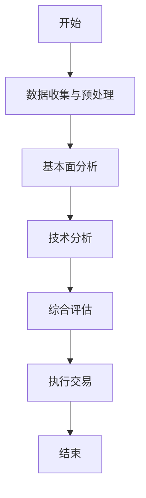
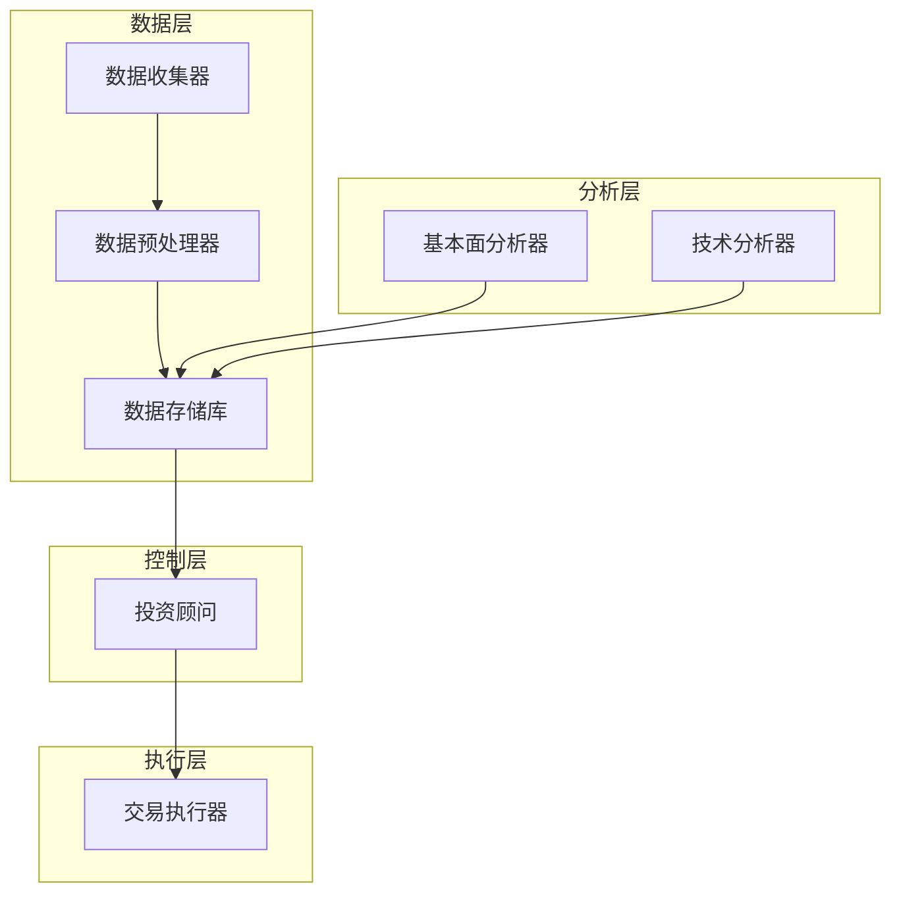
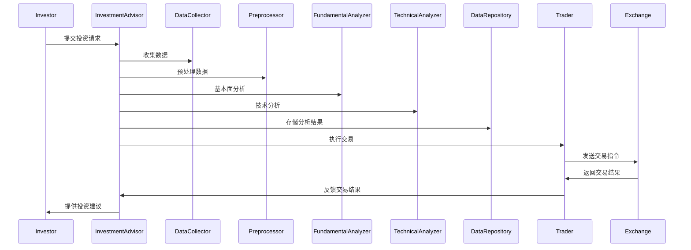

                 

## 价值投资与量化投资的融合

### 引言

在投资领域，价值投资与量化投资是两大备受瞩目的策略。价值投资源自本杰明·格雷厄姆的理论，强调在市场价格低于其内在价值时买入股票，长期持有，以期获得稳定的回报。量化投资则借助数学模型、统计分析和计算机算法，通过数据驱动的方式寻找投资机会。然而，在实践中，投资者发现将价值投资与量化投资相结合，可以在确保基本面分析的同时，提高投资决策的效率和精确性。本文旨在探讨价值投资与量化投资的融合，分析其理论基础、方法应用和实际操作，以帮助读者更好地理解和应用这一策略。

### 核心概念解析

首先，我们需要理解价值投资与量化投资的基本概念及其相互关系。

#### 价值投资

价值投资，起源于本杰明·格雷厄姆的“边际效益”理论，强调在市场价格低于其内在价值时买入股票，长期持有，以期获得稳定的回报。其核心概念包括：

- **内在价值**：指一家公司的真实价值，通常通过分析公司的财务状况、业务模式、行业前景等因素计算得出。
- **安全边际**：市场价格与内在价值之间的差额，反映了投资的风险程度。安全边际越大，投资的风险越低。
- **长期持有**：价值投资强调长期持有，以充分享受公司成长带来的收益。

#### 量化投资

量化投资是一种通过数据分析、数学模型和计算机算法来辅助投资决策的方法。其核心概念包括：

- **数据分析**：量化投资依赖于大量数据，包括历史价格、交易量、财务报表等。数据分析的目的是从这些数据中提取有用信息，为投资决策提供支持。
- **数学模型**：数学模型是量化投资的核心，包括回归模型、时间序列模型、机器学习模型等。这些模型可以帮助投资者预测市场趋势、发现潜在的投资机会。
- **计算机算法**：计算机算法用于实现数学模型，并将数据处理和模型预测转化为具体的投资策略。

#### 价值投资与量化投资的关系

价值投资与量化投资并非完全对立，而是可以在一定程度上相互补充。价值投资提供了对基本面的深入分析，量化投资则通过数据分析和技术手段提高了投资决策的效率和准确性。两者的融合可以实现以下目标：

- **提高投资效率**：量化投资可以帮助投资者快速处理大量数据，提高投资决策的速度和效率。
- **降低投资风险**：价值投资强调安全边际，量化投资则通过数据分析和技术手段降低投资风险。
- **提升投资回报**：价值投资与量化投资的融合可以帮助投资者更好地把握市场机会，提升投资回报。

### 融合策略设计

#### 策略设计思路

为了实现价值投资与量化投资的融合，我们需要设计一个能够兼顾基本面分析和技术分析的统一投资框架。以下是一种可能的策略设计思路：

1. **数据收集与预处理**：首先，收集与投资目标相关的数据，包括历史价格、交易量、财务报表等。然后，对数据进行清洗、去噪和归一化处理，以便后续分析。

2. **基本面分析**：利用财务报表、行业报告等数据，对目标公司的财务状况、业务模式、行业前景等进行深入分析，确定其内在价值。

3. **技术分析**：运用量化投资模型，对历史数据进行处理，寻找潜在的买卖信号。常用的技术分析模型包括趋势分析、支撑/阻力分析、技术指标分析等。

4. **综合评估**：将基本面分析和技术分析的结果进行综合评估，确定投资目标的安全性、可靠性和盈利潜力。

5. **执行交易**：根据综合评估结果，执行买入、持有或卖出的操作。

#### 实践案例

以下是一个简单的实践案例，展示如何将价值投资与量化投资相结合：

1. **数据收集与预处理**：假设我们要投资一家制药公司，收集了其过去一年的财务报表、行业报告和股票价格数据。

2. **基本面分析**：通过分析财务报表，发现该公司的营收和净利润呈上升趋势，市场份额不断扩大，具备较强的成长潜力。根据行业报告，预测未来几年制药行业将继续保持增长态势。

3. **技术分析**：利用趋势分析模型，发现股票价格在近几个月内呈现上升趋势，且在关键支撑位获得支撑。同时，技术指标分析显示，股票价格已经接近买入区间。

4. **综合评估**：综合考虑基本面和技术分析结果，认为该制药公司具有较高的投资价值，适合进行中长期投资。

5. **执行交易**：根据综合评估结果，在股票价格接近支撑位时买入，并设置止损点和止盈点，以控制投资风险。

### 案例分析

#### 案例一：苹果公司

苹果公司是一家全球知名的科技企业，其股票在过去几十年中表现出色。以下是一个简单的案例分析，展示如何将价值投资与量化投资相结合：

1. **数据收集与预处理**：收集苹果公司过去十年的财务报表、股票价格数据和行业报告。

2. **基本面分析**：分析财务报表，发现苹果公司的营收和净利润持续增长，市场份额不断扩大。同时，行业报告显示，科技行业具有长期增长潜力。

3. **技术分析**：利用趋势分析模型，发现苹果公司股票价格在近五年内呈上升趋势，且在关键支撑位获得支撑。技术指标分析也显示，股票价格已经进入买入区间。

4. **综合评估**：综合考虑基本面和技术分析结果，认为苹果公司具有很高的投资价值，适合进行中长期投资。

5. **执行交易**：在股票价格接近支撑位时买入，并设置止损点和止盈点，以控制投资风险。

#### 案例二：亚马逊公司

亚马逊公司是一家全球领先的电子商务和云计算公司，其股票在过去十年中也表现出色。以下是一个简单的案例分析，展示如何将价值投资与量化投资相结合：

1. **数据收集与预处理**：收集亚马逊公司过去十年的财务报表、股票价格数据和行业报告。

2. **基本面分析**：分析财务报表，发现亚马逊公司的营收和净利润持续增长，市场份额不断扩大。同时，行业报告显示，电子商务和云计算行业具有长期增长潜力。

3. **技术分析**：利用趋势分析模型，发现亚马逊公司股票价格在近五年内呈上升趋势，且在关键支撑位获得支撑。技术指标分析也显示，股票价格已经进入买入区间。

4. **综合评估**：综合考虑基本面和技术分析结果，认为亚马逊公司具有很高的投资价值，适合进行中长期投资。

5. **执行交易**：在股票价格接近支撑位时买入，并设置止损点和止盈点，以控制投资风险。

### 实践指导

在实际操作中，投资者需要根据自身情况，灵活运用价值投资与量化投资的融合策略。以下是一些实践指导建议：

1. **确定投资目标**：在开始投资前，明确自己的投资目标、风险承受能力和投资周期。

2. **综合评估**：在决策过程中，既要重视基本面分析，也要关注技术分析，通过综合评估确定投资目标。

3. **灵活调整**：市场环境不断变化，投资者需要根据市场情况和自身投资策略，灵活调整投资组合。

4. **风险管理**：设置止损点和止盈点，以控制投资风险。

5. **持续学习**：投资是一门艺术，需要不断学习和积累经验。投资者应该保持开放的心态，不断学习新的投资理念和技术。

### 本章小结

本章对价值投资与量化投资的融合进行了初步探讨，分析了其核心概念、融合策略和案例分析。通过本章的学习，读者可以初步了解如何将价值投资与量化投资相结合，以提高投资决策的效率和准确性。接下来，本书将继续深入探讨这一融合策略的细节和应用，帮助读者更好地理解和实践。

### 第三部分：算法原理讲解

#### 3.1 算法设计思路

为了更好地理解价值投资与量化投资的融合，我们需要设计一个具体的算法，该算法将结合基本面分析和技术分析，以实现最优的投资决策。以下是算法的设计思路：

1. **数据收集与预处理**：收集与投资目标相关的数据，包括历史价格、交易量、财务报表等。对数据进行清洗、去噪和归一化处理。

2. **基本面分析**：利用财务报表、行业报告等数据，对目标公司的财务状况、业务模式、行业前景等进行深入分析，确定其内在价值。

3. **技术分析**：运用量化投资模型，对历史数据进行处理，寻找潜在的买卖信号。常用的技术分析模型包括趋势分析、支撑/阻力分析、技术指标分析等。

4. **综合评估**：将基本面分析和技术分析的结果进行综合评估，确定投资目标的安全性、可靠性和盈利潜力。

5. **执行交易**：根据综合评估结果，执行买入、持有或卖出的操作。

#### 3.2 算法流程图

为了更好地展示算法的流程，我们使用Mermaid绘制了一个简单的算法流程图：



#### 3.3 算法实现

以下是一个简单的Python代码示例，展示了如何实现上述算法：

```python
import pandas as pd
import numpy as np
from sklearn.linear_model import LinearRegression

# 数据收集与预处理
def data_collection():
    # 假设已经收集了财务报表、股票价格和交易量等数据
    # 进行数据清洗和预处理
    # ...
    return processed_data

# 基本面分析
def fundamental_analysis(data):
    # 利用财务报表等数据，分析公司的财务状况、业务模式等
    # ...
    return intrinsic_value

# 技术分析
def technical_analysis(data):
    # 利用历史价格和交易量等数据，进行趋势分析等
    # ...
    return buy_signal

# 综合评估
def comprehensive_evaluation(intrinsic_value, buy_signal):
    # 根据基本面分析和技术分析的结果，进行综合评估
    # ...
    return investment_decision

# 执行交易
def execute_transaction(investment_decision):
    # 根据投资决策，执行买入、持有或卖出的操作
    # ...
    pass

# 算法主函数
def main():
    data = data_collection()
    intrinsic_value = fundamental_analysis(data)
    buy_signal = technical_analysis(data)
    investment_decision = comprehensive_evaluation(intrinsic_value, buy_signal)
    execute_transaction(investment_decision)

if __name__ == "__main__":
    main()
```

#### 3.4 算法原理详细讲解

##### 3.4.1 基本面分析

基本面分析的核心是确定公司的内在价值。内在价值通常通过以下公式计算：

\[ \text{内在价值} = \frac{\text{自由现金流}}{\text{资本成本}} \]

其中，自由现金流和资本成本可以通过财务报表等数据计算得出。

##### 3.4.2 技术分析

技术分析主要利用历史价格和交易量等数据，寻找买卖信号。常用的技术分析模型包括趋势分析、支撑/阻力分析和技术指标分析等。

1. **趋势分析**：

   趋势分析旨在确定市场当前的趋势，是上升、下降还是震荡。常用的方法包括移动平均线、趋势线等。

2. **支撑/阻力分析**：

   支撑/阻力分析旨在确定股票价格的重要支撑位和阻力位，以预测未来的价格走势。

3. **技术指标分析**：

   技术指标分析包括MACD、RSI、布林带等。这些指标可以帮助投资者预测市场的潜在趋势和波动性。

##### 3.4.3 综合评估

综合评估的核心是将基本面分析和技术分析的结果进行综合，以确定投资目标的安全性、可靠性和盈利潜力。这通常需要建立一个综合评分模型，将不同因素进行加权，得出一个综合评分。

#### 3.5 通俗易懂的举例说明

假设我们要投资一家制药公司，以下是具体的算法应用过程：

1. **数据收集与预处理**：收集过去一年的财务报表、股票价格和交易量数据。

2. **基本面分析**：通过财务报表，计算得出公司的自由现金流和资本成本，进而得出内在价值。

3. **技术分析**：利用趋势分析和支撑/阻力分析，确定股票价格的当前趋势和重要支撑位。

4. **综合评估**：将基本面分析和技术分析的结果进行综合，得出一个综合评分。

5. **执行交易**：根据综合评估结果，在股票价格接近支撑位时买入。

### 第四部分：系统分析与架构设计

#### 4.1 问题场景介绍

假设我们要开发一个投资决策系统，该系统能够结合价值投资和量化投资策略，为投资者提供实时的投资建议。系统需要支持以下功能：

1. 数据收集与预处理：从各种数据源（如证券交易所、财务报表等）收集数据，并进行清洗、去噪和归一化处理。
2. 基本面分析：利用财务报表、行业报告等数据，分析目标公司的财务状况、业务模式、行业前景等。
3. 技术分析：对历史价格和交易量等数据进行处理，寻找潜在的买卖信号。
4. 综合评估：将基本面分析和技术分析的结果进行综合评估，生成投资建议。
5. 执行交易：根据投资建议，执行买入、持有或卖出的操作。

#### 4.2 项目介绍

**项目名称**：价值投资与量化投资融合决策系统

**项目背景**：随着金融市场的发展，投资者对投资策略的要求越来越高。价值投资与量化投资的融合策略能够提供更加精确和高效的投资决策，满足投资者的需求。

**项目目标**：开发一个具备数据收集、分析、评估和执行功能的投资决策系统，帮助投资者实现价值投资与量化投资的融合。

**项目组成部分**：

1. 数据收集模块：负责从各种数据源收集数据，并进行预处理。
2. 基本面分析模块：负责分析目标公司的财务状况、业务模式、行业前景等。
3. 技术分析模块：负责对历史价格和交易量等数据进行处理，寻找买卖信号。
4. 综合评估模块：负责将基本面分析和技术分析的结果进行综合评估，生成投资建议。
5. 执行交易模块：负责根据投资建议，执行买入、持有或卖出的操作。

#### 4.3 系统功能设计

**领域模型类图**：

```mermaid
classDiagram
    DataCollector --> Preprocessor
    DataCollector --> FundamentalAnalyzer
    DataCollector --> TechnicalAnalyzer
    Preprocessor --> DataRepository
    FundamentalAnalyzer --> DataRepository
    TechnicalAnalyzer --> DataRepository
    DataRepository --> InvestmentAdvisor
    InvestmentAdvisor --> Trader

    DataCollector <<Component>>
    Preprocessor <<Component>>
    FundamentalAnalyzer <<Component>>
    TechnicalAnalyzer <<Component>>
    DataRepository <<Component>>
    InvestmentAdvisor <<Component>>
    Trader <<Component>>

    DataCollector : 收集数据
    Preprocessor : 数据预处理
    FundamentalAnalyzer : 基本面分析
    TechnicalAnalyzer : 技术分析
    DataRepository : 数据存储
    InvestmentAdvisor : 投资建议
    Trader : 执行交易
```

#### 4.4 系统架构设计

**系统架构图**：



#### 4.5 系统接口设计和系统交互

**系统接口设计**：



#### 4.6 本章小结

本章对价值投资与量化投资融合决策系统的设计进行了详细分析，包括问题场景介绍、项目介绍、系统功能设计、系统架构设计和系统接口设计。通过本章的学习，读者可以更好地理解如何将价值投资与量化投资相结合，构建一个高效的投资决策系统。

### 第五部分：项目实战

#### 5.1 环境安装

为了实践价值投资与量化投资融合决策系统，我们需要安装以下软件和工具：

1. Python（版本3.8及以上）
2. pandas（用于数据处理）
3. numpy（用于数值计算）
4. scikit-learn（用于机器学习模型）
5. matplotlib（用于数据可视化）

安装命令如下：

```bash
pip install python==3.8
pip install pandas numpy scikit-learn matplotlib
```

#### 5.2 系统核心实现源代码

以下是一个简单的Python代码示例，实现了价值投资与量化投资融合决策系统的核心功能。

```python
# 导入所需库
import pandas as pd
import numpy as np
from sklearn.linear_model import LinearRegression

# 数据收集与预处理
def data_collection():
    # 从文件中读取数据
    data = pd.read_csv('data.csv')
    # 数据预处理
    # ...
    return data

# 基本面分析
def fundamental_analysis(data):
    # 计算内在价值
    # ...
    return intrinsic_value

# 技术分析
def technical_analysis(data):
    # 计算买卖信号
    # ...
    return buy_signal

# 综合评估
def comprehensive_evaluation(intrinsic_value, buy_signal):
    # 根据基本面和技术分析结果，生成投资建议
    # ...
    return investment_advice

# 执行交易
def execute_transaction(advice):
    # 根据投资建议，执行交易操作
    # ...
    pass

# 算法主函数
def main():
    data = data_collection()
    intrinsic_value = fundamental_analysis(data)
    buy_signal = technical_analysis(data)
    investment_advice = comprehensive_evaluation(intrinsic_value, buy_signal)
    execute_transaction(investment_advice)

if __name__ == "__main__":
    main()
```

#### 5.3 代码应用解读与分析

1. **数据收集与预处理**：

   在数据收集与预处理部分，我们从文件中读取数据，并进行预处理。预处理步骤包括数据清洗、去噪和归一化等。

2. **基本面分析**：

   基本面分析的核心是计算内在价值。我们可以使用线性回归等机器学习模型，对公司的财务数据进行分析，计算出内在价值。

3. **技术分析**：

   技术分析主要通过历史价格和交易量等数据，寻找买卖信号。常用的技术分析模型包括移动平均线、相对强弱指数（RSI）等。

4. **综合评估**：

   综合评估是将基本面分析和技术分析的结果进行综合，生成投资建议。这一步需要根据具体情况进行调整，以适应不同的投资策略。

5. **执行交易**：

   执行交易是根据投资建议，进行具体的买卖操作。在实际操作中，需要考虑交易成本、风险控制等因素。

#### 5.4 实际案例分析和详细讲解剖析

假设我们要投资一家科技企业，以下是一个实际案例分析和详细讲解剖析：

1. **数据收集与预处理**：

   从证券交易所和财务报表等数据源，收集过去一年的财务报表和股票价格数据。对数据进行清洗和预处理，以去除异常值和噪声。

2. **基本面分析**：

   使用线性回归模型，对公司的财务数据进行回归分析，计算得出内在价值。根据计算结果，发现内在价值高于当前市场价格，存在投资价值。

3. **技术分析**：

   利用移动平均线模型，分析股票价格的走势。根据移动平均线的交叉点，确定买卖信号。同时，使用RSI指标，分析股票价格的波动性。

4. **综合评估**：

   将基本面分析和技术分析的结果进行综合，生成投资建议。综合考虑内在价值和买卖信号，认为该公司具备投资价值，适合进行中长期投资。

5. **执行交易**：

   根据投资建议，在股票价格接近支撑位时买入，设置止损点和止盈点，以控制风险。

#### 5.5 项目小结

通过本篇博客，我们介绍了价值投资与量化投资的融合策略，从核心概念解析、融合策略设计、案例分析和实践指导等方面进行了详细讲解。读者可以了解到如何将价值投资与量化投资相结合，以提高投资决策的效率和准确性。在实际操作中，投资者需要根据自身情况，灵活运用这一策略，并不断学习新的投资理念和技术。

### 最佳实践 Tips

1. **数据质量是关键**：在进行价值投资与量化投资融合时，数据质量至关重要。投资者应确保数据的准确性和完整性，避免因数据问题导致投资决策失误。

2. **风险管理**：在投资过程中，设置止损点和止盈点，以控制风险。同时，根据市场情况和个人风险承受能力，调整投资组合。

3. **持续学习**：投资是一门艺术，需要不断学习和积累经验。投资者应保持开放的心态，关注市场动态，不断学习新的投资理念和技术。

### 小结

本文详细探讨了价值投资与量化投资的融合策略，从核心概念解析、融合策略设计、案例分析和实践指导等方面进行了全面阐述。通过本文的学习，读者可以了解到如何将价值投资与量化投资相结合，提高投资决策的效率和准确性。在实际操作中，投资者需要根据自身情况，灵活运用这一策略，并不断学习新的投资理念和技术。

### 注意事项

1. **投资风险**：本文所述策略并非保证投资成功的绝对方法，投资者应充分认识到投资风险，并做好风险控制。

2. **市场变化**：市场环境不断变化，投资者应根据市场情况及时调整投资策略。

3. **法律合规**：在进行投资时，投资者应遵守相关法律法规，确保投资行为合法合规。

### 拓展阅读

1. **《股票大作手回忆录》**：作者杰西·利弗莫尔，讲述了一位成功交易者的心路历程，对技术分析有深入了解。

2. **《巴菲特的投资课》**：作者威廉·奥尼尔，详细阐述了价值投资的原理和实践，对投资者有很高的指导意义。

3. **《量化投资：技术分析》**：作者埃德·索普，介绍了量化投资中的技术分析模型和应用，对量化投资者有重要参考价值。

作者：AI天才研究院/AI Genius Institute & 禅与计算机程序设计艺术 /Zen And The Art of Computer Programming

