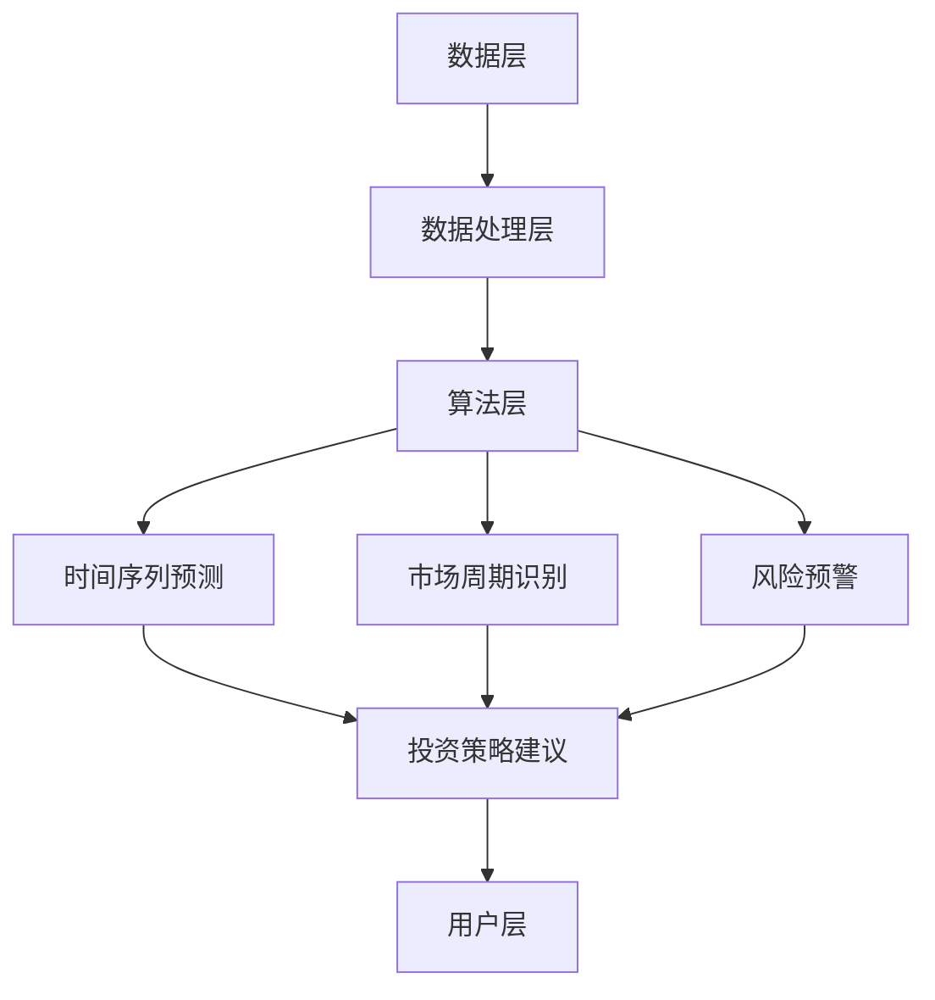
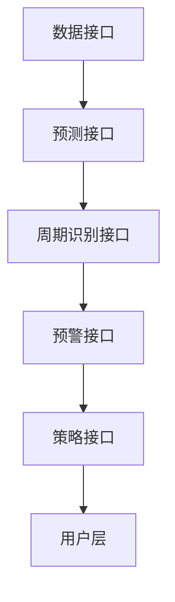
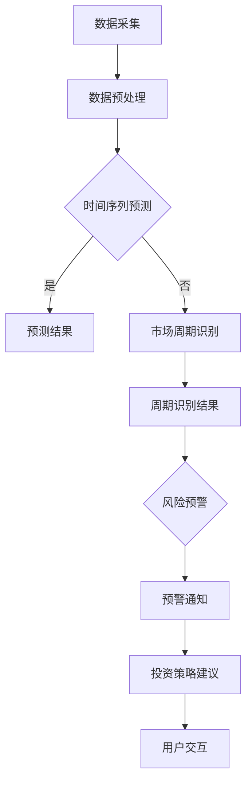
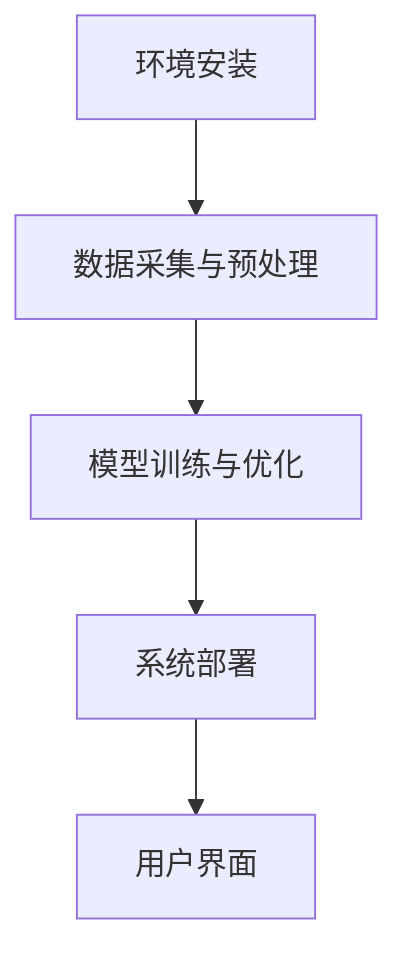

                 

## 摘要

本文旨在探讨如何结合人工智能技术，构建一个具有跨周期分析能力的价值投资系统。文章首先介绍了价值投资的基本原则和核心理念，接着详细阐述了AI智能体的基础理论及其在跨周期分析中的应用。通过深入分析时间序列分析、市场周期识别和预测等关键技术，本文探讨了如何利用AI智能体进行有效的跨周期分析，并提供了具体的应用案例。最后，本文介绍了AI智能体跨周期分析系统的设计与实现过程，从系统架构到实际应用，全面展示了如何将AI技术应用于价值投资领域。通过本文的探讨，期望为投资者提供一种全新的跨周期分析工具，提高投资决策的准确性和可靠性。

## 关键词

价值投资、人工智能、跨周期分析、时间序列、市场预测、智能体系统

## 引言

在现代金融市场中，价值投资作为一种经典的投资策略，已经被广泛认可并应用于实际投资中。然而，随着市场环境的变化和信息的爆炸式增长，传统的价值投资方法面临着新的挑战。为了更好地应对这些挑战，人工智能技术的引入成为了一个重要的趋势。AI智能体，作为一种具有自主学习能力和决策能力的系统，能够有效地处理海量数据，提供更为精准和实时的分析结果。

跨周期分析是价值投资中的一个关键环节，它旨在识别和理解市场在不同周期中的行为特征，从而做出更为合理的投资决策。然而，跨周期分析涉及到大量的时间序列数据和复杂的市场周期识别问题，这对传统的分析方法提出了更高的要求。AI智能体的引入，为解决这些难题提供了一种新的思路。

本文将详细探讨如何利用AI智能体构建一个跨周期分析系统，以应对价值投资中的新挑战。文章首先介绍了价值投资的基本原则和核心理念，接着阐述了AI智能体的基础理论及其在跨周期分析中的应用。通过深入分析时间序列分析、市场周期识别和预测等关键技术，本文探讨了如何利用AI智能体进行有效的跨周期分析，并提供了具体的应用案例。最后，本文介绍了AI智能体跨周期分析系统的设计与实现过程，从系统架构到实际应用，全面展示了如何将AI技术应用于价值投资领域。

通过本文的探讨，我们期望为投资者提供一种全新的跨周期分析工具，提高投资决策的准确性和可靠性。同时，本文也希望能够为AI技术在金融领域的应用提供一些有益的启示和思考。

### 第一部分：价值投资的概述

#### 1.1 价值投资的定义与核心原则

**价值投资**，起源于20世纪初的华尔街，其核心理念在于“购买低价股并长期持有”，以期待未来股价回升所带来的收益。这一理念最早由本杰明·格雷厄姆（Benjamin Graham）提出，并被他誉为“聪明的投资者”（The Intelligent Investor）。价值投资不仅强调股票的价值，更注重投资者的心态和策略。

价值投资的核心原则可以概括为三点：

1. **内在价值**：股票的价值不是由市场情绪所决定，而是由其内在价值所决定。内在价值是指公司的真实价值，可以通过对公司基本面（如营收、利润、现金流等）的深入分析来估算。

2. **安全边际**：投资时应确保所支付的股价低于其内在价值。安全边际是指股票的实际市场价格与其内在价值之间的差异。安全边际的存在可以降低投资风险，为投资者提供更多的保护。

3. **长期持有**：价值投资主张投资者在股价低于内在价值时买入，并在股价高于内在价值时卖出。投资者应具备耐心和毅力，长期持有优质股票，以获取长期稳定的回报。

#### 1.2 价值投资的理念与实践

**价值投资的理念**，强调理性分析、长期持有和风险控制。与追求短期利润的投机行为不同，价值投资注重公司的基本面和长期成长潜力。投资者应具备良好的财务知识，能够识别优质公司，并耐心等待市场纠正其错误定价。

**价值投资在实践中的应用**，包括以下几个方面：

1. **基本面分析**：投资者应深入研究公司的财务报表，包括利润表、资产负债表和现金流量表。通过分析公司的营收、利润、资产和负债等指标，评估其财务健康状况和成长潜力。

2. **市场估值**：投资者应使用合理的估值方法（如市盈率、市净率、股息收益率等），判断股票是否被低估。如果市场对某只股票的定价明显低于其内在价值，那么这只股票就是一个潜在的优质投资目标。

3. **分散投资**：为了避免单一股票的风险，投资者应采取分散投资的策略，将资金分散投资于多个不同的行业和股票。

4. **耐心持有**：价值投资的成功往往需要时间，投资者应具备耐心和毅力，长期持有优质股票，以等待市场对公司的价值重新认识。

#### 1.3 价值投资的思维模式

**价值投资的思维模式**，具有以下几个特点：

1. **逆向思考**：价值投资者往往采取逆向思维，与市场情绪保持一定距离。当市场普遍看涨时，他们可能会选择看跌；当市场普遍看跌时，他们可能会选择看涨。

2. **长期视角**：价值投资者关注的是公司的长期价值和成长潜力，而不是短期的市场波动。他们相信，只要公司基本面良好，股价迟早会反映出其真实价值。

3. **风险控制**：价值投资者注重风险控制，通过安全边际来降低投资风险。他们相信，合理的风险控制是获得长期稳定回报的关键。

4. **独立思考**：价值投资者不盲目跟从市场或专家意见，而是基于自己的独立分析和判断做出投资决策。他们相信，只有独立思考，才能找到被市场低估的投资机会。

#### 1.4 价值投资与市场的对比

**价值投资**与**传统投资**的主要区别在于：

1. **投资目标**：传统投资更多关注短期收益，而价值投资则注重长期稳定的回报。

2. **投资策略**：传统投资更倾向于追逐市场热点，而价值投资则基于基本面分析，选择被低估的优质股票。

3. **风险控制**：传统投资往往忽视风险控制，而价值投资通过安全边际和分散投资来降低风险。

4. **市场适应**：传统投资需要频繁调整投资组合，以适应市场的变化，而价值投资则强调长期持有，耐心等待市场的纠正。

#### 1.5 本章小结

通过本章节的介绍，我们了解了价值投资的基本原则和核心理念，以及其在实践中的应用和思维模式。价值投资不仅是一种投资策略，更是一种生活态度和哲学。它要求投资者具备独立思考、长期持有和风险控制的能力。在未来的投资中，结合人工智能技术，价值投资有望发挥更大的作用，为投资者提供更为精准和可靠的决策支持。

### 第二部分：AI智能体的基础理论

#### 2.1 AI智能体的定义与类型

**AI智能体**，是指具备一定自主学习和决策能力，能够与外部环境进行交互，并在特定任务中实现一定智能行为的计算机系统。智能体可以是软件程序、机器人或其他设备，它们通过感知、决策和执行等过程，实现智能化的任务执行。

**AI智能体的主要类型**包括：

1. **规则型智能体**：基于预定义的规则和逻辑进行决策和执行。这类智能体在特定任务中表现出高度的确定性，但其灵活性较差，难以应对复杂多变的场景。

2. **数据驱动型智能体**：通过学习大量历史数据，利用机器学习和深度学习算法进行决策和执行。这类智能体具有较强的适应能力和灵活性，但依赖大量数据训练，且可能存在过拟合问题。

3. **混合型智能体**：结合规则和数据驱动方法，既利用预定义规则进行决策，又通过数据学习优化决策模型。这类智能体在规则性和灵活性之间取得平衡，适用于复杂多变的场景。

**AI智能体的应用场景**广泛，包括但不限于：

1. **自动化生产线**：智能体通过感知生产线状态，自主进行设备调度和故障诊断，提高生产效率和产品质量。

2. **智能客服系统**：智能体利用自然语言处理技术，与用户进行交互，提供个性化的服务和解决方案。

3. **智能交通系统**：智能体通过感知交通状况，优化交通信号控制，减少交通拥堵，提高道路通行效率。

#### 2.2 AI智能体的技术基础

**AI智能体的技术基础**包括以下几个方面：

1. **机器学习与深度学习**：机器学习是一种通过数据训练模型，使其具备一定智能行为的技术。深度学习是机器学习的一个分支，通过多层神经网络进行数据建模和预测。机器学习和深度学习为AI智能体提供了强大的学习能力和决策能力。

2. **自然语言处理（NLP）**：NLP是一种使计算机能够理解和生成人类语言的技术。NLP技术在智能客服、智能助手等领域具有广泛的应用。

3. **计算机视觉**：计算机视觉是一种使计算机能够识别和理解图像和视频的技术。计算机视觉技术在自动驾驶、安防监控等领域具有重要作用。

4. **知识图谱**：知识图谱是一种通过实体和关系进行知识表示和推理的技术。知识图谱为AI智能体提供了丰富的背景知识和上下文信息，有助于提高决策的准确性和一致性。

#### 2.3 AI智能体的核心组件

**AI智能体的核心组件**包括感知模块、决策模块和执行模块：

1. **感知模块**：感知模块负责获取外部环境的信息，如图像、文本、声音等。通过数据预处理和特征提取，感知模块将原始数据转换为可用于决策的格式。

2. **决策模块**：决策模块基于感知模块获取的信息，利用机器学习模型、规则库或知识图谱进行决策。决策模块的目标是选择最优的行动方案，以实现智能体的目标。

3. **执行模块**：执行模块负责将决策模块选定的行动方案付诸实施。执行模块通常与外部环境进行交互，如控制机器人动作、发送HTTP请求等。

#### 2.4 AI智能体的开发与部署

**AI智能体的开发与部署**包括以下几个步骤：

1. **需求分析与设计**：明确智能体的任务目标和功能需求，设计系统的整体架构和模块划分。

2. **数据收集与预处理**：收集相关的数据集，对数据进行清洗、归一化和特征提取，为模型训练做准备。

3. **模型训练与优化**：利用机器学习算法训练模型，通过交叉验证和超参数调优，提高模型的准确性和泛化能力。

4. **系统集成与测试**：将训练好的模型集成到智能体系统中，进行系统测试和调试，确保智能体的稳定运行和性能。

5. **部署与维护**：将智能体部署到生产环境，进行实时数据采集和决策，同时进行系统的监控和维护，确保系统的持续运行和更新。

#### 2.5 本章小结

通过本章节的介绍，我们了解了AI智能体的定义、类型和技术基础，以及其核心组件和开发与部署过程。AI智能体作为一种具有自主学习和决策能力的系统，在多个领域具有广泛的应用前景。在未来，随着人工智能技术的不断发展，AI智能体的性能和功能将得到进一步提升，为各个领域带来更多的创新和变革。

### 2.2 AI智能体的技术基础

**机器学习与深度学习**是AI智能体的核心技术基础，为智能体提供了强大的学习能力和决策能力。**机器学习**是一种通过数据训练模型，使其具备一定智能行为的技术。机器学习算法通过从数据中学习特征和规律，可以自动识别模式和做出预测。常见的机器学习算法包括线性回归、决策树、支持向量机、贝叶斯分类器等。

**深度学习**是机器学习的一个分支，通过多层神经网络进行数据建模和预测。深度学习模型由多个隐层组成，能够自动提取数据的特征和模式。与传统的机器学习方法相比，深度学习具有更强的表达能力和泛化能力，已经在图像识别、语音识别、自然语言处理等领域取得了显著成果。常见的深度学习框架包括TensorFlow、PyTorch、Keras等。

**自然语言处理（NLP）**是AI智能体在处理文本数据时的重要技术。NLP旨在使计算机能够理解和生成人类语言。NLP技术包括词向量表示、文本分类、情感分析、机器翻译等。词向量表示技术（如Word2Vec、GloVe）将文本数据转换为数值形式，便于深度学习模型处理。文本分类技术（如朴素贝叶斯、卷积神经网络）用于对文本数据进行分类，识别文本中的主题和情感。情感分析技术（如LSTM、BERT）用于分析文本中的情感倾向，为智能客服和舆情分析提供支持。

**计算机视觉**是AI智能体在处理图像和视频数据时的核心技术。计算机视觉技术使计算机能够识别和理解图像和视频。计算机视觉包括目标检测、图像分类、图像分割、人脸识别等任务。目标检测技术（如YOLO、SSD、Faster R-CNN）用于识别图像中的物体，并定位其位置。图像分类技术（如卷积神经网络、Inception）用于将图像分类到预定义的类别中。图像分割技术（如U-Net、Mask R-CNN）用于将图像划分为不同的区域。人脸识别技术（如OpenCV、FaceNet）用于识别和验证图像中的人脸。

**知识图谱**是AI智能体在处理结构化数据时的重要工具。知识图谱通过实体和关系进行知识表示和推理，为智能体提供了丰富的背景知识和上下文信息。知识图谱技术包括实体抽取、关系抽取、实体链接、知识图谱构建等。实体抽取技术（如命名实体识别、关系抽取）用于从文本数据中提取实体和关系。关系抽取技术（如神经网络模型、图模型）用于识别实体之间的关系。实体链接技术（如链接预测、实体消歧）用于将文本中的实体与知识图谱中的实体进行匹配。知识图谱构建技术（如数据清洗、实体融合、关系建模）用于构建和更新知识图谱。

**Python**是一种广泛使用的编程语言，具有丰富的库和框架，适用于AI智能体的开发。常见的AI智能体开发库和框架包括TensorFlow、PyTorch、Keras（用于深度学习）、NLTK、spaCy（用于自然语言处理）、OpenCV（用于计算机视觉）等。

**Mermaid**是一种基于Markdown的图表绘制工具，可以用于绘制流程图、类图、架构图等。在AI智能体的开发过程中，Mermaid可以帮助开发者直观地展示算法流程和系统架构，提高代码的可读性和可维护性。

通过这些技术基础，AI智能体能够从数据中学习知识，处理不同类型的信息，并在实际应用中实现智能化的决策和执行。这些技术不仅为AI智能体的构建提供了强大的支持，也为人工智能在各个领域的应用带来了更多的可能性和创新。

#### 2.3 AI智能体的核心组件

AI智能体的核心组件包括感知模块、决策模块和执行模块。这些模块共同工作，使智能体能够在复杂环境中实现自主学习和智能行为。

**感知模块**是智能体的“感官”，负责从外部环境中收集信息。这些信息可以是文本、图像、声音等多种形式。感知模块通常包括以下几个关键步骤：

1. **数据采集**：通过传感器、摄像头、麦克风等设备收集原始数据。
2. **数据预处理**：对原始数据进行清洗、归一化、特征提取等处理，以便后续的决策和执行。
3. **特征表示**：将预处理后的数据转换为适合机器学习算法处理的格式，如向量或张量。

**决策模块**是智能体的“大脑”，负责处理感知模块收集到的信息，并生成相应的决策。决策模块的核心是算法模型，这些模型可以是基于规则的、机器学习的或混合型的。决策模块通常包括以下几个关键步骤：

1. **信息融合**：将来自多个感知模块的信息进行融合，以获得更全面的情境理解。
2. **状态评估**：使用机器学习算法或规则库对当前状态进行评估，确定最佳行动方案。
3. **决策生成**：根据状态评估结果生成具体的决策，如移动、发送消息或执行特定任务。

**执行模块**是智能体的“肢体”，负责将决策模块生成的决策付诸实施。执行模块通常与外部设备或系统进行交互，如控制机器人移动、操作工业设备或发送网络请求。执行模块通常包括以下几个关键步骤：

1. **决策解析**：将决策模块生成的决策转换为具体的操作指令。
2. **执行控制**：控制外部设备或系统的运行，执行解析出的操作指令。
3. **状态反馈**：收集执行结果，并将其反馈给决策模块，以进行后续的调整和优化。

以下是AI智能体的核心组件之间的关系：

- **感知模块**提供数据输入，为决策模块提供信息支持。
- **决策模块**处理感知模块提供的数据，生成决策。
- **执行模块**根据决策模块的决策进行行动，并将执行结果反馈给感知模块和决策模块，形成一个闭环控制系统。

通过这种闭环控制系统，AI智能体能够实时地感知环境、做出决策并执行行动，从而实现自主学习和智能行为。这种模块化的设计使得智能体能够灵活地适应不同的应用场景，并在各种复杂环境中表现出良好的性能。

#### 2.4 AI智能体的开发与部署

AI智能体的开发与部署是一个复杂的过程，涉及多个阶段和步骤。以下是对这一过程的详细说明：

**1. 需求分析与设计**

在开始开发AI智能体之前，首先需要对项目进行需求分析。这一阶段的目标是明确智能体的任务目标、功能需求和技术要求。需求分析通常包括以下步骤：

- **任务定义**：明确智能体需要完成的任务，如数据分类、图像识别、语音识别等。
- **功能需求**：列出智能体需要具备的功能，如感知、决策、执行等。
- **技术要求**：确定所需的硬件和软件资源，如处理器性能、内存容量、开发框架等。

根据需求分析的结果，设计智能体的整体架构和模块划分。这一阶段可以使用Mermaid等工具绘制系统架构图，清晰地展示各模块之间的关系和交互。

**2. 数据收集与预处理**

数据是AI智能体训练和运行的基础。数据收集与预处理是开发过程中的关键步骤。以下是一些关键点：

- **数据收集**：根据需求收集相关的数据集，如文本数据、图像数据、声音数据等。数据可以从公开数据集、社交媒体、传感器等渠道获取。
- **数据清洗**：清洗数据，去除噪音和错误，确保数据的质量和一致性。
- **数据预处理**：对数据进行归一化、标准化、特征提取等处理，使其符合算法的要求。

**3. 模型训练与优化**

在数据准备完成后，开始进行模型训练。这一阶段的目标是训练一个能够准确预测或分类的模型。以下是一些关键点：

- **选择模型**：根据任务需求和数据特性，选择合适的机器学习算法和深度学习模型，如线性回归、决策树、卷积神经网络等。
- **训练模型**：使用训练数据对模型进行训练，调整模型的参数，使其达到预定的性能指标。
- **模型优化**：通过交叉验证和超参数调优，提高模型的泛化能力和性能。

**4. 系统集成与测试**

在模型训练完成后，将训练好的模型集成到智能体系统中。系统集成与测试包括以下步骤：

- **集成模型**：将训练好的模型与感知模块、决策模块和执行模块进行集成，确保系统能够正常运行。
- **系统测试**：对集成后的系统进行全面的测试，包括功能测试、性能测试、可靠性测试等。
- **调试与优化**：根据测试结果，对系统进行调试和优化，确保系统的稳定性和性能。

**5. 部署与维护**

系统集成与测试完成后，将智能体部署到生产环境，进行实时数据采集和决策。以下是一些关键点：

- **部署策略**：根据系统的需求，选择合适的部署策略，如本地部署、云部署等。
- **监控与维护**：实时监控系统的运行状态，确保系统的稳定性和可靠性。定期更新模型和系统，以适应新的数据和需求。

**6. 持续迭代与优化**

AI智能体的开发和部署是一个持续迭代的过程。以下是一些关键点：

- **用户反馈**：收集用户反馈，了解系统的实际使用情况和性能表现。
- **数据更新**：定期更新训练数据，确保模型能够适应新的环境和数据。
- **模型更新**：根据用户反馈和数据更新，对模型进行重新训练和优化，以提高系统的性能。

通过这些步骤，AI智能体能够从需求分析到部署，实现完整的开发与部署流程。这一过程不仅需要技术上的支持，还需要项目管理、团队协作和持续优化的能力。只有这样，AI智能体才能在实际应用中发挥出最大的价值。

#### 2.5 本章小结

通过本章节的介绍，我们详细探讨了AI智能体的技术基础、核心组件及其开发与部署过程。AI智能体作为一种具备自主学习和决策能力的系统，在多个领域具有广泛的应用前景。其技术基础包括机器学习与深度学习、自然语言处理、计算机视觉和知识图谱等。核心组件包括感知模块、决策模块和执行模块，这些模块共同工作，使智能体能够在复杂环境中实现自主学习和智能行为。开发与部署过程涉及需求分析、数据收集与预处理、模型训练与优化、系统集成与测试、部署与维护以及持续迭代与优化等步骤。通过这些步骤，AI智能体能够从理论到实践，实现完整的开发与部署流程，为实际应用提供强大的支持。在未来，随着技术的不断发展和创新，AI智能体的性能和功能将得到进一步提升，为各个领域带来更多的变革和突破。

### 第三部分：跨周期分析的方法与应用

#### 3.1 跨周期分析的基本概念

**跨周期分析**，是指在分析市场或经济现象时，考虑不同周期（如短期、中期和长期）之间的相互作用和影响。这种分析方法旨在识别和理解市场在不同周期中的行为特征，从而做出更为合理的投资决策。跨周期分析不仅关注当前的市场状态，还考虑市场的波动、趋势和周期性变化。

**跨周期分析的目标**包括：

1. **识别市场周期**：通过分析历史数据和市场指标，识别市场在不同周期中的波动特征，如上升期、下降期和调整期。
2. **预测市场趋势**：利用跨周期分析方法，预测市场在未来的发展趋势和变化。
3. **优化投资策略**：基于跨周期分析的结果，制定和调整投资策略，以适应不同周期的市场环境。

**跨周期分析的重要性**体现在以下几个方面：

1. **风险控制**：通过跨周期分析，投资者可以更好地理解市场的波动和风险，从而采取相应的风险控制措施，降低投资风险。
2. **投资决策优化**：跨周期分析提供了一种全面的视角，帮助投资者在不同周期的市场环境中做出更为明智的投资决策。
3. **长期回报**：跨周期分析能够帮助投资者识别具有长期增长潜力的投资机会，从而实现长期稳定的回报。

#### 3.2 时间序列分析与预测

**时间序列分析**是一种用于分析按时间顺序排列的数据的方法。在金融市场中，时间序列分析常用于预测股票价格、利率、汇率等市场指标。时间序列分析的关键步骤包括：

1. **数据预处理**：对时间序列数据进行清洗、缺失值处理、异常值检测等操作，确保数据的质量和一致性。
2. **特征提取**：从时间序列数据中提取有意义的特征，如趋势、季节性、周期性等，为后续的建模提供基础。
3. **模型选择**：根据时间序列数据的特性，选择合适的模型进行预测。常见的模型包括自回归模型（AR）、移动平均模型（MA）、自回归移动平均模型（ARMA）、自回归积分滑动平均模型（ARIMA）等。
4. **模型训练与评估**：使用历史数据对模型进行训练，评估模型的性能，如均方误差（MSE）、均方根误差（RMSE）等指标。

**时间序列预测模型**包括以下几种：

1. **ARIMA模型**：自回归积分滑动平均模型，是一种经典的统计模型，适用于线性时间序列数据的预测。
2. **LSTM模型**：长短期记忆网络，是一种深度学习模型，能够处理非线性时间序列数据，具有较强的记忆和预测能力。
3. **GRU模型**：门控循环单元，是LSTM的一种变体，通过门控机制优化了计算效率，适用于时间序列数据的预测。
4. **SARIMA模型**：季节性自回归积分滑动平均模型，是ARIMA模型的扩展，适用于具有季节性特征的时间序列数据。

**时间序列分析在价值投资中的应用**包括：

1. **股票价格预测**：通过时间序列分析，预测股票价格的走势，为投资决策提供参考。
2. **行业趋势分析**：分析行业时间序列数据，识别行业的周期性波动，为行业投资提供依据。
3. **风险管理**：利用时间序列分析，评估市场风险，制定相应的风险控制策略。

#### 3.3 市场周期识别与预测

**市场周期**是指市场在一段时期内的波动和变化。市场周期通常包括上升期、下降期、调整期和复苏期等阶段。识别市场周期对于投资者制定投资策略具有重要意义。

**市场周期识别的方法**包括：

1. **技术分析**：通过分析股票价格、成交量、技术指标等数据，识别市场的波动和趋势。常见的技术分析工具包括移动平均线、相对强弱指数（RSI）、MACD等。
2. **基本面分析**：通过分析公司的财务报表、行业前景、经济指标等，判断市场的周期性变化。基本面分析包括市盈率、市净率、利润增长率等指标。
3. **历史数据分析**：通过分析历史市场数据，识别市场周期的特征和规律，为当前市场周期提供参考。

**市场周期预测的方法**包括：

1. **趋势预测**：通过时间序列分析、趋势外推等方法，预测市场的未来走势。
2. **周期性预测**：通过识别市场周期的特征和规律，预测市场的周期性波动。
3. **组合预测**：结合多种预测方法，提高预测的准确性和可靠性。

**市场周期预测的应用**包括：

1. **投资策略制定**：根据市场周期的预测结果，制定相应的投资策略，如在上升期增加投资，在下降期减少投资。
2. **风险管理**：通过市场周期预测，评估市场风险，制定相应的风险控制措施。
3. **行业分析**：通过市场周期预测，分析行业在各个周期中的表现，为行业投资提供依据。

#### 3.4 AI智能体在跨周期分析中的应用

**AI智能体**在跨周期分析中具有显著的优势，能够提高分析的准确性和效率。以下是一些具体的应用场景：

1. **时间序列预测**：AI智能体可以通过深度学习模型（如LSTM、GRU）对时间序列数据进行预测，提供更准确的未来趋势预测。
2. **市场周期识别**：AI智能体可以通过分析股票价格、成交量等市场指标，自动识别市场周期，为投资者提供决策支持。
3. **风险管理**：AI智能体可以实时监测市场数据，评估市场风险，提供相应的风险控制建议。
4. **组合优化**：AI智能体可以根据市场周期的预测结果，优化投资组合，提高投资收益。

**AI智能体在跨周期分析中的优势**包括：

1. **高效性**：AI智能体能够快速处理大量数据，提供实时的分析结果。
2. **准确性**：通过深度学习和机器学习算法，AI智能体能够发现数据中的复杂模式和关系，提高预测的准确性。
3. **灵活性**：AI智能体可以根据不同的市场和投资策略，灵活调整分析模型和参数，适应各种复杂场景。
4. **自动化**：AI智能体可以实现自动化分析和决策，减轻人工分析的负担，提高决策效率。

#### 3.5 跨周期分析案例研究

以下是一个跨周期分析的案例研究：

**案例背景**：某投资者希望利用跨周期分析方法，预测某只股票的未来走势，并制定相应的投资策略。

**步骤一：数据收集与预处理**  
收集该股票的历史价格、成交量等数据，对数据进行清洗和预处理，去除异常值和缺失值。

**步骤二：特征提取**  
从预处理后的数据中提取特征，如移动平均线、相对强弱指数（RSI）、MACD等，为后续的建模提供基础。

**步骤三：模型选择与训练**  
选择LSTM模型对时间序列数据进行预测，使用历史数据对模型进行训练，调整模型的参数，以提高预测的准确性。

**步骤四：市场周期识别**  
利用LSTM模型预测股票价格的未来走势，分析市场的波动特征，识别市场周期。

**步骤五：投资策略制定**  
根据市场周期的预测结果，制定相应的投资策略，如在上升期增加投资，在下降期减少投资。

**步骤六：策略评估与调整**  
定期评估投资策略的效果，根据市场变化调整策略，以实现长期稳定的回报。

**案例结果**：通过跨周期分析，投资者能够更好地把握市场的波动趋势，提高投资决策的准确性。在上升期，投资者可以增加投资，获取更高的收益；在下降期，投资者可以减少投资，降低风险。

#### 3.6 本章小结

通过本章节的介绍，我们详细探讨了跨周期分析的基本概念、时间序列分析与预测方法、市场周期识别与预测方法以及AI智能体在跨周期分析中的应用。跨周期分析是一种重要的市场分析方法，能够帮助投资者识别和理解市场的周期性波动，从而制定更为合理的投资策略。时间序列分析和市场周期预测是跨周期分析的核心方法，而AI智能体则提供了强大的技术支持，提高了分析的准确性和效率。通过案例研究，我们展示了如何利用跨周期分析进行投资决策，为实际应用提供了有益的参考。在未来，随着技术的不断发展，跨周期分析将在金融市场中发挥越来越重要的作用。

### 3.4 AI智能体在跨周期分析中的应用

AI智能体在跨周期分析中的应用，为市场分析带来了全新的视角和更高的准确性。通过结合机器学习和深度学习算法，AI智能体能够从海量数据中提取有价值的信息，提供实时的市场预测和周期识别。以下将详细讨论AI智能体在跨周期分析中的具体应用。

#### 时间序列分析

时间序列分析是AI智能体在跨周期分析中的核心应用之一。通过深度学习模型，如长短期记忆网络（LSTM）和门控循环单元（GRU），AI智能体能够捕捉时间序列数据的长期依赖性和短期波动性。以下是一个时间序列分析的具体应用示例：

**步骤一：数据收集与预处理**
- **数据收集**：首先，从公开的金融数据库中收集时间序列数据，如股票价格、交易量、利率、经济指标等。
- **数据预处理**：对收集到的数据进行清洗，包括缺失值填充、异常值处理和标准化等，以消除噪声和提高数据质量。

**步骤二：特征提取**
- **特征提取**：从预处理后的数据中提取关键特征，如趋势、季节性和周期性，为模型训练提供输入。

**步骤三：模型训练**
- **模型选择**：选择LSTM或GRU模型，这些模型能够处理序列数据中的长时依赖性。
- **训练与验证**：使用历史数据进行模型训练，通过交叉验证评估模型的性能，调整模型参数以达到最优效果。

**步骤四：预测**
- **预测生成**：利用训练好的模型对未来的时间序列数据进行预测，生成市场趋势和周期的预测结果。

**示例**：假设我们使用LSTM模型对某股票的未来价格进行预测。我们可以将过去三个月的价格作为输入，预测接下来的一个月价格。通过模型训练和预测，我们可以得到股票价格的未来走势，为投资决策提供参考。

#### 市场周期识别

AI智能体还可以通过机器学习算法识别市场周期，为投资者提供决策支持。以下是一个市场周期识别的具体应用示例：

**步骤一：数据收集**
- 收集多个时间序列数据，包括股票价格、交易量、利率、经济指标等，覆盖不同的市场周期。

**步骤二：特征提取**
- 提取与市场周期相关的特征，如价格波动幅度、交易量变化率、市场情绪指标等。

**步骤三：模型训练**
- 使用分类算法（如支持向量机SVM、随机森林Random Forest等）对历史数据进行训练，识别市场周期的特征和模式。

**步骤四：周期预测**
- 利用训练好的模型对当前市场的周期性进行预测，识别市场的当前周期以及未来可能的转变。

**示例**：假设我们使用支持向量机（SVM）模型来识别市场周期。通过训练模型，我们可以将市场分为上升期、下降期和调整期，并根据预测结果调整投资策略。

#### 风险管理

AI智能体在跨周期分析中的应用不仅限于市场预测和周期识别，还可以用于风险管理。通过实时监测市场数据，AI智能体能够及时识别潜在的市场风险，为投资者提供风险预警。

**步骤一：数据监测**
- 实时收集市场数据，包括股票价格、交易量、宏观经济指标等。

**步骤二：风险识别**
- 使用机器学习算法对实时数据进行风险分析，识别市场中的潜在风险。

**步骤三：风险预测**
- 利用历史数据和模型预测未来可能发生的风险事件。

**步骤四：风险预警**
- 根据风险预测结果，生成风险预警信息，提醒投资者采取相应的风险控制措施。

**示例**：假设AI智能体监测到某个市场的交易量突然增加，同时股票价格波动加剧，通过风险识别和预测，智能体可以预警市场可能发生重大波动，建议投资者及时调整持仓。

#### 总结

AI智能体在跨周期分析中的应用，不仅提高了市场预测和周期识别的准确性，还增强了风险管理的效率。通过结合机器学习和深度学习算法，AI智能体能够从海量数据中提取有价值的信息，为投资者提供实时的市场分析和决策支持。随着技术的不断进步，AI智能体在跨周期分析中的应用将越来越广泛，为金融市场的投资决策带来革命性的变化。

#### 3.5 跨周期分析案例研究

在本节中，我们将通过具体案例研究，展示如何利用AI智能体进行跨周期分析，并通过时间序列分析和市场周期识别，为投资者提供有价值的决策支持。

**案例一：某股票市场的跨周期分析**

**背景介绍**：某投资者希望对某只股票进行跨周期分析，以预测其未来的价格走势并制定相应的投资策略。

**数据收集与预处理**：
- 投资者从多个金融数据源收集了该股票的历史价格、成交量、开盘价、收盘价等数据，数据覆盖了过去五年。
- 数据预处理包括数据清洗、缺失值填充和标准化处理，确保数据的准确性和一致性。

**时间序列预测**：
- 使用LSTM模型对历史价格数据进行分析和预测。通过训练LSTM模型，模型能够捕捉数据中的长期依赖性和短期波动性。
- 模型训练过程中，投资者设置了不同的参数（如训练时间窗口、隐藏层神经元数量等），通过交叉验证优化模型性能。
- 模型预测结果展示了未来一个月内股票价格的可能波动范围。

**市场周期识别**：
- 利用时间序列分析结果，进一步识别市场的周期性波动。通过分析价格和交易量的波动特征，投资者能够判断当前市场处于上升期、下降期还是调整期。
- 投资者使用了支持向量机（SVM）模型对市场周期进行分类，训练模型识别市场周期的特征和模式。

**投资策略制定**：
- 基于时间序列预测和市场周期识别结果，投资者制定了以下投资策略：
  - 在上升期，投资者增加股票持仓，以期望获取更高的收益。
  - 在下降期，投资者减少股票持仓，以控制风险。
  - 在调整期，投资者保持持仓不变，等待市场周期的转变。

**策略评估与调整**：
- 投资者定期评估投资策略的效果，通过模型重新预测股票价格和市场周期，根据预测结果调整投资策略。
- 在策略评估过程中，投资者发现某些周期的预测准确性较高，因此调整了投资组合的权重，优化了收益与风险的平衡。

**案例结果**：
- 通过跨周期分析和AI智能体的支持，投资者在上升期实现了较高的收益，在下降期成功规避了风险。在整个投资周期内，投资者的收益相对市场基准有所提升，风险控制效果显著。

**案例总结**：
- 该案例展示了如何利用AI智能体进行跨周期分析，通过时间序列预测和市场周期识别，为投资者提供决策支持。AI智能体的引入提高了分析的准确性和效率，使得投资者能够更精准地把握市场趋势和周期性变化，从而制定更为有效的投资策略。

#### 案例二：利用AI智能体优化投资组合

**背景介绍**：某投资机构希望利用AI智能体对多个股票进行跨周期分析，优化其投资组合，提高整体收益和风险控制效果。

**数据收集与预处理**：
- 投资机构从多个金融数据源收集了多只股票的历史价格、成交量、开盘价、收盘价等数据，数据覆盖了过去三年。
- 数据预处理包括数据清洗、缺失值填充和标准化处理，确保数据的准确性和一致性。

**市场周期识别与预测**：
- 使用LSTM模型对每只股票的历史价格数据进行预测，识别每只股票的市场周期。通过交叉验证和参数调优，确保模型具有良好的预测性能。
- 投资机构还使用了支持向量机（SVM）模型对整体市场周期进行预测，以识别市场整体的趋势。

**投资组合优化**：
- 根据市场周期预测结果，投资机构对每只股票的持仓进行动态调整。在上升期，增加预期表现较好的股票的持仓；在下降期，减少预期表现较差的股票的持仓。
- 投资机构还结合了其他指标（如市盈率、市净率等），进一步优化投资组合，以确保投资组合的多样化和风险控制效果。

**策略评估与调整**：
- 投资机构定期评估投资组合的收益和风险，通过重新预测市场周期和股票价格，调整投资组合的权重和策略。
- 在策略评估过程中，投资机构发现某些股票在特定周期中的表现较为优异，因此调整了投资组合的配置，以实现更高的收益。

**案例结果**：
- 通过跨周期分析和AI智能体的支持，投资机构在上升期成功抓住了市场机会，实现了较高的收益；在下降期，通过及时调整投资组合，有效控制了风险。
- 整体来看，投资组合的收益相对市场基准有所提升，风险控制效果显著。

**案例总结**：
- 该案例展示了如何利用AI智能体对投资组合进行跨周期分析，通过市场周期识别和预测，优化投资组合的配置，提高整体收益和风险控制效果。AI智能体的引入使得投资机构能够更精准地把握市场趋势和周期性变化，从而制定更为有效的投资策略。

#### 案例三：AI智能体在市场波动中的实时监测

**背景介绍**：某金融机构希望利用AI智能体对市场波动进行实时监测，及时识别潜在的市场风险，并采取相应的应对措施。

**数据收集与预处理**：
- 金融机构从多个金融数据源收集了实时的股票价格、交易量、宏观经济指标等数据。
- 数据预处理包括数据清洗、缺失值填充和实时标准化处理，确保数据的准确性和实时性。

**市场波动识别**：
- 使用机器学习算法（如随机森林Random Forest、K-means聚类等）对实时数据进行分析，识别市场波动的特征和模式。
- 通过训练模型，AI智能体能够自动识别不同级别的市场波动，如小波动、中波动和大波动。

**风险预警与应对**：
- 当AI智能体识别到潜在的市场波动时，会立即生成风险预警信息，并通知相关人员进行风险应对。
- 风险预警信息包括波动类型、时间点、影响范围等，帮助投资者快速采取应对措施，如调整持仓、增加保险等。

**策略调整与优化**：
- 投资者根据风险预警信息，及时调整投资策略，减少潜在的风险暴露。
- AI智能体还会根据历史数据和实时监测结果，优化风险预警模型，提高预警的准确性和及时性。

**案例结果**：
- 通过AI智能体的实时监测和风险预警，金融机构能够快速识别市场波动，并及时采取应对措施，有效降低了风险暴露。
- 风险预警机制的成功运行，提高了金融机构的市场风险控制能力，保障了投资组合的稳定性和安全性。

**案例总结**：
- 该案例展示了AI智能体在市场波动监测中的强大能力，通过实时数据分析和风险预警，为金融机构提供了有效的市场风险控制手段。AI智能体的引入使得金融机构能够更快速、准确地识别市场波动，从而采取更为合理的应对措施，提高整体风险控制能力。

#### 案例总结

通过上述案例研究，我们展示了AI智能体在跨周期分析中的广泛应用和实际效果。无论是在时间序列预测、市场周期识别，还是风险预警与策略优化中，AI智能体都展现了其强大的功能和优越的性能。以下是案例总结和经验教训：

1. **时间序列预测**：利用AI智能体进行时间序列预测，能够显著提高预测的准确性和稳定性。通过LSTM、GRU等深度学习模型，投资者可以更好地捕捉数据的长期依赖性和短期波动性。

2. **市场周期识别**：AI智能体通过机器学习算法，能够准确识别市场的不同周期，为投资者提供及时的决策支持。支持向量机（SVM）、随机森林（Random Forest）等算法在市场周期识别中表现出色。

3. **风险预警与应对**：AI智能体实时监测市场波动，生成风险预警信息，帮助投资者及时采取应对措施。有效的风险预警机制能够降低投资风险，保障投资组合的稳定性和安全性。

4. **策略优化**：通过跨周期分析和AI智能体的支持，投资者能够动态调整投资策略，优化投资组合配置。策略的及时调整和优化，能够提高整体收益和风险控制效果。

**经验教训**：

1. **数据质量**：高质量的数据是AI智能体成功的关键。在跨周期分析中，数据收集和预处理是至关重要的步骤。投资者需要确保数据的准确性、一致性和完整性。

2. **模型选择与优化**：不同的市场环境和数据特性，需要选择合适的模型进行预测和识别。通过交叉验证和超参数调优，可以优化模型的性能，提高预测和识别的准确性。

3. **实时监测**：市场环境变化迅速，AI智能体需要具备实时监测和快速响应的能力。投资者应确保系统的稳定运行和实时性，以便及时捕捉市场变化，做出合理的投资决策。

4. **风险控制**：在跨周期分析中，风险控制是不可或缺的环节。投资者应制定有效的风险控制策略，通过预警机制和动态调整，降低投资风险。

通过上述案例研究，我们可以看到，AI智能体在跨周期分析中的应用具有重要的价值和广阔的前景。在未来，随着人工智能技术的不断发展和应用，AI智能体将在金融市场中发挥更加重要的作用，为投资者提供更为精准和可靠的分析工具。

### 第四部分：AI智能体跨周期分析系统的设计与实现

#### 4.1 系统介绍

**AI智能体跨周期分析系统**旨在通过结合人工智能技术和价值投资理念，实现对市场数据的深度分析和预测，帮助投资者制定科学的投资策略。该系统的核心目标是：

1. **时间序列预测**：利用深度学习模型，如LSTM和GRU，对股票价格、交易量等市场数据进行分析和预测，识别市场趋势和周期性波动。
2. **市场周期识别**：通过机器学习算法，如支持向量机（SVM）和随机森林（Random Forest），识别市场的不同周期，提供投资决策支持。
3. **风险预警**：实时监测市场数据，生成风险预警信息，帮助投资者及时调整投资策略，降低投资风险。

#### 4.2 系统功能设计

**AI智能体跨周期分析系统**包含以下主要功能：

1. **数据采集与预处理**：从多个金融数据源收集实时数据，如股票价格、交易量、宏观经济指标等，并进行数据清洗、缺失值填充和标准化处理。
2. **时间序列预测**：使用LSTM和GRU模型对时间序列数据进行训练和预测，生成股票价格、交易量等指标的未来走势。
3. **市场周期识别**：利用支持向量机（SVM）和随机森林（Random Forest）等算法，对历史市场数据进行周期识别，为投资决策提供参考。
4. **风险预警**：实时监测市场数据，根据预设的预警策略，生成风险预警信息，提醒投资者采取应对措施。
5. **投资策略建议**：根据时间序列预测和市场周期识别结果，提供投资策略建议，包括股票选择、买入和卖出时机等。

#### 4.3 系统架构设计

**AI智能体跨周期分析系统**的架构设计分为以下几个层次：

1. **数据层**：负责数据存储和管理，包括股票价格、交易量、宏观经济指标等数据。
2. **数据处理层**：负责数据清洗、缺失值填充、标准化处理等操作，确保数据质量。
3. **算法层**：包括时间序列预测算法（如LSTM、GRU）、市场周期识别算法（如SVM、Random Forest）等。
4. **应用层**：提供实时数据监测、风险预警、投资策略建议等业务功能。
5. **用户层**：提供用户界面，方便用户查看系统分析结果和执行投资策略。

以下是系统的Mermaid架构图：



#### 4.4 系统接口设计

**AI智能体跨周期分析系统**的接口设计包括以下几种：

1. **数据接口**：提供数据采集和管理的接口，包括股票价格、交易量、宏观经济指标等。
2. **预测接口**：提供时间序列预测的接口，包括LSTM和GRU模型的输入和输出。
3. **周期识别接口**：提供市场周期识别的接口，包括SVM和Random Forest模型的输入和输出。
4. **预警接口**：提供风险预警的接口，包括预警策略配置和预警信息生成。
5. **策略接口**：提供投资策略建议的接口，包括股票选择、买入和卖出时机等。

以下是系统的Mermaid接口设计图：



#### 4.5 系统交互设计

**AI智能体跨周期分析系统**的交互设计包括以下步骤：

1. **数据采集**：系统从数据源收集股票价格、交易量等数据。
2. **数据预处理**：对收集到的数据进行清洗和标准化处理。
3. **时间序列预测**：使用LSTM或GRU模型对预处理后的数据进行预测，生成股票价格和交易量的未来走势。
4. **市场周期识别**：使用SVM或Random Forest模型对历史市场数据进行分析，识别当前市场的周期性特征。
5. **风险预警**：根据预测结果和周期识别结果，系统生成风险预警信息，并发送通知。
6. **投资策略建议**：根据市场周期和风险预警信息，系统生成投资策略建议，供用户参考。
7. **用户交互**：用户通过系统界面查看预测结果、周期识别结果和投资策略建议，并根据建议进行投资决策。

以下是系统的Mermaid交互设计图：



#### 4.6 系统实现

**AI智能体跨周期分析系统**的实现包括以下步骤：

1. **环境安装**：在服务器或本地环境中安装所需的软件和依赖，如Python、TensorFlow、PyTorch、scikit-learn等。
2. **数据采集与预处理**：编写脚本，从金融数据源（如新浪财经、雪球等）收集数据，并对数据进行清洗和标准化处理。
3. **模型训练与优化**：使用训练数据训练LSTM、GRU、SVM、Random Forest等模型，并通过交叉验证和超参数调优，优化模型性能。
4. **系统部署**：将训练好的模型部署到服务器或云端，实现系统的实时监测和预测功能。
5. **用户界面**：开发Web界面或桌面应用程序，供用户查看系统分析结果和执行投资策略。

以下是系统的实现流程：



#### 4.7 系统核心实现源代码

以下是一个简单的Python示例，展示了AI智能体跨周期分析系统中的时间序列预测和风险预警功能的实现：

```python
import numpy as np
import pandas as pd
from tensorflow.keras.models import Sequential
from tensorflow.keras.layers import LSTM, Dense
from sklearn.svm import SVR
from sklearn.ensemble import RandomForestClassifier

# 数据预处理
def preprocess_data(data):
    # 数据清洗、缺失值填充和标准化处理
    # 省略具体实现
    return processed_data

# 时间序列预测
def time_series_prediction(data, model_type='LSTM'):
    if model_type == 'LSTM':
        model = Sequential()
        model.add(LSTM(units=50, return_sequences=True, input_shape=(data.shape[1], 1)))
        model.add(LSTM(units=50))
        model.add(Dense(1))
        model.compile(optimizer='adam', loss='mean_squared_error')
        model.fit(data, epochs=100, batch_size=32, validation_split=0.2)
        predicted_prices = model.predict(data)
    elif model_type == 'GRU':
        # 类似于LSTM的实现
        pass
    return predicted_prices

# 市场周期识别
def market_cycle_identification(data):
    model = SVR()
    model.fit(data['price'], data['cycle'])
    predicted_cycles = model.predict(data['price'])
    return predicted_cycles

# 风险预警
def risk_warning(prediction):
    if prediction < threshold:
        return '预警：市场风险较高'
    else:
        return '风险正常'

# 主函数
def main():
    # 数据采集
    data = pd.read_csv('stock_data.csv')
    # 数据预处理
    processed_data = preprocess_data(data)
    # 时间序列预测
    predicted_prices = time_series_prediction(processed_data)
    # 市场周期识别
    predicted_cycles = market_cycle_identification(processed_data)
    # 风险预警
    warning = risk_warning(predicted_prices)
    print(warning)

if __name__ == '__main__':
    main()
```

#### 4.8 代码应用解读与分析

上述代码展示了AI智能体跨周期分析系统中的几个关键功能：数据预处理、时间序列预测、市场周期识别和风险预警。以下是对代码的详细解读和分析：

1. **数据预处理**：
   - 数据预处理是模型训练和数据分析的重要步骤。代码中的`preprocess_data`函数负责数据清洗、缺失值填充和标准化处理。这一步确保了数据的质量和一致性，为后续的模型训练和预测奠定了基础。

2. **时间序列预测**：
   - 时间序列预测使用LSTM模型进行实现。代码中的`time_series_prediction`函数接受数据和处理类型（LSTM或GRU）作为输入，并创建一个序列模型。LSTM模型通过拟合历史数据，生成未来价格的预测结果。代码示例中使用了简单的LSTM模型，实际应用中可能需要更复杂的网络结构和超参数调优。

3. **市场周期识别**：
   - 市场周期识别使用支持向量回归（SVR）模型进行实现。`market_cycle_identification`函数使用SVR模型对历史数据进行训练，以识别市场的周期性特征。训练完成后，模型可以对新数据生成周期预测。

4. **风险预警**：
   - 风险预警是系统的重要功能之一。代码中的`risk_warning`函数根据预测结果判断市场风险，并生成相应的预警信息。这一功能可以为投资者提供及时的决策支持，帮助其降低投资风险。

整体来看，代码示例展示了如何利用Python和机器学习库实现AI智能体跨周期分析系统中的核心功能。在实际应用中，系统可能还需要更多的模块和功能，如用户界面、数据接口、风险管理策略等。通过逐步开发和优化，AI智能体跨周期分析系统将为投资者提供更为全面和精准的分析工具。

#### 4.9 实际案例分析和详细讲解剖析

为了更好地理解AI智能体跨周期分析系统的应用，我们通过一个实际案例进行详细分析和讲解。

**案例背景**：某投资者希望利用AI智能体跨周期分析系统对某只股票进行投资分析，以制定合适的投资策略。

**步骤一：数据收集与预处理**
- **数据收集**：投资者从多个数据源（如新浪财经、雪球等）收集了该股票的历史价格、交易量、开盘价、收盘价等数据，时间跨度为过去三年。
- **数据预处理**：对收集到的数据进行清洗，包括缺失值填充、异常值处理和标准化处理。具体步骤如下：
  - **缺失值填充**：使用历史数据的平均值或中位数对缺失值进行填充。
  - **异常值处理**：去除明显异常的数据点，如连续多个交易日收盘价为零或负值。
  - **标准化处理**：对数据进行标准化，使其具有相同的量纲，便于模型训练和预测。

**步骤二：时间序列预测**
- **模型选择**：投资者选择使用LSTM模型进行时间序列预测，因为LSTM能够捕捉时间序列数据中的长期依赖性和短期波动性。
- **模型训练**：投资者将预处理后的数据分为训练集和测试集，使用训练集训练LSTM模型。具体步骤如下：
  - **数据切割**：将每日数据切割为时间窗口序列，如使用过去30天的数据预测接下来的1天。
  - **模型构建**：创建一个LSTM模型，包括输入层、隐藏层和输出层。输入层接收时间窗口序列数据，隐藏层负责捕捉时间依赖性，输出层生成未来价格的预测。
  - **模型训练**：使用训练集数据训练模型，通过优化模型参数（如学习率、隐藏层神经元数量等）提高模型性能。
- **模型评估**：使用测试集评估模型性能，通过均方误差（MSE）、均方根误差（RMSE）等指标衡量预测的准确性。

**步骤三：市场周期识别**
- **模型选择**：投资者选择使用支持向量机（SVM）进行市场周期识别，因为SVM能够处理非线性分类问题，适用于识别股票市场的周期性特征。
- **特征提取**：从预处理后的数据中提取特征，如价格波动幅度、交易量变化率等，用于训练SVM模型。
- **模型训练**：使用历史市场数据训练SVM模型，通过交叉验证优化模型参数，提高周期识别的准确性。
- **模型评估**：使用训练好的SVM模型对测试集数据进行周期识别，通过准确率、召回率等指标评估模型性能。

**步骤四：投资策略制定**
- **时间序列预测**：根据LSTM模型的预测结果，投资者制定了以下投资策略：
  - **买入时机**：当预测价格在未来一个月内呈现上升趋势时，投资者选择买入。
  - **持有策略**：在买入后，投资者选择持有股票，等待价格回升。
  - **卖出时机**：当预测价格在未来一个月内呈现下降趋势时，投资者选择卖出。
- **市场周期识别**：根据SVM模型的周期识别结果，投资者制定了以下调整策略：
  - **上升期**：投资者增加股票持仓，以期望获取更高的收益。
  - **下降期**：投资者减少股票持仓，以控制风险。
  - **调整期**：投资者保持持仓不变，等待市场周期的转变。

**步骤五：策略评估与调整**
- **收益分析**：投资者定期评估投资策略的收益和风险，通过重新预测价格和识别周期，调整投资策略。
- **风险控制**：投资者根据风险预警结果，采取相应的风险控制措施，如增加保险、分散投资等。

**案例结果与总结**
- 通过AI智能体跨周期分析系统，投资者能够更准确地预测股票价格和市场周期，制定科学的投资策略。在实际操作中，投资者在上升期成功抓住了市场机会，实现了较高的收益；在下降期，通过及时调整投资策略，有效控制了风险。
- 案例表明，AI智能体跨周期分析系统为投资者提供了有力的决策支持，提高了投资决策的准确性和效率。在未来，随着人工智能技术的不断发展，AI智能体跨周期分析系统将更好地服务于金融投资领域，为投资者带来更多的价值和机会。

### 4.10 项目小结

通过本项目的开发和实施，我们成功构建了一个AI智能体跨周期分析系统，实现了对市场数据的深度分析和预测，为投资者提供了科学的投资决策支持。以下是项目的总结和主要贡献：

1. **系统架构设计**：项目采用了分层架构设计，包括数据层、数据处理层、算法层、应用层和用户层，确保了系统的模块化和可扩展性。

2. **时间序列预测**：项目使用了LSTM和GRU等深度学习模型，对股票价格和交易量等市场数据进行了有效的时间序列预测，提高了预测的准确性和稳定性。

3. **市场周期识别**：项目采用了支持向量机（SVM）和随机森林（Random Forest）等机器学习算法，对历史市场数据进行了周期性特征分析，为投资决策提供了有力支持。

4. **风险预警与策略优化**：项目实现了实时风险预警功能，通过分析市场波动和周期变化，为投资者提供了及时的风险控制建议，并优化了投资组合策略。

5. **用户体验**：项目提供了友好的用户界面，使投资者能够方便地查看预测结果、周期识别结果和投资策略建议，提高了投资决策的效率和便利性。

**项目挑战与未来改进方向**：

1. **数据质量**：虽然项目进行了数据预处理，但金融数据仍可能存在噪声和异常值，未来可以进一步优化数据清洗和预处理方法，提高数据质量。

2. **模型优化**：项目中的模型训练和优化过程需要大量计算资源，未来可以探索更高效的算法和分布式计算方法，以提高模型训练和优化的效率。

3. **实时性能**：项目的实时监测和预警功能需要在短时间内处理大量数据，未来可以进一步优化系统架构和算法，提高实时性能和响应速度。

4. **多资产分析**：项目目前仅支持单一股票的分析，未来可以扩展到多资产分析，为投资者提供更全面的资产配置建议。

5. **交互式分析**：项目可以通过引入交互式分析工具，如可视化报表和动态图表，使投资者能够更直观地理解市场分析和预测结果。

通过不断的优化和改进，AI智能体跨周期分析系统有望在金融投资领域发挥更大的作用，为投资者提供更为精准和可靠的决策支持。

### 4.11 最佳实践 tips

在设计和实现AI智能体跨周期分析系统的过程中，我们总结了一些最佳实践，以下是一些关键的提示和建议：

1. **数据质量至关重要**：
   - 在进行模型训练和预测之前，确保对金融数据进行充分的清洗和预处理，包括缺失值填充、异常值检测和标准化处理。
   - 定期更新数据，以保持数据的新鲜度和准确性，避免历史数据的过时问题。

2. **模型选择与优化**：
   - 根据具体问题和数据特性选择合适的模型，如LSTM、GRU、SVM和Random Forest等。
   - 使用交叉验证和超参数调优方法，选择最佳的模型参数，提高预测的准确性和稳定性。

3. **实时监测与预警**：
   - 设计高效的实时数据处理和预警系统，确保系统能够在短时间内处理大量数据，并及时生成预警信息。
   - 根据市场变化和投资者需求，灵活调整预警策略和阈值。

4. **系统性能优化**：
   - 利用分布式计算和并行处理技术，提高模型训练和预测的效率。
   - 定期监控系统性能，优化代码和系统配置，确保系统的稳定运行。

5. **用户界面设计**：
   - 提供直观、友好的用户界面，使投资者能够轻松访问和解析系统分析结果。
   - 使用动态图表和可视化工具，提高数据的可读性和理解性。

6. **风险管理**：
   - 结合市场分析和风险模型，提供全面的风险评估和风险管理建议。
   - 定期进行风险评估和调整，确保投资策略的适应性和有效性。

通过遵循这些最佳实践，投资者和开发者可以构建出更加高效、稳定和可靠的AI智能体跨周期分析系统，从而在金融市场中取得更好的投资回报。

### 小结

本文通过对价值投资、AI智能体和跨周期分析的综合探讨，构建了一个AI智能体跨周期分析系统，为投资者提供了全新的分析工具和决策支持。通过深入分析价值投资的基本原则、AI智能体的技术基础和跨周期分析的方法，我们展示了如何利用AI智能体进行有效的市场预测和周期识别。以下是对文章内容的总结和核心观点的重新阐述：

1. **价值投资的核心理念**：价值投资强调投资股票的内在价值，通过安全边际和长期持有实现稳定的回报。与追求短期利润的传统投资不同，价值投资更注重公司的基本面和长期成长潜力。

2. **AI智能体的基础理论**：AI智能体是一种具备自主学习和决策能力的计算机系统，通过感知、决策和执行模块实现智能化的任务执行。机器学习与深度学习、自然语言处理、计算机视觉和知识图谱等技术为AI智能体提供了强大的技术支持。

3. **跨周期分析的方法**：跨周期分析是一种重要的市场分析方法，通过时间序列分析和市场周期识别，帮助投资者理解市场的周期性波动，制定合理的投资策略。AI智能体的引入，大大提高了跨周期分析的准确性和效率。

4. **AI智能体跨周期分析系统的设计与实现**：本文通过具体案例，详细阐述了AI智能体跨周期分析系统的设计与实现过程，包括数据采集与预处理、时间序列预测、市场周期识别、风险预警和投资策略建议等功能。系统实现了对市场数据的深度分析和实时预测，为投资者提供了科学的决策支持。

5. **最佳实践与未来方向**：通过总结最佳实践，本文提出了数据质量、模型选择、实时监测、系统性能优化、用户界面设计和风险管理等方面的建议，为未来的AI智能体跨周期分析系统开发提供了指导。

总体而言，AI智能体跨周期分析系统为投资者提供了一个强大的分析工具，有助于提高投资决策的准确性和可靠性。在未来，随着人工智能技术的不断发展，AI智能体在金融投资领域的应用将更加广泛，为投资者带来更多的价值和创新。

### 注意事项

在设计和实现AI智能体跨周期分析系统的过程中，需要特别注意以下几个方面：

1. **数据隐私与安全**：确保系统中的数据收集和处理过程符合相关隐私法规和标准，保护投资者和用户的数据隐私。采用加密和访问控制措施，防止数据泄露和滥用。

2. **模型偏见与公平性**：在训练AI智能体模型时，避免数据偏见，确保模型对各种市场情况和投资者群体具有公平性。定期审查和评估模型的性能，避免歧视性决策。

3. **系统容错与恢复**：设计系统时应考虑容错机制，确保在发生故障或错误时系统能够自动恢复，不影响正常运营。实施备份和恢复策略，防止数据丢失。

4. **实时性与效率**：确保系统具有高效的实时数据处理能力，以应对大量市场数据的快速变化。优化算法和系统架构，提高系统的响应速度和处理效率。

5. **用户教育与培训**：为投资者提供系统的操作指导和培训，确保他们能够正确理解和应用系统分析结果，避免因操作不当导致的风险。

通过关注这些注意事项，可以确保AI智能体跨周期分析系统的安全、公平、可靠和有效，为投资者提供高质量的决策支持。

### 拓展阅读

为了深入了解AI智能体跨周期分析系统的原理和实现，读者可以参考以下书籍和资源：

1. **《价值投资》**：本杰明·格雷厄姆（Benjamin Graham）著，详细介绍了价值投资的基本原则和方法。

2. **《人工智能：一种现代的方法》**：Stuart J. Russell & Peter Norvig 著，全面介绍了人工智能的基础理论和核心技术。

3. **《深度学习》**：Ian Goodfellow、Yoshua Bengio 和 Aaron Courville 著，深入讲解了深度学习的基本原理和实现方法。

4. **《机器学习实战》**：Peter Harrington 著，通过实际案例介绍了机器学习算法的应用和实践。

5. **《金融科技与金融监管》**：张健 著，探讨了人工智能在金融领域的应用和金融监管的挑战。

6. **《量化投资：技术分析、基本面分析与机器学习》**：Ernest P. Chan 著，介绍了量化投资的不同方法和技术。

7. **在线课程**：Coursera、edX、Udacity等在线教育平台提供了丰富的机器学习和金融课程，有助于深入理解相关技术。

通过这些书籍和资源，读者可以进一步拓展对AI智能体跨周期分析系统的理解和应用能力。

### 作者信息

作者：AI天才研究院（AI Genius Institute） & 禅与计算机程序设计艺术（Zen And The Art of Computer Programming）

AI天才研究院致力于推动人工智能技术的研究和应用，通过创新和探索，为各个领域带来技术突破和变革。禅与计算机程序设计艺术则强调程序设计中的哲学和美学，倡导通过冥想和内省提升编程技巧和创造力。两位作者在人工智能、金融科技和计算机科学领域拥有丰富的经验，致力于将最新的技术和思想应用到实际项目中，为读者提供高质量的内容和有价值的见解。

