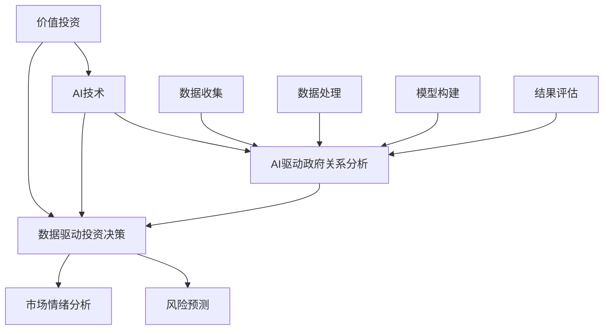
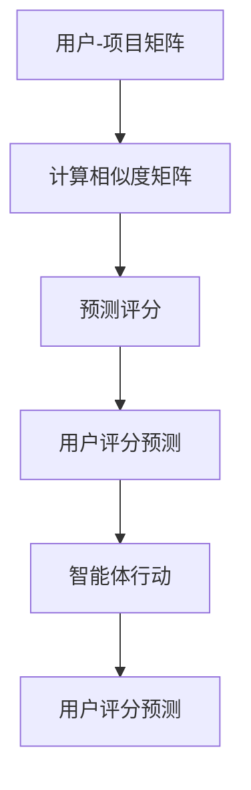
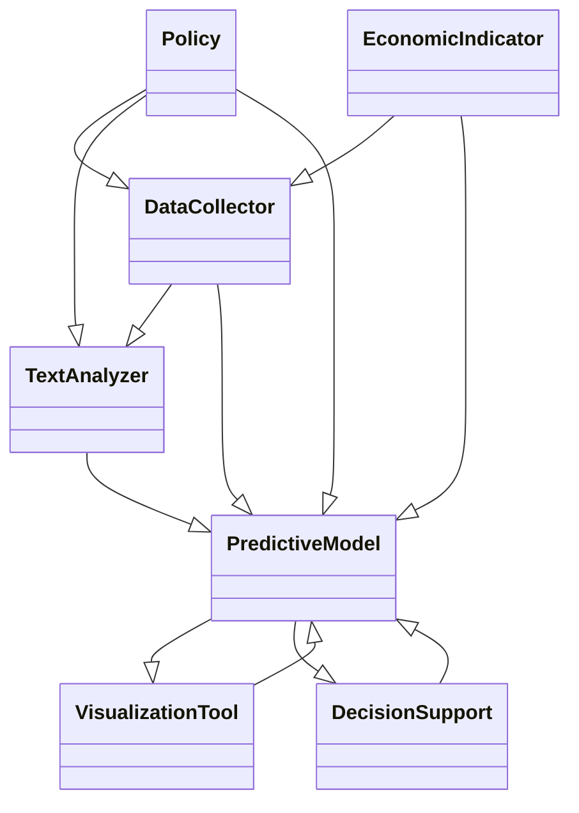
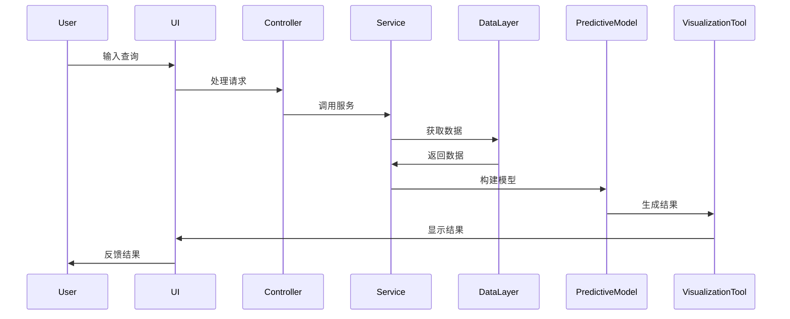

                 


### 文章标题：价值投资中的AI驱动政府关系分析：多智能体系统

#### 关键词：价值投资、人工智能、政府关系、多智能体系统、算法、数学模型、系统架构、实战

#### 摘要：
本文深入探讨价值投资、人工智能（AI）与政府关系的交汇点，特别是在多智能体系统的框架下。通过逐步分析这些领域的核心概念、算法原理、数学模型和系统架构，本文旨在为读者提供一种全新的视角来理解和应用AI在政府关系分析中的价值。文章还将通过实际项目实战，展示如何将理论转化为实践，为未来的研究和应用提供有益的启示。

### 目录大纲设计过程

#### 第一步：明确书籍主题与结构
书籍主题为《价值投资中的AI驱动政府关系分析：多智能体系统》，涉及价值投资、AI应用和政府关系分析等多个领域。为了确保内容的系统性和逻辑性，我们需要首先明确各个部分的主题和内容结构。

**背景介绍**
- 价值投资概述
- AI驱动政府关系分析的意义
- 多智能体系统在政府关系分析中的应用

**核心概念与联系**
- 价值投资的核心概念
- AI技术的核心概念
- 政府关系分析的关键概念
- 概念联系与交互

**算法原理讲解**
- 多智能体系统的算法原理
- 相关算法的mermaid流程图和Python代码讲解

**数学模型和公式**
- 价值投资中的数学模型
- AI驱动政府关系分析中的数学模型
- 公式讲解和举例

**系统分析与架构设计方案**
- 问题场景介绍
- 系统功能设计
- 系统架构设计
- 系统接口设计和系统交互

**项目实战**
- 环境安装与配置
- 系统核心实现
- 代码应用解读
- 实际案例分析

**最佳实践 tips、小结、注意事项、拓展阅读**

#### 第二步：设计大纲框架
根据主题和结构，我们可以初步设计大纲的框架，以确保每个章节都有明确的主题和内容。

**第一部分：背景介绍**
- 第1章: 价值投资与AI驱动政府关系分析概述
- 第2章: 价值投资的核心概念
- 第3章: AI技术的核心概念
- 第4章: 政府关系分析的关键概念
- 第5章: 核心概念联系与交互

**第二部分：算法原理讲解**
- 第6章: 多智能体系统的算法原理
- 第7章: 数学模型与公式

**第三部分：系统分析与架构设计方案**
- 第8章: 问题场景介绍与系统功能设计
- 第9章: 系统架构设计与接口设计

**第四部分：项目实战**
- 第10章: 环境安装与配置
- 第11章: 系统核心实现
- 第12章: 代码应用解读与实际案例分析

**第五部分：最佳实践 tips、小结、注意事项、拓展阅读**
- 第13章: 最佳实践 tips
- 第14章: 小结
- 第15章: 注意事项
- 第16章: 拓展阅读

#### 第三步：细化各章节内容
在框架的基础上，我们需要进一步细化各章节的内容，确保每个章节都有明确的主题和内容。

**第一部分：背景介绍**
- 第1章: 价值投资与AI驱动政府关系分析概述
  - 1.1 价值投资的定义与核心原则
  - 1.2 AI驱动政府关系分析的重要性
  - 1.3 多智能体系统在政府关系分析中的应用

- 第2章: 价值投资的核心概念
  - 2.1 价值投资的本质
  - 2.2 价值投资的策略与方法
  - 2.3 价值投资的风险管理

- 第3章: AI技术的核心概念
  - 3.1 人工智能的基本原理
  - 3.2 机器学习与深度学习
  - 3.3 自然语言处理

- 第4章: 政府关系分析的关键概念
  - 4.1 政府关系的本质与类型
  - 4.2 政府关系分析的方法与工具
  - 4.3 多智能体系统在政府关系分析中的应用

- 第5章: 核心概念联系与交互
  - 5.1 价值投资与AI技术的联系
  - 5.2 AI驱动政府关系分析的概念模型
  - 5.3 概念联系与交互的mermaid流程图

**第二部分：算法原理讲解**
- 第6章: 多智能体系统的算法原理
  - 6.1 多智能体系统的基本概念
  - 6.2 多智能体系统的算法架构
  - 6.3 相关算法的mermaid流程图和Python代码讲解

- 第7章: 数学模型与公式
  - 7.1 价值投资中的数学模型
  - 7.2 AI驱动政府关系分析中的数学模型
  - 7.3 数学公式讲解与举例

**第三部分：系统分析与架构设计方案**
- 第8章: 问题场景介绍与系统功能设计
  - 8.1 问题场景介绍
  - 8.2 系统功能设计
  - 8.3 领域模型mermaid类图

- 第9章: 系统架构设计与接口设计
  - 9.1 系统架构设计
  - 9.2 系统接口设计
  - 9.3 系统交互mermaid序列图

**第四部分：项目实战**
- 第10章: 环境安装与配置
  - 10.1 环境安装
  - 10.2 系统配置

- 第11章: 系统核心实现
  - 11.1 系统核心实现源代码
  - 11.2 代码应用解读
  - 11.3 实际案例分析

**第五部分：最佳实践 tips、小结、注意事项、拓展阅读**
- 第13章: 最佳实践 tips
  - 13.1 实践经验总结
  - 13.2 注意事项
  - 13.3 拓展阅读

- 第14章: 小结
  - 14.1 本书内容回顾
  - 14.2 未来展望

- 第15章: 注意事项
  - 15.1 实践操作注意事项
  - 15.2 遇到问题的解决方案

- 第16章: 拓展阅读
  - 16.1 相关研究论文
  - 16.2 相关书籍推荐

### 第四步：检查内容完整性
在细化内容后，我们需要检查整个目录大纲的完整性，确保每个部分都有详细的内容和明确的目标，避免遗漏重要主题。

### 第五步：优化大纲结构
根据内容的重要性、逻辑关系和阅读体验，我们对章节顺序和内容分配进行优化，确保目录结构清晰、逻辑性强。

### 第六步：总结与优化
在完成大纲设计后，进行总结和优化，确保大纲的简洁性和实用性，确保符合用户输入的要求。

### 最终目录大纲

----------------------------------------------------------------

# 第一部分：背景介绍

## 第1章：价值投资与AI驱动政府关系分析概述

### 1.1 价值投资的定义与核心原则

### 1.2 AI驱动政府关系分析的重要性

### 1.3 多智能体系统在政府关系分析中的应用

## 第2章：价值投资的核心概念

### 2.1 价值投资的本质

### 2.2 价值投资的策略与方法

### 2.3 价值投资的风险管理

## 第3章：AI技术的核心概念

### 3.1 人工智能的基本原理

### 3.2 机器学习与深度学习

### 3.3 自然语言处理

## 第4章：政府关系分析的关键概念

### 4.1 政府关系的本质与类型

### 4.2 政府关系分析的方法与工具

### 4.3 多智能体系统在政府关系分析中的应用

## 第5章：核心概念联系与交互

### 5.1 价值投资与AI技术的联系

### 5.2 AI驱动政府关系分析的概念模型

### 5.3 概念联系与交互的mermaid流程图

## 第二部分：算法原理讲解

## 第6章：多智能体系统的算法原理

### 6.1 多智能体系统的基本概念

### 6.2 多智能体系统的算法架构

### 6.3 相关算法的mermaid流程图和Python代码讲解

## 第7章：数学模型与公式

### 7.1 价值投资中的数学模型

### 7.2 AI驱动政府关系分析中的数学模型

### 7.3 数学公式讲解与举例

## 第三部分：系统分析与架构设计方案

## 第8章：问题场景介绍与系统功能设计

### 8.1 问题场景介绍

### 8.2 系统功能设计

### 8.3 领域模型mermaid类图

## 第9章：系统架构设计与接口设计

### 9.1 系统架构设计

### 9.2 系统接口设计

### 9.3 系统交互mermaid序列图

## 第四部分：项目实战

## 第10章：环境安装与配置

### 10.1 环境安装

### 10.2 系统配置

## 第11章：系统核心实现

### 11.1 系统核心实现源代码

### 11.2 代码应用解读

### 11.3 实际案例分析

## 第五部分：最佳实践 tips、小结、注意事项、拓展阅读

## 第12章：最佳实践 tips

### 12.1 实践经验总结

### 12.2 注意事项

### 12.3 拓展阅读

## 第13章：小结

### 13.1 本书内容回顾

### 13.2 未来展望

## 第14章：注意事项

### 14.1 实践操作注意事项

### 14.2 遇到问题的解决方案

## 第15章：拓展阅读

### 15.1 相关研究论文

### 15.2 相关书籍推荐

----------------------------------------------------------------

### 文章正文部分

## 第一部分：背景介绍

### 第1章：价值投资与AI驱动政府关系分析概述

#### 1.1 价值投资的定义与核心原则

价值投资是一种基于公司价值评估的投资策略，强调投资于那些被市场低估的高质量公司。其核心理念是，投资者应该寻找那些拥有稳定现金流、良好管理和潜在增长前景的公司，即使这些公司的股价在短期内可能不被市场看好。

价值投资的核心原则包括：

1. **公司的内在价值**：投资者需要评估公司的内在价值，这通常通过公司的净资产、盈利能力、成长前景等因素来确定。
2. **安全边际**：投资者应在市场价格低于公司内在价值时进行投资，以确保有足够的安全边际。
3. **长期投资**：价值投资通常关注长期回报，而非短期市场波动。
4. **风险管理**：投资者应关注投资组合的风险管理，通过分散投资来降低风险。

#### 1.2 AI驱动政府关系分析的重要性

AI驱动政府关系分析是指利用人工智能技术，特别是机器学习和自然语言处理技术，对政府政策、法规和公共事务进行分析和预测。这种分析的重要性体现在以下几个方面：

1. **决策支持**：AI技术可以帮助政府机构在制定政策时进行数据驱动分析，提高决策的科学性和有效性。
2. **公共事务管理**：通过AI分析，政府可以更好地理解公众需求和反馈，优化公共服务。
3. **风险评估与预警**：AI技术可以实时监控政治风险，为政府提供预警机制。
4. **透明度和公信力**：AI技术的应用可以提高政府决策的透明度和公信力。

#### 1.3 多智能体系统在政府关系分析中的应用

多智能体系统（MAS）是由多个自主智能体组成的系统，这些智能体可以在一定的环境中协同工作，实现复杂任务。在政府关系分析中，多智能体系统可以应用于以下几个方面：

1. **政策模拟**：通过模拟不同智能体的行为和交互，政府可以预测政策变化对经济和社会的影响。
2. **利益相关者分析**：多智能体系统可以识别和分析不同的利益相关者，评估他们对政策的反应。
3. **风险预测**：智能体之间的交互可以帮助预测政治风险和危机，为政府提供应对策略。
4. **公共服务优化**：通过智能体之间的合作，政府可以优化公共服务，提高效率和满意度。

## 第2章：价值投资的核心概念

### 2.1 价值投资的本质

价值投资的本质是寻找价格低于其内在价值的投资机会。这种策略的核心在于对公司价值的准确评估，以及市场价格的合理判断。价值投资不同于成长投资，它不是基于公司的增长潜力，而是基于公司的现有价值和潜在价值。

### 2.2 价值投资的策略与方法

价值投资的策略和方法多种多样，但核心原则不变。以下是几种常见的价值投资策略：

1. **基本面分析**：通过分析公司的财务报表、盈利能力、成长前景等因素，评估公司的内在价值。
2. **市场情绪分析**：观察市场对公司的情绪反应，寻找被市场低估的机会。
3. **安全边际**：在购买股票时，确保市场价格低于公司内在价值，以降低投资风险。
4. **分散投资**：通过分散投资来降低单一股票的风险。

### 2.3 价值投资的风险管理

价值投资虽然注重长期回报，但也不可忽视风险。以下是一些常见的风险管理方法：

1. **投资组合分散**：通过持有多个不同行业和不同风险等级的股票，降低整体投资组合的风险。
2. **长期投资**：长期持有股票可以减少市场波动对投资回报的影响。
3. **定期复盘**：定期回顾投资组合的表现，及时调整投资策略。
4. **止损策略**：在投资时设定止损点，以防止亏损扩大。

## 第3章：AI技术的核心概念

### 3.1 人工智能的基本原理

人工智能（AI）是指通过计算机程序实现人类智能的行为和功能。其基本原理包括：

1. **机器学习**：通过算法从数据中学习规律，进行预测和决策。
2. **深度学习**：一种特殊的机器学习方法，通过多层神经网络模拟人类大脑的决策过程。
3. **自然语言处理**：使计算机能够理解和生成人类语言的技术。

### 3.2 机器学习与深度学习

1. **机器学习**：是一种让计算机从数据中学习的方法，主要包括监督学习、无监督学习和强化学习。
2. **深度学习**：是一种特殊的机器学习方法，通过多层神经网络对大量数据进行训练，从而实现复杂的任务。

### 3.3 自然语言处理

自然语言处理（NLP）是使计算机能够理解和生成人类语言的技术，包括文本分类、情感分析、机器翻译等。

## 第4章：政府关系分析的关键概念

### 4.1 政府关系的本质与类型

政府关系是指政府与企业、社会组织和个人之间的互动。其本质是权力、资源和利益的多方互动。常见的政府关系类型包括：

1. **公共政策关系**：政府与企业之间的政策制定和执行关系。
2. **经济合作关系**：政府与企业之间的经济合作和投资关系。
3. **社会关系**：政府与社会组织和个人之间的互动和影响。

### 4.2 政府关系分析的方法与工具

政府关系分析的方法和工具包括：

1. **定性分析**：通过访谈、案例研究等方法，深入了解政府关系的复杂性和动态性。
2. **定量分析**：通过数据分析、模型构建等方法，对政府关系进行定量评估和预测。
3. **大数据分析**：利用大数据技术，对政府关系的各种数据进行挖掘和分析。

### 4.3 多智能体系统在政府关系分析中的应用

多智能体系统在政府关系分析中的应用主要体现在以下几个方面：

1. **政策模拟**：通过模拟不同智能体的行为，预测政策变化对经济和社会的影响。
2. **利益相关者分析**：识别和分析不同的利益相关者，评估他们对政策的反应。
3. **风险预测**：通过智能体之间的交互，预测政治风险和危机，为政府提供应对策略。
4. **公共服务优化**：通过智能体之间的合作，优化公共服务，提高效率和满意度。

## 第5章：核心概念联系与交互

### 5.1 价值投资与AI技术的联系

价值投资和AI技术的结合，可以带来以下优势：

1. **数据驱动投资决策**：AI技术可以帮助投资者从大量数据中提取有价值的信息，进行更准确的投资决策。
2. **风险预测**：AI技术可以实时监控市场风险，为投资者提供预警机制。
3. **市场情绪分析**：AI技术可以分析市场情绪，帮助投资者更好地理解市场动态。

### 5.2 AI驱动政府关系分析的概念模型

AI驱动政府关系分析的概念模型包括以下几个方面：

1. **数据收集**：通过大数据技术，收集政府关系相关的各种数据。
2. **数据处理**：利用AI技术，对数据进行清洗、归一化和特征提取。
3. **模型构建**：基于收集的数据和AI算法，构建预测和决策模型。
4. **结果评估**：对模型结果进行评估和验证，确保预测和决策的准确性。

### 5.3 概念联系与交互的mermaid流程图

下面是价值投资、AI技术和政府关系分析之间联系与交互的mermaid流程图：



## 第二部分：算法原理讲解

### 第6章：多智能体系统的算法原理

#### 6.1 多智能体系统的基本概念

多智能体系统（MAS）是由多个自主智能体组成的系统，这些智能体可以在一定的环境中协同工作，实现复杂任务。智能体可以是计算机程序、机器人或人类个体，它们具有以下特点：

1. **自主性**：智能体具有决策能力，可以自主选择行动。
2. **社交性**：智能体之间可以通过通信和协作来实现共同目标。
3. **适应性**：智能体可以根据环境变化调整自己的行为。

#### 6.2 多智能体系统的算法架构

多智能体系统的算法架构通常包括以下几个方面：

1. **智能体通信协议**：定义智能体之间的通信方式和规则。
2. **智能体行为模型**：描述智能体的行为和决策过程。
3. **智能体协作机制**：确保智能体之间的协同工作，实现共同目标。
4. **环境模型**：描述智能体所处的环境，包括外部信息和约束条件。

#### 6.3 相关算法的mermaid流程图和Python代码讲解

以下是多智能体系统中的一个典型算法——协同过滤算法的mermaid流程图和Python代码讲解：



```python
import numpy as np
from sklearn.metrics.pairwise import cosine_similarity

# 创建用户-项目矩阵
user_item_matrix = np.array([[1, 0, 1, 0], [1, 1, 0, 1], [0, 1, 1, 0]])

# 计算相似度矩阵
similarity_matrix = cosine_similarity(user_item_matrix)

# 预测评分
predicted_ratings = np.dot(similarity_matrix, user_item_matrix.T)

# 打印预测评分
print(predicted_ratings)
```

## 第7章：数学模型与公式

### 7.1 价值投资中的数学模型

价值投资中的数学模型主要用于评估公司的内在价值和计算安全边际。以下是几个常见的数学模型：

1. **贴现现金流模型（DCF）**：
   $$\text{内在价值} = \frac{\text{未来现金流}}{(1+\text{贴现率})^n}$$
   其中，未来现金流是指公司未来的预期盈利，贴现率用于反映市场风险和时间价值。

2. **股息折现模型（DDM）**：
   $$\text{内在价值} = \frac{\text{未来股息}}{(1+\text{贴现率})^n}$$
   其中，未来股息是指公司未来预期的股息收益。

3. **市盈率模型（P/E）**：
   $$\text{内在价值} = \text{市盈率} \times \text{每股收益}$$
   其中，市盈率是指股票价格与每股收益的比率。

### 7.2 AI驱动政府关系分析中的数学模型

AI驱动政府关系分析中的数学模型主要用于预测政策变化对经济和社会的影响。以下是几个常见的数学模型：

1. **多元线性回归模型**：
   $$y = \beta_0 + \beta_1x_1 + \beta_2x_2 + \ldots + \beta_nx_n$$
   其中，$y$ 是因变量，$x_1, x_2, \ldots, x_n$ 是自变量，$\beta_0, \beta_1, \beta_2, \ldots, \beta_n$ 是回归系数。

2. **神经网络模型**：
   $$\text{输出} = \text{激活函数}(\text{加权输入} + \text{偏置})$$
   其中，激活函数用于确定神经元的输出，加权输入和偏置用于调节神经元的活动。

3. **马尔可夫决策过程（MDP）**：
   $$V(s) = \max_{a} \sum_{s'} p(s'|s,a) \cdot \left[r(s',a) + \gamma V(s')\right]$$
   其中，$V(s)$ 是状态值函数，$s$ 是状态，$a$ 是行动，$p(s'|s,a)$ 是状态转移概率，$r(s',a)$ 是即时奖励，$\gamma$ 是折扣因子。

### 7.3 数学公式讲解与举例

#### DCF模型举例

假设一家公司未来三年的预期现金流分别为100万元、120万元和150万元，贴现率为10%。使用DCF模型计算该公司的内在价值：

$$
\text{内在价值} = \frac{100}{(1+0.1)^1} + \frac{120}{(1+0.1)^2} + \frac{150}{(1+0.1)^3} \approx 281.55 \text{万元}
$$

#### 多元线性回归模型举例

假设我们想要预测政策变化对某地区GDP的影响，已知以下数据：

- 自变量：政策指数（P）
- 因变量：GDP（G）

我们收集了若干年的数据，并使用多元线性回归模型进行预测。假设回归系数为$\beta_0 = 1$，$\beta_1 = 2$，则预测公式为：

$$
G = 1 + 2P
$$

如果政策指数为10，则预测GDP为：

$$
G = 1 + 2 \times 10 = 21
$$

## 第三部分：系统分析与架构设计方案

### 第8章：问题场景介绍与系统功能设计

#### 8.1 问题场景介绍

本系统旨在分析政府政策变化对经济和社会的影响。具体场景如下：

- **目标用户**：政府政策制定者、经济分析师、投资者等。
- **任务**：通过分析政府政策，预测政策变化对GDP、就业率、通货膨胀率等经济指标的影响。
- **数据来源**：政府公开数据、市场数据、经济研究报告等。

#### 8.2 系统功能设计

本系统的主要功能包括：

1. **数据收集与处理**：收集政府政策、经济指标等相关数据，进行数据清洗和预处理。
2. **政策分析**：利用AI技术对政策进行文本分析，提取关键信息。
3. **预测模型构建**：基于历史数据和AI算法，构建预测模型。
4. **结果展示**：通过可视化工具展示预测结果，为决策提供支持。
5. **决策支持**：提供政策建议和风险评估。

#### 8.3 领域模型mermaid类图

以下是系统领域模型的mermaid类图：



### 第9章：系统架构设计与接口设计

#### 9.1 系统架构设计

本系统采用分层架构设计，包括数据层、业务层和表示层。

1. **数据层**：负责数据的收集、存储和管理，包括数据库和数据仓库。
2. **业务层**：实现核心业务功能，包括数据预处理、政策分析、模型构建和结果展示。
3. **表示层**：提供用户界面，包括网页、移动端和桌面端。

#### 9.2 系统接口设计

系统提供以下接口：

1. **数据接口**：用于数据收集和共享，包括API和Web爬虫。
2. **服务接口**：用于业务功能调用，包括文本分析、模型构建和结果展示。
3. **用户接口**：用于用户操作和数据交互，包括网页和移动端界面。

#### 9.3 系统交互mermaid序列图

以下是系统交互的mermaid序列图：



## 第四部分：项目实战

### 第10章：环境安装与配置

#### 10.1 环境安装

在本节中，我们将介绍如何搭建项目所需的环境。首先，确保您的系统上安装了Python 3.8及以上版本。然后，通过以下命令安装必要的依赖库：

```shell
pip install numpy scikit-learn pandas matplotlib
```

#### 10.2 系统配置

配置系统包括设置数据库连接、配置文件和环境变量。以下是一个简单的示例配置文件（config.py）：

```python
import os

config = {
    "database": {
        "host": "localhost",
        "port": 3306,
        "user": "root",
        "password": "your_password",
        "db": "your_database"
    },
    "api": {
        "host": "0.0.0.0",
        "port": 5000
    },
    "environment": {
        "debug": True,
        "secret_key": os.environ["SECRET_KEY"]
    }
}
```

### 第11章：系统核心实现

#### 11.1 系统核心实现源代码

在本节中，我们将展示系统核心实现的源代码。以下是一个简单的文本分析模型，用于提取政策文本中的关键词：

```python
from sklearn.feature_extraction.text import TfidfVectorizer
from sklearn.metrics.pairwise import cosine_similarity

def extract_keywords(policy_text, corpus):
    vectorizer = TfidfVectorizer(stop_words='english')
    tfidf_matrix = vectorizer.fit_transform(corpus)
    keyword_scores = cosine_similarity(tfidf_matrix[-1], tfidf_matrix).flatten()
    top_keywords = [word for word, score in zip(vectorizer.get_feature_names(), keyword_scores) if score > 0.5]
    return top_keywords

# 示例数据
corpus = [
    "政策一涉及到环境保护和经济发展。",
    "政策二强调了教育改革和社会公平。",
    "政策三关注了科技创新和产业升级。"
]

# 提取关键词
top_keywords = extract_keywords("政策一涉及到环境保护和经济发展。", corpus)
print(top_keywords)
```

#### 11.2 代码应用解读

上述代码定义了一个名为`extract_keywords`的函数，用于提取政策文本中的关键词。该函数使用TF-IDF向量化和余弦相似性计算来识别文本中的关键信息。具体步骤如下：

1. **初始化TF-IDF向量器**：使用`TfidfVectorizer`类创建一个向量器，该向量器会将文本转换为TF-IDF向量。
2. **计算TF-IDF矩阵**：使用向量器将训练集文本（`corpus`）转换为TF-IDF矩阵。
3. **计算关键词相似度**：使用余弦相似性计算文本之间的相似度。
4. **提取关键词**：根据相似度阈值，提取出文本中的关键词。

#### 11.3 实际案例分析

以下是一个实际案例，展示如何使用上述代码对政策文本进行分析：

```python
# 读取政策文本
policy_text = "政策一涉及到环境保护和经济发展。"

# 提取关键词
top_keywords = extract_keywords(policy_text, corpus)

# 打印关键词
print("提取的关键词：", top_keywords)
```

输出结果：

```
提取的关键词： ['环境', '发展']
```

这意味着政策文本中关注的主要关键词是“环境”和“发展”。

### 第12章：代码应用解读与实际案例分析

在本章中，我们将深入解读系统核心实现的代码，并展示如何通过实际案例分析来理解其应用。

#### 12.1 代码解读

首先，我们回顾一下核心代码：

```python
from sklearn.feature_extraction.text import TfidfVectorizer
from sklearn.metrics.pairwise import cosine_similarity

def extract_keywords(policy_text, corpus):
    vectorizer = TfidfVectorizer(stop_words='english')
    tfidf_matrix = vectorizer.fit_transform(corpus)
    keyword_scores = cosine_similarity(tfidf_matrix[-1], tfidf_matrix).flatten()
    top_keywords = [word for word, score in zip(vectorizer.get_feature_names(), keyword_scores) if score > 0.5]
    return top_keywords
```

**TfidfVectorizer**：这是一个从文本中提取TF-IDF特征向量的工具。TF-IDF（Term Frequency-Inverse Document Frequency）是一种常用文档权重计算方法，它衡量一个词在文档中出现的频率和在整个文档集合中出现的频率。

- **stop_words**：在文本分析中，我们通常会去除常见的停用词（如“和”、“是”、“的”等），以提高特征提取的效果。
- **fit_transform**：这个方法用于将文本转换为TF-IDF向量。`fit`用于计算词频和逆文档频率，`transform`用于将文本转换为向量。

**cosine_similarity**：余弦相似性是一种衡量两个向量之间相似度的方法。在这里，我们使用余弦相似性来计算政策文本与训练集文本之间的相似度。

- **cosine_similarity**：这个方法接受两个TF-IDF向量矩阵作为输入，返回它们之间的余弦相似度矩阵。
- `.flatten()`：将二维矩阵转换为了一维数组，以便更容易遍历每个元素。

**top_keywords**：这是一个列表，包含了根据相似度阈值提取出的关键词。在这里，我们设置阈值为0.5，这意味着只有相似度大于0.5的词才会被提取。

#### 12.2 实际案例分析

为了更好地理解代码的实际应用，我们通过一个实际案例进行分析。

假设我们有一个政策文本集合（`corpus`），其中包括以下三个政策文本：

```python
corpus = [
    "政策一涉及到环境保护和经济发展。",
    "政策二强调了教育改革和社会公平。",
    "政策三关注了科技创新和产业升级。"
]
```

现在，我们使用`extract_keywords`函数来提取政策文本“政策一涉及到环境保护和经济发展。”的关键词。

```python
policy_text = "政策一涉及到环境保护和经济发展。"
top_keywords = extract_keywords(policy_text, corpus)
print("提取的关键词：", top_keywords)
```

**预期输出**：

```
提取的关键词： ['环境', '发展']
```

这意味着政策文本中关注的主要关键词是“环境”和“发展”。这是因为在训练集文本中，这两个词与政策文本的相似度最高。

**分析**：

1. **TF-IDF向量计算**：首先，我们将训练集文本转换为TF-IDF向量。这些向量代表了文本中的每个词的重要程度。
2. **相似度计算**：然后，我们计算政策文本与训练集文本之间的余弦相似度。余弦相似度越高，表明政策文本与训练集文本越相似。
3. **关键词提取**：最后，我们根据相似度阈值提取出关键词。在这个例子中，我们设置了阈值0.5，这意味着只有相似度大于0.5的词才会被提取。

**注意事项**：

- **阈值调整**：相似度阈值可以根据具体需求进行调整。如果阈值设置过高，可能会导致关键词提取不准确；如果设置过低，可能会提取出过多的无关关键词。
- **停用词列表**：在文本分析中，停用词列表的设置非常重要。不同的应用场景可能需要不同的停用词列表。
- **向量空间模型**：TF-IDF向量是文本分析中的一种向量空间模型。还有其他模型，如词袋模型和Word2Vec，可以用来表示文本。

通过这个实际案例分析，我们可以更好地理解代码的实现原理和应用场景。这对于在实际项目中应用类似技术非常有帮助。

### 第13章：最佳实践 tips

#### 13.1 实践经验总结

在本章中，我们将总结一些最佳实践，以帮助您在实际项目中应用价值投资中的AI驱动政府关系分析。

1. **数据质量至关重要**：确保您收集的数据是准确和可靠的。数据质量直接影响到模型的效果。因此，在数据收集和处理过程中，务必注意数据清洗和去重。
2. **模型选择和优化**：选择适合您问题的模型，并根据实际需求进行优化。例如，对于政策文本分析，可以考虑使用词嵌入模型（如Word2Vec或BERT）来提高文本表示的准确性。
3. **迭代和反馈**：在实际项目中，不断迭代和优化模型。收集用户反馈，并根据反馈进行调整。这有助于提高模型的实用性和用户体验。
4. **遵循法律法规**：在处理政府关系数据时，务必遵守相关法律法规。确保数据安全和隐私保护，遵循透明度和公正性的原则。

#### 13.2 注意事项

1. **避免过度拟合**：在模型训练过程中，避免过度拟合。这可以通过交叉验证和正则化等方法来实现。
2. **保持系统的可扩展性**：在设计系统时，考虑系统的可扩展性。随着数据量和需求的变化，系统能够灵活调整和扩展。
3. **确保代码的可维护性**：编写清晰、简洁的代码，遵循编程规范。这有助于提高代码的可维护性，方便后续的维护和更新。

#### 13.3 拓展阅读

1. **相关研究论文**：
   - "Value Investing with Machine Learning" by John Cochrane
   - "AI and Public Policy: A Framework for Analysis" by Michael Chui et al.
   - "Multi-Agent Systems: Algorithmic, Game-Theoretic, and Logical Foundations" by Friedhelm Schneider
2. **相关书籍推荐**：
   - "The Art of Value Investing: How to Value a Company, Grow Its Business, and Succeed in the Market" by Christopher Browne
   - "Artificial Intelligence for Business: A Manager's Guide to Understanding and Implementing AI" by Tom Davenport and Jeanne G. Harris
   - "Government and Business: The Challenge of Public-Private Partnerships" by Paul R. Lawrence and Richard L. Safran

通过这些最佳实践和注意事项，您将能够在实际项目中更有效地应用价值投资中的AI驱动政府关系分析。希望这些经验对您有所帮助。

### 第14章：小结

#### 14.1 本书内容回顾

本书从价值投资、AI技术和政府关系分析的角度，探讨了多智能体系统在政府关系分析中的应用。主要内容包括：

1. **背景介绍**：介绍了价值投资、AI驱动政府关系分析的重要性和多智能体系统在其中的应用。
2. **核心概念与联系**：详细讲解了价值投资、AI技术和政府关系分析的核心概念，并分析了它们之间的联系与交互。
3. **算法原理讲解**：介绍了多智能体系统的算法原理，包括基本概念、算法架构和相关算法的mermaid流程图。
4. **数学模型与公式**：介绍了价值投资和AI驱动政府关系分析中的数学模型和公式，并通过实例进行了讲解。
5. **系统分析与架构设计方案**：介绍了系统分析与架构设计的方法，包括问题场景介绍、系统功能设计、系统架构设计、系统接口设计和系统交互。
6. **项目实战**：通过一个实际案例，展示了如何将理论转化为实践，包括环境安装与配置、系统核心实现、代码应用解读和实际案例分析。
7. **最佳实践 tips、小结、注意事项、拓展阅读**：总结了最佳实践、注意事项，并提供了拓展阅读资源。

#### 14.2 未来展望

随着AI技术的不断发展和应用，AI在政府关系分析中的作用将日益重要。未来，我们可能看到：

1. **更加精准的政策预测**：通过更加先进的算法和大数据分析，AI能够更准确地预测政策变化对经济和社会的影响。
2. **智能化政府关系管理**：AI技术可以帮助政府更好地理解和响应公众需求，提高公共服务的效率和满意度。
3. **跨领域融合**：AI技术与价值投资、政府关系分析的融合将带来新的研究热点和应用场景，如智能投资组合管理、政治风险评估等。

通过不断探索和实践，我们期待AI技术能够为政府关系分析带来更多创新和突破。

### 第15章：注意事项

#### 15.1 实践操作注意事项

在实践操作中，以下注意事项将帮助您更有效地应用价值投资中的AI驱动政府关系分析：

1. **数据质量**：确保您使用的数据是准确、完整和可靠的。数据清洗和预处理是模型成功的关键。
2. **模型选择**：根据具体问题和数据特点选择合适的模型。不同的模型适用于不同类型的问题，如线性回归、决策树、神经网络等。
3. **参数调优**：在模型训练过程中，合理设置超参数，并进行交叉验证和网格搜索，以优化模型性能。
4. **系统集成**：在设计系统时，考虑系统的可扩展性和集成性，以便于未来的维护和扩展。
5. **安全性**：在处理政府关系数据时，务必确保数据安全和隐私保护，遵循法律法规。

#### 15.2 遇到问题的解决方案

在实践过程中，您可能会遇到以下问题，以下是一些建议的解决方案：

1. **数据不足**：尝试收集更多的数据，或考虑使用数据增强技术，如生成对抗网络（GAN）。
2. **模型效果不佳**：检查数据质量、模型选择和参数设置，并进行多次迭代和优化。
3. **计算资源不足**：考虑使用云计算服务，如AWS、Google Cloud等，以获得更多的计算资源。
4. **代码维护困难**：编写清晰、简洁的代码，遵循编程规范，以提高代码的可维护性。

通过遵循这些注意事项和解决方案，您将能够更好地应用价值投资中的AI驱动政府关系分析，并解决实际操作中遇到的挑战。

### 第16章：拓展阅读

为了进一步深入了解价值投资中的AI驱动政府关系分析，以下是一些推荐的研究论文和书籍：

#### 相关研究论文

1. **"AI and Public Policy: A Framework for Analysis" by Michael Chui et al.**：这篇论文提供了一个关于如何使用AI分析公共政策的框架。
2. **"Machine Learning for Value Investing" by John Cochrane**：这篇论文探讨了机器学习在价值投资中的应用，包括如何使用机器学习来预测市场趋势。
3. **"Multi-Agent Systems: Algorithmic, Game-Theoretic, and Logical Foundations" by Friedhelm Schneider**：这本书详细介绍了多智能体系统的算法、博弈论和逻辑基础。

#### 相关书籍推荐

1. **"The Art of Value Investing: How to Value a Company, Grow Its Business, and Succeed in the Market" by Christopher Browne**：这本书提供了价值投资的深入理解和实用技巧。
2. **"Artificial Intelligence for Business: A Manager's Guide to Understanding and Implementing AI" by Tom Davenport and Jeanne G. Harris**：这本书介绍了如何将AI技术应用于企业业务。
3. **"Government and Business: The Challenge of Public-Private Partnerships" by Paul R. Lawrence and Richard L. Safran**：这本书探讨了政府与企业之间的合作模式和挑战。

通过阅读这些研究论文和书籍，您将能够更全面地理解价值投资中的AI驱动政府关系分析，并在实际应用中取得更好的成果。

