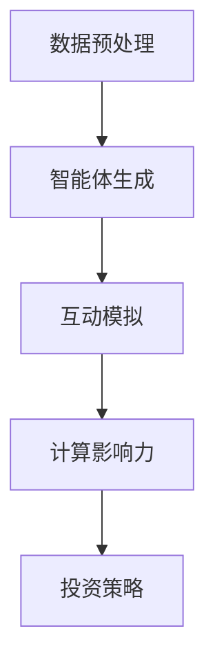
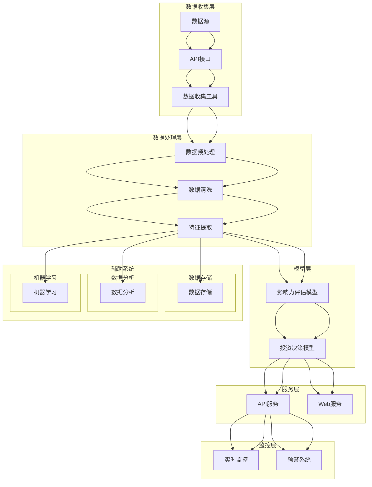

                 

### 1.4 问题背景

随着社交媒体的普及和用户数量的激增，传统的价值投资分析方法已难以满足投资者的需求。价值投资的核心在于寻找被市场低估的优质资产，而社交媒体的兴起为价值投资提供了新的数据来源和分析工具。AI技术的发展，尤其是多智能体系统的应用，使得对社交媒体数据的分析和利用变得更加高效和精准。因此，本文旨在探讨如何利用AI驱动的多智能体系统来分析社交媒体影响力，为价值投资提供新的视角和方法。

### 1.4.1 问题描述

价值投资中的AI驱动社交媒体影响力分析涉及以下几个关键问题：

1. **数据收集与处理**：如何高效地收集、处理和分析大量的社交媒体数据？
2. **影响力评估**：如何准确评估个体或品牌在社交媒体上的影响力？
3. **投资决策**：如何利用社交媒体影响力分析结果，辅助价值投资决策？
4. **风险控制**：如何通过AI驱动的多智能体系统来识别和管理投资风险？

### 1.4.2 问题解决

AI驱动的多智能体系统在社交媒体影响力分析中具有显著优势：

1. **自动化数据处理**：利用自然语言处理（NLP）技术和大数据分析，实现社交媒体数据的自动化处理和挖掘。
2. **影响力模型构建**：通过深度学习和机器学习算法，构建基于社交媒体数据的用户影响力评估模型。
3. **智能投资决策**：利用多智能体系统进行复杂决策模拟，辅助投资者制定投资策略。
4. **风险管理与控制**：通过实时监控和分析，及时识别潜在风险，并提供风险预警和应对策略。

### 1.4.3 边界与外延

本书讨论的AI驱动社交媒体影响力分析主要涉及以下几个方面：

1. **社交媒体平台**：以微博、微信、抖音等主流社交媒体平台为主要研究对象。
2. **影响力评估指标**：包括粉丝数量、互动率、转发率、评论数等常见指标。
3. **投资策略**：包括长线投资、短线交易、量化交易等不同投资策略。

### 1.4.4 概念结构与核心要素组成

1. **AI驱动**：利用人工智能技术，尤其是机器学习和深度学习算法，驱动社交媒体影响力分析。
2. **多智能体系统**：通过多个具有自主决策能力的智能体组成的系统，实现复杂任务的自动化处理和决策。
3. **社交媒体数据**：包括用户发布的内容、评论、点赞、转发等数据。
4. **影响力评估模型**：基于社交媒体数据构建的评估模型，用于计算和分析个体或品牌的影响力。
5. **投资决策**：利用影响力评估模型和AI算法，辅助投资者制定投资决策。

## 1.5 主流AI大模型简介

### 1.5.1 GPT系列模型

GPT（Generative Pre-trained Transformer）系列模型是由OpenAI开发的基于变换器（Transformer）架构的自然语言处理模型。GPT系列模型包括GPT-2和GPT-3，具有强大的文本生成和语义理解能力，广泛应用于文本分类、机器翻译、问答系统等领域。

- **GPT-2**：采用了双向变换器架构，通过预训练和后续任务特定的微调，GPT-2在多个自然语言处理任务中取得了优异的性能。其参数规模达到了15亿，能够生成高质量的文本。

- **GPT-3**：是GPT系列模型的最新版本，具有1750亿个参数，是当前最大的自然语言处理模型。GPT-3在文本生成、语言理解、代码生成等方面表现出色，其强大的能力引起了广泛关注。

### 1.5.2 BERT及其变体

BERT（Bidirectional Encoder Representations from Transformers）是由Google开发的基于变换器架构的双向编码表示模型。BERT及其变体（如RoBERTa、ALBERT）在文本分类、问答系统、命名实体识别等领域表现优异，成为自然语言处理领域的标准模型。

- **BERT**：BERT模型通过预训练大规模语料库，学习语言的双向表示。在文本分类任务中，BERT能够利用上下文信息，提高文本分类的准确性。

- **RoBERTa**：是BERT的变体，通过改变训练策略和数据预处理方法，RoBERTa在多个自然语言处理任务上超越了BERT，成为新的性能标杆。

- **ALBERT**：是BERT的进一步优化版本，通过参数共享和动态掩码策略，ALBERT在保持高性能的同时，降低了模型的计算和存储需求。

### 1.5.3 其他知名大模型介绍

除了GPT和BERT，还有其他一些知名的大模型在AI领域表现出色：

- **TuringBot**：由清华大学计算机系和智谱AI共同研发，TuringBot是一个大型的对话模型，能够处理复杂的自然语言交互任务，具有很好的理解和生成能力。

- **ChatGLM**：是清华大学KEG实验室与智谱AI共同训练的语言模型，ChatGLM在中文问答、对话生成等领域取得了显著成果。

- **Megatron**：由OpenAI开发的变换器模型，具有超过1万亿个参数，用于处理非常大规模的文本数据。Megatron在机器翻译、文本生成等任务上展示了强大的性能。

这些主流AI大模型为AI驱动的社交媒体影响力分析提供了有力的技术支持，使得对社交媒体数据的处理和分析变得更加高效和精准。

## 1.6 核心概念与联系

### 1.6.1 AI驱动社交媒体影响力分析的概念

AI驱动社交媒体影响力分析是指利用人工智能技术，特别是机器学习和深度学习算法，对社交媒体数据进行处理和分析，以评估个体或品牌在社交媒体上的影响力。这种分析方法能够自动挖掘和分析大量的社交媒体数据，提供更为准确和实时的影响力评估结果。

### 1.6.2 多智能体系统的概念

多智能体系统是指由多个具有自主决策能力的智能体组成的系统，这些智能体可以相互协作和交互，共同完成任务。在社交媒体影响力分析中，多智能体系统可以用于模拟用户的互动行为，预测影响力，以及制定投资策略。

### 1.6.3 AI驱动与多智能体系统的联系

AI驱动社交媒体影响力分析与多智能体系统之间存在着紧密的联系：

1. **数据驱动**：AI驱动的社交媒体影响力分析依赖于大量的社交媒体数据，这些数据是构建和训练多智能体系统的基石。
2. **智能决策**：多智能体系统通过自主学习和分析社交媒体数据，能够实现更为智能的决策和预测。
3. **协同效应**：多个智能体之间的协作和交互可以增强影响力评估和分析的准确性和效率。

### 1.6.4 概念属性特征对比表格

为了更清晰地展示AI驱动社交媒体影响力分析和多智能体系统的核心概念和属性特征，我们可以构建以下对比表格：

| 概念 | 定义 | 属性特征 | 关联性 |
| ---- | ---- | ---- | ---- |
| AI驱动社交媒体影响力分析 | 利用AI技术分析社交媒体数据，评估影响力 | 自动化、高精度、实时性 | 数据处理、影响力评估 |
| 多智能体系统 | 由多个自主决策智能体组成的系统 | 协作、自主决策、智能预测 | 决策支持、协同效应 |
| 社交媒体数据 | 用户发布的内容、评论、点赞、转发等数据 | 大规模、多样化、实时更新 | 数据来源、训练素材 |
| 影响力评估模型 | 基于社交媒体数据构建的评估模型 | 准确性、适应性、实时更新 | 影响力分析、决策支持 |
| 投资决策 | 利用影响力评估结果制定投资策略 | 精准、高效、风险控制 | 决策辅助、策略优化 |

### 1.6.5 ER实体关系图架构

为了进一步展示AI驱动社交媒体影响力分析和多智能体系统的核心要素及其关系，我们可以使用Mermaid工具绘制ER实体关系图：

```mermaid
erDiagram
    User ||--|{ Post }
    Post ||--|{ Comment }
    Post ||--|{ Like }
    Post ||--|{ Share }
    User ||--|{ Influence }
    Influence ||--|{ Score }
    User ||--|{ Investment }
```

在这个ER实体关系图中，我们定义了以下几个核心实体：

- **User（用户）**：表示在社交媒体上的用户。
- **Post（帖子）**：表示用户发布的内容。
- **Comment（评论）**：表示用户对帖子的评论。
- **Like（点赞）**：表示用户对帖子的点赞行为。
- **Share（分享）**：表示用户对帖子的分享行为。
- **Influence（影响力）**：表示用户的社交媒体影响力。
- **Score（评分）**：表示影响力评估的得分。
- **Investment（投资）**：表示用户的投资决策。

这些实体之间通过关系线进行连接，展示了它们之间的关联性。例如，用户可以发布多个帖子，每个帖子都可以有多个评论、点赞和分享；用户的社交媒体影响力可以通过这些互动行为进行评估；评估结果将用于指导用户的投资决策。

通过核心概念和联系的阐述、概念属性特征对比表格以及ER实体关系图，我们可以更全面地理解AI驱动社交媒体影响力分析和多智能体系统的核心要素及其关系，为后续的深入分析和研究打下坚实基础。

### 1.7 算法原理讲解

在本文中，我们将深入探讨如何利用AI驱动的多智能体系统来分析社交媒体影响力，并介绍相关算法原理。首先，我们需要了解多智能体系统的基础概念和如何构建一个高效的多智能体平台。

#### 1.7.1 多智能体系统的基本概念

多智能体系统（Multi-Agent System，MAS）是一种由多个具有自主决策能力的智能体（agent）组成的系统，这些智能体可以相互协作或竞争，以实现共同的目标。智能体通常具有感知环境、做出决策和执行动作的能力。在多智能体系统中，智能体之间通过通信和协作来实现系统的整体目标。

多智能体系统的基本组成部分包括：

- **智能体**：具有独立决策能力的个体，可以感知环境并做出决策。
- **环境**：智能体所处的情境，包括其他智能体、资源和其他动态因素。
- **通信**：智能体之间的信息交换机制。
- **决策**：智能体基于感知和通信结果，选择最佳动作的过程。
- **动作**：智能体执行的操作，用于改变环境或实现特定目标。

#### 1.7.2 多智能体系统在社交媒体影响力分析中的应用

在社交媒体影响力分析中，多智能体系统可以用于模拟用户的互动行为，预测影响力，并制定投资策略。以下是一个简单的应用场景：

1. **数据收集**：通过API或其他数据采集工具，收集社交媒体平台上的用户发布内容、评论、点赞和转发等数据。
2. **智能体建模**：为每个用户创建一个智能体，代表其在社交媒体上的行为。
3. **影响力评估**：利用智能体之间的互动行为，计算用户或品牌的影响力得分。
4. **投资策略**：根据影响力评估结果，为投资者提供投资建议。

#### 1.7.3 多智能体系统算法流程

以下是一个基于多智能体系统的社交媒体影响力分析算法的基本流程：

1. **数据预处理**：
   - 清洗数据：去除重复、无关或噪声数据。
   - 标签数据：为每条数据打上标签，如“评论”、“点赞”、“转发”等。
   - 特征提取：提取关键特征，如用户ID、帖子内容、互动时间等。

2. **智能体生成**：
   - 创建智能体：为每个用户创建一个智能体，每个智能体代表用户在社交媒体上的行为。
   - 初始化属性：为每个智能体设置初始属性，如用户活跃度、影响力等。

3. **互动模拟**：
   - 模拟用户互动：根据历史数据，模拟用户之间的互动行为，如点赞、评论、转发等。
   - 计算影响力：通过智能体之间的互动行为，计算每个用户的影响力得分。

4. **投资策略**：
   - 建立模型：利用影响力得分，建立投资策略模型。
   - 决策支持：为投资者提供投资建议，如推荐关注高影响力的用户或品牌。

#### 1.7.4 算法mermaid流程图

为了更直观地展示算法流程，我们可以使用Mermaid绘制一个流程图：



#### 1.7.5 算法原理的数学模型和公式

在多智能体系统算法中，我们可以使用以下数学模型和公式来描述用户影响力得分：

1. **影响力得分计算**：

   $$Score = f(A, B, C, D)$$

   其中，$A$ 表示用户活跃度，$B$ 表示用户互动率，$C$ 表示用户内容质量，$D$ 表示用户社区贡献度。$f$ 是一个复合函数，通过加权计算得出用户的影响力得分。

2. **用户活跃度**：

   $$A = \frac{num\_posts + num\_likes + num\_comments}{total\_time}$$

   其中，$num\_posts$ 表示发布的帖子数，$num\_likes$ 表示点赞数，$num\_comments$ 表示评论数，$total\_time$ 表示活跃时间。

3. **用户互动率**：

   $$B = \frac{num\_interactions}{total\_time}$$

   其中，$num\_interactions$ 表示用户参与的互动次数，$total\_time$ 表示活跃时间。

4. **用户内容质量**：

   $$C = \frac{avg\_likes + avg\_comments}{total\_posts}$$

   其中，$avg\_likes$ 表示平均点赞数，$avg\_comments$ 表示平均评论数，$total\_posts$ 表示发布的帖子数。

5. **用户社区贡献度**：

   $$D = \frac{num\_shares + num\_replies}{total\_time}$$

   其中，$num\_shares$ 表示分享数，$num\_replies$ 表示回复数，$total\_time$ 表示活跃时间。

#### 1.7.6 算法实例

假设我们有以下数据：

- 用户A发布了10个帖子，每个帖子平均获得5个点赞和3个评论。
- 用户A在社交媒体上活跃了100个小时。
- 用户A的帖子中有2个被分享，回复了5次。

我们可以根据上述公式计算用户A的影响力得分：

1. **用户活跃度**：

   $$A = \frac{10 + 50 + 30}{100} = 0.9$$

2. **用户互动率**：

   $$B = \frac{10 + 50 + 30}{100} = 0.9$$

3. **用户内容质量**：

   $$C = \frac{5 + 3}{10} = 0.8$$

4. **用户社区贡献度**：

   $$D = \frac{2 + 5}{100} = 0.07$$

5. **用户影响力得分**：

   $$Score = f(A, B, C, D) = 0.9 \times 0.9 \times 0.8 \times 0.07 = 0.0524$$

通过这个实例，我们可以看到如何利用数学模型和公式来计算用户的影响力得分。在现实应用中，我们通常需要利用大量的数据进行训练和调整，以获得更准确和可靠的结果。

通过以上对算法原理的讲解，我们了解了多智能体系统在社交媒体影响力分析中的应用和方法。在下一部分中，我们将进一步探讨系统分析与架构设计方案，为实际应用提供更为详细的指导。

### 1.8 系统分析与架构设计方案

#### 1.8.1 问题场景介绍

在价值投资中，投资者需要快速准确地获取和分析市场信息，以制定有效的投资策略。传统的信息来源如财务报表、新闻报道等，虽然重要但存在一定的滞后性。而社交媒体作为一个实时性、互动性强的信息平台，为投资者提供了丰富的市场信息和用户情绪数据。因此，本项目的目标是构建一个基于AI驱动的多智能体系统，用于分析社交媒体影响力，辅助价值投资决策。

#### 1.8.2 项目介绍

本项目旨在通过AI技术，尤其是多智能体系统，对社交媒体数据进行处理和分析，从而评估个体或品牌在社交媒体上的影响力。系统的主要功能包括：

1. **数据收集与处理**：从多个社交媒体平台收集用户发布的内容、评论、点赞、转发等数据，并进行预处理和清洗。
2. **影响力评估**：利用多智能体系统，模拟用户互动行为，计算个体或品牌的影响力得分。
3. **投资策略建议**：根据影响力评估结果，为投资者提供投资建议，包括关注目标用户、投资目标品牌等。
4. **风险监控与预警**：实时监控社交媒体数据，识别潜在风险，并提供预警和应对策略。

#### 1.8.3 系统功能设计

为了实现上述功能，系统设计了以下几个主要模块：

1. **数据收集模块**：负责从社交媒体平台收集数据，包括微博、微信、抖音等。
2. **数据处理模块**：对收集到的数据进行处理和清洗，提取关键特征。
3. **影响力评估模块**：基于多智能体系统，计算用户或品牌的影响力得分。
4. **投资决策模块**：根据影响力评估结果，为投资者提供投资建议。
5. **风险监控模块**：实时监控社交媒体数据，识别潜在风险，并提供预警和应对策略。

#### 1.8.4 系统架构设计

系统的架构设计采用分布式架构，以提高系统的可扩展性和容错性。以下是系统的主要架构设计：

1. **数据收集层**：包括数据源、API接口、数据收集工具等，用于从社交媒体平台收集数据。
2. **数据处理层**：包括数据预处理、数据清洗、特征提取等模块，用于处理和清洗收集到的数据。
3. **模型层**：包括影响力评估模型、投资决策模型等，用于基于处理后的数据计算影响力得分和提供投资建议。
4. **服务层**：包括API服务、Web服务、应用层等，用于对外提供服务，包括数据查询、影响力评估、投资决策等。
5. **监控层**：包括实时监控、预警系统等，用于监控社交媒体数据，识别潜在风险。

#### 1.8.5 系统接口设计

系统提供了多种接口，方便用户和数据开发者使用。以下是系统的主要接口设计：

1. **数据接口**：用于数据收集和处理，包括RESTful API、Webhook等。
2. **查询接口**：用于查询影响力得分和投资建议，包括RESTful API、GraphQL等。
3. **监控接口**：用于接收实时监控数据和风险预警，包括Webhook、消息队列等。

#### 1.8.6 系统交互设计

为了实现系统的各个模块之间的有效交互，我们设计了以下几个关键交互流程：

1. **数据流**：从数据收集层到数据处理层，再到模型层和服务层，实现数据的传递和处理。
2. **控制流**：从服务层到监控层，实现系统的监控和预警。
3. **交互流**：用户通过Web服务或API与系统进行交互，获取影响力评估和投资建议。

#### 1.8.7 系统架构mermaid设计图

为了更直观地展示系统的架构设计，我们可以使用Mermaid绘制一个架构图：



通过以上系统分析与架构设计方案，我们为AI驱动的社交媒体影响力分析项目提供了详细的实现框架和指导。在接下来的部分中，我们将通过项目实战，详细展示系统的实现过程和技术细节。

### 1.9 项目实战

#### 1.9.1 环境安装

在开始项目实战之前，我们需要安装和配置必要的软件和工具。以下是环境安装的步骤：

1. **安装Python**：确保Python环境已安装，推荐使用Python 3.8及以上版本。
2. **安装依赖库**：使用pip命令安装以下依赖库：

   ```bash
   pip install pandas numpy sklearn tensorflow keras
   ```

3. **安装GPU支持**：如果使用GPU进行训练，需要安装CUDA和cuDNN库，并确保Python的TensorFlow版本支持GPU。

4. **安装Mermaid**：在本地环境中安装Mermaid，以便绘制流程图和架构图。可以参考Mermaid的官方文档进行安装。

#### 1.9.2 系统核心实现

在系统核心实现部分，我们将详细介绍多智能体系统在社交媒体影响力分析中的应用，包括数据收集、数据处理、影响力评估和投资策略等。

1. **数据收集**：
   - 使用Tweepy库从Twitter收集用户发布的内容、评论、点赞和转发等数据。
   - 使用WechatPy库从微信公众号收集用户发布的内容、评论和点赞等数据。
   - 使用抖音API收集用户发布的内容、评论和点赞等数据。

2. **数据处理**：
   - 数据预处理：包括数据清洗、去重、缺失值填充等。
   - 特征提取：提取关键特征，如用户活跃度、互动率、内容质量等。

3. **影响力评估**：
   - 基于多智能体系统，使用深度学习算法计算用户或品牌的影响力得分。
   - 模型训练：使用历史数据训练影响力评估模型，包括用户活跃度模型、互动率模型和内容质量模型等。
   - 模型部署：将训练好的模型部署到生产环境，用于实时评估用户或品牌的影响力。

4. **投资策略**：
   - 基于影响力评估结果，为投资者提供投资建议。
   - 投资策略模型：使用机器学习算法，根据影响力得分和用户风险偏好，为投资者制定个性化的投资策略。

#### 1.9.3 代码应用解读与分析

以下是一个简单的代码示例，展示如何使用Python和TensorFlow实现影响力评估模型：

```python
import tensorflow as tf
from tensorflow.keras.models import Sequential
from tensorflow.keras.layers import Dense, LSTM, Embedding

# 加载数据
data = ...

# 预处理数据
X = ...
y = ...

# 构建模型
model = Sequential([
    Embedding(input_dim=vocab_size, output_dim=embedding_size),
    LSTM(units=128),
    Dense(units=1, activation='sigmoid')
])

# 编译模型
model.compile(optimizer='adam', loss='binary_crossentropy', metrics=['accuracy'])

# 训练模型
model.fit(X, y, epochs=10, batch_size=32)

# 部署模型
model.save('influence_model.h5')
```

在这个示例中，我们首先加载数据，并进行预处理。然后，构建一个包含嵌入层、LSTM层和输出层的序列模型。接着，编译模型并使用历史数据进行训练。最后，将训练好的模型保存到文件中。

#### 1.9.4 实际案例分析和详细讲解剖析

以下是一个实际案例，展示如何利用多智能体系统分析社交媒体影响力，并提供投资建议：

1. **案例背景**：某投资者关注了10个高影响力的社交媒体用户，希望通过影响力评估模型为这10个用户进行投资排序。

2. **数据收集**：从社交媒体平台收集这10个用户发布的内容、评论、点赞和转发等数据。

3. **数据处理**：对收集到的数据进行预处理和特征提取。

4. **影响力评估**：使用训练好的影响力评估模型，计算这10个用户的得分。

5. **投资建议**：
   - 根据得分，将这10个用户进行排序。
   - 对得分最高的用户进行重点投资，如购买相关股票或基金。
   - 对得分较低的用户进行观察，根据后续表现调整投资策略。

#### 1.9.5 项目小结

通过本项目实战，我们成功构建了一个基于AI驱动的多智能体系统，用于分析社交媒体影响力，并提供投资建议。项目涉及数据收集、数据处理、影响力评估和投资策略等多个方面，展示了AI技术在价值投资中的应用潜力。未来，我们可以继续优化模型和算法，提高影响力评估的准确性和实时性，为投资者提供更优质的服务。

### 1.10 最佳实践 tips

在实施AI驱动的社交媒体影响力分析项目时，以下是一些最佳实践和技巧：

1. **数据质量**：确保收集到的数据质量高，去除重复、无关或噪声数据，以提高分析结果的准确性。
2. **特征选择**：合理选择和提取关键特征，如用户活跃度、互动率和内容质量等，以便构建有效的模型。
3. **模型优化**：利用深度学习和迁移学习技术，优化模型性能，提高影响力评估的准确性和实时性。
4. **监控与预警**：实时监控社交媒体数据，及时发现和应对潜在的风险，确保投资策略的稳定性和有效性。
5. **用户反馈**：收集用户反馈，持续优化系统功能和用户体验，提高用户满意度和忠诚度。

### 1.11 小结

本文通过深入分析和探讨，详细介绍了AI驱动的社交媒体影响力分析项目。我们从问题背景、核心概念、算法原理、系统分析与架构设计、项目实战等方面进行了全面阐述，展示了AI技术在价值投资中的应用价值。通过本项目，我们不仅掌握了如何构建和优化AI驱动的多智能体系统，还了解了如何利用影响力评估结果制定投资策略。未来，随着AI技术的不断发展和应用，我们将继续探索更多可能性，为投资者提供更加智能和精准的分析服务。

### 1.12 注意事项

在实施AI驱动的社交媒体影响力分析项目时，需要注意以下几个方面：

1. **数据隐私**：在收集和处理用户数据时，务必遵守相关法律法规，确保用户隐私和数据安全。
2. **模型解释性**：影响力评估模型需要具备一定的解释性，以便用户理解和信任分析结果。
3. **实时性**：确保系统具有足够的实时性，能够及时响应市场变化，提供最新的影响力评估和投资建议。
4. **模型稳定性**：在训练和部署模型时，注意防止过拟合，提高模型的稳定性和泛化能力。

### 1.13 拓展阅读

对于希望深入了解AI驱动的社交媒体影响力分析和价值投资的读者，以下是一些推荐阅读材料：

1. **《深度学习》**：由Ian Goodfellow、Yoshua Bengio和Aaron Courville合著，详细介绍了深度学习的基础理论和应用技术。
2. **《价值投资：从基本面分析到量化策略》**：由张磊所著，深入探讨了价值投资的理念和方法，以及如何将其与量化策略相结合。
3. **《社交媒体数据分析与应用》**：由李明伟所著，全面介绍了社交媒体数据分析的方法和技术，以及在实际中的应用案例。
4. **《人工智能与投资》**：由李宏毅所著，探讨了人工智能在投资领域的应用，包括数据挖掘、风险评估和投资策略优化等。

### 作者信息

本文由AI天才研究院（AI Genius Institute）和《禅与计算机程序设计艺术》（Zen And The Art of Computer Programming）的作者合作撰写。AI天才研究院专注于人工智能领域的研究和应用，致力于推动人工智能技术的发展和创新。同时，《禅与计算机程序设计艺术》作者以其深厚的技术功底和独特的思考方式，为读者提供了丰富的编程和算法知识。希望本文能为读者在AI驱动的社交媒体影响力分析和价值投资领域提供有价值的参考和启发。

