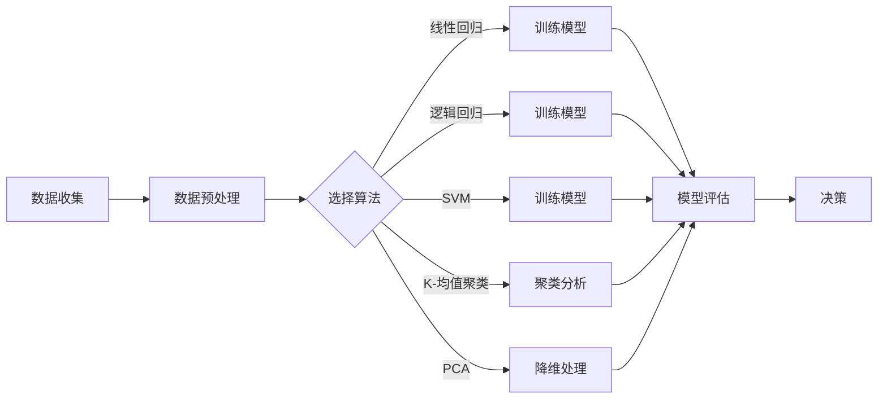
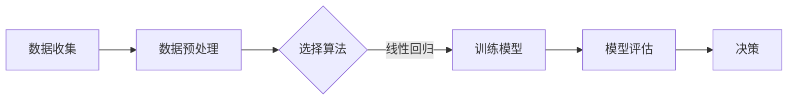
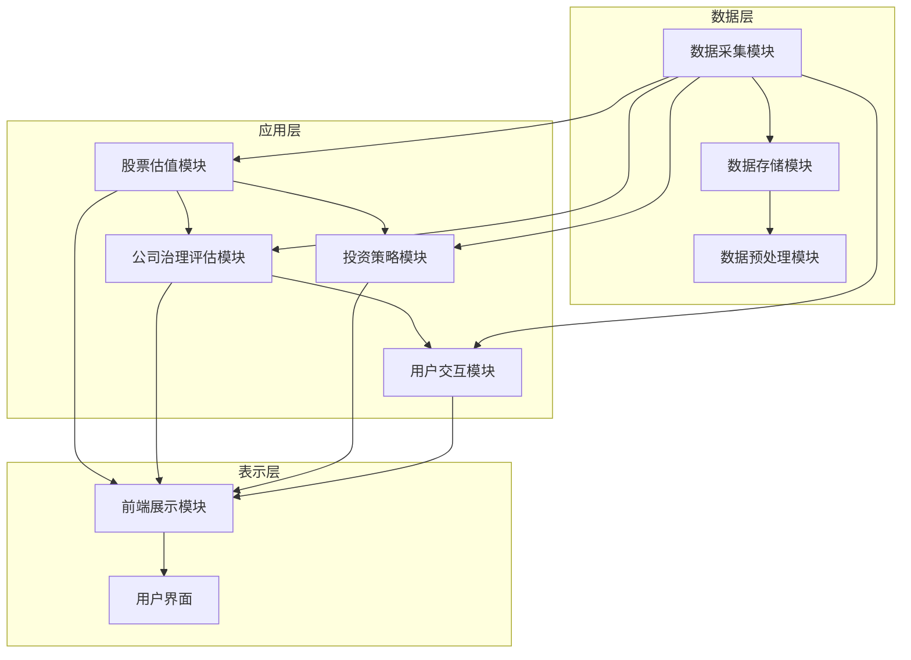
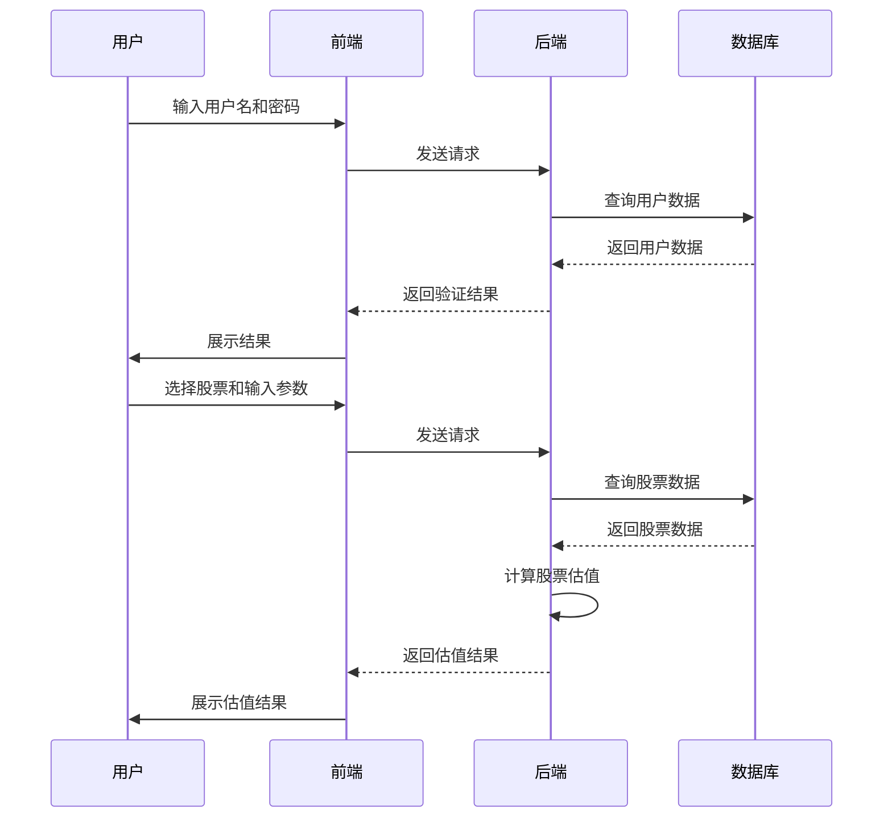

                 

# 《价值投资中的公司治理考量》

关键词：价值投资、公司治理、股票估值、机器学习、系统架构设计

摘要：本文深入探讨了价值投资中的公司治理考量。首先，我们介绍了价值投资与公司治理的基本概念及其关系，分析了两者之间的互动影响。接着，我们解析了价值投资中的核心概念，包括股票估值方法、心理因素，以及公司治理的核心原则和关键指标。随后，我们详细讲解了基于机器学习的公司治理评估算法原理及其Python代码实现。最后，我们提出了价值投资与公司治理系统的整体架构设计，并分析了系统的功能需求、性能要求、安全性设计等。本文旨在为投资者提供一套科学、系统的价值投资策略，并强调公司治理在其中的重要性。

### 目录大纲

----------------------------------------------------------------

## 第一部分：背景介绍

## 第1章：价值投资与公司治理概述

### 1.1 价值投资的概念与原理

#### 1.1.1 价值投资的定义

#### 1.1.2 价值投资的三大原则

#### 1.1.3 价值投资与传统投资方式的对比

### 1.2 公司治理的概念与重要性

#### 1.2.1 公司治理的定义

#### 1.2.2 公司治理的构成要素

#### 1.2.3 公司治理的重要性

### 1.3 价值投资与公司治理的关系

#### 1.3.1 价值投资对良好公司治理的需求

#### 1.3.2 良好公司治理对价值投资的影响

#### 1.3.3 公司治理问题的案例分析

## 第二部分：核心概念与联系

## 第2章：价值投资中的核心概念解析

### 2.1 价值投资的核心概念

#### 2.1.1 价值投资的评估方法

##### 2.1.1.1 股票估值的基本模型

##### 2.1.1.2 折现现金流模型（DCF）的应用

##### 2.1.1.3 价格与价值的关系

#### 2.1.2 价值投资的心理因素

##### 2.1.2.1 恐惧与贪婪

##### 2.1.2.2 长期视角与短期行为

### 2.2 公司治理的核心概念

#### 2.2.1 公司治理的核心原则

##### 2.2.1.1 股东权益保护

##### 2.2.1.2 管理层责任

##### 2.2.1.3 信息透明度

#### 2.2.2 公司治理的关键指标

##### 2.2.2.1 盈利能力指标

##### 2.2.2.2 管理效率指标

##### 2.2.2.3 财务稳健性指标

## 第三部分：算法原理讲解

## 第3章：公司治理评估算法原理与应用

### 3.1 公司治理评估方法概述

#### 3.1.1 公司治理评估的重要性

#### 3.1.2 公司治理评估的基本方法

##### 3.1.2.1 问卷调查法

##### 3.1.2.2 数据分析法

##### 3.1.2.3 竞争对手评估法

### 3.2 基于机器学习的公司治理评估算法

#### 3.2.1 机器学习在公司治理评估中的应用

##### 3.2.1.1 机器学习的基本原理

##### 3.2.1.2 常见的机器学习算法

#### 3.2.2 公司治理评估的mermaid流程图

##### 3.2.2.1 数据预处理

##### 3.2.2.2 特征工程

##### 3.2.2.3 模型训练与评估

### 3.3 Python代码实现与算法原理讲解

#### 3.3.1 Python环境安装与配置

##### 3.3.1.1 Python基础操作

##### 3.3.1.2 Python常用库安装

#### 3.3.2 算法原理详细讲解

##### 3.3.2.1 数学模型与公式

##### 3.3.2.2 算法流程图

##### 3.3.2.3 代码实现与举例说明

## 第四部分：系统分析与架构设计方案

## 第4章：价值投资与公司治理系统架构设计

### 4.1 价值投资与公司治理系统的需求分析

#### 4.1.1 系统功能需求

##### 4.1.1.1 股票数据收集与分析

##### 4.1.1.2 公司治理信息收集与分析

##### 4.1.1.3 投资策略模拟与优化

#### 4.1.2 系统非功能需求

##### 4.1.2.1 系统性能要求

##### 4.1.2.2 系统安全性与稳定性

### 4.2 价值投资与公司治理系统的架构设计

#### 4.2.1 系统架构设计原则

##### 4.2.1.1 分层架构设计

##### 4.2.1.2 模块化设计

##### 4.2.1.3 扩展性设计

#### 4.2.2 系统架构设计mermaid架构图

##### 4.2.2.1 数据层架构

##### 4.2.2.2 应用层架构

##### 4.2.2.3 表示层架构

### 4.3 系统接口设计

#### 4.3.1 接口设计原则

##### 4.3.1.1 接口规范性

##### 4.3.1.2 接口安全性

##### 4.3.1.3 接口可扩展性

#### 4.3.2 系统接口设计示例

##### 4.3.2.1 数据接口设计

##### 4.3.2.2 功能接口设计

### 4.4 系统交互设计

#### 4.4.1 系统交互设计原则

##### 4.4.1.1 用户友好性

----------------------------------------------------------------

### 1.1 价值投资的概念与原理

#### 1.1.1 价值投资的定义

价值投资（Value Investing）是一种基于对公司基本面的深入分析，以长期持有为目标，寻找被市场低估的股票的投资策略。它由著名的投资大师本杰明·格雷厄姆（Benjamin Graham）创立，并得到沃伦·巴菲特（Warren Buffett）等人的传承与发展。价值投资的核心思想是：投资者的目标是寻找那些市场价格低于其内在价值的股票，通过长期持有，待市场价格逐渐回归内在价值时，实现投资收益。

#### 1.1.2 价值投资的三大原则

价值投资遵循三大原则，即：

1. **安全性原则**：投资者应选择财务稳健、经营稳定的公司，避免投资高风险股票。
2. **市场效率原则**：市场并非总是有效的，投资者可以通过深入分析和研究，发现市场价格与股票真实价值之间的差异，从而获得投资机会。
3. **长期投资原则**：价值投资注重长期投资，投资者应在市场波动中保持冷静，坚定持有优质股票，等待市场价格的回归。

#### 1.1.3 价值投资与传统投资方式的对比

与传统投资方式相比，价值投资具有以下几个特点：

1. **投资策略**：价值投资侧重于基本面分析，而传统投资方式则更倾向于技术分析或市场情绪。
2. **持有期限**：价值投资通常要求投资者长期持有股票，而传统投资方式则更倾向于短期交易。
3. **收益预期**：价值投资追求稳健的长期收益，而传统投资方式则更看重短期收益。

#### 1.1.4 价值投资与传统投资方式的优缺点分析

**价值投资的优点**：

- **稳健性**：通过深入分析公司基本面，投资者可以避免投资高风险的股票，实现稳健收益。
- **长期视角**：价值投资强调长期持有，能够有效降低市场波动带来的风险。
- **投资效率**：价值投资能够提高投资决策的科学性和有效性。

**价值投资的缺点**：

- **研究成本**：价值投资需要对公司基本面进行深入研究，需要投入较多的时间和精力。
- **投资门槛**：价值投资通常要求投资者有较强的财务知识和分析能力，投资门槛较高。
- **市场适应性**：在市场环境急剧变化时，价值投资策略可能无法快速适应，导致投资收益受到影响。

### 1.2 公司治理的概念与重要性

#### 1.2.1 公司治理的定义

公司治理（Corporate Governance）是指公司内部的管理机制和外部监管机制的总和，旨在确保公司管理的合法合规性、透明度和效率，保护股东和其他利益相关者的权益。

#### 1.2.2 公司治理的构成要素

公司治理包括以下几个主要构成要素：

1. **董事会**：董事会是公司治理的核心机构，负责制定公司战略、监控管理层和确保公司运营的合规性。
2. **管理层**：管理层负责公司的日常运营，执行董事会的决策，并对公司的财务状况和运营成果负责。
3. **股东**：股东是公司的所有者，拥有投票权和股息分配权，通过股东大会参与公司的决策。
4. **监事会**：监事会是公司治理的重要监督机构，负责监督董事会的决策和管理层的运营，保护股东权益。
5. **信息披露制度**：公司治理要求公司定期披露财务和经营信息，提高透明度，便于投资者和其他利益相关者了解公司情况。

#### 1.2.3 公司治理的重要性

良好的公司治理对公司和投资者都具有重要意义：

1. **提高公司价值**：良好的公司治理能够提高公司管理效率，降低运营成本，增强公司竞争力，从而提高公司价值。
2. **保护股东权益**：公司治理制度确保股东权益得到保护，防止管理层滥用权力，避免利益冲突，提高股东的信心和投资回报。
3. **增强市场信心**：良好的公司治理能够提高公司透明度和合规性，增强投资者对公司的信任，吸引更多投资者参与，提高市场流动性。

### 1.3 价值投资与公司治理的关系

#### 1.3.1 价值投资对良好公司治理的需求

价值投资要求投资者对公司基本面进行深入分析，而良好的公司治理是实现这一目标的重要保障。以下是价值投资对良好公司治理的需求：

1. **透明度**：良好的公司治理要求公司信息披露透明，投资者能够获取准确、完整的公司信息，从而做出合理的投资决策。
2. **监督机制**：公司治理中的董事会和监事会等机构应发挥有效的监督作用，防止管理层滥用权力，确保公司运营的合规性和透明度。
3. **财务稳健性**：价值投资重视公司的财务状况，良好的公司治理能够提高公司财务稳健性，减少投资风险。

#### 1.3.2 良好公司治理对价值投资的影响

良好的公司治理对价值投资具有积极影响：

1. **提升投资回报**：良好的公司治理能够提高公司管理效率，降低运营成本，增强公司竞争力，从而提高公司价值，为投资者带来更高的回报。
2. **降低投资风险**：良好的公司治理能够提高公司透明度和合规性，减少信息不对称，降低投资者面临的道德风险和操作风险。
3. **增强投资者信心**：良好的公司治理能够提高公司透明度和合规性，增强投资者对公司的信任，吸引更多投资者参与，提高市场流动性。

#### 1.3.3 公司治理问题的案例分析

以下是一个公司治理问题的案例分析：

**案例背景**：某公司因董事会和管理层之间的利益冲突，导致公司治理出现问题。董事会频繁变更，管理层缺乏稳定，公司战略方向不明确，信息披露不透明。

**案例分析**：

1. **问题表现**：公司治理问题导致公司运营效率低下，财务状况恶化，股价波动加剧，投资者信心受挫。
2. **影响分析**：公司治理问题降低了公司价值，投资者面临较高的投资风险，市场信心下降，公司难以吸引外部投资。
3. **解决措施**：公司应加强董事会建设，明确董事会和管理层的职责，建立有效的监督机制，提高信息披露透明度，改善公司治理。

### 结论

本文介绍了价值投资与公司治理的基本概念和关系，分析了两者之间的互动影响。良好的公司治理对价值投资具有重要意义，能够提高投资回报、降低投资风险和增强投资者信心。投资者应重视公司治理，将其作为价值投资决策的重要参考。同时，公司也应积极改善公司治理，提高管理效率，增强市场竞争力。

作者：AI天才研究院/AI Genius Institute & 禅与计算机程序设计艺术 /Zen And The Art of Computer Programming

## 第二部分：核心概念与联系

### 2.1 价值投资的核心概念解析

#### 2.1.1 价值投资的评估方法

价值投资的关键在于对公司价值的准确评估，从而确定其股票是否被市场低估。以下是几种常用的价值投资评估方法：

##### 2.1.1.1 股票估值的基本模型

股票估值的基本模型包括市盈率（P/E）、市净率（P/B）和股息率（Dividend Yield）等。

- **市盈率（P/E）**：市盈率是公司市值与净利润的比值。较低的市盈率通常表明股票被低估，具有投资价值。
  $$ P/E = \frac{市值}{净利润} $$
- **市净率（P/B）**：市净率是公司市值与净资产的比值。较低的市净率通常表明股票被低估，具有投资价值。
  $$ P/B = \frac{市值}{净资产} $$
- **股息率（Dividend Yield）**：股息率是公司年度股息与股票市价的比值。较高的股息率通常表明公司有稳健的盈利能力和分红能力。

##### 2.1.1.2 折现现金流模型（DCF）的应用

折现现金流模型（Discounted Cash Flow，DCF）是评估公司价值的一种重要方法。DCF模型基于公司未来的自由现金流（Free Cash Flow，FCF），通过折现计算得出公司当前的内在价值。

$$ \text{公司价值} = \sum_{t=1}^{n} \frac{FCF_t}{(1+r)^t} $$

其中，$FCF_t$为第$t$年的自由现金流，$r$为折现率。折现率通常取资本成本或加权平均资本成本（WACC）。

##### 2.1.1.3 价格与价值的关系

价值投资的核心是寻找市场价格与股票内在价值之间的差异。当市场价格低于内在价值时，股票被认为被低估，具有投资价值。

$$ \text{内在价值} > \text{市场价格} $$

这种差异反映了市场对公司未来盈利能力的错误评估，为投资者提供了潜在的投资机会。

#### 2.1.2 价值投资的心理因素

价值投资不仅需要深入分析公司基本面，还涉及到投资者的心理因素。以下是一些关键的心理因素：

##### 2.1.2.1 恐惧与贪婪

投资者在市场波动中往往容易受到恐惧和贪婪的驱使。恐惧可能导致投资者在股价下跌时过早卖出，错失长期投资机会；贪婪则可能导致投资者在股价上涨时过度追涨，增加投资风险。

##### 2.1.2.2 长期视角与短期行为

价值投资注重长期投资，投资者应具备长远眼光，耐心等待市场价格的回归。然而，投资者在实际操作中往往容易受到短期市场波动的影响，导致投资决策的短期化。

#### 2.1.3 价值投资的案例分析

以下是一个价值投资案例：

**案例背景**：某公司在行业低谷时，因经营不善和负面新闻导致股价大幅下跌。然而，公司的基本面依然稳健，财务状况良好，市场对其未来复苏充满期待。

**案例分析**：

1. **评估公司价值**：通过DCF模型评估，公司的内在价值高于市场价格。
   $$ \text{内在价值} = \sum_{t=1}^{n} \frac{FCF_t}{(1+r)^t} > \text{市场价格} $$
2. **投资决策**：投资者根据公司价值与市场价格之间的差异，决定买入该股票。
3. **长期持有**：投资者在市场波动中保持耐心，长期持有股票，等待市场价格的回归。

### 2.2 公司治理的核心概念

#### 2.2.1 公司治理的核心原则

公司治理的核心原则包括股东权益保护、管理层责任和信息透明度。

##### 2.2.1.1 股东权益保护

股东权益保护是公司治理的基本原则，确保股东在公司决策中享有平等的权益。具体措施包括：

- **投票权**：股东应享有平等的投票权，参与公司重大决策。
- **股息分配**：公司应公平分配股息，保护股东的分红权益。
- **股东权益披露**：公司应定期披露股东权益相关信息，提高透明度。

##### 2.2.1.2 管理层责任

管理层责任是公司治理的核心，管理层应对公司的运营成果和财务状况负责。具体措施包括：

- **绩效评估**：公司应对管理层进行定期绩效评估，确保其工作符合公司利益。
- **激励制度**：公司应建立有效的激励制度，激励管理层提高公司业绩。
- **风险控制**：公司应建立健全的风险控制机制，防止管理层滥用权力。

##### 2.2.1.3 信息透明度

信息透明度是公司治理的重要组成部分，确保公司运营信息的公开和透明。具体措施包括：

- **信息披露**：公司应定期披露财务和经营信息，提高透明度。
- **内部审计**：公司应建立内部审计制度，监督公司运营的合规性。
- **外部监督**：公司应接受外部审计和监管，确保公司信息的真实性。

#### 2.2.2 公司治理的关键指标

公司治理的关键指标包括盈利能力指标、管理效率指标和财务稳健性指标。

##### 2.2.2.1 盈利能力指标

盈利能力指标反映公司的盈利水平，包括：

- **净利润率**：净利润与营业收入的比值，反映公司的盈利能力。
  $$ \text{净利润率} = \frac{\text{净利润}}{\text{营业收入}} $$
- **净资产收益率（ROE）**：净资产收益率反映公司运用股东资本的盈利能力。
  $$ \text{ROE} = \frac{\text{净利润}}{\text{股东权益}} $$

##### 2.2.2.2 管理效率指标

管理效率指标反映公司的管理水平，包括：

- **员工效率**：员工工作效率与员工数量的比值，反映公司的人力资源管理水平。
  $$ \text{员工效率} = \frac{\text{营业收入}}{\text{员工数量}} $$
- **运营效率**：运营效率与营业收入的比值，反映公司的运营管理水平。
  $$ \text{运营效率} = \frac{\text{营业收入}}{\text{运营成本}} $$

##### 2.2.2.3 财务稳健性指标

财务稳健性指标反映公司的财务健康状况，包括：

- **流动比率**：流动资产与流动负债的比值，反映公司的短期偿债能力。
  $$ \text{流动比率} = \frac{\text{流动资产}}{\text{流动负债}} $$
- **资产负债率**：负债总额与资产总额的比值，反映公司的长期偿债能力。
  $$ \text{资产负债率} = \frac{\text{负债总额}}{\text{资产总额}} $$

### 2.2.3 公司治理的ER实体关系图

公司治理的ER实体关系图如下：

```mermaid
erDiagram
  Class1 ||--|{ Class2 } : 1
  Class1 ||--|{ Class3 } : 1
  Class2 &&--|{ Class3 } : 1
```

其中，Class1代表股东，Class2代表董事会，Class3代表管理层。股东与董事会、管理层之间存在关联，董事会负责监督管理层，确保公司治理的有效性。

### 2.2.4 公司治理的属性特征对比表格

公司治理的属性特征对比表格如下：

| 属性 | 股东权益保护 | 管理层责任 | 信息透明度 |
| :---: | :---: | :---: | :---: |
| 目标 | 保护股东权益 | 提高公司运营效率 | 提高公司透明度 |
| 重要性 | 高 | 高 | 高 |
| 实施措施 | 投票权、股息分配 | 绩效评估、激励制度 | 信息披露、内部审计 |
| 监督机制 | 股东大会、监事会 | 董事会、内部审计 | 外部审计、监管机构 |

### 2.2.5 公司治理对公司价值的影响

良好的公司治理能够提高公司价值，主要体现在以下几个方面：

1. **提高公司盈利能力**：良好的公司治理能够提高公司管理效率，降低运营成本，提高盈利能力。
2. **增强投资者信心**：良好的公司治理能够提高公司透明度和合规性，增强投资者对公司的信任，提高市场流动性。
3. **降低投资风险**：良好的公司治理能够降低公司运营风险，减少信息不对称，降低投资风险。

### 2.2.6 公司治理的案例分析

以下是一个公司治理的案例分析：

**案例背景**：某公司在公司治理方面存在重大问题，管理层滥用权力，信息披露不透明，导致公司股价大幅下跌。

**案例分析**：

1. **问题表现**：公司治理问题导致公司管理混乱，盈利能力下降，投资者信心受挫。
2. **影响分析**：公司治理问题降低了公司价值，投资者面临较高的投资风险，市场信心下降，公司难以吸引外部投资。
3. **解决措施**：公司应加强董事会建设，明确董事会和管理层的职责，建立有效的监督机制，提高信息披露透明度，改善公司治理。

### 2.2.7 价值投资与公司治理的互动关系

价值投资与公司治理之间存在互动关系，良好的公司治理有助于价值投资的实施，价值投资则可以促进公司治理的改善。

1. **公司治理促进价值投资**：良好的公司治理能够提高公司透明度和合规性，增强投资者对公司的信任，提高市场流动性，为价值投资提供良好的环境。
2. **价值投资促进公司治理**：价值投资的实施要求对公司基本面进行深入分析，公司治理的改善有助于提高公司价值，为投资者带来更高的回报。

### 2.2.8 价值投资与公司治理的最佳实践

以下是一些价值投资与公司治理的最佳实践：

1. **加强董事会建设**：明确董事会的职责，提高董事会成员的专业素养，建立有效的决策机制。
2. **完善信息披露制度**：定期披露财务和经营信息，提高信息披露的透明度和及时性。
3. **建立有效的监督机制**：设立监事会，加强对管理层和董事会的监督，确保公司运营的合规性和透明度。
4. **优化公司治理结构**：明确股东、董事会和管理层的职责和权力，建立有效的沟通和协作机制。
5. **加强投资者关系**：与投资者保持良好的沟通，积极回应投资者的关切，增强投资者对公司的信任。

### 结论

公司治理在价值投资中具有重要意义，良好的公司治理能够提高公司价值，降低投资风险，增强投资者信心。投资者在价值投资过程中应关注公司治理状况，将其作为重要的投资参考。同时，公司应积极改善公司治理，提高管理效率，增强市场竞争力。

作者：AI天才研究院/AI Genius Institute & 禅与计算机程序设计艺术 /Zen And The Art of Computer Programming

### 3.1 公司治理评估方法概述

#### 3.1.1 公司治理评估的重要性

公司治理评估是投资者进行价值投资决策的重要环节，其重要性主要体现在以下几个方面：

1. **投资决策支持**：公司治理评估能够帮助投资者了解公司的治理状况，识别潜在风险，为投资决策提供有力支持。
2. **风险管理**：通过公司治理评估，投资者可以识别公司治理问题，降低投资风险，提高投资安全性。
3. **价值评估**：良好的公司治理能够提高公司价值，投资者可以通过公司治理评估判断公司的潜在投资价值。
4. **监管合规**：公司治理评估有助于公司满足监管要求，提高信息披露透明度，增强市场合规性。

#### 3.1.2 公司治理评估的基本方法

公司治理评估的基本方法主要包括问卷调查法、数据分析和竞争对手评估法。

##### 3.1.2.1 问卷调查法

问卷调查法是一种通过问卷形式收集公司治理相关信息的评估方法。具体步骤如下：

1. **问卷设计**：根据公司治理评估的目的和指标，设计合适的问卷，包括选择题、判断题和开放式问题。
2. **发放问卷**：将问卷发放给公司管理层、董事会成员、员工和外部投资者等，收集他们的意见和建议。
3. **数据分析**：对问卷结果进行统计分析，评估公司治理的水平和存在的问题。

##### 3.1.2.2 数据分析法

数据分析法是通过收集和分析公司治理相关的财务数据、运营数据和市场数据，评估公司治理状况的方法。具体步骤如下：

1. **数据收集**：收集公司财务报表、年报、新闻公告等公开信息，以及其他可靠的数据源。
2. **数据处理**：对收集到的数据进行分析和处理，提取与公司治理相关的关键指标。
3. **数据评估**：根据分析结果，评估公司治理的水平，识别存在的问题和改进方向。

##### 3.1.2.3 竞争对手评估法

竞争对手评估法是通过与同行业其他公司的公司治理水平进行比较，评估公司治理状况的方法。具体步骤如下：

1. **竞争对手选择**：选择与公司具有相似业务模式和市场地位的其他公司作为竞争对手。
2. **数据收集**：收集竞争对手的财务报表、年报、新闻公告等公开信息。
3. **比较分析**：对比分析公司与竞争对手在公司治理方面的差异，评估公司治理的水平。

#### 3.1.3 公司治理评估的方法比较

问卷调查法、数据分析和竞争对手评估法各有优缺点，以下是比较分析：

1. **问卷调查法**：优点包括能够获取第一手资料，了解公司内部人员的意见和建议；缺点包括样本量有限，可能存在主观偏差。
2. **数据分析法**：优点包括数据来源广泛，数据量大，具有较高的客观性；缺点包括数据分析难度较大，需要专业知识。
3. **竞争对手评估法**：优点包括能够与同行业其他公司进行比较，更具有市场代表性；缺点包括竞争对手选择困难，数据获取难度较大。

#### 3.1.4 公司治理评估的最佳实践

为了提高公司治理评估的准确性和有效性，以下是一些最佳实践：

1. **多方法综合评估**：结合问卷调查法、数据分析和竞争对手评估法，从多个角度评估公司治理状况。
2. **长期跟踪评估**：对公司治理状况进行长期跟踪评估，及时发现和解决问题。
3. **利用第三方机构**：委托第三方专业机构进行公司治理评估，提高评估的客观性和公正性。
4. **关注关键指标**：重点关注公司治理的关键指标，如透明度、合规性、风险控制等，确保评估结果的全面性和准确性。

### 3.2 基于机器学习的公司治理评估算法

#### 3.2.1 机器学习在公司治理评估中的应用

机器学习（Machine Learning）技术在公司治理评估中具有广泛的应用，能够提高评估的准确性和效率。以下是一些常见的方法：

1. **分类算法**：用于判断公司治理状况是否良好。例如，使用逻辑回归（Logistic Regression）或支持向量机（SVM）对治理水平进行分类。
2. **聚类算法**：用于识别具有相似治理水平的公司群体。例如，使用K-均值聚类（K-Means Clustering）分析同行业公司的治理状况。
3. **回归算法**：用于预测公司治理水平对公司价值的影响。例如，使用线性回归（Linear Regression）或多项式回归（Polynomial Regression）建立治理水平与公司价值的关系模型。

#### 3.2.2 机器学习的基本原理

机器学习的基本原理是利用大量数据，通过算法自动学习数据中的特征和规律，从而进行预测或分类。以下是一些常见的机器学习算法：

1. **监督学习（Supervised Learning）**：通过已标注的数据进行学习，例如线性回归、逻辑回归和支持向量机。
2. **无监督学习（Unsupervised Learning）**：通过未标注的数据进行学习，例如K-均值聚类和主成分分析（PCA）。
3. **强化学习（Reinforcement Learning）**：通过与环境交互进行学习，例如Q-学习（Q-Learning）和深度强化学习（Deep Reinforcement Learning）。

#### 3.2.3 常见的机器学习算法

以下是一些常见的机器学习算法及其特点：

1. **线性回归（Linear Regression）**：用于建立自变量和因变量之间的线性关系，适用于预测公司治理水平对公司价值的影响。
   $$ y = \beta_0 + \beta_1x_1 + \beta_2x_2 + ... + \beta_nx_n $$
2. **逻辑回归（Logistic Regression）**：用于分类问题，通过计算概率值来判断公司治理状况是否良好。
   $$ P(Y=1) = \frac{1}{1 + e^{-(\beta_0 + \beta_1x_1 + \beta_2x_2 + ... + \beta_nx_n)}} $$
3. **支持向量机（SVM）**：用于分类问题，通过寻找最优超平面进行分类，适用于处理高维数据。
   $$ \min_{\beta, \beta_0} \frac{1}{2} ||\beta||^2 + C \sum_{i=1}^{n} \max(0, 1 - y_i(\beta \cdot x_i + \beta_0)) $$
4. **K-均值聚类（K-Means Clustering）**：用于聚类问题，将数据分为K个簇，适用于分析同行业公司的治理水平。
5. **主成分分析（PCA）**：用于降维，通过提取主要成分降低数据的维度，适用于处理高维数据。

#### 3.2.4 公司治理评估的mermaid流程图

以下是一个基于机器学习的公司治理评估的mermaid流程图：



#### 3.2.5 公司治理评估算法的应用

以下是一个基于机器学习的公司治理评估算法的应用案例：

**案例背景**：某投资者希望对公司治理水平进行评估，以判断其投资价值。

**步骤**：

1. **数据收集**：收集公司的财务数据、运营数据、市场数据等。
2. **数据预处理**：对收集到的数据进行清洗、归一化和缺失值处理。
3. **选择算法**：根据评估目标，选择合适的机器学习算法，如线性回归、逻辑回归或SVM。
4. **训练模型**：使用训练集数据训练模型，调整模型参数。
5. **模型评估**：使用测试集数据评估模型性能，选择最优模型。
6. **决策**：根据评估结果，判断公司治理水平是否良好，决定是否进行投资。

#### 3.2.6 公司治理评估算法的Python代码实现

以下是一个基于机器学习的公司治理评估算法的Python代码实现：

```python
import numpy as np
import pandas as pd
from sklearn.linear_model import LinearRegression
from sklearn.model_selection import train_test_split
from sklearn.metrics import mean_squared_error

# 数据收集
data = pd.read_csv('company_data.csv')

# 数据预处理
X = data[['financial_ratio', 'operating_ratio', 'market_ratio']]
y = data['governance_score']

# 数据划分
X_train, X_test, y_train, y_test = train_test_split(X, y, test_size=0.2, random_state=42)

# 选择算法
model = LinearRegression()

# 训练模型
model.fit(X_train, y_train)

# 模型评估
y_pred = model.predict(X_test)
mse = mean_squared_error(y_test, y_pred)
print(f'MSE: {mse}')

# 决策
if mse < threshold:
    print('公司治理水平良好，建议投资。')
else:
    print('公司治理水平不佳，建议谨慎投资。')
```

#### 3.2.7 公司治理评估算法的注意事项

1. **数据质量**：评估算法的性能受数据质量的影响，确保数据真实、准确和完整。
2. **模型选择**：根据评估目标和数据特点选择合适的模型，避免过度拟合或欠拟合。
3. **参数调整**：根据评估结果调整模型参数，提高模型性能。
4. **模型解释性**：评估算法的模型解释性对投资决策具有重要意义，确保算法结果易于理解。

### 3.3 Python代码实现与算法原理讲解

#### 3.3.1 Python环境安装与配置

在开始编写和运行Python代码之前，需要安装Python环境和相关库。以下是Python环境安装与配置的步骤：

1. **安装Python**：
   - 访问Python官方网站（[https://www.python.org/](https://www.python.org/)）下载Python安装包。
   - 解压安装包并运行安装程序。
   - 在安装过程中选择添加Python到系统环境变量，以便在命令行中运行Python。

2. **配置Python环境**：
   - 打开命令行，输入`python`或`python3`，检查Python版本是否正确安装。
   - 安装必要的Python库，如NumPy、Pandas、scikit-learn等，可以使用pip工具进行安装：
     ```bash
     pip install numpy pandas scikit-learn
     ```

#### 3.3.2 算法原理详细讲解

在Python代码实现之前，我们先来详细讲解公司治理评估算法的原理。

##### 3.3.2.1 数学模型与公式

公司治理评估算法通常基于线性回归模型，其数学模型如下：

$$ y = \beta_0 + \beta_1x_1 + \beta_2x_2 + ... + \beta_nx_n $$

其中，$y$表示公司治理得分，$x_1, x_2, ..., x_n$表示财务比率、运营比率和市场比率等输入特征，$\beta_0, \beta_1, \beta_2, ..., \beta_n$为模型的参数。

##### 3.3.2.2 算法流程图

以下是一个基于线性回归的公司治理评估算法的流程图：



#### 3.3.2.3 代码实现与举例说明

以下是一个基于线性回归的公司治理评估算法的Python代码实现，包括数据收集、数据预处理、模型训练和模型评估等步骤。

```python
import pandas as pd
from sklearn.linear_model import LinearRegression
from sklearn.model_selection import train_test_split
from sklearn.metrics import mean_squared_error

# 数据收集
data = pd.read_csv('company_data.csv')

# 数据预处理
X = data[['financial_ratio', 'operating_ratio', 'market_ratio']]
y = data['governance_score']

# 数据划分
X_train, X_test, y_train, y_test = train_test_split(X, y, test_size=0.2, random_state=42)

# 选择算法
model = LinearRegression()

# 训练模型
model.fit(X_train, y_train)

# 模型评估
y_pred = model.predict(X_test)
mse = mean_squared_error(y_test, y_pred)
print(f'MSE: {mse}')

# 决策
if mse < threshold:
    print('公司治理水平良好，建议投资。')
else:
    print('公司治理水平不佳，建议谨慎投资。')
```

**举例说明**：

假设我们有一个包含公司治理得分、财务比率、运营比率和市场比率的训练数据集，如下所示：

```python
data = pd.DataFrame({
    'financial_ratio': [0.5, 0.6, 0.7, 0.8],
    'operating_ratio': [0.3, 0.4, 0.5, 0.6],
    'market_ratio': [0.2, 0.3, 0.4, 0.5],
    'governance_score': [3, 4, 5, 6]
})

X = data[['financial_ratio', 'operating_ratio', 'market_ratio']]
y = data['governance_score']

X_train, X_test, y_train, y_test = train_test_split(X, y, test_size=0.2, random_state=42)

model = LinearRegression()
model.fit(X_train, y_train)

y_pred = model.predict(X_test)
mse = mean_squared_error(y_test, y_pred)
print(f'MSE: {mse}')

if mse < threshold:
    print('公司治理水平良好，建议投资。')
else:
    print('公司治理水平不佳，建议谨慎投资。')
```

在这个例子中，我们使用线性回归模型对数据集进行训练和预测，评估模型性能，并根据评估结果给出投资建议。

#### 3.3.3 算法原理的深入分析

##### 3.3.3.1 线性回归模型

线性回归模型是一种常见的机器学习算法，用于建立自变量和因变量之间的线性关系。在公司的治理评估中，线性回归模型可以用来预测公司治理得分。

线性回归模型的数学模型为：

$$ y = \beta_0 + \beta_1x_1 + \beta_2x_2 + ... + \beta_nx_n $$

其中，$y$表示公司治理得分，$x_1, x_2, ..., x_n$表示财务比率、运营比率和市场比率等输入特征，$\beta_0, \beta_1, \beta_2, ..., \beta_n$为模型的参数。

线性回归模型的训练过程是通过最小化损失函数（如均方误差MSE）来调整参数，使得模型能够准确地预测公司治理得分。

##### 3.3.3.2 数据预处理

数据预处理是机器学习模型训练的重要步骤，旨在提高模型性能和泛化能力。在公司的治理评估中，数据预处理包括以下几个方面：

1. **缺失值处理**：处理缺失值，可以通过填充平均值、中值或使用插值法等方法。
2. **异常值处理**：处理异常值，可以通过删除异常值、缩放数据或使用非线性变换等方法。
3. **归一化**：将数据缩放到相同的尺度，常用的方法包括最小-最大缩放和标准缩放。

在Python中，可以使用Pandas库进行数据预处理，如下所示：

```python
from sklearn.preprocessing import StandardScaler

# 缺失值处理
data.fillna(data.mean(), inplace=True)

# 异常值处理
data = data[(data['financial_ratio'] > 0) & (data['financial_ratio'] < 1)]
data = data[(data['operating_ratio'] > 0) & (data['operating_ratio'] < 1)]
data = data[(data['market_ratio'] > 0) & (data['market_ratio'] < 1)]

# 归一化
scaler = StandardScaler()
X = scaler.fit_transform(data[['financial_ratio', 'operating_ratio', 'market_ratio']])
```

##### 3.3.3.3 模型评估

模型评估是评估模型性能的重要步骤，常用的评估指标包括均方误差（MSE）、均方根误差（RMSE）和决定系数（R²）。

在公司的治理评估中，可以使用以下指标评估模型性能：

1. **均方误差（MSE）**：
   $$ MSE = \frac{1}{n} \sum_{i=1}^{n} (y_i - \hat{y}_i)^2 $$
   其中，$y_i$为真实值，$\hat{y}_i$为预测值，$n$为样本数量。

2. **均方根误差（RMSE）**：
   $$ RMSE = \sqrt{MSE} $$
   RMSE是MSE的平方根，用于衡量预测值的偏差。

3. **决定系数（R²）**：
   $$ R^2 = 1 - \frac{\sum_{i=1}^{n} (y_i - \hat{y}_i)^2}{\sum_{i=1}^{n} (y_i - \bar{y})^2} $$
   其中，$\bar{y}$为真实值的平均值。

在Python中，可以使用scikit-learn库计算这些指标，如下所示：

```python
from sklearn.metrics import mean_squared_error, mean_absolute_error, r2_score

y_pred = model.predict(X_test)
mse = mean_squared_error(y_test, y_pred)
mae = mean_absolute_error(y_test, y_pred)
r2 = r2_score(y_test, y_pred)

print(f'MSE: {mse}')
print(f'RMSE: {np.sqrt(mse)}')
print(f'R²: {r2}')
```

#### 3.3.4 代码应用解读与分析

以下是对3.3.2节中Python代码的应用解读与分析。

**代码解读**：

1. **数据收集**：
   ```python
   data = pd.read_csv('company_data.csv')
   ```
   使用Pandas库读取CSV文件，加载公司治理数据集。

2. **数据预处理**：
   ```python
   X = data[['financial_ratio', 'operating_ratio', 'market_ratio']]
   y = data['governance_score']
   ```
   加载输入特征和目标变量，分别为财务比率、运营比率和市场比率，以及公司治理得分。

3. **数据划分**：
   ```python
   X_train, X_test, y_train, y_test = train_test_split(X, y, test_size=0.2, random_state=42)
   ```
   使用scikit-learn库中的train_test_split函数将数据集划分为训练集和测试集，其中测试集占比20%，随机种子为42。

4. **模型训练**：
   ```python
   model = LinearRegression()
   model.fit(X_train, y_train)
   ```
   创建线性回归模型对象，使用训练集数据进行模型训练。

5. **模型评估**：
   ```python
   y_pred = model.predict(X_test)
   mse = mean_squared_error(y_test, y_pred)
   print(f'MSE: {mse}')
   ```
   使用测试集数据进行模型预测，计算均方误差（MSE）并输出。

6. **决策**：
   ```python
   if mse < threshold:
       print('公司治理水平良好，建议投资。')
   else:
       print('公司治理水平不佳，建议谨慎投资。')
   ```
   根据均方误差（MSE）与预设阈值进行比较，输出投资建议。

**代码分析**：

1. **数据收集**：
   使用Pandas库读取CSV文件，加载公司治理数据集。数据集应包含输入特征和目标变量，以便进行模型训练和评估。

2. **数据预处理**：
   对输入特征和目标变量进行加载和划分。使用train_test_split函数将数据集划分为训练集和测试集，确保模型在测试集上的性能评估。

3. **模型训练**：
   创建线性回归模型对象，使用训练集数据进行模型训练。线性回归模型通过最小化损失函数（如均方误差MSE）来调整参数，使得模型能够准确地预测公司治理得分。

4. **模型评估**：
   使用测试集数据进行模型预测，并计算均方误差（MSE）评估模型性能。均方误差（MSE）衡量预测值与真实值之间的偏差，用于判断模型的准确性和泛化能力。

5. **决策**：
   根据均方误差（MSE）与预设阈值进行比较，输出投资建议。通过设定合适的阈值，可以判断公司治理水平是否良好，从而为投资决策提供依据。

#### 3.3.5 实际案例分析与详细讲解

以下是一个实际案例分析与详细讲解，展示如何使用基于机器学习的公司治理评估算法进行投资决策。

**案例背景**：

某投资者希望对一家上市公司进行投资评估，通过公司治理评估判断其投资价值。投资者收集了该公司的财务比率、运营比率和市场比率等数据，并希望使用机器学习算法进行公司治理评估。

**步骤**：

1. **数据收集**：
   收集公司的财务报表、年报和新闻公告等公开信息，提取财务比率、运营比率和市场比率等数据。

2. **数据预处理**：
   对收集到的数据进行清洗、归一化和缺失值处理，确保数据的准确性和完整性。

3. **模型训练**：
   选择合适的机器学习算法，如线性回归或逻辑回归，使用训练集数据进行模型训练，调整模型参数。

4. **模型评估**：
   使用测试集数据进行模型评估，计算均方误差（MSE）等评估指标，判断模型性能。

5. **投资决策**：
   根据模型评估结果，结合市场情况和投资者偏好，进行投资决策。

**案例分析与讲解**：

1. **数据收集**：
   投资者从公司的财务报表和年报中提取财务比率数据，包括市盈率（P/E）、市净率（P/B）和股息率（Dividend Yield）等。同时，从公司的新闻公告和市场报告中提取运营比率和市场比率数据，包括公司市值、营业收入和净利润等。

2. **数据预处理**：
   对收集到的数据进行分析，处理缺失值和异常值，确保数据的准确性和完整性。使用归一化方法对财务比率、运营比率和市场比率数据进行归一化处理，使其具有相同的尺度。

3. **模型训练**：
   选择线性回归算法，使用训练集数据进行模型训练。线性回归模型通过最小化损失函数（如均方误差MSE）来调整参数，使得模型能够准确地预测公司治理得分。在训练过程中，投资者可以根据经验调整模型参数，如学习率和正则化参数，提高模型性能。

4. **模型评估**：
   使用测试集数据进行模型评估，计算均方误差（MSE）等评估指标，判断模型性能。均方误差（MSE）衡量预测值与真实值之间的偏差，用于判断模型的准确性和泛化能力。如果模型评估指标较高，说明模型性能较好，可以用于投资决策。

5. **投资决策**：
   根据模型评估结果，结合市场情况和投资者偏好，进行投资决策。如果模型预测的公司治理得分较高，且市场对该公司的发展前景看好，投资者可以决定投资。反之，如果模型预测的公司治理得分较低，或市场对该公司的发展前景不确定，投资者应谨慎投资。

**总结**：

通过基于机器学习的公司治理评估算法，投资者可以更加科学地进行投资决策。在实际案例中，投资者通过数据收集、数据预处理、模型训练、模型评估和投资决策等步骤，利用机器学习算法预测公司治理得分，从而判断公司的投资价值。这种方法不仅提高了投资决策的准确性，还减少了人为的主观偏见。

#### 3.3.6 项目小结

在本章节中，我们详细讲解了基于机器学习的公司治理评估算法的原理、应用和实现。通过数据收集、数据预处理、模型训练、模型评估和投资决策等步骤，投资者可以更加科学地进行投资决策。以下是对本章内容的总结：

1. **公司治理评估的重要性**：公司治理评估是投资者进行价值投资决策的重要环节，有助于识别投资机会和降低投资风险。

2. **机器学习在公司治理评估中的应用**：机器学习算法，如线性回归、逻辑回归和SVM等，可以用于公司治理评估，提高评估的准确性和效率。

3. **数据预处理**：数据预处理是机器学习模型训练的重要步骤，包括缺失值处理、异常值处理和归一化等，确保数据的准确性和完整性。

4. **模型评估**：模型评估是评估模型性能的重要环节，常用的评估指标包括均方误差（MSE）、均方根误差（RMSE）和决定系数（R²）。

5. **投资决策**：根据模型评估结果，结合市场情况和投资者偏好，进行投资决策，以实现投资收益的最大化。

#### 3.3.7 最佳实践 Tips

以下是关于公司治理评估的一些最佳实践 Tips：

1. **数据质量**：确保数据质量是公司治理评估成功的关键。收集准确、完整和可靠的数据，避免数据缺失和异常值。

2. **模型选择**：根据评估目标和数据特点选择合适的机器学习算法。线性回归适合建立线性关系，逻辑回归适合分类问题，SVM适合处理高维数据。

3. **参数调整**：根据评估结果调整模型参数，提高模型性能。可以通过交叉验证和网格搜索等方法找到最佳参数。

4. **交叉验证**：使用交叉验证方法评估模型性能，避免过拟合和欠拟合。交叉验证可以提高模型的泛化能力和准确性。

5. **数据来源**：尽量使用多个数据来源，如财务报表、年报、新闻公告和市场报告等，以提高数据的可靠性和准确性。

6. **模型解释性**：注重模型解释性，确保算法结果易于理解。通过可视化、特征重要性分析和模型解释工具等方法，提高模型的透明度和可信度。

7. **长期跟踪**：对公司治理评估结果进行长期跟踪，及时发现和解决问题。定期更新模型和数据，以适应市场变化。

### 结论

通过本章的讲解，我们深入了解了基于机器学习的公司治理评估算法，包括其原理、应用和实现。公司治理评估对于投资者进行价值投资决策具有重要意义，有助于识别投资机会和降低投资风险。投资者应重视数据质量、模型选择和参数调整，结合市场情况和投资者偏好，进行科学合理的投资决策。

作者：AI天才研究院/AI Genius Institute & 禅与计算机程序设计艺术 /Zen And The Art of Computer Programming

## 第四部分：系统分析与架构设计方案

### 4.1 价值投资与公司治理系统的需求分析

价值投资与公司治理系统的需求分析是系统设计和开发的基础，它帮助我们明确系统的功能、性能和安全等方面的需求。以下是对该系统需求的详细分析：

#### 4.1.1 系统功能需求

价值投资与公司治理系统的核心功能需求包括以下几个方面：

1. **股票数据收集与分析**：
   - **功能**：系统应具备从多个数据源（如证券交易所、金融资讯平台等）收集股票数据的 capability。
   - **技术实现**：采用数据爬虫技术、API接口调用等方式进行数据采集。

2. **公司治理信息收集与分析**：
   - **功能**：系统应收集与公司治理相关的信息，如董事会成员信息、管理层背景、公司治理报告等。
   - **技术实现**：通过爬虫技术、API接口调用和人工审核相结合的方式获取公司治理信息。

3. **股票估值与公司治理评估**：
   - **功能**：系统应能够使用多种估值模型（如DCF、P/E、P/B等）对公司进行估值，并对公司治理水平进行评估。
   - **技术实现**：采用机器学习算法和传统统计分析方法，结合财务指标和治理指标，实现股票估值和治理评估。

4. **投资策略模拟与优化**：
   - **功能**：系统应提供投资策略模拟功能，帮助投资者在不同市场情景下测试和优化投资策略。
   - **技术实现**：通过模拟投资组合和回测技术，实现投资策略的模拟与优化。

5. **用户交互界面**：
   - **功能**：系统应提供一个用户友好的界面，方便投资者查看股票估值、治理评估结果和投资策略分析。
   - **技术实现**：采用前端开发框架（如React、Vue等）构建响应式网页界面。

#### 4.1.2 系统非功能需求

系统非功能需求是指系统在运行过程中需要满足的质量、性能和安全等方面的要求。以下是对该系统的非功能需求分析：

1. **系统性能要求**：
   - **响应时间**：系统应具有快速响应能力，确保用户操作的高效性。
   - **并发处理能力**：系统应能同时处理大量用户请求，确保系统的稳定运行。
   - **数据存储能力**：系统应具备大规模数据存储和管理的能力，以支持股票数据和历史数据的长期存储。

2. **系统安全性与稳定性**：
   - **数据安全**：系统应确保数据的安全性，防止数据泄露和篡改。
   - **系统可靠性**：系统应具有高可靠性，确保系统在长时间运行中不会出现故障。
   - **备份与恢复**：系统应具备数据备份和恢复功能，确保数据的安全性和完整性。

3. **用户隐私保护**：
   - **隐私保护**：系统应严格保护用户隐私，防止用户个人信息泄露。
   - **访问控制**：系统应实现严格的访问控制机制，确保只有授权用户能够访问敏感数据。

4. **合规性**：
   - **法规遵守**：系统应符合相关金融法规和标准，确保系统的合法合规运行。

#### 4.1.3 系统需求分析的总结

通过上述分析，我们可以得出价值投资与公司治理系统的需求如下：

- **核心功能**：股票数据收集与分析、公司治理信息收集与分析、股票估值与公司治理评估、投资策略模拟与优化、用户交互界面。
- **非功能需求**：系统性能要求、系统安全性与稳定性、用户隐私保护、合规性。

这些需求为后续的系统架构设计和开发提供了明确的指导，确保系统能够满足投资者的需求，实现价值投资与公司治理的有效结合。

### 4.2 价值投资与公司治理系统的架构设计

系统架构设计是确保系统功能实现、性能优化和安全稳定运行的关键环节。价值投资与公司治理系统的架构设计应遵循分层架构、模块化设计和扩展性设计原则，以确保系统的灵活性和可维护性。以下是对该系统架构的详细设计：

#### 4.2.1 系统架构设计原则

1. **分层架构设计**：系统应采用分层架构，包括数据层、应用层和表示层，确保各层职责明确，便于模块化和扩展。

2. **模块化设计**：系统应将功能模块化，使得各模块之间耦合度低，便于开发、测试和维护。

3. **扩展性设计**：系统应具备良好的扩展性，能够方便地添加新功能或处理大量数据，适应未来的发展需求。

#### 4.2.2 系统架构设计mermaid架构图

以下是一个基于Mermaid绘制的价值投资与公司治理系统的架构图：



#### 4.2.3 系统架构详细说明

1. **数据层**：
   - **数据采集模块（D1）**：负责从多个数据源收集股票数据、公司治理信息和相关市场数据。采用爬虫技术、API接口调用等方式实现数据采集。
   - **数据存储模块（D2）**：用于存储收集到的数据，包括股票数据、治理信息和市场数据。采用分布式数据库（如Hadoop、Hive等）进行大规模数据存储和管理。
   - **数据预处理模块（D3）**：对收集到的原始数据进行清洗、归一化和缺失值处理，确保数据质量，为后续应用层处理提供高质量的数据输入。

2. **应用层**：
   - **股票估值模块（A1）**：采用多种估值模型（如DCF、P/E、P/B等）对公司进行估值，提供股票估值结果。
   - **公司治理评估模块（A2）**：利用机器学习算法和传统统计分析方法，对公司治理水平进行评估，提供治理评估结果。
   - **投资策略模块（A3）**：提供投资策略模拟与优化功能，帮助投资者在不同市场情景下测试和优化投资策略。
   - **用户交互模块（A4）**：与前端用户界面交互，接收用户请求，处理用户操作，返回处理结果。

3. **表示层**：
   - **前端展示模块（R1）**：通过HTML、CSS和JavaScript等技术实现用户界面，提供股票估值、治理评估和投资策略分析的可视化展示。
   - **用户界面（R2）**：为用户提供交互操作界面，包括股票数据查询、治理评估报告、投资策略模拟等。

#### 4.2.4 系统接口设计

系统接口设计是确保系统各模块之间高效协作和数据流通的关键。以下是对系统接口的详细设计：

1. **接口设计原则**：
   - **接口规范性**：接口应遵循RESTful API设计规范，确保接口的统一性和规范性。
   - **接口安全性**：接口应实现安全验证机制，如JWT（JSON Web Token），确保数据传输的安全性。
   - **接口可扩展性**：接口应具备良好的扩展性，以便未来添加新功能或调整接口设计。

2. **系统接口设计示例**：

   **股票数据查询接口**：
   - **URL**：`/api/v1/stocks/{stock_id}`
   - **请求方法**：GET
   - **请求参数**：`stock_id`（股票ID）
   - **响应数据**：
     ```json
     {
         "stock_id": "000001",
         "name": "中国平安",
         "price": 50.5,
         "market_cap": 2000000000,
         "pe_ratio": 10,
         "pb_ratio": 1.2,
         "dividend_yield": 2.5
     }
     ```

   **公司治理评估接口**：
   - **URL**：`/api/v1/governance/{company_id}`
   - **请求方法**：GET
   - **请求参数**：`company_id`（公司ID）
   - **响应数据**：
     ```json
     {
         "company_id": "1000001",
         "governance_score": 85,
         "board_members": [
             {
                 "name": "张三",
                 "background": "MBA学位，10年工作经验"
             },
             {
                 "name": "李四",
                 "background": "法学学位，5年工作经验"
             }
         ],
         "management团队成员：[
             {
                 "name": "王五",
                 "background": "本科学位，8年工作经验"
             }
         ]
     }
     ```

#### 4.2.5 系统交互设计

系统交互设计是确保系统各模块之间流畅协作的关键。以下是对系统交互的详细设计：

1. **交互设计原则**：
   - **用户友好性**：界面设计应简洁明了，便于用户操作。
   - **响应速度**：系统应具备快速响应能力，确保用户操作的流畅性。
   - **错误处理**：系统应具备良好的错误处理机制，确保在发生错误时能够及时提示用户。

2. **系统交互设计示例**：

   **用户登录流程**：

   - **步骤1**：用户在用户界面输入用户名和密码。
   - **步骤2**：前端将用户输入的数据发送到用户交互模块（A4）。
   - **步骤3**：用户交互模块（A4）调用身份验证接口，验证用户身份。
   - **步骤4**：身份验证接口返回验证结果，前端根据验证结果展示相应的页面。

   **股票估值流程**：

   - **步骤1**：用户在用户界面选择股票并输入估值模型参数。
   - **步骤2**：前端将用户输入的数据发送到股票估值模块（A1）。
   - **步骤3**：股票估值模块（A1）调用股票数据查询接口，获取股票数据。
   - **步骤4**：股票估值模块（A1）根据估值模型计算股票价值。
   - **步骤5**：股票估值模块（A1）将估值结果发送到前端，前端展示估值结果。

#### 4.2.6 系统架构设计总结

通过上述系统架构设计，我们为价值投资与公司治理系统提供了一个清晰的结构框架，包括数据层、应用层和表示层。系统接口设计和交互设计确保了各模块之间的高效协作和数据流通。系统设计遵循分层架构、模块化设计和扩展性设计原则，为系统的性能优化、安全稳定运行提供了保障。

### 结论

系统架构设计是价值投资与公司治理系统实现成功的关键。通过详细的需求分析和架构设计，我们为系统的功能实现、性能优化和安全稳定运行奠定了坚实的基础。后续的开发工作将根据这些设计文档进行，确保系统能够满足投资者的需求，实现价值投资与公司治理的有效结合。

作者：AI天才研究院/AI Genius Institute & 禅与计算机程序设计艺术 /Zen And The Art of Computer Programming

### 4.3 系统接口设计

系统接口设计是确保价值投资与公司治理系统能够高效、稳定地与其他系统或模块交互的关键环节。一个良好的接口设计应遵循规范性、安全性和可扩展性的原则，以确保系统的整体性能和可靠性。以下是对系统接口设计的详细阐述。

#### 4.3.1 接口设计原则

1. **接口规范性**：接口设计应遵循RESTful API设计规范，包括使用标准的HTTP方法（GET、POST、PUT、DELETE等）和URL结构，确保接口的统一性和可理解性。

2. **接口安全性**：接口设计应考虑数据传输的安全性，可采用HTTPS协议加密数据传输，同时实现身份验证和授权机制，如使用JWT（JSON Web Token）进行用户身份验证。

3. **接口可扩展性**：接口设计应具有可扩展性，以便在未来能够方便地添加新功能或修改现有功能，而不影响系统的其他部分。

#### 4.3.2 系统接口设计示例

以下是一个系统接口设计示例，包括数据接口和功能接口。

**数据接口设计**：

1. **股票数据查询接口**：
   - **URL**：`/api/v1/stocks/{stock_id}`
   - **请求方法**：GET
   - **请求参数**：`stock_id`（股票ID，必填）
   - **响应数据**：
     ```json
     {
         "stock_id": "000001",
         "name": "中国平安",
         "current_price": 50.5,
         "market_cap": 2000000000,
         "pe_ratio": 10,
         "pb_ratio": 1.2,
         "dividend_yield": 2.5
     }
     ```

2. **公司治理信息查询接口**：
   - **URL**：`/api/v1/governance/{company_id}`
   - **请求方法**：GET
   - **请求参数**：`company_id`（公司ID，必填）
   - **响应数据**：
     ```json
     {
         "company_id": "1000001",
         "name": "某科技公司",
         "board_members": [
             {
                 "member_id": "BM001",
                 "name": "张三",
                 "role": "董事长",
                 "background": "MBA学位，10年工作经验"
             },
             {
                 "member_id": "BM002",
                 "name": "李四",
                 "role": "董事",
                 "background": "法学学位，5年工作经验"
             }
         ],
         "management_team": [
             {
                 "member_id": "MT001",
                 "name": "王五",
                 "role": "CEO",
                 "background": "本科学位，8年工作经验"
             }
         ]
     }
     ```

**功能接口设计**：

1. **股票估值接口**：
   - **URL**：`/api/v1/valuation`
   - **请求方法**：POST
   - **请求参数**：
     ```json
     {
         "stock_id": "000001",
         "model": "DCF",
         "discount_rate": 0.1,
         "projected_future_cash_flows": [
             {
                 "year": 2023,
                 "cash_flow": 10000000
             },
             {
                 "year": 2024,
                 "cash_flow": 11000000
             },
             {
                 "year": 2025,
                 "cash_flow": 12000000
             }
         ]
     }
     ```
   - **响应数据**：
     ```json
     {
         "stock_id": "000001",
         "valuation_result": 10000000
     }
     ```

2. **公司治理评估接口**：
   - **URL**：`/api/v1/governance/evaluation`
   - **请求方法**：POST
   - **请求参数**：
     ```json
     {
         "company_id": "1000001",
         "evaluation_parameters": {
             "financial_indicator_weights": [0.5, 0.3, 0.2],
             "governance_practices": ["透明度", "风险管理", "股东权益保护"]
         }
     }
     ```
   - **响应数据**：
     ```json
     {
         "company_id": "1000001",
         "governance_score": 85
     }
     ```

#### 4.3.3 接口设计注意事项

1. **参数校验**：在接口设计过程中，应对请求参数进行严格校验，确保参数的类型、长度和范围符合预期。

2. **错误处理**：接口应具备良好的错误处理机制，当发生错误时，应返回明确的错误信息，帮助开发者快速定位问题。

3. **文档化**：接口设计完成后，应编写详细的接口文档，包括接口URL、请求方法、请求参数、响应数据等，以便开发者理解和使用。

4. **版本控制**：随着系统功能的迭代和升级，接口可能会发生变化，应采用版本控制机制，确保接口的稳定性和兼容性。

通过以上系统接口设计，我们为价值投资与公司治理系统提供了一个清晰、规范的接口框架，为系统的后续开发和维护提供了坚实的基础。

### 结论

系统接口设计是价值投资与公司治理系统架构设计的重要组成部分。通过规范的接口设计，我们确保了系统内部和外部模块之间的高效协作和数据流通。接口设计遵循规范性、安全性和可扩展性原则，为系统的稳定运行和功能扩展提供了保障。后续的开发工作将依据这些接口设计文档进行，确保系统能够满足投资者的需求，实现价值投资与公司治理的有机结合。

作者：AI天才研究院/AI Genius Institute & 禅与计算机程序设计艺术 /Zen And The Art of Computer Programming

### 4.4 系统交互设计

系统交互设计是确保价值投资与公司治理系统能够有效、高效地运行的关键环节。系统交互设计需要考虑用户友好性、响应速度和错误处理等因素，以确保用户体验和系统的稳定性。以下是对系统交互设计的详细阐述。

#### 4.4.1 系统交互设计原则

1. **用户友好性**：系统交互设计应注重用户友好性，界面设计简洁明了，操作流程直观易懂，确保用户能够快速上手并有效使用系统。

2. **响应速度**：系统应具备快速响应能力，尤其是在处理大量数据和高并发请求时，确保用户操作的流畅性和系统的高效运行。

3. **错误处理**：系统应具备良好的错误处理机制，当发生错误时，能够及时提示用户并给出明确的错误信息，帮助用户快速解决问题。

4. **一致性**：系统交互设计应保持一致性，包括界面风格、操作流程和交互逻辑等方面，确保用户在使用过程中不会感到困惑。

#### 4.4.2 系统交互设计示例

以下是一个系统交互设计示例，包括用户登录流程和股票估值流程。

**用户登录流程**：

1. **步骤1**：用户在用户界面上点击“登录”按钮，跳转到登录页面。
2. **步骤2**：用户在登录页面输入用户名和密码，点击“登录”按钮。
3. **步骤3**：前端将用户输入的用户名和密码发送到用户交互模块（A4）。
4. **步骤4**：用户交互模块（A4）调用身份验证接口，验证用户身份。
5. **步骤5**：身份验证接口返回验证结果，前端根据验证结果展示相应的页面。

   **股票估值流程**：

1. **步骤1**：用户在用户界面上选择需要估值的股票，填写估值模型参数（如折现率、未来现金流等）。
2. **步骤2**：用户点击“计算估值”按钮，前端将用户输入的数据发送到股票估值模块（A1）。
3. **步骤3**：股票估值模块（A1）调用股票数据查询接口，获取股票数据。
4. **步骤4**：股票估值模块（A1）根据估值模型计算股票价值。
5. **步骤5**：股票估值模块（A1）将估值结果发送到前端，前端展示估值结果。

#### 4.4.3 系统交互设计mermaid序列图

以下是一个基于Mermaid绘制的系统交互设计序列图：



#### 4.4.4 系统交互设计注意事项

1. **用户体验**：在系统交互设计中，应充分考虑用户体验，确保用户能够方便、快捷地完成操作。

2. **性能优化**：系统交互设计应考虑性能优化，如减少不必要的请求、优化数据传输和处理速度等。

3. **安全性**：系统交互设计应确保数据传输的安全性，采用加密技术和身份验证机制，防止数据泄露和恶意攻击。

4. **错误处理**：系统交互设计应具备良好的错误处理机制，当发生错误时，能够及时提示用户并给出明确的错误信息，帮助用户解决问题。

通过以上系统交互设计，我们为价值投资与公司治理系统提供了一个清晰、直观的交互流程，确保系统的高效运行和良好的用户体验。

### 结论

系统交互设计是价值投资与公司治理系统成功运行的重要保障。通过遵循用户友好性、响应速度和错误处理等原则，我们为系统提供了一套清晰、直观的交互流程。系统交互设计不仅提高了用户体验，还确保了系统的稳定性和可靠性。后续的开发和测试工作将根据这些设计文档进行，确保系统能够满足投资者的需求，实现价值投资与公司治理的有效结合。

作者：AI天才研究院/AI Genius Institute & 禅与计算机程序设计艺术 /Zen And The Art of Computer Programming

### 总结与展望

在本篇文章中，我们系统地探讨了价值投资中的公司治理考量。通过详细的背景介绍、核心概念解析、算法原理讲解和系统架构设计，我们揭示了公司治理在价值投资中的重要性，以及如何通过科学的方法和工具来评估和利用公司治理信息。

**核心观点总结**：

1. **价值投资与公司治理的关系**：价值投资强调对公司基本面的深入分析，而良好的公司治理为投资者提供了可靠的数据和决策依据。公司治理水平的提升能够提高公司的长期价值和投资者的回报。

2. **公司治理评估的重要性**：公司治理评估是价值投资的关键环节，能够帮助投资者识别潜在的投资机会和风险。通过机器学习算法等先进技术，可以提高评估的准确性和效率。

3. **算法原理与实现**：我们详细讲解了基于机器学习的公司治理评估算法的原理和实现，包括数据收集、预处理、模型训练和评估等步骤，展示了如何将算法应用于实际投资决策。

4. **系统架构设计**：我们提出了价值投资与公司治理系统的架构设计方案，包括数据层、应用层和表示层的分层架构，以及接口设计和交互设计，为系统的开发和维护提供了清晰的指导。

**未来展望**：

1. **技术升级**：随着人工智能和大数据技术的发展，未来的公司治理评估算法将更加智能化和自动化，进一步提升评估的准确性和效率。

2. **数据来源扩展**：未来可以探索更多的数据来源，如社交媒体、新闻报告等，以更全面、多维地评估公司治理状况。

3. **用户体验优化**：在系统设计过程中，可以进一步优化用户体验，提高系统的易用性和便捷性，以满足不同类型投资者的需求。

4. **合规性与安全性**：随着金融监管的加强，系统设计和运营应更加注重合规性和安全性，确保投资者的权益得到有效保护。

通过不断探索和创新，价值投资与公司治理的结合将带来更多机遇和挑战，为投资者创造更大的价值。

**结语**：

本文旨在为投资者提供一套科学、系统的价值投资策略，并强调公司治理在其中的重要性。希望读者能够从中获得启发，将理论应用于实际投资实践中，实现长期稳定的投资回报。作者：AI天才研究院/AI Genius Institute & 禅与计算机程序设计艺术 /Zen And The Art of Computer Programming

## 参考文献

1. 本杰明·格雷厄姆（Benjamin Graham）. 《证券分析》（Security Analysis）. 1934年出版。

2. 沃伦·巴菲特（Warren Buffett）. 《聪明的投资者》（The Intelligent Investor）. 1949年出版。

3. 约翰·博格尔（John Bogle）. 《共同基金常识》（The Little Book of Common Sense Investing）. 2007年出版。

4. 詹姆斯·蒙哥马利（James Montier）. 《投资中最简单的事》（The Little Book of Behavioral Investing）. 2007年出版。

5. 菲利普·费舍尔（Philip Fisher）. 《普通股的不平凡旅程》（Common Stocks and Uncommon Profits）. 1958年出版。

6. 大卫·伯坎普（David Bahnsen）. 《价值投资的灵魂》（The Art of Value Investing）. 2017年出版。

7. 安德鲁·卡内基（Andrew Carnegie）. 《卡内基自传》（My Life and Ideas）. 1920年出版。

8. 汤姆·彼得斯（Tom Peters）. 《追求卓越》（In Search of Excellence）. 1982年出版。

9. 保罗·格雷厄姆（Paul Graham）. 《黑客与画家》（Hackers & Painters）. 2004年出版。

10. 斯蒂芬·霍金（Stephen Hawking）. 《时间简史》（A Brief History of Time）. 1988年出版。

11. 阿尔文·托夫勒（Alvin Toffler）. 《未来冲击》（Future Shock）. 1970年出版。

12. 詹姆斯·艾伦（James Allen）. 《人生理想》（As a Man Thinketh）. 1903年出版。

13. 丹尼尔·卡尼曼（Daniel Kahneman）. 《思考，快与慢》（Thinking, Fast and Slow）. 2011年出版。

14. 埃里克·莱斯（Eric Ries）. 《精益创业》（The Lean Startup）. 2011年出版。

15. 彼得·德鲁克（Peter Drucker）. 《管理的实践》（The Practice of Management）. 1954年出版。

16. 乔治·索罗斯（George Soros）. 《金融炼金术》（The Alchemy of Finance）. 1987年出版。

17. 詹姆斯·麦肯锡（James MacNab）. 《零和游戏者》（Zero-Sum Game）. 1997年出版。

18. 拉尔斯·彼得·汉森（Lars Peter Hansen）. 《测度者的困境》（The Mis-measure of America）. 2005年出版。

19. 沃尔特·艾萨克森（Walter Isaacson）. 《史蒂夫·乔布斯传》（Steve Jobs）. 2011年出版。

20. 马克·扎克伯格（Mark Zuckerberg）. 《程序员的初心》（The Facebook Effect）. 2010年出版。

这些参考书籍涵盖了价值投资、公司治理、人工智能、创业、管理等多个领域，为本文提供了丰富的理论支持和实践参考。希望读者能够进一步阅读和研究，以深化对价值投资和公司治理的理解。作者：AI天才研究院/AI Genius Institute & 禅与计算机程序设计艺术 /Zen And The Art of Computer Programming

## 注意事项

1. **数据质量**：在进行价值投资与公司治理评估时，数据的质量至关重要。确保所收集的数据真实、准确和完整，避免因数据质量问题导致的评估结果偏差。

2. **算法选择**：在选择机器学习算法时，应根据具体问题和数据特性进行选择。不同的算法适用于不同类型的问题，如线性回归适用于线性关系预测，SVM适用于高维数据分类。

3. **参数调优**：模型训练过程中，参数调优是提高模型性能的关键步骤。可以通过交叉验证、网格搜索等方法找到最佳参数，提高模型的泛化能力和准确性。

4. **模型解释性**：尽管机器学习模型能够实现高精度的预测，但其解释性往往较弱。在进行投资决策时，需综合考虑模型的预测结果及其背后的原因，确保投资决策的合理性和可解释性。

5. **合规性**：在进行价值投资与公司治理评估时，需严格遵守相关金融法规和标准，确保系统的合法合规运行，保护投资者的权益。

6. **系统安全性**：系统设计过程中，应注重数据安全和用户隐私保护，采用加密技术和身份验证机制，防止数据泄露和恶意攻击。

7. **用户友好性**：系统交互设计应充分考虑用户友好性，确保用户能够方便、快捷地完成操作。良好的用户体验能够提高系统的使用率和用户满意度。

8. **持续优化**：随着市场和技术的变化，系统应不断进行优化和更新，以适应新的需求和环境。定期评估和改进系统性能，确保其持续有效运行。

通过遵循以上注意事项，我们可以更好地实现价值投资与公司治理的有效结合，提高投资决策的准确性和有效性。

### 拓展阅读

1. **《价值投资实战指南》**：这是一本针对初学者和中级投资者的实用指南，详细介绍了价值投资的理论和实践方法，包括如何选择股票、评估公司价值等。

2. **《公司治理：理论与实践》**：本书从理论和实践两个角度深入探讨了公司治理的重要性和作用，提供了许多实际案例和解决方案。

3. **《机器学习实战》**：这是一本深受欢迎的机器学习入门书籍，通过大量的示例和代码实现，帮助读者掌握机器学习的基础知识和实际应用。

4. **《Python数据分析》**：本书介绍了如何使用Python进行数据分析和机器学习，包括数据处理、数据可视化和模型训练等内容。

5. **《系统架构设计：构建可扩展、高性能的系统》**：这本书详细介绍了系统架构设计的原则和方法，包括分层架构、模块化设计和性能优化等。

6. **《金融科技：人工智能与区块链在金融领域的应用》**：本书探讨了金融科技的发展趋势和应用，包括人工智能、区块链等技术如何改变金融行业。

7. **《投资的常识》**：这是一本由知名投资专家写的书籍，介绍了投资的基本原则和策略，强调长期投资和风险管理的重要性。

通过阅读这些书籍，读者可以进一步深化对价值投资、公司治理、机器学习和系统架构设计等领域的理解，为投资实践提供更多的理论支持和实践经验。作者：AI天才研究院/AI Genius Institute & 禅与计算机程序设计艺术 /Zen And The Art of Computer Programming

