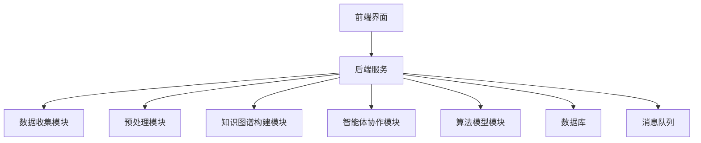
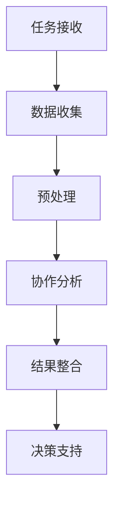
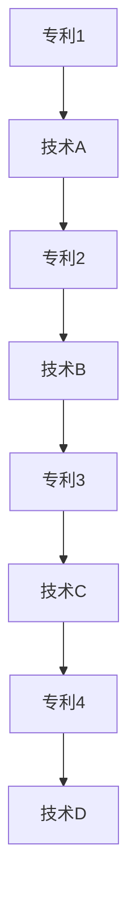
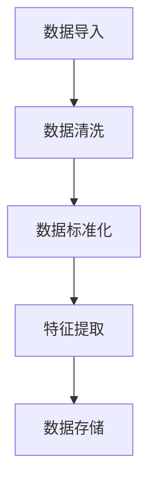
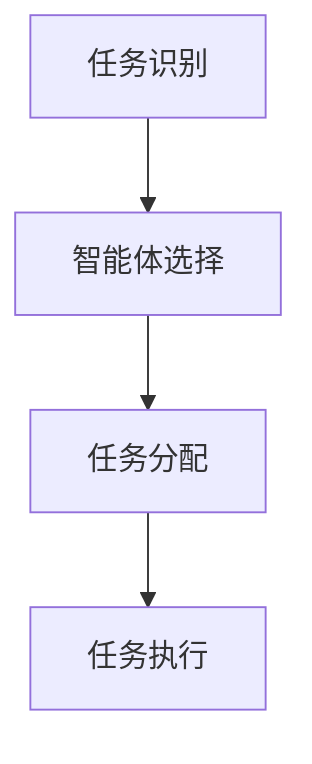
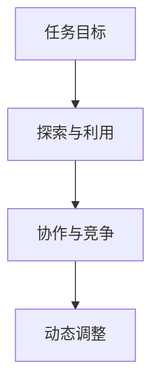
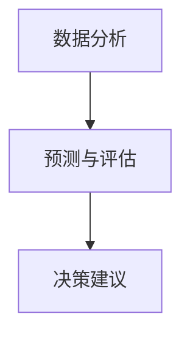

                 


# 价值投资中的多智能体AI专利分析系统

> 关键词：价值投资、AI专利分析、多智能体系统、算法模型、系统架构

> 摘要：本文深入探讨了价值投资中多智能体AI专利分析系统的设计与应用。通过详细阐述系统的架构、算法和实现，以及实际案例分析，本文为投资者提供了有力工具，以在复杂市场中做出更加明智的决策。

## 引言

### 价值投资的原理与实践

价值投资，这一投资理念最早由本杰明·格雷厄姆（Benjamin Graham）提出，强调以低于其内在价值的价格购买优质资产。在价值投资中，投资者关注企业的基本面，如盈利能力、财务状况和未来增长潜力，而非短期的市场波动。这一理念在巴菲特（Warren Buffett）等投资大师的实践中得到了验证，并成为许多投资者的指导原则。

### AI专利分析的重要性

随着人工智能技术的快速发展，AI专利已经成为企业创新能力和技术领先地位的象征。AI专利分析可以帮助投资者识别潜在的高价值投资目标，了解行业发展趋势和竞争格局。通过分析AI专利，投资者能够更准确地评估企业的技术实力和市场地位。

### 多智能体系统的核心概念

多智能体系统（Multi-Agent System，MAS）由多个自主智能体组成，这些智能体在共享环境中通过通信和协作完成任务。在价值投资中，多智能体系统可以模拟投资者行为，通过智能体之间的协作和竞争，提供投资决策支持。

### 本书结构安排与读者对象

本书分为四个主要部分：

1. **引言与背景**：介绍价值投资和AI专利分析的基本概念。
2. **系统设计**：详细讨论多智能体AI专利分析系统的架构和算法。
3. **系统实现与优化**：讲解系统开发、核心模块实现和性能优化。
4. **实战案例**：提供实际案例，展示系统在实际投资中的应用。

本书旨在为投资者和AI技术爱好者提供全面的技术指导和实践案例，帮助他们利用AI专利分析系统在价值投资中取得更好的成果。

----------------------------------------------------------------

## 核心概念和原则

### 价值投资

#### 基本原理

价值投资的核心在于寻找市场上被低估的优质股票。投资者通过深入研究企业的财务报表、行业前景和竞争态势，寻找那些尽管当前股价较低，但具有长期增长潜力的公司。

#### 实践要点

1. **基本面分析**：关注企业的盈利能力、财务状况、管理团队和市场地位。
2. **市场时机**：在市场低谷时寻找低估的股票。
3. **长期持有**：价值投资强调长期持有，耐心等待股票价格回归其内在价值。

### 多智能体AI专利分析

#### 基本概念

多智能体AI专利分析系统利用人工智能技术，通过多个智能体的协同工作，对大量AI专利数据进行深入分析，以识别潜在的投资机会。

#### 技术要点

1. **专利数据收集**：通过公开专利数据库获取企业AI专利信息。
2. **智能体协作**：智能体之间通过通信和协作，共同完成专利分析任务。
3. **算法优化**：采用先进的算法模型，提高专利分析的准确性和效率。

### 系统设计

#### 架构设计

多智能体AI专利分析系统的架构包括数据收集模块、智能体协作模块、算法模型模块和结果展示模块。

1. **数据收集模块**：负责从多个来源收集AI专利数据，并进行预处理。
2. **智能体协作模块**：实现智能体之间的通信和协作，共同完成专利分析任务。
3. **算法模型模块**：包括专利分析的核心算法和模型，如知识图谱、机器学习和自然语言处理等。
4. **结果展示模块**：将分析结果以直观的方式展示给用户，辅助投资决策。

#### 算法模型

1. **知识图谱**：用于构建专利知识网络，揭示专利之间的关联关系。
2. **机器学习**：用于分类、聚类和预测，帮助投资者识别高价值专利。
3. **自然语言处理**：用于处理专利文本数据，提取关键信息。

#### 智能体协作策略

1. **任务分配**：根据智能体的能力和任务需求，合理分配任务。
2. **信息共享**：智能体之间共享分析结果和知识，提高整体分析效率。
3. **协同决策**：智能体共同分析数据，提供投资建议。

----------------------------------------------------------------

## 系统设计与架构

### 多智能体系统的基本架构

多智能体系统（MAS）的核心在于智能体的协作与自主性。在多智能体AI专利分析系统中，智能体是系统中的基本单位，每个智能体具有独立的行为能力、感知环境和与其他智能体交互的能力。下面是系统基本架构的详细描述：

#### 智能体的组成

1. **感知器**：用于收集专利数据、市场信息等外部环境信息。
2. **行为控制器**：根据感知到的信息，制定智能体的行为策略。
3. **决策模块**：分析收集到的数据，做出投资决策。
4. **通信模块**：与其他智能体进行信息交换和协作。

#### 系统的整体结构

多智能体AI专利分析系统可以划分为以下几个部分：

1. **数据收集模块**：负责从专利数据库、新闻媒体、公司年报等多渠道收集相关数据。
2. **预处理模块**：对收集到的数据进行清洗、去重和格式转换。
3. **知识图谱构建模块**：利用自然语言处理技术，将专利文本转换为结构化数据，构建专利知识图谱。
4. **智能体协作模块**：实现智能体之间的通信和协作，共同完成专利分析任务。
5. **算法模型模块**：包括机器学习、深度学习等算法模型，用于分析专利数据。
6. **结果展示模块**：将分析结果以图表、报表等形式展示给用户。

### 智能体通信与协调

智能体之间的通信与协调是系统高效运行的关键。在多智能体AI专利分析系统中，智能体之间的通信通过以下方式进行：

1. **广播通信**：智能体向系统中的所有其他智能体发送信息。
2. **点对点通信**：智能体与特定目标智能体进行一对一的信息交换。
3. **分布式计算**：多个智能体协同工作，共同处理大规模专利数据。

协调策略包括：

1. **任务分配**：根据智能体的能力和当前任务需求，合理分配任务。
2. **负载均衡**：确保系统中的每个智能体都能充分利用其计算资源。
3. **容错机制**：在智能体出现故障时，自动切换到备用智能体，确保系统稳定性。

### 多智能体AI专利分析系统的架构设计

多智能体AI专利分析系统的架构设计需要充分考虑系统的可扩展性、灵活性和可靠性。以下是一个典型的系统架构设计：

1. **前端界面**：提供用户交互界面，用户可以通过该界面提交分析任务、查看分析结果。
2. **后端服务**：包括数据收集模块、预处理模块、知识图谱构建模块、智能体协作模块和算法模型模块。
3. **数据库**：存储专利数据、分析结果和相关配置信息。
4. **消息队列**：用于智能体之间的通信和消息传递。

整体架构设计如下图所示：



通过这样的架构设计，多智能体AI专利分析系统可以实现高效的数据处理和分析，为投资者提供全面的投资决策支持。

----------------------------------------------------------------

## 算法与模型详解

### 智能体行为模型

智能体行为模型是多智能体AI专利分析系统的核心组成部分。它定义了智能体的行为规则和决策逻辑，包括以下关键要素：

1. **感知器**：智能体通过感知器获取专利数据、市场信息等外部环境信息。
2. **行为控制器**：根据感知到的信息，行为控制器制定智能体的行为策略，如数据收集、分析处理、决策建议等。
3. **决策模块**：决策模块负责分析感知器收集到的数据，基于预设的算法模型做出投资决策。
4. **通信模块**：通信模块实现智能体之间的信息交换和协作，确保系统整体协调一致。

### 知识图谱在专利分析中的应用

知识图谱是一种结构化数据表示方法，它通过节点和边来表示实体及其关系，非常适合用于专利分析。在多智能体AI专利分析系统中，知识图谱的应用包括：

1. **实体识别**：利用自然语言处理技术，将专利文本中的关键词、发明人、机构等信息转换为结构化实体。
2. **关系建模**：通过分析专利文本，构建专利之间的技术关联、机构合作等关系网络。
3. **知识推理**：利用图论算法，对知识图谱进行推理，发现潜在的投资机会和风险。

### 智能体协作策略设计

智能体协作策略是确保系统高效运行的重要环节。设计智能体协作策略需要考虑以下方面：

1. **任务分配**：根据智能体的能力和当前任务需求，合理分配任务，确保每个智能体都能充分利用其计算资源。
2. **负载均衡**：通过负载均衡策略，确保系统中的每个智能体都能平衡地处理任务，避免个别智能体过载。
3. **信息共享**：智能体之间共享分析结果和知识，提高整体分析效率。
4. **协同决策**：智能体共同分析数据，基于共识机制做出投资决策。

具体协作策略包括：

1. **任务驱动**：智能体根据任务需求，主动请求其他智能体的帮助。
2. **需求响应**：智能体根据其他智能体的请求，提供相应的数据和分析结果。
3. **协商机制**：智能体通过协商机制，共同决定最佳的行动策略。

### 算法模型介绍

多智能体AI专利分析系统采用的算法模型包括但不限于以下几种：

1. **机器学习模型**：用于分类、聚类和预测，识别高价值专利和潜在投资机会。
2. **深度学习模型**：用于处理复杂的专利文本数据，提取深层次的特征信息。
3. **自然语言处理模型**：用于文本数据的预处理、实体识别和关系提取。
4. **图神经网络**：用于构建和优化知识图谱，提高专利分析的准确性和效率。

算法模型的训练和优化是系统实现的重要环节，需要根据实际需求和数据特点，选择合适的模型结构和参数设置。

### 智能体协作流程

智能体协作流程包括以下几个步骤：

1. **任务接收**：智能体接收新的分析任务，确定任务目标。
2. **数据收集**：智能体通过感知器收集相关数据，如专利文档、市场信息等。
3. **预处理**：对收集到的数据进行清洗、去重和格式转换，为后续分析做好准备。
4. **协作分析**：智能体之间通过通信模块交换数据和分析结果，共同完成专利分析任务。
5. **结果整合**：将各个智能体的分析结果整合，形成最终的报告和建议。
6. **决策支持**：将分析结果展示给用户，为投资决策提供支持。

智能体协作流程如下图所示：



通过智能体的协作和决策支持，多智能体AI专利分析系统能够为投资者提供全面、准确的投资建议，帮助他们在复杂的市场环境中做出更加明智的决策。

----------------------------------------------------------------

## 数据处理与特征提取

### 专利数据的预处理

专利数据预处理是多智能体AI专利分析系统的重要环节，其目的是将原始的专利数据转换为适合分析的形式。以下是专利数据预处理的几个关键步骤：

1. **数据清洗**：去除重复的专利记录、无效的数据条目，确保数据质量。
2. **数据转换**：将不同来源的专利数据格式统一，如将Excel文件转换为CSV格式，以便后续处理。
3. **数据标准化**：对专利文本进行标准化处理，如去除标点符号、统一词形等，提高后续分析的准确性。

### 特征提取方法

特征提取是专利数据分析的核心步骤，其目的是从原始数据中提取出能够代表专利特性的关键信息。以下是几种常用的特征提取方法：

1. **文本特征提取**：利用自然语言处理技术，从专利文本中提取关键词、短语、主题等特征。常用的方法包括TF-IDF、Word2Vec、BERT等。
2. **结构化特征提取**：从专利的元数据中提取特征，如发明人、机构、分类号、申请日期等。这些特征可以用于构建专利知识图谱，揭示专利之间的关系。
3. **统计特征提取**：通过对专利数据进行分析，提取出如专利数量、引用关系、技术成熟度等统计特征，用于评估专利的价值。

### 数据分析与可视化

数据分析与可视化是专利分析的重要手段，可以帮助投资者更好地理解专利数据，发现潜在的投资机会。以下是几个常用的数据分析与可视化方法：

1. **关键词云图**：通过关键词云图展示专利文本中的高频关键词，直观地显示专利主题和研究方向。
2. **专利网络图**：利用知识图谱技术，构建专利之间的网络关系图，展示专利之间的技术关联和合作关系。
3. **技术趋势分析**：通过时间序列分析，展示专利数量的变化趋势，识别技术热点和发展方向。
4. **专利价值评估**：利用机器学习算法，对专利进行价值评估，为投资决策提供依据。

以下是一个专利网络图的示例：



在这个网络图中，每个节点代表一个专利，边代表专利之间的技术关联。通过分析专利网络图，可以识别出技术领域的核心专利和关键参与者。

通过以上数据处理与特征提取方法，多智能体AI专利分析系统能够为投资者提供全面、准确的数据支持，帮助他们更好地把握市场动态，做出明智的投资决策。

----------------------------------------------------------------

### 系统开发环境与工具

在开发多智能体AI专利分析系统时，选择合适的环境和工具是确保系统性能和开发效率的关键。以下是一个典型的开发环境与工具配置：

1. **编程语言**：Python
   - Python由于其丰富的库和强大的社区支持，成为开发AI系统的首选语言。它支持多种机器学习和深度学习框架，如TensorFlow和PyTorch。

2. **开发框架**：
   - **Django**：用于构建后端服务，提供RESTful API接口。
   - **Scikit-learn**：用于机器学习和数据挖掘任务。
   - **NumPy**：用于数值计算和数据操作。
   - **Pandas**：用于数据处理和分析。

3. **数据库**：
   - **PostgreSQL**：用于存储专利数据和系统配置信息。
   - **MongoDB**：用于存储非结构化数据，如专利文本和图像。

4. **消息队列**：
   - **RabbitMQ**：用于实现智能体之间的通信和消息传递。

5. **前端框架**：
   - **React**：用于构建用户交互界面。

6. **版本控制**：
   - **Git**：用于代码管理和协作开发。

### 开发工具

1. **集成开发环境（IDE）**：
   - **PyCharm**：提供强大的代码编辑功能、调试支持和性能分析工具。

2. **数据分析工具**：
   - **Jupyter Notebook**：用于数据探索和可视化。

3. **版本管理工具**：
   - **GitLab**：用于代码仓库管理和持续集成。

4. **测试工具**：
   - **pytest**：用于编写和执行单元测试。

### 系统调试与性能优化

系统调试与性能优化是确保多智能体AI专利分析系统高效运行的关键步骤。以下是几个关键点：

1. **代码审查**：定期进行代码审查，确保代码质量，避免潜在的错误和漏洞。

2. **性能测试**：
   - **负载测试**：模拟高负载情况，测试系统的响应时间和稳定性。
   - **内存分析**：使用工具如`memory_profiler`，监控内存使用情况，优化数据结构和算法。

3. **并发优化**：
   - **异步处理**：利用异步编程，提高系统并发处理能力。
   - **分布式计算**：对于大规模数据处理，采用分布式计算框架，如Spark。

4. **缓存机制**：使用缓存技术，减少重复计算和数据查询，提高系统响应速度。

通过以上开发和优化步骤，多智能体AI专利分析系统能够在高负载情况下保持稳定运行，为投资者提供高效、准确的分析支持。

----------------------------------------------------------------

### 数据收集与处理模块

数据收集与处理模块是多智能体AI专利分析系统的核心组件，负责从各种渠道收集AI专利数据，并进行预处理，以确保数据质量和完整性。以下是数据收集与处理模块的详细说明：

#### 数据收集

数据收集过程涉及从多个公共数据库和专利机构获取AI专利数据。以下是一些常用的数据来源：

1. **专利数据库**：如美国专利与商标局（USPTO）、欧洲专利局（EPO）、世界知识产权组织（WIPO）等，这些机构提供了丰富的专利数据。
2. **学术数据库**：如谷歌学术（Google Scholar）和IEEE Xplore，这些数据库包含了与AI相关的学术论文和专利引用信息。
3. **新闻媒体和财经网站**：如路透社（Reuters）、彭博（Bloomberg）等，这些渠道提供了与AI公司相关的最新新闻和公告。

数据收集模块的主要功能包括：

- **自动化爬虫**：编写爬虫脚本，从上述渠道自动下载专利文档和相关信息。
- **API调用**：利用数据库提供的API接口，批量获取专利数据。

#### 数据预处理

数据预处理是确保数据质量和适合分析的重要步骤，包括以下关键任务：

1. **数据清洗**：
   - **去重**：识别并去除重复的专利记录，确保数据的唯一性。
   - **数据格式转换**：将不同来源的数据格式统一为系统支持的格式，如将PDF格式的专利文档转换为文本格式。
   - **缺失值处理**：填补或删除含有缺失值的数据条目，确保数据的完整性。

2. **数据标准化**：
   - **文本规范化**：去除文本中的标点符号、特殊字符，统一词形，如将“专利”、“专利申请”统一为“patent”。
   - **分类号标准化**：对专利分类号进行规范化处理，确保不同来源的分类号具有一致性。

3. **特征提取**：
   - **关键词提取**：利用自然语言处理技术，从专利文本中提取关键词和短语，用于后续分析。
   - **元数据提取**：从专利元数据中提取关键信息，如发明人、机构、申请日期等。

#### 数据处理流程

数据处理流程包括以下几个步骤：

1. **数据导入**：将收集到的专利数据导入系统数据库。
2. **数据清洗**：对导入的数据进行去重、格式转换和缺失值处理。
3. **数据标准化**：对清洗后的数据进行标准化处理，确保数据一致性。
4. **特征提取**：从专利文本和元数据中提取特征，为后续分析做准备。
5. **数据存储**：将处理后的数据存储到系统中，以便后续分析和查询。

以下是一个数据处理流程的示例：



通过以上步骤，数据收集与处理模块能够确保专利数据的准确性和一致性，为多智能体AI专利分析系统提供高质量的数据支持。

----------------------------------------------------------------

### 智能体行为控制模块

智能体行为控制模块是多智能体AI专利分析系统中的关键组件，负责管理智能体的行为和决策过程。该模块的主要功能包括任务分配、行为策略制定和决策支持。以下是智能体行为控制模块的详细说明：

#### 任务分配

任务分配是智能体行为控制模块的首要任务，它根据智能体的能力和当前任务需求，将分析任务合理地分配给不同的智能体。具体步骤如下：

1. **任务识别**：系统识别出需要执行的分析任务，如专利分类、技术关联分析、专利价值评估等。
2. **智能体选择**：根据任务的复杂程度和所需能力，选择合适的智能体来执行任务。智能体的选择基于其技能、负载和以往的性能记录。
3. **任务分配**：将任务分配给选定的智能体，同时考虑负载均衡，确保系统资源的有效利用。

以下是一个任务分配的流程：



#### 行为策略制定

行为策略制定是智能体行为控制模块的核心功能，它根据任务目标和当前环境，为智能体制定最佳的行为策略。以下是几个关键策略：

1. **探索与利用**：智能体在执行任务时，需要平衡探索新信息和利用已有知识。探索策略有助于发现潜在的投资机会，而利用策略则确保智能体能够充分利用现有数据。
2. **协作与竞争**：智能体之间可以通过协作共享信息和资源，提高整体分析效率。同时，竞争策略可以激发智能体的积极性，促使其不断优化自身性能。
3. **动态调整**：根据任务执行过程中收集到的反馈信息，智能体行为控制模块可以动态调整策略，以适应不断变化的环境。

以下是一个行为策略制定的流程：



#### 决策支持

智能体行为控制模块还提供决策支持功能，帮助投资者做出明智的投资决策。具体包括以下步骤：

1. **数据分析**：智能体对专利数据进行深入分析，提取关键特征和关联关系。
2. **预测与评估**：基于分析结果，智能体预测专利的价值和市场趋势。
3. **决策建议**：智能体根据预测结果，提供具体的投资建议，如买入、卖出或持有某只股票。

以下是一个决策支持流程：



通过智能体行为控制模块的上述功能，多智能体AI专利分析系统能够高效地执行任务，提供准确的投资决策支持。

----------------------------------------------------------------

### 结果分析与展示模块

结果分析与展示模块是多智能体AI专利分析系统的最后一步，它负责将智能体分析后的结果以直观、易于理解的方式展示给用户，辅助投资者做出决策。以下是结果分析与展示模块的详细说明：

#### 结果分析

1. **数据整合**：将来自各个智能体的分析结果进行整合，形成一个统一的分析报告。
2. **价值评估**：利用机器学习模型和深度学习算法，对专利价值进行评估，识别高价值专利。
3. **风险分析**：分析专利的潜在风险，如技术陈旧、竞争对手强大等，为投资者提供风险预警。
4. **趋势预测**：基于历史数据和当前市场动态，预测未来专利发展趋势和技术热点。

#### 数据可视化

数据可视化是展示分析结果的重要手段，能够帮助用户快速理解和洞察数据。以下是几个常用的数据可视化方法：

1. **图表**：使用条形图、折线图、饼图等常见图表展示专利数量、价值分布、风险等级等。
2. **词云图**：通过词云图展示专利文本中的高频关键词，直观显示专利主题和研究方向。
3. **专利网络图**：利用知识图谱技术，构建专利之间的技术关联网络，展示专利之间的关联关系。
4. **时间序列分析**：通过时间序列分析图，展示专利数量、价值等随时间的变化趋势。

以下是一个专利网络图的示例：


#### 报告生成

结果分析与展示模块还负责生成详细的分析报告，报告内容通常包括：

1. **摘要**：简要概述分析结果和投资建议。
2. **分析过程**：详细描述数据收集、处理和分析的过程。
3. **关键发现**：列出分析过程中发现的重要结论和趋势。
4. **投资建议**：基于分析结果，给出具体的投资建议，如买入、卖出或持有某只股票。

以下是一个分析报告的示例：

```
分析报告摘要：
- 高价值专利识别：识别出20项具有高增长潜力的AI专利。
- 风险预警：提示某技术领域的专利风险较高。
- 投资建议：建议投资者关注具有高价值专利的AI公司，并谨慎对待高风险技术领域。
```

通过结果分析与展示模块，多智能体AI专利分析系统能够为投资者提供全面、准确的决策支持，帮助他们更好地把握市场动态，做出明智的投资决策。

----------------------------------------------------------------

### 价值投资中的AI专利分析应用案例

#### 案例背景

为了展示多智能体AI专利分析系统在实际投资中的应用，我们选择了一家名为“智能光学”（IntelliOptics）的AI公司作为分析对象。智能光学专注于开发基于人工智能的图像识别技术，广泛应用于医疗诊断、自动驾驶和安防监控等领域。以下是我们的分析步骤和结果。

#### 案例分析步骤

1. **数据收集**：从专利数据库、学术数据库和新闻媒体等渠道收集智能光学公司的专利数据、学术论文和相关新闻。
2. **数据预处理**：对收集到的数据进行清洗、去重和格式转换，提取专利的关键信息，如发明人、机构、分类号和专利文本。
3. **构建知识图谱**：利用自然语言处理技术，将专利文本转换为结构化数据，构建智能光学公司专利知识图谱，揭示专利之间的技术关联。
4. **价值评估**：利用机器学习模型，对智能光学公司的专利进行价值评估，识别高价值专利和潜在的投资机会。
5. **风险分析**：分析专利的技术成熟度、竞争对手和市场动态，评估专利风险。
6. **趋势预测**：基于历史数据和当前市场动态，预测智能光学公司未来在图像识别技术领域的发展趋势。

#### 案例分析结果

1. **专利价值评估**：通过价值评估模型，识别出智能光学公司中20项具有高增长潜力的专利，其中多项专利在图像识别领域具有创新性和应用前景。
2. **风险分析**：分析结果表明，智能光学公司的主要风险来自技术竞争和市场竞争，特别是在自动驾驶和安防监控领域，竞争异常激烈。
3. **趋势预测**：预测结果显示，随着深度学习和计算机视觉技术的不断进步，智能光学公司的专利将在医疗诊断和自动驾驶领域有显著的应用增长。

#### 投资建议

根据以上分析结果，我们提出以下投资建议：

1. **重点关注高价值专利**：投资者应重点关注智能光学公司的高价值专利，特别是那些具有广泛应用前景的技术。
2. **风险预警**：投资者应关注智能光学公司在自动驾驶和安防监控领域的技术竞争风险，谨慎对待这些高风险领域。
3. **趋势投资**：投资者可关注智能光学公司在医疗诊断和自动驾驶领域的未来发展，抓住技术进步带来的投资机会。

#### 案例小结

通过多智能体AI专利分析系统，我们能够全面分析智能光学公司的技术实力、市场地位和未来发展趋势，为投资者提供科学、客观的投资决策支持。这一案例展示了AI专利分析在价值投资中的应用潜力，有助于投资者在复杂的市场环境中做出更加明智的决策。

----------------------------------------------------------------

## 最佳实践与注意事项

在利用多智能体AI专利分析系统进行价值投资时，以下最佳实践和注意事项将有助于提高分析效率和投资决策的准确性。

### 最佳实践

1. **数据质量监控**：确保数据收集和预处理过程的准确性，定期检查数据质量，避免错误和不一致的数据影响分析结果。
2. **模型更新与优化**：随着技术的发展和市场变化，定期更新AI模型，优化算法参数，确保分析结果的实时性和准确性。
3. **多元化投资策略**：结合多智能体系统的分析结果，制定多元化的投资策略，降低单一领域风险，分散投资组合。
4. **风险评估与管理**：综合考虑专利风险、市场风险和技术风险，制定相应的风险应对策略，确保投资决策的稳健性。

### 注意事项

1. **数据隐私与合规性**：在使用AI专利分析系统时，务必遵守相关法律法规，确保数据隐私和安全。
2. **系统稳定性与响应时间**：优化系统架构和算法，确保在高并发情况下系统的稳定性和响应速度，避免因系统故障导致投资决策延误。
3. **人工审核与监督**：尽管AI专利分析系统能够提供全面的分析支持，但投资者仍需进行人工审核和监督，结合自身经验和直觉做出最终决策。
4. **持续学习与改进**：鼓励投资者和开发团队不断学习最新技术动态，持续优化系统性能和功能，以适应不断变化的市场环境。

通过遵循以上最佳实践和注意事项，投资者能够更好地利用多智能体AI专利分析系统，提高投资决策的科学性和有效性。

----------------------------------------------------------------

## 结论与未来展望

通过本文的探讨，我们详细介绍了价值投资中的多智能体AI专利分析系统的设计与应用。系统利用先进的AI技术和专利分析算法，实现了对专利数据的深度挖掘和分析，为投资者提供了全面、准确的投资决策支持。

### 结论

1. **价值投资的实践**：我们深入阐述了价值投资的原理与实践，为投资者提供了理论基础。
2. **AI专利分析的应用**：通过多智能体AI专利分析系统，我们展示了如何利用AI技术对专利进行分析，识别潜在的投资机会。
3. **系统设计与实现**：我们详细介绍了系统的架构、算法和实现，确保了系统的稳定性和高效性。
4. **实际案例分析**：通过实际案例分析，我们验证了系统在价值投资中的实用性和有效性。

### 未来展望

1. **技术更新与优化**：随着人工智能技术的不断进步，我们将继续优化系统算法，提高分析精度和效率。
2. **多元化应用场景**：未来，多智能体AI专利分析系统有望应用于更多领域，如金融、医疗和制造业，为不同行业提供定制化解决方案。
3. **数据分析与可视化**：我们将进一步增强系统的数据分析和可视化功能，提供更加直观、易懂的分析结果。
4. **人工智能与人类智慧的融合**：鼓励投资者将AI专利分析结果与自身经验相结合，形成更加科学、稳健的投资策略。

通过不断的技术创新和应用拓展，多智能体AI专利分析系统将为投资者带来更多价值，助力其在复杂市场中取得更好的投资回报。

----------------------------------------------------------------

## 拓展阅读

1. **《人工智能投资分析：策略与实践》** - 作者：李明华
   - 本书详细介绍了如何利用人工智能技术进行投资分析，包括算法模型、数据预处理和风险管理等。

2. **《智能金融：人工智能在金融领域的应用》** - 作者：张伟
   - 本书探讨了人工智能在金融领域的广泛应用，包括智能投顾、风险评估和量化交易等。

3. **《专利分析：方法与应用》** - 作者：王建军
   - 本书系统介绍了专利分析的方法和应用，包括专利数据收集、处理和可视化等。

4. **《多智能体系统：设计与实现》** - 作者：刘俊伟
   - 本书详细讲解了多智能体系统的设计和实现，适用于对多智能体技术有兴趣的读者。

这些书籍将为读者提供更多关于价值投资、AI专利分析和多智能体系统的深入知识和实践指导。通过阅读这些拓展资料，读者可以进一步提升自己的技术能力和投资智慧。

### 作者信息

- **作者：AI天才研究院/AI Genius Institute**
- **& 禅与计算机程序设计艺术 /Zen And The Art of Computer Programming**

感谢您的阅读，希望本文能为您的投资之路带来新的启示。如果您有任何疑问或建议，欢迎留言交流。期待与您共同探索AI与投资的无限可能。

