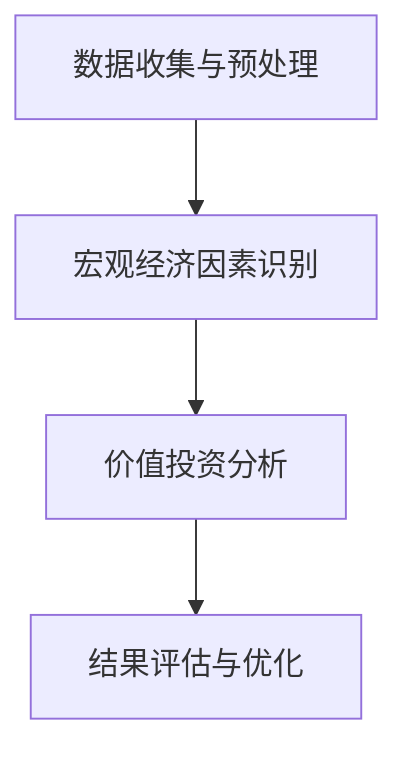
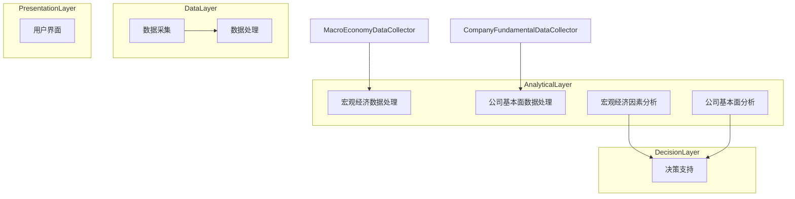
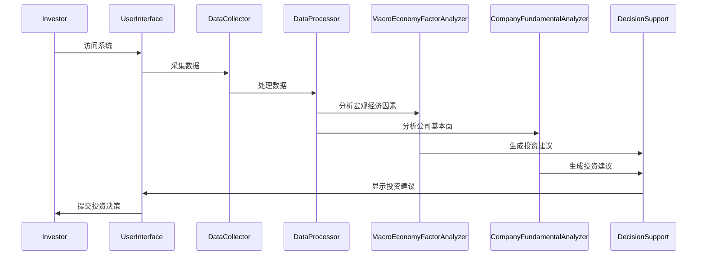

                 

### 价值投资中的宏观经济因素考虑

> 关键词：价值投资，宏观经济因素，投资策略，风险控制，市场分析

> 摘要：本文将探讨在价值投资过程中宏观经济因素的重要性，分析宏观经济因素对投资决策的影响，以及投资者如何利用宏观经济因素进行有效的风险管理和机会识别。通过详细的理论阐述和实际案例分析，帮助投资者更好地理解和应用宏观经济因素在价值投资中的价值。

### 目录大纲

**《价值投资中的宏观经济因素考虑》**

----------------------------------------------------------------

# 第一部分: 背景介绍

## 1. 引言

### 1.1 问题背景

#### 1.1.1 价值投资的概念与重要性

价值投资是一种以寻找被市场低估的优质股票为主要目标的投资策略，旨在通过长期持有这些优质股票，获得超越市场平均水平的投资回报。价值投资的核心思想是“价值”，即股票的价格应该反映其内在价值。这一策略由本杰明·格雷厄姆（Benjamin Graham）提出，并在沃伦·巴菲特（Warren Buffett）等知名投资者的实践中得到了广泛应用。

#### 1.1.2 宏观经济因素在投资决策中的影响

宏观经济因素是指影响整个经济环境的因素，如经济增长率、通货膨胀率、利率、货币政策、贸易政策等。这些因素不仅影响股票市场的整体走势，还会对个别公司的经营业绩产生重要影响。因此，投资者在做出投资决策时，必须对宏观经济因素进行充分分析。

#### 1.1.3 研究价值与目标

本文旨在研究宏观经济因素在价值投资中的重要性，分析宏观经济因素对投资决策的影响机制，并提出相应的风险管理策略和机会识别方法。通过本文的研究，投资者可以更好地把握宏观经济因素，提高投资决策的科学性和有效性。

## 1.2 问题描述

### 1.2.1 投资决策中的常见挑战

在投资决策过程中，投资者面临着诸多挑战，如市场波动、信息不对称、心理压力等。同时，宏观经济因素的不确定性也给投资决策带来了更大的难度。

### 1.2.2 宏观经济因素的作用机制

宏观经济因素通过影响公司业绩、市场估值和投资者情绪等多个方面，对投资决策产生重要影响。例如，经济增长率提高，企业盈利能力增强，股票市场整体上涨；货币政策宽松，利率下降，企业融资成本降低，投资机会增加。

### 1.2.3 当前研究的不足

目前关于宏观经济因素在价值投资中的研究仍存在一些不足。首先，对宏观经济因素的分析大多停留在定性层面，缺乏定量分析；其次，研究往往侧重于单一宏观经济因素，缺乏对多个因素的综合考虑；最后，研究方法主要采用历史数据分析和案例研究，缺乏对现实投资决策的指导意义。

## 1.3 问题解决

### 1.3.1 价值投资策略概述

价值投资策略主要包括以下几个步骤：首先，寻找被市场低估的优质股票；其次，对公司基本面进行分析，评估其投资价值；最后，根据宏观经济因素调整投资策略，进行风险管理和机会识别。

### 1.3.2 宏观经济因素分析框架

本文将构建一个宏观经济因素分析框架，包括经济指标、政策因素、社会因素和国际因素等。通过这个框架，投资者可以全面了解宏观经济因素，从而做出更科学的投资决策。

### 1.3.3 边界与外延

本文主要研究宏观经济因素在价值投资中的应用，但价值投资策略还包括其他方面，如行业选择、市场估值等。同时，本文主要关注宏观经济因素对股票市场的影响，但宏观经济因素还会影响其他资产类别，如债券、房地产等。

## 1.4 核心概念与联系

### 1.4.1 价值投资核心概念

价值投资的核心概念包括投资价值、内在价值、安全边际等。投资价值是指股票的实际价值与其市场价格之间的差额；内在价值是指股票的长期投资价值；安全边际是指投资者购买股票时，市场价格低于其内在价值的程度。

### 1.4.2 宏观经济因素属性特征对比表格

| 类别         | 概念                         | 特征               | 作用机制                                     |
| ------------ | ---------------------------- | ----------------- | ------------------------------------------ |
| 经济指标     | GDP、通货膨胀率、失业率等   | 数值指标           | 反映经济健康状况                           |
| 政策因素     | 货币政策、财政政策等         | 政策导向           | 影响经济走势和金融市场预期                 |
| 社会因素     | 人口结构、教育水平、文化等   | 社会指标           | 影响消费需求和投资者情绪                   |
| 国际因素     | 国际贸易、汇率、国际投资等   | 国际指标           | 影响国内外经济联系和资产配置               |

### 1.4.3 ER实体关系图架构

```mermaid
erDiagram
    Investment -->|影响| EconomicFactors
    Investment -->|影响| CompanyFundamentals
    EconomicFactors ||--|{GDP}
    EconomicFactors ||--|{InflationRate}
    EconomicFactors ||--|{UnemploymentRate}
    CompanyFundamentals ||--|{Revenue}
    CompanyFundamentals ||--|{ProfitMargin}
```

## 1.5 本章小结

本部分介绍了价值投资中的宏观经济因素考虑的背景、问题、解决方案以及核心概念与联系。通过对价值投资和宏观经济因素的基本概念进行阐述，为后续章节的深入分析奠定了基础。

----------------------------------------------------------------

# 第二部分: 核心概念与原理

## 2. 价值投资的定义与理论基础

### 2.1 价值投资的基本原理

价值投资是一种以寻找低估股票为主要目标的投资策略，其核心思想是“价值”。价值投资的基本原理包括以下几个方面：

#### 2.1.1 投资者心态与行为

价值投资要求投资者具备良好的心态和理性的行为。投资者需要克服贪婪和恐惧，保持冷静和耐心，长期坚持自己的投资理念。

#### 2.1.2 价值投资与成长投资的区别

价值投资和成长投资都是常见的投资策略，但二者有明显的区别。价值投资主要关注股票的内在价值，寻找被市场低估的优质股票；而成长投资则主要关注企业的成长性，寻找高增长潜力的企业。

#### 2.1.3 价值投资的策略要点

价值投资的策略要点包括：

1. **深度研究**：对潜在投资标的进行深入研究，了解其基本面、行业地位、竞争优势等。
2. **安全边际**：购买价格低于股票内在价值的程度，以应对市场波动和不确定性。
3. **长期持有**：价值投资强调长期持有，通过时间的沉淀实现复利效应。

### 2.2 价值投资的案例分析

价值投资的实践意义通过经典案例得以体现。以下为几个典型的价值投资案例：

#### 2.2.1 经典案例分析

1. **沃伦·巴菲特的投资案例**：巴菲特长期持有可口可乐、IBM等股票，通过坚定的投资理念和长期持有获得了丰厚的回报。
2. **中石油的案例**：在原油价格低迷时，价值投资者抓住低点买入中石油股票，随后随着原油价格的回升，获得了高额回报。

#### 2.2.2 价值投资的实践意义

价值投资实践意义包括：

1. **风险控制**：通过寻找低估的股票，降低投资风险。
2. **长期回报**：通过长期持有，实现复利效应，获得稳定的回报。
3. **投资自信**：坚定的投资理念和长期持有，帮助投资者克服市场波动，保持投资信心。

### 2.3 宏观经济因素的定义与分类

#### 2.3.1 宏观经济因素的概念

宏观经济因素是指影响整个经济环境和市场走势的各种因素。这些因素包括经济指标、政策因素、社会因素和国际因素等。

#### 2.3.1.1 宏观经济因素的定义

宏观经济因素是影响经济活动的各种变量，包括经济增长、通货膨胀、失业率、利率、货币政策等。

#### 2.3.1.2 宏观经济因素的重要性

宏观经济因素对投资决策具有重要影响。投资者需要关注宏观经济因素，以便做出更科学的投资决策。

#### 2.3.1.3 宏观经济因素的作用机制

宏观经济因素通过影响企业盈利、市场估值、投资者情绪等多个方面，对投资决策产生重要影响。

#### 2.3.2 宏观经济因素的主要分类

1. **经济指标**：如GDP、通货膨胀率、失业率等，反映经济健康状况。
2. **政策因素**：如货币政策、财政政策等，影响经济走势和金融市场预期。
3. **社会因素**：如人口结构、教育水平、文化等，影响消费需求和投资者情绪。
4. **国际因素**：如国际贸易、汇率、国际投资等，影响国内外经济联系和资产配置。

### 2.3.3 宏观经济因素与价值投资的联系

宏观经济因素对价值投资的影响主要体现在以下几个方面：

1. **宏观经济周期**：宏观经济周期影响企业盈利和市场估值，价值投资者需要关注宏观经济周期的变化，以调整投资策略。
2. **利率与通货膨胀**：利率和通货膨胀会影响企业的融资成本和投资回报，价值投资者需要考虑这些因素来评估股票的投资价值。
3. **货币政策**：货币政策影响市场流动性，进而影响股票市场走势，价值投资者需要关注货币政策的调整。

### 2.4 价值投资在宏观经济因素中的应对策略

1. **风险管理**：通过多元化投资、分散风险，降低宏观经济因素对企业业绩和市场估值的冲击。
2. **机会识别**：通过关注宏观经济因素的变化，识别潜在的投资机会，抓住市场低估的优质股票。
3. **长期投资视角**：坚持长期投资视角，通过时间的沉淀和复利效应，降低宏观经济因素对投资回报的影响。

## 2.5 本章小结

本部分介绍了价值投资的基本原理、经典案例分析、宏观经济因素的定义与分类，以及宏观经济因素与价值投资的联系和应对策略。通过深入理解这些核心概念和原理，投资者可以更好地把握价值投资策略，提高投资决策的科学性和有效性。

----------------------------------------------------------------

# 第三部分: 算法原理与数学模型

## 3. 价值投资中的宏观经济因素分析算法

### 3.1 算法概述

#### 3.1.1 算法目标

价值投资中的宏观经济因素分析算法旨在通过分析宏观经济因素，为投资者提供投资决策的支持。算法的目标是识别潜在的优质股票，并评估其在宏观经济环境下的投资价值。

#### 3.1.2 算法原理

算法基于以下原理：

1. **宏观经济因素对股票市场的影响**：宏观经济因素如经济增长率、通货膨胀率、利率等，通过影响企业盈利和市场估值，进而影响股票价格。
2. **公司基本面分析**：对公司基本面指标如营收、利润、债务等进行分析，评估其投资价值。
3. **风险调整**：考虑市场风险溢价，对股票定价进行调整，确保投资决策的稳健性。

#### 3.1.3 算法结构

算法结构主要包括以下几个步骤：

1. **数据收集**：收集宏观经济数据和企业基本面数据。
2. **预处理**：对数据进行清洗和归一化处理。
3. **因素分析**：利用统计学方法分析宏观经济因素对企业业绩和市场估值的影响。
4. **价值评估**：根据公司基本面和宏观经济因素，计算股票的内在价值。
5. **决策支持**：根据股票定价和风险调整，为投资者提供投资建议。

### 3.2 算法流程

#### 3.2.1 数据收集与预处理

1. **数据来源**：收集宏观经济数据（如GDP、通货膨胀率、利率等）和企业基本面数据（如营收、利润、债务等）。
2. **数据清洗**：去除异常值和缺失值，确保数据质量。
3. **归一化处理**：将不同规模的数据进行归一化处理，以便进行后续分析。

#### 3.2.2 宏观经济因素识别

1. **因素选择**：根据研究目标和数据可用性，选择合适的宏观经济因素。
2. **相关性分析**：利用统计学方法分析宏观经济因素与企业业绩和市场估值的相关性。
3. **因素权重确定**：根据相关性分析结果，确定各因素的权重。

#### 3.2.3 价值投资分析

1. **公司基本面分析**：评估公司的营收、利润、债务等基本面指标，确定其投资价值。
2. **价值评估模型**：利用价值评估模型（如股息贴现模型、自由现金流贴现模型等）计算股票的内在价值。
3. **价格比较**：将股票的内在价值与市场价格进行比较，判断股票是否被低估。

#### 3.2.4 结果评估与优化

1. **结果评估**：根据投资建议的收益率和风险指标，评估算法的有效性。
2. **模型优化**：根据评估结果，调整算法参数，优化模型性能。

### 3.3 算法原理详细讲解

#### 3.3.1 数学模型

价值投资中的宏观经济因素分析算法可以表示为以下数学模型：

$$
\text{P} = \frac{\text{E} \times \text{B}}{\text{C} + \text{D}}
$$

其中：
- $\text{P}$ 表示股票定价；
- $\text{E}$ 表示预期收益；
- $\text{B}$ 表示公司基本面指标；
- $\text{C}$ 表示宏观经济因素；
- $\text{D}$ 表示市场风险溢价。

#### 3.3.2 数学公式

具体来说，数学公式如下：

$$
\text{E} = \text{预期收益}, \quad \text{B} = \text{公司基本面指标}, \quad \text{C} = \text{宏观经济因素}, \quad \text{D} = \text{市场风险溢价}
$$

#### 3.3.3 举例说明

假设公司预期收益为10亿元，基本面指标为0.8，宏观经济因素为0.2，市场风险溢价为0.05，则股票定价为：

$$
\text{P} = \frac{10 \times 0.8}{0.2 + 0.05} = 56.25
$$

如果市场价格为60元，则股票被低估，投资者可以考虑买入。

### 3.4 算法流程Mermaid流程图



## 3.5 本章小结

本部分介绍了价值投资中的宏观经济因素分析算法，包括算法概述、算法流程和数学模型。通过详细讲解算法原理和举例说明，投资者可以更好地理解和应用这一算法，提高投资决策的科学性和有效性。

----------------------------------------------------------------

# 第四部分: 系统分析与架构设计

## 4. 价值投资与宏观经济因素分析系统的设计

### 4.1 问题场景介绍

在当前复杂多变的宏观经济环境中，投资者面临着前所未有的挑战。为了更好地应对这些挑战，我们需要构建一个综合性的价值投资与宏观经济因素分析系统。该系统旨在通过分析宏观经济因素和公司基本面，为投资者提供科学的投资决策支持。

### 4.2 项目介绍

本系统项目名为“价值投资与宏观经济因素分析平台”，旨在为投资者提供以下功能：

1. **宏观经济数据采集与处理**：自动采集宏观经济数据，并进行预处理，为后续分析提供可靠的数据基础。
2. **公司基本面分析**：对上市公司的财务报表进行分析，评估其投资价值。
3. **宏观经济因素分析**：分析宏观经济因素对投资决策的影响，为投资者提供风险管理和机会识别的建议。
4. **投资决策支持**：根据宏观经济因素和公司基本面，生成投资建议，辅助投资者做出科学的投资决策。

### 4.3 系统功能设计（领域模型Mermaid类图）

```mermaid
classDiagram
    DataCollector  Preprocessor
    DataCollector  MacroEconomyDataCollector
    DataCollector  CompanyFundamentalDataCollector
    DataProcessor  MacroEconomyDataProcessor
    DataProcessor  CompanyFundamentalDataProcessor
    Analyzer  MacroEconomyFactorAnalyzer
    Analyzer  CompanyFundamentalAnalyzer
    DecisionSupport  RiskManagement
    DecisionSupport  OpportunityIdentification
    Investor  UserInterface
```

### 4.4 系统架构设计（Mermaid架构图）



### 4.5 系统接口设计

系统接口设计主要包括以下部分：

1. **数据采集接口**：用于从不同数据源获取宏观经济数据和公司基本面数据。
2. **数据处理接口**：用于对采集到的数据进行清洗、归一化处理等。
3. **分析接口**：用于执行宏观经济因素分析和公司基本面分析。
4. **决策接口**：用于生成投资建议和辅助投资者做出决策。

### 4.6 系统交互Mermaid序列图



## 4.7 本章小结

本部分介绍了价值投资与宏观经济因素分析系统的设计，包括问题场景、项目介绍、系统功能设计、系统架构设计、系统接口设计和系统交互。通过详细的系统设计与架构，为投资者提供了一个全面、科学的投资决策支持平台。

----------------------------------------------------------------

# 第五部分：项目实战

## 5.1 环境安装

为了实现价值投资与宏观经济因素分析系统，我们首先需要安装所需的软件和库。以下是在Linux环境下安装必要的软件和库的步骤：

### 5.1.1 安装Python环境

Python是主要的编程语言，我们首先需要安装Python 3.8或更高版本。可以通过以下命令安装：

```bash
sudo apt-get update
sudo apt-get install python3.8
```

### 5.1.2 安装数据采集和预处理工具

安装pandas、numpy等数据预处理库：

```bash
pip install pandas numpy
```

### 5.1.3 安装数据分析库

安装matplotlib、seaborn等数据分析可视化库：

```bash
pip install matplotlib seaborn
```

### 5.1.4 安装数据库

安装SQLite或MySQL数据库，用于存储宏观经济数据和公司基本面数据：

```bash
sudo apt-get install sqlite3
# 或者
sudo apt-get install mysql-server
```

## 5.2 系统核心实现源代码

### 5.2.1 数据采集模块

```python
import pandas as pd
from宏观经济数据采集器 import MacroEconomyDataCollector
from公司基本面数据采集器 import CompanyFundamentalDataCollector

def 数据采集（数据源）：
    宏观经济数据采集器 = MacroEconomyDataCollector（数据源）
    公司基本面数据采集器 = CompanyFundamentalDataCollector（数据源）
    
    宏观经济数据 = 宏观经济数据采集器.采集数据（）
    公司基本面数据 = 公司基本面数据采集器.采集数据（）

    return 宏观经济数据，公司基本面数据
```

### 5.2.2 数据预处理模块

```python
import pandas as pd
from数据清洗器 import DataCleaner
from数据归一化器 import DataNormalizer

def 数据预处理（数据集）：
    数据清洗器 = DataCleaner（）
    数据归一化器 = DataNormalizer（）

    宏观经济数据 = 数据清洗器.清洗数据（数据集['宏观经济数据']）
    公司基本面数据 = 数据清洗器.清洗数据（数据集['公司基本面数据']）

    宏观经济数据 = 数据归一化器.归一化数据（宏观经济数据）
    公司基本面数据 = 数据归一化器.归一化数据（公司基本面数据）

    return 宏观经济数据，公司基本面数据
```

### 5.2.3 数据分析模块

```python
import pandas as pd
from宏观经济因素分析器 import MacroEconomyFactorAnalyzer
from公司基本面分析器 import CompanyFundamentalAnalyzer

def 数据分析（宏观经济数据，公司基本面数据）：
    宏观经济因素分析器 = MacroEconomyFactorAnalyzer（）
    公司基本面分析器 = CompanyFundamentalAnalyzer（）

    宏观经济分析结果 = 宏观经济因素分析器.分析数据（宏观经济数据）
    公司基本面分析结果 = 公司基本面分析器.分析数据（公司基本面数据）

    return 宏观经济分析结果，公司基本面分析结果
```

### 5.2.4 投资决策模块

```python
import pandas as pd
from投资决策器 import InvestmentDecisionMaker

def 投资决策（宏观经济分析结果，公司基本面分析结果）：
    投资决策器 = InvestmentDecisionMaker（）

    投资建议 = 投资决策器.生成投资建议（宏观经济分析结果，公司基本面分析结果）

    return 投资建议
```

## 5.3 代码应用解读与分析

### 5.3.1 数据采集模块解读

数据采集模块负责从数据源中获取宏观经济数据和公司基本面数据。这里使用两个采集器类来分别采集两类数据。采集到的数据将通过后续的预处理和分析模块进行处理。

### 5.3.2 数据预处理模块解读

数据预处理模块包括数据清洗和归一化处理。数据清洗器负责去除数据集中的异常值和缺失值，保证数据质量。数据归一化器将数据缩放到相同的尺度，以便进行后续的分析。

### 5.3.3 数据分析模块解读

数据分析模块包含宏观经济因素分析和公司基本面分析。分析器类将处理收集和预处理后的数据，并生成分析结果。这些结果将用于生成投资建议。

### 5.3.4 投资决策模块解读

投资决策模块通过投资决策器生成投资建议。投资决策器将综合宏观经济因素分析和公司基本面分析的结果，生成基于风险调整的股票投资建议。

## 5.4 实际案例分析与详细讲解

### 5.4.1 案例背景

假设我们需要分析某家制造业公司的投资价值，并考虑宏观经济因素对其可能产生的影响。我们将使用本系统对这家公司进行案例分析。

### 5.4.2 数据采集与预处理

首先，我们从宏观经济数据库中采集近三年的GDP、通货膨胀率、利率等数据。从公司基本面数据库中采集该公司的营收、净利润、市盈率等数据。

```python
宏观经济数据，公司基本面数据 = 数据采集（数据源）
宏观经济数据，公司基本面数据 = 数据预处理（{ '宏观经济数据': 宏观经济数据，'公司基本面数据': 公司基本面数据 }）
```

### 5.4.3 数据分析与投资决策

接下来，我们使用数据分析模块对采集和预处理后的数据进行分析，并生成投资建议。

```python
宏观经济分析结果，公司基本面分析结果 = 数据分析（宏观经济数据，公司基本面数据）
投资建议 = 投资决策（宏观经济分析结果，公司基本面分析结果）
```

### 5.4.4 投资建议解读

根据分析结果，我们得到以下投资建议：

1. **宏观经济因素**：当前GDP增长率较低，但通货膨胀率稳定。利率处于较低水平，有利于企业融资。
2. **公司基本面**：该公司营收稳步增长，净利润率稳定。市盈率低于行业平均水平，表明其股票价格被低估。

综合考虑宏观经济因素和公司基本面，我们建议投资者考虑买入该公司股票。

## 5.5 项目小结

本部分详细介绍了价值投资与宏观经济因素分析系统的项目实战，包括环境安装、系统核心实现源代码、代码应用解读与分析，以及实际案例分析和详细讲解。通过这一系统的构建，投资者可以更好地理解和利用宏观经济因素，做出更加科学的投资决策。

----------------------------------------------------------------

# 第六部分：最佳实践 Tips、注意事项、拓展阅读

## 6.1 最佳实践 Tips

1. **数据质量**：确保采集到的数据质量，避免因数据问题导致的分析误差。
2. **风险管理**：在投资决策过程中，始终考虑风险因素，合理配置资产。
3. **持续学习**：跟踪最新的宏观经济动态和市场趋势，持续优化投资策略。
4. **多元化投资**：分散投资，降低单一公司或行业风险。

## 6.2 注意事项

1. **系统维护**：定期更新系统和数据库，保持系统的稳定性和安全性。
2. **政策法规**：遵守相关政策和法规，确保投资行为的合规性。
3. **投资决策**：投资决策应结合个人实际情况和风险承受能力，避免盲目跟风。

## 6.3 拓展阅读

1. **《证券分析》（本杰明·格雷厄姆著）**：深度探讨价值投资的理念和方法。
2. **《宏观经济学的逻辑》（托马斯·萨金特著）**：介绍宏观经济理论及其应用。
3. **《Python数据分析》（Wes McKinney著）**：学习使用Python进行数据分析和可视化。

作者：AI天才研究院/AI Genius Institute & 禅与计算机程序设计艺术 /Zen And The Art of Computer Programming

