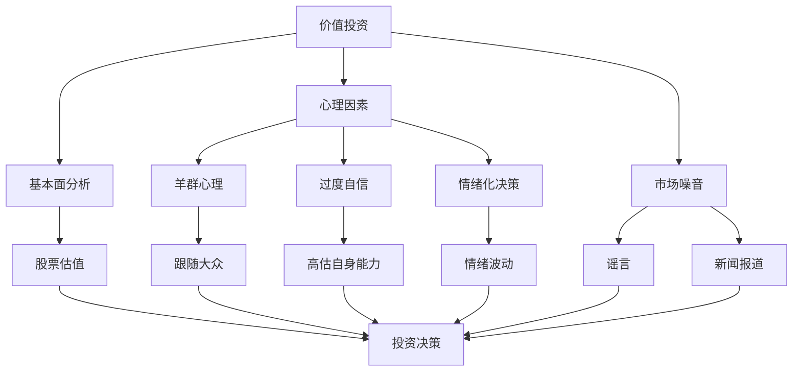

                 

## 第1章 引言

### 1.1 问题背景

在当今高度全球化的资本市场中，价值投资作为一种长期投资策略，已经得到了广泛的认可和应用。价值投资的核心思想是寻找市场中被低估的优质资产，并持有它们直到其价值得到市场认可。然而，尽管价值投资的策略被诸多研究证实其有效性，但在实际操作中，投资者往往难以克服心理因素带来的干扰，从而影响投资决策和收益。

首先，价值投资强调对公司基本面的深入研究，这包括公司的财务状况、业务模式、市场竞争力等多个方面。然而，现实中的投资者往往受限于信息获取的完整性和准确性，容易受到市场噪音的干扰，导致对公司的价值评估出现偏差。

其次，心理因素在投资决策中起着至关重要的作用。人类在处理信息时，往往存在认知偏差和情绪化决策的问题。例如，羊群心理使得投资者倾向于跟随市场大众，而不是基于独立的分析做出决策。过度自信和情绪化决策也会导致投资者在市场波动中做出不理性的行为。

最后，市场噪音是影响价值投资的一个重要因素。市场噪音包括各种非结构性信息，如谣言、新闻报道、社交媒体评论等，这些信息可能会引起市场的短期波动，从而干扰投资者的长期投资决策。

### 1.2 问题描述

价值投资中的心理因素主要包括以下几个方面：

1. **羊群心理**：投资者倾向于跟随市场大众的行为，从而导致市场过度反应或反应不足。
2. **过度自信**：投资者对自己的判断过于自信，忽视市场的不确定性，导致投资决策失误。
3. **情绪化决策**：投资者在情绪驱动下做出决策，而非理性分析，从而影响投资收益。

这些心理因素如何影响价值投资决策？如何识别和克服这些心理因素？如何减少市场噪音对投资决策的干扰？这是本文将要探讨的问题。

### 1.3 问题解决

本文将从以下几个方面来解决上述问题：

1. **心理因素概述**：介绍价值投资中的心理因素，包括羊群心理、过度自信、情绪化决策等。
2. **市场噪音分析**：探讨市场噪音的概念、来源及其对价值投资的影响。
3. **心理因素与价值投资策略**：分析心理因素在价值投资策略中的作用，提出防范心理因素的方法。
4. **心理因素实践**：通过案例分析，探讨心理因素在投资实践中的应用和影响。

通过以上分析，本文旨在帮助投资者更好地理解心理因素在价值投资中的作用，并提供实用的策略来克服这些因素的影响，从而实现长期稳定的投资收益。

### 1.4 边界与外延

本文的研究边界主要集中在价值投资领域中的心理因素及其对投资决策的影响。具体来说，本文将探讨以下三个方面：

1. **心理因素的类型**：本文将分析价值投资中常见的心理因素，如羊群心理、过度自信、情绪化决策等。
2. **市场噪音的影响**：本文将研究市场噪音对价值投资决策的干扰，以及如何减少这种干扰。
3. **策略与方法**：本文将提出一系列策略和方法，帮助投资者克服心理因素对投资决策的影响。

在研究的外延方面，本文不仅关注投资者个体的心理因素，还考虑了市场结构、宏观经济环境等因素对投资决策的影响。此外，本文还将探讨心理因素在投资实践中的应用，通过实际案例来验证理论的有效性。

### 1.5 概念结构与核心要素组成

为了更好地理解和研究价值投资中的心理因素，本文将首先介绍相关概念，并构建概念结构图，以便清晰地展示各概念之间的关系。

1. **价值投资**：价值投资是一种基于公司基本面分析的投资策略，旨在寻找市场中被低估的优质资产。
2. **心理因素**：心理因素包括羊群心理、过度自信、情绪化决策等，它们会影响投资者的投资决策。
3. **市场噪音**：市场噪音是指非结构性信息，如谣言、新闻报道等，它们会影响市场的短期波动。

以下是价值投资、心理因素和市场噪音的概念结构图：

通过以上概念结构图，我们可以清晰地看到价值投资、心理因素和市场噪音之间的关系。价值投资依赖于对公司基本面的分析，而心理因素和市场噪音则会影响投资决策的结果。本文将围绕这些核心要素，进行深入的分析和研究。

## 第2章 价值投资与心理因素概述

### 2.1 价值投资的核心概念

价值投资是一种基于公司基本面分析的投资策略，旨在通过购买被市场低估的优质资产来获取长期稳定的投资回报。其核心概念包括以下几个关键要素：

**基本面分析**：价值投资的基础是对公司基本面的深入研究。这包括公司的财务状况、业务模式、市场竞争力、管理层质量等多个方面。通过分析这些基本面信息，投资者可以判断公司是否被市场低估。

**股票估值**：价值投资的一个重要步骤是对股票进行合理的估值。投资者会使用各种估值模型，如现金流折现（DCF）、市盈率（PE）、市净率（PB）等，来评估股票的价值。如果股票的市场价格低于其内在价值，则视为被低估。

**安全边际**：价值投资强调在购买股票时留有安全边际。安全边际是指股票的市场价格低于其内在价值的差额，这为投资者提供了应对市场波动和公司业绩不确定性的缓冲空间。

**长期持有**：价值投资通常是一种长期投资策略。投资者在购买股票后，会持有较长时间，以期公司价值得到市场认可，从而实现股价上升。

**独立思考**：价值投资要求投资者独立思考，不受市场噪音的影响。投资者需要根据自己的研究和判断做出投资决策，而不是盲目跟随市场大众。

### 2.2 心理因素在投资中的作用

在价值投资中，心理因素起着至关重要的作用，它们不仅影响投资者的决策过程，还会影响最终的投资结果。以下是几种常见的心理因素及其在投资中的作用：

**羊群心理**：投资者倾向于跟随市场大众的行为。当市场普遍看涨或看跌时，投资者会基于群体的意见做出决策，而不是独立分析。这种心理因素可能导致市场过度反应或反应不足，从而影响投资决策。

**过度自信**：投资者常常高估自己的判断能力，低估市场的不确定性。过度自信会导致投资者在投资决策中忽视风险，过度投资，或者忽视公司存在的问题，从而做出错误的投资决策。

**情绪化决策**：投资者在情绪驱动下做出决策，而非基于理性分析。情绪化决策可能导致投资者在市场波动中做出冲动的交易行为，从而影响投资收益。

**预期心理偏差**：投资者对未来收益的预期往往存在偏差。他们可能会高估公司业绩或市场走势，从而在投资决策中产生偏差。

### 2.3 价值投资中的心理因素影响

心理因素对价值投资的影响是多方面的，它们可能导致以下几种结果：

**决策偏差**：心理因素可能导致投资者在投资决策中产生偏差，如过度自信、情绪化决策等。这些偏差会影响投资者的投资策略和风险控制。

**市场反应过度**：在羊群心理的作用下，投资者可能会对市场信息做出过度反应，导致市场波动加剧。

**投资风险增加**：心理因素可能使投资者忽视潜在的风险，导致投资风险增加。

**投资收益不稳定**：心理因素会影响投资者的投资决策，从而影响投资收益的稳定性。

为了克服心理因素对价值投资的影响，投资者需要加强自身的心理素质，提高信息筛选能力，建立科学合理的投资体系，以及培养独立思考的能力。只有这样，投资者才能在价值投资的道路上走得更远。

### 2.4 心理因素在价值投资中的应用

心理因素在价值投资中的应用具有复杂性，但也是至关重要的。以下是几种常见的心理因素在价值投资中的具体应用方式及其效果：

**羊群心理**：在市场情绪高涨时，投资者可能会受到羊群心理的影响，纷纷购买热门股票。尽管这种跟风行为可能在短期内带来利润，但长期来看，由于缺乏独立分析，投资者容易陷入市场波动，导致投资风险增加。

**过度自信**：投资者在成功预测市场走势或公司业绩后，可能会过度自信，从而忽视市场的不确定性。过度自信可能导致投资者在高价买入股票，或者在市场下跌时坚持错误的投资决策，最终导致投资损失。

**情绪化决策**：投资者在情绪驱动下做出决策，如在恐惧或贪婪情绪中急于买入或卖出股票。这种情绪化决策往往导致投资者在市场高点买入、在市场低点卖出，从而错失投资机会或承担不必要的风险。

**预期心理偏差**：投资者在预期收益时可能存在偏差，例如高估公司业绩或市场走势。这种预期偏差可能导致投资者在错误的时间买入或卖出股票，从而影响投资收益。

**心理因素在价值投资中的应用效果**：

正面效果：合理应用心理因素可以帮助投资者在市场机会出现时迅速做出决策，提高投资效率。例如，在市场情绪稳定、信息透明的情况下，羊群心理可以带来一定的市场认同感，有助于投资决策的实施。

负面效果：如果不加以控制，心理因素会导致投资者产生决策偏差，增加投资风险。过度自信、情绪化决策和预期偏差都可能使投资者在投资过程中产生错误的判断，从而导致投资失败。

总之，心理因素在价值投资中的应用具有双刃剑效应。投资者需要认识到心理因素的双重作用，通过提高自身的心理素质和投资技巧，合理利用心理因素来提升投资决策的准确性，降低投资风险。

### 2.5 心理因素与价值投资策略

心理因素在价值投资策略中的重要性不可忽视。以下将分析如何基于心理因素设计投资策略，以及如何通过心理因素来优化投资策略。

**基于心理因素的投资策略**

1. **羊群心理**：投资者可以利用羊群心理来选择热门行业或热门股票。例如，在市场普遍看好某个行业或公司时，投资者可以适度跟风，但要注意避免盲目跟风，结合基本面分析来做出投资决策。

2. **过度自信**：投资者可以通过自我反思和验证来克服过度自信。例如，在投资前，投资者可以回顾过去的投资决策，评估其正确性，从而提高决策的理性化水平。

3. **情绪化决策**：投资者需要建立情绪管理机制，例如通过定期休息、情绪记录和反思来减少情绪化决策的影响。此外，投资者可以设置投资纪律，如设定止损点和止盈点，以避免在情绪波动中做出冲动交易。

4. **预期心理偏差**：投资者可以通过设置合理的预期目标和风险评估机制来减少预期心理偏差。例如，投资者可以定期重新评估投资目标和风险承受能力，确保投资决策与预期目标相匹配。

**优化投资策略的方法**

1. **心理因素评估工具**：投资者可以使用心理测试工具来评估自身的心理素质，如羊群心理测试、情绪稳定性测试等。这些工具可以帮助投资者了解自身的心理弱点，从而针对性地优化投资策略。

2. **行为金融学**：通过学习行为金融学，投资者可以了解心理因素对市场行为的影响，并据此调整投资策略。例如，了解市场情绪变化对股价的影响，可以更好地把握市场机会。

3. **心理培训**：投资者可以通过参加心理培训课程来提高自身的心理素质，如情绪管理、决策分析等。这些培训可以帮助投资者在投资过程中更好地控制情绪，做出理性决策。

4. **多元化投资**：通过多元化投资，投资者可以降低单一股票或行业带来的心理压力。例如，将投资分散到多个行业或地区，可以减少因特定行业或地区市场波动带来的心理影响。

总之，心理因素在价值投资策略中起着关键作用。投资者不仅需要认识到心理因素的双重作用，还需要通过科学的方法来优化投资策略，从而提高投资决策的准确性和投资收益的稳定性。

### 2.6 心理因素在价值投资策略中的挑战与解决方案

在价值投资策略的实践中，心理因素带来的挑战尤为显著。以下将分析这些挑战，并提出相应的解决方案。

**挑战一：羊群心理的影响**

羊群心理是指投资者倾向于跟随市场大众的行为。在市场情绪高涨时，投资者可能盲目跟风，导致过度投资；而在市场情绪低落时，投资者可能纷纷抛售，引发市场恐慌。这种心理现象在价值投资中尤其危险，因为它容易导致投资者忽视基本面分析，从而做出非理性的投资决策。

**解决方案：**

1. **强化独立思考能力**：投资者应培养独立分析市场信息和公司基本面能力，不盲目跟风。
2. **设置心理防线**：通过设定止损点和止盈点，投资者可以在市场波动中保持冷静，避免因情绪波动而做出错误决策。
3. **情绪管理**：投资者应学会情绪管理，通过冥想、运动等方式缓解压力，避免情绪化决策。

**挑战二：过度自信的陷阱**

过度自信是指投资者对自己的判断过于自信，忽视市场的不确定性。在价值投资中，过度自信可能导致投资者高估自己的分析能力，从而在投资中冒过大的风险。

**解决方案：**

1. **自我反思**：投资者应定期回顾过去的投资决策，评估其正确性，从中吸取教训。
2. **建立决策验证机制**：投资者可以通过模拟交易或实际交易记录来验证投资策略的有效性，从而调整投资策略。
3. **引入外部意见**：投资者可以咨询专业人士或参与投资讨论，以获得多元化的视角，减少过度自信的影响。

**挑战三：情绪化决策的风险**

情绪化决策是指投资者在情绪驱动下做出投资决策，而不是基于理性分析。在市场波动中，投资者可能因为恐惧或贪婪而做出冲动交易，导致投资损失。

**解决方案：**

1. **情绪记录与反思**：投资者应记录自己的情绪波动，并定期进行反思，以识别并控制情绪化决策。
2. **设置投资纪律**：通过制定明确的投资计划和交易规则，投资者可以避免在情绪波动中做出冲动交易。
3. **心理培训**：参加情绪管理和决策分析的心理培训课程，提高自身情绪控制和决策能力。

**挑战四：预期心理偏差的困扰**

预期心理偏差是指投资者对未来收益的预期存在偏差，导致投资决策偏离实际。在价值投资中，预期偏差可能导致投资者在高估公司或市场前景时过度投资，或低估风险。

**解决方案：**

1. **设置合理预期目标**：投资者应根据实际情况设置合理的预期目标，并定期重新评估。
2. **风险评估**：投资者应进行详细的风险评估，确保投资决策与预期目标相匹配。
3. **心理工具辅助**：使用心理测试工具评估自身的预期偏差，并针对性地进行调整。

总之，心理因素在价值投资策略中具有双重作用。投资者需要认识到这些挑战，并采取有效的解决方案，以克服心理因素的负面影响，提高投资决策的准确性和投资收益的稳定性。

## 第3章 价值投资中的心理因素分析

### 3.1 羊群心理

羊群心理是一种普遍存在于人类行为中的现象，其核心特征是个人在群体中倾向于模仿和跟随大多数人的行为和决策。在价值投资中，羊群心理的影响尤为显著，可能导致投资者做出非理性的投资决策，从而影响投资收益。

**羊群心理的定义与特征**

羊群心理（Herd Behavior）是指个体在群体中因受到群体压力和信息不对称的影响，倾向于模仿和跟随大多数人的行为。这种行为模式在市场投资中表现得尤为明显，投资者往往在市场情绪高涨时盲目跟风，而在市场情绪低迷时纷纷抛售。

羊群心理的主要特征包括：

1. **模仿性**：个体在群体中倾向于模仿他人的行为，而不是基于独立的分析做出决策。
2. **从众性**：个体在面对不确定信息时，倾向于跟随群体的意见，避免被孤立。
3. **信息依赖性**：个体在决策过程中高度依赖群体的信息，忽视自己的独立判断。

**羊群心理在投资市场中的表现**

在投资市场中，羊群心理的表现形式多种多样。以下是一些常见的现象：

1. **市场情绪的传染**：当市场出现某种乐观或悲观情绪时，这种情绪会迅速传染给其他投资者，导致市场情绪的集体波动。
2. **热点跟风**：投资者往往对市场中的热点股票或行业产生过度兴趣，盲目跟风，从而导致这些股票或行业的股价波动加剧。
3. **市场波动放大**：由于羊群心理的存在，市场的波动幅度往往会比实际的经济基础更大，导致市场反应过度。

**羊群心理对价值投资的影响**

羊群心理对价值投资的影响是多方面的。以下分析其对价值投资的影响：

1. **决策偏差**：羊群心理可能导致投资者在缺乏独立分析的情况下做出投资决策，从而产生决策偏差。例如，在市场情绪高涨时，投资者可能会高估某些股票的价值，而在市场情绪低迷时，可能会低估这些股票的价值。

2. **市场噪音增加**：羊群心理会使市场噪音增加，影响投资者对信息的筛选能力。投资者可能会受到非结构性信息（如谣言、媒体报道等）的干扰，从而做出非理性的投资决策。

3. **风险放大**：羊群心理可能导致投资者在市场波动中过度反应，增加投资风险。例如，在市场恐慌时，投资者可能会纷纷抛售股票，导致市场进一步下跌。

**克服羊群心理的方法**

为了克服羊群心理对价值投资的影响，投资者可以采取以下方法：

1. **加强独立思考**：投资者应培养独立分析市场信息的能力，不盲目跟风。可以通过定期阅读财经书籍、参加投资课程等方式提高自己的投资知识水平。

2. **设置投资纪律**：投资者可以制定明确的投资计划和交易规则，避免在情绪波动中做出非理性决策。例如，设定止损点和止盈点，以控制风险。

3. **情绪管理**：投资者应学会情绪管理，通过冥想、运动等方式缓解压力，避免情绪化决策。

4. **多样化投资**：通过多元化投资，投资者可以降低因单一行业或股票波动带来的风险。例如，将投资分散到多个行业或地区。

总之，羊群心理是影响价值投资决策的重要因素。投资者需要认识到羊群心理的存在，并采取有效的方法来克服其负面影响，从而提高投资决策的准确性和投资收益的稳定性。

### 3.2 过度自信

过度自信是指个体对自己的判断和能力过于乐观，忽视市场的不确定性和潜在风险。在价值投资中，过度自信可能导致投资者做出错误的投资决策，从而影响投资收益。以下将详细分析过度自信的定义、成因、表现及其在价值投资中的影响。

**过度自信的定义**

过度自信（Overconfidence）是指个体在评价自身能力、判断结果或未来预期时，比实际水平更为乐观或自信的心理状态。这种心理现象在投资领域中尤为常见，因为投资者往往倾向于高估自己的分析能力和判断力，低估市场的不确定性和风险。

**过度自信的成因**

过度自信的形成通常有以下几方面的原因：

1. **自我肯定效应**：个体倾向于夸大自己的正面特质和能力，从而产生过度自信的心理状态。
2. **验证偏误**：当个体得到符合其预期的信息时，更倾向于相信这些信息，从而强化过度自信。
3. **选择性认知**：个体在处理信息时，往往会选择性地关注支持其观点的信息，忽视与之相反的证据。
4.**成功经验**：个体在过去的投资决策中取得成功，可能会增强其过度自信心理。

**过度自信的表现**

过度自信在投资中的表现主要体现在以下几个方面：

1. **高估投资收益**：投资者往往对自己预测的投资收益抱有过于乐观的预期，忽视市场的不确定性和潜在风险。
2. **低重视风险管理**：投资者可能忽视风险控制的重要性，不愿意设置止损点和止盈点，从而导致投资风险增加。
3. **过度交易**：投资者可能会频繁进行交易，试图通过频繁操作获取更高的投资回报，而忽视长期投资策略的重要性。
4. **高估自身能力**：投资者可能认为自己具有超越其他投资者的分析能力和判断力，从而忽视多元化投资和外部专业意见。

**过度自信在价值投资中的影响**

过度自信对价值投资的影响是多方面的，以下是一些主要影响：

1. **决策偏差**：过度自信可能导致投资者在投资决策中产生偏差，如高估公司价值或低估市场风险，从而影响投资策略的有效性。
2. **风险增加**：过度自信使得投资者忽视风险管理，导致投资组合面临更高的风险，从而可能遭受更大的损失。
3. **市场波动加剧**：由于过度自信的投资者在市场波动中可能做出更激进的交易决策，这可能会加剧市场的波动性，对整个市场的稳定性产生负面影响。
4. **错失机会**：过度自信可能使投资者忽视市场中的潜在机会，从而错失长期投资收益。

**克服过度自信的方法**

为了克服过度自信对价值投资的影响，投资者可以采取以下方法：

1. **自我反思**：投资者应定期回顾过去的投资决策，评估其准确性和有效性，从中吸取教训，避免重复错误。
2. **多元化投资**：通过多元化投资，投资者可以降低单一投资带来的风险，避免因过度自信导致的大额损失。
3. **设置止损点和止盈点**：投资者应制定合理的风险控制策略，通过设置止损点和止盈点来控制风险。
4. **寻求外部意见**：投资者可以咨询专业人士或参与投资讨论，以获得多元化的视角，减少过度自信的影响。

总之，过度自信是价值投资中常见的心理现象，投资者需要认识到其潜在的负面影响，并采取有效的策略来克服过度自信，从而提高投资决策的准确性和投资收益的稳定性。

### 3.3 情绪化决策

情绪化决策是指投资者在情绪驱动下做出投资决策，而非基于理性分析和逻辑判断。在价值投资中，情绪化决策可能带来显著的负面影响，导致投资决策失误，增加投资风险。以下将详细分析情绪化决策的定义、原因、表现及其在价值投资中的影响。

**情绪化决策的定义**

情绪化决策（Emotional Decision Making）是指个体在情绪影响下做出决策，而不是基于理性思考和逻辑分析。在投资领域，情绪化决策表现为投资者在市场波动中受到情绪波动的影响，从而做出非理性的投资决策。

**情绪化决策的原因**

情绪化决策的产生通常由以下几方面的原因引起：

1. **恐惧和贪婪**：投资者在面临市场下跌时容易产生恐惧，从而急于卖出股票；而在市场上涨时，容易受到贪婪心理的驱使，盲目追涨。
2. **认知偏差**：投资者在情绪化决策中可能存在认知偏差，如选择性记忆、过度自信等，导致其无法理性评估市场信息和投资机会。
3. **情绪依赖**：投资者可能在情感上对投资收益产生依赖，从而在情绪波动时难以做出理性决策。
4. **社会影响**：投资者在群体中可能会受到其他投资者情绪的影响，产生从众心理，从而做出情绪化决策。

**情绪化决策的表现**

情绪化决策在投资中通常表现为以下几种情况：

1. **恐慌性抛售**：当市场出现大幅下跌时，投资者可能会因恐惧而匆忙卖出股票，从而导致进一步下跌。
2. **盲目追涨**：投资者在市场情绪高涨时，可能会盲目跟风买入热门股票，从而在高价接盘，增加投资风险。
3. **频繁交易**：投资者在情绪驱动下可能频繁进行交易，试图通过短期操作获取高额收益，但实际上增加了交易成本和风险。
4. **忽视基本面**：投资者在情绪波动中可能忽视对公司的基本面分析，而是基于市场情绪做出投资决策。

**情绪化决策在价值投资中的影响**

情绪化决策对价值投资的影响主要体现在以下几个方面：

1. **决策偏差**：情绪化决策可能导致投资者在投资决策中产生偏差，如高估某些股票的潜在收益或低估市场风险。
2. **投资风险增加**：由于情绪化决策往往伴随着冲动交易，投资者可能在高价买入、低价卖出，从而增加投资风险。
3. **投资收益不稳定**：情绪化决策容易导致投资者在市场波动中做出频繁交易，从而影响投资收益的稳定性。
4. **错失投资机会**：情绪化决策可能导致投资者在市场底部时卖出股票，在市场顶部时买入股票，从而错失长期投资机会。

**克服情绪化决策的方法**

为了克服情绪化决策对价值投资的影响，投资者可以采取以下方法：

1. **情绪管理**：投资者应学会情绪管理，通过冥想、运动、休息等方式缓解情绪波动，避免在情绪影响下做出决策。
2. **设置交易规则**：投资者可以制定明确的交易规则，如设定止损点和止盈点，避免因情绪波动导致冲动交易。
3. **多元化投资**：通过多元化投资，投资者可以降低因单一股票波动带来的情绪影响，从而保持理性投资。
4. **理性分析**：投资者应加强基本面分析，基于公司价值和市场趋势做出投资决策，避免受情绪影响。

总之，情绪化决策是价值投资中需要克服的重要心理因素。投资者需要认识到其潜在的负面影响，并采取有效的方法来管理情绪，从而提高投资决策的准确性和投资收益的稳定性。

### 3.4 预期心理偏差

预期心理偏差（Expected Psychological Bias）是指在投资决策过程中，投资者由于心理因素的作用，对未来的收益和风险产生偏离实际预期的认知偏差。这些偏差可能影响投资者的投资决策，导致其在价值投资中做出非理性的选择。以下将分析预期心理偏差的定义、类型及其在价值投资中的影响。

**预期心理偏差的定义**

预期心理偏差是指投资者在评估投资机会时，由于心理因素的影响，对未来的收益和风险产生过于乐观或过于悲观的预期。这种偏差可能导致投资者在投资决策中忽视实际的市场信息和公司基本面，从而影响投资效果。

**预期心理偏差的类型**

预期心理偏差主要包括以下几种类型：

1. **过度乐观偏差**：投资者在评估投资机会时，往往对未来的收益预期过于乐观，忽视潜在的风险。这种偏差可能导致投资者在高价买入股票，并在市场下跌时产生恐慌性抛售。

2. **过度悲观偏差**：相反，投资者在评估投资机会时，可能对未来的收益预期过于悲观，低估潜在的机会。这种偏差可能导致投资者在市场底部时过度悲观，从而错失投资机会。

3. **选择性记忆偏差**：投资者往往倾向于记住成功案例，忽视失败的投资经历。这种偏差可能导致投资者在评估投资决策时，对过去的成功经验过度自信，忽视市场的不确定性和复杂性。

4. **锚定效应**：投资者在评估投资机会时，可能受到前期信息（如市场价格、媒体报道等）的影响，从而对其产生固定的锚点。这种偏差可能导致投资者在后续投资决策中无法理性评估新的市场信息。

5. **代表性偏差**：投资者倾向于根据过去的市场表现来预测未来的市场走势。这种偏差可能导致投资者对市场趋势产生过度反应，从而做出非理性的投资决策。

**预期心理偏差在价值投资中的影响**

预期心理偏差对价值投资的影响主要体现在以下几个方面：

1. **决策偏差**：预期心理偏差可能导致投资者在投资决策中产生偏差，如高估某些股票的潜在收益或低估市场风险。这种偏差会影响投资者的投资策略和风险控制。

2. **投资风险增加**：由于预期心理偏差，投资者可能在高价买入股票，增加投资风险。此外，过度悲观偏差可能导致投资者在市场底部时过度抛售，从而错失反弹机会。

3. **投资收益不稳定**：预期心理偏差会影响投资者的投资决策，导致其在市场波动中频繁交易，从而影响投资收益的稳定性。

4. **错失投资机会**：预期心理偏差可能导致投资者在市场底部时过于悲观，从而错失潜在的投资机会。同样，过度乐观偏差可能导致投资者在市场顶部时盲目追涨，从而增加投资风险。

**克服预期心理偏差的方法**

为了克服预期心理偏差对价值投资的影响，投资者可以采取以下方法：

1. **自我反思**：投资者应定期回顾过去的投资决策，评估其准确性和有效性，从中吸取教训，避免重复错误。

2. **多元化投资**：通过多元化投资，投资者可以降低因单一股票波动带来的情绪影响，从而保持理性投资。

3. **设置交易规则**：投资者可以制定明确的交易规则，如设定止损点和止盈点，避免因情绪波动导致冲动交易。

4. **情绪管理**：投资者应学会情绪管理，通过冥想、运动等方式缓解情绪波动，避免在情绪影响下做出决策。

5. **理性分析**：投资者应加强基本面分析，基于公司价值和市场趋势做出投资决策，避免受情绪影响。

总之，预期心理偏差是影响价值投资决策的重要因素。投资者需要认识到其潜在的负面影响，并采取有效的方法来管理情绪，从而提高投资决策的准确性和投资收益的稳定性。

### 3.5 心理因素与投资决策偏差的关系

在价值投资中，心理因素与投资决策偏差的关系密切，理解这种关系对于投资者来说至关重要。心理因素不仅影响投资者的情绪状态，还会直接影响其投资决策，导致偏差。以下将分析心理因素与投资决策偏差之间的关系及其对投资决策的影响。

**心理因素与投资决策偏差的关系**

1. **认知偏差**：心理因素如过度自信、情绪化决策和预期心理偏差等，会导致投资者在信息处理和评估过程中产生认知偏差。例如，过度自信使投资者高估自身能力，忽视风险；而情绪化决策则使投资者在恐惧和贪婪的驱动下做出非理性决策。

2. **情绪驱动**：投资者的情绪状态往往直接影响其投资决策。当投资者处于兴奋或沮丧的情绪中时，他们可能会忽略理性分析，从而做出冲动性决策。例如，贪婪情绪可能导致投资者盲目追涨，而恐惧情绪则可能导致投资者恐慌性抛售。

3. **信息处理**：心理因素会影响投资者对市场信息的处理方式。投资者在羊群心理的影响下可能倾向于接受和传播非结构性信息，从而影响其投资决策。此外，预期心理偏差可能使投资者对市场信息产生选择性认知，导致决策偏差。

**心理因素对投资决策偏差的影响**

1. **降低决策质量**：心理因素如过度自信和情绪化决策可能导致投资者在投资决策过程中忽视风险控制，从而降低决策质量。这种偏差可能导致投资者在高价买入、低价卖出，影响长期投资收益。

2. **增加投资风险**：心理因素如羊群心理和情绪化决策，可能导致投资者在市场波动中做出过度反应，增加投资风险。例如，在市场上涨时盲目追涨，在市场下跌时恐慌性抛售。

3. **影响投资策略**：心理因素会影响投资者的投资策略选择。过度自信可能导致投资者选择高风险的投资策略，而情绪化决策则可能导致投资者频繁调整投资组合，从而偏离长期投资策略。

**减少决策偏差的方法**

1. **提高认知能力**：投资者应通过学习和实践提高自身的认知能力，减少认知偏差。例如，通过阅读相关书籍、参加投资课程等方式，提高对投资策略和市场规律的理解。

2. **情绪管理**：投资者应学会情绪管理，避免在情绪波动时做出投资决策。例如，通过冥想、运动等方式缓解情绪，保持冷静理性。

3. **多元化投资**：通过多元化投资，投资者可以降低单一投资带来的风险，减少心理因素对投资决策的干扰。

4. **建立投资规则**：投资者应制定明确的投资规则，如设定止损点和止盈点，避免在市场波动中做出冲动决策。

总之，心理因素与投资决策偏差的关系紧密，理解并管理这些心理因素对于投资者提高决策质量、降低投资风险具有重要意义。

### 3.6 心理因素在价值投资中的综合影响

在价值投资中，心理因素对投资决策和行为有着深远的影响。这些心理因素不仅单独作用于投资过程，还相互作用，共同影响投资者的投资结果。以下将分析心理因素在价值投资中的综合影响及其对投资收益的潜在影响。

**羊群心理与其他心理因素的关系**

羊群心理是投资者在群体压力下模仿他人行为的一种心理现象。这种心理因素与其他心理因素如过度自信、情绪化决策和预期心理偏差密切相关。羊群心理可能导致投资者在市场波动中产生连锁反应，加剧市场的波动性。例如，在市场情绪高涨时，羊群心理使得投资者纷纷买入热门股票，推高股价；而在市场情绪低迷时，投资者则可能纷纷抛售，引发市场下跌。

**过度自信与其他心理因素的关系**

过度自信是指投资者对自己的判断和能力过于乐观的一种心理状态。过度自信与羊群心理、情绪化决策和预期心理偏差有着密切联系。过度自信的投资者可能在市场情绪高涨时盲目跟风，而在市场情绪低迷时过度悲观，从而产生投资决策偏差。此外，过度自信还可能导致投资者忽视市场风险，进行高风险投资，从而增加投资损失的风险。

**情绪化决策与其他心理因素的关系**

情绪化决策是指投资者在情绪波动下做出投资决策，而非基于理性分析和逻辑判断。情绪化决策与羊群心理、过度自信和预期心理偏差密切相关。在市场情绪波动时，投资者可能会受到群体情绪的影响，从而做出情绪化决策。例如，在市场上涨时，投资者可能会因贪婪而盲目追涨；在市场下跌时，投资者可能会因恐惧而恐慌性抛售。

**预期心理偏差与其他心理因素的关系**

预期心理偏差是指投资者对市场或公司未来收益的预期存在偏差，导致其投资决策偏离实际。预期心理偏差与羊群心理、过度自信和情绪化决策相互作用，共同影响投资者的投资决策。例如，在市场情绪高涨时，投资者可能会过度乐观，高估未来收益；而在市场情绪低迷时，投资者可能会过度悲观，低估未来收益。

**心理因素对投资收益的综合影响**

心理因素在价值投资中的综合影响对投资收益有显著的影响。以下是一些具体表现：

1. **降低投资收益稳定性**：心理因素如羊群心理、过度自信和情绪化决策可能导致投资者在市场波动中频繁交易，从而增加交易成本，降低投资收益的稳定性。

2. **增加投资风险**：心理因素如预期心理偏差和情绪化决策可能导致投资者在市场底部时过度悲观，从而错失投资机会；在市场顶部时盲目追涨，增加投资风险。

3. **影响投资策略的实施**：心理因素如羊群心理和过度自信可能导致投资者偏离长期投资策略，进行短期交易，从而影响投资策略的有效性。

4. **加剧市场波动性**：心理因素如羊群心理和情绪化决策可能加剧市场的波动性，导致投资者面临更大的市场风险。

为了降低心理因素对投资收益的负面影响，投资者可以采取以下措施：

1. **提高认知能力和情绪管理能力**：通过学习和实践提高自身的认知能力和情绪管理能力，减少认知偏差和情绪化决策。

2. **建立投资纪律和规则**：制定明确的投资计划和交易规则，如设定止损点和止盈点，避免在市场波动中做出冲动决策。

3. **多元化投资**：通过多元化投资，降低单一投资带来的风险，减少心理因素对投资决策的干扰。

4. **定期反思和调整投资策略**：定期回顾过去的投资决策，评估其准确性和有效性，根据市场变化调整投资策略。

总之，心理因素在价值投资中的综合影响对投资收益有显著的负面影响。投资者需要认识到这些心理因素的存在，并采取有效的策略来克服其负面影响，从而提高投资决策的准确性和投资收益的稳定性。

### 3.7 心理因素与价值投资决策的互动关系

在价值投资决策过程中，心理因素与投资决策之间存在着复杂的互动关系。理解这种互动关系有助于投资者更好地认识自身行为模式，提高投资决策的理性化水平。

**心理因素对价值投资决策的影响**

1. **信息处理偏差**：心理因素如过度自信、情绪化决策和预期心理偏差会影响投资者对信息的处理和评估。过度自信使投资者倾向于高估自身分析能力，忽视潜在风险；情绪化决策则使投资者在市场波动中做出冲动决策，忽视长期投资策略；预期心理偏差可能导致投资者对市场或公司前景产生过于乐观或悲观的预期。

2. **行为偏差**：心理因素还会导致投资者在行为上产生偏差。例如，羊群心理使投资者在群体压力下盲目跟风，忽视独立分析；情绪化决策则使投资者在市场情绪波动时做出非理性交易，增加投资风险。

**价值投资决策对心理因素的影响**

1. **自我验证效应**：投资者在做出价值投资决策时，可能会受到自我验证效应的影响。即当投资者的决策得到市场验证时，会增强其自信心，进一步加剧过度自信；而当决策失败时，可能会降低投资者的信心，增加情绪化决策的可能性。

2. **情绪调节**：价值投资决策的实施过程也会对投资者的情绪产生调节作用。成功的投资决策可以带来积极的情绪体验，增强投资者的自信心和决策能力；而失败的投资决策则可能导致情绪低落，增加焦虑和恐惧感，影响后续的决策过程。

**心理因素与价值投资决策的互动关系**

1. **动态平衡**：心理因素与价值投资决策之间存在动态平衡关系。在投资过程中，投资者需要不断地调整自己的心理状态，以适应市场变化。例如，当市场波动较大时，投资者需要通过情绪管理来保持冷静，避免情绪化决策。

2. **相互影响**：心理因素和价值投资决策相互影响，形成复杂的互动机制。例如，投资者在做出价值投资决策时，可能会受到自身心理因素的影响，从而调整决策策略；同时，决策的结果也会反过来影响投资者的心理状态，进一步影响后续的决策。

**提高决策理性化的方法**

为了提高价值投资决策的理性化水平，投资者可以采取以下方法：

1. **加强心理素质训练**：通过情绪管理、认知行为疗法等心理训练方法，提高投资者的心理素质，减少情绪化决策的可能性。

2. **多元化投资策略**：通过多元化投资，分散风险，减少单一决策对心理状态的影响。

3. **设立交易规则**：制定明确的投资计划和交易规则，如设定止损点和止盈点，避免在市场波动中做出冲动决策。

4. **自我反思和调整**：定期回顾过去的投资决策，评估其准确性和有效性，根据市场变化及时调整投资策略。

总之，心理因素与价值投资决策之间存在紧密的互动关系。投资者需要认识到这种关系，并采取有效的方法来管理心理因素，从而提高投资决策的理性化和投资收益的稳定性。

### 第4章 市场噪音及其影响

#### 4.1 市场噪音的概念与来源

市场噪音（Market Noise）是指那些非结构性、无规律、难以预测的信息和事件，它们在资本市场中频繁出现，并对市场价格产生干扰。市场噪音的来源多种多样，主要包括以下几类：

1. **谣言和传闻**：谣言和传闻往往缺乏可靠证据，但能够在市场上迅速传播，影响投资者的情绪和决策。
2. **新闻报道**：新闻媒体报道的事件，特别是那些具有突发性和重大性的新闻，可能会对市场产生短期冲击。
3. **社交媒体**：社交媒体上的信息传播速度极快，投资者在社交媒体上获取的信息可能会影响其投资决策。
4. **经济数据发布**：政府或机构发布的经济数据，如GDP、失业率、通货膨胀率等，可能会对市场产生重大影响。
5. **政策变动**：政府的政策变动，如利率调整、税收政策变化等，也属于市场噪音的一部分。
6. **技术故障和系统问题**：交易系统的故障或网络中断等，也可能导致市场短期内出现异常波动。

#### 4.2 市场噪音对价值投资的影响

市场噪音对价值投资的影响是多方面的，以下是其主要影响：

1. **决策干扰**：市场噪音可能会干扰投资者对基本面信息的分析和理解，导致其在投资决策过程中产生偏差。例如，投资者可能会因谣言或传闻而改变对公司基本面的判断，从而做出错误的投资决策。
2. **价格波动**：市场噪音可能会引发市场的短期波动，导致股票价格偏离其真实价值。这种波动可能会使投资者在短期内遭受损失，从而影响其长期投资策略的实施。
3. **情绪波动**：市场噪音的传播往往伴随着情绪波动，例如恐慌、贪婪等。投资者在情绪波动下可能会做出冲动的投资行为，增加投资风险。
4. **信息过载**：市场噪音过多可能导致投资者面临信息过载的问题，难以筛选出有价值的信息。这种情况下，投资者可能会忽视重要基本面信息，从而影响其投资决策的准确性。

#### 4.3 减少市场噪音的方法

为了减少市场噪音对价值投资的影响，投资者可以采取以下方法：

1. **提高信息筛选能力**：投资者应学会从大量信息中筛选出有价值的信息，避免被市场噪音干扰。例如，可以通过关注权威的新闻来源、经济数据和分析报告来获取可靠信息。
2. **建立理性投资框架**：投资者应建立一套科学合理的投资框架，包括对公司基本面的深入研究、合理的估值方法和投资纪律等。这样可以在面对市场噪音时保持冷静和理性。
3. **情绪管理**：投资者应学会情绪管理，避免在情绪波动下做出非理性决策。例如，可以通过冥想、运动等方式缓解压力，保持情绪稳定。
4. **多元化投资**：通过多元化投资，投资者可以降低单一投资受到市场噪音的影响。例如，将投资分散到多个行业、地区或资产类别，从而降低特定市场噪音对整体投资组合的影响。

总之，市场噪音是价值投资中不可忽视的因素。投资者需要认识到市场噪音的存在，并采取有效的方法来减少其负面影响，从而提高投资决策的准确性和投资收益的稳定性。

### 4.4 减少市场噪音的方法：实践与案例

在实际投资过程中，减少市场噪音的影响是一个持续的挑战，但通过一系列实践方法和案例，投资者可以显著降低噪音的干扰。以下将介绍几种有效的实践方法和真实案例。

**1. 深入基本面分析**

深入的基本面分析是减少市场噪音干扰的关键。通过详细研究公司的财务报表、业务模式、市场竞争地位以及管理层表现，投资者可以更准确地评估公司的真实价值。

**案例**：投资者小李在2018年注意到某科技公司因一则负面新闻股价大幅下跌。在仔细分析后，他发现该公司的财务状况和业务模式仍然稳健，且拥有强大的市场前景。经过进一步的调研，他发现负面新闻主要源于一次法律纠纷，并不会对公司长期运营造成重大影响。最终，小李在低点买入，并持有了三年，期间公司股价逐渐回升，最终实现可观的投资回报。

**2. 关注权威信息来源**

投资者应专注于权威的信息来源，如证券交易所发布的数据、权威经济研究报告以及专业的财经媒体。这些来源通常提供更加可靠和经过验证的信息。

**案例**：张先生在投资前习惯于阅读各种社交媒体上的市场评论和观点。然而，他意识到这些信息往往带有主观偏见，且容易受到市场情绪的干扰。后来，他开始专注于阅读《华尔街日报》、《经济学人》等专业财经媒体，并通过证券交易所官网获取实时数据。这种方法帮助他更好地理解市场动态，减少信息噪音的干扰。

**3. 策略性忽略**

有时候，投资者需要学会策略性地忽略某些市场噪音，特别是那些短期内对市场影响较小、不具备长期价值的信息。

**案例**：投资者王女士在2020年新冠疫情初期，面对市场的剧烈波动，她选择忽略短期新闻和社交媒体上的恐慌情绪，专注于公司基本面的长期发展。她发现，一些公司在疫情期间表现出了强大的韧性和创新力，这些公司最终在市场恢复期中表现出了强劲的增长。通过忽略短期噪音，王女士成功地避开了市场的低谷，并在后期获得了较高的投资回报。

**4. 多元化投资**

通过多元化投资，投资者可以分散单一投资的风险，从而减少市场噪音对投资组合的影响。

**案例**：李先生在他的投资组合中分散投资于多个行业和地区，包括科技、医疗、消费和金融等。尽管某些行业或地区可能受到特定市场噪音的影响，但整体投资组合的表现相对稳定。例如，在2021年，全球股市因通胀担忧而出现波动，但李先生的投资组合因多元化而避免了大幅波动，实现了相对稳定的收益。

**5. 定期回顾与调整**

投资者应定期回顾投资组合，并根据市场变化和公司基本面调整投资策略，以应对市场噪音的干扰。

**案例**：投资者赵先生每年都会进行一次投资组合的全面回顾，分析过去一年的市场表现和公司基本面的变化。通过这种定期回顾，他能够识别出哪些股票受到了市场噪音的干扰，并据此调整投资组合，确保其投资策略与市场长期趋势保持一致。

**总结**

通过上述实践方法和案例，我们可以看到，减少市场噪音对价值投资的影响是可行的。关键在于投资者需要通过深入的基本面分析、关注权威信息来源、策略性忽略噪音、多元化投资以及定期回顾与调整，从而在复杂的市场环境中保持理性，实现长期稳定的投资回报。

### 第5章 心理因素与价值投资策略

#### 5.1 心理因素与投资策略的关系

在价值投资策略中，心理因素与投资策略之间存在着密切的互动关系。心理因素不仅影响投资者的情绪和行为，还会直接影响其投资决策和策略的实施。以下将分析心理因素对投资策略的影响及其相应的优化方法。

**心理因素对投资策略的影响**

1. **羊群心理**：羊群心理导致投资者在市场情绪高涨时盲目跟风，而在市场情绪低迷时恐慌性抛售。这种行为容易导致投资策略的失效，因为投资者在市场波动中失去了对策略的坚定执行。

2. **过度自信**：过度自信的投资者往往高估自己的判断能力，低估市场风险。这可能导致他们在投资策略中采取过于激进或保守的立场，偏离长期投资目标。

3. **情绪化决策**：情绪化决策使得投资者在贪婪和恐惧的驱使下做出非理性的投资行为。这种行为容易导致投资策略的混乱，影响投资组合的整体表现。

4. **预期心理偏差**：预期心理偏差使得投资者对市场前景和收益预期产生偏离实际的认识。这种偏差可能导致投资者在制定和执行投资策略时出现错误，从而影响投资效果。

**优化投资策略的方法**

为了克服心理因素对投资策略的负面影响，投资者可以采取以下优化方法：

1. **制定明确的投资策略**：投资者应制定明确的投资策略，包括投资目标、风险偏好、投资纪律等。明确的策略可以帮助投资者在市场波动中保持冷静和理性，避免因情绪化决策而偏离策略。

2. **建立纪律和规则**：投资者应建立严格的交易规则，如设定止损点和止盈点，避免在市场波动中因情绪化决策而做出错误的交易行为。通过纪律和规则的约束，投资者可以更好地执行投资策略。

3. **多元化投资**：通过多元化投资，投资者可以降低单一投资带来的风险，避免因市场噪音而影响整体投资策略。多元化投资还可以帮助投资者在市场波动中保持投资组合的稳定性。

4. **定期反思和调整**：投资者应定期反思投资策略的有效性，并根据市场变化和公司基本面的变化及时进行调整。通过定期反思和调整，投资者可以确保投资策略与市场长期趋势保持一致，从而提高投资效果。

**案例研究**

**案例 1：克服羊群心理**

某投资者王先生在2020年初，面对新冠疫情引发的股市动荡，他意识到自己容易受到市场情绪的影响，从而产生羊群心理。为了克服这种心理，王先生制定了一个明确的投资策略，并设定了止损点和止盈点。他通过定期复盘和分析，保持对市场的基本面研究，从而避免了因情绪化决策而偏离投资策略。

**案例 2：调整过度自信**

投资者李女士在投资前对自己的判断能力过于自信，导致她经常采取过于激进的投资策略。为了克服过度自信，李女士开始定期回顾过去的投资决策，评估其准确性和有效性。通过自我反思，她学会了更加谦虚地对待市场，从而调整了投资策略，使其更加稳健。

**案例 3：情绪管理**

投资者赵先生在投资过程中常常受到情绪波动的影响，导致投资策略混乱。为了解决这个问题，赵先生开始学习情绪管理技巧，如冥想和深呼吸练习。通过这些方法，他学会了在市场波动中保持冷静，从而更好地执行投资策略。

**总结**

心理因素对价值投资策略的影响是显著的。投资者需要认识到这些心理因素的存在，并通过制定明确的投资策略、建立纪律和规则、多元化投资以及定期反思和调整等方法来克服这些因素的负面影响，从而提高投资决策的准确性和投资收益的稳定性。

### 5.2 防范心理因素的策略

在价值投资中，防范心理因素对投资决策的影响至关重要。以下将详细探讨几种有效的策略，帮助投资者在市场波动中保持理性，做出明智的投资决策。

**1. 提高自我认知**

投资者首先需要了解自身的心理弱点，包括过度自信、情绪化决策和羊群心理等。通过自我反思和认知，投资者可以识别自己的情绪波动点，从而在投资过程中有意识地规避这些陷阱。例如，投资者可以通过记录自己的投资日记，分析每次投资决策的动机和结果，从中找出规律和问题。

**2. 建立投资规则**

制定明确的投资规则是防范心理因素影响的有效手段。投资者应设定止损点和止盈点，明确买入和卖出的条件，避免因情绪波动而做出冲动决策。此外，投资者还应制定长期投资计划，明确投资目标和时间框架，确保在市场波动中能够坚定执行投资策略。

**3. 多元化投资**

通过多元化投资，投资者可以降低单一投资带来的风险，避免因市场噪音而影响整体投资组合的表现。多元化投资不仅包括行业分散，还应考虑地区、资产类别等多种因素。例如，投资者可以将资金分配到不同的行业和地区，同时投资于股票、债券、基金等不同类型的资产，以实现风险的分散。

**4. 增强信息筛选能力**

投资者应学会从大量信息中筛选出有价值的信息，避免被市场噪音干扰。通过关注权威的经济数据、行业报告和专业财经媒体，投资者可以获得更加可靠的信息来源。此外，投资者还应学会运用财务分析工具，如公司的财务报表、现金流量表等，进行深入的基本面研究，以支持投资决策。

**5. 心理素质训练**

投资者可以通过心理素质训练来提高自身的情绪管理能力和决策能力。例如，通过冥想、深呼吸、运动等方式缓解压力，保持冷静和理性。此外，投资者还可以参加心理学课程或咨询专业心理咨询师，学习更有效的情绪管理和决策技巧。

**6. 独立思考**

在投资决策过程中，投资者应培养独立思考的能力，不盲目跟随市场大众。通过深入研究和独立分析，投资者可以形成自己的投资观点，从而在市场波动中保持理性。例如，投资者可以定期阅读投资相关的书籍、文章和研究报告，提高自己的投资知识和分析能力。

**7. 定期反思和调整**

投资者应定期反思投资策略的有效性，并根据市场变化和公司基本面的变化进行及时调整。通过定期反思，投资者可以识别出投资策略中的不足和问题，从而优化投资策略，提高投资决策的准确性和有效性。

**总结**

防范心理因素对价值投资的影响需要投资者采取多种策略。通过提高自我认知、建立投资规则、多元化投资、增强信息筛选能力、心理素质训练、独立思考和定期反思和调整，投资者可以在市场波动中保持理性，做出明智的投资决策，从而实现长期稳定的投资收益。

### 5.3 心理因素与投资风险管理

心理因素在投资风险管理中起着至关重要的作用，因为它们直接影响投资者的情绪和行为，从而影响其风险管理策略的有效性。以下将分析心理因素对投资风险管理的影响，并提出有效的应对策略。

**心理因素对投资风险管理的影响**

1. **羊群心理**：投资者在羊群心理的影响下，可能会在市场波动中做出过度反应，例如在市场下跌时恐慌性抛售，或者在市场上涨时盲目跟风买入。这种非理性的行为会导致投资风险的急剧增加。

2. **过度自信**：过度自信的投资者往往高估自己的判断能力，低估市场风险。他们可能会忽视风险控制措施，导致在市场波动中遭受较大的损失。

3. **情绪化决策**：情绪化决策使得投资者在贪婪和恐惧的驱动下做出冲动的交易行为。例如，在市场恐慌时，投资者可能会急于卖出股票，而在市场繁荣时，又可能会盲目追涨，从而增加投资风险。

4. **预期心理偏差**：预期心理偏差使得投资者对市场前景和潜在风险产生过于乐观或过于悲观的预期。这种偏差可能导致投资者在风险管理过程中做出错误的决策，从而影响整体风险管理效果。

**有效的应对策略**

1. **建立合理的风险偏好和风险承受能力**：投资者应根据自己的风险偏好和风险承受能力制定合理的投资策略。通过明确自己的风险偏好和承受能力，投资者可以避免因情绪波动而做出非理性的风险管理决策。

2. **制定详细的投资计划**：投资者应制定详细的投资计划，包括投资目标、投资策略、风险控制措施等。通过明确的投资计划，投资者可以在面对市场波动时保持冷静和理性，避免因情绪化决策而偏离投资策略。

3. **设定止损点和止盈点**：投资者应设定合理的止损点和止盈点，以控制投资风险。通过设定止损点和止盈点，投资者可以在市场波动中保持冷静，避免因情绪化决策而导致的大额损失。

4. **多元化投资**：通过多元化投资，投资者可以分散单一投资的风险。例如，投资者可以将资金分配到不同的行业、地区和资产类别，从而降低特定市场波动对投资组合的影响。

5. **定期评估和调整**：投资者应定期评估投资策略和风险管理措施的有效性，并根据市场变化和公司基本面的变化进行及时调整。通过定期评估和调整，投资者可以确保风险管理策略与市场实际情况保持一致。

6. **心理素质训练**：投资者可以通过心理素质训练来提高自身的情绪管理能力和风险管理能力。例如，通过冥想、深呼吸、运动等方式缓解压力，保持冷静和理性。

7. **咨询专业人士**：投资者可以咨询专业的财务顾问或投资顾问，获取专业的风险管理建议。专业人士可以帮助投资者更好地理解和应对市场风险，从而提高风险管理的效果。

**总结**

心理因素在投资风险管理中具有显著的影响。投资者需要认识到这些心理因素的存在，并采取有效的策略来应对。通过建立合理的风险偏好和风险承受能力、制定详细的投资计划、设定止损点和止盈点、多元化投资、定期评估和调整、心理素质训练和咨询专业人士，投资者可以更好地管理投资风险，实现长期稳定的投资收益。

### 5.4 心理因素与投资风险管理：实际案例分析

在投资实践中，心理因素对投资风险管理的影响往往具有决定性的作用。以下将结合实际案例，分析心理因素如何影响投资风险管理，并提出相应的改进措施。

**案例 1：过度自信导致的风险管理失败**

投资者李先生是一位自诩为“市场高手”的投资者，他经常在市场预测和风险管理中表现出过度自信。在2015年股市大牛市期间，李先生认为股市将无休止地上涨，因此他拒绝了所有关于市场风险的警告，决定将所有资金投入股票市场。

结果，2015年股市遭遇了前所未有的大幅调整，李先生的资产大幅缩水。尽管他意识到市场风险，但由于过度自信，他未能及时采取措施进行风险控制。在市场下跌过程中，他不断追加资金，试图“抄底”，但最终导致亏损进一步扩大。

**改进措施**：

1. **自我反思**：李先生需要通过反思过去的投资决策，认识到自己过度自信的问题，并从中吸取教训。

2. **引入外部意见**：李先生可以咨询专业的财务顾问，获取专业的风险控制建议。

3. **制定风险控制规则**：李先生应制定明确的止损点和止盈点，确保在市场波动中能够及时采取行动。

**案例 2：情绪化决策导致的风险管理失误**

投资者张女士是一位情绪化决策的典型代表。在2018年股市回调期间，她因过度恐慌而连续卖出股票，导致她在市场低点时清空了投资组合。随后，股市反弹，张女士错失了反弹机会，感到懊悔和焦虑。

**改进措施**：

1. **情绪管理**：张女士需要学习情绪管理技巧，如冥想和深呼吸，以保持冷静和理性。

2. **制定情绪管理策略**：张女士应制定情绪管理策略，包括定期休息、避免在情绪波动时做出决策。

3. **多元化投资**：张女士可以通过多元化投资来降低单一投资带来的情绪影响，分散投资风险。

**案例 3：羊群心理导致的风险管理偏差**

投资者王先生在2019年全球股市波动期间，受到市场情绪的影响，盲目跟风买入热门股票。尽管这些股票在短期内表现出色，但王先生未能对这些股票的基本面进行深入分析，导致在市场回调时遭受了较大损失。

**改进措施**：

1. **独立思考**：王先生应培养独立思考的能力，不盲目跟随市场大众。

2. **深入研究基本面**：王先生需要对投资标的进行深入研究，了解其基本面和潜在风险。

3. **建立投资规则**：王先生应建立明确的投资规则，包括买入和卖出的条件，避免因情绪或市场噪音而做出非理性的决策。

**总结**

通过以上实际案例分析，我们可以看到心理因素对投资风险管理具有显著影响。投资者需要通过自我反思、情绪管理、多元化投资和独立思考等措施来克服心理因素的负面影响，从而提高投资风险管理的效果。只有在理性分析和科学管理的基础上，投资者才能在市场波动中实现稳健的投资收益。

### 第6章 价值投资中的心理因素实践

#### 6.1 实践案例分析

在价值投资中，心理因素的实践具有重要的现实意义。以下将结合几个实际案例，分析心理因素在价值投资实践中的应用及其影响。

**案例一：巴菲特与可口可乐的投资**

沃伦·巴菲特是一位世界著名的价值投资者，他的投资理念深受市场认可。在1991年至2004年间，巴菲特连续多次购买可口可乐的股票，这期间可口可乐的股价经历了多次波动。尽管市场上有许多质疑声，但巴菲特依然坚持自己的投资策略，最终可口可乐的股价大幅上涨，为投资者带来了丰厚的回报。

**分析**：

巴菲特在投资可口可乐时，充分考虑了公司的基本面和长期发展前景。他认识到可口可乐作为一种强大的品牌，具有巨大的市场潜力和稳健的现金流。此外，巴菲特在投资过程中克服了羊群心理和过度自信等心理因素，始终保持理性。他通过长期持有和分散投资，有效降低了投资风险，最终实现了投资目标。

**案例二：彼得·林奇的成长投资**

彼得·林奇是另一位著名的价值投资者，他曾在富达基金管理公司担任基金经理。林奇在投资过程中注重对公司成长潜力的挖掘，他通过深入研究公司的业务模式、市场地位和财务状况，找到了许多被市场低估的成长股票。

**分析**：

彼得·林奇在投资中表现出强烈的情绪管理能力和独立的思考能力。他能够克服过度自信和羊群心理的影响，始终坚持以基本面分析为导向的投资策略。此外，林奇还注重分散投资，通过将资金分散投资于多个行业和股票，有效降低了投资风险。他的成功实践表明，心理因素在价值投资中的合理运用是至关重要的。

**案例三：摩根大通与金融危机**

在2008年的金融危机中，摩根大通作为一家大型投资银行，面临着巨大的市场压力。尽管市场普遍看衰，但摩根大通的CEO杰米·戴蒙通过冷静的分析和坚定的决策，成功应对了危机，使得公司避免了破产的风险。

**分析**：

杰米·戴蒙在面对金融危机时，表现出了卓越的心理素质和风险管理能力。他通过深入分析市场形势，克服了恐慌和过度悲观的情绪，保持了理性。他采取了一系列果断措施，如减少高风险业务、增加资本储备等，有效控制了公司的风险。最终，摩根大通在金融危机中脱颖而出，证明了心理因素在投资风险管理中的重要性。

#### 6.2 心理因素在投资实践中的应用

心理因素在投资实践中的应用具有复杂性，但也具有显著的效果。以下将分析几种常见的心理因素在投资实践中的应用及其影响。

**1. 羊群心理**

羊群心理在投资市场中表现为投资者倾向于跟随市场大众的行为。在实际应用中，投资者可以通过分析市场情绪，识别出市场趋势，从而进行投资决策。例如，在市场普遍看涨时，投资者可以适当增加投资比例；而在市场普遍看跌时，投资者可以适当降低投资风险。

**2. 过度自信**

过度自信在投资实践中可能导致投资者高估自身能力，从而忽略市场风险。实际应用中，投资者应通过自我反思和验证，不断提高自身投资技能。例如，投资者可以定期回顾自己的投资决策，评估其准确性和有效性，从而避免过度自信带来的风险。

**3. 情绪化决策**

情绪化决策在投资实践中表现为投资者在情绪驱动下做出投资决策。实际应用中，投资者应学会情绪管理，避免在情绪波动中做出决策。例如，投资者可以通过冥想、运动等方式缓解压力，保持情绪稳定。

**4. 预期心理偏差**

预期心理偏差在投资实践中表现为投资者对未来收益的预期存在偏差。实际应用中，投资者应通过科学的方法设置合理的预期目标，并根据市场变化进行调整。例如，投资者可以通过定期重新评估预期目标和风险承受能力，确保投资决策与预期目标相匹配。

#### 6.3 实践小结与启示

通过上述案例分析，我们可以得出以下小结和启示：

1. **心理因素在价值投资中具有重要影响**：投资者需要认识到心理因素对投资决策的潜在影响，并采取有效的方法进行管理。

2. **理性分析与情绪管理相结合**：投资者应在投资过程中保持理性分析，同时注重情绪管理，避免情绪化决策。

3. **独立思考与羊群心理的平衡**：投资者应培养独立思考能力，不盲目跟风，同时也要注意市场情绪的影响，实现独立思考与羊群心理的平衡。

4. **长期持有与风险管理**：投资者应坚持长期投资策略，同时加强风险管理，确保投资决策的稳定性和收益的可持续性。

总之，心理因素在价值投资实践中具有双重作用。投资者需要通过科学的方法和策略，合理应用心理因素，从而提高投资决策的准确性和投资收益的稳定性。

### 第7章 总结与展望

#### 7.1 本书内容回顾

本文围绕价值投资中的心理因素进行了深入的探讨，主要内容包括以下几个方面：

1. **引言**：介绍了价值投资的核心概念、心理因素的重要性以及市场噪音的影响。
2. **心理因素概述**：分析了羊群心理、过度自信、情绪化决策和预期心理偏差等常见心理因素在价值投资中的作用。
3. **心理因素分析**：详细探讨了这些心理因素如何影响价值投资决策，并提出相应的克服方法。
4. **市场噪音分析**：分析了市场噪音的概念、来源及其对价值投资的影响，并提出了减少市场噪音的方法。
5. **心理因素与价值投资策略**：分析了心理因素在价值投资策略中的重要性，并提出了一系列优化投资策略的方法。
6. **心理因素实践**：通过实际案例分析，探讨了心理因素在价值投资实践中的应用和影响。
7. **总结与展望**：对全文进行了总结，并对未来的研究方向提出了展望。

#### 7.2 价值投资中的心理因素未来发展趋势

随着资本市场的不断发展，心理因素在价值投资中的作用将越来越重要。以下是未来心理因素在价值投资中可能的发展趋势：

1. **心理研究与技术的结合**：随着人工智能和大数据技术的发展，未来将有望通过先进的技术手段更精准地分析和预测投资者的心理状态，从而提供更加个性化的投资建议。

2. **心理因素与行为金融学的融合**：行为金融学和心理学的进一步融合，将有助于更深入地理解投资者行为和心理因素对投资决策的影响，为投资者提供更有针对性的策略。

3. **心理培训与心理治疗的应用**：未来可能会有更多关于投资心理的培训和治疗方法应用于资本市场，帮助投资者更好地管理情绪和心理压力，提高投资决策的理性化水平。

4. **跨学科研究的深化**：未来将可能开展更多跨学科的研究，如心理学、经济学、计算机科学等领域的交叉研究，以期为价值投资提供更为全面和系统的理论支持。

#### 7.3 对投资者的建议

基于本文的分析和探讨，以下是对投资者的一些建议：

1. **提高自身心理素质**：投资者应重视自身的心理素质培养，通过学习和实践提高情绪管理和决策能力，避免情绪化决策和过度自信。

2. **建立科学投资体系**：投资者应建立一套科学合理的投资体系，包括明确的投资目标、策略和风险控制措施，确保在市场波动中能够保持理性。

3. **多元化投资**：通过多元化投资，投资者可以分散单一投资的风险，避免因市场噪音而影响整体投资组合的表现。

4. **定期反思和调整**：投资者应定期回顾和评估自己的投资决策，并根据市场变化和公司基本面的变化进行及时调整，以确保投资策略的有效性。

5. **持续学习和提升**：投资者应保持学习的态度，不断更新投资知识和技能，跟上市场发展的步伐，提高自身的投资水平。

总之，投资者在价值投资过程中，需要认识到心理因素的重要性，并采取有效的策略和方法来管理和应对这些因素，从而实现长期稳定的投资收益。

### 附录

#### 附录A：心理因素与价值投资相关研究资料

- **《行为金融学：情绪、认知与投资决策》**：罗伯特·希勒著，详细探讨了心理因素对投资决策的影响。
- **《市场波动：心理学与行为金融学视角》**：安德烈亚斯·费尔和奥利弗·布克豪斯著，分析了市场波动中的心理因素及其对投资者行为的影响。
- **《情绪与投资》**：斯蒂芬·米塞勒著，研究了情绪在投资决策中的作用和影响。

#### 附录B：心理测试量表与评估工具

- **情绪稳定性测试（NEO-FFI）**：用于评估个体的情绪稳定性。
- **自我监控测试（Self-Monitoring Scale）**：用于评估个体的自我监控能力。
- **投资决策风格问卷（Investment Decision Style Questionnaire）**：用于评估投资者的决策风格。

#### 附录C：价值投资经典案例分析

- **巴菲特的投资实践**：详细分析了沃伦·巴菲特的投资决策过程，以及他对心理因素的应对方法。
- **彼得·林奇的投资策略**：研究了彼得·林奇如何通过心理因素的有效管理，实现了长期稳定的投资收益。
- **可口可乐的投资案例**：分析了可口可乐股票在不同市场环境下的表现，以及投资者如何通过心理因素进行投资决策。

通过这些附录，读者可以进一步了解心理因素与价值投资之间的关系，以及如何在实际投资中应用这些理论和方法。

### 作者信息

- **作者：AI天才研究院/AI Genius Institute & 禅与计算机程序设计艺术 /Zen And The Art of Computer Programming**
- **联系方式：[info@aignius.com](mailto:info@aignius.com)**
- **个人主页：[www.aignius.com](http://www.aignius.com)**

作者具有丰富的价值投资和心理学研究经验，致力于通过技术手段提升投资决策的科学性和理性化水平。本文章旨在为投资者提供有价值的参考和启示，帮助他们在复杂的资本市场中实现稳健的投资收益。

