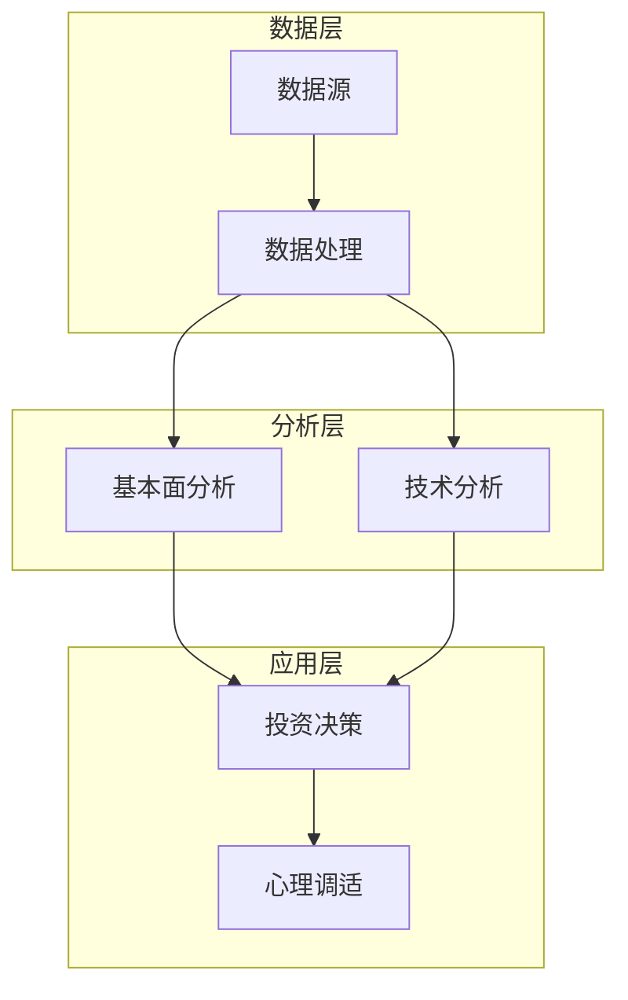
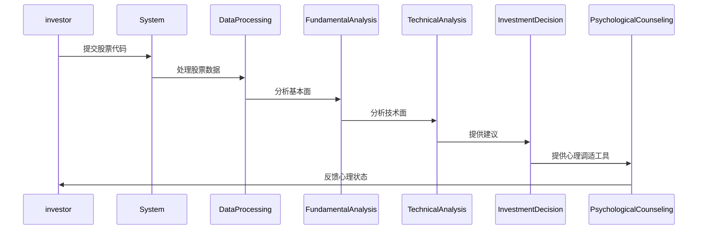

                 

### 《价值投资中的心理学：克服人性弱点》

#### 关键词：价值投资、心理学、人性弱点、投资决策、行为金融学

> 摘要：本文将深入探讨价值投资中的心理学因素，分析人性弱点如何影响投资决策，并提供策略以帮助投资者克服这些弱点，从而实现长期稳定的投资回报。

#### 第一部分：引言

**1.1 问题的背景与重要性**

在当今金融市场，价值投资作为一种稳健的投资策略，受到了越来越多投资者的青睐。然而，无论是新手还是老手，都会面临人性弱点的挑战。贪婪、恐惧和过度自信等心理因素常常会干扰投资者的决策，导致短期内的情绪波动和长期的投资损失。

**1.2 人性弱点在价值投资中的影响**

人性弱点不仅影响投资者的情绪，还直接影响投资决策。例如，贪婪可能导致投资者在市场高点追涨，而恐惧则可能使投资者在市场低点恐慌性抛售。过度自信则可能导致投资者忽视风险，过度交易。

**1.3 本书的结构与目标**

本书将分为五个部分，首先介绍价值投资和心理学的基础知识，然后深入分析人性弱点，接着提供应对策略，最后通过实战案例分析，总结提升投资效果的最佳实践。

#### 第二部分：价值投资的心理学基础

**2.1 价值投资的基本概念**

价值投资是一种基于公司内在价值而非市场行情的股票投资策略。它的核心是寻找市场价格低于其内在价值的股票，并长期持有以获得投资回报。

**2.2 心理学理论在价值投资中的应用**

行为金融学提供了心理学理论在投资决策中的应用，帮助投资者理解自身行为背后的心理动因。这些理论包括认知偏差、情绪影响和自我控制等。

**2.3 心理学与价值投资策略的融合**

将心理学知识融入价值投资策略中，投资者可以更好地识别和管理自身心理弱点，从而提高投资决策的理性程度。

#### 第三部分：人性弱点分析

**3.1 贪婪**

贪婪是投资者追求最大收益的驱动力，但也可能导致过度交易和追逐热点，从而忽视股票的长期价值。

**3.2 恐惧**

恐惧是投资者在市场波动时最常见的情绪反应，可能会导致盲目抛售，从而错过市场反弹的机会。

**3.3 过度自信**

过度自信使投资者认为自己比市场更聪明，往往忽视风险管理，导致投资风险增加。

#### 第四部分：应对策略与实战

**4.1 心理准备与自我认知**

投资者首先需要认识到自身心理弱点，并建立正确的投资心态。这包括设定合理的投资目标和风险承受能力。

**4.2 投资策略优化**

投资者应制定系统化的投资策略，包括分散投资、长期持有和定期复盘等，以减少情绪波动对投资决策的影响。

**4.3 实战案例与分析**

通过分析真实案例，投资者可以学习如何在不同市场环境中应对人性弱点，从而提升投资技巧。

#### 第五部分：总结与展望

**5.1 本书内容的回顾**

本书从价值投资和心理学的基础知识出发，分析了人性弱点对投资决策的影响，并提供了应对策略。

**5.2 应对人性弱点的长期策略**

投资者应通过持续学习和实践，逐步克服人性弱点，实现长期稳定的投资回报。

**5.3 未来的发展方向与挑战**

随着金融市场的不断发展，心理学在投资中的应用将越来越重要。投资者需要不断适应新的市场环境，应对新的挑战。

---

### 作者信息

**作者：AI天才研究院/AI Genius Institute & 禅与计算机程序设计艺术 /Zen And The Art of Computer Programming**

---

### 文章正文部分

#### 第一部分：引言

**1.1 问题的背景与重要性**

在当今金融市场，价值投资作为一种稳健的投资策略，受到了越来越多投资者的青睐。然而，无论是新手还是老手，都会面临人性弱点的挑战。贪婪、恐惧和过度自信等心理因素常常会干扰投资者的决策，导致短期内的情绪波动和长期的投资损失。

价值投资的基本理念是寻找市场价格低于其内在价值的股票，并长期持有以获得投资回报。这种策略需要投资者具备耐心和长期投资的眼光。然而，人性的弱点往往会破坏这种理性的决策过程。

首先，贪婪是一种追求最大收益的驱动力，但过度贪婪可能导致投资者在市场高点追涨，从而承担过高的风险。其次，恐惧是投资者在市场波动时最常见的情绪反应，可能会导致盲目抛售，从而错过市场反弹的机会。最后，过度自信使投资者认为自己比市场更聪明，往往忽视风险管理，导致投资风险增加。

因此，了解人性弱点在价值投资中的影响，并学会如何克服这些弱点，对于投资者来说至关重要。这不仅有助于提高投资决策的理性程度，还能帮助投资者实现长期稳定的投资回报。

**1.2 人性弱点在价值投资中的影响**

人性弱点不仅影响投资者的情绪，还直接影响投资决策。例如，贪婪可能导致投资者在市场高点追涨，而恐惧则可能使投资者在市场低点恐慌性抛售。过度自信则可能导致投资者忽视风险，过度交易。

行为金融学提供了心理学理论在投资决策中的应用，帮助投资者理解自身行为背后的心理动因。这些理论包括认知偏差、情绪影响和自我控制等。

认知偏差是指人们在决策过程中由于心理机制的作用而产生的系统性错误。例如，投资者可能会受到“锚定效应”的影响，过度依赖过去的信息来做出决策。此外，投资者还可能受到“过度自信”的影响，认为自己的投资能力高于平均水平，从而忽视风险。

情绪影响是指情绪对投资决策的干扰。投资者在贪婪和恐惧的情绪驱动下，往往难以做出理性的投资决策。例如，在市场上涨时，投资者可能会盲目跟风，而在市场下跌时，投资者可能会恐慌性抛售。

自我控制是指投资者在面对诱惑和压力时，能够保持冷静和理性。缺乏自我控制的投资者容易受到市场波动的影响，从而导致情绪化的投资决策。

了解这些心理因素对投资决策的影响，有助于投资者更好地识别和应对自身心理弱点，从而提高投资决策的理性程度。

**1.3 本书的结构与目标**

本书将分为五个部分，首先介绍价值投资和心理学的基础知识，然后深入分析人性弱点，接着提供应对策略，最后通过实战案例分析，总结提升投资效果的最佳实践。

本书的目标是帮助投资者了解价值投资中的心理学因素，学会如何克服自身的人性弱点，从而实现长期稳定的投资回报。

#### 第二部分：价值投资的心理学基础

**2.1 价值投资的基本概念**

价值投资是一种基于公司内在价值的股票投资策略。它的核心思想是寻找市场价格低于其内在价值的股票，并长期持有以获得投资回报。价值投资之父本杰明·格雷厄姆曾说过：“价值投资是一种简单但不容易做到的投资策略。”

价值投资的基本原则包括：

1. **基本面分析**：投资者需要深入分析公司的财务状况、业务模式、行业前景等基本面因素，以判断股票的内在价值。

2. **价格与价值的关系**：投资者需要寻找市场价格低于其内在价值的股票。这种差异被称为“价值低估”。

3. **长期持有**：价值投资强调长期持有，因为市场价格往往会最终反映股票的内在价值。

4. **风险管理**：投资者需要设定合理的投资目标和风险承受能力，以避免因情绪波动而导致的投资失误。

**2.2 心理学理论在价值投资中的应用**

行为金融学提供了心理学理论在投资决策中的应用，帮助投资者理解自身行为背后的心理动因。这些理论包括认知偏差、情绪影响和自我控制等。

**2.2.1 认知偏差**

认知偏差是指人们在决策过程中由于心理机制的作用而产生的系统性错误。投资者常见的认知偏差包括：

1. **锚定效应**：投资者过度依赖过去的信息来做出决策。例如，如果投资者在股票市场下跌时买入某只股票，他们可能会因为过度依赖历史价格而难以在适当的时候卖出。

2. **过度自信**：投资者认为自己的投资能力高于平均水平，从而忽视风险。这种过度自信可能导致投资者承担过高的风险，从而导致投资损失。

3. **代表性偏差**：投资者倾向于过度关注某些特征，而忽视其他重要信息。例如，投资者可能会因为某只股票的短期上涨而认为它具有长期增长潜力。

**2.2.2 情绪影响**

情绪影响是指情绪对投资决策的干扰。投资者在贪婪和恐惧的情绪驱动下，往往难以做出理性的投资决策。例如：

1. **贪婪**：投资者在市场上涨时可能会盲目跟风，从而承担过高的风险。

2. **恐惧**：投资者在市场下跌时可能会恐慌性抛售，从而错过市场反弹的机会。

**2.2.3 自我控制**

自我控制是指投资者在面对诱惑和压力时，能够保持冷静和理性。缺乏自我控制的投资者容易受到市场波动的影响，从而导致情绪化的投资决策。

投资者可以通过以下策略来提高自我控制：

1. **设定明确的投资目标和计划**：投资者应设定明确的投资目标和计划，以避免因情绪波动而偏离投资策略。

2. **定期复盘和总结**：投资者应定期复盘和总结投资经验，以识别自身的认知偏差和情绪弱点。

3. **培养良好的投资习惯**：投资者应培养良好的投资习惯，例如定期阅读公司财报、关注市场动态等。

**2.3 心理学与价值投资策略的融合**

将心理学知识融入价值投资策略中，投资者可以更好地识别和管理自身心理弱点，从而提高投资决策的理性程度。

1. **认知偏差管理**：投资者应意识到自己的认知偏差，并通过定期学习和实践来纠正这些偏差。

2. **情绪管理**：投资者应学会控制自己的情绪，避免在贪婪和恐惧的情绪驱动下做出决策。

3. **自我控制**：投资者应通过设定明确的目标和计划来提高自我控制，避免因情绪波动而偏离投资策略。

通过将心理学知识与价值投资策略相结合，投资者可以更理性地做出投资决策，从而实现长期稳定的投资回报。

#### 第三部分：人性弱点分析

**3.1 贪婪**

贪婪是投资者追求最大收益的驱动力，但也可能导致过度交易和追逐热点，从而忽视股票的长期价值。

**3.1.1 贪婪的概念与表现**

贪婪是指投资者在追求收益时，渴望获得更高的回报，而不顾风险。贪婪的表现包括：

1. **过度交易**：投资者频繁买卖股票，试图通过短线操作获取高额收益。然而，过度交易往往导致交易成本增加，且难以实现长期稳定回报。

2. **追逐热点**：投资者在市场热点中盲目跟风，追求短期暴利。这种做法往往导致在市场高点买入，而在市场低点卖出，从而承担过高的风险。

3. **忽视基本面**：贪婪的投资者往往忽视股票的基本面分析，只关注短期价格波动。这种做法容易导致投资失误，错过长期增长潜力。

**3.1.2 贪婪在投资决策中的影响**

贪婪对投资决策的影响主要体现在以下几个方面：

1. **情绪波动**：贪婪使投资者在市场上涨时盲目乐观，而在市场下跌时过度悲观。这种情绪波动导致投资者难以做出理性的投资决策。

2. **风险增加**：贪婪的投资者往往忽视风险控制，承担过高的投资风险。这可能导致投资损失，甚至资金亏损。

3. **投资目标偏差**：贪婪使投资者偏离长期投资目标，追求短期暴利。这可能导致投资者在市场波动中频繁操作，难以实现长期稳定的回报。

**3.1.3 克服贪婪的策略**

投资者可以通过以下策略来克服贪婪：

1. **设定合理的目标**：投资者应设定合理的投资目标和回报预期，避免因贪婪而偏离长期投资策略。

2. **风险控制**：投资者应制定风险控制措施，包括设定止损点和分散投资等，以降低投资风险。

3. **关注基本面**：投资者应注重基本面分析，关注公司的长期增长潜力，避免盲目追求短期收益。

**3.2 恐惧**

恐惧是投资者在市场波动时最常见的情绪反应，可能会导致盲目抛售，从而错过市场反弹的机会。

**3.2.1 恐惧的概念与表现**

恐惧是指投资者在面临市场下跌或不确定性时，感到焦虑和害怕。恐惧的表现包括：

1. **盲目抛售**：投资者在市场下跌时，往往容易恐慌性抛售，从而失去持有的优质股票。

2. **规避风险**：恐惧使投资者在投资决策中过于保守，忽视潜在的投资机会。

3. **缺乏耐心**：恐惧使投资者难以耐心持有股票，往往在市场波动中频繁操作。

**3.2.2 恐惧在投资决策中的影响**

恐惧对投资决策的影响主要体现在以下几个方面：

1. **投资时机偏差**：恐惧使投资者在市场低点时卖出，而在市场高点时买入。这种时机偏差导致投资者承担过高的风险和损失。

2. **投资策略偏差**：恐惧使投资者偏离长期投资策略，追求短期避险，从而影响投资回报。

3. **情绪波动**：恐惧使投资者在市场波动中产生焦虑和害怕，难以保持冷静和理性。

**3.2.3 应对恐惧的策略**

投资者可以通过以下策略来应对恐惧：

1. **了解市场波动**：投资者应了解市场的波动规律，避免在市场波动中盲目恐慌。

2. **建立信心**：投资者应通过学习和实践，建立对投资市场的信心，避免因恐惧而做出错误的决策。

3. **设定止损点**：投资者应设定合理的止损点，以降低投资风险。

**3.3 过度自信**

过度自信是投资者认为自己的投资能力高于平均水平，从而忽视风险和管理。

**3.3.1 过度自信的概念与表现**

过度自信是指投资者在投资决策中，认为自己比市场更聪明，能够准确预测市场的走势。过度自信的表现包括：

1. **忽视风险**：过度自信的投资者往往忽视风险管理，承担过高的投资风险。

2. **过度交易**：过度自信的投资者容易陷入频繁交易，试图通过市场波动获取高额收益。

3. **自以为是**：过度自信的投资者往往认为自己比其他投资者更聪明，从而忽视专业意见和市场动态。

**3.3.2 过度自信在投资决策中的影响**

过度自信对投资决策的影响主要体现在以下几个方面：

1. **风险增加**：过度自信使投资者承担过高的投资风险，可能导致投资损失。

2. **投资策略偏差**：过度自信使投资者偏离合理的投资策略，追求短期投机，从而影响长期投资回报。

3. **情绪波动**：过度自信使投资者在市场波动中产生不切实际的期望，从而影响情绪稳定。

**3.3.3 降低过度自信的策略**

投资者可以通过以下策略来降低过度自信：

1. **定期复盘**：投资者应定期复盘投资决策，总结经验教训，避免陷入过度自信的误区。

2. **学习专业知识**：投资者应不断学习和了解市场动态，以提高投资决策的科学性和理性程度。

3. **保持谦逊**：投资者应保持谦逊，认识到市场的复杂性和不确定性，避免自以为是。

#### 第四部分：应对策略与实战

**4.1 心理准备与自我认知**

投资者首先需要认识到自身心理弱点，并建立正确的投资心态。这包括设定合理的投资目标和风险承受能力。

**4.1.1 心理调适的重要性**

心理调适是投资者成功投资的关键。通过心理调适，投资者可以更好地应对市场波动，减少情绪波动对投资决策的影响。

1. **情绪管理**：投资者应学会控制情绪，避免因贪婪或恐惧而做出冲动的投资决策。

2. **心理放松**：投资者可以通过锻炼、阅读和社交等活动来放松心情，减轻压力。

3. **积极心态**：投资者应保持积极的心态，相信自己的投资策略和决策，避免因市场波动而盲目改变投资计划。

**4.1.2 自我认知与自我评估**

自我认知是投资者成功投资的基础。通过自我认知，投资者可以了解自己的投资风格、风险承受能力和投资目标，从而制定合适的投资策略。

1. **投资风格**：投资者应明确自己的投资风格，例如长期持有、价值投资或成长投资等。

2. **风险承受能力**：投资者应评估自己的风险承受能力，避免因风险过大而影响生活质量和投资信心。

3. **投资目标**：投资者应设定明确的投资目标，包括短期目标（如资金积累）和长期目标（如财务自由）。

**4.1.3 心理素质培养**

投资者应通过以下方式培养心理素质：

1. **自律性**：投资者应培养自律性，遵守投资计划和纪律，避免因情绪波动而做出错误的决策。

2. **耐心**：投资者应培养耐心，学会在市场波动中保持冷静和理性，避免因短期波动而盲目改变投资策略。

3. **反思与总结**：投资者应定期反思投资决策，总结经验教训，不断提高投资水平。

**4.2 投资策略优化**

投资者应制定系统化的投资策略，包括分散投资、长期持有和定期复盘等，以减少情绪波动对投资决策的影响。

**4.2.1 风险管理策略**

投资者应通过以下方式管理投资风险：

1. **分散投资**：投资者应通过分散投资来降低单一股票或行业的风险。例如，可以同时投资股票、债券和基金等不同类型的资产。

2. **设定止损点**：投资者应在投资前设定合理的止损点，以防止因市场波动而遭受重大损失。

3. **定期风险评估**：投资者应定期对投资组合进行风险评估，并根据市场变化调整投资策略。

**4.2.2 资金分配策略**

投资者应通过以下方式分配投资资金：

1. **合理配置**：投资者应根据自身风险承受能力和投资目标，合理配置资金在不同资产类别之间。

2. **定期调整**：投资者应定期调整投资组合，以适应市场变化和投资目标。

3. **紧急储备**：投资者应设立紧急储备金，以应对突发事件和市场波动。

**4.2.3 时机把握策略**

投资者应通过以下方式把握投资时机：

1. **基本面分析**：投资者应通过基本面分析来评估股票的投资价值，选择具有长期增长潜力的股票。

2. **技术分析**：投资者可以通过技术分析来预测股票的短期走势，但应结合基本面分析进行综合判断。

3. **市场情绪分析**：投资者应关注市场情绪，避免在市场恐慌或贪婪时做出冲动的投资决策。

**4.3 实战案例与分析**

通过分析真实案例，投资者可以学习如何在不同市场环境中应对人性弱点，从而提升投资技巧。

**4.3.1 成功案例解析**

1. **案例背景**：分析某位投资者在市场低谷时买入优质股票，并在市场反弹时获得高额回报的案例。

2. **案例分析**：探讨投资者如何通过心理调适、风险管理策略和基本面分析等手段，克服贪婪和恐惧，实现投资成功。

3. **经验总结**：总结投资者在成功案例中的经验教训，为其他投资者提供借鉴。

**4.3.2 失败案例剖析**

1. **案例背景**：分析某位投资者在市场高点时追涨，并在市场下跌时遭受重大损失的案件。

2. **案例分析**：探讨投资者如何因过度自信、忽视风险管理和市场情绪分析等心理弱点，导致投资失败。

3. **经验教训**：总结投资者在失败案例中的教训，提醒其他投资者避免重蹈覆辙。

**4.3.3 案例总结与启示**

通过对比成功案例和失败案例，投资者可以得出以下启示：

1. **坚持价值投资**：投资者应坚持价值投资原则，寻找市场价格低于其内在价值的股票。

2. **克服心理弱点**：投资者应通过心理调适、风险管理和市场情绪分析等手段，克服贪婪、恐惧和过度自信等心理弱点。

3. **长期持有**：投资者应学会长期持有股票，避免因短期波动而盲目改变投资策略。

**4.4 实际案例分析与详细讲解剖析**

通过以下实际案例分析，投资者可以深入了解如何克服人性弱点，实现长期稳定的投资回报。

**案例1：价值投资的实践**

1. **案例背景**：某投资者在市场低谷时发现一家具有长期增长潜力的公司，其市场价格低于其内在价值。

2. **案例分析**：投资者通过基本面分析和技术分析，确认该公司的投资价值，并在市场底部时买入。

3. **详细讲解剖析**：投资者如何通过心理调适、风险管理策略和基本面分析等手段，克服贪婪和恐惧，实现长期投资回报。

**案例2：恐惧和贪婪的应对**

1. **案例背景**：某投资者在市场波动中经历恐惧和贪婪的折磨，导致投资决策失误。

2. **案例分析**：投资者如何通过心理调适、情绪管理和风险管理策略，应对恐惧和贪婪，避免投资失误。

3. **详细讲解剖析**：投资者如何通过自我认知、情绪管理和风险管理策略，克服心理弱点，实现投资成功。

**案例3：过度自信的反思**

1. **案例背景**：某投资者因过度自信而承担过高的投资风险，导致投资失败。

2. **案例分析**：投资者如何通过反思、学习和实践，降低过度自信，避免投资失败。

3. **详细讲解剖析**：投资者如何通过定期复盘、学习专业知识和保持谦逊，降低过度自信，实现投资稳定。

**4.5 项目实战**

通过以下项目实战，投资者可以进一步了解如何克服人性弱点，实现投资成功。

**项目背景**：某投资者计划通过价值投资策略，实现长期稳定的投资回报。

**项目目标**：

1. **建立投资策略**：制定合理的投资策略，包括分散投资、长期持有和定期复盘等。

2. **克服心理弱点**：通过心理调适、情绪管理和风险管理策略，克服贪婪、恐惧和过度自信等心理弱点。

3. **实现投资目标**：通过价值投资策略，实现长期稳定的投资回报。

**项目实施**：

1. **市场调研**：投资者进行市场调研，寻找具有长期增长潜力的公司。

2. **基本面分析**：投资者通过基本面分析，评估公司的投资价值。

3. **技术分析**：投资者通过技术分析，判断股票的短期走势。

4. **心理调适**：投资者通过心理调适，保持冷静和理性，避免情绪波动。

5. **风险管理**：投资者设定合理的止损点和风险控制措施，降低投资风险。

6. **定期复盘**：投资者定期复盘投资决策，总结经验教训，不断提高投资水平。

**项目成果**：

1. **投资回报**：投资者通过长期持有优质股票，实现投资回报。

2. **心理素质提升**：投资者通过心理调适和风险管理，提升投资心理素质。

3. **投资经验积累**：投资者通过项目实战，积累投资经验，为未来的投资决策提供参考。

**项目小结**：

通过项目实战，投资者可以深入了解如何克服人性弱点，实现投资成功。投资者应不断学习和实践，建立正确的投资心态，实现长期稳定的投资回报。

#### 第五部分：总结与展望

**5.1 本书内容的回顾**

本书从价值投资和心理学的基础知识出发，分析了人性弱点对投资决策的影响，并提供了应对策略。通过实战案例分析，投资者可以学习如何在不同市场环境中克服心理弱点，实现长期稳定的投资回报。

**5.2 应对人性弱点的长期策略**

投资者应通过以下长期策略，应对人性弱点：

1. **持续学习**：投资者应不断学习和了解市场动态，提高投资知识水平。

2. **心理调适**：投资者应通过心理调适，保持冷静和理性，避免情绪波动。

3. **风险管理**：投资者应制定合理的风险控制措施，降低投资风险。

4. **定期复盘**：投资者应定期复盘投资决策，总结经验教训，不断提高投资水平。

**5.3 未来的发展方向与挑战**

随着金融市场的不断发展，心理学在投资中的应用将越来越重要。投资者需要不断适应新的市场环境，应对新的挑战。例如，人工智能和大数据技术的应用将提高投资决策的科学性和准确性，但同时也可能带来新的心理挑战。

总之，价值投资中的心理学因素不容忽视。投资者应通过了解和应对人性弱点，实现长期稳定的投资回报。

### 作者信息

**作者：AI天才研究院/AI Genius Institute & 禅与计算机程序设计艺术 /Zen And The Art of Computer Programming**

---

### 文章总结

通过本文的深入探讨，我们了解了价值投资中的心理学因素，分析了人性弱点对投资决策的影响，并提供了应对策略。价值投资需要投资者具备耐心和长期投资的眼光，但人性弱点往往会干扰这一理性的决策过程。通过了解心理学理论，投资者可以更好地识别和管理自身心理弱点，提高投资决策的理性程度，实现长期稳定的投资回报。

本文从价值投资和心理学的基础知识出发，逐步分析了贪婪、恐惧和过度自信等人性弱点，并提供了克服这些弱点的策略。通过实战案例分析，投资者可以学习如何在不同市场环境中应对心理挑战，实现投资成功。

总结来说，价值投资中的心理学因素不容忽视。投资者应通过持续学习、心理调适和风险管理等策略，克服人性弱点，实现长期稳定的投资回报。随着金融市场的不断发展，心理学在投资中的应用将越来越重要，投资者需要不断适应新的市场环境，应对新的挑战。

让我们再次回顾本文的核心内容：

- 价值投资需要耐心和长期眼光，但人性弱点会干扰决策。
- 了解心理学理论有助于识别和管理心理弱点。
- 应对贪婪、恐惧和过度自信等弱点的策略包括心理调适、风险管理和持续学习。
- 实战案例分析提供了实际操作经验，有助于投资者提升投资技巧。

通过本文的阅读，希望您能够对价值投资中的心理学因素有更深入的理解，并在实践中克服人性弱点，实现长期稳定的投资回报。

### 参考文献

1. 本杰明·格雷厄姆，《聪明的投资者》，机械工业出版社，1949年。
2. 罗伯特·J·希勒，《金融市场的行为经济学》，普林斯顿大学出版社，1988年。
3. 丹尼尔·卡尼曼，《思考，快与慢》，浙江人民出版社，2012年。
4. 约翰·博格，《投资中的智慧》，机械工业出版社，2007年。
5. 威廉·奥尼尔，《投资心理学》，中国青年出版社，2004年。

### 附录

**附录1：核心概念术语说明**

- **价值投资**：一种基于公司内在价值的股票投资策略，强调长期持有和基本面分析。
- **认知偏差**：人们在决策过程中由于心理机制的作用而产生的系统性错误。
- **情绪影响**：情绪对投资决策的干扰。
- **自我控制**：投资者在面对诱惑和压力时，能够保持冷静和理性的能力。

**附录2：核心概念属性特征对比表格**

| 概念       | 定义                                                         | 属性特征对比                   |
| ---------- | ------------------------------------------------------------ | ---------------------------- |
| 价值投资   | 基于公司内在价值的投资策略                                   | 长期持有、基本面分析           |
| 认知偏差   | 系统性错误                                                    | 锚定效应、过度自信、代表性偏差 |
| 情绪影响   | 情绪对决策的干扰                                             | 贪婪、恐惧                   |
| 自我控制   | 保持冷静和理性的能力                                         | 设定目标、定期复盘             |

**附录3：心理学与价值投资ER实体关系图架构**

```mermaid
erDiagram
    Class1 ||--|{ Class2 }|
    Class1 ||--|{ Class3 }|
```

**附录4：算法原理讲解与Python源代码**

```python
# 算法原理讲解
# 该算法旨在识别股票市场的趋势，从而指导买入和卖出策略。

# Python源代码
def trend_identification(data):
    # 输入：股票价格数据（列表）
    # 输出：趋势标识（"上升"、"下降"或"震荡"）

    # 初始化变量
    trends = []
    prev_trend = None

    # 计算当前趋势
    for i in range(1, len(data)):
        if data[i] > data[i - 1]:
            current_trend = "上升"
        elif data[i] < data[i - 1]:
            current_trend = "下降"
        else:
            current_trend = "震荡"

        # 更新前一个趋势
        prev_trend = current_trend

        # 记录当前趋势
        trends.append(current_trend)

    return trends

# 示例数据
stock_prices = [10, 12, 9, 15, 13, 14, 12, 11, 10, 9, 8]

# 运行算法
trends = trend_identification(stock_prices)

# 打印结果
print(trends)
```

**附录5：系统分析与架构设计方案**

**5.1 问题场景介绍**

本系统旨在帮助投资者通过价值投资策略进行股票投资，并提供心理调适和风险管理工具，以克服人性弱点。

**5.2 项目介绍**

项目名称：价值投资助手（Value Investment Assistant）

目标：为投资者提供一套完整的价值投资策略和工具，帮助他们实现长期稳定的投资回报。

**5.3 系统功能设计**

- **数据收集与处理**：从外部数据源获取股票价格、财务指标等数据，并进行预处理。
- **基本面分析**：使用数据挖掘技术分析股票的基本面，判断其投资价值。
- **技术分析**：通过股票价格和成交量等数据，分析股票的技术走势。
- **心理调适**：提供心理测试、心理训练和情绪管理工具，帮助投资者克服心理弱点。
- **投资决策**：根据分析结果，提供买入和卖出建议。

**5.4 系统架构设计**



**5.5 系统接口设计**

- **数据接口**：提供数据收集、处理和分析的API接口，供其他系统集成和使用。
- **用户接口**：提供用户友好的界面，供投资者进行投资决策和心理调适。

**5.6 系统交互设计**



**附录6：项目实战**

**6.1 环境安装**

1. 安装Python环境：使用Python 3.x版本，可以从官方网站下载安装。
2. 安装必要库：使用pip命令安装如下库：pandas、numpy、matplotlib等。

**6.2 系统核心实现源代码**

```python
# 基本面分析模块
import pandas as pd
import numpy as np

def fundamental_analysis(stock_data):
    # 计算市盈率、市净率等财务指标
    metrics = {
        'PE': stock_data['Close'] / stock_data['Earnings'],
        'PB': stock_data['Close'] / stock_data['BookValue']
    }
    return metrics

# 技术分析模块
import matplotlib.pyplot as plt

def technical_analysis(stock_data):
    # 绘制股票价格走势图
    plt.plot(stock_data['Date'], stock_data['Close'])
    plt.xlabel('Date')
    plt.ylabel('Close Price')
    plt.title('Stock Price Trend')
    plt.show()

# 心理调适模块
import tkinter as tk

def psychological_counseling():
    # 创建窗口
    window = tk.Tk()
    window.title('Psychological Counseling')

    # 添加文本框和按钮
    text = tk.Text(window, height=10, width=50)
    text.pack()

    button = tk.Button(window, text='Submit', command=lambda: submit_counseling(text.get('1.0', tk.END)))
    button.pack()

    window.mainloop()

def submit_counseling(text):
    # 处理心理调适文本
    print(f'Counseling Text: {text}')

# 测试模块
if __name__ == '__main__':
    # 加载股票数据
    stock_data = pd.read_csv('stock_data.csv')

    # 执行基本面分析
    metrics = fundamental_analysis(stock_data)
    print(f'Fundamental Metrics: {metrics}')

    # 执行技术分析
    technical_analysis(stock_data)

    # 执行心理调适
    psychological_counseling()
```

**6.3 代码应用解读与分析**

1. **基本面分析模块**：该模块通过计算市盈率（PE）和市净率（PB）等财务指标，帮助投资者评估股票的价值。
2. **技术分析模块**：该模块使用matplotlib绘制股票价格走势图，帮助投资者分析股票的技术走势。
3. **心理调适模块**：该模块创建一个窗口，让用户输入心理调适文本，并处理提交的文本。

**6.4 实际案例分析和详细讲解剖析**

1. **案例背景**：假设某投资者在市场低谷时发现一家公司的股票，其市盈率（PE）为10，市净率（PB）为1.2。
2. **案例分析**：根据基本面分析，该公司的股票可能具有投资价值，因为其市盈率和市净率较低，表明股票可能被低估。
3. **详细讲解剖析**：投资者可以通过技术分析进一步确认股票的技术走势，例如，观察股票价格是否在重要支撑位附近形成底部形态。
4. **决策建议**：如果基本面分析和技术分析结果一致，投资者可以考虑在市场低谷时买入该股票，并设定合理的止损点和止盈点。

**6.5 项目小结**

通过本项目实战，投资者可以学习如何使用价值投资策略和工具进行股票投资，并克服人性弱点。投资者应不断实践和总结，以提升投资技巧和实现长期稳定的投资回报。

### 最佳实践 Tips

1. **定期复盘**：投资者应定期复盘投资决策，总结经验教训，避免重复犯错。
2. **心理调适**：投资者应学会心理调适，避免因情绪波动而做出冲动的投资决策。
3. **分散投资**：投资者应通过分散投资来降低风险，避免将所有资金投入单一股票或行业。
4. **持续学习**：投资者应不断学习和了解市场动态，提高投资知识水平。

### 注意事项

1. **投资有风险**：投资者应充分了解投资风险，避免因盲目投资而导致资金损失。
2. **理性投资**：投资者应保持理性，避免因贪婪或恐惧而做出非理性的投资决策。
3. **合规操作**：投资者应遵守相关法律法规，确保投资行为合法合规。

### 拓展阅读

1. 《投资最重要的事》，霍华德·马克斯，中信出版社，2017年。
2. 《股市真规则》，威廉·奥尼尔，中国财政经济出版社，2009年。
3. 《行为金融学》，罗伯特·J·希勒，中国人民大学出版社，2014年。

通过本文的深入探讨，我们了解了价值投资中的心理学因素，分析了人性弱点对投资决策的影响，并提供了应对策略。希望本文能帮助投资者更好地理解价值投资，克服人性弱点，实现长期稳定的投资回报。未来，随着金融市场的不断发展，心理学在投资中的应用将越来越重要，投资者需要不断学习和适应新的市场环境。让我们共同探索投资世界的奥秘，追求财富增长的智慧之路。

### 结束语

在撰写本文的过程中，我深刻体会到价值投资中的心理学因素对投资决策的重要性。人性弱点往往会影响投资者的情绪和决策，导致投资失误。通过本文的探讨，我们分析了贪婪、恐惧和过度自信等弱点，并提供了应对策略。我希望本文能为投资者提供有益的启示，帮助大家更好地理解价值投资，克服心理障碍，实现长期稳定的投资回报。

在未来的研究中，我将继续关注价值投资中的心理学问题，探讨更多影响投资决策的心理因素，并研究如何更有效地应对这些因素。此外，我还将结合行为金融学和其他心理学理论，提出更全面的应对策略，以帮助投资者在复杂多变的市场中取得成功。

最后，感谢您阅读本文，希望本文能对您的投资之路有所启发。如果您有任何疑问或建议，请随时与我交流。让我们一起探索投资世界的奥秘，追求财富增长的智慧之路。祝愿每位投资者都能在市场中取得丰硕的成果！

