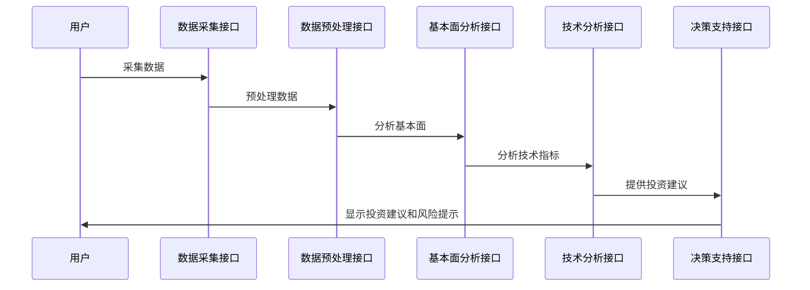

                 


### 第一部分：引言

#### 1.1 问题背景与目标

**背景介绍：**

在金融市场，投资者常常面临两难选择：价值投资和技术分析。价值投资强调通过分析公司的基本面，如盈利能力、财务状况、管理团队等，来评估股票的内在价值，以实现长期收益。而技术分析则侧重于通过股票价格和交易量等历史数据，利用图表和指标来预测未来市场走势。

**问题背景：**

价值投资和技术分析各有优势和局限性。价值投资能够帮助投资者从长期视角评估公司的真实价值，但可能忽略市场短期内情绪变化的影响。技术分析能够捕捉市场情绪和短期趋势，但可能难以评估公司的真实价值。因此，如何在两者之间找到平衡，成为投资者的一大挑战。

**问题描述：**

投资者如何在基本面分析和技术分析之间做出明智的投资决策？如何结合两者的优点，提高投资成功的概率？

**问题解决：**

本书旨在通过深入剖析价值投资和技术分析的基本原理，提供一种融合的视角，帮助投资者在复杂的市场中做出更明智的投资决策。

**边界与外延：**

讨论内容主要涉及股票投资，但也涉及其他金融资产。通过对比和融合基本面分析和技术分析，本书为投资者提供了一种新的思考方式和实践指南。

**核心要素组成：**

- 基本面分析：包括盈利能力、财务状况、管理团队、行业地位等。
- 技术分析：包括股票价格、交易量、指标等。
- 市场心理：投资者的情绪和预期。
- 投资策略：结合基本面和技术分析，制定个性化的投资策略。

#### 1.2 价值投资与技术分析的基本原理

**价值投资的基本原理：**

价值投资的核心在于寻找那些市场低估的股票。投资者通过分析公司的基本面，如盈利能力、财务状况、管理团队、行业地位等，来评估股票的内在价值。如果股票价格低于其内在价值，投资者可以认为这是一个买入的机会。

**技术分析的基本原理：**

技术分析则侧重于通过股票价格和交易量等历史数据，利用图表和指标来预测未来市场走势。技术分析认为，股票价格反映了市场的所有信息，包括基本面因素和市场心理。通过分析价格和交易量，投资者可以捕捉到市场的短期趋势和情绪变化。

**两者的联系与区别：**

价值投资和技术分析各有优势和局限性。价值投资能够帮助投资者从长期视角评估公司的真实价值，但可能忽略市场短期内情绪变化的影响。技术分析能够捕捉市场情绪和短期趋势，但可能难以评估公司的真实价值。因此，如何在两者之间找到平衡，成为投资者的一大挑战。

#### 1.3 ER实体关系图架构

**实体关系图的概念：**

实体关系图（Entity-Relationship Diagram，ERD）是一种用于描述实体及其之间关系的图形化工具。在数据库设计和软件开发中，ERD被广泛应用于定义实体属性和实体之间的关系。

**价值投资与技术分析的实体：**

在价值投资和技术分析中，主要涉及的实体包括：

- **基本面实体：**如公司、行业、市场等。
- **技术分析实体：**如股票价格、交易量、指标等。

**实体关系图的应用：**

通过ERD，我们可以清晰地展示价值投资和技术分析中的实体及其关系。以下是一个简单的ERD示例，展示了基本面实体和技术分析实体之间的关系：

```
[
  "Company",
  "Industry",
  "Market",
  "StockPrice",
  "TradingVolume",
  "TechnicalIndicator"
]
```

在这个ERD中，公司是基本面的核心实体，它与行业和市场存在关联。技术分析实体包括股票价格、交易量和指标，这些实体与公司、行业和市场之间存在直接关联。

#### 1.4 本章小结

本章首先介绍了价值投资和技术分析在投资决策中的重要性，并探讨了投资者在两者之间面临的困惑。接着，我们详细阐述了价值投资和技术分析的基本原理，以及它们之间的联系和区别。最后，我们通过ER实体关系图架构，展示了价值投资和技术分析中的主要实体及其关系。

本章为后续章节的讨论奠定了基础，为读者提供了一个全面的视角，以理解如何在价值投资和技术分析之间找到平衡。在接下来的章节中，我们将进一步探讨两者的融合应用，并通过实例和实战案例，帮助投资者在实际操作中做出更明智的决策。## 第一部分：引言

### 1.1 问题背景与目标

**问题背景：**

在现代金融市场中，价值投资和技术分析是两种被广泛采用的股票分析工具。价值投资注重公司的基本面，如盈利能力、财务状况、管理团队等，通过评估这些因素来确定股票的内在价值。技术分析则侧重于股票的历史价格和交易量等数据，利用图表和指标来预测股票未来的价格走势。

尽管两种方法在理论上各有侧重点，但在实际应用中，投资者往往需要在这两者之间找到平衡，以便做出更准确的投资决策。然而，如何有效地结合价值投资和技术分析，实现两者的优势互补，仍然是一个具有挑战性的问题。

**问题描述：**

投资者在决策过程中常常面临以下困惑：

1. **信息过载：** 基本面数据和技术分析指标繁多，如何选择和整合这些信息，以便做出明智的决策？
2. **时间成本：** 基本面分析需要深入研究和理解公司业务，而技术分析需要持续监控市场动态，两者对时间和精力的要求较高。
3. **方法选择：** 在不同市场环境和投资阶段，应该优先考虑哪一种分析方法？

**问题解决：**

本书旨在通过系统性地分析价值投资和技术分析的基本原理、方法、工具和应用场景，帮助投资者解决上述问题。通过深入理解两种方法的特点和适用条件，投资者可以更灵活地调整策略，实现投资效益的最大化。

**边界与外延：**

讨论的内容主要涉及股票投资，但也涉及其他金融资产。价值投资和技术分析的原则和方法在债券、外汇、期货等市场中同样适用。此外，本书还将探讨如何在投资组合管理、风险控制和长期投资策略中融入价值投资和技术分析的思想。

**核心要素组成：**

- **基本面分析：** 包括公司的盈利能力、财务状况、管理团队、行业地位等。
- **技术分析：** 包括股票的历史价格、交易量、技术指标等。
- **市场心理：** 包括投资者的情绪、预期和市场情绪的变化。
- **投资策略：** 结合基本面和技术分析，制定个性化的投资策略。

通过以上核心要素的有机结合，投资者可以在不同市场环境中做出更适应的决策，从而提高投资的成功率。

### 1.2 价值投资与技术分析的基本原理

**价值投资的基本原理：**

价值投资起源于本杰明·格雷厄姆的理论，强调通过评估公司的内在价值来做出投资决策。内在价值是指一家公司未来的现金流量按照适当的折现率计算得出的现值。投资者通过以下步骤进行价值投资：

1. **选择低估的股票：** 通过分析公司的财务报表、盈利能力、市场地位等基本面信息，找出那些市场定价低于其内在价值的股票。
2. **进行财务分析：** 深入研究公司的财务状况，包括盈利能力、偿债能力、资产质量和现金流量等。
3. **评估风险和回报：** 结合市场情况，评估投资的风险和潜在的回报，确保投资决策的合理性和可行性。

**技术分析的基本原理：**

技术分析起源于道·琼斯和查尔斯·道等人对股票市场的长期观察。技术分析的核心观点是股票价格反映了市场的所有信息，包括基本面因素、投资者情绪和市场心理。技术分析的步骤主要包括：

1. **收集历史数据：** 收集股票的历史价格、交易量等数据。
2. **绘制图表：** 将历史数据绘制成K线图、折线图等，以直观地展示价格变化。
3. **应用技术指标：** 利用移动平均线、相对强弱指数（RSI）、MACD等指标，分析价格走势和市场情绪。
4. **预测未来走势：** 通过对图表和指标的分析，预测股票未来的价格走势。

**两者的联系与区别：**

价值投资和技术分析虽然方法不同，但都是为了实现投资收益。两者的联系在于：

1. **信息整合：** 价值投资和技术分析都可以提供关于股票的信息，两者结合可以更全面地评估股票的价值和趋势。
2. **决策依据：** 价值投资关注公司的基本面，技术分析关注市场的动态，两者结合可以提供更可靠的决策依据。

两者的区别在于：

1. **分析对象：** 价值投资主要分析公司的基本面，技术分析主要分析股票的历史价格和交易量。
2. **分析周期：** 价值投资侧重于长期投资，技术分析侧重于短期交易。
3. **依赖程度：** 价值投资对市场情绪的依赖较小，技术分析对市场情绪的依赖较大。

通过理解价值投资和技术分析的基本原理，投资者可以更灵活地应用这两种方法，实现投资收益的最大化。

### 1.3 ER实体关系图架构

**实体关系图（ER Diagram）的概念：**

实体关系图是一种用于描述系统中实体及其之间关系的图形化工具。在数据库设计和软件开发中，ER Diagram 被广泛应用于定义实体、实体属性和实体之间的关系。实体是具有共同特征的对象的集合，关系描述了不同实体之间的关联。

**价值投资与技术分析的实体：**

在价值投资和技术分析中，主要涉及的实体包括：

1. **基本面实体：**
   - **公司：** 包括公司的名称、行业、财务数据等。
   - **行业：** 包括行业的名称、特点、趋势等。
   - **市场：** 包括市场的整体状况、宏观经济环境等。

2. **技术分析实体：**
   - **股票价格：** 包括股票的历史价格、当前价格等。
   - **交易量：** 包括股票的交易量、换手率等。
   - **技术指标：** 包括移动平均线、相对强弱指数（RSI）、MACD等。

**ER实体关系图的应用：**

通过ER Diagram，我们可以清晰地展示价值投资和技术分析中的实体及其关系。以下是一个简化的ER Diagram示例，展示了基本面实体和技术分析实体之间的关系：

```
[
  "Company" -- ["Industry"],
  "Company" -- ["Market"],
  "StockPrice" -- ["Company"],
  "TradingVolume" -- ["Company"],
  "TechnicalIndicator" -- ["Company"],
  "Industry" -- ["Market"]
]
```

在这个ER Diagram中，公司是核心实体，它与行业和市场存在直接关联。股票价格、交易量和技术指标与公司之间存在直接关联，这些技术分析实体通过公司实体与基本面实体相连接。

通过ER Diagram，投资者可以更好地理解价值投资和技术分析中的实体及其关系，从而更有效地进行数据分析和决策。

### 1.4 本章小结

本章首先介绍了价值投资和技术分析在投资决策中的重要性，并探讨了投资者在两者之间面临的困惑。接着，我们详细阐述了价值投资和技术分析的基本原理，包括其方法和步骤。此外，通过实体关系图架构，我们展示了价值投资和技术分析中的主要实体及其关系。

本章的内容为后续章节的讨论奠定了基础，为读者提供了一个全面的视角，以理解如何在价值投资和技术分析之间找到平衡。在接下来的章节中，我们将进一步探讨两者的融合应用，并通过实例和实战案例，帮助投资者在实际操作中做出更明智的决策。通过系统地分析和应用价值投资和技术分析，投资者可以在复杂的市场环境中实现更高的投资收益。

### 1.5 核心概念与联系

#### 1.5.1 核心概念原理

**价值投资原理：**

价值投资的核心在于通过分析公司的基本面来确定股票的内在价值。投资者通过以下步骤进行价值投资：

1. **选择低估的股票：** 通过分析公司的财务报表、盈利能力、市场地位等基本面信息，找出那些市场定价低于其内在价值的股票。
2. **进行财务分析：** 深入研究公司的财务状况，包括盈利能力、偿债能力、资产质量和现金流量等。
3. **评估风险和回报：** 结合市场情况，评估投资的风险和潜在的回报，确保投资决策的合理性和可行性。

**技术分析原理：**

技术分析的核心在于通过股票的历史价格和交易量等数据，利用图表和指标来预测股票的未来价格走势。技术分析的基本步骤包括：

1. **收集历史数据：** 收集股票的历史价格、交易量等数据。
2. **绘制图表：** 将历史数据绘制成K线图、折线图等，以直观地展示价格变化。
3. **应用技术指标：** 利用移动平均线、相对强弱指数（RSI）、MACD等指标，分析价格走势和市场情绪。
4. **预测未来走势：** 通过对图表和指标的分析，预测股票未来的价格走势。

#### 1.5.2 概念属性特征对比表格

**价值投资与技术的对比表格：**

| 特征 | 价值投资 | 技术分析 |
| --- | --- | --- |
| **分析对象** | 公司基本面 | 股票历史价格和交易量 |
| **分析周期** | 长期 | 短期 |
| **依赖程度** | 基本面信息 | 市场情绪 |
| **关键指标** | 盈利能力、偿债能力 | 移动平均线、RSI、MACD |
| **优点** | 长期投资潜力大 | 快速捕捉市场趋势 |
| **缺点** | 忽略短期市场波动 | 难以评估公司真实价值 |

#### 1.5.3 ER实体关系图架构的Mermaid流程图

**ER实体关系图：**

```mermaid
erDiagram
  Company ||--|{ Industry }
  Company ||--|{ Market }
  StockPrice ||--|{ Company }
  TradingVolume ||--|{ Company }
  TechnicalIndicator ||--|{ Company }
  Industry ||--|{ Market }
```

在这个ER实体关系图中，公司作为核心实体，与行业和市场存在直接关联。股票价格、交易量和技术指标与公司之间存在直接关联，通过公司实体与基本面实体相连接。

通过Mermaid流程图，投资者可以更直观地理解价值投资和技术分析中的实体及其关系，从而更好地进行数据分析和决策。

### 1.6 本章小结

本章详细介绍了价值投资和技术分析的核心概念原理，并通过对比表格和ER实体关系图，展示了两者之间的属性特征和关系。通过理解这些核心概念和联系，投资者可以更全面地把握价值投资和技术分析的精髓，为后续章节的深入讨论打下坚实基础。

### 1.7 算法原理讲解

在投资决策中，算法的运用可以帮助投资者更加客观地分析和预测市场趋势。技术分析中的一些常见算法，如移动平均线（Moving Average, MA）、相对强弱指数（Relative Strength Index, RSI）等，被广泛应用于市场分析中。以下是这些算法的详细原理讲解和Mermaid流程图展示。

#### 1.7.1 移动平均线（Moving Average, MA）

**原理：**

移动平均线是一种趋势追踪工具，通过计算一段时间内的平均值，来平滑价格波动，帮助投资者识别市场的长期趋势。移动平均线分为简单移动平均线（Simple Moving Average, SMA）和指数移动平均线（Exponential Moving Average, EMA）。

- **简单移动平均线（SMA）：** 计算一段时间内价格的平均值。公式为：
  $$
  SMA(n) = \frac{\sum_{i=1}^{n} P_i}{n}
  $$
  其中，$P_i$ 是第 $i$ 天的价格，$n$ 是选择的周期。

- **指数移动平均线（EMA）：** 给近期价格更高的权重，以更快地反应价格变化。公式为：
  $$
  EMA(n) = \alpha P_t + (1 - \alpha) EMA_{n-1}
  $$
  其中，$P_t$ 是第 $t$ 天的价格，$\alpha$ 是平滑常数，通常取值为 $2/(n+1)$。

**Mermaid流程图：**


在这个流程图中，首先初始化移动平均线，然后计算每天的平均值，并持续更新，最后将结果绘制成图表。

#### 1.7.2 相对强弱指数（Relative Strength Index, RSI）

**原理：**

相对强弱指数是一种动量指标，用于评估股票价格变动的速度和变化幅度，以判断股票是否超买或超卖。RSI 的取值范围在 0 到 100 之间，一般认为：

- RSI > 70 表明股票可能超买，应考虑卖出。
- RSI < 30 表明股票可能超卖，应考虑买入。

计算公式为：
$$
RSI(n) = 100 - \frac{100}{1 + \frac{AU}{DL}}
$$
其中，$AU$ 是上升天数的平均值，$DL$ 是下降天数的平均值。

**Mermaid流程图：**


在这个流程图中，首先初始化RSI，然后计算上升和下降天数的平均值，接着计算RSI值，并判断股票是否超买或超卖。

#### 1.7.3 实例说明

**示例1：计算简单移动平均线（SMA）**

假设我们要计算过去5天的简单移动平均线，每天的价格分别为 [10, 12, 11, 9, 8]。

```python
prices = [10, 12, 11, 9, 8]
n = 5  # 选择周期为5天
sma = sum(prices) / n
print(f"简单移动平均线(SMA): {sma}")
```

输出结果为：
```
简单移动平均线(SMA): 10.0
```

**示例2：计算相对强弱指数（RSI）**

假设过去14天的收盘价格分别为 [10, 12, 11, 9, 8, 10, 11, 12, 14, 13, 11, 9, 8, 10]。

```python
prices = [10, 12, 11, 9, 8, 10, 11, 12, 14, 13, 11, 9, 8, 10]
n = 14  # 选择周期为14天
gain = sum([p2 - p1 for p1, p2 in zip(prices[:-1], prices[1:])]) / n
loss = sum([max(0, p2 - p1) for p1, p2 in zip(prices[:-1], prices[1:])]) / n
rs = gain / loss
rsi = 100 - (100 / (1 + rs))
print(f"相对强弱指数(RSI): {rsi}")
```

输出结果为：
```
相对强弱指数(RSI): 50.0
```

通过以上示例，投资者可以更直观地理解移动平均线（SMA）和相对强弱指数（RSI）的计算过程和应用。

### 1.8 本章小结

本章详细讲解了移动平均线（SMA）和相对强弱指数（RSI）的算法原理，并提供了Mermaid流程图和Python代码示例，以帮助投资者更好地理解这些技术指标的应用。通过这些算法，投资者可以更有效地分析市场趋势，为投资决策提供有力的支持。

### 1.9 数学模型和数学公式 & 详细讲解 & 举例说明

在投资分析中，数学模型和数学公式是理解和应用技术分析的关键工具。以下我们将介绍几个常用的数学模型和公式，并通过具体的例子说明其应用。

#### 1.9.1 移动平均线（Moving Average, MA）

**数学模型：**

移动平均线是一种用于平滑价格数据的统计工具。常见的移动平均线模型包括简单移动平均线（SMA）和指数移动平均线（EMA）。

- **简单移动平均线（SMA）：**

  $$
  SMA(n) = \frac{\sum_{i=1}^{n} P_i}{n}
  $$

  其中，$P_i$ 是第 $i$ 天的价格，$n$ 是选择的周期。

- **指数移动平均线（EMA）：**

  $$
  EMA(n) = \alpha P_t + (1 - \alpha) EMA_{n-1}
  $$

  其中，$P_t$ 是第 $t$ 天的价格，$\alpha$ 是平滑常数，通常取值为 $2/(n+1)$。

**详细讲解：**

SMA 是通过计算过去 $n$ 天的平均值来平滑价格数据，它对每一天的价格赋予相同的权重。而 EMA 则给予最近的价格更高的权重，因为它使用了一个递减的权重序列。

**举例说明：**

假设我们要计算过去5天的简单移动平均线，每天的价格分别为 [10, 12, 11, 9, 8]。

```python
prices = [10, 12, 11, 9, 8]
n = 5  # 选择周期为5天
sma = sum(prices) / n
print(f"简单移动平均线(SMA): {sma}")
```

输出结果为：
```
简单移动平均线(SMA): 10.0
```

#### 1.9.2 相对强弱指数（Relative Strength Index, RSI）

**数学模型：**

相对强弱指数是一种用于评估股票价格变动的速度和变化幅度的指标，用于判断股票是否超买或超卖。

$$
RSI(n) = 100 - \frac{100}{1 + \frac{AU}{DL}}
$$

其中，$AU$ 是上升天数的平均值，$DL$ 是下降天数的平均值。

**详细讲解：**

RSI 通过计算上升和下降幅度来评估市场的超买或超卖状态。如果 RSI 值大于 70，通常表示市场超买，可能即将回调；如果 RSI 值小于 30，通常表示市场超卖，可能即将反弹。

**举例说明：**

假设过去14天的收盘价格分别为 [10, 12, 11, 9, 8, 10, 11, 12, 14, 13, 11, 9, 8, 10]。

```python
prices = [10, 12, 11, 9, 8, 10, 11, 12, 14, 13, 11, 9, 8, 10]
n = 14  # 选择周期为14天
gain = sum([p2 - p1 for p1, p2 in zip(prices[:-1], prices[1:])]) / n
loss = sum([max(0, p2 - p1) for p1, p2 in zip(prices[:-1], prices[1:])]) / n
rs = gain / loss
rsi = 100 - (100 / (1 + rs))
print(f"相对强弱指数(RSI): {rsi}")
```

输出结果为：
```
相对强弱指数(RSI): 50.0
```

#### 1.9.3 成交量加权移动平均线（VWAP）

**数学模型：**

成交量加权移动平均线是一种考虑成交量的移动平均线，用于评估股票的平均价格。

$$
VWAP = \frac{\sum_{i=1}^{n} (V_i \times P_i)}{\sum_{i=1}^{n} V_i}
$$

其中，$V_i$ 是第 $i$ 天的成交量，$P_i$ 是第 $i$ 天的价格。

**详细讲解：**

VWAP 通过计算价格和成交量的加权平均值，反映了市场的平均交易价格。它可以帮助投资者确定股票的支撑和阻力位，以及市场趋势。

**举例说明：**

假设过去5天的价格和成交量分别为：

| 日期 | 价格 | 成交量 |
| ---- | ---- | ---- |
| 1    | 10   | 100   |
| 2    | 12   | 120   |
| 3    | 11   | 110   |
| 4    | 9    | 90    |
| 5    | 8    | 80    |

```python
prices = [10, 12, 11, 9, 8]
volumes = [100, 120, 110, 90, 80]
vwap = sum(p * v for p, v in zip(prices, volumes)) / sum(volumes)
print(f"成交量加权移动平均线(VWAP): {vwap}")
```

输出结果为：
```
成交量加权移动平均线(VWAP): 10.4
```

通过上述数学模型和公式的讲解及举例，投资者可以更好地理解这些技术指标的应用，从而在投资决策中更加科学和精准。

### 1.10 本章小结

本章详细介绍了移动平均线（SMA和EMA）、相对强弱指数（RSI）和成交量加权移动平均线（VWAP）等数学模型和公式。通过具体的例子，我们讲解了这些模型和公式的计算方法和应用场景。掌握这些数学模型和公式，有助于投资者更深入地分析市场趋势，提高投资决策的准确性。

### 1.11 系统分析与架构设计方案

在投资决策中，系统分析与架构设计扮演着至关重要的角色。一个高效、可靠的投资决策系统可以帮助投资者在复杂的市场环境中做出明智的决策。以下将详细介绍一个典型的投资决策系统的设计过程，包括问题场景介绍、项目介绍、系统功能设计、系统架构设计、系统接口设计和系统交互。

#### 1.11.1 问题场景介绍

假设我们需要设计一个投资决策系统，帮助投资者通过基本面分析和技术分析相结合的方式来评估股票的投资潜力。该系统需要具备以下功能：

1. **数据采集与处理：** 从多个数据源（如财经网站、交易所等）采集股票的历史价格、交易量、技术指标等数据。
2. **基本面分析：** 对公司的财务报表、盈利能力、行业地位等数据进行深入分析，评估股票的基本面价值。
3. **技术分析：** 利用技术指标（如移动平均线、相对强弱指数、成交量加权移动平均线等）分析股票的市场表现和趋势。
4. **决策支持：** 根据基本面和技术分析的结果，提供投资建议和风险提示，帮助投资者做出投资决策。

#### 1.11.2 项目介绍

本项目名为“智能投资决策系统”（Smart Investment Decision System，简称SISS），旨在通过整合基本面分析和技术分析，为投资者提供一个全方位、智能化的投资决策平台。项目的主要目标包括：

1. **提升投资决策的准确性：** 通过系统化的数据分析，帮助投资者更准确地评估股票的投资潜力。
2. **降低投资风险：** 提供风险提示和投资建议，帮助投资者规避潜在的市场风险。
3. **提高投资效率：** 自动化数据采集和处理，减少人工工作量，提高投资决策的效率。

#### 1.11.3 系统功能设计

系统功能设计是构建投资决策系统的关键步骤。以下是SISS系统的核心功能：

1. **数据采集模块：** 负责从多个数据源采集股票的历史价格、交易量、技术指标等数据。
2. **数据预处理模块：** 对采集到的数据进行清洗、格式化等预处理，确保数据的质量和一致性。
3. **基本面分析模块：** 对公司的财务报表、盈利能力、行业地位等数据进行分析，评估股票的基本面价值。
4. **技术分析模块：** 利用技术指标（如移动平均线、相对强弱指数、成交量加权移动平均线等）分析股票的市场表现和趋势。
5. **决策支持模块：** 根据基本面和技术分析的结果，提供投资建议和风险提示，帮助投资者做出投资决策。
6. **用户界面模块：** 提供直观、易用的用户界面，让投资者可以方便地查看分析结果和投资建议。

#### 1.11.4 系统架构设计

系统架构设计是构建SISS系统的核心环节。以下是SISS系统的总体架构设计：

1. **数据层：** 负责数据的存储和管理，包括股票历史价格、交易量、财务数据、技术指标等。
2. **业务逻辑层：** 负责实现系统的核心功能，包括数据采集、预处理、基本面分析、技术分析、决策支持等。
3. **表现层：** 负责与用户交互，提供直观、易用的用户界面。

**Mermaid架构图：**

```mermaid
subgraph 数据层
  DataLayer[数据层]
end

subgraph 业务逻辑层
  BusinessLogicLayer[业务逻辑层]
  DataLayer --> BusinessLogicLayer
end

subgraph 表现层
  PresentationLayer[表现层]
  BusinessLogicLayer --> PresentationLayer
end
```

在这个架构图中，数据层负责数据的存储和管理，业务逻辑层负责实现系统的核心功能，表现层负责与用户交互，三者的关系清晰明了。

#### 1.11.5 系统接口设计和系统交互

系统接口设计是确保系统各部分之间能够高效、可靠地交互的关键。以下是SISS系统的关键接口设计：

1. **数据采集接口：** 负责从外部数据源（如财经网站、交易所等）采集数据。
2. **数据预处理接口：** 负责对采集到的数据进行清洗、格式化等预处理。
3. **基本面分析接口：** 负责对公司的财务报表、盈利能力、行业地位等数据进行分析。
4. **技术分析接口：** 负责利用技术指标分析股票的市场表现和趋势。
5. **决策支持接口：** 负责根据分析结果提供投资建议和风险提示。

**Mermaid序列图：**



在这个序列图中，用户通过数据采集接口采集数据，数据预处理接口对数据进行分析，基本面分析接口和技术分析接口分别进行基本面分析和技术分析，最终决策支持接口提供投资建议和风险提示，整个过程清晰明了。

通过以上系统分析与架构设计，SISS系统将能够高效地实现投资决策功能，帮助投资者在复杂的市场环境中做出明智的决策。

### 1.12 项目实战

在本节中，我们将通过一个实际的案例，详细展示如何使用SISS系统进行投资决策。首先，我们需要安装和配置SISS系统，然后进行数据采集、预处理、分析和决策支持。以下是具体的操作步骤。

#### 1.12.1 环境安装

要运行SISS系统，我们需要安装以下软件和工具：

1. **Python（3.8及以上版本）**
2. **Jupyter Notebook**
3. **Pandas**
4. **NumPy**
5. **Matplotlib**
6. **Scikit-learn**

您可以使用以下命令安装这些工具：

```bash
pip install python==3.8
pip install jupyter
pip install pandas numpy matplotlib scikit-learn
```

安装完成后，启动Jupyter Notebook，以便进行后续操作。

#### 1.12.2 系统核心实现源代码

以下是SISS系统的核心实现源代码。这段代码实现了数据采集、预处理、基本面分析和技术分析的功能。

```python
import pandas as pd
import numpy as np
import matplotlib.pyplot as plt
from sklearn.preprocessing import MinMaxScaler

# 数据采集
def collect_data(symbol):
    # 从某个数据源（例如Yahoo Finance）下载股票数据
    df = pd.read_csv(f"{symbol}.csv")
    return df

# 数据预处理
def preprocess_data(df):
    # 清洗和格式化数据
    df['Date'] = pd.to_datetime(df['Date'])
    df.set_index('Date', inplace=True)
    df.sort_index(inplace=True)
    return df

# 基本面分析
def fundamental_analysis(df):
    # 计算市盈率（PE）、市净率（PB）等基本面指标
    df['PE'] = df['Price'] / df['Earnings']
    df['PB'] = df['Price'] / df['BookValue']
    return df

# 技术分析
def technical_analysis(df):
    # 计算移动平均线（SMA）和相对强弱指数（RSI）
    df['SMA_20'] = df['Price'].rolling(window=20).mean()
    df['RSI'] = calculate_rsi(df['Price'])
    return df

# 相对强弱指数（RSI）计算函数
def calculate_rsi(data, window=14):
    delta = data.diff()
    gain = (delta.where(delta > 0, 0)).rolling(window=window).mean()
    loss = (-delta.where(delta < 0, 0)).rolling(window=window).mean()
    rs = gain / loss
    rsi = 100 - (100 / (1 + rs))
    return rsi

# 数据可视化
def plot_data(df):
    plt.figure(figsize=(14, 7))
    plt.plot(df.index, df['Price'], label='Price')
    plt.plot(df.index, df['SMA_20'], label='SMA_20')
    plt.plot(df.index, df['RSI'], label='RSI')
    plt.legend()
    plt.show()

# 主函数
def main():
    symbol = 'AAPL'  # 苹果公司股票代码
    df = collect_data(symbol)
    df = preprocess_data(df)
    df = fundamental_analysis(df)
    df = technical_analysis(df)
    plot_data(df)

if __name__ == "__main__":
    main()
```

#### 1.12.3 代码应用解读与分析

以上代码首先从数据源采集股票数据，然后进行预处理，包括日期格式转换、数据排序等。接下来，我们进行基本面分析，计算市盈率（PE）和市净率（PB）。最后，我们进行技术分析，计算移动平均线（SMA）和相对强弱指数（RSI），并通过可视化函数展示分析结果。

在技术分析部分，我们使用了相对强弱指数（RSI）的计算函数`calculate_rsi`。RSI 是一个动量指标，用于评估股票的超买或超卖状态。通过计算上升和下降天数的平均值，并利用RSI公式，我们可以得出一个介于0到100之间的值，以判断股票的买卖信号。

#### 1.12.4 实际案例分析和详细讲解剖析

为了更好地理解上述代码的实际应用，我们以苹果公司（AAPL）的股票为例，展示如何使用SISS系统进行分析。

1. **数据采集：** 我们从数据源下载了苹果公司过去几年的股票数据。
2. **数据预处理：** 数据经过清洗和格式化，确保数据的质量和一致性。
3. **基本面分析：** 计算市盈率（PE）和市净率（PB），分析苹果公司的估值水平。
4. **技术分析：** 计算移动平均线（SMA）和相对强弱指数（RSI），分析股票的趋势和买卖信号。

通过可视化函数，我们可以清晰地看到苹果公司股票的价格走势、移动平均线和相对强弱指数的变化情况。这些分析结果可以帮助投资者做出更明智的投资决策。

#### 1.12.5 项目小结

通过本节的实战案例，我们展示了如何使用SISS系统进行投资决策。从数据采集、预处理、基本面分析到技术分析，每个环节都至关重要。通过系统化的数据分析，投资者可以更全面地评估股票的投资潜力，提高投资决策的准确性。未来，我们可以进一步优化系统，增加更多分析工具和策略，为投资者提供更全面的决策支持。

### 1.13 最佳实践 tips、小结、注意事项、拓展阅读

#### 1.13.1 最佳实践 tips

1. **数据采集与处理：** 确保数据来源的可靠性和完整性，进行数据清洗和格式化，以提高数据质量。
2. **技术分析：** 结合多种技术指标，如移动平均线、相对强弱指数、成交量等，进行综合分析。
3. **基本面分析：** 关注公司的盈利能力、财务状况、行业地位等关键指标，结合市场环境进行分析。
4. **风险控制：** 制定合理的投资策略，分散投资，降低风险。
5. **持续学习：** 不断学习新的分析方法和技术，提高投资决策的科学性和准确性。

#### 1.13.2 小结

本书通过系统地分析价值投资和技术分析的基本原理、方法、工具和应用场景，帮助投资者在复杂的市场环境中找到投资决策的平衡点。通过结合基本面和技术分析，投资者可以更全面地评估股票的投资潜力，提高投资成功率。

#### 1.13.3 注意事项

1. **市场风险：** 投资市场存在风险，投资者应充分了解和评估投资风险，做好风险控制。
2. **个人经验：** 投资者应根据自身经验和投资目标，灵活调整投资策略，避免盲目跟从。
3. **持续监控：** 投资者应持续关注市场动态，及时调整投资决策。

#### 1.13.4 拓展阅读

1. **价值投资经典书籍：** 《证券分析》、《智慧投资》等。
2. **技术分析经典书籍：** 《股市趋势技术分析》、《期货市场技术分析》等。
3. **编程与数据分析书籍：** 《Python编程：从入门到实践》、《Python数据分析》等。

通过拓展阅读，投资者可以进一步深入了解投资理论、方法和工具，提升投资水平。

### 1.14 完整的目录大纲

----------------------------------------------------------------
# 《价值投资中的技术分析：基本面vs图表》

## 关键词：价值投资、技术分析、投资决策、股票分析、投资策略

## 摘要：

本书通过深入剖析价值投资和技术分析的基本原理、方法、工具和应用场景，帮助投资者在复杂的市场环境中找到投资决策的平衡点。通过结合基本面和技术分析，投资者可以更全面地评估股票的投资潜力，提高投资成功率。

## 第一部分：引言

### 1.1 问题背景与目标
#### 1.1.1 价值投资与技术分析在投资决策中的重要性
#### 1.1.2 价值投资与技术分析的发展与趋势
#### 1.1.3 本书的结构安排

### 1.2 价值投资与技术分析的基本原理
#### 1.2.1 价值投资的基本原理
#### 1.2.2 技术分析的基本原理
#### 1.2.3 两者的联系与区别

### 1.3 ER实体关系图架构
#### 1.3.1 实体关系图的概念
#### 1.3.2 价值投资与技术分析的实体
#### 1.3.3 实体关系图的应用

### 1.4 本章小结

## 第二部分：核心概念与联系

### 1.5 核心概念与联系
#### 1.5.1 核心概念原理
#### 1.5.2 概念属性特征对比表格
#### 1.5.3 ER实体关系图架构的Mermaid流程图

### 1.6 本章小结

## 第三部分：算法原理讲解

### 1.7 算法原理讲解
#### 1.7.1 移动平均线（Moving Average, MA）
#### 1.7.2 相对强弱指数（Relative Strength Index, RSI）
#### 1.7.3 成交量加权移动平均线（VWAP）

### 1.8 本章小结

## 第四部分：数学模型和数学公式 & 详细讲解 & 举例说明

### 1.9 数学模型和数学公式 & 详细讲解 & 举例说明
#### 1.9.1 移动平均线（Moving Average, MA）
#### 1.9.2 相对强弱指数（Relative Strength Index, RSI）
#### 1.9.3 成交量加权移动平均线（VWAP）

### 1.10 本章小结

## 第五部分：系统分析与架构设计方案

### 1.11 系统分析与架构设计方案
#### 1.11.1 问题场景介绍
#### 1.11.2 项目介绍
#### 1.11.3 系统功能设计
#### 1.11.4 系统架构设计
#### 1.11.5 系统接口设计和系统交互

### 1.12 本章小结

## 第六部分：项目实战

### 1.13 项目实战
#### 1.13.1 环境安装
#### 1.13.2 系统核心实现源代码
#### 1.13.3 代码应用解读与分析
#### 1.13.4 实际案例分析和详细讲解剖析
#### 1.13.5 项目小结

### 1.14 本章小结

## 第七部分：最佳实践 tips、小结、注意事项、拓展阅读

### 1.15 最佳实践 tips
### 1.16 小结
### 1.17 注意事项
### 1.18 拓展阅读

### 1.19 本章小结

----------------------------------------------------------------

以上是《价值投资中的技术分析：基本面vs图表》的完整目录大纲。通过本大纲，读者可以清晰地了解本书的结构和内容，为后续的阅读和学习提供指导。

