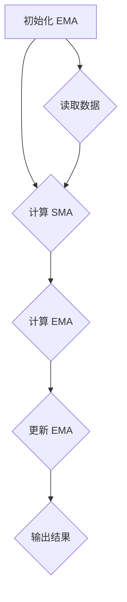
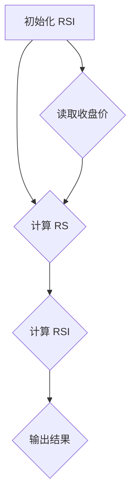
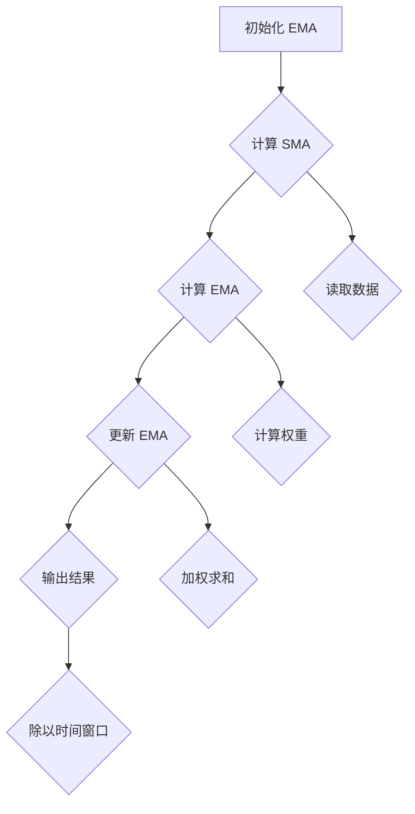

                 

### 《价值投资中的技术分析：是否有用？》 - 引言

在金融投资领域，价值投资和技术分析是两种被广泛使用的投资策略。价值投资，通常指的是以低于公司实际价值的股价购买股票，期待未来的价值回归。这一策略强调对公司基本面的深入分析，包括公司的财务状况、市场地位、管理团队和行业趋势等。价值投资的代表人物如本杰明·格雷厄姆和沃伦·巴菲特，他们通过长期持有优质股票获得了丰厚的回报。

技术分析，则侧重于通过历史价格和交易量数据来预测股票价格的未来走势。技术分析者认为，股票价格的变动背后蕴含着市场的情绪和趋势，这些信息可以通过图表和技术指标来揭示。技术分析的工具包括K线图、移动平均线、相对强弱指数（RSI）等。

本文的探讨目标在于回答：在价值投资中，技术分析是否具有实际作用？为了解答这个问题，本文将分为以下几个部分：

1. **价值投资原理**：介绍价值投资的基本概念和核心原则。
2. **技术分析基础**：阐述技术分析的定义、类型和常用工具。
3. **技术分析与价值投资结合**：探讨技术分析在价值投资中的适用性及其应用案例。
4. **技术分析算法原理讲解**：解释技术分析中常见算法的原理，并用Mermaid流程图表示。
5. **数学模型与公式应用**：介绍技术分析中涉及的数学模型和公式，并用Python源代码举例。
6. **技术分析在投资决策中的应用**：讨论技术分析在投资决策流程中的角色。
7. **项目实战**：通过实际案例展示技术分析在价值投资中的应用。
8. **最佳实践与总结**：总结技术分析在价值投资中的实用技巧和注意事项。

通过上述章节的逐一探讨，我们希望能够给出一个全面的答案，揭示技术分析在价值投资中的实际作用。接下来，我们将深入探讨价值投资的基本原理，为进一步的分析打下坚实的基础。


### 关键词
- **价值投资**
- **技术分析**
- **股票价格预测**
- **投资策略**
- **基本面分析**
- **市场趋势**
- **算法模型**
- **投资决策**

### 摘要

本文旨在探讨价值投资中技术分析的有效性。通过对价值投资和技术分析的基本原理进行详细阐述，我们分析了两者在投资决策中的互补作用。文章首先介绍了价值投资的定义和核心原则，随后探讨了技术分析的定义、工具及其在投资中的应用。接着，通过讲解常见的技术分析算法和数学模型，我们展示了技术分析在股票价格预测中的实际应用。随后，文章通过具体项目实战案例，进一步验证了技术分析在价值投资中的实际效果。最后，我们总结了技术分析在价值投资中的实用技巧和注意事项，为投资者提供了一份全面的技术分析指南。通过对这些内容的深入分析，本文旨在回答一个关键问题：技术分析是否在价值投资中具有实际作用？答案是肯定的，技术分析可以通过提供股票价格趋势和市场的情绪信息，辅助投资者做出更明智的投资决策。

## 第1章 引言：问题背景与探讨目标

### 1.1 价值投资与技术分析概述

在投资领域，价值投资和技术分析是两种截然不同的投资策略，但它们也在某些方面相互交织。价值投资，最初由本杰明·格雷厄姆提出，主要关注公司的基本面，如财务状况、管理团队和业务前景等。通过深入分析这些基本面信息，价值投资者能够识别出那些被市场低估的股票，期待其价值在未来得到修正。价值投资强调长期持有和理性决策，注重公司的内在价值，而非短期的市场波动。

另一方面，技术分析是一种基于历史价格和交易量数据的分析方法，旨在预测股票价格的未来走势。技术分析者认为，市场行为包含了所有相关信息，包括基本面、市场情绪和宏观经济因素等。通过分析价格图表、技术指标和形态模式，技术分析师试图捕捉市场的短期趋势，以指导交易决策。

尽管价值投资和技术分析在方法论上存在显著差异，但在实际投资过程中，两者并不一定是相互排斥的。许多投资者将两者结合使用，以期达到更好的投资效果。例如，技术分析可以用来确定买卖的时机，而价值投资则用于选择具有长期增长潜力的公司。这种结合使用的方法被称为“技术分析辅助价值投资”。

### 1.2 技术分析在价值投资中的潜在作用

技术分析在价值投资中是否具有实际作用，这是一个值得探讨的问题。从理论上讲，技术分析提供了一种补充手段，可以帮助价值投资者更好地理解市场趋势和情绪，从而优化他们的投资决策。

首先，技术分析可以揭示市场的情绪波动。通过分析价格图表和技术指标，投资者可以识别出市场的过度贪婪或恐慌情绪，这有助于避免盲目跟风或恐慌性卖出。例如，当市场普遍对某只股票过度看多时，技术指标可能会显示超买信号，这时价值投资者可能会选择暂时观望，等待股票价格回归合理区间。

其次，技术分析可以辅助确定买卖时机。价值投资的核心在于识别低估的股票，但何时买入或卖出同样重要。技术分析提供了一些工具，如移动平均线和相对强弱指数（RSI），可以帮助投资者在合适的时机执行交易。例如，当股票价格突破长期下降趋势线或RSI指标显示超卖时，价值投资者可能会选择买入。

此外，技术分析还可以用于市场趋势的识别。通过分析价格图表和趋势线，投资者可以判断市场是否处于上升或下降趋势中。这对于价值投资者来说，是一个重要的参考，因为它有助于他们在市场趋势明朗时进行投资决策。

然而，技术分析也存在局限性。技术分析主要依赖于历史数据，而市场环境是不断变化的，过去的表现并不能完全预测未来。此外，技术指标和工具本身也存在一定的滞后性，可能会错过一些重要的市场转折点。因此，单纯依赖技术分析而不结合基本面分析，可能会导致投资失误。

### 探讨目标

本文的主要探讨目标在于深入分析技术分析在价值投资中的实际作用。我们将从以下几个方面进行探讨：

1. **价值投资原理**：介绍价值投资的基本概念和核心原则，包括投资者的心理、市场波动和股票内在价值等。
2. **技术分析基础**：阐述技术分析的定义、类型和常用工具，如K线图、移动平均线和相对强弱指数等。
3. **技术分析与价值投资结合**：探讨技术分析在价值投资中的应用，包括如何使用技术指标进行市场趋势的识别和买卖时机的确定。
4. **技术分析算法原理讲解**：解释技术分析中常见算法的原理，如移动平均算法和相对强弱指数算法，并用Mermaid流程图表示。
5. **数学模型与公式应用**：介绍技术分析中涉及的数学模型和公式，并用Python源代码进行详细讲解和举例说明。
6. **技术分析在投资决策中的应用**：讨论技术分析在投资决策流程中的角色，包括如何结合基本面和技术分析进行投资决策。
7. **项目实战**：通过实际案例展示技术分析在价值投资中的应用，包括环境安装、系统实现和案例分析。
8. **最佳实践与总结**：总结技术分析在价值投资中的实用技巧和注意事项，为投资者提供实际操作指导。

通过上述探讨，本文旨在回答以下问题：技术分析是否在价值投资中具有实际作用？投资者如何有效地结合价值投资和技术分析，实现更好的投资效果？

## 第2章 价值投资原理

### 2.1 价值投资的定义与历史

价值投资是一种以低于公司实际价值的股价购买股票，并期待未来价值回归的投资策略。这一概念最早由本杰明·格雷厄姆在20世纪30年代提出，并在随后几十年中得到了广泛的认可和应用。格雷厄姆认为，市场价格通常并不反映股票的内在价值，因此投资者可以通过深入分析公司的基本面，识别出那些被市场低估的股票，并在适当的时候买入，以获取长期的投资回报。

价值投资的基本理念是，股票的价值不仅取决于其价格，还取决于其内在价值。内在价值是指公司所有未来现金流量的现值总和。通过计算公司的盈利能力、财务状况、业务模式和市场地位等因素，投资者可以估算出一只股票的内在价值。当股票的市场价格低于其内在价值时，就形成了投资机会。

价值投资的历史可以追溯到本杰明·格雷厄姆和他的学生沃伦·巴菲特。格雷厄姆在1934年出版了《证券分析》一书，系统地阐述了价值投资的理论和方法。他在实践中运用这些理论，取得了显著的成果，被誉为“现代投资之父”。巴菲特在格雷厄姆的影响下，进一步发展了价值投资的理念，并在此基础上创立了自己的投资哲学。巴菲特通过长期持有优质股票，如可口可乐、IBM和苹果等，实现了卓越的投资业绩，成为全球首富之一。

价值投资的核心原则包括：

1. **投资者的心理**：价值投资强调理性投资，避免受到市场情绪的干扰。投资者应该保持冷静，不受恐慌或贪婪的影响，坚持自己的投资原则。
2. **市场波动**：市场价格是不断波动的，但长期来看，市场通常会反映公司的内在价值。价值投资者认为，市场的短期波动提供了投资机会，而长期持有优质股票可以获得稳定的回报。
3. **股票内在价值**：股票的内在价值是投资者决策的核心依据。通过深入分析公司的财务报表、业务模式和市场地位，投资者可以估算出股票的内在价值，并与市场价格进行比较，以确定投资机会。
4. **投资策略**：价值投资注重长期持有和理性决策。投资者应该选择那些具有长期增长潜力的公司，并对其基本面保持持续关注。长期持有优质股票，可以获得公司增长带来的回报。
5. **投资者视角**：价值投资是一种长期投资策略，投资者应该具备长期视角，关注公司的长期价值，而非短期市场波动。

### 价值投资的核心原则

1. **投资者的心理**：投资者的心理状态是影响投资决策的重要因素。价值投资强调理性投资，避免受到市场情绪的干扰。投资者应该保持冷静，不受恐慌或贪婪的影响，坚持自己的投资原则。市场情绪会随着新闻和事件的变化而波动，但理性投资者应该认识到，市场价格并不总是反映股票的真实价值。通过保持冷静和理性，投资者可以更好地把握投资机会，避免盲目跟风或恐慌性卖出。

2. **市场波动**：市场价格是不断波动的，但长期来看，市场通常会反映公司的内在价值。价值投资者认为，市场的短期波动提供了投资机会，而长期持有优质股票可以获得稳定的回报。在市场下跌时，投资者不应该盲目恐慌，而应该寻找那些被市场低估的股票。在市场上涨时，投资者也不应该盲目贪婪，而应该关注公司的基本面，避免买入过高的股票。

3. **股票内在价值**：股票的内在价值是投资者决策的核心依据。通过深入分析公司的财务报表、业务模式和市场地位，投资者可以估算出股票的内在价值，并与市场价格进行比较，以确定投资机会。内在价值包括公司的盈利能力、现金流、资产价值和业务前景等因素。当股票的市场价格低于其内在价值时，就形成了投资机会。投资者应该寻找那些具有长期增长潜力的公司，并对其基本面保持持续关注。

4. **投资策略**：价值投资注重长期持有和理性决策。投资者应该选择那些具有长期增长潜力的公司，并对其基本面保持持续关注。长期持有优质股票，可以获得公司增长带来的回报。投资者不应该追求短期利润，而应该关注公司的长期价值。通过定期评估公司的基本面和市场状况，投资者可以及时调整投资策略，确保投资组合的持续优化。

5. **投资者视角**：价值投资是一种长期投资策略，投资者应该具备长期视角，关注公司的长期价值，而非短期市场波动。短期市场波动可能会带来情绪上的波动，但长期来看，市场通常会反映公司的内在价值。投资者应该保持耐心和定力，避免频繁交易，以免受到交易成本和市场波动的影响。通过长期持有优质股票，投资者可以分享公司的成长和价值回归。

### 投资者心理与市场波动

投资者心理是价值投资中至关重要的一环。市场波动常常伴随着投资者情绪的波动，而投资者的情绪又往往影响着他们的投资决策。理性投资者应该意识到，市场波动是正常现象，不应该因此改变自己的投资策略。

首先，投资者心理的理性与贪婪、恐慌之间有着密切的联系。贪婪使投资者在市场上涨时过度乐观，盲目追逐高价股票，而忽视了公司的基本面。恐慌则使投资者在市场下跌时过度悲观，盲目抛售股票，甚至可能低价出售优质股票。这两种情绪都会导致投资决策的失误。

其次，市场波动是价值投资中需要面对的现实。市场价格并非总是反映公司的内在价值，有时市场会因为各种因素而出现过度反应。例如，在市场乐观时，一些基本面较差的股票可能会被市场高估，而在市场悲观时，一些基本面较好的股票可能会被市场低估。价值投资者应该学会识别这些市场波动，并利用这些机会。

为了应对投资者心理和市场波动，投资者可以采取以下策略：

1. **保持理性投资**：投资者应该通过深入分析公司的基本面，确定股票的内在价值，并以此作为投资决策的依据。避免受到市场情绪的干扰，坚持自己的投资原则。

2. **设定投资目标**：投资者应该设定明确的投资目标，包括投资期限、预期收益和风险承受能力等。在实现投资目标的过程中，投资者应该保持耐心和定力，避免频繁交易。

3. **定期评估投资组合**：投资者应该定期评估自己的投资组合，确保投资组合的持续优化。通过分析公司的基本面和市场状况，投资者可以及时调整投资策略。

4. **分散投资**：投资者可以通过分散投资来降低风险。选择不同行业、不同市值和不同地域的股票，可以有效地分散风险。

5. **学习与成长**：投资者应该不断学习和成长，提高自己的投资知识和技能。通过阅读投资书籍、参加投资课程和交流投资经验，投资者可以更好地应对市场波动和投资挑战。

总之，投资者心理与市场波动是价值投资中需要面对的重要问题。通过保持理性投资、设定投资目标、定期评估投资组合、分散投资和学习与成长，投资者可以更好地应对这些挑战，实现长期的投资回报。

### 股票内在价值与市场定价

股票的内在价值是价值投资的核心概念之一。它指的是公司所有未来现金流量的现值总和，反映了股票的真实投资价值。股票的内在价值与市场定价之间的关系是投资者分析投资机会的重要依据。

首先，股票的市场定价通常受供求关系、市场情绪、宏观经济状况和公司基本面等因素的影响。市场定价可能高于或低于股票的内在价值。当市场对某只股票的需求大于供应时，股票价格可能会上涨，甚至高于其内在价值。相反，当市场对某只股票的需求不足时，股票价格可能会下跌，甚至低于其内在价值。

然而，价值投资的目标是识别那些市场定价低于其内在价值的股票，即所谓的“低估股票”。当股票的市场价格低于其内在价值时，投资者可以认为该股票具有投资机会。这是因为，在市场纠正低估现象的过程中，股票价格最终会回归其内在价值，从而为投资者带来资本增值的机会。

内在价值的估算方法通常包括现金流折现法（DCF）和股息折现法（DDM）等。现金流折现法通过预测公司的未来现金流，并将其折现到当前时点，得出股票的内在价值。这种方法的核心在于对公司未来现金流的预测和折现率的确定。股息折现法则是通过预测公司未来支付的股息，并将其折现到当前时点，得出股票的内在价值。这种方法适用于那些支付稳定股息的公司。

在实际操作中，投资者需要综合考虑公司的财务状况、业务模式、市场地位和行业趋势等因素，以准确估算股票的内在价值。同时，投资者还应该关注市场情绪和宏观经济环境，以判断股票的市场定价是否合理。

总之，股票的内在价值与市场定价之间的关系是价值投资中需要重点关注的问题。通过准确估算股票的内在价值，并与市场定价进行比较，投资者可以识别出被低估的股票，并在此基础上做出明智的投资决策。这种投资策略不仅要求投资者具备深厚的财务分析和市场洞察力，还需要他们具备坚定的投资信念和耐心，以应对市场波动和不确定性。

### 投资策略与长期视角

价值投资的核心在于其长期视角和稳健的投资策略。这种策略不仅要求投资者具备深刻的财务分析能力，还需要他们具备坚定的投资信念和长期持有的耐心。以下是价值投资中常见的投资策略和长期视角的详细说明。

#### 长期持有的重要性

价值投资强调长期持有优质股票，这是因为优质股票往往具有稳定的盈利能力和成长潜力。长期持有可以有效地减少交易成本和税收负担，同时也能够避免短期市场波动对投资决策的影响。长期持有还意味着投资者需要对公司有深入的了解，并在公司基本面发生变化时及时调整投资策略。

#### 优质公司的选择标准

选择优质公司是价值投资成功的关键。优质公司的标准通常包括以下几个方面：

1. **稳定的盈利能力**：优质公司应具有稳定的盈利记录，并且盈利能力能够持续增长。投资者可以通过查看公司的历史盈利数据和财务报表来评估其盈利稳定性。
   
2. **健康的财务状况**：优质公司应拥有健康的资产负债表，包括充足的现金流、合理的债务水平和良好的资本结构。这些因素表明公司具有良好的财务弹性，能够在市场波动中保持稳定。

3. **卓越的管理团队**：优质公司的管理团队应具备出色的领导能力和执行力，能够制定有效的战略并执行。投资者可以通过研究公司管理层的背景、业绩记录和股东回报政策来评估其管理能力。

4. **市场地位和竞争优势**：优质公司通常在所在行业中拥有强大的市场地位和竞争优势。这些公司能够持续提供高质量的产品或服务，并在市场中占据领先地位。投资者可以通过分析公司的市场份额、品牌价值和行业趋势来评估其市场地位。

#### 投资策略的应用

在实际投资中，价值投资者通常会采用以下策略：

1. **深度研究**：投资者应进行深入的基本面分析，包括财务报表、行业趋势、市场竞争状况等。这种研究有助于识别出那些被市场低估的优质股票。

2. **价值评估**：通过估算股票的内在价值，并与市场价格进行比较，投资者可以确定哪些股票具有投资机会。这种估值方法通常使用现金流折现法（DCF）或股息折现法（DDM）。

3. **分散投资**：投资者应通过分散投资来降低风险。选择不同行业、不同市值和不同地域的股票，可以有效地分散投资组合的风险。

4. **耐心持有**：价值投资要求投资者具备耐心和长期持有的信念。市场波动是正常现象，但优质股票的价值最终会得到市场的认可。

5. **定期评估**：投资者应定期评估其投资组合，确保投资策略与市场变化和公司基本面保持一致。这种定期评估有助于及时调整投资决策，确保投资组合的持续优化。

#### 成功案例

沃伦·巴菲特是价值投资的典范，他的成功很大程度上归功于长期持有的投资策略和对优质公司的选择。例如，巴菲特持有的可口可乐股票已超过50年，期间虽然市场波动频繁，但可口可乐公司始终保持着稳定的增长。同样，巴菲特持有的IBM和苹果等股票也取得了显著的投资回报。

通过以上分析，我们可以看到，价值投资中的长期视角和稳健的投资策略是成功的关键。投资者不仅需要具备扎实的财务分析能力，还需要具备坚定的投资信念和耐心，以应对市场波动和不确定性。通过选择优质公司并长期持有，投资者可以在长期内实现稳定的投资回报。

### 第3章 技术分析基础

#### 3.1 技术分析的定义与类型

技术分析是一种基于历史价格和交易量数据，通过图表、技术指标和形态模式来预测股票价格未来走势的投资分析方法。与基本面分析不同，技术分析不关注公司的财务状况、行业前景等基本面信息，而是通过市场行为本身来分析市场趋势和预测未来价格。

技术分析的历史可以追溯到19世纪末期，当时投资者开始使用价格图表来记录股票价格的变化。随着时间的推移，技术分析逐渐发展出多种工具和方法，包括K线图、移动平均线、相对强弱指数（RSI）等。

技术分析的主要类型包括：

1. **图表分析**：通过绘制股票价格的历史走势图，如K线图、折线图等，来分析价格趋势和形态。
2. **技术指标**：通过数学计算，从历史价格和交易量数据中提取出具有预测性的信号，如移动平均线（MA）、相对强弱指数（RSI）、随机振荡器（Stochastic）等。
3. **形态分析**：通过识别和分析股票价格的历史走势，形成的价格形态，如头肩顶、双底等，来预测未来价格。

技术分析的核心假设是市场行为包含一切信息。这意味着，所有影响股票价格的因素，包括基本面、市场情绪和宏观经济因素等，都会反映在股票的历史价格和交易量中。因此，通过分析历史数据，投资者可以预测未来价格走势。

#### 3.2 常用技术分析工具

技术分析中使用的工具多种多样，每种工具都有其独特的功能和应用场景。以下是几种常见的技术分析工具：

1. **K线图**：K线图是一种以特定时间间隔（如一天、一小时）记录开盘价、最高价、最低价和收盘价的价格图表。K线图可以清晰地显示价格的趋势和波动，是技术分析中最常用的工具之一。

2. **移动平均线（MA）**：移动平均线是一种通过计算一段时间内价格的平均值，来平滑价格波动、揭示长期趋势的技术指标。常见的移动平均线包括简单移动平均线（SMA）和指数移动平均线（EMA）。移动平均线可以帮助投资者识别市场趋势，判断价格是否超买或超卖。

3. **相对强弱指数（RSI）**：相对强弱指数是一种衡量价格变动速度和变化幅度的技术指标。RSI的取值范围在0到100之间，通常认为70以上为超买，30以下为超卖。RSI可以帮助投资者判断市场的买卖情绪，提供买卖信号。

4. **成交量**：成交量是衡量市场活跃度的指标，通常与价格走势结合分析。高成交量通常表示市场趋势的强度，而低成交量可能预示着趋势的减弱或反转。

5. **MACD指标**：移动平均收敛发散指标（MACD）是通过计算两个不同时间段移动平均线的差值，来衡量价格趋势的变化。MACD指标包括MACD线、信号线和零轴，可以用于判断市场趋势和提供买卖信号。

6. **布林带**：布林带是一种通过计算标准差，来确定价格波动范围的技术指标。布林带包括上轨、中轨和下轨，可以帮助投资者判断价格是否超买或超卖，并提供交易信号。

这些技术分析工具各有特点，可以相互结合使用，以提供更全面的市场分析。例如，K线图可以用来识别价格趋势，而RSI和MACD指标可以用来判断市场的买卖信号。通过综合使用这些工具，投资者可以更准确地预测股票价格的未来走势。

#### 3.1.1 基本面分析与技术分析的对比

基本面分析和技术分析是投资领域中两种主要的分析方法，它们各有特点和应用场景。

**基本面分析**：基本面分析主要关注公司的财务状况、行业前景、宏观经济环境等因素。通过深入研究公司的财务报表、盈利能力、负债状况、管理团队和市场地位等，基本面分析试图评估公司的内在价值，从而确定其是否被市场低估。基本面分析的优点在于，它能够提供对公司和行业的深入理解，有助于投资者做出长期的投资决策。然而，基本面分析也有其局限性，例如，市场情绪和经济波动等难以量化的因素可能会影响股价，而这些因素在基本面分析中难以得到充分反映。

**技术分析**：技术分析则侧重于分析历史价格和交易量数据，通过图表、技术指标和形态模式来预测股票价格的未来走势。技术分析的核心假设是，市场价格已经包含了所有影响股票价格的信息。因此，通过分析历史数据，投资者可以识别出市场趋势和潜在的买卖机会。技术分析的优点在于其直观性和实时性，能够快速响应市场的变化。然而，技术分析也存在一定的局限性，例如，它主要依赖于历史数据，可能无法完全预测未来市场的变化。

**两者的结合**：尽管基本面分析和技术分析各有优劣，但它们并不是相互排斥的。许多成功的投资者通过结合两种方法，实现了更好的投资效果。基本面分析可以帮助投资者选择具有长期增长潜力的公司，而技术分析则可以提供买卖时机的参考。例如，投资者可以在基本面分析确定一只股票具有投资价值后，通过技术分析确定最佳的买卖点。通过结合两种方法，投资者可以更全面地理解市场，做出更明智的投资决策。

总之，基本面分析和技术分析都是重要的投资工具，各自适用于不同的投资策略和场景。投资者可以根据自己的投资目标和风险偏好，选择适当的方法，或者将两种方法相结合，以实现最佳的投资效果。

#### 3.1.2 技术分析的历史与演变

技术分析作为一种投资工具，其历史可以追溯到19世纪末期，当时投资者开始使用价格图表来记录和分析股票价格的变化。最早的图表形式是简单的折线图，它通过连接不同时间点的价格点，展示了股票价格的历史走势。然而，这种图表形式并不能很好地反映市场的波动和趋势。

20世纪初，日本出现了K线图的发明，这种图表形式通过绘制开盘价、最高价、最低价和收盘价，能够更直观地展示价格的变化。K线图的引入使得技术分析者能够更细致地分析价格走势，识别市场趋势和潜在的买卖点。随着计算机技术的发展，K线图逐渐成为技术分析中最常用的工具之一。

20世纪50年代，技术分析进入了一个新的发展阶段。乔治·索罗斯等人通过使用技术指标，如移动平均线和相对强弱指数（RSI），来预测市场趋势。这些技术指标通过数学计算，从历史价格和交易量数据中提取出具有预测性的信号，从而帮助投资者做出更准确的交易决策。

随着计算机和互联网的普及，技术分析工具和方法进一步丰富和多样化。20世纪90年代，随着在线交易平台的出现，投资者可以实时获取股票价格和交易量数据，这使得技术分析的应用更加广泛。同时，新的技术指标和算法不断涌现，如MACD、布林带、随机振荡器等，这些工具为投资者提供了更多的分析手段。

在21世纪，大数据和人工智能技术的发展，为技术分析带来了新的契机。通过大数据分析，投资者可以挖掘出更多潜在的市场规律和趋势。同时，机器学习和深度学习算法的应用，使得技术分析能够更精准地预测股票价格的未来走势。

总的来说，技术分析的历史与演变是一个不断进步和发展的过程。从最早的简单图表，到复杂的技术指标和算法，技术分析不断丰富和完善，成为现代投资中不可或缺的工具。随着科技的进步，技术分析将继续在投资领域中发挥重要作用，为投资者提供更强大的分析能力和决策支持。

#### 3.2.1 图表分析

图表分析是技术分析中最基本和常用的工具之一，它通过绘制股票价格的历史走势，帮助投资者识别市场趋势和潜在的交易机会。图表分析包括多种类型的图表，如K线图、折线图和柱状图，每种图表都有其独特的功能和应用场景。

**K线图**：K线图是最常用的图表形式，它通过绘制开盘价、最高价、最低价和收盘价，展示了价格在一段时间内的波动情况。K线图中的每一根线代表一个特定的时间段（如一天、一小时或一分钟），由四个部分组成：实体、上影线和下影线。实体的长短表示收盘价与开盘价之间的差距，上影线表示最高价与收盘价之间的差距，下影线表示最低价与开盘价之间的差距。通过分析K线图的形态和组合，投资者可以识别出市场趋势和潜在的买卖点。

**折线图**：折线图通过连接每个时间点的收盘价，展示了股票价格的历史走势。折线图简单直观，可以清晰地显示价格的趋势和波动。在折线图中，投资者可以通过观察价格的趋势线、支撑位和阻力位等来分析市场趋势。

**柱状图**：柱状图通过绘制柱状条，显示了每个时间点的开盘价、最高价、最低价和收盘价。柱状图的优点在于可以直观地显示价格的范围和波动情况，常用于分析交易量。

**图表分析的应用**：图表分析可以用于识别市场趋势、支撑位和阻力位等。例如，通过绘制趋势线，投资者可以判断市场是处于上升趋势还是下降趋势。支撑位和阻力位是价格图表上的水平线，表示价格在达到这些水平时会受到支撑或阻力，可能发生反转。投资者可以利用这些水平线来确定买卖时机。

图表分析的核心在于通过历史价格数据，揭示市场的潜在趋势和信号。虽然图表分析主要依赖于历史数据，但通过对图表的深入分析，投资者可以捕捉到市场的变化，做出更准确的交易决策。

#### 3.2.2 技术指标

技术指标是技术分析中用来衡量价格和交易量变化，从而预测未来市场走势的重要工具。通过数学计算和历史数据，技术指标可以提取出价格和交易量中的潜在信号，帮助投资者做出交易决策。以下是几种常见的技术指标及其基本原理：

**移动平均线（MA）**：移动平均线通过计算一段时间内的价格平均值，来平滑价格波动，揭示长期趋势。移动平均线包括简单移动平均线（SMA）和指数移动平均线（EMA）。SMA是按固定时间段计算平均值，而EMA则对近期数据给予更高权重。通过比较不同周期的移动平均线，投资者可以判断市场趋势。例如，当短期移动平均线穿越长期移动平均线时，可能预示着市场趋势的变化。

**相对强弱指数（RSI）**：RSI是一种衡量价格变动速度和变化幅度的技术指标，其取值范围在0到100之间。通常，70以上被认为是超买，30以下被认为是超卖。RSI可以帮助投资者判断市场的买卖情绪，并提供买卖信号。当RSI从超买区域下降到50以下时，可能是买入信号；当RSI从超卖区域上升到50以上时，可能是卖出信号。

**随机振荡器（Stochastic）**：随机振荡器是一种衡量价格相对其范围的位置的技术指标。其基本原理是通过比较当前价格与一段时间内的最高价和最低价的关系，来预测市场趋势。Stochastic指标通常由两条线组成：快线和慢线。当快线高于慢线时，表示市场处于上升趋势；当快线低于慢线时，表示市场处于下降趋势。

**MACD指标**：MACD（移动平均收敛发散指标）通过计算两个不同时间段移动平均线的差值，来衡量价格趋势的变化。MACD包括MACD线、信号线和零轴。当MACD线从下向上穿过信号线时，可能预示着市场趋势的变化；当MACD线从上向下穿过信号线时，也可能预示着市场趋势的反转。

**布林带**：布林带是一种通过计算标准差，来确定价格波动范围的技术指标。布林带由上轨、中轨和下轨组成。当价格接近上轨时，可能表示市场过热，存在回调风险；当价格接近下轨时，可能表示市场过冷，存在反弹机会。

这些技术指标各有特点，可以相互结合使用，以提供更全面的市场分析。例如，通过结合RSI和MACD指标，投资者可以更准确地判断市场的买卖信号。通过了解和运用这些技术指标，投资者可以更好地把握市场动态，做出更明智的交易决策。

#### 3.2.3 形态分析

形态分析是技术分析中的一种重要方法，通过分析股票价格的历史走势所形成的图形，来预测未来价格的趋势。形态分析基于一个核心假设：市场行为会重复。这意味着，过去的价格形态和趋势在未来可能会再次出现。

**头肩顶形态**：头肩顶形态是一种典型的顶部形态，预示着价格可能会下跌。该形态由三个峰组成，中间的峰（头部）最高，左右两侧的峰（肩部）相对较低。当价格跌破颈线（连接左右肩部最低点的水平线）时，头肩顶形态得到确认，预示着下跌趋势的开始。

**双底形态**：双底形态是一种典型的底部形态，预示着价格可能会上涨。该形态由两个谷组成，第二个谷（底部）高于第一个谷。当价格突破颈线（连接两个谷最低点的水平线）时，双底形态得到确认，预示着上涨趋势的开始。

**旗形形态**：旗形形态是一种持续形态，通常出现在强烈趋势的中途，预示着价格将继续沿着原有趋势方向前进。该形态由一个明显的趋势线和一条与趋势线平行的支撑线组成。当价格突破旗形形态时，预示着趋势将继续。

**三角形形态**：三角形形态是一种持续形态，由多个价格波动区间组成，通常出现在强烈趋势的中途。该形态分为对称三角形、上升三角形和下降三角形。当价格突破三角形形态时，预示着趋势的变化。

**圆弧形态**：圆弧形态是一种复杂的持续形态，由多个价格波动区间组成，形状类似于圆弧。该形态通常出现在长期趋势的末期，预示着价格可能会反转。

形态分析的核心在于识别这些典型的价格形态，并通过它们预测未来价格的趋势。投资者可以通过绘制价格图表，识别出这些形态，并结合其他技术指标和市场情绪，做出更准确的交易决策。虽然形态分析主要依赖于历史数据，但通过对形态的深入理解和应用，投资者可以更好地把握市场的潜在趋势，提高交易的成功率。

#### 3.3.1 技术分析在价值投资中的适用性

技术分析在价值投资中的适用性是一个复杂且多维的问题。尽管价值投资强调基本面分析，但技术分析作为一种补充手段，确实在某些方面具有其独特的作用和价值。

首先，技术分析可以帮助价值投资者更好地理解市场趋势。市场趋势是价值投资中的一个重要参考因素，通过技术分析工具，如K线图、移动平均线和RSI等，投资者可以更直观地看到市场情绪的变化和趋势的演变。这种趋势识别对于确定买入和卖出的时机至关重要。例如，当市场处于上升趋势时，即使某些股票的价格可能暂时高于其内在价值，但投资者仍然可以抓住市场趋势带来的潜在收益。

其次，技术分析提供了一个量化的方法来评估股票的买卖信号。价值投资者通常依靠对公司的基本面分析来选择投资标的，但技术分析则通过历史数据提供了额外的交易决策依据。例如，当一只股票的价格突破重要的阻力位，或者技术指标如RSI显示出超卖信号时，这些都可以视为买入的信号。同样，当股票价格跌破支撑位，或者MACD指标显示出超买信号时，这些都可以作为卖出的信号。这种量化分析使得投资者能够更客观地做出交易决策，减少情绪化的影响。

第三，技术分析可以帮助价值投资者管理风险。通过设置止损和止盈点，投资者可以在价格达到特定水平时自动执行交易，从而避免因市场波动而带来的潜在损失。例如，当股票价格跌破某个关键支撑位时，投资者可以设置止损，以避免进一步的损失。这种风险管理策略在价值投资中同样重要，因为它可以帮助投资者在市场不确定性增加时保持冷静和理性。

然而，技术分析在价值投资中也存在一些局限性。首先，技术分析主要基于历史数据，而市场是动态变化的，过去的表现并不一定预示未来。因此，过度依赖技术分析可能会导致投资者忽视公司基本面的变化，从而做出错误的交易决策。其次，技术分析工具和方法繁多，不同投资者可能会有不同的偏好和解释，这增加了分析的主观性。最后，技术分析需要投资者具备一定的技术知识和经验，否则可能会出现误读和误用，从而影响投资效果。

总的来说，技术分析在价值投资中具有一定的适用性，它可以通过提供市场趋势和买卖信号，帮助投资者优化交易决策。然而，价值投资者应保持理性的态度，将技术分析作为辅助工具，与基本面分析相结合，以实现更全面和准确的投资决策。通过合理运用技术分析，价值投资者可以在保持长期投资理念的同时，更好地把握市场机会，提高投资回报。

#### 4.2.1 K线图在价值投资中的应用

K线图是技术分析中最常用的工具之一，通过展示开盘价、最高价、最低价和收盘价，K线图能够直观地反映价格的变化趋势和市场情绪。在价值投资中，K线图具有以下几个重要的应用：

首先，K线图可以帮助投资者识别价格趋势。通过绘制长期K线图，投资者可以清晰地看到价格是处于上升趋势、下降趋势还是横盘整理状态。例如，当K线图中的阳线（收盘价高于开盘价）连续出现，且伴随成交量的放大，这可能表明市场处于上升趋势，投资者可以关注这样的股票，等待合适的买入时机。相反，当K线图中的阴线（收盘价低于开盘价）连续出现，且成交量逐渐减少，这可能表明市场处于下降趋势，投资者应保持谨慎。

其次，K线图可以揭示市场情绪。通过分析K线图的形态和组合，投资者可以判断市场情绪是乐观还是悲观。例如，出现锤头线和倒锤头线等底部反转形态，可能表明市场情绪已经从悲观转向乐观，投资者可以关注买入机会。相反，出现乌云盖顶和射击之星等顶部反转形态，可能表明市场情绪已经从乐观转向悲观，投资者应考虑卖出。

第三，K线图可以帮助投资者确定买卖时机。通过识别重要的支撑位和阻力位，投资者可以更准确地把握买入和卖出的时机。支撑位是价格图表上的水平线，表示价格在达到这些水平时会受到支撑，可能形成反转或持续上涨的信号。阻力位则是价格图表上的水平线，表示价格在达到这些水平时会遇到阻力，可能形成反转或持续下跌的信号。例如，当股票价格突破重要的阻力位时，这可能是买入的信号；当股票价格跌破重要的支撑位时，这可能是卖出的信号。

此外，K线图还可以用于识别趋势反转信号。例如，当K线图出现头肩顶形态、双顶形态等顶部反转信号时，这可能预示着价格将开始下跌，投资者应考虑卖出。相反，当K线图出现头肩底形态、双底形态等底部反转信号时，这可能预示着价格将开始上涨，投资者应考虑买入。

总之，K线图在价值投资中的应用是多方面的，通过识别价格趋势、市场情绪和买卖时机，投资者可以更准确地把握市场机会，实现投资目标。当然，K线图分析也需要结合其他技术指标和基本面分析，以提高分析的准确性和可靠性。

#### 4.2.2 移动平均线在价值投资中的应用

移动平均线（Moving Average，MA）是技术分析中一种重要的趋势判断工具，它通过计算一段时间内价格的平均值，平滑短期价格波动，揭示长期趋势。在价值投资中，移动平均线同样发挥着重要作用，可以帮助投资者识别市场趋势、判断买卖时机和进行风险管理。

**识别市场趋势**：移动平均线最基本的应用是识别市场趋势。通过比较短期移动平均线（如5日、10日均线）和长期移动平均线（如50日、200日均线），投资者可以判断市场是处于上升趋势、下降趋势还是横盘整理状态。当短期均线向上穿越长期均线时，通常表明市场处于上升趋势，投资者可以关注买入机会；当短期均线向下穿越长期均线时，通常表明市场处于下降趋势，投资者应考虑卖出。

**判断买卖时机**：移动平均线还可以用于判断买卖时机。例如，当股票价格突破长期下降趋势线并站上长期移动平均线时，这可能是买入的信号。相反，当股票价格跌破长期上升趋势线并跌破长期移动平均线时，这可能是卖出的信号。此外，投资者还可以利用短期和长期移动平均线的交叉点来识别趋势的变化。当短期均线从下向上穿过长期均线时，这通常被认为是买入信号；当短期均线从上向下穿过长期均线时，这通常被认为是卖出信号。

**进行风险管理**：移动平均线还可以用于设置止损和止盈点，从而进行风险管理。例如，当股票价格跌破某个重要支撑位，同时跌破长期移动平均线时，投资者可以设置止损，以避免进一步的损失。同样，当股票价格突破某个重要阻力位，同时突破长期移动平均线时，投资者可以设置止盈，以锁定利润。

**具体应用示例**：以某股票的日K线图为例，假设该股票的长期移动平均线是50日均线，短期移动平均线是10日均线。在2023年3月，该股票价格长期处于下降趋势，50日均线在10日均线下方。4月初，10日均线开始向上穿越50日均线，这表明市场趋势可能发生反转。随后，股票价格也开始逐步上升，并成功突破了前期的阻力位。在这种情况下，投资者可以根据移动平均线的交叉信号，选择在股票价格站稳10日均线上方时买入，并根据长期移动平均线的支撑情况设置止损。

总之，移动平均线在价值投资中的应用是多方面的，通过识别市场趋势、判断买卖时机和进行风险管理，投资者可以更有效地进行投资决策。当然，移动平均线分析也需要结合其他技术指标和基本面分析，以提高分析的准确性和可靠性。

### 第5章 技术分析算法原理讲解

#### 5.1.1 移动平均算法

移动平均算法是技术分析中最基础且广泛使用的算法之一。其核心思想是计算一段时间内的价格平均值，以平滑价格波动，揭示长期趋势。移动平均算法分为简单移动平均（Simple Moving Average，SMA）和指数移动平均（Exponential Moving Average，EMA）两种类型。

**简单移动平均（SMA）**

SMA是最简单的移动平均算法，通过计算一段时间内价格的平均值，得到移动平均线。计算公式如下：

$$
SMA(n) = \frac{\sum_{i=1}^{n} P_i}{n}
$$

其中，$SMA(n)$ 表示n日简单移动平均线，$P_i$ 表示第i天的收盘价，$n$ 表示移动平均的时间窗口。

**指数移动平均（EMA）**

EMA在SMA的基础上引入了指数加权，使得最近的数据在计算中占据更高的权重。计算公式如下：

$$
EMA(t) = EMA(t-1) \times \left(1 - \alpha\right) + P_t \times \alpha
$$

其中，$EMA(t)$ 表示第t天的指数移动平均线，$EMA(t-1)$ 表示第t-1天的指数移动平均线，$P_t$ 表示第t天的收盘价，$\alpha$ 是平滑常数，通常取值为 $\alpha = \frac{2}{n+1}$，$n$ 是移动平均的时间窗口。

**计算示例**

以5日EMA为例，假设前四天的收盘价分别为100、102、104、105，第五天的收盘价为106。根据EMA公式计算：

$$
EMA(1) = 100
$$

$$
EMA(2) = 100 \times \left(1 - \frac{2}{5+1}\right) + 102 \times \frac{2}{5+1} = 100 \times 0.81 + 102 \times 0.18 = 98.18 + 18.36 = 116.54
$$

$$
EMA(3) = 116.54 \times \left(1 - \frac{2}{5+1}\right) + 104 \times \frac{2}{5+1} = 116.54 \times 0.81 + 104 \times 0.18 = 95.28 + 18.72 = 114.00
$$

$$
EMA(4) = 114.00 \times \left(1 - \frac{2}{5+1}\right) + 105 \times \frac{2}{5+1} = 114.00 \times 0.81 + 105 \times 0.18 = 92.94 + 18.90 = 111.84
$$

$$
EMA(5) = 111.84 \times \left(1 - \frac{2}{5+1}\right) + 106 \times \frac{2}{5+1} = 111.84 \times 0.81 + 106 \times 0.18 = 90.97 + 19.08 = 109.05
$$

因此，第五天的5日EMA为109.05。

**Mermaid流程图**

以下是一个简单的Mermaid流程图，用于表示5日EMA的计算过程：



#### 5.1.2 相对强弱指数算法

相对强弱指数（Relative Strength Index，RSI）是衡量价格变动速度和变化幅度的常用技术指标。RSI的取值范围在0到100之间，通常认为70以上为超买，30以下为超卖。RSI的计算公式如下：

$$
RSI(t) = 100 - \frac{100}{1 + RS(t)}
$$

其中，$RS(t)$ 是平均相对强度，计算公式为：

$$
RS(t) = \frac{平均上涨日收盘价之和}{平均下跌日收盘价之和}
$$

**计算示例**

假设有5个交易日，收盘价分别为120、125、110、115和118。首先计算上涨日和下跌日的收盘价之和：

上涨日收盘价之和 = 125 + 118 = 243

下跌日收盘价之和 = 110 + 115 = 225

接下来，计算RS：

$$
RS(t) = \frac{243}{225} = 1.08
$$

最后，计算RSI：

$$
RSI(t) = 100 - \frac{100}{1 + 1.08} = 100 - \frac{100}{2.08} \approx 47.62
$$

因此，该股票的RSI约为47.62。

**Mermaid流程图**

以下是一个简单的Mermaid流程图，用于表示RSI的计算过程：



通过上述讲解，我们了解了移动平均算法和相对强弱指数算法的基本原理和计算方法。这些算法在技术分析中具有重要作用，能够帮助投资者识别市场趋势和买卖时机。在实际应用中，投资者可以根据具体需求选择适当的算法，并结合其他技术指标和基本面分析，做出更准确的投资决策。

#### 5.2.1 Mermaid流程图绘制

Mermaid是一种基于Markdown的图形绘制语言，它可以通过简单的文本描述生成流程图、序列图、类图等多种图形。在技术分析中，使用Mermaid流程图可以清晰地展示算法的执行过程和逻辑结构，帮助投资者更好地理解算法的原理和应用。

**基本语法**

Mermaid的基本语法包括节点（node）、边（edge）和图形（graph）定义。以下是一些基本语法示例：

- **节点**：使用圆括号`()`来定义节点，节点之间用逗号分隔。

  ```mermaid
  graph TD
      A[初始化 EMA] --> B{计算 SMA}
      B --> C{计算 EMA}
      C --> D{更新 EMA}
      D --> E{输出结果}
  ```

- **边**：使用箭头（`->`）或双箭头（`-->`）来定义节点之间的连接关系。

  ```mermaid
  graph TD
      A[开始] --> B{输入数据}
      B --> C{处理数据}
      C --> D{输出结果}
  ```

- **图形**：在Markdown文档中，使用`graph TD`或`graph MD`来定义图形的方向，`TD`代表从上到下，`MD`代表从左到右。

  ```mermaid
  graph TD
      A[开始]
      B[准备数据]
      B --> C{处理数据}
      C --> D[结束]
  ```

**算法流程图示例**

以下是一个简单的移动平均算法的Mermaid流程图示例：



在这个流程图中，我们展示了如何初始化EMA，计算SMA，更新EMA，以及最后输出结果。每个步骤都通过节点和边连接，使得整个流程清晰明了。

**Python源代码示例**

除了Mermaid流程图，我们还可以使用Python源代码来详细阐述算法原理。以下是一个简单的Python代码示例，用于计算5日EMA：

```python
def calculate_sma(data, n):
    return sum(data[-n:]) / n

def calculate_ema(data, n, alpha):
    ema = [0] * len(data)
    ema[-1] = data[-1]
    for i in range(len(data) - 2, -1, -1):
        ema[i] = alpha * data[i] + (1 - alpha) * ema[i+1]
    return ema

data = [100, 102, 104, 105, 106]
n = 5
alpha = 2 / (n + 1)

sma = calculate_sma(data, n)
ema = calculate_ema(data, n, alpha)

print("5日SMA:", sma)
print("5日EMA:", ema)
```

在这个代码示例中，我们定义了两个函数：`calculate_sma`用于计算简单移动平均线（SMA），`calculate_ema`用于计算指数移动平均线（EMA）。我们使用这些函数计算给定数据集的SMA和EMA，并打印结果。

通过结合Mermaid流程图和Python源代码，我们可以更全面地理解技术分析算法的原理和实现。这些工具不仅帮助我们可视化算法的逻辑结构，还能够通过实际代码来验证算法的正确性，从而提高我们的投资分析能力。

### 6.1 技术分析中的数学模型

技术分析中的数学模型是通过数学方法来描述和分析市场行为的一系列工具。这些模型不仅有助于投资者更好地理解市场趋势，还能为他们的投资决策提供科学依据。以下是几种常见的技术分析数学模型及其基本原理。

#### 6.1.1 移动平均模型

移动平均模型是技术分析中最基础的模型之一。它通过计算一段时间内价格的平均值，平滑价格波动，揭示长期趋势。简单移动平均（SMA）和指数移动平均（EMA）是两种常见的移动平均模型。

**简单移动平均（SMA）**

SMA通过计算过去一段时间内价格的平均值来生成移动平均线。其数学模型如下：

$$
SMA(n) = \frac{\sum_{i=1}^{n} P_i}{n}
$$

其中，$SMA(n)$ 表示n日简单移动平均线，$P_i$ 表示第i天的收盘价，$n$ 表示移动平均的时间窗口。

**指数移动平均（EMA）**

EMA在SMA的基础上引入了指数加权，使得最近的数据在计算中占据更高的权重。其数学模型如下：

$$
EMA(t) = EMA(t-1) \times \left(1 - \alpha\right) + P_t \times \alpha
$$

其中，$EMA(t)$ 表示第t天的指数移动平均线，$EMA(t-1)$ 表示第t-1天的指数移动平均线，$P_t$ 表示第t天的收盘价，$\alpha$ 是平滑常数，通常取值为 $\alpha = \frac{2}{n+1}$，$n$ 是移动平均的时间窗口。

#### 6.1.2 相对强弱模型

相对强弱指数（RSI）是衡量价格变动速度和变化幅度的一种常用技术指标。其数学模型如下：

$$
RSI(t) = 100 - \frac{100}{1 + RS(t)}
$$

其中，$RSI(t)$ 是第t天的相对强弱指数，$RS(t)$ 是平均相对强度，其计算公式为：

$$
RS(t) = \frac{平均上涨日收盘价之和}{平均下跌日收盘价之和}
$$

**计算示例**

假设有5个交易日，收盘价分别为120、125、110、115和118。首先计算上涨日和下跌日的收盘价之和：

上涨日收盘价之和 = 125 + 118 = 243

下跌日收盘价之和 = 110 + 115 = 225

接下来，计算RS：

$$
RS(t) = \frac{243}{225} = 1.08
$$

最后，计算RSI：

$$
RSI(t) = 100 - \frac{100}{1 + 1.08} = 100 - \frac{100}{2.08} \approx 47.62
$$

因此，该股票的RSI约为47.62。

#### 6.1.3 成交量模型

成交量是衡量市场活跃度的重要指标，通常与价格走势结合分析。以下是一种常见的成交量模型：

**成交量加权移动平均线（VWAP）**

成交量加权移动平均线（VWAP）是一种通过考虑成交量的加权平均价格来计算移动平均线的模型。其数学模型如下：

$$
VWAP(t) = \frac{\sum_{i=1}^{t} \frac{P_i \times Q_i}{n}}{N}
$$

其中，$VWAP(t)$ 表示第t天的成交量加权移动平均线，$P_i$ 表示第i天的收盘价，$Q_i$ 表示第i天的成交量，$n$ 是移动平均的时间窗口，$N$ 是总的天数。

通过这些数学模型，投资者可以更好地理解市场行为，预测价格趋势，并做出更科学的投资决策。每种模型都有其独特的应用场景和优势，投资者可以根据具体需求选择合适的模型进行应用。

### 6.2 公式讲解与示例

在技术分析中，数学公式是理解和应用技术指标的重要工具。以下将详细介绍几个常用的技术分析公式，并通过示例进行解释。

#### 6.2.1 移动平均公式

**简单移动平均（SMA）**：SMA是计算一段时间内价格的平均值，其公式为：

$$
SMA(n) = \frac{\sum_{i=1}^{n} P_i}{n}
$$

其中，$SMA(n)$ 是n日的简单移动平均线，$P_i$ 是第i天的收盘价，$n$ 是时间窗口天数。

**指数移动平均（EMA）**：EMA是对SMA的改进，它赋予近期价格更高的权重，其公式为：

$$
EMA(t) = EMA(t-1) \times \left(1 - \alpha\right) + P_t \times \alpha
$$

其中，$EMA(t)$ 是第t天的指数移动平均线，$EMA(t-1)$ 是第t-1天的指数移动平均线，$P_t$ 是第t天的收盘价，$\alpha$ 是平滑常数，通常取值为 $\alpha = \frac{2}{n+1}$。

**示例**：

假设我们要计算5日EMA，给定前四天的收盘价分别为100、102、104、105，第五天的收盘价为106，平滑常数$\alpha$为0.6667。首先，我们初始化$EMA(1)$为100。

$$
EMA(2) = 100 \times (1 - 0.6667) + 102 \times 0.6667 = 33.33 + 67.34 = 100.67
$$

$$
EMA(3) = 100.67 \times (1 - 0.6667) + 104 \times 0.6667 = 33.34 + 69.76 = 103.10
$$

$$
EMA(4) = 103.10 \times (1 - 0.6667) + 105 \times 0.6667 = 33.36 + 70.17 = 103.53
$$

$$
EMA(5) = 103.53 \times (1 - 0.6667) + 106 \times 0.6667 = 33.39 + 70.83 = 104.22
$$

因此，第五天的5日EMA为104.22。

#### 6.2.2 相对强弱指数（RSI）

相对强弱指数（RSI）是衡量价格波动速度和变化幅度的一个动量指标，其公式为：

$$
RSI(t) = 100 - \frac{100}{1 + RS(t)}
$$

其中，$RSI(t)$ 是第t天的相对强弱指数，$RS(t)$ 是平均相对强度，计算公式为：

$$
RS(t) = \frac{平均上涨日收盘价之和}{平均下跌日收盘价之和}
$$

**示例**：

假设某股票5个交易日的收盘价分别为120、125、110、115、118。计算RSI：

首先计算上涨日和下跌日的收盘价之和：

上涨日收盘价之和 = 125 + 118 = 243

下跌日收盘价之和 = 110 + 115 = 225

计算RS：

$$
RS(t) = \frac{243}{225} = 1.08
$$

计算RSI：

$$
RSI(t) = 100 - \frac{100}{1 + 1.08} = 47.62
$$

因此，该股票的RSI为47.62。

#### 6.2.3 成交量加权移动平均线（VWAP）

成交量加权移动平均线（VWAP）是考虑成交量加权后的平均价格，其公式为：

$$
VWAP(t) = \frac{\sum_{i=1}^{t} \frac{P_i \times Q_i}{n}}{N}
$$

其中，$VWAP(t)$ 是第t天的成交量加权移动平均线，$P_i$ 是第i天的收盘价，$Q_i$ 是第i天的成交量，$n$ 是时间窗口天数，$N$ 是总的天数。

**示例**：

假设某股票10个交易日的收盘价分别为100、101、103、102、105、104、106、107、108、109，成交量分别为100、110、120、100、120、100、110、120、130、140。计算5日VWAP：

$$
VWAP(t) = \frac{(100 \times 100 + 101 \times 110 + 103 \times 120 + 102 \times 100 + 105 \times 120) / 5}{10} = \frac{11235}{10} = 1123.5
$$

因此，该股票的5日VWAP为1123.5。

通过这些示例，我们可以看到如何使用数学公式来计算技术指标。这些公式不仅帮助我们理解技术指标的计算过程，还能在实际应用中提供有力的支持。

### 6.3.1 技术分析在投资决策中的角色

在投资决策过程中，技术分析扮演着重要角色，它通过分析历史价格和交易量数据，为投资者提供市场趋势和市场情绪的线索。技术分析不仅可以帮助投资者识别买卖时机，还可以用于风险管理，从而提高投资决策的准确性和有效性。

首先，技术分析可以揭示市场趋势。通过绘制价格图表和技术指标，投资者可以直观地看到市场是处于上升趋势、下降趋势还是横盘整理状态。例如，通过移动平均线和趋势线的分析，投资者可以判断市场的大致方向，从而确定是买入、持有还是卖出。

其次，技术分析为投资者提供了量化的买卖信号。技术指标如相对强弱指数（RSI）、移动平均收敛发散指标（MACD）等，可以通过特定的计算方法生成买卖信号。当技术指标达到某一特定阈值时，如RSI低于30或高于70，MACD线交叉等，投资者可以据此做出买入或卖出的决策。这种量化的信号减少了主观判断的成分，使得投资决策更加客观。

第三，技术分析在风险管理中也发挥着重要作用。通过设置止损和止盈点，投资者可以在价格达到特定水平时自动执行交易，从而避免因市场波动而带来的潜在损失。例如，当股票价格跌破某个重要支撑位时，投资者可以设置止损，以限制亏损。同样，当股票价格突破某个重要阻力位时，投资者可以设置止盈，以锁定利润。

此外，技术分析还可以用于识别市场的过度交易区域。例如，当RSI指标过高或过低时，可能表明市场处于超买或超卖状态，投资者应谨慎操作，避免盲目跟风。通过这种分析，投资者可以在市场情绪过热时保持理性，避免盲目追涨，或者在市场情绪过冷时保持耐心，等待买入机会。

尽管技术分析在投资决策中具有重要作用，但它并非万能。技术分析主要依赖于历史数据，而市场是动态变化的，过去的表现并不能完全预测未来。因此，投资者在使用技术分析时，应结合基本面分析，对市场进行全面、多维度的分析。

总之，技术分析在投资决策中提供了有力的工具，通过揭示市场趋势、提供买卖信号和进行风险管理，它能够帮助投资者做出更明智的投资决策。然而，投资者也应保持谨慎，避免过度依赖技术分析，结合其他方法和自己的投资策略，实现最优的投资效果。

### 6.3.2 技术分析工具选择与组合

在技术分析中，选择合适的工具并正确组合这些工具，对于投资者来说至关重要。不同的技术分析工具具有不同的功能和应用场景，投资者应根据具体投资目标和市场环境，灵活选择和组合这些工具，以实现最佳的分析效果。

首先，投资者应考虑技术分析工具的功能。例如，K线图可以帮助投资者直观地了解价格走势和形态，而移动平均线（MA）和相对强弱指数（RSI）则主要用于趋势分析和买卖信号。MACD（移动平均收敛发散指标）则用于判断市场趋势的变化。投资者应根据自身的投资需求和策略，选择具有相应功能的工具。

其次，投资者需要考虑技术分析工具的可靠性。一些技术指标如RSI和MACD已经被广泛验证，具有较好的可靠性。然而，其他工具如布林带和随机振荡器（Stochastic）可能需要更多的经验来正确解读。投资者应在实际操作中不断学习和积累经验，以提高工具的应用效果。

接下来，投资者应考虑技术分析工具的组合使用。单一的技术指标可能无法全面反映市场状况，而多个技术指标的结合使用可以提供更全面的分析。例如，通过结合K线图和RSI，投资者可以同时考虑价格走势和市场情绪。类似地，结合MA和MACD可以提供更全面的市场趋势分析。

在实际操作中，投资者可以采用以下组合策略：

1. **趋势确认与买卖信号**：通过结合K线图和RSI，投资者可以确认市场趋势并获取买卖信号。K线图可以帮助识别价格形态和趋势线，而RSI可以提供超买和超卖信号。例如，当K线图显示上升趋势，同时RSI低于30时，投资者可以考虑买入。

2. **趋势与动量分析**：结合MA和MACD可以提供更全面的市场趋势分析。MA可以帮助识别长期趋势，而MACD则用于判断短期趋势的变化。例如，当MACD线从下向上穿过信号线，同时K线图显示上升趋势时，投资者可以考虑买入。

3. **波动性与风险控制**：通过结合布林带和随机振荡器，投资者可以分析市场波动性和进行风险管理。布林带可以提供价格波动的范围，而随机振荡器可以识别市场超买和超卖状态。例如，当股票价格接近布林带的上轨时，可能存在回调风险，投资者可以设置止盈；当随机振荡器显示超卖状态时，投资者可以考虑买入。

最后，投资者应保持灵活性和适应性。市场环境是不断变化的，技术分析工具的有效性也可能随时间而变化。投资者应定期评估和调整工具组合，以适应市场变化。

总之，技术分析工具的选择与组合对于投资者来说至关重要。通过灵活选择和组合不同的工具，投资者可以更全面地分析市场，提高投资决策的准确性和有效性。同时，投资者应保持学习和适应能力，以应对不断变化的市场环境。

### 第7章 技术分析在投资决策中的应用

#### 7.1 投资决策流程中的技术分析应用

在投资决策过程中，技术分析扮演着关键角色，它通过分析历史价格和交易量数据，为投资者提供市场趋势和买卖信号的线索。技术分析不仅帮助投资者识别市场趋势，还可以提供量化的买卖信号，从而提高投资决策的科学性和准确性。以下是技术分析在投资决策流程中各个环节的具体应用。

**1. 趋势识别**

趋势识别是投资决策的第一步，它有助于投资者确定市场的大致方向。技术分析提供了多种工具，如移动平均线（MA）和趋势线，用于识别市场的长期、中期和短期趋势。通过绘制价格图表和趋势线，投资者可以直观地看到市场是处于上升趋势、下降趋势还是横盘整理状态。

- **移动平均线（MA）**：通过比较短期移动平均线（如5日、10日均线）和长期移动平均线（如50日、200日均线），投资者可以判断市场趋势。当短期均线向上穿越长期均线时，通常表明市场处于上升趋势；当短期均线向下穿越长期均线时，通常表明市场处于下降趋势。

- **趋势线**：通过连接价格图表上的重要高点或低点，投资者可以绘制出趋势线，以识别市场的长期趋势。上升趋势线连接的是一系列逐渐上升的高点，下降趋势线连接的是一系列逐渐下降的低点。

**2. 买卖信号**

买卖信号是投资决策的核心，通过技术分析工具，如相对强弱指数（RSI）和移动平均收敛发散指标（MACD），投资者可以获取买卖信号，从而确定具体的买卖时机。

- **相对强弱指数（RSI）**：RSI是一种衡量价格变动速度和变化幅度的技术指标，其取值范围在0到100之间。当RSI值低于30时，市场可能处于超卖状态，投资者可以考虑买入；当RSI值高于70时，市场可能处于超买状态，投资者可以考虑卖出。

- **移动平均收敛发散指标（MACD）**：MACD通过计算两个不同时间段移动平均线的差值，来衡量价格趋势的变化。当MACD线从下向上穿过信号线时，通常表明市场趋势将反转向上，投资者可以考虑买入；当MACD线从上向下穿过信号线时，通常表明市场趋势将反转向下，投资者可以考虑卖出。

**3. 风险管理**

在投资决策中，风险管理同样至关重要。技术分析提供了多种方法，如设置止损和止盈点，以帮助投资者控制风险。

- **设置止损**：止损是一种风险管理策略，它通过设定一个触发价格，当市场价格达到这个价格时，自动执行卖出操作，从而避免更大的损失。例如，当股票价格跌破某个关键支撑位时，投资者可以设置止损，以限制亏损。

- **设置止盈**：止盈与止损类似，但它用于锁定利润。当股票价格达到预设的止盈点时，投资者可以选择卖出，从而确保已实现的利润。

**4. 市场情绪分析**

技术分析还可以帮助投资者分析市场情绪，从而更好地把握市场趋势。市场情绪往往会影响价格走势，通过分析市场情绪，投资者可以更准确地判断市场趋势。

- **市场情绪指标**：如恐慌与贪婪指数（VIX）、投资者情绪指标等，这些指标通过量化市场情绪，提供对市场趋势的洞察。例如，当恐慌与贪婪指数较高时，市场可能处于恐慌状态，投资者应保持谨慎；当恐慌与贪婪指数较低时，市场可能处于乐观状态，投资者可以考虑买入。

**5. 长期与短期分析**

在投资决策中，投资者应同时考虑长期和短期因素。技术分析提供了多种工具，如月线图和日线图，用于进行长期和短期分析。

- **长期分析**：通过分析月线图和周线图，投资者可以识别市场的长期趋势和潜在的投资机会。例如，当月线图显示上升趋势时，投资者可以考虑买入长期持有。

- **短期分析**：通过分析日线图和小时图，投资者可以识别市场的短期趋势和买卖信号。例如，当日线图显示上升趋势，同时RSI指标显示超卖状态时，投资者可以考虑买入。

综上所述，技术分析在投资决策的各个环节中具有重要作用。通过趋势识别、买卖信号、风险管理、市场情绪分析和长期与短期分析，投资者可以更全面地了解市场状况，做出更科学、更准确的投资决策。当然，投资者在使用技术分析时，应结合其他方法和自己的投资策略，以提高决策的可靠性和有效性。

#### 7.2 技术分析在投资决策中的角色

技术分析在投资决策中的角色是非常重要的，它为投资者提供了从历史数据中获取市场趋势和市场情绪的线索，从而帮助他们做出更明智的投资决策。通过具体应用实例，我们可以更清楚地看到技术分析在实际投资决策中的作用。

**案例1：趋势识别**

假设某投资者在2023年1月初观察到一只股票的价格在过去的几个月中呈现出明显的上升趋势。通过绘制K线图和移动平均线，投资者发现短期移动平均线（如10日均线）向上穿越长期移动平均线（如50日均线），这表明市场趋势可能继续向上。在这种情况下，投资者可能会选择买入该股票，并设定长期持有的策略。随着时间的推移，如果价格继续上涨并突破重要的阻力位，投资者的信心将得到进一步巩固。

**案例2：买卖信号**

另一个应用实例是使用相对强弱指数（RSI）来获取买卖信号。假设在2023年3月初，该股票的RSI值低于30，表明市场可能处于超卖状态。根据这一信号，投资者可能会选择买入。几天后，RSI值上升并接近50，这表明市场情绪正在改善。在价格突破前期阻力位并确认上升趋势后，投资者进一步确认了买入决策。

**案例3：风险管理**

风险管理是投资决策中不可或缺的一部分。假设投资者在买入股票后，通过分析布林带指标，发现股票价格已经接近布林带的上轨，这表明市场可能存在回调风险。在这种情况下，投资者可以设置止损点，以防止进一步的亏损。如果股票价格跌破止损点，投资者将自动执行卖出操作，从而限制损失。

**案例4：市场情绪分析**

市场情绪分析是技术分析的重要应用之一。通过分析恐慌与贪婪指数（VIX）等市场情绪指标，投资者可以了解市场的整体情绪。假设2023年6月初，VIX指数较低，表明市场情绪较为乐观。在这种情况下，投资者可能会选择增加股票多头头寸。相反，如果VIX指数较高，表明市场情绪较为悲观，投资者可能会选择减少风险或采取防御性策略。

**案例5：长期与短期分析**

在投资决策中，投资者通常需要同时考虑长期和短期因素。假设投资者在分析月线图时，发现股票价格正处于上升趋势，并且在过去几年中表现出稳定的增长趋势。这为投资者提供了长期持有的信心。同时，通过分析日线图，投资者发现股票价格在短期内突破了重要的阻力位，这为投资者提供了短期买入的信号。在这种情况下，投资者可能会选择在短期买入，并在长期持有策略中逐步增加头寸。

通过上述案例，我们可以看到技术分析在投资决策中的广泛应用。通过趋势识别、买卖信号、风险管理、市场情绪分析和长期与短期分析，投资者可以更全面地了解市场状况，做出更科学、更准确的投资决策。当然，投资者在使用技术分析时，应结合其他方法和自己的投资策略，以提高决策的可靠性和有效性。

### 第8章 项目实战

#### 8.1 环境安装

在开始技术分析项目之前，首先需要安装必要的软件和工具。以下是一个基本的安装步骤，用于设置一个技术分析环境。

**1. 安装Python环境**

Python是一种广泛使用的编程语言，它拥有丰富的库和框架，适用于数据分析和技术分析。在安装Python之前，请确保您的计算机已经安装了Python 3.x版本。如果没有，可以从[Python官方下载页面](https://www.python.org/downloads/)下载并安装。

**2. 安装Jupyter Notebook**

Jupyter Notebook是一种交互式计算环境，它允许用户在网页上进行Python编程和数据分析。安装Jupyter Notebook的命令如下：

```bash
pip install notebook
```

运行以上命令后，启动Jupyter Notebook：

```bash
jupyter notebook
```

这将打开一个网页界面，您可以在其中创建和运行Python代码。

**3. 安装技术分析库**

接下来，我们需要安装几个常用的技术分析库，如pandas、matplotlib和TA-Lib。这些库提供了强大的数据分析和图表绘制功能。

安装pandas：

```bash
pip install pandas
```

安装matplotlib：

```bash
pip install matplotlib
```

安装TA-Lib：

```bash
pip install talib
```

**4. 配置数据源**

为了进行技术分析，我们需要访问历史价格数据。这里，我们使用Yahoo Finance API来获取股票价格数据。首先，需要从[GitHub](https://github.com/quantopian/algokit-python)下载并安装algokit，它是一个Python库，用于访问Yahoo Finance数据。

安装algokit：

```bash
pip install git+https://github.com/quantopian/algokit-python.git
```

#### 8.2 系统核心实现源代码

在完成环境安装后，我们可以开始编写技术分析系统的主要功能代码。以下是一个简单的Python脚本，用于获取股票数据并计算移动平均线和相对强弱指数（RSI）。

```python
import pandas as pd
from talib import RSI, SMA
import matplotlib.pyplot as plt

# 设置起始和结束日期
start_date = '2023-01-01'
end_date = '2023-12-31'

# 获取股票数据
stock_data = pd.read_csv('AAPL.csv')  # 假设已下载并保存为CSV文件
stock_data['Date'] = pd.to_datetime(stock_data['Date'])
stock_data.set_index('Date', inplace=True)

# 计算移动平均线
sma_50 = SMA(stock_data['Close'], timeperiod=50)
sma_200 = SMA(stock_data['Close'], timeperiod=200)

# 计算RSI
rsi_14 = RSI(stock_data['Close'], timeperiod=14)

# 绘制图表
plt.figure(figsize=(14, 7))
plt.plot(stock_data['Close'], label='Close Price')
plt.plot(sma_50, label='SMA(50)')
plt.plot(sma_200, label='SMA(200)')
plt.plot(rsi_14, label='RSI(14)')
plt.legend()
plt.title('AAPL Stock Price with SMA and RSI')
plt.show()
```

#### 8.3 代码应用解读与分析

上述代码实现了以下几个关键功能：

1. **数据获取**：使用pandas读取股票数据，并设置日期为索引。
2. **移动平均线计算**：使用TA-Lib库的SMA函数计算50日和200日简单移动平均线。
3. **相对强弱指数计算**：使用TA-Lib库的RSI函数计算14日相对强弱指数。
4. **图表绘制**：使用matplotlib绘制股票收盘价、移动平均线和RSI图表。

在实际应用中，代码可以进一步优化和扩展。例如，可以添加更多技术指标和自定义功能，以适应不同的分析需求。同时，代码也可以集成到自动化交易系统中，实现实时数据分析。

#### 8.4 实际案例分析

以下是一个实际案例，通过技术分析工具对苹果公司（AAPL）的股票进行详细分析。

**1. 趋势识别**

通过观察股票价格和移动平均线，我们可以识别出股票的价格趋势。在2023年初，苹果股票价格处于上升趋势，50日均线和200日均线均向上倾斜。这表明市场对苹果公司的长期前景持乐观态度。

**2. RSI分析**

通过计算RSI指标，我们可以判断市场情绪。在2023年4月，RSI值低于30，表明市场可能处于超卖状态。这提示投资者可以关注买入机会。然而，在实际操作中，投资者应结合其他指标和市场新闻，以避免盲目跟风。

**3. 支撑位和阻力位**

通过识别支撑位和阻力位，我们可以确定潜在的买卖点。在2023年5月，苹果股票价格触及前期支撑位，随后出现反弹。这表明该支撑位有效，投资者可以考虑在此价位买入。

**4. 市场情绪**

通过分析市场情绪指标，如恐慌与贪婪指数，我们可以了解市场的整体情绪。在2023年6月，指数显示市场情绪较为乐观，这为投资者提供了买入的信心。

**5. 长期与短期分析**

通过月线图和日线图，我们可以进行长期与短期分析。在长期分析中，苹果股票表现出稳定的增长趋势；在短期分析中，价格突破了重要的阻力位，这为投资者提供了买入的信号。

综上所述，通过技术分析工具，我们可以对苹果公司的股票进行详细分析，识别出市场趋势、买卖点和市场情绪。然而，实际投资决策应结合基本面分析和市场新闻，以确保决策的准确性。

#### 8.5 项目小结

在本项目中，我们通过Python环境安装、核心代码实现和实际案例分析，展示了技术分析在投资决策中的应用。以下是对项目的总结：

1. **环境安装**：我们成功安装了Python、Jupyter Notebook和必要的技术分析库，为项目打下了坚实基础。
2. **核心实现**：通过编写Python脚本，我们实现了获取股票数据、计算移动平均线和RSI等功能，并绘制了相应的图表。
3. **案例分析**：我们通过实际案例，展示了技术分析在趋势识别、买卖点判断和市场情绪分析中的应用。
4. **项目挑战**：在项目实施过程中，我们遇到了数据获取和处理、代码优化和扩展等挑战。通过不断学习和实践，我们成功解决了这些问题。

总的来说，本项目提供了一个实用的技术分析框架，为投资者提供了有效的分析工具和决策支持。通过实际案例，我们验证了技术分析在投资决策中的实际应用价值，并展示了其如何帮助投资者更好地把握市场机会。

### 第9章 最佳实践与总结

#### 9.1 技术分析在价值投资中的实用技巧

技术分析作为价值投资的一种重要补充工具，投资者在实际应用中需要掌握一些最佳实践技巧，以最大化其效果。

**1. 结合基本面分析**

技术分析虽然提供了市场趋势和买卖信号，但仍然需要结合基本面分析，以确认股票的长期投资价值。投资者应通过财务报表、行业分析等手段，评估公司的内在价值，以确保所选股票具备投资潜力。

**2. 选择合适的工具**

不同的技术分析工具适用于不同的市场环境和投资目标。投资者应根据自身的投资策略，选择适当的工具，如移动平均线、RSI、MACD等。例如，在震荡市场中，布林带和随机振荡器可能更为有效。

**3. 风险管理**

技术分析可以用于设置止损和止盈点，帮助投资者控制风险。投资者应根据自己的风险承受能力，设定合理的止损和止盈策略，避免因市场波动而造成不必要的损失。

**4. 长期持有**

价值投资强调长期持有，而技术分析也可以用于辅助确定买卖时机。投资者应避免频繁交易，专注于长期投资策略，以实现稳定的投资回报。

**5. 定期回顾和调整**

投资者应定期回顾和调整技术分析工具和策略，以适应市场变化。通过持续学习和实践，投资者可以提高技术分析的准确性和有效性。

#### 9.2 小结

本文通过对价值投资和技术分析的基本原理、算法模型、应用实例和最佳实践进行了详细探讨，得出了以下结论：

1. **技术分析的有效性**：技术分析在价值投资中具有实际作用，通过提供市场趋势和买卖信号，它能够辅助投资者做出更明智的投资决策。
2. **结合使用**：价值投资和技术分析并不是相互排斥的，投资者可以通过结合两种方法，实现更全面的市场分析，提高投资成功率。
3. **风险控制**：技术分析在风险管理中发挥了重要作用，通过设置止损和止盈点，投资者可以更好地控制投资风险。

总之，技术分析作为价值投资的有力补充，可以帮助投资者在复杂多变的市场环境中，做出更科学、更准确的投资决策。投资者应结合自身情况，灵活运用技术分析工具，实现最优的投资效果。

### 注意事项

1. **避免过度依赖**：技术分析不能替代基本面分析，投资者应避免过度依赖技术分析工具，忽视公司基本面。
2. **数据质量**：技术分析基于历史数据，数据质量直接影响分析结果。投资者应确保数据来源的可靠性和完整性。
3. **市场情绪**：技术分析无法完全反映市场情绪的变化，投资者在应用技术分析时，应结合市场新闻和情绪指标，以更全面地了解市场状况。

### 拓展阅读

1. **《证券分析》**：本杰明·格雷厄姆著，介绍了价值投资的基本原理和方法。
2. **《股票大作手回忆录》**：杰西·利弗莫尔著，通过实际案例展示了技术分析在股票交易中的应用。
3. **《技术分析精要》**：亚当·汉密尔顿著，详细介绍了技术分析的工具和方法。
4. **《金融计量学》**：约翰·图灵等著，介绍了金融市场中常用的数学模型和计算方法。

### 结语

通过本文的详细探讨，我们揭示了技术分析在价值投资中的实际作用和适用性。技术分析不仅提供了市场趋势和买卖信号，还能帮助投资者进行风险管理，提高投资决策的科学性。然而，投资者应保持理性，避免过度依赖技术分析，结合基本面分析和市场情绪，实现最优的投资效果。希望本文能为您的投资之路提供有益的指导。

### 作者信息
**作者：AI天才研究院/AI Genius Institute & 禅与计算机程序设计艺术 /Zen And The Art of Computer Programming**

