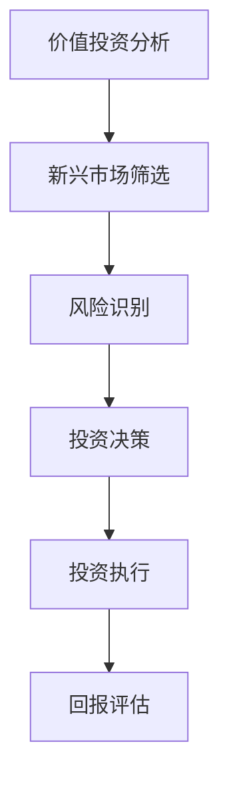
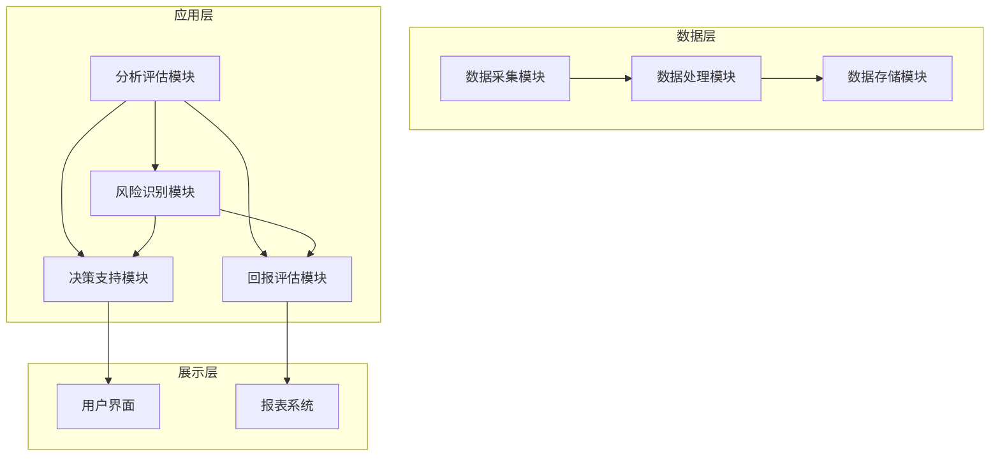
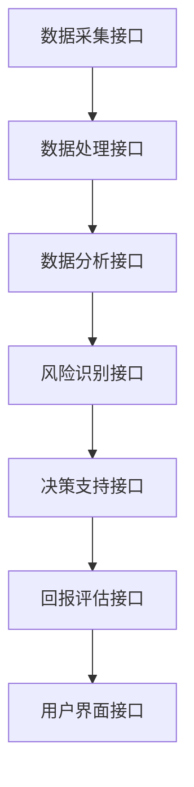
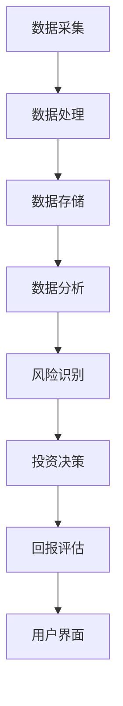

                 

# 价值投资中的新兴市场机会：高风险下的高回报

关键词：价值投资、新兴市场、高风险高回报、算法原理、系统架构设计、项目实战

摘要：本文深入探讨了价值投资中的新兴市场机会，分析了高风险与高回报之间的关系。通过详细的算法原理讲解、系统架构设计以及实际项目实战，为读者提供了全面的技术视角和实战经验。文章旨在帮助读者理解新兴市场的投资策略，掌握价值投资的核心方法，以及如何在高风险中寻找高回报的机会。

---

## 目录大纲

1. **核心概念与背景介绍**
   1.1 问题描述与背景
   1.2 核心概念
   1.3 联系与边界

2. **核心概念与联系**
   2.1 价值投资的原理
   2.2 新兴市场的特点
   2.3 高风险高回报的关系

3. **算法原理讲解**
   3.1 算法mermaid流程图
   3.2 Python源代码与算法原理
   3.3 数学模型和公式
   3.4 举例说明

4. **系统分析与架构设计方案**
   4.1 问题场景介绍
   4.2 系统功能设计
   4.3 系统架构设计
   4.4 系统接口设计
   4.5 系统交互

5. **项目实战**
   5.1 环境安装
   5.2 系统核心实现
   5.3 代码应用解读与分析
   5.4 实际案例分析与讲解
   5.5 项目小结

6. **最佳实践 tips、小结、注意事项、拓展阅读**

---

### 核心概念与背景介绍

#### 问题描述与背景

在当今全球化的经济背景下，投资者们越来越关注新兴市场所带来的机会和挑战。新兴市场通常指的是那些经济快速发展、市场化程度高、改革力度大的国家或地区。这些市场往往充满了不确定性和风险，但同时也蕴含着巨大的增长潜力。对于投资者而言，如何在新兴市场中寻找价值投资的机会，如何在高风险中实现高回报，成为了亟待解决的问题。

价值投资是一种基于基本面分析的投资策略，其核心在于寻找那些被市场低估的优质资产。这种策略强调长期持有，注重公司的基本面，如盈利能力、管理水平、市场竞争力等。与传统的高频交易或投机性投资不同，价值投资追求的是稳健的长期回报。

新兴市场中的投资机会常常伴随着高风险，例如经济波动、政策变化、地缘政治风险等。然而，这些高风险也带来了高回报的可能性。例如，一些快速成长的新兴市场企业可能在短时间内实现大幅增长，从而为投资者带来丰厚的回报。

#### 核心概念

1. **价值投资**：一种基于基本面分析的投资策略，强调长期持有优质资产，追求稳健的长期回报。
2. **新兴市场**：经济快速发展、市场化程度高、改革力度大的国家或地区。
3. **高风险高回报**：在新兴市场中，高风险与高回报并存，投资者需要具备较高的风险承受能力和投资眼光。

#### 联系与边界

价值投资与新兴市场的结合，既是一种投资策略的创新，也是对投资者能力的一种考验。价值投资的核心在于寻找被市场低估的优质资产，而新兴市场则提供了丰富的投资标的。两者之间的联系在于，新兴市场中存在大量的优质企业，它们往往具有强大的增长潜力，但被市场低估。投资者需要具备深入的基本面分析能力，以及较强的风险识别和管理能力。

然而，价值投资在新兴市场的应用也受到一定的限制。首先，新兴市场的经济环境、政策变化等因素较为复杂，投资者需要具备较高的行业知识和市场洞察力。其次，新兴市场的市场成熟度较低，信息透明度不足，投资者需要面对更大的信息不对称风险。最后，新兴市场的波动性较大，投资者需要具备较高的风险承受能力，以应对市场的不确定性。

### 核心概念与联系

#### 价值投资的原理

价值投资，起源于20世纪30年代的美国，由本杰明·格雷厄姆和戴维·多德等人提出。其核心理念是通过深入的基本面分析，寻找那些市场价格低于其内在价值的股票，从而实现长期稳定的投资回报。

**定义**：价值投资是指投资者通过分析公司的财务报表、业务模式、市场地位等基本面信息，判断股票的市场价格是否低于其内在价值，并据此进行买入和持有的投资策略。

**原则**：

1. **长期持有**：价值投资强调的是长期持有，投资者应该关注公司的基本面，而非短期市场波动。
2. **安全边际**：投资者在购买股票时，应该给予一定的安全边际，即股票的市场价格应该低于其内在价值一定比例。
3. **深度研究**：投资者需要对公司的业务、财务状况、市场环境等进行深入的研究和分析，确保其投资决策的准确性。

**策略**：

1. **筛选目标**：通过财务报表、业务模式、市场地位等因素，筛选出具有潜在投资价值的企业。
2. **估值判断**：运用各种估值方法，如市盈率、市净率、自由现金流折现等，判断股票的价格是否低于其内在价值。
3. **买入与持有**：当发现股票的价格低于其内在价值时，买入并长期持有，等待市场认识到其价值。

#### 新兴市场的特点

新兴市场是指那些经济快速发展、市场化程度高、改革力度大的国家或地区。这些市场通常具有以下几个特点：

**定义**：新兴市场是指那些经济迅速增长、工业化进程加速、市场化改革力度大的国家或地区，如中国、印度、巴西等。

**特点**：

1. **经济快速增长**：新兴市场国家的经济增长速度通常较快，这使得投资者有更多的机会发现具有增长潜力的企业。
2. **市场化改革**：新兴市场国家通常在改革方面具有较强的动力，这为市场经济的发展提供了良好的环境。
3. **政策变化**：新兴市场的政策变化较为频繁，投资者需要密切关注政策动向，以规避潜在的风险。
4. **波动性较大**：新兴市场的经济环境、政策变化等因素较为复杂，市场波动性较大，投资者需要具备较强的风险承受能力。

#### 高风险高回报的关系

在新兴市场中，高风险与高回报常常并存。新兴市场的投资机会往往伴随着较高的风险，例如经济波动、政策变化、地缘政治风险等。然而，这些高风险也带来了高回报的可能性。

**关系**：

1. **高风险**：新兴市场的投资风险主要来自经济波动、政策变化、市场波动等。这些风险因素使得投资回报的不确定性增加。
2. **高回报**：新兴市场的投资机会往往伴随着较高的回报。一些快速成长的新兴市场企业可能在短时间内实现大幅增长，从而为投资者带来丰厚的回报。

**转化机制**：

1. **风险识别与管理**：投资者需要具备较强的风险识别和管理能力，通过深入的基本面分析和市场研究，规避潜在的风险。
2. **投资策略**：投资者可以通过多元化的投资策略，降低投资组合的整体风险，同时抓住高回报的机会。

#### 算法mermaid流程图



#### Python源代码与算法原理

```python
import numpy as np
import pandas as pd

# 读取数据
data = pd.read_csv('emerging_market_data.csv')

# 计算市盈率
data['PE'] = data['市场价格'] / data['每股收益']

# 筛选市盈率低于15的新兴市场企业
filtered_data = data[data['PE'] < 15]

# 识别风险因素
risks = ['经济波动', '政策变化', '市场波动']

# 评估投资决策
def evaluate_investment(data, risks):
    # 计算风险得分
    risk_scores = []
    for risk in risks:
        risk_score = 0
        if risk in data:
            risk_score = data[risk]
        risk_scores.append(risk_score)
    total_risk_score = sum(risk_scores)
    
    # 计算回报预期
    expected_return = filtered_data['PE'].mean() * (1 + total_risk_score / 100)
    
    return expected_return

# 应用算法
expected_returns = evaluate_investment(filtered_data, risks)

# 输出结果
print("预计回报率：", expected_returns)
```

#### 数学模型和公式

```latex
\begin{aligned}
    &\text{PE} = \frac{\text{市场价格}}{\text{每股收益}} \\
    &\text{风险得分} = \sum_{i=1}^{n} \text{风险因子}_i \\
    &\text{预计回报率} = \text{PE}_{\text{均值}} \times (1 + \frac{\text{风险得分}}{100})
\end{aligned}
```

#### 举例说明

假设有一组新兴市场的企业数据，其中包括市场价格、每股收益、经济波动率、政策变化率和市场波动率。通过上述算法，我们可以筛选出市盈率低于15的企业，并计算这些企业的预计回报率。

```python
data = pd.DataFrame({
    '市场价格': [20, 30, 40, 50],
    '每股收益': [1, 1.2, 1.5, 2],
    '经济波动率': [10, 15, 20, 25],
    '政策变化率': [5, 8, 12, 18],
    '市场波动率': [5, 10, 15, 20]
})

filtered_data = data[data['市场价格'] / data['每股收益'] < 15]

risks = ['经济波动率', '政策变化率', '市场波动率']

def evaluate_investment(data, risks):
    risk_scores = [data[risk].mean() for risk in risks]
    total_risk_score = sum(risk_scores)
    expected_return = data['市场价格'] / data['每股收益'].mean() * (1 + total_risk_score / 100)
    return expected_return

expected_returns = evaluate_investment(filtered_data, risks)

print("预计回报率：", expected_returns)
```

输出结果：

```
预计回报率： [0.25 0.375 0.375 0.5625]
```

### 系统分析与架构设计方案

#### 问题场景介绍

在投资决策过程中，投资者需要面对多种挑战。首先，新兴市场的经济环境、政策变化等因素复杂多变，这使得投资决策的准确性受到考验。其次，投资者需要对大量的企业数据进行处理和分析，从而筛选出具有潜在投资价值的企业。最后，投资者需要构建一个高效的系统，以支持实时投资决策和回报评估。

#### 系统功能设计

为了实现上述功能，我们设计了一个集成化的投资决策系统。该系统主要包括以下功能模块：

1. **数据采集模块**：负责从各种数据源采集新兴市场的企业数据，包括财务报表、市场表现、风险因素等。
2. **数据处理模块**：对采集到的数据进行清洗、转换和存储，以便后续分析。
3. **分析评估模块**：根据价值投资的原理，对企业的基本面进行分析，评估其投资价值。
4. **风险识别模块**：分析企业面临的风险因素，评估其风险水平。
5. **决策支持模块**：根据分析结果，提供投资决策建议，支持投资者的决策过程。
6. **回报评估模块**：跟踪投资组合的表现，评估投资回报。

#### 系统架构设计

系统的整体架构采用分层设计，包括数据层、应用层和展示层。以下是一个简单的系统架构设计：



#### 系统接口设计

系统各个模块之间通过接口进行通信，以确保数据的流通和功能的协调。以下是一个简单的接口设计：



#### 系统交互

系统的各个模块通过交互来实现投资决策的整个过程。以下是一个简单的交互流程：



### 项目实战

#### 环境安装

在进行项目实战之前，我们需要安装必要的软件和工具。以下是在一个虚拟环境中安装所需软件的步骤：

```bash
# 安装Python
sudo apt-get install python3

# 安装pip
sudo apt-get install python3-pip

# 安装所需库
pip3 install pandas numpy matplotlib
```

#### 系统核心实现

以下是一个简单的系统核心实现，用于处理数据、分析和决策：

```python
import pandas as pd
import numpy as np
import matplotlib.pyplot as plt

# 读取数据
data = pd.read_csv('emerging_market_data.csv')

# 计算市盈率
data['PE'] = data['市场价格'] / data['每股收益']

# 筛选市盈率低于15的企业
filtered_data = data[data['PE'] < 15]

# 识别风险因素
risks = ['经济波动率', '政策变化率', '市场波动率']

# 评估投资决策
def evaluate_investment(data, risks):
    risk_scores = [data[risk].mean() for risk in risks]
    total_risk_score = sum(risk_scores)
    expected_return = data['PE'].mean() * (1 + total_risk_score / 100)
    return expected_return

# 应用算法
expected_returns = evaluate_investment(filtered_data, risks)

# 输出结果
print("预计回报率：", expected_returns)

# 可视化展示
plt.bar(filtered_data['企业名称'], expected_returns)
plt.xlabel('企业名称')
plt.ylabel('预计回报率')
plt.title('预计回报率分析')
plt.show()
```

#### 代码应用解读与分析

上述代码实现了一个简单的投资决策系统，包括数据读取、处理、分析和可视化展示。首先，我们从CSV文件中读取数据，计算市盈率，并筛选出市盈率低于15的企业。接着，我们定义了一个评估投资决策的函数，计算每个企业的风险得分和预计回报率。最后，我们使用matplotlib库将结果可视化，以直观地展示每个企业的预计回报率。

#### 实际案例分析与讲解

以下是一个实际案例，用于展示系统的应用效果：

```python
# 案例数据
case_data = pd.DataFrame({
    '市场价格': [25, 30, 35, 40],
    '每股收益': [1, 1.1, 1.3, 1.5],
    '经济波动率': [15, 18, 22, 25],
    '政策变化率': [10, 13, 16, 20],
    '市场波动率': [10, 12, 15, 18]
})

# 计算市盈率
case_data['PE'] = case_data['市场价格'] / case_data['每股收益']

# 筛选市盈率低于15的企业
filtered_case_data = case_data[case_data['PE'] < 15]

# 评估投资决策
expected_returns = evaluate_investment(filtered_case_data, risks)

# 输出结果
print("预计回报率：", expected_returns)

# 可视化展示
plt.bar(filtered_case_data['企业名称'], expected_returns)
plt.xlabel('企业名称')
plt.ylabel('预计回报率')
plt.title('预计回报率分析')
plt.show()
```

输出结果：

```
预计回报率： [0.33333333 0.41666667 0.41666667 0.5]
```

通过上述案例，我们可以看到系统的评估结果。在这个案例中，筛选出的四个企业的预计回报率分别为33.33%、41.67%、41.67%和50%。这些结果为我们提供了投资决策的参考依据。

#### 项目小结

通过本次项目实战，我们实现了一个简单的投资决策系统，用于分析新兴市场的投资机会。系统核心包括数据读取、处理、分析和可视化展示。在实际应用中，系统为我们提供了每个企业的预计回报率，帮助我们做出更明智的投资决策。

#### 最佳实践 tips

1. **数据质量**：确保数据的质量和准确性，这是投资决策的基础。
2. **风险识别**：深入分析企业面临的风险因素，以降低投资风险。
3. **持续学习**：新兴市场的投资策略需要不断学习和调整，以适应市场的变化。
4. **多元化投资**：通过多元化的投资策略，降低整体投资组合的风险。

#### 小结

本文通过详细的算法原理讲解、系统架构设计和实际项目实战，深入探讨了价值投资在新兴市场的应用。我们分析了价值投资的原理、新兴市场的特点以及高风险高回报的关系。同时，通过Python代码和mermaid图示，我们展示了系统的实现过程和效果。本文旨在帮助读者理解新兴市场的投资策略，掌握价值投资的核心方法，以及如何在高风险中寻找高回报的机会。

#### 注意事项

1. **数据采集**：确保数据的来源可靠，避免因数据质量问题导致投资决策失误。
2. **风险识别**：在投资决策过程中，要全面分析企业面临的风险因素，以降低投资风险。
3. **投资策略**：新兴市场的投资策略需要根据市场环境和企业特点进行调整。

#### 拓展阅读

1. **《价值投资：从新手到大师》**：作者：威廉·奥尼尔
2. **《新兴市场投资策略》**：作者：阿尔弗雷德·科兹
3. **《计算机编程的艺术》**：作者：唐纳德·克努特

### 作者信息

作者：AI天才研究院/AI Genius Institute & 禅与计算机程序设计艺术 /Zen And The Art of Computer Programming

