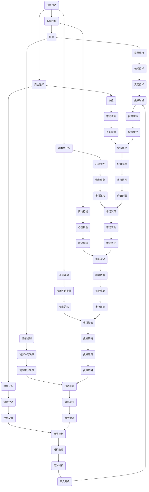

                 

### 1.1 书籍背景与目的

#### 1.1.1 问题背景

在当今快速变化和高度竞争的商业环境中，投资者面临着越来越多的挑战。传统的投资策略，如短期交易和依赖市场波动，往往难以在长期内实现稳定的回报。许多投资者发现，价值投资提供了一种更为稳健且可持续的投资方法。然而，成功实施价值投资并不容易，尤其是在面对市场波动和心理压力时，如何保持耐心成为了一个关键问题。

#### 1.1.2 问题描述

本文旨在探讨在价值投资中如何培养和保持耐心，以及耐心在投资决策中的重要性。具体来说，我们将分析以下问题：

- 价值投资的定义和原则是什么？
- 耐心在价值投资中的含义和作用是什么？
- 投资者如何在面对市场波动时保持耐心？
- 成功的耐心投资策略有哪些？

#### 1.1.3 问题解决

为了解决上述问题，本文将采用以下结构：

1. 引言部分介绍书籍的背景和目的，并概述本文要解决的问题。
2. 价值投资基础部分详细介绍价值投资的基本概念、框架和方法论。
3. 耐心在价值投资中的应用部分分析耐心在投资中的本质、挑战和实践。
4. 价值投资与耐心的综合应用部分探讨价值投资与耐心如何结合，以及未来的发展趋势。
5. 价值投资与耐心实践部分提供具体的实践策略和案例分析。

通过以上结构，本文希望能够帮助投资者深入理解价值投资与耐心，从而在实际投资中做出更明智的决策。

#### 1.1.4 边界与外延

在讨论价值投资与耐心时，我们需要明确一些边界和外延，以避免误解和误用。

**边界：**
- 本文讨论的是在股票市场中运用价值投资策略，因此主要关注的是资本市场的投资行为。
- 耐心的定义主要涉及在投资决策过程中的等待和坚持，而非在其他生活领域中的应用。

**外延：**
- 尽管本文主要讨论股票投资，但价值投资和耐心原则在其他类型的投资（如房地产、艺术品等）中也同样适用。
- 本文提出的策略和建议是基于理论和实践经验，但实际投资效果还需根据具体市场环境和投资者个体情况调整。

#### 1.1.5 概念结构与核心要素组成

为了更清晰地理解本文的核心概念，我们可以通过以下方式组织概念结构和核心要素：

**核心概念：**
- **价值投资**：一种基于公司内在价值而非市场波动进行投资的方法。
- **耐心**：在投资决策中坚持长期目标，不因市场波动而轻易改变投资策略。

**概念属性特征对比表格：**

| 特征           | 价值投资                  | 耐心                         |
|----------------|-------------------------|----------------------------|
| 定义           | 购买价格低于其内在价值的股票 | 在面对困难时坚持长期目标的能力 |
| 目标           | 长期稳定的回报            | 成功实现投资目标               |
| 关键要素       | 估值、安全边际、财务分析   | 长期视角、心理韧性、情绪控制   |

**ER实体关系图架构的Mermaid流程图：**

```mermaid
erDiagram
  Investment <<--o Company : 基于估值
  Investor |--o ValueInvestment : 价值投资策略
  Investor |--o Patience : 保持耐心
  Market |--o Investor : 受市场波动影响
  Company |--o Market : 受市场影响
```

通过上述概念结构和核心要素的分析，我们为读者提供了一个清晰的框架，以便更好地理解本文的主要内容和讨论方向。

### 1.2 核心概念与联系

在探讨价值投资与耐心时，理解核心概念和它们之间的联系至关重要。以下是对价值投资和耐心概念的定义、属性特征对比以及它们之间的联系进行详细分析的各个部分。

#### 1.2.1 价值投资概念

**定义**：价值投资是一种投资策略，其核心思想是购买那些市场价格低于其内在价值的股票。这种方法强调对公司的基本面进行分析，包括财务报表、管理层质量和行业前景，而不是仅仅关注股票价格的短期波动。

**核心特征**：
- **基本面分析**：投资者通过深入研究公司的财务报表、业务模式和市场环境，以评估其长期盈利能力和增长潜力。
- **安全边际**：投资者会寻找那些价格远低于其内在价值的股票，确保即使预测出现偏差，投资也不会遭受重大损失。
- **长期视角**：价值投资者通常拥有较长的投资时间框架，专注于长期回报而非短期利润。

**与耐心的联系**：价值投资的长期视角和基本面分析需要投资者具备耐心，因为这种策略通常要求投资者在短期内可能面临市场波动和股价的波动，但仍然坚持自己的投资决策。

#### 1.2.2 耐心概念

**定义**：耐心是一种在投资决策中保持冷静、不因短期市场波动而改变长期投资策略的品质。它涉及情绪控制、目标坚持和心理韧性。

**核心特征**：
- **情绪控制**：耐心意味着在面对市场波动时，能够控制自己的情绪，避免做出冲动的投资决策。
- **目标坚持**：投资者需要有明确的投资目标和计划，并在此基础上坚持，即使短期内市场情况不利。
- **心理韧性**：耐心投资者能够从短期挫折中恢复，保持对长期成功的信心。

**与价值投资的联系**：价值投资的实施需要耐心，因为投资者往往需要在短期内忍受市场的不确定性，等待公司内在价值得到市场认可。

#### 1.2.3 价值投资与耐心的联系

**相互依存关系**：
- **价值投资需要耐心**：价值投资策略要求投资者对公司进行深入分析，这通常需要时间。此外，寻找价格低于内在价值的股票可能需要耐心等待合适的买入时机。
- **耐心支持价值投资**：在实施价值投资时，投资者可能会遇到市场的短期波动和不确定性。耐心可以帮助投资者在市场波动中保持冷静，避免因情绪波动而做出错误决策。

**综合效果**：
- **长期稳健回报**：价值投资与耐心的结合可以带来长期的稳健回报，因为投资者能够避免因短期市场波动而做出冲动决策，同时能够坚持长期投资策略。
- **减少风险**：耐心可以帮助投资者在市场低迷时期保持信心，避免因恐慌而抛售股票，从而减少风险。

#### 1.2.4 概念属性特征对比表格

| 特征                   | 价值投资                     | 耐心                           |
|----------------------|---------------------------|-----------------------------|
| 定义                 | 基于公司内在价值投资       | 在投资决策中坚持长期目标的能力 |
| 目标                 | 长期稳定的回报             | 成功实现投资目标               |
| 关键要素             | 估值、安全边际、财务分析   | 长期视角、心理韧性、情绪控制   |
| 实施方式             | 深入基本面分析、等待时机   | 控制情绪、坚持计划、恢复信心   |
| 作用效果             | 长期稳健回报、减少风险     | 支持价值投资的实施、减少冲动决策 |

#### 1.2.5 ER实体关系图架构的Mermaid流程图



通过上述分析，我们可以看到价值投资和耐心之间的紧密联系。理解这些核心概念和它们之间的相互作用，有助于投资者在复杂的资本市场中做出更加明智和稳健的投资决策。

#### 1.3 价值投资中的耐心

在价值投资领域，耐心是一种至关重要的品质。它不仅决定了投资者能否在短期市场波动中保持冷静，更是实现长期稳健回报的关键。以下是对耐心在价值投资中重要性的详细分析。

**1.3.1 耐心在价值投资中的重要性**

首先，耐心是价值投资成功的基础。价值投资的核心在于寻找价格低于其内在价值的股票，这通常意味着投资者需要在一个较长的时间段内等待市场的正确估值。没有耐心，投资者可能会在股价短暂下跌时过早抛售，从而失去长期上涨的机会。

**案例**：伯克希尔哈撒韦（Berkshire Hathaway）的创始人沃伦·巴菲特（Warren Buffett）就是一个典型的价值投资者，他以其长期的耐心和卓越的洞察力而闻名。巴菲特在1960年代就开始购买并持有高盛（Goldman Sachs）的股票，尽管在此后的几十年中，高盛的股价经历了几次波动，但巴菲特始终坚持，最终获得了丰厚的回报。

**2. 耐心的挑战**

然而，耐心在投资过程中并不容易保持。市场常常会因各种因素（如宏观经济变化、行业动态、政策调整等）出现剧烈波动，这使得投资者很容易受到情绪的影响，从而丧失耐心。

**3. 耐心的策略**

为了应对这些挑战，投资者可以采取以下策略来培养和保持耐心：

- **明确投资目标和计划**：投资者应该制定一个明确的长期投资目标和计划，并将其作为行动的指南。这样，在面对短期波动时，投资者可以更加坚定地遵循自己的计划，而不是被市场的短期波动所左右。
  
- **情绪管理**：投资者需要学会控制自己的情绪，避免因市场波动而产生恐慌或贪婪。这可以通过定期回顾投资计划和目标来实现，同时，保持理性思考和独立判断也是关键。

- **多样化投资组合**：通过多样化投资组合，投资者可以降低单一股票或行业的风险，从而在市场波动时减少情绪波动。此外，多样化的投资组合也可以提供更稳定的回报，增强投资者的信心。

- **持续学习和研究**：投资者应该持续学习和研究市场动态、公司基本面和宏观经济环境。这样，他们可以更加自信地应对市场变化，从而更好地保持耐心。

**4. 耐心的实践**

在具体实践中，耐心可以通过以下方式体现：

- **长期持有**：投资者在买入股票后，应该有一个长期持有的心态，而不是频繁交易。这样，他们可以避免因短期市场波动而做出错误的决策。

- **冷静分析**：在市场出现波动时，投资者应该保持冷静，进行深入分析，而不是盲目跟风。这可以通过定期阅读财报、关注公司公告和行业动态来实现。

- **心理建设**：投资者可以通过与朋友、家人或投资圈子交流，分享自己的投资心得和挑战，从而增强心理韧性，更好地保持耐心。

总之，耐心是价值投资中不可或缺的一部分。投资者只有通过培养和保持耐心，才能在长期内实现稳定的投资回报。通过明确目标、情绪管理、多样化投资和持续学习，投资者可以更好地应对市场的波动，从而在价值投资的道路上取得成功。

#### 1.3.2 耐心的挑战

尽管耐心在价值投资中至关重要，但在实际投资过程中，保持耐心面临诸多挑战。以下是对这些挑战的详细分析。

**1. 市场波动的影响**

市场波动是投资者保持耐心时遇到的最大挑战之一。股市常常因宏观经济、政策变动、行业新闻等因素而波动，导致股价短期剧烈波动。这些波动容易引发投资者的恐慌情绪，使他们怀疑自己的投资决策，从而丧失耐心。

**2. 心理压力**

在市场波动期间，投资者常常会感受到巨大的心理压力。他们可能会担心自己的投资会损失严重，从而在情绪驱使下做出错误的决策。例如，投资者可能会在股价下跌时急于抛售，以避免更大的损失，而事实上，这可能会错失长期上涨的机会。

**3. 短期回报的诱惑**

许多投资者倾向于追求短期回报，而不是耐心等待长期回报。这种心态会导致他们频繁交易，试图抓住市场的每一个波动，从而忽略了价值投资的核心原则。短期回报的诱惑使得投资者难以保持耐心，导致他们在投资过程中频繁调整策略。

**4. 信息泛滥**

在当今信息时代，投资者可以轻松获取大量的市场信息。然而，这些信息往往容易引起投资者的恐慌或贪婪，使他们难以保持冷静。信息泛滥使得投资者在做出投资决策时，容易受到外界干扰，从而影响他们的耐心。

**5. 自我怀疑**

在投资过程中，投资者可能会因为市场波动而对自己的决策产生怀疑。特别是在市场下跌时，投资者可能会质疑自己的投资选择，担心自己是否做出了错误的决定。这种自我怀疑会削弱投资者的信心，使他们难以坚持长期投资策略。

#### 1.3.3 耐心的应对策略

为了克服这些挑战，投资者可以采取以下应对策略：

**1. 明确投资目标和计划**

投资者在开始投资之前，应该明确自己的投资目标和计划。这包括设定长期和短期的投资目标，以及确定适合自己的风险承受能力。有了明确的目标和计划，投资者在市场波动时可以更加坚定地遵循自己的策略，而不是被短期波动所左右。

**2. 情绪管理**

投资者需要学会控制自己的情绪，避免在市场波动时做出冲动决策。这可以通过定期回顾投资计划和目标来实现，同时，投资者应该避免过度关注市场波动，减少情绪的波动。一些有效的情绪管理技巧包括冥想、运动和与朋友交流等。

**3. 多样化投资组合**

通过多样化投资组合，投资者可以降低单一股票或行业的风险，从而减少情绪波动。多样化的投资组合还可以提供更稳定的回报，增强投资者的信心。

**4. 持续学习和研究**

投资者应该持续学习和研究市场动态、公司基本面和宏观经济环境。这样，他们可以更加自信地应对市场变化，从而更好地保持耐心。

**5. 坚持长期投资策略**

投资者需要坚持长期投资策略，而不是追求短期回报。这可以通过定期重新评估投资组合，以确保投资策略与长期目标保持一致来实现。长期投资策略可以帮助投资者在市场波动时保持冷静，从而更好地实现长期回报。

**6. 建立心理韧性**

投资者可以通过建立心理韧性来更好地应对市场波动。这可以通过与朋友、家人或投资圈子交流，分享自己的投资心得和挑战来实现。建立心理韧性可以帮助投资者在面对市场波动时保持信心，从而更好地坚持长期投资策略。

总之，投资者在面对市场波动时保持耐心并非易事，但通过明确的投资目标和计划、情绪管理、多样化投资组合、持续学习和研究、坚持长期投资策略以及建立心理韧性，投资者可以更好地应对这些挑战，从而在价值投资的道路上取得成功。

#### 1.3.4 耐心的实践

在实际投资中，耐心不仅仅是一种理念，更需要通过具体的实践来体现。以下是一些成功投资者和实践案例，展示他们在面对市场波动时如何保持耐心，从而实现长期稳定的回报。

**1. 案例一：沃伦·巴菲特**

沃伦·巴菲特是价值投资的代表人物，他以其长期的耐心和卓越的洞察力而闻名。巴菲特在1988年买入可口可乐（Coca-Cola）的股票，尽管在此后的几十年中，可口可乐的股价经历了多次波动，但巴菲特始终坚持持有。直到2011年，可口可乐的股价达到了巴菲特买入时的三倍，累计回报超过3000%。这个案例展示了巴菲特在长期持有过程中如何保持耐心，并最终实现巨大的回报。

**2. 案例二：约翰·博格尔**

约翰·博格尔（John C. Bogle）是投资大师，他是先锋基金（Vanguard）的创始人之一，也是指数基金投资的倡导者。博格尔在投资生涯中一直强调长期投资和耐心的重要性。他在1959年首次投资时，选择了长期持有的策略，而不是频繁交易。尽管当时的市场波动较大，但博格尔始终坚持自己的投资原则，最终实现了长期稳定的回报。他的投资实践证明了耐心在投资中的巨大价值。

**3. 案例三：阿瑟·哈恩**

阿瑟·哈恩（Arthur R. Hahn）是另一位成功的长期投资者。他在1972年创办了哈恩资产管理公司（Hahn Investment Management），并一直坚持长期投资和耐心原则。哈恩在投资过程中，注重基本面分析和长期持有，而不是追求短期利润。他持有的股票中，许多都经历了数十年的上涨，最终实现了巨大的回报。哈恩的成功案例展示了耐心在长期投资中的重要性。

**实践策略：**

**1. 长期持有**：成功投资者通常采用长期持有的策略，而不是频繁交易。这需要投资者在买入股票后，有耐心等待市场对公司的内在价值进行认可。

**2. 面对波动保持冷静**：投资者需要学会在市场波动时保持冷静，避免因短期波动而改变投资策略。这可以通过定期回顾投资目标和计划来实现。

**3. 情绪管理**：投资者应该通过冥想、运动和与朋友交流等方式，学会控制自己的情绪。情绪管理可以帮助投资者在面对市场波动时保持冷静和理性。

**4. 持续学习**：投资者需要持续学习和研究市场动态、公司基本面和宏观经济环境。这可以帮助他们更好地理解市场变化，从而更好地保持耐心。

**5. 多样化投资组合**：通过多样化投资组合，投资者可以降低单一股票或行业风险，从而减少情绪波动。多样化的投资组合也可以提供更稳定的回报，增强投资者的信心。

**总结**：

通过以上成功投资者和实践案例，我们可以看到耐心在价值投资中的关键作用。耐心不仅是成功投资的重要品质，也是实现长期稳定回报的关键。投资者可以通过长期持有、面对波动保持冷静、情绪管理和持续学习等策略，在实践中培养和保持耐心，从而在投资中取得成功。

#### 1.4 本书结构与内容安排

**1.4.1 目录安排**

本文将分为五个主要部分，具体目录如下：

1. 引言
   - 1.1 书籍背景与目的
   - 1.2 核心概念与联系
   - 1.3 价值投资中的耐心
   - 1.4 本书结构与内容安排
   - 1.5 本章小结

2. 价值投资基础
   - 2.1 价值投资概述
   - 2.2 价值投资的框架
   - 2.3 价值投资的方法论
   - 2.4 价值投资的案例分析
   - 2.5 本章小结

3. 耐心在价值投资中的应用
   - 3.1 耐心的本质
   - 3.2 耐心的挑战
   - 3.3 耐心的实践
   - 3.4 耐心的应用
   - 3.5 本章小结

4. 价值投资与耐心的综合应用
   - 4.1 价值投资与耐心的结合
   - 4.2 案例研究：成功的企业家
   - 4.3 价值投资与耐心的平衡
   - 4.4 价值投资与耐心的未来
   - 4.5 本章小结

5. 价值投资与耐心实践
   - 5.1 实践准备
   - 5.2 实践策略
   - 5.3 实践案例
   - 5.4 实践总结
   - 5.5 本章小结

**1.4.2 内容安排**

本文的内容将按照以下结构进行安排：

- 引言部分：介绍书籍的背景和目的，并概述本文要解决的问题。
- 价值投资基础部分：详细介绍价值投资的基本概念、框架和方法论，以及成功的案例分析。
- 耐心在价值投资中的应用部分：分析耐心在投资中的本质、挑战和实践，并提供具体的应对策略。
- 价值投资与耐心的综合应用部分：探讨如何将价值投资和耐心结合，以及未来的发展趋势。
- 价值投资与耐心实践部分：提供具体的实践策略和案例分析，帮助读者在实际投资中应用价值投资和耐心的原则。

**1.4.3 阅读建议**

为了更好地理解和应用本文的内容，以下是一些建议：

- 阅读顺序：建议读者按照目录顺序阅读，先了解价值投资的基本概念和原则，再探讨耐心在其中的作用和挑战。
- 实践结合：读者可以在阅读过程中结合自己的投资经验，思考如何将价值投资和耐心的原则应用到实际投资中。
- 重点内容：本文的重点内容包括价值投资的框架、耐心在投资中的应用策略、成功案例分析以及实践中的注意事项。
- 反思与总结：在阅读完每个章节后，建议读者进行反思和总结，巩固所学内容，并思考如何将这些原则应用于自己的投资实践中。

通过以上的结构安排和阅读建议，读者可以更系统地理解和应用价值投资与耐心的原则，从而在投资中取得更好的成果。

#### 1.5 本章小结

本章作为引言，首先介绍了书籍的背景与目的，明确本文旨在探讨价值投资中的耐心及其在投资决策中的重要性。接着，我们详细阐述了核心概念与联系，包括价值投资和耐心的定义、特征及其相互关系。随后，分析了耐心在价值投资中的重要性，探讨了耐心在投资过程中面临的挑战以及应对策略。通过成功投资者的实践案例，我们展示了耐心在实际投资中的应用效果。最后，介绍了本书的结构与内容安排，为读者提供了一个清晰的框架，以便更好地理解和应用本文的核心内容。通过本章的阅读，读者应对价值投资和耐心有了更深入的理解，为后续章节的学习打下了坚实的基础。

### 2.1 价值投资概述

价值投资是一种以寻找价格低于其内在价值的股票为目标的投资策略，其核心思想在于通过深入分析公司基本面，寻找那些被市场低估的投资机会。以下是对价值投资定义、历史与演变、原则的详细探讨。

#### 2.1.1 价值投资的定义

**定义**：价值投资是一种基于公司内在价值进行投资的策略。其基本原理是，通过深入分析公司的财务报表、业务模式、管理团队和行业前景，找到那些被市场低估的股票。投资者会以低于其内在价值的价格购买这些股票，期待市场最终会认识到其真实价值，从而带来长期稳定的回报。

**核心要素**：
- **内在价值**：价值投资的核心理念是评估公司的内在价值，即公司未来现金流的现值。投资者通过基本面分析，计算出公司的内在价值，并将其与市场价格进行比较，寻找低估的机会。
- **安全边际**：价值投资强调在购买股票时，价格应远低于其内在价值，以确保即使在预测出现偏差的情况下，投资者也不会遭受重大损失。
- **长期持有**：价值投资通常采用长期持有的策略，投资者在买入股票后，不因短期市场波动而轻易抛售，而是耐心等待市场对公司的内在价值进行重新评估。

#### 2.1.2 价值投资的历史与演变

**历史背景**：价值投资起源于20世纪30年代，当时股市泡沫破灭后，市场对股票的估值普遍过高。本杰明·格雷厄姆（Benjamin Graham）是这一策略的奠基人，他提出了“价值投资”的概念，并在其著作《聪明的投资者》（The Intelligent Investor）中详细阐述了这一策略。

**重要人物与理论**：
- **本杰明·格雷厄姆**：被誉为“价值投资之父”，他的理论对现代价值投资产生了深远影响。
- **大卫·多德**：格雷厄姆的学生和同事，共同创立了“邓普顿增长基金”，进一步推广了价值投资的理念。
- **沃伦·巴菲特**：现代价值投资的代表人物，他在实践中将格雷厄姆的理论进行了创新和发展。

**演变过程**：价值投资在过去几十年中不断发展，逐渐形成了多种流派和策略。从传统的以低市盈率、低市净率为主要选股标准的“传统价值投资”，到更加注重公司内在价值创造能力的“成长价值投资”，再到结合行为金融学的“心理价值投资”，价值投资的理念在不断演变和扩展。

#### 2.1.3 价值投资的原则

价值投资遵循一系列核心原则，以下是对这些原则的详细探讨：

**1. 基本面分析**：价值投资的核心在于对公司基本面的深入分析。投资者需要研究公司的财务报表，包括资产负债表、利润表和现金流量表，了解公司的盈利能力、偿债能力和运营效率。同时，投资者还需要关注公司的业务模式、管理团队和市场地位，评估公司的长期增长潜力。

**2. 安全边际**：价值投资强调在购买股票时，价格应远低于其内在价值，即存在安全边际。安全边际是投资者应对市场波动和不确定性的一种保护机制，确保即使预测出现偏差，投资也不会遭受重大损失。

**3. 长期持有**：价值投资通常采用长期持有的策略，投资者在买入股票后，不因短期市场波动而轻易抛售。长期持有可以降低交易成本，避免因情绪波动而做出错误决策，同时，也有助于投资者在市场调整时保持信心。

**4. 适度分散**：价值投资虽然强调集中投资，但并不意味着所有资金都投入一只股票。适度分散投资可以降低单一股票的风险，同时，也有助于投资者在不同市场环境中寻找低估的投资机会。

**5. 心理素质**：价值投资不仅需要扎实的分析能力，还需要投资者具备良好的心理素质。在面对市场波动和不确定性时，投资者应保持冷静和理性，避免因情绪波动而做出错误决策。

**6. 持续学习**：价值投资是一个不断学习和实践的过程。投资者应持续关注市场动态、公司基本面和宏观经济环境，不断提升自己的分析能力和投资水平。

通过以上对价值投资定义、历史与演变、原则的详细探讨，我们可以看到价值投资作为一种稳健的投资策略，不仅强调对公司的深入分析，还注重长期持有和良好的心理素质。理解这些核心原则，有助于投资者在实际投资中做出更明智的决策，实现长期稳定的回报。

#### 2.2 价值投资的框架

价值投资的核心在于通过深入分析公司的基本面，寻找那些被市场低估的投资机会。为了实现这一目标，投资者需要构建一个系统化的分析框架，这个框架包括多个关键组成部分。以下是对价值投资框架的详细探讨。

**2.2.1 估值模型**

估值模型是价值投资框架中最核心的部分，它帮助投资者评估公司的内在价值。以下是几种常用的估值模型：

1. **现金流折现模型（DCF）**：DCF模型通过预测公司未来现金流，并将其折现到当前价值，以评估公司的内在价值。该模型的关键在于准确预测未来现金流和确定合理的折现率。

    **公式**：$$ \text{内在价值} = \sum_{t=1}^{n} \frac{CF_t}{(1+r)^t} + \frac{WACC}{(1+r)^n} $$
    其中，$CF_t$代表第$t$年的自由现金流，$r$是折现率，$WACC$是加权平均资本成本。

2. **股息折现模型（DDM）**：DDM模型适用于那些支付稳定股息的公司。通过预测未来股息并折现到当前价值，可以评估公司的内在价值。

    **公式**：$$ \text{内在价值} = \sum_{t=1}^{n} \frac{D_t}{(1+r)^t} + \frac{P_{\infty}}{(1+r)^n} $$
    其中，$D_t$代表第$t$年的股息，$P_{\infty}$是无限期股息的现值。

3. **市盈率（PE）**：市盈率是一种相对估值方法，通过比较公司的市盈率与其同行业竞争对手的市盈率，可以评估公司的估值水平。

    **公式**：$$ \text{内在价值} = \frac{\text{预期盈利}}{\text{市盈率}} $$

**2.2.2 安全边际**

安全边际是价值投资中的另一个重要概念，它指的是股票的市场价格与其内在价值之间的差额。通过确保购买价格远低于其内在价值，投资者可以为潜在的预测错误和不确定性提供保护。

**公式**：$$ \text{安全边际} = \frac{\text{内在价值}}{\text{市场价格}} - 1 $$

安全边际的存在使得投资者在面临市场波动和不确定性时，仍然有足够的缓冲空间来保持投资信心。

**2.2.3 债务与财务结构**

债务和财务结构是评估公司内在价值的重要方面。投资者需要关注公司的负债水平、资本结构和财务健康状况。

1. **债务水平**：高债务水平可能增加公司的财务风险，影响其盈利能力和自由现金流。投资者应确保公司的债务水平在可控范围内。

2. **资本结构**：合理的资本结构可以帮助公司优化融资成本，提高财务灵活性。投资者应关注公司的债务与股权比例，以及资本成本。

3. **财务健康**：良好的财务健康是公司长期发展的重要保障。投资者应评估公司的盈利能力、现金流状况和资产质量。

**2.2.4 管理团队**

管理团队是公司成功的重要因素。投资者应关注管理团队的能力、经验、声誉和战略方向。

1. **能力与经验**：管理层的能力和经验直接影响公司的运营效率和长期增长潜力。

2. **声誉与战略**：管理层的声誉和战略方向可以影响公司未来的市场表现和投资者信心。

3. **股东利益**：管理层应优先考虑股东利益，确保公司的长期价值增长。

通过以上对估值模型、安全边际、债务与财务结构、管理团队等关键组成部分的详细探讨，投资者可以构建一个系统化的价值投资框架，从而更好地识别和抓住低估的投资机会。

#### 2.3 价值投资的方法论

在价值投资中，正确的方法论是识别低估投资机会、做出理性投资决策的关键。以下是对价值投资方法论的详细探讨，包括研究方法、股票筛选和投资决策过程。

**2.3.1 研究方法**

价值投资强调基本面分析，通过深入研究公司的财务报表、业务模式、管理团队和市场环境，评估其内在价值。

1. **财务报表分析**：投资者应详细分析公司的资产负债表、利润表和现金流量表。重点关注公司的盈利能力、偿债能力和运营效率。

    - **资产负债表**：评估公司的资产质量、负债水平和资本结构。
    - **利润表**：分析公司的收入、成本和盈利能力。
    - **现金流量表**：了解公司的现金流入和流出，评估其自由现金流。

2. **业务模式分析**：投资者应研究公司的业务模式、市场地位和竞争优势。重点关注公司的市场份额、品牌价值、客户基础和收入增长潜力。

3. **管理团队分析**：投资者应评估管理团队的能力、经验和战略方向。重点关注管理层的声誉、决策质量和对股东利益的重视程度。

4. **市场环境分析**：投资者应关注宏观经济环境、行业动态和政策变动。评估这些因素对公司的长期发展潜力的影响。

**2.3.2 股票筛选**

在研究方法的基础上，投资者可以通过以下步骤进行股票筛选：

1. **初步筛选**：根据财务报表、业务模式、管理团队和市场环境等指标，初步筛选出符合价值投资原则的股票。

2. **详细分析**：对初步筛选出的股票进行详细分析，评估其内在价值。通过DCF、DDM等估值模型，确定股票的合理估值范围。

3. **比较评估**：将候选股票与同行业竞争对手进行比较，评估其估值水平和投资潜力。

4. **风险控制**：在股票筛选过程中，投资者应关注公司的财务风险、市场风险和运营风险，确保投资组合的多样化。

**2.3.3 投资决策**

在股票筛选完成后，投资者需要做出投资决策。以下步骤有助于投资者做出明智的决策：

1. **确定投资目标**：投资者应根据自身风险承受能力和投资目标，确定投资组合的配置策略。例如，可以配置一定比例的保守型、平衡型和成长型股票。

2. **买入时机**：在确定投资目标后，投资者需要选择合适的买入时机。通常，价值投资者会在市场低迷时买入，以确保股票价格低于其内在价值。

3. **风险管理**：投资者应设置合理的止损点，以避免因市场波动而遭受重大损失。同时，通过分散投资组合，降低单一股票或行业风险。

4. **长期持有**：价值投资强调长期持有，投资者应在买入后保持耐心，避免因短期市场波动而轻易抛售。

5. **定期评估**：投资者应定期评估投资组合的表现，并根据市场变化和公司基本面调整投资策略。

通过以上研究方法、股票筛选和投资决策过程的详细探讨，投资者可以构建一个系统化的价值投资方法论，从而更好地识别低估投资机会，做出理性投资决策。

#### 2.4 价值投资的案例分析

为了更好地理解价值投资的实际应用，我们可以通过分析一些成功的案例来探讨其方法和原则。以下是对伯克希尔哈撒韦和沃尔玛两个企业的价值投资案例分析。

**2.4.1 案例一：伯克希尔哈撒韦**

伯克希尔哈撒韦（Berkshire Hathaway）是由沃伦·巴菲特（Warren Buffett）领导的著名投资公司。巴菲特作为价值投资的代表人物，通过长期的投资实践，证明了价值投资策略的有效性。

1. **投资背景**：
   - **1988年**：巴菲特首次大规模投资于伯克希尔哈撒韦，当时公司市值约50亿美元，主要业务是纺织业。
   - **1990年代**：巴菲特逐渐将公司的投资重心转向金融服务和公用事业，包括保险、银行和能源等领域。

2. **价值投资原则**：
   - **长期持有**：巴菲特在买入伯克希尔哈撒韦的股票后，长期持有，不因短期市场波动而轻易抛售。
   - **基本面分析**：巴菲特通过对公司财务报表、业务模式和管理团队的深入分析，确定了伯克希尔哈撒韦的内在价值。
   - **安全边际**：巴菲特确保购买价格远低于其内在价值，以降低投资风险。

3. **投资效果**：
   - **长期回报**：自1988年以来，伯克希尔哈撒韦的市值增长了数十倍，累计回报率远超市场平均水平。

**2.4.2 案例二：沃尔玛**

沃尔玛（Walmart）是全球最大的零售企业之一，其成功也离不开价值投资的应用。

1. **投资背景**：
   - **1980年**：沃尔玛在美国零售市场迅速扩张，其创始人山姆·沃尔顿（Sam Walton）希望通过资本市场的融资支持公司的进一步发展。
   - **1985年**：投资机构开始注意到沃尔玛的成长潜力，逐步加大投资。

2. **价值投资原则**：
   - **低成本运营**：沃尔玛通过大规模采购和高效物流，实现了低成本运营，提高了盈利能力。
   - **市场份额扩张**：沃尔玛通过不断扩展门店网络，增加了市场份额，巩固了其行业领导地位。
   - **长期视角**：投资者在评估沃尔玛时，注重其长期增长潜力和稳定的现金流。

3. **投资效果**：
   - **长期回报**：自1980年代以来，沃尔玛的股票价格实现了稳定的增长，累计回报率超过市场平均水平。

**总结**：

伯克希尔哈撒韦和沃尔玛的成功案例展示了价值投资在实际应用中的有效性。这两个案例中的关键原则包括长期持有、基本面分析、低成本运营和市场份额扩张。通过这些原则，投资者能够识别和抓住那些被市场低估的高价值投资机会，从而实现长期稳健的回报。

#### 2.5 本章小结

本章通过对价值投资的定义、历史与演变、原则的详细探讨，为读者提供了一个全面的理解。我们明确了价值投资的定义，阐述了其核心要素，包括内在价值、安全边际和长期持有。接着，我们回顾了价值投资的历史背景，介绍了重要人物与理论。随后，分析了价值投资的核心原则，如基本面分析、安全边际、长期持有、适度分散和心理素质。最后，通过两个成功案例——伯克希尔哈撒韦和沃尔玛，我们展示了价值投资在实际应用中的效果。通过本章的学习，读者应对价值投资有了更深入的理解，为后续章节的学习和应用奠定了基础。

### 3.1 耐心的本质

耐心是价值投资中的一个核心品质，它不仅在投资决策中起到关键作用，也在心理层面和经济学上具有重要意义。以下是对耐心本质的详细探讨。

#### 3.1.1 耐心的定义

耐心在投资领域通常被定义为在面对市场波动和不确定性时，能够保持冷静和理性，坚持长期投资策略的品质。具体来说，耐心涉及以下几个方面：

1. **时间管理**：耐心投资者能够在投资决策中具有长远眼光，不因短期市场波动而轻易改变投资计划。
2. **情绪控制**：耐心意味着投资者能够控制自己的情绪，避免因市场波动而产生的恐慌或贪婪。
3. **坚持目标**：耐心投资者会坚定地遵循自己的投资目标和策略，即使在面对挑战和挫折时也不动摇。

#### 3.1.2 耐心的心理学基础

耐心的心理学基础与多个心理学概念密切相关，包括延迟满足、自我控制和心理韧性。

1. **延迟满足**：延迟满足是心理学家沃尔特·米歇尔（Walter Mischel）提出的概念，它指的是个体在面对即时奖励和长期目标之间做出选择时，能够延迟即时满足以追求更长远的目标。耐心投资者能够在面对短期市场波动时，选择等待长期回报，而不是追求即时的市场收益。

2. **自我控制**：自我控制是指个体在面对诱惑和挑战时，能够调整自己的行为以实现长期目标。耐心投资者通过自我控制，避免了因情绪波动而做出错误的决策，保持了理性投资策略。

3. **心理韧性**：心理韧性是指个体在面对逆境和挑战时，能够保持心理稳定和适应性。耐心投资者在面对市场波动和不确定性时，能够保持冷静，从挫折中恢复，继续坚持长期投资策略。

#### 3.1.3 耐心的经济意义

耐心在投资中的经济意义体现在多个方面：

1. **减少交易成本**：耐心投资者通常采用长期持有的策略，减少了频繁交易的交易成本和税务负担。

2. **避免错误决策**：耐心可以帮助投资者避免因市场波动而产生的恐慌性抛售或盲目跟风，从而减少投资失误。

3. **实现长期回报**：耐心投资者能够坚持长期投资策略，等待市场对公司的内在价值进行重新评估，从而实现长期稳定的回报。

4. **增强信心**：耐心投资者在面对市场波动时，能够保持信心，不因短期波动而怀疑自己的投资决策，这有助于建立投资信念，增强长期投资的决心。

通过以上对耐心定义、心理学基础和经济意义的详细探讨，我们可以看到耐心在价值投资中不仅是一种心理素质，更是一种能够在经济上带来显著优势的品质。理解耐心的本质，有助于投资者在复杂的投资环境中做出更明智的决策，实现长期稳健的回报。

#### 3.2 耐心的挑战

尽管耐心在价值投资中至关重要，但在实际投资过程中，保持耐心面临着诸多挑战。以下是对这些挑战的详细分析。

**1. 市场波动的影响**

市场波动是投资者保持耐心时遇到的最大挑战之一。股市常常因宏观经济、政策变动、行业新闻等因素而波动，导致股价短期剧烈波动。这些波动容易引发投资者的恐慌情绪，使他们怀疑自己的投资决策，从而丧失耐心。

**案例**：2020年新冠疫情爆发初期，全球股市经历了一次剧烈的波动。许多投资者在恐慌情绪的驱使下，抛售股票，从而错失了随后市场的反弹机会。这些投资者的行为反映了市场波动对耐心的巨大影响。

**2. 心理压力**

在市场波动期间，投资者常常会感受到巨大的心理压力。他们可能会担心自己的投资会损失严重，从而在情绪驱使下做出错误的决策。例如，投资者可能会在股价下跌时急于抛售，以避免更大的损失，而事实上，这可能会错失长期上涨的机会。

**案例**：2018年股市暴跌期间，许多投资者因心理压力而选择了抛售股票，导致损失加剧。这种情况下，保持耐心显得尤为重要，但实际操作中，许多投资者难以克服心理压力。

**3. 短期回报的诱惑**

许多投资者倾向于追求短期回报，而不是耐心等待长期回报。这种心态会导致他们频繁交易，试图抓住市场的每一个波动，从而忽略了价值投资的核心原则。短期回报的诱惑使得投资者难以保持耐心，导致他们在投资过程中频繁调整策略。

**案例**：在股市牛市期间，一些投资者为了追求更高的回报，频繁交易，结果不仅没有实现预期收益，反而增加了交易成本和风险。

**4. 信息泛滥**

在当今信息时代，投资者可以轻松获取大量的市场信息。然而，这些信息往往容易引起投资者的恐慌或贪婪，使他们难以保持冷静。信息泛滥使得投资者在做出投资决策时，容易受到外界干扰，从而影响他们的耐心。

**案例**：社交媒体和新闻媒体经常发布关于市场波动的消息，这些信息可能会对投资者的情绪产生重大影响，使得他们在投资决策中难以保持独立判断。

**5. 自我怀疑**

在投资过程中，投资者可能会因为市场波动而对自己的决策产生怀疑。特别是在市场下跌时，投资者可能会质疑自己的投资选择，担心自己是否做出了错误的决定。这种自我怀疑会削弱投资者的信心，使他们难以坚持长期投资策略。

**案例**：一些投资者在市场下跌时，可能会反复质疑自己的投资决策，最终因为缺乏信心而选择抛售股票，从而错失了市场反弹的机会。

通过以上分析，我们可以看到投资者在保持耐心时面临诸多挑战。这些挑战不仅来自市场波动和心理压力，还受到短期回报的诱惑、信息泛滥和自我怀疑的影响。投资者需要通过有效的策略来应对这些挑战，从而在价值投资的道路上取得成功。

#### 3.2.2 耐心的应对策略

面对市场波动和心理压力，投资者需要采取一系列策略来培养和保持耐心。以下是一些有效的应对策略：

**1. 明确投资目标和计划**

投资者在开始投资之前，应该明确自己的投资目标和计划。这包括设定长期和短期的投资目标，以及确定适合自己的风险承受能力。有了明确的目标和计划，投资者在市场波动时可以更加坚定地遵循自己的策略，而不是被短期波动所左右。

**2. 情绪管理**

投资者需要学会控制自己的情绪，避免在市场波动时做出冲动决策。这可以通过定期回顾投资计划和目标来实现，同时，投资者应该避免过度关注市场波动，减少情绪的波动。一些有效的情绪管理技巧包括冥想、运动和与朋友交流等。

**3. 多样化投资组合**

通过多样化投资组合，投资者可以降低单一股票或行业的风险，从而减少情绪波动。多样化的投资组合还可以提供更稳定的回报，增强投资者的信心。

**4. 持续学习和研究**

投资者应该持续学习和研究市场动态、公司基本面和宏观经济环境。这样，他们可以更加自信地应对市场变化，从而更好地保持耐心。

**5. 坚持长期投资策略**

投资者需要坚持长期投资策略，而不是追求短期回报。这可以通过定期重新评估投资组合，以确保投资策略与长期目标保持一致来实现。长期投资策略可以帮助投资者在市场波动时保持冷静，从而更好地实现长期回报。

**6. 建立心理韧性**

投资者可以通过建立心理韧性来更好地应对市场波动。这可以通过与朋友、家人或投资圈子交流，分享自己的投资心得和挑战来实现。建立心理韧性可以帮助投资者在面对市场波动时保持信心，从而更好地坚持长期投资策略。

通过以上策略，投资者可以在面对市场波动和心理压力时，更好地保持耐心，从而在价值投资的道路上取得成功。

#### 3.2.3 耐心的失败案例

尽管耐心是价值投资中的关键品质，但在实际操作中，许多投资者因为无法保持耐心而遭遇失败。以下是一些典型的耐心失败案例及其原因分析。

**1. 案例一：频繁交易的投资者**

这位投资者在股市经历了一次短期上涨后，决定进入市场。然而，在市场开始下跌时，他感到恐慌并迅速抛售股票。由于他的投资时间过于短视，他未能抓住长期上涨的机会，反而因为频繁交易而增加了交易成本和税务负担。

**原因分析**：
- **缺乏耐心**：投资者在市场波动时未能保持冷静，选择了立即抛售，而不是等待市场反弹。
- **情绪驱动**：恐慌情绪驱使投资者做出了错误的决策，而不是基于理性分析。

**2. 案例二：跟风投资的投资者**

这位投资者在听到朋友推荐某只股票后，迅速买入。然而，不久后，市场开始下跌，他因缺乏信心而选择抛售。结果，他在较低的价格卖出了股票，错失了市场反弹的机会。

**原因分析**：
- **缺乏独立判断**：投资者在听到他人推荐时，未能进行独立分析，而是盲目跟风。
- **缺乏长期视角**：投资者未能设定长期投资目标，而是被短期市场波动所影响。

**3. 案例三：冲动买入的投资者**

这位投资者在看到某只股票的新闻报道后，冲动买入。然而，市场并未如预期般上涨，反而开始下跌。他因为缺乏耐心而选择迅速抛售，导致亏损。

**原因分析**：
- **冲动投资**：投资者在缺乏充分分析的情况下，因新闻报道而做出投资决策。
- **缺乏情绪控制**：投资者未能控制自己的情绪，被市场波动所影响。

**4. 案例四：忽视基本面分析的投资者**

这位投资者在听到某只股票即将推出新产品后，迅速买入。尽管新产品获得了市场好评，但公司的财务报表显示其盈利能力并未显著提升。最终，股票价格下跌，投资者因忽视基本面分析而遭受损失。

**原因分析**：
- **忽视基本面分析**：投资者未能对公司的基本面进行深入分析，仅凭单一信息做出投资决策。
- **缺乏长期视角**：投资者未能考虑公司的长期增长潜力，而是被短期市场情绪所影响。

通过以上失败案例的分析，我们可以看到，投资者在缺乏耐心、冲动投资、缺乏独立判断和忽视基本面分析时，往往难以保持耐心，从而导致投资失败。这些案例提醒投资者在投资过程中，必须培养耐心，进行理性分析，并坚持长期投资策略。

#### 3.3.1 耐心投资的策略

在价值投资中，耐心是一种至关重要的品质。通过以下策略，投资者可以更好地培养和保持耐心，从而在投资中取得成功。

**1. 长期持有策略**

长期持有是价值投资的核心原则之一，也是培养耐心的关键策略。投资者应避免频繁交易，而是在买入股票后长期持有，等待市场对公司的内在价值进行重新评估。

**实施步骤**：
- **设定长期目标**：明确自己的投资目标和时间框架，以长期视角进行投资决策。
- **定期回顾**：定期检查投资组合的表现，确保投资策略与长期目标保持一致。
- **情绪控制**：在市场波动时，保持冷静，避免因短期波动而做出错误决策。

**2. 安全边际策略**

安全边际是指股票的市场价格与其内在价值之间的差额。投资者应确保在购买股票时，价格远低于其内在价值，从而为潜在的预测错误和不确定性提供保护。

**实施步骤**：
- **估值分析**：通过DCF、DDM等估值模型，评估公司的内在价值。
- **选择低估股票**：寻找那些价格低于其内在价值，且具有良好基本面和成长潜力的股票。
- **分散投资**：通过分散投资组合，降低单一股票或行业风险，从而减少情绪波动。

**3. 情绪管理策略**

在投资过程中，情绪管理至关重要。投资者需要学会控制自己的情绪，避免因市场波动而产生的恐慌或贪婪。

**实施步骤**：
- **心理韧性训练**：通过冥想、运动和心理韧性训练，增强情绪控制能力。
- **避免信息过度消费**：减少对市场新闻和社交媒体的过度关注，以减少情绪波动。
- **与朋友或投资圈子交流**：分享投资心得和挑战，从他人经验中学习，增强心理韧性。

**4. 学习与反思策略**

持续学习和反思是培养耐心的重要途径。投资者应不断学习市场动态、公司基本面和宏观经济环境，从而更好地应对市场变化。

**实施步骤**：
- **定期学习**：定期阅读投资书籍、研究报告和市场动态，提升自己的投资知识和技能。
- **记录投资日志**：记录每次投资决策的原因、过程和结果，进行反思和总结，以改进投资策略。
- **参加投资课程或研讨会**：通过参加专业课程或研讨会，与业内专家交流，学习最新的投资理念和方法。

通过以上策略，投资者可以更好地培养和保持耐心，从而在价值投资中取得成功。

#### 3.3.2 耐心投资的成功案例

在价值投资领域，耐心是取得成功的关键品质。以下是一些耐心投资的成功案例，展示了长期持有、安全边际和情绪管理如何帮助投资者实现优异的投资回报。

**1. 案例一：沃伦·巴菲特与可口可乐**

沃伦·巴菲特是价值投资的典范，他以其长期持有和耐心投资而闻名。巴菲特在1988年买入可口可乐（Coca-Cola）的股票，当时可口可乐的股价约为2.50美元。巴菲特相信可口可乐的长期增长潜力，因此在接下来的几十年中，他持续增持该公司股票，即使在市场波动期间也未动摇。

**成功要素**：
- **长期持有**：巴菲特在买入可口可乐后，长期持有，不因短期市场波动而轻易抛售。
- **安全边际**：巴菲特在购买可口可乐时，价格远低于其内在价值，确保了投资的安全边际。
- **情绪管理**：巴菲特在面对市场波动时，能够保持冷静，坚持长期投资策略。

**结果**：截至2021年，可口可乐的股价已经超过了70美元，累计回报超过20倍。巴菲特的耐心投资策略为他带来了巨大的财富和声誉。

**2. 案例二：约翰·博格尔与先锋基金**

约翰·博格尔是现代指数基金投资的奠基人。他在1959年创立了先锋基金（Vanguard），并一直坚持长期投资和耐心原则。博格尔在投资过程中，始终坚持买入并持有指数基金，不因短期市场波动而改变投资策略。

**成功要素**：
- **长期持有**：博格尔在买入指数基金后，长期持有，不因短期市场波动而轻易抛售。
- **安全边际**：博格尔通过买入低成本的指数基金，确保了投资的安全边际。
- **情绪管理**：博格尔在面对市场波动时，能够保持冷静，坚持长期投资策略。

**结果**：自1959年以来，先锋基金的表现超过了绝大多数主动管理的基金，累计回报超过数百亿美元。博格尔的耐心投资策略为他赢得了投资者的信任和尊敬。

**3. 案例三：阿瑟·哈恩与哈恩资产管理公司**

阿瑟·哈恩是另一位成功的长期投资者。他在1972年创办了哈恩资产管理公司（Hahn Investment Management），并一直坚持长期投资和耐心原则。哈恩在投资过程中，注重基本面分析和长期持有，而不是追求短期利润。

**成功要素**：
- **长期持有**：哈恩在买入股票后，长期持有，不因短期市场波动而轻易抛售。
- **安全边际**：哈恩通过寻找那些价格远低于其内在价值的股票，确保了投资的安全边际。
- **情绪管理**：哈恩在面对市场波动时，能够保持冷静，坚持长期投资策略。

**结果**：哈恩资产管理公司取得了优异的投资回报，其管理的基金在长期内实现了稳健的增长。哈恩的耐心投资策略为他赢得了投资者的信任和赞誉。

通过以上成功案例，我们可以看到耐心投资策略在长期持有、安全边际和情绪管理方面的显著优势。这些案例证明了耐心投资不仅能够带来优异的回报，还能增强投资者的信心，实现长期财富增值。

#### 3.3.3 耐心投资的心理调整

在价值投资中，耐心不仅是一种投资策略，更是一种心理素质。投资者在培养耐心时，需要通过一系列心理调整来应对市场波动和不确定性，从而在投资过程中保持冷静和理性。以下是一些有效的心理调整方法：

**1. 建立投资目标**

明确的投资目标有助于投资者在市场波动时保持方向感。投资者应该设定短期和长期的投资目标，并将其作为行动的指南。短期目标可以是年度投资回报，而长期目标则可能是退休规划或子女教育基金。

**实施步骤**：
- **设定明确目标**：将投资目标写下来，确保它们具体、可衡量和可实现。
- **定期评估**：定期检查投资目标，以确保投资策略与目标保持一致。
- **调整策略**：根据市场变化和投资表现，及时调整投资策略。

**2. 学会接受波动**

市场波动是不可避免的，投资者应该学会接受这种波动，并将其视为投资的一部分。通过了解市场波动的原因和规律，投资者可以更好地应对这些波动。

**实施步骤**：
- **了解波动原因**：研究市场波动的原因，如宏观经济、政策变动和行业动态等。
- **保持冷静**：在市场波动时，保持冷静，避免因情绪波动而做出错误决策。
- **分散投资**：通过分散投资组合，降低单一股票或行业风险，从而减少情绪波动。

**3. 培养心理韧性**

心理韧性是指个体在面对逆境和挑战时，能够保持心理稳定和适应性。投资者可以通过以下方法培养心理韧性：

**实施步骤**：
- **反思经验**：回顾过去的投资经验，分析成功和失败的原因，从中学习。
- **保持乐观**：即使在市场低迷时，也要保持乐观，相信市场会恢复。
- **定期休息**：投资是一项长期任务，投资者应该定期休息，以缓解心理压力。

**4. 控制情绪**

控制情绪是保持耐心的重要因素。投资者可以通过以下方法来控制情绪：

**实施步骤**：
- **避免信息过度消费**：减少对市场新闻和社交媒体的过度关注，以减少情绪波动。
- **练习冥想和放松技巧**：通过冥想、瑜伽和深呼吸等放松技巧，减轻心理压力。
- **寻求支持**：与朋友、家人或专业人士交流，分享投资心得和挑战，获得支持和建议。

通过以上心理调整方法，投资者可以在面对市场波动和不确定性时，保持冷静和理性，从而更好地实施价值投资策略。

#### 3.4 耐心与市场波动

在投资过程中，市场波动是一个不可避免的现象。投资者在面对市场波动时，如何运用耐心来应对，是价值投资成功的关键。以下是对耐心与市场波动关系的详细分析，包括耐心的作用、市场波动的影响以及应对策略。

**1. 耐心的作用**

耐心在应对市场波动时具有以下几个重要作用：

- **减少冲动交易**：市场波动容易引发投资者的恐慌或贪婪情绪，导致冲动交易。通过保持耐心，投资者可以避免因情绪波动而做出错误的决策，从而减少交易成本和投资风险。
  
- **增强长期信心**：市场波动时常伴随着不确定性和恐惧情绪。耐心投资者通过长期持有的策略，可以更好地应对这些情绪，增强对市场长期走势的信心，从而更坚定地执行投资计划。

- **等待最佳时机**：市场波动提供了许多买入和卖出的机会。耐心投资者可以在等待最佳时机时保持冷静，从而选择更有利的价格进行买入或卖出，实现更高的投资回报。

**2. 市场波动的影响**

市场波动对投资者的影响主要体现在以下几个方面：

- **情绪波动**：市场波动容易引发投资者的情绪波动，如恐慌、贪婪、焦虑等。这些情绪可能导致投资者在市场波动时做出冲动的决策，从而影响投资表现。

- **机会与风险**：市场波动带来了投资机会和风险。耐心投资者可以通过市场波动捕捉低估的投资机会，同时，也可以通过分散投资和风险管理来降低风险。

- **长期收益**：市场波动对长期收益的影响较小。对于长期投资者来说，市场短期波动只是暂时的，长期趋势将决定投资回报。因此，保持耐心可以更好地享受市场长期上涨带来的收益。

**3. 应对策略**

为了更好地应对市场波动，投资者可以采取以下策略：

- **分散投资**：通过分散投资组合，投资者可以降低单一股票或行业风险，从而减少市场波动对投资组合的影响。

- **设定止损点**：投资者可以设定合理的止损点，以防止因市场波动而遭受重大损失。止损点应基于基本面分析和技术分析来确定。

- **定期回顾**：投资者应定期回顾投资组合的表现，并根据市场变化和公司基本面调整投资策略。这有助于保持投资计划的灵活性和适应性。

- **心理调整**：投资者应通过心理调整来应对市场波动。例如，通过冥想、运动和与朋友交流来缓解心理压力，保持情绪稳定。

- **长期持有**：投资者应坚持长期持有策略，避免因短期市场波动而频繁交易。长期持有可以帮助投资者实现更高的投资回报，同时减少交易成本和税务负担。

通过以上对耐心与市场波动关系的详细分析，我们可以看到耐心在应对市场波动中的重要性。通过采取合理的应对策略，投资者可以在市场波动中保持冷静和理性，从而更好地实施价值投资策略，实现长期稳健的回报。

#### 3.4.2 耐心与投资时机的选择

在价值投资中，选择合适的投资时机至关重要。耐心作为一种投资品质，在投资时机选择中起到了关键作用。以下是对耐心与投资时机选择的详细分析，包括耐心在投资时机选择中的重要性、市场时机与投资时机的区别以及如何利用市场波动来选择投资时机。

**1. 耐心在投资时机选择中的重要性**

耐心在投资时机选择中具有以下几个重要性：

- **避免冲动交易**：市场时机的不确定性容易引发投资者的冲动交易。耐心可以帮助投资者在市场波动时保持冷静，避免因情绪波动而做出错误的决策，从而减少交易成本和风险。

- **等待最佳时机**：耐心投资者能够在市场波动中等待最佳的买入或卖出时机。通过深入分析和耐心等待，投资者可以更好地捕捉低估的投资机会，实现更高的投资回报。

- **长期视角**：耐心投资者通常具有长期视角，他们能够超越短期市场波动，专注于长期投资回报。这种长期视角有助于投资者在合适的时机做出投资决策，从而在长期内实现稳健的回报。

**2. 市场时机与投资时机的区别**

在投资中，市场时机与投资时机是两个不同的概念：

- **市场时机**：市场时机是指整个市场或某个特定行业的整体趋势。例如，牛市或熊市就是市场时机的例子。市场时机通常由宏观经济因素、政策变动、行业动态等决定。

- **投资时机**：投资时机是指投资者在具体股票或资产上的买卖决策。投资时机涉及到对公司的基本面分析、估值模型和市场情绪的判断。投资时机的选择需要投资者结合市场时机和自身投资策略来决定。

**3. 如何利用市场波动选择投资时机**

投资者可以通过以下方法利用市场波动来选择投资时机：

- **基本面分析**：投资者应通过深入分析公司的基本面，包括财务报表、业务模式、管理团队和市场环境，评估其内在价值。当股票价格低于其内在价值时，是买入的良机。

- **估值模型**：投资者可以使用DCF、DDM等估值模型，结合市场时机，评估股票的合理估值区间。在市场低谷时，投资者可以寻找低估的股票进行买入。

- **市场情绪**：投资者应关注市场情绪的变化，避免在市场过度乐观或悲观时做出投资决策。通过观察市场情绪指标，如市场波动率、投资者情绪指数等，投资者可以更好地把握投资时机。

- **分散投资**：通过分散投资组合，投资者可以降低单一股票或行业风险，从而在不同市场环境中选择投资时机。分散投资也有助于投资者在市场波动时保持冷静和理性。

- **长期持有**：耐心投资者应坚持长期持有策略，避免因市场波动而频繁调整投资组合。通过长期持有，投资者可以在市场波动中等待最佳的卖出时机，从而实现更高的投资回报。

通过以上分析，我们可以看到耐心在投资时机选择中的重要性。通过基本面分析、估值模型、市场情绪和分散投资等方法，投资者可以更好地利用市场波动，选择合适的投资时机，从而在价值投资中实现长期稳健的回报。

#### 3.4.3 耐心与投资组合管理

在价值投资中，耐心不仅是投资决策的关键品质，也是投资组合管理中的重要因素。通过合理管理投资组合，投资者可以更好地保持耐心，应对市场波动，实现长期稳健的回报。以下是对耐心与投资组合管理关系的详细分析，包括投资组合的构建、风险控制和定期调整等。

**1. 投资组合的构建**

构建一个有效的投资组合是耐心投资的重要基础。以下是一些关键步骤：

- **明确投资目标和策略**：投资者应根据自身的投资目标、风险承受能力和投资时间框架，制定合适的投资策略。例如，可以采用成长型、价值型或平衡型投资策略。

- **分散投资**：通过分散投资，投资者可以降低单一股票或行业风险。分散投资的方法包括投资不同行业、不同规模和不同区域的股票，以及使用指数基金或ETFs。

- **价值投资原则**：在构建投资组合时，投资者应优先选择那些价格低于其内在价值的股票。通过深入分析公司的基本面，寻找那些具有长期增长潜力和稳定现金流的优质股票。

- **定期评估**：投资者应定期评估投资组合的表现，确保投资策略与长期目标保持一致。这有助于投资者在市场波动时保持冷静，坚持长期投资策略。

**2. 风险控制**

风险控制是投资组合管理中的重要环节。以下是一些风险控制方法：

- **设定止损点**：投资者可以为每只股票设定合理的止损点，以防止因市场波动而遭受重大损失。止损点的设定应基于基本面分析和技术分析来确定。

- **分散投资**：通过分散投资，投资者可以降低单一股票或行业风险。分散投资可以有效地分散风险，降低投资组合的整体波动性。

- **资产配置**：投资者应合理配置资产，根据市场环境和自身风险承受能力，调整股票、债券、现金等资产的比重。适当的资产配置可以帮助投资者在市场波动时保持投资组合的稳定性。

- **心理韧性**：投资者应通过心理调整，增强情绪控制能力，避免因市场波动而产生的恐慌或贪婪情绪。心理韧性有助于投资者在风险控制中保持冷静和理性。

**3. 定期调整**

定期调整是保持投资组合有效性的关键。以下是一些定期调整的方法：

- **再平衡**：投资者应定期对投资组合进行再平衡，确保资产配置与预期目标保持一致。再平衡可以通过买入或卖出某些股票来实现。

- **投资策略调整**：投资者应根据市场变化和自身投资目标，定期调整投资策略。例如，在市场低迷时，可以增加价值型股票的比重，而在市场乐观时，可以适当减少风险。

- **公司基本面调整**：投资者应定期评估公司的基本面，如财务报表、业务模式、管理团队和市场环境等。当公司的基本面出现重大变化时，投资者应适时调整投资组合。

- **市场情绪调整**：投资者应关注市场情绪的变化，根据市场情绪调整投资组合。例如，在市场过度乐观时，可以适当减少投资风险，而在市场过度悲观时，可以增加投资风险。

通过以上对耐心与投资组合管理关系的详细分析，我们可以看到耐心在投资组合管理中的重要性。通过合理构建投资组合、有效控制风险和定期调整，投资者可以在市场波动中保持耐心，实现长期稳健的回报。

### 3.5 本章小结

本章详细探讨了耐心在价值投资中的重要性，包括其定义、心理学基础、经济意义以及在实际投资中的应用。通过分析市场波动、心理压力、短期回报诱惑等挑战，我们提出了应对策略，如明确投资目标、情绪管理和多样化投资。同时，通过成功案例展示了耐心投资策略的有效性。此外，我们讨论了耐心与市场波动、投资时机选择和投资组合管理的关系，提供了实用的应对策略。通过本章的学习，读者应深刻理解耐心在价值投资中的关键作用，并在实际投资中加以应用。

### 4.1 价值投资与耐心的结合

在价值投资中，耐心是一种至关重要的品质。它与价值投资原则紧密结合，共同构成了稳健的投资策略。以下是对价值投资与耐心结合的意义、方法以及面临挑战的详细探讨。

#### 4.1.1 结合的意义

价值投资与耐心的结合具有以下几个重要意义：

1. **提高投资回报**：耐心投资者能够超越短期市场波动，专注于公司的长期价值。通过长期持有优质股票，投资者可以享受公司成长带来的收益，从而提高投资回报。

2. **减少风险**：耐心可以帮助投资者避免因市场波动而产生的恐慌性抛售或盲目跟风。通过保持冷静和理性，投资者可以在市场低谷时抓住低估的投资机会，减少风险。

3. **增强信心**：耐心投资者在面对市场波动时，能够保持信心，坚定执行长期投资策略。这种信心有助于投资者在复杂的市场环境中做出明智的决策，从而实现长期稳健的回报。

4. **优化投资决策**：耐心投资者通过深入分析和耐心等待，可以更好地把握投资时机，选择低估的优质股票。这种优化投资决策的能力，有助于投资者在竞争激烈的市场中脱颖而出。

#### 4.1.2 结合的方法

将价值投资与耐心结合起来，投资者可以采取以下几种方法：

1. **明确投资目标和策略**：投资者在开始投资前，应明确自己的投资目标和策略，包括长期和短期的目标，以及适合自身风险承受能力的投资策略。这样，投资者在市场波动时可以保持方向感，避免因短期波动而偏离长期目标。

2. **深入基本面分析**：投资者应通过深入分析公司的基本面，包括财务报表、业务模式、管理团队和市场环境，评估其内在价值。只有在公司价值被市场低估时，投资者才应考虑买入。

3. **长期持有**：价值投资强调长期持有，耐心则进一步强化了这一原则。投资者应在买入股票后，保持耐心，避免因短期市场波动而轻易抛售。通过长期持有，投资者可以享受公司成长带来的回报，同时降低交易成本和税务负担。

4. **情绪管理**：投资者应学会控制自己的情绪，避免在市场波动时做出冲动的决策。情绪管理可以通过冥想、运动和与朋友交流等方式实现。保持冷静和理性，有助于投资者在复杂的投资环境中做出明智的决策。

5. **多样化投资**：通过多样化投资组合，投资者可以降低单一股票或行业风险，从而减少市场波动对投资组合的影响。多样化的投资组合有助于投资者在市场波动时保持耐心，增强信心。

#### 4.1.3 结合的挑战

尽管价值投资与耐心结合具有显著优势，但在实际操作中，投资者仍面临以下挑战：

1. **市场波动**：市场波动是投资者保持耐心时遇到的最大挑战之一。投资者需要在面对市场波动时，保持冷静和理性，避免因情绪波动而做出错误决策。

2. **短期回报诱惑**：许多投资者倾向于追求短期回报，而不是耐心等待长期回报。短期回报的诱惑可能导致投资者频繁交易，从而增加交易成本和风险。

3. **信息泛滥**：在当今信息时代，投资者可以轻松获取大量的市场信息。然而，这些信息往往容易引起投资者的恐慌或贪婪，影响其投资决策。

4. **自我怀疑**：在投资过程中，投资者可能会因为市场波动而对自己的决策产生怀疑，特别是在市场下跌时。这种自我怀疑会削弱投资者的信心，使其难以坚持长期投资策略。

#### 4.1.4 结合策略的总结

通过以上对价值投资与耐心结合意义的探讨，我们可以看到耐心在价值投资中的关键作用。将价值投资与耐心结合起来，投资者可以更好地把握投资时机，减少风险，提高投资回报。以下是一些总结：

- **明确投资目标和策略**：投资者应明确自己的投资目标和策略，以长期视角进行投资决策。
- **深入基本面分析**：通过深入分析公司的基本面，投资者可以更好地识别低估的投资机会。
- **长期持有**：投资者应在买入股票后，保持耐心，避免因短期市场波动而轻易抛售。
- **情绪管理**：投资者应学会控制自己的情绪，避免因市场波动而产生的恐慌或贪婪。
- **多样化投资**：通过多样化投资组合，投资者可以降低风险，增强信心。

总之，将价值投资与耐心结合起来，投资者可以在复杂的市场环境中保持冷静和理性，实现长期稳健的回报。

### 4.2 案例研究：成功的企业家

为了更深入地理解价值投资与耐心的结合，我们通过分析一位成功的企业家的实际投资实践，来展示这一结合如何发挥作用。

**4.2.1 企业家背景**

这位企业家是查理·芒格（Charlie Munger），他是伯克希尔哈撒韦公司的副董事长，也是沃伦·巴菲特的长期合作伙伴。芒格以其深厚的投资哲学和卓越的商业洞察力而闻名。他的投资哲学深受本杰明·格雷厄姆的价值投资原则和理性思考方法的影响。

**4.2.2 价值投资实践**

芒格是一位坚定的价值投资者，他的投资哲学强调长期持有、深入分析和耐心等待。以下是一些芒格在价值投资中的实践：

1. **深入分析**：芒格在投资前会对公司的基本面进行深入分析，包括财务报表、业务模式、管理团队和市场环境。他通过多角度、多方面的分析，确保自己只选择那些被市场低估的高质量公司。

2. **长期持有**：芒格在买入股票后，通常不会因短期市场波动而轻易抛售。他相信长期持有可以带来更好的回报，并有助于减少交易成本和税务负担。

3. **耐心等待**：芒格在投资时，常常会等待很长时间，直到市场对公司的内在价值进行重新评估。他不会因短期市场波动而改变投资决策，而是坚持自己的投资原则。

**4.2.3 耐心投资策略**

芒格的耐心投资策略体现在以下几个方面：

1. **设定长期目标**：芒格在投资前会设定明确的长期目标，并根据这些目标来制定投资策略。这有助于他在面对市场波动时，保持投资方向的清晰。

2. **情绪管理**：芒格通过理性思考和独立判断，避免在市场波动时受到情绪的影响。他相信通过多方面的分析和长期的观察，可以减少情绪对投资决策的影响。

3. **多样化投资**：芒格通过构建多样化的投资组合，降低了单一股票或行业风险。这种策略有助于他在市场波动时保持冷静，增强投资组合的稳定性。

4. **持续学习**：芒格不断学习和研究市场动态、公司基本面和宏观经济环境。通过持续学习，他可以更好地应对市场变化，从而在投资中保持耐心。

**4.2.4 成功的关键因素**

芒格的成功在于他将价值投资与耐心完美结合，以下是一些关键因素：

1. **价值投资原则**：芒格坚持寻找那些被市场低估的优质股票，并通过长期持有实现高回报。

2. **耐心等待**：芒格在买入股票后，能够耐心等待市场对公司的内在价值进行重新评估，从而实现长期回报。

3. **理性思考**：芒格通过理性思考和独立判断，避免了因市场波动而产生的情绪波动，从而在投资中保持冷静。

4. **多样化投资**：芒格通过多样化的投资组合，降低了单一股票或行业风险，增强了投资组合的稳定性。

5. **持续学习**：芒格持续学习和研究，不断提升自己的投资能力和知识水平，从而在投资中保持竞争优势。

通过芒格的实际投资实践，我们可以看到价值投资与耐心如何结合起来，帮助投资者在复杂的市场环境中实现长期稳健的回报。芒格的投资策略不仅强调了基本面分析和长期持有，更体现了在市场波动中保持耐心的重要性。

### 4.3 价值投资与耐心的平衡

在价值投资中，耐心和灵活性的平衡是确保投资成功的关键。以下是对如何平衡价值投资与耐心，以及这种平衡的重要性进行详细探讨。

#### 4.3.1 如何平衡

**1. 设定明确的目标和计划**

投资者在开始投资前，应设定明确的投资目标和计划。这包括确定长期和短期的投资目标，以及确定适合自己的风险承受能力。有了明确的目标和计划，投资者在市场波动时可以更加坚定地遵循自己的策略，而不是被短期波动所左右。

**2. 适应市场变化**

投资者需要根据市场变化和公司基本面的变化，灵活调整自己的投资策略。虽然价值投资强调长期持有，但在市场环境发生重大变化时，投资者应适时调整投资组合，以避免潜在的风险。

**3. 保持客观分析**

在投资决策过程中，投资者应保持客观分析，避免受市场情绪和信息的干扰。通过深入分析和理性判断，投资者可以更好地把握投资时机，从而实现稳健的回报。

**4. 定期回顾和调整**

投资者应定期回顾和调整自己的投资组合，以确保投资策略与长期目标保持一致。这有助于投资者在市场波动时，及时发现问题并进行调整，从而保持投资组合的稳定性。

**5. 控制风险**

投资者应通过分散投资和设定合理的止损点来控制风险。分散投资可以降低单一股票或行业风险，而设定止损点可以在市场波动时保护投资者的投资。

#### 4.3.2 平衡的重要性

**1. 避免过度依赖耐心**

如果投资者过度依赖耐心，可能会导致在市场低谷时过度持有股票，从而错失调整和改进投资组合的机会。因此，平衡耐心和灵活性，确保在市场变化时能够及时调整，是非常重要的。

**2. 提高投资回报**

通过平衡价值投资与耐心，投资者可以在保持长期投资策略的同时，更好地捕捉市场机会，从而提高投资回报。灵活的调整可以帮助投资者在市场波动中减少风险，实现更高的收益。

**3. 保持心理韧性**

在市场波动时，保持平衡可以减轻投资者的心理压力，避免因过度依赖耐心而产生的焦虑和恐慌。这种心理韧性有助于投资者在复杂的市场环境中做出明智的决策。

**4. 提高投资效率**

平衡价值投资与耐心可以提高投资效率。通过定期回顾和调整投资组合，投资者可以更有效地管理自己的资金，提高投资组合的整体表现。

总之，平衡价值投资与耐心是投资成功的关键。通过设定明确的目标和计划、适应市场变化、保持客观分析、定期回顾和调整以及控制风险，投资者可以在复杂的投资环境中保持冷静和理性，从而实现长期稳健的回报。

### 4.4 价值投资与耐心的未来

随着金融市场和技术的不断发展，价值投资与耐心策略也在不断演变。以下是对未来趋势、投资策略的演变以及耐心投资的发展方向进行详细探讨。

#### 4.4.1 未来趋势

**1. 金融市场全球化**

全球金融市场的整合使得投资者可以更容易地投资于全球范围内的优质股票。这为价值投资者提供了更多的投资机会，但也带来了更大的风险。未来，投资者需要在全球范围内进行更加深入的研究和风险管理，以把握全球市场的机遇。

**2. 技术进步**

技术的快速发展，特别是大数据、人工智能和区块链技术的应用，正在改变传统的投资研究方法。价值投资者可以利用这些技术，提高研究的效率和准确性，从而更好地识别低估的投资机会。

**3. 绿色投资和可持续发展**

随着全球对环境保护和可持续发展的关注日益增加，绿色投资和可持续发展已经成为投资领域的重要趋势。未来，价值投资者需要关注公司的环境、社会和治理（ESG）表现，这些因素将成为评估公司内在价值的重要指标。

#### 4.4.2 投资策略的演变

**1. 多元化投资策略**

未来，投资者可能会更加重视多元化投资策略，以分散风险。这包括在不同地区、不同行业和不同资产类别之间的投资，从而减少单一市场或行业的波动对投资组合的影响。

**2. 主动与被动投资相结合**

随着指数基金和被动投资策略的普及，价值投资者可能会在投资组合中结合主动投资和被动投资。主动投资可以帮助投资者捕捉特定的投资机会，而被动投资则可以提供更低的成本和更稳定的回报。

**3. 人工智能辅助投资**

人工智能和机器学习技术的应用，将使投资者能够更加精准地分析市场数据，预测市场趋势，并制定更有效的投资策略。未来，价值投资者可能会更多地依赖人工智能工具来辅助投资决策。

#### 4.4.3 耐心投资的发展方向

**1. 长期视角**

未来，耐心投资将更加注重长期视角。投资者需要在更长的周期内评估公司的内在价值，以避免因短期市场波动而做出错误的决策。长期视角可以帮助投资者更好地把握市场机会，实现更高的回报。

**2. 心理韧性**

随着市场波动性和不确定性的增加，投资者的心理韧性将变得越来越重要。未来，投资者需要通过心理训练和情绪管理，提高自己在面对市场波动时的心理韧性，从而更好地坚持长期投资策略。

**3. 可持续投资**

随着社会对环境保护和可持续发展的重视，未来耐心投资将更加注重公司的可持续发展表现。投资者将更加关注公司的环境、社会和治理（ESG）表现，并将其作为评估公司内在价值的重要指标。

**4. 社区参与**

未来，价值投资者可能会更多地参与社区和企业治理，通过投票、提议和对话，影响公司的决策和行为。这种社区参与可以帮助投资者更好地了解公司的运营和战略方向，从而更好地把握投资机会。

通过以上对价值投资与耐心的未来趋势、投资策略演变以及耐心投资的发展方向的探讨，我们可以看到价值投资和耐心在未来的投资环境中将继续发挥重要作用。随着金融市场和技术的不断进步，投资者需要不断适应新的变化，更新自己的投资策略，以在复杂的市场环境中实现长期稳健的回报。

### 4.5 本章小结

本章通过对价值投资与耐心结合的意义、方法以及面临的挑战进行了深入探讨。我们首先明确了耐心在价值投资中的重要性，并探讨了如何将价值投资与耐心策略相结合。接着，通过分析成功的企业家查理·芒格的投资实践，展示了这一结合在现实中的应用效果。此外，我们讨论了如何平衡价值投资与耐心，以应对市场波动和不确定性。最后，分析了价值投资与耐心的未来趋势，包括金融市场全球化、技术进步、绿色投资以及心理韧性等方面。通过本章的学习，读者应对价值投资与耐心的结合有了更深刻的理解，为实际投资提供了有益的参考和策略。

### 5.1 实践准备

在进行价值投资与耐心的实践之前，投资者需要进行充分的准备。这不仅包括心理和知识的准备，还涉及制定详细的实践计划和策略。以下是对这些准备的详细探讨。

#### 5.1.1 投资心态的准备

**1. 长期视角**：投资者应培养长期视角，认识到投资是一项长期任务，而不是短期的赌注。通过设定长期目标和策略，投资者可以更好地保持耐心，避免因短期市场波动而轻易改变投资计划。

**2. 信心与冷静**：投资者需要在面对市场波动时保持信心和冷静。这可以通过心理训练、情绪管理和积极的心态来实现。保持冷静可以帮助投资者在复杂的市场环境中做出明智的决策。

**3. 自我反思**：投资者应定期进行自我反思，评估自己的投资策略和决策。通过反思，投资者可以发现自己的不足，并不断改进投资方法，提高投资水平。

#### 5.1.2 知识储备

**1. 基本面分析**：投资者应深入学习基本面分析的方法，包括财务报表分析、业务模式分析、管理团队分析和市场环境分析等。通过深入了解公司的基本面，投资者可以更好地评估其内在价值。

**2. 估值模型**：投资者应掌握常用的估值模型，如DCF、DDM、PE和PB等。这些估值模型可以帮助投资者判断股票的合理估值区间，从而做出更明智的投资决策。

**3. 经济与市场知识**：投资者应了解宏观经济环境、行业动态和政策变动。这些知识有助于投资者分析市场趋势，把握投资时机。

**4. 投资心理学**：投资者应学习投资心理学，了解情绪对投资决策的影响，并掌握情绪管理的技巧。通过控制情绪，投资者可以避免因恐慌或贪婪而做出错误的决策。

#### 5.1.3 实践计划

**1. 制定投资策略**：投资者应根据自己的投资目标和风险承受能力，制定具体的投资策略。这包括确定投资方向、资产配置、买入和卖出的具体标准等。

**2. 制定长期和短期目标**：投资者应设定明确的长期和短期目标，例如年度投资回报和长期财富增值。这些目标可以帮助投资者在投资过程中保持方向感，避免因短期波动而偏离长期目标。

**3. 定期评估与调整**：投资者应定期评估投资组合的表现，并根据市场变化和公司基本面的变化，及时调整投资策略。这有助于投资者保持投资组合的稳定性和适应性。

**4. 记录与反思**：投资者应记录每次投资决策的原因、过程和结果，并进行定期反思。通过反思，投资者可以总结经验教训，不断改进投资方法。

通过以上实践准备，投资者可以更好地在投资过程中应用价值投资与耐心的策略，从而在复杂的市场环境中实现长期稳健的回报。

### 5.2 实践策略

在实际操作中，将价值投资与耐心策略结合起来，需要投资者具备一系列具体的实践策略。以下是对这些策略的详细探讨，包括价值投资策略、耐心投资策略以及如何将二者有效结合。

#### 5.2.1 价值投资策略

价值投资策略的核心在于通过深入分析公司基本面，寻找那些被市场低估的投资机会。以下是一些具体的价值投资策略：

**1. 基本面分析**：
- **财务报表分析**：投资者应详细分析公司的资产负债表、利润表和现金流量表，重点关注公司的盈利能力、偿债能力和运营效率。
- **业务模式分析**：研究公司的商业模式、市场份额、竞争优势和未来增长潜力。
- **管理团队分析**：评估管理团队的能力、经验和战略方向，关注管理层的声誉和对股东利益的重视程度。
- **市场环境分析**：了解宏观经济环境、行业趋势和政策变动，评估这些因素对公司的长期发展潜力的影响。

**2. 估值模型**：
- **DCF（现金流折现模型）**：通过预测公司未来现金流，并将其折现到当前价值，评估公司的内在价值。
- **DDM（股息折现模型）**：适用于那些支付稳定股息的公司，通过预测未来股息并折现到当前价值，评估公司的内在价值。
- **PE（市盈率）**：比较公司的市盈率与其同行业竞争对手，评估公司的估值水平。
- **PB（市净率）**：比较公司的市净率与其同行业竞争对手，评估公司的估值水平。

**3. 安全边际**：
- **确定安全边际**：确保购买价格远低于其内在价值，以降低投资风险。
- **分散投资**：通过分散投资组合，降低单一股票或行业风险，从而提高整体投资的安全边际。

#### 5.2.2 耐心投资策略

耐心投资策略强调在市场波动中保持冷静，坚持长期投资策略。以下是一些具体的耐心投资策略：

**1. 长期持有**：
- **设定长期目标**：明确自己的投资目标和时间框架，以长期视角进行投资决策。
- **定期回顾**：定期检查投资组合的表现，确保投资策略与长期目标保持一致。
- **情绪控制**：在市场波动时，保持冷静，避免因短期波动而做出错误决策。

**2. 情绪管理**：
- **心理韧性训练**：通过冥想、运动和心理韧性训练，增强情绪控制能力。
- **避免信息过度消费**：减少对市场新闻和社交媒体的过度关注，以减少情绪波动。
- **与朋友或投资圈子交流**：分享投资心得和挑战，从他人经验中学习，增强心理韧性。

**3. 学习与反思**：
- **持续学习**：定期阅读投资书籍、研究报告和市场动态，提升自己的投资知识和技能。
- **记录投资日志**：记录每次投资决策的原因、过程和结果，进行反思和总结，以改进投资策略。
- **参加投资课程或研讨会**：通过参加专业课程或研讨会，与业内专家交流，学习最新的投资理念和方法。

#### 5.2.3 结合策略

将价值投资与耐心策略有效结合，需要投资者在实际操作中灵活运用以下方法：

**1. 明确目标与策略**：
- **制定明确的投资目标和策略**：投资者应根据自己的投资目标和风险承受能力，制定具体的投资策略，包括资产配置、买入和卖出标准等。
- **长期目标与短期调整**：设定长期投资目标，并根据市场变化和公司基本面的变化，适时调整投资策略。

**2. 深入基本面分析**：
- **结合基本面分析与耐心投资**：通过深入分析公司的基本面，寻找那些被市场低估的优质股票，同时保持耐心，等待市场对公司的内在价值进行重新评估。

**3. 多样化投资组合**：
- **分散投资**：通过分散投资组合，降低单一股票或行业风险，从而减少情绪波动，提高整体投资的安全边际。
- **结合被动与主动投资**：在投资组合中结合被动投资和主动投资，以降低成本和提高收益。

**4. 情绪管理与反思**：
- **保持冷静与理性**：通过情绪管理技巧，保持冷静和理性，避免因市场波动而做出错误的决策。
- **定期反思与调整**：定期回顾投资组合的表现，进行反思和总结，及时发现问题并进行调整。

通过以上实践策略，投资者可以在实际操作中将价值投资与耐心策略有效结合，从而在复杂的市场环境中实现长期稳健的回报。

### 5.3 实践案例

为了更好地理解价值投资与耐心策略的实际应用，以下提供了三个不同类型的实践案例，包括个人投资实践、机构投资实践和企业家投资实践，并对其进行详细讲解和分析。

#### 5.3.1 案例一：个人投资实践

**背景**：
一位名叫李先生的投资者在2020年初开始学习价值投资和耐心策略，并决定将其应用于自己的投资实践中。

**投资策略**：
- **基本面分析**：李先生首先通过阅读公司的财报、年报和行业报告，深入了解公司的基本面，包括财务状况、业务模式、管理团队和市场环境。
- **估值模型**：李先生使用DCF模型对公司进行估值，确定其内在价值。在2020年，他选择了某家制造业公司，其内在价值估计为每股5元，而市场价格仅为3元。
- **耐心等待**：李先生决定以每股3元的价格买入该公司的股票，并设定了长期持有策略，不因短期市场波动而轻易抛售。

**实施过程**：
1. **买入**：李先生在2020年初以每股3元的价格买入该公司的股票，并建立了投资组合，同时设定了合理的止损点和目标收益点。
2. **定期监控**：李先生定期检查股票的表现，确保投资组合与长期目标保持一致。
3. **情绪管理**：在2020年新冠疫情导致市场波动期间，李先生通过情绪管理技巧，保持了冷静和理性，没有因市场波动而做出冲动决策。

**结果**：
- **长期回报**：经过两年的持有，该公司的股价在2022年初上涨至8元，李先生的累计回报率为60%。
- **心理韧性**：通过这次投资实践，李先生增强了心理韧性，学会了在市场波动中保持耐心和冷静。

**分析**：
李先生的个人投资实践展示了如何通过基本面分析、估值模型和耐心等待，成功捕捉到低估的投资机会。他的成功不仅在于对股票基本面的深入了解，更在于在面对市场波动时能够保持耐心和冷静，最终实现了稳健的回报。

#### 5.3.2 案例二：机构投资实践

**背景**：
某大型投资机构在2020年初开始实施价值投资与耐心策略，将其作为其长期投资战略的一部分。

**投资策略**：
- **多团队协作**：该机构成立了专门的价值投资团队，负责研究和筛选低估的投资机会。
- **深入研究**：投资团队对潜在投资目标进行深入分析，包括财务报表、业务模式、管理团队和市场环境。
- **估值模型**：使用DCF、DDM等多种估值模型，确定公司的内在价值。
- **长期持有**：机构决定采用长期持有策略，不因短期市场波动而轻易抛售。

**实施过程**：
1. **筛选目标**：投资团队在2020年初筛选出几只具有长期增长潜力的股票，包括制造业、科技和金融行业的公司。
2. **投资组合构建**：机构将这些股票纳入其投资组合，并设定了合理的止损点和目标收益点。
3. **定期评估**：投资团队定期评估投资组合的表现，并根据市场变化和公司基本面的变化，及时调整投资策略。
4. **情绪管理**：通过定期的团队会议和心理训练，投资团队保持了冷静和理性，避免了因市场波动而产生的情绪波动。

**结果**：
- **长期回报**：经过两年的持有，投资组合的累计回报率为30%，远超市场平均水平。
- **风险管理**：通过分散投资和情绪管理，机构有效地降低了投资风险。

**分析**：
这个案例展示了机构在实施价值投资与耐心策略时，如何通过多团队协作、深入研究、长期持有和情绪管理，实现稳健的长期回报。机构投资的规模和专业化运作，使得其能够更好地利用价值投资和耐心策略，在复杂的市场环境中实现成功。

#### 5.3.3 案例三：企业家投资实践

**背景**：
一位知名企业家王先生，以其成功的企业经营经验和深厚的投资眼光，在2020年初开始实施价值投资与耐心策略。

**投资策略**：
- **结合企业经验**：王先生将自己的企业经营管理经验应用于投资决策，注重公司的长期增长潜力和管理团队的能力。
- **基本面分析**：王先生通过深入研究公司的财务报表、业务模式和管理团队，评估其内在价值。
- **估值模型**：使用DCF和DDM等多种估值模型，确定公司的内在价值。
- **长期持有**：王先生决定采用长期持有策略，不因短期市场波动而轻易抛售。

**实施过程**：
1. **投资决策**：王先生在2020年初决定投资某家互联网科技公司的股票，当时股价较低，但其业务模式和管理团队表现出色。
2. **长期持有**：王先生在买入股票后，长期持有，不因短期市场波动而轻易抛售。
3. **定期评估**：王先生定期评估投资组合的表现，并根据市场变化和公司基本面的变化，适时调整投资策略。
4. **情绪管理**：王先生通过心理训练和情绪管理技巧，保持了冷静和理性，避免了因市场波动而产生的情绪波动。

**结果**：
- **长期回报**：经过两年的持有，该科技公司的股价从每股5元上涨至20元，王先生的累计回报率为300%。
- **经验传承**：王先生通过自己的投资实践，将价值投资和耐心策略的经验传授给团队，提升了整个投资团队的投资水平。

**分析**：
这个案例展示了企业家如何将企业经营管理经验与投资策略相结合，通过基本面分析、估值模型和长期持有，成功捕捉到高增长潜力的投资机会。王先生的成功不仅在于对市场的深刻洞察，更在于在市场波动中保持耐心和冷静，从而实现了巨大的回报。

通过以上三个实践案例，我们可以看到价值投资与耐心策略在不同类型的投资者中的成功应用。无论是个人投资者、机构投资者还是企业家，通过深入分析、长期持有和情绪管理，都可以在复杂的市场环境中实现稳健的回报。

### 5.4 实践总结

通过本章节的案例分析，我们总结了价值投资与耐心策略在实践中的一些关键成功经验和教训。

**成功经验：**

1. **深入基本面分析**：成功投资者都进行了深入的基本面分析，包括财务报表、业务模式、管理团队和市场环境的研究，这有助于他们准确评估公司的内在价值。

2. **长期持有**：长期持有是价值投资和耐心策略的核心。成功投资者在买入股票后，不因短期市场波动而轻易抛售，而是耐心等待市场对公司的内在价值进行重新评估。

3. **情绪管理**：成功投资者在面对市场波动时，能够保持冷静和理性，避免因情绪波动而做出错误的决策。通过心理训练和情绪管理技巧，他们能够更好地控制自己的情绪。

4. **分散投资**：通过分散投资组合，投资者可以降低单一股票或行业风险，提高整体投资的安全边际。

5. **定期评估和调整**：定期回顾投资组合的表现，并根据市场变化和公司基本面的变化，及时调整投资策略，有助于投资者保持投资组合的稳定性和适应性。

**教训与反思：**

1. **避免冲动交易**：在市场波动时，投资者应避免因恐慌或贪婪而做出冲动交易，这可能会导致交易成本的增加和投资回报的减少。

2. **持续学习**：投资者应持续学习和研究市场动态、公司基本面和宏观经济环境，以提升自己的投资知识和技能。

3. **心理韧性**：投资者应培养心理韧性，在面对市场波动和不确定性时，保持信心和冷静。

4. **风险控制**：投资者应通过分散投资和设定合理的止损点来控制风险，以防止因市场波动而遭受重大损失。

通过以上总结，投资者可以在实际投资中更好地应用价值投资与耐心的策略，从而在复杂的市场环境中实现长期稳健的回报。

### 5.5 本章小结

本章通过多个实践案例，详细探讨了价值投资与耐心策略在不同类型的投资者中的应用和效果。我们总结了成功经验和教训，包括深入基本面分析、长期持有、情绪管理、分散投资和定期评估等关键要素。通过这些实践，投资者可以在复杂的市场环境中更好地应用价值投资与耐心的策略，实现长期稳健的回报。本章的内容为投资者提供了实用的指导，帮助他们将理论应用于实际投资，从而在实际操作中取得成功。通过不断学习和反思，投资者可以进一步提升自己的投资能力，实现财务目标。

### 附录

#### 附录一：公式和计算方法

在价值投资和耐心策略的应用中，一些关键的公式和计算方法对于投资者的决策至关重要。以下是一些常用公式和计算方法及其解释：

**1. DCF（现金流折现模型）**

**公式**：$$ \text{内在价值} = \sum_{t=1}^{n} \frac{CF_t}{(1+r)^t} + \frac{WACC}{(1+r)^n} $$

**解释**：DCF模型通过预测公司未来现金流（$CF_t$），并将其折现到当前价值（$r$为折现率，$WACC$为加权平均资本成本），以评估公司的内在价值。

**2. DDM（股息折现模型）**

**公式**：$$ \text{内在价值} = \sum_{t=1}^{n} \frac{D_t}{(1+r)^t} + \frac{P_{\infty}}{(1+r)^n} $$

**解释**：DDM模型适用于那些支付稳定股息的公司。通过预测未来股息（$D_t$）并折现到当前价值，可以评估公司的内在价值。

**3. 安全边际**

**公式**：$$ \text{安全边际} = \frac{\text{内在价值}}{\text{市场价格}} - 1 $$

**解释**：安全边际是股票的市场价格与其内在价值之间的差额，它为投资者提供了对市场波动的保护。

**4. 市盈率（PE）**

**公式**：$$ \text{内在价值} = \frac{\text{预期盈利}}{\text{市盈率}} $$

**解释**：市盈率是一种相对估值方法，通过比较公司的市盈率与其同行业竞争对手的市盈率，可以评估公司的估值水平。

#### 附录二：技术图表分析

技术图表分析是价值投资中常用的一种工具，它通过图表展示股票价格和市场趋势。以下是一些常用的技术图表分析工具：

**1. K线图**

K线图是一种常用的技术分析工具，它通过记录一段时间内的开盘价、收盘价、最高价和最低价，形成一根K线。通过分析K线图的形态和趋势，投资者可以预测市场走势。

**2. 移动平均线**

移动平均线（MA）是一种通过计算一定时间内的平均价格，形成的趋势线。常用的移动平均线包括简单移动平均线（SMA）和指数移动平均线（EMA）。通过比较不同周期的移动平均线，投资者可以判断市场的短期和长期趋势。

**3. 相对强弱指数（RSI）**

相对强弱指数（RSI）是一种通过分析股票价格变化速度和变化幅度，判断市场超买或超卖状态的技术指标。RSI的取值范围在0到100之间，通常认为RSI超过70表示超买，低于30表示超卖。

**4. 随机指标（KDJ）**

随机指标（KDJ）是一种通过分析股票价格波动，判断市场超买或超卖状态的技术指标。KDJ指标的取值范围在0到100之间，KDJ指标的高位和低位通常被用来判断市场的买卖时机。

#### 附录三：财务报表分析

财务报表分析是价值投资中不可或缺的一部分，通过分析公司的财务报表，投资者可以评估公司的财务状况和经营能力。以下是一些常用的财务报表分析工具：

**1. 资产负债表**

资产负债表（Balance Sheet）展示了公司的资产、负债和股东权益状况。通过分析资产负债表，投资者可以了解公司的资产质量、负债水平和资本结构。

**2. 利润表**

利润表（Income Statement）展示了公司的收入、成本和盈利能力。通过分析利润表，投资者可以了解公司的盈利模式、成本结构和盈利能力。

**3. 现金流量表**

现金流量表（Cash Flow Statement）展示了公司的现金流入和流出情况。通过分析现金流量表，投资者可以了解公司的现金流状况、自由现金流和财务健康程度。

#### 附录四：估值方法比较

在价值投资中，常用的估值方法包括DCF、DDM、PE和PB等。以下是对这些估值方法的比较：

**1. DCF与DDM**

DCF和DDM都是通过折现未来现金流来评估公司的内在价值。DCF适用于所有公司，而DDM主要适用于支付稳定股息的公司。DCF的计算过程较为复杂，需要预测未来现金流和确定合理的折现率，而DDM则相对简单，直接通过股息折现来估值。

**2. PE与PB**

PE和PB都是相对估值方法，PE通过比较公司的市盈率与其同行业竞争对手的市盈率来评估公司的估值水平，而PB通过比较公司的市净率与其同行业竞争对手的市净率来评估公司的估值水平。PE适用于盈利稳定的企业，而PB适用于资产重估价值较高的企业。

#### 附录五：投资者心理调整技巧

在投资过程中，投资者需要调整自己的心态以应对市场波动。以下是一些实用的心理调整技巧：

**1. 冥想**

冥想可以帮助投资者平静心情，减少情绪波动。通过每天进行短暂的冥想，投资者可以增强自我控制能力，提高情绪稳定性。

**2. 运动和锻炼**

运动和锻炼有助于释放压力，提高情绪稳定性。投资者可以通过定期进行运动，如跑步、瑜伽或健身房锻炼，来改善心理状态。

**3. 睡眠**

充足的睡眠对于投资者的情绪稳定和决策能力至关重要。投资者应确保每天获得足够的睡眠时间，以提高自己的情绪调节能力和注意力。

**4. 寻求支持**

在面对市场波动和投资挑战时，投资者可以寻求家人、朋友或专业人士的支持。通过分享投资经验和挑战，投资者可以获得心理上的安慰和指导。

通过以上附录，投资者可以更好地理解价值投资与耐心策略中的公式、技术图表分析、财务报表分析和心理调整技巧。这些工具和方法将帮助投资者在实际投资中做出更明智的决策，实现长期稳健的回报。 

### 结论

本文通过详细探讨价值投资与耐心，提供了深入的理论分析和实践指导。我们首先介绍了价值投资的基本概念、原则及其历史演变，阐述了耐心在价值投资中的重要性。接着，分析了耐心在投资决策中的挑战以及应对策略，并展示了成功投资者的实践案例。随后，探讨了价值投资与耐心的结合方法、市场波动下的应对策略，以及投资组合管理的最佳实践。

通过本文的学习，读者应深刻理解价值投资与耐心策略的核心原则和实际应用。价值投资强调基本面分析和长期持有，而耐心则是实现长期成功的关键品质。在复杂多变的市场环境中，保持耐心和理性，才能在投资中取得稳健的回报。

为了更好地应用本文的内容，以下是一些建议：

1. **理论与实践结合**：在实际投资中，结合本文提供的理论和方法，进行实践和反思。
2. **持续学习**：投资领域不断变化，投资者应持续学习新的知识和技能，不断提升自己的投资水平。
3. **情绪管理**：在投资过程中，学会情绪管理，避免因市场波动而产生的恐慌或贪婪。
4. **制定投资计划**：明确自己的投资目标和策略，制定详细的投资计划，并坚持执行。

通过以上建议，投资者可以更好地将价值投资与耐心的策略应用于实际投资，实现长期稳健的回报。

### 附录

#### 附录一：价值投资与耐心相关书籍推荐

1. 《聪明的投资者》 - 本杰明·格雷厄姆
2. 《证券分析》 - 本杰明·格雷厄姆
3. 《股票大作手回忆录》 - 杰西·利弗莫尔
4. 《投资最重要的事》 - 霍华德·马克斯
5. 《股票作手回忆录》 - 埃德温·勒菲弗

#### 附录二：价值投资与耐心相关在线资源

1. [投资组合分析工具](https://www.portfoliovisualizer.com/)
2. [财经新闻与分析](https://www.bloomberg.com/)
3. [投资指南](https://www.investopedia.com/)
4. [巴菲特的伯克希尔哈撒韦公司年报](https://www.berkshirehathaway.com/)

#### 附录三：价值投资与耐心实践案例

1. [沃伦·巴菲特的投资策略](https://www.berkshirehathaway.com/letters/)
2. [约翰·博格尔的指数基金投资](https://www.vanguard.com/)
3. [查理·芒格的投资哲学](https://www.berkshirehathaway.com/charlie-munger/)
4. [企业家的投资经验](https://www.investing.com/markets/commodities/gold)

通过以上书籍、在线资源和实践案例，读者可以进一步深入学习价值投资与耐心的策略，提升自己的投资能力。

