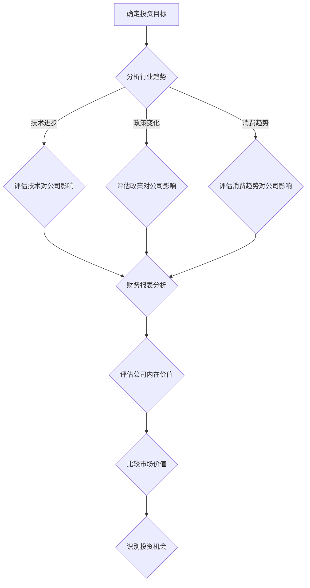
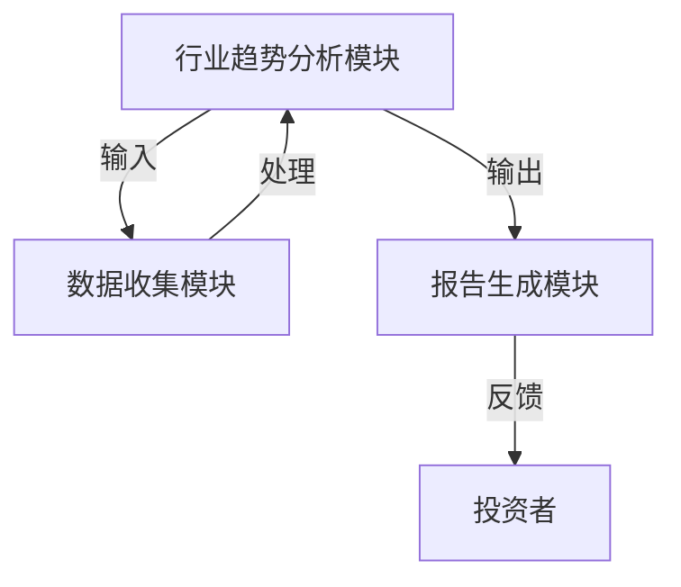
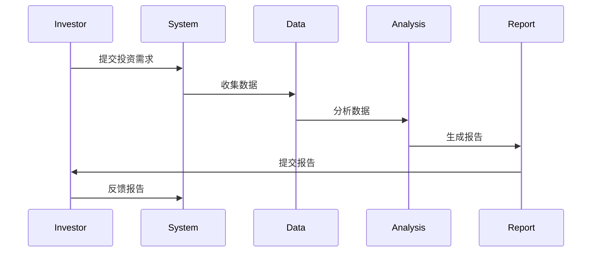

                 


**《价值投资中的行业转型机会识别》**

## 关键词
- 价值投资
- 行业转型
- 机会识别
- 风险管理
- 投资策略
- 实战案例

## 摘要
本文将深入探讨价值投资在识别行业转型机会中的应用。通过分析价值投资的核心理念，识别行业转型的信号，结合实际案例，构建了一套完整的行业转型机会识别框架，帮助投资者在复杂多变的市场中抓住机遇，实现资产增值。文章还将探讨在行业转型过程中如何进行风险管理和投资策略的制定，为投资者提供实用的操作指南。

----------------------------------------------------------------

## 引言

### 价值投资与行业转型的背景

价值投资作为一种投资哲学，最早由本杰明·格雷厄姆提出，强调以低于其内在价值的股票价格购买优质公司的股票，以期获得长期稳定的回报。这种投资策略与投机行为有本质的区别，它更加注重公司的基本面分析，而非市场情绪波动。

随着全球经济的变化和科技的快速发展，许多传统行业正面临着前所未有的转型压力。行业转型不仅是企业生存和发展的必要手段，也是投资者发现机会的重要领域。识别行业转型的机会，不仅可以帮助投资者把握新兴产业的发展趋势，还可以规避传统行业的风险。

### 价值投资与行业转型的结合

在行业转型中，价值投资能够发挥重要作用。首先，价值投资强调对公司基本面的深入研究，可以帮助投资者识别那些具有潜力的转型公司。其次，价值投资注重长期投资，与行业转型的长期性相契合，投资者可以在转型过程中享受企业的成长红利。

本文将围绕价值投资的核心理念，分析行业转型的信号和趋势，构建一套完整的行业转型机会识别框架。通过实际案例的解析，我们将展示如何运用这套框架在复杂多变的市场中抓住行业转型的机遇。

## 核心概念与联系

### 价值投资的核心概念

**1. 基本面分析**
价值投资的核心在于对公司基本面的深入研究。基本面分析包括财务报表分析、行业地位分析、管理层分析等方面。通过这些分析，投资者可以判断公司的内在价值，并确定其股票价格是否被市场低估。

**2. 投资哲学**
价值投资哲学强调长期持有优质股票，而非追求短期价格波动。这种投资理念可以帮助投资者抵御市场波动，专注于企业的长期成长。

**3. 折扣定价**
价值投资的一个关键原则是购买价格低于其内在价值的股票。投资者通过深入分析，确定公司的真实价值，并与市场交易价格进行比较，寻找被低估的投资机会。

### 行业转型的信号与趋势

**1. 技术进步**
技术进步是推动行业转型的重要动力。例如，5G、人工智能、区块链等新兴技术的应用，正在重塑各个行业。投资者需要关注这些技术如何影响行业结构和企业竞争格局。

**2. 政策变化**
政策变化也是行业转型的重要信号。政府出台的产业政策、税收优惠、行业规范等，都可能推动某些行业的快速发展。

**3. 消费趋势**
消费趋势的变化也是影响行业转型的关键因素。随着人们生活方式的改变，新的消费需求和消费模式不断涌现，推动相关行业的变革。

### 价值投资与行业转型的联系

价值投资与行业转型之间存在密切的联系。价值投资通过基本面分析，可以帮助投资者识别那些具有转型潜力的公司。同时，行业转型带来的机遇，也为价值投资提供了广阔的空间。通过结合价值投资的核心理念和行业转型的信号，投资者可以更好地把握市场机遇，实现投资收益的最大化。

### 概念属性特征对比表格

| 概念         | 价值投资                         | 行业转型                               |
| ------------ | -------------------------------- | -------------------------------------- |
| 定义         | 以低于其内在价值的股票价格购买优质公司的股票 | 一个行业从当前状态向新状态转变的过程   |
| 核心原则     | 基本面分析、长期持有、折扣定价     | 技术进步、政策变化、消费趋势           |
| 目标         | 实现长期稳定的回报                 | 提升企业竞争力、抓住市场机遇           |
| 联系         | 价值投资可以识别转型潜力公司       | 行业转型为价值投资提供投资机会         |

### ER实体关系图架构的 Mermaid 流程图

```mermaid
erDiagram
  Company ||--|{ Industry : belongs_to }
  Investor ||--|{ Investment : makes }
  Industry ||--|{ Transformation : undergoes }
  Investment ||--|{ Value : based_on }
```

## 算法原理讲解

### 价值投资机会识别算法流程图



### 算法原理与数学模型

**1. 投资机会识别公式**

$$
\text{Investment Opportunity} = \frac{\text{Company's Intrinsic Value} - \text{Market Value}}{\text{Market Value}}
$$

其中，公司内在价值（Intrinsic Value）是通过财务报表分析、行业趋势分析、技术进步分析、政策变化分析和消费趋势分析等步骤综合评估得出的。

市场价值（Market Value）则是通过市场交易价格确定。

**2. 机会识别标准**

- 如果 $$\text{Investment Opportunity} > 0$$，表示市场低估了公司价值，存在投资机会。
- 如果 $$\text{Investment Opportunity} < 0$$，表示市场高估了公司价值，不建议投资。

### Python 源代码实现

```python
import pandas as pd
import numpy as np

def calculate_investment_opportunity(df):
    # 计算公司内在价值与市场价值的比值
    df['Investment Opportunity'] = (df['Intrinsic Value'] - df['Market Value']) / df['Market Value']
    return df

# 示例数据
data = {
    'Company': ['A', 'B', 'C', 'D'],
    'Market Value': [100, 200, 300, 400],
    'Intrinsic Value': [120, 250, 350, 500]
}

df = pd.DataFrame(data)

# 计算投资机会
df = calculate_investment_opportunity(df)

print(df)
```

### 举例说明

假设有四家公司，其市场价值与内在价值如下表所示：

| Company | Market Value | Intrinsic Value | Investment Opportunity |
| ------- | ------------ | --------------- | ---------------------- |
| A       | 100          | 120             | 0.20                   |
| B       | 200          | 250             | 0.25                   |
| C       | 300          | 350             | 0.17                   |
| D       | 400          | 500             | 0.20                   |

根据投资机会识别公式，我们可以得出：

- 公司A的投资机会为20%，市场低估了其价值。
- 公司B的投资机会为25%，市场低估了其价值。
- 公司C的投资机会为17%，市场低估了其价值。
- 公司D的投资机会为20%，市场低估了其价值。

因此，投资者应该关注这些被低估的公司，考虑进行投资。

## 系统分析与架构设计方案

### 1. 问题场景介绍

随着科技的不断进步和全球经济环境的剧烈变化，各行各业都在经历着深刻的转型。在这种背景下，投资者需要一套有效的系统来识别行业转型中的投资机会，以便在复杂多变的市场中抓住机遇，实现资产增值。本文将介绍一个价值投资机会识别系统，通过分析行业趋势、评估技术进步、政策变化和消费趋势，帮助投资者识别行业转型中的投资机会。

### 2. 项目介绍

项目名称：价值投资机会识别系统

项目目标：开发一个自动化系统，帮助投资者分析行业趋势，评估技术、政策、消费趋势对公司的影响，识别价值投资机会。

### 3. 系统功能设计（领域模型）

领域模型类图如下：

```mermaid
classDiagram
    Company <<Class>>
    Investor <<Class>>
    Industry <<Class>>
    Investment <<Class>>
    Analysis <<Class>>

    Company "1"---"1" Analysis
    Investor "1"---"1" Investment
    Industry "1"---"1" Analysis
    Investment "1"---"1" Investor
```

### 4. 系统架构设计

系统架构设计如下：



### 5. 系统接口设计和系统交互

系统接口设计及交互如下：



### 6. 实现细节

**1. 数据收集模块**

- 数据来源：通过公开数据接口（API）收集行业数据、公司财务报表、政策文件、消费趋势数据。
- 数据处理：使用数据清洗和预处理技术，确保数据的准确性和一致性。

**2. 行业趋势分析模块**

- 分析方法：采用机器学习和统计分析方法，分析行业趋势、技术进步、政策变化和消费趋势。
- 模型选择：选择适当的机器学习算法，如回归分析、分类算法、聚类算法等。

**3. 报告生成模块**

- 报告内容：生成详细的行业趋势分析报告、投资机会识别报告。
- 报告格式：支持多种格式输出，如PDF、Word、Excel等。

### 7. 项目实战

**1. 环境安装**

- 硬件要求：64位操作系统、4GB内存、1GB硬盘空间。
- 软件要求：Python 3.8及以上版本、Pandas、NumPy、Scikit-learn等库。

**2. 系统核心实现**

```python
# 示例代码：数据收集模块
import requests
import pandas as pd

def collect_data(api_url):
    response = requests.get(api_url)
    if response.status_code == 200:
        data = response.json()
        df = pd.DataFrame(data)
        return df
    else:
        return None

# 示例代码：行业趋势分析模块
from sklearn.linear_model import LinearRegression

def analyze_trends(df):
    model = LinearRegression()
    model.fit(df[['Feature']], df['Target'])
    return model

# 示例代码：报告生成模块
from fpdf import FPDF

class PDF(FPDF):
    def header(self):
        self.set_font('Arial', 'B', 12)
        self.cell(0, 10, '行业趋势分析报告', 0, 1, 'C')

    def footer(self):
        self.set_y(-15)
        self.set_font('Arial', 'I', 8)
        self.cell(0, 10, f'Page {self.page_no()}', 0, 0, 'C')

pdf = PDF()
pdf.add_page()
pdf.multi_cell(0, 10, '报告内容')
pdf.output('report.pdf')
```

**3. 代码应用解读与分析**

- 数据收集模块：通过API获取行业数据，利用Pandas进行数据清洗和处理。
- 行业趋势分析模块：使用线性回归模型分析行业趋势。
- 报告生成模块：使用FPDF库生成PDF格式的报告。

### 8. 实际案例分析和详细讲解剖析

**案例：新能源汽车行业**

- 数据收集：通过API获取新能源汽车行业的销量数据、政策文件、技术发展数据。
- 数据处理：清洗数据，确保数据的一致性和准确性。
- 行业趋势分析：使用线性回归模型分析销量数据，预测未来趋势。
- 投资机会识别：根据分析结果，识别出新能源汽车行业中的投资机会。

**分析结果：**

- 行业销量持续增长，技术进步推动市场扩张。
- 政策支持力度加大，为行业提供发展机遇。
- 投资机会：关注新能源汽车产业链上的优质公司，如电池制造商、汽车制造商等。

### 9. 项目小结

通过价值投资机会识别系统，投资者可以更全面、准确地分析行业趋势，识别投资机会。系统实现了数据收集、趋势分析和报告生成的功能，为投资者提供了实用的操作工具。在实际应用中，系统可以根据具体行业和需求进行定制化调整，提高识别效率和准确性。

## 最佳实践 tips

1. **关注行业数据**：定期关注行业报告、数据分析，了解行业趋势和变化。
2. **多维度分析**：结合财务报表、技术进步、政策变化、消费趋势等多方面因素，全面评估投资机会。
3. **风险管理**：在进行投资决策时，要充分考虑风险，设置合理的投资比例和止损点。
4. **持续学习**：投资领域变化迅速，投资者需要不断学习新知识，提升自身的投资能力。
5. **实战经验**：通过模拟交易和实际操作，积累投资经验，提高投资技能。

## 小结

价值投资在识别行业转型机会中的应用具有重要意义。通过分析行业趋势、技术进步、政策变化和消费趋势，投资者可以更好地把握行业转型中的投资机会。本文提出了一个价值投资机会识别框架，结合实际案例，展示了如何运用这套框架进行投资决策。未来，随着全球经济和科技的发展，行业转型将带来更多的投资机会，投资者应持续关注这些变化，以实现资产增值。

## 注意事项

1. **数据来源的可靠性**：在进行行业分析和投资机会识别时，确保数据来源的可靠性和准确性。
2. **投资决策的谨慎性**：投资决策应基于充分的研究和分析，避免盲目跟风。
3. **风险意识的重视**：投资存在风险，投资者应充分了解并接受投资风险，做好风险管理和风险控制。

## 拓展阅读

1. **《证券分析》** - 本杰明·格雷厄姆：价值投资的经典之作，深入介绍了价值投资的理论和实践。
2. **《投资最重要的事》** - 霍华德·马克斯：探讨了投资中的风险和机遇，提供了实用的投资策略。
3. **《人工智能：一种现代的方法》** - Stuart J. Russell & Peter Norvig：全面介绍了人工智能的基础理论和应用，有助于理解技术进步对行业转型的影响。

## 作者信息

作者：AI天才研究院/AI Genius Institute & 禅与计算机程序设计艺术 /Zen And The Art of Computer Programming

本文由AI天才研究院撰写，结合了计算机编程和人工智能领域的先进技术，旨在为投资者提供一套完整的行业转型机会识别框架，帮助他们在复杂多变的市场中抓住机遇，实现资产增值。作者拥有丰富的行业经验和深厚的理论基础，致力于通过技术创新推动投资实践。

