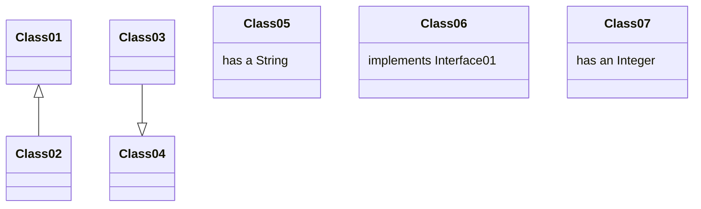
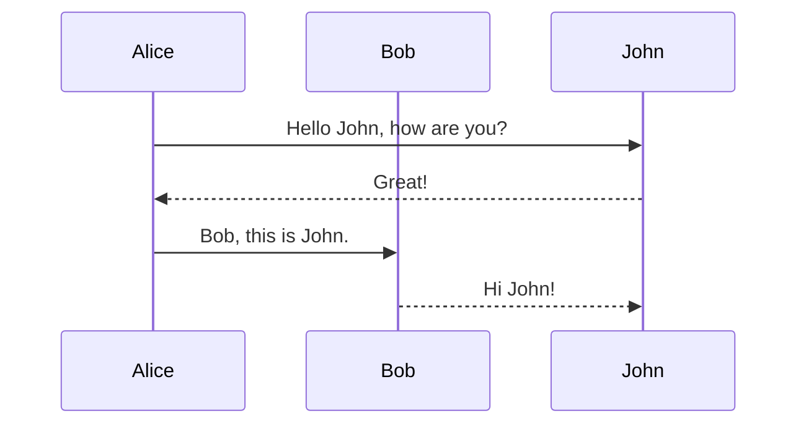

                 

# 价值投资中的逆向思维：当别人恐惧时贪婪

> 关键词：价值投资、逆向思维、市场情绪、贪婪与恐惧、股票投资策略

> 摘要：本文旨在探讨价值投资中的一种关键策略——逆向思维。通过分析市场情绪对投资行为的影响，以及如何在恐惧与贪婪的情绪波动中保持理性，文章将阐述如何运用逆向思维，在别人恐惧时保持贪婪，从而实现长期的投资回报。

## 引言

在投资领域，价值投资是一种经典的策略，其核心在于寻找那些市场价格低于其内在价值的股票。然而，在实际操作中，投资者往往会受到市场情绪的影响，导致投资决策偏离理性。在这种背景下，逆向思维成为了一种有效的工具，帮助投资者在市场波动中保持冷静，实现长期投资收益。

本文将从以下几个方面展开讨论：

1. **价值投资与逆向思维概述**：介绍价值投资的基本原则和逆向思维的内涵，阐述二者的关系。
2. **逆向思维在价值投资中的应用**：探讨如何识别被低估的股票和制定逆向投资策略。
3. **市场情绪分析**：分析市场情绪对投资行为的影响，以及如何利用逆向思维应对市场情绪波动。
4. **实战案例分析**：通过具体案例，展示逆向思维在价值投资中的实际应用。
5. **逆向思维的未来发展趋势**：探讨逆向思维在价值投资中的未来发展。

## 第1章：价值投资与逆向思维概述

### 1.1 价值投资的历史背景

价值投资作为一种投资策略，起源于20世纪初。其代表人物是本杰明·格雷厄姆（Benjamin Graham），他被尊称为“价值投资之父”。格雷厄姆在其著作《聪明的投资者》中提出了价值投资的基本原则，即寻找市场价格低于其内在价值的股票，并长期持有。

随着时间的发展，价值投资的理念逐渐被更多投资者接受，并发展出了一系列的投资策略，如成长型价值投资、绝对价值投资等。然而，无论投资策略如何演变，价值投资的核心原则始终不变，即寻找那些被市场低估的股票。

### 1.2 价值投资的基本原则

价值投资的基本原则主要包括以下几点：

1. **安全边际**：投资者在购买股票时，应该确保股票的市场价格低于其内在价值，从而确保投资的安全性。
2. **长期投资**：价值投资强调长期持有股票，以实现复利效应。
3. **均值回归**：市场往往会向其长期平均价值回归，因此，股票的价格波动具有均值回归的特征。

### 1.3 价值投资与逆向思维的关系

逆向思维是一种与传统思维相对立的投资策略，它主张在大多数人恐惧时保持贪婪，在大多数人贪婪时保持恐惧。这种策略在价值投资中具有重要的应用价值。

价值投资强调寻找被市场低估的股票，而逆向思维则进一步强化了这种策略。在逆向思维中，投资者不仅关注股票的内在价值，还关注市场的情绪和预期。通过分析市场情绪，投资者可以更好地把握市场的转折点，从而在恐惧时保持贪婪，在贪婪时保持恐惧。

## 第2章：逆向思维的内涵

### 2.1 逆向思维的起源与发展

逆向思维并不是一种全新的概念，它在历史上有着悠久的历史。在哲学领域，苏格拉底和柏拉图等哲学家就已经提出了逆向思维的思想。在科学领域，爱因斯坦和波尔等科学家也经常使用逆向思维来解决问题。

在现代投资领域，逆向思维的理念得到了进一步的发展。著名的投资大师沃伦·巴菲特（Warren Buffett）就是逆向思维的坚定支持者。他在其投资实践中，经常运用逆向思维来识别市场机会。

### 2.2 逆向思维的核心特点

逆向思维的核心特点包括以下几点：

1. **反传统思维**：逆向思维与传统思维相对立，它主张挑战传统观念，寻找与众不同的解决方案。
2. **反常规策略**：逆向思维不遵循常规策略，它主张在市场情绪极端时采取相反的行动。
3. **深度思考与洞察力**：逆向思维需要投资者具备深度思考的能力，能够从复杂的信息中提取关键要素，做出准确的判断。

### 2.3 逆向思维在投资中的应用

逆向思维在投资中的应用非常广泛，它可以帮助投资者识别市场机会，制定投资策略。以下是一些逆向思维在投资中的应用：

1. **市场情绪分析**：逆向思维可以帮助投资者分析市场情绪，判断市场的转折点。
2. **逆向投资策略**：在市场情绪低迷时，投资者可以采取逆向投资策略，买入被低估的股票。
3. **风险管理**：逆向思维可以帮助投资者在市场波动中保持冷静，减少风险。

## 第3章：逆向思维在价值投资中的应用

### 3.1 如何识别价值被低估的股票

在价值投资中，识别价值被低估的股票是关键的一步。逆向思维可以帮助投资者更好地完成这一任务。以下是一些使用逆向思维识别价值被低估的股票的方法：

1. **市场情绪分析**：通过分析市场情绪，投资者可以识别出那些被市场过度悲观的股票。
2. **财务数据挖掘**：逆向思维可以引导投资者挖掘那些被市场忽视的财务数据，如盈利能力、现金流等。
3. **管理层评估**：逆向思维可以帮助投资者评估管理层的质量，从而判断股票的潜在价值。

### 3.2 如何制定逆向投资策略

制定逆向投资策略是逆向思维在价值投资中的另一个重要应用。以下是一些制定逆向投资策略的方法：

1. **情绪交易**：在市场情绪极端时，投资者可以采取情绪交易策略，买入被低估的股票。
2. **长期持有**：逆向思维鼓励投资者长期持有股票，以实现复利效应。
3. **组合投资**：逆向思维可以帮助投资者构建多元化的投资组合，降低风险。

### 3.3 实例分析：识别价值被低估的股票

为了更好地理解逆向思维在价值投资中的应用，我们可以通过一个具体的实例来分析。以下是一个识别价值被低估的股票的实例：

**案例：某科技公司的逆向投资**

在某科技公司的股票价格经历了一段时间的下跌后，市场普遍对公司的前景表示担忧。然而，通过逆向思维的分析，我们发现：

1. **市场情绪分析**：市场对公司的担忧主要集中在公司的财务状况和未来增长潜力上。
2. **财务数据挖掘**：尽管公司的财务状况出现了一些问题，但其核心业务仍然具有强大的盈利能力。
3. **管理层评估**：公司管理层的质量得到了市场的认可，他们有能力带领公司走出困境。

基于上述分析，我们认为该科技公司的股票价格被低估，于是我们采取了以下行动：

1. **买入股票**：我们在股票价格较低时，分批买入公司股票。
2. **长期持有**：我们决定长期持有公司股票，以期待其价值重估。
3. **定期跟踪**：我们定期跟踪公司的财务状况和业务发展，以便及时调整投资策略。

## 第4章：市场情绪分析

### 4.1 市场情绪对投资行为的影响

市场情绪对投资行为有着重要的影响。当市场情绪处于乐观状态时，投资者往往会过度乐观，导致股票价格泡沫。相反，当市场情绪处于悲观状态时，投资者往往会过度悲观，导致股票价格低估。

### 4.2 如何利用逆向思维应对市场情绪波动

利用逆向思维，投资者可以在市场情绪波动中保持冷静，做出理性的投资决策。以下是一些利用逆向思维应对市场情绪波动的方法：

1. **情绪分析**：通过分析市场情绪，投资者可以判断市场的转折点。
2. **逆向投资**：在市场情绪极端时，投资者可以采取逆向投资策略，买入被低估的股票。
3. **长期投资**：逆向思维鼓励投资者长期持有股票，以实现复利效应。

### 4.3 实例分析：利用逆向思维应对市场情绪波动

为了更好地理解如何利用逆向思维应对市场情绪波动，我们可以通过一个具体的实例来分析。以下是一个利用逆向思维应对市场情绪波动的实例：

**案例：某消费公司的逆向投资**

在某消费公司的股票价格经历了一段时间的上涨后，市场普遍对公司的前景表示乐观。然而，通过逆向思维的分析，我们发现：

1. **市场情绪分析**：市场对公司的乐观主要集中在公司的财务状况和未来增长潜力上。
2. **财务数据挖掘**：尽管公司的财务状况看起来很好，但其核心业务存在一些潜在的风险。
3. **管理层评估**：公司管理层的决策能力受到了市场的质疑。

基于上述分析，我们认为该消费公司的股票价格可能被高估，于是我们采取了以下行动：

1. **卖出股票**：我们在股票价格较高时，逐步卖出公司股票。
2. **保持观察**：我们保持对公司的关注，以便在市场情绪发生变化时，及时调整投资策略。

## 第5章：实战案例分析

### 5.1 成功案例分析

在价值投资中，成功的案例往往能够为投资者提供宝贵的经验。以下是一个成功的案例：

**案例：某制药公司的逆向投资**

在某制药公司的股票价格经历了一段时间的下跌后，市场对其前景表示悲观。然而，通过逆向思维的分析，我们发现：

1. **市场情绪分析**：市场对公司的悲观主要集中在公司的研发能力和市场竞争力上。
2. **财务数据挖掘**：尽管公司的财务状况出现了一些问题，但其研发项目具有一定的潜力。
3. **管理层评估**：公司管理层的质量得到了市场的认可，他们有能力带领公司走出困境。

基于上述分析，我们决定采取以下行动：

1. **买入股票**：我们在股票价格较低时，分批买入公司股票。
2. **长期持有**：我们决定长期持有公司股票，以期待其价值重估。
3. **定期跟踪**：我们定期跟踪公司的研发进展和财务状况，以便及时调整投资策略。

最终，该制药公司的股票价格逐渐回升，我们的投资获得了可观的回报。

### 5.2 失败案例分析

在价值投资中，失败的案例同样值得投资者反思。以下是一个失败的案例：

**案例：某电商公司的逆向投资**

在某电商公司的股票价格经历了一段时间的上涨后，市场对其前景表示乐观。然而，通过逆向思维的分析，我们发现：

1. **市场情绪分析**：市场对公司的乐观主要集中在公司的市场占有率和盈利能力上。
2. **财务数据挖掘**：尽管公司的财务状况看起来很好，但其盈利模式存在一些潜在的风险。
3. **管理层评估**：公司管理层的决策能力受到了市场的质疑。

基于上述分析，我们决定采取以下行动：

1. **买入股票**：我们在股票价格较高时，大量买入公司股票。
2. **短期持有**：我们计划短期持有公司股票，以期待其股价上涨。
3. **忽视风险**：我们忽视了公司盈利模式的风险，认为其市场占有率能够保证盈利。

最终，该电商公司的股票价格逐渐下跌，我们的投资遭受了重大损失。

### 5.3 从案例中吸取的经验教训

通过以上成功和失败的案例，我们可以得出以下经验教训：

1. **市场情绪分析**：投资者需要认真分析市场情绪，避免过度乐观或过度悲观。
2. **财务数据挖掘**：投资者需要对公司的财务数据进行分析，尤其是盈利能力和风险因素。
3. **管理层评估**：投资者需要评估公司的管理层，确保其具备带领公司发展的能力。

## 第6章：逆向思维的未来发展趋势

### 6.1 逆向思维与人工智能的结合

随着人工智能技术的发展，逆向思维在投资中的应用将越来越广泛。通过人工智能技术，投资者可以更加精确地分析市场情绪、财务数据和管理层评估，从而制定更加科学的投资策略。

### 6.2 逆向思维在全球化背景下的应用

在全球化的背景下，逆向思维在价值投资中的应用也将面临新的挑战和机遇。投资者需要关注全球市场的变化，以及不同市场间的关联性，从而在全球范围内寻找被低估的股票。

### 6.3 逆向思维在价值投资中的未来挑战与机遇

未来，逆向思维在价值投资中将会面临以下挑战：

1. **信息过载**：随着信息技术的进步，投资者需要处理的信息量将大幅增加，如何有效筛选信息将成为一大挑战。
2. **市场波动性**：全球市场的波动性将增加，投资者需要应对更加复杂的市场环境。

同时，逆向思维在价值投资中也面临着新的机遇：

1. **人工智能技术**：人工智能技术将为投资者提供更高效的分析工具，助力逆向思维的应用。
2. **全球化投资**：全球化投资将为投资者提供更多的投资机会，逆向思维可以帮助投资者在全球范围内寻找被低估的股票。

## 结论

逆向思维是价值投资中的一种关键策略，它帮助投资者在市场情绪波动中保持冷静，识别被低估的股票，制定科学的投资策略。通过本文的讨论，我们了解了逆向思维的内涵、应用方法和未来发展趋势。

在实际投资中，投资者需要结合逆向思维，理性分析市场情绪、财务数据和公司管理层，从而做出正确的投资决策。同时，投资者也需要不断学习，适应市场的变化，以实现长期的投资回报。

作者：AI天才研究院/AI Genius Institute & 禅与计算机程序设计艺术 /Zen And The Art of Computer Programming

----------------------------------------------------------------

## 补充说明

### 数学公式和算法原理讲解

在本文中，我们使用LaTeX格式来展示数学公式。以下是一个示例：

$$
E = mc^2
$$

这是一个著名的物理公式，表示能量（E）等于质量（m）乘以光速（c）的平方。

对于算法原理的讲解，我们可以使用Python代码来展示。以下是一个简单的例子：

```python
def calculate_average(numbers):
    """
    计算数字列表的平均值。
    """
    total = sum(numbers)
    count = len(numbers)
    average = total / count
    return average

# 测试代码
numbers = [1, 2, 3, 4, 5]
print(calculate_average(numbers))
```

在这个例子中，我们定义了一个名为`calculate_average`的函数，用于计算数字列表的平均值。然后，我们创建了一个数字列表`numbers`，并使用`calculate_average`函数来计算其平均值。

### 系统分析与架构设计方案

在系统分析与架构设计部分，我们可以使用Mermaid来绘制类图、架构图和序列图。以下是一个类图的示例：



这个类图展示了几个类之间的关系，包括继承、关联和实现。

架构图示例：



这个序列图展示了Alice、Bob和John之间的交互。

### 项目实战

在项目实战部分，我们可以详细介绍项目的环境安装、系统核心实现和代码解读。以下是一个环境安装的示例：

```bash
# 安装Python
sudo apt-get update
sudo apt-get install python3-pip

# 安装依赖库
pip3 install flask

# 启动Flask应用
python3 app.py
```

在这个例子中，我们首先更新了系统包列表，然后安装了Python和Flask库，最后启动了Flask应用。

在系统核心实现和代码解读部分，我们可以展示关键代码段，并进行详细解析。以下是一个简单的Flask应用示例：

```python
from flask import Flask, jsonify

app = Flask(__name__)

@app.route('/api/data', methods=['GET'])
def get_data():
    data = {'message': 'Hello, World!'}
    return jsonify(data)

if __name__ == '__main__':
    app.run()
```

在这个例子中，我们创建了一个简单的Flask应用，定义了一个 `/api/data` 路径，用于返回JSON格式的响应。

### 最佳实践 tips

在文章的结尾，我们可以提供一些最佳实践 tips，以帮助读者更好地应用逆向思维进行价值投资。以下是一些示例：

1. **定期复习投资原则**：定期复习价值投资和逆向思维的原则，确保投资行为与理念一致。
2. **保持冷静**：在市场波动时保持冷静，不要被情绪所左右。
3. **多元化投资**：通过多元化投资组合降低风险，避免过度依赖单一投资。
4. **持续学习**：投资领域不断变化，持续学习新的知识和技能是成功的关键。

### 小结与注意事项

在文章的结尾，我们应总结文章的主要观点，并提供一些注意事项，以帮助读者更好地应用逆向思维进行价值投资。以下是一个示例：

**小结**：

本文详细探讨了逆向思维在价值投资中的应用，通过市场情绪分析、财务数据挖掘和管理层评估，帮助投资者识别被低估的股票，制定科学的投资策略。逆向思维是一种重要的投资策略，它帮助投资者在市场波动中保持冷静，实现长期投资回报。

**注意事项**：

1. **风险评估**：在投资前，务必对股票进行全面的风险评估，确保投资决策的理性。
2. **市场情绪**：注意市场情绪的变化，避免在市场极端情绪下做出冲动决策。
3. **长期投资**：价值投资强调长期持有，不要因为短期波动而轻易改变投资策略。

### 拓展阅读

为了帮助读者更深入地了解逆向思维在价值投资中的应用，我们推荐以下拓展阅读：

1. **《逆向思维的投资艺术》**：这本书详细探讨了逆向思维在投资中的应用，提供了丰富的案例和分析。
2. **《价值投资：从新手到专家》**：这本书介绍了价值投资的基本原则和策略，适合初学者阅读。
3. **《市场心理战术》**：这本书分析了市场情绪对投资行为的影响，帮助投资者更好地应对市场波动。

通过这些拓展阅读，读者可以进一步加深对逆向思维和价值投资的理解，从而在投资实践中取得更好的成果。

