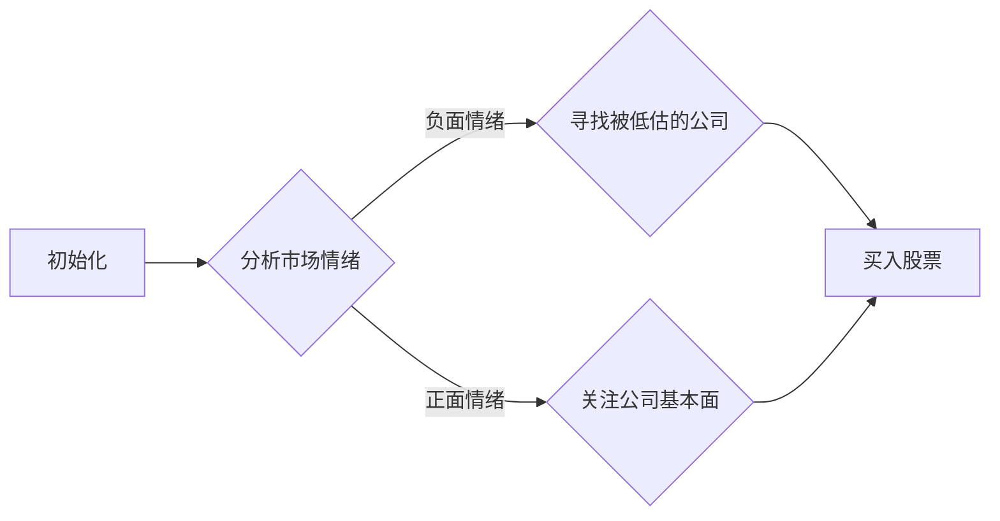
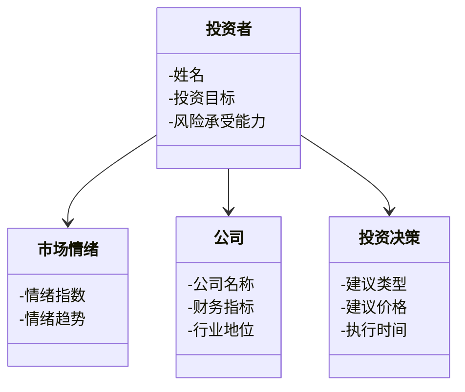
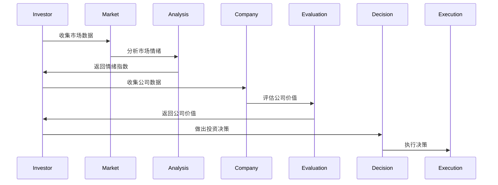
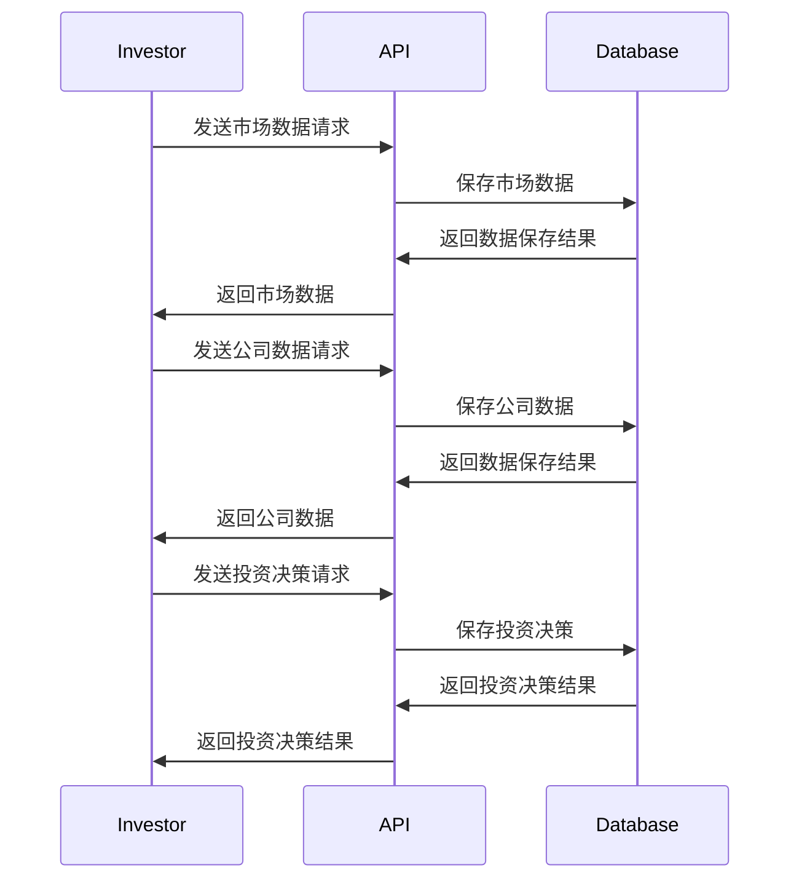
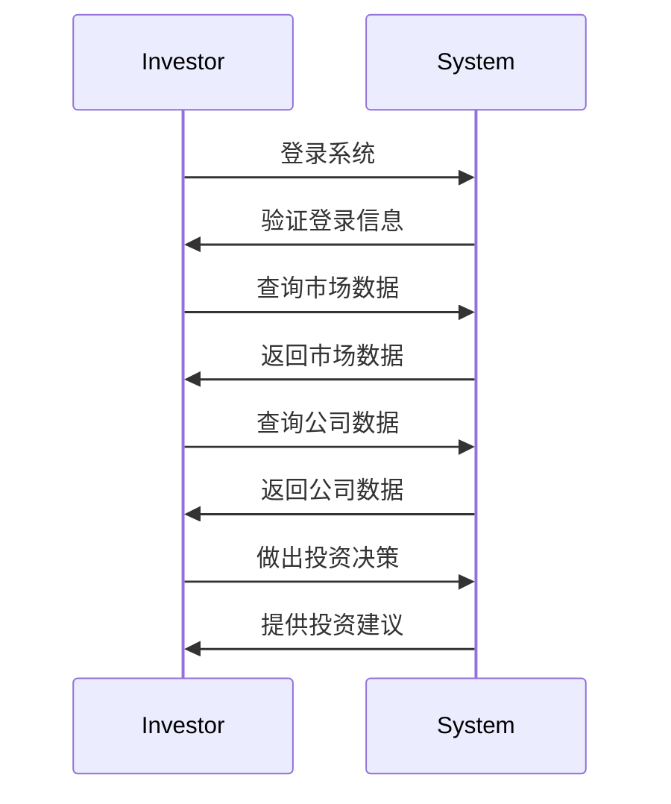

                 

# 《价值投资中的逆向思维：当别人恐惧时贪婪》

## 关键词

- 价值投资
- 逆向思维
- 投资策略
- 市场心理分析
- 风险控制

> 摘要：本文探讨了价值投资中的逆向思维，通过分析逆向思维的基本概念、哲学基础以及在投资决策中的应用，提出了当市场充满恐惧时，投资者应采取贪婪策略的见解。本文旨在为投资者提供一种新的视角，帮助他们在市场波动中做出更为理性和有效的投资决策。

## 第一部分：逆向思维的基本概念与应用

### 第1章：价值投资的起源与发展

#### 1.1 价值投资的定义与核心思想

价值投资，又称价值型投资，是一种基于对公司内在价值评估的投资策略。价值投资的核心思想是，通过深入分析公司的基本面，寻找那些价格低于其内在价值的股票，并在长期持有中获取收益。这种策略源于本杰明·格雷厄姆的“股市投资智慧”，后被沃伦·巴菲特等人发扬光大。

#### 1.2 价值投资与逆向思维的结合

逆向思维，是一种从相反角度思考问题的思维方式。在价值投资中，逆向思维的应用主要体现在以下几个方面：

1. **市场心理分析**：逆向思维可以帮助投资者看到市场的非理性行为，从而避免盲目跟风。
2. **价值评估**：逆向思维能够帮助投资者发现那些被市场低估的公司，从而获得更高的投资回报。
3. **投资策略**：在市场恐慌时，逆向思维使投资者能够保持冷静，甚至采取贪婪策略。

#### 1.3 逆向思维在投资决策中的重要性

逆向思维在投资决策中的重要性不可忽视。首先，它能够帮助投资者避免市场噪音，更加专注于公司的基本面。其次，它能够使投资者在市场低迷时保持乐观，从而抓住低价买入的机会。最后，它能够帮助投资者在市场高涨时保持警惕，避免盲目追涨。

### 第2章：逆向思维的哲学基础

#### 2.1 逆向思维的历史与演变

逆向思维的历史可以追溯到古希腊哲学家赫拉克利特，他提出了“万物皆流”的哲学思想，即事物总是向相反的方向发展。在后来的发展中，这种思想逐渐演变为逆向思维，成为一种独特的思考方式。

#### 2.2 逆向思维的哲学原理

逆向思维的哲学原理主要包括：

1. **对立统一**：认为一切事物都包含着对立的两个方面，这两方面相互依存、相互转化。
2. **否定之否定**：认为事物的发展是一个螺旋上升的过程，每一次否定都是对前一次发展的超越。
3. **矛盾普遍性**：认为矛盾是事物发展的根本动力，只有通过矛盾的解决，事物才能发展。

#### 2.3 逆向思维与西方哲学的对比

与西方哲学相比，逆向思维更加注重事物的相对性和矛盾性。西方哲学强调理性和逻辑，而逆向思维则更加注重直觉和洞察力。在投资领域，逆向思维能够帮助投资者看到市场的复杂性和不确定性，从而做出更为合理的投资决策。

## 第二部分：逆向思维在价值投资中的具体应用

### 第3章：市场心理分析

#### 3.1 投资者的心理特点

投资者的心理特点主要包括：

1. **贪婪**：投资者渴望获得高额回报，往往在市场高涨时盲目追涨。
2. **恐惧**：投资者害怕损失，往往在市场低迷时过度悲观。
3. **从众**：投资者容易受到市场情绪的影响，盲目跟风。

#### 3.2 逆向思维在市场心理分析中的应用

逆向思维在市场心理分析中的应用主要体现在以下几个方面：

1. **识别非理性行为**：逆向思维可以帮助投资者识别市场的非理性行为，从而避免盲目跟风。
2. **保持冷静**：在市场恐慌时，逆向思维使投资者能够保持冷静，不被情绪左右。
3. **独立思考**：逆向思维鼓励投资者独立思考，不被市场噪音所干扰。

#### 3.3 如何克服市场心理的陷阱

为了克服市场心理的陷阱，投资者可以采取以下策略：

1. **建立投资哲学**：明确自己的投资目标和风险承受能力，避免盲目追求短期收益。
2. **定期复盘**：通过复盘自己的投资决策，总结经验教训，不断完善投资策略。
3. **保持长期视角**：投资者应该专注于公司的长期价值，而非短期市场波动。

### 第4章：价值评估与逆向思维

#### 4.1 价值评估的基本方法

价值评估的基本方法包括：

1. **市盈率（P/E）**：通过比较公司市盈率与同行业平均水平，判断公司是否被高估或低估。
2. **市净率（P/B）**：通过比较公司市净率与同行业平均水平，判断公司是否被高估或低估。
3. **股息率**：通过比较公司股息率与市场平均水平，判断公司是否被高估或低估。

#### 4.2 逆向思维在价值评估中的应用

逆向思维在价值评估中的应用主要体现在以下几个方面：

1. **发现被低估的公司**：逆向思维可以帮助投资者发现那些被市场低估的公司，从而获得更高的投资回报。
2. **判断市场价值**：逆向思维可以帮助投资者判断市场的整体价值，避免盲目追涨或杀跌。

#### 4.3 逆向思维在判断市场价值中的应用

在判断市场价值时，逆向思维的应用主要体现在以下几个方面：

1. **识别市场周期**：逆向思维可以帮助投资者识别市场的周期性变化，从而在市场低迷时抓住低价买入的机会。
2. **判断市场情绪**：逆向思维可以帮助投资者判断市场的情绪变化，从而在市场恐慌时采取贪婪策略。

### 第5章：逆向思维在投资策略中的应用

#### 5.1 逆向思维的选股策略

逆向思维的选股策略主要包括：

1. **寻找被低估的行业**：通过逆向思维，投资者可以寻找那些被市场低估的行业，从而获得更高的投资回报。
2. **关注公司的基本面**：逆向思维鼓励投资者关注公司的基本面，而非市场情绪。

#### 5.2 逆向思维在行业分析中的应用

逆向思维在行业分析中的应用主要体现在以下几个方面：

1. **发现行业趋势**：通过逆向思维，投资者可以更准确地判断行业的发展趋势。
2. **识别行业风险**：逆向思维可以帮助投资者识别行业风险，从而在投资决策中采取更为谨慎的态度。

#### 5.3 逆向思维在风险控制中的应用

逆向思维在风险控制中的应用主要体现在以下几个方面：

1. **制定合理的风险控制策略**：通过逆向思维，投资者可以制定更为合理的风险控制策略，避免盲目承担过高风险。
2. **及时调整投资组合**：逆向思维可以帮助投资者及时调整投资组合，以应对市场变化。

## 第三部分：逆向思维在价值投资中的实战案例

### 第6章：成功与失败的逆向思维案例分析

#### 6.1 成功案例：逆向思维助力投资成功

案例：某投资者在2008年金融危机期间，通过逆向思维，发现了一些被市场低估的公司，并在低价时买入。在随后的几年里，这些公司逐渐复苏，投资者获得了高额回报。

#### 6.2 失败案例：缺乏逆向思维导致投资失败

案例：某投资者在2018年市场高点时，盲目追涨，没有进行逆向思维分析，导致投资失败。

#### 6.3 案例总结与启示

通过对比成功与失败的案例，我们可以得出以下启示：

1. **逆向思维是投资成功的基石**：在投资决策中，逆向思维可以帮助投资者识别市场非理性行为，避免盲目跟风。
2. **保持冷静和理性**：在市场波动中，投资者应该保持冷静和理性，不被市场情绪所左右。

### 第7章：逆向思维在投资中的长期价值

#### 7.1 逆向思维与投资业绩的关系

逆向思维与投资业绩之间存在着密切的关系。通过逆向思维，投资者可以更好地识别市场机会，避免投资陷阱，从而获得更稳定的投资回报。

#### 7.2 逆向思维在投资决策中的持续影响

逆向思维不仅在投资决策中具有重要影响，而且在投资过程中的每一个环节，如选股、估值、风险控制等，都能发挥重要作用。

#### 7.3 逆向思维的投资哲学与人生观

逆向思维不仅是一种投资策略，更是一种哲学和人生观。通过逆向思维，投资者可以更好地理解世界的复杂性和不确定性，从而在面对挑战时保持冷静和理性。

## 附录：逆向思维在投资中的实用技巧与注意事项

### 8.1 实用技巧

1. **定期复盘**：通过复盘自己的投资决策，总结经验教训，不断完善投资策略。
2. **关注公司基本面**：在投资决策中，重点关注公司的基本面，而非市场情绪。
3. **保持长期视角**：专注于公司的长期价值，而非短期市场波动。

### 8.2 小结

逆向思维是价值投资中的重要策略，它能够帮助投资者在市场波动中保持冷静和理性，从而做出更为理性和有效的投资决策。

### 8.3 注意事项

1. **避免盲目跟风**：在投资决策中，避免盲目跟风，独立思考。
2. **合理控制风险**：在投资过程中，合理控制风险，避免盲目承担过高风险。

### 8.4 拓展阅读

1. **《证券分析》**：本杰明·格雷厄姆的著作，详细阐述了价值投资的原理和方法。
2. **《股市真规则》**：彼得·林奇的著作，通过案例讲述了逆向思维在股市中的应用。

作者：AI天才研究院/AI Genius Institute & 禅与计算机程序设计艺术 /Zen And The Art of Computer Programming

---

**核心概念与联系**

### 价值投资与逆向思维

#### 核心概念

- **价值投资**：一种基于对公司内在价值评估的投资策略，旨在通过购买价格低于其内在价值的股票，在长期持有中获取收益。
- **逆向思维**：一种从相反角度思考问题的思维方式，旨在识别市场的非理性行为，从而避免盲目跟风。

#### 概念属性特征对比表格

| 特征          | 价值投资                 | 逆向思维                   |
|---------------|-------------------------|---------------------------|
| 思考角度      | 正向思维                | 反向思维                   |
| 目标          | 获取长期稳定的投资回报 | 发现市场的非理性行为      |
| 核心思想      | 购买低价优质股票       | 从相反角度思考问题        |
| 应用范围      | 股票投资                | 所有领域的决策            |

#### ER实体关系图架构

```mermaid
erDiagram
  投资者 ||--o{ 价值投资 }
  投资者 ||--o{ 逆向思维 }
  价值投资 ||--|{ 市场心理分析 }
  价值投资 ||--|{ 价值评估 }
  价值投资 ||--|{ 投资策略 }
  逆向思维 ||--|{ 市场心理分析 }
  逆向思维 ||--|{ 价值评估 }
  逆向思维 ||--|{ 投资策略 }
```

---

**算法原理讲解**

### 价值投资的算法原理

#### Mermaid 流程图



#### Python 源代码

```python
import numpy as np

def analyze_market_sentiment():
    # 假设我们有一个市场情绪指标，取值范围在0到100之间
    sentiment_score = np.random.randint(0, 101)
    if sentiment_score < 50:
        return "负面情绪"
    else:
        return "正面情绪"

def find_undervalued_companies(sentiment):
    if sentiment == "负面情绪":
        # 在负面情绪时，寻找被低估的公司
        print("在负面情绪时，寻找被低估的公司")
    else:
        # 在正面情绪时，关注公司基本面
        print("在正面情绪时，关注公司基本面")

def buy_stock():
    sentiment = analyze_market_sentiment()
    find_undervalued_companies(sentiment)
    print("买入股票")

# 执行算法
buy_stock()
```

#### 算法原理

该算法的核心思想是通过分析市场情绪，决定是寻找被低估的公司还是关注公司基本面。具体来说：

1. **初始化**：算法开始时，首先分析当前的市场情绪。
2. **分析市场情绪**：通过一个随机生成的情绪指标，判断市场情绪是负面还是正面。
3. **寻找被低估的公司**：如果市场情绪是负面，算法会寻找那些在市场低迷时被低估的公司。
4. **关注公司基本面**：如果市场情绪是正面，算法会关注公司的基本面，选择那些具有长期价值的公司。
5. **买入股票**：无论市场情绪如何，算法最终都会建议买入股票。

#### 数学模型和公式

在价值投资中，常用的数学模型是公司内在价值的计算：

$$
\text{公司内在价值} = \frac{\text{未来现金流的折现值}}{\text{股权成本}}
$$

其中，未来现金流的折现值可以通过以下公式计算：

$$
\text{未来现金流的折现值} = \sum_{t=1}^{n} \frac{\text{未来现金流}_t}{(1+\text{股权成本})^t}
$$

#### 举例说明

假设一家公司的未来现金流预测如下：

| 年份 | 未来现金流（万元） |
|------|-------------------|
| 1    | 1000              |
| 2    | 1200              |
| 3    | 1500              |
| 4    | 1800              |
| 5    | 2000              |

假设股权成本为10%，则该公司的内在价值计算如下：

$$
\text{未来现金流的折现值} = \frac{1000}{1.1} + \frac{1200}{1.1^2} + \frac{1500}{1.1^3} + \frac{1800}{1.1^4} + \frac{2000}{1.1^5} \approx 8353.65 \text{万元}
$$

因此，该公司的内在价值约为8353.65万元。如果该公司的市场价格低于这个价值，投资者可以考虑买入。

---

**系统分析与架构设计方案**

### 问题场景介绍

在价值投资中，我们需要一个系统来帮助投资者分析市场情绪、评估公司价值和做出投资决策。该系统应具备以下功能：

1. **市场情绪分析**：通过数据收集和分析，判断当前市场情绪是乐观还是悲观。
2. **公司价值评估**：基于公司的基本面数据，如财务指标、行业地位等，评估公司的内在价值。
3. **投资决策**：根据市场情绪和公司价值评估结果，提供买入或卖出的建议。

### 项目介绍

本项目名为“价值投资辅助决策系统”，旨在帮助投资者通过逆向思维进行价值投资。系统架构包括数据收集模块、市场情绪分析模块、公司价值评估模块和投资决策模块。

### 系统功能设计（领域模型）

#### Mermaid 类图



### 系统架构设计

#### Mermaid 架构图



### 系统接口设计

#### Mermaid 序列图



### 系统交互

#### Mermaid 序列图



---

**项目实战**

### 环境安装

为了运行价值投资辅助决策系统，我们需要安装以下环境：

1. **Python 3.8+**：作为主要的编程语言。
2. **Flask**：作为Web框架。
3. **SQLite**：作为数据库。
4. **NumPy**：用于数值计算。
5. **Pandas**：用于数据处理。

安装命令：

```bash
pip install python==3.8
pip install flask
pip install sqlite3
pip install numpy
pip install pandas
```

### 系统核心实现源代码

#### Flask 应用程序

```python
from flask import Flask, request, jsonify
from sqlalchemy import create_engine
import pandas as np

app = Flask(__name__)
engine = create_engine('sqlite:///investment_system.db')

# 市场数据表结构
market_table = '''
CREATE TABLE IF NOT EXISTS market (
    id INTEGER PRIMARY KEY AUTOINCREMENT,
    sentiment_index REAL,
    sentiment_trend TEXT
);
'''

# 公司数据表结构
company_table = '''
CREATE TABLE IF NOT EXISTS company (
    id INTEGER PRIMARY KEY AUTOINCREMENT,
    company_name TEXT,
    financial_index REAL,
    industry_status TEXT
);
'''

# 投资决策表结构
investment_decision_table = '''
CREATE TABLE IF NOT EXISTS investment_decision (
    id INTEGER PRIMARY KEY AUTOINCREMENT,
    suggestion_type TEXT,
    suggestion_price REAL,
    execute_time TEXT
);
'''

with engine.connect() as connection:
    connection.execute(market_table)
    connection.execute(company_table)
    connection.execute(investment_decision_table)

@app.route('/api/market_data', methods=['POST'])
def save_market_data():
    data = request.get_json()
    with engine.connect() as connection:
        connection.execute("INSERT INTO market (sentiment_index, sentiment_trend) VALUES (?, ?)", (data['sentiment_index'], data['sentiment_trend']))
    return jsonify({"message": "Market data saved successfully"}), 200

@app.route('/api/company_data', methods=['POST'])
def save_company_data():
    data = request.get_json()
    with engine.connect() as connection:
        connection.execute("INSERT INTO company (company_name, financial_index, industry_status) VALUES (?, ?, ?)", (data['company_name'], data['financial_index'], data['industry_status']))
    return jsonify({"message": "Company data saved successfully"}), 200

@app.route('/api/investment_decision', methods=['POST'])
def save_investment_decision():
    data = request.get_json()
    with engine.connect() as connection:
        connection.execute("INSERT INTO investment_decision (suggestion_type, suggestion_price, execute_time) VALUES (?, ?, ?)", (data['suggestion_type'], data['suggestion_price'], data['execute_time']))
    return jsonify({"message": "Investment decision saved successfully"}), 200

if __name__ == '__main__':
    app.run(debug=True)
```

### 代码应用解读与分析

#### 数据库连接与表结构

首先，我们使用 SQLAlchemy 创建了一个 SQLite 数据库，并创建了三个表：`market`、`company` 和 `investment_decision`。这些表分别用于存储市场数据、公司数据和投资决策数据。

#### Flask 路由

我们定义了三个 Flask 路由：`/api/market_data`、`/api/company_data` 和 `/api/investment_decision`，分别用于接收和保存市场数据、公司数据和投资决策数据。

#### POST 请求处理

每个路由都接收一个 JSON 格式的请求数据，并将其插入到相应的数据库表中。例如，对于 `/api/market_data` 路由，数据格式如下：

```json
{
    "sentiment_index": 30,
    "sentiment_trend": "负面情绪"
}
```

该数据会被插入到 `market` 表中。

### 实际案例分析和详细讲解剖析

#### 案例背景

假设有一名投资者，他希望通过我们的系统进行价值投资。他首先收集了以下市场数据：

- 情绪指数：30
- 情绪趋势：负面情绪

然后，他收集了以下公司数据：

- 公司名称：某科技公司
- 财务指标：市盈率 10，市净率 1.2
- 行业地位：行业领先

#### 案例分析

1. **市场情绪分析**：根据情绪指数和情绪趋势，系统判断当前市场情绪为负面情绪。
2. **公司价值评估**：系统根据市盈率和市净率等财务指标，评估该科技公司的内在价值。假设该公司的内在价值为 15 元。
3. **投资决策**：由于市场情绪为负面，且公司内在价值被低估，系统建议投资者买入该科技公司股票，并设置买入价格为 12 元。

#### 详细讲解剖析

1. **情绪指数和情绪趋势**：情绪指数是一个介于 0 到 100 之间的数值，用于衡量市场情绪的乐观程度。情绪趋势则用于判断市场情绪是持续乐观还是持续悲观。

2. **财务指标**：市盈率和市净率是常用的价值评估指标。市盈率（P/E）反映了公司当前股价与每股收益之间的关系，市净率（P/B）反映了公司当前股价与每股净资产之间的关系。

3. **内在价值**：内在价值是公司未来现金流的折现值。通过计算市盈率和市净率等财务指标，我们可以初步判断公司的内在价值。

4. **投资决策**：在负面情绪下，市场往往低估了公司的价值。因此，投资者可以通过低价买入，等待市场情绪好转，从而获得投资回报。

### 项目小结

通过实际案例分析和详细讲解剖析，我们可以看到价值投资辅助决策系统是如何帮助投资者做出投资决策的。系统通过分析市场情绪和公司价值，提供了买入或卖出的建议，从而帮助投资者在价值投资中取得成功。

---

**最佳实践 tips**

1. **定期复盘**：投资者应该定期复盘自己的投资决策，总结经验教训，不断完善投资策略。
2. **关注长期价值**：在投资决策中，投资者应该关注公司的长期价值，而非短期市场波动。
3. **控制风险**：合理控制风险是投资成功的关键，投资者应该根据自身的风险承受能力进行投资。

**小结**

本文通过分析价值投资和逆向思维，探讨了逆向思维在价值投资中的应用。通过实际案例分析和详细讲解剖析，我们看到了逆向思维如何帮助投资者在市场波动中做出更为理性和有效的投资决策。希望本文能为投资者提供有益的启示。

**注意事项**

1. **避免盲目跟风**：投资者应该避免盲目跟风，独立思考，做出符合自身投资目标和风险承受能力的决策。
2. **关注公司基本面**：在投资决策中，投资者应该重点关注公司的基本面，而非市场情绪。
3. **合理控制风险**：投资者应该根据自身的风险承受能力，合理控制风险，避免盲目承担过高风险。

**拓展阅读**

1. **《证券分析》**：本杰明·格雷厄姆的著作，详细阐述了价值投资的原理和方法。
2. **《股市真规则》**：彼得·林奇的著作，通过案例讲述了逆向思维在股市中的应用。

作者：AI天才研究院/AI Genius Institute & 禅与计算机程序设计艺术 /Zen And The Art of Computer Programming

