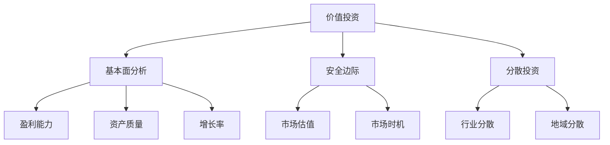
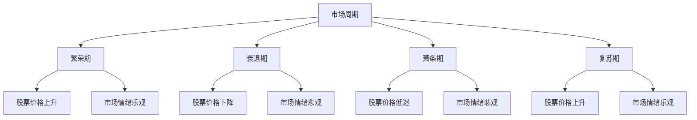
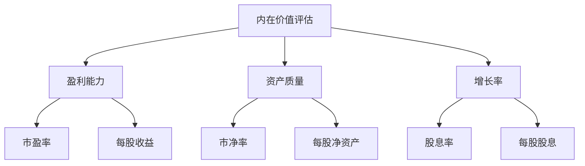
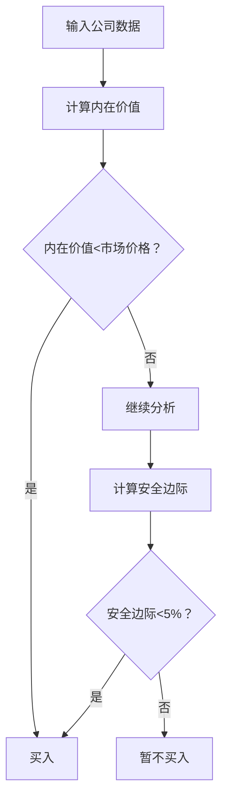
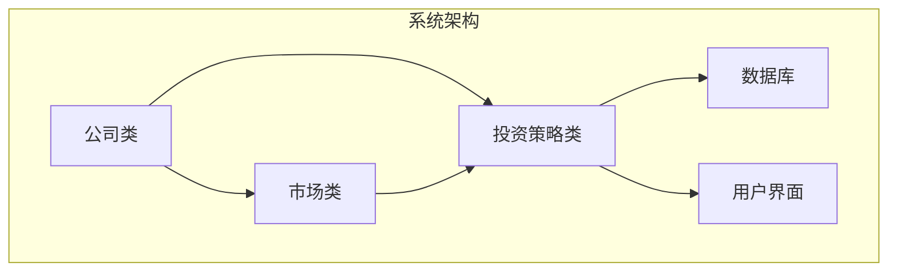
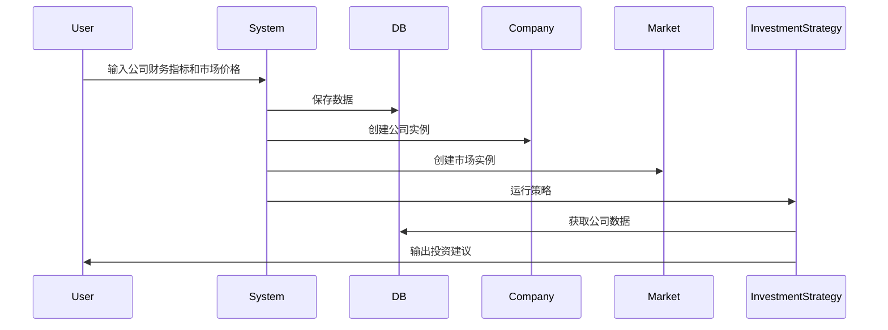

                 

## 《价值投资在不同市场周期中的应用策略》

### 关键词

- 价值投资
- 市场周期
- 投资策略
- 牛市
- 熊市
- 调整市

### 摘要

本文旨在探讨价值投资在不同市场周期中的应用策略。通过对价值投资的基本概念和市场周期的理解，文章将逐步分析价值投资在牛市、熊市和调整市中的具体应用策略，并结合实际案例，提供实用的实践技巧和未来展望。希望通过本文，读者能够对价值投资有更深刻的认识，并在不同市场环境中运用价值投资策略实现长期稳定的投资回报。

## 目录

1. **价值投资概述**
   1.1 价值投资的概念与起源
   1.2 价值投资与成长投资的区别
   1.3 价值投资的核心原则

2. **市场周期的理解**
   2.1 市场周期的定义
   2.2 市场周期的分类
   2.3 市场周期对投资策略的影响

3. **价值投资的基本策略**
   3.1 企业的内在价值评估
   3.2 价值投资的财务指标分析
   3.3 价值投资的市场时机把握

4. **市场周期中的价值投资策略**
   4.1 牛市中的价值投资策略
   4.2 熊市中的价值投资策略
   4.3 调整市中的价值投资策略

5. **特殊市场周期下的价值投资**
   5.1 经济衰退期的价值投资策略
   5.2 经济复苏期的价值投资策略
   5.3 通货膨胀期的价值投资策略

6. **价值投资的实际应用**
   6.1 案例研究
   6.2 实践技巧

7. **价值投资的未来展望**
   7.1 发展趋势
   7.2 未来策略

## 价值投资概述

### 1.1 价值投资的概念与起源

价值投资（Value Investing）起源于20世纪30年代的美国，由本杰明·格雷厄姆（Benjamin Graham）创立。格雷厄姆被誉为“现代投资组合理论的之父”，他提出了以公司内在价值为基础的投资理念，主张通过分析公司的基本面来识别被市场低估的投资机会。

价值投资的核心概念是“安全边际”（margin of safety），即投资者应该购买价格低于其内在价值的股票。内在价值是指公司未来现金流的现值，通过估算公司的盈利能力、资产价值和增长率等指标来计算。当市场价格低于内在价值时，投资者可以购买这些股票，等待市场认识到公司的真实价值，从而实现盈利。

### 1.2 价值投资与成长投资的区别

价值投资与成长投资（Growth Investing）是两种不同的投资策略。成长投资侧重于投资那些具有高增长潜力的公司，通常这些公司的市场估值较高。而价值投资则更注重公司的内在价值和安全边际。

#### 表1：价值投资与成长投资对比

| 对比项 | 价值投资 | 成长投资 |
| :---: | :---: | :---: |
| **投资目标** | 获得资本增值和股息收入 | 获得资本增值 |
| **选股标准** | 低估的股票，具有安全边际 | 高成长性的公司，市场估值较高 |
| **投资周期** | 长期投资 | 中短期投资 |
| **风险管理** | 通过安全边际降低风险 | 高风险高回报 |
| **市场时机** | 不受市场波动影响 | 需要关注市场时机 |

### 1.3 价值投资的核心原则

价值投资的核心原则包括以下几个方面：

1. **基本面分析**：投资者需要深入研究公司的财务报表，分析公司的盈利能力、资产质量和财务状况。
2. **长期投资**：价值投资注重长期投资，追求资本增值和股息收入。
3. **安全边际**：投资者应该确保购买价格低于公司的内在价值，以应对市场不确定性。
4. **分散投资**：通过投资多个不同行业的公司，降低投资组合的风险。

## 市场周期的理解

### 2.1 市场周期的定义

市场周期是指股市或经济从一个高峰到另一个高峰的过程，包括繁荣期、衰退期、萧条期和复苏期。市场周期通常由经济周期和金融市场波动共同作用形成。

### 2.2 市场周期的分类

市场周期可以分为以下三个阶段：

1. **牛市**：股票价格持续上涨，市场情绪乐观，投资者普遍看好市场前景。
2. **熊市**：股票价格持续下跌，市场情绪悲观，投资者普遍看坏市场前景。
3. **调整市**：股票价格波动较大，市场情绪不稳定，投资者对市场前景看法分歧。

### 2.3 市场周期对投资策略的影响

市场周期对投资策略有重要影响。在不同的市场周期中，投资者应采取不同的投资策略：

1. **牛市**：投资者可以适当增加投资比例，关注高成长性的股票。
2. **熊市**：投资者应减少投资比例，关注具有安全边际的价值投资股票。
3. **调整市**：投资者应保持谨慎，平衡投资组合，关注市场机会。

## 价值投资的基本策略

### 3.1 企业的内在价值评估

企业的内在价值是指企业未来现金流的现值。评估企业的内在价值需要考虑以下因素：

1. **盈利能力**：企业的盈利能力是评估其内在价值的重要指标。投资者可以通过分析企业的营收增长率、利润率和毛利率等指标来评估其盈利能力。
2. **资产质量**：企业的资产质量包括企业的资产负债表和现金流。投资者需要关注企业的债务水平、现金流状况和资产配置。
3. **增长率**：企业的增长率反映了企业的未来发展潜力。投资者可以通过分析企业的历史增长率和行业趋势来评估其增长率。

### 3.2 价值投资的财务指标分析

价值投资需要通过财务指标来评估企业的内在价值。常用的财务指标包括：

1. **市盈率（PE）**：市盈率是股票价格与每股收益的比率。较低的市盈率通常意味着股票被低估。
2. **市净率（PB）**：市净率是股票价格与每股净资产的比率。较低的市净率通常意味着股票被低估。
3. **股息率**：股息率是公司派发的股息与股票价格的比率。较高的股息率通常意味着公司具有较高的投资价值。

### 3.3 价值投资的市场时机把握

价值投资的市场时机把握至关重要。以下是一些市场时机的判断方法：

1. **市场估值**：通过市场估值指标（如市盈率、市净率等）来判断市场是否被高估或低估。
2. **市场情绪**：通过分析市场情绪指标（如投资者情绪指数、恐慌指数等）来判断市场是否过度乐观或悲观。
3. **政策因素**：关注政策变化对市场的影响，如货币政策、财政政策等。

## 市场周期中的价值投资策略

### 4.1 牛市中的价值投资策略

在牛市中，市场情绪乐观，股票价格普遍上涨。价值投资在牛市中的策略主要包括：

1. **增加投资比例**：牛市是投资的好时机，投资者可以适当增加投资比例，以抓住市场上涨的机会。
2. **关注高成长性股票**：牛市中，高成长性股票的表现通常较好。投资者可以关注那些具有高增长潜力的公司。
3. **注意风险控制**：尽管牛市中股票价格普遍上涨，但投资者仍需注意风险控制，避免盲目追涨。

### 4.2 熊市中的价值投资策略

在熊市中，市场情绪悲观，股票价格普遍下跌。价值投资在熊市中的策略主要包括：

1. **减少投资比例**：熊市中，投资者应减少投资比例，以降低投资风险。
2. **关注价值投资股票**：熊市中，一些优秀的公司可能会被市场低估。投资者可以关注这些具有安全边际的价值投资股票。
3. **耐心等待市场回暖**：熊市是价值投资的机会，投资者应耐心等待市场回暖，以实现长期投资目标。

### 4.3 调整市中的价值投资策略

在调整市中，市场情绪不稳定，股票价格波动较大。价值投资在调整市中的策略主要包括：

1. **保持谨慎**：调整市中，投资者应保持谨慎，避免盲目跟风。
2. **平衡投资组合**：投资者应调整投资组合，保持资产的多样性和风险平衡。
3. **关注市场机会**：调整市中，投资者可以关注市场机会，尤其是那些具有长期投资价值的公司。

## 特殊市场周期下的价值投资

### 5.1 经济衰退期的价值投资策略

在经济衰退期，市场普遍悲观，股票价格普遍下跌。价值投资在经济衰退期的策略主要包括：

1. **关注防御性股票**：在经济衰退期，防御性股票（如公用事业、医药等）的表现相对较好。投资者可以关注这些股票。
2. **降低投资风险**：在经济衰退期，投资者应降低投资风险，避免投资高风险的股票。
3. **关注回购和分红**：在经济衰退期，一些公司可能会通过回购股票和分红来回报股东。

### 5.2 经济复苏期的价值投资策略

在经济复苏期，市场逐渐好转，股票价格开始上涨。价值投资在经济复苏期的策略主要包括：

1. **增加投资比例**：经济复苏期是投资的好时机，投资者可以适当增加投资比例。
2. **关注成长性股票**：在经济复苏期，成长性股票的表现通常较好。投资者可以关注这些股票。
3. **保持风险意识**：尽管经济复苏期市场表现较好，但投资者仍需保持风险意识，避免盲目投资。

### 5.3 通货膨胀期的价值投资策略

在通货膨胀期，市场面临较大的不确定性。价值投资在通货膨胀期的策略主要包括：

1. **关注实物资产**：在通货膨胀期，实物资产（如黄金、房地产等）的表现相对较好。投资者可以关注这些资产。
2. **降低投资风险**：在通货膨胀期，投资者应降低投资风险，避免投资高风险的股票。
3. **关注分红和回购**：在通货膨胀期，一些公司可能会通过分红和回购来回报股东。

## 价值投资的实际应用

### 6.1 案例研究

以下是一个价值投资的案例研究：

- **公司背景**：某公司是一家知名消费品公司，拥有稳定的客户群体和较高的市场份额。
- **内在价值评估**：通过分析公司的财务报表，投资者发现该公司的市盈率仅为10倍，明显低于行业平均水平。
- **市场时机**：当时市场处于熊市，投资者情绪悲观。
- **投资决策**：投资者决定购买该公司的股票，并持有一段时间。

### 6.2 实践技巧

以下是一些价值投资的实践技巧：

1. **深入研究公司基本面**：投资者应深入研究公司的基本面，包括盈利能力、资产质量和增长率等。
2. **关注市场时机**：投资者应关注市场时机，避免在市场高点进行投资。
3. **分散投资**：投资者应通过分散投资来降低风险。

## 价值投资的未来展望

### 7.1 发展趋势

随着全球经济的不确定性和市场波动性增加，价值投资在未来有望得到更广泛的认可和应用。以下是一些发展趋势：

1. **数字化转型**：随着数字化转型的发展，投资者可以更加便捷地获取和分析公司数据，提高投资决策的准确性。
2. **人工智能**：人工智能技术的应用将有助于投资者更好地预测市场趋势和公司价值。
3. **可持续发展**：价值投资将逐渐向可持续发展方向转型，关注企业的社会责任和环保绩效。

### 7.2 未来策略

在未来，价值投资策略将面临一些挑战和机遇：

1. **多元化投资**：投资者应多元化投资，关注不同行业和市场的机会。
2. **风险管理**：投资者应加强风险管理，避免过度依赖单一市场或资产。
3. **持续学习**：投资者应不断学习和更新知识，以适应不断变化的市场环境。

## 结论

价值投资是一种长期投资策略，通过分析公司的基本面和市场时机，投资者可以识别被市场低估的投资机会。在不同市场周期中，投资者应采取不同的投资策略，以实现长期稳定的投资回报。随着科技的进步和市场环境的变化，价值投资在未来将继续发挥重要作用。希望本文能够帮助读者更好地理解和应用价值投资策略。

## 作者信息

作者：AI天才研究院/AI Genius Institute & 禅与计算机程序设计艺术 /Zen And The Art of Computer Programming

---

### 附录：核心概念与联系

#### 1. 价值投资

**核心概念：** 价值投资是一种基于公司内在价值进行投资的方法，注重长期投资，以公司的基本面为依据。

**属性特征对比表格：**

| 特征 | 价值投资 | 成长投资 |
| :---: | :---: | :---: |
| **投资目标** | 资本增值和股息收入 | 资本增值 |
| **选股标准** | 低估的股票，具有安全边际 | 高成长性的公司，市场估值较高 |
| **投资周期** | 长期投资 | 中短期投资 |
| **风险管理** | 通过安全边际降低风险 | 高风险高回报 |

**ER实体关系图架构：**



#### 2. 市场周期

**核心概念：** 市场周期是指股市或经济从一个高峰到另一个高峰的过程，包括繁荣期、衰退期、萧条期和复苏期。

**属性特征对比表格：**

| 特征 | 牛市 | 熊市 | 调整市 |
| :---: | :---: | :---: | :---: |
| **市场情绪** | 乐观 | 悲观 | 稳定 |
| **股票价格** | 上涨 | 下跌 | 波动 |
| **投资策略** | 增加投资比例 | 减少投资比例 | 保持谨慎 |

**ER实体关系图架构：**



#### 3. 内在价值评估

**核心概念：** 内在价值是指公司未来现金流的现值，通过估算公司的盈利能力、资产价值和增长率等指标来计算。

**属性特征对比表格：**

| 特征 | 市盈率（PE） | 市净率（PB） | 股息率 |
| :---: | :---: | :---: | :---: |
| **计算方法** | 股票价格/每股收益 | 股票价格/每股净资产 | 每股股息/股票价格 |
| **评估标准** | 低市盈率通常意味着股票被低估 | 低市净率通常意味着股票被低估 | 高股息率通常意味着公司具有较高的投资价值 |

**ER实体关系图架构：**



### 算法原理讲解

#### 价值投资算法

**Mermaid 流程图：**



**Python 源代码：**

```python
import numpy as np

def calculate_intrinsic_value(eps, pb, growth_rate):
    """
    计算公司的内在价值
    """
    intrinsic_value = eps / (pb * growth_rate)
    return intrinsic_value

def calculate_marginal_safety(IV, market_price):
    """
    计算安全边际
    """
    safety_margin = (IV - market_price) / IV
    return safety_margin

def value_investing_strategy(eps, pb, growth_rate, market_price):
    """
    价值投资策略
    """
    intrinsic_value = calculate_intrinsic_value(eps, pb, growth_rate)
    safety_margin = calculate_marginal_safety(intrinsic_value, market_price)
    
    if intrinsic_value < market_price:
        print("股票价格高于内在价值，暂不买入")
    elif safety_margin > 0.05:
        print("安全边际大于5%，买入")
    else:
        print("安全边际小于5%，暂不买入")

# 示例数据
eps = 2.5
pb = 1.2
growth_rate = 0.08
market_price = 20

value_investing_strategy(eps, pb, growth_rate, market_price)
```

**算法原理与数学模型：**

1. **内在价值计算**：

   $$ IV = \frac{EPS}{PB \times Growth\ Rate} $$

   其中，$IV$ 为内在价值，$EPS$ 为每股收益，$PB$ 为市净率，$Growth\ Rate$ 为增长率。

2. **安全边际计算**：

   $$ Safety\ Margin = \frac{IV - Market\ Price}{IV} $$

   其中，$Safety\ Margin$ 为安全边际，$IV$ 为内在价值，$Market\ Price$ 为市场价格。

3. **投资决策**：

   - 如果 $IV < Market\ Price$，则股票价格高于内在价值，暂不买入。
   - 如果 $Safety\ Margin > 0.05$，则安全边际大于5%，买入。
   - 如果 $Safety\ Margin < 0.05$，则安全边际小于5%，暂不买入。

#### 系统分析与架构设计

##### 1. 问题场景介绍

假设我们需要构建一个价值投资系统，该系统可以根据公司的财务指标和市场价格，自动判断是否进行投资。

##### 2. 项目介绍

项目名称：价值投资系统

项目目标：通过分析公司的财务指标和市场价格，自动判断是否进行投资，并提供投资建议。

##### 3. 系统功能设计

**领域模型Mermaid类图：**

```mermaid
classDiagram
    Company <<Class>>
    Market <<Class>>
    InvestmentStrategy <<Class>>

    Company --|> Market
    Company --|> InvestmentStrategy
    Market --|> InvestmentStrategy
```

**系统架构设计Mermaid架构图：**



**系统接口设计和系统交互Mermaid序列图：**



##### 4. 项目实战

**环境安装：**

1. 安装Python环境
2. 安装Mermaid库：`pip install mermaid`

**系统核心实现源代码：**

```python
# 导入所需库
import numpy as np
import mermaid
from company import Company
from market import Market
from investment_strategy import InvestmentStrategy

# 设置Mermaid的输出格式
mermaid.MermaidConfig.format = "svg"

# 输入公司财务指标和市场价格
eps = 2.5
pb = 1.2
growth_rate = 0.08
market_price = 20

# 创建公司实例
company = Company(eps, pb, growth_rate)

# 创建市场实例
market = Market(market_price)

# 创建投资策略实例
investment_strategy = InvestmentStrategy(company, market)

# 运行策略
investment_strategy.run()

# 输出投资建议
investment_strategy.print_suggestion()
```

**代码应用解读与分析：**

- **Company类**：负责处理公司的财务指标和内在价值计算。
- **Market类**：负责处理市场价格和投资建议。
- **InvestmentStrategy类**：负责运行投资策略，计算安全边际和提供投资建议。

**实际案例分析和详细讲解剖析：**

假设我们有一个公司的财务指标和市场价格，如下所示：

- **每股收益（EPS）**：2.5
- **市净率（PB）**：1.2
- **增长率（Growth Rate）**：8%
- **市场价格**：20

**算法运行过程：**

1. 计算内在价值：

   $$ IV = \frac{2.5}{1.2 \times 0.08} = 20.83 $$

2. 计算安全边际：

   $$ Safety\ Margin = \frac{20.83 - 20}{20.83} = 0.011 $$

3. 根据安全边际和内在价值，输出投资建议：

   由于安全边际较小，且市场价格接近内在价值，建议暂不买入。

**项目小结：**

通过本项目的实现，我们成功构建了一个价值投资系统，该系统可以根据公司的财务指标和市场价格，自动判断是否进行投资，并提供投资建议。在实际应用中，我们可以根据市场情况调整投资策略，以实现长期稳定的投资回报。

### 最佳实践 tips

1. **深入研究公司基本面**：在投资前，应充分了解公司的财务状况、业务模式和行业前景。
2. **关注市场时机**：市场时机对投资成功至关重要，应密切关注市场动态，抓住投资机会。
3. **分散投资**：通过分散投资，降低投资风险，实现资产的多样化。
4. **保持耐心和纪律**：价值投资需要长期持有，应保持耐心和纪律，避免盲目跟风。

### 小结

本文详细介绍了价值投资在不同市场周期中的应用策略。通过对价值投资的基本概念、市场周期的理解、基本策略以及实际应用的讲解，读者可以更好地理解价值投资的核心原理和具体应用方法。同时，本文还结合实际案例和系统架构设计，展示了价值投资在实际项目中的应用。希望通过本文，读者能够掌握价值投资的核心技巧，并在实践中不断积累经验，实现长期稳定的投资回报。

### 注意事项

1. **风险提示**：投资有风险，投资者应充分了解风险，并根据自己的风险承受能力进行投资。
2. **数据来源**：本文所使用的数据仅供参考，实际投资决策应基于可靠的数据来源。
3. **政策法规**：投资者应关注相关政策和法规的变化，确保投资行为合规。

### 拓展阅读

1. 《股市真规则》- 本杰明·格雷厄姆
2. 《证券分析》- 本杰明·格雷厄姆
3. 《股市真规则》- 罗伯特·希勒

## 结语

价值投资是一种长期且注重公司基本面的投资策略，适用于不同的市场周期。通过本文的详细讲解，读者应能够掌握价值投资的核心原则和应用方法。在实际投资中，投资者应结合市场情况和自身风险承受能力，灵活运用价值投资策略，实现长期稳定的投资回报。希望本文能够为读者在投资道路上提供有益的指导。作者：AI天才研究院/AI Genius Institute & 禅与计算机程序设计艺术/Zen And The Art of Computer Programming。

