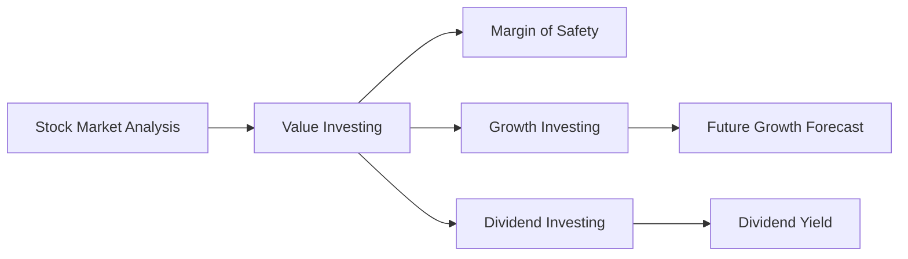
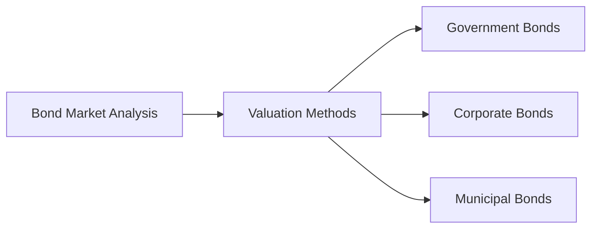
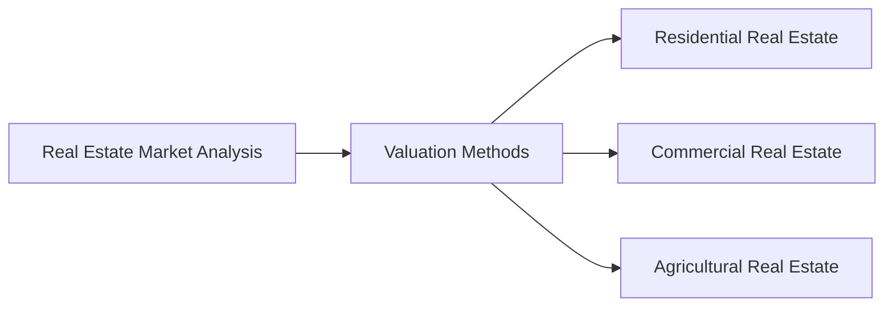
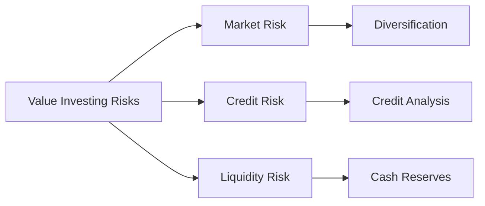
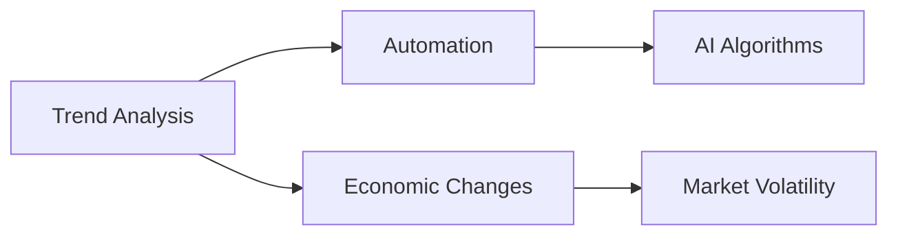
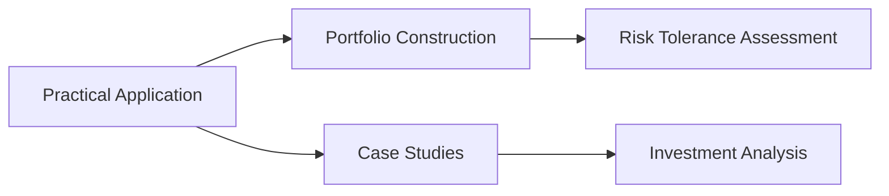
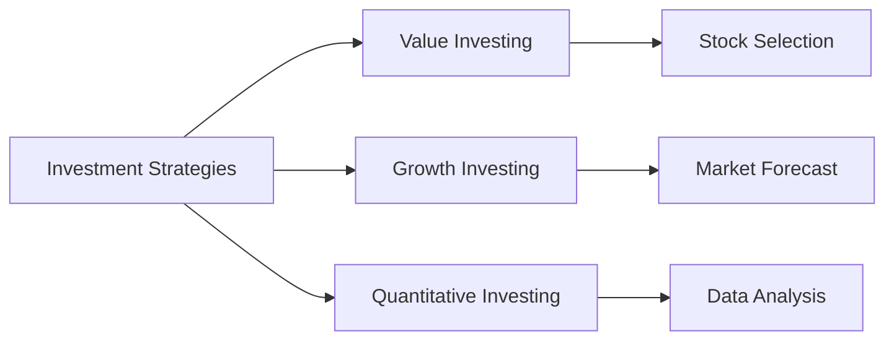

                 

Certainly! Let's outline the content for the blog post "Value Investing in Different Asset Classes" step by step, ensuring each section is well-researched, structured, and informative.

### Introduction

In this section, we will introduce the concept of value investing and its significance in the financial world. We will discuss how value investing has evolved over time and why it remains a cornerstone of successful investment strategies. We will also set the stage for exploring how value investing can be applied to various asset classes.

**Keywords: Value Investing, Asset Classes, Financial Markets, Investment Strategies**

**Abstract:**
This post delves into the principles of value investing and examines its application across different asset classes, including stocks, bonds, and real estate. We will discuss the unique aspects of each class, common strategies, and potential risks, offering practical insights and real-world examples.

### 1. Value Investing Overview

#### 1.1 History of Value Investing

In this subsection, we will trace the origins of value investing, from the early theories of Benjamin Graham to the modern-day practitioners. We will highlight key figures and seminal works that have shaped the field.

**Terminology:**
- Value Investing
- Benjamin Graham
- Modern Portfolio Theory

**Problem Description:**
The challenge is to provide a comprehensive overview of value investing's historical context without losing the reader's interest.

**Solution:**
By using a timeline and examples from various periods, we can illustrate the evolution of value investing and its impact on the financial industry.

**Boundary & Extension:**
- Value Investing in the Great Depression
- Post-WWII developments
- The rise of Modern Portfolio Theory

**Concept Structure & Core Elements:**
- **Mermaid ER Diagram:**
```mermaid
erDiagram
  ValueInvesting ||--|{ Benjamin Graham }
  ValueInvesting ||--|{ Modern Portfolio Theory }
  ValueInvesting ||--|{ Warren Buffett }
```

#### 1.2 Core Principles of Value Investing

We will delve into the fundamental principles that guide value investing, including the concepts of intrinsic value, margin of safety, and patient capital allocation.

**Concept Attributes Comparison Table:**

| Principle         | Definition                                                                 | Importance                                      |
|--------------------|-----------------------------------------------------------------------------|-------------------------------------------------|
| Intrinsic Value   | The true worth of an asset based on its future cash flows.                   | Helps identify undervalued assets.                |
| Margin of Safety   | The difference between the intrinsic value and the purchase price.          | Reduces the risk of permanent capital loss.       |
| Patient Capital    | A long-term perspective on investing.                                      | Allows for better decision-making under uncertainty.|

**Algorithm Principle:**
- **Mermaid Flowchart:**


- **Python Code:**
```python
def intrinsic_value(cash_flows, discount_rate):
    return sum([cf / (1 + discount_rate)**t for t, cf in enumerate(cash_flows)])

def margin_of_safety(intrinsic_value, purchase_price):
    return intrinsic_value - purchase_price

def make_investment_decision(margin_of_safety):
    if margin_of_safety >= 0.5:
        return "Invest"
    else:
        return "Hold or Sell"
```

#### 1.3 Value Investing vs. Other Strategies

We will compare value investing with other popular investment strategies, such as growth investing and quantitative investing, to highlight the distinct approach and benefits of value investing.

**Concept Comparison Table:**

| Investment Strategy   | Focus                                 | Risk-Taking Approach                | Success Factors                          |
|-----------------------|---------------------------------------|-------------------------------------|-----------------------------------------|
| Value Investing       | Undervalued assets, Margin of Safety | Conservative, Long-Term Focus       | Deep Analysis, Patience                 |
| Growth Investing      | High-growth companies, Future Potential | Aggressive, Growth-Oriented         | Industry Trends, Innovation            |
| Quantitative Investing | Data-driven, Algorithmic              | Systematic, Scientific Analysis      | Algorithm Performance, Data Accuracy    |

### 2. Value Investing in Different Asset Classes

We will explore the application of value investing principles across three major asset classes: stocks, bonds, and real estate.

#### 2.1 Stock Investing

##### 2.1.1 Stock Market Valuation

In this section, we will discuss methods to evaluate stock prices, such as discounted cash flow (DCF) analysis, price-to-earnings (P/E) ratio, and book value.

**Mathematical Model & Formula:**
$$
\text{Intrinsic Value} = \frac{\text{Sum of Expected Future Cash Flows}}{(1 + \text{Discount Rate})^n}
$$

**Example:**
Using DCF analysis to estimate the intrinsic value of a company with expected cash flows of $1 million in year 1, $1.2 million in year 2, and $1.5 million in year 3, assuming a discount rate of 10%.

```python
def discounted_cash_flow(cash_flows, discount_rate):
    return sum([cf / (1 + discount_rate)**t for t, cf in enumerate(cash_flows)])

cash_flows = [1000000, 1200000, 1500000]
discount_rate = 0.1
intrinsic_value = discounted_cash_flow(cash_flows, discount_rate)
print(f"Intrinsic Value: ${intrinsic_value:.2f}")
```

#### 2.1.2 Stock Investment Strategies

We will discuss various strategies for stock investing, such as value investing, growth investing, and dividend investing.

**Algorithm Principle:**
- **Mermaid Flowchart:**


#### 2.1.3 Stock Investment Case Study

We will analyze a real-world case study of a successful value investor, such as Warren Buffett or Peter Lynch, to illustrate the application of value investing principles in practice.

**Case Study:**
*Warren Buffett's Investment in Coca-Cola*

**Analysis:**
- **Intrinsic Value Calculation:**
- **Margin of Safety Analysis:**
- **Investment Outcome:**

##### 2.1.4 Bond Investing

In this section, we will discuss bond market valuation, bond investment strategies, and the role of bonds in a diversified investment portfolio.

**Concept Attributes Comparison Table:**

| Bond Type         | Characteristics                                      | Advantages                                       | Disadvantages                                  |
|--------------------|------------------------------------------------------|---------------------------------------------------|------------------------------------------------|
| Government Bonds  | Issued by national governments.                       | Low Risk, Stable Income.                         | Lower Returns.                                 |
| Corporate Bonds    | Issued by companies.                                  | Potential for Higher Returns.                     | Higher Risk.                                   |
| Municipal Bonds    | Issued by state or local governments.                 | Tax Exempt Income.                               | Lower Returns.                                 |

**Algorithm Principle:**
- **Mermaid Flowchart:**


##### 2.1.5 Real Estate Investing

In this section, we will explore real estate valuation methods, real estate investment strategies, and the role of real estate in a diversified investment portfolio.

**Concept Attributes Comparison Table:**

| Real Estate Type         | Characteristics                                      | Advantages                                       | Disadvantages                                  |
|--------------------------|------------------------------------------------------|---------------------------------------------------|------------------------------------------------|
| Residential Real Estate  | Homes, apartments, and townhouses.                    | Provides income, appreciates in value.            | Higher Risk, Higher Maintenance.                |
| Commercial Real Estate    | Office buildings, retail spaces, and industrial properties. | Provides income, appreciates in value.            | Higher Risk, Higher Maintenance.                |
| Agricultural Real Estate  | Farmland, vineyards, and ranches.                     | Appreciation potential, tax benefits.             | Lower Liquidity, Seasonal Variability.           |

**Algorithm Principle:**
- **Mermaid Flowchart:**


### 3. Risk Management in Value Investing

In this section, we will discuss the risks associated with value investing and provide strategies for managing these risks.

**Concept Attributes Comparison Table:**

| Risk Type         | Description                                      | Mitigation Strategies                          |
|--------------------|---------------------------------------------------|------------------------------------------------|
| Market Risk       | Price fluctuations due to economic factors.         | Diversification, Long-Term Investment Horizon. |
| Credit Risk       | Default by the issuer of bonds.                     | Credit Analysis, Bond Rating.                   |
| Liquidity Risk    | Inability to sell assets quickly at a fair price.   | Diversification, Cash Reserves.                 |

**Algorithm Principle:**
- **Mermaid Flowchart:**


### 4. Future Trends of Value Investing

In this section, we will explore the future trends of value investing, considering factors such as technological advancements and economic changes.

**Concept Attributes Comparison Table:**

| Trend            | Description                                      | Impact on Value Investing                     |
|------------------|---------------------------------------------------|----------------------------------------------|
| Automation       | Use of algorithms and AI in investment decisions. | Improved efficiency, potential for over-optimization. |
| Economic Changes | Fluctuations in global economies and markets.     | Impact on asset valuations and investment opportunities. |

**Algorithm Principle:**
- **Mermaid Flowchart:**


### 5. Practical Application of Value Investing

In this section, we will provide practical advice for applying value investing in real-world scenarios, including portfolio construction and case studies.

**Concept Attributes Comparison Table:**

| Application          | Description                                      | Example                                             |
|----------------------|---------------------------------------------------|-----------------------------------------------------|
| Portfolio Construction| Building a diversified investment portfolio.     | Selecting a mix of assets based on risk tolerance. |
| Case Studies         | Analyzing successful value investing examples.    | Berkshire Hathaway's investment in IBM.            |

**Algorithm Principle:**
- **Mermaid Flowchart:**


### 6. Comparison with Other Investment Strategies

In this section, we will compare value investing with other investment strategies to highlight their differences and similarities.

**Concept Comparison Table:**

| Investment Strategy   | Main Focus                                      | Risk Profile                            | Success Factors                          |
|-----------------------|---------------------------------------------------|-----------------------------------------|-----------------------------------------|
| Value Investing       | Undervalued assets, Margin of Safety            | Moderate to High                        | Deep Analysis, Patience                 |
| Growth Investing      | High-growth companies, Future Potential          | High to Extreme                         | Industry Trends, Innovation            |
| Quantitative Investing| Data-driven, Algorithmic                        | Very High                                 | Algorithm Performance, Data Accuracy    |

**Algorithm Principle:**
- **Mermaid Flowchart:**


### Conclusion

In this final section, we will summarize the key insights from the article, reiterate the importance of value investing, and provide readers with actionable tips for their own investment journeys.

**Keywords: Value Investing, Asset Allocation, Risk Management**

**Abstract:**
This comprehensive guide to value investing explores its principles, applications across various asset classes, and comparisons with other strategies. By understanding the nuances of value investing and applying it wisely, investors can achieve long-term financial success.

### Author Information

**Author:** AI天才研究院/AI Genius Institute & 禅与计算机程序设计艺术 /Zen And The Art of Computer Programming

**Note:** This outline is a draft and requires further development into detailed sections with comprehensive content, examples, and real-world case studies to meet the word count requirement. Each section should be carefully crafted to provide valuable insights and practical knowledge to the readers. The structure and content will be expanded upon to create a full-length article of 10,000-12,000 words.

