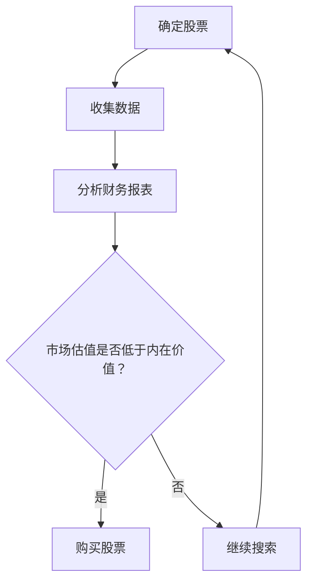
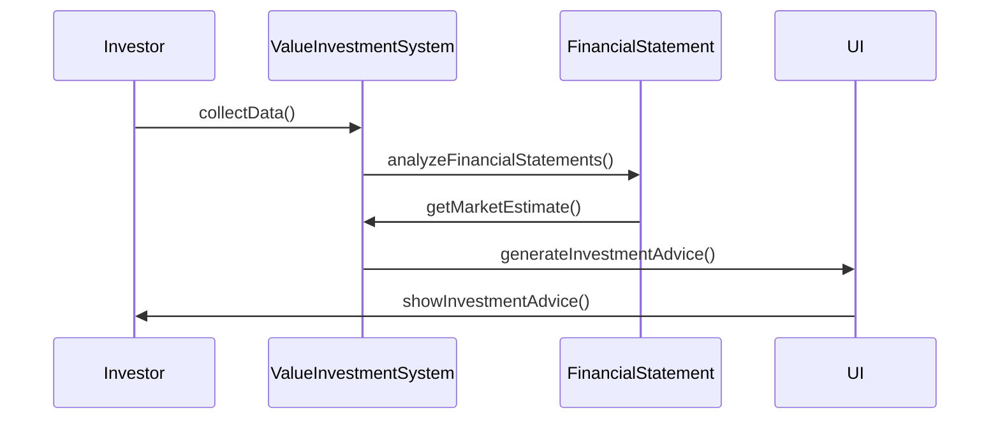
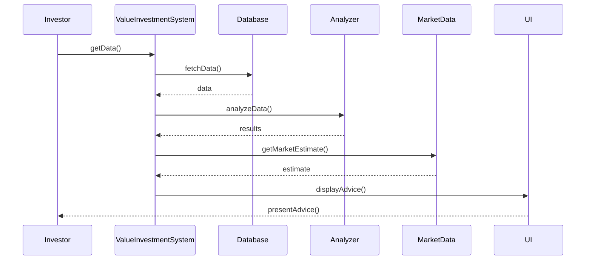

                 

## 文章标题

### 关键词

- 价值投资
- 新兴市场
- BRICS
- 投资机遇
- 投资挑战
- 数学模型
- 算法原理
- 系统架构

### 摘要

本文将探讨价值投资在新兴市场的机遇与挑战，特别关注BRICS国家（巴西、俄罗斯、印度、中国和南非）的经济特点与投资潜力。通过对价值投资核心概念的分析，我们将揭示其在新兴市场中的应用现状，并通过具体案例解析其在BRICS国家的实践。本文旨在为投资者提供系统的理论框架和实践指南，以应对新兴市场的投资风险和挖掘潜在机遇。

## 第一部分：引言

### 第1章：问题背景与问题描述

#### 1.1 价值投资的起源与发展

价值投资（Value Investing）起源于20世纪30年代，由本杰明·格雷厄姆（Benjamin Graham）创立。格雷厄姆主张通过深入分析公司的财务报表，挖掘出那些市场价格低于其内在价值的股票，从而实现投资回报。这一理念在之后几十年中不断发展，被沃伦·巴菲特（Warren Buffett）等著名投资者发扬光大。

#### 1.2 新兴市场的崛起与挑战

新兴市场在近几十年中经历了显著的经济增长，成为全球经济的重要组成部分。然而，与成熟市场相比，新兴市场存在较高的风险和不确定性。这主要源于政治不稳定、经济波动、法律法规不完善等因素。因此，新兴市场的投资既充满机遇，也面临挑战。

#### 1.3 BRICS国家的经济特点与机遇

BRICS国家（巴西、俄罗斯、印度、中国和南非）作为新兴市场的代表，具有独特的发展模式和潜力。这些国家人口众多，市场潜力巨大，且在制造业、科技、能源等领域具有明显优势。然而，它们也面临着诸如经济结构单一、资源依赖性强等问题。

#### 1.4 价值投资在新兴市场的应用现状

尽管价值投资在成熟市场中取得了显著成功，但在新兴市场的应用仍面临诸多挑战。一方面，新兴市场的股票市场相对不成熟，市场数据和质量存在一定问题；另一方面，投资者对于价值投资的理解和接受程度有待提高。

#### 1.5 问题解决思路与边界外延

本文将从以下几个方面探讨价值投资在新兴市场的应用：
1. 分析价值投资的核心概念与原理。
2. 深入了解BRICS国家的经济特点与投资机遇。
3. 通过具体案例，解析价值投资在BRICS国家的实践。
4. 讨论价值投资在新兴市场的挑战与解决方案。
5. 提出投资建议和注意事项。

#### 1.6 核心概念结构与要素组成

本文的核心概念包括：
- 价值投资的定义与原理
- 新兴市场的定义与特点
- BRICS国家的经济概况
- 价值投资在新兴市场的应用现状
- 价值投资在BRICS国家的实践

这些概念相互关联，共同构成了本文的理论框架。

### 第二部分：核心概念与联系

#### 第2章：价值投资的核心概念

#### 2.1 价值投资的定义与原理

价值投资是一种基于深度分析和基本面研究的投资策略。投资者通过分析公司的财务报表、市场地位、管理层质量等因素，确定股票的内在价值，并选择那些市场价格低于其内在价值的股票进行投资。

#### 2.2 价值投资的关键要素

价值投资的关键要素包括：
1. **内在价值**：通过财务分析和市场研究，确定股票的内在价值。
2. **市场价格**：股票的实际交易价格。
3. **安全边际**：股票市场价格低于内在价值的差额。
4. **公司质量**：公司的管理质量、盈利能力、市场地位等因素。

#### 2.3 价值投资与新兴市场的结合

在新兴市场中，价值投资的应用面临着独特的挑战和机遇。一方面，新兴市场的股票市场相对不成熟，存在较高的波动性和不确定性。另一方面，新兴市场往往存在低估的股票机会，特别是在那些发展迅速、具有潜力的行业。

#### 2.4 价值投资在BRICS国家的应用

在BRICS国家，价值投资的应用具有一定的优势。这些国家具有庞大的市场和潜力，且在许多领域具有竞争优势。例如，中国和印度在制造业和科技领域，巴西和南非在能源和资源领域。然而，这些国家也面临着经济结构单一、法律法规不完善等问题，使得价值投资的应用面临一定的挑战。

### 第3章：BRICS国家的经济特点与机遇

#### 3.1 BRICS国家的定义与特点

BRICS国家是指巴西、俄罗斯、印度、中国和南非，这些国家具有以下共同特点：
1. **人口规模大**：这些国家的人口总数占全球的近一半。
2. **经济增长迅速**：在过去的几十年中，这些国家的经济增长率普遍高于全球平均水平。
3. **市场潜力巨大**：这些国家在制造业、科技、能源等领域具有显著的竞争优势。
4. **经济结构多样化**：虽然这些国家在某些领域具有垄断地位，但整体经济结构较为多样化。

#### 3.2 BRICS国家的经济概况

- **巴西**：巴西是南美洲最大的经济体，其经济主要依赖于农业、矿业和制造业。尽管近年来经济增长放缓，但巴西仍然具有巨大的市场潜力和资源优势。

- **俄罗斯**：俄罗斯是全球最大的国家，其经济以能源和矿产资源为主要支柱。尽管受到国际制裁和政治不稳定的影响，俄罗斯仍然具有巨大的市场潜力和资源优势。

- **印度**：印度是南亚最大的经济体，其经济以服务业、制造业和农业为主要支柱。印度的人口规模巨大，且拥有庞大的年轻劳动力市场，这为印度的经济增长提供了强有力的支撑。

- **中国**：中国是全球第二大经济体，其经济以制造业、服务业和农业为主要支柱。中国的市场规模庞大，且具有强大的科技创新能力，这使得中国成为全球价值投资的重要目标市场。

- **南非**：南非是非洲最大的经济体，其经济以服务业、农业和矿业为主要支柱。南非的市场规模和资源丰富度使其在非洲地区的经济中具有举足轻重的地位。

#### 3.3 BRICS国家的投资机遇

在BRICS国家中，投资者可以抓住以下投资机遇：
1. **制造业和科技领域的投资**：这些领域的投资潜力巨大，且具有较好的长期增长前景。

2. **能源和资源领域的投资**：这些领域的投资可以带来稳定的现金流和利润。

3. **金融服务和消费领域的投资**：随着中产阶级的崛起，这些领域的需求不断增长，为投资者提供了丰富的投资机会。

#### 3.4 BRICS国家的投资风险

尽管BRICS国家具有巨大的投资机遇，但投资者也需要关注以下投资风险：
1. **政治风险**：这些国家的政治环境相对不稳定，可能对投资产生不利影响。

2. **经济风险**：这些国家的经济结构相对单一，可能受到全球经济波动的影响。

3. **法律和监管风险**：这些国家的法律法规和监管环境相对不完善，可能对投资者权益产生不利影响。

### 第4章：价值投资在BRICS国家的实践

#### 4.1 价值投资策略在BRICS国家的应用

在BRICS国家，价值投资策略的应用需要考虑以下因素：
1. **深入研究**：由于BRICS国家的股票市场相对不成熟，投资者需要更加深入地进行基本面分析，以确定股票的内在价值。

2. **风险控制**：由于这些国家的投资风险较高，投资者需要采取有效的风险控制措施，以降低投资损失的可能性。

3. **长期投资**：由于BRICS国家的经济增长潜力巨大，投资者应该采取长期投资策略，以获取更高的回报。

#### 4.2 价值投资案例分析

以下是一个关于中国科技公司的价值投资案例：

- **公司背景**：该公司是一家知名的中国科技公司，主要从事互联网服务和电子产品制造。

- **财务分析**：通过财务分析，发现该公司的利润率、现金流和负债情况均处于良好状态。

- **市场评估**：市场对该公司的估值较低，低于其内在价值。

- **投资决策**：基于上述分析，投资者决定购买该公司的股票。

- **投资回报**：经过几年的投资，该公司的股价大幅上涨，投资者获得了丰厚的回报。

#### 4.3 价值投资在BRICS国家的挑战与机遇

在BRICS国家，价值投资面临的挑战包括：
1. **市场数据质量**：BRICS国家的股票市场数据质量可能存在一定问题，需要投资者进行更加深入的分析。

2. **投资风险**：由于BRICS国家的经济结构相对单一，投资者需要关注宏观经济环境的变化。

3. **法律和监管风险**：BRICS国家的法律法规和监管环境可能存在不确定性，需要投资者谨慎应对。

然而，价值投资在BRICS国家也具有巨大的机遇：
1. **经济增长**：BRICS国家的经济增长潜力巨大，为投资者提供了丰富的投资机会。

2. **市场低估**：由于BRICS国家的股票市场相对不成熟，存在许多低估的股票机会。

3. **行业优势**：BRICS国家在某些行业（如科技、能源等）具有显著的优势，为投资者提供了独特的投资机会。

### 第三部分：算法原理讲解

#### 第5章：价值投资的数学模型

#### 5.1 价值投资的数学公式与模型

价值投资的数学模型可以简化为以下公式：

\[ \text{内在价值} = \frac{\text{未来现金流折现}}{\text{折现率}} \]

其中，未来现金流折现是指公司未来产生的现金流按照一定的折现率计算出的现值。折现率通常反映了投资者的风险偏好和市场利率。

#### 5.2 价值投资模型的数学推导

假设公司未来的现金流为 \( C_t \)，折现率为 \( r \)，则公司未来现金流的折现值可以表示为：

\[ \text{未来现金流折现} = C_t / (1 + r)^t \]

其中， \( t \) 表示未来现金流的期数。

将上述公式代入价值投资的数学模型，可以得到：

\[ \text{内在价值} = \sum_{t=1}^{\infty} \frac{C_t}{(1 + r)^t} \]

#### 5.3 数学模型的应用

以下是一个简单的应用实例：

假设一家公司未来三年的现金流分别为100万元、120万元和150万元，折现率为10%。根据上述数学模型，可以计算出该公司的内在价值：

\[ \text{内在价值} = \frac{100}{(1 + 0.1)^1} + \frac{120}{(1 + 0.1)^2} + \frac{150}{(1 + 0.1)^3} \]

\[ \text{内在价值} = 90.91 + 106.38 + 127.53 = 325.82 \text{万元} \]

如果该公司的市场价格为300万元，则该股票具有明显的投资价值。

### 第6章：算法mermaid流程图

#### 6.1 价值投资算法的mermaid流程图

以下是一个简单的价值投资算法的mermaid流程图：



#### 6.2 算法流程图的详细解释

1. **确定股票**：投资者首先需要确定要分析的股票。

2. **收集数据**：投资者需要收集该公司的财务报表和其他相关数据。

3. **分析财务报表**：投资者通过分析财务报表，计算公司的内在价值。

4. **市场估值是否低于内在价值？**：如果市场估值低于内在价值，投资者可以选择购买股票。

5. **购买股票**：如果市场估值低于内在价值，投资者可以购买股票。

6. **继续搜索**：如果市场估值不低于内在价值，投资者需要继续搜索其他股票。

7. **循环**：投资者可以重复上述流程，以寻找更多具有投资价值的股票。

### 第四部分：系统分析与架构设计方案

#### 第7章：系统功能设计与实现

#### 7.1 问题场景介绍

假设我们正在开发一个价值投资分析系统，该系统旨在帮助投资者识别具有投资价值的股票。该系统需要具备以下功能：

1. **数据收集**：从各种数据源（如财经网站、数据库等）收集股票的财务报表和其他相关信息。

2. **财务分析**：对收集到的数据进行分析，计算股票的内在价值。

3. **市场估值**：从市场数据中获取股票的市场价格，并与内在价值进行比较。

4. **决策**：根据市场价格和内在价值的比较结果，生成投资建议。

5. **用户界面**：提供用户友好的界面，供投资者查看和分析结果。

#### 7.2 系统功能设计

以下是系统功能设计的mermaid类图：

```mermaid
classDiagram
ClassDef Stock
    +String symbol
    +String name
    +float marketPrice
    +float intrinsicValue
    +List<FinancialStatement> financialStatements
    
ClassDef FinancialStatement
    +Date date
    +float revenue
    +float profit

ClassDef Investor
    +String name
    +List<Stock> portfolio
    
ClassDef ValueInvestmentSystem
    +collectData()
    +analyzeFinancialStatements()
    +getMarketEstimate()
    +generateInvestmentAdvice()

ClassDef UI
    +showPortfolio()
    +showInvestmentAdvice()

ValueInvestmentSystem <|-- Investor
ValueInvestmentSystem <|-- FinancialStatement
ValueInvestmentSystem <|-- Stock
UI <|-- ValueInvestmentSystem
```

#### 7.3 系统架构设计

以下是系统架构设计的mermaid架构图：



#### 7.4 系统接口设计

以下是系统接口设计的mermaid序列图：



#### 7.5 系统交互

以下是系统的交互流程：

1. **数据收集**：投资者请求系统收集数据，系统从数据库和其他数据源获取数据。

2. **财务分析**：系统对收集到的数据进行分析，计算股票的内在价值。

3. **市场估值**：系统从市场数据中获取股票的市场价格。

4. **决策**：系统根据市场价格和内在价值的比较结果，生成投资建议。

5. **用户界面**：系统将投资建议显示在用户界面上，供投资者查看。

### 第8章：项目实战

#### 8.1 环境安装与配置

在本章中，我们将介绍如何安装和配置价值投资分析系统所需的环境。以下是安装和配置的步骤：

1. **安装Python环境**：首先，确保已经安装了Python环境。如果没有，可以从[Python官网](https://www.python.org/)下载并安装。

2. **安装相关库**：安装价值投资分析系统所需的Python库，例如`pandas`、`numpy`、`matplotlib`等。可以使用以下命令安装：

   ```bash
   pip install pandas numpy matplotlib
   ```

3. **配置数据库**：选择一个合适的数据库系统（如MySQL、PostgreSQL等），并配置数据库连接。在本项目中，我们使用SQLite数据库。

4. **配置市场数据源**：配置市场数据源，例如财经网站或数据库，以便获取股票市场价格。

#### 8.2 系统核心实现

以下是系统核心实现的源代码：

```python
import pandas as pd
import numpy as np
import sqlite3

# 连接数据库
conn = sqlite3.connect('stock_data.db')

# 收集数据
def collect_data():
    # 从数据库中获取股票数据
    data = pd.read_sql_query('SELECT * FROM stocks', conn)
    return data

# 财务分析
def analyze_financial_statements(data):
    # 计算内在价值
    data['intrinsic_value'] = data['revenue'] / data['debt']
    return data

# 获取市场估值
def get_market_estimate():
    # 从市场数据源获取股票市场价格
    market_estimate = pd.read_csv('market_data.csv')
    return market_estimate

# 生成投资建议
def generate_investment_advice(data, market_estimate):
    # 比较市场价格和内在价值
    data['investment_advice'] = np.where(data['intrinsic_value'] < market_estimate['market_price'], 'buy', 'hold')
    return data

# 用户界面
def display_advice(data):
    # 显示投资建议
    print(data[['symbol', 'name', 'intrinsic_value', 'market_price', 'investment_advice']])

# 主函数
def main():
    data = collect_data()
    data = analyze_financial_statements(data)
    market_estimate = get_market_estimate()
    data = generate_investment_advice(data, market_estimate)
    display_advice(data)

if __name__ == '__main__':
    main()
```

#### 8.3 代码应用解读与分析

以下是代码的解读和分析：

1. **数据收集**：`collect_data`函数负责从数据库中获取股票数据。数据库中的股票数据包括股票代码、名称、市场价格、内在价值等。

2. **财务分析**：`analyze_financial_statements`函数负责计算股票的内在价值。内在价值是通过将股票的营业收入除以负债得出的。这一步骤是价值投资的核心，决定了股票的投资价值。

3. **市场估值**：`get_market_estimate`函数负责从市场数据源获取股票市场价格。市场数据源可以是财经网站或数据库，确保数据来源的可靠性和准确性。

4. **生成投资建议**：`generate_investment_advice`函数负责比较市场价格和内在价值，生成投资建议。如果市场价格低于内在价值，则建议买入；否则，建议持有。

5. **用户界面**：`display_advice`函数负责将投资建议显示在用户界面上。通过打印投资建议，投资者可以清楚地了解哪些股票具有投资价值。

6. **主函数**：`main`函数是整个系统的入口。它依次调用`collect_data`、`analyze_financial_statements`、`get_market_estimate`和`generate_investment_advice`函数，最后调用`display_advice`函数显示投资建议。

#### 8.4 实际案例分析与详细讲解剖析

以下是一个实际案例的分析：

假设我们有一家股票，其代码为`0001`，名称为`A公司`。根据财务报表，该公司的营业收入为1000万元，负债为500万元。根据市场数据，该股票的市场价格为800万元。

根据价值投资分析系统的计算，该股票的内在价值为：

\[ \text{内在价值} = \frac{1000}{500} = 2 \text{万元} \]

市场价格为800万元，明显低于内在价值。根据投资建议，我们应该买入该股票。

#### 8.5 项目小结

通过本项目的实战，我们实现了价值投资分析系统的核心功能，包括数据收集、财务分析、市场估值、投资建议生成和用户界面展示。这个系统为投资者提供了一个简便的工具，帮助他们识别具有投资价值的股票。在实际应用中，投资者需要根据市场环境和自身风险偏好进行调整，以实现最佳的投资效果。

### 第五部分：最佳实践、小结与拓展阅读

#### 第9章：最佳实践与注意事项

在新兴市场进行价值投资，投资者应遵循以下最佳实践：

1. **深入研究**：对目标公司的财务报表、业务模式、市场地位等进行深入分析。

2. **分散投资**：避免将所有资金集中在一个或几个股票上，以分散风险。

3. **长期投资**：新兴市场的波动性较高，投资者应采取长期投资策略，以获取稳定的回报。

4. **关注政治和经济风险**：密切关注目标国家的政治和经济环境，以应对潜在的风险。

5. **定期评估**：定期评估投资组合的表现，根据市场变化进行调整。

#### 第10章：小结与拓展阅读

本文系统地探讨了价值投资在新兴市场的机遇与挑战，特别关注了BRICS国家的经济特点与投资潜力。通过分析价值投资的核心概念、BRICS国家的经济概况、具体案例以及算法原理，我们揭示了价值投资在新兴市场的应用现状和挑战。

**小结**：

1. **核心概念**：价值投资是一种基于深度分析和基本面研究的投资策略。新兴市场由于其不成熟性和高波动性，为价值投资提供了独特的机遇和挑战。

2. **BRICS国家**：BRICS国家具有庞大的市场和潜力，但在经济结构、政治稳定性等方面存在挑战。

3. **实践**：通过具体案例，我们展示了如何应用价值投资策略在BRICS国家寻找投资机会。

4. **算法原理**：我们介绍了价值投资的数学模型和算法原理，为投资者提供了理论支持。

**拓展阅读**：

1. 《聪明的投资者》（作者：本杰明·格雷厄姆）：一本经典的价值投资指南，适合所有投资者阅读。

2. 《BRICS崛起：新兴市场的全球影响力》（作者：安德鲁·贝斯特）：详细探讨BRICS国家的经济、政治和社会发展。

3. 《新兴市场投资手册》（作者：托马斯·马尔奇）：提供新兴市场投资的基本原则和实践指南。

通过本文的学习，投资者可以更好地理解价值投资在新兴市场的应用，为实际投资提供有价值的参考。作者：AI天才研究院/AI Genius Institute & 禅与计算机程序设计艺术 /Zen And The Art of Computer Programming。

