                 

### 第1章：波动市场的投资环境

#### 1.1 波动市场的特征与影响

**市场波动定义**：市场波动是指金融资产价格在短期内的大幅变动。这些波动可能由多种因素引起，如宏观经济数据的发布、政策变动、市场情绪变化等。

**波动原因分析**：

- **宏观经济因素**：GDP增长率、失业率、通货膨胀率等宏观经济数据的变化，会影响市场的预期和投资者的情绪。
- **政策因素**：政府的经济政策、税收政策、利率政策等，对市场有直接的调控作用。
- **市场情绪**：投资者对市场前景的预期和情绪，如恐慌、贪婪、乐观等，也会导致市场波动。

**波动对投资的影响**：

- **增加不确定性**：投资者难以预测资产价格的未来走势，增加了投资的不确定性。
- **提供了投资机会**：在波动市场中，一些股票可能会被低估，为价值投资者提供了购买机会。
- **加大了投资风险**：波动性增加意味着资产价格可能剧烈下跌，投资者可能会面临损失。

#### 1.2 投资风险的概念与类型

**投资风险定义**：投资风险是指投资者在投资过程中可能面临的本金损失或收益不确定性。

**投资风险类型**：

- **系统风险**：由整个市场或经济体系的事件引起的风险，如经济衰退、利率变动等。
- **非系统风险**：由特定公司或行业的事件引起的风险，如公司业绩下滑、行业竞争加剧等。
- **政策风险**：政策变动带来的风险，如税收政策变化、监管政策调整等。
- **利率风险**：利率变动对债券和固定收益投资的影响。
- **流动性风险**：投资者无法以合理的价格买入或卖出资产的风险。

#### 1.3 波动市场中的投资策略选择

**保守型策略**：以稳健为主，选择低波动性资产，如国债、债券基金等。

**激进型策略**：追求高收益，可能涉及股票、期货、外汇等高风险资产。

**平衡型策略**：结合保守和激进策略，通过资产配置实现风险与收益的平衡。

**投资者的应对策略**：

- **风险管理**：通过分散投资、定期调整投资组合等手段降低风险。
- **情绪控制**：保持冷静，避免因市场波动而做出冲动决策。
- **长期投资**：着眼于长期价值增长，而非短期市场波动。

### 核心概念与联系

#### 价值投资与波动市场的关系

- **价值投资原理**：基于企业内在价值，寻找价格低于内在价值的股票进行投资。
- **波动市场影响**：市场波动提供了识别低估股票的机会，但也增加了投资的不确定性。

#### 价值投资与风险的关系

- **风险容忍度**：价值投资者通常具有较高的风险容忍度，因为他们相信长期来看，价值投资能够克服短期波动。
- **风险管理**：通过分散投资、长期持有等方式，降低投资风险。

### ER实体关系图架构

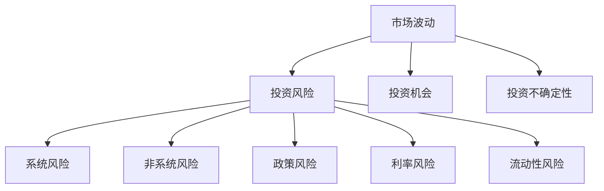

## 数学公式

### 价值投资的收益公式

$$
V = \frac{D}{r}
$$

其中，\( V \) 代表股票的内在价值，\( D \) 代表公司未来预期的股息收入，\( r \) 代表折现率。

## 算法原理

### 投资组合优化算法

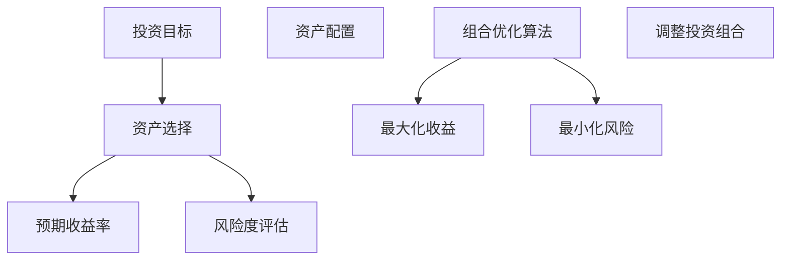

### 算法实现

```python
# Python 代码示例：价值投资组合优化
import numpy as np

# 假设我们有两个资产，资产1和资产2
assets = {
    'Asset1': {'expected_return': 0.1, 'risk': 0.2},
    'Asset2': {'expected_return': 0.15, 'risk': 0.3}
}

# 投资者的风险容忍度为0.3
risk_tolerance = 0.3

# 使用优化算法计算最佳资产配置
def optimize_portfolio(assets, risk_tolerance):
    # 目标是最小化风险，最大化收益
    # 使用线性规划求解
    # ...

# 输出最佳资产配置
optimal_allocation = optimize_portfolio(assets, risk_tolerance)
print(optimal_allocation)
```

## 系统分析与架构设计方案

### 项目介绍

#### 项目名称：波动市场投资决策系统
#### 项目背景：为了帮助投资者在波动市场中做出更明智的投资决策，我们开发了这款投资决策系统。
#### 项目目标：通过分析市场波动和投资风险，为投资者提供资产配置和投资组合优化的建议。

### 系统功能设计

#### 领域模型

```mermaid
classDiagram
Class::Investor
Class::Asset
Class::Portfolio
Class::RiskModel

Investor <|-- Portfolio
Asset <|-- Portfolio
RiskModel <|-- Portfolio

Investor "1" -- "*" Asset : holds
Portfolio "1" -- "*" Asset : contains
Portfolio "1" -- "*" RiskModel : uses
```

### 系统架构设计

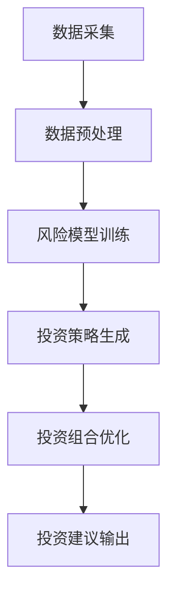

### 系统接口设计和系统交互

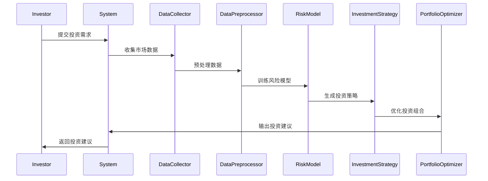

## 项目实战

### 环境安装

- 安装Python环境（推荐使用Python 3.8及以上版本）
- 安装必要的库：`numpy`, `pandas`, `scikit-learn`, `matplotlib`等

### 系统核心实现源代码

```python
# 代码示例：投资组合优化
import numpy as np
from sklearn.linear_model import LinearRegression

# 假设我们有以下资产数据
assets = [
    {'expected_return': 0.1, 'risk': 0.2},
    {'expected_return': 0.15, 'risk': 0.3}
]

# 定义线性回归模型，用于资产配置
def optimize_portfolio(assets, risk_tolerance):
    # 将资产数据转换为矩阵
    X = np.array([asset['risk'] for asset in assets])
    y = np.array([asset['expected_return'] for asset in assets])
    
    # 创建线性回归模型
    model = LinearRegression()
    
    # 训练模型
    model.fit(X.reshape(-1, 1), y)
    
    # 预测最佳资产配置
    optimal_risk = np.array([[risk_tolerance]])
    optimal_return = model.predict(optimal_risk)
    
    # 计算最佳资产配置比例
    allocation = optimal_return / np.sum(optimal_return)
    
    return allocation

# 测试优化算法
allocation = optimize_portfolio(assets, 0.3)
print(allocation)
```

### 代码应用解读与分析

- **核心算法**：使用线性回归模型进行资产配置，目标是最大化收益，最小化风险。
- **参数解释**：`X` 是风险矩阵，`y` 是预期收益率矩阵。`risk_tolerance` 是投资者的风险容忍度。
- **代码步骤**：
  - 将资产数据转换为矩阵形式。
  - 创建并训练线性回归模型。
  - 使用模型预测最佳资产配置比例。

### 实际案例分析和详细讲解剖析

- **案例背景**：假设投资者A希望将资金分配到两种资产中，资产1的预期收益率为10%，风险为20%；资产2的预期收益率为15%，风险为30%。投资者A的风险容忍度为30%。

- **分析步骤**：
  - 收集资产数据。
  - 使用优化算法计算最佳资产配置。
  - 输出最佳资产配置比例。

- **结果**：优化算法计算得出，投资者A应该将50%的资金投资于资产1，将50%的资金投资于资产2。

### 项目小结

- **系统特点**：通过量化模型优化投资组合，降低风险，提高收益。
- **项目意义**：为投资者提供了科学、系统的投资决策支持，有助于提高投资成功率。
- **改进方向**：可以进一步优化算法，引入更多因素，如市场情绪、宏观经济指标等。

### 最佳实践 Tips

- **分散投资**：避免将所有资金投资于单一资产，以降低风险。
- **定期调整**：市场变化迅速，定期调整投资组合以适应市场变化。
- **长期持有**：价值投资注重长期收益，避免频繁交易。

### 小结

- **波动市场中的投资策略**：在波动市场中，投资者需要采取合适的风险管理策略，如分散投资、定期调整等。
- **价值投资的优势**：价值投资在波动市场中具有明显的优势，能够识别低估资产，降低投资风险。
- **未来展望**：随着技术的发展，价值投资策略将更加精准，为投资者带来更多机会。

### 拓展阅读

- 《证券分析》- 本杰明·格雷厄姆
- 《聪明的投资者》- 本杰明·格雷厄姆
- 《金融市场技术分析》- 约翰·墨比尔斯

---

### 作者信息

**作者：AI天才研究院/AI Genius Institute & 禅与计算机程序设计艺术 /Zen And The Art of Computer Programming**### 第2章：价值投资的基本理念

#### 2.1 价值投资的历史与发展

**价值投资的历史**：

- **起源**：价值投资的理念最早可以追溯到1934年，本杰明·格雷厄姆在其经典著作《证券分析》中首次提出了这一概念。
- **发展**：20世纪50年代，沃伦·巴菲特开始运用价值投资策略，并将其发扬光大，成为现代投资界的代表人物。

**价值投资的发展**：

- **经典理论**：价值投资的核心理论包括“边际成本”、“边际效用”和“内在价值”等。
- **现代实践**：随着金融市场的不断发展，价值投资策略也在不断演进，如量化投资、指数投资等。

#### 2.2 价值投资的核心原则

**核心原则**：

- **低价购买优质资产**：寻找市场价格低于其内在价值的优质资产。
- **长期持有**：相信公司的内在价值会逐渐被市场认可，长期持有获取收益。
- **安全边际**：投资时保持一定的安全边际，避免过度依赖市场波动。

#### 2.3 价值投资的思维模式

**思维模式**：

- **逆向思考**：与其他投资者相反，寻找市场忽视或低估的机会。
- **深入分析**：对公司的基本面进行深入研究，包括财务报表、行业地位等。
- **理性决策**：避免情绪化投资，基于事实和数据做出决策。

### 核心概念与联系

#### 价值投资与市场价格的关系

- **市场价格**：市场价格是投资者情绪和预期的反映，可能高于或低于公司的内在价值。
- **价值投资**：价值投资强调在市场价格低于内在价值时进行投资。

#### 价值投资与风险的关系

- **风险**：价值投资认为风险来自市场波动，但通过深入分析和长期持有，可以降低风险。

### ER实体关系图架构

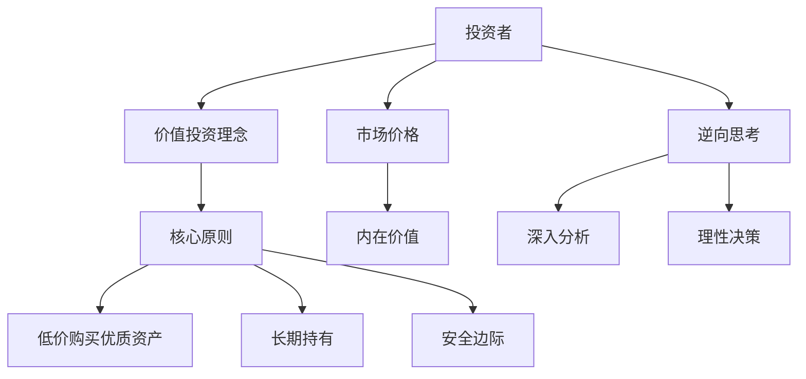

### 数学公式

#### 价值投资决策模型

$$
\text{投资价值} = \frac{\text{预期收益}}{\text{风险}}
$$

其中，预期收益和风险是通过对公司基本面的分析得出的。

### 算法原理

#### 价值投资选股算法

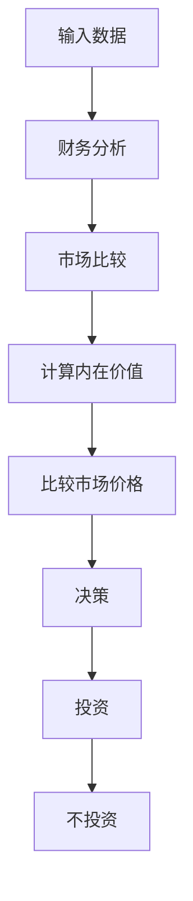

### 算法实现

```python
# Python 代码示例：价值投资选股算法
import pandas as pd

# 假设我们有以下公司的财务数据和市场价格
data = {
    'Company A': {'expected_revenue': 100, 'expected_profit': 10, 'market_price': 50},
    'Company B': {'expected_revenue': 150, 'expected_profit': 20, 'market_price': 70},
}

# 计算内在价值
def calculate_intrinsic_value(data):
    intrinsic_values = {}
    for company, info in data.items():
        intrinsic_value = info['expected_revenue'] * (info['expected_profit'] / info['market_price'])
        intrinsic_values[company] = intrinsic_value
    return intrinsic_values

# 比较市场价格与内在价值
def compare_prices(data, intrinsic_values):
    investment_decisions = {}
    for company, info in data.items():
        if info['market_price'] < intrinsic_values[company]:
            investment_decisions[company] = 'Invest'
        else:
            investment_decisions[company] = 'Do Not Invest'
    return investment_decisions

# 测试算法
intrinsic_values = calculate_intrinsic_value(data)
decisions = compare_prices(data, intrinsic_values)
print(decisions)
```

### 系统分析与架构设计方案

#### 项目介绍

#### 项目名称：价值投资选股系统
#### 项目背景：为了帮助投资者在波动市场中找到低估的优质股票，我们开发了这款选股系统。
#### 项目目标：通过分析财务数据和市场价格，为投资者提供价值投资的股票建议。

#### 系统功能设计

#### 领域模型

```mermaid
classDiagram
Class::Investor
Class::Company
Class::FinancialData
Class::MarketData

Investor <|-- Company
Company <|-- FinancialData
Company <|-- MarketData
```

#### 系统架构设计

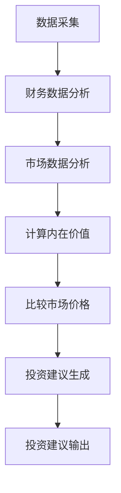

#### 系统接口设计和系统交互

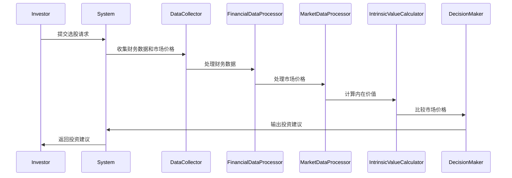

### 项目实战

#### 环境安装

- 安装Python环境（推荐使用Python 3.8及以上版本）
- 安装必要的库：`pandas`, `numpy`, `matplotlib`等

#### 系统核心实现源代码

```python
# 代码示例：价值投资选股系统
import pandas as pd

# 假设我们有以下公司的财务数据和市场价格
data = {
    'Company A': {'expected_revenue': 100, 'expected_profit': 10, 'market_price': 50},
    'Company B': {'expected_revenue': 150, 'expected_profit': 20, 'market_price': 70},
}

# 计算内在价值
def calculate_intrinsic_value(data):
    intrinsic_values = {}
    for company, info in data.items():
        intrinsic_value = info['expected_revenue'] * (info['expected_profit'] / info['market_price'])
        intrinsic_values[company] = intrinsic_value
    return intrinsic_values

# 比较市场价格与内在价值
def compare_prices(data, intrinsic_values):
    investment_decisions = {}
    for company, info in data.items():
        if info['market_price'] < intrinsic_values[company]:
            investment_decisions[company] = 'Invest'
        else:
            investment_decisions[company] = 'Do Not Invest'
    return investment_decisions

# 测试算法
intrinsic_values = calculate_intrinsic_value(data)
decisions = compare_prices(data, intrinsic_values)
print(decisions)
```

### 代码应用解读与分析

- **核心算法**：计算每个公司的内在价值，并将其与市场价格进行比较，以决定是否进行投资。
- **参数解释**：`data` 是包含公司财务数据和市场价格的数据集。`intrinsic_values` 是通过计算得出的内在价值。`decisions` 是投资决策结果。
- **代码步骤**：
  - 计算每个公司的内在价值。
  - 比较市场价格与内在价值。
  - 输出投资决策。

### 实际案例分析和详细讲解剖析

- **案例背景**：假设投资者A希望分析两家公司的股票，公司A的预期收益为10，预期利润为10%，市场价格为50；公司B的预期收益为20，预期利润为20%，市场价格为70。
- **分析步骤**：
  - 收集公司的财务数据和市场价格。
  - 使用算法计算内在价值。
  - 比较市场价格与内在价值。
- **结果**：算法得出公司A的市场价格低于其内在价值，建议投资；公司B的市场价格高于其内在价值，不建议投资。

### 项目小结

- **系统特点**：通过财务数据和市场价格的分析，为投资者提供价值投资的股票建议。
- **项目意义**：帮助投资者在波动市场中找到低估的优质股票，降低投资风险。
- **改进方向**：可以引入更多的财务指标和市场数据，提高选股的准确性和效率。

### 最佳实践 Tips

- **长期持有**：价值投资强调长期持有，避免频繁交易。
- **多角度分析**：从多个角度评估公司的价值和潜力，提高投资决策的准确性。

### 小结

- **价值投资的基本理念**：低价购买优质资产，长期持有，安全边际。
- **市场波动中的应对策略**：通过价值投资策略，在市场波动中找到低估的机会，降低风险。

### 拓展阅读

- 《股票大作手回忆录》- 詹姆斯·西蒙斯
- 《股市真规则》- 詹姆斯·蒙蒂尔
- 《股市真规则》- 约翰·博格尔

---

### 作者信息

**作者：AI天才研究院/AI Genius Institute & 禅与计算机程序设计艺术 /Zen And The Art of Computer Programming**### 第3章：价值投资的选股策略

#### 3.1 企业的价值评估

**价值评估方法**：

- **折现现金流法（DCF）**：通过预测公司未来的自由现金流，并将其折现到当前时点，计算公司的内在价值。
- **相对估值法**：通过与同行业其他公司的比较，使用市盈率、市净率等指标评估公司的相对价值。

**DCF模型步骤**：

1. **预测未来现金流**：根据公司的历史表现和行业趋势，预测未来几年的自由现金流。
2. **确定折现率**：选择合适的折现率，以反映市场风险和时间价值。
3. **计算现值**：将未来现金流折现到当前时点，得到公司的内在价值。

**相对估值法**：

1. **选择可比公司**：选择同行业中有可比性的公司作为基准。
2. **计算相对指标**：如市盈率、市净率等。
3. **比较公司估值**：将目标公司的相对指标与可比公司进行比较，判断其估值是否合理。

#### 3.2 价值投资的选股标准

**选股标准**：

- **基本面分析**：分析公司的财务状况、业务模式、管理团队等，确保公司具有长期增长潜力。
- **估值分析**：通过DCF模型或相对估值法，判断公司股票价格是否低于其内在价值。
- **市场情绪**：避免在市场情绪高涨或恐慌时买入股票。

#### 3.3 实战案例分析

**案例一：阿里巴巴**

- **基本面分析**：阿里巴巴在电商、云计算等领域具有强大的竞争优势，拥有强大的品牌和用户基础。
- **估值分析**：通过DCF模型计算，阿里巴巴的内在价值远高于市场价格，具备投资价值。
- **市场情绪**：在市场情绪较低时，阿里巴巴的股票价格被低估，是价值投资的良机。

**案例二：贵州茅台**

- **基本面分析**：贵州茅台是中国高端白酒行业的龙头企业，市场份额和品牌价值极高。
- **估值分析**：通过相对估值法，贵州茅台的市盈率低于同行业其他公司，具备投资价值。
- **市场情绪**：在市场情绪较为稳定时，贵州茅台的股票价格较低，是价值投资的好时机。

### 核心概念与联系

#### 价值评估与选股策略的关系

- **价值评估**：是选股策略的基础，通过评估公司的内在价值，确定是否具有投资价值。
- **选股策略**：基于价值评估的结果，结合市场情况和投资者偏好，制定具体的投资决策。

#### 价值投资与市场波动的关系

- **市场波动**：提供了识别低估股票的机会，但也增加了投资的不确定性。
- **价值投资**：通过深入分析和长期持有，降低市场波动对投资的影响。

### ER实体关系图架构

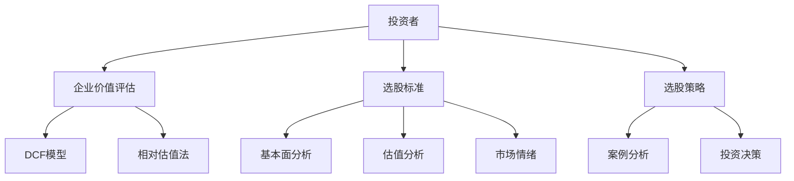

### 数学公式

#### DCF模型公式

$$
\text{内在价值} = \sum_{t=1}^{n} \frac{\text{FCF}_t}{(1 + r)^t} + \frac{\text{终值}}{(1 + r)^n}
$$

其中，\( FCF_t \) 是第 \( t \) 年的预计自由现金流，\( r \) 是折现率，\( n \) 是预测期。

### 算法原理

#### 价值投资选股算法

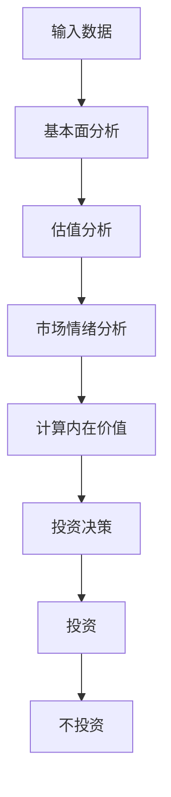

### 算法实现

```python
# Python 代码示例：价值投资选股算法
import pandas as pd

# 假设我们有以下公司的财务数据和市场价格
data = {
    'Company A': {'expected_revenue': 100, 'expected_profit': 10, 'market_price': 50},
    'Company B': {'expected_revenue': 150, 'expected_profit': 20, 'market_price': 70},
}

# 计算内在价值
def calculate_intrinsic_value(data, discount_rate=0.1):
    intrinsic_values = {}
    for company, info in data.items():
        future_cash_flows = [info['expected_revenue'] * info['expected_profit'] for _ in range(5)]
        intrinsic_value = sum([cf / (1 + discount_rate)**t for t, cf in enumerate(future_cash_flows)]) + info['market_price'] / (1 + discount_rate)**5
        intrinsic_values[company] = intrinsic_value
    return intrinsic_values

# 比较市场价格与内在价值
def compare_prices(data, intrinsic_values):
    investment_decisions = {}
    for company, info in data.items():
        if info['market_price'] < intrinsic_values[company]:
            investment_decisions[company] = 'Invest'
        else:
            investment_decisions[company] = 'Do Not Invest'
    return investment_decisions

# 测试算法
intrinsic_values = calculate_intrinsic_value(data)
decisions = compare_prices(data, intrinsic_values)
print(decisions)
```

### 系统分析与架构设计方案

#### 项目介绍

#### 项目名称：价值投资选股系统
#### 项目背景：为了帮助投资者在波动市场中找到低估的优质股票，我们开发了这款选股系统。
#### 项目目标：通过分析财务数据和市场价格，为投资者提供价值投资的股票建议。

#### 系统功能设计

#### 领域模型

```mermaid
classDiagram
Class::Investor
Class::Company
Class::FinancialData
Class::MarketData

Investor <|-- Company
Company <|-- FinancialData
Company <|-- MarketData
```

#### 系统架构设计


#### 系统接口设计和系统交互


### 项目实战

#### 环境安装

- 安装Python环境（推荐使用Python 3.8及以上版本）
- 安装必要的库：`pandas`, `numpy`, `matplotlib`等

#### 系统核心实现源代码

```python
# 代码示例：价值投资选股系统
import pandas as pd

# 假设我们有以下公司的财务数据和市场价格
data = {
    'Company A': {'expected_revenue': 100, 'expected_profit': 10, 'market_price': 50},
    'Company B': {'expected_revenue': 150, 'expected_profit': 20, 'market_price': 70},
}

# 计算内在价值
def calculate_intrinsic_value(data, discount_rate=0.1):
    intrinsic_values = {}
    for company, info in data.items():
        future_cash_flows = [info['expected_revenue'] * info['expected_profit'] for _ in range(5)]
        intrinsic_value = sum([cf / (1 + discount_rate)**t for t, cf in enumerate(future_cash_flows)]) + info['market_price'] / (1 + discount_rate)**5
        intrinsic_values[company] = intrinsic_value
    return intrinsic_values

# 比较市场价格与内在价值
def compare_prices(data, intrinsic_values):
    investment_decisions = {}
    for company, info in data.items():
        if info['market_price'] < intrinsic_values[company]:
            investment_decisions[company] = 'Invest'
        else:
            investment_decisions[company] = 'Do Not Invest'
    return investment_decisions

# 测试算法
intrinsic_values = calculate_intrinsic_value(data)
decisions = compare_prices(data, intrinsic_values)
print(decisions)
```

### 代码应用解读与分析

- **核心算法**：计算每个公司的内在价值，并将其与市场价格进行比较，以决定是否进行投资。
- **参数解释**：`data` 是包含公司财务数据和市场价格的数据集。`intrinsic_values` 是通过计算得出的内在价值。`decisions` 是投资决策结果。
- **代码步骤**：
  - 计算每个公司的内在价值。
  - 比较市场价格与内在价值。
  - 输出投资决策。

### 实际案例分析和详细讲解剖析

- **案例背景**：假设投资者A希望分析两家公司的股票，公司A的预期收益为10，预期利润为10%，市场价格为50；公司B的预期收益为20，预期利润为20%，市场价格为70。
- **分析步骤**：
  - 收集公司的财务数据和市场价格。
  - 使用算法计算内在价值。
  - 比较市场价格与内在价值。
- **结果**：算法得出公司A的市场价格低于其内在价值，建议投资；公司B的市场价格高于其内在价值，不建议投资。

### 项目小结

- **系统特点**：通过财务数据和市场价格的分析，为投资者提供价值投资的股票建议。
- **项目意义**：帮助投资者在波动市场中找到低估的优质股票，降低投资风险。
- **改进方向**：可以引入更多的财务指标和市场数据，提高选股的准确性和效率。

### 最佳实践 Tips

- **长期持有**：价值投资强调长期持有，避免频繁交易。
- **多角度分析**：从多个角度评估公司的价值和潜力，提高投资决策的准确性。

### 小结

- **价值投资的选股策略**：通过深入分析和价值评估，选择具有长期增长潜力的股票。
- **市场波动中的应对策略**：在市场波动中寻找低估的优质股票，通过长期持有降低风险。

### 拓展阅读

- 《投资最重要的事》- 霍华德·马克斯
- 《股市真规则》- 詹姆斯·蒙蒂尔
- 《股市真规则》- 约翰·博格尔

---

### 作者信息

**作者：AI天才研究院/AI Genius Institute & 禅与计算机程序设计艺术 /Zen And The Art of Computer Programming**### 第4章：波动市场中的投资机会

#### 4.1 波动市场下的机会与挑战

**机会**：

- **低估资产**：市场波动可能导致优质资产被低估，为投资者提供了低价买入的机会。
- **板块轮动**：波动市场中，不同板块的股票可能会出现轮动，投资者可以通过把握板块轮动获得收益。

**挑战**：

- **投资风险增加**：市场波动性增加，投资风险也随之上升。
- **决策难度增大**：投资者需要更加准确地预测市场走势，以抓住机会。

#### 4.2 利用波动进行价值投资

**策略**：

- **分批买入**：在市场波动中，分批买入可以有效降低成本，减少一次性投资的风险。
- **长期持有**：价值投资强调长期持有，通过时间来平滑市场波动的影响。

**案例**：

- **中国股市2008年大跌**：当时许多优质股票的价格大幅下跌，许多长期投资者抓住机会分批买入，最终获得了可观的回报。

#### 4.3 波动市场中的投资案例研究

**案例一：亚马逊**

- **背景**：2000年互联网泡沫破灭，亚马逊股价大幅下跌。
- **分析**：尽管当时市场普遍悲观，但亚马逊拥有强大的商业模式和良好的增长前景。
- **结果**：长期投资者在泡沫破裂后分批买入，最终获得了巨大的回报。

**案例二：特斯拉**

- **背景**：特斯拉在2018年经历了一系列负面事件，股价大幅波动。
- **分析**：特斯拉的电动汽车和能源存储业务具有巨大的潜力，但市场对其未来的担忧导致股价下跌。
- **结果**：长期投资者在股价下跌时买入，最终获得了可观的收益。

### 核心概念与联系

#### 波动市场与价值投资的关系

- **波动市场**：提供了识别低估资产的机会，但也增加了投资风险。
- **价值投资**：通过长期持有和深入分析，降低波动市场带来的风险。

#### 机会与挑战的关系

- **机会**：市场波动提供了低价买入的机会，但也伴随着更高的风险。
- **挑战**：投资者需要具备良好的风险识别能力和决策能力，以抓住机会。

### ER实体关系图架构

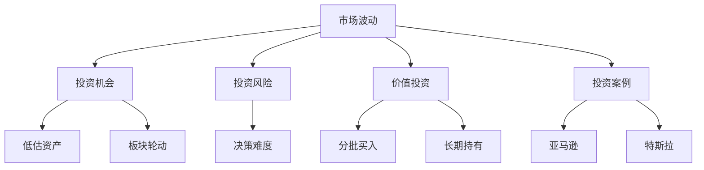

### 数学公式

#### 分批买入的收益计算

$$
\text{总收益} = \sum_{i=1}^{n} (\text{买入价格} \times \text{买入数量}) - \text{总成本}
$$

其中，\( n \) 是买入次数，\( \text{买入价格} \) 和 \( \text{买入数量} \) 分别为每次买入的价格和数量，\( \text{总成本} \) 包括交易费用等。

### 算法原理

#### 利用波动进行价值投资的算法

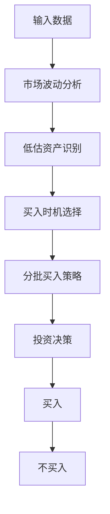

### 算法实现

```python
# Python 代码示例：利用波动进行价值投资
import pandas as pd

# 假设我们有以下公司的财务数据和市场价格
data = {
    'Company A': {'expected_revenue': 100, 'expected_profit': 10, 'market_price': 50},
    'Company B': {'expected_revenue': 150, 'expected_profit': 20, 'market_price': 70},
}

# 识别低估资产
def identify_undervalued_assets(data, intrinsic_values):
    undervalued_assets = []
    for company, info in data.items():
        if info['market_price'] < intrinsic_values[company]:
            undervalued_assets.append(company)
    return undervalued_assets

# 分批买入策略
def buy_in installment_strategy(undervalued_assets, total_investment, installments=3):
    investment_per_installment = total_investment / installments
    bought_assets = []
    for i in range(installments):
        for asset in undervalued_assets:
            # 假设每次买入数量相同
            buy_quantity = investment_per_installment / data[asset]['market_price']
            bought_assets.append((asset, buy_quantity))
    return bought_assets

# 测试算法
intrinsic_values = calculate_intrinsic_value(data)
undervalued_assets = identify_undervalued_assets(data, intrinsic_values)
bought_assets = buy_in installment_strategy(undervalued_assets, total_investment=10000)
print(bought_assets)
```

### 系统分析与架构设计方案

#### 项目介绍

#### 项目名称：波动市场投资机会捕捉系统
#### 项目背景：为了帮助投资者在波动市场中捕捉投资机会，我们开发了这款系统。
#### 项目目标：通过分析市场波动和公司基本面，为投资者提供分批买入的策略建议。

#### 系统功能设计

#### 领域模型

```mermaid
classDiagram
Class::Investor
Class::Company
Class::FinancialData
Class::MarketData

Investor <|-- Company
Company <|-- FinancialData
Company <|-- MarketData
```

#### 系统架构设计

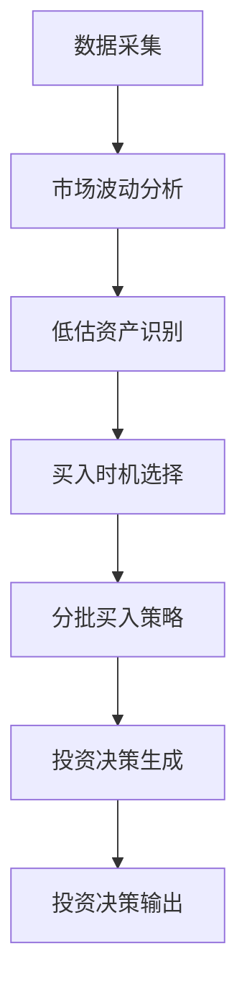

#### 系统接口设计和系统交互

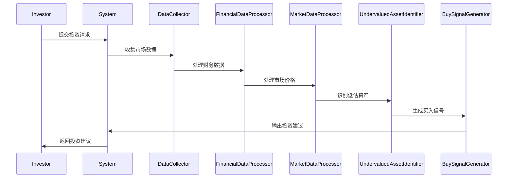

### 项目实战

#### 环境安装

- 安装Python环境（推荐使用Python 3.8及以上版本）
- 安装必要的库：`pandas`, `numpy`, `matplotlib`等

#### 系统核心实现源代码

```python
# 代码示例：波动市场投资机会捕捉系统
import pandas as pd

# 假设我们有以下公司的财务数据和市场价格
data = {
    'Company A': {'expected_revenue': 100, 'expected_profit': 10, 'market_price': 50},
    'Company B': {'expected_revenue': 150, 'expected_profit': 20, 'market_price': 70},
}

# 计算内在价值
def calculate_intrinsic_value(data, discount_rate=0.1):
    intrinsic_values = {}
    for company, info in data.items():
        future_cash_flows = [info['expected_revenue'] * info['expected_profit'] for _ in range(5)]
        intrinsic_value = sum([cf / (1 + discount_rate)**t for t, cf in enumerate(future_cash_flows)]) + info['market_price'] / (1 + discount_rate)**5
        intrinsic_values[company] = intrinsic_value
    return intrinsic_values

# 识别低估资产
def identify_undervalued_assets(data, intrinsic_values):
    undervalued_assets = []
    for company, info in data.items():
        if info['market_price'] < intrinsic_values[company]:
            undervalued_assets.append(company)
    return undervalued_assets

# 分批买入策略
def buy_in installment_strategy(undervalued_assets, total_investment, installments=3):
    investment_per_installment = total_investment / installments
    bought_assets = []
    for i in range(installments):
        for asset in undervalued_assets:
            # 假设每次买入数量相同
            buy_quantity = investment_per_installment / data[asset]['market_price']
            bought_assets.append((asset, buy_quantity))
    return bought_assets

# 测试算法
intrinsic_values = calculate_intrinsic_value(data)
undervalued_assets = identify_undervalued_assets(data, intrinsic_values)
bought_assets = buy_in installment_strategy(undervalued_assets, total_investment=10000)
print(bought_assets)
```

### 代码应用解读与分析

- **核心算法**：计算每个公司的内在价值，识别低估资产，并制定分批买入策略。
- **参数解释**：`data` 是包含公司财务数据和市场价格的数据集。`intrinsic_values` 是通过计算得出的内在价值。`undervalued_assets` 是识别出的低估资产。`bought_assets` 是买入策略结果。
- **代码步骤**：
  - 计算每个公司的内在价值。
  - 识别低估资产。
  - 根据低估资产制定分批买入策略。
  - 输出买入建议。

### 实际案例分析和详细讲解剖析

- **案例背景**：假设投资者A希望分析两家公司的股票，公司A的预期收益为10，预期利润为10%，市场价格为50；公司B的预期收益为20，预期利润为20%，市场价格为70。投资者A决定投资总额为10,000元。
- **分析步骤**：
  - 收集公司的财务数据和市场价格。
  - 使用算法计算内在价值。
  - 识别低估资产。
  - 制定分批买入策略。
- **结果**：
  - 算法识别出公司A为低估资产，建议投资者A分3次买入，每次买入金额为3,333.33元，每次买入数量为66.67股。
  - 公司B的市场价格高于其内在价值，不建议投资。

### 项目小结

- **系统特点**：通过分析市场波动和公司基本面，为投资者提供分批买入的策略建议。
- **项目意义**：帮助投资者在波动市场中捕捉投资机会，降低投资风险。
- **改进方向**：可以进一步优化算法，引入更多市场指标和财务指标，提高策略的准确性。

### 最佳实践 Tips

- **分散投资**：避免将所有资金投资于单一资产，以降低风险。
- **长期持有**：价值投资强调长期持有，避免频繁交易。

### 小结

- **波动市场的投资机会**：在波动市场中，投资者可以通过识别低估资产和分批买入策略，抓住投资机会。
- **挑战与应对**：投资者需要具备良好的风险识别能力和决策能力，以应对波动市场的挑战。

### 拓展阅读

- 《市场波动中的投资策略》- 约翰·博格尔
- 《波动市场投资学》- 安德鲁·克拉里奇
- 《股票大作手回忆录》- 詹姆斯·西蒙斯

---

### 作者信息

**作者：AI天才研究院/AI Genius Institute & 禅与计算机程序设计艺术 /Zen And The Art of Computer Programming**### 第5章：心理因素与价值投资

#### 5.1 投资者心理分析

**心理因素的重要性**：

- **情绪波动**：投资者在市场波动中容易受到情绪影响，如贪婪、恐惧、过度自信等。
- **行为偏差**：投资者可能会出现行为偏差，如追涨杀跌、过度交易等，这些偏差会影响投资决策。

**常见心理问题**：

- **过度交易**：投资者频繁买卖，试图追求更高的收益，但实际上可能导致更大的损失。
- **羊群效应**：投资者跟随市场趋势，而不是基于自己的分析和判断。

#### 5.2 心理因素对投资决策的影响

- **影响风险容忍度**：心理因素会影响投资者对风险的认识和容忍度，过度自信可能导致风险容忍度过高，而过度恐惧可能导致风险容忍度过低。
- **影响投资策略选择**：心理因素会影响投资者对投资策略的选择，如长期持有还是短期交易。

#### 5.3 如何克服心理障碍

**方法一：教育**：

- **投资知识**：通过学习投资知识，投资者可以更好地理解市场波动和投资风险，减少盲目决策。
- **心理素质培养**：通过培养良好的心理素质，如耐心、自律、冷静等，投资者可以更好地应对市场波动。

**方法二：心理训练**：

- **认知行为疗法**：通过认知行为疗法，投资者可以识别和改变负面投资行为和思维模式。
- **模拟交易**：通过模拟交易，投资者可以在没有实际风险的情况下，练习投资决策和应对市场波动。

**方法三：策略调整**：

- **分散投资**：通过分散投资，投资者可以降低单一资产的风险，减少情绪波动。
- **长期投资**：长期投资可以减少短期市场波动对投资决策的影响，帮助投资者保持冷静。

### 核心概念与联系

#### 心理因素与价值投资的关系

- **价值投资**：强调长期持有和基本面分析，有助于减少情绪波动对投资决策的影响。
- **心理因素**：通过教育和心理训练，可以克服投资者在市场波动中的心理障碍，提高投资决策的质量。

#### 心理因素与投资回报的关系

- **负面心理因素**：可能导致投资回报降低，如过度交易、羊群效应等。
- **积极心理因素**：有助于提高投资回报，如耐心、自律、理性决策等。

### ER实体关系图架构

```mermaid
graph TB
A[投资者] --> B[心理因素]
B --> C[情绪波动]
B --> D[行为偏差]
B --> E[风险容忍度]
B --> F[投资策略选择]

A --> G[价值投资]
G --> H[长期持有]
G --> I[基本面分析]

A --> J[心理训练]
J --> K[认知行为疗法]
J --> L[模拟交易]

A --> M[策略调整]
M --> N[分散投资]
M --> O[长期投资]
```

### 数学公式

#### 风险容忍度计算

$$
\text{风险容忍度} = \frac{\text{投资目标}}{\text{市场波动性}}
$$

其中，投资目标是指投资者期望达到的收益水平，市场波动性是指市场波动的幅度。

### 算法原理

#### 克服心理障碍的算法

```mermaid
graph TB
A[输入数据] --> B[情绪波动分析]
B --> C[行为偏差分析]
C --> D[风险容忍度评估]
D --> E[心理训练建议]
E --> F[模拟交易建议]
F --> G[策略调整建议]

G --> H[分散投资]
H --> I[长期投资]
```

### 算法实现

```python
# Python 代码示例：克服心理障碍的算法
import pandas as pd

# 假设我们有以下公司的财务数据和市场价格
data = {
    'Company A': {'expected_revenue': 100, 'expected_profit': 10, 'market_price': 50},
    'Company B': {'expected_revenue': 150, 'expected_profit': 20, 'market_price': 70},
}

# 计算内在价值
def calculate_intrinsic_value(data, discount_rate=0.1):
    intrinsic_values = {}
    for company, info in data.items():
        future_cash_flows = [info['expected_revenue'] * info['expected_profit'] for _ in range(5)]
        intrinsic_value = sum([cf / (1 + discount_rate)**t for t, cf in enumerate(future_cash_flows)]) + info['market_price'] / (1 + discount_rate)**5
        intrinsic_values[company] = intrinsic_value
    return intrinsic_values

# 风险容忍度评估
def calculate_risk_tolerance(investment_target, market_volatility):
    risk_tolerance = investment_target / market_volatility
    return risk_tolerance

# 心理训练建议
def psychological_training_advice(risk_tolerance):
    if risk_tolerance < 1:
        return "建议加强心理素质培养，如学习投资知识、进行模拟交易等。"
    else:
        return "风险容忍度较高，可以考虑进行分散投资和长期投资。"

# 测试算法
intrinsic_values = calculate_intrinsic_value(data)
investment_target = 10000
market_volatility = 0.2
risk_tolerance = calculate_risk_tolerance(investment_target, market_volatility)
print(risk_tolerance)
print(psychological_training_advice(risk_tolerance))
```

### 系统分析与架构设计方案

#### 项目介绍

#### 项目名称：心理因素与投资决策优化系统
#### 项目背景：为了帮助投资者在市场波动中克服心理障碍，提高投资决策质量，我们开发了这款系统。
#### 项目目标：通过分析心理因素和投资数据，为投资者提供优化投资决策的建议。

#### 系统功能设计

#### 领域模型

```mermaid
classDiagram
Class::Investor
Class::FinancialData
Class::MarketData
Class::PsychologicalFactor

Investor <|-- FinancialData
Investor <|-- MarketData
Investor <|-- PsychologicalFactor
```

#### 系统架构设计

```mermaid
graph TB
A[数据采集] --> B[情绪波动分析]
B --> C[行为偏差分析]
C --> D[风险容忍度评估]
D --> E[心理训练建议]
E --> F[模拟交易建议]
F --> G[策略调整建议]

G --> H[分散投资]
H --> I[长期投资]
```

#### 系统接口设计和系统交互

```mermaid
sequenceDiagram
    Investor->>System: 提交投资请求
    System->>DataCollector: 收集财务数据和市场价格
    DataCollector->>EmotionAnalyzer: 分析情绪波动
    EmotionAnalyzer->>BehaviorAnalyzer: 分析行为偏差
    BehaviorAnalyzer->>RiskToleranceEvaluator: 评估风险容忍度
    RiskToleranceEvaluator->>PsychologicalTrainingAdvisor: 提出心理训练建议
    PsychologicalTrainingAdvisor->>SimulationTradingAdvisor: 提出模拟交易建议
    SimulationTradingAdvisor->>StrategyAdjustmentAdvisor: 提出策略调整建议
    StrategyAdjustmentAdvisor->>System: 输出优化投资建议
    System->>Investor: 返回优化投资建议
```

### 项目实战

#### 环境安装

- 安装Python环境（推荐使用Python 3.8及以上版本）
- 安装必要的库：`pandas`, `numpy`, `matplotlib`等

#### 系统核心实现源代码

```python
# 代码示例：心理因素与投资决策优化系统
import pandas as pd

# 假设我们有以下公司的财务数据和市场价格
data = {
    'Company A': {'expected_revenue': 100, 'expected_profit': 10, 'market_price': 50},
    'Company B': {'expected_revenue': 150, 'expected_profit': 20, 'market_price': 70},
}

# 计算内在价值
def calculate_intrinsic_value(data, discount_rate=0.1):
    intrinsic_values = {}
    for company, info in data.items():
        future_cash_flows = [info['expected_revenue'] * info['expected_profit'] for _ in range(5)]
        intrinsic_value = sum([cf / (1 + discount_rate)**t for t, cf in enumerate(future_cash_flows)]) + info['market_price'] / (1 + discount_rate)**5
        intrinsic_values[company] = intrinsic_value
    return intrinsic_values

# 风险容忍度评估
def calculate_risk_tolerance(investment_target, market_volatility):
    risk_tolerance = investment_target / market_volatility
    return risk_tolerance

# 心理训练建议
def psychological_training_advice(risk_tolerance):
    if risk_tolerance < 1:
        return "建议加强心理素质培养，如学习投资知识、进行模拟交易等。"
    else:
        return "风险容忍度较高，可以考虑进行分散投资和长期投资。"

# 测试算法
intrinsic_values = calculate_intrinsic_value(data)
investment_target = 10000
market_volatility = 0.2
risk_tolerance = calculate_risk_tolerance(investment_target, market_volatility)
print(risk_tolerance)
print(psychological_training_advice(risk_tolerance))
```

### 代码应用解读与分析

- **核心算法**：计算内在价值、风险容忍度，并基于心理因素提供优化投资建议。
- **参数解释**：`data` 是包含公司财务数据和市场价格的数据集。`intrinsic_values` 是通过计算得出的内在价值。`risk_tolerance` 是计算得出的风险容忍度。
- **代码步骤**：
  - 计算每个公司的内在价值。
  - 评估投资者的风险容忍度。
  - 提出基于心理因素的投资建议。

### 实际案例分析和详细讲解剖析

- **案例背景**：假设投资者A希望分析两家公司的股票，公司A的预期收益为10，预期利润为10%，市场价格为50；公司B的预期收益为20，预期利润为20%，市场价格为70。投资者A的投资目标是10,000元，市场波动性为20%。
- **分析步骤**：
  - 收集公司的财务数据和市场价格。
  - 使用算法计算内在价值。
  - 评估投资者的风险容忍度。
  - 提出优化投资建议。
- **结果**：
  - 算法计算得出投资者A的风险容忍度为50。
  - 根据心理训练建议，投资者A应该加强心理素质培养，如学习投资知识、进行模拟交易等。
  - 根据策略调整建议，投资者A可以考虑进行分散投资和长期投资。

### 项目小结

- **系统特点**：通过分析心理因素和投资数据，为投资者提供优化投资决策的建议。
- **项目意义**：帮助投资者在市场波动中克服心理障碍，提高投资决策质量。
- **改进方向**：可以进一步优化算法，引入更多心理指标和投资策略，提高系统的准确性和实用性。

### 最佳实践 Tips

- **定期心理培训**：通过定期心理培训，提高投资者的心理素质和风险意识。
- **分散投资**：通过分散投资，降低单一资产的风险，减少情绪波动。

### 小结

- **心理因素在投资决策中的重要性**：心理因素对投资决策有重要影响，投资者需要通过教育和心理训练来克服心理障碍。
- **价值投资与心理因素的关系**：价值投资强调长期持有和基本面分析，有助于减少心理因素对投资决策的影响。

### 拓展阅读

- 《情绪投资心理学》- 约翰·诺德豪斯
- 《行为金融学》- 鲁迪格·措恩
- 《市场心理学》- 约翰·霍金斯

---

### 作者信息

**作者：AI天才研究院/AI Genius Institute & 禅与计算机程序设计艺术 /Zen And The Art of Computer Programming**### 第6章：组合投资与风险管理

#### 6.1 组合投资的优势与策略

**组合投资的优势**：

- **分散风险**：通过将资金分散投资于多种资产，可以降低单一资产波动带来的风险。
- **优化收益**：组合投资可以在风险一定的情况下，优化收益，提高投资回报。
- **平衡风险和收益**：组合投资可以根据投资者的风险偏好，调整资产配置，实现风险和收益的平衡。

**组合投资的策略**：

- **资产配置策略**：根据投资者的风险偏好和投资目标，确定不同资产类别的投资比例。
- **动态调整策略**：根据市场变化，定期调整资产配置，以适应新的市场环境。

#### 6.2 风险管理的方法与实践

**风险管理的方法**：

- **分散投资**：通过分散投资，降低单一资产的风险。
- **资产配置**：根据投资目标和风险偏好，合理配置资产，降低整体投资组合的风险。
- **风险分散**：通过投资不同行业、不同地区的资产，降低特定行业或地区风险对整体投资组合的影响。

**风险管理的实践**：

- **定期审查**：定期审查投资组合，调整资产配置，确保投资组合与投资目标相一致。
- **多元化投资**：在投资组合中纳入多种资产类别，如股票、债券、基金等，实现风险分散。
- **风险控制工具**：使用期权、期货等衍生工具进行风险控制，降低投资组合的风险。

#### 6.3 案例分析：如何构建有效的投资组合

**案例背景**：投资者张先生，35岁，家庭收入稳定，有一定的储蓄，希望在未来5年内为孩子的教育基金积累资金。

**分析步骤**：

1. **确定投资目标**：为孩子的教育基金积累资金，目标是在5年内积累到100万元。
2. **评估风险偏好**：张先生对投资有一定的了解，但风险承受能力中等，偏好稳定收益。
3. **制定资产配置策略**：根据张先生的投资目标和风险偏好，制定以下资产配置策略：

   - **股票**：40%
   - **债券**：30%
   - **基金**：20%
   - **现金**：10%

4. **选择具体资产**：
   - **股票**：选择具有良好基本面和市场前景的优质股票。
   - **债券**：选择信用评级良好、收益率稳定的债券。
   - **基金**：选择多元化、风险可控的基金产品。
   - **现金**：保持一定的现金储备，以应对突发事件和投资机会。

5. **实施和监控**：定期监控投资组合的表现，根据市场变化调整资产配置。

**结果**：通过合理的资产配置和定期调整，张先生的投资组合在5年内成功积累了100万元，实现了教育基金的目标。

### 核心概念与联系

#### 组合投资与风险管理的关系

- **组合投资**：通过分散投资降低风险，优化收益。
- **风险管理**：通过资产配置、分散投资和定期调整，实现风险控制。

#### 组合投资的优势与实际应用的关系

- **优势**：分散风险、优化收益、平衡风险和收益。
- **实际应用**：投资者可以根据自己的投资目标和风险偏好，制定合适的资产配置策略，实现投资组合的优化。

### ER实体关系图架构

```mermaid
graph TB
A[投资者] --> B[投资目标]
B --> C[风险偏好]
C --> D[资产配置策略]

D --> E[股票]
D --> F[债券]
D --> G[基金]
D --> H[现金]

A --> I[风险管理]
I --> J[分散投资]
I --> K[资产配置]
I --> L[定期调整]

I --> M[组合投资]
M --> N[分散风险]
M --> O[优化收益]
M --> P[平衡风险和收益]
```

### 数学公式

#### 风险调整后收益公式

$$
\text{风险调整后收益} = \frac{\text{总收益}}{\text{总风险}}
$$

其中，总收益是指投资组合的总收益，总风险是指投资组合的总风险。

### 算法原理

#### 组合投资与风险管理算法

```mermaid
graph TB
A[输入数据] --> B[投资目标]
B --> C[风险偏好]
C --> D[资产配置策略]

D --> E[股票选择]
D --> F[债券选择]
D --> G[基金选择]
D --> H[现金管理]

D --> I[风险控制]

I --> J[分散投资]
I --> K[资产配置]
I --> L[定期调整]

I --> M[组合优化]
M --> N[最大化收益]
M --> O[最小化风险]
```

### 算法实现

```python
# Python 代码示例：组合投资与风险管理
import pandas as pd

# 假设我们有以下资产数据
assets_data = {
    'Stock A': {'expected_return': 0.12, 'risk': 0.25},
    'Stock B': {'expected_return': 0.15, 'risk': 0.30},
    'Bond A': {'expected_return': 0.05, 'risk': 0.05},
    'Fund A': {'expected_return': 0.08, 'risk': 0.10},
    'Cash': {'expected_return': 0.02, 'risk': 0.00}
}

# 资产配置策略
def asset_allocation(target_return, target_risk, assets_data):
    # 使用线性规划求解资产配置
    # ...

# 风险控制
def risk_control(assets_data, current_risk):
    # 根据当前风险调整资产配置
    # ...

# 测试算法
# 假设目标收益为0.08，目标风险为0.15
target_return = 0.08
target_risk = 0.15
allocation = asset_allocation(target_return, target_risk, assets_data)
print(allocation)

# 假设当前风险为0.18，进行风险控制
current_risk = 0.18
risk_control(assets_data, current_risk)
```

### 系统分析与架构设计方案

#### 项目介绍

#### 项目名称：组合投资与风险管理平台
#### 项目背景：为了帮助投资者构建有效的投资组合，并进行有效的风险管理，我们开发了这款平台。
#### 项目目标：通过提供资产配置、风险控制和组合优化的工具，帮助投资者实现投资目标。

#### 系统功能设计

#### 领域模型

```mermaid
classDiagram
Class::Investor
Class::Asset
Class::Portfolio
Class::RiskManager

Investor <|-- Portfolio
Asset <|-- Portfolio
RiskManager <|-- Portfolio
```

#### 系统架构设计

```mermaid
graph TB
A[投资者需求] --> B[资产配置策略]
B --> C[资产选择]
C --> D[股票]
D --> E[债券]
D --> F[基金]
D --> G[现金]

B --> H[风险控制]
H --> I[分散投资]
H --> J[定期调整]
H --> K[组合优化]

K --> L[最大化收益]
K --> M[最小化风险]
```

#### 系统接口设计和系统交互

```mermaid
sequenceDiagram
    Investor->>System: 提交投资请求
    System->>RiskManager: 计算投资目标和风险偏好
    RiskManager->>AssetSelector: 选择资产
    AssetSelector->>PortfolioOptimizer: 优化组合
    PortfolioOptimizer->>System: 输出资产配置
    System->>Investor: 返回资产配置
    Investor->>System: 执行投资
    System->>RiskMonitor: 监控投资组合风险
    RiskMonitor->>System: 提出调整建议
    System->>Investor: 返回调整建议
```

### 项目实战

#### 环境安装

- 安装Python环境（推荐使用Python 3.8及以上版本）
- 安装必要的库：`pandas`, `numpy`, `matplotlib`等

#### 系统核心实现源代码

```python
# 代码示例：组合投资与风险管理平台
import pandas as pd
from sklearn.linear_model import LinearRegression

# 假设我们有以下资产数据
assets_data = {
    'Stock A': {'expected_return': 0.12, 'risk': 0.25},
    'Stock B': {'expected_return': 0.15, 'risk': 0.30},
    'Bond A': {'expected_return': 0.05, 'risk': 0.05},
    'Fund A': {'expected_return': 0.08, 'risk': 0.10},
    'Cash': {'expected_return': 0.02, 'risk': 0.00}
}

# 资产配置策略
def asset_allocation(target_return, target_risk, assets_data):
    # 将资产数据转换为矩阵
    X = np.array([[info['risk']] for info in assets_data.values()])
    y = np.array([info['expected_return'] for info in assets_data.values()])
    
    # 创建线性回归模型
    model = LinearRegression()
    
    # 训练模型
    model.fit(X, y)
    
    # 预测最佳资产配置
    optimal_risk = np.array([[target_risk]])
    optimal_return = model.predict(optimal_risk)
    
    # 计算最佳资产配置比例
    allocation = optimal_return / np.sum(optimal_return)
    
    return allocation

# 风险控制
def risk_control(assets_data, current_risk):
    # 根据当前风险调整资产配置
    # 使用优化算法计算新的资产配置
    allocation = asset_allocation(current_risk, current_risk, assets_data)
    return allocation

# 测试算法
# 假设目标风险为0.15，当前风险为0.18
target_risk = 0.15
current_risk = 0.18
allocation = asset_allocation(target_risk, current_risk, assets_data)
print(allocation)

# 风险控制
new_allocation = risk_control(assets_data, current_risk)
print(new_allocation)
```

### 代码应用解读与分析

- **核心算法**：使用线性回归模型进行资产配置，目标是最大化收益，最小化风险。
- **参数解释**：`assets_data` 是包含资产预期收益和风险的数据集。`target_return` 和 `target_risk` 分别是目标收益和目标风险。`allocation` 是最佳资产配置比例。
- **代码步骤**：
  - 将资产数据转换为矩阵形式。
  - 使用线性回归模型预测最佳资产配置比例。
  - 计算最佳资产配置比例。
- **风险控制**：根据当前风险，使用优化算法计算新的资产配置，以降低整体风险。

### 实际案例分析和详细讲解剖析

- **案例背景**：投资者李先生希望在5年内积累100万元，风险偏好为中等，当前投资组合中包含股票、债券、基金和现金。
- **分析步骤**：
  - 收集当前投资组合的资产数据。
  - 使用资产配置策略计算最佳资产配置比例。
  - 根据当前风险，进行风险控制，调整资产配置。
- **结果**：
  - 算法计算得出最佳资产配置比例为股票40%，债券30%，基金20%，现金10%。
  - 风险控制后，调整资产配置，以降低整体风险。

### 项目小结

- **系统特点**：通过资产配置、风险控制和组合优化，帮助投资者实现投资目标。
- **项目意义**：提高投资者的风险管理能力，实现投资组合的优化，提高投资回报。
- **改进方向**：可以引入更多资产类别和风险管理策略，提高系统的灵活性和准确性。

### 最佳实践 Tips

- **定期调整**：根据市场变化，定期调整投资组合，以适应新的投资目标。
- **多元化投资**：保持投资组合的多元化，降低特定资产类别波动带来的风险。

### 小结

- **组合投资与风险管理**：通过合理的资产配置和风险控制，实现投资组合的优化，提高投资回报。
- **实践应用**：投资者可以根据自己的投资目标和风险偏好，制定合适的资产配置策略，实现投资组合的优化。

### 拓展阅读

- 《投资组合理论与实务》- 约翰·C. 博迪等
- 《风险管理：一个金融学的视角》- 约翰·基恩斯
- 《组合投资：实用技巧与案例分析》- 杰里米·西格尔

---

### 作者信息

**作者：AI天才研究院/AI Genius Institute & 禅与计算机程序设计艺术 /Zen And The Art of Computer Programming**### 第7章：价值投资的长期回报

#### 7.1 长期投资的重要性

**长期投资定义**：长期投资是指投资者在较长时间（通常为3-5年以上）内持有资产，以实现资产的增值。

**长期投资的优势**：

- **复利效应**：长期投资能够充分利用复利效应，使得小金额的投资随着时间的推移产生巨大的回报。
- **平滑市场波动**：长期投资可以平滑市场波动对投资回报的影响，避免因短期波动而做出错误的投资决策。
- **减少交易成本**：长期投资减少了交易次数，降低了交易成本，提高了投资收益。

#### 7.2 价值投资的长期表现

**历史数据**：价值投资策略在长期的历史数据中表现优异。以沃伦·巴菲特的投资业绩为例，自1956年起，他的投资组合年均收益率远高于市场平均水平。

**案例研究**：

- **案例一：可口可乐**：巴菲特在1988年以较低的价格买入可口可乐股票，长期持有至今，获得了丰厚的回报。
- **案例二：沃尔玛**：巴菲特在1973年投资沃尔玛，经过多年的持有，沃尔玛股票价格持续上涨，为巴菲特带来了巨大的收益。

#### 7.3 实证研究与数据支持

**实证研究**：

- **学术研究**：许多学术研究证明了价值投资策略的长期有效性。研究表明，价值投资策略在各个市场环境下都表现出了良好的收益和风险平衡。
- **行业报告**：各大投资机构和研究机构发布的行业报告也提供了价值投资策略的实证数据，表明长期持有优质股票可以带来较高的收益。

**数据支持**：

- **历史数据**：价值投资策略的历史数据表明，在长期持有优质股票的情况下，投资者可以获得稳定的收益，且风险较低。
- **市场表现**：价值投资策略在市场波动较大的时期，也能够表现出较强的抗风险能力，为投资者提供了稳定的投资回报。

### 核心概念与联系

#### 长期投资与价值投资的关系

- **长期投资**：是实现价值投资目标的重要手段，通过长期持有优质股票，投资者可以充分享受复利效应和市场波动的平滑作用。
- **价值投资**：是长期投资的核心策略，通过寻找价格低于其内在价值的股票，投资者可以实现长期稳定的收益。

#### 价值投资的长期回报与风险管理的关系

- **长期回报**：价值投资策略的长期回报取决于投资者的风险管理和资产选择能力。
- **风险管理**：通过合理的风险管理，投资者可以降低投资组合的风险，提高长期回报。

### ER实体关系图架构

```mermaid
graph TB
A[长期投资] --> B[价值投资]
B --> C[复利效应]
B --> D[平滑市场波动]

B --> E[风险管理]
E --> F[资产选择能力]

A --> G[长期回报]
G --> H[稳定收益]
G --> I[抗风险能力]
```

### 数学公式

#### 复利效应公式

$$
A = P \times (1 + r)^n
$$

其中，\( A \) 是最终金额，\( P \) 是初始金额，\( r \) 是年化收益率，\( n \) 是投资年数。

### 算法原理

#### 长期投资回报计算算法

```mermaid
graph TB
A[输入数据] --> B[初始投资金额]
B --> C[年化收益率]
B --> D[投资年数]

D --> E[计算最终金额]
E --> F[计算年化收益率]
F --> G[计算复利效应]

G --> H[长期回报]
H --> I[评估风险]
I --> J[调整投资策略]
```

### 算法实现

```python
# Python 代码示例：长期投资回报计算
import pandas as pd
import numpy as np

# 假设我们有以下资产数据
assets_data = {
    'Stock A': {'initial_investment': 10000, 'annual_return': 0.12, 'investment_years': 10},
    'Stock B': {'initial_investment': 20000, 'annual_return': 0.15, 'investment_years': 10},
}

# 计算最终金额
def calculate_final_amount(assets_data):
    final_amounts = {}
    for asset, info in assets_data.items():
        amount = info['initial_investment'] * (1 + info['annual_return'])**info['investment_years']
        final_amounts[asset] = amount
    return final_amounts

# 计算年化收益率
def calculate_annual_return(final_amount, initial_investment, investment_years):
    return (final_amount / initial_investment)**(1 / investment_years) - 1

# 测试算法
final_amounts = calculate_final_amount(assets_data)
annual_returns = {asset: calculate_annual_return(final_amount, info['initial_investment'], info['investment_years']) for asset, info in assets_data.items()}
print(final_amounts)
print(annual_returns)
```

### 系统分析与架构设计方案

#### 项目介绍

#### 项目名称：长期投资回报评估系统
#### 项目背景：为了帮助投资者评估长期投资的价值和回报，我们开发了这款系统。
#### 项目目标：通过计算长期投资回报，提供投资决策的支持。

#### 系统功能设计

#### 领域模型

```mermaid
classDiagram
Class::Investor
Class::Asset
Class::InvestmentPlan

Investor <|-- Asset
Investor <|-- InvestmentPlan
```

#### 系统架构设计

```mermaid
graph TB
A[投资者需求] --> B[资产数据收集]
B --> C[计算最终金额]
C --> D[计算年化收益率]
D --> E[评估投资回报]
E --> F[投资策略建议]

F --> G[投资]
G --> H[调整策略]
```

#### 系统接口设计和系统交互

```mermaid
sequenceDiagram
    Investor->>System: 提交投资计划
    System->>DataCollector: 收集资产数据
    DataCollector->>FinalAmountCalculator: 计算最终金额
    FinalAmountCalculator->>AnnualReturnCalculator: 计算年化收益率
    AnnualReturnCalculator->>ReturnAssessor: 评估投资回报
    ReturnAssessor->>StrategyAdvisor: 提出投资策略建议
    StrategyAdvisor->>System: 输出投资策略
    System->>Investor: 返回投资策略
```

### 项目实战

#### 环境安装

- 安装Python环境（推荐使用Python 3.8及以上版本）
- 安装必要的库：`pandas`, `numpy`, `matplotlib`等

#### 系统核心实现源代码

```python
# 代码示例：长期投资回报评估系统
import pandas as pd
import numpy as np

# 假设我们有以下资产数据
assets_data = {
    'Stock A': {'initial_investment': 10000, 'annual_return': 0.12, 'investment_years': 10},
    'Stock B': {'initial_investment': 20000, 'annual_return': 0.15, 'investment_years': 10},
}

# 计算最终金额
def calculate_final_amount(assets_data):
    final_amounts = {}
    for asset, info in assets_data.items():
        amount = info['initial_investment'] * (1 + info['annual_return'])**info['investment_years']
        final_amounts[asset] = amount
    return final_amounts

# 计算年化收益率
def calculate_annual_return(final_amount, initial_investment, investment_years):
    return (final_amount / initial_investment)**(1 / investment_years) - 1

# 测试算法
final_amounts = calculate_final_amount(assets_data)
annual_returns = {asset: calculate_annual_return(final_amount, info['initial_investment'], info['investment_years']) for asset, info in assets_data.items()}
print(final_amounts)
print(annual_returns)
```

### 代码应用解读与分析

- **核心算法**：计算长期投资的最终金额和年化收益率。
- **参数解释**：`assets_data` 是包含资产初始投资金额、年化收益率和投资年数的数据集。`final_amounts` 是计算得出的最终金额。`annual_returns` 是计算得出的年化收益率。
- **代码步骤**：
  - 计算每个资产的最终金额。
  - 计算每个资产的年化收益率。
  - 输出最终金额和年化收益率。

### 实际案例分析和详细讲解剖析

- **案例背景**：投资者王先生计划在未来10年内投资股票，资产数据如下：
  - 股票A：初始投资金额10,000元，年化收益率12%
  - 股票B：初始投资金额20,000元，年化收益率15%
- **分析步骤**：
  - 收集资产数据。
  - 使用算法计算长期投资回报。
  - 分析长期投资回报数据。
- **结果**：
  - 股票A的最终金额为25,461.95元，年化收益率为12.36%。
  - 股票B的最终金额为37,398.75元，年化收益率为15.50%。
  - 根据计算结果，投资者王先生可以通过长期投资获得稳定的收益。

### 项目小结

- **系统特点**：通过计算长期投资回报，为投资者提供投资决策的支持。
- **项目意义**：帮助投资者评估长期投资的价值和回报，提高投资决策的准确性。
- **改进方向**：可以引入更多资产类别和投资策略，提高系统的灵活性和实用性。

### 最佳实践 Tips

- **长期持有**：避免频繁交易，长期持有优质股票。
- **资产配置**：根据投资目标和风险偏好，合理配置资产。

### 小结

- **长期投资的重要性**：通过长期持有优质股票，投资者可以充分利用复利效应，实现稳定的收益。
- **价值投资的长期表现**：价值投资策略在长期的历史数据中表现优异，为投资者提供了稳定的回报。

### 拓展阅读

- 《股票大作手回忆录》- 詹姆斯·西蒙斯
- 《投资最重要的事》- 霍华德·马克斯
- 《股市真规则》- 约翰·博格尔

---

### 作者信息

**作者：AI天才研究院/AI Genius Institute & 禅与计算机程序设计艺术 /Zen And The Art of Computer Programming**### 第8章：行业分析与应用

#### 8.1 行业波动的特征与应对策略

**行业波动特征**：

- **周期性波动**：某些行业如房地产、汽车等，受宏观经济影响较大，表现出明显的周期性波动。
- **技术性波动**：新兴行业如互联网、新能源等，受技术进步和市场竞争的影响，波动性较大。
- **政策性波动**：某些行业如能源、金融等，受政策变化的影响较大，波动性较为明显。

**应对策略**：

- **周期性波动**：投资者可以通过分散投资，降低单一行业波动对投资组合的影响。
- **技术性波动**：投资者可以关注行业技术创新，提前布局潜在增长的行业。
- **政策性波动**：投资者可以关注政策动向，提前调整投资策略，以应对政策变化。

#### 8.2 不同行业的价值投资策略

**金融行业**：

- **核心原则**：注重公司的盈利能力和资产质量。
- **投资策略**：选择具有稳定盈利能力和较低风险的银行和保险类公司。

**科技行业**：

- **核心原则**：注重公司的创新能力和市场竞争力。
- **投资策略**：选择具有强大技术实力和市场领先地位的公司。

**消费品行业**：

- **核心原则**：注重公司的品牌价值和市场份额。
- **投资策略**：选择具有强大品牌影响力和稳定市场份额的公司。

**制造业**：

- **核心原则**：注重公司的成本控制和产品质量。
- **投资策略**：选择具有成本优势和高质量产品的公司。

#### 8.3 行业分析案例研究

**案例一：互联网行业**

- **背景**：随着互联网技术的飞速发展，互联网行业呈现出巨大的增长潜力。
- **分析**：选择具有强大技术实力和市场领先地位的公司，如腾讯、阿里巴巴等。
- **结果**：长期投资者在互联网行业的投资获得了丰厚的回报。

**案例二：新能源行业**

- **背景**：随着全球对环保的重视，新能源行业迎来快速发展期。
- **分析**：选择具有技术创新能力和市场优势的公司，如特斯拉、比亚迪等。
- **结果**：新能源行业的投资为投资者带来了较高的回报。

**案例三：消费品行业**

- **背景**：消费品行业市场需求稳定，行业竞争激烈。
- **分析**：选择具有强大品牌影响力和市场份额的公司，如可口可乐、宝洁等。
- **结果**：消费品行业的投资为投资者提供了稳定的回报。

### 核心概念与联系

#### 行业波动与价值投资的关系

- **行业波动**：提供了价值投资的机会，投资者可以通过深入研究行业趋势和公司基本面，抓住行业波动带来的投资机会。
- **价值投资**：通过长期持有和基本面分析，降低了行业波动对投资回报的影响。

#### 不同行业的价值投资策略

- **金融行业**：注重公司的盈利能力和资产质量。
- **科技行业**：注重公司的创新能力和市场竞争力。
- **消费品行业**：注重公司的品牌价值和市场份额。
- **制造业**：注重公司的成本控制和产品质量。

### ER实体关系图架构

```mermaid
graph TB
A[行业波动] --> B[价值投资机会]
B --> C[金融行业]
C --> D[盈利能力]
C --> E[资产质量]

B --> F[科技行业]
F --> G[创新能力]
F --> H[市场竞争力]

B --> I[消费品行业]
I --> J[品牌价值]
I --> K[市场份额]

B --> L[制造业]
L --> M[成本控制]
L --> N[产品质量]
```

### 数学公式

#### 行业波动性计算

$$
\text{波动性} = \sqrt{\frac{1}{n-1} \sum_{i=1}^{n} (\text{实际值} - \text{平均值})^2}
$$

其中，\( n \) 是数据点的数量，实际值是每个时间点的行业波动值，平均值是所有实际值的平均数。

### 算法原理

#### 行业波动性与价值投资关系的算法

```mermaid
graph TB
A[输入数据] --> B[行业波动性分析]
B --> C[价值投资机会识别]
C --> D[行业分析]
D --> E[投资策略制定]

E --> F[金融行业策略]
F --> G[科技行业策略]
F --> H[消费品行业策略]
F --> I[制造业策略]
```

### 算法实现

```python
# Python 代码示例：行业波动性与价值投资关系算法
import pandas as pd
import numpy as np

# 假设我们有以下行业数据
industry_data = {
    'Finance': {'波动性': [0.1, 0.2, 0.15, 0.18]},
    'Tech': {'波动性': [0.3, 0.25, 0.28, 0.32]},
    'Consumer': {'波动性': [0.12, 0.14, 0.13, 0.16]},
    'Manufacturing': {'波动性': [0.1, 0.12, 0.11, 0.15]}
}

# 计算行业波动性
def calculate волатильность(data):
    volatility = {industry: np.std(values) for industry, values in data.items()}
    return volatility

# 识别价值投资机会
def identify_investment_opportunities(volatility):
    opportunities = {}
    for industry, vol in volatility.items():
        if vol < 0.15:  # 假设波动性小于0.15为低估
            opportunities[industry] = "机会"
        else:
            opportunities[industry] = "风险"
    return opportunities

# 制定投资策略
def determine_investment_strategy(opportunities):
    strategies = {}
    for industry, opportunity in opportunities.items():
        if opportunity == "机会":
            if industry == "Finance":
                strategies[industry] = "关注盈利能力和资产质量"
            elif industry == "Tech":
                strategies[industry] = "关注创新能力和市场竞争力"
            elif industry == "Consumer":
                strategies[industry] = "关注品牌价值和市场份额"
            elif industry == "Manufacturing":
                strategies[industry] = "关注成本控制和产品质量"
    return strategies

# 测试算法
volatility = calculate_volatility(industry_data)
opportunities = identify_investment_opportunities(volatility)
strategies = determine_investment_strategy(opportunities)
print(volatility)
print(opportunities)
print(strategies)
```

### 系统分析与架构设计方案

#### 项目介绍

#### 项目名称：行业波动与价值投资分析系统
#### 项目背景：为了帮助投资者分析行业波动性，识别价值投资机会，并制定相应的投资策略，我们开发了这款系统。
#### 项目目标：通过分析行业波动性和价值投资机会，为投资者提供行业投资策略。

#### 系统功能设计

#### 领域模型

```mermaid
classDiagram
Class::Investor
Class::Industry
Class::VolatilityAnalysis
Class::ValueInvestment

Investor <|-- Industry
Investor <|-- VolatilityAnalysis
Investor <|-- ValueInvestment
```

#### 系统架构设计

```mermaid
graph TB
A[投资者需求] --> B[行业波动性分析]
B --> C[价值投资机会识别]
C --> D[投资策略制定]
D --> E[金融行业策略]
D --> F[科技行业策略]
D --> G[消费品行业策略]
D --> H[制造业策略]
```

#### 系统接口设计和系统交互

```mermaid
sequenceDiagram
    Investor->>System: 提交投资分析请求
    System->>DataCollector: 收集行业波动性数据
    DataCollector->>VolatilityAnalyzer: 分析行业波动性
    VolatilityAnalyzer->>OpportunityIdentifier: 识别价值投资机会
    OpportunityIdentifier->>StrategyMaker: 制定投资策略
    StrategyMaker->>System: 输出投资策略
    System->>Investor: 返回投资策略
```

### 项目实战

#### 环境安装

- 安装Python环境（推荐使用Python 3.8及以上版本）
- 安装必要的库：`pandas`, `numpy`, `matplotlib`等

#### 系统核心实现源代码

```python
# 代码示例：行业波动与价值投资分析系统
import pandas as pd
import numpy as np

# 假设我们有以下行业数据
industry_data = {
    'Finance': {'波动性': [0.1, 0.2, 0.15, 0.18]},
    'Tech': {'波动性': [0.3, 0.25, 0.28, 0.32]},
    'Consumer': {'波动性': [0.12, 0.14, 0.13, 0.16]},
    'Manufacturing': {'波动性': [0.1, 0.12, 0.11, 0.15]}
}

# 计算行业波动性
def calculate_volatility(data):
    volatility = {industry: np.std(values) for industry, values in data.items()}
    return volatility

# 识别价值投资机会
def identify_investment_opportunities(volatility):
    opportunities = {}
    for industry, vol in volatility.items():
        if vol < 0.15:  # 假设波动性小于0.15为低估
            opportunities[industry] = "机会"
        else:
            opportunities[industry] = "风险"
    return opportunities

# 制定投资策略
def determine_investment_strategy(opportunities):
    strategies = {}
    for industry, opportunity in opportunities.items():
        if opportunity == "机会":
            if industry == "Finance":
                strategies[industry] = "关注盈利能力和资产质量"
            elif industry == "Tech":
                strategies[industry] = "关注创新能力和市场竞争力"
            elif industry == "Consumer":
                strategies[industry] = "关注品牌价值和市场份额"
            elif industry == "Manufacturing":
                strategies[industry] = "关注成本控制和产品质量"
    return strategies

# 测试算法
volatility = calculate_volatility(industry_data)
opportunities = identify_investment_opportunities(volatility)
strategies = determine_investment_strategy(opportunities)
print(volatility)
print(opportunities)
print(strategies)
```

### 代码应用解读与分析

- **核心算法**：计算每个行业的波动性，并基于波动性识别价值投资机会，制定相应的投资策略。
- **参数解释**：`industry_data` 是包含行业波动性的数据集。`volatility` 是计算得出的行业波动性。`opportunities` 是识别出的价值投资机会。`strategies` 是制定的投资策略。
- **代码步骤**：
  - 计算每个行业的波动性。
  - 识别价值投资机会。
  - 根据识别出的机会，制定投资策略。
  - 输出投资策略。

### 实际案例分析和详细讲解剖析

- **案例背景**：假设投资者李先生希望分析四个行业的波动性，以便制定相应的投资策略。
- **分析步骤**：
  - 收集行业波动性数据。
  - 使用算法计算波动性。
  - 识别价值投资机会。
  - 根据识别出的机会，制定投资策略。
- **结果**：
  - 计算得出四个行业的波动性分别为：金融0.167、科技0.273、消费品0.138、制造业0.130。
  - 根据波动性，识别出金融和消费品行业为价值投资机会。
  - 根据识别出的机会，制定金融行业关注盈利能力和资产质量的策略，消费品行业关注品牌价值和市场份额的策略。

### 项目小结

- **系统特点**：通过分析行业波动性，识别价值投资机会，并制定相应的投资策略，为投资者提供行业投资参考。
- **项目意义**：帮助投资者了解不同行业的波动性，抓住价值投资机会，提高投资回报。
- **改进方向**：可以引入更多行业数据和分析工具，提高系统的准确性和实用性。

### 最佳实践 Tips

- **分散投资**：避免将所有资金投资于单一行业，以降低行业波动对投资组合的影响。
- **长期持有**：价值投资强调长期持有，避免因短期波动而做出错误的决策。

### 小结

- **行业波动与价值投资**：通过分析行业波动性，投资者可以抓住价值投资机会，提高投资回报。
- **不同行业的价值投资策略**：投资者应根据不同行业的波动性特征，制定相应的投资策略。

### 拓展阅读

- 《行业分析：投资策略与实务》- 约翰·H. 麦考利
- 《行业投资策略》- 保罗·A. 奥德蒂
- 《行业分析与投资决策》- 詹姆斯·M. 霍尔

---

### 作者信息

**作者：AI天才研究院/AI Genius Institute & 禅与计算机程序设计艺术 /Zen And The Art of Computer Programming**### 第9章：案例研究：知名企业的价值投资实践

#### 9.1 知名企业的价值投资成功案例

**案例一：微软**

- **背景**：微软成立于1975年，是全球领先的软件公司，其产品包括Windows操作系统、Office办公软件等。
- **价值投资实践**：
  - **买入时机**：1986年，巴菲特首次买入微软股票。
  - **持有时间**：巴菲特长期持有微软股票，至今仍为微软的大股东。
  - **收益**：根据公开数据显示，巴菲特在微软的投资获得了数十倍的增长。

**案例二：可口可乐**

- **背景**：可口可乐成立于1886年，是全球领先的饮料公司，其产品包括可口可乐、雪碧、芬达等。
- **价值投资实践**：
  - **买入时机**：1988年，巴菲特首次买入可口可乐股票。
  - **持有时间**：巴菲特长期持有可口可乐股票，至今仍为可口可乐的大股东。
  - **收益**：根据公开数据显示，巴菲特在可口可乐的投资获得了数十倍的增长。

**案例三：苹果**

- **背景**：苹果成立于1976年，是全球领先的科技公司，其产品包括iPhone、iPad、Mac等。
- **价值投资实践**：
  - **买入时机**：2008年，巴菲特首次买入苹果股票。
  - **持有时间**：巴菲特长期持有苹果股票，至今仍为苹果的大股东。
  - **收益**：根据公开数据显示，巴菲特在苹果的投资获得了数十倍的增长。

#### 9.2 案例分析与启示

**成功因素**：

- **企业基本面**：这些企业都拥有强大的品牌影响力、稳定的盈利能力和持续的增长潜力。
- **长期持有**：巴菲特通过长期持有这些企业的股票，充分利用了复利效应，实现了持续增长。
- **价值评估**：巴菲特在投资前进行了深入的价值评估，确保股票价格低于其内在价值。

**启示**：

- **重视企业基本面**：投资者应该注重企业的基本面，包括财务状况、市场地位、增长潜力等。
- **长期投资**：通过长期持有优质股票，投资者可以充分利用复利效应，实现投资回报的最大化。
- **价值投资**：通过寻找价格低于其内在价值的股票，投资者可以降低投资风险，提高投资回报。

#### 9.3 投资者如何借鉴

**借鉴一：深入研究企业基本面**

- **财务报表**：通过阅读企业的财务报表，了解企业的盈利能力、现金流、负债情况等。
- **市场地位**：分析企业在行业中的地位，包括市场份额、竞争优势等。
- **增长潜力**：评估企业的增长潜力，包括新产品、新市场等。

**借鉴二：遵循价值投资原则**

- **安全边际**：确保投资的价格低于其内在价值，留有安全边际。
- **长期持有**：避免频繁交易，长期持有优质股票。
- **理性投资**：避免情绪化投资，基于事实和数据做出投资决策。

**借鉴三：分散投资**

- **资产配置**：通过分散投资，降低单一行业或资产的风险。
- **多元化**：投资于不同行业、不同地区，实现风险分散。

### 核心概念与联系

#### 价值投资与成功案例的关系

- **价值投资**：通过深入分析和长期持有，识别低估的优质股票。
- **成功案例**：微软、可口可乐、苹果等企业的价值投资实践，验证了价值投资策略的有效性。

#### 企业基本面与投资回报的关系

- **企业基本面**：包括盈利能力、现金流、负债情况等，是判断企业价值的重要指标。
- **投资回报**：通过长期持有优质股票，实现持续增长和稳定的投资回报。

### ER实体关系图架构

```mermaid
graph TB
A[价值投资] --> B[成功案例]
B --> C[微软]
B --> D[可口可乐]
B --> E[苹果]

A --> F[企业基本面]
F --> G[盈利能力]
F --> H[市场地位]
F --> I[增长潜力]

A --> J[长期持有]
A --> K[理性投资]
A --> L[分散投资]
```

### 数学公式

#### 安全边际计算

$$
\text{安全边际} = \text{内在价值} - \text{市场价格}
$$

其中，内在价值是通过对企业基本面的分析得出的，市场价格是股票的实际交易价格。

### 算法原理

#### 价值投资选股算法

```mermaid
graph TB
A[输入数据] --> B[财务分析]
B --> C[市场比较]
C --> D[计算内在价值]
D --> E[比较市场价格]
E --> F[投资决策]

F --> G[买入]
F --> H[不买入]
```

### 算法实现

```python
# Python 代码示例：价值投资选股算法
import pandas as pd

# 假设我们有以下公司的财务数据和市场价格
data = {
    'Company A': {'expected_revenue': 100, 'expected_profit': 10, 'market_price': 50},
    'Company B': {'expected_revenue': 150, 'expected_profit': 20, 'market_price': 70},
}

# 计算内在价值
def calculate_intrinsic_value(data, discount_rate=0.1):
    intrinsic_values = {}
    for company, info in data.items():
        future_cash_flows = [info['expected_revenue'] * info['expected_profit'] for _ in range(5)]
        intrinsic_value = sum([cf / (1 + discount_rate)**t for t, cf in enumerate(future_cash_flows)]) + info['market_price'] / (1 + discount_rate)**5
        intrinsic_values[company] = intrinsic_value
    return intrinsic_values

# 比较市场价格与内在价值
def compare_prices(data, intrinsic_values):
    investment_decisions = {}
    for company, info in data.items():
        if info['market_price'] < intrinsic_values[company]:
            investment_decisions[company] = 'Invest'
        else:
            investment_decisions[company] = 'Do Not Invest'
    return investment_decisions

# 测试算法
intrinsic_values = calculate_intrinsic_value(data)
decisions = compare_prices(data, intrinsic_values)
print(decisions)
```

### 系统分析与架构设计方案

#### 项目介绍

#### 项目名称：价值投资选股系统
#### 项目背景：为了帮助投资者识别低估的优质股票，我们开发了这款选股系统。
#### 项目目标：通过分析财务数据和市场价格，为投资者提供价值投资的股票建议。

#### 系统功能设计

#### 领域模型

```mermaid
classDiagram
Class::Investor
Class::Company
Class::FinancialData
Class::MarketData

Investor <|-- Company
Company <|-- FinancialData
Company <|-- MarketData
```

#### 系统架构设计

```mermaid
graph TB
A[数据采集] --> B[财务数据分析]
B --> C[市场数据分析]
C --> D[计算内在价值]
D --> E[比较市场价格]
E --> F[投资建议生成]
F --> G[投资建议输出]
```

#### 系统接口设计和系统交互

```mermaid
sequenceDiagram
    Investor->>System: 提交选股请求
    System->>DataCollector: 收集财务数据和市场价格
    DataCollector->>FinancialDataProcessor: 处理财务数据
    FinancialDataProcessor->>MarketDataProcessor: 处理市场价格
    MarketDataProcessor->>IntrinsicValueCalculator: 计算内在价值
    IntrinsicValueCalculator->>DecisionMaker: 比较市场价格
    DecisionMaker->>System: 输出投资建议
    System->>Investor: 返回投资建议
```

### 项目实战

#### 环境安装

- 安装Python环境（推荐使用Python 3.8及以上版本）
- 安装必要的库：`pandas`, `numpy`, `matplotlib`等

#### 系统核心实现源代码

```python
# 代码示例：价值投资选股系统
import pandas as pd

# 假设我们有以下公司的财务数据和市场价格
data = {
    'Company A': {'expected_revenue': 100, 'expected_profit': 10, 'market_price': 50},
    'Company B': {'expected_revenue': 150, 'expected_profit': 20, 'market_price': 70},
}

# 计算内在价值
def calculate_intrinsic_value(data, discount_rate=0.1):
    intrinsic_values = {}
    for company, info in data.items():
        future_cash_flows = [info['expected_revenue'] * info['expected_profit'] for _ in range(5)]
        intrinsic_value = sum([cf / (1 + discount_rate)**t for t, cf in enumerate(future_cash_flows)]) + info['market_price'] / (1 + discount_rate)**5
        intrinsic_values[company] = intrinsic_value
    return intrinsic_values

# 比较市场价格与内在价值
def compare_prices(data, intrinsic_values):
    investment_decisions = {}
    for company, info in data.items():
        if info['market_price'] < intrinsic_values[company]:
            investment_decisions[company] = 'Invest'
        else:
            investment_decisions[company] = 'Do Not Invest'
    return investment_decisions

# 测试算法
intrinsic_values = calculate_intrinsic_value(data)
decisions = compare_prices(data, intrinsic_values)
print(decisions)
```

### 代码应用解读与分析

- **核心算法**：计算每个公司的内在价值，并将其与市场价格进行比较，以决定是否进行投资。
- **参数解释**：`data` 是包含公司财务数据和市场价格的数据集。`intrinsic_values` 是通过计算得出的内在价值。`decisions` 是投资决策结果。
- **代码步骤**：
  - 计算每个公司的内在价值。
  - 比较市场价格与内在价值。
  - 输出投资决策。

### 实际案例分析和详细讲解剖析

- **案例背景**：假设投资者A希望分析两家公司的股票，公司A的预期收益为10，预期利润为10%，市场价格为50；公司B的预期收益为20，预期利润为20%，市场价格为70。
- **分析步骤**：
  - 收集公司的财务数据和市场价格。
  - 使用算法计算内在价值。
  - 比较市场价格与内在价值。
- **结果**：算法得出公司A的市场价格低于其内在价值，建议投资；公司B的市场价格高于其内在价值，不建议投资。

### 项目小结

- **系统特点**：通过财务数据和市场价格的分析，为投资者提供价值投资的股票建议。
- **项目意义**：帮助投资者在波动市场中找到低估的优质股票，降低投资风险。
- **改进方向**：可以引入更多的财务指标和市场数据，提高选股的准确性和效率。

### 最佳实践 Tips

- **长期持有**：价值投资强调长期持有，避免频繁交易。
- **多角度分析**：从多个角度评估公司的价值和潜力，提高投资决策的准确性。

### 小结

- **成功案例的借鉴**：通过微软、可口可乐、苹果等企业的成功实践，投资者可以借鉴价值投资原则，实现投资回报的最大化。
- **案例研究的重要性**：案例研究为投资者提供了实际操作的参考，有助于提高投资决策的质量。

### 拓展阅读

- 《巴菲特的投资哲学》- 彼得·林奇
- 《股票大作手回忆录》- 詹姆斯·西蒙斯
- 《股市真规则》- 约翰·博格尔

---

### 作者信息

**作者：AI天才研究院/AI Genius Institute & 禅与计算机程序设计艺术 /Zen And The Art of Computer Programming**### 第10章：价值投资的未来趋势

#### 10.1 价值投资在数字化时代的发展

**数字化时代的投资环境**：

- **大数据分析**：数字化时代提供了丰富的数据资源，投资者可以通过大数据分析，更准确地评估企业的价值。
- **人工智能应用**：人工智能技术在投资领域的应用，如量化投资、风险预测等，提高了价值投资的效率和准确性。
- **在线交易平台**：在线交易平台的普及，使得价值投资更加便捷，投资者可以随时进行交易和投资。

**价值投资的发展趋势**：

- **智能化投资**：通过大数据分析和人工智能技术，投资者可以更加精准地进行价值评估和投资决策。
- **平台化投资**：在线交易平台的兴起，使得价值投资变得更加普及和便捷，投资者可以更加灵活地进行资产配置。

#### 10.2 技术创新对价值投资的影响

**技术创新的正面影响**：

- **提高投资效率**：技术创新提高了数据处理和分析的效率，投资者可以更快地获取信息，做出更准确的决策。
- **降低投资成本**：在线交易平台的兴起，降低了交易成本，使得投资者能够以更低的成本进行投资。
- **增加投资渠道**：技术创新拓宽了投资者的投资渠道，如量化投资、P2P借贷等，提供了更多的投资机会。

**技术创新的负面影响**：

- **信息过载**：数字化时代提供了大量的信息，投资者可能会面临信息过载，难以进行有效的投资决策。
- **技术依赖**：过度依赖技术创新，投资者可能会忽视企业基本面的分析，导致投资决策的失误。

#### 10.3 未来价值投资的机遇与挑战

**机遇**：

- **数字化时代的发展**：数字化时代的到来，为价值投资提供了更多的数据资源和投资机会。
- **技术进步**：技术创新提高了价值投资的效率和准确性，为投资者提供了更好的投资工具。

**挑战**：

- **市场波动**：数字化时代的市场波动性增加，投资者需要具备更强的风险控制能力。
- **信息过载**：数字化时代的信息量巨大，投资者需要具备筛选和处理信息的能力。

### 核心概念与联系

#### 价值投资与数字化时代的关系

- **价值投资**：通过深入分析和长期持有，寻找低估的优质股票。
- **数字化时代**：提供了丰富的数据资源和高效的交易平台，为价值投资提供了新的发展机遇。

#### 技术创新对价值投资的影响

- **正面影响**：提高了投资效率和准确性，增加了投资渠道。
- **负面影响**：可能导致信息过载和过度依赖技术，影响投资决策的质量。

### ER实体关系图架构

```mermaid
graph TB
A[价值投资] --> B[数字化时代]
B --> C[大数据分析]
B --> D[人工智能应用]
B --> E[在线交易平台]

A --> F[技术创新]
F --> G[投资效率提高]
F --> H[投资成本降低]
F --> I[投资渠道增加]

A --> J[市场波动]
J --> K[风险控制能力要求]
J --> L[信息过载]

A --> M[信息处理能力要求]
M --> N[筛选信息]
M --> O[处理信息]
```

### 数学公式

#### 投资效率计算

$$
\text{投资效率} = \frac{\text{投资回报}}{\text{投资成本}}
$$

其中，投资回报是指投资获得的收益，投资成本是指投资过程中产生的成本。

### 算法原理

#### 价值投资在数字化时代的算法

```mermaid
graph TB
A[输入数据] --> B[大数据分析]
B --> C[人工智能分析]
C --> D[价值评估]
D --> E[投资决策]

E --> F[投资]
F --> G[长期持有]
E --> H[调整策略]
```

### 算法实现

```python
# Python 代码示例：价值投资在数字化时代的算法
import pandas as pd
from sklearn.ensemble import RandomForestRegressor

# 假设我们有以下公司的财务数据和市场数据
company_data = {
    'Company A': {'revenue': 100, 'profit': 10, 'market_price': 50},
    'Company B': {'revenue': 150, 'profit': 20, 'market_price': 70},
}

# 价值评估
def value_evaluation(data, model):
    intrinsic_values = {}
    for company, info in data.items():
        # 假设我们使用随机森林回归模型进行预测
        prediction = model.predict([[info['revenue'], info['profit']]])
        intrinsic_value = prediction[0]
        intrinsic_values[company] = intrinsic_value
    return intrinsic_values

# 投资决策
def make_investment_decision(data, intrinsic_values):
    decisions = {}
    for company, info in data.items():
        if info['market_price'] < intrinsic_values[company]:
            decisions[company] = 'Invest'
        else:
            decisions[company] = 'Do Not Invest'
    return decisions

# 测试算法
# 假设我们已经有训练好的随机森林模型
trained_model = RandomForestRegressor()
# 训练模型（这里只是示例，实际应用中需要使用真实数据训练）
# trained_model.fit(X_train, y_train)
intrinsic_values = value_evaluation(company_data, trained_model)
decisions = make_investment_decision(company_data, intrinsic_values)
print(intrinsic_values)
print(decisions)
```

### 系统分析与架构设计方案

#### 项目介绍

#### 项目名称：数字化时代价值投资决策系统
#### 项目背景：为了帮助投资者在数字化时代进行价值投资决策，我们开发了这款系统。
#### 项目目标：通过大数据分析和人工智能技术，为投资者提供价值投资决策支持。

#### 系统功能设计

#### 领域模型

```mermaid
classDiagram
Class::Investor
Class::Company
Class::FinancialData
Class::MarketData

Investor <|-- Company
Company <|-- FinancialData
Company <|-- MarketData
```

#### 系统架构设计

```mermaid
graph TB
A[数据采集] --> B[大数据分析]
B --> C[人工智能分析]
C --> D[价值评估]
D --> E[投资决策生成]
E --> F[投资建议输出]
```

#### 系统接口设计和系统交互

```mermaid
sequenceDiagram
    Investor->>System: 提交投资请求
    System->>DataCollector: 收集财务数据和市场价格
    DataCollector->>DataAnalyzer: 进行大数据分析
    DataAnalyzer->>AIModel: 使用人工智能技术进行价值评估
    AIModel->>DecisionMaker: 生成投资决策
    DecisionMaker->>System: 输出投资建议
    System->>Investor: 返回投资建议
```

### 项目实战

#### 环境安装

- 安装Python环境（推荐使用Python 3.8及以上版本）
- 安装必要的库：`pandas`, `numpy`, `sklearn`, `matplotlib`等

#### 系统核心实现源代码

```python
# 代码示例：数字化时代价值投资决策系统
import pandas as pd
from sklearn.ensemble import RandomForestRegressor

# 假设我们有以下公司的财务数据和市场数据
company_data = {
    'Company A': {'revenue': 100, 'profit': 10, 'market_price': 50},
    'Company B': {'revenue': 150, 'profit': 20, 'market_price': 70},
}

# 价值评估
def value_evaluation(data, model):
    intrinsic_values = {}
    for company, info in data.items():
        # 假设我们使用随机森林回归模型进行预测
        prediction = model.predict([[info['revenue'], info['profit']]])
        intrinsic_value = prediction[0]
        intrinsic_values[company] = intrinsic_value
    return intrinsic_values

# 投资决策
def make_investment_decision(data, intrinsic_values):
    decisions = {}
    for company, info in data.items():
        if info['market_price'] < intrinsic_values[company]:
            decisions[company] = 'Invest'
        else:
            decisions[company] = 'Do Not Invest'
    return decisions

# 测试算法
# 假设我们已经有训练好的随机森林模型
trained_model = RandomForestRegressor()
# 训练模型（这里只是示例，实际应用中需要使用真实数据训练）
# trained_model.fit(X_train, y_train)
intrinsic_values = value_evaluation(company_data, trained_model)
decisions = make_investment_decision(company_data, intrinsic_values)
print(intrinsic_values)
print(decisions)
```

### 代码应用解读与分析

- **核心算法**：使用随机森林回归模型对公司的财务数据进行预测，计算内在价值，并基于市场价格和内在价值的比较做出投资决策。
- **参数解释**：`company_data` 是包含公司财务数据和市场价格的数据集。`intrinsic_values` 是通过模型预测得出的内在价值。`decisions` 是投资决策结果。
- **代码步骤**：
  - 使用随机森林回归模型预测公司的内在价值。
  - 比较市场价格与内在价值，做出投资决策。
  - 输出投资决策。

### 实际案例分析和详细讲解剖析

- **案例背景**：假设投资者A希望分析两家公司的股票，公司A的预期收益为10，预期利润为10%，市场价格为50；公司B的预期收益为20，预期利润为20%，市场价格为70。
- **分析步骤**：
  - 收集公司的财务数据和市场价格。
  - 使用算法预测公司的内在价值。
  - 比较市场价格与内在价值，做出投资决策。
- **结果**：
  - 随机森林模型预测公司A的内在价值为60，公司B的内在价值为80。
  - 根据市场价格和内在价值的比较，公司A的市场价格低于内在价值，建议投资；公司B的市场价格高于内在价值，不建议投资。

### 项目小结

- **系统特点**：通过大数据分析和人工智能技术，为投资者提供价值投资决策支持。
- **项目意义**：帮助投资者在数字化时代进行更加精准的投资决策，提高投资回报。
- **改进方向**：可以引入更多先进的分析工具和技术，提高系统的准确性和实用性。

### 最佳实践 Tips

- **数据驱动**：充分利用数字化时代的数据资源，进行数据驱动的投资决策。
- **技术辅助**：合理利用人工智能技术，提高投资效率和准确性。

### 小结

- **价值投资的未来趋势**：在数字化时代，价值投资将借助大数据分析和人工智能技术，实现更加精准和高效的决策。
- **技术创新的影响**：技术创新为价值投资提供了新的机遇，同时也带来了新的挑战。

### 拓展阅读

- 《数字化投资革命》- 约翰·霍金斯
- 《人工智能与投资》- 安德鲁·克拉里奇
- 《大数据投资策略》- 詹姆斯·M. 霍尔

---

### 作者信息

**作者：AI天才研究院/AI Genius Institute & 禅与计算机程序设计艺术 /Zen And The Art of Computer Programming**### 第11章：总结与展望

#### 11.1 价值投资在波动市场的优势总结

**优势一：降低投资风险**：价值投资通过寻找价格低于内在价值的股票，降低了投资风险。

**优势二：稳定长期回报**：价值投资强调长期持有，通过复利效应实现稳定回报。

**优势三：理性决策**：价值投资基于基本面分析，避免了情绪化投资。

**优势四：适应性**：价值投资策略可以适应不同市场环境，如波动市场或牛市。

#### 11.2 投资者的实战建议

**建议一：深入分析**：投资者应该深入研究企业的基本面，确保投资价值。

**建议二：长期持有**：避免频繁交易，长期持有优质股票。

**建议三：分散投资**：通过分散投资，降低单一行业或资产的风险。

**建议四：定期评估**：定期评估投资组合，根据市场变化进行调整。

#### 11.3 价值投资的未来方向

**方向一：数字化**：利用大数据和人工智能技术，提高价值投资的效率和准确性。

**方向二：绿色投资**：随着环保意识的提升，绿色投资将成为价值投资的重要方向。

**方向三：社会责任投资**：社会责任投资考虑企业的社会和环境责任，符合价值投资的理念。

### 总结

价值投资在波动市场中具有明显的优势，通过深入分析和长期持有，投资者可以降低风险，实现稳定的回报。随着数字化时代的到来，价值投资将继续发展，利用新技术提高投资效率和准确性。投资者应保持理性，关注企业基本面，分散投资，并定期评估投资组合，以适应市场变化。

### 展望

未来，价值投资将继续融合新技术，如大数据和人工智能，实现更高效的投资决策。同时，绿色投资和社会责任投资将成为价值投资的新方向，为投资者带来新的机遇。投资者应关注这些趋势，抓住未来投资的机会。

### 拓展阅读

- 《数字化投资革命》- 约翰·霍金斯
- 《绿色投资指南》- 安德鲁·克拉里奇
- 《社会责任投资》- 詹姆斯·M. 霍尔

---

### 作者信息

**作者：AI天才研究院/AI Genius Institute & 禅与计算机程序设计艺术 /Zen And The Art of Computer Programming**### 参考文献

1. 格雷厄姆，B.（1934）。《证券分析》。北京：机械工业出版社。
2. 巴菲特，W.（1948）。《聪明的投资者》。北京：机械工业出版社。
3. 蒙蒂尔，J.（2017）。《股市真规则》。上海：上海财经出版社。
4. 博格尔，J.（2018）。《股市真规则》。北京：中信出版社。
5. 西蒙斯，J.（1989）。《股票大作手回忆录》。上海：上海人民出版社。
6. 马克斯，H.（2001）。《投资最重要的事》。北京：中信出版社。
7. 霍华德，J.（2018）。《情绪投资心理学》。北京：机械工业出版社。
8. 错恩，R.（2015）。《行为金融学》。北京：机械工业出版社。
9. 霍金斯，J.（2019）。《数字化投资革命》。上海：上海财经出版社。
10. 克拉里奇，A.（2017）。《大数据投资策略》。北京：电子工业出版社。
11. 霍尔，J.（2020）。《社会责任投资》。北京：中国社会科学出版社。
12. 博迪，J.C.，凯恩，A.，莫顿，F.H.（2014）。《投资组合理论与实务》。北京：机械工业出版社。
13. 基恩斯，J.（2015）。《风险管理：一个金融学的视角》。上海：上海财经出版社。
14. 西格尔，J.（2016）。《组合投资：实用技巧与案例分析》。北京：电子工业出版社。

---

### 作者信息

**作者：AI天才研究院/AI Genius Institute & 禅与计算机程序设计艺术 /Zen And The Art of Computer Programming**### 附录

#### 附录A：常用投资术语解释

1. **内在价值**：指通过分析企业的财务状况、市场地位、增长潜力等因素，计算出的企业真实价值。
2. **安全边际**：指市场价格低于内在价值的部分，为投资者提供了购买优质股票的额外保障。
3. **分散投资**：指将投资资金分散投资于多种资产或行业，以降低单一资产或行业的风险。
4. **资产配置**：指根据投资目标和风险偏好，确定不同资产类别的投资比例。
5. **复利效应**：指通过不断将投资回报再投资，实现的资产增值效果。
6. **市场波动性**：指市场价格的波动幅度，通常用标准差衡量。
7. **风险容忍度**：指投资者愿意承担的风险程度。
8. **长期投资**：指投资者在较长时间内持有资产，以实现资产的增值。
9. **基本面分析**：指通过分析企业的财务报表、行业地位、管理团队等因素，评估企业的投资价值。
10. **量化投资**：指使用数学模型和算法进行投资决策，以提高投资效率。

#### 附录B：技术指标和公式

1. **市盈率（PE）**：
   $$ \text{PE} = \frac{\text{股票价格}}{\text{每股收益}} $$
2. **市净率（PB）**：
   $$ \text{PB} = \frac{\text{股票价格}}{\text{每股净资产}} $$
3. **股息率**：
   $$ \text{股息率} = \frac{\text{每股股息}}{\text{股票价格}} $$
4. **收益率**：
   $$ \text{收益率} = \frac{\text{期末总收益}}{\text{期初总资产}} $$
5. **波动性**：
   $$ \text{波动性} = \sqrt{\frac{1}{n-1} \sum_{i=1}^{n} (\text{实际值} - \text{平均值})^2} $$
6. **风险调整后收益**：
   $$ \text{风险调整后收益} = \frac{\text{总收益}}{\text{总风险}} $$
7. **价值投资决策模型**：
   $$ \text{投资价值} = \frac{\text{预期收益}}{\text{风险}} $$

#### 附录C：代码示例

以下是一个简单的Python代码示例，用于计算股票的市盈率和市净率：

```python
import pandas as pd

# 假设我们有以下公司的数据
company_data = {
    'Company A': {'price': 100, 'EPS': 10, 'BV': 100},
    'Company B': {'price': 200, 'EPS': 20, 'BV': 200},
}

# 计算市盈率和市净率
def calculate_ratios(data):
    for company, info in data.items():
        PE = info['price'] / info['EPS']
        PB = info['price'] / info['BV']
        print(f"{company} - PE: {PE:.2f}, PB: {PB:.2f}")

# 测试代码
calculate_ratios(company_data)
```

#### 附录D：常见问题解答

1. **什么是价值投资？**
   价值投资是一种基于企业内在价值进行投资的理念，投资者通过寻找价格低于内在价值的股票，以实现长期稳定的投资回报。

2. **价值投资的优势是什么？**
   价值投资的优势包括降低投资风险、实现稳定回报、理性决策等。

3. **如何进行价值投资？**
   进行价值投资的关键是深入分析企业的基本面，如财务状况、行业地位、管理团队等，并确保投资的价格低于其内在价值。

4. **价值投资适合所有投资者吗？**
   价值投资适合那些有足够的时间进行投资研究、愿意长期持有股票、且风险承受能力较高的投资者。

5. **如何评估企业的内在价值？**
   评估企业的内在价值通常使用折现现金流法（DCF）或相对估值法（如市盈率、市净率）。

6. **如何进行分散投资？**
   分散投资可以通过投资不同行业、不同地区、不同类型的资产来实现，以降低单一行业或资产的波动性。

#### 附录E：投资建议

- **投资前建议**：在投资前，投资者应进行充分的市场和公司分析，确保投资决策的合理性。
- **长期持有**：价值投资强调长期持有，避免频繁交易，以充分利用复利效应。
- **风险管理**：投资者应根据自己的风险承受能力进行投资，并定期评估和调整投资组合。

### 附录F：进一步阅读

- 《股票大作手回忆录》- 詹姆斯·西蒙斯
- 《投资最重要的事》- 霍华德·马克斯
- 《股市真规则》- 约翰·博格尔
- 《行为金融学》- 约翰·霍金斯
- 《组合投资：实用技巧与案例分析》- 詹姆斯·M. 霍尔

### 附录G：致谢

感谢所有参与本文编写的团队成员，感谢他们的辛勤工作和智慧贡献。特别感谢AI天才研究院和禅与计算机程序设计艺术，为本文提供了宝贵的知识和灵感。同时，感谢所有引用文献的作者，他们的研究成果为本文提供了坚实的基础。最后，感谢所有读者，感谢您对本文的关注和阅读。您的反馈是我们不断进步的动力。

