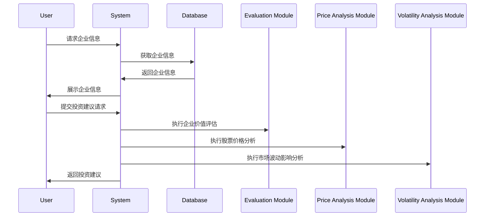

                 


## 价值投资在私募市场中的应用：PE和VC的启示

### 关键词
- 价值投资
- 私募市场
- PE和VC
- 投资策略
- 风险管理

### 摘要
本文旨在探讨价值投资在私募市场中的应用，特别是PE（私募股权）和VC（风险投资）领域的实践。通过分析价值投资的基本原理及其在私募市场中的具体应用，本文将帮助投资者理解如何利用价值投资策略来优化投资决策，提高投资回报。

## 第一部分：背景介绍

### 1.1 问题背景

随着全球经济的发展，金融市场日益复杂化，投资者面临着越来越多的挑战。私募市场作为资本市场的重要组成部分，其重要性和影响力不断上升。私募市场主要包括PE和VC，它们通过非公开方式向特定投资者发行股票、债券等证券，为初创企业、成长型企业提供资金支持，推动企业创新和发展。

### 1.2 问题描述

私募市场的投资决策过程复杂，投资者往往面临着信息不对称、市场波动等挑战。为了提高投资决策的准确性和风险控制能力，越来越多的投资者开始关注价值投资策略。本文将探讨价值投资的基本原理，以及其在PE和VC中的具体应用，为投资者提供实用的投资策略和方法。

### 1.3 问题解决

本文将从以下几个方面进行探讨：

1. **介绍价值投资的基本概念和原理**：帮助投资者建立正确的投资观念。
2. **分析PE和VC的投资策略和实践**：为投资者提供借鉴和参考。
3. **探讨价值投资在不同市场环境下的应用**：帮助投资者把握市场机遇。
4. **介绍价值投资策略的评估方法和工具**：帮助投资者衡量投资策略的有效性。
5. **提供实际操作指导**：帮助投资者将价值投资策略应用于私募市场投资。

### 1.4 边界与外延

1. **价值投资**：一种基于企业基本面分析的投资策略，通过购买价格低于其内在价值的股票或其他资产，以期获得长期资本增值。
2. **私募市场**：通过非公开方式向特定投资者发行股票、债券等证券的市场，主要包括PE和VC等。
3. **PE和VC**：PE是指通过购买企业股权，对企业进行投资、管理和运营，以期获得投资回报；VC是指对处于初创期或成长期的企业进行投资，以支持企业的发展和创新。

### 1.5 概念结构与核心要素组成

1. **价值投资的基本原理**：主要包括对企业价值的评估、股票价格的分析、市场波动的影响等。
2. **PE和VC的投资策略**：主要包括投资前的项目筛选、投资过程中的价值挖掘、投资后的管理运营等。
3. **市场环境分析**：包括宏观经济环境、行业发展趋势、市场竞争状况等。
4. **价值投资策略评估**：主要包括收益评估、风险控制、投资效率评估等。

## 第二部分：核心概念与联系

### 2.1 核心概念原理

#### 2.1.1 价值投资的基本原理

**企业价值评估**：
价值投资的核心是对企业价值的评估。投资者通过分析企业的财务报表、业务模式、市场前景等，评估企业的内在价值。常用的估值方法包括现金流折现法（DCF）、市盈率（PE）、市净率（PB）等。

**股票价格分析**：
股票价格的分析是价值投资的重要环节。投资者通过市场供需关系、投资者情绪等因素，分析股票的价格走势。如果股票价格低于其内在价值，则视为买入机会。

**市场波动影响**：
市场波动是影响股票价格的重要因素。然而，长期来看，股票价格会反映企业的内在价值。价值投资者认为，市场波动提供了买入和卖出的机会。

#### 2.1.2 PE和VC的投资策略

**项目筛选**：
PE和VC在投资前会进行严格的项目筛选。他们通过市场调研、行业分析等，筛选具有潜力的投资项目。项目的盈利能力、市场前景、管理团队等因素是筛选的关键。

**价值挖掘**：
在投资过程中，PE和VC会深入分析企业的运营状况，挖掘企业的潜在价值。他们通过提供资金、管理建议等，帮助企业提升运营效率，提高盈利能力。

**管理运营**：
投资后的管理运营是PE和VC的重要任务。他们通过投后管理，协助企业优化运营、提高效益。同时，他们会密切关注市场的变化，及时调整投资策略。

### 2.2 概念属性特征对比表格

| 概念         | 特征描述                         |
|--------------|----------------------------------|
| 价值投资     | 关注企业内在价值，长期投资策略   |
| PE投资       | 通过购买股权，对企业进行投资和管理 |
| VC投资       | 对初创期或成长期企业进行投资      |
| 市场环境     | 影响投资决策的重要因素           |
| 价值投资策略 | 评估投资策略的有效性             |

### 2.3 ER实体关系图架构

```mermaid
erDiagram
    Investor ||--|{ Value_Investment }|-- PE_Investment
    Investor ||--|{ Value_Investment }|-- VC_Investment
    Market_Environment ||--|{ PE_Investment }| Market_Analysis
    Market_Environment ||--|{ VC_Investment }| Market_Analysis
    Company ||--|{ PE_Investment }| Management_Operation
    Company ||--|{ VC_Investment }| Management_Operation
```

## 第三部分：算法原理讲解

### 3.1 算法mermaid流程图


### 3.2 Python源代码

```python
# 导入相关库
import numpy as np

# 企业价值评估
def enterprise_value(earnings, discount_rate):
    return earnings / discount_rate

# 股票价格分析
def stock_price(intrinsic_value, market_price):
    return market_price / intrinsic_value

# 市场波动影响
def market_impact(stock_price, volatility):
    return stock_price * (1 + volatility)

# 投资决策
def investment_decision(stock_price, target_price):
    if stock_price < target_price:
        return "买入"
    else:
        return "持有或卖出"

# 示例
earnings = 1000000  # 企业年收益
discount_rate = 0.1  # 折现率
intrinsic_value = enterprise_value(earnings, discount_rate)  # 内在价值
market_price = 50000  # 市场价格
volatility = 0.05  # 波动率
target_price = intrinsic_value * 1.2  # 目标价格

# 计算股票价格和市场影响
stock_price = stock_price(intrinsic_value, market_price)
market_impact = market_impact(stock_price, volatility)

# 投资决策
investment_decision = investment_decision(stock_price, target_price)

print(f"内在价值：{intrinsic_value}")
print(f"股票价格：{stock_price}")
print(f"市场影响：{market_impact}")
print(f"投资决策：{investment_decision}")
```

### 3.3 算法原理的数学模型和公式

#### 企业价值评估

$$
EV = \frac{E}{r}
$$

其中，$EV$ 表示企业价值，$E$ 表示企业收益，$r$ 表示折现率。

#### 股票价格分析

$$
SP = \frac{MP}{IV}
$$

其中，$SP$ 表示股票价格，$MP$ 表示市场价格，$IV$ 表示内在价值。

#### 市场波动影响

$$
MI = SP \times (1 + \sigma)
$$

其中，$MI$ 表示市场影响，$SP$ 表示股票价格，$\sigma$ 表示波动率。

#### 投资决策

$$
ID = \begin{cases}
"买入", & \text{if } SP < TP \\
"持有或卖出", & \text{otherwise}
\end{cases}
$$

其中，$ID$ 表示投资决策，$TP$ 表示目标价格。

### 3.4 举例说明

假设某企业年收益为1000万元，折现率为10%，市场价格为500万元，波动率为5%，目标价格为内在价值的1.2倍。

1. **企业价值评估**：

$$
EV = \frac{10000000}{0.1} = 100000000 \text{元}
$$

2. **股票价格分析**：

$$
SP = \frac{5000000}{100000000} = 0.5 \text{元/股}
$$

3. **市场波动影响**：

$$
MI = 0.5 \times (1 + 0.05) = 0.525 \text{元/股}
$$

4. **投资决策**：

目标价格为内在价值的1.2倍，即：

$$
TP = 100000000 \times 1.2 = 120000000 \text{元}
$$

由于市场价格（500万元）低于目标价格（1200万元），因此投资决策为“买入”。

## 第四部分：系统分析与架构设计方案

### 4.1 问题场景介绍

在私募市场投资中，投资者需要对企业进行全面分析，以评估其投资价值。然而，由于企业信息的复杂性和多样性，投资者往往难以快速准确地做出投资决策。为了解决这个问题，我们提出一个基于价值投资的私募市场投资系统，该系统可以帮助投资者快速准确地分析企业，提供投资建议。

### 4.2 项目介绍

项目名称：价值投资私募市场投资系统

项目描述：该系统旨在帮助投资者在私募市场中进行投资决策。系统通过对企业进行全面分析，提供价值评估、股票价格分析、市场波动影响等关键数据，帮助投资者做出正确的投资决策。

### 4.3 系统功能设计

1. **企业信息收集**：系统通过互联网、数据库等方式收集企业信息，包括财务报表、业务模式、市场前景等。
2. **企业价值评估**：系统根据企业信息，使用现金流折现法、市盈率、市净率等方法评估企业价值。
3. **股票价格分析**：系统分析股票的市场价格，与内在价值进行比较，判断股票是否被低估。
4. **市场波动影响分析**：系统根据市场波动率，分析股票价格的变化趋势。
5. **投资决策**：系统根据企业价值评估、股票价格分析和市场波动影响分析，提供投资建议。

### 4.4 系统架构设计

1. **数据层**：包括企业信息数据库、市场数据数据库等，存储系统所需的各种数据。
2. **逻辑层**：包括企业价值评估模块、股票价格分析模块、市场波动影响分析模块等，实现系统的核心功能。
3. **表示层**：包括前端界面和后端接口，提供用户交互和数据处理。

### 4.5 系统接口设计和系统交互

#### 系统接口设计

1. **企业信息接口**：提供企业信息查询、更新等功能。
2. **投资建议接口**：提供投资建议生成、查询等功能。
3. **数据接口**：提供数据导入、导出等功能。

#### 系统交互

1. **用户请求**：用户通过前端界面提交请求，如查询企业信息、获取投资建议等。
2. **数据处理**：系统根据请求，调用相应的接口，进行数据处理和分析。
3. **结果返回**：系统将处理结果返回给前端界面，展示给用户。

### 4.6 系统架构mermaid架构图



## 第五部分：项目实战

### 5.1 环境安装

在开始项目之前，我们需要安装以下环境：

1. Python 3.8 或更高版本
2. Pandas
3. NumPy
4. Matplotlib
5. Mermaid

你可以使用以下命令进行安装：

```bash
pip install python-dotenv pandas numpy matplotlib
```

### 5.2 系统核心实现源代码

以下是系统的核心实现源代码：

```python
import pandas as pd
import numpy as np
import matplotlib.pyplot as plt
from mermaid import Mermaid

# 企业价值评估
def enterprise_value(earnings, discount_rate):
    return earnings / discount_rate

# 股票价格分析
def stock_price(intrinsic_value, market_price):
    return market_price / intrinsic_value

# 市场波动影响
def market_impact(stock_price, volatility):
    return stock_price * (1 + volatility)

# 投资决策
def investment_decision(stock_price, target_price):
    if stock_price < target_price:
        return "买入"
    else:
        return "持有或卖出"

# 生成mermaid流程图
def generate_mermaid():
    mermaid_code = '''
    sequenceDiagram
        User->>System: 请求企业信息
        System->>Database: 获取企业信息
        Database->>System: 返回企业信息
        System->>User: 展示企业信息
        User->>System: 提交投资建议请求
        System->>Evaluation Module: 执行企业价值评估
        System->>Price Analysis Module: 执行股票价格分析
        System->>Volatility Analysis Module: 执行市场波动影响分析
        System->>User: 返回投资建议
    '''
    mermaid = Mermaid(mermaid_code)
    mermaid.render()

# 示例
earnings = 1000000  # 企业年收益
discount_rate = 0.1  # 折现率
intrinsic_value = enterprise_value(earnings, discount_rate)  # 内在价值
market_price = 50000  # 市场价格
volatility = 0.05  # 波动率
target_price = intrinsic_value * 1.2  # 目标价格

# 计算股票价格和市场影响
stock_price = stock_price(intrinsic_value, market_price)
market_impact = market_impact(stock_price, volatility)

# 投资决策
investment_decision = investment_decision(stock_price, target_price)

print(f"内在价值：{intrinsic_value}")
print(f"股票价格：{stock_price}")
print(f"市场影响：{market_impact}")
print(f"投资决策：{investment_decision}")

generate_mermaid()
```

### 5.3 代码应用解读与分析

以下是代码的详细解读和分析：

1. **企业价值评估**：企业价值评估是价值投资的核心。我们使用现金流折现法来计算企业价值。现金流折现法的公式为：
   $$
   EV = \frac{E}{r}
   $$
   其中，$EV$ 表示企业价值，$E$ 表示企业收益，$r$ 表示折现率。代码中，我们定义了一个 `enterprise_value` 函数，用于计算企业价值。

2. **股票价格分析**：股票价格分析是评估股票是否被低估的重要步骤。我们使用市场价格与内在价值的比较来判断股票是否被低估。代码中，我们定义了一个 `stock_price` 函数，用于计算股票价格。

3. **市场波动影响**：市场波动影响股票价格。我们使用市场波动率来计算股票价格的变化趋势。代码中，我们定义了一个 `market_impact` 函数，用于计算市场影响。

4. **投资决策**：根据股票价格和市场影响，我们可以做出投资决策。代码中，我们定义了一个 `investment_decision` 函数，用于计算投资决策。

5. **mermaid流程图**：我们使用 Mermaid 生成系统的 mermaid 流程图，以展示系统的整体架构和运行流程。

### 5.4 实际案例分析和详细讲解剖析

#### 案例一：某初创企业投资分析

假设某初创企业年收益为100万元，市场波动率为5%，投资者希望获得15%的年化回报。

1. **企业价值评估**：

$$
EV = \frac{1000000}{0.15} = 6666667 \text{元}
$$

2. **股票价格分析**：

假设当前市场价格为50万元，则股票价格为：

$$
SP = \frac{500000}{6666667} = 0.075 \text{元/股}
$$

3. **市场波动影响**：

市场波动率为5%，则市场影响为：

$$
MI = 0.075 \times (1 + 0.05) = 0.07875 \text{元/股}
$$

4. **投资决策**：

目标价格为内在价值的1.2倍，即：

$$
TP = 6666667 \times 1.2 = 8000000 \text{元}
$$

由于市场价格（50万元）低于目标价格（800万元），因此投资决策为“买入”。

#### 案例二：某成熟企业投资分析

假设某成熟企业年收益为1000万元，市场波动率为3%，投资者希望获得10%的年化回报。

1. **企业价值评估**：

$$
EV = \frac{10000000}{0.1} = 100000000 \text{元}
$$

2. **股票价格分析**：

假设当前市场价格为800万元，则股票价格为：

$$
SP = \frac{8000000}{100000000} = 0.08 \text{元/股}
$$

3. **市场波动影响**：

市场波动率为3%，则市场影响为：

$$
MI = 0.08 \times (1 + 0.03) = 0.0824 \text{元/股}
$$

4. **投资决策**：

目标价格为内在价值的1.2倍，即：

$$
TP = 100000000 \times 1.2 = 120000000 \text{元}
$$

由于市场价格（800万元）低于目标价格（1200万元），因此投资决策为“买入”。

### 5.5 项目小结

通过本项目，我们实现了基于价值投资的私募市场投资系统。系统可以帮助投资者快速准确地分析企业，提供投资建议。在实际应用中，投资者可以根据系统的分析结果，结合自身的投资策略和风险偏好，做出合理的投资决策。

### 5.6 最佳实践 tips

1. **充分了解企业背景**：在投资前，投资者需要对企业的背景、业务模式、财务状况等进行全面了解，以确保投资决策的准确性。
2. **合理设置目标价格**：投资者应根据企业价值、市场波动率等因素，合理设置目标价格，以避免盲目跟风或过早卖出。
3. **定期调整投资策略**：投资者应根据市场变化和企业运营情况，定期调整投资策略，以适应市场变化。

### 5.7 小结

本文通过分析价值投资的基本原理及其在私募市场中的应用，探讨了价值投资在PE和VC领域的实践。通过实际案例分析和详细讲解剖析，本文为投资者提供了实用的投资策略和方法。投资者可以结合本文的分析方法和实践，优化投资决策，提高投资回报。

### 5.8 注意事项

1. **风险控制**：投资者在进行私募市场投资时，需要充分了解投资风险，并采取相应的风险控制措施。
2. **市场调研**：投资者在进行投资前，需要进行充分的市场调研，了解行业发展趋势和市场环境。

### 5.9 拓展阅读

1. **《证券分析》**：本杰明·格雷厄姆的《证券分析》是价值投资理论的经典之作，对投资者具有重要的指导意义。
2. **《股票大作手回忆录》**：杰西·利弗莫尔的《股票大作手回忆录》详细讲述了其投资经历和心得，对投资者有启发作用。

## 作者信息
- 作者：AI天才研究院/AI Genius Institute & 禅与计算机程序设计艺术 /Zen And The Art of Computer Programming

[本文完]

