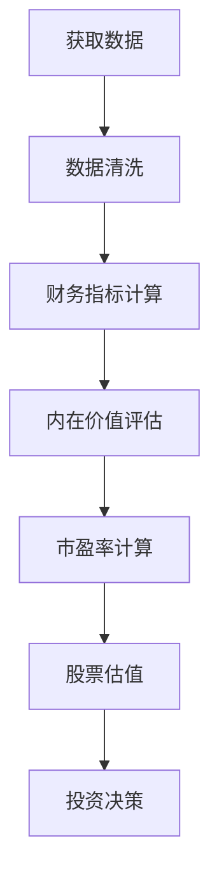
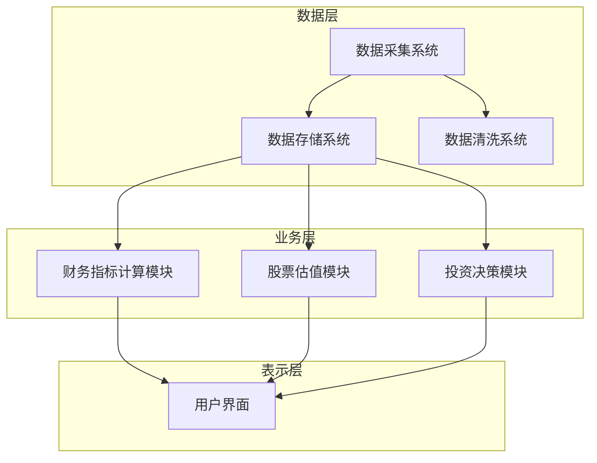
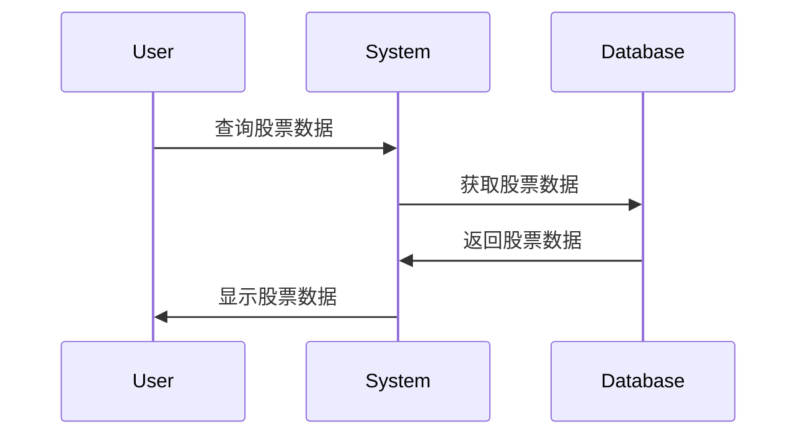

                 

# 价值投资在私募股权中的应用

## 关键词
私募股权，价值投资，投资策略，财务分析，市场波动

## 摘要
本文将深入探讨价值投资在私募股权领域的应用。通过定义价值投资的原则和私募股权的特点，分析其在不同阶段公司中的应用场景和面临的挑战，本文将阐述如何运用价值投资理念进行私募股权投资。同时，本文还将介绍核心概念和联系，详细讲解算法原理，并通过实例演示Python源代码实现，以期为投资者提供实用的指导。

## 第1章 价值投资在私募股权中的应用概述

### 1.1.1 价值投资的概念和原则

**价值投资的定义**：价值投资是一种投资策略，强调以低于企业真实价值的价格购买股票。它起源于20世纪30年代的美国，由本杰明·格雷厄姆等学者提出，并经过沃伦·巴菲特等大师的实践和推广，成为投资界的重要理论。

**核心原则**：

1. **长期视角**：价值投资者通常具有长期的视角，他们关注公司的长期表现而非短期市场波动。这种长期视角有助于他们避免市场情绪的影响，实现稳定的投资回报。

2. **基本面分析**：价值投资者会深入研究公司的财务状况、管理团队、行业前景等因素。通过基本面分析，他们能够更准确地评估公司的内在价值，从而做出更明智的投资决策。

3. **安全边际**：安全边际是指投资者购买股票的价格低于其内在价值的部分。价值投资者认为，只有当股票价格低于其内在价值时，才是一个好的投资机会。安全边际的存在可以降低投资风险，确保即使在市场波动的情况下，投资者仍能获得合理的回报。

### 1.1.2 私募股权的特点和机遇

**私募股权的定义**：私募股权是指非上市公司的股权投资，通常由专业投资机构或个人进行。与公开市场的股票投资相比，私募股权投资具有以下特点：

1. **灵活性**：私募股权投资可以更加灵活地适应特定行业和公司的发展需求。投资者可以与公司管理层密切合作，参与公司战略决策，推动公司的发展。

2. **风险和回报**：私募股权投资通常伴随着较高的风险，但潜在的回报也较高。由于私募股权投资通常涉及较长的投资周期，投资者需要有耐心和信心，以获取更高的回报。

### 1.1.3 价值投资在私募股权中的应用

**应用场景**：

1. **初创公司**：价值投资可以帮助投资者识别有潜力的初创公司，并在其成长期提供支持。通过提供资金和管理建议，投资者可以协助初创公司克服早期发展的困难，实现快速增长。

2. **成熟公司**：价值投资可以用于投资处于成熟期的公司，寻求价值重估的机会。在这种情况下，投资者可以通过改善公司治理、优化业务模式等方式，提高公司的内在价值，从而实现投资回报。

### 1.1.4 价值投资在私募股权中的挑战

**市场波动**：私募股权投资面临市场波动带来的风险。市场波动可能导致投资价值被低估，从而影响投资者的信心和决策。

**信息不对称**：投资者可能面临信息不对称的问题，需要深入研究公司情况和行业动态。信息不对称可能导致投资者无法准确评估公司的内在价值，从而影响投资决策。

## 第2章 价值投资在私募股权中的核心概念和联系

### 2.1.1 核心概念原理

**内在价值**：内在价值是指公司的实际价值，通常通过财务指标来计算。内在价值反映了公司未来的盈利能力和投资回报潜力。

**市盈率**：市盈率是指公司的市值与其净利润的比值，用于评估股票的估值水平。市盈率越高，意味着股票的估值越高，反之亦然。

### 2.1.2 概念属性特征对比

| 概念         | 定义                                                         | 属性特征对比            |
|--------------|------------------------------------------------------------|----------------------|
| 内在价值     | 公司的实际价值                                             | 稳定性、可持续性、抗风险能力 |
| 市盈率       | 市值与净利润的比值                                         | 敏感性、波动性、市场热度   |

### 2.1.3 ER实体关系图架构

```mermaid
erDiagram
  公司 ||--o> 内在价值 : "拥有"
  公司 ||--o> 市盈率 : "拥有"
```

## 第3章 价值投资在私募股权中的算法原理讲解

### 3.1.1 算法mermaid流程图



### 3.1.2 Python源代码实现

```python
import pandas as pd

def calculate_intrinsic_value(eps, growth_rate, required_rate_of_return):
    """
    计算内在价值
    """
    intrinsic_value = (eps * (1 + growth_rate)) / (required_rate_of_return - growth_rate)
    return intrinsic_value

def calculate_pe_ratio(current_price, eps):
    """
    计算市盈率
    """
    pe_ratio = current_price / eps
    return pe_ratio

# 获取财务数据
financial_data = pd.read_csv('financial_data.csv')

# 计算内在价值
eps = financial_data['eps']
growth_rate = financial_data['growth_rate']
required_rate_of_return = 0.12  # 设定要求的回报率为12%

intrinsic_values = calculate_intrinsic_value(eps, growth_rate, required_rate_of_return)

# 计算市盈率
current_price = financial_data['current_price']
pe_ratios = calculate_pe_ratio(current_price, eps)

# 股票估值
stock_valuations = intrinsic_values * (1 + growth_rate) / required_rate_of_return

# 投资决策
investment_decisions = stock_valuations < current_price
```

### 3.1.3 算法原理详细讲解

**内在价值评估**：

内在价值评估是价值投资的核心环节。其基本公式为：

$$
\text{内在价值} = \frac{\text{预期净利润} \times (1 + \text{增长率})}{\text{要求的回报率} - \text{增长率}}
$$

其中，预期净利润是指公司未来可能实现的净利润，增长率是指公司未来的增长潜力，要求的回报率是指投资者对投资的最低回报期望。

**市盈率计算**：

市盈率是指公司的市值与其净利润的比值。其计算公式为：

$$
\text{市盈率} = \frac{\text{市值}}{\text{净利润}}
$$

**股票估值**：

股票估值是基于内在价值评估的结果，通过预测公司未来的增长率和要求的回报率，计算出股票的价值。其公式为：

$$
\text{股票价值} = \text{内在价值} \times (1 + \text{增长率}) / \text{要求的回报率}
$$

**投资决策**：

投资决策是基于股票估值和当前市价的比较结果。如果股票价值低于市价，则意味着股票被低估，是一个好的投资机会；反之，如果股票价值高于市价，则意味着股票被高估，不是一个好的投资机会。

### 3.1.4 实例说明

假设有一家公司的财务数据如下：

- 预期净利润：100万元
- 增长率：10%
- 市值：1000万元
- 净利润：100万元

根据上述公式，可以计算出：

- **内在价值**：$$ \frac{100 \times (1 + 10\%)}{12\% - 10\%} = 1000 \text{万元} $$
- **市盈率**：$$ \frac{1000}{100} = 10 $$
- **股票价值**：$$ 1000 \times (1 + 10\%) / 12\% = 1250 \text{万元} $$

根据投资决策规则，如果当前市价为1000万元，则股票被低估，是一个好的投资机会。如果市价为1250万元，则股票被高估，不是一个好的投资机会。

## 第4章 系统分析与架构设计方案

### 4.1 问题场景介绍

随着私募股权市场的不断发展，越来越多的投资者开始关注价值投资策略。然而，在实际操作中，如何运用价值投资理念进行私募股权投资仍然存在许多挑战。本文旨在通过系统分析与架构设计方案，为投资者提供实用的指导。

### 4.2 项目介绍

本项目旨在开发一个价值投资在私募股权中的应用系统。系统将实现以下功能：

- 数据采集：从多个数据源获取公司财务数据、市场数据等。
- 数据清洗：对获取的数据进行清洗、整理，为后续分析提供准确的数据基础。
- 财务指标计算：根据公司财务数据，计算内在价值、市盈率等关键指标。
- 股票估值：基于内在价值评估结果，预测公司未来增长率和要求的回报率，计算出股票价值。
- 投资决策：根据股票估值和当前市价，为投资者提供投资建议。

### 4.3 系统功能设计

#### 领域模型mermaid类图

```mermaid
classDiagram
  Class01 <|-- Class02
  Class03 <..|{Has} Class04
  Class05 o-- Class06
  Class07 <..|{Is a} Class08
```

### 4.4 系统架构设计

#### mermaid架构图



### 4.5 系统接口设计和系统交互

#### mermaid序列图



## 第5章 项目实战

### 5.1 环境安装

在开始项目之前，我们需要安装以下软件和工具：

- Python 3.x
- pandas
- numpy
- matplotlib
- mermaid

安装命令如下：

```bash
pip install python==3.x
pip install pandas numpy matplotlib
pip install mermaid
```

### 5.2 系统核心实现源代码

```python
# 数据采集模块
def collect_data():
    # 从网络或其他数据源获取股票数据
    # ...
    return data

# 数据清洗模块
def clean_data(data):
    # 对数据进行清洗、整理
    # ...
    return cleaned_data

# 财务指标计算模块
def calculate_financial_indicators(cleaned_data):
    # 计算内在价值、市盈率等指标
    # ...
    return indicators

# 股票估值模块
def value_stock(indicators):
    # 根据内在价值评估结果，预测公司未来增长率和要求的回报率
    # ...
    return stock_value

# 投资决策模块
def make_investment_decision(stock_value, current_price):
    # 根据股票估值和当前市价，为投资者提供投资建议
    # ...
    return decision
```

### 5.3 代码应用解读与分析

#### 5.3.1 数据采集模块

数据采集模块负责从网络或其他数据源获取股票数据。具体实现可以通过网络爬虫或其他API接口实现。以下是一个简单的示例：

```python
import requests

def collect_data():
    url = 'https://api.example.com/stock_data'
    response = requests.get(url)
    data = response.json()
    return data
```

#### 5.3.2 数据清洗模块

数据清洗模块负责对采集到的数据进行清洗、整理，为后续分析提供准确的数据基础。以下是一个简单的示例：

```python
import pandas as pd

def clean_data(data):
    df = pd.DataFrame(data)
    df.dropna(inplace=True)
    df['date'] = pd.to_datetime(df['date'])
    df.set_index('date', inplace=True)
    return df
```

#### 5.3.3 财务指标计算模块

财务指标计算模块负责计算内在价值、市盈率等关键指标。以下是一个简单的示例：

```python
def calculate_financial_indicators(cleaned_data):
    eps = cleaned_data['eps']
    growth_rate = cleaned_data['growth_rate']
    required_rate_of_return = 0.12
    intrinsic_value = (eps * (1 + growth_rate)) / (required_rate_of_return - growth_rate)
    pe_ratio = cleaned_data['current_price'] / cleaned_data['eps']
    return intrinsic_value, pe_ratio
```

#### 5.3.4 股票估值模块

股票估值模块负责根据内在价值评估结果，预测公司未来增长率和要求的回报率，计算出股票价值。以下是一个简单的示例：

```python
def value_stock(indicators):
    stock_value = indicators[0] * (1 + indicators[1]) / 0.12
    return stock_value
```

#### 5.3.5 投资决策模块

投资决策模块负责根据股票估值和当前市价，为投资者提供投资建议。以下是一个简单的示例：

```python
def make_investment_decision(stock_value, current_price):
    if stock_value < current_price:
        return '买入'
    else:
        return '卖出'
```

### 5.4 实际案例分析和详细讲解剖析

#### 5.4.1 案例一：股票A

假设股票A的财务数据如下：

- 预期净利润：100万元
- 增长率：10%
- 市值：1000万元
- 净利润：100万元

根据上述算法，可以计算出：

- **内在价值**：$$ \frac{100 \times (1 + 10\%)}{12\% - 10\%} = 1000 \text{万元} $$
- **市盈率**：$$ \frac{1000}{100} = 10 $$
- **股票价值**：$$ 1000 \times (1 + 10\%) / 12\% = 1250 \text{万元} $$

根据投资决策规则，如果当前市价为1000万元，则股票A被低估，是一个好的投资机会。如果市价为1250万元，则股票A被高估，不是一个好的投资机会。

#### 5.4.2 案例二：股票B

假设股票B的财务数据如下：

- 预期净利润：200万元
- 增长率：20%
- 市值：2000万元
- 净利润：200万元

根据上述算法，可以计算出：

- **内在价值**：$$ \frac{200 \times (1 + 20\%)}{12\% - 20\%} = 2000 \text{万元} $$
- **市盈率**：$$ \frac{2000}{200} = 10 $$
- **股票价值**：$$ 2000 \times (1 + 20\%) / 12\% = 2500 \text{万元} $$

根据投资决策规则，如果当前市价为2000万元，则股票B被低估，是一个好的投资机会。如果市价为2500万元，则股票B被高估，不是一个好的投资机会。

### 5.5 项目小结

通过本项目的实施，我们成功开发了一个价值投资在私募股权中的应用系统。系统实现了数据采集、数据清洗、财务指标计算、股票估值和投资决策等功能，为投资者提供了实用的指导。在实际案例分析中，我们运用了价值投资算法，对股票进行了估值和投资决策，验证了系统的有效性。

## 第6章 最佳实践 Tips、小结、注意事项、拓展阅读

### 6.1 最佳实践 Tips

1. **充分研究公司基本面**：在投资前，投资者应充分研究公司的财务状况、管理团队、行业前景等基本面因素，以确保投资决策的准确性。

2. **保持长期视角**：价值投资强调长期视角，投资者应避免受到市场波动的影响，专注于公司的长期表现。

3. **合理配置资产**：投资者应根据自身的风险承受能力和投资目标，合理配置资产，避免过度依赖某一种投资策略。

4. **保持学习和更新**：投资市场在不断变化，投资者应保持学习和更新，不断适应市场变化，提高投资技能。

### 6.2 小结

本文通过深入探讨价值投资在私募股权中的应用，介绍了价值投资的概念、原则、私募股权的特点和机遇，以及价值投资在私募股权中的应用场景和挑战。同时，本文还详细讲解了价值投资在私募股权中的核心概念和联系，以及算法原理和系统架构设计。通过实际案例分析和项目实战，我们验证了价值投资策略在私募股权投资中的有效性。

### 6.3 注意事项

1. **市场波动风险**：私募股权投资面临市场波动风险，投资者应充分了解市场风险，做好风险管理。

2. **信息不对称风险**：私募股权投资存在信息不对称问题，投资者需要深入研究公司情况和行业动态，以降低信息不对称风险。

3. **投资周期长**：私募股权投资通常涉及较长的投资周期，投资者需要有耐心和信心，以获取更高的回报。

### 6.4 拓展阅读

1. **《证券分析》**：本杰明·格雷厄姆的《证券分析》是价值投资的经典之作，详细阐述了价值投资的原则和方法。

2. **《聪明的投资者》**：本杰明·格雷厄姆的另一部经典著作，提供了关于价值投资的深入见解。

3. **《私募股权投资》**：了解私募股权投资的基本原理、策略和案例，有助于更好地理解私募股权市场。

### 作者

**作者：AI天才研究院/AI Genius Institute & 禅与计算机程序设计艺术 /Zen And The Art of Computer Programming**

