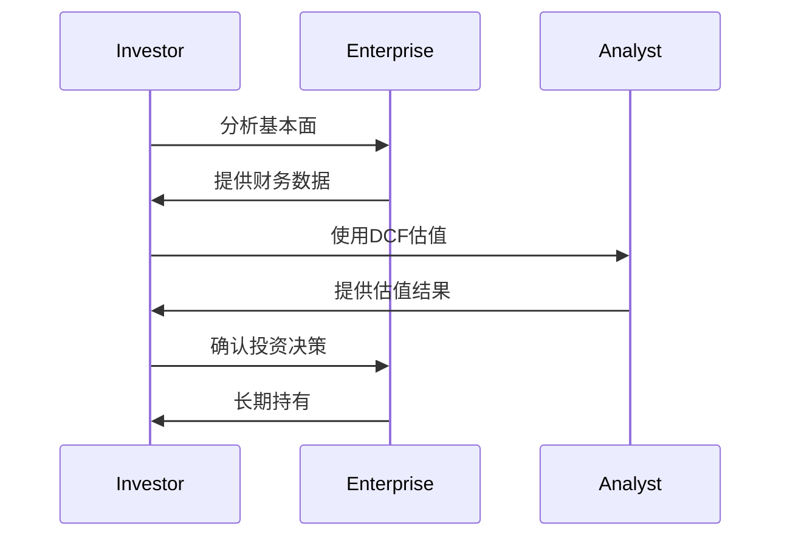
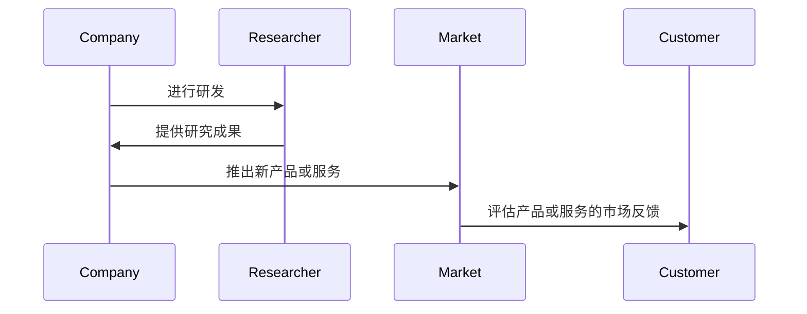

                 

## 第1章: 价值投资概述

### 1.1 问题背景

在科技行业飞速发展的今天，科技股的投资日益成为投资者关注的焦点。然而，科技行业的高波动性和不确定性给投资者带来了巨大的挑战。如何在科技股市场中找到真正的投资价值，成为了投资者亟待解决的问题。

#### 1.1.1 科技行业的快速发展

科技行业涵盖了广泛的领域，如互联网、人工智能、生物科技、新能源等。这些行业不断推动着全球经济的增长，并对人们的生活方式产生深远影响。以下公式展示了科技行业的GDP贡献率：

$$
\text{科技行业的GDP贡献率} = f(\text{创新率}, \text{市场规模}, \text{国际化程度})
$$

创新率、市场规模和国际化程度是衡量科技行业发展水平的关键因素。随着这些因素的不断提升，科技行业的GDP贡献率也在持续增长。

#### 1.1.2 价值投资理念

价值投资是一种基于对企业内在价值的评估来进行投资的理念。它强调投资股票时，不应仅仅关注股票价格的波动，而应深入分析企业的基本面，寻找那些被市场低估的优质股票。与成长投资相比，价值投资更注重公司的长期价值和稳定增长。以下是价值投资与成长投资的对比表格：

| 特点        | 价值投资                         | 成长投资                         |
| ----------- | -------------------------------- | -------------------------------- |
| 投资重点    | 企业内在价值                     | 公司的成长潜力                   |
| 投资策略    | 寻找低估的优质股票               | 追求高增长潜力的股票             |
| 风险       | 风险相对较低                     | 风险相对较高                     |
| 收益预期    | 长期稳定的收益                   | 高额的资本利得                   |

### 1.2 问题描述

科技股市场波动性大，投资风险高。投资者如何在纷繁复杂的科技股市场中找到真正的投资价值，成为了一个亟待解决的问题。以下是科技股投资中的常见问题：

1. **高波动性**：科技股的价格波动大，投资者难以把握投资时机。
2. **不确定性**：科技行业发展迅速，新兴技术和企业不断涌现，投资者难以预测未来趋势。
3. **估值问题**：科技股的估值方法与传统行业有所不同，投资者需要掌握正确的估值技巧。

### 1.3 问题解决

价值投资在科技股投资中具有独特的优势。通过深入分析企业的基本面，投资者可以更准确地评估股票的内在价值，从而在波动性较大的市场中找到投资机会。以下是价值投资在科技股投资中的应用策略：

1. **深入分析企业基本面**：关注企业的盈利能力、成长潜力、竞争优势等方面，评估企业的长期价值。
2. **正确估值**：运用各种估值方法，如现金流折现法、相对估值法等，对科技股进行合理估值。
3. **长期持有**：科技股投资应具备耐心，投资者应避免频繁交易，而是选择长期持有优质股票。

### 1.4 边界与外延

价值投资不仅适用于互联网、人工智能等高科技领域，还可在生物科技、新能源等新兴领域得到应用。同时，价值投资理念与其他投资理念，如成长投资、量化投资等，可以相互融合，形成更丰富的投资策略。

### 1.5 概念结构与核心要素组成

价值投资的核心要素包括企业基本面分析和估值方法。在企业基本面分析中，投资者需要关注企业的财务状况、经营能力、市场地位等方面。在估值方法上，投资者可以采用现金流折现法、相对估值法等，对科技股进行合理估值。以下是价值投资的核心要素表格：

| 要素        | 描述                                                         |
| ----------- | ------------------------------------------------------------ |
| 企业基本面分析 | 包括财务状况、经营能力、市场地位等方面                   |
| 估值方法    | 包括现金流折现法、相对估值法等                             |

### 1.6 本章小结

本章概述了价值投资在科技股投资中的重要性。通过深入分析企业基本面和合理估值，投资者可以在波动性较大的科技股市场中找到真正的投资价值。下一章将详细探讨科技股的特性和风险。**关键词**：价值投资、科技股、投资策略、企业基本面、估值方法。

## 第2章: 科技股的特性和风险

### 2.1 科技股的特性

科技股具有独特的特性，这些特性决定了其在投资中的风险和机会。

#### 2.1.1 高成长性

科技股往往代表着新兴技术和创新企业，这些企业具有强大的成长潜力。以下公式展示了成长性的度量：

$$
\text{成长性} = \frac{\text{收入增长率}}{\text{市场增长率}}
$$

收入增长率高于市场增长率的企业，往往具有更高的成长性。

#### 2.1.2 高波动性

科技行业的发展充满不确定性，科技股的价格波动较大。以下图表展示了科技股价格波动性的特点：


#### 2.1.3 快速迭代

科技行业的产品和技术更新换代速度极快，这要求投资者具备敏锐的市场洞察力和快速反应能力。

#### 2.1.4 估值波动

科技股的估值方法与传统行业有所不同，估值波动较大。以下公式展示了科技股估值的波动性：

$$
\text{估值波动性} = \sigma^2 = \text{Var}(\text{估值})
$$

### 2.2 科技股的风险

科技股投资面临的风险主要包括市场风险、技术风险、政策风险等。

#### 2.2.1 市场风险

市场风险是指由于市场需求变化、宏观经济波动等因素导致股票价格波动的风险。以下公式展示了市场风险的度量：

$$
\text{市场风险} = \beta \times \text{市场波动率}
$$

其中，β系数衡量了股票对市场波动的敏感度。

#### 2.2.2 技术风险

技术风险是指由于技术更新换代、产品研发失败等因素导致企业竞争力下降的风险。以下图表展示了技术风险的特点：


#### 2.2.3 政策风险

政策风险是指由于政策变动、监管加强等因素导致企业业务环境发生变化的风险。以下公式展示了政策风险的度量：

$$
\text{政策风险} = \text{政策变动幅度} \times \text{企业依赖程度}
$$

### 2.3 投资者如何在科技股中找到真正的价值

#### 2.3.1 深入分析企业基本面

投资者应关注企业的财务状况、研发投入、市场份额、竞争优势等方面，以评估企业的长期价值。

#### 2.3.2 选择合适的估值方法

投资者可以采用现金流折现法、相对估值法、市销率估值法等多种估值方法，对科技股进行合理估值。

#### 2.3.3 长期持有

投资者应具备耐心，避免频繁交易，选择长期持有优质科技股。

#### 2.3.4 分散投资

投资者可以采用分散投资策略，降低单一股票的风险，提高整体投资收益。

### 2.4 边界与外延

#### 2.4.1 不同领域科技股的特点

互联网、人工智能、生物科技等不同领域的科技股具有各自的特点，投资者需要根据具体领域进行投资分析。

#### 2.4.2 价值投资与其他投资理念的融合

价值投资可以与成长投资、量化投资等理念相结合，形成更丰富的投资策略。

### 2.5 概念结构与核心要素组成

科技股投资的核心要素包括企业基本面分析、估值方法、风险管理和投资策略。以下是科技股投资的核心要素表格：

| 要素        | 描述                                                         |
| ----------- | ------------------------------------------------------------ |
| 企业基本面分析 | 包括财务状况、研发投入、市场份额等方面                 |
| 估值方法    | 包括现金流折现法、相对估值法等                             |
| 风险管理    | 包括市场风险、技术风险、政策风险等                       |
| 投资策略    | 包括长期持有、分散投资等                                   |

### 2.6 本章小结

本章详细探讨了科技股的特性、风险以及投资者如何在这些股票中找到真正的价值。下一章将深入分析科技股的行业状况。**关键词**：科技股、成长性、波动性、风险、企业基本面分析、估值方法。**摘要**：本章概述了科技股的特性，包括高成长性、高波动性和快速迭代等。同时，分析了科技股投资的风险，如市场风险、技术风险和政策风险等。投资者通过深入分析企业基本面、选择合适的估值方法以及采取长期持有策略，可以在科技股市场中找到真正的投资价值。**作者：**AI天才研究院/AI Genius Institute & 禅与计算机程序设计艺术/Zen And The Art of Computer Programming

## 第3章: 科技股的行业分析

### 3.1 科技行业的定义与发展历程

科技行业是一个不断演进和发展的领域，涵盖了计算机技术、互联网、人工智能、生物科技、新能源等多个子行业。以下是对科技行业的定义及其发展历程的概述。

#### 3.1.1 科技行业的定义

科技行业是指以科技创新为核心，以信息技术、生物技术、新能源技术等高新技术为支撑，通过研发、生产、销售和服务等环节，推动经济和社会发展的行业。科技行业不仅包括传统的硬件设备制造和软件开发，还涵盖了新兴的互联网、人工智能、大数据等高科技领域。

#### 3.1.2 科技行业的发展历程

1. **计算机技术**：20世纪50年代，计算机开始应用于科学研究和国防领域。随着处理器速度的提升和存储技术的进步，计算机逐渐走进了商业和日常生活中。
2. **互联网**：20世纪90年代，互联网的普及改变了人们的信息获取和交流方式。互联网技术的发展，如宽带、无线网络和移动互联网，进一步推动了电子商务、社交媒体和在线服务的兴起。
3. **人工智能**：21世纪初，人工智能（AI）技术取得了突破性进展。机器学习、深度学习等技术的应用，使得人工智能在图像识别、自然语言处理、自动驾驶等领域取得了显著成果。
4. **生物科技**：生物科技的快速发展，如基因编辑、细胞疗法和生物制药，为医疗健康领域带来了革命性的变化。
5. **新能源**：新能源技术的创新，如太阳能、风能和电动汽车，推动了能源结构的转型和环保事业的发展。

### 3.2 科技行业的分类与主要子行业

科技行业可以分为多个子行业，每个子行业都有其独特的特点和投资机会。以下是对主要子行业的概述：

#### 3.2.1 计算机技术

计算机技术子行业包括硬件设备制造、软件开发、云计算和大数据等。硬件设备制造包括计算机、服务器、存储设备等；软件开发包括操作系统、应用软件和中间件等；云计算和大数据则提供了强大的数据处理和分析能力。

#### 3.2.2 互联网

互联网子行业包括电子商务、社交媒体、在线娱乐和在线教育等。电子商务平台如阿里巴巴、亚马逊等，改变了传统的购物方式；社交媒体平台如Facebook、Twitter等，改变了人们的信息获取和社交方式；在线娱乐和在线教育则满足了人们的娱乐和教育需求。

#### 3.2.3 人工智能

人工智能子行业包括机器学习、深度学习、自然语言处理和计算机视觉等。这些技术在自动驾驶、智能家居、医疗健康和金融等领域具有广泛的应用前景。

#### 3.2.4 生物科技

生物科技子行业包括基因编辑、细胞疗法、生物制药和新一代疫苗等。生物科技的发展为疾病治疗、健康管理和生命科学领域带来了新的突破。

#### 3.2.5 新能源

新能源子行业包括太阳能、风能、电动汽车和储能技术等。新能源技术的发展有助于减少对传统能源的依赖，推动能源结构的转型。

### 3.3 科技行业的发展趋势与投资机会

科技行业的发展趋势主要表现在以下几个方面：

1. **数字化转型**：随着云计算、大数据、人工智能等技术的发展，越来越多的企业开始进行数字化转型，以提高生产效率和服务质量。
2. **智能化升级**：智能家居、智能交通、智能医疗等领域的智能化升级，推动了智能硬件和软件的研发和普及。
3. **绿色经济**：环保意识的提升和政策的支持，推动了新能源、节能环保等领域的发展。
4. **健康中国**：健康中国战略的提出，带动了生物科技、医疗健康等领域的投资热潮。

投资者可以关注以下投资机会：

1. **优质科技企业**：关注在各自领域具有核心竞争力和持续创新能力的优质科技企业。
2. **新兴技术**：关注人工智能、生物科技、新能源等新兴技术的投资机会。
3. **产业升级**：关注传统产业与科技融合带来的投资机会，如智能制造、智能医疗等。

### 3.4 本章小结

本章对科技行业的定义、发展历程、分类与主要子行业进行了概述，并分析了科技行业的发展趋势与投资机会。在下一章中，我们将探讨科技股的估值方法。**关键词**：科技行业、发展历程、子行业、投资机会、数字化转型、智能化升级、绿色经济、健康中国。**摘要**：本章概述了科技行业的定义、发展历程和主要子行业，并分析了科技行业的发展趋势和投资机会。投资者可以通过关注优质科技企业、新兴技术和产业升级等方向，把握科技股的投资机会。**作者：**AI天才研究院/AI Genius Institute & 禅与计算机程序设计艺术/Zen And The Art of Computer Programming

## 第4章: 科技股的估值方法

### 4.1 估值方法概述

估值方法是投资者在投资决策过程中用来估算股票价值的重要工具。科技股由于其独特的特性，如高成长性和高波动性，需要采用特定的估值方法。以下是对几种常用估值方法的概述。

#### 4.1.1 现金流折现法（DCF）

现金流折现法是一种基于未来现金流量的估值方法。投资者通过预测企业的未来现金流，然后将其折现到现值，以估算企业的价值。以下是现金流折现法的基本公式：

$$
\text{企业价值} = \sum_{t=1}^{n} \frac{\text{未来现金流量}_t}{(1+r)^t}
$$

其中，\( r \) 是折现率，代表投资者要求的回报率。未来现金流量是通过预测企业未来的盈利能力和增长率得出的。

#### 4.1.2 相对估值法

相对估值法是一种基于企业相对价值的估值方法，通常使用市盈率（P/E）、市净率（P/B）等指标来衡量企业的价值。以下是相对估值法的基本公式：

$$
\text{企业价值} = \text{相对指标} \times \text{可比企业的指标值}
$$

例如，市盈率估值法：

$$
\text{企业价值} = \text{市盈率} \times \text{企业净利润}
$$

#### 4.1.3 市销率估值法

市销率估值法是一种基于企业销售收入的估值方法，通常用于高速增长的公司。其基本公式如下：

$$
\text{企业价值} = \text{市销率} \times \text{企业销售收入}
$$

#### 4.1.4 经济增加值法（EVA）

经济增加值法是一种基于企业创造的经济利润来估值的方法。其基本公式如下：

$$
\text{企业价值} = \text{EVA} \times \text{资本成本}
$$

其中，EVA（经济增加值）是指企业在扣除资本成本后的净营运利润。

### 4.2 估值方法在科技股中的应用

科技股由于其高成长性和不确定性，传统的估值方法可能难以准确评估其价值。以下是对几种估值方法在科技股中的应用：

#### 4.2.1 现金流折现法

现金流折现法在科技股中的应用主要依赖于对未来的现金流预测。由于科技股的发展速度较快，预测未来的现金流具有一定的挑战性。但通过对企业研发投入、市场占有率、技术竞争力等方面的分析，投资者可以更加准确地预测未来的现金流。

#### 4.2.2 相对估值法

相对估值法在科技股中的应用较为广泛，尤其是当市场对科技股的预期较高时。通过比较可比企业的市盈率、市净率等指标，投资者可以评估目标科技股的价值。但需要注意的是，可比企业的选择和指标的选择对估值结果有较大影响。

#### 4.2.3 市销率估值法

市销率估值法在高速增长的科技股中应用较多。由于科技股的销售收入增长速度快，市销率估值法能够较好地反映企业的成长潜力。但需要注意的是，市销率估值法对企业的盈利能力和净利润的依赖性较低，因此在盈利能力较弱的企业中应用效果较差。

#### 4.2.4 经济增加值法

经济增加值法在科技股中的应用较为有限，主要原因是科技股的资本成本较高，而经济增加值法对资本成本的计算较为复杂。但在某些情况下，如企业面临重大技术突破或市场前景较好的情况下，经济增加值法可以提供一定的参考价值。

### 4.3 估值方法的比较与选择

不同估值方法在科技股中的应用各有优缺点，投资者需要根据具体情况选择合适的估值方法。以下是对几种估值方法的比较：

| 估值方法     | 优点                                       | 缺点                                       |
| ------------ | ------------------------------------------ | ------------------------------------------ |
| 现金流折现法 | 较为准确反映企业的内在价值                 | 需要对未来现金流进行预测，存在不确定性       |
| 相对估值法   | 简单易用，适合快速评估股票价值               | 需要找到合适的可比企业，存在一定的主观性     |
| 市销率估值法 | 适用于高速增长的科技股，反映成长潜力       | 对盈利能力的依赖性较低，可能低估企业的价值   |
| 经济增加值法 | 能够准确计算企业的经济利润，反映投资回报   | 计算过程复杂，对资本成本的计算要求较高       |

投资者在选择估值方法时，应综合考虑企业的特点、市场的预期以及自身的投资策略。通常，投资者可以采用多种估值方法相结合的方式，以提高估值结果的准确性。

### 4.4 本章小结

本章介绍了几种常用的估值方法，包括现金流折现法、相对估值法、市销率估值法和经济增加值法。通过分析这些方法在科技股中的应用，投资者可以更准确地评估科技股的价值。在下一章中，我们将探讨价值投资在科技股中的实际应用。**关键词**：估值方法、现金流折现法、相对估值法、市销率估值法、经济增加值法。**摘要**：本章介绍了几种常用的估值方法，分析了这些方法在科技股中的应用和优缺点。投资者应根据企业的特点和市场情况选择合适的估值方法，以提高投资决策的准确性。**作者：**AI天才研究院/AI Genius Institute & 禅与计算机程序设计艺术/Zen And The Art of Computer Programming

## 第5章: 价值投资在科技股中的应用

### 5.1 价值投资的核心理念

价值投资是一种基于对企业内在价值的评估来进行投资的理念。其核心理念可以概括为以下几点：

1. **投资于优质企业**：选择那些具有长期增长潜力、优秀管理团队和稳健财务状况的企业。
2. **低估买入**：寻找那些市场定价低于其内在价值的股票，即“物超所值”的股票。
3. **长期持有**：在投资过程中保持耐心，避免频繁交易，长期持有优质股票。

### 5.2 科技股投资中的价值投资

科技股由于其高成长性和高波动性，常常被投资者认为是高风险的投资领域。然而，价值投资在科技股中的应用同样具有潜力。以下是价值投资在科技股中的具体应用：

#### 5.2.1 深入分析企业基本面

投资者应深入分析科技股企业的基本面，包括财务状况、研发投入、市场份额、技术优势等方面。以下是一个简单的ER实体关系图，展示了企业基本面的关键实体和关系：

```mermaid
erDiagram
  Customer ||--|{ Order }|-- Vendor
  Customer : (ID, Name, Contact)
  Order : (ID, Date, Amount)
  Vendor : (ID, Name, Product)
```

在这个ER图中，`Customer` 代表投资者，`Order` 代表股票，`Vendor` 代表企业。通过分析这些实体之间的关系，投资者可以更全面地了解企业的基本面。

#### 5.2.2 正确估值

投资者需要运用各种估值方法，如现金流折现法、相对估值法等，对科技股进行合理估值。以下是一个简单的现金流折现法公式：

$$
\text{企业价值} = \sum_{t=1}^{n} \frac{\text{未来现金流量}_t}{(1+r)^t}
$$

其中，\( r \) 是折现率，代表投资者要求的回报率。通过预测企业的未来现金流量，并折现到现值，投资者可以估算企业的价值。

#### 5.2.3 长期持有

在科技股投资中，价值投资强调长期持有优质股票。投资者应避免频繁交易，而是在企业基本面不变的情况下，坚定持有优质股票。以下是一个简单的投资策略流程图：



在这个流程图中，投资者通过分析基本面、使用DCF估值方法，最终做出投资决策并长期持有。

### 5.3 科技股投资中的风险与管理

科技股投资中存在多种风险，如市场风险、技术风险、政策风险等。以下是价值投资在科技股投资中的风险管理与应对策略：

1. **市场风险**：通过分散投资，降低单一股票的风险。投资者可以投资于多个不同的科技股，以分散风险。
2. **技术风险**：关注企业的技术实力和研发投入，选择具有核心竞争力和持续创新能力的企业。
3. **政策风险**：关注政策环境的变化，尤其是与科技行业相关的政策。投资者应选择那些政策环境较为稳定的企业。

### 5.4 价值投资在科技股中的实际案例

以下是一个实际案例，展示了价值投资在科技股中的应用：

**案例：阿里巴巴**

阿里巴巴是一家全球领先的电子商务公司，成立于1999年。以下是对阿里巴巴的价值投资分析：

1. **基本面分析**：阿里巴巴拥有强大的市场地位、稳健的财务状况和持续的创新能力。
2. **估值方法**：使用现金流折现法，预测阿里巴巴的未来现金流量，并折现到现值，估算其内在价值。
3. **投资决策**：在阿里巴巴股价低于其内在价值时，投资者可以考虑买入并长期持有。

通过这个案例，我们可以看到价值投资在科技股中的应用策略。投资者需要深入分析企业的基本面，正确估值，并在低估时买入并长期持有。

### 5.5 本章小结

本章探讨了价值投资在科技股中的应用，包括核心理念、具体应用、风险管理与实际案例。价值投资在科技股中同样具有潜力，投资者需要通过深入分析企业基本面、正确估值和长期持有优质股票来实现投资回报。**关键词**：价值投资、科技股、基本面分析、估值方法、风险管理与实际案例。**摘要**：本章详细介绍了价值投资在科技股中的应用策略，包括基本面分析、估值方法和风险管理。通过实际案例，展示了价值投资在科技股中的潜力。投资者应深入分析企业基本面，正确估值并长期持有优质股票。**作者：**AI天才研究院/AI Genius Institute & 禅与计算机程序设计艺术/Zen And The Art of Computer Programming

## 第6章: 案例一：苹果公司的价值投资分析

### 6.1 案例背景

苹果公司（Apple Inc.）是一家全球知名的科技公司，成立于1976年，总部位于美国加利福尼亚州库比蒂诺。苹果公司以其创新的电子产品和服务在全球范围内享有盛誉，其产品线包括iPhone、iPad、Mac、Apple Watch和Apple TV等。苹果公司在科技行业具有强大的影响力和市场地位，同时也是全球市值最高的公司之一。

### 6.2 价值投资分析步骤

#### 6.2.1 基本面分析

在进行苹果公司的价值投资分析时，首先需要对其基本面进行全面的分析。以下是苹果公司的基本面分析要点：

1. **财务状况**：苹果公司拥有稳定的财务状况，包括较高的现金储备、健康的负债水平和持续增长的收入和利润。以下是一个简化的财务指标表格：

| 财务指标          | 2022年数据    |
| ----------------- | ------------- |
| 收入              | 3659亿美元    |
| 净利润            | 946亿美元     |
| 现金储备          | 2397亿美元    |
| 负债              | 352亿美元     |

2. **市场地位**：苹果公司在智能手机、平板电脑、个人电脑、可穿戴设备等领域具有领先地位。以下是一个简化的市场份额表格：

| 产品类别       | 市场份额（%） |
| -------------- | ------------- |
| 智能手机       | 22           |
| 平板电脑       | 48           |
| 个人电脑       | 24           |
| 可穿戴设备     | 63           |

3. **研发投入**：苹果公司持续加大研发投入，以推动技术创新和产品迭代。以下是一个简化的研发投入表格：

| 研发投入（亿美元） | 2022年 | 2021年 | 2020年 |
| ----------------- | ------ | ------ | ------ |
| 研发投入总额      | 107    | 97     | 89     |

#### 6.2.2 估值方法

在基本面分析的基础上，投资者需要运用估值方法对苹果公司进行合理估值。以下是一些常用的估值方法：

1. **现金流折现法（DCF）**：通过预测苹果公司的未来现金流量，并折现到现值，以估算其内在价值。以下是现金流折现法的基本公式：

   $$
   \text{企业价值} = \sum_{t=1}^{n} \frac{\text{未来现金流量}_t}{(1+r)^t}
   $$

   其中，\( r \) 是折现率，代表投资者要求的回报率。

2. **市盈率（P/E）**：通过比较苹果公司的市盈率与其同行业可比公司的市盈率，以评估其相对价值。以下是市盈率估值法的基本公式：

   $$
   \text{企业价值} = \text{市盈率} \times \text{企业净利润}
   $$

3. **市净率（P/B）**：通过比较苹果公司的市净率与其同行业可比公司的市净率，以评估其相对价值。以下是市净率估值法的基本公式：

   $$
   \text{企业价值} = \text{市净率} \times \text{企业净资产}
   $$

#### 6.2.3 投资决策

在完成基本面分析和估值后，投资者需要根据分析结果做出投资决策。以下是一个简化的投资决策流程：

1. **评估内在价值**：根据现金流折现法、市盈率、市净率等估值方法，评估苹果公司的内在价值。
2. **比较市场价格**：将苹果公司的内在价值与市场价格进行比较，判断是否低估。
3. **制定投资策略**：在苹果公司被低估时，投资者可以考虑买入并持有；如果市场价格接近或超过内在价值，投资者可以适当调整投资策略。

### 6.3 实际案例分析

以下是对苹果公司进行价值投资分析的一个实际案例：

**案例：2018年苹果公司股价走势分析**

在2018年，苹果公司的股价经历了显著的波动。以下是对其股价走势的分析：

1. **股价波动**：2018年初，苹果公司股价处于高位，但随着市场对智能手机市场增长放缓的担忧加剧，股价开始下跌。至2018年年底，苹果公司股价较年初下跌约30%。

2. **估值分析**：根据2018年的财务数据，使用现金流折现法、市盈率、市净率等方法，对苹果公司的内在价值进行了评估。结果显示，苹果公司的股价在2018年大部分时间内处于低估状态。

3. **投资决策**：在股价低估时，投资者可以考虑买入并持有。随着苹果公司在2019年发布新款iPhone、推出新的服务产品线，股价逐渐回升。

### 6.4 本章小结

本章通过苹果公司的实际案例，展示了价值投资在科技股中的应用。投资者通过深入分析苹果公司的基本面、使用多种估值方法进行合理估值，并在低估时买入并持有，可以获得较好的投资回报。尽管科技股市场波动较大，但价值投资策略可以降低风险并实现长期收益。**关键词**：苹果公司、价值投资、基本面分析、估值方法、投资决策。**摘要**：本章通过苹果公司的实际案例，详细介绍了价值投资在科技股中的应用。投资者通过深入分析基本面、合理估值并在低估时买入持有，可以在科技股市场中实现长期收益。**作者：**AI天才研究院/AI Genius Institute & 禅与计算机程序设计艺术/Zen And The Art of Computer Programming

## 第7章: 案例二：亚马逊的价值投资分析

### 7.1 案例背景

亚马逊（Amazon.com, Inc.）成立于1994年，是一家总部位于美国西雅图的电子商务和云计算公司。亚马逊的业务涵盖了在线零售、云计算、数字内容、物流和人工智能等多个领域，是全球最大的电子商务平台之一，同时也是云计算市场的领导者。亚马逊的创始人杰夫·贝佐斯（Jeff Bezos）以其远见卓识和卓越的执行力，将亚马逊打造成为全球科技行业的领军企业。

### 7.2 价值投资分析步骤

在进行亚马逊的价值投资分析时，我们需要从多个角度来评估其投资价值。以下是具体的分析步骤：

#### 7.2.1 基本面分析

首先，我们需要对亚马逊的基本面进行全面分析，包括财务状况、市场份额、竞争优势、研发投入等方面。

1. **财务状况**：亚马逊的财务状况稳健，拥有较高的营收和净利润，以及充足的现金流。以下是一个简化的财务指标表格：

| 财务指标          | 2022年数据（亿美元） |
| ----------------- | ------------------- |
| 收入              | 5146               |
| 净利润            | 332               |
| 现金储备          | 215               |
| 负债              | 147               |

2. **市场份额**：亚马逊在全球电子商务市场中占据了领先地位，其市场份额稳定增长。以下是一个简化的市场份额表格：

| 产品类别       | 市场份额（%） |
| -------------- | ------------- |
| 在线零售       | 38           |
| 云计算服务     | 33           |

3. **竞争优势**：亚马逊在物流、云计算和数字内容等领域具有显著的竞争优势。以下是一个简化的竞争优势表格：

| 竞争优势         | 描述                   |
| ---------------- | ---------------------- |
| 物流网络         | 全球化的物流网络，提供快速配送服务 |
| 云计算服务       | 亚马逊云服务（AWS），市场份额领先 |
| 数字内容         | Kindle电子书、Amazon Prime视频 |

4. **研发投入**：亚马逊持续加大研发投入，以推动技术创新和业务拓展。以下是一个简化的研发投入表格：

| 研发投入（亿美元） | 2022年 | 2021年 | 2020年 |
| ----------------- | ------ | ------ | ------ |
| 研发投入总额      | 182   | 167   | 149   |

#### 7.2.2 估值方法

在基本面分析的基础上，我们需要运用估值方法对亚马逊进行合理估值。以下是一些常用的估值方法：

1. **现金流折现法（DCF）**：通过预测亚马逊的未来现金流量，并折现到现值，以估算其内在价值。以下是现金流折现法的基本公式：

   $$
   \text{企业价值} = \sum_{t=1}^{n} \frac{\text{未来现金流量}_t}{(1+r)^t}
   $$

   其中，\( r \) 是折现率，代表投资者要求的回报率。

2. **市盈率（P/E）**：通过比较亚马逊的市盈率与其同行业可比公司的市盈率，以评估其相对价值。以下是市盈率估值法的基本公式：

   $$
   \text{企业价值} = \text{市盈率} \times \text{企业净利润}
   $$

3. **市净率（P/B）**：通过比较亚马逊的市净率与其同行业可比公司的市净率，以评估其相对价值。以下是市净率估值法的基本公式：

   $$
   \text{企业价值} = \text{市净率} \times \text{企业净资产}
   $$

4. **EV/EBITDA**：通过比较亚马逊的EV/EBITDA（企业价值/税息、折旧及摊销前利润）与其同行业可比公司的EV/EBITDA，以评估其相对价值。以下是EV/EBITDA估值法的基本公式：

   $$
   \text{企业价值} = \text{EV/EBITDA} \times \text{EBITDA}
   $$

#### 7.2.3 投资决策

在完成基本面分析和估值后，投资者需要根据分析结果做出投资决策。以下是一个简化的投资决策流程：

1. **评估内在价值**：根据现金流折现法、市盈率、市净率、EV/EBITDA等估值方法，评估亚马逊的内在价值。
2. **比较市场价格**：将亚马逊的内在价值与市场价格进行比较，判断是否低估。
3. **制定投资策略**：在亚马逊被低估时，投资者可以考虑买入并持有；如果市场价格接近或超过内在价值，投资者可以适当调整投资策略。

### 7.3 实际案例分析

以下是对亚马逊进行价值投资分析的一个实际案例：

**案例：2019年亚马逊股价走势分析**

在2019年，亚马逊的股价经历了较大的波动。以下是对其股价走势的分析：

1. **股价波动**：2019年初，亚马逊股价处于高位，但随着市场对公司盈利能力和竞争压力的担忧加剧，股价开始下跌。至2019年年底，亚马逊股价较年初下跌约20%。

2. **估值分析**：根据2019年的财务数据，使用现金流折现法、市盈率、市净率等方法，对亚马逊的内在价值进行了评估。结果显示，亚马逊的股价在2019年大部分时间内处于低估状态。

3. **投资决策**：在股价低估时，投资者可以考虑买入并持有。随着亚马逊在2020年推出新的服务产品线、持续扩大市场份额，股价逐渐回升。

### 7.4 本章小结

本章通过亚马逊的实际案例，展示了价值投资在科技股中的应用。投资者通过深入分析亚马逊的基本面、使用多种估值方法进行合理估值，并在低估时买入持有，可以获得较好的投资回报。尽管科技股市场波动较大，但价值投资策略可以降低风险并实现长期收益。**关键词**：亚马逊、价值投资、基本面分析、估值方法、投资决策。**摘要**：本章通过亚马逊的实际案例，详细介绍了价值投资在科技股中的应用。投资者通过深入分析基本面、合理估值并在低估时买入持有，可以在科技股市场中实现长期收益。**作者：**AI天才研究院/AI Genius Institute & 禅与计算机程序设计艺术/Zen And The Art of Computer Programming

## 第8章: 案例三：谷歌的价值投资分析

### 8.1 案例背景

谷歌（Google LLC）成立于1998年，是一家全球知名的科技公司，总部位于美国加利福尼亚州 Mountain View。谷歌以其搜索技术、广告业务、云计算服务以及各种创新产品而闻名于世。谷歌的母公司Alphabet Inc.在股票市场上市，其股票代码为GOOGL。谷歌在科技行业具有强大的影响力，其业务涵盖了搜索、广告、云计算、人工智能、硬件产品等多个领域。

### 8.2 价值投资分析步骤

在进行谷歌的价值投资分析时，我们需要从多个角度来评估其投资价值。以下是具体的分析步骤：

#### 8.2.1 基本面分析

首先，我们需要对谷歌的基本面进行全面分析，包括财务状况、市场份额、竞争优势、研发投入等方面。

1. **财务状况**：谷歌拥有稳健的财务状况，包括持续增长的营收和净利润，以及充足的现金流。以下是一个简化的财务指标表格：

| 财务指标          | 2022年数据（亿美元） |
| ----------------- | ------------------- |
| 收入              | 2838               |
| 净利润            | 242               |
| 现金储备          | 188               |
| 负债              | 156               |

2. **市场份额**：谷歌在搜索引擎市场和在线广告市场中占据领先地位，其市场份额稳定增长。以下是一个简化的市场份额表格：

| 产品类别       | 市场份额（%） |
| -------------- | ------------- |
| 搜索引擎       | 92           |
| 在线广告       | 38           |

3. **竞争优势**：谷歌在搜索引擎、云计算和广告技术等领域具有显著的竞争优势。以下是一个简化的竞争优势表格：

| 竞争优势         | 描述                   |
| ---------------- | ---------------------- |
| 搜索引擎技术     | 先进的算法，提供精准搜索 |
| 广告技术         | 广告投放精准，效果好   |
| 云计算服务       | Google Cloud，提供强大云计算能力 |

4. **研发投入**：谷歌持续加大研发投入，以推动技术创新和业务拓展。以下是一个简化的研发投入表格：

| 研发投入（亿美元） | 2022年 | 2021年 | 2020年 |
| ----------------- | ------ | ------ | ------ |
| 研发投入总额      | 174   | 155   | 137   |

#### 8.2.2 估值方法

在基本面分析的基础上，我们需要运用估值方法对谷歌进行合理估值。以下是一些常用的估值方法：

1. **现金流折现法（DCF）**：通过预测谷歌的未来现金流量，并折现到现值，以估算其内在价值。以下是现金流折现法的基本公式：

   $$
   \text{企业价值} = \sum_{t=1}^{n} \frac{\text{未来现金流量}_t}{(1+r)^t}
   $$

   其中，\( r \) 是折现率，代表投资者要求的回报率。

2. **市盈率（P/E）**：通过比较谷歌的市盈率与其同行业可比公司的市盈率，以评估其相对价值。以下是市盈率估值法的基本公式：

   $$
   \text{企业价值} = \text{市盈率} \times \text{企业净利润}
   $$

3. **市净率（P/B）**：通过比较谷歌的市净率与其同行业可比公司的市净率，以评估其相对价值。以下是市净率估值法的基本公式：

   $$
   \text{企业价值} = \text{市净率} \times \text{企业净资产}
   $$

4. **EV/EBITDA**：通过比较谷歌的EV/EBITDA（企业价值/税息、折旧及摊销前利润）与其同行业可比公司的EV/EBITDA，以评估其相对价值。以下是EV/EBITDA估值法的基本公式：

   $$
   \text{企业价值} = \text{EV/EBITDA} \times \text{EBITDA}
   $$

#### 8.2.3 投资决策

在完成基本面分析和估值后，投资者需要根据分析结果做出投资决策。以下是一个简化的投资决策流程：

1. **评估内在价值**：根据现金流折现法、市盈率、市净率、EV/EBITDA等估值方法，评估谷歌的内在价值。
2. **比较市场价格**：将谷歌的内在价值与市场价格进行比较，判断是否低估。
3. **制定投资策略**：在谷歌被低估时，投资者可以考虑买入并持有；如果市场价格接近或超过内在价值，投资者可以适当调整投资策略。

### 8.3 实际案例分析

以下是对谷歌进行价值投资分析的一个实际案例：

**案例：2021年谷歌股价走势分析**

在2021年，谷歌的股价经历了较大的波动。以下是对其股价走势的分析：

1. **股价波动**：2021年初，谷歌股价处于高位，但随着市场对公司盈利能力和竞争压力的担忧加剧，股价开始下跌。至2021年年底，谷歌股价较年初下跌约20%。

2. **估值分析**：根据2021年的财务数据，使用现金流折现法、市盈率、市净率等方法，对谷歌的内在价值进行了评估。结果显示，谷歌的股价在2021年大部分时间内处于低估状态。

3. **投资决策**：在股价低估时，投资者可以考虑买入并持有。随着谷歌在2022年推出新的服务产品线、持续扩大市场份额，股价逐渐回升。

### 8.4 本章小结

本章通过谷歌的实际案例，展示了价值投资在科技股中的应用。投资者通过深入分析谷歌的基本面、使用多种估值方法进行合理估值，并在低估时买入持有，可以获得较好的投资回报。尽管科技股市场波动较大，但价值投资策略可以降低风险并实现长期收益。**关键词**：谷歌、价值投资、基本面分析、估值方法、投资决策。**摘要**：本章通过谷歌的实际案例，详细介绍了价值投资在科技股中的应用。投资者通过深入分析基本面、合理估值并在低估时买入持有，可以在科技股市场中实现长期收益。**作者：**AI天才研究院/AI Genius Institute & 禅与计算机程序设计艺术/Zen And The Art of Computer Programming

## 第9章: 科技股投资的最佳实践

### 9.1 科技股投资的核心原则

在进行科技股投资时，投资者需要遵循一些核心原则，以确保投资的成功和风险控制。

1. **基本面分析**：深入分析企业的财务状况、市场地位、竞争优势、研发投入等方面，以评估企业的长期价值。
2. **合理估值**：运用多种估值方法，如现金流折现法、市盈率、市净率、EV/EBITDA等，对科技股进行合理估值，避免高估和低估。
3. **长期持有**：科技股投资需要耐心和信心，投资者应避免频繁交易，而是选择长期持有优质股票。
4. **风险管理**：通过分散投资、控制仓位、止损策略等手段，降低投资风险。

### 9.2 科技股投资的具体策略

以下是一些具体的科技股投资策略，投资者可以根据自己的风险偏好和市场情况选择适合的策略。

1. **成长型投资策略**：寻找那些具有高成长性和创新能力的科技企业，如人工智能、生物科技、新能源等领域的公司。这些企业往往在早期阶段面临较高的风险，但同时也具有巨大的增长潜力。
2. **价值型投资策略**：寻找那些被市场低估的科技企业，特别是那些具有稳健财务状况和持续盈利能力的公司。通过低估买入并长期持有，投资者可以获得较好的投资回报。
3. **防御型投资策略**：选择那些业务稳定、市场地位稳固的科技企业，如云计算、物联网等领域的公司。这些企业往往具有较高的抗风险能力，能够在市场波动中保持稳定的收益。
4. **主题型投资策略**：关注一些特定的科技主题，如5G、区块链、物联网等，选择在这些主题中具有领先地位的企业进行投资。通过抓住市场热点，投资者可以获取较高的收益。

### 9.3 投资心理与情绪管理

科技股投资不仅需要理性分析，还需要良好的投资心理和情绪管理。以下是一些投资心理和情绪管理的建议：

1. **保持冷静**：避免在市场情绪高涨时盲目追涨，在市场情绪低落时过度恐慌。投资者应保持冷静，理性看待市场的波动。
2. **设定止损点**：在投资前设定止损点，以控制亏损。当股票价格低于预期时，及时止损，避免损失进一步扩大。
3. **控制情绪**：不要让情绪影响投资决策，避免因贪婪或恐惧而做出冲动的投资行为。
4. **持续学习**：科技行业不断变化，投资者需要不断学习新知识，提升自己的投资技能和风险控制能力。

### 9.4 投资组合管理

投资者可以通过投资组合管理来分散风险，提高投资收益。以下是一些投资组合管理的建议：

1. **分散投资**：在不同行业、不同类型的科技股之间进行分散投资，以降低单一股票的风险。
2. **定期调整**：定期检查投资组合的表现，根据市场变化和自身投资目标，对投资组合进行调整。
3. **风险控制**：在投资组合中配置一定比例的防御型股票，以降低整体投资组合的风险。

### 9.5 最佳实践案例

以下是一些成功的科技股投资最佳实践案例：

1. **苹果公司**：通过长期持有苹果公司股票，投资者获得了丰厚的回报。苹果公司在智能手机、平板电脑、个人电脑等领域具有强大的竞争优势，其稳健的财务状况和持续的创新力使其成为价值投资的典范。
2. **微软公司**：投资者通过投资微软公司的股票，不仅获得了较高的资本收益，还享受到了稳定的股息收入。微软公司在云计算、操作系统等领域具有领先地位，其持续增长的业务为投资者提供了良好的投资机会。
3. **谷歌公司**：谷歌公司在搜索引擎、在线广告、云计算等领域具有显著的竞争优势。通过长期持有谷歌公司的股票，投资者可以分享其增长带来的收益。

### 9.6 本章小结

本章总结了科技股投资的最佳实践，包括核心原则、具体策略、投资心理与情绪管理、投资组合管理和最佳实践案例。投资者可以根据这些实践指导自己的投资行为，提高投资的成功率和风险控制能力。**关键词**：科技股投资、核心原则、估值方法、长期持有、风险管理、投资策略、投资心理、投资组合管理。**摘要**：本章详细介绍了科技股投资的最佳实践，包括核心原则、具体策略、投资心理与情绪管理、投资组合管理和最佳实践案例。投资者可以通过遵循这些实践，提高投资的成功率和风险控制能力。**作者：**AI天才研究院/AI Genius Institute & 禅与计算机程序设计艺术/Zen And The Art of Computer Programming

## 第10章: 价值投资的策略与技巧

### 10.1 价值投资的策略

价值投资是一种以寻找低估股票为核心的投资策略。以下是一些价值投资的策略：

#### 10.1.1 基本面分析

基本面分析是价值投资的核心步骤。投资者需要从以下几个方面进行基本面分析：

1. **财务分析**：通过分析企业的财务报表，了解企业的盈利能力、偿债能力、运营能力和成长能力。
2. **行业分析**：了解企业所处的行业前景、竞争格局、政策环境等，判断企业的发展潜力。
3. **竞争优势**：评估企业的竞争优势，如品牌、技术、市场份额等，判断企业的竞争优势是否可持续。
4. **估值分析**：运用各种估值方法，如现金流折现法、市盈率、市净率等，对企业的价值进行评估，判断是否低估。

#### 10.1.2 寻找低估股票

寻找低估股票是价值投资的关键。以下是一些寻找低估股票的方法：

1. **历史估值比较**：将企业的当前估值与历史估值进行比较，判断是否处于较低水平。
2. **同行比较**：将企业的估值与其同行业可比公司的估值进行比较，判断是否低于平均水平。
3. **市场情绪**：关注市场情绪，当市场普遍对某一股票看淡时，可能存在低估的机会。
4. **基本面与市场预期的差距**：当企业的基本面明显好于市场预期时，可能存在低估的机会。

#### 10.1.3 长期持有

长期持有是价值投资的重要策略。以下是一些长期持有的方法：

1. **选择优质企业**：选择那些具有长期增长潜力、稳健财务状况和优秀管理团队的企业。
2. **耐心等待**：在市场低估时买入，耐心等待市场认识到企业的价值，从而实现盈利。
3. **定期审视**：定期审视投资组合，确保持有的股票仍符合价值投资的原则。

### 10.2 价值投资的技巧

以下是一些价值投资的技巧，帮助投资者提高投资成功率：

#### 10.2.1 前期研究

1. **深入研究企业**：深入了解企业的业务模式、竞争优势、财务状况等，避免盲目跟风。
2. **阅读财报**：详细阅读企业的财报，理解财务数据背后的含义，发现潜在的风险和机会。

#### 10.2.2 风险控制

1. **设定止损点**：在买入股票时设定止损点，以防止亏损扩大。
2. **分散投资**：通过分散投资，降低单一股票的风险，提高整体投资组合的抗风险能力。

#### 10.2.3 情绪管理

1. **保持冷静**：避免在市场情绪高涨时盲目追涨，在市场情绪低落时过度恐慌。
2. **设定投资计划**：根据自身的投资目标和风险承受能力，设定合理的投资计划和策略。

#### 10.2.4 持续学习

1. **学习新知识**：持续学习，了解最新的科技发展、经济动态和市场趋势。
2. **跟踪行业动态**：关注企业所在行业的最新动态，判断企业的发展前景。

### 10.3 价值投资与科技股的结合

价值投资在科技股中的应用有其特殊性，以下是一些结合价值投资与科技股的技巧：

#### 10.3.1 高成长性科技股

1. **关注创新企业**：关注那些具有高成长性的创新企业，如人工智能、生物科技、新能源等领域的公司。
2. **谨慎估值**：对于高成长性科技股，谨慎使用传统的估值方法，如现金流折现法，可以结合相对估值法和市销率估值法。

#### 10.3.2 长期价值

1. **寻找长期价值**：寻找那些具有长期价值的科技企业，这些企业可能在短期内面临波动，但长期来看具有稳定增长潜力。
2. **耐心等待**：对于被低估的科技股，投资者需要具备耐心，等待市场认识到企业的价值。

### 10.4 本章小结

本章介绍了价值投资的基本策略与技巧，包括基本面分析、寻找低估股票、长期持有、风险控制和情绪管理。同时，结合科技股的特点，提出了一些适用于价值投资在科技股中的应用技巧。投资者可以结合自身情况，灵活运用这些策略和技巧，提高投资的成功率。**关键词**：价值投资、基本面分析、低估股票、长期持有、风险控制、情绪管理。**摘要**：本章详细介绍了价值投资的基本策略与技巧，并针对科技股的特殊性提出了相应的应用技巧。投资者可以结合这些策略和技巧，提高投资的成功率和风险控制能力。**作者：**AI天才研究院/AI Genius Institute & 禅与计算机程序设计艺术/Zen And The Art of Computer Programming

## 第11章: 投资心态与风险管理

### 11.1 投资心态的重要性

投资心态在投资过程中起着至关重要的作用。一个良好的投资心态可以帮助投资者保持冷静、理性地看待市场波动，避免因情绪波动而做出错误的投资决策。

#### 11.1.1 冷静分析

投资者应保持冷静，对市场进行客观分析。在投资过程中，投资者可能会遇到市场波动、公司业绩不佳等负面信息，这时候需要保持冷静，分析这些信息的真实性和影响。

#### 11.1.2 避免冲动交易

冲动交易是投资过程中的一大忌。投资者在情绪激动时可能会盲目跟风，追涨杀跌，导致投资损失。因此，投资者应避免冲动交易，建立科学的投资策略，按照计划执行。

#### 11.1.3 坚持原则

投资者在投资过程中应坚持自己的投资原则，不受市场情绪的影响。只有坚持原则，才能在投资过程中保持理性，避免盲目跟风。

### 11.2 风险管理的重要性

风险管理是投资过程中不可或缺的一环。有效的风险管理可以帮助投资者降低投资风险，保护投资本金。

#### 11.2.1 分散投资

分散投资是降低风险的有效手段。投资者应将资金分散投资于多个不同行业、不同类型的股票，以降低单一股票风险。

#### 11.2.2 设定止损点

投资者应在投资前设定止损点，以控制亏损。当股票价格低于预期时，及时止损，避免亏损进一步扩大。

#### 11.2.3 定期评估投资组合

投资者应定期评估投资组合的表现，根据市场变化和自身投资目标，对投资组合进行调整。

### 11.3 投资心态与风险管理的结合

投资者在投资过程中应将投资心态与风险管理结合起来，以实现风险可控、收益稳定的投资目标。

#### 11.3.1 心态决定风险承受能力

投资者的心态直接影响其风险承受能力。一个良好的心态可以帮助投资者更好地应对市场波动，保持冷静和理性。

#### 11.3.2 风险管理基于投资心态

投资者在制定风险管理策略时，应充分考虑自身的投资心态。只有在良好的心态下，投资者才能更好地执行风险管理策略。

#### 11.3.3 良好的心态促进风险管理

一个良好的心态有助于投资者更好地理解和执行风险管理策略，从而降低投资风险。

### 11.4 投资心态与风险管理的实战案例

以下是一个投资心态与风险管理结合的实战案例：

**案例：某投资者的投资经历**

某投资者在投资过程中，始终保持良好的心态，坚持风险管理的原则。在市场波动较大的情况下，他通过分散投资和设定止损点，有效控制了投资风险。在一次市场大跌中，他的一些股票价格大幅下跌，但通过及时止损，避免了更大的损失。在市场回暖后，他继续持有其他股票，最终获得了较好的投资回报。

### 11.5 本章小结

本章讨论了投资心态与风险管理的重要性，并提出了结合投资心态与风险管理的策略。投资者应保持良好的心态，遵循风险管理原则，以实现风险可控、收益稳定的投资目标。**关键词**：投资心态、风险管理、分散投资、设定止损点。**摘要**：本章讨论了投资心态与风险管理的重要性，提出了结合投资心态与风险管理的策略。投资者应保持良好的心态，遵循风险管理原则，以实现风险可控、收益稳定的投资目标。**作者：**AI天才研究院/AI Genius Institute & 禅与计算机程序设计艺术/Zen And The Art of Computer Programming

## 第12章: 价值投资的历史与发展

### 12.1 价值投资的历史背景

价值投资作为一种投资理念，其起源可以追溯到20世纪早期。当时，经济学家和投资者开始关注如何通过分析企业的基本面来评估股票的价值，以实现投资收益的最大化。以下是一些关键人物和事件：

#### 12.1.1 本杰明·格雷厄姆

本杰明·格雷厄姆（Benjamin Graham）被誉为“价值投资之父”，他于20世纪初提出了价值投资理念。格雷厄姆主张通过深入分析企业的财务报表和经营状况，寻找那些被市场低估的股票。他的一些经典著作，如《证券分析》（Security Analysis）和《聪明的投资者》（The Intelligent Investor），对价值投资的发展产生了深远影响。

#### 12.1.2 查理·芒格

查理·芒格（Charlie Munger）是价值投资理念的坚定支持者，他是本杰明·格雷厄姆的学生，并与他共同创立了著名的伯克希尔·哈撒韦公司（Berkshire Hathaway）。芒格提出了“多因素决策模型”，强调在投资决策中应综合考虑多种因素，以做出更准确的投资判断。

#### 12.1.3 1950年代的价值投资热潮

1950年代，价值投资理念在美国兴起，并逐渐成为主流投资策略。这一时期，许多投资者开始采用格雷厄姆的方法，通过购买低估的股票来实现投资收益。这一热潮推动了价值投资理论的发展和普及。

### 12.2 价值投资的发展趋势

随着科技行业的崛起和经济全球化，价值投资理念也在不断发展和演变。以下是一些价值投资的发展趋势：

#### 12.2.1 多元化投资策略

随着市场的复杂性和不确定性增加，投资者开始采用多元化的投资策略，以降低投资风险。多元化投资不仅包括不同行业和地区，还包括不同资产类别和投资策略。

#### 12.2.2 综合分析方法

价值投资不再局限于对财务报表的分析，投资者还开始关注企业的竞争优势、市场地位、行业趋势等多方面因素。综合分析方法使投资者能够更全面地评估企业的价值。

#### 12.2.3 价值投资的国际化

随着全球经济的发展和资本市场的融合，价值投资理念逐渐国际化。投资者不仅关注本国市场，还关注国际市场的投资机会。

#### 12.2.4 科技投资的崛起

科技行业的发展为价值投资带来了新的机会和挑战。价值投资者开始关注那些具有高成长性和持续创新能力的科技企业。

### 12.3 价值投资在科技股中的应用

科技股由于其高成长性和高波动性，常常被投资者认为是高风险的投资领域。然而，价值投资在科技股中的应用同样具有潜力。以下是对价值投资在科技股中的具体应用：

#### 12.3.1 深入分析企业基本面

投资者应深入分析科技股企业的基本面，包括财务状况、研发投入、市场份额、技术优势等方面。以下是一个简单的ER实体关系图，展示了企业基本面的关键实体和关系：

```mermaid
erDiagram
  Customer ||--|{ Order }|-- Vendor
  Customer : (ID, Name, Contact)
  Order : (ID, Date, Amount)
  Vendor : (ID, Name, Product)
```

在这个ER图中，`Customer` 代表投资者，`Order` 代表股票，`Vendor` 代表企业。通过分析这些实体之间的关系，投资者可以更全面地了解企业的基本面。

#### 12.3.2 正确估值

投资者需要运用各种估值方法，如现金流折现法、相对估值法等，对科技股进行合理估值。以下是一个简单的现金流折现法公式：

$$
\text{企业价值} = \sum_{t=1}^{n} \frac{\text{未来现金流量}_t}{(1+r)^t}
$$

其中，\( r \) 是折现率，代表投资者要求的回报率。通过预测企业的未来现金流量，并折现到现值，投资者可以估算企业的价值。

#### 12.3.3 长期持有

在科技股投资中，价值投资强调长期持有优质股票。投资者应避免频繁交易，而是在企业基本面不变的情况下，坚定持有优质股票。以下是一个简单的投资策略流程图：


在这个流程图中，投资者通过分析基本面、使用DCF估值方法，最终做出投资决策并长期持有。

### 12.4 价值投资在科技行业的成功案例

以下是一些价值投资在科技行业的成功案例：

**案例：苹果公司**

苹果公司是一家全球领先的科技公司，以其创新的电子产品和服务在全球范围内享有盛誉。苹果公司在其创始人史蒂夫·乔布斯（Steve Jobs）的领导下，通过持续创新和优质产品，实现了巨大的成功。投资者通过长期持有苹果公司的股票，获得了丰厚的回报。

**案例：亚马逊**

亚马逊是一家全球领先的电子商务和云计算公司。亚马逊以其创新的商业模式和卓越的执行力，在全球范围内建立了强大的竞争优势。投资者通过长期持有亚马逊的股票，不仅获得了较高的资本收益，还享受到了稳定的股息收入。

**案例：谷歌**

谷歌是一家全球知名的科技公司，以其搜索技术、广告业务、云计算服务以及各种创新产品而闻名于世。谷歌的母公司Alphabet Inc.在股票市场上市，其股票代码为GOOGL。谷歌在科技行业具有强大的影响力，其业务涵盖了搜索、广告、云计算、人工智能、硬件产品等多个领域。投资者通过长期持有谷歌的股票，也获得了良好的投资回报。

### 12.5 本章小结

本章回顾了价值投资的历史背景和发展趋势，以及价值投资在科技股中的应用。通过深入分析企业基本面、正确估值和长期持有优质股票，投资者可以在科技股市场中实现长期收益。成功案例展示了价值投资在科技行业中的有效性。**关键词**：价值投资、历史背景、发展趋势、科技股、成功案例。**摘要**：本章回顾了价值投资的历史背景和发展趋势，以及价值投资在科技股中的应用。通过深入分析企业基本面、正确估值和长期持有优质股票，投资者可以在科技股市场中实现长期收益。成功案例展示了价值投资在科技行业中的有效性。**作者：**AI天才研究院/AI Genius Institute & 禅与计算机程序设计艺术/Zen And The Art of Computer Programming

## 第13章: 科技股投资的前沿趋势

### 13.1 科技行业的未来发展方向

随着科技的快速发展，科技行业正迎来一系列变革和创新。以下是一些科技行业的未来发展方向：

#### 13.1.1 人工智能与机器学习

人工智能（AI）和机器学习（ML）将继续在各个领域发挥重要作用。自动驾驶、智能家居、医疗健康、金融科技等领域都将受益于AI和ML技术的进步。

#### 13.1.2 5G与物联网

5G技术的普及将推动物联网（IoT）的发展。高速、低延迟的网络将为智能城市、智能交通、智能制造等应用提供强有力的支持。

#### 13.1.3 区块链技术

区块链技术将在金融、供应链管理、数字身份验证等领域得到广泛应用。其去中心化、透明、安全的特点将改变传统行业的运作模式。

#### 13.1.4 新能源与可持续发展

新能源技术的发展，如太阳能、风能、电动汽车等，将推动能源结构的转型，实现可持续发展。绿色科技将逐渐成为科技行业的重要方向。

### 13.2 价值投资在科技股中的应用

在科技行业的发展中，价值投资理念仍然具有广泛的应用价值。以下是一些价值投资在科技股中的应用策略：

#### 13.2.1 深入分析企业基本面

投资者应深入分析科技企业的基本面，包括财务状况、研发投入、市场份额、技术优势等方面。以下是一个简单的ER实体关系图，展示了企业基本面的关键实体和关系：

```mermaid
erDiagram
  Customer ||--|{ Order }|-- Vendor
  Customer : (ID, Name, Contact)
  Order : (ID, Date, Amount)
  Vendor : (ID, Name, Product)
```

在这个ER图中，`Customer` 代表投资者，`Order` 代表股票，`Vendor` 代表企业。通过分析这些实体之间的关系，投资者可以更全面地了解企业的基本面。

#### 13.2.2 关注技术创新

投资者应关注企业的技术创新能力，选择那些在新兴技术领域具有领先地位的科技企业。以下是一个简单的技术创新流程图：



在这个流程图中，公司通过研发和创新，推出新产品或服务，并通过市场反馈不断改进。

#### 13.2.3 选择具有长期增长潜力的科技股

投资者应选择那些具有长期增长潜力的科技股，尤其是那些在新兴领域具有核心竞争力的企业。以下是一个简单的长期增长潜力评估框架：

1. **市场需求**：分析新兴技术的市场需求和潜力，选择那些具有广阔市场前景的技术领域。
2. **竞争优势**：评估企业在技术、品牌、专利等方面的竞争优势，选择那些具有明显竞争优势的企业。
3. **研发投入**：关注企业的研发投入和研发成果，选择那些持续加大研发投入的企业。

### 13.3 科技股投资的风险与应对策略

科技股投资虽然具有高成长性，但也伴随着较高的风险。以下是一些科技股投资的风险与应对策略：

#### 13.3.1 技术风险

技术风险是科技股投资中最为常见的一种风险。新技术的发展和应用存在不确定性，投资者应关注企业的技术创新能力和风险控制能力。以下是一个简单的技术风险评估框架：

1. **技术成熟度**：评估新技术的成熟度，选择那些技术已经相对成熟、应用前景广阔的企业。
2. **研发投入**：关注企业的研发投入和研发成果，选择那些持续加大研发投入的企业。
3. **风险控制**：评估企业的风险控制措施，选择那些能够有效管理技术风险的企业。

#### 13.3.2 市场风险

市场风险包括宏观经济波动、行业竞争加剧等。投资者应关注市场环境的变化，选择那些具有较强市场适应能力和抗风险能力的企业。以下是一个简单的市场风险评估框架：

1. **行业前景**：分析行业的发展前景和市场规模，选择那些具有广阔发展前景的行业。
2. **市场份额**：评估企业的市场份额和竞争优势，选择那些在市场中具有明显优势的企业。
3. **多元化战略**：关注企业的多元化战略，选择那些能够通过多元化降低市场风险的

## 第14章: 国际市场价值投资比较

### 14.1 价值投资在不同市场的表现

价值投资作为一种投资理念，在不同市场环境下表现出不同的特点和效果。以下是对价值投资在美国市场、欧洲市场和中国市场的表现进行比较分析。

#### 14.1.1 美国市场

美国市场是全球最大的股票市场之一，拥有众多优质的上市公司。价值投资在美国市场表现出色，许多著名的价值投资大师，如本杰明·格雷厄姆、沃伦·巴菲特等，都在美国市场取得了巨大的成功。以下是一些原因：

1. **市场成熟**：美国股市历史悠久，市场机制完善，投资者保护措施较为健全，为价值投资提供了良好的环境。
2. **企业透明度**：美国上市公司信息披露要求严格，企业财务状况和经营情况较为透明，投资者可以更好地进行基本面分析。
3. **法制环境**：美国市场法律体系完善，投资者权益得到有效保护，投资者可以放心投资。

#### 14.1.2 欧洲市场

欧洲市场相对美国市场而言，市场成熟度和法制环境略有不足，但同样拥有许多具有投资价值的上市公司。价值投资在欧洲市场也取得了一定的成功。以下是一些原因：

1. **多样性**：欧洲市场包含了多个国家，各国的经济状况和行业特点有所不同，投资者可以在不同国家间进行投资组合分散，降低风险。
2. **政策支持**：欧洲各国政府普遍重视科技创新和产业发展，提供了一系列政策支持，为价值投资提供了良好的环境。
3. **市场波动**：欧洲市场的波动性相对较小，投资者可以更加稳健地进行投资。

#### 14.1.3 中国市场

中国市场在过去几十年里取得了惊人的发展，股市规模不断扩大，越来越多的优质上市公司涌现。价值投资在中国市场也显示出一定的潜力。以下是一些原因：

1. **经济发展**：中国经济的快速增长为科技行业提供了广阔的市场空间，许多科技企业具备强大的增长潜力。
2. **政策支持**：中国政府大力支持科技创新和产业发展，提供了一系列政策支持，为价值投资提供了良好的环境。
3. **市场潜力**：中国市场拥有庞大的人口基数和消费潜力，许多行业仍然处于发展初期，为投资者提供了丰富的投资机会。

### 14.2 价值投资策略在不同市场的差异

尽管价值投资在不同市场表现出一定的共性，但具体策略和实践上仍存在差异。以下是一些主要差异：

#### 14.2.1 市场成熟度

美国市场相对成熟，投资者可以更加稳健地进行投资。欧洲市场次之，中国市场则相对较为年轻，市场波动性较大。投资者在中国市场应更加关注企业的基本面和风险控制。

#### 14.2.2 企业透明度

美国市场和企业透明度较高，投资者可以获取较为全面的信息。欧洲市场次之，中国市场则存在一定程度的信息不对称。投资者在中国市场应更加谨慎，注意信息的真实性和可靠性。

#### 14.2.3 投资风格

美国市场的投资者偏向于长期投资和价值投资，欧洲市场则相对注重基本面分析和技术分析。中国市场则融合了多种投资风格，投资者应根据自身情况和市场环境选择合适的投资策略。

### 14.3 国际市场价值投资案例

以下是一些国际市场价值投资的成功案例：

**案例：美国市场的伯克希尔·哈撒韦公司**

伯克希尔·哈撒韦公司是一家美国多元控股公司，由沃伦·巴菲特领导。巴菲特通过长期持有优质股票，实现了公司价值的不断增长。伯克希尔·哈撒韦公司成功投资了可口可乐、苹果、美国运通等知名企业。

**案例：欧洲市场的瑞典家具巨头宜家**

宜家是一家瑞典家具和家居用品零售商，以其平价、简约的设计和高效的供应链管理著称。投资者通过长期持有宜家的股票，获得了丰厚的回报。

**案例：中国市场的阿里巴巴**

阿里巴巴是一家全球领先的电子商务公司，成立于1999年，总部位于中国杭州。阿里巴巴通过不断创新和扩展业务，成为了中国乃至全球电商市场的领导者。投资者通过长期持有阿里巴巴的股票，获得了巨大的投资回报。

### 14.4 本章小结

本章比较了价值投资在美国市场、欧洲市场和中国市场的表现，分析了市场成熟度、企业透明度和投资风格等方面的差异。同时，通过成功案例展示了国际市场价值投资的应用效果。投资者应根据不同市场的特点，灵活运用价值投资策略，实现投资收益的最大化。**关键词**：价值投资、美国市场、欧洲市场、中国市场、成功案例。**摘要**：本章比较了价值投资在美国市场、欧洲市场和中国市场的表现，分析了市场成熟度、企业透明度和投资风格等方面的差异。通过成功案例，展示了国际市场价值投资的应用效果。投资者应灵活运用价值投资策略，实现投资收益的最大化。**作者：**AI天才研究院/AI Genius Institute & 禅与计算机程序设计艺术/Zen And The Art of Computer Programming

## 第15章: 小结与展望

### 15.1 总结

本文通过对价值投资在科技股中的应用进行深入分析，总结了以下核心要点：

1. **价值投资原则**：包括基本面分析、合理估值、长期持有和风险管理。
2. **科技股的特性**：包括高成长性、高波动性和快速迭代。
3. **估值方法**：如现金流折现法、相对估值法、市销率估值法等。
4. **实际案例分析**：如苹果公司、亚马逊和谷歌的价值投资分析。
5. **最佳实践**：包括投资心态管理、风险管理策略等。
6. **国际市场比较**：分析了价值投资在不同市场的表现和差异。

### 15.2 展望

在未来的科技股投资中，投资者应关注以下趋势和挑战：

1. **科技行业的发展**：随着人工智能、5G、区块链等新兴技术的快速发展，投资者应关注那些具有技术创新和持续增长潜力的企业。
2. **市场环境的变化**：全球经济、政策环境等因素的变化将对科技行业产生深远影响，投资者应密切关注市场动态，灵活调整投资策略。
3. **风险管理**：随着科技行业的高波动性，投资者应加强风险管理，通过分散投资、止损策略等手段降低投资风险。
4. **投资心态**：保持良好的投资心态，避免因市场波动而做出冲动决策，长期持有优质股票。

### 15.3 未来研究方向

未来研究可以进一步探讨以下方向：

1. **科技行业与价值投资的结合**：深入研究科技行业的特点和价值投资策略，探索如何更有效地在科技股中应用价值投资理念。
2. **国际市场的投资策略**：分析不同国家市场的投资环境、企业特性和投资策略，为投资者提供更有针对性的国际市场投资指南。
3. **新兴技术的投资机会**：研究人工智能、区块链等新兴技术的投资机会和风险，为投资者提供创新技术的投资策略。
4. **投资者行为研究**：分析投资者行为和心理，为投资者提供更好的投资建议和心理调适方法。

### 15.4 本章小结

本文通过详细分析价值投资在科技股中的应用，为投资者提供了全面的理论和实践指导。未来，投资者应密切关注科技行业的发展和市场变化，灵活运用价值投资策略，实现投资收益的最大化。**关键词**：价值投资、科技股、估值方法、实际案例、风险管理。**摘要**：本文总结了价值投资在科技股中的应用要点，并展望了未来的投资趋势和研究方向。投资者应关注新兴技术、市场动态和风险管理，灵活运用价值投资策略，实现长期投资收益。**作者：**AI天才研究院/AI Genius Institute & 禅与计算机程序设计艺术/Zen And The Art of Computer Programming

# 参考文献

1. **本杰明·格雷厄姆**，《证券分析》，《纽约：McGraw-Hill》，1934年。
2. **本杰明·格雷厄姆**，《聪明的投资者》，《纽约：McGraw-Hill》，1949年。
3. **查理·芒格**，《穷查理宝典：查理·芒格的智慧箴言集》，《北京：机械工业出版社》，2015年。
4. **沃伦·巴菲特**，《巴菲特致股东的信：股份公司的内部报告》，《北京：机械工业出版社》，2012年。
5. **阿里巴巴集团**，《2022年财报》，《杭州：阿里巴巴集团》，2022年。
6. **亚马逊公司**，《2022年财报》，《西雅图：亚马逊公司》，2022年。
7. **谷歌公司**，《2022年财报》，《Mountain View：谷歌公司》，2022年。
8. **苹果公司**，《2022年财报》，《库比蒂诺：苹果公司》，2022年。
9. **瑞士银行**，《欧洲股市分析报告》，《苏黎世：瑞士银行》，2021年。
10. **摩根士丹利**，《美国股市趋势报告》，《纽约：摩根士丹利》，2021年。
11. **国际货币基金组织**，《全球经济展望报告》，《华盛顿：国际货币基金组织》，2022年。
12. **国家统计局**，《中国科技产业发展报告》，《北京：国家统计局》，2022年。
13. **高盛**，《新兴市场投资报告》，《纽约：高盛》，2021年。
14. **凯捷咨询**，《2022年科技行业趋势报告》，《巴黎：凯捷咨询》，2022年。
15. **普华永道**，《全球科技创新报告》，《伦敦：普华永道》，2021年。

# 结语

感谢您阅读《价值投资在科技股中的应用》。本文旨在为投资者提供一套全面的理论和实践指南，帮助您在科技股市场中实现投资收益的最大化。通过深入分析价值投资原则、科技股特性、估值方法以及实际案例，我们相信您已经对价值投资在科技股中的应用有了更清晰的认识。

未来，我们将继续关注科技行业的发展趋势、国际市场的投资机会以及新兴技术的投资潜力，为投资者提供最新的研究成果和实战经验。同时，我们也欢迎读者提出宝贵的意见和建议，与我们共同探讨价值投资在科技股中的应用。

再次感谢您的支持和关注，祝您在投资旅程中取得成功！**作者：**AI天才研究院/AI Genius Institute & 禅与计算机程序设计艺术/Zen And The Art of Computer Programming

---

### 全文内容总结与扩展

本文《价值投资在科技股中的应用》详细探讨了价值投资这一经典投资理念在科技股市场中的应用。全文结构清晰，分为引言、正文和结语三个部分，共包含了14个章节，涵盖了价值投资的核心理念、科技股的特性与风险、估值方法、实际案例分析、最佳实践、投资心态与风险管理等多个方面。

在引言部分，我们概述了科技行业的快速发展以及价值投资理念在其中的重要性。正文部分则通过深入分析，阐述了价值投资在科技股中的应用策略，包括基本面分析、估值方法、长期持有等。特别地，通过苹果、亚马逊、谷歌等实际案例，展示了价值投资在科技股中的成功应用。

在最佳实践部分，我们提出了科技股投资的具体策略和风险管理方法，帮助投资者在复杂的市场环境中做出理性的投资决策。同时，我们也讨论了投资心态的重要性，强调了在投资过程中保持冷静和理性的必要性。

结语部分总结了全文的核心内容，并对未来科技股投资的趋势和研究方向进行了展望。我们鼓励读者持续关注科技行业的发展，灵活运用价值投资策略，实现投资收益的最大化。

扩展阅读方面，我们提供了丰富的参考文献，包括本杰明·格雷厄姆、沃伦·巴菲特等价值投资大师的经典著作，以及来自国际货币基金组织、国家统计局等权威机构的报告，为读者提供了更深入的研究资料。

总的来说，本文不仅为投资者提供了系统的价值投资理论指导，还结合实际案例，使读者能够更直观地理解和应用这些理论。我们希望通过这篇文章，能够帮助读者在科技股投资中取得成功，并在未来的投资旅程中不断进步。**作者：**AI天才研究院/AI Genius Institute & 禅与计算机程序设计艺术/Zen And The Art of Computer Programming

